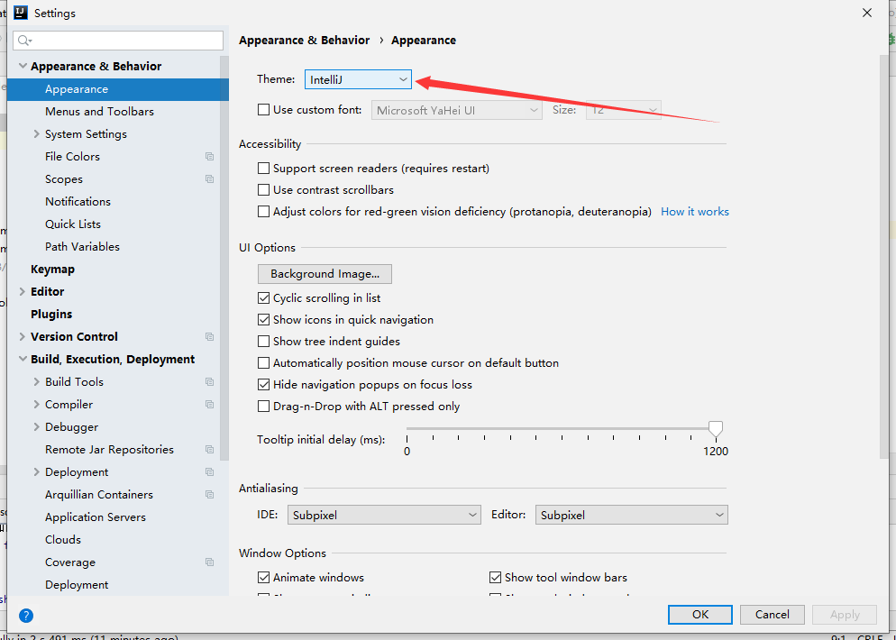
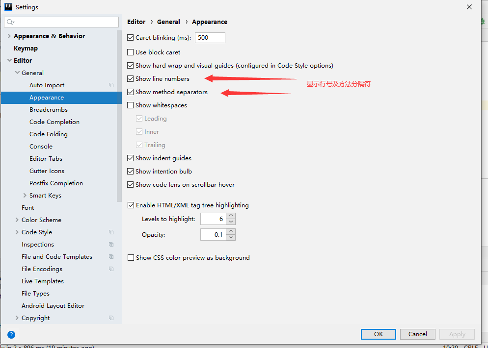
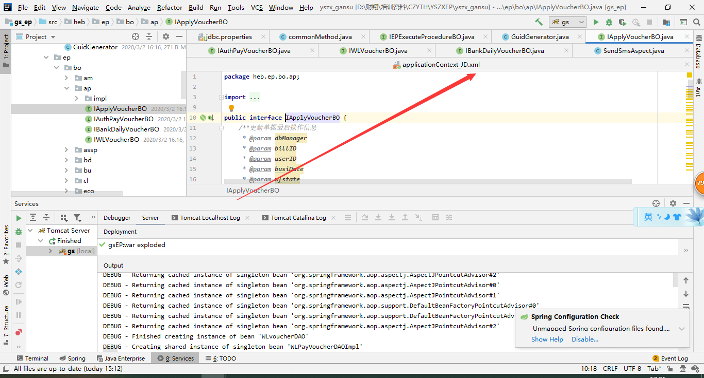
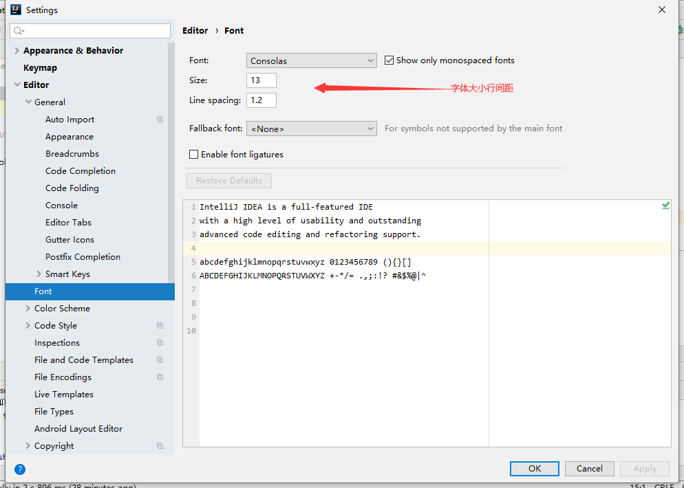
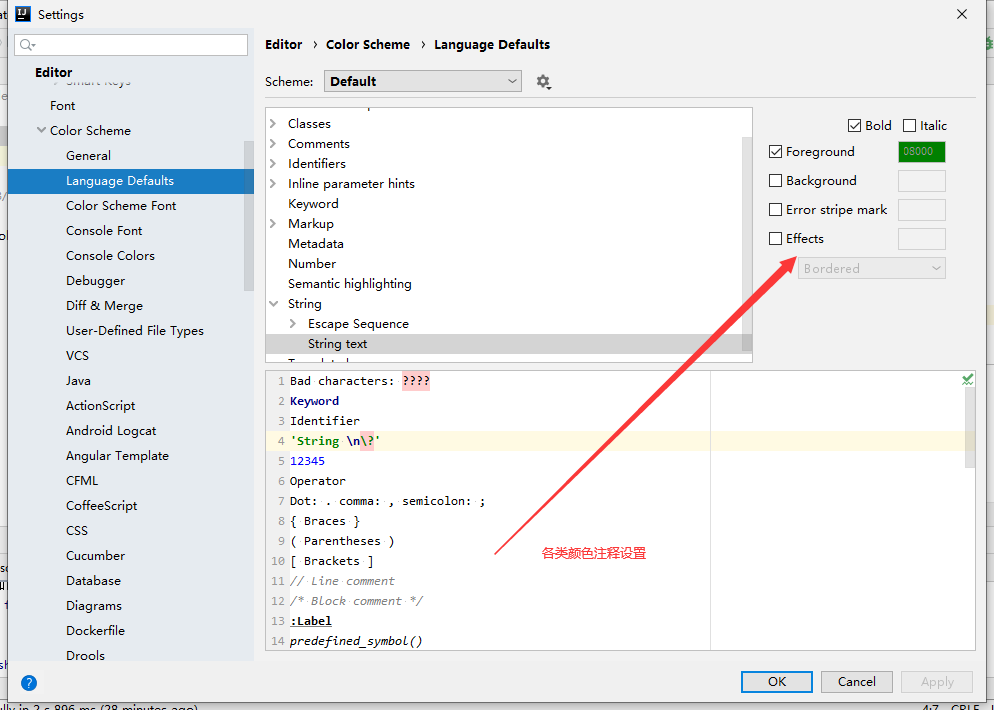
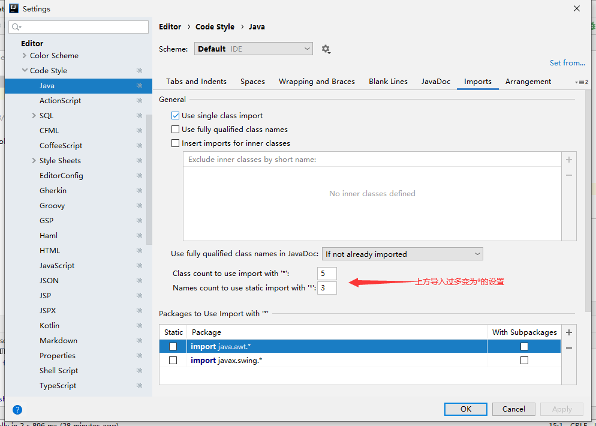
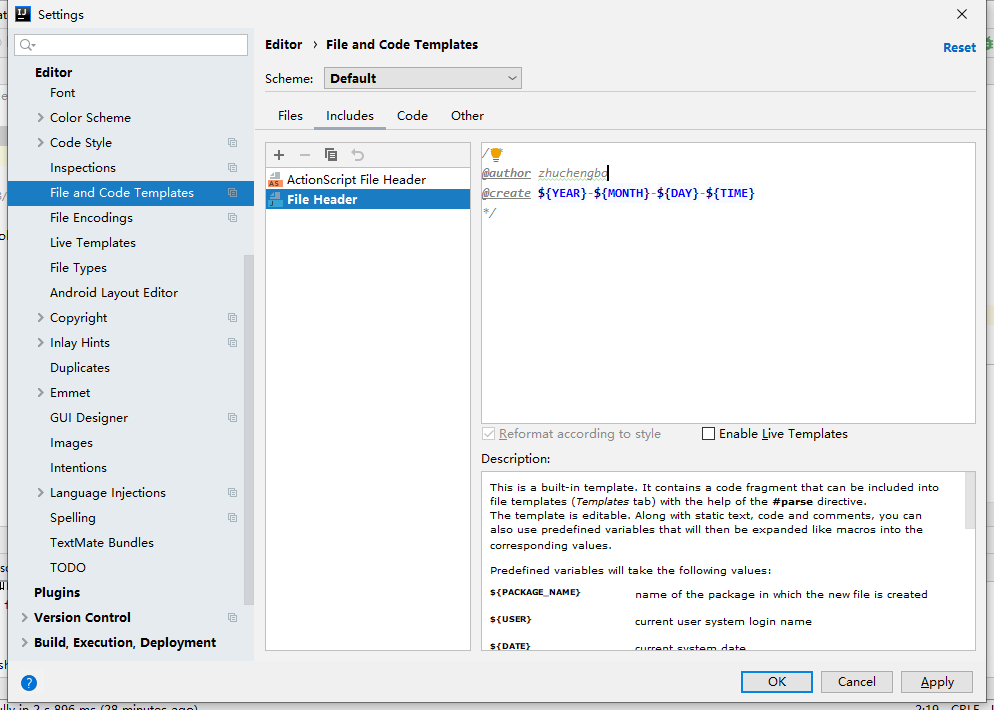
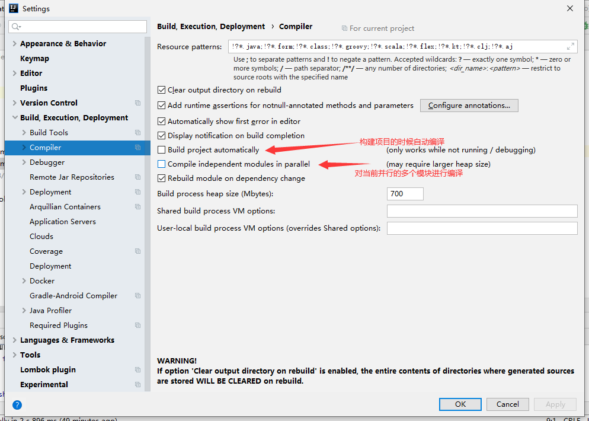
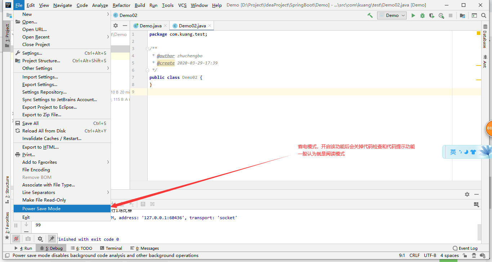
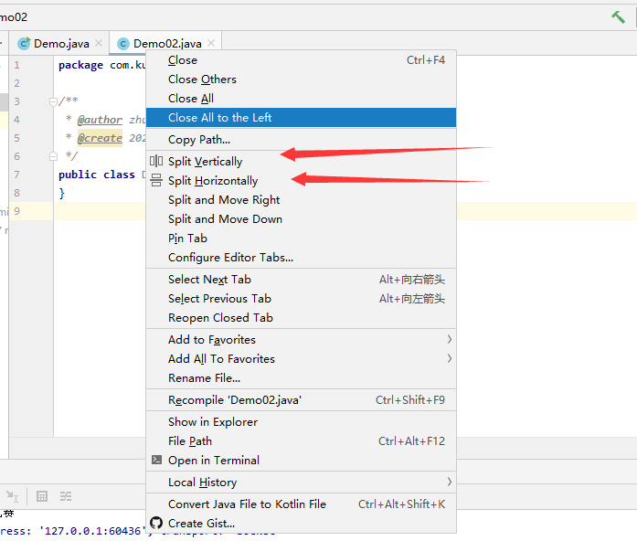

[IDEA基本使用——常用设置](https://www.cnblogs.com/zhuchengbo/p/12594664.html)

### 4.1、设置主题



### 4.2、添加更多主题

http://www.riaway.com/

#### 4.2.1、右键Import Settings导入jar包

#### 4.2.2、


#### 4.2.3、还可通过插件的方式更换主题

### 4.3、鼠标放上时显示一些关于类的介绍


### 4.4、自动导包


### 4.5、显示行号及方法分隔符



### 4.6、书写代码时，不区分大小写提示


### 4.7、上面实现类过多换行显示




### 4.8、字体大小行间距



### 4.9、各类额色注程设置



### 4.10、上方导入过多变为*的设置



### 4.11、设置创建项目时自动生成作者信息



新建项目时自动出现

```java
/**
 * @author zhuchengbo
 * @create 2020-03-29-17:39
 */
```

### 4.12、设置编码集


### 4.13、设置自动编译



手动对项目进行编译


编译可以用来检查代码对错

### 4.14、如果开发中遇到突然代码文件不能检查提示，来这看看



### 4.15、代码摆放水平和垂直

