# 超详细！4小时开发一个SpringBoot+vue前后端分离博客项目！！

> 作者：吕一明
>
> 项目代码：[github.com/MarkerHub/v…](https://github.com/MarkerHub/vueblog)
>
> 项目视频：[www.bilibili.com/video/BV1PQ…](https://www.bilibili.com/video/BV1PQ4y1P7hZ/)
>
> 转载请保留此引用，感谢！

**推荐阅读：**

[分享一套SpringBoot开发博客系统源码，以及完整开发文档！速度保存！](https://mp.weixin.qq.com/s/jz6e977xP-OyaAKNjNca8w)

[Github上最值得学习的100个Java开源项目，涵盖各种技术栈！](https://mp.weixin.qq.com/s/N-U0TaEUXnBFfBsmt_OESQ)

[2020年最新的常问企业面试题大全以及答案](https://mp.weixin.qq.com/s/lR5LC5GnD2Gs59ecV5R0XA)

## 前后端分离项目

文章总体分为2大部分，Java后端接口和vue前端页面，比较长，因为不想分开发布，真正想你4小时学会，哈哈。

先看效果：


不多说，开始敲代码。

## Java后端接口开发

### 1、前言

从零开始搭建一个项目骨架，最好选择合适，熟悉的技术，并且在未来易拓展，适合微服务化体系等。所以一般以Springboot作为我们的框架基础，这是离不开的了。

然后数据层，我们常用的是Mybatis，易上手，方便维护。但是单表操作比较困难，特别是添加字段或减少字段的时候，比较繁琐，所以这里我推荐使用Mybatis Plus（[mp.baomidou.com/），为简化开发而生，只…](https://mp.baomidou.com/），为简化开发而生，只需简单配置，即可快速进行) CRUD 操作，从而节省大量时间。

作为一个项目骨架，权限也是我们不能忽略的，Shiro配置简单，使用也简单，所以使用Shiro作为我们的的权限。

考虑到项目可能需要部署多台，这时候我们的会话等信息需要共享，Redis是现在主流的缓存中间件，也适合我们的项目。

然后因为前后端分离，所以我们使用jwt作为我们用户身份凭证。

ok，我们现在就开始搭建我们的项目脚手架！

技术栈：

- SpringBoot
- mybatis plus
- shiro
- lombok
- redis
- hibernate validatior
- jwt

导图：[www.markerhub.com/map/131](https://www.markerhub.com/map/131)

### 2、新建Springboot项目

这里，我们使用IDEA来开发我们项目，新建步骤比较简单，我们就不截图了。

开发工具与环境：

- idea
- mysql
- jdk 8
- maven3.3.9

新建好的项目结构如下，SpringBoot版本使用的目前最新的2.2.6.RELEASE版本


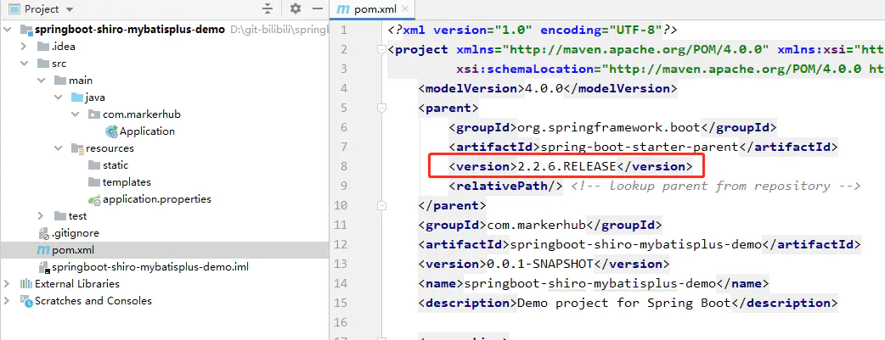


pom的jar包导入如下：

```
<dependency>
	<groupId>org.springframework.boot</groupId>
	<artifactId>spring-boot-starter-web</artifactId>
</dependency>
<dependency>
	<groupId>org.springframework.boot</groupId>
	<artifactId>spring-boot-devtools</artifactId>
	<scope>runtime</scope>
	<optional>true</optional>
</dependency>
<dependency>
	<groupId>org.projectlombok</groupId>
	<artifactId>lombok</artifactId>
	<optional>true</optional>
</dependency>
复制代码
```

- devtools：项目的热加载重启插件
- lombok：简化代码的工具

### 3、整合mybatis plus

接下来，我们来整合mybatis plus，让项目能完成基本的增删改查操作。步骤很简单：可以去官网看看：[mp.baomidou.com/guide/insta…](https://mp.baomidou.com/guide/install.html)

**第一步：导入jar包**

pom中导入mybatis plus的jar包，因为后面会涉及到代码生成，所以我们还需要导入页面模板引擎，这里我们用的是freemarker。

```
<!--mp-->
<dependency>
    <groupId>com.baomidou</groupId>
    <artifactId>mybatis-plus-boot-starter</artifactId>
    <version>3.2.0</version>
</dependency>
<dependency>
    <groupId>org.springframework.boot</groupId>
    <artifactId>spring-boot-starter-freemarker</artifactId>
</dependency>
<dependency>
    <groupId>mysql</groupId>
    <artifactId>mysql-connector-java</artifactId>
    <scope>runtime</scope>
</dependency>
<!--mp代码生成器-->
<dependency>
    <groupId>com.baomidou</groupId>
    <artifactId>mybatis-plus-generator</artifactId>
    <version>3.2.0</version>
</dependency>
复制代码
```

**第二步：然后去写配置文件**

```
# DataSource Config
spring:
  datasource:
    driver-class-name: com.mysql.cj.jdbc.Driver
    url: jdbc:mysql://localhost:3306/vueblog?useUnicode=true&useSSL=false&characterEncoding=utf8&serverTimezone=Asia/Shanghai
    username: root
    password: admin
mybatis-plus:
  mapper-locations: classpath*:/mapper/**Mapper.xml
复制代码
```

上面除了配置数据库的信息，还配置了myabtis plus的mapper的xml文件的扫描路径，这一步不要忘记了。 **第三步：开启mapper接口扫描，添加分页插件**

新建一个包：通过@mapperScan注解指定要变成实现类的接口所在的包，然后包下面的所有接口在编译之后都会生成相应的实现类。PaginationInterceptor是一个分页插件。

- com.markerhub.config.MybatisPlusConfig

```
@Configuration
@EnableTransactionManagement
@MapperScan("com.markerhub.mapper")
public class MybatisPlusConfig {
    @Bean
    public PaginationInterceptor paginationInterceptor() {
        PaginationInterceptor paginationInterceptor = new PaginationInterceptor();
        return paginationInterceptor;
    }
}
复制代码
```

**第四步：代码生成**

如果你没再用其他插件，那么现在就已经可以使用mybatis plus了，官方给我们提供了一个代码生成器，然后我写上自己的参数之后，就可以直接根据数据库表信息生成entity、service、mapper等接口和实现类。

- com.markerhub.CodeGenerator

因为代码比较长，就不贴出来了，在代码仓库上看哈！

首先我在数据库中新建了一个user表：

```
CREATE TABLE `m_user` (
  `id` bigint(20) NOT NULL AUTO_INCREMENT,
  `username` varchar(64) DEFAULT NULL,
  `avatar` varchar(255) DEFAULT NULL,
  `email` varchar(64) DEFAULT NULL,
  `password` varchar(64) DEFAULT NULL,
  `status` int(5) NOT NULL,
  `created` datetime DEFAULT NULL,
  `last_login` datetime DEFAULT NULL,
  PRIMARY KEY (`id`),
  KEY `UK_USERNAME` (`username`) USING BTREE
) ENGINE=InnoDB DEFAULT CHARSET=utf8;
CREATE TABLE `m_blog` (
  `id` bigint(20) NOT NULL AUTO_INCREMENT,
  `user_id` bigint(20) NOT NULL,
  `title` varchar(255) NOT NULL,
  `description` varchar(255) NOT NULL,
  `content` longtext,
  `created` datetime NOT NULL ON UPDATE CURRENT_TIMESTAMP,
  `status` tinyint(4) DEFAULT NULL,
  PRIMARY KEY (`id`)
) ENGINE=InnoDB AUTO_INCREMENT=11 DEFAULT CHARSET=utf8mb4;
INSERT INTO `vueblog`.`m_user` (`id`, `username`, `avatar`, `email`, `password`, `status`, `created`, `last_login`) VALUES ('1', 'markerhub', 'https://image-1300566513.cos.ap-guangzhou.myqcloud.com/upload/images/5a9f48118166308daba8b6da7e466aab.jpg', NULL, '96e79218965eb72c92a549dd5a330112', '0', '2020-04-20 10:44:01', NULL);
复制代码
```

运行CodeGenerator的main方法，输入表名：m_user，生成结果如下：

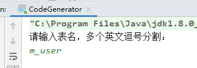


得到：


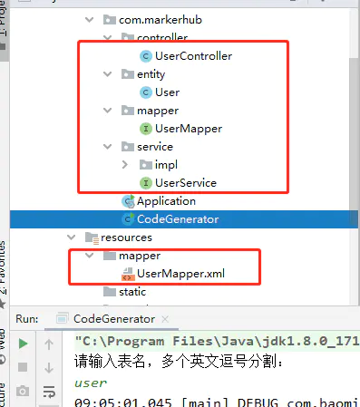


简洁！方便！经过上面的步骤，基本上我们已经把mybatis plus框架集成到项目中了。

ps：额，注意一下m_blog表的代码也生成一下哈。

在UserController中写个测试：

```
@RestController
@RequestMapping("/user")
public class UserController {
    @Autowired
    UserService userService;
    @GetMapping("/{id}")
    public Object test(@PathVariable("id") Long id) {
        return userService.getById(id);
    }
}
复制代码
```

访问：http://localhost:8080/user/1 获得结果如下，整合成功！

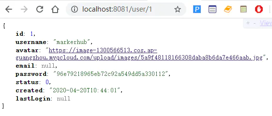


### 3、统一结果封装

这里我们用到了一个Result的类，这个用于我们的异步统一返回的结果封装。一般来说，结果里面有几个要素必要的

- 是否成功，可用code表示（如200表示成功，400表示异常）
- 结果消息
- 结果数据

所以可得到封装如下：

- com.markerhub.common.lang.Result

```
@Data
public class Result implements Serializable {
    private String code;
    private String msg;
    private Object data;
    public static Result succ(Object data) {
        Result m = new Result();
        m.setCode("0");
        m.setData(data);
        m.setMsg("操作成功");
        return m;
    }
    public static Result succ(String mess, Object data) {
        Result m = new Result();
        m.setCode("0");
        m.setData(data);
        m.setMsg(mess);
        return m;
    }
    public static Result fail(String mess) {
        Result m = new Result();
        m.setCode("-1");
        m.setData(null);
        m.setMsg(mess);
        return m;
    }
    public static Result fail(String mess, Object data) {
        Result m = new Result();
        m.setCode("-1");
        m.setData(data);
        m.setMsg(mess);
        return m;
    }
}
复制代码
```

### 4、整合shiro+jwt，并会话共享

考虑到后面可能需要做集群、负载均衡等，所以就需要会话共享，而shiro的缓存和会话信息，我们一般考虑使用redis来存储这些数据，所以，我们不仅仅需要整合shiro，同时也需要整合redis。在开源的项目中，我们找到了一个starter可以快速整合shiro-redis，配置简单，这里也推荐大家使用。

而因为我们需要做的是前后端分离项目的骨架，所以一般我们会采用token或者jwt作为跨域身份验证解决方案。所以整合shiro的过程中，我们需要引入jwt的身份验证过程。

那么我们就开始整合：

我们使用一个shiro-redis-spring-boot-starter的jar包，具体教程可以看官方文档：[github.com/alexxiyang/…](https://github.com/alexxiyang/shiro-redis/blob/master/docs/README.md#spring-boot-starter)

第一步：导入shiro-redis的starter包：还有jwt的工具包，以及为了简化开发，我引入了hutool工具包。

```
<dependency>
    <groupId>org.crazycake</groupId>
    <artifactId>shiro-redis-spring-boot-starter</artifactId>
    <version>3.2.1</version>
</dependency>
<!-- hutool工具类-->
<dependency>
    <groupId>cn.hutool</groupId>
    <artifactId>hutool-all</artifactId>
    <version>5.3.3</version>
</dependency>
<!-- jwt -->
<dependency>
    <groupId>io.jsonwebtoken</groupId>
    <artifactId>jjwt</artifactId>
    <version>0.9.1</version>
</dependency>
复制代码
```

第二步：编写配置：

#### ShiroConfig

- com.markerhub.config.ShiroConfig

```
/**
 * shiro启用注解拦截控制器
 */
@Configuration
public class ShiroConfig {
    @Autowired
    JwtFilter jwtFilter;
    @Bean
    public SessionManager sessionManager(RedisSessionDAO redisSessionDAO) {
        DefaultWebSessionManager sessionManager = new DefaultWebSessionManager();
        sessionManager.setSessionDAO(redisSessionDAO);
        return sessionManager;
    }
    @Bean
    public DefaultWebSecurityManager securityManager(AccountRealm accountRealm,
                                                     SessionManager sessionManager,
                                                     RedisCacheManager redisCacheManager) {
        DefaultWebSecurityManager securityManager = new DefaultWebSecurityManager(accountRealm);
        securityManager.setSessionManager(sessionManager);
        securityManager.setCacheManager(redisCacheManager);
        /*
         * 关闭shiro自带的session，详情见文档
         */
        DefaultSubjectDAO subjectDAO = new DefaultSubjectDAO();
        DefaultSessionStorageEvaluator defaultSessionStorageEvaluator = new DefaultSessionStorageEvaluator();
        defaultSessionStorageEvaluator.setSessionStorageEnabled(false);
        subjectDAO.setSessionStorageEvaluator(defaultSessionStorageEvaluator);
        securityManager.setSubjectDAO(subjectDAO);
        return securityManager;
    }
    @Bean
    public ShiroFilterChainDefinition shiroFilterChainDefinition() {
        DefaultShiroFilterChainDefinition chainDefinition = new DefaultShiroFilterChainDefinition();
        Map<String, String> filterMap = new LinkedHashMap<>();
        filterMap.put("/**", "jwt"); // 主要通过注解方式校验权限
        chainDefinition.addPathDefinitions(filterMap);
        return chainDefinition;
    }
    @Bean("shiroFilterFactoryBean")
    public ShiroFilterFactoryBean shiroFilterFactoryBean(SecurityManager securityManager,
                                                         ShiroFilterChainDefinition shiroFilterChainDefinition) {
        ShiroFilterFactoryBean shiroFilter = new ShiroFilterFactoryBean();
        shiroFilter.setSecurityManager(securityManager);
        Map<String, Filter> filters = new HashMap<>();
        filters.put("jwt", jwtFilter);
        shiroFilter.setFilters(filters);
        Map<String, String> filterMap = shiroFilterChainDefinition.getFilterChainMap();
        shiroFilter.setFilterChainDefinitionMap(filterMap);
        return shiroFilter;
    }

    // 开启注解代理（默认好像已经开启，可以不要）
    @Bean
    public AuthorizationAttributeSourceAdvisor authorizationAttributeSourceAdvisor(SecurityManager securityManager){
        AuthorizationAttributeSourceAdvisor authorizationAttributeSourceAdvisor = new AuthorizationAttributeSourceAdvisor();
        authorizationAttributeSourceAdvisor.setSecurityManager(securityManager);
        return authorizationAttributeSourceAdvisor;
    }
    @Bean
    public static DefaultAdvisorAutoProxyCreator getDefaultAdvisorAutoProxyCreator() {
        DefaultAdvisorAutoProxyCreator creator = new DefaultAdvisorAutoProxyCreator();
        return creator;
    }
}
复制代码
```

上面ShiroConfig，我们主要做了几件事情：

1. 引入RedisSessionDAO和RedisCacheManager，为了解决shiro的权限数据和会话信息能保存到redis中，实现会话共享。
2. 重写了SessionManager和DefaultWebSecurityManager，同时在DefaultWebSecurityManager中为了关闭shiro自带的session方式，我们需要设置为false，这样用户就不再能通过session方式登录shiro。后面将采用jwt凭证登录。
3. 在ShiroFilterChainDefinition中，我们不再通过编码形式拦截Controller访问路径，而是所有的路由都需要经过JwtFilter这个过滤器，然后判断请求头中是否含有jwt的信息，有就登录，没有就跳过。跳过之后，有Controller中的shiro注解进行再次拦截，比如@RequiresAuthentication，这样控制权限访问。

那么，接下来，我们聊聊ShiroConfig中出现的AccountRealm，还有JwtFilter。

#### AccountRealm

AccountRealm是shiro进行登录或者权限校验的逻辑所在，算是核心了，我们需要重写3个方法，分别是

- supports：为了让realm支持jwt的凭证校验
- doGetAuthorizationInfo：权限校验
- doGetAuthenticationInfo：登录认证校验

我们先来总体看看AccountRealm的代码，然后逐个分析：

- com.markerhub.shiro.AccountRealm

```
@Slf4j
@Component
public class AccountRealm extends AuthorizingRealm {
    @Autowired
    JwtUtils jwtUtils;
    @Autowired
    UserService userService;
    @Override
    public boolean supports(AuthenticationToken token) {
        return token instanceof JwtToken;
    }
    @Override
    protected AuthorizationInfo doGetAuthorizationInfo(PrincipalCollection principals) {
        return null;
    }
    @Override
    protected AuthenticationInfo doGetAuthenticationInfo(AuthenticationToken token) throws AuthenticationException {
        JwtToken jwt = (JwtToken) token;
        log.info("jwt----------------->{}", jwt);
        String userId = jwtUtils.getClaimByToken((String) jwt.getPrincipal()).getSubject();
        User user = userService.getById(Long.parseLong(userId));
        if(user == null) {
            throw new UnknownAccountException("账户不存在！");
        }
        if(user.getStatus() == -1) {
            throw new LockedAccountException("账户已被锁定！");
        }
        AccountProfile profile = new AccountProfile();
        BeanUtil.copyProperties(user, profile);
        log.info("profile----------------->{}", profile.toString());
        return new SimpleAuthenticationInfo(profile, jwt.getCredentials(), getName());
    }
}
复制代码
```

其实主要就是doGetAuthenticationInfo登录认证这个方法，可以看到我们通过jwt获取到用户信息，判断用户的状态，最后异常就抛出对应的异常信息，否者封装成SimpleAuthenticationInfo返回给shiro。 接下来我们逐步分析里面出现的新类：

1、shiro默认supports的是UsernamePasswordToken，而我们现在采用了jwt的方式，所以这里我们自定义一个JwtToken，来完成shiro的supports方法。

#### JwtToken

- com.markerhub.shiro.JwtToken

```
public class JwtToken implements AuthenticationToken {
    private String token;
    public JwtToken(String token) {
        this.token = token;
    }
    @Override
    public Object getPrincipal() {
        return token;
    }
    @Override
    public Object getCredentials() {
        return token;
    }
}
复制代码
```

2、JwtUtils是个生成和校验jwt的工具类，其中有些jwt相关的密钥信息是从项目配置文件中配置的：

```
@Component
@ConfigurationProperties(prefix = "markerhub.jwt")
public class JwtUtils {
    private String secret;
    private long expire;
    private String header;
    /**
     * 生成jwt token
     */
    public String generateToken(long userId) {
    ...
    }
    
    // 获取jwt的信息
    public Claims getClaimByToken(String token) {
    ...
    }
    
    /**
     * token是否过期
     * @return  true：过期
     */
    public boolean isTokenExpired(Date expiration) {
        return expiration.before(new Date());
    }
}
复制代码
```

3、而在AccountRealm我们还用到了AccountProfile，这是为了登录成功之后返回的一个用户信息的载体，

#### AccountProfile

- com.markerhub.shiro.AccountProfile

```
@Data
public class AccountProfile implements Serializable {
    private Long id;
    private String username;
    private String avatar;
}
复制代码
```

第三步，ok，基本的校验的路线完成之后，我们需要少量的基本信息配置：

```
shiro-redis:
  enabled: true
  redis-manager:
    host: 127.0.0.1:6379
markerhub:
  jwt:
    # 加密秘钥
    secret: f4e2e52034348f86b67cde581c0f9eb5
    # token有效时长，7天，单位秒
    expire: 604800
    header: token
复制代码
```

第四步：另外，如果你项目有使用spring-boot-devtools，需要添加一个配置文件，在resources目录下新建文件夹META-INF，然后新建文件spring-devtools.properties，这样热重启时候才不会报错。

- resources/META-INF/spring-devtools.properties

```
restart.include.shiro-redis=/shiro-[\\w-\\.]+jar
复制代码
```


#### JwtFilter

第五步：定义jwt的过滤器JwtFilter。

这个过滤器是我们的重点，这里我们继承的是Shiro内置的AuthenticatingFilter，一个可以内置了可以自动登录方法的的过滤器，有些同学继承BasicHttpAuthenticationFilter也是可以的。

我们需要重写几个方法：

1. createToken：实现登录，我们需要生成我们自定义支持的JwtToken
2. onAccessDenied：拦截校验，当头部没有Authorization时候，我们直接通过，不需要自动登录；当带有的时候，首先我们校验jwt的有效性，没问题我们就直接执行executeLogin方法实现自动登录
3. onLoginFailure：登录异常时候进入的方法，我们直接把异常信息封装然后抛出
4. preHandle：拦截器的前置拦截，因为我们是前后端分析项目，项目中除了需要跨域全局配置之外，我们再拦截器中也需要提供跨域支持。这样，拦截器才不会在进入Controller之前就被限制了。

下面我们看看总体的代码：

- com.markerhub.shiro.JwtFilter

```
@Component
public class JwtFilter extends AuthenticatingFilter {
    @Autowired
    JwtUtils jwtUtils;
    @Override
    protected AuthenticationToken createToken(ServletRequest servletRequest, ServletResponse servletResponse) throws Exception {
        // 获取 token
        HttpServletRequest request = (HttpServletRequest) servletRequest;
        String jwt = request.getHeader("Authorization");
        if(StringUtils.isEmpty(jwt)){
            return null;
        }
        return new JwtToken(jwt);
    }
    @Override
    protected boolean onAccessDenied(ServletRequest servletRequest, ServletResponse servletResponse) throws Exception {
        HttpServletRequest request = (HttpServletRequest) servletRequest;
        String token = request.getHeader("Authorization");
        if(StringUtils.isEmpty(token)) {
            return true;
        } else {
            // 判断是否已过期
            Claims claim = jwtUtils.getClaimByToken(token);
            if(claim == null || jwtUtils.isTokenExpired(claim.getExpiration())) {
                throw new ExpiredCredentialsException("token已失效，请重新登录！");
            }
        }
        // 执行自动登录
        return executeLogin(servletRequest, servletResponse);
    }
    @Override
    protected boolean onLoginFailure(AuthenticationToken token, AuthenticationException e, ServletRequest request, ServletResponse response) {
        HttpServletResponse httpResponse = (HttpServletResponse) response;
        try {
            //处理登录失败的异常
            Throwable throwable = e.getCause() == null ? e : e.getCause();
            Result r = Result.fail(throwable.getMessage());
            String json = JSONUtil.toJsonStr(r);
            httpResponse.getWriter().print(json);
        } catch (IOException e1) {
        }
        return false;
    }
    /**
     * 对跨域提供支持
     */
    @Override
    protected boolean preHandle(ServletRequest request, ServletResponse response) throws Exception {
        HttpServletRequest httpServletRequest = WebUtils.toHttp(request);
        HttpServletResponse httpServletResponse = WebUtils.toHttp(response);
        httpServletResponse.setHeader("Access-control-Allow-Origin", httpServletRequest.getHeader("Origin"));
        httpServletResponse.setHeader("Access-Control-Allow-Methods", "GET,POST,OPTIONS,PUT,DELETE");
        httpServletResponse.setHeader("Access-Control-Allow-Headers", httpServletRequest.getHeader("Access-Control-Request-Headers"));
        // 跨域时会首先发送一个OPTIONS请求，这里我们给OPTIONS请求直接返回正常状态
        if (httpServletRequest.getMethod().equals(RequestMethod.OPTIONS.name())) {
            httpServletResponse.setStatus(org.springframework.http.HttpStatus.OK.value());
            return false;
        }
        return super.preHandle(request, response);
    }
}
复制代码
```

那么到这里，我们的shiro就已经完成整合进来了，并且使用了jwt进行身份校验。

### 5、异常处理

有时候不可避免服务器报错的情况，如果不配置异常处理机制，就会默认返回tomcat或者nginx的5XX页面，对普通用户来说，不太友好，用户也不懂什么情况。这时候需要我们程序员设计返回一个友好简单的格式给前端。

处理办法如下：通过使用@ControllerAdvice来进行统一异常处理，@ExceptionHandler(value = RuntimeException.class)来指定捕获的Exception各个类型异常 ，这个异常的处理，是全局的，所有类似的异常，都会跑到这个地方处理。

- com.markerhub.common.exception.GlobalExceptionHandler

步骤二、定义全局异常处理，@ControllerAdvice表示定义全局控制器异常处理，@ExceptionHandler表示针对性异常处理，可对每种异常针对性处理。

```
/**
 * 全局异常处理
 */
@Slf4j
@RestControllerAdvice
public class GlobalExcepitonHandler {
    // 捕捉shiro的异常
    @ResponseStatus(HttpStatus.UNAUTHORIZED)
    @ExceptionHandler(ShiroException.class)
    public Result handle401(ShiroException e) {
        return Result.fail(401, e.getMessage(), null);
    }
    /**
     * 处理Assert的异常
     */
    @ResponseStatus(HttpStatus.BAD_REQUEST)
    @ExceptionHandler(value = IllegalArgumentException.class)
    public Result handler(IllegalArgumentException e) throws IOException {
        log.error("Assert异常:-------------->{}",e.getMessage());
        return Result.fail(e.getMessage());
    }
    /**
     * @Validated 校验错误异常处理
     */
    @ResponseStatus(HttpStatus.BAD_REQUEST)
    @ExceptionHandler(value = MethodArgumentNotValidException.class)
    public Result handler(MethodArgumentNotValidException e) throws IOException {
        log.error("运行时异常:-------------->",e);
        BindingResult bindingResult = e.getBindingResult();
        ObjectError objectError = bindingResult.getAllErrors().stream().findFirst().get();
        return Result.fail(objectError.getDefaultMessage());
    }

    @ResponseStatus(HttpStatus.BAD_REQUEST)
    @ExceptionHandler(value = RuntimeException.class)
    public Result handler(RuntimeException e) throws IOException {
        log.error("运行时异常:-------------->",e);
        return Result.fail(e.getMessage());
    }
}
复制代码
```

上面我们捕捉了几个异常：

- ShiroException：shiro抛出的异常，比如没有权限，用户登录异常
- IllegalArgumentException：处理Assert的异常
- MethodArgumentNotValidException：处理实体校验的异常
- RuntimeException：捕捉其他异常

### 6、实体校验

当我们表单数据提交的时候，前端的校验我们可以使用一些类似于jQuery Validate等js插件实现，而后端我们可以使用Hibernate validatior来做校验。

我们使用springboot框架作为基础，那么就已经自动集成了Hibernate validatior。

那么用起来啥样子的呢？

第一步：首先在实体的属性上添加对应的校验规则，比如：

```
@TableName("m_user")
public class User implements Serializable {
    private static final long serialVersionUID = 1L;
    @TableId(value = "id", type = IdType.AUTO)
    private Long id;
    @NotBlank(message = "昵称不能为空")
    private String username;
    @NotBlank(message = "邮箱不能为空")
    @Email(message = "邮箱格式不正确")
    private String email;
    
    ...
}
复制代码
```

第二步 ：这里我们使用@Validated注解方式，如果实体不符合要求，系统会抛出异常，那么我们的异常处理中就捕获到MethodArgumentNotValidException。

- com.markerhub.controller.UserController

```
/**
 * 测试实体校验
 * @param user
 * @return
 */
@PostMapping("/save")
public Object testUser(@Validated @RequestBody User user) {
    return user.toString();
}
复制代码
```

### 7、跨域问题

因为是前后端分析，所以跨域问题是避免不了的，我们直接在后台进行全局跨域处理：

- com.markerhub.config.CorsConfig

```
/**
 * 解决跨域问题
 */
@Configuration
public class CorsConfig implements WebMvcConfigurer {
    @Override
    public void addCorsMappings(CorsRegistry registry) {
        registry.addMapping("/**")
                .allowedOrigins("*")
                .allowedMethods("GET", "HEAD", "POST", "PUT", "DELETE", "OPTIONS")
                .allowCredentials(true)
                .maxAge(3600)
                .allowedHeaders("*");
    }
}
复制代码
```

ok，因为我们系统开发的接口比较简单，所以我就不集成swagger2啦，也比较简单而已。下面我们就直接进入我们的正题，进行编写登录接口。

### 8、登录接口开发

登录的逻辑其实很简答，只需要接受账号密码，然后把用户的id生成jwt，返回给前段，为了后续的jwt的延期，所以我们把jwt放在header上。具体代码如下：

- com.markerhub.controller.AccountController

```
@RestController
public class AccountController {
    @Autowired
    JwtUtils jwtUtils;
    @Autowired
    UserService userService;
    /**
     * 默认账号密码：markerhub / 111111
     *
     */
    @CrossOrigin
    @PostMapping("/login")
    public Result login(@Validated @RequestBody LoginDto loginDto, HttpServletResponse response) {
        User user = userService.getOne(new QueryWrapper<User>().eq("username", loginDto.getUsername()));
        Assert.notNull(user, "用户不存在");
        if(!user.getPassword().equals(SecureUtil.md5(loginDto.getPassword()))) {
            return Result.fail("密码错误！");
        }
        String jwt = jwtUtils.generateToken(user.getId());
        response.setHeader("Authorization", jwt);
        response.setHeader("Access-Control-Expose-Headers", "Authorization");
        // 用户可以另一个接口
        return Result.succ(MapUtil.builder()
                .put("id", user.getId())
                .put("username", user.getUsername())
                .put("avatar", user.getAvatar())
                .put("email", user.getEmail())
                .map()
        );
    }
    
    // 退出
    @GetMapping("/logout")
    @RequiresAuthentication
    public Result logout() {
        SecurityUtils.getSubject().logout();
        return Result.succ(null);
    }
}
复制代码
```

接口测试：


### 9、博客接口开发

我们的骨架已经完成，接下来，我们就可以添加我们的业务接口了，下面我以一个简单的博客列表、博客详情页为例子开发：

- com.markerhub.controller.BlogController

```
@RestController
public class BlogController {
    @Autowired
    BlogService blogService;
    @GetMapping("/blogs")
    public Result blogs(Integer currentPage) {
        if(currentPage == null || currentPage < 1) currentPage = 1;
        Page page = new Page(currentPage, 5)
        IPage pageData = blogService.page(page, new QueryWrapper<Blog>().orderByDesc("created"));
        return Result.succ(pageData);
    }
    @GetMapping("/blog/{id}")
    public Result detail(@PathVariable(name = "id") Long id) {
        Blog blog = blogService.getById(id);
        Assert.notNull(blog, "该博客已删除！");
        return Result.succ(blog);
    }
    
    @RequiresAuthentication
@PostMapping("/blog/edit")
public Result edit(@Validated @RequestBody Blog blog) {
    System.out.println(blog.toString());
    Blog temp = null;
    if(blog.getId() != null) {
        temp = blogService.getById(blog.getId());
        Assert.isTrue(temp.getUserId() == ShiroUtil.getProfile().getId(), "没有权限编辑");
    } else {
        temp = new Blog();
        temp.setUserId(ShiroUtil.getProfile().getId());
        temp.setCreated(LocalDateTime.now());
        temp.setStatus(0);
    }
    BeanUtil.copyProperties(blog, temp, "id", "userId", "created", "status");
    blogService.saveOrUpdate(temp);
    return Result.succ("操作成功", null);
}
}
复制代码
```

注意@RequiresAuthentication说明需要登录之后才能访问的接口，其他需要权限的接口可以添加shiro的相关注解。 接口比较简单，我们就不多说了，基本增删改查而已。注意的是edit方法是需要登录才能操作的受限资源。

接口测试：


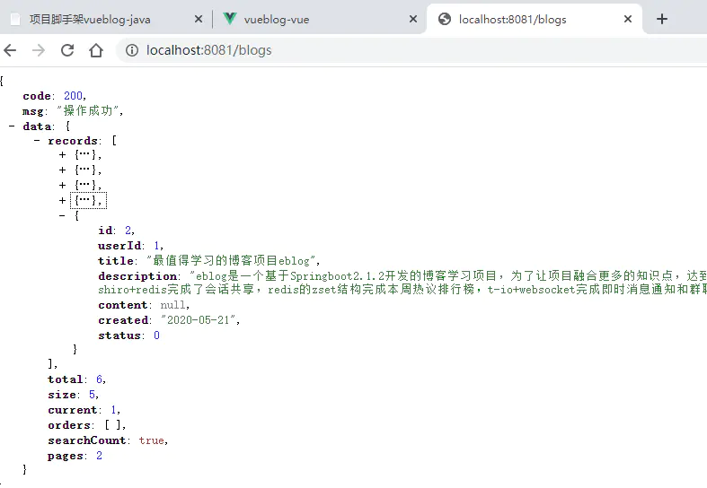


### 10、后端总结

好了，一篇文章搞定一个基本骨架，好像有点赶，但是基本的东西这里已经有了。后面我们就要去开发我们的前端接口了。

项目代码：[github.com/MarkerHub/v…](https://github.com/MarkerHub/vueblog)

项目视频：[www.bilibili.com/video/BV1PQ…](https://www.bilibili.com/video/BV1PQ4y1P7hZ/)

## Vue前端页面开发

### 1、前言

接下来，我们来完成vueblog前端的部分功能。可能会使用的到技术如下：

- vue
- element-ui
- axios
- mavon-editor
- markdown-it
- github-markdown-css

本项目实践需要一点点vue的基础，希望你对vue的一些指令有所了解，这样我们讲解起来就简单多了哈。

### 2、项目演示

我们先来看下我们需要完成的项目长什么样子，考虑到很多同学的样式的掌握程度不够，所以我尽量使用了element-ui的原生组件的样式来完成整个博客的界面。不多说，直接上图：

在线体验：[markerhub.com:8083](https://markerhub.com:8083/)


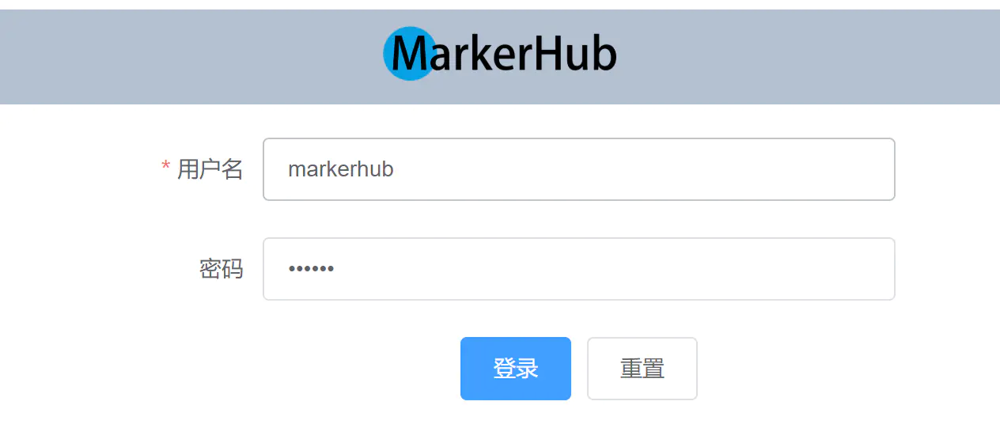


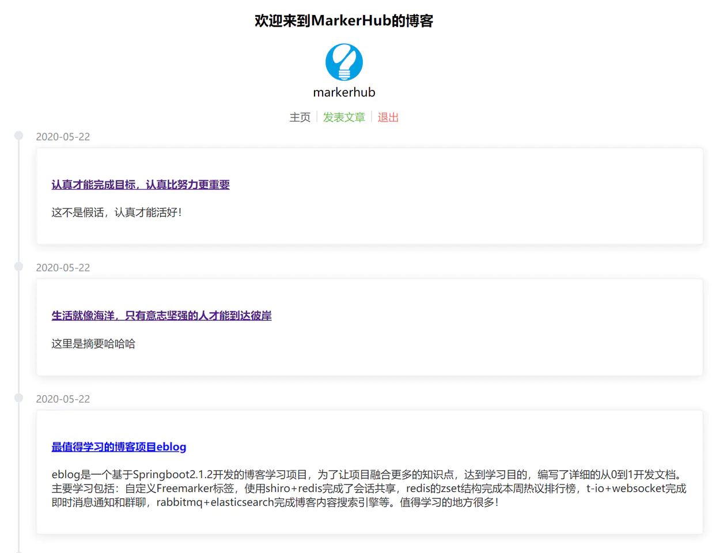


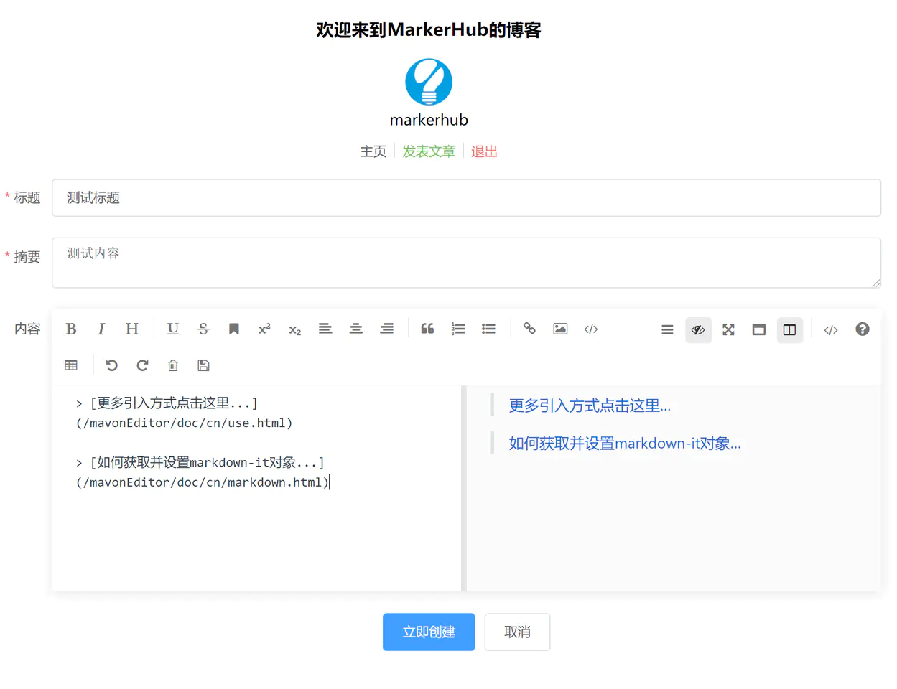


### 3、环境准备

万丈高楼平地起，我们下面一步一步来完成，首先我们安装vue的环境，我实践的环境是windows 10哈。

1、首先我们上node.js官网([nodejs.org/zh-cn/](https://nodejs.org/zh-cn/))，下载最新的长期版本，直接运行安装完成之后，我们就已经具备了node和npm的环境啦。


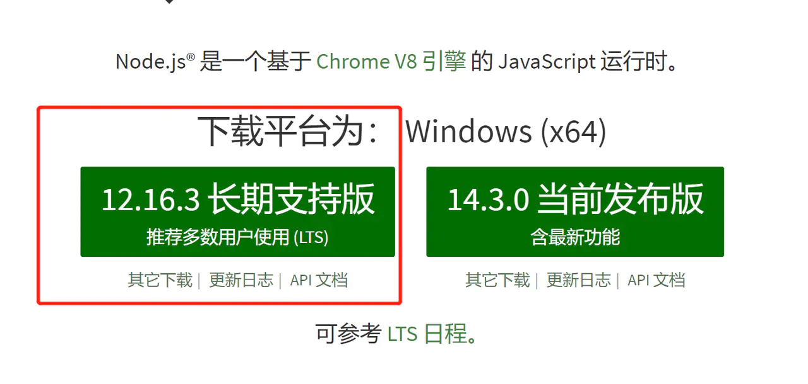


安装完成之后检查下版本信息：


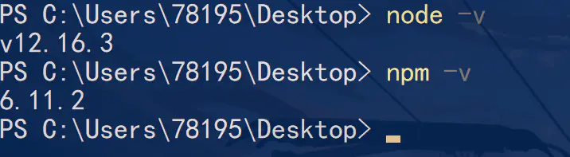


2、接下来，我们安装vue的环境

```
# 安装淘宝npm
npm install -g cnpm --registry=https://registry.npm.taobao.org
# vue-cli 安装依赖包
cnpm install --g vue-cli
复制代码
```

### 4、新建项目

```
# 打开vue的可视化管理工具界面
vue ui
复制代码
```

上面我们分别安装了淘宝npm，cnpm是为了提高我们安装依赖的速度。vue ui是@vue/cli3.0增加一个可视化项目管理工具，可以运行项目、打包项目，检查等操作。对于初学者来说，可以少记一些命令，哈哈。 3、创建vueblog-vue项目

运行vue ui之后，会为我们打开一个http://localhost:8080 的页面：


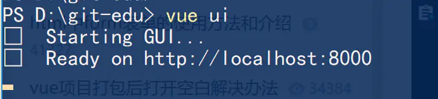


然后切换到【创建】，注意创建的目录最好是和你运行vue ui同一级。这样方便管理和切换。然后点击按钮【在此创建新羡慕】


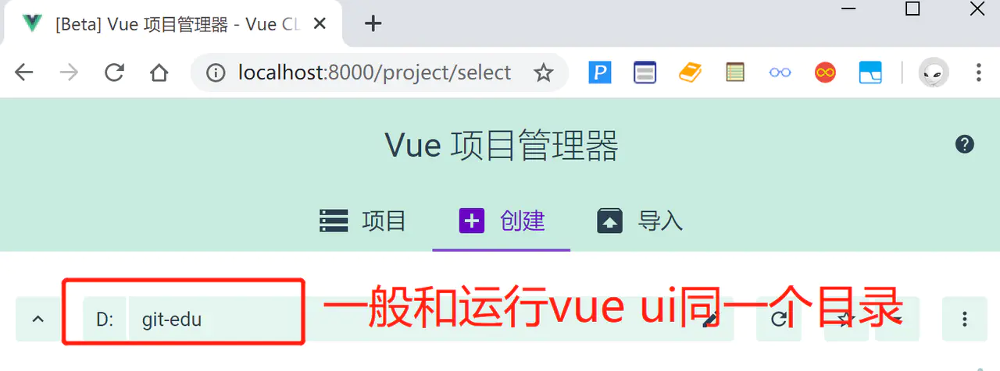


下一步中，项目文件夹中输入项目名称“vueblog-vue”，其他不用改，点击下一步，选择【手动】，再点击下一步，如图点击按钮，勾选上路由Router、状态管理Vuex，去掉js的校验。


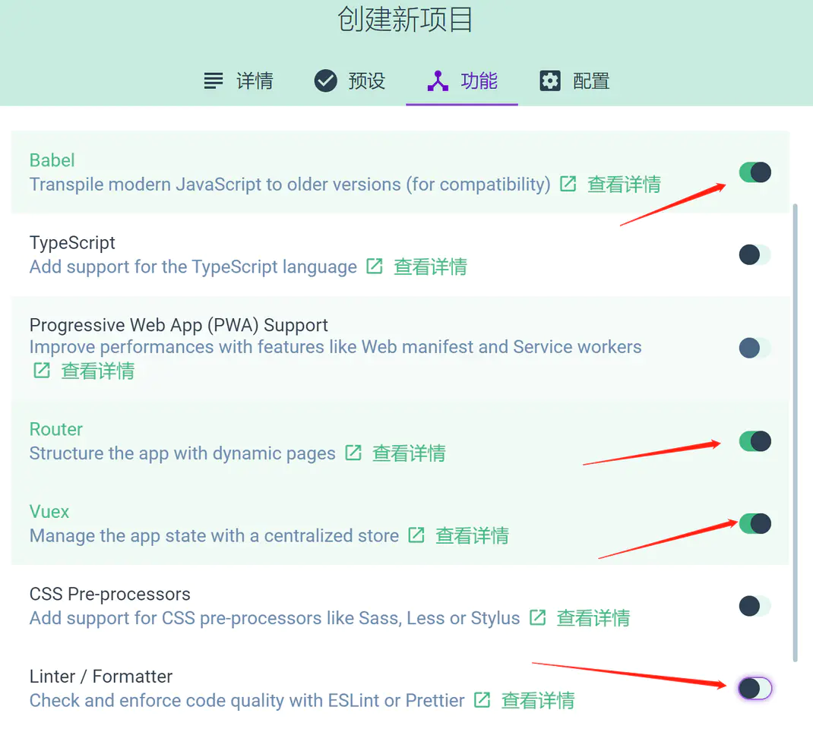


下一步中，也选上【Use history mode for router】，点击创建项目，然后弹窗中选择按钮【创建项目，不保存预设】，就进入项目创建啦。

稍等片刻之后，项目就初始化完成了。上面的步骤中，我们创建了一个vue项目，并且安装了Router、Vuex。这样我们后面就可以直接使用。

我们来看下整个vueblog-vue的项目结构

```
├── README.md            项目介绍
├── index.html           入口页面
├── build              构建脚本目录
│  ├── build-server.js         运行本地构建服务器，可以访问构建后的页面
│  ├── build.js            生产环境构建脚本
│  ├── dev-client.js          开发服务器热重载脚本，主要用来实现开发阶段的页面自动刷新
│  ├── dev-server.js          运行本地开发服务器
│  ├── utils.js            构建相关工具方法
│  ├── webpack.base.conf.js      wabpack基础配置
│  ├── webpack.dev.conf.js       wabpack开发环境配置
│  └── webpack.prod.conf.js      wabpack生产环境配置
├── config             项目配置
│  ├── dev.env.js           开发环境变量
│  ├── index.js            项目配置文件
│  ├── prod.env.js           生产环境变量
│  └── test.env.js           测试环境变量
├── mock              mock数据目录
│  └── hello.js
├── package.json          npm包配置文件，里面定义了项目的npm脚本，依赖包等信息
├── src               源码目录 
│  ├── main.js             入口js文件
│  ├── app.vue             根组件
│  ├── components           公共组件目录
│  │  └── title.vue
│  ├── assets             资源目录，这里的资源会被wabpack构建
│  │  └── images
│  │    └── logo.png
│  ├── routes             前端路由
│  │  └── index.js
│  ├── store              应用级数据（state）状态管理
│  │  └── index.js
│  └── views              页面目录
│    ├── hello.vue
│    └── notfound.vue
├── static             纯静态资源，不会被wabpack构建。
└── test              测试文件目录（unit&e2e）
  └── unit              单元测试
    ├── index.js            入口脚本
    ├── karma.conf.js          karma配置文件
    └── specs              单测case目录
      └── Hello.spec.js
复制代码
```

### 5、安装element-ui

接下来我们引入element-ui组件（[element.eleme.cn](https://element.eleme.cn/#/zh-CN/component/installation)），这样我们就可以获得好看的vue组件，开发好看的博客界面。


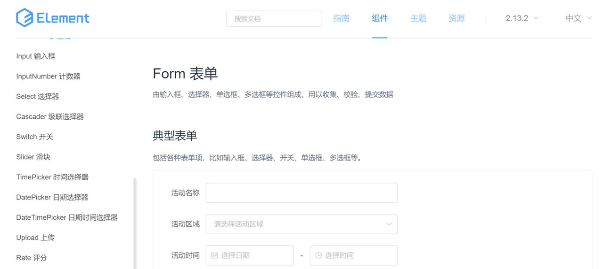


命令很简单：

```
# 切换到项目根目录
cd vueblog-vue
# 安装element-ui
cnpm install element-ui --save
复制代码
```

然后我们打开项目src目录下的main.js，引入element-ui依赖。

```
import Element from 'element-ui'
import "element-ui/lib/theme-chalk/index.css"
Vue.use(Element)
复制代码
```

这样我们就可以愉快得在官网上选择组件复制代码到我们项目中直接使用啦。

### 6、安装axios

接下来，我们来安装axios（[www.axios-js.com/](http://www.axios-js.com/)），axios是一个基于 promise 的 HTTP 库，这样我们进行前后端对接的时候，使用这个工具可以提高我们的开发效率。

安装命令：

```
cnpm install axios --save
复制代码
```

然后同样我们在main.js中全局引入axios。

```
import axios from 'axios'
Vue.prototype.$axios = axios //
复制代码
```

组件中，我们就可以通过this.$axios.get()来发起我们的请求了哈。

### 7、页面路由

接下来，我们先定义好路由和页面，因为我们只是做一个简单的博客项目，页面比较少，所以我们可以直接先定义好，然后在慢慢开发，这样需要用到链接的地方我们就可以直接可以使用：

我们在views文件夹下定义几个页面：

- BlogDetail.vue（博客详情页）
- BlogEdit.vue（编辑博客）
- Blogs.vue（博客列表）
- Login.vue（登录页面）

然后再路由中心配置：

- router\index.js

```
import Vue from 'vue'
import VueRouter from 'vue-router'
import Login from '../views/Login.vue'
import BlogDetail from '../views/BlogDetail.vue'
import BlogEdit from '../views/BlogEdit.vue'
Vue.use(VueRouter)
const routes = [
  {
    path: '/',
    name: 'Index',
    redirect: { name: 'Blogs' }
  },
  {
    path: '/login',
    name: 'Login',
    component: Login
  },
  {
    path: '/blogs',
    name: 'Blogs',
    // 懒加载
    component: () => import('../views/Blogs.vue')
  },
  {
    path: '/blog/add', // 注意放在 path: '/blog/:blogId'之前
    name: 'BlogAdd',
    meta: {
      requireAuth: true
    },
    component: BlogEdit
  },
  {
    path: '/blog/:blogId',
    name: 'BlogDetail',
    component: BlogDetail
  },
  {
    path: '/blog/:blogId/edit',
    name: 'BlogEdit',
    meta: {
      requireAuth: true
    },
    component: BlogEdit
  }
];
const router = new VueRouter({
  mode: 'history',
  base: process.env.BASE_URL,
  routes
})
export default router
复制代码
```

接下来我们去开发我们的页面。其中，带有meta：requireAuth: true说明是需要登录字后才能访问的受限资源，后面我们路由权限拦截时候会用到。

### 8、登录页面

接下来，我们来搞一个登陆页面，表单组件我们直接在element-ui的官网上找就行了，登陆页面就两个输入框和一个提交按钮，相对简单，然后我们最好带页面的js校验。emmm，我直接贴代码了~~

- views/Login.vue

```
<template>
  <div>
    <el-container>
      <el-header>
        <router-link to="/blogs">
        
        </router-link>
      </el-header>
      <el-main>
        <el-form :model="ruleForm" status-icon :rules="rules" ref="ruleForm" label-width="100px"
                 class="demo-ruleForm">
          <el-form-item label="用户名" prop="username">
            <el-input type="text" maxlength="12" v-model="ruleForm.username"></el-input>
          </el-form-item>
          <el-form-item label="密码" prop="password">
            <el-input type="password" v-model="ruleForm.password" autocomplete="off"></el-input>
          </el-form-item>
          <el-form-item>
            <el-button type="primary" @click="submitForm('ruleForm')">登录</el-button>
            <el-button @click="resetForm('ruleForm')">重置</el-button>
          </el-form-item>
        </el-form>
      </el-main>
    </el-container>
  </div>
</template>
<script>
  export default {
    name: 'Login',
    data() {
      var validatePass = (rule, value, callback) => {
        if (value === '') {
          callback(new Error('请输入密码'));
        } else {
          callback();
        }
      };
      return {
        ruleForm: {
          password: '111111',
          username: 'markerhub'
        },
        rules: {
          password: [
            {validator: validatePass, trigger: 'blur'}
          ],
          username: [
            {required: true, message: '请输入用户名', trigger: 'blur'},
            {min: 3, max: 12, message: '长度在 3 到 12 个字符', trigger: 'blur'}
          ]
        }
      };
    },
    methods: {
      submitForm(formName) {
        const _this = this
        this.$refs[formName].validate((valid) => {
          if (valid) {
            // 提交逻辑
            this.$axios.post('http://localhost:8081/login', this.ruleForm).then((res)=>{
              const token = res.headers['authorization']
              _this.$store.commit('SET_TOKEN', token)
              _this.$store.commit('SET_USERINFO', res.data.data)
              _this.$router.push("/blogs")
            })
          } else {
            console.log('error submit!!');
            return false;
          }
        });
      },
      resetForm(formName) {
        this.$refs[formName].resetFields();
      }
    },
    mounted() {
      this.$notify({
        title: '看这里：',
        message: '关注公众号：MarkerHub，回复【vueblog】，领取项目资料与源码',
        duration: 1500
      });
    }
  }
</script>
复制代码
```

找不到啥好的方式讲解了，之后先贴代码，然后再讲解。 上面代码中，其实主要做了两件事情

1、表单校验

2、登录按钮的点击登录事件

表单校验规则还好，比较固定写法，查一下element-ui的组件就知道了，我们来分析一下发起登录之后的代码：

```
const token = res.headers['authorization']
_this.$store.commit('SET_TOKEN', token)
_this.$store.commit('SET_USERINFO', res.data.data)
_this.$router.push("/blogs")
复制代码
```

从返回的结果请求头中获取到token的信息，然后使用store提交token和用户信息的状态。完成操作之后，我们调整到了/blogs路由，即博客列表页面。

#### token的状态同步

所以在store/index.js中，代码是这样的：

```
import Vue from 'vue'
import Vuex from 'vuex'
Vue.use(Vuex)
export default new Vuex.Store({
  state: {
    token: '',
    userInfo: JSON.parse(sessionStorage.getItem("userInfo"))
  },
  mutations: {
    SET_TOKEN: (state, token) => {
      state.token = token
      localStorage.setItem("token", token)
    },
    SET_USERINFO: (state, userInfo) => {
      state.userInfo = userInfo
      sessionStorage.setItem("userInfo", JSON.stringify(userInfo))
    },
    REMOVE_INFO: (state) => {
      localStorage.setItem("token", '')
      sessionStorage.setItem("userInfo", JSON.stringify(''))
      state.userInfo = {}
    }
  },
  getters: {
    getUser: state => {
      return state.userInfo
    }
  },
  actions: {},
  modules: {}
})
复制代码
```

存储token，我们用的是localStorage，存储用户信息，我们用的是sessionStorage。毕竟用户信息我们不需要长久保存，保存了token信息，我们随时都可以初始化用户信息。当然了因为本项目是个比较简单的项目，考虑到初学者，所以很多相对复杂的封装和功能我没有做，当然了，学了这个项目之后，自己想再继续深入，完成可以自行学习和改造哈。

#### 定义全局axios拦截器

点击登录按钮发起登录请求，成功时候返回了数据，如果是密码错误，我们是不是也应该弹窗消息提示。为了让这个错误弹窗能运用到所有的地方，所以我对axios做了个后置拦截器，就是返回数据时候，如果结果的code或者status不正常，那么我对应弹窗提示。

在src目录下创建一个文件axios.js（与main.js同级），定义axios的拦截：

```
import axios from 'axios'
import Element from "element-ui";
import store from "./store";
import router from "./router";
axios.defaults.baseURL='http://localhost:8081'
axios.interceptors.request.use(config => {
  console.log("前置拦截")
  // 可以统一设置请求头
  return config
})
axios.interceptors.response.use(response => {
    const res = response.data;
    console.log("后置拦截")
    // 当结果的code是否为200的情况
    if (res.code === 200) {
      return response
    } else {
      // 弹窗异常信息
      Element.Message({
        message: response.data.msg,
        type: 'error',
        duration: 2 * 1000
      })
      // 直接拒绝往下面返回结果信息
      return Promise.reject(response.data.msg)
    }
  },
  error => {
    console.log('err' + error)// for debug
    if(error.response.data) {
      error.message = error.response.data.msg
    }
    // 根据请求状态觉得是否登录或者提示其他
    if (error.response.status === 401) {
      store.commit('REMOVE_INFO');
      router.push({
        path: '/login'
      });
      error.message = '请重新登录';
    }
    if (error.response.status === 403) {
      error.message = '权限不足，无法访问';
    }
    Element.Message({
      message: error.message,
      type: 'error',
      duration: 3 * 1000
    })
    return Promise.reject(error)
  })
复制代码
```

前置拦截，其实可以统一为所有需要权限的请求装配上header的token信息，这样不需要在使用是再配置，我的小项目比较小，所以，还是免了吧~

然后再main.js中导入axios.js

```
import './axios.js' // 请求拦截
复制代码
```

后端因为返回的实体是Result，succ时候code为200，fail时候返回的是400，所以可以根据这里判断结果是否是正常的。另外权限不足时候可以通过请求结果的状态码来判断结果是否正常。这里都做了简单的处理。

登录异常时候的效果如下：


### 9、博客列表

登录完成之后直接进入博客列表页面，然后加载博客列表的数据渲染出来。同时页面头部我们需要把用户的信息展示出来，因为很多地方都用到这个模块，所以我们把页面头部的用户信息单独抽取出来作为一个组件。

#### 头部用户信息

那么，我们先来完成头部的用户信息，应该包含三部分信息：id，头像、用户名，而这些信息我们是在登录之后就已经存在了sessionStorage。因此，我们可以通过store的getters获取到用户信息。


看起来不是很复杂，我们贴出代码：

- components\Header.vue

```
<template>
  <div class="m-content">
    <h3>欢迎来到MarkerHub的博客</h3>
    <div class="block">
      <el-avatar :size="50" :src="user.avatar"></el-avatar>
      <div>{{ user.username }}</div>
    </div>
    <div class="maction">
      <el-link href="/blogs">主页</el-link>
      <el-divider direction="vertical"></el-divider>
      <span>
          <el-link type="success" href="/blog/add" :disabled="!hasLogin">发表文章</el-link>
        </span>
      <el-divider direction="vertical"></el-divider>
      <span v-show="!hasLogin">
          <el-link type="primary" href="/login">登陆</el-link>
        </span>
      <span v-show="hasLogin">
          <el-link type="danger" @click="logout">退出</el-link>
        </span>
    </div>
  </div>
</template>
<script>
  export default {
    name: "Header",
    data() {
      return {
        hasLogin: false,
        user: {
          username: '请先登录',
          avatar: "https://cube.elemecdn.com/3/7c/3ea6beec64369c2642b92c6726f1epng.png"
        },
        blogs: {},
        currentPage: 1,
        total: 0
      }
    },
    methods: {
      logout() {
        const _this = this
        this.$axios.get('http://localhost:8081/logout', {
          headers: {
            "Authorization": localStorage.getItem("token")
          }
        }).then((res) => {
          _this.$store.commit('REMOVE_INFO')
          _this.$router.push('/login')
        });
      }
    },
    created() {
      if(this.$store.getters.getUser.username) {
        this.user.username = this.$store.getters.getUser.username
        this.user.avatar = this.$store.getters.getUser.avatar
        this.hasLogin = true
      }
    }
  }
</script>
复制代码
```

上面代码created()中初始化用户的信息，通过hasLogin的状态来控制登录和退出按钮的切换，以及发表文章链接的disabled，这样用户的信息就能展示出来了。 然后这里有个退出按钮，在methods中有个logout()方法，逻辑比较简单，直接访问/logout，因为之前axios.js中我们已经设置axios请求的baseURL，所以这里我们不再需要链接的前缀了哈。因为是登录之后才能访问的受限资源，所以在header中带上了Authorization。返回结果清楚store中的用户信息和token信息，跳转到登录页面。

然后需要头部用户信息的页面只需要几个步骤：

```
import Header from "@/components/Header";
data() {
  components: {Header}
}
# 然后模板中调用组件
<Header></Header>
复制代码
```

#### 博客分页

接下来就是列表页面，需要做分页，列表我们在element-ui中直接使用**时间线**组件来作为我们的列表样式，还是挺好看的。还有我们的分页组件。

需要几部分信息：

- 分页信息
- 博客列表内容，包括id、标题、摘要、创建时间
- views\Blogs.vue

```
<template>
  <div class="m-container">
    <Header></Header>
    <div class="block">
      <el-timeline>
        <el-timeline-item v-bind:timestamp="blog.created" placement="top" v-for="blog in blogs">
          <el-card>
            <h4><router-link :to="{name: 'BlogDetail', params: {blogId: blog.id}}">{{blog.title}}</router-link></h4>
            <p>{{blog.description}}</p>
          </el-card>
        </el-timeline-item>
      </el-timeline>
     
    </div>
    <el-pagination class="mpage"
      background
      layout="prev, pager, next"
      :current-page=currentPage
      :page-size=pageSize
      @current-change=page
      :total="total">
    </el-pagination>
  </div>
</template>
<script>
  import Header from "@/components/Header";
  export default {
    name: "Blogs",
    components: {Header},
    data() {
      return {
        blogs: {},
        currentPage: 1,
        total: 0,
        pageSize: 5
      }
    },
    methods: {
      page(currentPage) {
        const _this = this
        this.$axios.get('http://localhost:8081/blogs?currentPage=' + currentPage).then((res) => {
          console.log(res.data.data.records)
          _this.blogs = res.data.data.records
          _this.currentPage = res.data.data.current
          _this.total = res.data.data.total
          _this.pageSize = res.data.data.size
        })
      }
    },
    mounted () {
      this.page(1);
    }
  }
</script>
复制代码
```

data()中直接定义博客列表blogs、以及一些分页信息。methods()中定义分页的调用接口page（currentPage），参数是需要调整的页码currentPage，得到结果之后直接赋值即可。然后初始化时候，直接在mounted()方法中调用第一页this.page(1)。完美。使用element-ui组件就是简单快捷哈哈！ 注意标题这里我们添加了链接，使用的是标签。

### 10、博客编辑（发表）

我们点击发表博客链接调整到/blog/add页面，这里我们需要用到一个markdown编辑器，在vue组件中，比较好用的是mavon-editor，那么我们直接使用哈。先来安装mavon-editor相关组件：

#### 安装mavon-editor

基于Vue的markdown编辑器mavon-editor

```
cnpm install mavon-editor --save
复制代码
```

然后在main.js中全局注册：

```
// 全局注册
import Vue from 'vue'
import mavonEditor from 'mavon-editor'
import 'mavon-editor/dist/css/index.css'
// use
Vue.use(mavonEditor)
复制代码
```

ok，那么我们去定义我们的博客表单：

```
<template>
  <div class="m-container">
    <Header></Header>
    <div class="m-content">
      <el-form ref="editForm" status-icon :model="editForm" :rules="rules" label-width="80px">
        <el-form-item label="标题" prop="title">
          <el-input v-model="editForm.title"></el-input>
        </el-form-item>
        <el-form-item label="摘要" prop="description">
          <el-input type="textarea" v-model="editForm.description"></el-input>
        </el-form-item>
        <el-form-item label="内容" prop="content">
          <mavon-editor v-model="editForm.content"/>
        </el-form-item>
        <el-form-item>
          <el-button type="primary" @click="submitForm()">立即创建</el-button>
          <el-button>取消</el-button>
        </el-form-item>
      </el-form>
    </div>
  </div>
</template>
<script>
  import Header from "@/components/Header";
  export default {
    name: "BlogEdit",
    components: {Header},
    data() {
      return {
        editForm: {
          id: null,
          title: '',
          description: '',
          content: ''
        },
        rules: {
          title: [
            {required: true, message: '请输入标题', trigger: 'blur'},
            {min: 3, max: 50, message: '长度在 3 到 50 个字符', trigger: 'blur'}
          ],
          description: [
            {required: true, message: '请输入摘要', trigger: 'blur'}
          ]
        }
      }
    },
    created() {
      const blogId = this.$route.params.blogId
      const _this = this
      if(blogId) {
        this.$axios.get('/blog/' + blogId).then((res) => {
          const blog = res.data.data
          _this.editForm.id = blog.id
          _this.editForm.title = blog.title
          _this.editForm.description = blog.description
          _this.editForm.content = blog.content
        });
      }
    },
    methods: {
      submitForm() {
        const _this = this
        this.$refs.editForm.validate((valid) => {
          if (valid) {
            this.$axios.post('/blog/edit', this.editForm, {
              headers: {
                "Authorization": localStorage.getItem("token")
              }
            }).then((res) => {
              _this.$alert('操作成功', '提示', {
                confirmButtonText: '确定',
                callback: action => {
                  _this.$router.push("/blogs")
                }
              });
            });
          } else {
            console.log('error submit!!');
            return false;
          }
        })
      }
    }
  }
</script>
复制代码
```

逻辑依然简单，校验表单，然后点击按钮提交表单，注意头部加上Authorization信息，返回结果弹窗提示操作成功，然后跳转到博客列表页面。emm，和写ajax没啥区别。熟悉一下vue的一些指令使用即可。 然后因为编辑和添加是同一个页面，所以有了create()方法，比如从编辑连接/blog/7/edit中获取blogId为7的这个id。然后回显博客信息。获取方式是const blogId = this.$route.params.blogId。

对了，mavon-editor因为已经全局注册，所以我们直接使用组件即可：

```
<mavon-editor v-model="editForm.content"/>
复制代码
```

效果如下：


### 11、博客详情

博客详情中需要回显博客信息，然后有个问题就是，后端传过来的是博客内容是markdown格式的内容，我们需要进行渲染然后显示出来，这里我们使用一个插件markdown-it，用于解析md文档，然后导入github-markdown-c，所谓md的样式。

方法如下：

```
# 用于解析md文档
cnpm install markdown-it --save
# md样式
cnpm install github-markdown-css
复制代码
```

然后就可以在需要渲染的地方使用：

- views\BlogDetail.vue

```
<template>
  <div class="m-container">
    <Header></Header>
    <div class="mblog">
      <h2>{{ blog.title }}</h2>
      <el-link icon="el-icon-edit" v-if="ownBlog"><router-link :to="{name: 'BlogEdit', params: {blogId: blog.id}}">编辑</router-link></el-link>
      <el-divider></el-divider>
      <div class="content markdown-body" v-html="blog.content"></div>
    </div>
  </div>
</template>
<script>
  import 'github-markdown-css/github-markdown.css' // 然后添加样式markdown-body
  import Header from "@/components/Header";
  export default {
    name: "BlogDetail",
    components: {
      Header
    },
    data() {
      return {
        blog: {
          userId: null,
          title: "",
          description: "",
          content: ""
        },
        ownBlog: false
      }
    },
    methods: {
      getBlog() {
        const blogId = this.$route.params.blogId
        const _this = this
        this.$axios.get('/blog/' + blogId).then((res) => {
          console.log(res)
          console.log(res.data.data)
          _this.blog = res.data.data
          var MarkdownIt = require('markdown-it'),
            md = new MarkdownIt();
          var result = md.render(_this.blog.content);
          _this.blog.content = result
          // 判断是否是自己的文章，能否编辑
          _this.ownBlog =  (_this.blog.userId === _this.$store.getters.getUser.id)
        });
      }
    },
    created() {
      this.getBlog()
    }
  }
</script>
复制代码
```

具体逻辑还是挺简单，初始化create()方法中调用getBlog()方法，请求博客详情接口，返回的博客详情content通过markdown-it工具进行渲染。

再导入样式：

```
import 'github-markdown.css'
复制代码
```

然后在content的div中添加class为markdown-body即可哈。 效果如下：


另外标题下添加了个小小的编辑按钮，通过ownBlog （判断博文作者与登录用户是否同一人）来判断按钮是否显示出来。

### 12、路由权限拦截

页面已经开发完毕之后，我们来控制一下哪些页面是需要登录之后才能跳转的，如果未登录访问就直接重定向到登录页面，因此我们在src目录下定义一个js文件：

- src\permission.js

```
import router from "./router";
// 路由判断登录 根据路由配置文件的参数
router.beforeEach((to, from, next) => {
  if (to.matched.some(record => record.meta.requireAuth)) { // 判断该路由是否需要登录权限
    const token = localStorage.getItem("token")
    console.log("------------" + token)
    if (token) { // 判断当前的token是否存在 ； 登录存入的token
      if (to.path === '/login') {
      } else {
        next()
      }
    } else {
      next({
        path: '/login'
      })
    }
  } else {
    next()
  }
})
复制代码
```

通过之前我们再定义页面路由时候的的meta信息，指定requireAuth: true，需要登录才能访问，因此这里我们在每次路由之前（router.beforeEach）判断token的状态，觉得是否需要跳转到登录页面。

```
{
  path: '/blog/add', // 注意放在 path: '/blog/:blogId'之前
  name: 'BlogAdd',
  meta: {
    requireAuth: true
  },
  component: BlogEdit
}
复制代码
```

然后我们再main.js中import我们的permission.js

```
import './permission.js' // 路由拦截
复制代码
```

### 13、前端总结

ok，基本所有页面就已经开发完毕啦，css样式信息我未贴出来，大家直接上github上clone下来查看。

## 项目大总结

好啦，项目先到这里，花了3天半录制了一套对应的视频，记得去看，给我三连哇。

项目代码：[github.com/MarkerHub/v…](https://github.com/MarkerHub/vueblog)

项目视频：[www.bilibili.com/video/BV1PQ…](https://www.bilibili.com/video/BV1PQ4y1P7hZ/)