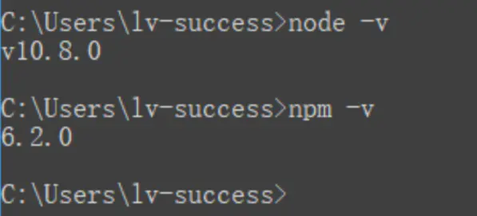
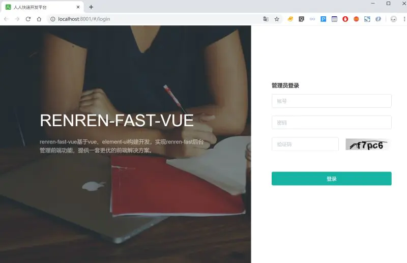
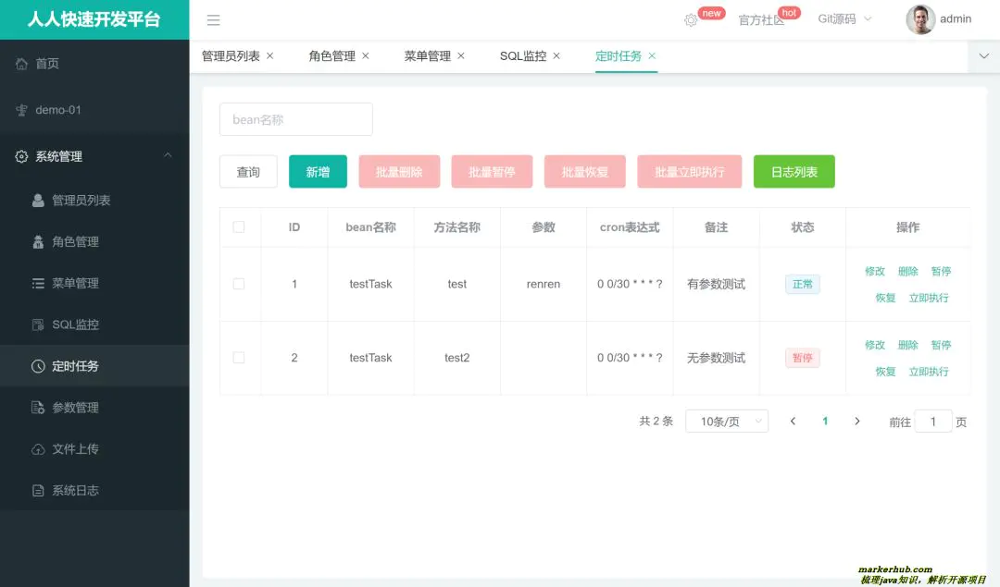
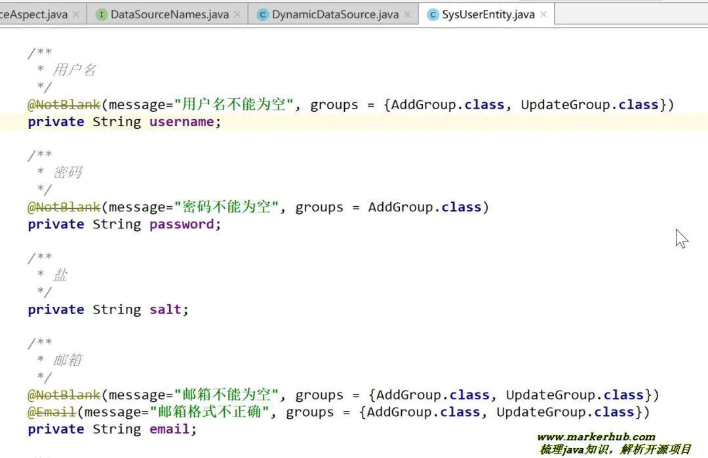
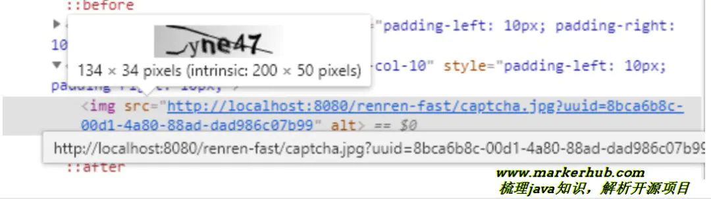
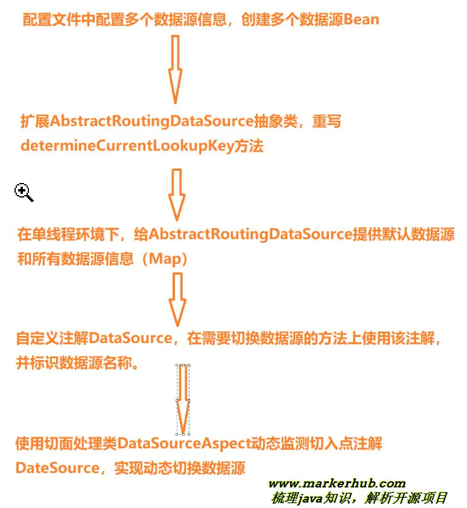
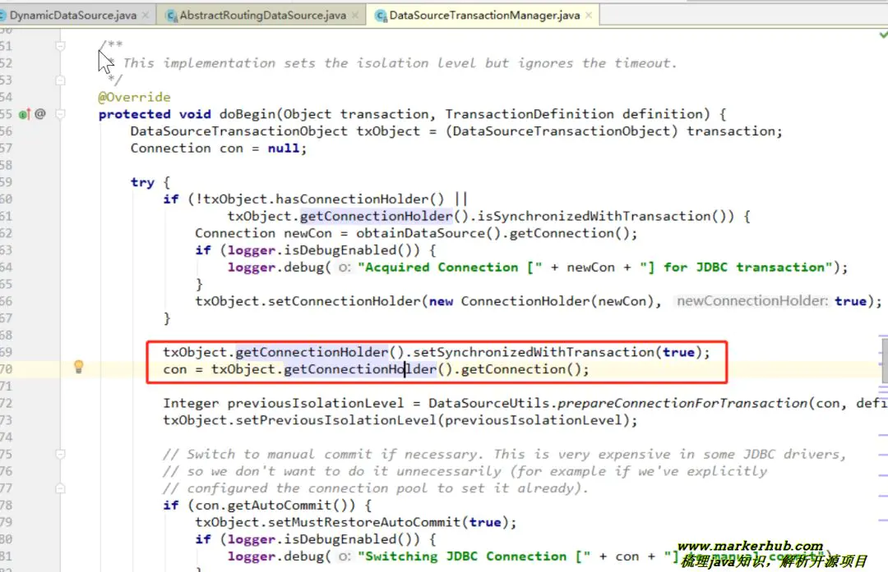
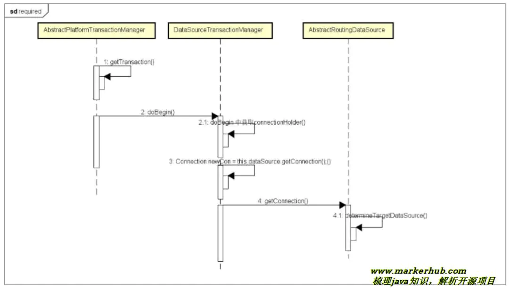

### 基本信息

renren-fast 是一个轻量级的 Spring Boot2.1 快速开发平台，其设计目标是开发迅速、学习简单、轻量级、易扩展；使用 Spring Boot、Shiro、MyBatis、Redis、Bootstrap、Vue2.x 等框架，包含：管理员列表、角色管理、菜单管理、定时任务、参数管理、代码生成器、日志管理、云存储、API 模块 (APP 接口开发利器)、前后端分离等。

- git 链接：[gitee.com/renrenio/re…](https://gitee.com/renrenio/renren-fast.git)
- 项目作者：人人开源
- 官方文档：[www.renren.io/guide](https://www.renren.io/guide)

### 技术栈

- 前端 vue.js、element-ui
- 后端 spring boot、mybatis plus、shiro、swagger2、redis、mysql、jwt、多数据源

### 功能大纲

后台管理系统的基本功能！

- 管理员列表
- 角色管理
- 菜单管理
- SQL 监控
- 定时任务
- 参数管理
- 文件上传
- 系统日志

### 学习重点（目的）

- Hibernate Validator 数据校验
- google 开源的的验证码生成器
- jwt 机制
- 多数据源模块
- 预防 CSFR、XSS 攻击
- quartz 定时任务

### 项目启动步骤

前端

由于前端使用 vue 开发，因此需要安装 node.js 环境。node.js 安装教程：[nodejs.cn/download/](http://nodejs.cn/download/) 下载 msi 版本安装。

安装之后，命令行窗口，表示安装成功。





启动步骤：

```
# 克隆项目
git clone https://github.com/daxiongYang/renren-fast-vue.git
# 切换到项目目录根目录renren-fast-vue里面
# 1、安装淘宝镜像依赖
npm install -g cnpm --registry=https://registry.npm.taobao.org
# 2、安装项目依赖
cnpm install
# 启动服务
npm run dev

复制代码
```

后端

导入 sql 文件，修改配置文件的数据库账号密码，启动 main 方法即可。

### 项目截图

登录页





后台页面





### 项目特点

- 友好的代码结构及注释，便于阅读及二次开发
- 实现前后端分离，通过 token 进行数据交互，前端再也不用关注后端技术
- 灵活的权限控制，可控制到页面或按钮，满足绝大部分的权限需求
- 页面交互使用 Vue2.x，极大的提高了开发效率
- 完善的代码生成机制，可在线生成 entity、xml、dao、service、vue、sql 代码，减少 70% 以上的开发任务
- 引入 quartz 定时任务，可动态完成任务的添加、修改、删除、暂停、恢复及日志查看等功能
- 引入 API 模板，根据 token 作为登录令牌，极大的方便了 APP 接口开发
- 引入 Hibernate Validator 校验框架，轻松实现后端校验
- 引入云存储服务，已支持：七牛云、阿里云、腾讯云等
- 引入 swagger 文档支持，方便编写 API 接口文档

### 数据校验

后端实体效验使用的是 Hibernate Validator 校验框架。且自定义 ValidatorUtils 工具类，用来效验数据。

- io.renren.common.validator.ValidatorUtils（校验工具）
- io.renren.common.validator.Assert（自定义的断言，用于抛出自定义的 RRException）





通过上面的实体类代码，我们来理解 Hibernate Validator 校验框架的使用。其中，username 属性，表示保存或修改用户时，都会效验 username 属性；而 password 属 性，表示只有保存用户时，才会效验 password 属性，也就是说，修改用户时，password 可以 不填写，允许为空。

如果不指定属性的 groups，则默认属于 javax.validation.groups.Default.class 分组，可以通 过 ValidatorUtils.validateEntity(user) 进行效验。

校验分组

- io.renren.common.validator.group.AddGroup
- io.renren.common.validator.group.AliyunGroup
- io.renren.common.validator.group.Group
- io.renren.common.validator.group.QcloudGroup
- io.renren.common.validator.group.QiniuGroup
- io.renren.common.validator.group.UpdateGroup

项目逻辑

- 1、首先定义分组，根据实际情况，可以分为添加组 AddGroup 和修改组 UpdateGroup 等。
- 2、在实体上添加 hibernate.validator 规则注解 @NotBlank、@Email 等，并分组。
- 3、编写规则校验工具类 ValidatorUtils。校验出有不符合规则的内容抛出自定义异常 RRException
- 4、再保存、更新等操作中使用 ValidatorUtils.validateEntity(user, AddGroup.class); 校验实体规则情况。

常用注解

```
Bean Validation 中内置的 constraint
@Null   被注释的元素必须为 null
@NotNull    被注释的元素必须不为 null
@AssertTrue     被注释的元素必须为 true
@AssertFalse    被注释的元素必须为 false
@Min(value)     被注释的元素必须是一个数字，其值必须大于等于指定的最小值
@Max(value)     被注释的元素必须是一个数字，其值必须小于等于指定的最大值
@DecimalMin(value)  被注释的元素必须是一个数字，其值必须大于等于指定的最小值
@DecimalMax(value)  被注释的元素必须是一个数字，其值必须小于等于指定的最大值
@Size(max=, min=)   被注释的元素的大小必须在指定的范围内
@Digits (integer, fraction)     被注释的元素必须是一个数字，其值必须在可接受的范围内
@Past   被注释的元素必须是一个过去的日期
@Future     被注释的元素必须是一个将来的日期
@Pattern(regex=,flag=)  被注释的元素必须符合指定的正则表达式
Hibernate Validator 附加的 constraint
@NotBlank(message =)   验证字符串非null，且长度必须大于0
@Email  被注释的元素必须是电子邮箱地址
@Length(min=,max=)  被注释的字符串的大小必须在指定的范围内
@NotEmpty   被注释的字符串的必须非空
@Range(min=,max=,message=)  被注释的元素必须在合适的范围内

复制代码
```

### 登录验证码逻辑

后台的登录需要用到验证码，那么验证的生成逻辑是怎么样的呢？

这里用到了一个 google 开源的的验证码生成器 kaptcha，我们来看下代码。

第一步：导入相关 jar 包

```
<dependency>
   <groupId>com.github.axet</groupId>
   <artifactId>kaptcha</artifactId>
   <version>0.0.9</version>
</dependency>

复制代码
```

第二步：配置 kaptcha 验证码的生成规则，也就是配置一下验证码的样式，复杂程度等。

- io.renren.config.KaptchaConfig

```
/**
 * 生成验证码配置
 *
 * @author Mark sunlightcs@gmail.com
 */
@Configuration
public class KaptchaConfig {
    @Bean
    public DefaultKaptcha producer() {
        Properties properties = new Properties();
        properties.put("kaptcha.border", "no");
        properties.put("kaptcha.textproducer.font.color", "black");
        properties.put("kaptcha.textproducer.char.space", "5");
        properties.put("kaptcha.textproducer.font.names", "Arial,Courier,cmr10,宋体,楷体,微软雅黑");
        Config config = new Config(properties);
        DefaultKaptcha defaultKaptcha = new DefaultKaptcha();
        defaultKaptcha.setConfig(config);
        return defaultKaptcha;
    }
}

复制代码
```

上面的代码中，有很多可以自定义的样式，比如是否需要边框 kaptcha.border 等。第三步：生成验证码

- io.renren.modules.sys.controller.SysLoginController

```
/**
 * 验证码
 */
@GetMapping("captcha.jpg")
public void captcha(HttpServletResponse response, String uuid)throws IOException {
   response.setHeader("Cache-Control", "no-store, no-cache");
   response.setContentType("image/jpeg");
   //获取图片验证码
   BufferedImage image = sysCaptchaService.getCaptcha(uuid);
   ServletOutputStream out = response.getOutputStream();
   ImageIO.write(image, "jpg", out);
   IOUtils.closeQuietly(out);
}

复制代码
```

我们来分析一下，首先客户端传来一个 uuid，然后得到图片验证，客户端访问是这样的：





```
http
:
//localhost:8080/renren-fast/captcha.jpg?uuid=8bca6b8c-00d1-4a80-88ad-dad986c07b99
复制代码
```

uuid 是哪里来的呢，我看了客户端的源码，原来是前端生成的！

- /src/views/common/login.vue
- /src/views/utils/index.js

```
// 获取验证码
getCaptcha () {
  this.dataForm.uuid = getUUID()
  this.captchaPath = this.$http.adornUrl(`/captcha.jpg?uuid=${this.dataForm.uuid}`)
}
--
/**
 * 获取uuid
 */
export function getUUID () {
  return 'xxxxxxxx-xxxx-4xxx-yxxx-xxxxxxxxxxxx'.replace(/[xy]/g, c => {
    return (c === 'x' ? (Math.random() * 16 | 0) : ('r&0x3' | '0x8')).toString(16)
  })
}

复制代码
```

uuid 得到之后，就开始生成 BufferedImage，我们看下里面的逻辑：

- io.renren.modules.sys.service.impl.SysCaptchaServiceImpl

```
@Override
public BufferedImage getCaptcha(String uuid) {
    if(StringUtils.isBlank(uuid)){
        throw new RRException("uuid不能为空");
    }
    //生成文字验证码
    String code = producer.createText();
    SysCaptchaEntity captchaEntity = new SysCaptchaEntity();
    captchaEntity.setUuid(uuid);
    captchaEntity.setCode(code);
    //5分钟后过期
    captchaEntity.setExpireTime(DateUtils.addDateMinutes(new Date(), 5));
    this.save(captchaEntity);
    return producer.createImage(code);
}

复制代码
```

producer 就是 google 的验证码生成器，spring 注入进来的

```
@Autowired
private Producer producer;

复制代码
```

producer.createText() 生成了文字验证码，然后 producer.createImage(code) 生成图片，过程中吧 code 和 uuid 关联起来存入数据库中，所以验证验证码是否正确，就直接登录表单中提交 uuid 和输入的验证码作为条件查库即可，查出记录表示验证码是正确的。

- io.renren.modules.sys.service.impl.SysCaptchaServiceImpl

```
@Override
public boolean validate(String uuid, String code) {
    SysCaptchaEntity captchaEntity = this.getOne(new QueryWrapper<SysCaptchaEntity>().eq("uuid", uuid));
    if(captchaEntity == null){
        return false;
    }
    //删除验证码
    this.removeById(uuid);
    if(captchaEntity.getCode().equalsIgnoreCase(code) && captchaEntity.getExpireTime().getTime() >= System.currentTimeMillis()){
        return true;
    }
    return false;
}

复制代码
```

### 预防 CSRF

CSRF（Cross-site request forgery）：跨站请求伪造。

用户是网站 A 的注册用户，且登录进去，于是网站 A 就给用户下发 cookie。

从上图可以看出，要完成一次 CSRF 攻击，受害者必须满足两个必要的条件：

（1）登录受信任网站 A，并在本地生成 Cookie。（如果用户没有登录网站 A，那么网站 B 在诱导的时候，请求网站 A 的 api 接口时，会提示你登录）

（2）在不登出 A 的情况下，访问危险网站 B（其实是利用了网站 A 的漏洞）。

我们在讲 CSRF 时，一定要把上面的两点说清楚。

温馨提示一下，cookie 保证了用户可以处于登录状态，但网站 B 其实拿不到 cookie。

#### 预防 CSRF 攻击

跨站请求攻击，是攻击者通过一些技术手段欺骗用户的浏览器去访问一个自己曾经认证过的网站并执行一定的操作。因为浏览器认证过，所以网站会认为是真正的用户在操作。

例子

假如一家银行转账操作的 URL 地址如下：

```
http
:
//www.examplebank.com/withdraw?account=AccoutName&amount=1000&for=PayeeName 
复制代码
```

那么，一个另外的网站可以放置如下代码

```

 
复制代码
```

如果用户之前刚访问过银行网站，登陆信息尚未过期，再次访问恶意网站点击了这个图片，那么就会损失 1000 元。事实上，这些地址还可以放在论坛、博客等地方，这种恶意访问的形式更加隐蔽，如果服务端没有相应措施，很容易受到威胁。

#### 防御措施

- 检查 referer 字段

HTTP 头中有一个 Referer 字段，这个字段是用来标明请求来源于哪一个网址。通常来说，Referer 字段应和请求的地址是在同一个域名下的。服务器可以通过判断 Referer 字段来判断请求的来源。 这种方法简单易行，但也有其局限性。http 协议无法保证来访的浏览器的具体实现，可以通过篡改 Referer 字段的方式来进行攻击

- Token 验证

（1）服务器发送给客户端一个 token；

（2）客户端提交的表单中带着这个 token。

（3）如果这个 token 不合法，那么服务器拒绝这个请求。

### 预防 XSS

XSS（Cross Site Scripting）：跨域脚本攻击。

XSS 攻击的核心原理是：不需要你做任何的登录认证，它会通过合法的操作（比如在 url 中输入、在评论框中输入），向你的页面注入脚本（可能是 js、hmtl 代码块等）。

最后导致的结果可能是：

- 盗用 Cookie
- 破坏页面的正常结构，插入广告等恶意内容
- D-doss 攻击

1、百度百科的解释: XSS 又叫 CSS (Cross Site Script) ，跨站脚本攻击。它指的是恶意攻击者往 Web 页面里插入恶意 html 代码，当用户浏览该页之时，嵌入其中 Web 里面的 html 代码会被执行，从而达到恶意用户的特殊目的。

2、它与 SQL 注入攻击类似，SQL 注入攻击中以 SQL 语句作为用户输入，从而达到查询 / 修改 / 删除数据的目的，而在 xss 攻击中，通过插入恶意脚本，实现对用户游览器的控制，获取用户的一些信息。

#### 攻击方式

1、反射型

发出请求时，XSS 代码出现在 url 中，作为输入提交到服务器端，服务器端解析后响应，XSS 代码随响应内容一起传回给浏览器，最后浏览器解析执行 XSS 代码。这个过程像一次反射，所以叫反射型 XSS。

2、存储型

存储型 XSS 和反射型 XSS 的差别在于，提交的代码会存储在服务器端（数据库、内存、文件系统等），下次请求时目标页面时不用再提交 XSS 代码。

#### 项目运用

Filter 过滤器

Filter 过滤器是一种比较实用的东西，可以过滤不良信息，对提交来的信息进行处理。是 Request 和 Response 之间的传输纽带。

HttpServletRequestWrapper

Filter 是这样一种 Java 对象，它能能在 request 到达 servlet 的服务方法之前拦截 HttpServletRequest 对象，而在服务方 法转移控制后又能拦截 HttpServletResponse 对象。

你可以使用 filter 来实现特定的任务，比如验证用户输入，以及压缩 web 内容。但 HttpServletRequest 对象的参数是不可改变的，这极大地缩减了 filter 的应用范围。至少在一半的时间里，你希望可以改变准备传送给 filter 的对象。

幸运的是，尽管你不能改变不变对象本身，但你却可以通过使用装饰模式来改变其状态。

所以：在 Filter 中修改后台 Controller 中获取到的 HttpServletRequest 中的参数，只需要在 Filter 中自定义一个类继承于 HttpServletRequestWrapper，并复写 getParameterNames、getParameter、getParameterValues 等方法即可

方法：

要创建 HttpServletRequest 的装饰类，你需要继承 HttpServletRequestWrapper 并且覆盖你希望改变的方法。


- ServletRequest 抽象组件
- HttpServletRequest 抽象组件的一个子类，它的实例被称作 "被装饰者"
- ServletRequestWrapper 一个基本的装饰类，这里是非抽象的
- HttpServletRequestWrapper 一个具体的装饰者，当然这里也继承了 HttpServletRequest 这个接口，是为了获取一些在 ServletRequest 中没有的方法
- ModifyParametersWrapper  同样是 一个具体的装饰者（PS：我自定义的一个类）

防 XSS 注入流程：

- 自定义包装类 XssHttpServletRequestWrapper，继承 HttpServletRequestWrapper，重写 getInputStream(),getParameter(String name),getParameterValues(String name) 等方法。
- 自定义过滤器 XssFilter，过滤所有链接，这样所有方法中 request.getParameter(); 就能调用自定义包装类里面重写的方法，进行 xss 过滤。

## JWT 的代码实现

### 配置步骤

第一步、导入 maven 坐标

```xml
<dependency>
   <groupId>io.jsonwebtoken</groupId>
   <artifactId>jjwt</artifactId>
   <version>0.9.0</version>#renren-fast用的是0.7.0版本
</dependency>

复制代码
```

第二步、封装一个 util 工具类统一头部和载荷部分的信息，应包含生成 jwt 和校验 jwt。io.renren.modules.app.utils.JwtUtils

```
@ConfigurationProperties(prefix = "renren.jwt")
@Component
public class JwtUtils {
    private Logger logger = LoggerFactory.getLogger(getClass());
    private String secret;
    private long expire;
    private String header;
    /**
     * 生成jwt token
     */
    public String generateToken(long userId) {
        Date nowDate = new Date();
        //过期时间
        Date expireDate = new Date(nowDate.getTime() + expire * 1000);
        return Jwts.builder()
                .setHeaderParam("typ", "JWT")
                .setSubject(userId+"")
                .setIssuedAt(nowDate)
                .setExpiration(expireDate)
                .signWith(SignatureAlgorithm.HS512, secret)
                .compact();
    }
    public Claims getClaimByToken(String token) {
        try {
            return Jwts.parser()
                    .setSigningKey(secret)
                    .parseClaimsJws(token)
                    .getBody();
        }catch (Exception e){
            logger.debug("validate is token error ", e);
            return null;
        }
    }
    /**
     * token是否过期
     * @return  true：过期
     */
    public boolean isTokenExpired(Date expiration) {
        return expiration.before(new Date());
    }
    ....getter、setter
}

复制代码
```

**第三步、**为了区分需要拦截和不需要拦截的资源，项目添加了一个 @login 注解

```
/**
 * app登录效验
 * @author chenshun
 * @email sunlightcs@gmail.com
 * @date 2017/9/23 14:30
 */
@Target(ElementType.METHOD)
@Retention(RetentionPolicy.RUNTIME)
@Documented
public @interface Login {
}

复制代码
```

第四步、登录成功后，生成一个 jwt 的 token，用于返回给前段。

```
/**
 * 登录
 */
@PostMapping("login")
@ApiOperation("登录")
public R login(@RequestBody LoginForm form){
    //表单校验
    ValidatorUtils.validateEntity(form);
    //用户登录
    long userId = userService.login(form);
    //生成token
    String token = jwtUtils.generateToken(userId);
    Map<String, Object> map = new HashMap<>();
    map.put("token", token);
    map.put("expire", jwtUtils.getExpire());
    return R.ok(map);
}

复制代码
```

**第五步、**编写一个拦截器，拦截所有需要校验的资源模块的 url（有加了 @login 注解的），访问前校验 jwt 是否合法。

```
/**
 * 权限(Token)验证
 * @author chenshun
 * @email sunlightcs@gmail.com
 * @date 2017-03-23 15:38
 */
@Component
public class AuthorizationInterceptor extends HandlerInterceptorAdapter {
    @Autowired
    private JwtUtils jwtUtils;
    public static final String USER_KEY = "userId";
    @Override
    public boolean preHandle(HttpServletRequest request, HttpServletResponse response, Object handler) throws Exception {
        Login annotation;
        if(handler instanceof HandlerMethod) {
            annotation = ((HandlerMethod) handler).getMethodAnnotation(Login.class);
        }else{
            return true;
        }
        if(annotation == null){
            return true;
        }
        //获取用户凭证
        String token = request.getHeader(jwtUtils.getHeader());
        if(StringUtils.isBlank(token)){
            token = request.getParameter(jwtUtils.getHeader());
        }
        //凭证为空
        if(StringUtils.isBlank(token)){
            throw new RRException(jwtUtils.getHeader() + "不能为空", HttpStatus.UNAUTHORIZED.value());
        }
        Claims claims = jwtUtils.getClaimByToken(token);
        if(claims == null || jwtUtils.isTokenExpired(claims.getExpiration())){
            throw new RRException(jwtUtils.getHeader() + "失效，请重新登录", HttpStatus.UNAUTHORIZED.value());
        }
        //设置userId到request里，后续根据userId，获取用户信息
        request.setAttribute(USER_KEY, Long.parseLong(claims.getSubject()));
        return true;
    }
}

复制代码
```

### 获取用户信息

项目用了一个一种特殊的方法来获取用户信息，一般我们再 baseController 中获取用户信息，但 renren-fast 使用了注解的形式，@loginUser

```
/**
 * 登录用户信息
 *
 * @author chenshun
 * @email sunlightcs@gmail.com
 * @date 2017-03-23 20:39
 */
@Target(ElementType.PARAMETER)
@Retention(RetentionPolicy.RUNTIME)
public @interface LoginUser {
}

复制代码
```

运用是这样的，参数中添加 @LoginUser UserEntity user 作为参数：

```
@RestController
@RequestMapping("/app")
@Api("APP测试接口")
public class AppTestController {
    @Login
    @GetMapping("userInfo")
    @ApiOperation("获取用户信息")
    public R userInfo(@LoginUser UserEntity user){
        return R.ok().put("user", user);
    }
}

复制代码
```

然后写一个全局解析注解的类：其中 HandlerMethodArgumentResolver 是用来为处理器解析参数的。HandlerMethodArgumentResolver 的接口定义如下：

（1）supportsParameter 用于判断是否支持对某种参数的解析

（2）resolveArgument  将请求中的参数值解析为某种对象

```
/**
 * 有@LoginUser注解的方法参数，注入当前登录用户
 * @author chenshun
 * @email sunlightcs@gmail.com
 * @date 2017-03-23 22:02
 */
@Component
public class LoginUserHandlerMethodArgumentResolver implements HandlerMethodArgumentResolver {
    @Autowired
    private UserService userService;
    @Override
    public boolean supportsParameter(MethodParameter parameter) {
        return parameter.getParameterType().isAssignableFrom(UserEntity.class) && parameter.hasParameterAnnotation(LoginUser.class);
    }
    @Override
    public Object resolveArgument(MethodParameter parameter, ModelAndViewContainer container,
                                  NativeWebRequest request, WebDataBinderFactory factory) throws Exception {
        //获取用户ID
        Object object = request.getAttribute(AuthorizationInterceptor.USER_KEY, RequestAttributes.SCOPE_REQUEST);
        if(object == null){
            return null;
        }
        //获取用户信息
        UserEntity user = userService.selectById((Long)object);
        return user;
    }
}

复制代码
```

最后在 mvc 配置中添加这个解析器

```
/**
 * MVC配置
 *
 * @author chenshun
 * @email sunlightcs@gmail.com
 * @date 2017-04-20 22:30
 */
@Configuration
public class WebMvcConfig implements WebMvcConfigurer {
    @Autowired
    private LoginUserHandlerMethodArgumentResolver loginUserHandlerMethodArgumentResolver;
    @Override
    public void addArgumentResolvers(List<HandlerMethodArgumentResolver> argumentResolvers) {
        argumentResolvers.add(loginUserHandlerMethodArgumentResolver);
    }
}

复制代码
```

### 多数据源模块

#### 预备知识 - ThreadLocal

ThreadLocal 是线程局部变量，所谓的线程局部变量，就是仅仅只能被本线程访问，不能在线程之间进行共享访问的变量。

#### 关键抽象类 - AbstractRoutingDataSource

官方注释如下：

```
* Abstract {@link javax.sql.DataSource} implementation that routes {@link #getConnection()}
* calls to one of various target DataSources based on a lookup key. The latter is usually
* (but not necessarily) determined through some thread-bound transaction context.

复制代码
```

大概意思是：就是 getConnection()根据查找 lookup key 键对不同目标数据源的调用，通常是通过 (但不一定) 某些线程绑定的事物上下文来实现。

通过这我们知道可以实现：

- 多数据源的动态切换，在程序运行时，把数据源数据源动态织入到程序中，灵活的进行数据源切换。
- 基于多数据源的动态切换，我们可以实现读写分离，这么做缺点也很明显，无法动态的增加数据源。

### 逻辑思路

- DynamicDataSource 继承 AbstractRoutingDataSource 类，并实现了 determineCurrentLookupKey() 方法。
- 我们配置的多个数据源会放在 AbstractRoutingDataSource 的 targetDataSources 和 defaultTargetDataSource 中，然后通过 afterPropertiesSet() 方法将数据源分别进行复制到 resolvedDataSources 和 resolvedDefaultDataSource 中。
- AbstractRoutingDataSource 的 getConnection() 的方法的时候，先调用 determineTargetDataSource() 方法返回 DataSource 在进行 getConnection()。

#### 实现多数据源

步骤 1，在 spring boot 中，增加多数据源的配置

步骤 2，扩展 Spring 的 AbstractRoutingDataSource 抽象类，

AbstractRoutingDataSource 中的抽象方法 determineCurrentLookupKey 是实现多数据

源的核心，并对该方法进行 Override

步骤 3，配置 DataSource，指定数据源的信息

步骤 4，通过注解，实现多数据源

步骤 5、配置加上 (exclude={DataSourceAutoConfiguration.class})





#### 关于事务

只支持单库事务，也就是说切换数据源要在开启事务之前执行。spring DataSourceTransactionManager 进行事务管理，开启事务，会将数据源缓存到 DataSourceTransactionObject 对象中进行后续的 commit rollback 等事务操作。








#### 使用经验

出现多数据源动态切换失败的原因是因为在事务开启后，数据源就不能再进行随意切换了，也就是说，一个事务对应一个数据源。那么传统的 Spring 管理事务是放在 Service 业务层操作的，所以更换数据源的操作要放在这个操作之前进行。也就是切换数据源操作放在 Controller 层，可是这样操作会造成 Controller 层代码混乱的结果。故而想到的解决方案是将事务管理在数据持久 (Dao 层) 开启，切换数据源的操作放在业务层进行操作，就可在事务开启之前顺利进行数据源切换，不会再出现切换失败了。

### 结束

好了，今天文章先到这里。我是吕一明，感谢持续关注我的公众号：MarkerHub！

最后金三银四到了，送两份2020年最新企业面试题大全（含答案）给大家：[点击领取](https://mp.weixin.qq.com/s/VptDPi-ffHT5g1EQJPm40A)

- 1、[黑马程序员的Java面试宝典Beta5.0.pdf](https://mp.weixin.qq.com/s/VptDPi-ffHT5g1EQJPm40A)
- 2、[2019年多家公司整理的350道Java面试题手册.pdf](https://mp.weixin.qq.com/s/VptDPi-ffHT5g1EQJPm40A)


作者：MarkerHub
链接：https://juejin.im/post/6844904077797621774
来源：掘金
著作权归作者所有。商业转载请联系作者获得授权，非商业转载请注明出处。