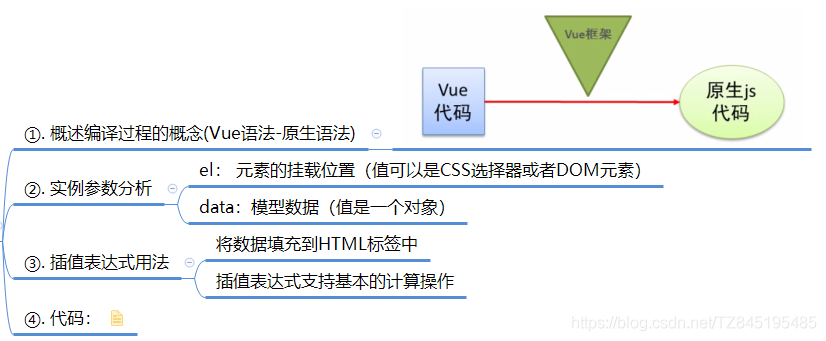
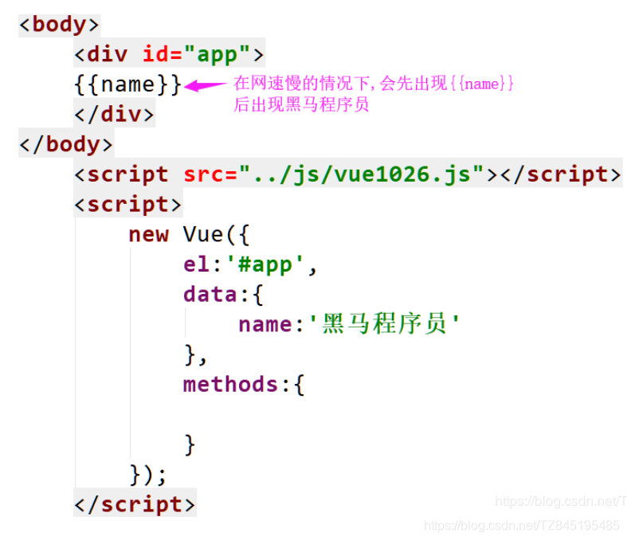
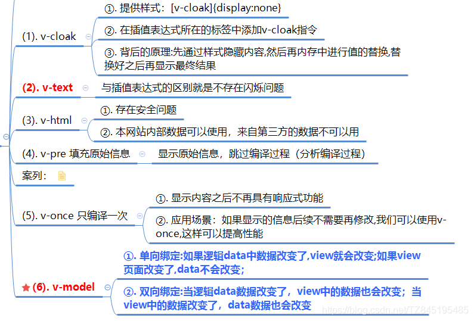
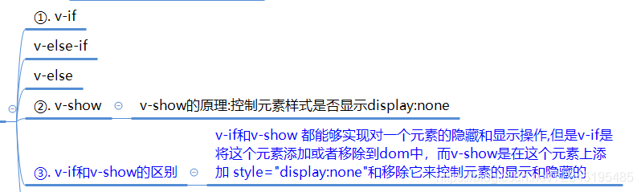

# VUE_01 基本使用

> 模板语法插值表达式+指令+事件绑定+分支循环结构

## ①. vue入门概述

1>.vue入门概述

- ①. vue的概述 ①. Vue：渐进式JavaSctipt框架 ②. https://cn.vuejs.org/v2/guide/
- ②. vue入门案列讲解：
  
- ③. 代码展示：

```html
	<!DOCTYPE html>
	<html lang="en">
	<head>
	    <meta charset="UTF-8">
	    <meta name="viewport" content="width=device-width, initial-scale=1.0">
	    <title>Document</title>
	</head>
	
	<body>
	    <div id="app">
	        
	        <div>{{msg}}</div>
	        <div>{{1 + 2}}</div>
	        <div>{{msg + '' + 123}}</div>
	        <div>{{msg + "" + 123}}</div>
	        
	        
	    </div>
	<script src="../js/vue.js"></script>
	<script>
	  
	    var appel=document.getElementById("app");
	    var vm=new Vue({
	         el:'#app',//元素的挂载位置(值可以是css选择器或者DOM元素)
	         //el:appel
	         data:{    //模型数据:值是一个对象
	            msg:'xiaozhi'
	         }
	    });
	</script>
	</body>
	</html>
```

## ②. 插值表达式

**`2>.` 插值表达式**

- ①. 数据绑定最常见的形式就是使用“Mustache”语法 (双大括号) 的文本插值，Mustache 标签将会被替代为对应数据对象上属性的值。无论何时，绑定的数据对象上属性发生了改变，插值处的内容都会更新
- ②. Vue.js 都提供了完全的 JavaScript 表达式支持。

1. {{ number + 1 }}
2. {{ ok ? ‘YES’ : ‘NO’ }}
3. {{ reversedMessage() }}插值表达式可以定义方法

- ③. 如下不会生效

```handlebars
	<!-- 这是语句，不是表达式 -->
	{{ var a = 1 }}
	<!-- 流控制也不会生效，请使用三元表达式 --> 
	{{ if (ok) { return message } }}
	{{scope.row.TASKSTATUS == '0' ?"未审批" : scope.row.TASKSTATUS=='1' ? "已通过" : '已驳回'}}
```

## ③. 指令(格式:以v-开始（比如:v-cloak))

**`3>.` 指令(格式:以v-开始（比如:v-cloak))**

> 前言：出现闪烁问题：
> 

- ①. 关于指令详解：
  
- ②. 代码展示：

```html
<!DOCTYPE html>
<html lang="en">
<head>
    <meta charset="UTF-8">
    <meta name="viewport" content="width=device-width, initial-scale=1.0">
    <title>Document</title>
    <style>
        [v-cloak]{
            display:none;
        }
    </style>
</head>
<body>
    <div id="app">
        <div v-cloak>{{msg}}</div>
        <div v-text="msg"></div>
        <div v-html="msg1"></div>
        <div v-pre>{{msg1}}</div>
    </div>
   
    <script src="../js/vue.js"></script>
    <script>
    var vm=new Vue({
            el:'#app',//元素的挂载位置(值可以是css选择器或者DOM元素)
            //el:appel
            data:{    //模型数据:值是一个对象
              msg:'hello xiaozhi',
              msg1:'<h1>v-html</h1>'
            }
    });
    </script>
</body>
</html>
```

## ④. 事件绑定

4>.事件绑定

### ①. v-on:click

- ①. <input type=‘button’ v-on:click=‘num++’/>
- ②. <input type=‘button’ @click=‘num++’/> 简写
- **③. 如果事件直接绑定函数名称,那么默认会传递事件对象作为第一个参数(handle)**
- **④. 如果事件绑定函数调用,事件对象必须作为最后一个参数显示传递,并且事件对象名称必须是固定的$event(handle())**
- ⑤. 代码演示

```html
<!DOCTYPE html>
<html lang="en">
<head>
    <meta charset="UTF-8">
    <meta name="viewport" content="width=device-width, initial-scale=1.0">
    <title>Document</title>
</head>
<body>
    <div id="app">
        <div v-text="msg"></div>
        <!--直接绑定函数名称
        如果事件直接绑定函数名称,那么默认会传递事件对象作为第一个参数
        如果事件绑定函数调用,事件对象必须作为最后一个参数显示传递,并且事件对象名称必须是固定的$event
        -->
        <button v-on:click="handle">按钮1</button>
        <!--调用函数  -->
        <button @click="handle()">按钮2</button>
        <!--最后一个参数是envent -->
        <button @click="handleParam(123,$event)">带参数的方法</button>
    </div>
    <script src="../js/vue.js"></script>
    <script>
    var vm=new Vue({
            el:'#app',
            data:{    
                msg:'1' 
            },
            methods:{
                //这里的event可以不写
                handle:function(event){
                 alert(event.target.tagName);
                },
                handleParam:function(p,event){
                  console.log(p);
                  console.log(event.target.tagName);//button
                  console.log(event.target.innerHTML);//带参数的方法
                }
            }
    });
    </script>
</body>
</html>
```

### ②. v-bind属性绑定

- ①. `<a v-bind:href='url'>跳转</a>`
  `<a :href='url'>跳转</a>`
- ②. 字符串拼接
  所以，要想在v-bind指令中使用字符串拼接，只需要结合引号即可

```js
	<span :text=' "we" + 1 '>使用</span>
	会渲染成:
	<span text='we1'>使用</span>
```

- ③. 运算

```handlebars
	<div :text='1 + 2'>test</div>
	渲染成:
	<div text="3">test</div>
```

- ④. 调用函数

```js
	 <div :text='getText()'>test</div>
	 ......
	 <script>
	export default {
	  methods: {
	    getText() {
	      return "this is text"
	    }
	  }
	}
	</script>
	渲染成:
	<div text="this is text">test</div>
```

- ⑤. 使用对象

```js
	<template>
	  <div class="hello">
	    <div :text='obj'>test</div>
	  </div>
	</template>
	
	<script>
	export default {
	  name: 'HelloWorld',
	  data () {
	    return {
	      obj: Object()
	    }
	  }
	}
	</script>
	结果为:
	<div text="[object Object]">test</div>
123456789101112131415161718
	如果对象有toString方法:
	<template>
	  <div class="hello">
	    <div :text='obj'>test</div>
	  </div>
	</template>
	
	<script>
	var obj = Object()
	obj.toString = function(){
	  return "data in obj"
	}
	export default {
	  name: 'HelloWorld',
	  data () {
	    return {
	      obj: obj
	    }
	  }
	}
	</script>
	则渲染的是toString方法的值:
	<div text="data in obj">test</div>
```

- ⑥. 使用数组

```js
	<template>
	  <div class="hello">
	    <div :text='array'>test</div>
	  </div>
	</template>
	
	<script>
	var array = Array()
	array[0] = "1"
	array[1] = "2"
	export default {
	  name: 'HelloWorld',
	  data () {
	    return {
	      array: array
	    }
	  }
	}
	</script>
	渲染为:
	<div text="1,2">test</div>
123456789101112131415161718192021
```

### ③. 分支结构(if-else-v-show)

- ①. 分支概述：
  
- ②. 代码展示：

```html
<!DOCTYPE html>
<html lang="en">
<head>
    <meta charset="UTF-8">
    <meta name="viewport" content="width=device-width, initial-scale=1.0">
    <title>Document</title>
</head>
<body>
    <!-- 
     v-show的原理:控制元素样式是否显示display:none
     v-if控制元素是否渲染到页面(变化的比较少)
     v-show控制元素是否显示（已经渲染到了页面）[变化的比较大]
     -->
    <div id="app">
       <div v-if='score>90'>优秀</div>
       <div v-else-if='score<90&&score>80'>良好</div>
       <div v-else-if='score<=80&&score>70'>及格</div>
       <div v-else>差</div>
       <div>下面这个是v-show</div>
       <div v-show='flag'>显示</div>

    </div>
    <script src="../js/vue.js"></script>
    <script>
    var vm=new Vue({
            el:'#app',
            data:{    
              score:'50',
              flag:true
            }
    });
    </script>
</body>
</html>
12345678910111213141516171819202122232425262728293031323334
  <el-table-column :prop="c.field" :label="c.title" :width="c.width" v-for="(c,i) in columns" :key="i">
    <template slot-scope="scope" >
      <span v-if="c.field=='ISPAY'"> {{ scope.row.ISPAY=='0'?'未支付':'未支付' }} </span>
      <span v-else-if="c.field=='TASKSTATUS'">  {{scope.row.TASKSTATUS == '0' ?"未审批" : scope.row.TASKSTATUS=='1' ? "已通过" : '已驳回'}}</span>
      <span v-else-if="c.field=='APPLYTIME'"> {{scope.row.APPLYTIME? formatDate(scope.row.APPLYTIME):"" }} </span>
      <span v-else> {{scope.row[scope.column.property]}}</span>
    </template>
  </el-table-column>
12345678
```

### ④. v-for循环结构

- ①. 循环遍历数组

```js
	<li v-for='item in list'>{{item}}</li>
	<li v-for='(item,index) in list'>{{item}} + '---' +{{index}}</li>
	<li :key='item.id' v-for='(item,index) in list'>{{item}} + '---' {{index}}</li>
	注意:key的作用：帮助Vue区分不同的元素，从而提高性能
1234
```

- ②. 循环遍历对象

```html
	<div v-for='(value, key, index) in object'></div>
	<div v-if='value==12' v-for='(value, key, index) in object'></div>
12
```

- ③. v-for代码演示

```html
	<!DOCTYPE html>
	<html lang="en">
	<head>
	    <meta charset="UTF-8">
	    <meta name="viewport" content="width=device-width, initial-scale=1.0">
	    <title>Document</title>
	</head>
	<body>
	    <div id="app">
	        <div>数组(不带index的)</div>
	        <ul>
	            <li v-for='item in fruits'>{{item}}</li>
	        </ul>
	        <div>数组(带index的)</div>
	        <ul>
	            <li v-for='(item,index) in fruits'>{{item}}----{{index}}</li>
	        </ul>
	        <div>数组(复杂数据类型[不带index的])</div>
	        <ul>
	            <li v-for='item in myFruit'>{{item.ename+'----'+item.cname}} </li>
	        </ul>
	        <div>数组(复杂数据类型[带index的])</div>
	        <ul>
	            <li v-for='(item,index) in myFruit'>{{item.ename}}  ---- {{item.cname}} --- {{index}}  </li>
	        </ul>
	        <div>key的作用：帮助Vue区分不同的元素，从而提高性能</div>
	        <ul>
	            <li :key='item.id' v-for='(item,index) in myFruit'>{{item.ename}}  ---- {{item.cname}} --- {{index}}  </li>
	        </ul>
	        <div>对象</div>
	        <div v-for='(value,key,index) in product'>{{key+'-----'+value+'-----'+index}}</div>
	    </div>
	    <script src="../js/vue.js"></script>
	    <script>
	    var vm=new Vue({
	            el:'#app',
	            data:{    
	              fruits:['apple','orange','banana'],
	              myFruit:[
	                  {id:1,ename:'apple',cname:'苹果'},
	                  {id:2,ename:'banana',cname:'香蕉'}
	                  ],
	            product:{pname:"电视机",price:6000}  
	            }
	    });
	    </script>
	</body>
	</html>
```