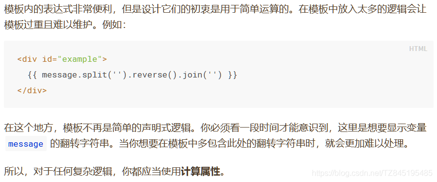
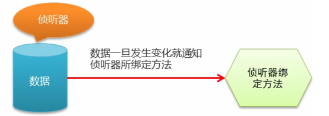
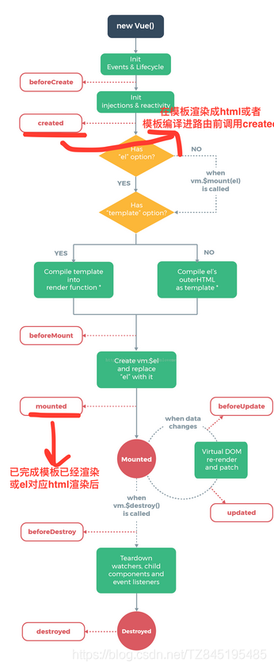
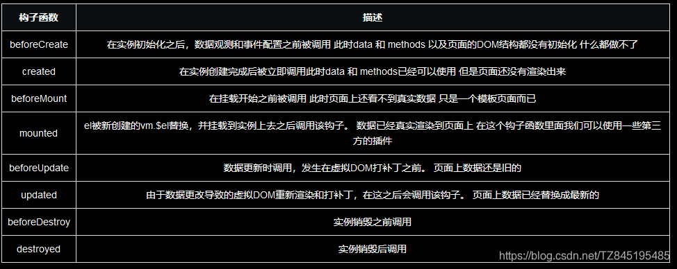
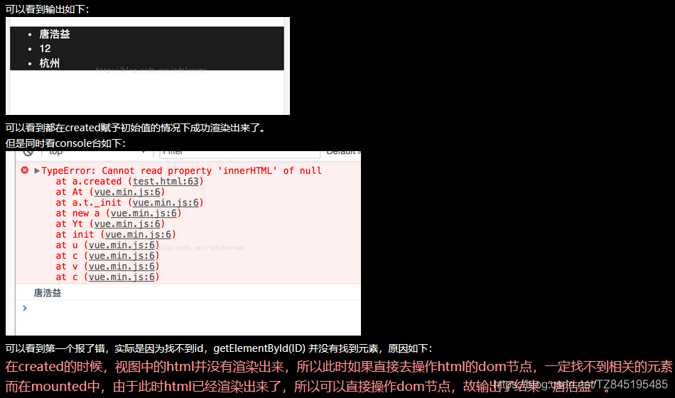

# VUE_02常用操作

> 表单操作、自定义指令、计算属性、侦听器、过滤器、生命周期、数组

# ①. 表单操作

1>.表单操作

## ①. 表单基本操作

```html
<!DOCTYPE html>
<html lang="en">
<head>
    <meta charset="UTF-8">
    <meta name="viewport" content="width=device-width, initial-scale=1.0">
    <title>Document</title>
</head>
<body>
    <div id="app">
    <!--1、两个单选框需要同时通过v-model双向绑定 一个值 
        2、每一个单选框必须要有value属性且value值不能一样 
        3、当某一个单选框选中的时候v-model会将当前的 value值改变data中的数据 
        gender 的值就是选中的值，我们只需要实时监控他的值就可以了 
    -->
        <div>单选框.......</div>
        <input type="radio" id="male" value="1" v-model="gender">
        <label for="male">男</label>
        <input type="radio" id="female" value="2" v-model="gender">
        <label for="female">女</label>
        <!--1、复选框需要同时通过v-model双向绑定一个值 
            2、每一个复选框必须要有value属性且value值不能一样 
            3、当某一个单选框选中的时候 v-model会将当前的 value值改变data中的数据 
            hobby的值就是选中的值，我们只需要实时监控他的值就可以了 -->
        <div>复选框.......</div>
        <input type="checkbox" id="ball" value="1" v-model="hoddy">
        <label for="ball">打篮球</label>
        <input type="checkbox" id="sing" value="2" v-model="hoddy">
        <label for="sing">唱歌</label>
        <input type="checkbox" id="code" value="3" v-model="hoddy">
        <label for="code">写代码</label>
        <div>下拉框.......</div>
        <!-- 多选需要加上 multiple="true" -->
        <select  v-model="citys" multiple="true">
            <option value="">请选择城市</option>
            <option value="shanghai">上海</option>
            <option value="beijing">北京</option>
            <option value="yueyang">岳阳</option>
        </select>
        <div>文本域.......</div>
        <textarea  cols="30" rows="10" v-model="desc"></textarea>
        <button @click="handle()">submit</button>
    </div>
    <script src="../js/vue.js"></script>
    <script>
    var vm=new Vue({
            el:'#app',
            data:{    
                // 默认会让当前的 value 值为 2 的单选框选中
                gender:2,//radio
                // 默认会让当前的 value 值为 2 和 3 的复选框选中
                hoddy:['2','3'],
                //citys:"shanghai" //单个选择
                citys:["shanghai","yueyang"],//选择多个 需要在select中添加multiple=true
                desc:"xiaozhinihao"
            },
            methods:{
                 handle:function(){
                     //如果是数组,想直接获取到里面的值打印出来,需要加上toString()
                     //console.log(this.citys);//Array [ "shanghai", "yueyang" ]
                     //console.log(this.citys.toString());//shanghai,yueyang
                 }
            }
    });
    </script>
</body>
</html>
```

## ②. 表单修饰符

- ①. .number 转换为数值

1. 当开始输入非数字的字符串时，因为Vue无法将字符串转换成数值
2. 所以属性值将实时更新成相同的字符串。即使后面输入数字，也将被视作字符串

- ②. .trim 自动过滤用户输入的首尾空白字符
  (只能去掉首尾的 不能去除中间的空格)
- ③. .lazy 将input事件切换成change事件

1. .lazy 修饰符延迟了同步更新属性值的时机。即将原本绑定在 input 事件的同步逻辑转变为绑定在 change事件上
2. 在失去焦点 或者 按下回车键时才更新
3. v-model默认input事件为change事件(失去焦点才触发)

```html
<!DOCTYPE html>
<html lang="en">
<head>
    <meta charset="UTF-8">
    <meta name="viewport" content="width=device-width, initial-scale=1.0">
    <title>Document</title>
</head>
<body>
    <div id="app">
        <input type="text" v-model.number="msg">
        <!-- 去空格是去除的前后两端的空格,在input框中输入空格(前后),可以给你去除 -->
        <input type="text" v-model.trim="msg2">
        <h4>修饰符lazy</h4>
        <!-- .lazy修饰符修改input触发为change触发
        没有加上lazy之前,当input框中内容发生改变,那么data中的数据也会随着改变
        加了lazy之后,只有当你失去焦点或者按enter,data中的数据才会改变 
        -->
        <input type="text" v-model.lazy="msg_lazy">
        <div>{{msg_lazy}}</div>
        <div>
            <button @click="handle">提交</button>
        </div>
       
        
    </div>
    <script src="../js/vue.js"></script>
    <script>
    var vm=new Vue({
            el:'#app',
            data:{    
                 msg:'',
                 msg2:'',
                 msg_lazy:''
            },
            methods:{
                handle:function(){
                   console.log(this.msg+5);
                   console.log(this.msg2+5);
                }
            }
    });
    </script>
</body>
</html>
```

# ②. 自定义指令

2>.自定义指令(了解)

- ①. Vue.directive 注册全局指令
- ②. Vue.directive 注册全局指令(带参数）

```html
<!DOCTYPE html>
<html lang="en">
<head>
    <meta charset="UTF-8">
    <meta name="viewport" content="width=device-width, initial-scale=1.0">
    <title>Document</title>
</head>
<body>
    <div id="app">
        <input type="text" v-focus>
        <div>--------</div>
        <input type="text" v-color="msg">
    </div>
    <script src="../js/vue.js"></script>
    <script>
        // 1>. 注册一个全局自定义指令 `v-focus`
        Vue.directive('focus', {
       // el表示指令所绑定的元素
       inserted: function (el) {
       // 聚焦元素
       el.focus()
     }
    });

        //2>. 带参数
        // 注册一个全局自定义指令 `v-focus`
        Vue.directive('color', {
       // el表示指令所绑定的元素
       inserted: function (el,binding) {
         //el:表示的是<input type="text" v-color="msg">  
         //binding-->Object { name: "color", rawName: "v-color", value: "red", expression: "msg", modifiers: {}, def: {…} }
         el.style.backgroundColor=binding.value;
         console.log(el);
         console.log(binding);
     
     }
    });    
    var vm=new Vue({
            el:'#app',
            data:{    
              msg:"red"
            }
    });
    </script>
</body>
</html>
```

- ③. 注册局部指令

```html
<input type="text" v-color='msg'>
 <input type="text" v-focus>
 <script type="text/javascript">
    /*
      自定义指令-局部指令
    */
    var vm = new Vue({
      el: '#app',
      data: {
        msg: {
          color: 'red'
        }
      },
   	  //局部指令，需要定义在  directives 的选项
      directives: {
        color: {
          bind: function(el, binding){
            el.style.backgroundColor = binding.value.color;
          }
        },
        focus: {
          inserted: function(el) {
            el.focus();
          }
        }
      }
    });
  </script>

```

# ③. 计算属性(computed)

**`3>.` 计算属性 computed `掌握`**

- ①. 模板中放入太多的逻辑会让模板过重且难以维护,使用计算属性可以让模板更加的简洁
  
- ②. 计算属性是基于它们的依赖进行缓存的(依赖就是指的data中的数据),而方法不存在缓存
- **③. 注意：只要data中的数据不发生改变,那么第二次调用计算属性的时候使用的就是第一次的结果,直接用缓存;方法不会用到缓存中的数据,你显示申明调用几次,方法就会执行几次**
- **④. `需要返回一个新的结果使用 计算属性(computed)`**

```html
 <!DOCTYPE html>
<html lang="en">
<head>
    <meta charset="UTF-8">
    <meta name="viewport" content="width=device-width, initial-scale=1.0">
    <title>Document</title>
</head>
<body>
    <div id="app">
        {{message}}
        {{message.split('').reverse().join('')}}
        <h2>computed...</h2>
        <!-- 这里使用了两次reversedMessage,但是由于data中的message信息没有发生改变,
            所以第二次用了缓存;console.log("computed.....")出现一次
         -->
        {{reversedMessage}}
        {{reversedMessage}}
        <!-- 这里是调用两次方法,方法不会使用缓存,所有会出现两次
        alert("method....");
        -->
        {{handle()}}
        {{handle()}}
    </div>
    <script src="../js/vue.js"></script>
    <script>
    var vm=new Vue({
            el:'#app',
            data:{    
               message:'hello'
            },
            methods:{
               handle:function(){
                //console.log("mehtod.....");
                alert("method....");
                return this.message.split('').reverse().join('');
               }
            },
            computed: {
            //reverseString 这个是我们自己定义的名字
            reversedMessage: function () {
            //这里一定要有return 否则 调用 reverseString的时候无法拿到结果
            console.log("computed.....");
            return this.message.split('').reverse().join('');
            }
        }
    });
    </script>
</body>
</html>
```

# ④. 侦听器(watch）

**`4>.` 侦听器(watch）`掌握`**

- **①. watch 中的属性一定是data中已经存在的数据**
- ②. 当需要监听一个对象的改变时，普通的watch方法无法监听到对象内部属性的改变只有data中的数据才能够监听到变化，此时就需要deep属性对对象进行深度监听
- **③. 数据变化时执行异步或开销较大的操作,只需要监听数据的变化使用侦听器(watch)**

1. **需要返回一个新的结果使用`计算属性(computed)`**
2. **只需要监听数据的变化使用`侦听器(watch)`**
   

```html
<!DOCTYPE html>
<html lang="en">
<head>
    <meta charset="UTF-8">
    <meta name="viewport" content="width=device-width, initial-scale=1.0">
    <title>Document</title>
</head>
<body>
    <div id="app">
        <div id="demo">{{ fullName }}</div>
    </div>
    <script src="../js/vue.js"></script>
    <script>
    var vm=new Vue({
            el:'#app',
            data:{    
              firstName: 'Foo',
              lastName: 'Bar',
              //fullName: 'Foo Bar'
            },
            methods:{
                
              
            },
            //注意:如果data中的属性发生了改变(firstName|lastName)会触发watch
            watch: {
                firstName: function (val) {
                    //vm.firstName="xiaozhi"
                    //firstName change....xiaozhi
                    console.log("firstName change...."+val)
                    this.fullName = val + ' ' + this.lastName
                },
                lastName: function (val) {
                    console.log("lastName change...."+val);
                    this.fullName = this.firstName + ' ' + val
                }
            },
            //这里可以使用计算属性computed(更加简洁)
            computed: {
                    // 计算属性的 getter
                fullName: function () {
                    // `this` 指向 vm 实例
                    return this.firstName+' '+this.lastName;
                }
            }
    });
    </script>
</body>
</html>
12345678910111213141516171819202122232425262728293031323334353637383940414243444546474849
<!DOCTYPE html>
<html lang="en">
<head>
    <meta charset="UTF-8">
    <meta name="viewport" content="width=device-width, initial-scale=1.0">
    <title>Document</title>
</head>
<body>
    <div id="app">
         <span>用户名:</span>
         <input type="text" v-model.lazy="username">
         <span>{{tip}}</span>
    </div>
    <script src="../js/vue.js"></script>
    <script>
    /*
      侦听器:
       1.采用侦听器监听用户名的变化
       2.调用后台接口进行验证
       3.根据验证的结果调整提示内容    
    */
    var vm=new Vue({
            el:'#app',
            data:{    
              username:'',
              tip:''
            },
            methods:{
              checkName:function (username) {
                   var that=this;
                   setTimeout(function(){
                       //注意定时器中的this代表的是window对象
                       console.log(this);
                       if(username=='admin'){
                           that.tip='用户名已经存在....';
                       }else{
                           that.tip='用户名不存在...';
                       }
                   },2000);
                }
            },
            watch:{
                username:function(val){
                    this.tip="正在验证....";
                    //调用后台接口验证用户名的可用性
                    this.checkName(val);
                } 
            }
    });
    </script>
</body>
</html>
12345678910111213141516171819202122232425262728293031323334353637383940414243444546474849505152
```

# ⑤. 过滤器

5>.过滤器(了解)

- ①. 过滤器可以用在两个地方：双花括号插值和 v-bind 表达式 (后者从 2.1.0+ 开始支持)
- ②. 过滤器应该被添加在JavaScript表达式的尾部，由“管道”符号指示
- ③. 支持级联操作,过滤器不改变真正的data，而只是改变渲染的结果，并返回过滤后的版本

```html
 <div id="app">
    <input type="text" v-model='msg'>
      <!-- upper 被定义为接收单个参数的过滤器函数，表达式  msg  的值将作为参数传入到函数中 -->
    <div>{{msg | upper}}</div>
    <!--  
      支持级联操作
      upper  被定义为接收单个参数的过滤器函数，表达式msg 的值将作为参数传入到函数中。
	  然后继续调用同样被定义为接收单个参数的过滤器 lower ，将upper 的结果传递到lower中
 	-->
    <div>{{msg | upper | lower}}</div>
    <div :abc='msg | upper'>测试数据</div>
  </div>

<script type="text/javascript">
   //  lower  为全局过滤器     
   Vue.filter('lower', function(val) {
      return val.charAt(0).toLowerCase() + val.slice(1);
    });
    var vm = new Vue({
      el: '#app',
      data: {
        msg: ''
      },
       //filters  属性 定义 和 data 已经 methods 平级 
       //  定义filters 中的过滤器为局部过滤器 
      filters: {
        //   upper  自定义的过滤器名字 
        //    upper 被定义为接收单个参数的过滤器函数，表达式  msg  的值将作为参数传入到函数中
        upper: function(val) {
         //  过滤器中一定要有返回值 这样外界使用过滤器的时候才能拿到结果
          return val.charAt(0).toUpperCase() + val.slice(1);
        }
      }
    });
  </script>
```

- ④. 过滤器中传递参数
  传递参数规制：使用过滤器通过（）的方式传递参数、接收参数从第二个开始接收

```html
<div id="box">
        <!--
			filterA 被定义为接收三个参数的过滤器函数。
  			其中 message 的值作为第一个参数，
			普通字符串 'arg1' 作为第二个参数，表达式 arg2 的值作为第三个参数。
		-->
        {{ message | filterA('arg1', 'arg2') }}
    </div>
    <script>
        // 在过滤器中 第一个参数 对应的是  管道符前面的数据   n  此时对应 message
        // 第2个参数  a 对应 实参  arg1 字符串
        // 第3个参数  b 对应 实参  arg2 字符串
        Vue.filter('filterA',function(n,a,b){
            if(n<10){
                return n+a;
            }else{
                return n+b;
            }
        });
        
        new Vue({
            el:"#box",
            data:{
                message: "哈哈哈"
            }
        })

    </script>
```

- **⑤. 日期格式化 `掌握`**

```html
<!DOCTYPE html>
<html lang="en">
<head>
    <meta charset="UTF-8">
    <meta name="viewport" content="width=device-width, initial-scale=1.0">
    <title>Document</title>
</head>
<body>
    <div id="app">
        <div>当前时间是： {{ dateTime }}</div>
        <div>格式化后的时间是： {{ dateTime | dateFormat }}</div>
      </div>
      <script src="../js/vue.js"></script>
      <script>
        var vm = new Vue({
          el: '#app',
          data: {
            dateTime: new Date(),
          },
          // 定义一个局部的过滤器，格式化当前时间
          filters: {
            dateFormat: (dateTime) => {
              var now = new Date(dateTime)
              var y = now.getFullYear()
              var m = (now.getMonth() + 1).toString().padStart(2, '0')
              var d = now.getDate().toString().padStart(2, '0')
              var hh = now.getHours().toString().padStart(2, '0')
              var mm = now.getMinutes().toString().padStart(2, '0')
              var ss = now.getSeconds().toString().padStart(2, '0')
              // 过滤器中要有返回值
              return `${y}-${m}-${d} ${hh}:${mm}:${ss}`
            }
          }
        })
      </script>
      <script>

        var arr=[1,2,3,4];
        console.log(arr.push("5"));
      </script>

</body>
</html>
```

# ⑥. 生命周期与钩子函数

**`6>.` 生命周期与钩子函数**

- ①. 图解：



- **②. `钩子函数：`**
- **`created`**：html页面还没有被渲染,可以在这里进行一些属性的赋值操作(在实例创建完成后被立即调用此时data 和 methods已经可以使用 但是页面还没有渲染出来)
- **`mounted`**:html页面已经渲染完成了,可以通过getElementById( )去操作dom(el被新创建的vm.$el替换，并挂载到实例上去之后调用该钩子。 数据已经真实渲染到页面上 在这个钩子函数里面我们可以使用一些第三方的插件)
- ③. 其他钩子解释：
  
- ④. 代码解释created和mounted区别：

```js
      Vue.component("demo1",{
        data:function(){
            return {
                name:"",
                age:"",
                city:""
            }
        },
        template:"<ul><li id='name'>{{name}}</li><li>{{age}}</li><li>{{city}}</li></ul>",
        created:function(){
            this.name="唐浩益"
            this.age = "12"
            this.city ="杭州"
            var x = document.getElementById("name")//第一个命令台错误
            console.log(x.innerHTML);
        },
        mounted:function(){
            var x = document.getElementById("name")//第二个命令台输出的结果
            console.log(x.innerHTML);
        }
    });
    var vm = new Vue({
        el:"#app"
    })
```



# ⑦. 数组常用方法

