# ①. 技术选型

**`1>.` 技术选型**

- ①. Springboot版本选择
  (如果只用springboot可以用官网最新版本,如果结合了cloud,那么要依据cloud选择boot)

1. git源码地址：https://github.com/spring-projects/spring-boot/releases/
2. SpringBoot2.0新特性：https://github.com/spring-projects/spring-boot/wiki/Spring-Boot-2.0-Release-Notes
3. 通过上面官网发现，Boot官方强烈建议你升级到2.X以上版本
   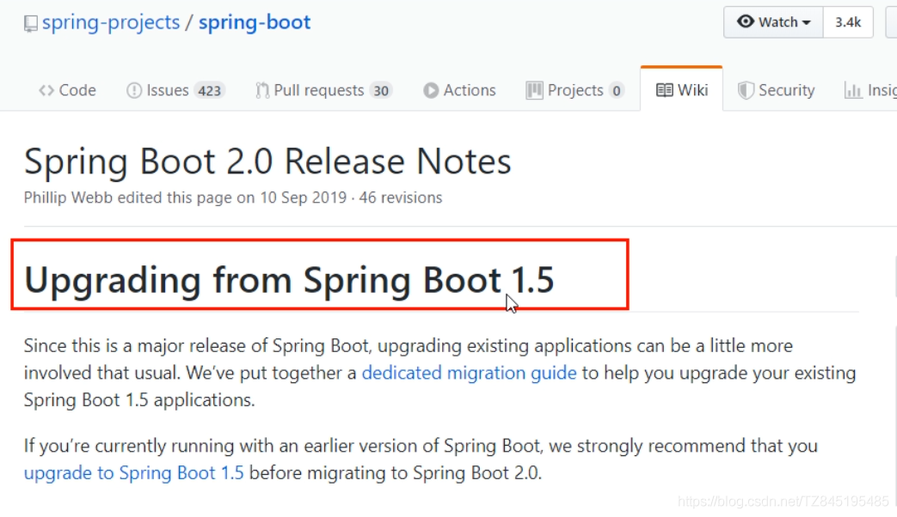

- ②. SpringCloud版本选择

1. git源码地址：https://github.com/spring-projects/spring-cloud/wiki
2. 官网：https://spring.io/projects/spring-cloud
3. Cloud命名规则
   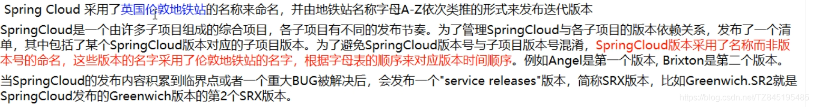

- ③. SpringCloud和Springboot之间的依赖关系如何看

1. 依赖：
   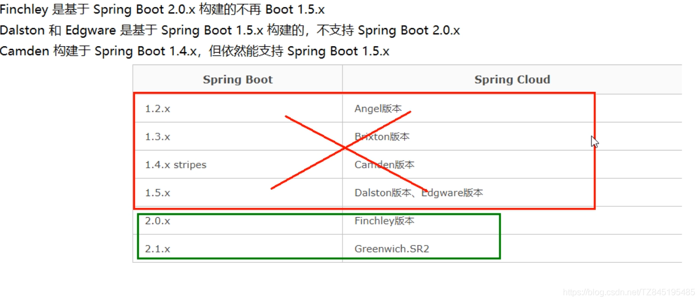
2. 更详细的版本对应查看方法：https://start.spring.io/actuator/info
   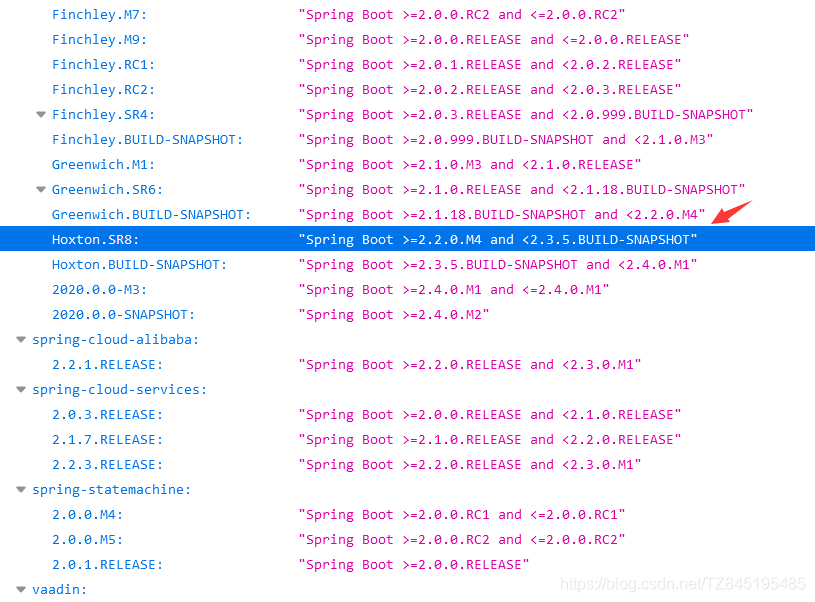

# ②. 搭建父工程

2>.搭建父工程

- ①. pom.xml

```xml
<!-- 统一管理jar包版本 -->
    <properties>
        <project.build.sourceEncoding>UTF-8</project.build.sourceEncoding>
        <maven.compiler.source>1.8</maven.compiler.source>
        <maven.compiler.target>1.8</maven.compiler.target>
        <junit.version>4.12</junit.version>
        <log4j.version>1.2.17</log4j.version>
        <lombok.version>1.16.18</lombok.version>
        <mysql.version>5.1.47</mysql.version>
        <druid.version>1.1.16</druid.version>
        <mybatis.spring.boot.version>1.3.0</mybatis.spring.boot.version>
    </properties>
    <!-- 子模块继承之后，提供作用：锁定版本+子modlue不用写groupId和version  -->
    <dependencyManagement>
        <!--
        dependencyManagement:
        通常会在一个组织或项目的最顶层的父pom中看到dependencyManagement元素。
        dependencies:
        -->
        <dependencies>
            <!--spring boot 2.2.2-->
            <dependency>
                <groupId>org.springframework.boot</groupId>
                <artifactId>spring-boot-dependencies</artifactId>
                <version>2.2.2.RELEASE</version>
                <type>pom</type>
                <scope>import</scope>
            </dependency>
            <!--spring cloud Hoxton.SR1-->
            <dependency>
                <groupId>org.springframework.cloud</groupId>
                <artifactId>spring-cloud-dependencies</artifactId>
                <version>Hoxton.SR1</version>
                <type>pom</type>
                <scope>import</scope>
            </dependency>
            <!--spring cloud alibaba 2.1.0.RELEASE-->
            <dependency>
                <groupId>com.alibaba.cloud</groupId>
                <artifactId>spring-cloud-alibaba-dependencies</artifactId>
                <version>2.1.0.RELEASE</version>
                <type>pom</type>
                <scope>import</scope>
            </dependency>

            <dependency>
                <groupId>mysql</groupId>
                <artifactId>mysql-connector-java</artifactId>
                <version>${mysql.version}</version>
            </dependency>
            <dependency>
                <groupId>com.alibaba</groupId>
                <artifactId>druid</artifactId>
                <version>${druid.version}</version>
            </dependency>
            <dependency>
                <groupId>org.mybatis.spring.boot</groupId>
                <artifactId>mybatis-spring-boot-starter</artifactId>
                <version>${mybatis.spring.boot.version}</version>
            </dependency>
            <dependency>
                <groupId>junit</groupId>
                <artifactId>junit</artifactId>
                <version>${junit.version}</version>
            </dependency>
            <dependency>
                <groupId>log4j</groupId>
                <artifactId>log4j</artifactId>
                <version>${log4j.version}</version>
            </dependency>
            <dependency>
                <groupId>org.projectlombok</groupId>
                <artifactId>lombok</artifactId>
                <version>${lombok.version}</version>
                <optional>true</optional>
            </dependency>
        </dependencies>
    </dependencyManagement>

    <build>
        <plugins>
            <plugin>
                <groupId>org.springframework.boot</groupId>
                <artifactId>spring-boot-maven-plugin</artifactId>
                <configuration>
                    <fork>true</fork>
                    <addResources>true</addResources>
                </configuration>
            </plugin>
        </plugins>
    </build>
```

- ②. 具体的创建步骤：

> 步骤：
> 1.聚合总工程名字
> 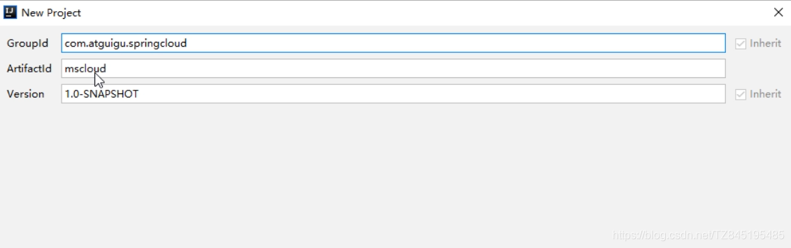2.字符编码
> 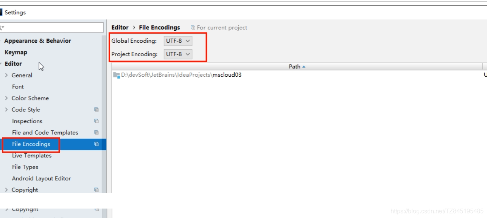3.注解生效激活
> 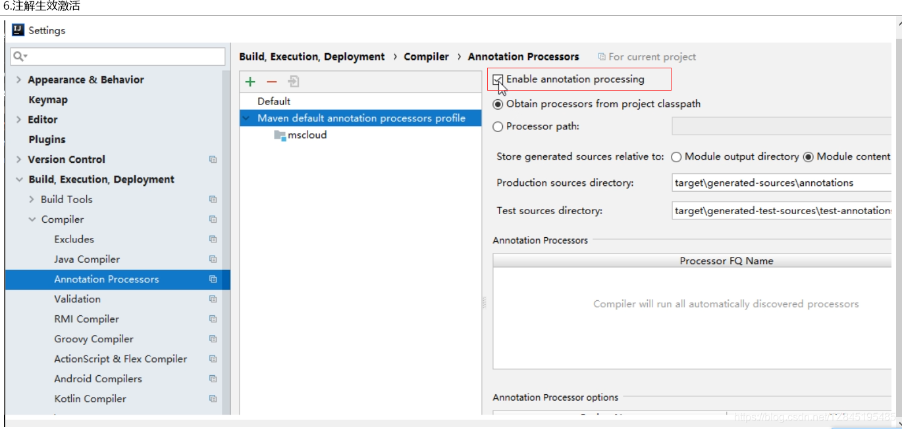4.java编译版本选8
> 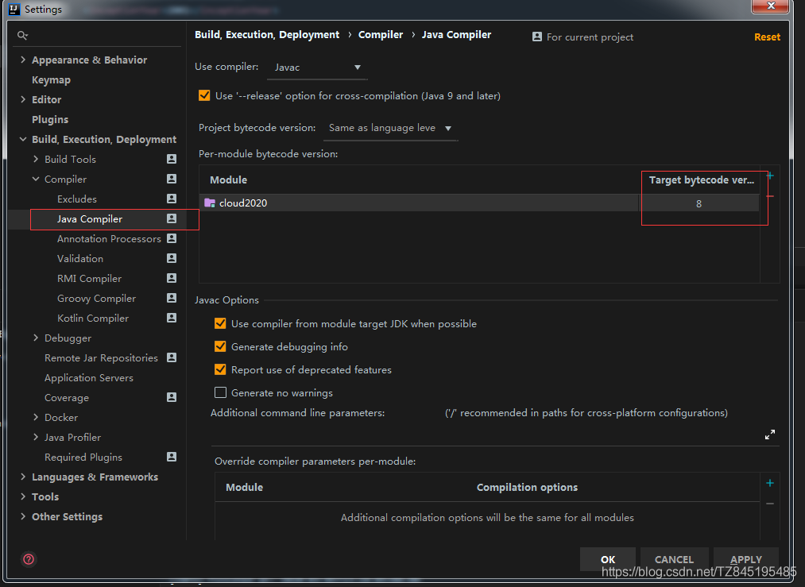5.File Type过滤(可选)
> 

# ③. 支付模块(cloud-provider-payment8001)

3>.支付模块(cloud-provider-payment8001)
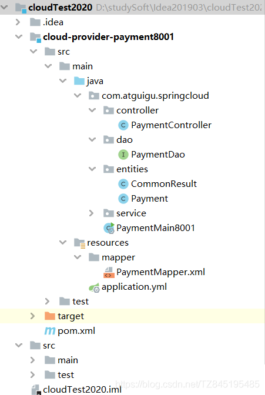

- ①. pom.xml

```xml
 <dependencies>
        <dependency>
            <groupId>com.atguigu.springcloud</groupId>
            <artifactId>cloud-api-commons</artifactId>
            <version>${project.version}</version>
        </dependency>
        <dependency>
            <groupId>org.springframework.boot</groupId>
            <artifactId>spring-boot-starter-web</artifactId>
        </dependency>
        <dependency>
            <groupId>org.springframework.boot</groupId>
            <artifactId>spring-boot-starter-actuator</artifactId>
        </dependency>

        <dependency>
            <groupId>org.mybatis.spring.boot</groupId>
            <artifactId>mybatis-spring-boot-starter</artifactId>
        </dependency>
        <dependency>
            <groupId>com.alibaba</groupId>
            <artifactId>druid-spring-boot-starter</artifactId>
            <version>1.1.10</version>
        </dependency>
        <dependency>
            <groupId>mysql</groupId>
            <artifactId>mysql-connector-java</artifactId>
        </dependency>
        <dependency>
            <groupId>org.springframework.boot</groupId>
            <artifactId>spring-boot-starter-jdbc</artifactId>
        </dependency>
        <dependency>
            <groupId>org.springframework.boot</groupId>
            <artifactId>spring-boot-devtools</artifactId>
            <scope>runtime</scope>
            <optional>true</optional>
        </dependency>
        <dependency>
            <groupId>org.projectlombok</groupId>
            <artifactId>lombok</artifactId>
            <optional>true</optional>
        </dependency>
        <dependency>
            <groupId>org.springframework.boot</groupId>
            <artifactId>spring-boot-starter-test</artifactId>
            <scope>test</scope>
        </dependency>
    </dependencies>
```

- ②. application.yml

```yml
server:
  port: 8001

spring:
  application:
    name: cloud-payment-service
  datasource:
    type: com.alibaba.druid.pool.DruidDataSource
    driver-class-name: org.gjt.mm.mysql.Driver
    url: jdbc:mysql://localhost:3306/db2019?useUnicode=true&characterEncoding=utf-8&useSSL=false
    username: root
    password: root

mybatis:
  mapperLocations: classpath:mapper/*.xml
  type-aliases-package: com.atguigu.springcloud.entities
```

- ③. PaymentMapper.xml

```xml
<!DOCTYPE mapper PUBLIC "-//mybatis.org//DTD Mapper 3.0//EN" "http://mybatis.org/dtd/mybatis-3-mapper.dtd">
<mapper namespace="com.atguigu.springcloud.dao.PaymentDao">

    <resultMap id="BaseResultMap" type="com.atguigu.springcloud.entities.Payment">
        <id column="id" property="id" jdbcType="BIGINT"></id>
        <result column="serial" property="serial" jdbcType="VARCHAR"></result>
    </resultMap>


    <!--
    (1). useGeneratedKeys默认是false,keyProperty实体类对应主键的属性,keyColumn表中的主键
    (2). 使用selectKey进行
       <insert id="createPayment" parameterType="com.xiaozhi.Payment">
        /*
       总体解释：将插入数据的主键返回到Payment对象中。
       具体解释：
            a. SELECT LAST_INSERT_ID()：得到刚 insert进去记录的主键值，只适用与自增主键
            b. keyProperty：将查询到主键值设置到 parameterType指定的对象的那个属性
            c. order：SELECT LAST_INSERT_ID() 执行顺序,相对于insert语句来说它的执行顺序
            e. resultType：指定 SELECTLAST_INSERT_ID() 的结果类型
        */
        <selectKey resultType="int" order="AFTER" keyProperty="id">
            select LAST_INSERT_ID()
        </selectKey>
        insert into payment(serial) values (#{serial})
    </insert>
    -->
    <insert id="createPayment" parameterType="com.atguigu.springcloud.entities.Payment">
        <!--返回值这里是long,是因为实体类中的数据类型是：private Long id-->
        <selectKey resultType="long" keyProperty="id" order="AFTER">
            select LAST_INSERT_ID()
        </selectKey>
        insert into payment(serial) values (#{serial})
    </insert>
<!--    <insert id="createPayment" parameterType="com.atguigu.springcloud.entities.Payment" useGeneratedKeys="true" keyProperty="id">-->
<!--        insert into payment(serial) values (#{serial})-->
<!--    </insert>-->


    <!--查询 public Payment getPaymentById(@Param("id")Long id);-->
    <select id="getPaymentById" parameterType="long" resultMap="BaseResultMap">
        select * from payment where id = #{id}
    </select>
</mapper>
```

- ④. controller

```java
@SuppressWarnings("all")
@RestController
@Slf4j
@RequestMapping("/payment")
public class PaymentController {

    @Autowired
    private PaymentService paymentService;

    //新增
    @PostMapping("/create")
    public CommonResult create(@RequestBody Payment payment){
        int result = paymentService.create(payment);
        if(result>0){
            return new CommonResult(200,"新增成功！",payment);
        }
        return new CommonResult(404,"新增失败！",null);
    }
    //通过id进行查询
    @GetMapping("/get/{id}")
    public CommonResult getPaymentById(@PathVariable Long id){
        Payment payment = paymentService.getPaymentById(id);
        log.info("****查询结果为：****");
        if(payment!=null){
            return new CommonResult(200,"查询成功",payment);
        }
        return new CommonResult(444,"查询失败",null);
    }

}
```

# ④. 订单模块(cloud-consumer-order80)

**`4>.` 订单模块(cloud-consumer-order80)**

- ①. RestTemplate提供了多种便捷访问远程Http服务的方法,是一种简单便捷的访问restFul服务模板类,是Spring提供的用于访问Rest服务的客户端模板工具集
- ②. restTemplate.postForObject(url+"/create",payment,CommonResult.class);
- ③. restTemplate.getForObject(url+"/get/"+id,CommonResult.class);


- ①. pom.xml

```xml
   <dependencies>
        <dependency>
            <groupId>org.springframework.boot</groupId>
            <artifactId>spring-boot-starter-web</artifactId>
        </dependency>
        <dependency>
            <groupId>org.springframework.boot</groupId>
            <artifactId>spring-boot-starter-actuator</artifactId>
        </dependency>
        <dependency>
            <groupId>org.springframework.boot</groupId>
            <artifactId>spring-boot-devtools</artifactId>
            <scope>runtime</scope>
            <optional>true</optional>
        </dependency>
        <dependency>
            <groupId>org.projectlombok</groupId>
            <artifactId>lombok</artifactId>
            <optional>true</optional>
        </dependency>
        <dependency>
            <groupId>org.springframework.boot</groupId>
            <artifactId>spring-boot-starter-test</artifactId>
        </dependency>
    </dependencies>
```

- ②. application.yml

```yml
server:
  port: 80
12
```

- ③. OrderMain80

```java
@SpringBootApplication
public class OrderMain80 {
    public static void main(String[] args) {
        SpringApplication.run(OrderMain80.class,args);
    }
}
```

- ④. Payment | CommonResult

```java
@Data
@NoArgsConstructor
@AllArgsConstructor
public class Payment {
    private Long id;
    private String serial;
}
1234567
@Data
@NoArgsConstructor
@AllArgsConstructor
public class CommonResult<T> {
    private Integer code;
    private String message;
    private T data;
}
```

- ⑤. ApplicationContextConfig

```java
@Configuration
public class ApplicationContextConfig {

    @Bean
    public RestTemplate getRestTemplate(){
        return new RestTemplate();
    }
```

- ⑥. OrderController

```java
@SuppressWarnings("all")
@RestController
@RequestMapping("/consumer")
@Slf4j
public class OrderController {

    @Autowired
    private RestTemplate restTemplate;

    private static final String url="http://localhost:8001/payment";

    @PostMapping("/payment/create")
    public CommonResult<Payment> create(@RequestBody Payment payment){
        log.info("****新增****");
       return restTemplate.postForObject(url+"/create",payment,CommonResult.class);
    }
    //http://localhost:8001/payment/get/32
    @GetMapping("/payment/get/{id}")
    public CommonResult<Payment>get(@PathVariable Long id){
        return restTemplate.getForObject(url+"/get/"+id,CommonResult.class);
    }
}
```

# ⑤. 热部署Devtools(开发阶段)

**`5>.` 热部署Devtools(开发阶段)**

- ①. adding devtools to your project

```xml
   <dependency>
          <groupId>org.springframework.boot</groupId>
          <artifactId>spring-boot-devtools</artifactId>
          <scope>runtime</scope>
          <optional>true</optional>
      </dependency>
```

- ②. adding plugin to your pom.xml(添加聚合父类总工程的pom.xml)

```xml
 <build>
        <plugins>
            <plugin>
                <groupId>org.springframework.boot</groupId>
                <artifactId>spring-boot-maven-plugin</artifactId>
                <configuration>
                    <fork>true</fork>
                    <addResources>true</addResources>
                </configuration>
            </plugin>
        </plugins>
    </build>
```

- ③. Enabling automatic build(开启自动编译的选项)
  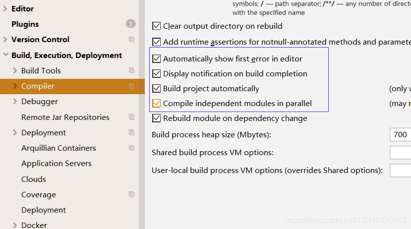
- ④. Update the value of(更新值)
  Ctrl+Shift+A打开全局搜索搜registry

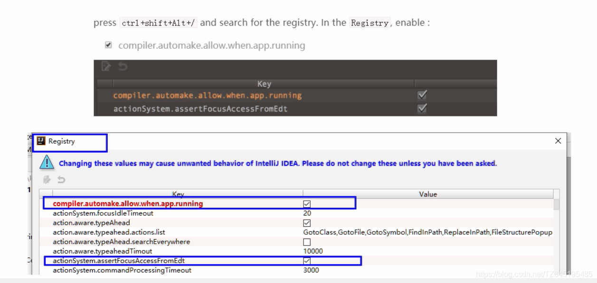

- ⑤. 重启Idea

# ⑥. 测试Run DashBord

**`6>.` 测试Run DashBord`掌握`**

- 运用spring cloud框架基于spring boot构建微服务，一般需要启动多个应用程序，在idea开发工具中，多个同时启动的应用需要在RunDashboard运行仪表盘中可以更好的管理，但有时候idea中的RunDashboard窗口没有显示出来，也找不到直接的开启按钮；idea中打开Run Dashboard的方法如下：
  view > Tool Windows > Run Dashboard
- 在workspace.xml中添加如下配置

```handlebars
<component name="RunDashboard">
<option name="configurationTypes">
  <set>
    <option value="SpringBootApplicationConfigurationType"/>
  </set>
</option>
<option name="ruleStates">
  <list>
    <RuleState>
      <option name="name" value="ConfigurationTypeDashboardGroupingRule"/>
    </RuleState>
    <RuleState>
      <option name="name" value="StatusDashboardGroupingRule"/>
    </RuleState>
  </list>
</option>
</component>
1234567891011121314151617
```

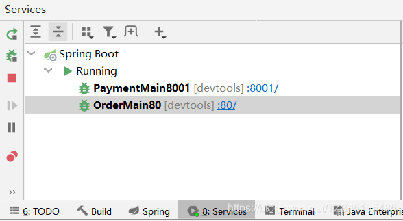

# ⑦. 工程重构

**`7>.` 工程重构**

- ①. 观察问题：
  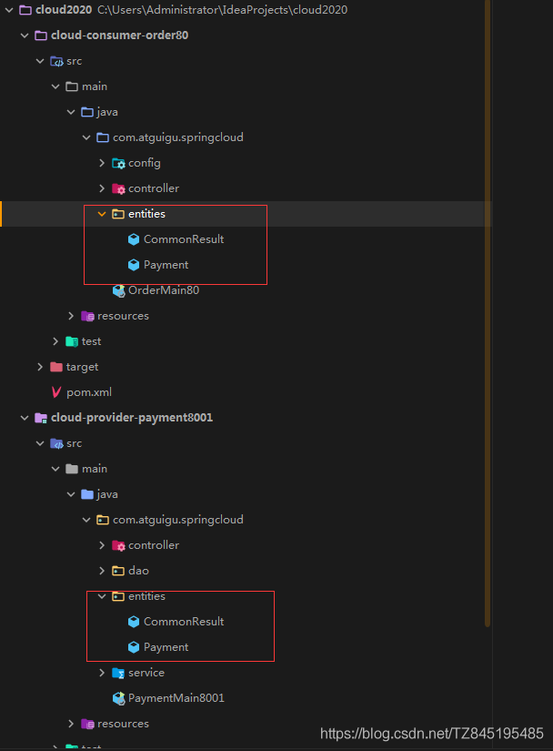
- ②. pom.xml

```xml
  <dependencies>
    <dependency>
        <groupId>org.projectlombok</groupId>
        <artifactId>lombok</artifactId>
        <optional>true</optional>
    </dependency>
    <dependency>
        <groupId>org.springframework.boot</groupId>
        <artifactId>spring-boot-devtools</artifactId>
        <scope>runtime</scope>
        <optional>true</optional>
    </dependency>
    <dependency>
        <groupId>cn.hutool</groupId>
        <artifactId>hutool-all</artifactId>
        <version>5.1.0</version>
    </dependency>
</dependencies>
123456789101112131415161718
```

- ③. maven命令clean install
- ④. 订单80和支付8001分别改造
  删除各自的原先有过的entities文件夹
  各自黏贴POM内容

```xml
   <!--公共的api-->
   <dependency>
       <groupId>com.atguigu.springcloud</groupId>
       <artifactId>cloud-api-commons</artifactId>
       <version>1.0-SNAPSHOT</version>
   </dependency>
```