# ①. 环境搭建

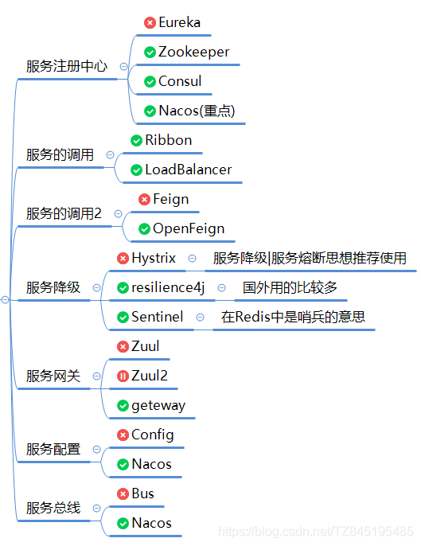

## ①. SpringBoot和Cloud坏境

1>.SpringBoot和Cloud坏境
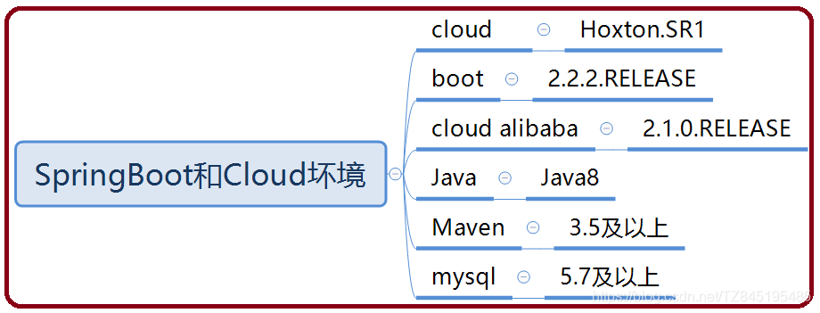

## ②. 搭建父工程

2>.搭建父工程

- ①. pom.xml

```xml
<!-- 统一管理jar包版本 -->
    <properties>
        <project.build.sourceEncoding>UTF-8</project.build.sourceEncoding>
        <maven.compiler.source>1.8</maven.compiler.source>
        <maven.compiler.target>1.8</maven.compiler.target>
        <junit.version>4.12</junit.version>
        <log4j.version>1.2.17</log4j.version>
        <lombok.version>1.16.18</lombok.version>
        <mysql.version>5.1.47</mysql.version>
        <druid.version>1.1.16</druid.version>
        <mybatis.spring.boot.version>1.3.0</mybatis.spring.boot.version>
    </properties>
    <!-- 子模块继承之后，提供作用：锁定版本+子modlue不用写groupId和version  -->
    <dependencyManagement>
        <!--
        dependencyManagement:
        通常会在一个组织或项目的最顶层的父pom中看到dependencyManagement元素。
        dependencies:
        -->
        <dependencies>
            <!--spring boot 2.2.2-->
            <dependency>
                <groupId>org.springframework.boot</groupId>
                <artifactId>spring-boot-dependencies</artifactId>
                <version>2.2.2.RELEASE</version>
                <type>pom</type>
                <scope>import</scope>
            </dependency>
            <!--spring cloud Hoxton.SR1-->
            <dependency>
                <groupId>org.springframework.cloud</groupId>
                <artifactId>spring-cloud-dependencies</artifactId>
                <version>Hoxton.SR1</version>
                <type>pom</type>
                <scope>import</scope>
            </dependency>
            <!--spring cloud alibaba 2.1.0.RELEASE-->
            <dependency>
                <groupId>com.alibaba.cloud</groupId>
                <artifactId>spring-cloud-alibaba-dependencies</artifactId>
                <version>2.1.0.RELEASE</version>
                <type>pom</type>
                <scope>import</scope>
            </dependency>

            <dependency>
                <groupId>mysql</groupId>
                <artifactId>mysql-connector-java</artifactId>
                <version>${mysql.version}</version>
            </dependency>
            <dependency>
                <groupId>com.alibaba</groupId>
                <artifactId>druid</artifactId>
                <version>${druid.version}</version>
            </dependency>
            <dependency>
                <groupId>org.mybatis.spring.boot</groupId>
                <artifactId>mybatis-spring-boot-starter</artifactId>
                <version>${mybatis.spring.boot.version}</version>
            </dependency>
            <dependency>
                <groupId>junit</groupId>
                <artifactId>junit</artifactId>
                <version>${junit.version}</version>
            </dependency>
            <dependency>
                <groupId>log4j</groupId>
                <artifactId>log4j</artifactId>
                <version>${log4j.version}</version>
            </dependency>
            <dependency>
                <groupId>org.projectlombok</groupId>
                <artifactId>lombok</artifactId>
                <version>${lombok.version}</version>
                <optional>true</optional>
            </dependency>
        </dependencies>
    </dependencyManagement>

    <build>
        <plugins>
            <plugin>
                <groupId>org.springframework.boot</groupId>
                <artifactId>spring-boot-maven-plugin</artifactId>
                <configuration>
                    <fork>true</fork>
                    <addResources>true</addResources>
                </configuration>
            </plugin>
        </plugins>
    </build>
```

- ②. 具体的创建步骤：

> 步骤：
> 1.聚合总工程名字
> 2.字符编码
> 3.注解生效激活
> 4.java编译版本选8
> 5.File Type过滤(可选)
> 

## ③. 支付模块(cloud-provider-payment8001)

3>.支付模块(cloud-provider-payment8001)


- ①. pom.xml

```xml
 <dependencies>
        <dependency>
            <groupId>com.atguigu.springcloud</groupId>
            <artifactId>cloud-api-commons</artifactId>
            <version>${project.version}</version>
        </dependency>
        <dependency>
            <groupId>org.springframework.boot</groupId>
            <artifactId>spring-boot-starter-web</artifactId>
        </dependency>
        <dependency>
            <groupId>org.springframework.boot</groupId>
            <artifactId>spring-boot-starter-actuator</artifactId>
        </dependency>

        <dependency>
            <groupId>org.mybatis.spring.boot</groupId>
            <artifactId>mybatis-spring-boot-starter</artifactId>
        </dependency>
        <dependency>
            <groupId>com.alibaba</groupId>
            <artifactId>druid-spring-boot-starter</artifactId>
            <version>1.1.10</version>
        </dependency>
        <dependency>
            <groupId>mysql</groupId>
            <artifactId>mysql-connector-java</artifactId>
        </dependency>
        <dependency>
            <groupId>org.springframework.boot</groupId>
            <artifactId>spring-boot-starter-jdbc</artifactId>
        </dependency>
        <dependency>
            <groupId>org.springframework.boot</groupId>
            <artifactId>spring-boot-devtools</artifactId>
            <scope>runtime</scope>
            <optional>true</optional>
        </dependency>
        <dependency>
            <groupId>org.projectlombok</groupId>
            <artifactId>lombok</artifactId>
            <optional>true</optional>
        </dependency>
        <dependency>
            <groupId>org.springframework.boot</groupId>
            <artifactId>spring-boot-starter-test</artifactId>
            <scope>test</scope>
        </dependency>
    </dependencies>
```

- ②. application.yml

```yml
server:
  port: 8001

spring:
  application:
    name: cloud-payment-service
  datasource:
    type: com.alibaba.druid.pool.DruidDataSource
    driver-class-name: org.gjt.mm.mysql.Driver
    url: jdbc:mysql://localhost:3306/db2019?useUnicode=true&characterEncoding=utf-8&useSSL=false
    username: root
    password: root

mybatis:
  mapperLocations: classpath:mapper/*.xml
  type-aliases-package: com.atguigu.springcloud.entities
```

- ③. PaymentMapper.xml

```xml
<!DOCTYPE mapper PUBLIC "-//mybatis.org//DTD Mapper 3.0//EN" "http://mybatis.org/dtd/mybatis-3-mapper.dtd">
<mapper namespace="com.atguigu.springcloud.dao.PaymentDao">

    <resultMap id="BaseResultMap" type="com.atguigu.springcloud.entities.Payment">
        <id column="id" property="id" jdbcType="BIGINT"></id>
        <result column="serial" property="serial" jdbcType="VARCHAR"></result>
    </resultMap>


    <!--
    (1). useGeneratedKeys默认是false,keyProperty实体类对应主键的属性,keyColumn表中的主键
    (2). 使用selectKey进行
       <insert id="createPayment" parameterType="com.xiaozhi.Payment">
        /*
       总体解释：将插入数据的主键返回到Payment对象中。
       具体解释：
            a. SELECT LAST_INSERT_ID()：得到刚 insert进去记录的主键值，只适用与自增主键
            b. keyProperty：将查询到主键值设置到 parameterType指定的对象的那个属性
            c. order：SELECT LAST_INSERT_ID() 执行顺序,相对于insert语句来说它的执行顺序
            e. resultType：指定 SELECTLAST_INSERT_ID() 的结果类型
        */
        <selectKey resultType="int" order="AFTER" keyProperty="id">
            select LAST_INSERT_ID()
        </selectKey>
        insert into payment(serial) values (#{serial})
    </insert>
    -->
    <insert id="createPayment" parameterType="com.atguigu.springcloud.entities.Payment">
        <!--返回值这里是long,是因为实体类中的数据类型是：private Long id-->
        <selectKey resultType="long" keyProperty="id" order="AFTER">
            select LAST_INSERT_ID()
        </selectKey>
        insert into payment(serial) values (#{serial})
    </insert>
<!--    <insert id="createPayment" parameterType="com.atguigu.springcloud.entities.Payment" useGeneratedKeys="true" keyProperty="id">-->
<!--        insert into payment(serial) values (#{serial})-->
<!--    </insert>-->


    <!--查询 public Payment getPaymentById(@Param("id")Long id);-->
    <select id="getPaymentById" parameterType="long" resultMap="BaseResultMap">
        select * from payment where id = #{id}
    </select>

</mapper>
```

- ④. controller

```java
@SuppressWarnings("all")
@RestController
@Slf4j
@RequestMapping("/payment")
public class PaymentController {

    @Autowired
    private PaymentService paymentService;

    //新增
    @PostMapping("/create")
    public CommonResult create(@RequestBody Payment payment){
        int result = paymentService.create(payment);
        if(result>0){
            return new CommonResult(200,"新增成功！",payment);
        }
        return new CommonResult(404,"新增失败！",null);
    }
    //通过id进行查询
    @GetMapping("/get/{id}")
    public CommonResult getPaymentById(@PathVariable Long id){
        Payment payment = paymentService.getPaymentById(id);
        log.info("****查询结果为：****");
        if(payment!=null){
            return new CommonResult(200,"查询成功",payment);
        }
        return new CommonResult(444,"查询失败",null);
    }

}
```

## ④. 订单模块(cloud-consumer-order80)

**`4>.` 订单模块(cloud-consumer-order80)**

- ①. RestTemplate提供了多种便捷访问远程Http服务的方法,是一种简单便捷的访问restFul服务模板类,是Spring提供的用于访问Rest服务的客户端模板工具集
- ②. restTemplate.postForObject(url+"/create",payment,CommonResult.class);
- ③. restTemplate.getForObject(url+"/get/"+id,CommonResult.class);


- ①. pom.xml

```xml
   <dependencies>
        <dependency>
            <groupId>org.springframework.boot</groupId>
            <artifactId>spring-boot-starter-web</artifactId>
        </dependency>
        <dependency>
            <groupId>org.springframework.boot</groupId>
            <artifactId>spring-boot-starter-actuator</artifactId>
        </dependency>
        <dependency>
            <groupId>org.springframework.boot</groupId>
            <artifactId>spring-boot-devtools</artifactId>
            <scope>runtime</scope>
            <optional>true</optional>
        </dependency>
        <dependency>
            <groupId>org.projectlombok</groupId>
            <artifactId>lombok</artifactId>
            <optional>true</optional>
        </dependency>
        <dependency>
            <groupId>org.springframework.boot</groupId>
            <artifactId>spring-boot-starter-test</artifactId>
        </dependency>
    </dependencies>
```

- ②. application.yml

```yml
server:
  port: 80
```

- ③. OrderMain80

```java
@SpringBootApplication
public class OrderMain80 {
    public static void main(String[] args) {
        SpringApplication.run(OrderMain80.class,args);
    }
}
```

- ④. Payment | CommonResult

```java
@Data
@NoArgsConstructor
@AllArgsConstructor
public class Payment {
    private Long id;
    private String serial;
}
1234567
@Data
@NoArgsConstructor
@AllArgsConstructor
public class CommonResult<T> {
    private Integer code;
    private String message;
    private T data;
}
```

- ⑤. ApplicationContextConfig

```java
@Configuration
public class ApplicationContextConfig {

    @Bean
    public RestTemplate getRestTemplate(){
        return new RestTemplate();
    }
}
```

- ⑥. OrderController

```java
@SuppressWarnings("all")
@RestController
@RequestMapping("/consumer")
@Slf4j
public class OrderController {

    @Autowired
    private RestTemplate restTemplate;

    private static final String url="http://localhost:8001/payment";

    @PostMapping("/payment/create")
    public CommonResult<Payment> create(@RequestBody Payment payment){
        log.info("****新增****");
       return restTemplate.postForObject(url+"/create",payment,CommonResult.class);
    }
    //http://localhost:8001/payment/get/32
    @GetMapping("/payment/get/{id}")
    public CommonResult<Payment>get(@PathVariable Long id){
        return restTemplate.getForObject(url+"/get/"+id,CommonResult.class);
    }
}
```

## ⑤. 热部署Devtools(开发阶段)

**`5>.` 热部署Devtools(开发阶段)**

- ①. adding devtools to your project

```xml
   <dependency>
          <groupId>org.springframework.boot</groupId>
          <artifactId>spring-boot-devtools</artifactId>
          <scope>runtime</scope>
          <optional>true</optional>
      </dependency>
```

- ②. adding plugin to your pom.xml(添加聚合父类总工程的pom.xml)

```xml
 <build>
        <plugins>
            <plugin>
                <groupId>org.springframework.boot</groupId>
                <artifactId>spring-boot-maven-plugin</artifactId>
                <configuration>
                    <fork>true</fork>
                    <addResources>true</addResources>
                </configuration>
            </plugin>
        </plugins>
    </build>
```

- ③. Enabling automatic build(开启自动编译的选项)
  
- ④. Update the value of(更新值)
  Ctrl+Shift+A打开全局搜索搜registry


- ⑤. 重启Idea

## ⑥. 测试Run DashBord

**`6>.` 测试Run DashBord`掌握`**

- 运用spring cloud框架基于spring boot构建微服务，一般需要启动多个应用程序，在idea开发工具中，多个同时启动的应用需要在RunDashboard运行仪表盘中可以更好的管理，但有时候idea中的RunDashboard窗口没有显示出来，也找不到直接的开启按钮；idea中打开Run Dashboard的方法如下：
  view > Tool Windows > Run Dashboard
- 在workspace.xml中添加如下配置

```xml
<component name="RunDashboard">
<option name="configurationTypes">
  <set>
    <option value="SpringBootApplicationConfigurationType"/>
  </set>
</option>
<option name="ruleStates">
  <list>
    <RuleState>
      <option name="name" value="ConfigurationTypeDashboardGroupingRule"/>
    </RuleState>
    <RuleState>
      <option name="name" value="StatusDashboardGroupingRule"/>
    </RuleState>
  </list>
</option>
</component>
```


## ⑦. 工程重构

**`7>.` 工程重构**

- ①. 观察问题：
  
- ②. pom.xml

```xml
  <dependencies>
    <dependency>
        <groupId>org.projectlombok</groupId>
        <artifactId>lombok</artifactId>
        <optional>true</optional>
    </dependency>
    <dependency>
        <groupId>org.springframework.boot</groupId>
        <artifactId>spring-boot-devtools</artifactId>
        <scope>runtime</scope>
        <optional>true</optional>
    </dependency>
    <dependency>
        <groupId>cn.hutool</groupId>
        <artifactId>hutool-all</artifactId>
        <version>5.1.0</version>
    </dependency>
</dependencies>
```

- ③. maven命令clean install
- ④. 订单80和支付8001分别改造
  删除各自的原先有过的entities文件夹
  各自黏贴POM内容

```xml
   <!--公共的api-->
   <dependency>
       <groupId>com.atguigu.springcloud</groupId>
       <artifactId>cloud-api-commons</artifactId>
       <version>1.0-SNAPSHOT</version>
   </dependency>
```

# ②. Eureka

## ①. Eureka简介

**`1>.` Eureka的简介：**

- ①. Eureka的主要功能是进行服务管理，定期检查服务状态，返回服务地址列表
- ②. Eureka包含两个组件：
  EurekaServer提供服务注册服务
  EurekaClient通过注册中心进行访问：是一个Java客户端,用于简化Eureka Server的交互,客户端同时具备一个内置的、使用轮询负载算法的负载均衡器。在应用启动后,将会向Eureka Server发送心跳(默认周期为30s)。如果Eureka Server在多个心跳周期内没有接收到某个节点的心跳,EurekaServer将会从服务注册表中把这个服务节点移除(默认90s）
  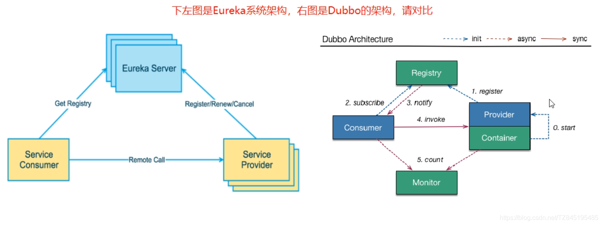

## ②. 单机Eureka(cloud-Eureka-server7001)

**`2>.` 单机Eureka构建步骤(cloud-Eureka-server7001) EnbaleEurekaServer**

- ①. 改pom

```xml
    <dependencies>
        <dependency>
            <groupId>com.atguigu.springcloud</groupId>
            <artifactId>cloud-api-commons</artifactId>
            <version>${project.version}</version>
        </dependency>
        <!--eureka-server-->
        <dependency>
            <groupId>org.springframework.cloud</groupId>
            <artifactId>spring-cloud-starter-netflix-eureka-server</artifactId>
        </dependency>
        <!--自定义api通用包-->
        <!--<dependency>
            <groupId>org.xzq.springcloud</groupId>
            <artifactId>cloud-api-commons</artifactId>
            <version>${project.version}</version>
        </dependency>-->
        <!--boot web acctuator-->
        <dependency>
            <groupId>org.springframework.boot</groupId>
            <artifactId>spring-boot</artifactId>
        </dependency>
        <dependency>
            <groupId>org.springframework.boot</groupId>
            <artifactId>spring-boot-starter-web</artifactId>
        </dependency>
        <dependency>
            <groupId>org.springframework.boot</groupId>
            <artifactId>spring-boot-starter-actuator</artifactId>
        </dependency>
        <dependency>
            <groupId>org.springframework.boot</groupId>
            <artifactId>spring-boot-devtools</artifactId>
            <scope>runtime</scope>
            <optional>true</optional>
        </dependency>
    </dependencies>
```

- ②. application.yml

```yml
server:
  port: 7001

eureka:
  instance:
    hostname: eureka #eureka服务端实例名称 单机版
    #hostname: eureka7001.com #eureka服务端实例名称
  client:
    #表示不向注册中心注册自己
    register-with-eureka: false
    #false表示自己就是注册中心，我的职责就是维护服务实例,并不区检索服务
    fetch-registry: false
    service-url:
      #设置与Eureka server交互的地址查询服务和注册服务都需要依赖这个地址
      defaultZone: http://${eureka.instance.hostname}:${server.port}/eureka/ #单机版
```

- ③. 主启动

```java
@SpringBootApplication
@EnableEurekaServer
public class EurekaMain7001 {
    public static void main(String[] args) {
        SpringApplication.run(EurekaMain7001.class,args);
    }
}
```

- ④. 测试：
  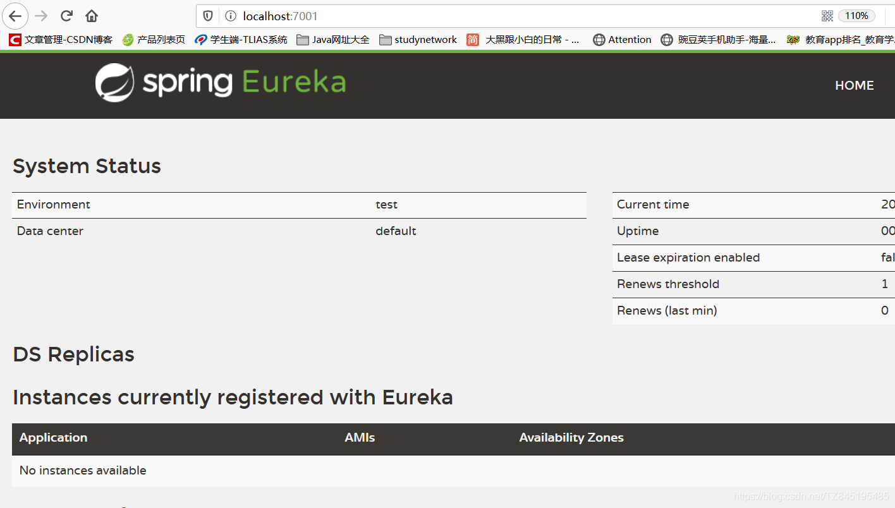

## ③. 修改端口8001和80

**`3>.` 修改端口8001和80(EnbaleEurekaClient)**

- ①. pom.xml

```xml
     <!--Eureka-client-->
     <dependency>
         <groupId>org.springframework.cloud</groupId>
         <artifactId>spring-cloud-starter-netflix-eureka-client</artifactId>
     </dependency>
```

- ②. application.xml

```yml
eureka:
  client:
    #表示向注册中心注册自己 默认为true
    register-with-eureka: true
    #是否从EurekaServer抓取已有的注册信息，默认为true,单节点无所谓,集群必须设置为true才能配合ribbon使用负载均衡
    fetch-registry: true
    service-url:
      #单机版：defaultZone: http://localhost:7001/eureka/ # 入驻地址
      defaultZone: http://localhost:7001/eureka/ # 入驻地址
123456789
server:
  port: 8001

spring:
  application:
    name: cloud-payment-service
  datasource:
    type: com.alibaba.druid.pool.DruidDataSource
    driver-class-name: org.gjt.mm.mysql.Driver
    url: jdbc:mysql://localhost:3306/db2019?useUnicode=true&characterEncoding=utf-8&useSSL=false
    username: root
    password: root

mybatis:
  mapperLocations: classpath:mapper/*.xml
  type-aliases-package: com.atguigu.springcloud.entities
eureka:
  client:
    #表示向注册中心注册自己 默认为true
    register-with-eureka: true
    #是否从EurekaServer抓取已有的注册信息，默认为true,单节点无所谓,集群必须设置为true才能配合ribbon使用负载均衡
    fetch-registry: true
    service-url:
      #单机版：defaultZone: http://localhost:7001/eureka/ # 入驻地址
      defaultZone: http://localhost:7001/eureka/ # 入驻地址
```

- ③. 主启动类

```java
@SpringBootApplication
@EnableEurekaClient
public class PaymentMain8001 {
    public static void main(String[] args) {
        SpringApplication.run(PaymentMain8001.class,args);
    }
}
```

- ④. 80端口也是如下所示
- ⑤. 测试结果如下
  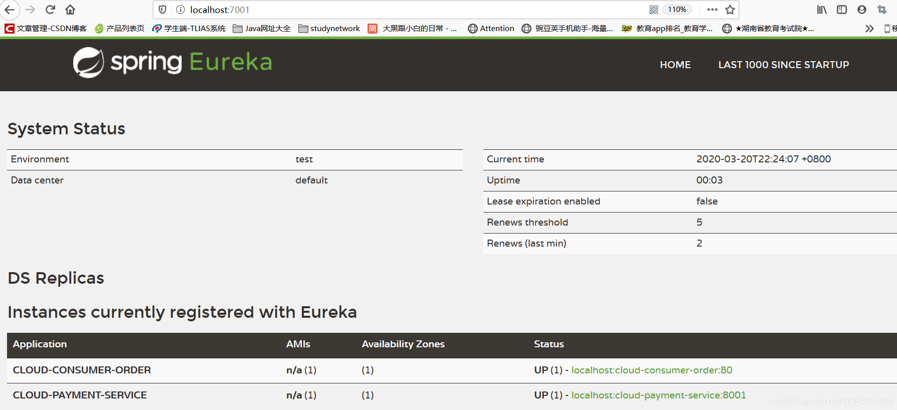

## ④. Eureka集群

**`4>.` Eureka集群**

**`1.` Eureka集群原理的说明**

- ①. 互相注册、相互守望、对外暴露一个集体
- ②. 图示：
  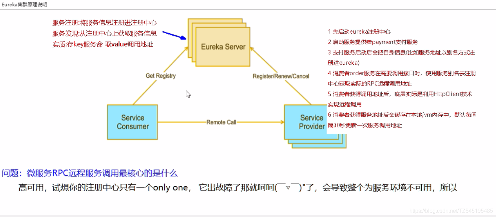

**`2.` EurekaServer集群坏境构建步骤**

- ①. 参考cloud-eureka-server7001
  cloud-eureka-server7002
- ②. 改pom

```xml
 <dependencies>
        <dependency>
            <groupId>com.atguigu.springcloud</groupId>
            <artifactId>cloud-api-commons</artifactId>
            <version>${project.version}</version>
        </dependency>
        <!--eureka-server-->
        <dependency>
            <groupId>org.springframework.cloud</groupId>
            <artifactId>spring-cloud-starter-netflix-eureka-server</artifactId>
        </dependency>
        <!--自定义api通用包-->
        <!--<dependency>
            <groupId>org.xzq.springcloud</groupId>
            <artifactId>cloud-api-commons</artifactId>
            <version>${project.version}</version>
        </dependency>-->
        <!--boot web acctuator-->
        <dependency>
            <groupId>org.springframework.boot</groupId>
            <artifactId>spring-boot</artifactId>
        </dependency>
        <dependency>
            <groupId>org.springframework.boot</groupId>
            <artifactId>spring-boot-starter-web</artifactId>
        </dependency>
        <dependency>
            <groupId>org.springframework.boot</groupId>
            <artifactId>spring-boot-starter-actuator</artifactId>
        </dependency>
        <dependency>
            <groupId>org.springframework.boot</groupId>
            <artifactId>spring-boot-devtools</artifactId>
            <scope>runtime</scope>
            <optional>true</optional>
        </dependency>
    </dependencies>
```

- ③. 修改映射配置
  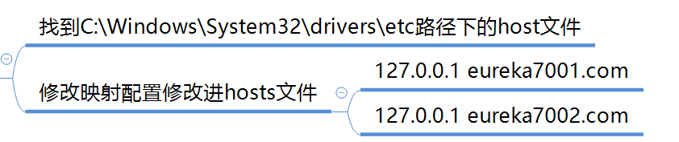
- ④. 写YML

```yml
server:
  port: 7002

eureka:
  instance:
    #hostname: eureka #eureka服务端实例名称 单机版
    hostname: eureka7002.com #eureka服务端实例名称
  client:
    #表示不向注册中心注册自己
    register-with-eureka: false
    #false表示自己就是注册中心，我的职责就是维护服务实例,并不区检索服务
    fetch-registry: false
    service-url:
      #设置与Eureka server交互的地址查询服务和注册服务都需要依赖这个地址
      #defaultZone: http://${eureka.instance.hostname}:${server.port}/eureka/ #单机版
      defaultZone: http://eureka7001:7001/eureka/
```

- ⑤. 主启动

```java
@SpringBootApplication
@EnableEurekaServer
public class EurekaMain7002 {
    public static void main(String[] args) {
        SpringApplication.run(EurekaMain7002.class,args);
    }
}
```

- ⑥. 结果是：
  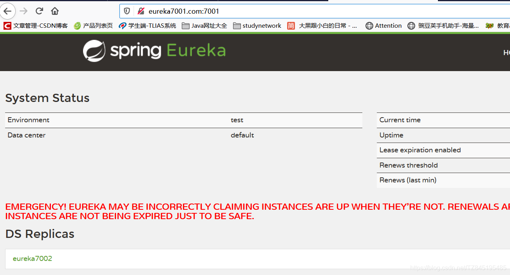

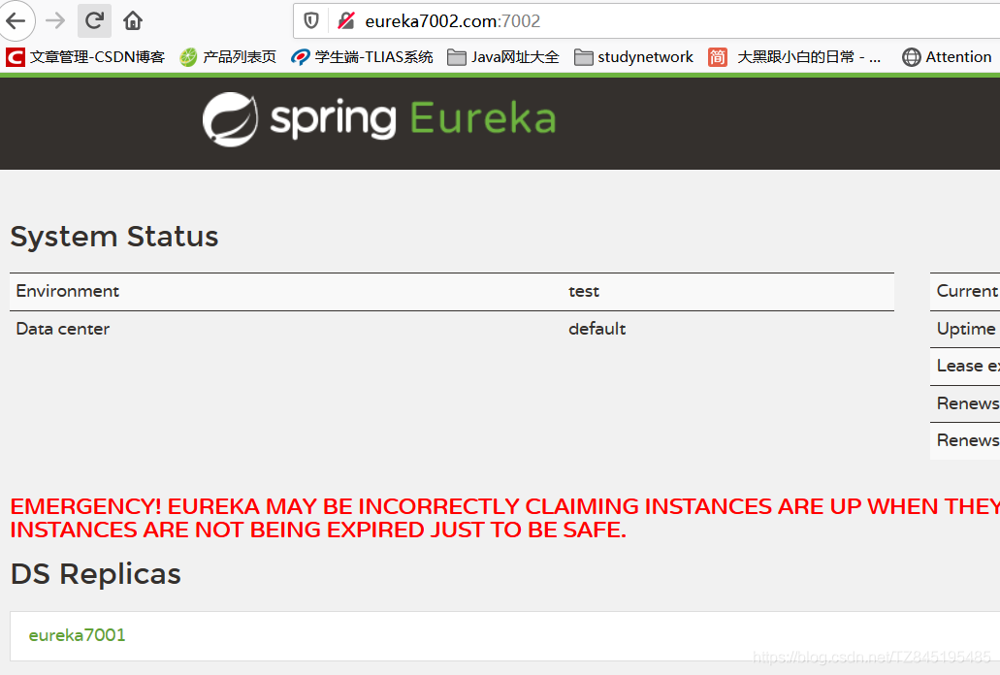

3.将支付服务8001微服务发布到上面2台Eureka集群配置中

```yml
server:
  port: 8002

spring:
  application:
    name: cloud-payment-service
  datasource:
    type: com.alibaba.druid.pool.DruidDataSource
    driver-class-name: org.gjt.mm.mysql.Driver
    url: jdbc:mysql://localhost:3306/db2019?useUnicode=true&characterEncoding=utf-8&useSSL=false
    username: root
    password: root

mybatis:
  mapperLocations: classpath:mapper/*.xml
  type-aliases-package: com.atguigu.springcloud.entities
eureka:
  client:
    #表示向注册中心注册自己 默认为true
    register-with-eureka: true
    #是否从EurekaServer抓取已有的注册信息，默认为true,单节点无所谓,集群必须设置为true才能配合ribbon使用负载均衡
    fetch-registry: true
    service-url:
      #单机版：defaultZone: http://localhost:7001/eureka/ # 入驻地址
      defaultZone: http://eureka7001.com:7001/eureka/,http://eureka7002.com:7002/erueka # 入驻地址
```

**`4.` 将订单服务80发布到上面2台Eureka集群配置中**

- ①. @LoadBalanced

```java
@Configuration
public class ApplicationContextConfig {

    @Bean
    @LoadBalanced//使用@LoadBalanced注解赋予了RestTemplate负载均衡的能力
    public RestTemplate getRestTemplate(){
        return new RestTemplate();
    }
}
```

- ②. url的更改

```java
    //public static final String PAYMENT_URL="http://localhost:8001";
    public static final String PAYMENT_URL="http://CLOUD-PAYMENT-SERVICE";
```

- ③. 测试结果：
  

## ⑤. actuator微服务服务完善

**`5>.` actuator微服务服务完善**

1.主机名称：服务名称修改

- ①. 问题的存在及解决方案：
  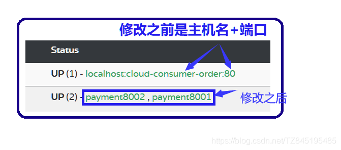
- ②. 修改cloud-provider-payment8001

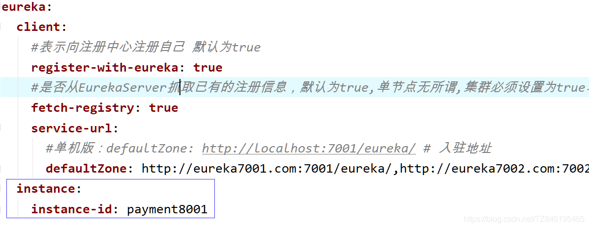

```yml
eureka:
  client:
    #表示向注册中心注册自己 默认为true
    register-with-eureka: true
    #是否从EurekaServer抓取已有的注册信息，默认为true,单节点无所谓,集群必须设置为true才能配合ribbon使用负载均衡
    fetch-registry: true
    service-url:
      #单机版：defaultZone: http://localhost:7001/eureka/ # 入驻地址
      defaultZone: http://eureka7001.com:7001/eureka/,http://eureka7002.com:7002/eureka/
  instance:
    instance-id: payment8002 #主机名称
    prefer-ip-address: true  #显示有ip信息提示
```

2.访问信息有ip信息提示

- ①. 问题出现和解决方案:

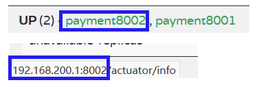

- ②. 修改cloud-provider-payment8001

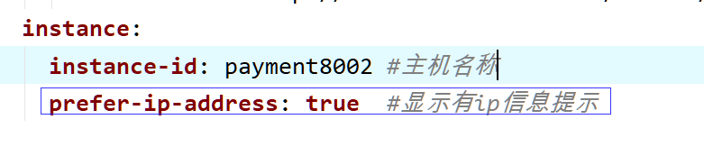

## ⑥. 服务发现Discovery

**`6>.` 服务发现Discovery**

- ①. 对于注册进eureka里面的微服务，可以通过服务发现来获得该服务的信息
- ④. 修改cloud-provider-payment8001的Controller

```java
   /*服务发现Discovery*/
    @GetMapping("/discovery")
    public Object discovery(){
        /*
        这个services是指的:所有的微服务注册的名称CLOUD-CONSUMER-ORDER | CLOUD-PAYMENT-SERVICE
        */
        List<String> services = discoveryClient.getServices();
        for (String element : services) {
            log.info("******element:"+element);
        }
        //这里的instances是： payment8002 , payment8001
        List<ServiceInstance> instances = discoveryClient.getInstances("CLOUD-PAYMENT-SERVICE");
        for (ServiceInstance instance : instances) {
            //serverId：CLOUD-PAYMENT-SERVICEhost:192.168.200.1 port:8002
            //serverId：CLOUD-PAYMENT-SERVICEhost:192.168.200.1 port:8001
            log.info("*****serverId："+instance.getServiceId()+"host:"+instance.getHost()+"port:"+instance.getPort());
        }
        return this.discoveryClient;
    }
```

- ⑤. 8001主启动类
  @EnableDiscoveryClient
- ⑥. 自测
  

## ⑦. Eureka自我保护

**`7>.` Eureka自我保护**

- ①. 故障现象

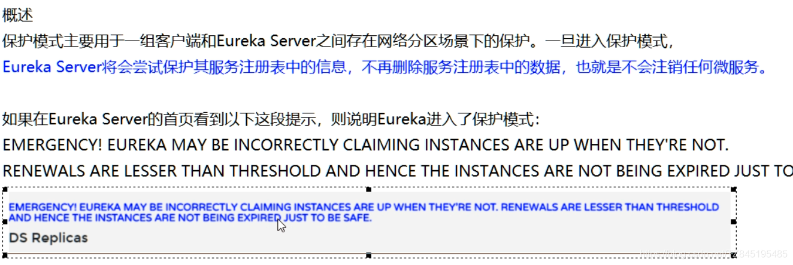

- ②. 导致原因：
  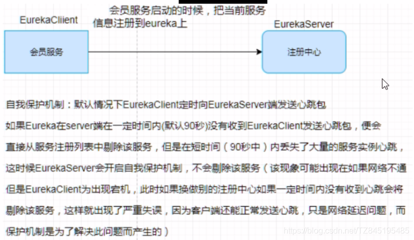
- ③. 怎么禁止自我保护（一般生产环境中不会禁止自我保护）

```handlebars
注册中心eureakeServer端7001
使用eureka.server.enable-self-preservation = false可以禁用自我保护模式
eureka:
  instance:
   hostname: eureka #eureka服务端实例名称 单机版
    #hostname: eureka7001.com #eureka服务端实例名称
  client:
    #表示不向注册中心注册自己
    register-with-eureka: false
    #false表示自己就是注册中心，我的职责就是维护服务实例,并不区检索服务
    fetch-registry: false
    service-url:
      #设置与Eureka server交互的地址查询服务和注册服务都需要依赖这个地址
      defaultZone: http://${eureka.instance.hostname}:${server.port}/eureka/ #单机版
      #defaultZone: http://eureka7002.com:7002/eureka/
  server:
    #关闭自我保护机制,保证不可用服务被及时剔除
    enable-self-preservation: false
    #时间是 2s
    eviction-interval-timer-in-ms: 2000

生产者客户端eureakeClient端8001
  instance:
    instance-id: payment8001 #主机名称
    prefer-ip-address: true  #显示有ip信息提示
    #Eureka客户端向服务端发送心跳的时间间隔,默认是30s
    lease-renewal-interval-in-seconds: 1
    #Eureka服务端在收到最后一次心跳后等待时间上限,单位为秒(默认是90s),超时将剔除服务
    lease-expiration-duration-in-seconds: 2
```

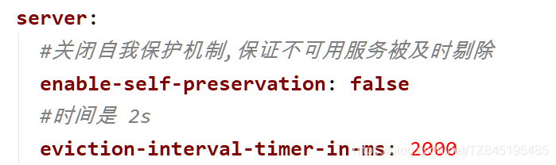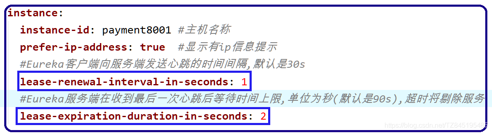

# ③. Zookeeper注册中心

## ①. 服务提供者

1>.服务提供者

- ①. pom.xml
  注意：先排除自带的zookeeper3.5.3

```xml
    <dependencies>
        <dependency>
            <groupId>com.atguigu.springcloud</groupId>
            <artifactId>cloud-api-commons</artifactId>
            <version>1.0-SNAPSHOT</version>
        </dependency>
        <dependency>
            <groupId>org.springframework.boot</groupId>
            <artifactId>spring-boot-starter-web</artifactId>
        </dependency>
        <!--SpringBoot整合Zookeeper客户端-->
        <dependency>
            <groupId>org.springframework.cloud</groupId>
            <artifactId>spring-cloud-starter-zookeeper-discovery</artifactId>
            <exclusions>
                <!--先排除自带的zookeeper3.5.3-->
                <exclusion>
                    <groupId>org.apache.zookeeper</groupId>
                    <artifactId>zookeeper</artifactId>
                </exclusion>
            </exclusions>
        </dependency>
        <!--添加zookeeper3.4.11版本 -->
        <dependency>
            <groupId>org.apache.zookeeper</groupId>
            <artifactId>zookeeper</artifactId>
            <version>3.4.11</version>
        </dependency>
        <dependency>
            <groupId>org.springframework.boot</groupId>
            <artifactId>spring-boot-starter-actuator</artifactId>
        </dependency>
        <dependency>
            <groupId>org.springframework.boot</groupId>
            <artifactId>spring-boot-devtools</artifactId>
            <scope>runtime</scope>
            <optional>true</optional>
        </dependency>
        <dependency>
            <groupId>org.projectlombok</groupId>
            <artifactId>lombok</artifactId>
            <optional>true</optional>
        </dependency>
        <dependency>
            <groupId>org.springframework.boot</groupId>
            <artifactId>spring-boot-starter-test</artifactId>
            <scope>test</scope>
        </dependency>
    </dependencies>
```

- ②. yml

```yml
server:
  port: 8004
spring:
  application:
    name: cloud-provider-payment
  cloud:
    zookeeper:
      connect-string: 127.0.0.1:2181
```

- ③. 主启动类

```java
@SpringBootApplication
@EnableDiscoveryClient//该注解用于zookeeper和consul作为注册中心的服务
public class PaymentMain8004 {
    public static void main(String[] args) {
        SpringApplication.run(PaymentMain8004.class,args);
    }
}
```

- ④. PaymentController

```java
@RestController
@Slf4j
public class PaymentController {

    @Value("${server.port}")
    private String serverPort;

    @GetMapping(value = "/payment/zk")
    public String paymentzk(){
        return "springclloud with zookeeper:"+serverPort+"\t"+ UUID.randomUUID().toString();
    }

}
```

## ②. 服务消费者

2>.服务消费者

- ①. pom.xml

```xml
    <dependencies>
        <dependency>
            <groupId>com.atguigu.springcloud</groupId>
            <artifactId>cloud-api-commons</artifactId>
            <version>1.0-SNAPSHOT</version>
        </dependency>
        <dependency>
            <groupId>org.springframework.boot</groupId>
            <artifactId>spring-boot-starter-web</artifactId>
        </dependency>
        <!--SpringBoot整合Zookeeper客户端-->
        <dependency>
            <groupId>org.springframework.cloud</groupId>
            <artifactId>spring-cloud-starter-zookeeper-discovery</artifactId>
            <exclusions>
                <!--先排除自带的zookeeper3.5.3-->
                <exclusion>
                    <groupId>org.apache.zookeeper</groupId>
                    <artifactId>zookeeper</artifactId>
                </exclusion>
            </exclusions>
        </dependency>
        <!--添加zookeeper3.4.11版本 -->
        <dependency>
            <groupId>org.apache.zookeeper</groupId>
            <artifactId>zookeeper</artifactId>
            <version>3.4.11</version>
        </dependency>
        <dependency>
            <groupId>org.springframework.boot</groupId>
            <artifactId>spring-boot-starter-actuator</artifactId>
        </dependency>
        <dependency>
            <groupId>org.springframework.boot</groupId>
            <artifactId>spring-boot-devtools</artifactId>
            <scope>runtime</scope>
            <optional>true</optional>
        </dependency>
        <dependency>
            <groupId>org.projectlombok</groupId>
            <artifactId>lombok</artifactId>
            <optional>true</optional>
        </dependency>
        <dependency>
            <groupId>org.springframework.boot</groupId>
            <artifactId>spring-boot-starter-test</artifactId>
            <scope>test</scope>
        </dependency>
    </dependencies>
```

- ②. application.yml

```yml
server:
  port: 80
spring:
  application:
    name: cloud-consumer-order
  cloud:
    #注册到zookeeper地址
    zookeeper:
      connect-string: 127.0.0.1:2181
```

- ③. ApplicationConfig

```java
@Configuration
public class ApplicationConfig {

    @Bean
    @LoadBalanced
    public RestTemplate getRestTemplate(){
        return new RestTemplate();
    }
}
```

- ④. 主启动

```java
@SpringBootApplication
@EnableDiscoveryClient
public class OrderZKMain80 {
    public static void main(String[] args) {
        SpringApplication.run(OrderZKMain80.class,args);
    }
}

```

- ⑤. OrderZKController

```java
@RestController
@Slf4j
@RequestMapping("/consumerZK")
public class OrderZKController {

    @Autowired
    private RestTemplate restTemplate;
    private static final String url="http://cloud-provider-payment";

    @GetMapping("/payment/zk")
    public String paymentZk(){
        log.info("*****开始进行远程调用8004端口号*****");
        return restTemplate.getForObject(url+"/payment/zk",String.class);
    }
```

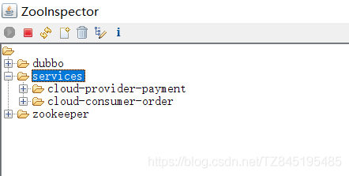

## ③. 服务节点是临时节点还是持久节点

**`3>.` 服务节点是临时节点还是持久节点**

- 是临时节点

# ④. Consul服务注册与发现

## ①. 安装并运行Consul

1>.安装并运行Consul

- ①. 官网安装说明(https://learn.hashicorp.com/consul/getting-started/install.html)
- ②. 下载完成后只有一个consul.exe文件，硬盘路径下双击运行，查看版本信息
  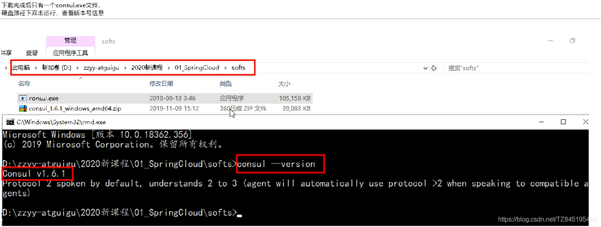
- ③.使用开发模式启动
  consul agent -dev
  通过以下地址可以访问Consul的首页：http;//localhost:8500
  结果页面：
  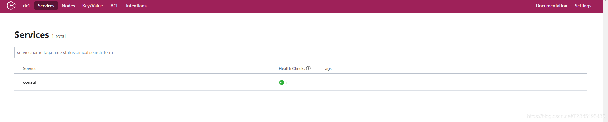

## ②. 服务提供者(cloud-providerconsul-payment8006)

2>.服务提供者(cloud-providerconsul-payment8006)

- ①. pom

```xml
    <dependencies>
        <!-- https://mvnrepository.com/artifact/org.springframework.cloud/spring-cloud-starter-consul-discovery -->
        <dependency>
            <groupId>org.springframework.cloud</groupId>
            <artifactId>spring-cloud-starter-consul-discovery</artifactId>
        </dependency>

        <dependency>
            <groupId>com.atguigu.springcloud</groupId>
            <artifactId>cloud-api-commons</artifactId>
            <version>${project.version}</version>
        </dependency>


        <!-- https://mvnrepository.com/artifact/org.springframework.boot/spring-boot-starter-web -->
        <dependency>
            <groupId>org.springframework.boot</groupId>
            <artifactId>spring-boot-starter-web</artifactId>
        </dependency>

        <!-- https://mvnrepository.com/artifact/org.springframework.boot/spring-boot-starter-web -->
        <dependency>
            <groupId>org.springframework.boot</groupId>
            <artifactId>spring-boot-starter-actuator</artifactId>
        </dependency>

        <!-- https://mvnrepository.com/artifact/org.springframework.boot/spring-boot-devtools -->
        <dependency>
            <groupId>org.springframework.boot</groupId>
            <artifactId>spring-boot-devtools</artifactId>
            <scope>runtime</scope>
            <optional>true</optional>
        </dependency>

        <!-- https://mvnrepository.com/artifact/org.projectlombok/lombok -->
        <dependency>
            <groupId>org.projectlombok</groupId>
            <artifactId>lombok</artifactId>
            <optional>true</optional>
        </dependency>

        <!-- https://mvnrepository.com/artifact/org.springframework.boot/spring-boot-starter-test -->
        <dependency>
            <groupId>org.springframework.boot</groupId>
            <artifactId>spring-boot-starter-test</artifactId>
            <scope>test</scope>
        </dependency>
    </dependencies>
```

- ②. application.yml

```yml
server:
  port: 8006
spring:
  application:
    name: consul-provider-payment
  cloud:
    consul:
      host: localhost
      port: 8500
      discovery:
        service-name: ${spring.application.name}
```

- ③. PaymentMain8006

```java
@SpringBootApplication
@EnableDiscoveryClient
public class PaymentMain8006 {
    public static void main(String[] args) {
        SpringApplication.run(PaymentMain8006.class,args);
    }
}
```

- ④. PaymentController

```java
@RestController
@Slf4j
public class PaymentController {

    @Value("${server.port}")
    private String port;//

    @GetMapping("/payment/consul")
    public String paymentConsul(){
        return "springcloud with consul:"+port+" "+ UUID.randomUUID().toString();
    }
}
```

- ⑤. 验证测试：http://localhost:8006/payment/consul
  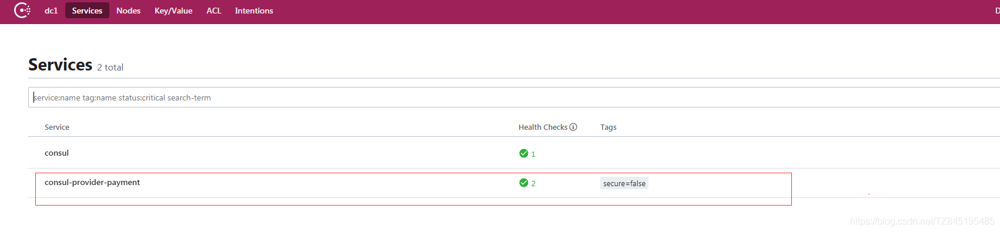

## ③. cloud-consumerconsul-order80

**`3>.` cloud-consumerconsul-order80**

- ①. pom.xml

```xml
    <dependencies>
        <!-- https://mvnrepository.com/artifact/org.springframework.cloud/spring-cloud-starter-consul-discovery -->
        <dependency>
            <groupId>org.springframework.cloud</groupId>
            <artifactId>spring-cloud-starter-consul-discovery</artifactId>
        </dependency>

        <dependency>
            <groupId>com.atguigu.springcloud</groupId>
            <artifactId>cloud-api-commons</artifactId>
            <version>${project.version}</version>
        </dependency>


        <!-- https://mvnrepository.com/artifact/org.springframework.boot/spring-boot-starter-web -->
        <dependency>
            <groupId>org.springframework.boot</groupId>
            <artifactId>spring-boot-starter-web</artifactId>
        </dependency>

        <!-- https://mvnrepository.com/artifact/org.springframework.boot/spring-boot-starter-web -->
        <dependency>
            <groupId>org.springframework.boot</groupId>
            <artifactId>spring-boot-starter-actuator</artifactId>
        </dependency>

        <!-- https://mvnrepository.com/artifact/org.springframework.boot/spring-boot-devtools -->
        <dependency>
            <groupId>org.springframework.boot</groupId>
            <artifactId>spring-boot-devtools</artifactId>
            <scope>runtime</scope>
            <optional>true</optional>
        </dependency>

        <!-- https://mvnrepository.com/artifact/org.projectlombok/lombok -->
        <dependency>
            <groupId>org.projectlombok</groupId>
            <artifactId>lombok</artifactId>
            <optional>true</optional>
        </dependency>

        <!-- https://mvnrepository.com/artifact/org.springframework.boot/spring-boot-starter-test -->
        <dependency>
            <groupId>org.springframework.boot</groupId>
            <artifactId>spring-boot-starter-test</artifactId>
            <scope>test</scope>
        </dependency>
    </dependencies>
```

- ②. application.yml

```yml
server:
  port: 80
spring:
  application:
    name: consul-consumer-order
  cloud:
    consul:
      host: localhost
      port: 8500
      discovery:
        service-name: ${spring.application.name}
```

- ③. OrderConsulMain80

```java
@SpringBootApplication
@EnableDiscoveryClient
public class OrderConsulMain80 {
    public static void main(String[] args) {
        SpringApplication.run(OrderConsulMain80.class,args);
    }
}
```

- ④. ApplicationContextConfig

```java
@Configuration
public class ApplicationContextConfig {

    @Bean
    @LoadBalanced
    public RestTemplate getRestTemplate(){
        return new RestTemplate();
    }
}
```

- ⑤. OrderController

```java
@RestController
@Slf4j
public class OrderController {
    @Autowired
    private RestTemplate restTemplate;

    public static final String INVOME_URL = "http://consul-provider-payment";
    @GetMapping("/consumer/payment/consul")
    public String getPaymentConsul(){
        return restTemplate.getForObject(INVOME_URL+"/payment/consul",String.class);
    }
}
```

- ⑥. 测试结果：
  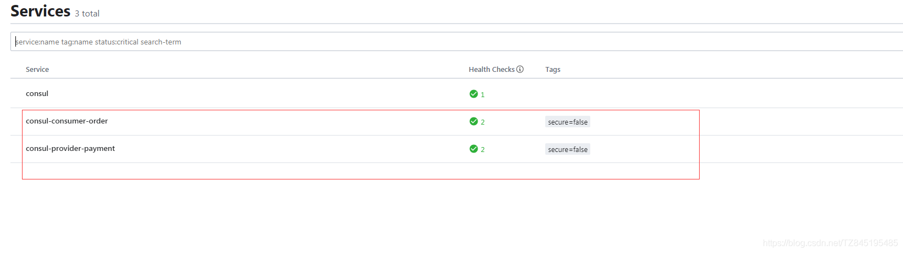

# ⑤. Zookeeper | Consul | Eureka

- ①. 在分布式领域有一个很著名的CAP定理：C：数据一致性。A：服务可用性。P：分区容错性（服务对网络分区故障的容错性）
- ②. Eureka和Zookeeper就是CAP定理中的实现，Eureka（保证AP），Zookeeper（保证CP）

## ①. Zookeeper(CP)

**`1>.` Zookeeper(CP)**

- ①. Zookeeper保证一致性

```handlebars
    Zookeeper有三类角色[master|从节点|观察者],当master瘫痪的时候,会导致整个注册中心不
可用。这个时候观察者会选举出一个新的leader[master],当服务注册到注册中心的时候,leader
会通过zab算法,传播给从节点,保证一致性。如果从节点不同意,则在Zookeeper中先先移除这个集群,
同意的时候才加进去。
```

- ②. Zookeeper不保证可用性
  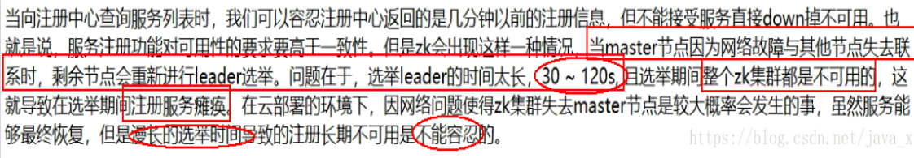

## ②. Eureka(AP)

**`2>.` Eureka(AP)**

- ①.保证可用性

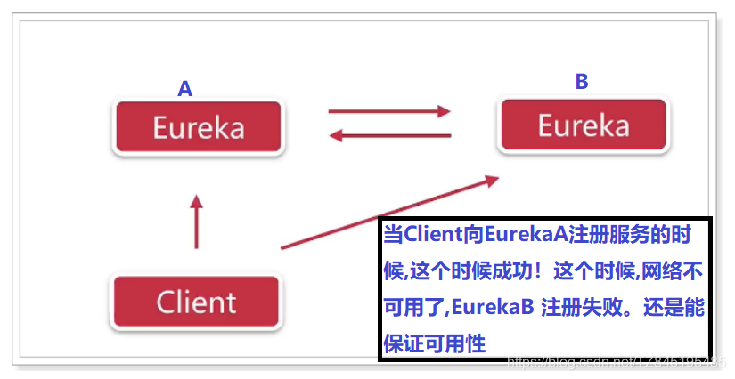

- **②. `总结：`Eureka可以很好的应对因网络故障导致部分节点失去联系的情况,而不会像Zookeeper那样使整个注册服务瘫痪**

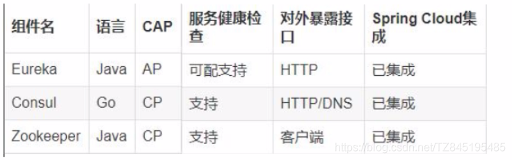

# ⑥. Ribbon

## ①. Ribbon的概述

**`1>.` Ribbon的概述**

- **①. Ribbon是Netfix发布的开源项目,主要功能是提供`客户端`的软件负载均衡算法和服务调用。**
- ②. LB（负载均衡）
  Nginx(集中式)：
  Ribbon(进程式)：

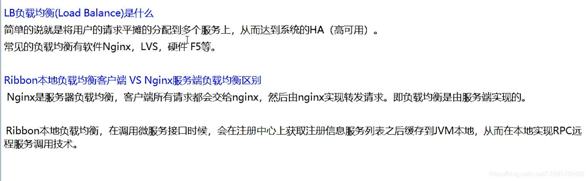

## ②. 再谈RestTemplate

**`2>.` 再谈RestTemplate**

- ①. 架构说明:Ribbon其实就是一个软负载均衡的客户端组件，他可以和其他所需请求的客户端结合使用，和eureka结合只是其中的一个实例。

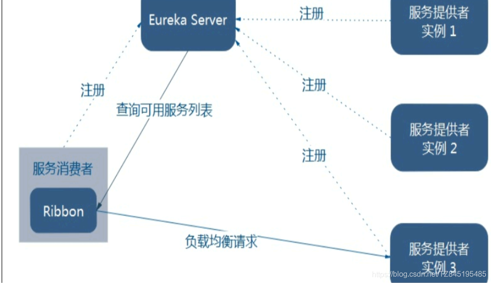

- ②. pom文件说明：
  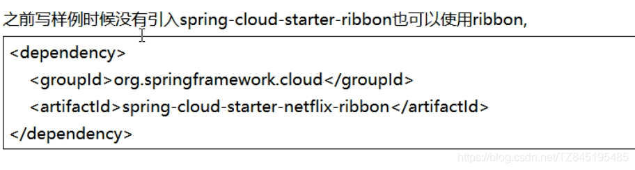
  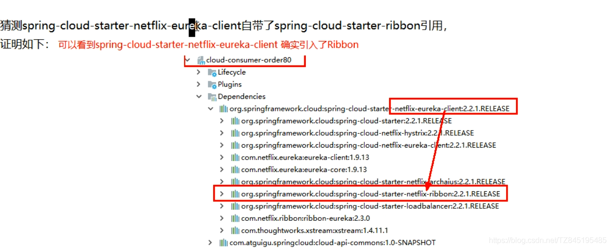
- ③.RestTemplate
  getForObject方法/getForEntity方法
  postForObject/postForEntity

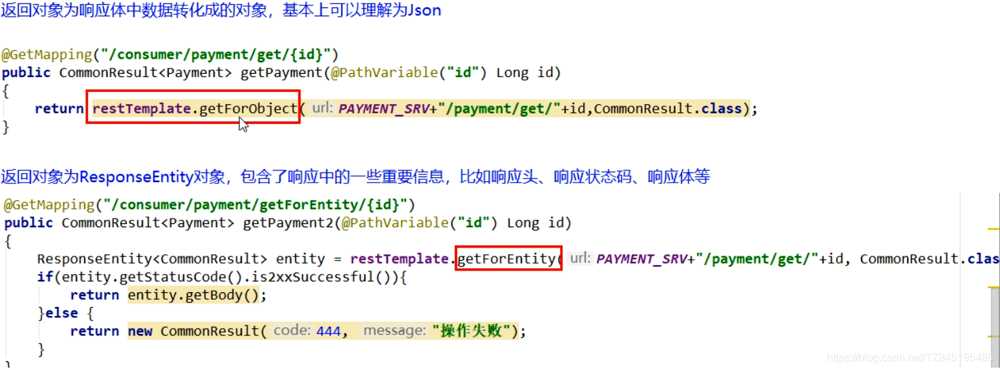

## ③. Ribbon核心组件IRule

**`3>.` Ribbon核心组件IRule**

- IRule:根据特定算法从服务列表中选取一个要访问的服务

```handlebars
	com.netflix.loadbalancer.RoundRobinRule(轮询)
	com.netflix.loadbalancer.RandomRule(随机)
	com.netflix.loadbalancer.RetryRule(先按照RoundRobinRule的策略
获取服务;如果获取服务失败则在指定时间内会进行重试)
    WeightedResponseTimeRule(对RoundRobinRule的扩展，响应速度越快的实例选择权重越大，越容易被选择)
    BestAvailableRule(会先过滤掉由于多次访问故障而处于断路器跳闸状态的服务，然后选择一个并发量最小的服务)
    AvailabilityFilteringRule(先过滤掉故障实例，再选择并发较小的实例)
    ZoneAvoidanceRule(默认规则，复合判断server所在区域的性能和server的可用性选择服务器)
```

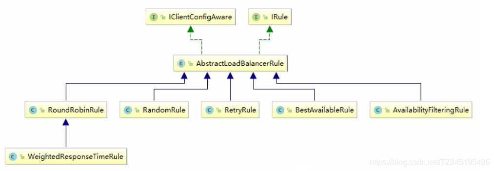

- ①. 修改cloud-consumer-order80
  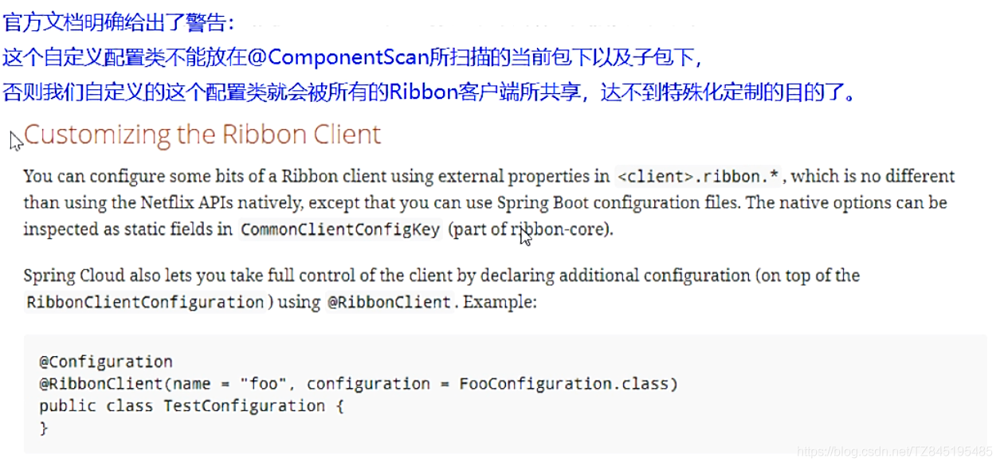
- ②. 新建package(com.atguigu.myrule)

```java
package com.atguigu.myrule;

import com.netflix.loadbalancer.IRule;
import com.netflix.loadbalancer.RandomRule;
import org.springframework.context.annotation.Bean;
import org.springframework.context.annotation.Configuration;

@Configuration
public class MySelfRule {
    @Bean
    public IRule getRule(){
       return new RandomRule();
    }
}
```

- ③. 主启动类添加@RibbonClient

```java
@SpringBootApplication
@EnableEurekaClient
@RibbonClient(name = "CLOUD-PAYMENT-SERVICE",configuration = MySelfRule.class)
public class OrderMain80 {
    public static void main(String[] args) {
        SpringApplication.run(OrderMain80.class,args);
    }
}
```

- ④. 测试：http://localhost/consumer/payment/get/31

## ④. Ribbon负载均衡算法底层原理

**`4>.` Ribbon负载均衡算法底层原理**

- ①. 理论知识点：

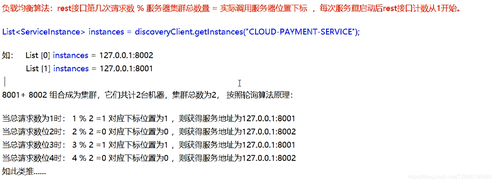

- ②. 源码分析：

> 源码解释：**`掌握`**
> Ribbon默认使用的负载均衡是轮询,IRule的一个具体实现类是使用轮询算法;在这里类里面,有一个原子整型类AtomicInteger,它会在无参构造函数中进行一个初始化的操作。我们会去调用它的choose方法查看使用负载均衡时候使用的是哪个Server;如果你当前参数传入进行的这个ILoadBalancer==null,就直接retrun null;如果不为null,那么先将server=null;然后调用它的获取健康服务的方法和获取所有服务的方法;得到这两个方法的size;如果说这两个size都不为0;那么我们就将所有服务的size作为参数传入进一个方法中;这个方法使用的是CAS的思想+自旋锁;将原子整型类AtomicInteger中的参数获取到为0; 我们将获取到的参数+1 % 传入这个方法的参数也就是集群的总量,获取到index,这个index就是我们轮询算法会去选择那个Server;进行比较并交换的处理,比较成功！ 那么就return index;获取到index后,通过集合中的get(index)方法获取到具体要执行那个端口号的Server

```java
//
// Source code recreated from a .class file by IntelliJ IDEA
// (powered by Fernflower decompiler)
//

package com.netflix.loadbalancer;

import com.netflix.client.config.IClientConfig;
import java.util.List;
import java.util.concurrent.atomic.AtomicInteger;
import org.slf4j.Logger;
import org.slf4j.LoggerFactory;

public class RoundRobinRule extends AbstractLoadBalancerRule {
    private AtomicInteger nextServerCyclicCounter;
    private static final boolean AVAILABLE_ONLY_SERVERS = true;
    private static final boolean ALL_SERVERS = false;
    private static Logger log = LoggerFactory.getLogger(RoundRobinRule.class);

    public RoundRobinRule() {
        this.nextServerCyclicCounter = new AtomicInteger(0);
    }

    public RoundRobinRule(ILoadBalancer lb) {
        this();
        this.setLoadBalancer(lb);
    }

    public Server choose(ILoadBalancer lb, Object key) {
        if (lb == null) {
            log.warn("no load balancer");
            return null;
        } else {
            Server server = null;
            int count = 0;

            while(true) {
                if (server == null && count++ < 10) {
                    List<Server> reachableServers = lb.getReachableServers();
                    List<Server> allServers = lb.getAllServers();
                    int upCount = reachableServers.size();
                    int serverCount = allServers.size();
                    if (upCount != 0 && serverCount != 0) {
                        int nextServerIndex = this.incrementAndGetModulo(serverCount);
                        server = (Server)allServers.get(nextServerIndex);
                        if (server == null) {
                            Thread.yield();
                        } else {
                            if (server.isAlive() && server.isReadyToServe()) {
                                return server;
                            }

                            server = null;
                        }
                        continue;
                    }

                    log.warn("No up servers available from load balancer: " + lb);
                    return null;
                }

                if (count >= 10) {
                    log.warn("No available alive servers after 10 tries from load balancer: " + lb);
                }

                return server;
            }
        }
    }

    private int incrementAndGetModulo(int modulo) {
        int current;
        int next;
        do {
            current = this.nextServerCyclicCounter.get();
            next = (current + 1) % modulo;
        } while(!this.nextServerCyclicCounter.compareAndSet(current, next));

        return next;
    }

    public Server choose(Object key) {
        return this.choose(this.getLoadBalancer(), key);
    }

    public void initWithNiwsConfig(IClientConfig clientConfig) {
    }
}

```

## ⑤. 手写Ribbon轮询算法

**`5>.` 手写Ribbon轮询算法**

- ①. 7001/7002集群启动
- ②. 8001/8002微服务改造controller

```java
@GetMapping(value = "/payment/lb")
public String getPaymentLB(){
    return serverPort;
}
```

- ③. 80订单微服务改造
  1.ApplicationContextBean去掉@LoadBalanced
  2.LoadBalancer接口

```java
package com.atguigu.springcloud.lb;

import org.springframework.cloud.client.ServiceInstance;

import java.util.List;

public interface LoadBalancer {
     //收集服务器总共有多少台能够提供服务的机器，并放到list里面
    ServiceInstance instances(List<ServiceInstance> serviceInstances);

}
```

3.MyLB

```java
package com.atguigu.springcloud.lb;

import org.springframework.cloud.client.ServiceInstance;
import org.springframework.stereotype.Component;

import java.util.List;
import java.util.concurrent.atomic.AtomicInteger;

@Component
public class MyLB implements LoadBalancer {

    private AtomicInteger atomicInteger = new AtomicInteger(0);

    //坐标
    private final int getAndIncrement(){
        int current;
        int next;
        do {
            current = this.atomicInteger.get();
            next = current >= 2147483647 ? 0 : current + 1;
        }while (!this.atomicInteger.compareAndSet(current,next));  //第一个参数是期望值，第二个参数是修改值是
        System.out.println("*******第几次访问，次数next: "+next);
        return next;
    }

    @Override
    public ServiceInstance instances(List<ServiceInstance> serviceInstances) {  //得到机器的列表
       int index = getAndIncrement() % serviceInstances.size(); //得到服务器的下标位置
        return serviceInstances.get(index);
    }
}
```

4.OrderController

```java
@RestController
@Slf4j
public class OrderController {

   // public static final String PAYMENT_URL = "http://localhost:8001";
    public static final String PAYMENT_URL = "http://CLOUD-PAYMENT-SERVICE";

    @Resource
    private RestTemplate restTemplate;

    @Resource
    private LoadBalancer loadBalancer;

    @Resource
    private DiscoveryClient discoveryClient;

    @GetMapping("/consumer/payment/create")
    public CommonResult<Payment>   create( Payment payment){
        return restTemplate.postForObject(PAYMENT_URL+"/payment/create",payment,CommonResult.class);  //写操作
    }

    @GetMapping("/consumer/payment/get/{id}")
    public CommonResult<Payment> getPayment(@PathVariable("id") Long id){
        return restTemplate.getForObject(PAYMENT_URL+"/payment/get/"+id,CommonResult.class);
    }

    @GetMapping("/consumer/payment/getForEntity/{id}")
     public CommonResult<Payment> getPayment2(@PathVariable("id") Long id){
        ResponseEntity<CommonResult> entity = restTemplate.getForEntity(PAYMENT_URL+"/payment/get/"+id,CommonResult.class);
        if (entity.getStatusCode().is2xxSuccessful()){
          //  log.info(entity.getStatusCode()+"\t"+entity.getHeaders());
            return entity.getBody();
        }else {
            return new CommonResult<>(444,"操作失败");
        }
     }

    @GetMapping(value = "/consumer/payment/lb")
     public String getPaymentLB(){
        List<ServiceInstance> instances = discoveryClient.getInstances("CLOUD-PAYMENT-SERVICE");
        if (instances == null || instances.size() <= 0){
            return null;
        }
        ServiceInstance serviceInstance = loadBalancer.instances(instances);
        URI uri = serviceInstance.getUri();
        return restTemplate.getForObject(uri+"/payment/lb",String.class);
    }
}
```

5.测试 ：http://localhost/consumer/payment/lb

# ⑦. Feign

## ①. Feign的概述

1>. Feign的概述

- Feign是一个服务接口的绑定器，(接口+@FeignClient(value=“服务名称”)) 接口与接口之间的一个调用。

## ②. Feign的基本使用

**`2>.` Feign的基本使用**

- ①. cloud-consumer-feign-order80
- ②. pom

```xml
 <!--openfeign-->
    <dependencies>
        <dependency>
            <groupId>org.springframework.cloud</groupId>
            <artifactId>spring-cloud-starter-openfeign</artifactId>
        </dependency>
        <dependency>
            <groupId>org.springframework.cloud</groupId>
            <artifactId>spring-cloud-starter-netflix-eureka-client</artifactId>
        </dependency>
        <dependency>
            <groupId>com.atguigu.springcloud</groupId>
            <artifactId>cloud-api-commons</artifactId>
            <version>${project.version}</version>
        </dependency>
        <dependency>
            <groupId>org.springframework.boot</groupId>
            <artifactId>spring-boot-starter-web</artifactId>
        </dependency>

        <dependency>
            <groupId>org.springframework.boot</groupId>
            <artifactId>spring-boot-starter-actuator</artifactId>
        </dependency>

        <dependency>
            <groupId>org.springframework.boot</groupId>
            <artifactId>spring-boot-devtools</artifactId>
            <scope>runtime</scope>
            <optional>true</optional>
        </dependency>

        <dependency>
            <groupId>org.projectlombok</groupId>
            <artifactId>lombok</artifactId>
            <optional>true</optional>
        </dependency>
        <dependency>
            <groupId>org.springframework.boot</groupId>
            <artifactId>spring-boot-starter-test</artifactId>
            <scope>test</scope>
        </dependency>
    </dependencies>
```

- ③. 主启动类：@EnableFeignClients

```java
@SpringBootApplication
@EnableFeignClients
public class OrderFeignMain80 {
    public static void main(String[] args) {
        SpringApplication.run(OrderFeignMain80.class,args);
    }
}
 
```

- ④. 业务类

```java
@Component
@FeignClient(value = "CLOUD-PAYMENT-SERVICE")
public interface PaymentFeignService {

    @GetMapping("/payment/get/{id}")
    public CommonResult<Payment> getPaymentById(@PathVariable("id") Long id);

    @GetMapping("/payment/feign/timeout")
    public String paymentFeignTimeOut();
}
```

## ③. OpenFeign超时控制

3>.OpenFeign超时控制

- OpenFeign默认等待一秒钟，超过后报错

```yml
YML文件里需要开启OpenFeign客户端超时控制
ribbon:
  #指的是建立连接所用时间,适用于网络状况正常情况下,两端连接所用时间
  ReadTimeout:  5000
  #指的是建立连接后从服务器读取可用资源所用时间
  ConnectTimeout: 5000
```

## ④. OpenFeign日志打印功能

- ①. Feign提供了日志打印功能，我们可以通过配置来调整日志级别，从而了解Feign中Http请求的细节。说白了就是对Feign接口的调用情况进行监控和输出
- ②. 日志级别

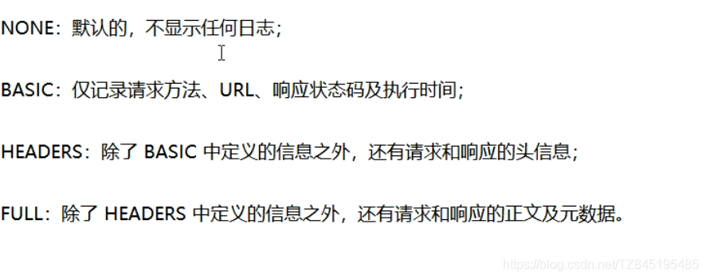

- ③. 配置日志bean

```java
@Configuration
public class FeignConfig {
    @Bean
    Logger.Level feignLoggerLevel(){
        return Logger.Level.FULL;
    }
}
```

- ④. YML文件里需要开启日志的Feign客户端

```xml
logging:
  level:
    com.atguigu.springcloud.service.PaymentFeignService: debug
```

- ⑤. 后台日志查看
  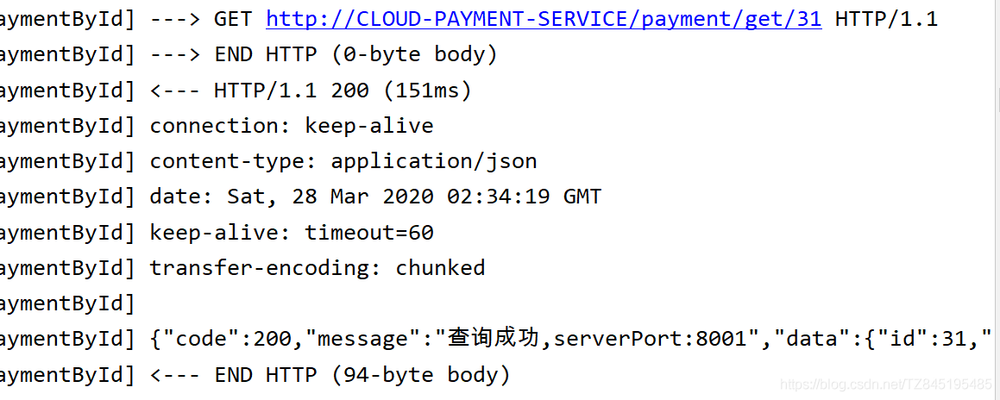

# ⑧. Hystrix

## ①. 什么是Hystrix？

**`1>.` 什么是Hystrix？**

- ①. Hystrix是一个延迟和容错库，用于隔离访问远程服务，防止出现级联失败。
- ②. 服务降级：及时返回服务调用失败的结果，让线程不因为等待服务而阻塞。
- ③. 服务熔断：类比保险丝达到最大服务访问后，直接拒绝访问，拉闸限电，然后调用服务降级的方法并返回友好提示
- ④. 服务限流：秒杀高并发等操作，严禁一窝蜂的过来拥挤，大家排队，一秒钟N个，有序进行(这个到后期详解)

> 介绍：
> 1.基本介绍
> 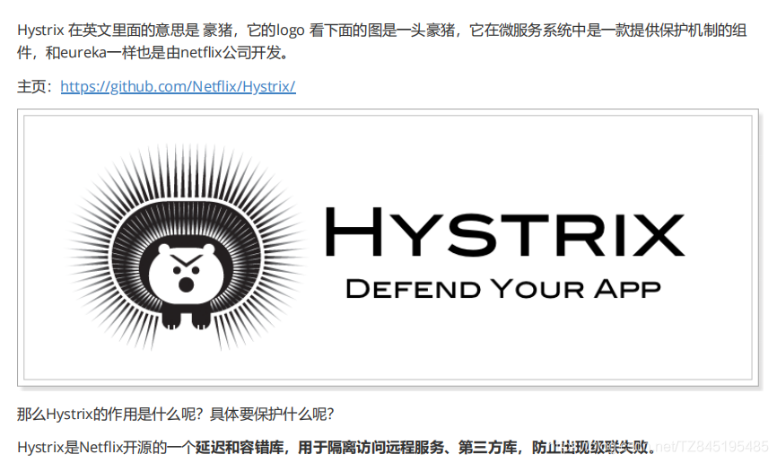2.雪崩问题
> 微服务中，服务间调用关系错综复杂，一个请求，可能需要调用多个微服务接口才能实现，会形成非常复杂的调用链路：
> 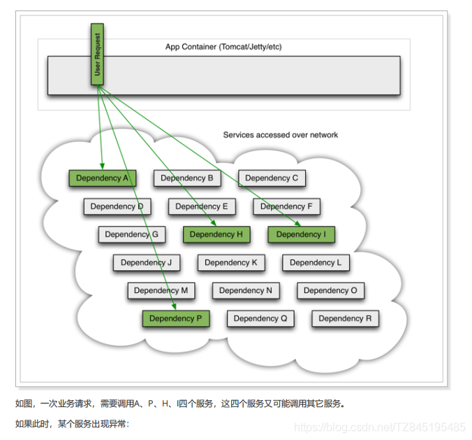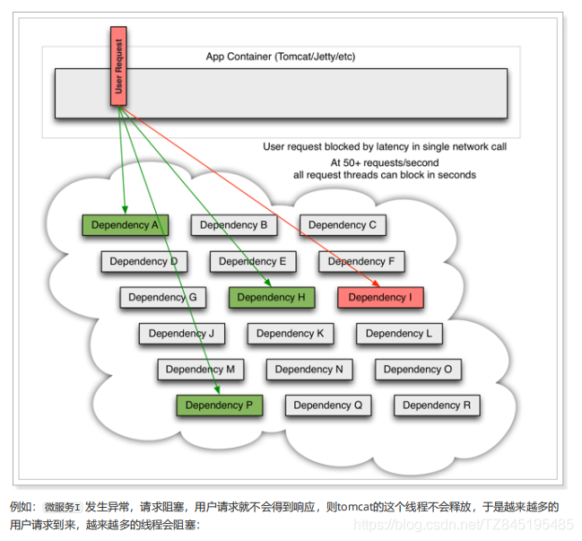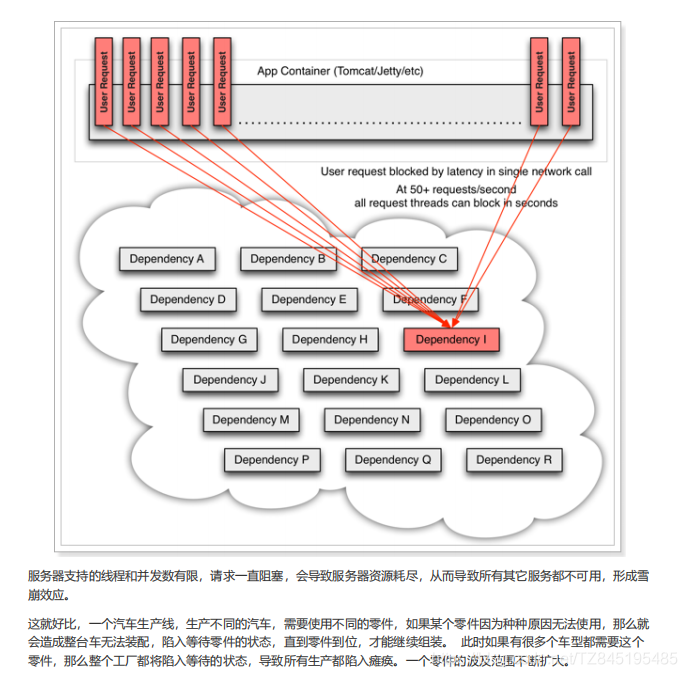

## ②. 模拟Hystrix-project

2>.模拟Hystrix-project

- ①. 新建cloud-provider-hystrix-payment8001
- ②. pom.xml

```xml
    <dependencies>
        <!--新增hystrix-->
        <dependency>
            <groupId>org.springframework.cloud</groupId>
            <artifactId>spring-cloud-starter-netflix-hystrix</artifactId>
        </dependency>
        <dependency>
            <groupId>org.springframework.cloud</groupId>
            <artifactId>spring-cloud-starter-netflix-eureka-client</artifactId>
        </dependency>


        <dependency>
            <groupId>com.atguigu.springcloud</groupId>
            <artifactId>cloud-api-commons</artifactId>
            <version>${project.version}</version>
        </dependency>


        <dependency>
            <groupId>org.springframework.boot</groupId>
            <artifactId>spring-boot-starter-web</artifactId>
        </dependency>

        <dependency>
            <groupId>org.springframework.boot</groupId>
            <artifactId>spring-boot-starter-actuator</artifactId>
        </dependency>

        <dependency>
            <groupId>org.springframework.boot</groupId>
            <artifactId>spring-boot-devtools</artifactId>
            <scope>runtime</scope>
            <optional>true</optional>
        </dependency>

        <dependency>
            <groupId>org.projectlombok</groupId>
            <artifactId>lombok</artifactId>
            <optional>true</optional>
        </dependency>
        <dependency>
            <groupId>org.springframework.boot</groupId>
            <artifactId>spring-boot-starter-test</artifactId>
            <scope>test</scope>
        </dependency>
    </dependencies>
```

- ③. 主启动类

```java
@SpringBootApplication
@EnableEurekaClient
public class PaymentHystrixMain8001 {
    public static void main(String[] args) {
        SpringApplication.run(PaymentHystrixMain8001.class,args);
    }
}
```

- ④. service

```java
@Service
public class PaymentService {

    //成功
    public String paymentInfo_OK(Integer id){
        return "线程池："+Thread.currentThread().getName()+"   paymentInfo_OK,id：  "+id+"\t"+"哈哈哈"  ;
    }

    //失败
    public String paymentInfo_TimeOut(Integer id){
        int timeNumber = 3;
        try { TimeUnit.SECONDS.sleep(timeNumber); }catch (Exception e) {e.printStackTrace();}
        return "线程池："+Thread.currentThread().getName()+"   paymentInfo_TimeOut,id：  "+id+"\t"+"呜呜呜"+" 耗时(秒)"+timeNumber;
    }

}
```

- ⑤. controller

```java
@RestController
@Slf4j
public class PaymentController {

    @Resource
    private PaymentService paymentService;

    @Value("${server.port}")
    private String serverPort;

    @GetMapping("/payment/hystrix/ok/{id}")
    public String paymentInfo_OK(@PathVariable("id") Integer id){
        String result = paymentService.paymentInfo_OK(id);
        log.info("*******result:"+result);
        return result;
    }
    @GetMapping("/payment/hystrix/timeout/{id}")
    public String paymentInfo_TimeOut(@PathVariable("id") Integer id){
        String result = paymentService.paymentInfo_TimeOut(id);
        log.info("*******result:"+result);
        return result;
    }
}
```

- ⑥. 测试：

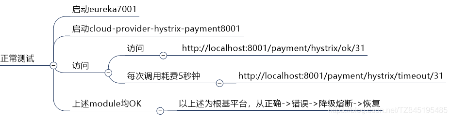

## ③. 服务降级(cloud-provider-hystrix-payment8001)

3>.服务降级(cloud-provider-hystrix-payment8001)

- ①. 在主启动类上添加注解：@EnableCircuitBreaker //开启服务降级
- ②. 在service中添加服务降级的方法

```java
  @HystrixCommand(fallbackMethod = "paymentInfo_TimeOutHandler",commandProperties = {
            @HystrixProperty(name="execution.isolation.thread.timeoutInMilliseconds",value="5000")
    })
    public String paymentInfo_TimeOut(Integer id){
        int timeNumber =3 ;
        //int age=10/0;
        try { TimeUnit.SECONDS.sleep(timeNumber); }catch (Exception e) {e.printStackTrace();}
        return "线程池："+Thread.currentThread().getName()+"   paymentInfo_TimeOut,id：  "+id+"\t"+"呜呜呜"+" 耗时(秒)"+timeNumber;
    }

    public String paymentInfo_TimeOutHandler(Integer id){
        return "线程池："+Thread.currentThread().getName()+"   paymentInfo_TimeOutHandler,id：  "+id+"\t"+"O(∩_∩)O"  ;
    }
```

- ③. 一旦调用服务方法失败并抛出了错误信息后，会自动调用@HystrixCommand标注好的fallbackMethod调用类中的指定方法

## ④. 服务降级80

**`4>.` 服务降级80**

- ①. 新建cloud-consumer-feign-hystrix-order80
- ②. pom.xml

```xml
<dependencies>
        <!--新增hystrix-->
        <dependency>
        <groupId>org.springframework.cloud</groupId>
        <artifactId>spring-cloud-starter-netflix-hystrix</artifactId>
    </dependency>
        <dependency>
            <groupId>org.springframework.cloud</groupId>
            <artifactId>spring-cloud-starter-openfeign</artifactId>
        </dependency>
        <dependency>
            <groupId>org.springframework.cloud</groupId>
            <artifactId>spring-cloud-starter-netflix-eureka-client</artifactId>
        </dependency>
        <dependency>
            <groupId>com.atguigu.springcloud</groupId>
            <artifactId>cloud-api-commons</artifactId>
            <version>${project.version}</version>
        </dependency>
        <dependency>
            <groupId>org.springframework.boot</groupId>
            <artifactId>spring-boot-starter-web</artifactId>
        </dependency>

        <dependency>
            <groupId>org.springframework.boot</groupId>
            <artifactId>spring-boot-starter-actuator</artifactId>
        </dependency>

        <dependency>
            <groupId>org.springframework.boot</groupId>
            <artifactId>spring-boot-devtools</artifactId>
            <scope>runtime</scope>
            <optional>true</optional>
        </dependency>

        <dependency>
            <groupId>org.projectlombok</groupId>
            <artifactId>lombok</artifactId>
            <optional>true</optional>
        </dependency>
        <dependency>
            <groupId>org.springframework.boot</groupId>
            <artifactId>spring-boot-starter-test</artifactId>
            <scope>test</scope>
        </dependency>
    </dependencies>
```

- ③. application.yml

```yml
server:
  port: 80
eureka:
  client:
    register-with-eureka: true
    service-url:
      defaultZone: http://eureka7001.com:7001/eureka
feign:
  hystrix:
    enabled: true #如果处理自身的容错就开启。开启方式与生产端不一样。
```

- ④. 主启动类：

```java
@SpringBootApplication
@EnableFeignClients
@EnableHystrix
public class PaymentHystrixMain80 {
    public static void main(String[] args) {
        SpringApplication.run(PaymentHystrixMain80.class,args);
    }
}

```

- ⑤. 自定义和全局服务降级

```java
@RestController
@Slf4j
//@DefaultProperties(defaultFallback = "payment_Global_FallbackMethod")
public class OrderHystrixController {
    @Resource
    private PaymentHystrixService paymentHystrixService;

    /*1>.OK*/
    @GetMapping("/consumer/hystrix/ok/{id}")
    public String paymentInfo_OK(@PathVariable("id") Integer id){
        return paymentHystrixService.paymentInfo_OK(id);
    }

    /*2>.timeOut*/
    @GetMapping("/consumer/hystrix/timeout/{id}")
    /*@HystrixCommand(fallbackMethod = "paymentTimeOutFallbackMethod",commandProperties = {
            @HystrixProperty(name="execution.isolation.thread.timeoutInMilliseconds",value="1500")
    })*/
    //@HystrixCommand
    //这里设置的时间是1.5s,就是说调用服务会等待1.5s,如果超过了就会走fallbackMethod方法
    //而我们在支付的微服务中,时间是3s
    public String paymentInfo_TimeOut(@PathVariable("id") Integer id){
        return paymentHystrixService.paymentInfo_TimeOut(id);
    }

    public String paymentTimeOutFallbackMethod(@PathVariable Integer id){
        return "我是消费者80,对方支付系统繁忙请10分钟后再试或者自己运行出错请检查自己！";
    }

    //globol fallback

    //下面是全局fallback方法
    public String payment_Global_FallbackMethod(){
        return "Global异常处理信息,请稍后再试！！";
    }
}
```

- ⑥. feign进行远程调用：

```java
@Component
@FeignClient(value = "CLOUD-PROVIDER-HYSTRIX-PAYMENT")
public interface PaymentHystrixService {

    @GetMapping("/payment/hystrix/ok/{id}")
    public String paymentInfo_OK(@PathVariable("id") Integer id);

    @GetMapping("/payment/hystrix/timeout/{id}")
    public String paymentInfo_TimeOut(@PathVariable("id") Integer id);
}
```

## ⑤. 对公共模块进行提取

5>.对公共模块进行提取

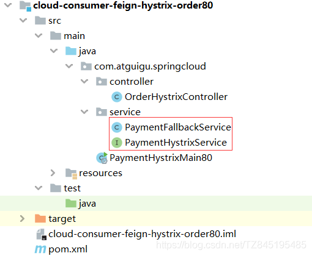

```java
@Component
@FeignClient(value = "CLOUD-PROVIDER-HYSTRIX-PAYMENT",fallback = PaymentFallbackService.class)
public interface PaymentHystrixService {

    @GetMapping("/payment/hystrix/ok/{id}")
    public String paymentInfo_OK(@PathVariable("id") Integer id);

    @GetMapping("/payment/hystrix/timeout/{id}")
    public String paymentInfo_TimeOut(@PathVariable("id") Integer id);
}
12345678910
@Component
public class PaymentFallbackService implements PaymentHystrixService {

    @Override
    public String paymentInfo_OK(Integer id) {
        return "---PaymentFabllbackService fall back-paymentInfo_OK";
    }

    @Override
    public String paymentInfo_TimeOut(Integer id) {
        return "---PaymentFabllbackService fall back-paymentInfo_TimeOut";
    }
}

```

## ⑥. 服务熔断是什么？

**`6>.` 服务熔断是什么**

- ①. Closed：关闭状态（断路器关闭），所有请求都正常访问
- ②. Open：打开状态（断路器打开），所有请求都会被降级。Hystrix会对请求情况计数，当一定时间内失败请求百分比达到阈值，则触发熔断，断路器会完全打开。默认失败比例的阈值是50%，请求次数最少不低于20次
- ③. Half Open：半开状态，不是永久的，断路器打开后会进入休眠时间（默认是5S）,随后断路器会自动进入半开状态。此时会释放部分请求通过，若这些请求都是健康的，则会关闭断路器，否则继续保持打开，再次进行休眠计时

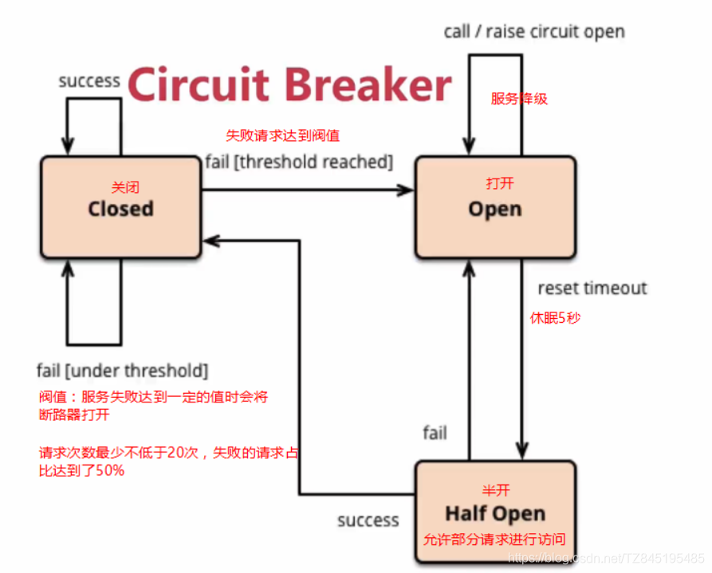

## ⑦. 服务熔断代码实现

7>. 服务熔断代码实现

- ①. 修改cloud-provider-hystrix-payment8001
- ②. 在service中配置如下参数：

```java
//服务熔断
@HystrixCommand(fallbackMethod = "paymentCircuitBreaker_fallback",commandProperties = {
        @HystrixProperty(name = "circuitBreaker.enabled",value = "true"),  //是否开启断路器
        @HystrixProperty(name = "circuitBreaker.requestVolumeThreshold",value = "10"),   //请求次数
        @HystrixProperty(name = "circuitBreaker.sleepWindowInMilliseconds",value = "10000"),  //时间范围
        @HystrixProperty(name = "circuitBreaker.errorThresholdPercentage",value = "60"), //失败率达到多少后跳闸
})
public String paymentCircuitBreaker(@PathVariable("id") Integer id){
    if (id < 0){
        throw new RuntimeException("*****id 不能负数");
    }
    String serialNumber = IdUtil.simpleUUID();

    return Thread.currentThread().getName()+"\t"+"调用成功,流水号："+serialNumber;
}
public String paymentCircuitBreaker_fallback(@PathVariable("id") Integer id){
    return "id 不能负数，请稍候再试,(┬＿┬)/~~     id: " +id;
}
```

- ③. PaymentController

```java
//===服务熔断
@GetMapping("/payment/circuit/{id}")
public String paymentCircuitBreaker(@PathVariable("id") Integer id){
    String result = paymentService.paymentCircuitBreaker(id);
    log.info("*******result:"+result);
    return result;
}
```

- ④. 测试：
  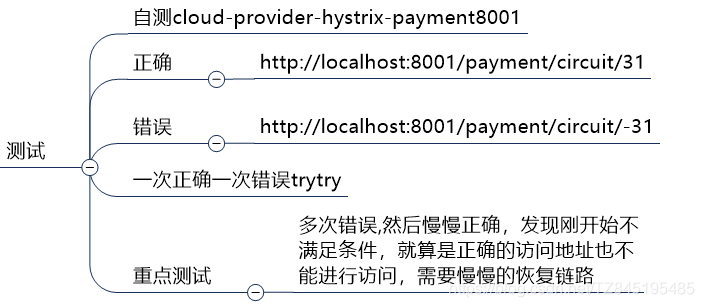
- ⑤. 断路器的作用：

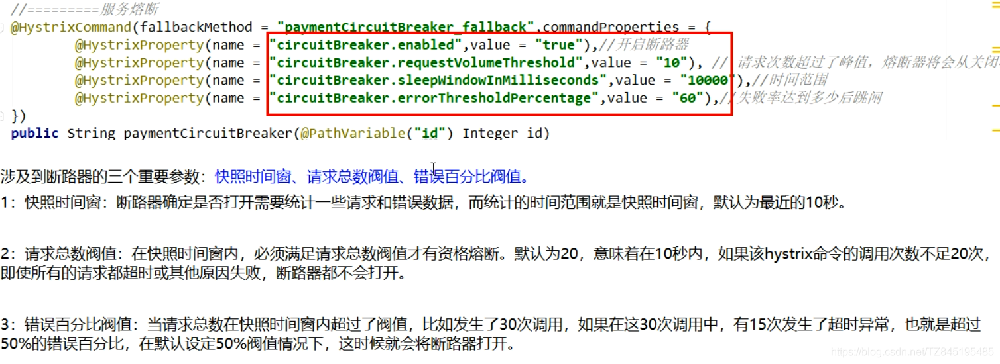

- ⑥. 断路器开启或者关闭的条件
  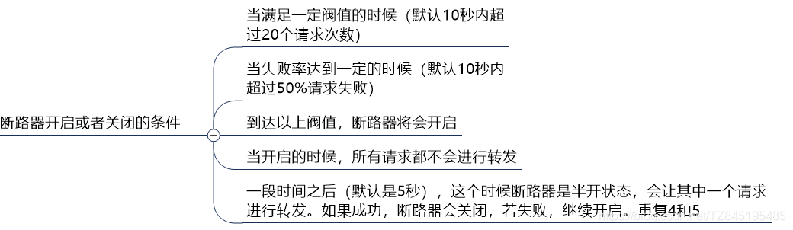
- ⑦. 所有的配置(以后工作遇到了这里来找)

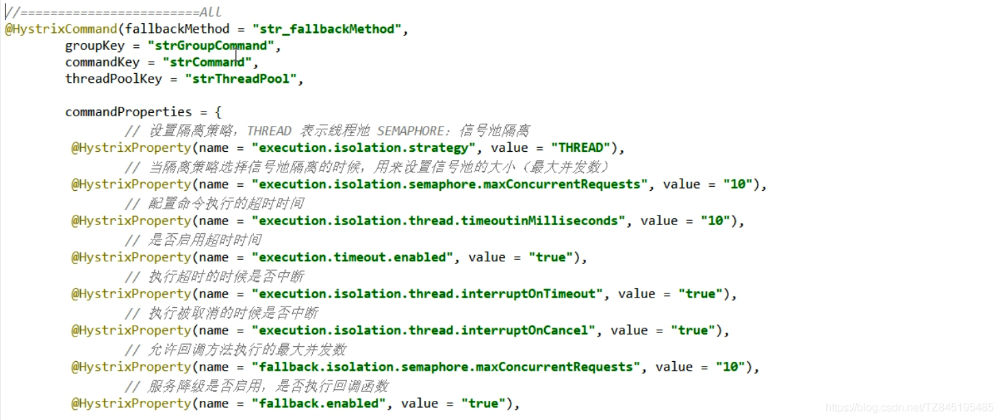
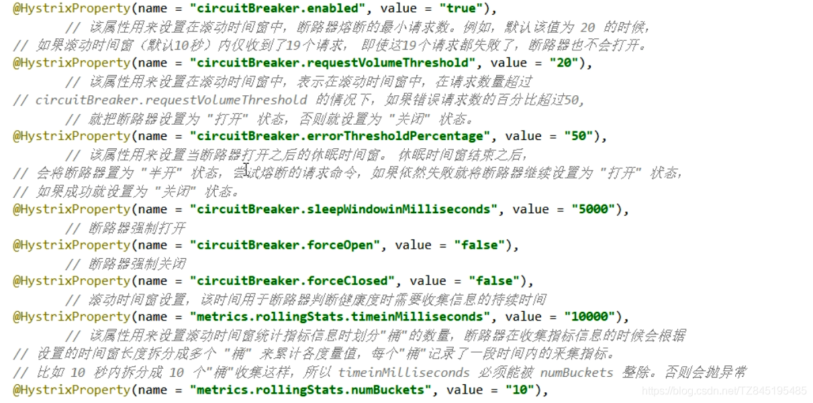


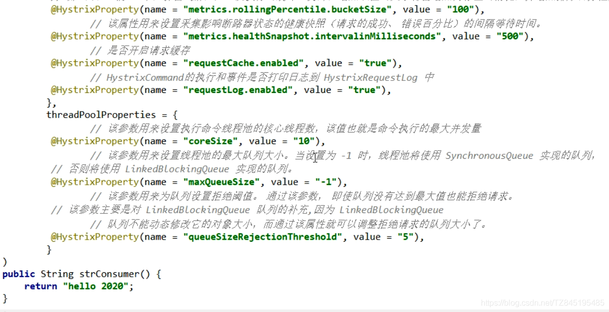

## ⑧. 服务监控hystrixDashboard

**`8>.` 服务监控hystrixDashboard**

- ①. 新建cloud-consumer-hystrix-dashboard9001
- ②. pom.xml

```xml
    <dependencies>
        <!--新增hystrix dashboard-->
        <dependency>
            <groupId>org.springframework.cloud</groupId>
            <artifactId>spring-cloud-starter-netflix-hystrix-dashboard</artifactId>
        </dependency>
        <dependency>
            <groupId>org.springframework.boot</groupId>
            <artifactId>spring-boot-starter-actuator</artifactId>
        </dependency>

        <dependency>
            <groupId>org.springframework.boot</groupId>
            <artifactId>spring-boot-devtools</artifactId>
            <scope>runtime</scope>
            <optional>true</optional>
        </dependency>

        <dependency>
            <groupId>org.projectlombok</groupId>
            <artifactId>lombok</artifactId>
            <optional>true</optional>
        </dependency>
        <dependency>
            <groupId>org.springframework.boot</groupId>
            <artifactId>spring-boot-starter-test</artifactId>
            <scope>test</scope>
        </dependency>
    </dependencies>
```

- ③. yml

```yml
server:
  port: 9001

```

- ④. 主启动类上

```java
@SpringBootApplication
@EnableHystrixDashboard
public class HystrixDashboardMain9001 {
    public static void main(String[] args) {
        SpringApplication.run(HystrixDashboardMain9001.class,args);
    }
}

```

- ⑤. 所有Provider微服务提供类（8001/8002/8003）都需要监控依赖配置

```xml
<dependency>
    <groupId>org.springframework.boot</groupId>
    <artifactId>spring-boot-starter-actuator</artifactId>
</dependency>
```

- ⑥. 启动cloud-consumer-hystrix-dashboard9001该微服务后续将监控微服务8001
  http://localhost:9001/hystrix

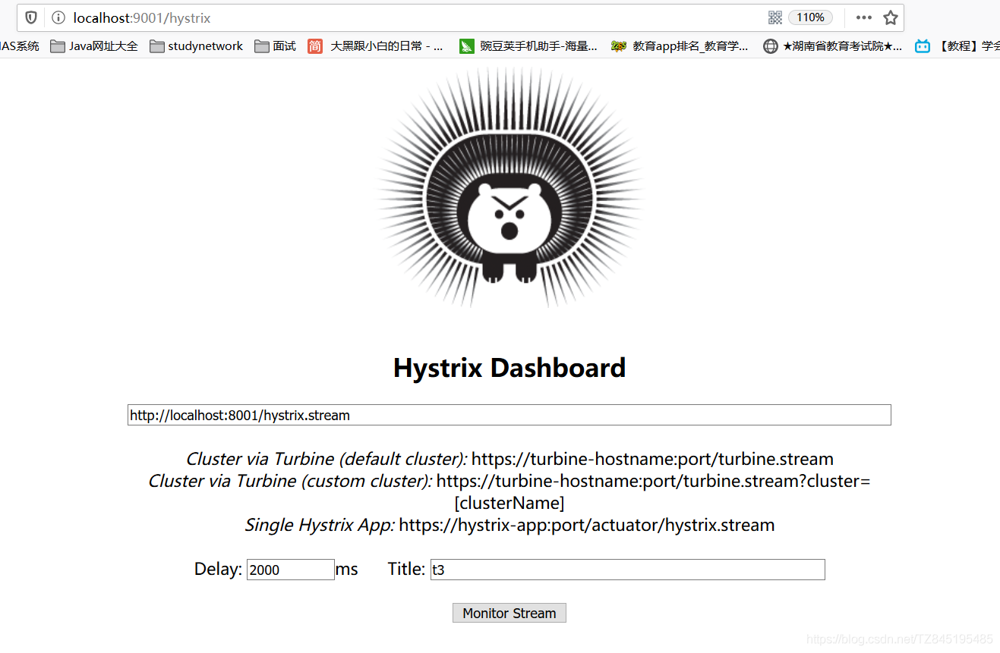

- ⑦. 监控窗口：
  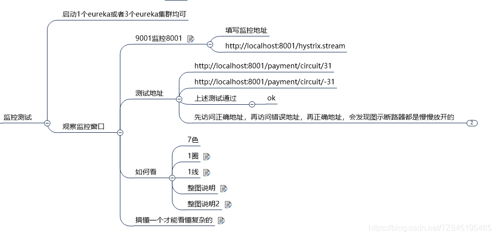

> 解释：
> (1). 一圈：
> (2). 1线
> 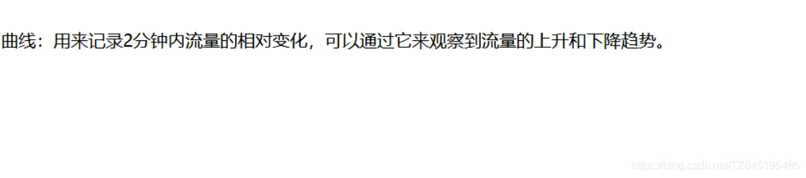(3).整图说明
> 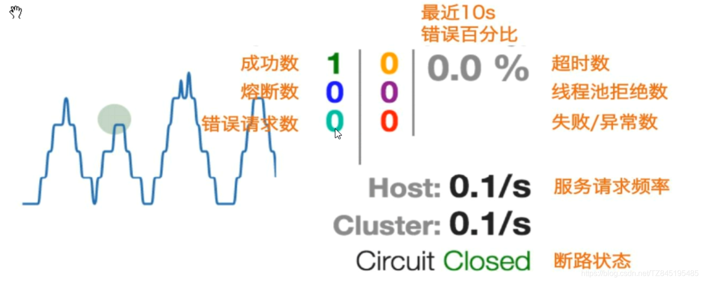
> 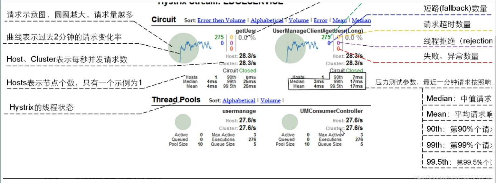(4). 搞懂一个才能看懂复杂的
> 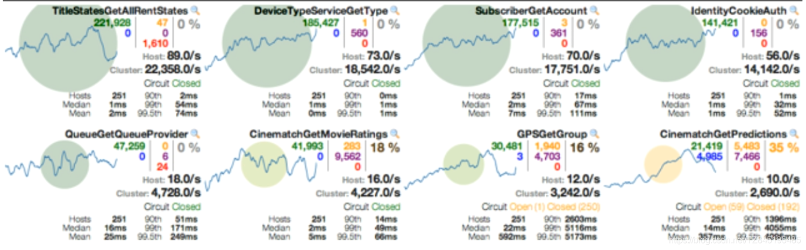

# ⑨. gateway

## ①. gateway的概述

**`1>.` gateway的概述**

- ①. SpringCloud Gateway 是 SpringCloud的一个全新项目，基于spring5.0 + spring boot2.0 + Project Reactor 等技术开发的网关，它旨在为微服务架构提供一种简单有效的统一的API路由管理方式
- ②. SpringCloud Gateway 是基于WebFlux框架实现的，而WebFlux框架底层则使用了高性能的Reactor模式通信框架Netty
- ③. SpringCloud Gateway的目标提供统一的路由方式且基于Filter键的方式提供了网关基本的功能，例如：安全 | 监控 | 指标 和限流

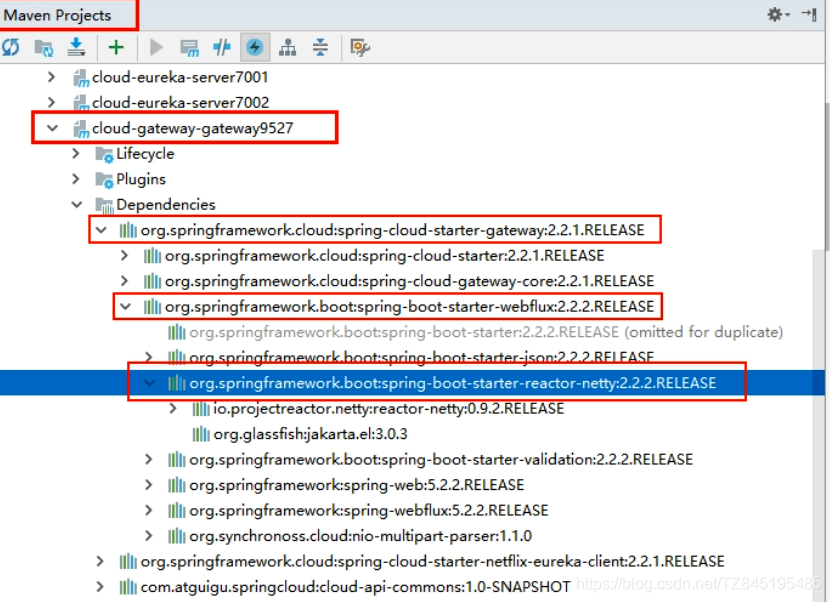


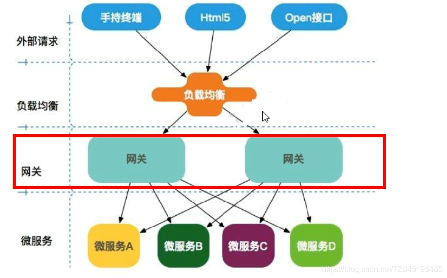

## ②. 路由、断言、过滤器

**`2>.` 路由、断言、过滤器**

- ①. 路由（route） 路由信息的组成：由一个ID、一个目的URL、一组断言工厂、一组Filter组成。如果路由断言为真，说明请求URL和配置路由匹配
- ②. 断言（Predicate） 参考的是java8的java.util.function.Predicate开发人员可以匹配HTTP请求中的所有内容（例如请求头或请求参数），如果请求与断言相匹配则进行路由
- ③. 过滤器（Filter） 一个标准的Spring WebFilter。 Spring Cloud Gateway中的Filter分为两种类型的Filter，分别是Gateway Filter和Global Filter。过滤器Filter将会对请求和响应进行修改处理
  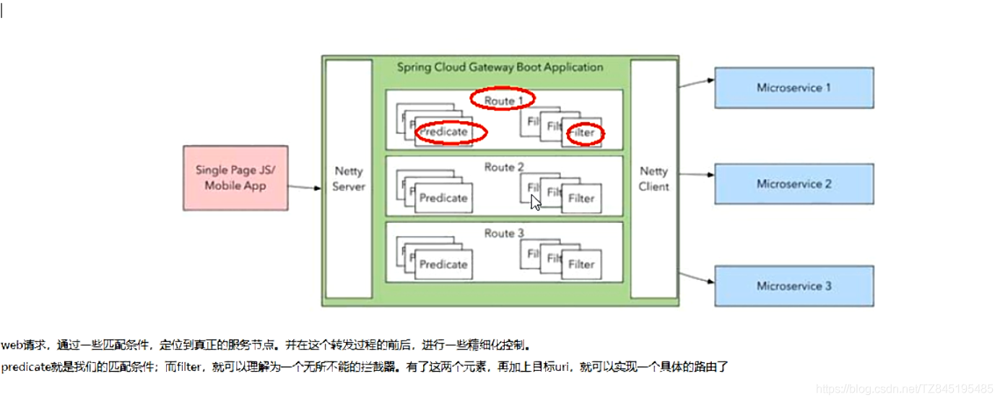

## ③. 新建module9527

**`3>.` 新建module9527**

- ①. cloud-gateway-gateway9527
- ②. pom
  注意：要移除web和boot防止报错

```xml
   <dependencies>
        <!--新增gateway-->
        <dependency>
            <groupId>org.springframework.cloud</groupId>
            <artifactId>spring-cloud-starter-gateway</artifactId>
        </dependency>
        <dependency>
            <groupId>com.atguigu.springcloud</groupId>
            <artifactId>cloud-api-commons</artifactId>
            <version>1.0-SNAPSHOT</version>
        </dependency>

        <!--
        移除这两个
        <dependency>
            <groupId>org.springframework.boot</groupId>
            <artifactId>spring-boot</artifactId>
        </dependency>
        <dependency>
            <groupId>org.springframework.boot</groupId>
            <artifactId>spring-boot-starter-web</artifactId>
        </dependency>-->
        <!--   <dependency>
            <groupId>org.springframework.cloud</groupId>
            <artifactId>spring-cloud-starter-netflix-hystrix</artifactId>
        </dependency>-->

        <dependency>
            <groupId>org.springframework.cloud</groupId>
            <artifactId>spring-cloud-starter-netflix-eureka-client</artifactId>
        </dependency>

        <dependency>
            <groupId>org.springframework.boot</groupId>
            <artifactId>spring-boot-devtools</artifactId>
            <scope>runtime</scope>
            <optional>true</optional>
        </dependency>

        <dependency>
            <groupId>org.projectlombok</groupId>
            <artifactId>lombok</artifactId>
            <optional>true</optional>
        </dependency>
        <dependency>
            <groupId>org.springframework.boot</groupId>
            <artifactId>spring-boot-starter-test</artifactId>
            <scope>test</scope>
        </dependency>

    </dependencies>
```

- ③. 主启动类

```java
package com.atguigu.springcloud;
import org.springframework.boot.SpringApplication;
import org.springframework.boot.autoconfigure.SpringBootApplication;
import org.springframework.cloud.netflix.eureka.EnableEurekaClient;

@SpringBootApplication
@EnableEurekaClient
public class GateWayMain9527 {
    public static void main(String[] args) {
        SpringApplication.run(GateWayMain9527.class, args);
    }
}
```

- ④. yml配置(重点)

```yml
server:
  port: 9527
spring:
  application:
    name: cloud-gateway
  cloud:
    gateway:
      discovery:
        locator:
          enabled: true  #开启从注册中心动态创建路由的功能，利用微服务名进行路由
      routes:
        - id: payment_routh #路由的ID，没有固定规则但要求唯一，建议配合服务名
          uri: http://localhost:8001   #匹配后提供服务的路由地址
          predicates:
            - Path=/payment/get/**   #断言,路径相匹配的进行路由

        - id: payment_routh2
          uri: http://localhost:8001
          predicates:
            - Path=/payment/lb/**   #断言,路径相匹配的进行路由
eureka:
  instance:
    hostname: cloud-gateway-service
  client:
    service-url:
      register-with-eureka: true
      fetch-registry: true
      defaultZone: http://eureka7001.com:7001/eureka
```

- ⑤. 测试：

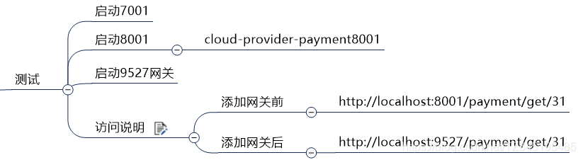

- ⑥. Gateway网关路由有两种配置方式
  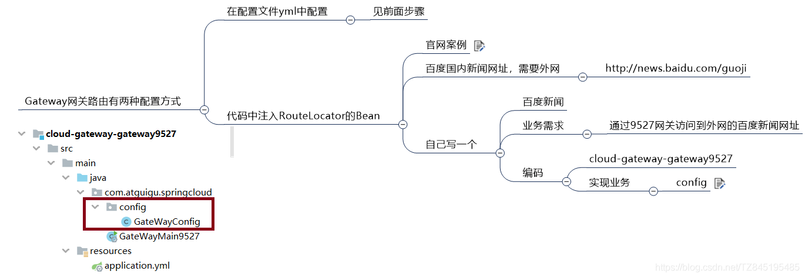

```java
@Configuration
public class GateWayConfig {
    @Bean
    public RouteLocator customRouteLocator(RouteLocatorBuilder routeLocatorBuilder) {
        RouteLocatorBuilder.Builder routes = routeLocatorBuilder.routes();
        /*
        id相当于yml中配置的唯一标识
        当你访问http://localhost:9527/guonei
       就会跳转到http://news.baidu.com/guonei
         */
        routes.route("path_rote_xiaozhi",
                r -> r.path("/guonei")
                        .uri("http://news.baidu.com/guonei")).build();
            return routes.build();
    }
}
```

## ④. 通过微服务名实现动态路由

4>.通过微服务名实现动态路由

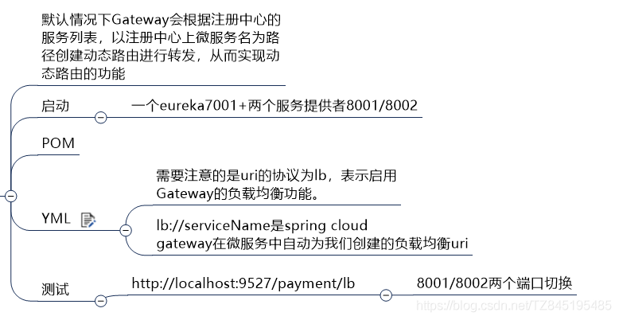

```yml
server:
  port: 9527
spring:
  application:
    name: cloud-gateway
  cloud:
    gateway:
      discovery:
        locator:
          enabled: true  #开启从注册中心动态创建路由的功能，利用微服务名进行路由
      routes:
        - id: payment_routh #路由的ID，没有固定规则但要求唯一，建议配合服务名
          #uri: http://localhost:8001   #匹配后提供服务的路由地址
          uri: lb://CLOUD-PAYMENT-SERVICE   #匹配后提供服务的路由地址
          predicates:
            - Path=/payment/get/**   #断言,路径相匹配的进行路由

        - id: payment_routh2
          #uri: http://localhost:8001
          uri: lb://CLOUD-PAYMENT-SERVICE   #匹配后提供服务的路由地址
          predicates:
            - Path=/payment/lb/**   #断言,路径相匹配的进行路由
eureka:
  instance:
    hostname: cloud-gateway-service
  client:
    service-url:
      register-with-eureka: true
      fetch-registry: true
      defaultZone: http://eureka7001.com:7001/eureka
```

## ⑤. Predicate的使用

**`5>.` Predicate的使用**
(Predicate就是为了实现一组匹配规则，让请求过来找到对应的Route进行处理)

- ①. Predicate的介绍：(启动我们的gatewat9527)
  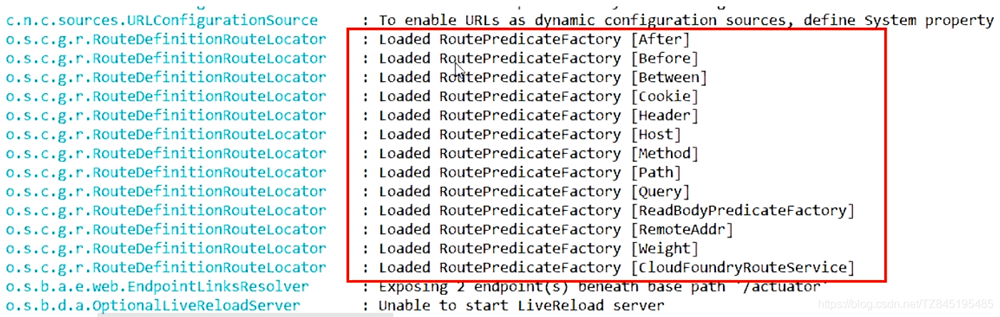
- ②. Route Predicate Factories这个是什么东东？
  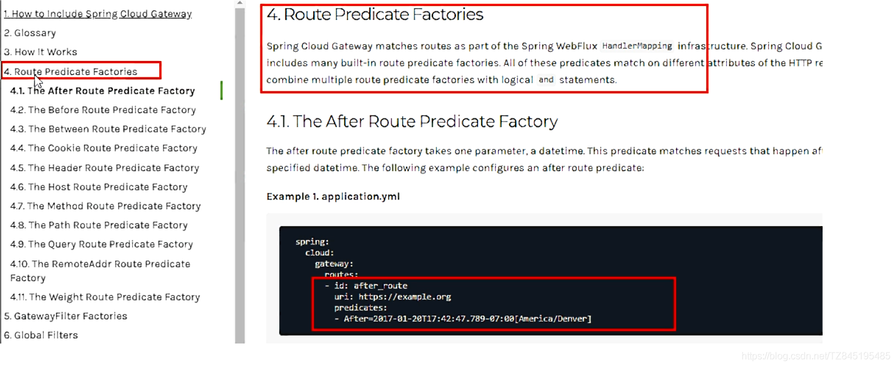
- ③. 常用的Route Predicate
  (https://cloud.spring.io/spring-cloud-static/spring-cloud-gateway/2.2.1.RELEASE/reference/html/#gateway-request-predicates-factories)
  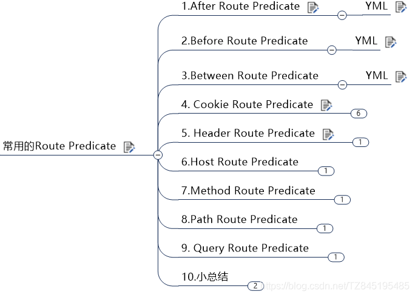
- ④. All code如下：

```handlebars
cloud:
  gateway:
    discovery:
      locator:
        enabled: true  #开启从注册中心动态创建路由的功能，利用微服务名进行路由
    routes:
      - id: payment_routh #路由的ID，没有固定规则但要求唯一，建议配合服务名
        #uri: http://localhost:8001   #匹配后提供服务的路由地址
        uri: lb://cloud-payment-service
        predicates:
          - Path=/payment/get/**   #断言,路径相匹配的进行路由

      - id: payment_routh2
        #uri: http://localhost:8001   #匹配后提供服务的路由地址
        uri: lb://cloud-payment-service
        predicates:
          - Path=/payment/lb/**   #断言,路径相匹配的进行路由
          #- After=2020-03-08T10:59:34.102+08:00[Asia/Shanghai]
          #- Cookie=username,zhangshuai #并且Cookie是username=zhangshuai才能访问
          #- Header=X-Request-Id, \d+ #请求头中要有X-Request-Id属性并且值为整数的正则表达式
          #- Host=**.atguigu.com
          #- Method=GET
          #- Query=username, \d+ #要有参数名称并且是正整数才能路由
```

- ④. After Route Predicate

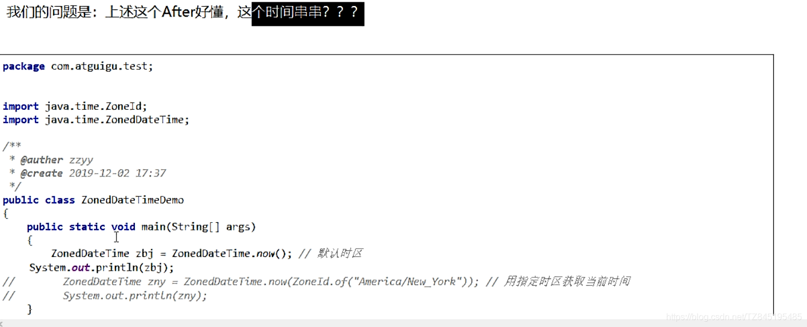

```java
//可以根据这个类的使用得到写在AFTER后面的内容
public class T1 {
    public static void main(String[] args) {
        ZonedDateTime zbj=ZonedDateTime.now();
        System.out.println(zbj);
        //2020-05-04T18:17:31.148+08:00[Asia/Shanghai]
    }
}
```

- ⑤. Cookie Route Predicate(cmd中curl的使用)

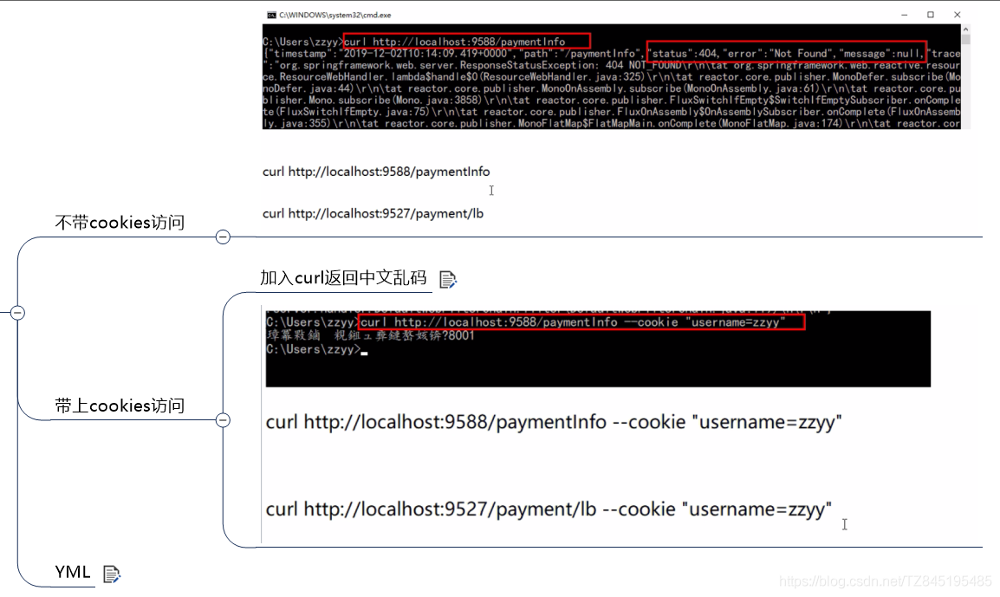
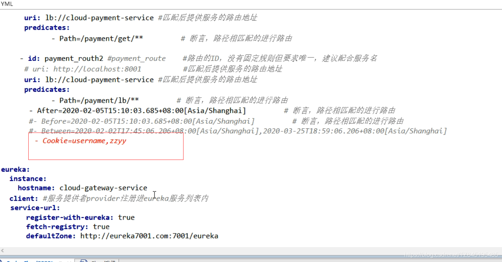

## ⑥. Filter的使用

**`6>.` Filter的使用**

1.Filter是什么
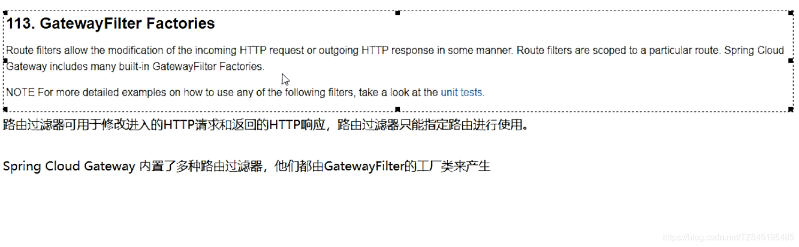
2.Spring Cloud Gateway的Filter

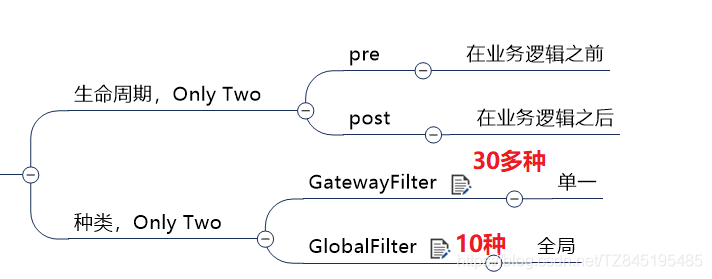

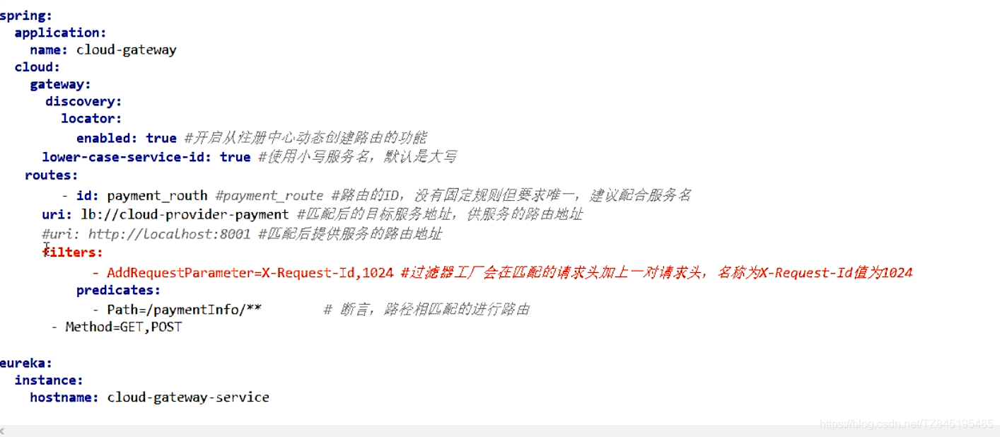

3.自定义过滤器(自定义全局GlobalFilter)

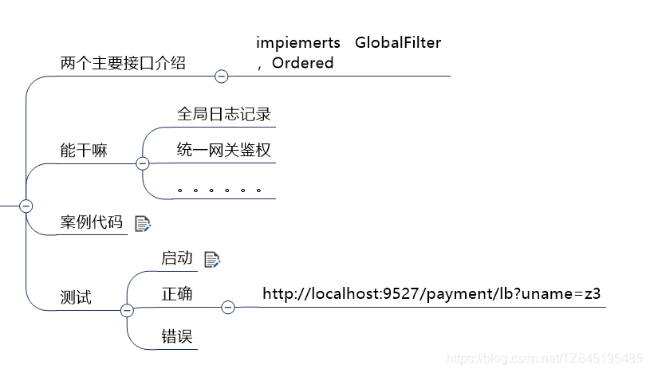

```java
package com.atguigu.springcloud.filter;

import lombok.extern.slf4j.Slf4j;
import org.springframework.cloud.gateway.filter.GatewayFilterChain;
import org.springframework.cloud.gateway.filter.GlobalFilter;
import org.springframework.core.Ordered;
import org.springframework.http.HttpStatus;
import org.springframework.stereotype.Component;
import org.springframework.util.StringUtils;
import org.springframework.web.server.ServerWebExchange;
import reactor.core.publisher.Mono;

import java.util.Date;

@Component
@Slf4j
public class MyLogGateWayFilter implements GlobalFilter,Ordered {
    @Override
    public Mono<Void> filter(ServerWebExchange exchange, GatewayFilterChain chain) {

        log.info("*********come in MyLogGateWayFilter: "+new Date());
        String uname = exchange.getRequest().getQueryParams().getFirst("username");
        if(StringUtils.isEmpty(username)){
            log.info("*****用户名为Null 非法用户,(┬＿┬)");
            //设置响应状态码为未授权
            exchange.getResponse().setStatusCode(HttpStatus.NOT_ACCEPTABLE);//给人家一个回应
            return exchange.getResponse().setComplete();
        }
        return chain.filter(exchange);
    }

    @Override
    public int getOrder() {
        //值越小越先执行, 当有多个过滤器的时候,值越小就越先执行
        return 0;
    }
}
```