# 01.分布式基础概念

## 1、微服务

拒绝大型单体应用，基于业务边界进行服务微化拆分，各个服务独立部署运行

## 2、集群、分布式、节点

### 集群

- 是一种物理形态
- 将几台服务器集中在一起，实现同一业务

### 分布式

- 是一种工作方式
- 若干独立计算机的集合，这些计算机对于用户来说就像单个相关系统
- 将不同的业务分布在不同的地方

### 节点

- 集群中的一个服务器

## 3、远程调用

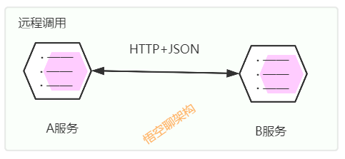

分布式系统中，各个服务可能处于不同主机，但是服务之间不可避免的需要互相调用，我们称为远程调用。

SpringCloud中使用HTTP+JSON的方式完成远程调用。

## 4、负载均衡

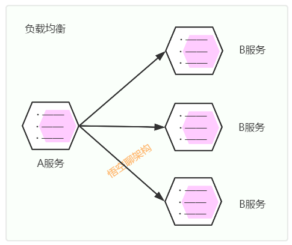

A服务调用B服务，B服务部署在多台机器，A发送请求到任意一个服务器均可完成调用。

为了使每台服务器不至于忙于处理请求，可以将请求均衡到每一个服务器，提升网站的可用性。

**负载均衡算法：**

- 轮询：请求依次按顺序分发到不同的可用服务器执行，循环分发请求。
- 最小连接：分发请求到连接数最少的服务器。场景：处理请求用时较长的场景。
- 散列：根据用户请求的IP地址的散列（hash）来选择要转发的服务器。场景：需要处理状态而要求用户能连接到相同服务器。

## 5、服务注册、服务发现、注册中心

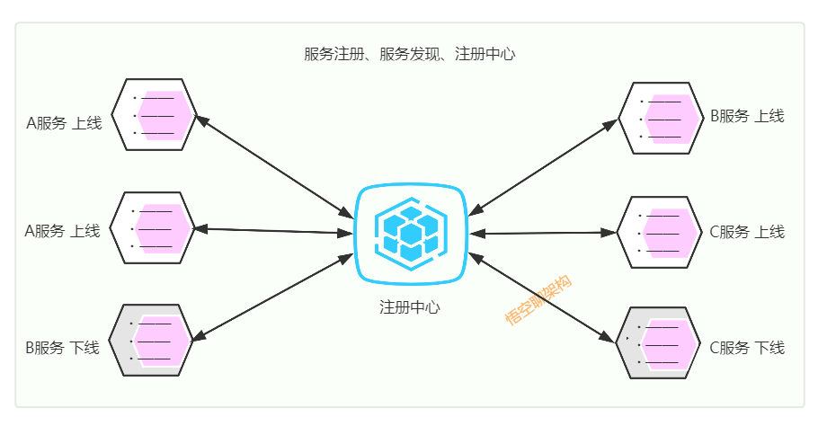

A服务调用B服务、C服务，但是A服务不知道B、C服务所在的服务器是正常还是下线，注册中心可以帮助解决。

注册中心实时知道哪些服务正常，哪些服务下线，也能记录新增的正常服务。服务之间调用不需要去判断哪些服务正常，注册中心会告诉服务有效的调用地址。

**服务注册：**服务将自己的IP和端口报告给注册中心的过程。

**服务发现：**查询可用微服务列表及其网络地址的机制。

**注册中心：**集中记录每个服务的地址，注册和注销服务。

**服务检查：**检查已注册的服务，如发现某服务长时间无法访问，则会从注册中心移除该服务。

## 6、配置中心

每个服务都有大量配置，更新一个配置，需要同步到每个服务，如何修改每个服务的配置呢？

每个服务从配置中心获取配置，自动更新自己的配置。

## 7、服务熔断、服务降级

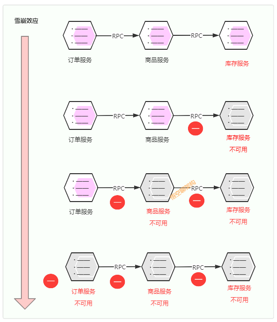

下单场景：用户下单了一个商品，客户端调用订单服务来生成预付款订单，订单服务调用商品服务查看下单的哪款商品，商品服务调用库存服务判断这款商品是否有库存，如有库存，则可以生成预付款订单。

**雪崩场景：**

- 第一次滚雪球：库存服务不可用（如响应超时等），库存服务收到的很多请求都未处理完，库存服务将无法处理更多请求。
- 第二次滚雪球：因商品服务的请求都在等库存服务返回结果，导致商品服务调用库存服务的很多请求未处理完，商品服务将无法处理其他请求，导致商品服务不可用
- 第三次滚雪球：因商品服务不可用，订单服务调用商品服务的的其他请求无法处理，导致订单服务不可用。
- 第四次滚雪球：因订单服务不可用，客户端将不能下单，更多客户将重试下单，将导致更多下单请求不可用。

**服务熔断：**

设置服务的超时，当被调用的服务某段时间内失败率达到某个阈值，则对该服务开启短路保护，后来的请求不调用这个服务，直接返回默认的数据。

**服务降级：**

对非核心业务降级运行：某些服务不处理，或者简单处理（抛异常、返回Null、返回Mock数据）

## 8、API网关

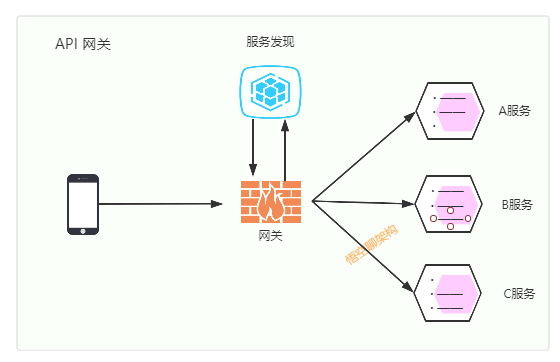

- 抽象了微服务中都需要的公共功能
- 提供了负载均衡、自动熔断、灰度发布、统一认证、限流、日志统计功能

# 02快速搭建Ubuntu虚拟机环境

## 1.开启虚拟机服务

Windows启动配置：Intel Virtualization Technology -> Enabled

## 2.下载安装VirtualBox

VirtualBox：虚拟机管理软件

https://www.virtualbox.org/wiki/Downloads

## 3.下载安装Vagrant

Vagrant：创建和管理虚拟机

Vagrant 软件：https://www.vagrantup.com/downloads.html

Vagrant 官方镜像：https://app.vagrantup.com/boxes/search

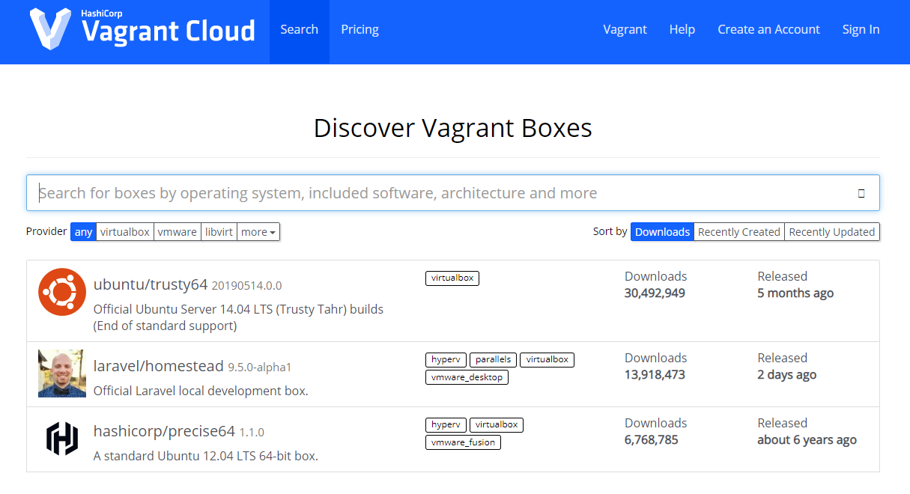

- check是否安装好了vagrant

命令行输入 vagrant

```shell
vagrant
```

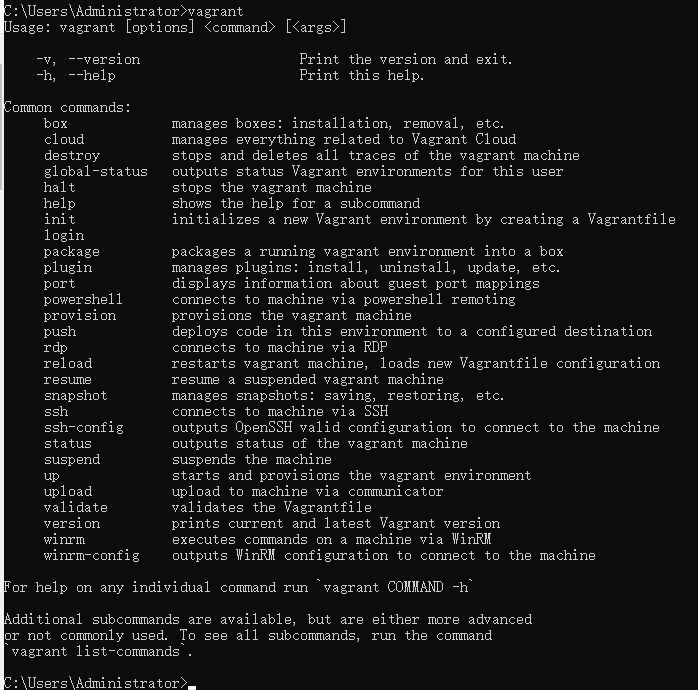

## 4.安装 vagrant ubuntu 国内镜像

```
# ubuntu 18.04 LTS:
vagrant box add https://mirrors.tuna.tsinghua.edu.cn/ubuntu-cloud-images/bionic/current/bionic-server-cloudimg-amd64-vagrant.box --name ubuntu18

# ubunt 16.04 LTS：
vagrant box add https://mirrors.tuna.tsinghua.edu.cn/ubuntu-cloud-images/xenial/current/xenial-server-cloudimg-amd64-vagrant.box --name ubuntu16

# ubuntu14：
vagrant box add https://mirrors.tuna.tsinghua.edu.cn/ubuntu-cloud-images/vagrant/trusty/current/trusty-server-cloudimg-amd64-vagrant-disk1.box --name ubuntu14
```

安装ubuntu 18

```shell
vagrant box add https://mirrors.tuna.tsinghua.edu.cn/ubuntu-cloud-images/bionic/current/bionic-server-cloudimg-amd64-vagrant.box --name ubuntu18
```

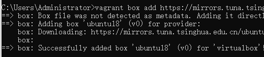

- 创建vagrant配置文件

```
vagrant init
```

- 打开C:\Users\Administrator\Vagrantfile文件

```powershell
config.vm.box = "base" 修改为
config.vm.box = "ubuntu18"
```

## 5.启动虚拟机

```shell
vagrant up
```


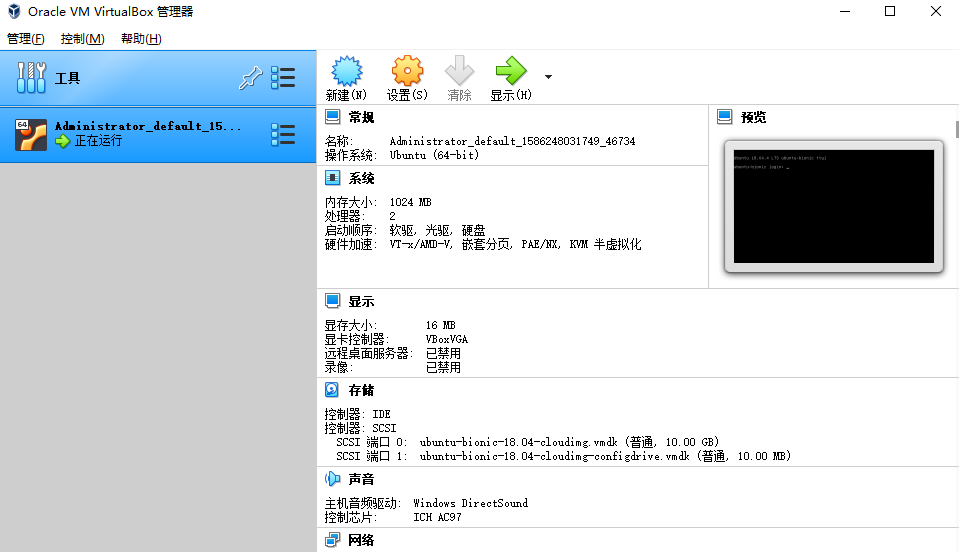

## 6.连接虚拟机

```
vagrant ssh
```

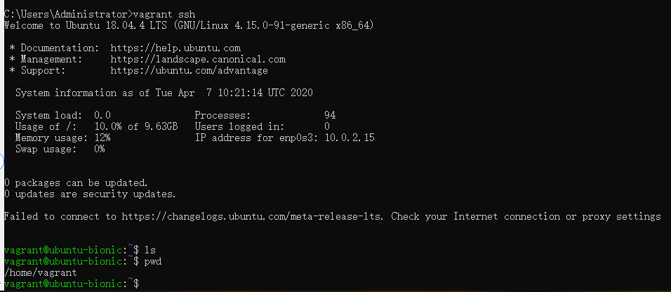

# 03安装docker

https://docs.docker.com/engine/install/ubuntu/

## 1.卸载老版本docker

```sh
sudo apt-get remove docker docker-engine docker.io containerd runc
```

## 2. 设置仓库

```sh
$ sudo apt-get update

$ sudo apt-get install \
    apt-transport-https \
    ca-certificates \
    curl \
    gnupg-agent \
    software-properties-common
curl -fsSL https://download.docker.com/linux/ubuntu/gpg | sudo apt-key add -

sudo apt-key fingerprint 0EBFCD88

sudo add-apt-repository \
   "deb [arch=amd64] https://download.docker.com/linux/ubuntu \
   $(lsb_release -cs) \
   stable"
   
```

## 3.安装docker

```sh
sudo apt-get update
sudo apt-get install docker-ce docker-ce-cli containerd.io
```

## 4. 测试安装成功

```sh
sudo docker run hello-world
```


## 5.设置开机自启动

sudo systemctl enable

## 6.配置镜像加速

https://cr.console.aliyun.com/cn-hangzhou/instances/mirrors

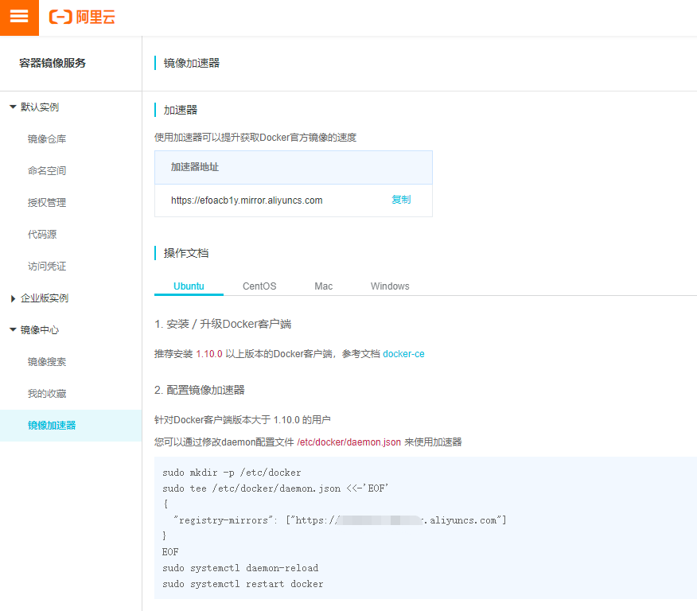

```sh
sudo mkdir -p /etc/docker
sudo tee /etc/docker/daemon.json <<-'EOF'
{
  "registry-mirrors": ["您的专属加速器地址"]
}
EOF
sudo systemctl daemon-reload
sudo systemctl restart docker
```

## 7. 免sudo使用docker命令

当以普通用户身份去使用docker images时，出现以下错误：

Got permission denied while trying to connect to the Docker daemon socket at unix:///var/run/docker.sock: Get http://%2Fvar%2Frun%2Fdocker.sock/v1.26/images/json: dial unix /var/run/docker.sock: connect: permission denied
可以看都，最后告知我们时权限的问题。那么在linux文件权限有三个数据左右drwxrwxrwx，

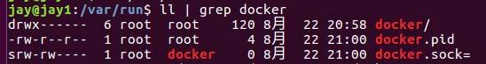

其中第一为d代表该文件是一个文件夹
前三位、中三位、后三位分别代表这属主权限、属组权限、其他人权限。
如图，其中 第三列、第四列分别代表文件的属主、属组。

上图是报错文件的权限展示，可以看到其属主为root，权限为rw，可读可写；其属组为docker，权限为rw，可读可写。如果要当前用户可直接读取该文件，那么我们就为当前用户添加到docker属组即可。

如果还没有 docker group 就添加一个：

```
sudo groupadd docker

将用户加入该 group 内。然后退出并重新登录就生效啦。
sudo gpasswd -a ${USER} docker

重启 docker 服务
sudo service docker restart

切换当前会话到新 group 或者重启 X 会话
newgrp - docker

注意:最后一步是必须的，否则因为 groups 命令获取到的是缓存的组信息，刚添加的组信息未能生效，所以 docker images 执行时同样有错。
```

Ubantu 18.04 apt-get update 无法更新，更新慢的问题 https://blog.csdn.net/stopping5/article/details/80493643

```sh
sudo cp /etc/apt/sources.list /etc/apt/sources.list.old
sudo vim /etc/apt/sources.list
替换成阿里源

#阿里源：
deb http://mirrors.aliyun.com/ubuntu/ trusty main restricted universe multiverse
deb http://mirrors.aliyun.com/ubuntu/ trusty-security main restricted universe multiverse
deb http://mirrors.aliyun.com/ubuntu/ trusty-updates main restricted universe multiverse
deb http://mirrors.aliyun.com/ubuntu/ trusty-proposed main restricted universe multiverse
deb http://mirrors.aliyun.com/ubuntu/ trusty-backports main restricted universe multiverse
deb-src http://mirrors.aliyun.com/ubuntu/ trusty main restricted universe multiverse
deb-src http://mirrors.aliyun.com/ubuntu/ trusty-security main restricted universe multiverse
deb-src http://mirrors.aliyun.com/ubuntu/ trusty-updates main restricted universe multiverse
deb-src http://mirrors.aliyun.com/ubuntu/ trusty-proposed main restricted universe multiverse
deb-src http://mirrors.aliyun.com/ubuntu/ trusty-backports main restricted universe multiverse
```

其他命令

docker update redis --restart=always 虚拟机重启后，redis自动启动

# 04docker 安装mysql

## 1.下载镜像

```sh
sudo docker pull mysql:5.7
ubuntu@VM-0-13-ubuntu:~$ sudo docker pull mysql:5.7
5.7: Pulling from library/mysql
c499e6d256d6: Pull complete 
22c4cdf4ea75: Pull complete 
6ff5091a5a30: Pull complete 
2fd3d1af9403: Pull complete 
0d9d26127d1d: Pull complete 
54a67d4e7579: Pull complete 
fe989230d866: Pull complete 
466a91a95e2f: Pull complete 
3e4554c238f1: Pull complete 
603b48ead88c: Pull complete 
1e86a9aa7171: Pull complete 
Digest: sha256:fbaeced79cfdae5d3c8d4a8c41e883f254f72ed7428c6b93a498824b76d97121
Status: Downloaded newer image for mysql:5.7
docker.io/library/mysql:5.7
```

## 2.查看下载的镜像

```sh
sudo docker images
```

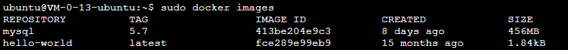

## 3.创建mysql实例并启动

- 创建mysql实例并启动

```sh
sudo docker run -p 3306:3306 --name mysql \
-v /mydata/mysql/log:/var/log/mysql \
-v /mydata/mysql/data:/var/lib/mysql \
-v /mydata/mysql/conf:/etc/mysql \
-e MYSQL_ROOT_PASSWORD=root \
-d mysql:5.7
参数说明
-p 3306:3306 将容器的3306端口映射到主机
-v /mydata/mysql/log:/var/log/mysql\ 将日志文件挂载到主机
-v /mydata/mysql/data:/var/lib/mysql\ 将数据文件挂载到主机
-v /mydata/mysql/conf:/etc/mysql\ 将配置文件挂载到主机
```

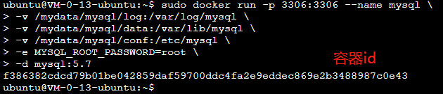

- 查看docker容器

  mysql容器已启动


## 4.连接数据库

- 用Workbench连接数据库

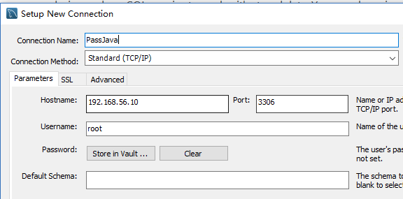

- 查看数据库

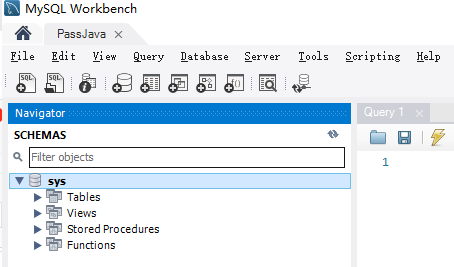

## 5.进入mysql 容器

```sh
sudo docker exec -it mysql /bin/bash
```

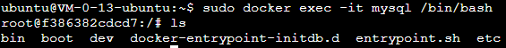

## 6.查看虚拟机映射文件

```sh
cd /mydata/mysql
ls
```

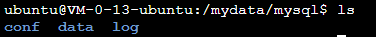

# 05docker安装redis

## 1.下载镜像

- 下载镜像

```sh
sudo docker pull redis
ubuntu@VM-0-13-ubuntu:~$ sudo docker pull redis
Using default tag: latest
latest: Pulling from library/redis
c499e6d256d6: Already exists 
bf1bc8a5a7e4: Pull complete 
7564fb795604: Pull complete 
ec6e86f783e4: Pull complete 
1371d6223f46: Pull complete 
021fd554320f: Pull complete 
Digest: sha256:a732b1359e338a539c25346a50bf0a501120c41dc248d868e546b33e32bf4fe4
Status: Downloaded newer image for redis:latest
docker.io/library/redis:latest
```

- 查看下载的镜像

```sh
sudo docker images
```

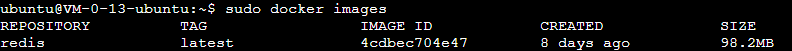

## 2.启动redis

- 创建redis.conf 配置文件

```sh
sudo mkdir -p /mydata/redis/conf
sudo touch /mydata/redis/conf/redis.conf
```

- 启动redis

```sh
sudo docker run -p 6379:6379 --name redis -v /mydata/redis/data:/data \
-v /mydata/redis/conf/redis.conf:/etc/redis/redis.conf \
-d redis redis-server /etc/redis/redis.conf
```

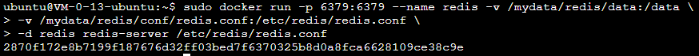

## 3.连接redis

```sh
sudo docker exec -it redis redis-cli
```

## 4.测试redis

设置a=100，返回OK

```sh
set a 100
```

获取a的值，返回"100"

```sh
get a
```


## 5.设置redis持久化存储

- 修改虚拟机映射的redis配置文件

```sh
修改配置文件：
sudo vim  /mydata/redis/conf/redis.conf
添加配置：
appendonly yes
```

- 检查是否生效

```sh
重启redis容器：
docker restart redis
设置a=200，返回OK
set a 200
获取a的值，返回"200"
get a
重启redis容器
sudo docker restart redis
重新连接redis容器
sudo docker exec -it redis redis-cli
获取a的值
get a,返回"200"
```

## 6.安装redis可视化工具

- 安装redis可视化工具

  redis-desktop-manager

- 连接redis

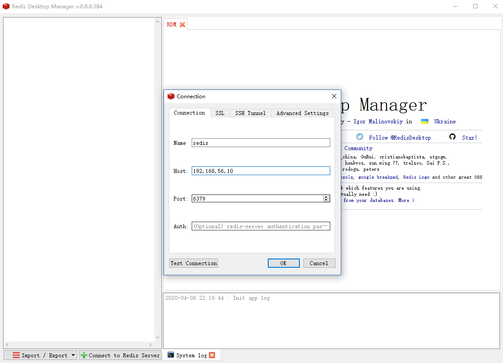

- 查看redis数据库

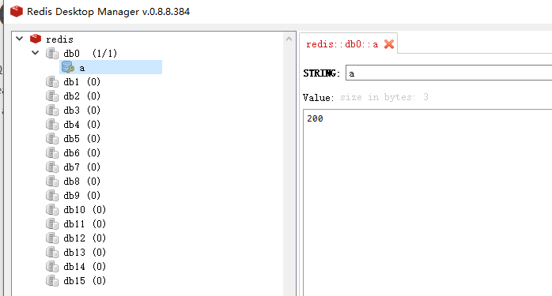

# 06本地开发环境配置

## 1. 本地环境安装Java

我本地环境的java版本 1.8.0_131

```sh
java -version
```

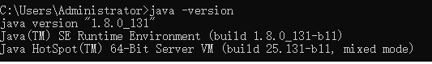

java安装和环境变量配置：https://www.cnblogs.com/jackson0714/p/6591942.html

## 2.本地环境配置Maven

（1）下载Maven，拷贝文件夹到C盘

C:\apache-maven-3.6.2

（2）添加到环境变量

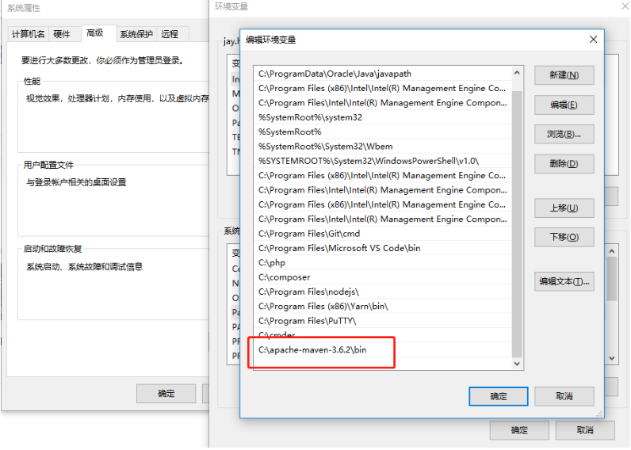

cmder里面 执行命令 mvn -v

如果报错命令不存在，则重新启动cmder

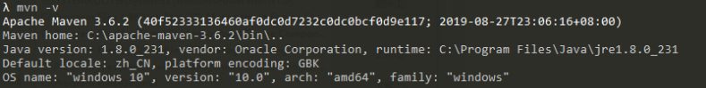

（3）设置Maven代理

阿里云代理 https://maven.aliyun.com/mvn/view

点击使用指南，拷贝配置指南

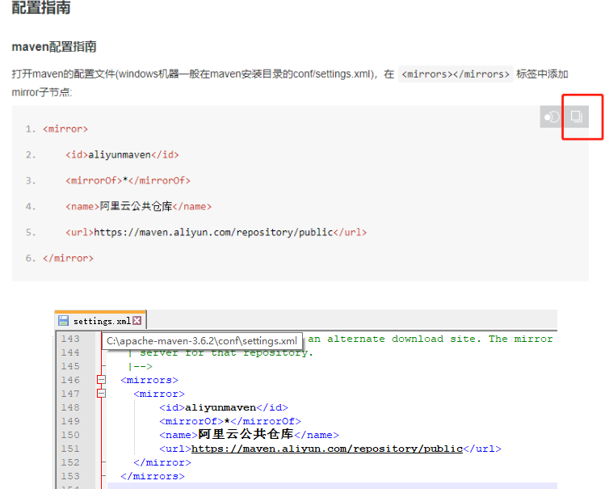

```xml
<mirror>
    <id>aliyunmaven</id>
    <mirrorOf>*</mirrorOf>
    <name>阿里云公共仓库</name>
    <url>https://maven.aliyun.com/repository/public</url>
</mirror>
```

（4）配置jdk1.8编译项目

```xml
<profiles>
    <profile>
        <id>jdk-1.8</id>
        <activation>
            <activeByDefault>true</activeByDefault>
            <jdk>1.8</jdk>
        </activation>
        <properties>
            <maven.compiler.source>1.8</maven.compiler.source>
            <maven.compiler.target>1.8</maven.compiler.target>
            <maven.compiler.compilerVersion>1.8</maven.compiler.compilerVersion>
        </properties>
    </profile>
<profiles>
```

## 3.IDEA Maven构建工具配置

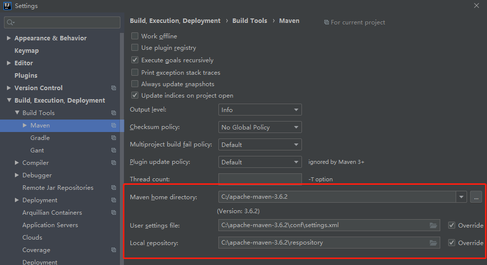

## 4. IDEA 安装Lombok插件

Lombok：简化JavaBean的开发

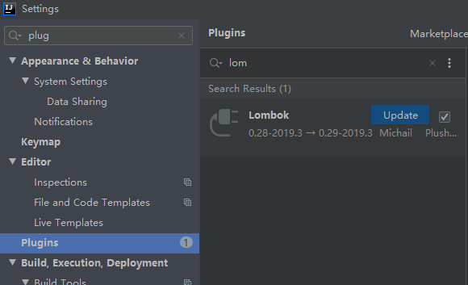

## 5. IDEA 安装mybatisx 插件

mybatisx：mybatis plus开发的一个插件，从mapper方法快速定位到xml文件

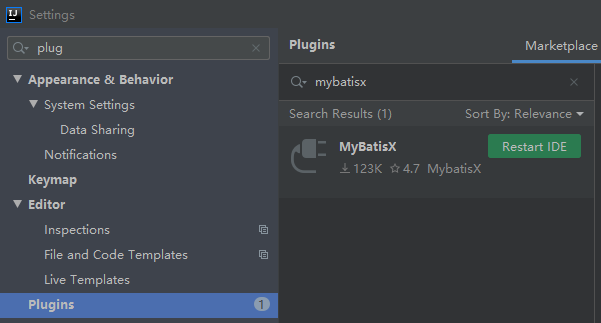

## 6.安装VSCode

https://code.visualstudio.com/

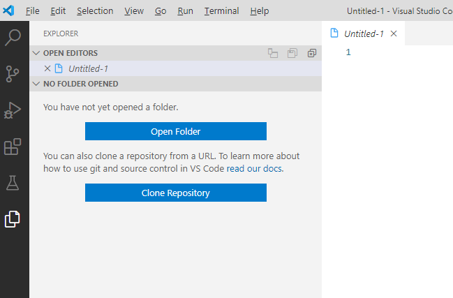

## 7.添加VSCode插件

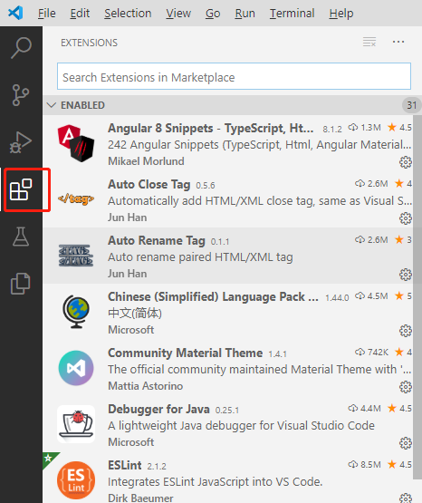

- Auto Close Tag 自动加上关闭标签


- Auto Rename Tag 自动命名配对标签


- Chinese 中文简体包


- ESLint 语法检查


- HTML CSS Support 帮助CSS开发


- HTML Snippets 帮忙HTML开发


- JavaScript (ES6) 帮助JavaScript开发


- Liver Server 启动一个本地服务


- open in browser 用浏览器打开文件


- Vetur 帮助Vue开发


- minapp 帮助小程序开发


# 07配置Git

## 1.配置git 用户名和邮箱

```sh
git config --global user.name "jackson0714"
git config --global user.email "jackson0585@163.com"
```

## 2.生成ssh key

```sh
ssh-keygen -t rsa -b 4096 -C "jackson0585@163.com"
```

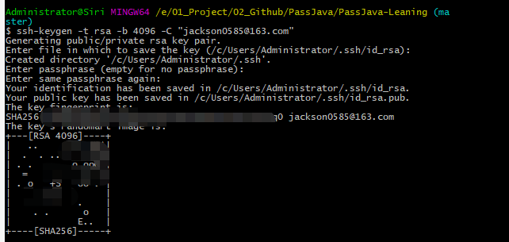

## 3.设置ssh key

- 打开文件

C:\Users\Administrator.ssh\id_rsa.pub

- 拷贝里面的内容
- 打开这个链接

https://github.com/settings/ssh/new

- 粘贴已拷贝的内容

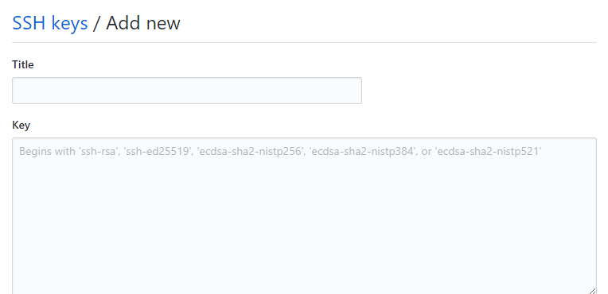

- 保存ssh key

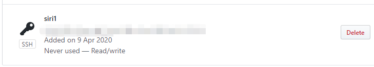

## 4.遇到的问题

如果遇到Fatal: HttpRequestException encountered问题

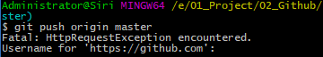

则下载这个安装包解决：

[Git Credential Manager for Windows v1.20](https://github.com/microsoft/Git-Credential-Manager-for-Windows/releases/tag/1.20.0)

链接：https://github.com/Microsoft/Git-Credential-Manager-for-Windows/releases/

# 08初始化项目和添加微服务

## 1.GitHub上创建一个空的仓库

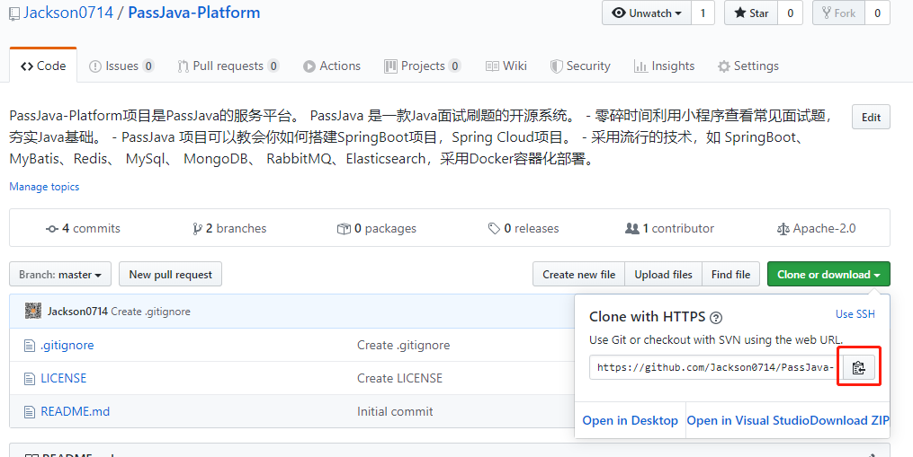

## 2.从GitHub上引入空的项目

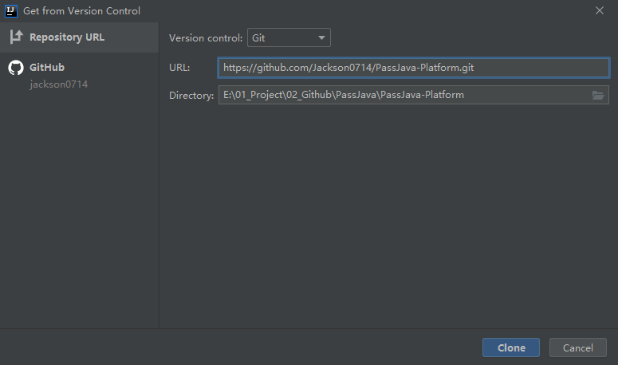

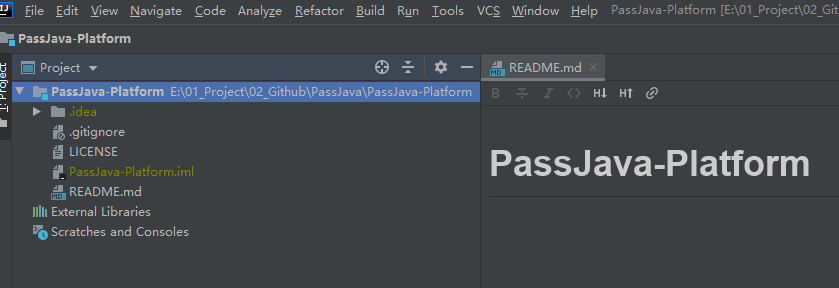

## 3.添加内容服务

passjava-content

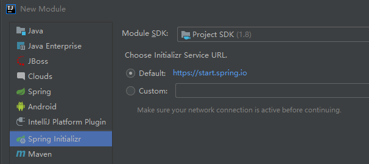

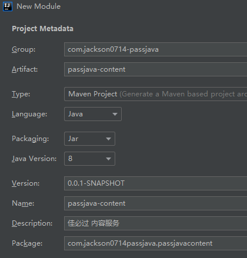

| 序号 | 字段        | 内容                             |
| ---- | ----------- | -------------------------------- |
| 1    | group       | com.jackson0714.passjava         |
| 2    | Artifact    | passjava-content                 |
| 3    | Name        | passjava-content                 |
| 4    | Description | 佳必过-内容服务                  |
| 5    | Package     | com.jackson0714.passjava.content |

- 添加依赖组件SpringWeb, OpenFeign

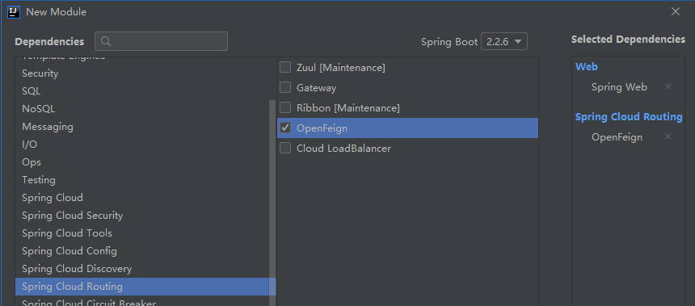

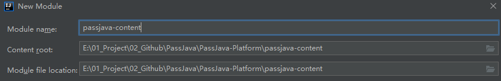

## 3.添加其他微服务

| 序号 | 服务描述   | 服务名            |
| ---- | ---------- | ----------------- |
| 1    | 内容微服务 | passjava-content  |
| 2    | 会员微服务 | passjava-member   |
| 3    | 题目微服务 | passjava-question |
| 4    | 学习微服务 | passjava-study    |
| 5    | 渠道微服务 | passjava-channel  |

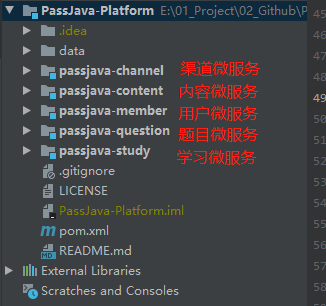

## 4.PassJava-Platform添加Pom.xml文件

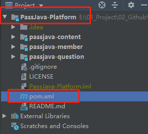

```xml
<?xml version="1.0" encoding="UTF-8"?>
<project xmlns="http://maven.apache.org/POM/4.0.0" xmlns:xsi="http://www.w3.org/2001/XMLSchema-instance"
         xsi:schemaLocation="http://maven.apache.org/POM/4.0.0 https://maven.apache.org/xsd/maven-4.0.0.xsd">
    <modelVersion>4.0.0</modelVersion>
    <groupId>com.jackson0714.passjava</groupId>
    <artifactId>passjava</artifactId>
    <version>0.0.1-SNAPSHOT</version>
    <name>passjava</name>
    <description>佳必过-聚合服务</description>
    <packaging>pom</packaging>

    <modules>
        <module>passjava-content</module>
        <module>passjava-member</module>
        <module>passjava-question</module>
        <module>passjava-study</module>
        <module>passjava-channel</module>
    </modules>
</project>
```

## 5.添加根目录Maven 配置

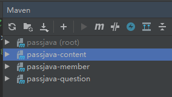

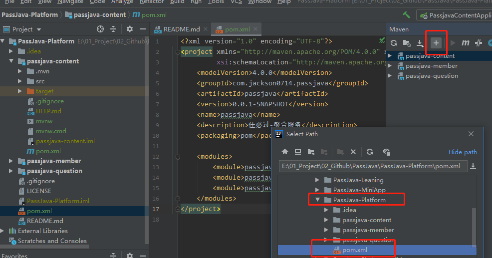

Maven操作根项目就可以了，试下clean

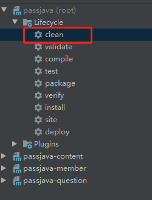

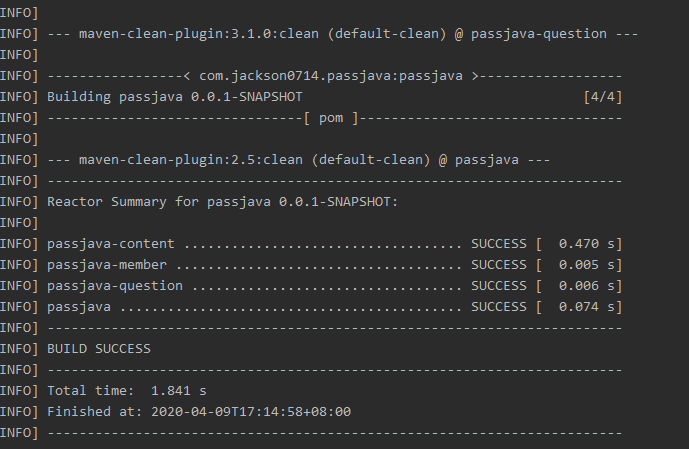

## 6. 配置.gitignore文件

提交代码时，忽略某些文件

```json
### gradle ###
.gradle
/build/
!gradle/wrapper/gradle-wrapper.jar

### STS ###
.settings/
.apt_generated
.classpath
.factorypath
.project
.settings
.springBeans
bin/

### IntelliJ IDEA ###
.idea
*.iws
*.iml
*.ipr
rebel.xml

### NetBeans ###
nbproject/private/
build/
nbbuild/
dist/
nbdist/
.nb-gradle/

### maven ###
target/
*.war
*.ear
*.zip
*.tar
*.tar.gz
**/mvnw
**/mvnw.cmd
**/.mvn

### logs ####
/logs/
*.log

### temp ignore ###
*.cache
*.diff
*.patch
*.tmp
*.java~
*.properties~
*.xml~

### system ignore ###
.DS_Store
Thumbs.db
Servers
.metadata
upload
gen_code

### database ###

db/db_back_dir/

### redis ###
/redis/
```

删除子项目的.gitignore文件

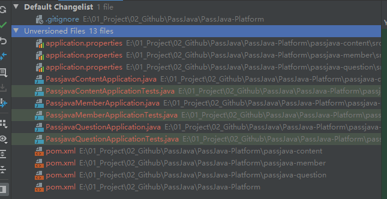

## 7.提交代码

可以用IDEA的git工具提交，也可以用git bash命令行提交

```sh
git add .
git commit -m 'xxx'
git push origin master
```

# 09初始化数据库表

## 用PowerDisigner工具创建数据库

- 用PowerDisigner工具创建数据库

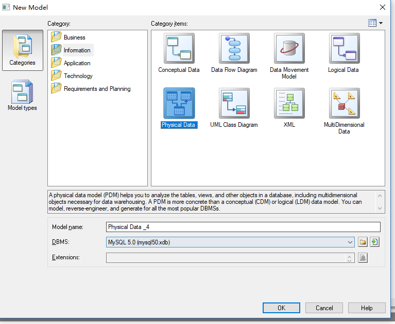

总共有5个微服务数据库：内容、学习、渠道、用户、题目

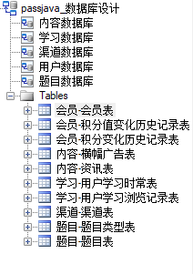

- 内容微服务的数据库

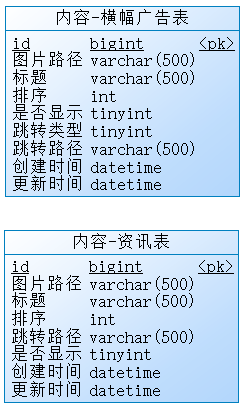

- 学习微服务的数据库

  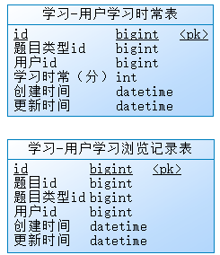

- 渠道微服务的数据库

  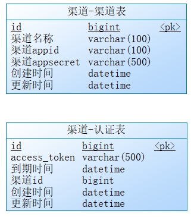

- 用户微服务的数据库

  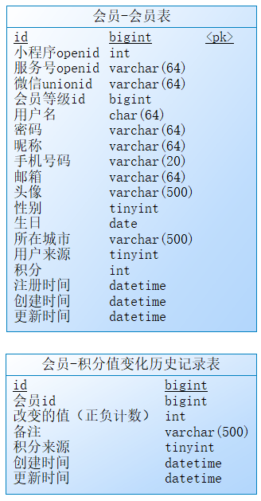

- 题目微服务的数据库

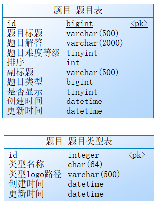

SQL文件在这个项目里面：https://github.com/Jackson0714/PassJava-Platform.git

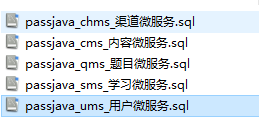

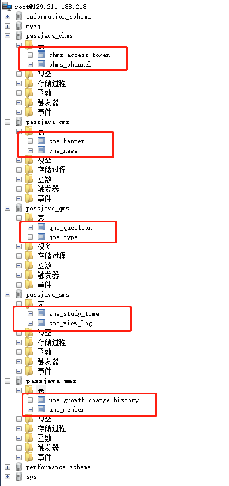

# 10快速生成前后端代码

## 1.下载代码生成器框架

```sh
git clone https://gitee.com/renrenio/renren-generator.git
```

## 2.添加人人开源后端代码

PassJava项目

拷贝文件夹renren-fast到PassJava根目录

POM文件 添加依赖

```xml
<module>renren-generator</module>
```

## 3.修改renren-generator服务的配置文件

（1）修改数据库链接 src/main/resources/application-dev.yml

- 修改数据库连接为自己的mysql数据库连接

- 数据库名改为要生成代码的服务，如passjava_qms数据库

  ```xml
  url: jdbc:mysql://129.211.188.xxx:3306/passjava_qms?useUnicode=true&characterEncoding=UTF-8&useSSL=false
  username: root
  password: root
  ```

（2）修改属性配置文件 src/main/resources/generator.properties

```properties
# 以question微服务为例
mainPath=com.jackson0714
package=com.jackson0714.passjava
moduleName=question
author=jackson0714
email=jackson0585@163.com
tablePrefix=qms_
```

（3）修改controller 模板文件

src/main/resources/template/Controller.java.vm

删除引入的包，后面再引入

```java
import org.apache.shiro.authz.annotation.RequiresPermissions;
```

注释RequiresPermissions注解，后面再引入

```java
@RequiresPermissions("${moduleName}:${pathName}:list")
```

## 4.启动代码生成器服务

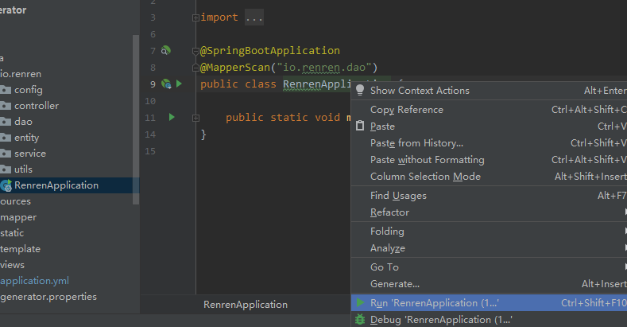

浏览器打开localhost，可以看到数据库qms的两张表已经显示在后台了

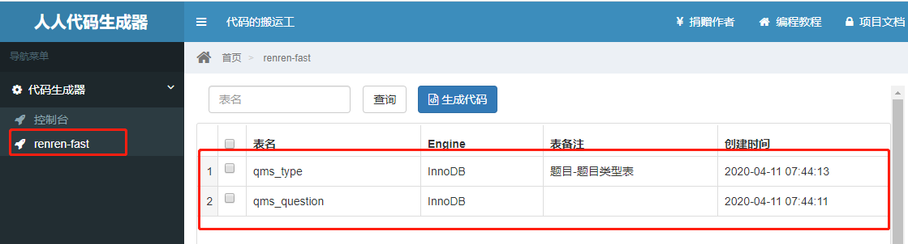

## 5.生成代码

- 生成代码

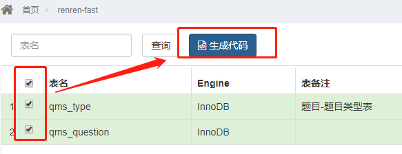

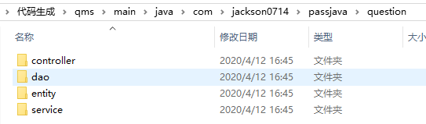

- 拷贝main文件夹到question模块src目录

- 删除前端代码passjava-question\src\main\resources\src目录

- 代码结构

  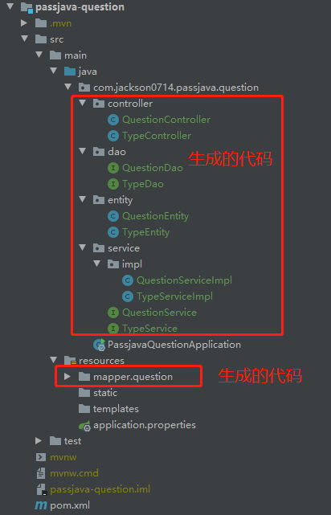

生成的代码包含controller，dao层，实体类，接口实现类，mapper映射文件

## 6.添加common 模块

因为自动生成的代码引用了一些工具类，而我们的项目中没有，所以需要加个common模块添加一些工具类

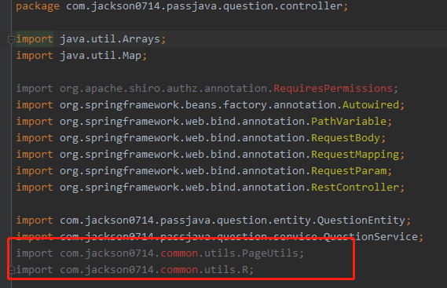

- 添加passjava-common

  New Module: 选择Maven

  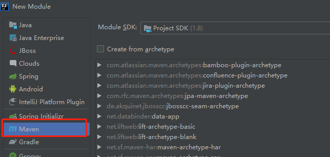

Name: passjava-common

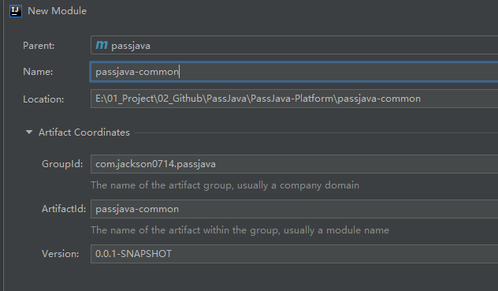

## 7.question模块添加common模块依赖

pom文件添加依赖

```xml
<dependency>
    <groupId>com.jackson0714.passjava</groupId>
    <artifactId>passjava-common</artifactId>
    <version>0.0.1-SNAPSHOT</version>
</dependency>
```

## 8.common模块添加依赖

- MyBatis-Plus

  ```xml
  <!--mybatis-plus DAO层工具 https://mp.baomidou.com/-->
  <dependency>
      <groupId>com.baomidou</groupId>
      <artifactId>mybatis-plus</artifactId>
      <version>3.2.0</version>
  </dependency>
  ```

- lombok依赖

  ```xml
  <!--lombok 不需要写getter,setter方法了-->
  <dependency>
    <groupId>org.projectlombok</groupId>
      <artifactId>lombok</artifactId>
      <version>1.18.12</version>
  </dependency>
  ```

- httpcore依赖

  ```xml
  <!--httpcore 依赖-->
  <dependency>
      <groupId>org.apache.httpcomponents</groupId>
      <artifactId>httpcore</artifactId>
      <version>4.4.12</version>
  </dependency>
  ```

- commons-lang依赖

  ```xml
  <!--commons-lang 依赖 -->
  <dependency>
      <groupId>commons-lang</groupId>
      <artifactId>commons-lang</artifactId>
      <version>2.6</version>
  </dependency>
  ```

- servlet依赖

  ```xml
  <!--  导入servlet-api 依赖  -->
  <dependency>
      <groupId>javax.servlet</groupId>
      <artifactId>servlet-api</artifactId>
      <version>2.5</version>
      <scope>provided</scope>
  </dependency>
  ```

## 9.common模块添加工具类

- 添加包com.jackson0714.common.utils

- 从renren-fast项目copy文件

  `Constans.java`、`PageUtils.java`、`Query.java`、`R.java`、`RRException.java`

- 添加包`com.jackson0714.common.xss`

- 从renren-fast项目copy文件

  `HTMLFilter.java`、`SQLFilter.java`


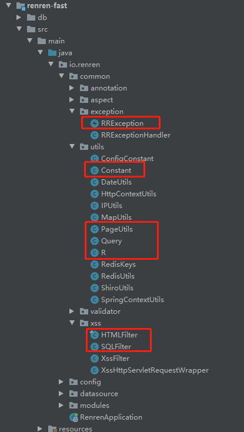

# 11生成五大微服务的CRUD代码

## 1. 修改代码生成器配置文件

（1）\renren-generator\src\main\resources\generator.properties

```properties
mainPath=com.jackson0714
package=com.jackson0714.passjava
moduleName=channel
author=jackson0714
email=jackson0585@163.com
tablePrefix=chms_
```

（2）\renren-generator\src\main\resources\application.yml

修改连接的数据库：passjava_chms

## 2.生成渠道微服务代码

启动服务，打开浏览器：http://localhost:8003/#generator.html

注意：端口地址默认是8080，我配置成了8003。

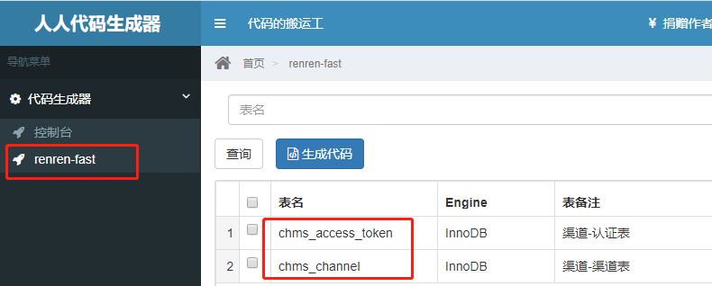

## 3.添加生成的代码

- 删除自动生成的代码中的文件夹：main\resources\src
- 拷贝main文件夹到channel模块src目录下

## 4.配置渠道微服务

- pom.xml引入common模块

  ```xml
  <dependency>
      <groupId>com.jackson0714.passjava</groupId>
      <artifactId>passjava-common</artifactId>
      <version>0.0.1-SNAPSHOT</version>
  </dependency>
  ```

- 添加application.yml

  ```yaml
  spring:
    datasource:
        driver-class-name: com.mysql.cj.jdbc.Driver
        url: jdbc:mysql://129.211.188.xxx:3306/passjava_chms?useUnicode=true&characterEncoding=UTF-8&serverTimezone=Asia/Shanghai
        username: root
        password: xxx
  
  mybatis-plus:
    mapper-locations: classpath:/mapper/**/*.xml
    global-config:
      db-config:
        id-type: auto
  ```

- 5.测试channel服务接口

  访问：http://localhost:8000/channel/channel/list

  返回：

  ```json
  {"msg":"success","code":0,"page":{"totalCount":0,"pageSize":10,"totalPage":0,"currPage":1,"list":[]}}
  ```

## 5.生成所有微服务的CRUD代码

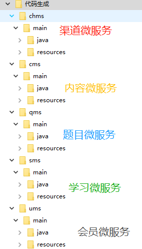

## 6.配置微服务端口

```sh
passjava-channel  端口8000
passjava-content  端口9000
passjava-member 端口10000
passjava-question 端口11000
passjava-study 端口12000
```

所有微服务都启动成功并测试接口通过

```sh
http://localhost:8000/channel/channel/list
http://localhost:9000/content/banner/list
http://localhost:10000/member/member/list
http://localhost:11000/question/question/list
http://localhost:12000/study/studytime/list
```

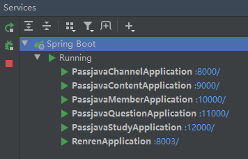

## 代码地址

https://github.com/Jackson0714/PassJava-Platform

# 12SpringCloud Alibaba 组件简介

## 1.SpringCloud Alibaba概述

> Spring Cloud Alibaba 致力于提供微服务开发的一站式解决方案。此项目包含开发分布式应用微服务的必需组件，方便开发者通过 Spring Cloud 编程模型轻松使用这些组件来开发分布式应用服务。
>
> 依托 Spring Cloud Alibaba，您只需要添加一些注解和少量配置，就可以将 Spring Cloud 应用接入阿里微服务解决方案，通过阿里中间件来迅速搭建分布式应用系统。

Github:https://github.com/alibaba/spring-cloud-alibaba

**Spring Cloud的几大痛点**

- 部分组件停止维护和更新，有问题也不易解决
- 部分环境搭建起来比较复杂，没有非常友好的可视化界面
- 配置相对来说复杂，需要较高的学习成本

**Spring Cloud Alibaba的优势**

- 阿里经历过了时间的考验
- 设计合理
- 拥有不错的可视化界面，方便运维监控和排查问题
- 环境搭建和配置简单，学习成本低

**PassJava项目搭配SpringCloud Alibaba技术的搭配方案**

| 描述         | Spring Cloud                   | Spring Cloud Alibaba | 组合选用                        |
| ------------ | ------------------------------ | -------------------- | ------------------------------- |
| 服务发现组件 | Eureka（停止维护）服务发现组件 | Nacos 注册中心       | Spring Cloud Alibaba - Nacos    |
| 配置中心组件 | Spring Cloud Config 配置中心   | Nacos 配置中心       | Spring Cloud Alibaba - Nacos    |
| 断路保护组件 | Hystrix 断路保护               | Sentinel 服务容错    | Spring Cloud Alibaba - Sentinel |
| 链路追踪组件 | Sleuth 调用链监控              | /                    | Spring Cloud - Sleuth           |
| 负载均衡组件 | Ribbon                         | /                    | Spring Cloud - Ribbon           |
| 远程调用组件 | OpenFeign （HTTP+JSON）        | Dubbo（RPC框架）     | Spring Cloud - OpenFeign        |
| 分布式事务   | /                              | Seata 分布式事务     | Spring Cloud Alibaba - Seata    |
| API 网关     | Gateway                        | /                    | Spring Cloud - Gateway          |

**最后技术选型：**

```json
Spring Cloud Alibaba - Nacos 实现注册中心
Spring Cloud Alibaba - Nacos 实现配置中心
Spring Cloud Alibaba - Sentinel  实现服务容错
Spring Cloud Alibaba - Seata 实现分布式事务

Spring Cloud - Ribbon 实现负载均衡
Spring Cloud - Feign 实现远程调用
Spring Cloud - Gateway API网关
Spring Cloud - Sleuth 实现调用链监控
```

## 2.Spring Cloud Alibaba版本

项目的版本号格式为 x.x.x 的形式，其中 x 的数值类型为数字，从 0 开始取值，且不限于 0~9 这个范围。项目处于孵化器阶段时，第一位版本号固定使用 0，即版本号为 0.x.x 的格式。

由于 Spring Boot 1 和 Spring Boot 2 在 Actuator 模块的接口和注解有很大的变更，且 spring-cloud-commons 从 1.x.x 版本升级到 2.0.0 版本也有较大的变更，因此阿里采取跟 SpringBoot 版本号一致的版本:

- 1.5.x 版本适用于 Spring Boot 1.5.x
- 2.0.x 版本适用于 Spring Boot 2.0.x
- 2.1.x 版本适用于 Spring Boot 2.1.x
- 2.2.x 版本适用于 Spring Boot 2.2.x

Spring Cloud Alibaba 版本和Spring Cloud 和Spring Boot 版本兼容性列表

| Spring Cloud 版本       | Spring Cloud Alibaba 版本 | Spring Boot 版本 |
| ----------------------- | ------------------------- | ---------------- |
| Spring Cloud Hoxton.SR3 | 2.2.x.RELEASE             | 2.2.x.RELEASE    |
| Spring Cloud Greenwich  | 2.1.x.RELEASE             | 2.1.x.RELEASE    |
| Spring Cloud Finchley   | 2.0.x.RELEASE             | 2.0.x.RELEASE    |
| Spring Cloud Edgware    | 1.5.x.RELEASE             | 1.5.x.RELEASE    |

我们采用`Spring Cloud Hoxton.SR3`, `Spring Cloud Alibaba 2.2.0.RELEASE`, `Spring Boot 2.2.6 RELEASE`

PassJava-Common的pom.xml文件引入Spring Cloud Alibaba依赖

```xml
<dependencyManagement>
    <dependencies>
        <!--  Spring Cloud Alibaba 依赖  -->
        <dependency>
            <groupId>com.alibaba.cloud</groupId>
            <artifactId>spring-cloud-alibaba-dependencies</artifactId>
            <version>2.2.0.RELEASE</version>
            <type>pom</type>
            <scope>import</scope>
        </dependency>
    </dependencies>
</dependencyManagement>
```

## 代码地址

https://github.com/Jackson0714/PassJava-Platform

# 13整合Spring Cloud Alibaba Nacos注册中心

> [Nacos](https://github.com/alibaba/Nacos) 是阿里巴巴开源的一个更易于构建云原生应用的动态服务发现、配置管理和服务管理平台。

## 1.引入Nacos 服务发现组件

passjava-common模块的pom.xml文件引入Nacos 服务发现组件

```xml
<!-- nacos discovery 服务发现组件-->
<dependency>
    <groupId>com.alibaba.cloud</groupId>
    <artifactId>spring-cloud-starter-alibaba-nacos-discovery</artifactId>
</dependency>
```

## 2.下载Nacos Server并启动

- 下载Nacos Server 压缩包

https://github.com/alibaba/nacos/releases

启动 Server，进入解压后文件夹或编译打包好的文件夹，找到如下相对文件夹 nacos/bin，并对照操作系统实际情况之下如下命令。

1. Linux/Unix/Mac 操作系统，执行命令 `sh startup.sh -m standalone`
2. Windows 操作系统，执行命令 `cmd startup.cmd`

windows执行startupm.cmd遇到问题：

```
λ startup.cmd                                                      
 Please set the JAVA_HOME variable in your environment, We need java(x64)! jdk8 or later is better! 
```

解决方案：

修改startup.cmd文件中的%JAVA_HOME%

```sh
%JAVA_HOME% 替换为 C:\Program Files\Java\jdk1.8.0_131
```

启动成功：

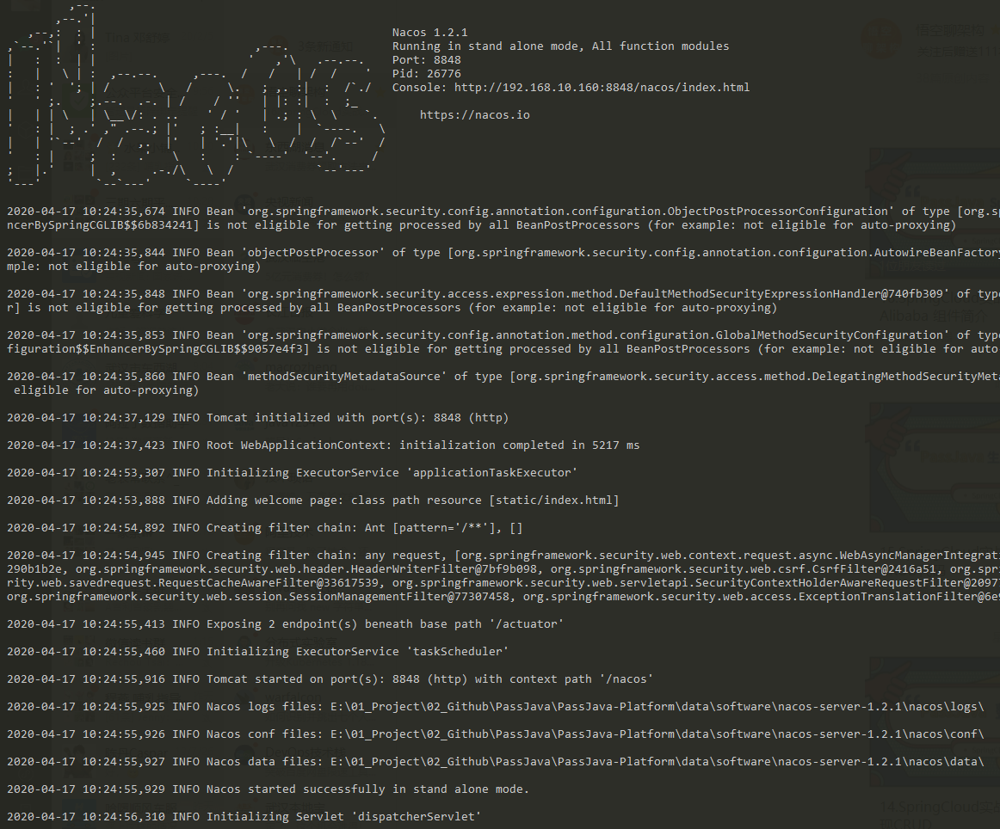

## 3.每个微服务都配置Nacos Server 地址

- 配置Nacos Server 地址

在passjava-question、passjava-channel、passjava-content、passjava-member、passjava-study 应用的 /src/main/resources/application.yml配置文件中配置 Nacos Server 地址

```yaml
spring:
   cloud:
    nacos:
      discovery:
        server-addr: 127.0.0.1:8848
```

## 4.添加注解

为每个服务使用 @EnableDiscoveryClient 注解开启服务注册与发现功能

```java
@EnableDiscoveryClient
@MapperScan("com.jackson0714.passjava.question.dao")
@SpringBootApplication
public class PassjavaQuestionApplication {

    public static void main(String[] args) {
        SpringApplication.run(PassjavaQuestionApplication.class, args);
    }

}
```

## 5.配置微服务的名称

```yaml
spring:
  application:
    name: passjava-question
```

## 6.访问nacos server后台

- 登录后台

http://localhost:8848/nacos/index.html#/login

用户名：nacos

密码：nacos

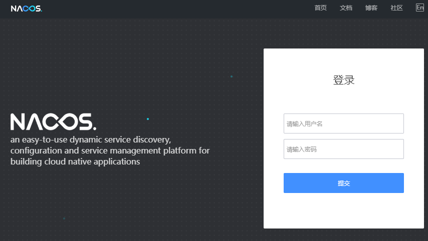

- 查看已注册的服务

  ```json
  passjava-channel 渠道微服务
  passjava-member 用户微服务
  passjava-study 学习微服务
  passjava-question 问题微服务
  passjava-content 内容微服务
  ```

  

## 代码地址

https://github.com/Jackson0714/PassJava-Platform

# 14SpringCloud整合Alibaba-Nacos配置中心

## 1.传统配置方式

- application.properties文件中定义两个配置：

```properties
member.nickname = "悟空聊架构"
member.age = "18"
```

- 示例控制器中定义私有变量nickname和age，@value代表从配置中取值

```java
@Value("${member.nickname}")
private  String nickname;

@Value("$member.age")
private  Integer age;
```

- 示例控制器中定义方法：获取nick和age的值

```java
@RequestMapping("/test-local-config")
public R testLocalConfig() {
    return R.ok().put("nickname", nickname).put("age", age);
}
```

- 测试结果

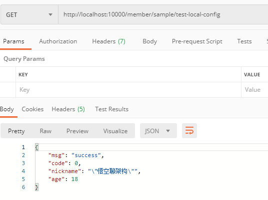

总结：从配置文件中获取配置。

这种方式的缺点是什么呢？如果要修改配置参数，则需要重新启动服务。如果服务很多，则需要重启所有服务，非常不方便。

有没有什么办法不停服务修改配置而且使其生效呢？

答案：有的，用Spring Cloud Alibaba的Nacos 组件就可以完成。

## 2.引入Nacos依赖

PassJava-Common项目的pom.xml文件引入Spring Cloud Alibaba Nacos Config依赖

```xml
<dependency>
    <groupId>com.alibaba.cloud</groupId>
    <artifactId>spring-cloud-starter-alibaba-nacos-config</artifactId>
</dependency>
```

## 3.配置Nacos元数据

- passjava-member 添加 /src/main/resources/bootstrap.properties 配置文件（注意：bootstrap.properties 优先级高于其他配置文件）
- 配置 Nacos Config 元数据

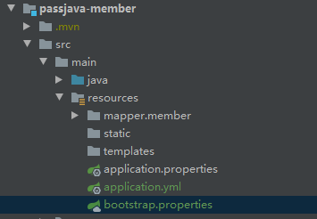

```properties
spring.application.name=passjava-member
spring.cloud.nacos.config.server-addr=127.0.0.1:8848
```

## 4.Nacos后台新增配置

**Data ID:** passjava-member.properties

**Group:** DEFAULT_GROUP

**配置格式:**

```properties
member.nick="悟空"
member.age=10
```

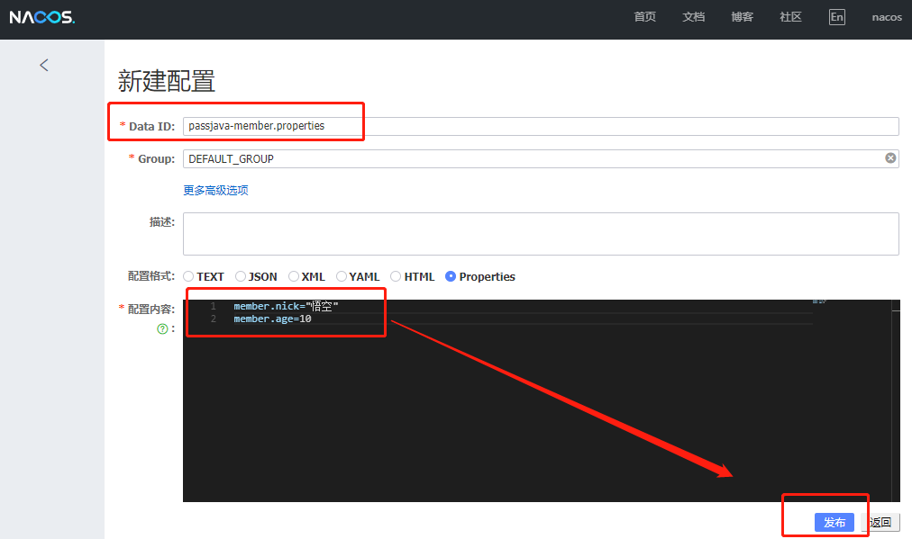

## 5.开启动态刷新配置功能

添加注解@RefreshScope开启动态刷新配置功能

```java
@RefreshScope
@RestController
@RequestMapping("member/sample")
public class SampleController {}
```

可以从控制台看到日志信息：

```properties
Refresh keys changed: [member.age]
2020-04-19 23:34:07.154  INFO 8796 --- [-127.0.0.1_8848] c.a.nacos.client.config.impl.CacheData   : [fixed-127.0.0.1_8848] [notify-ok] dataId=passjava-member.properties, group=DEFAULT_GROUP, md5=df136e146c83cbf857567e75acb11e2b, listener=com.alibaba.cloud.nacos.refresh.NacosContextRefresher$1@4f49b78b 
2020-04-19 23:34:07.154  INFO 8796 --- [-127.0.0.1_8848] c.a.nacos.client.config.impl.CacheData   : [fixed-127.0.0.1_8848] [notify-listener] time cost=529ms in ClientWorker, dataId=passjava-member.properties, group=DEFAULT_GROUP, md5=df136e146c83cbf857567e75acb11e2b, listener=com.alibaba.cloud.nacos.refresh.NacosContextRefresher$1@4f49b78b 
member.age` 更新了，通知了member服务，刷新了配置。对应的配置id为`passjava-member.properties`，分组为`DEFAULT_GROUP`。监听器为`com.alibaba.cloud.nacos.refresh.NacosContextRefresher
```

## 6.测试结果

访问：http://localhost:10000/member/sample/test-local-config

结果：nickname和age和Nacos后台配置一致

结论：只用在Nacos后台改配置即可实时修改配置。

注意：Nacos的配置项优先级高于application.propertite里面的配置。

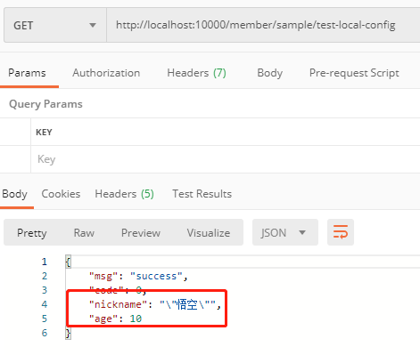

## 7.命名空间

我们现在有5个微服务，每个微服务用到的配置可能都不一样，那不同微服务怎么样获取自己微服务的配置呢？

这里可以用到命名空间，我们针对每个微服务，都创建一个命名空间。

- 创建命名空间

  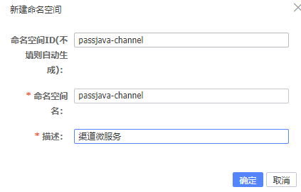

```json
# 创建5个命名空间
passjava-channel
passjava-content
passjava-member
passjava-question
passjava-study
```

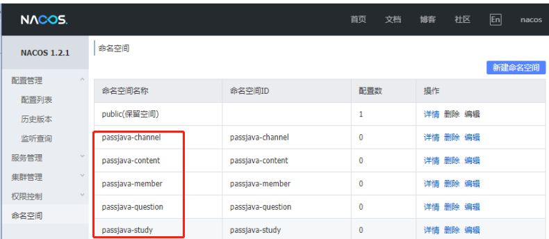

- 命名空间下创建配置

  我们打开配置列表菜单，可以看到有五个命名空间。

  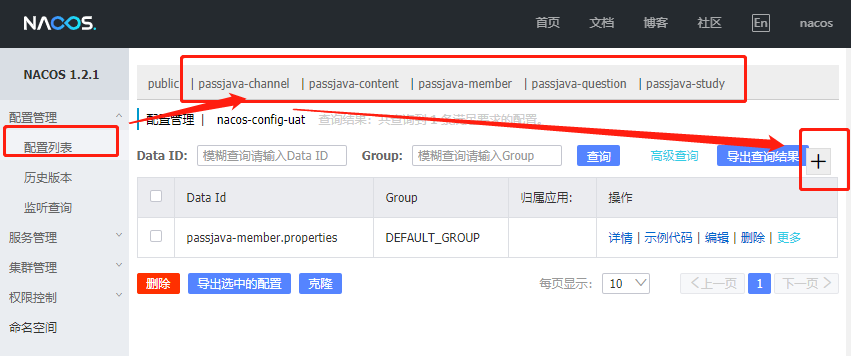

选中passjava-channel命名空间，然后新增配置项，与之前新增配置的步骤一致，也可以通过克隆命名空间来克隆配置。

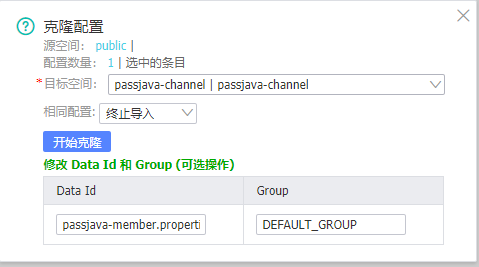

- 修改指定的命名空间

  bootstrap.properties配置命名空间

  ```properties
  spring.cloud.nacos.config.namespace=passjava-member
  ```

- 测试配置是否生效

  修改passjava-member.properties的配置内容

  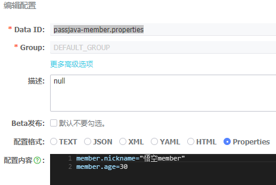

  重启member服务

  访问方法：/member/sample/test-local-config

  执行结果：

  ```json
  {
      "msg": "success",
      "code": 0,
      "nickname": "\"悟空member\"",
      "age": 30
  }
  ```

  说明获取的是passjava-member命名空间的配置

## 8.分组

如果我们有多套环境，比如开发环境，测试环境，生产环境，每一套环境的配置参数不一样，那配置中心该如何配置呢？

我们可以使用配置中心的`分组`功能。每一套环境都是一套分组。

- 首先创建一套dev环境配置项，然后克隆配置到test和prod环境


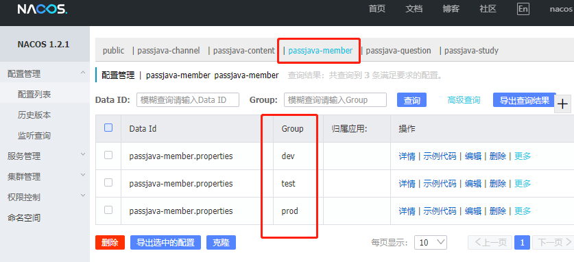

- bootstrap.properties配置当前使用的分组：prod

```
spring.cloud.nacos.config.group=prod
```

- 测试获取生产环境配置

  ```json
  {
      "msg": "success",
      "code": 0,
      "nickname": "\"悟空-prod\"",
      "age": 10
  }
  ```

  可以看到获取到的是prod分组的配置

## 9.多配置集

我们可以将application.yml文件中的datasource、mybatis-plus等配置进行拆解，放到配置中心。group可以创建3套，dev/test/prod。

1.配置中心新建`datasource.yml` 配置

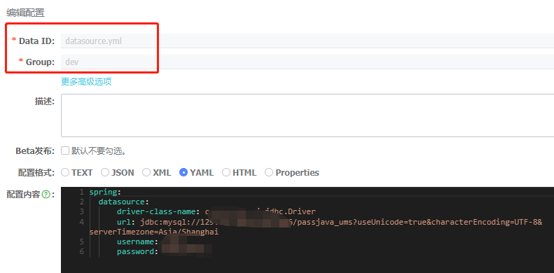

2.配置中心新建`mybatis.yml` 配置

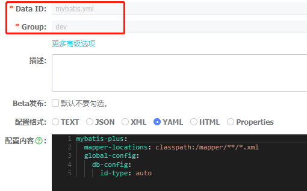

3.配置中心新建`more.yml` 配置

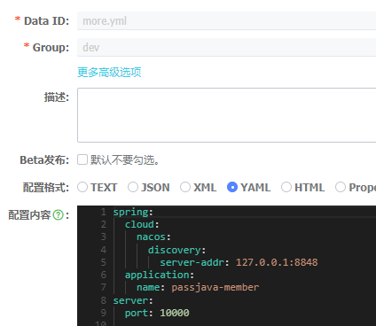

4.克隆dev环境配置到test和prod环境

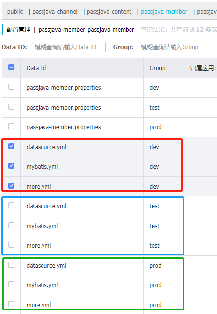

5.bootstrap.properties增加nacos配置，application.yml注释配置

```properties
spring.application.name=passjava-member
spring.cloud.nacos.config.server-addr=127.0.0.1:8848

spring.cloud.nacos.config.namespace=passjava-member
spring.cloud.nacos.config.group=prod

spring.cloud.nacos.config.extension-configs[0].data-id=datasource.yml
spring.cloud.nacos.config.extension-configs[0].group=dev
spring.cloud.nacos.config.extension-configs[0].refresh=true

spring.cloud.nacos.config.extension-configs[1].data-id=mybatis.yml
spring.cloud.nacos.config.extension-configs[1].group=dev
spring.cloud.nacos.config.extension-configs[1].refresh=true

spring.cloud.nacos.config.extension-configs[2].data-id=more.yml
spring.cloud.nacos.config.extension-configs[2].group=dev
spring.cloud.nacos.config.extension-configs[2].refresh=true
```

6.测试配置是否生效

- 测试passjava-member.properties和more.yml配置是否生效

请求url:http://localhost:10000/member/sample/test-local-config

返回配置的nick和age，且端口是10000，且member服务注册到注册中心

```json
{
    "msg": "success",
    "code": 0,
    "nickname": "\"悟空-prod1\"",
    "age": 22
}
```

- 测试datasource.yml和mybatis.yml配置是否生效

请求url:http://localhost:10000/member/member/list

返回数据库查询结果

```json
{
    "msg": "success",
    "code": 0,
    "page": {
        "totalCount": 0,
        "pageSize": 10,
        "totalPage": 0,
        "currPage": 1,
        "list": []j
    }
}
```

说明以上配置都生效了。

#### 更多配置项

| 配置项                   | key                                       | 默认值        | 说明                                                         |
| ------------------------ | ----------------------------------------- | ------------- | ------------------------------------------------------------ |
| 服务端地址               | spring.cloud.nacos.config.server-addr     |               |                                                              |
| DataId前缀               | spring.cloud.nacos.config.prefix          |               | spring.application.name                                      |
| Group                    | spring.cloud.nacos.config.group           | DEFAULT_GROUP |                                                              |
| dataID后缀及内容文件格式 | spring.cloud.nacos.config.file-extension  | properties    | dataId的后缀，同时也是配置内容的文件格式，目前只支持 properties |
| 配置内容的编码方式       | spring.cloud.nacos.config.encode          | UTF-8         | 配置的编码                                                   |
| 获取配置的超时时间       | spring.cloud.nacos.config.timeout         | 3000          | 单位为 ms                                                    |
| 配置的命名空间           | spring.cloud.nacos.config.namespace       |               | 常用场景之一是不同环境的配置的区分隔离，例如开发测试环境和生产环境的资源隔离等。 |
| AccessKey                | spring.cloud.nacos.config.access-key      |               |                                                              |
| SecretKey                | spring.cloud.nacos.config.secret-key      |               |                                                              |
| 相对路径                 | spring.cloud.nacos.config.context-path    |               | 服务端 API 的相对路径                                        |
| 接入点                   | spring.cloud.nacos.config.endpoint        | UTF-8         | 地域的某个服务的入口域名，通过此域名可以动态地拿到服务端地址 |
| 是否开启监听和自动刷新   | spring.cloud.nacos.config.refresh-enabled | true          |                                                              |

## 10.使用Nacos总结

- 1.引入Nacos依赖
- 2.配置Nacos数据源
- 3.配置中心配置数据集`DataId`和配置内容
- 4.开启动态刷新配置`@RefreshScope`
- 5.获取配置项的值`@value`
- 6.优先使用配置中心的配置
- 7.使用命名空间`namespace`来创建各服务的配置
- 8.使用分组`group`来区分不同环境
- 9.使用多配置集`extension-configs`区分不同类型的配置

## 代码地址

https://github.com/Jackson0714/PassJava-Platform

# 15Spring Cloud 整合 OpenFeign实现声明式远程调用

## 1.Feign 概述

- Feign声明式客的HTTP客户端，让远程调用更简单。
- 提供了HTTP请求的模板，编写简单的接口和插入注解，就可以定义好HTTP请求的参数、格式、地址等信息
- 整合了Ribbon（负载均衡组件）和Hystix（服务熔断组件），不需要显示使用这两个组件
- Spring Cloud Feign 在Netflix Feign的基础上扩展了对SpringMVC注解的支持

## 2. 远程调用示例

> 示例：查询用户的学习时长

用户微服务passjava-member调用学习微服务passjava-study的方法

### 1.引入openfeign依赖

passjava-member和passjava-study项目的pom文件引入openfeign依赖

```xml
<dependency>
    <groupId>org.springframework.cloud</groupId>
    <artifactId>spring-cloud-starter-openfeign</artifactId>
</dependency>
```

### 2.StudyTimeController定义远程调用测试方法

返回某个用户学习题目的总时长

```java
@RequestMapping("/member/list/test")
public R memberStudyTimeTest() {
    StudyTimeEntity studyTimeEntity = new StudyTimeEntity();
    studyTimeEntity.setTotalTime(100); // 学习时长：100分钟
    studyTimeEntity.setQuesTypeId(1L); // 题目类型：1 （javaBasic）

    return R.ok().put("studyTime", Arrays.asList(studyTimeEntity));
}
```

### 3.member目录下创建feign service

- 创建package: com.jackson0714.passjava.member.feign

- 创建StudyTimeFeignService接口

- 添加注解`@FeignClient`。显示声明这个接口用来远程调用`study`服务。

  ```java
  @FeignClient("passjava-study")
  public interface StudyTimeFeignService {}
  ```

- 添加远程调用方法

  ```java
  public R memberStudyTime();
  ```

- 给方法添加要远程调用的方法的路径`study/studytime/member/list/test`

  ```java
  @RequestMapping("study/studytime/member/list/test")
  public R getMemberStudyTimeListTest();
  ```

- 添加注解`@EnableFeignClients`开启远程调用服务。

  给类PassjavaStudyApplication.java添加注解`@EnableFeignClients`。

  basePackages代表自动扫码指定路径下所有带有@FeignClient注解的接口。

  ```java
  @EnableFeignClients(basePackages = "com.jackson0714.passjava.member.feign")
  @EnableDiscoveryClient
  @MapperScan("com.jackson0714.passjava.member.dao")
  @SpringBootApplication
  public class PassjavaMemberApplication {
  
      public static void main(String[] args) {
          SpringApplication.run(PassjavaMemberApplication.class, args);
      }
  
  }
  ```

- 测试接口

  - 启动passjava-member和passjava-study服务

  - 用postman工具或浏览器输入请求地址

    http://localhost:10000/member/member/studytime/list/test

  - 返回结果如下图

  studytime和member都有数据，学习时长：100分钟，昵称：悟空聊架构

  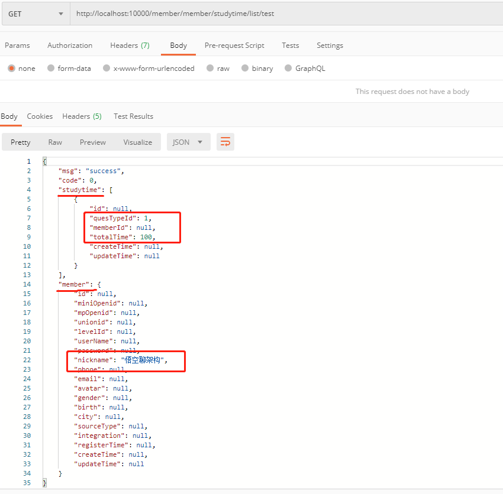

### 4.测试OpenFeign传参

示例：用户id作为参数在服务间传递

MemberController

```java
@RequestMapping("/studytime/list/test/{id}")
public R getMemberStudyTimeListTest(@PathVariable("id") Long id) {
    //mock数据库查到的会员信息
    MemberEntity memberEntity = new MemberEntity();
    memberEntity.setId(id); // 学习时长：100分钟
    memberEntity.setNickname("悟空聊架构");

    //远程调用拿到该用户的学习时长（学习时长是mock数据）
    R memberStudyTimeList = studyTimeFeignService.getMemberStudyTimeListTest(id);
    return R.ok().put("member", memberEntity).put("studytime", memberStudyTimeList.get("studytime"));
}
```

StudyTimeFeignService

```java
@FeignClient("passjava-study")
public interface StudyTimeFeignService {
    @RequestMapping("study/studytime/member/list/test/{id}")
    public R getMemberStudyTimeListTest(@PathVariable("id") Long id);
}
```

StudyTimeController

```java
@RequestMapping("/member/list/test/{id}")
public R memberStudyTimeTest(@PathVariable("id") Long id) {
    StudyTimeEntity studyTimeEntity = new StudyTimeEntity();
    studyTimeEntity.setTotalTime(100); // 学习时长：100分钟
    studyTimeEntity.setQuesTypeId(1L); // 题目类型：1 （javaBasic）

    return R.ok().put("studytime", Arrays.asList(studyTimeEntity));
}
```

## 3.总结FeignClient使用方法

- 引入OpenFeign依赖
- 定义FeignClient接口类（注解`@FeignClient`），声明这个接口类是用来远程调用其他服务的
- 接口类中定义要远程调用的接口方法，指定远程服务方法的路径
- Controller类中调用接口方法
- 开启远程调用（注解`@EnableFeignClients`）

## 代码地址

https://github.com/Jackson0714/PassJava-Platform

# 16Spring Cloud 整合Gateway网关

## 1.Gateway网关介绍

- 网关:流量的入口
- 网关常用功能:路由转发,权限校验,限流控制
- Spring Cloud Gateway是Spring Cloud官方推出的第二代网关框架
- Spring Cloud Gateway取代了netflix的Zuul网关

## 2.Gateway原理

PassJava项目中,小程序和管理后台请求先访问到API网关.

API网关通过注册中心实时感知微服务的状态的路由地址,准确地将请求路由到各个服务.

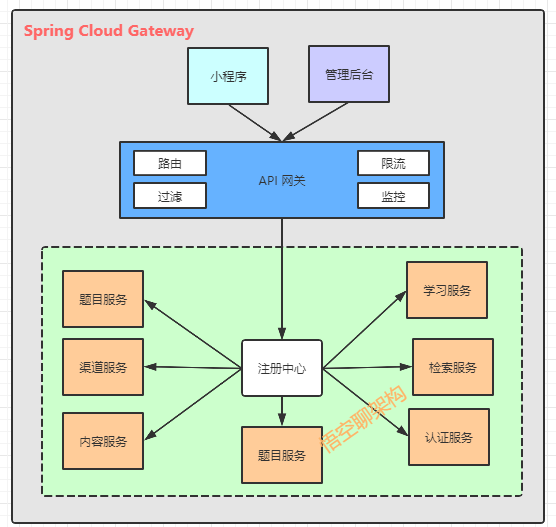

官方文档:https://cloud.spring.io/spring-cloud-static/spring-cloud-gateway/2.2.2.RELEASE/reference/html/

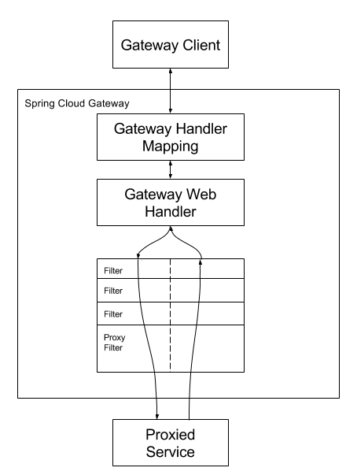

- 请求到达网关后,先经过断言Predicate,是否符合某个路由规则
- 如果符合,则按路由规则路由到指定地址
- 请求和响应都可以通过过滤器Filter进行过滤

## 3.创建Gateway 模块

- 适用Spring 初始化器创建Gateway module

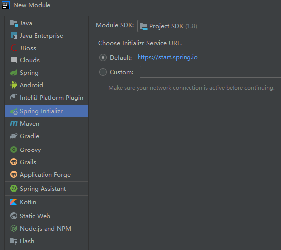

- 创建module

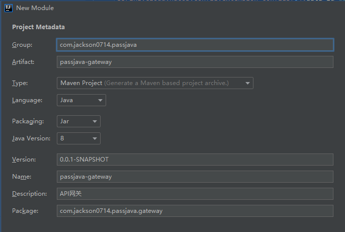

- 选择Gateway依赖

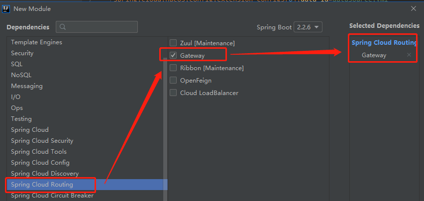

- 引入Gateway模块

```
<module>passjava-gateway</module>
```

## 4.配置Gateway

- 引入Nacos组件

因common模块引入了nacos注册中心组件,所以我们可以直接引用common模块

```xml
<dependency>
	<groupId>com.jackson0714.passjava</groupId>
	<artifactId>passjava-common</artifactId>
	<version>0.0.1-SNAPSHOT</version>
</dependency>
```

- 应用类上添加注解`@EnableDiscoveryClient`

```java
@RefreshScope
@EnableDiscoveryClient
@SpringBootApplication(exclude = {DataSourceAutoConfiguration.class})
public class PassjavaGatewayApplication {
	public static void main(String[] args) {
		SpringApplication.run(PassjavaGatewayApplication.class, args);
	}
}
```

## 5.使用Gateway demo

- 新建application.yml文件

  ```yml
  spring:
    cloud:
      gateway:
        routes:
          - id: route_qq
            uri: http://www.qq.com
            predicates:
              - Query=url,qq
          - id: route_baidu
            uri: http://www.baidu.com
            predicates:
              - Query=url,baidu
  ```

  第一条路由规则:当请求路径中包含url=qq,则跳转到http://www.qq.com

  第二条路由规则:当请求路径中包含url=baidu,则跳转到http://www.baidu.com

后续在PassJava项目中使用Gateway的强大功能.

## 代码地址

https://github.com/Jackson0714/PassJava-Platform

# 17管理后台-题目类型功能

## 1.环境准备

- 代码准备

  将renren-fast-vue代码copy到自己的前端项目中

- 安装node_module

```sh
cnpm install
```

- 启动前端portal

```sh
npm run dev
```

- 登陆后台

  1.启动RenrenAplication

  2.输入用户名和密码登陆

  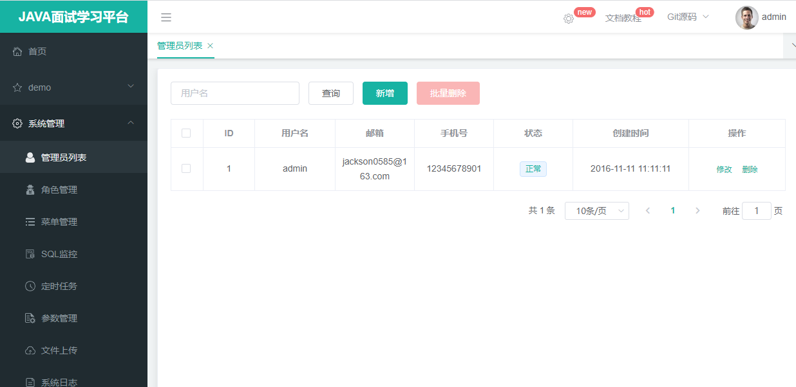

## 2. 添加目录和菜单

- 添加`题目中心`目录(一级菜单)

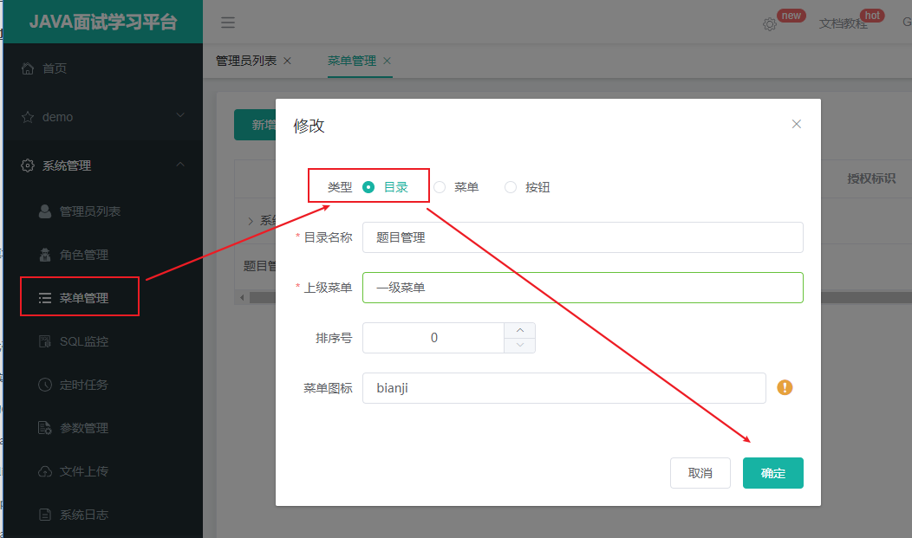

刷新页面,就可以看到题目中心菜单

- 添加题目`类型维护`菜单(二级菜单)

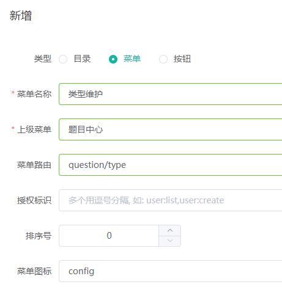

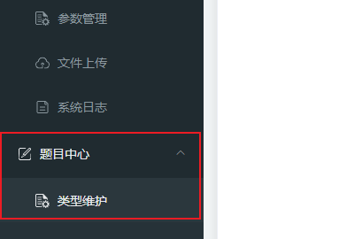

可以看到数据库新增了两条记录,分别对应两个菜单

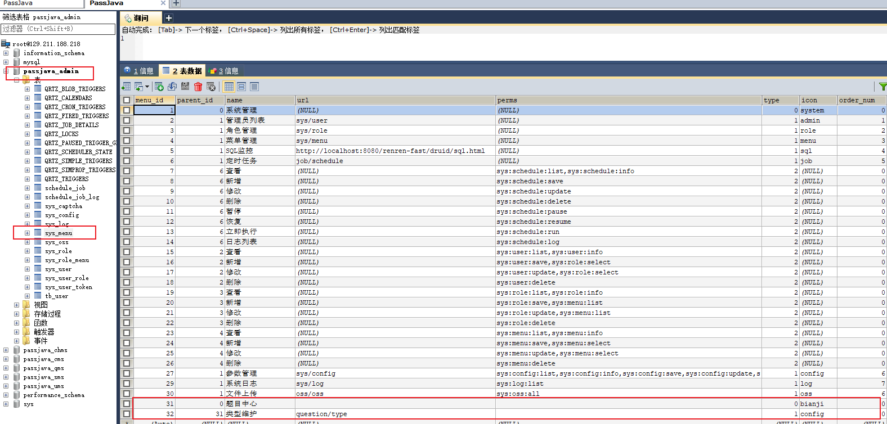

点击类型维护菜单,打开了链接:http://localhost:8002/#/question-type,页面显示空白页面.

## 3.自动生成前端页面

用renren-generator自动生成前端代码,可以参考这篇:[13.SpringCloud实战项目-自动生成前后端代码](http://www.jayh.club/#/02.PassJava架构篇/04.自动生成前后端代码)

拷贝question目录到前端目录 \src\views\modules

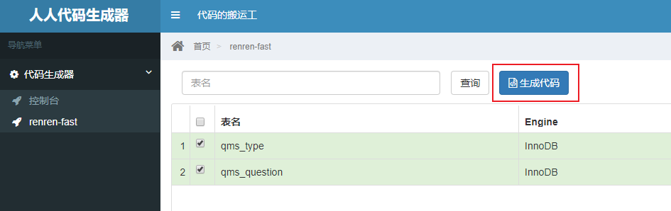

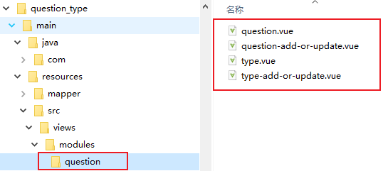

## 4. 测试类型维护功能

点击类型维护菜单,可以看到请求报404

http://localhost:8080/renren-fast/question/type/list?t=1587825969456&page=1&limit=10&key=

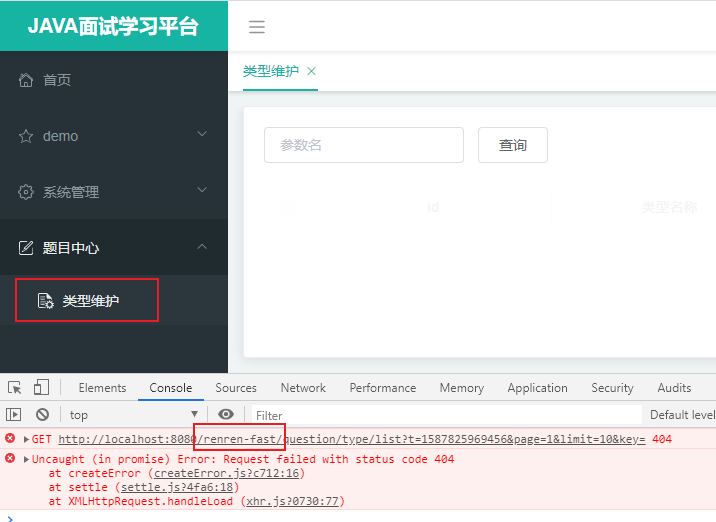

> 因为页面的请求都访问到renren-fast服务了,所以要修改为访问题目微服务。但是前端有很多请求访问的是不同的服务，所以我们可以通过网关来作为请求的入口，然后将不同的请求路由到不同的服务。

SpringCloud整合网关可以看之前写的一篇文章：[20.SpringCloud整合Gateway网关](http://www.jayh.club/#/02.PassJava架构篇/11.SpringCloud整合Gateway网关)

## 6.配置请求到网关

文件：\static\config\index.js

api接口请求地址替换为gateway的地址

```javascript
window.SITE_CONFIG['baseUrl'] = 'http://localhost:8080/renren-fast';
替换为
window.SITE_CONFIG['baseUrl'] = 'http://localhost:8060'; // 网关地址
```

刷新页面，发现会回到登录页面，而且验证码获取不到，F12调试工具可以看到验证码请求发送到网关上，而网关上找不到这个请求地址(http://localhost:8060/captcha.jpg)，所以报404。其实验证码请求应该访问renren-fast服务，所以我们要将验证码请求通过网关转发到renren-fast服务(http://localhost:8080/renren-fast/captcha.jpg)。

```json
# 验证码请求：
GET http://localhost:8060/captcha.jpg?uuid=1ce21f53-1866-40b1-8b20-2f4515d59f0d 404 (Not Found)
```

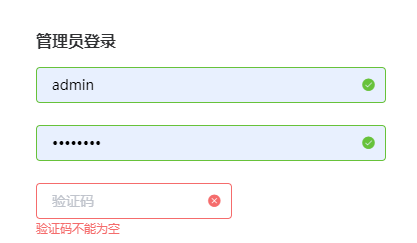

> 可以将renren-fast注册到注册中心，然后通过网关将请求转发到renren-fast服务。

## 6.注册renren-fast服务

- renren-fast项目添加common依赖

```xml
<dependency>
    <groupId>com.jackson0714.passjava</groupId>
    <artifactId>passjava-common</artifactId>
    <version>0.0.1-SNAPSHOT</version>
</dependency>
```

- 配置注册中心地址

```yaml
cloud:
  nacos:
    discovery:
      server-addr: 127.0.0.1:8848
```

- 配置应用程序的名称

```yaml
application:
  name: renren-fast
```

- 应用类添加`@EnableDiscoveryClient`注解
- 查看服务是否注册成功

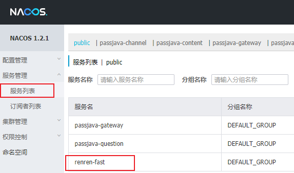

## 7. 添加网关路由规则

- 配置路由规则

passjava-gateway项目中application.yml文件配置路由规则，并重启passjava-gateway服务

```yaml
spring:
  cloud:
    gateway:
      routes:
        - id: route_portal # 路由规则id
          uri: lb://renren-fast # 负载均衡，renren-fast服务
          predicates: # 断言
            - Path=/api/** # 如果前端请求路径包含 api，则应用这条路由规则
          filters: #过滤器
            - RewritePath=/api/(?<segment>.*),/renren-fast/$\{segment} # 将访问路径中包含的api替换成renren-fast，但是替换的url不会在前端显示，还是网关的访问路径。这里不是跳转到新的路径，而是转发请求。
```

- 修改前端请求路径

文件：\static\config\index.js

请求路径添加`api`

```javascript
 window.SITE_CONFIG['baseUrl'] = 'http://localhost:8086';
 替换为
 window.SITE_CONFIG['baseUrl'] = 'http://localhost:8060/api'; // 添加api
```

- 刷新登录页面，可以正常获取验证码，请求路径为网关地址 + /api/captcha

```javascript
http://localhost:8060/api/captcha.jpg?uuid=84d36089-07ae-4201-85c0-8217b032f21b
```

> 前端将请求发送到网关http://localhost:8060/api/captcha.jpg，网关将请求转发到http://localhost:8060/api/renren-fast/captcha.jpg。

- 登录，报跨域问题

  ```javascript
  Access to XMLHttpRequest at 'http://localhost:8060/api/sys/login' from origin 'http://localhost:8002' has been blocked by CORS policy: Response to preflight request doesn't pass access control check: No 'Access-Control-Allow-Origin' header is present on the requested resource.
  ```

> 登录页面url：[http://localhost:8002](http://localhost:8002/)，点击登录访问的请求url：http://localhost:8060/api/sys/login，两个url的端口号不一样，产生了跨域问题。

## 8.跨域问题

- 跨域资源共享([CORS](https://developer.mozilla.org/zh-CN/docs/Glossary/CORS)) 是一种机制，它使用额外的 [HTTP](https://developer.mozilla.org/zh-CN/docs/Glossary/HTTP) 头来告诉浏览器 让运行在一个 origin (domain) 上的Web应用被准许访问来自不同源服务器上的指定的资源。当一个资源从与该资源本身所在的服务器**不同的域、协议或端口**请求一个资源时，资源会发起一个**跨域 HTTP 请求**。

- 比如，站点 [http://domain-a.com](http://domain-a.com/) 的某 HTML 页面通过 [的 src ](https://developer.mozilla.org/zh-CN/docs/Web/HTML/Element/Img#Attributes)请求 http://domain-b.com/image.jpg。网络上的许多页面都会加载来自不同域的CSS样式表，图像和脚本等资源。

- 出于安全原因，浏览器限制从脚本内发起的跨源HTTP请求。 例如，XMLHttpRequest和Fetch API遵循同源策略。 这意味着使用这些API的Web应用程序只能从加载应用程序的同一个域请求HTTP资源，除非响应报文包含了正确CORS响应头。

  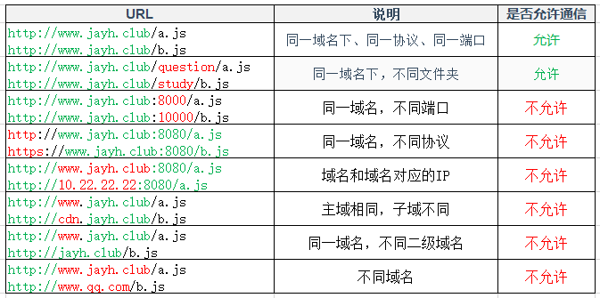

## 9.解决跨域问题

- 添加响应头，配置当次请求允许跨域

  - **Access-Control-Allow-Origin**：支持哪些来源的请求跨域
  - **Access-Control-Allow-Methods**：支持哪些方法跨域
  - **Access-Control-Allow-Credentials**：跨域请求默认不包含cookie，设置为true可以包含cookie
  - **Access-Control-Expose-Headers**：跨域请求暴露的字段CORS请求时，XMLHttpRequest对象的getResponseHeader()方法只能拿到6个基本字段：Cache-Control、Content-Language、Content-Type、Expires、Last-Modified、Pragma。如果想拿到其他字段，就必须在Access-Control-Expose-Headers里面指定。
  - **Access-Control-Max-Age**：表明该响应的有效时间为多少秒。在有效时间内，浏览器无
    须为同一请求再次发起预检请求。请注意，浏览器自身维护了一个最大有效时间，如果
    该首部字段的值超过了最大有效时间，将不会生效。

- 添加跨域配置

  passjava-gateway应用中添加配置类PassJavaCorsConfiguration.java

```java
package com.jackson0714.passjava.gateway.config;

import org.springframework.context.annotation.Bean;
import org.springframework.context.annotation.Configuration;
import org.springframework.web.cors.CorsConfiguration;
import org.springframework.web.cors.reactive.CorsWebFilter;
import org.springframework.web.cors.reactive.UrlBasedCorsConfigurationSource;

@Configuration
public class PassJavaCorsConfiguration {

    @Bean
    public CorsWebFilter corsWebFilter() {
        UrlBasedCorsConfigurationSource source = new UrlBasedCorsConfigurationSource();

        CorsConfiguration corsConfiguration = new CorsConfiguration();

        // 配置跨域
        corsConfiguration.addAllowedHeader("*"); // 允许所有请求头跨域
        corsConfiguration.addAllowedMethod("*"); // 允许所有请求方法跨域
        corsConfiguration.addAllowedOrigin("*"); // 允许所有请求来源跨域
        corsConfiguration.setAllowCredentials(true); //允许携带cookie跨域，否则跨域请求会丢失cookie信息

        source.registerCorsConfiguration("/**", corsConfiguration);

        return new CorsWebFilter(source);
    }
}
```

- 注释renren-fast里面的跨域配置

  文件路径：src/main/java/io/renren/config/CorsConfig.java

- 登录成功

  可以看到login请求的响应报文中包含了已配置的CORS响应头


## 10.配置题目服务的路由规则

我们访问题目中心的类型页面，发现还是报404找不到资源

所以我们需要配置题目服务的路由规则，将题目中心的页面请求经网关转发到题目服务。

```yaml
spring:
  cloud:
    gateway:
      routes:
        - id: route_question # 题目微服务路由规则
          uri: lb://passjava-question # 负载均衡，将请求转发到注册中心注册的renren-fast服务
          predicates: # 断言
            - Path=/api/question/** # 如果前端请求路径包含 api/question，则应用这条路由规则
          filters: #过滤器
            - RewritePath=/api/(?<segment>.*),/$\{segment} # 将跳转路径中包含的api替换成question
```

> 注意：若predicates的Path更精确，则将路由规则放到更上面，优先命中更上面的路由规则。

## 11.测试类型维护功能

- 数据库插入3条测试数据

- 测试查询列表，可以看到有三条记录查询出来了

  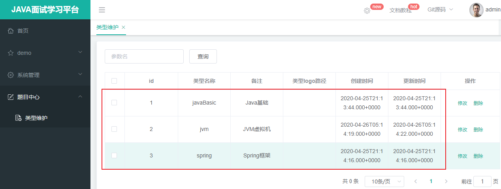

- 测试修改一条数据，可以看到数据库里面记录更新为23了

  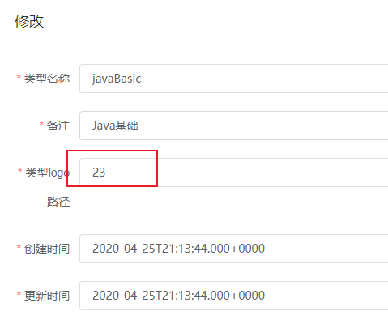

- 测试删除一条数据，可以看到界面和数据库都删除了一条数据

  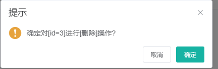

## 下节预告

- 逻辑删除
- 新增类型
- 新增题目

## 代码地址

https://github.com/Jackson0714/PassJava-Platform

# 18整合OSS对象存储

## 一、缘起

> 文件上传在系统中用的很频繁，所以我们需要将上传的文件进行存储，传统的将文件上传到本机已不适用分布式系统。自己搭建文件服务器有复杂性和维护成本。所以我们可以采用市面上成熟的文件存储服务，如阿里云的OSS对象存储服务。

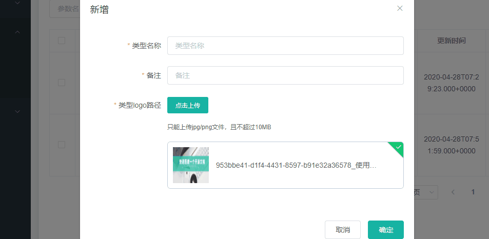

每个 OSS 的用户都会用到上传服务。Web 端常见的上传方法是用户在浏览器或 APP 端上传文件到应用服务器，应用服务器再把文件上传到 OSS。具体流程如下图所示。
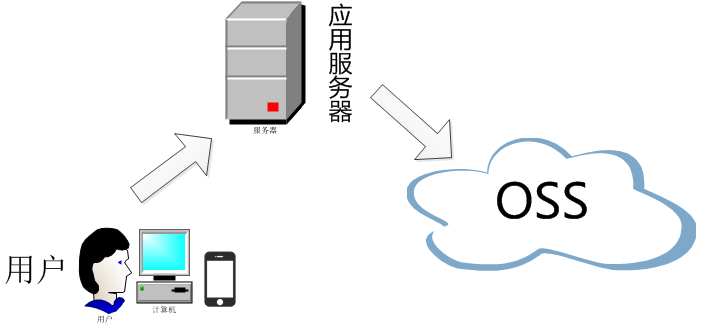

和数据直传到 OSS 相比，以上方法有三个缺点：

- 上传慢：用户数据需先上传到应用服务器，之后再上传到OSS。网络传输时间比直传到OSS多一倍。如果用户数据不通过应用服务器中转，而是直传到OSS，速度将大大提升。而且OSS采用BGP带宽，能保证各地各运营商之间的传输速度。
- 扩展性差：如果后续用户多了，应用服务器会成为瓶颈。
- 费用高：需要准备多台应用服务器。由于OSS上传流量是免费的，如果数据直传到OSS，不通过应用服务器，那么将能省下几台应用服务器。

[回到顶部](https://www.cnblogs.com/jackson0714/p/12798068.html#_labelTop)

## 二、技术方案

### 服务端签名后直传

### 背景

采用JavaScript客户端直接签名时，AccessKeyID和AcessKeySecret会暴露在前端页面，因此存在严重的安全隐患。因此，OSS提供了服务端签名后直传的方案。

### 原理介绍

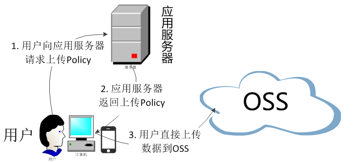

服务端签名后直传的原理如下：

1. 用户发送上传Policy请求到应用服务器。
2. 应用服务器返回上传Policy和签名给用户。
3. 用户直接上传数据到OSS。

[回到顶部](https://www.cnblogs.com/jackson0714/p/12798068.html#_labelTop)

## 三、实现案例

### 1.开通阿里云OSS

- 登录阿里云官网

  https://www.aliyun.com/sale-season/2020/procurement-new-members?userCode=thp9caen

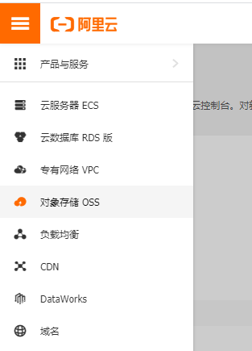

- 创建Bucket 存储桶

  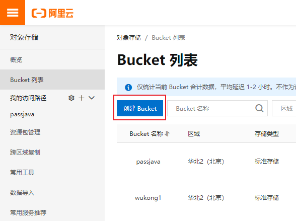

- 获取accesskey id和secret

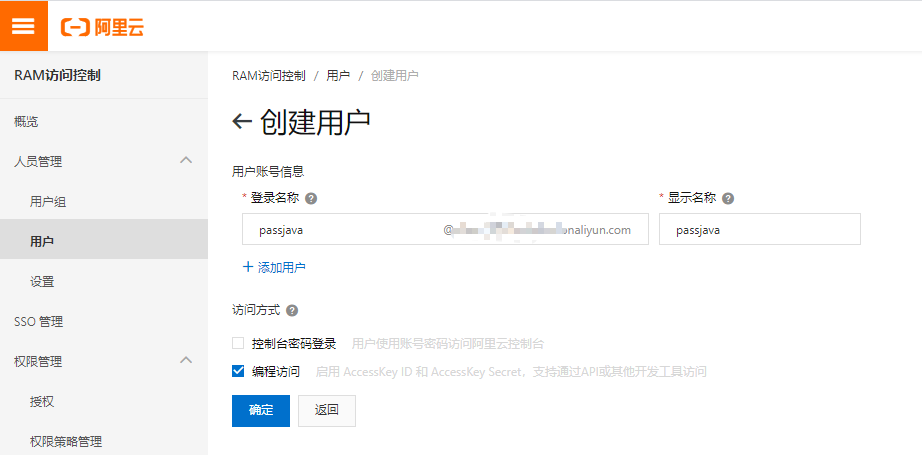

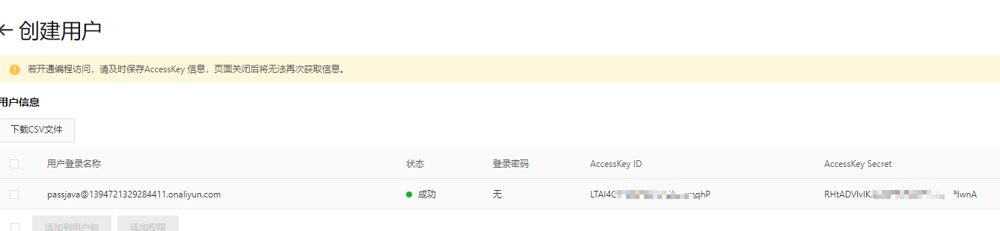

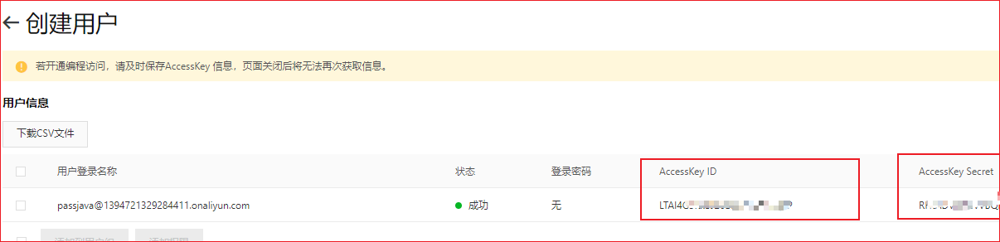

- 分配权限

  分配 管理对象存储服务（OSS）权限

  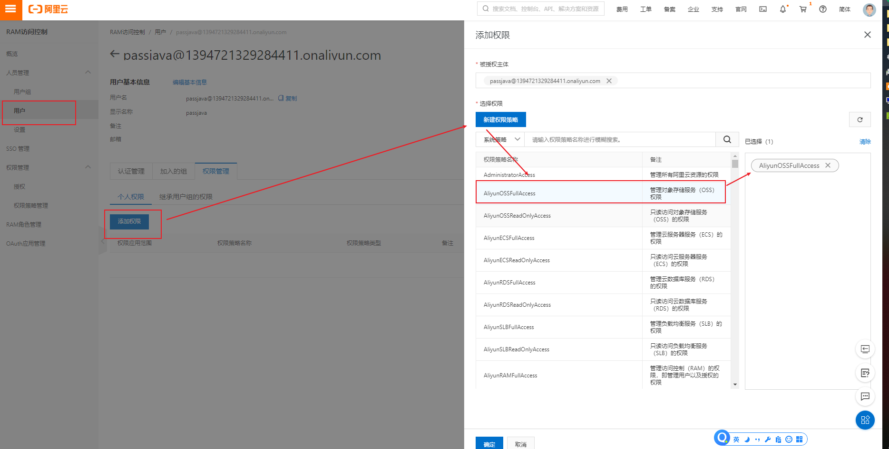

### 2.使用OSS SDK

#### 1) 安装SDK

在Maven项目中加入依赖项

```xml
https://help.aliyun.com/document_detail/32009.html?spm=a2c4g.11186623.6.769.2c5145dc4TUgTa
<dependency>
    <groupId>com.aliyun.oss</groupId>
    <artifactId>aliyun-sdk-oss</artifactId>
    <version>3.8.0</version>
</dependency>
```

#### 2) 上传文件到OSS

```java
@Test
void testUploadByOss() throws FileNotFoundException {
    // Endpoint以杭州为例，其它Region请按实际情况填写。
    String endpoint = "http://oss-cn-beijing.aliyuncs.com";
    // 阿里云主账号AccessKey拥有所有API的访问权限，风险很高。强烈建议您创建并使用RAM账号进行API访问或日常运维，请登录 https://ram.console.aliyun.com 创建RAM账号。
    String accessKeyId = "LTAI4G3KxBJ26EUbWsenmqhP";
    String accessKeySecret = "RHtADVlvlKJvVBQnFNNvnne9p4NwnA";
    String bucketName = "passjava";

    // <yourObjectName>上传文件到OSS时需要指定包含文件后缀在内的完整路径，例如abc/efg/123.jpg。
    String localFile = "C:\\Users\\Administrator\\Pictures\\coding_java.png";
    String fileKeyName = "coding_java.png";
    // 创建OSSClient实例。
    OSS ossClient = new OSSClientBuilder().build(endpoint, accessKeyId, accessKeySecret);

    InputStream inputStream = new FileInputStream(localFile);
    ossClient.putObject(bucketName, fileKeyName, inputStream);

    // 关闭OSSClient。
    ossClient.shutdown();
}
```

### 3.整合Spring Cloud Alicloud OSS

#### 1) passjava-common项目引入spring-cloud-starter-alicloud-oss依赖

```xml
<dependency>
    <groupId>com.alibaba.cloud</groupId>
    <artifactId>spring-cloud-starter-alicloud-oss</artifactId>
</dependency>
```

#### 2) 配置alicloud oss

```yaml
spring:
  cloud:
    alicloud:
      access-key: xxxx
      secret-key: xxxx
      oss:
        endpoint: oss-cn-beijing.aliyuncs.com
```

#### 3）测试上传

```java
@Autowired
OSSClient ossClient;

@Test
void testUploadByAlicloudOss() throws FileNotFoundException {
    String bucketName = "passjava";
    String localFile = "C:\\Users\\Administrator\\Pictures\\coding_java.png";
    String fileKeyName = "coding_java.png";
    InputStream inputStream = new FileInputStream(localFile);
    ossClient.putObject(bucketName, fileKeyName, inputStream);
    ossClient.shutdown();
}
```

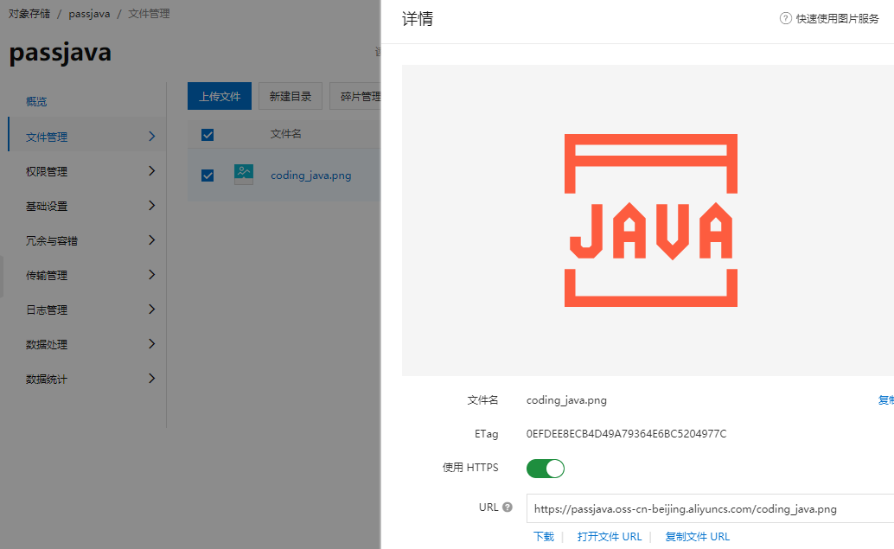

### 4.获取服务端签名

#### 4.1 准备工作：

- 创建一个第三方服务passjava-thirdparty
- 引入passjava-common模块，并且排除mybatis-plus依赖

```xml
<dependency>
    <groupId>com.jackson0714.passjava</groupId>
    <artifactId>passjava-common</artifactId>
    <version>0.0.1-SNAPSHOT</version>
    <exclusions>
        <exclusion>
            <groupId>com.baomidou</groupId>
            <artifactId>mybatis-plus-boot-starter</artifactId>
        </exclusion>
    </exclusions>
</dependency>
```

- 配置服务发现和端口

```yaml
spring:
  cloud:
    nacos:
      discovery:
        server-addr: 127.0.0.1:8848
  application:
        name: passjava-thirdparty
server:
  port: 14000
```

- 配置配置中心

```yaml
spring.application.name=passjava-thirdparty
spring.cloud.nacos.config.server-addr=127.0.0.1:8848
spring.cloud.nacos.config.namespace=passjava-thirdparty

spring.cloud.nacos.config.extension-configs[0].data-id=oss.yml
spring.cloud.nacos.config.extension-configs[0].group=DEFAULT_GROUP
spring.cloud.nacos.config.extension-configs[0].refresh=true
```

- 配置Nacos命名空间和oss.yml

```yaml
spring:
  cloud:
    alicloud:
      access-key: LTAI4G3KxBJ26EUbWsenmqhP
      secret-key: RHtADVlvlKJvVBQnFNNvnne9p4NwnA
      oss:
        endpoint: oss-cn-beijing.aliyuncs.com
```

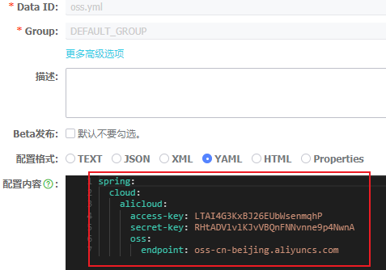

- 开启服务发现`@EnableDiscoveryClient`

```java
@EnableDiscoveryClient
@SpringBootApplication
public class PassjavaThirdpartyApplication {
    public static void main(String[] args) {
        SpringApplication.run(PassjavaThirdpartyApplication.class, args);
    }
}
```

#### 4.2 获取签名类

```java
@RestController
@RequestMapping("/thirdparty/v1/admin/oss")
public class OssController {

    @Autowired
    OSS ossClient;

    @Value("${spring.cloud.alicloud.access-key}")
    private String accessId;

    @Value("${spring.cloud.alicloud.secret-key}")
    private String accessKey;

    @Value("${spring.cloud.alicloud.oss.endpoint}")
    private String endpoint;

    @Value("${spring.cloud.alicloud.oss.bucket}")
    private String bucket;

    @RequestMapping("/getPolicy")
    public Map<String, String> getPolicy() {
        String host = "https://" + bucket + "." + endpoint; // host的格式为 bucketname.endpoint
        // callbackUrl为 上传回调服务器的URL，请将下面的IP和Port配置为您自己的真实信息。
        // String callbackUrl = "http://88.88.88.88:8888";
        String formatDate = new SimpleDateFormat("yyyy-MM-dd").format(new Date());
        String dir = formatDate + "/"; // 用户上传文件时指定的前缀。

        Map<String, String> respMap = new LinkedHashMap<String, String>();

        try {
            long expireTime = 30;
            long expireEndTime = System.currentTimeMillis() + expireTime * 1000;
            Date expiration = new Date(expireEndTime);
            PolicyConditions policyConds = new PolicyConditions();
            policyConds.addConditionItem(PolicyConditions.COND_CONTENT_LENGTH_RANGE, 0, 1048576000);
            policyConds.addConditionItem(MatchMode.StartWith, PolicyConditions.COND_KEY, dir);

            String postPolicy = ossClient.generatePostPolicy(expiration, policyConds);
            byte[] binaryData = postPolicy.getBytes("utf-8");
            String encodedPolicy = BinaryUtil.toBase64String(binaryData);
            String postSignature = ossClient.calculatePostSignature(postPolicy);


            respMap.put("accessid", accessId);
            respMap.put("policy", encodedPolicy);
            respMap.put("signature", postSignature);
            respMap.put("dir", dir);
            respMap.put("host", host);
            respMap.put("expire", String.valueOf(expireEndTime / 1000));


        } catch (Exception e) {
            // Assert.fail(e.getMessage());
            System.out.println(e.getMessage());
        } finally {
            ossClient.shutdown();
        }

        return respMap;
    }
}
```

测试接口

```json
http://localhost:14000/api/thirdparty/v1/admin/oss/getPolicy 
{
	"accessid": "LTAI4G3KxBJ26EUbWsenmqhP",
	"policy": "eyJleHBpcmF0aW9uIjoiMjAyMC0wNC0yOFQwMjozMzowNy42NzNaIiwiY29uZGl0aW9ucyI6W1siY29udGVudC1sZW5ndGgtcmFuZ2UiLDAsMTA0ODU3NjAwMF0sWyJzdGFydHMtd2l0aCIsIiRrZXkiLCIyMDIwLTA0LTI4LyJdXX0=",
	"signature": "pfn4cggFTMMNqTs+qUnDN5c+k5M=",
	"dir": "2020-04-28/",
	"host": "https://passjava.oss-cn-beijing.aliyuncs.com",
	"expire": "1588041187"
}
```

#### 4.3 配置网关路由

因为前端页面配置的统一访问路径是http://localhost:8060/api/，所以需要将访问thirdparty的服务通过网关路由到thirdparty服务

```javascript
将请求
http://localhost:8060/api/thirdparty/v1/admin/oss/getPolicy
转发到
http://localhost:14000/api/thirdparty/v1/admin/oss/getPolicy 
```

配置网关：

```yaml
spring:
  cloud:
    gateway:
      routes:
        - id: route_thirdparty # 题目微服务路由规则
          uri: lb://passjava-thirdparty # 负载均衡，将请求转发到注册中心注册的assjava-thirdparty服务
          predicates: # 断言
            - Path=/api/thirdparty/** # 如果前端请求路径包含 api/thirdparty，则应用这条路由规则
          filters: #过滤器
            - RewritePath=/api/(?<segment>.*),/$\{segment} # 将跳转路径中包含的api替换成空
```

测试可以上传成功

#### 4.4 配置跨域访问

配置跨域访问，所有post请求都可以跨域访问

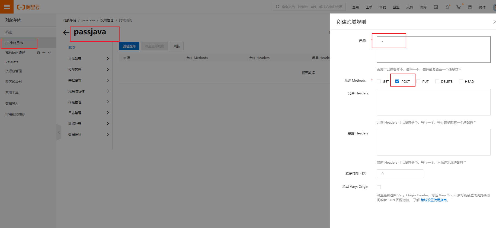

#### 4.5 Web端上传组件

- 单文件上传组件

```javascript
singleUpload.vue
<template> 
  <div>
    <el-upload
      action="http://passjava.oss-cn-beijing.aliyuncs.com"
      :data="dataObj"
      list-type="picture"
      :multiple="false" :show-file-list="showFileList"
      :file-list="fileList"
      :before-upload="beforeUpload"
      :on-remove="handleRemove"
      :on-success="handleUploadSuccess"
      :on-preview="handlePreview">
      <el-button size="small" type="primary">点击上传</el-button>
      <div slot="tip" class="el-upload__tip">只能上传jpg/png文件，且不超过10MB</div>
    </el-upload>
    <el-dialog :visible.sync="dialogVisible">
      
    </el-dialog>
  </div>
</template>
<script>
   import {policy} from './policy'
   import { getUUID } from '@/utils'

  export default {
    name: 'singleUpload',
    props: {
      value: String
    },
    computed: {
      imageUrl() {
        return this.value;
      },
      imageName() {
        if (this.value != null && this.value !== '') {
          return this.value.substr(this.value.lastIndexOf("/") + 1);
        } else {
          return null;
        }
      },
      fileList() {
        return [{
          name: this.imageName,
          url: this.imageUrl
        }]
      },
      showFileList: {
        get: function () {
          return this.value !== null && this.value !== ''&& this.value!==undefined;
        },
        set: function (newValue) {
        }
      }
    },
    data() {
      return {
        dataObj: {
          policy: '',
          signature: '',
          key: '',
          ossaccessKeyId: '',
          dir: '',
          host: '',
          // callback:'',
        },
        dialogVisible: false
      };
    },
    methods: {
      emitInput(val) {
        this.$emit('input', val)
      },
      handleRemove(file, fileList) {
        this.emitInput('');
      },
      handlePreview(file) {
        this.dialogVisible = true;
      },
      beforeUpload(file) {
        let _self = this;
        return new Promise((resolve, reject) => {
          policy().then(response => {
            _self.dataObj.policy = response.data.policy;
            _self.dataObj.signature = response.data.signature;
            _self.dataObj.ossaccessKeyId = response.data.accessid;
            _self.dataObj.key = response.data.dir + getUUID()+'_${filename}';
            _self.dataObj.dir = response.data.dir;
            _self.dataObj.host = response.data.host;
            resolve(true)
          }).catch(err => {
            reject(false)
          })
        })
      },
      handleUploadSuccess(res, file) {
        console.log("上传成功...")
        this.showFileList = true;
        this.fileList.pop();
        this.fileList.push({name: file.name, url: this.dataObj.host + '/' + this.dataObj.key.replace("${filename}",file.name) });
        this.emitInput(this.fileList[0].url);
      }
    }
  }
</script>
<style>

</style>
```

- 获取签名的JS文件

```javascript
import http from '@/utils/httpRequest.js'
export function policy () {
  return new Promise((resolve) => {
    http({
      url: http.adornUrl('/thirdparty/v1/admin/oss/getPolicy'),
      method: 'get',
      params: http.adornParams({})
    }).then(({ data }) => {
      resolve(data)
    })
  })
}
```

- 使用单文件上传组件

```javascript
使用上传图片组件
<el-form-item label="类型logo路径" prop="logoUrl">
    <single-upload v-model="dataForm.logoUrl"></single-upload>
</el-form-item>

<script>
  import SingleUpload from "@/components/upload/singleUpload" // 引入单文件上传组件
  export default {
    components:{ SingleUpload }
  }
</script>
```


上传文件成功

## 代码地址

https://github.com/Jackson0714/PassJava-Platform

# 19整合统一异常处理

## 一、缘起

> 我们在写代码的时候，通常会在方法里面添加各种try catch来捕获异常，会发现有很多重复的代码，所以我们可以整合统一异常处理来优化代码结构。

拦截异常并统一处理我们可以用到`@RestControllerAdvice`注解

## 二、自定义异常处理类

- 添加统一异常处理类注解`@RestControllerAdvice`
- 添加日志注解`@Slf4j`
- 添加异常处理方法注解`@ExceptionHandler`

```java
package com.jackson0714.passjava.question.exception;

/*
* 集中处理所有异常
 */
@Slf4j
@RestControllerAdvice(basePackages = "com.jackson0714.passjava.question.controller")
public class PassjavaExceptionControllerAdvice {

    @ResponseBody
    @ExceptionHandler(value= MethodArgumentNotValidException.class)
    public R handleValidException(MethodArgumentNotValidException e) {
        log.error("数据校验出现问题{}，异常类型：{}", e.getMessage(), e.getClass());
        BindingResult bindingResult = e.getBindingResult();
        Map<String, String> errorMap = new HashMap<>();
        bindingResult.getFieldErrors().forEach((fieldError)->{
            errorMap.put(fieldError.getField(), fieldError.getDefaultMessage());
        });

        return R.error(BizCodeEnum.VALID_EXCEPTION.getCode(), BizCodeEnum.VALID_EXCEPTION.getMsg()).put("data", errorMap);
    }

    @ExceptionHandler(value=Throwable.class)
    public R handleException(Throwable throwable) {
        log.error("未知异常{}，异常类型：{}", throwable.getMessage(), throwable.getClass());
        
        return R.error(BizCodeEnum.UNKNOWN_EXCEPTION.getCode(), BizCodeEnum.UNKNOWN_EXCEPTION.getMsg());
    }
}
```

## 三、推荐的系统错误码

### 1.错误码和错误信息定义类

- 1.错误码长度：5个数字
- 2.前两位：业务场景
- 3.后三位：错误码

```json
10：通用业务
	001：参数格式校验错误（10001）
11：会员业务
12：题目业务
13：内容业务
14：学习业务
```

### 2.错误码枚举类

com.jackson0714.common.exception.BizCodeEnum

定义了两种异常枚举：系统未知异常、参数格式校验失败

```java
package com.jackson0714.common.exception;

public enum BizCodeEnum {
    UNKNOWN_EXCEPTION(10000, "系统未知异常"),
    VALID_EXCEPTION(10001, "参数格式校验失败");

    private int code;
    private String msg;
    BizCodeEnum(int code, String msg) {
        this.code = code;
        this.msg = msg;
    }

    public int getCode() {
        return code;
    }

    public String getMsg() {
        return msg;
    }
}
```

## 四、测试代码

> **测试场景1：校验参数displayOrder必须为正整数，如果displayOrder不为正整数，则会抛出异常**

- 1.实体类上添加校验注解`@Positive`

```java
/**
 * 排序
 */
@Positive
private Integer displayOrder;
```

- 2.controller类里面添加save方法，并添加校验参数注解@Valid

```java
/**
* 保存
*/
@RequestMapping("/save")
public R save(@Valid @RequestBody QuestionEntity question){
    questionService.save(question);

    return R.ok();
}
```

测试：

用Postman工具调用save方法

请求地址：

```javascript
http://192.168.10.160:8060/api/question/v1/admin/question/save
```

请求参数：

```json
{
    "displayOrder": 0.2
}
```

返回结果：

```json
{
    "msg": "参数格式校验失败",
    "code": 10001,
    "data": {
        "displayOrder": "必须是正数"
    }
}
```

> **测试场景2：对于代码里面直接抛出的异常，也可以handle**

1.controller类里面添加查询题目的方法，并抛出Exception异常

```java
/**
* 信息
*/
@RequestMapping("/info/{id}")
//@RequiresPermissions("question:question:info")
public R info(@PathVariable("id") Long id) throws Exception {
    QuestionEntity question = questionService.getById(id);
    throw new Exception("test");

    //return R.ok().put("question", question);
}
```

测试：

用Postman工具调用save方法

请求地址：

```javascript
http://192.168.10.160:8060/api/question/v1/admin/question/save
```

返回结果：

```json
{
    "msg": "系统未知异常",
    "code": 10000
}
```

证明统一处理方法被调用了：

```java
@ExceptionHandler(value=Throwable.class)
public R handleException(Throwable throwable) {
    return R.error(BizCodeEnum.UNKNOWN_EXCEPTION.getCode(), BizCodeEnum.UNKNOWN_EXCEPTION.getMsg());
}
```

## 代码地址

https://github.com/Jackson0714/PassJava-Platform