# Spring Boot -Maven 多模块项目搭建

### 一、前言

最近公司项目准备开始重构，框架选定为 Spring Boot ，本篇主要记录了在 IDEA 中搭建 Spring Boot Maven 多模块项目的过程。

------

### 二、软件及硬件环境

- macOS Sierra 10.12.6
- IntelliJ IDEA 2018.2
- JDK 1.8
- Maven 3.2.1
- Spring Boot 2.0.4

------

### 三、项目结构

- biz 层（业务逻辑层）
- dao 层（数据持久层）
- common 层（公用组件层）
- web 层（请求处理层）

> 注：biz 层依赖 dao 及 common 层， web 层依赖 biz 层

------

### 四、项目搭建

#### 4.1 创建父工程

① IDEA 主面板选择菜单「Create New Project 」或者工具栏选择菜单「 File -> New -> Project... 」
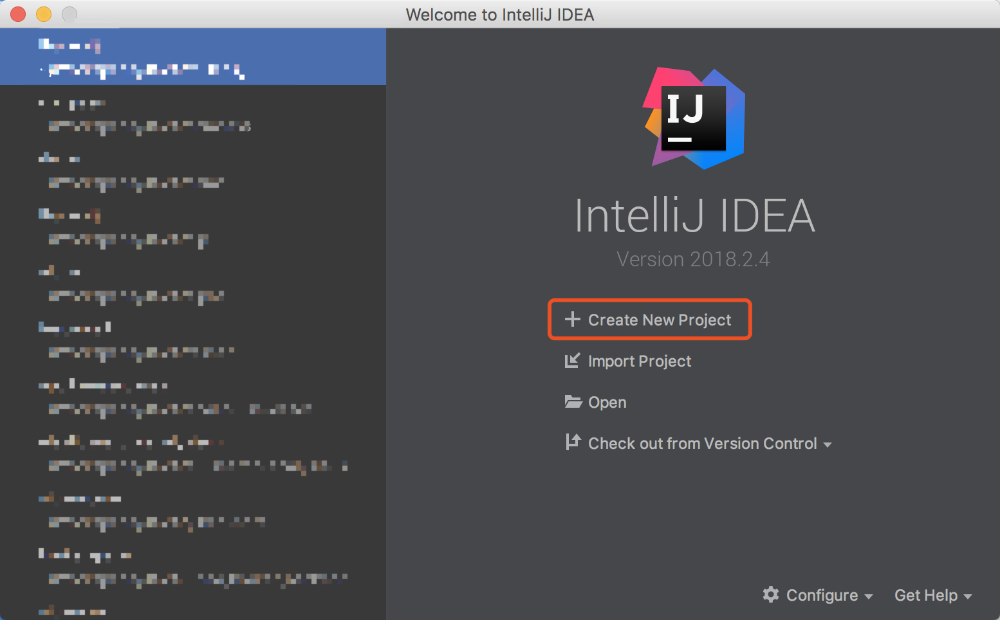
② 侧边栏选择「 Spring Initializr 」，Initializr 默认选择 Default ，然后点击「 Next 」
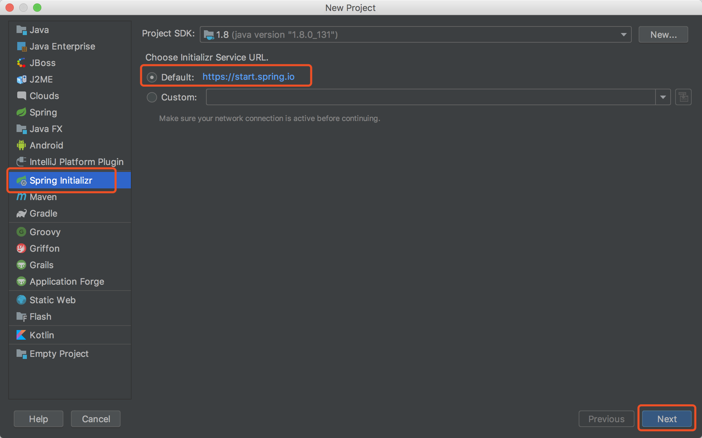
③ 修改 Group 、 Artifact 、 Package 输入框中的值后点击「 Next 」
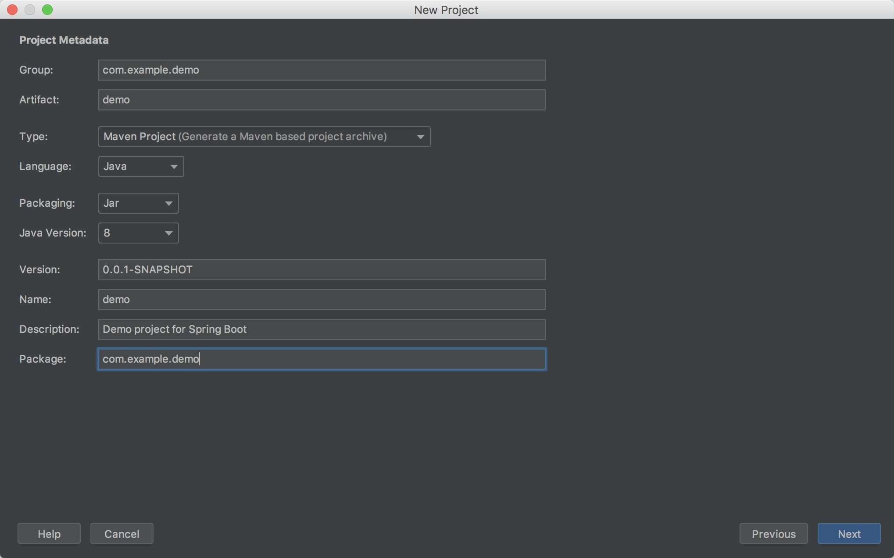
④ 这步暂时先不需要选择，直接点「 Next 」
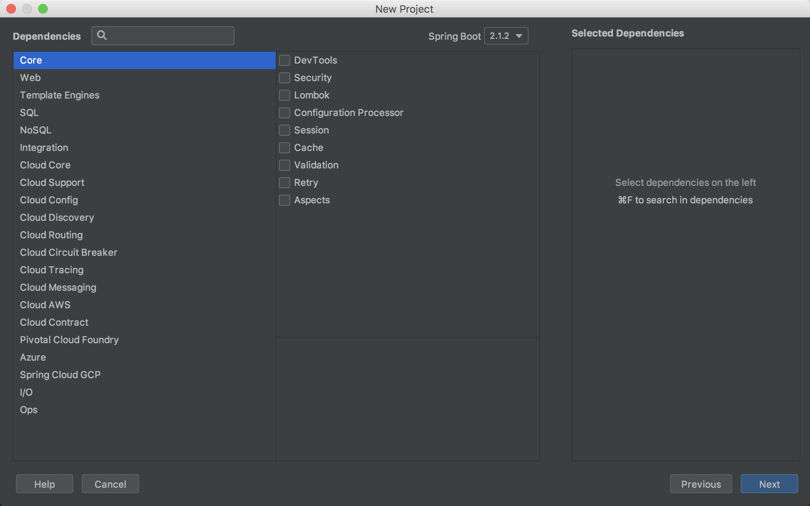
⑤ 点击「 Finish 」创建项目
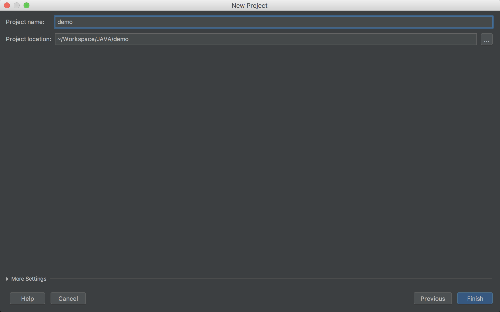
⑥ 最终得到的项目目录结构如下

```bash
|-- demo
  |-- .gitignore
  |-- mvnw
  |-- mvnw.cmd
  |-- pom.xml
  |-- .mvn
  |   |-- wrapper
  |       |-- maven-wrapper.jar
  |       |-- maven-wrapper.properties
  |-- src
      |-- main
      |   |-- java
      |   |   |-- com
      |   |       |-- example
      |   |           |-- demo
      |   |               |-- DemoApplication.java
      |   |-- resources
      |       |-- application.properties
      |-- test
          |-- java
              |-- com
                  |-- example
                      |-- demo
                          |-- DemoApplicationTests.java
```

⑦ 删除无用的 .mvn 目录、 src 目录、 mvnw 及 mvnw.cmd 文件，最终只留 .gitignore 和 pom.xml

#### 4.2 创建子模块

① 选择项目根目录，右键呼出菜单，选择「 New -> Module 」
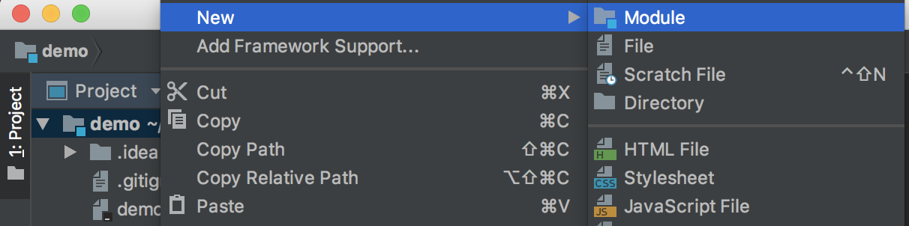
② 侧边栏选择「 Maven 」，点击「 Next 」
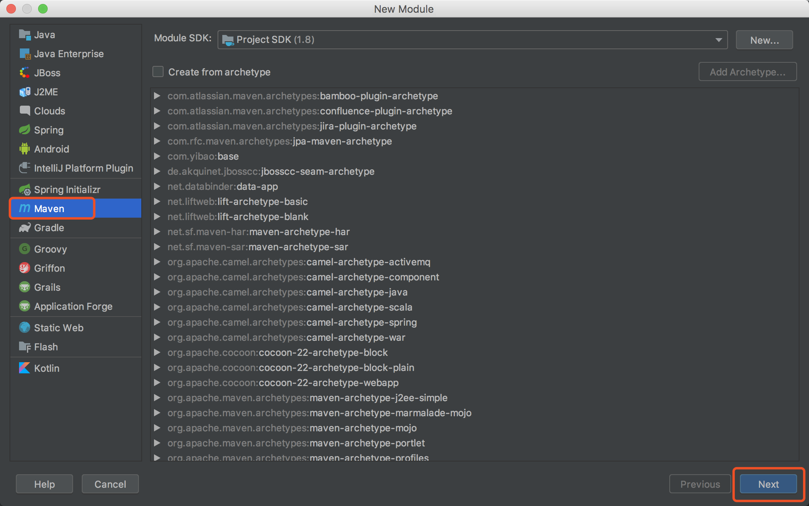
③ 填写 ArifactId ，点击「 Next 」
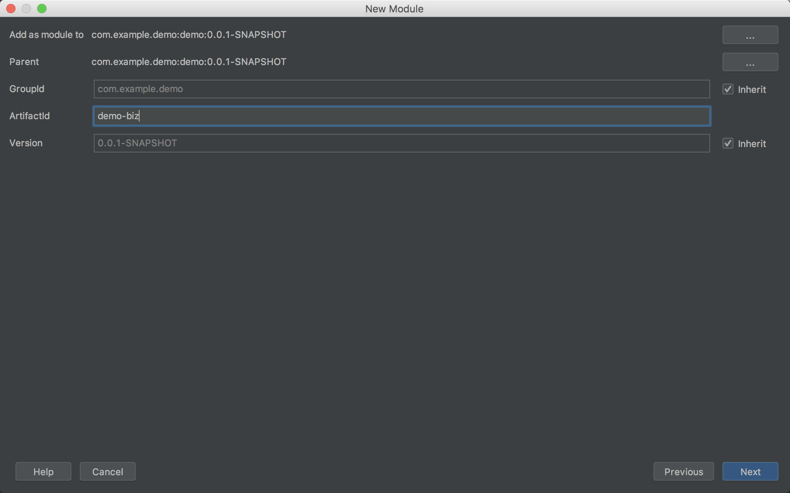
④ 修改 Module name 增加横杠提升可读性，点击「 Finish 」
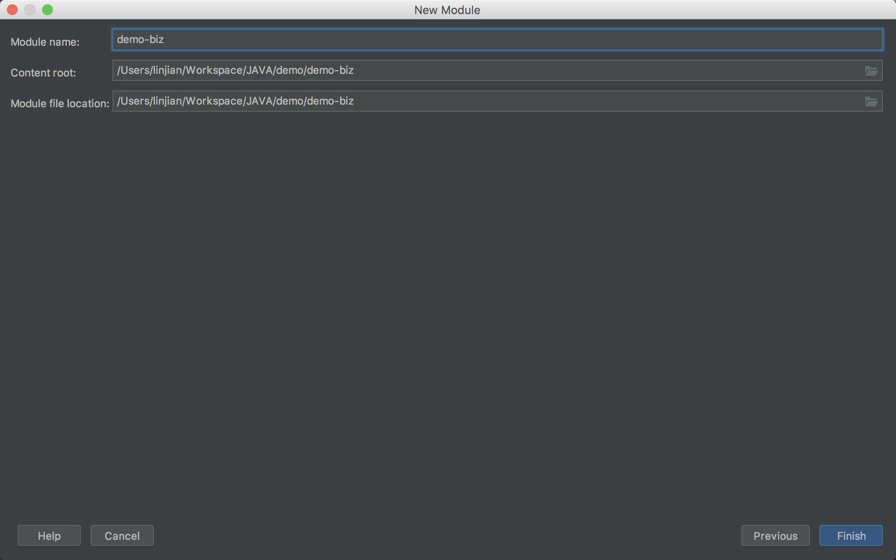
⑤ 同理添加「 demo-dao 」、「 demo-common 」、「 demo-web 」子模块，最终得到项目目录结构如下

```bash
|-- demo
    |-- .gitignore
    |-- pom.xml
    |-- demo-biz
    |   |-- pom.xml
    |   |-- src
    |       |-- main
    |       |   |-- java
    |       |   |-- resources
    |       |-- test
    |           |-- java
    |-- demo-common
    |   |-- pom.xml
    |   |-- src
    |       |-- main
    |       |   |-- java
    |       |   |-- resources
    |       |-- test
    |           |-- java
    |-- demo-dao
    |   |-- pom.xml
    |   |-- src
    |       |-- main
    |       |   |-- java
    |       |   |-- resources
    |       |-- test
    |           |-- java
    |-- demo-web
      |-- pom.xml
      |-- src
          |-- main
          |   |-- java
          |   |-- resources
          |-- test
              |-- java
```

#### 4.3 整理父 pom 文件中的内容

① 删除 dependencies 标签及其中的 spring-boot-starter 和 spring-boot-starter-test 依赖，因为 Spring Boot 提供的父工程已包含，并且父 pom 原则上都是通过 dependencyManagement 标签管理依赖包。

> 注：dependencyManagement 及 dependencies 的区别自行查阅文档

② 删除 build 标签及其中的所有内容，spring-boot-maven-plugin 插件作用是打一个可运行的包，多模块项目仅仅需要在入口类所在的模块添加打包插件，这里父模块不需要打包运行。而且该插件已被包含在 Spring Boot 提供的父工程中，这里删掉即可。
③ 最后整理父 pom 文件中的其余内容，按其代表含义归类，整理结果如下：

```xml
<!-- 基本信息 -->
<modelVersion>4.0.0</modelVersion>
<packaging>pom</packaging>
<name>demo</name>
<description>Demo project for Spring Boot</description>

<!-- 项目说明：这里作为聚合工程的父工程 -->
<groupId>com.example.demo</groupId>
<artifactId>demo</artifactId>
<version>0.0.1-SNAPSHOT</version>

<!-- 继承说明：这里继承Spring Boot提供的父工程 -->
<parent>
    <groupId>org.springframework.boot</groupId>
    <artifactId>spring-boot-starter-parent</artifactId>
    <version>2.1.2.RELEASE</version>
    <relativePath/>
</parent>

<!-- 模块说明：这里声明多个子模块 -->
<modules>
    <module>demo-biz</module>
    <module>demo-common</module>
    <module>demo-dao</module>
    <module>demo-web</module>
</modules>

<!-- 属性说明 -->
<properties>
    <java.version>1.8</java.version>
    <demo.version>0.0.1-SNAPSHOT</demo.version>
</properties>
```

#### 4.4 简易 HTTP 接口测试

准备工作都完成之后，通过一个简易的 HTTP 接口测试项目是否正常运行。

① 首先在 demo-web 层创建 com.example.demo.web 包并添加入口类 DemoWebApplication.java

> 注：com.example.demo.web 为多级目录结构并非单个目录名

```java
package com.example.demo.web;

import org.springframework.boot.SpringApplication;
import org.springframework.boot.autoconfigure.SpringBootApplication;

/**
 * @author linjian
 * @date 2019/1/15
 */
@SpringBootApplication
public class DemoWebApplication {
    public static void main(String[] args) {
        SpringApplication.run(DemoWebApplication.class, args);
    }
}
```

② 其次在 demo-web 层的 pom 文件中添加必要的依赖包

```xml
<dependencies>
    <dependency>
        <groupId>org.springframework.boot</groupId>
        <artifactId>spring-boot-starter-web</artifactId>
    </dependency>
</dependencies>
```

② 然后在 com.example.demo.web 包中添加 controller 目录并新建一个 controller，添加 test 方法测试接口是否可以正常访问。

```java
package com.example.demo.web.controller;

import org.springframework.web.bind.annotation.GetMapping;
import org.springframework.web.bind.annotation.RequestMapping;
import org.springframework.web.bind.annotation.RestController;

/**
 * @author linjian
 * @date 2019/1/15
 */
@RestController
@RequestMapping("demo")
public class DemoController {

    @GetMapping("test")
    public String test() {
        return "Hello World!";
    }
}
```

③ 最后运行 DemoWebApplication 类中的 main 方法启动项目，默认端口为 8080，访问 http://localhost:8080/demo/test 即可测试接口


#### 4.5 配置模块间的依赖关系

通常 JAVA Web 项目会按照功能划分不同模块，模块之间通过依赖关系进行协作，下面将完善模块之间的依赖关系。

① 首先在父 pom 文件中使用「 dependencyManagement 」标签声明所有子模块依赖

```xml
<!-- 依赖管理：这里统一管理依赖的版本号 -->
<dependencyManagement>
    <dependencies>
        <dependency>
            <groupId>com.example.demo</groupId>
            <artifactId>demo-biz</artifactId>
            <version>${demo.version}</version>
        </dependency>
        <dependency>
            <groupId>com.example.demo</groupId>
            <artifactId>demo-common</artifactId>
            <version>${demo.version}</version>
        </dependency>
        <dependency>
            <groupId>com.example.demo</groupId>
            <artifactId>demo-dao</artifactId>
            <version>${demo.version}</version>
        </dependency>
        <dependency>
            <groupId>com.example.demo</groupId>
            <artifactId>demo-web</artifactId>
            <version>${demo.version}</version>
        </dependency>
    </dependencies>
</dependencyManagement>
```

> 注：${demo.version} 定义在 properties 标签中

② 其次在 demo-biz 层中的 pom 文件中添加 demo-dao 及 demo-common 依赖

```xml
<dependencies>
    <dependency>
        <groupId>com.example.demo</groupId>
        <artifactId>demo-common</artifactId>
    </dependency>
    <dependency>
        <groupId>com.example.demo</groupId>
        <artifactId>demo-dao</artifactId>
    </dependency>
</dependencies>
```

③ 之后在 demo-web 层中的 pom 文件中添加 demo-biz 依赖

```xml
<dependencies>
    <dependency>
        <groupId>com.example.demo</groupId>
        <artifactId>demo-biz</artifactId>
    </dependency>
</dependencies>
```

#### 4.6 web 层调用 biz 层接口测试

模块依赖关系配置完成之后，通过 web 层 测试下 biz 层的接口是否可以正常调用。

① 首先在 demo-biz 层创建 com.example.demo.biz 包，添加 service 目录并在其中创建 DemoService 接口类及 impl 目录（用于存放接口实现类）。

```java
package com.example.demo.biz.service;

/**
 * @author linjian
 * @date 2019/1/15
 */
public interface DemoService {

    String test();
}
package com.example.demo.biz.service.impl;

import com.example.demo.biz.service.DemoService;
import org.springframework.stereotype.Service;

/**
 * @author linjian
 * @date 2019/1/15
 */
@Service
public class DemoServiceImpl implements DemoService {

    @Override
    public String test() {
        return "interface test";
    }
}
```

② DemoController 通过 @Autowired 注解注入 DemoService ，修改 DemoController 的 test 方法使之调用 DemoService 的 test 方法

```java
@Autowired
private DemoService demoService;

@GetMapping("test")
public String test() {
    return demoService.test();
}
```

③ 再次运行 DemoWebApplication 类中的 main 方法启动项目，发现如下报错

```bash
***************************
APPLICATION FAILED TO START
***************************

Description:

Field demoService in com.example.demo.web.controller.DemoController required a bean of type 'com.example.demo.biz.service.DemoService' that could not be found.

The injection point has the following annotations: - @org.springframework.beans.factory.annotation.Autowired(required=true)

Action:

Consider defining a bean of type 'com.example.demo.biz.service.DemoService' in your configuration.
原因是找不到 DemoService 类
```

④ 在 DemoWebApplication 入口类中增加包扫描，设置 @SpringBootApplication 注解中的 scanBasePackages 值为 com.example.demo

```java
@SpringBootApplication(scanBasePackages = "com.example.demo")
```

⑤ 设置完后重新运行 main 方法，项目正常启动，访问 http://localhost:8080/demo/test 测试接口
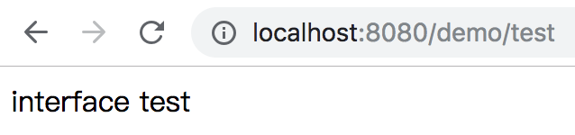

#### 4.7 集成 MyBatis

以上接口均是静态的，不涉及数据库操作，下面将集成 MyBatis 访问数据库中的数据。

① 首先父 pom 文件中声明 mybatis-spring-boot-starter 及 lombok 依赖

```xml
<dependency>
    <groupId>org.mybatis.spring.boot</groupId>
    <artifactId>mybatis-spring-boot-starter</artifactId>
    <version>1.3.2</version>
</dependency>
<dependency>
    <groupId>org.projectlombok</groupId>
    <artifactId>lombok</artifactId>
    <version>1.16.22</version>
</dependency>
```

② 其次在 demo-dao 层中的 pom 文件中添加上述依赖

```xml
<dependencies>
    <dependency>
        <groupId>mysql</groupId>
        <artifactId>mysql-connector-java</artifactId>
    </dependency>
    <dependency>
        <groupId>org.mybatis.spring.boot</groupId>
        <artifactId>mybatis-spring-boot-starter</artifactId>
    </dependency>
    <dependency>
        <groupId>org.projectlombok</groupId>
        <artifactId>lombok</artifactId>
    </dependency>
</dependencies>
```

③ 之后在 demo-dao 层创建 com.example.demo.dao 包，通过 mybatis-genertaor 工具生成 dao 层相关文件（ DO 、 Mapper 、 xml ），目录结构如下

```bash
|-- demo-dao
    |-- pom.xml
    |-- src
        |-- main
        |   |-- java
        |   |   |-- com
        |   |       |-- example
        |   |           |-- demo
        |   |               |-- dao
        |   |                   |-- entity
        |   |                   |   |-- UserDO.java
        |   |                   |-- mapper
        |   |                       |-- UserMapper.java
        |   |-- resources
        |       |-- mybatis
        |           |-- UserMapper.xml
        |-- test
            |-- java
```

④ 然后在 demo-web 层中的 resources 目录 创建 applicatio.properties 文件并在其中添加 datasource 及 MyBatis 相关配置项

```yml
spring.datasource.driverClassName = com.mysql.jdbc.Driver
spring.datasource.url = jdbc:mysql://localhost:3306/test?useUnicode=true&characterEncoding=utf-8
spring.datasource.username = test
spring.datasource.password = 123456

mybatis.mapper-locations = classpath:mybatis/*.xml
mybatis.type-aliases-package = com.example.demo.dao.entity
```

> 注：如果生成的 xml 在 dao 层 resources 目录的子目录中则 mybatis.mapper-locations 需设置为 classpath:mybatis/*/*.xml

⑤ DemoService 通过 @Autowired 注解注入 UserMapper ，修改 DemoService 的 test 方法使之调用 UserMapper 的 selectById 方法

```java
@Autowired
private UserMapper userMapper;

@Override
public String test() {
    UserDO user = userMapper.selectById(1);
    return user.toString();
}
```

⑥ 再次运行 DemoWebApplication 类中的 main 方法启动项目，出现如下报错

```bash
***************************
APPLICATION FAILED TO START
***************************

Description:

Field userMapper in com.example.demo.biz.service.impl.DemoServiceImpl required a bean of type 'com.example.demo.dao.mapper.business.UserMapper' that could not be found.

The injection point has the following annotations: - @org.springframework.beans.factory.annotation.Autowired(required=true)

Action:

Consider defining a bean of type 'com.example.demo.dao.mapper.business.UserMapper' in your configuration.
```

`原因是找不到 UserMapper 类`
⑦ 在 DemoWebApplication入口类中增加 dao 层包扫描，添加 @MapperScan 注解并设置其值为 com.example.demo.dao.mapper

```bash
@MapperScan("com.example.demo.dao.mapper")
```

⑧ 设置完后重新运行 main 方法，项目正常启动，访问 http://localhost:8080/demo/test 测试接口
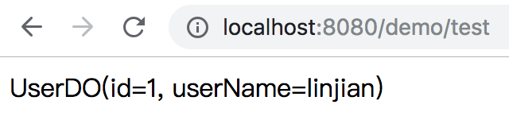

------

### 五、外部 Tomcat 部署 war 包

外部 Tomcat 部署的话，就不能依赖于入口类的 main 函数了，而是要以类似于 web.xml 文件配置的方式来启动 Spring应用上下文。
① 在入口类中继承 SpringBootServletInitializer 并实现 configure 方法

```java
public class DemoWebApplication extends SpringBootServletInitializer {

    @Override
    protected SpringApplicationBuilder configure(SpringApplicationBuilder builder) {
        return builder.sources(DemoWebApplication.class);
    }

    public static void main(String[] args) {
        SpringApplication.run(DemoWebApplication.class, args);
    }
}
```

② 之前在 demo-web 引入了 spring-boot-starter-web 的依赖，该依赖包包含内嵌的 Tomcat 容器，所以直接部署在外部 Tomcat 会冲突报错。这里在 demo-web 层中的 pom 文件中重定义 spring-boot-starter-tomcat 依赖包的「 scope 」即可解决该问题。

```xml
<dependency>
    <groupId>org.springframework.boot</groupId>
    <artifactId>spring-boot-starter-tomcat</artifactId>
    <scope>provided</scope>
</dependency>
```

③ 声明 demo-web 层的打包方式及最终的包名

```xml
<packaging>war</packaging>
...省略其余部分...
<build>
    <finalName>demo</finalName>
</build>
```

④ 此时在 demo-web 层目录执行「 mvn clean install 」即可打出一个名为 demo.war 的包。

### 六、Maven Profile 多环境打包

在日常开发中，通常不止一套环境，如开发环境、测试环境、预发环境、生成环境，而每个环境的配置项可能都不一样，这就需要用到多环境打包来解决这个问题。

① 在 demo-web 层的 resources 目录中新建 conf 目录，再在其中按照环境创建相应目录，这里创建开发环境「 dev 」及测试环境「 test 」，再将原本的 application.properties 文件分别拷贝一份到两个目录中，根据环境修改其中的配置项，最后删除原本的配置文件。得到目录结构如下：

```bash
|-- resources
    |-- conf
      |-- dev
      |   |-- application.properties
      |-- test
          |-- application.properties
```

② 往 demo-web 层的 pom 文件添加 profile 标签

```xml
<profiles>
    <profile>
        <id>dev</id>
        <properties>
            <profile.env>dev</profile.env>
        </properties>
        <activation>
            <activeByDefault>true</activeByDefault>
        </activation>
    </profile>
    <profile>
        <id>test</id>
        <properties>
            <profile.env>test</profile.env>
        </properties>
    </profile>
</profiles>
```

> 注：其中 dev 为默认激活的 profile ，如要增加其他环境按照上述步骤操作即可。

③ 设置打包时资源文件路径

```xml
<build>
    <finalName>demo</finalName>
    <resources>
        <resource>
            <directory>${basedir}/src/main/resources</directory>
            <excludes>
                <exclude>conf/**</exclude>
            </excludes>
        </resource>
        <resource>
            <directory>src/main/resources/conf/${profile.env}</directory>
        </resource>
    </resources>
</build>
```

> 注：${basedir} 为当前子模块的根目录

④ 打包时通过「 P 」参数指定 profile

```bash
mvn clean install -P test
```

------

### 七、自定义 archetype 模板

#### 7.1 什么是 archetype 模板？

archetype 是一个 Maven 项目模板工具包，通过 archetype 我们可以快速搭建 Maven 项目。
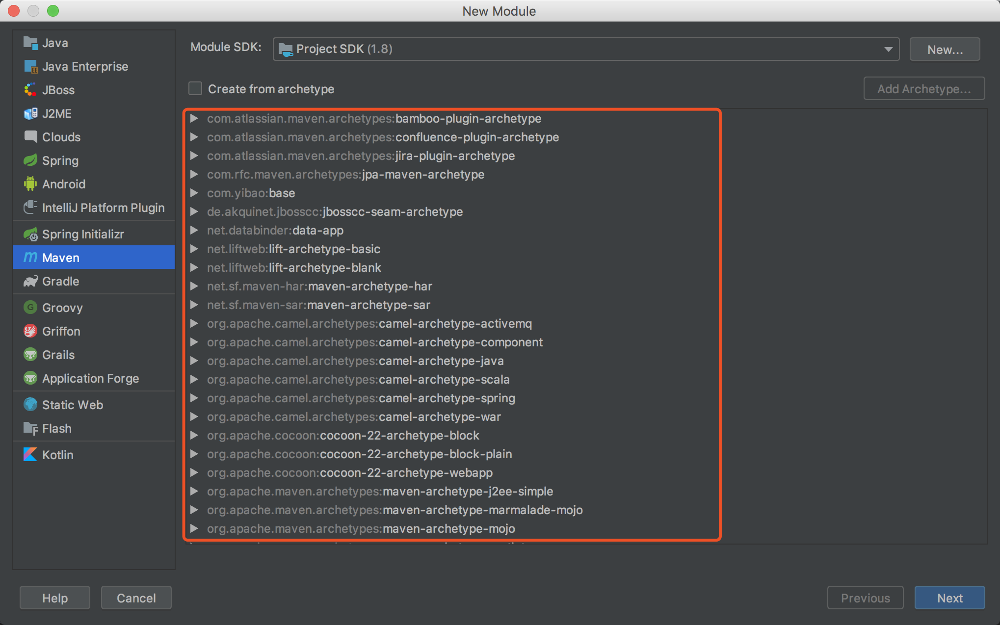
每个模板里其实就是附带不同的依赖和插件。一般在公司私服里都会有属于本公司的一套 archetype 模板，里面有着调试好的项目用到的依赖包和版本号。

#### 7.2 创建 archetype 模板

① cd 到项目根目录（即父 pom 文件所在目录）执行 mvn 命令，此时会在项目根目录生成 target 目录，其包含一个名为 generated-sources 的目录

```bash
mvn archetype:create-from-project
```

② 打开「 /target/generated-sources/archetype/src/main/resources/META-INF/maven/ 」目录下的 archetype-metadata.xml 文件，从中清理一些不需要的文件，如 IDEA 的一些文件（.idea、.iml）等。

```xml
<fileSet filtered="true" encoding="UTF-8">
    <directory>.idea/libraries</directory>
    <includes>
        <include>**/*.xml</include>
    </includes>
</fileSet>
<fileSet filtered="true" encoding="UTF-8">
    <directory>.idea/inspectionProfiles</directory>
    <includes>
        <include>**/*.xml</include>
    </includes>
</fileSet>
<fileSet filtered="true" encoding="UTF-8">
    <directory>.idea/artifacts</directory>
    <includes>
        <include>**/*.xml</include>
    </includes>
</fileSet>
<fileSet filtered="true" encoding="UTF-8">
    <directory>.idea</directory>
    <includes>
        <include>**/*.xml</include>
    </includes>
</fileSet>
```

③ 然后 cd target/generated-sources/archetype/，然后执行 install 命令，在本地仓库的根目录生成 archetype-catalog.xml 骨架配置文件

```bash
mvn install
```

文件内容如下：

```xml
<?xml version="1.0" encoding="UTF-8"?>
<archetype-catalog xsi:schemaLocation="http://maven.apache.org/plugins/maven-archetype-plugin/archetype-catalog/1.0.0 http://maven.apache.org/xsd/archetype-catalog-1.0.0.xsd"
    xmlns="http://maven.apache.org/plugins/maven-archetype-plugin/archetype-catalog/1.0.0"
    xmlns:xsi="http://www.w3.org/2001/XMLSchema-instance">
    <archetypes>
        <archetype>
            <groupId>com.example.demo</groupId>
            <artifactId>demo-archetype</artifactId>
            <version>0.0.1-SNAPSHOT</version>
            <description>demo</description>
        </archetype>
    </archetypes>
</archetype-catalog>
```

#### 7.3 使用 archetype 模板

到本机的工作目录执行 mvn archetype:generate -DarchetypeCatalog=local 从本地 archeType 模板中创建项目

```bash
~/Workspace/JAVA $ mvn archetype:generate -DarchetypeCatalog=local
[INFO] Scanning for projects...
[INFO]
[INFO] Using the builder org.apache.maven.lifecycle.internal.builder.singlethreaded.SingleThreadedBuilder with a thread count of 1
[INFO]
[INFO] ------------------------------------------------------------------------
[INFO] Building Maven Stub Project (No POM) 1
[INFO] ------------------------------------------------------------------------
[INFO]
[INFO] >>> maven-archetype-plugin:3.0.1:generate (default-cli) @ standalone-pom >>>
[INFO]
[INFO] <<< maven-archetype-plugin:3.0.1:generate (default-cli) @ standalone-pom <<<
[INFO]
[INFO] --- maven-archetype-plugin:3.0.1:generate (default-cli) @ standalone-pom ---
[INFO] Generating project in Interactive mode
[INFO] No archetype defined. Using maven-archetype-quickstart (org.apache.maven.archetypes:maven-archetype-quickstart:1.0)
Choose archetype:
1: local -> com.example.demo:demo-archetype (demo)
Choose a number or apply filter (format: [groupId:]artifactId, case sensitive contains): : 1
Define value for property 'groupId': com.orz.test
Define value for property 'artifactId': test
Define value for property 'version' 1.0-SNAPSHOT: :
Define value for property 'package' com.orz.test: :
Confirm properties configuration:
groupId: com.orz.test
artifactId: test
version: 1.0-SNAPSHOT
package: com.orz.test
 Y: : y
[INFO] ----------------------------------------------------------------------------
[INFO] Using following parameters for creating project from Archetype: demo-archetype:0.0.1-SNAPSHOT
[INFO] ----------------------------------------------------------------------------
[INFO] Parameter: groupId, Value: com.orz.test
[INFO] Parameter: artifactId, Value: test
[INFO] Parameter: version, Value: 1.0-SNAPSHOT
[INFO] Parameter: package, Value: com.orz.test
[INFO] Parameter: packageInPathFormat, Value: com/orz/test
[INFO] Parameter: package, Value: com.orz.test
[INFO] Parameter: version, Value: 1.0-SNAPSHOT
[INFO] Parameter: groupId, Value: com.orz.test
[INFO] Parameter: artifactId, Value: test
[INFO] Parent element not overwritten in /Users/linjian/Workspace/JAVA/test/test-biz/pom.xml
[INFO] Parent element not overwritten in /Users/linjian/Workspace/JAVA/test/test-common/pom.xml
[INFO] Parent element not overwritten in /Users/linjian/Workspace/JAVA/test/test-dao/pom.xml
[INFO] Parent element not overwritten in /Users/linjian/Workspace/JAVA/test/test-web/pom.xml
[INFO] Project created from Archetype in dir: /Users/linjian/Workspace/JAVA/test
[INFO] ------------------------------------------------------------------------
[INFO] BUILD SUCCESS
[INFO] ------------------------------------------------------------------------
[INFO] Total time: 01:01 min
[INFO] Finished at: 2019-01-15T18:51:31+08:00
[INFO] Final Memory: 14M/155M
[INFO] ------------------------------------------------------------------------
```

上面罗列出了所有可用的模板，首先选择使用哪个模板，这里选择 1 ，其次输入「 groupId 」、「 articleId 」、「 version 」及「 package 」，然后输入「 Y 」确认创建，最终项目创建成功。

### 八、结语

至此 Spring Boot Maven 多模块项目的搭建过程已经介绍完毕，后续会在此基础上继续集成一些中间件。

> 源码：https://github.com/SymonLin/demo

# Spring Boot -集成 Logback

### 一、前言

上篇介绍了 Spring Boot Maven 多模块项目的搭建方法以及 MyBatis 的集成。通常在调试接口或者排查问题时我们主要借助于日志，一个设计合理的日志文件配置能大大降低我们的排查难度，本篇主要介绍 Logback 集成步骤。

### 二、集成 Logback

#### 2.1 引入依赖包

其实 Spring Boot 提供的父工程中已经包含了所依赖的 Logback jar 包，可通过项目父 pom 中的 「spring-boot-starter-parent」>> 「spring-boot-dependencies」找到 Logback 的三个依赖包。

```xml
<dependency>
    <groupId>ch.qos.logback</groupId>
    <artifactId>logback-access</artifactId>
    <version>${logback.version}</version>
</dependency>
<dependency>
    <groupId>ch.qos.logback</groupId>
    <artifactId>logback-classic</artifactId>
    <version>${logback.version}</version>
</dependency>
<dependency>
    <groupId>ch.qos.logback</groupId>
    <artifactId>logback-core</artifactId>
    <version>${logback.version}</version>
</dependency>
```

#### 2.2 简单日志配置

在自定义日志配置之前我们可以先尝试一下 Spring Boot 默认的日志配置，可通过修改 application.properties 文件中的配置项设置。

**① 更改默认日志级别**
默认情况下 Spring Boot 从控制台打印出来的日志级别只有 ERROR、WARN、INFO 这三种，如果需要打印 DEBUG 级别的日志，可以使用以下配置项设置。

```yml
logging.level.root = DEBUG
```

**② 将日志输出到文件中**
默认情况下 Spring Boot 只会在控制台打印日志，可以使用「 logging.path 」或「 logging.file 」其中一个配置项将日志输出到文件中。

```yml
logging.path = ./logs
或
logging.file = ./logs/demo.log
```

> 注意事项：
>
> - logging.path 和 logging.file 都可以是相对路径或者绝对路径
> - 但它们两个是不会叠加的，也就是说即使同时配置 logging.path = ./logs 与 logging.file = demo.log 也不会在 ./logs 目录下 生成 demo.log 文件，实际结果是最终只在项目根目录生成了 demo.log 文件。
> - 当只配置 logging.path 时，会在该 path 下生成一个 spring.log 文件，该文件名是固定的无法修改，若 path 不存在则会自动创建该路径。

#### 2.3 自定义日志配置

我们可能需要将一些特定包或者特定级别的日志打印到单独的文件中方便排查问题，显然默认的日志配置并不能满足我们需求，需要我们自定义。

##### 2.3.1 Logback XML 基础配置介绍

首先熟悉下常规的配置项，详见：[Logback XML 基础配置详解](https://symonlin.github.io/2019/01/29/logback-1/)

##### 2.3.2 自定义日志配置文件内容解析

然后在 demo-web 层的 resources 目录下创建名为「 logback.xml 」的文件，具体内容如下：

```xml
<?xml version="1.0" encoding="UTF-8"?>

<!-- 每隔一分钟扫描配置文件 -->
<configuration scan="true" scanPeriod="60 seconds" debug="false">
    <!-- 设置上下文名称为 demo -->
    <contextName>demo</contextName>
    <!-- 定义日志输出格式变量：%d表示时间 花括号内为时间格式 %level表示日志级别 %thread表示线程名 %logger{0}表示输出日志的类名 [%line]表示行号用方括号包裹 %msg表示日志消息 %n换行 -->
    <property name="log.pattern" value="[%d{'MM-dd HH:mm:ss,SSS'}] %level [%thread] %logger{0}[%line] - %msg%n"/>
    <!-- 定义日志字符集 -->
    <property name="log.charset" value="UTF-8"/>
    <!-- 定义日志级别 -->
    <property name="log.level" value="INFO"/>
    <!-- 定义日志存放路径 -->
    <property name="log.path" value="logs"/>

    <!-- 输出到控制台 -->
    <appender name="CONSOLE" class="ch.qos.logback.core.ConsoleAppender">
        <!-- 日志输出格式 -->
        <encoder>
            <!-- 日志字符集 -->
            <charset>${log.charset}</charset>
            <!-- 日志输出格式 -->
            <pattern>${log.pattern}</pattern>
        </encoder>
    </appender>

    <!-- 时间滚动输出日志 -->
    <appender name="COMMON" class="ch.qos.logback.core.rolling.RollingFileAppender">
        <!-- 写入的文件名 -->
        <file>${log.path}/common.log</file>
        <!-- 追加到文件结尾 -->
        <append>true</append>
        <!-- 滚动策略：按照每天生成日志文件 -->
        <rollingPolicy class="ch.qos.logback.core.rolling.TimeBasedRollingPolicy">
            <!-- 每天日志归档路径及文件名格式 -->
            <fileNamePattern>${log.path}/common.%d{yyyy-MM-dd}.log</fileNamePattern>
            <!-- 日志文件保留天数 -->
            <maxHistory>30</maxHistory>
        </rollingPolicy>
        <encoder>
            <charset>${log.charset}</charset>
            <pattern>${log.pattern}</pattern>
        </encoder>
    </appender>

    <appender name="ERROR" class="ch.qos.logback.core.rolling.RollingFileAppender">
        <file>${log.path}/error.log</file>
        <append>true</append>
        <rollingPolicy class="ch.qos.logback.core.rolling.TimeBasedRollingPolicy">
            <fileNamePattern>${log.path}/error.%d{yyyy-MM-dd}.%i.log</fileNamePattern>
            <timeBasedFileNamingAndTriggeringPolicy class="ch.qos.logback.core.rolling.SizeAndTimeBasedFNATP">
                <!-- 单日志文件最大限制100兆 超过则将文件内容归档到按照 fileNamePattern 命名的文件中 源文件则清空 -->
                <maxFileSize>100MB</maxFileSize>
            </timeBasedFileNamingAndTriggeringPolicy>
        </rollingPolicy>
        <!-- 级别过滤器匹配 ERROR 级别日志 -->
        <filter class="ch.qos.logback.classic.filter.LevelFilter">
            <level>ERROR</level>
            <onMatch>ACCEPT</onMatch>
            <onMismatch>DENY</onMismatch>
        </filter>
        <encoder>
            <charset>${log.charset}</charset>
            <pattern>${log.pattern}</pattern>
        </encoder>
    </appender>

    <appender name="DB" class="ch.qos.logback.core.rolling.RollingFileAppender">
        <file>${log.path}/db.log</file>
        <append>true</append>
        <rollingPolicy class="ch.qos.logback.core.rolling.TimeBasedRollingPolicy">
            <fileNamePattern>${log.path}/db.%d{yyyy-MM-dd}.log</fileNamePattern>
        </rollingPolicy>
        <encoder>
            <charset>${log.charset}</charset>
            <pattern>${log.pattern}</pattern>
        </encoder>
    </appender>

    <!-- 指定 com.example.demo.dao.mapper 包要使用的 appender 且不向上级传递 -->
    <logger name="com.example.demo.dao.mapper" level="DEBUG" additivity="false">
        <!-- 指定使用 DB 及 ERROR 这两个 appender -->
        <appender-ref ref="DB"/>
        <appender-ref ref="ERROR"/>
    </logger>

    <!-- 根 logger -->
    <root level="${log.level}">
        <appender-ref ref="CONSOLE"/>
        <appender-ref ref="COMMON"/>
        <appender-ref ref="ERROR"/>
    </root>

</configuration>
```

##### 2.3.3 多环境自定义日志配置

然而，上述配置中 <property> 标签的值都是写死的，但我们的项目环境可能有多套，每套环境的日志配置都有所区别，这就需要借助 Spring Boot 提供的 <springProfile> 及 <springProperty> 标签解决。

① 首先将刚才新建的 「 logback.xml 」文件重命名为「 logback-spring.xml 」。

> 注：因为文件的命名与加载顺序有关，logback.xml 早于 application.properties 加载，而 logback-spring.xml 晚于 application.properties 加载。而且 logback-spring.xml 中 Spring Boot 提供了一些特定的配置项支持，如 <springProperty>、<springProfile>。

② 其次将 <property> 标签定义的配置项改为使用 <springProperty> 标签声明。

```xml
<springProperty scope="context" name="log.charset" source="log.charset" defaultValue="UTF-8"/>
<springProperty scope="context" name="log.level" source="log.level" defaultValue="INFO"/>
<springProperty scope="context" name="log.path" source="log.path" defaultValue="./logs"/>
<springProperty scope="context" name="log.pattern" source="log.pattern" defaultValue="[%d{'MM-dd HH:mm:ss,SSS',GMT+8:00}] %level [%thread] %logger{0}[%line] - %msg%n"/>
```

> 注：因为只有使用 <springProperty> 标签才能使用 application.properties 文件中的配置项，它的工作方式与 Logback 标准的 <property> 类似，source 指定 application.properties 文件中的配置项。defaultValue 为默认值。

③ 使用 <springProfile> 标签指定配置生效环境

```xml
<!-- 开发及测试环境才打印 SQL 日志 -->
<springProfile name="dev,test">
    <!-- 指定 com.example.demo.dao.mapper 包要使用的 appender 且不向上级传递 -->
    <logger name="com.example.demo.dao.mapper" level="DEBUG" additivity="false">
        <!-- 指定使用 DB 及 ERROR 这两个 appender -->
        <appender-ref ref="DB"/>
        <appender-ref ref="ERROR"/>
    </logger>
</springProfile>
```

> 注：上述配置生效的前提是在 application.properties 文件中指定生效环境（即 spring.profiles.active = dev ）

④ 启动项目可以看到在项目根目录生成 logs 目录，目录中有三个日志文件（即 common.log 、db.log 、error.log ），访问 上篇的 http://localhost:8080/demo/test 接口后 db.log 输出如下日志：

```yml
[01-30 17:58:05,296] DEBUG [http-nio-8080-exec-1] selectById[159] - ==>  Preparing: SELECT `id`, `user_name` FROM `db_user` WHERE `id` = ? 
[01-30 17:58:05,317] DEBUG [http-nio-8080-exec-1] selectById[159] - ==> Parameters: 1(Integer)
[01-30 17:58:05,373] DEBUG [http-nio-8080-exec-1] selectById[159] - <==      Total: 1
```

------

### 三、结语

至此 Spring Boot 集成 Logback 的具体步骤介绍完毕，我们自定义了一个简单的日志配置，也看到了最后的输出结果。后续将继续介绍其余中间件或者工具的集成步骤。

# Spring Boot -集成 Swagger 及 JavaMelody

### 一、前言

上篇介绍了 Logback 的集成过程，总体已经达到了基本可用的项目结构。本篇主要介绍两个常用工具，接口文档工具 Swagger 、项目监控工具 JavaMelody 的集成步骤。

------

### 二、Swagger

随着互联网技术的发展，现在的网站架构基本都由原来的后端渲染变成了前端渲染、前后端分离的形态。前后端唯一的联系变成了 API 接口，API 文档成了前后端开发人员联系的纽带，Swagger 就是一款让我们更好书写 API 文档的框架。

#### 2.1 为什么要用 Swagger

在日常开发过程中，有一个问题始终困扰着我们，那就是接口文档的可靠性。想必我们都经历过接口变动但接口文档没更新的窘境。单独维护接口文档不仅费时费力，而且会经常遗漏。Swagger 通过在接口及实体上添加几个注解的方式就能在项目启动后自动生成接口文档，尽管这样会带来一定的代码侵入性，但与其带来的好处相比就微不足道了。

#### 2.2 集成 Swagger

① 首先在项目父 pom 文件中定义 Swagger 的版本号且声明 Swagger 依赖。

```xml
<properties>
    ...省略其余部分...
    <swagger.version>2.8.0</swagger.version>
</properties>
<dependencyManagement>
    <dependencies>
        ...省略其余部分...
        <dependency>
            <groupId>io.springfox</groupId>
            <artifactId>springfox-swagger2</artifactId>
            <version>${swagger.version}</version>
        </dependency>
        <dependency>
            <groupId>io.springfox</groupId>
            <artifactId>springfox-swagger-ui</artifactId>
            <version>${swagger.version}</version>
        </dependency>
    </dependencies>
</dependencyManagement>
```

② 其次在 demo-web 层中的 pom 文件中添加上述依赖

```xml
<dependencies>
    ...省略其余部分...
    <dependency>
        <groupId>io.springfox</groupId>
        <artifactId>springfox-swagger2</artifactId>
    </dependency>
    <dependency>
        <groupId>io.springfox</groupId>
        <artifactId>springfox-swagger-ui</artifactId>
    </dependency>
</dependencies>
```

③ 然后在 com.example.demo.web 包中添加 config 目录并新建 Swagger 配置文件，具体内容如下：

```java
package com.example.demo.web.config;

import org.springframework.beans.factory.annotation.Value;
import org.springframework.context.annotation.Bean;
import org.springframework.context.annotation.Configuration;
import springfox.documentation.builders.ApiInfoBuilder;
import springfox.documentation.builders.PathSelectors;
import springfox.documentation.builders.RequestHandlerSelectors;
import springfox.documentation.service.ApiInfo;
import springfox.documentation.spi.DocumentationType;
import springfox.documentation.spring.web.plugins.Docket;
import springfox.documentation.swagger2.annotations.EnableSwagger2;

/**
 * @author linjian
 * @date 2019/2/2
 */
@Configuration
@EnableSwagger2
public class SwaggerConfig {

    @Value(value = "${swagger.enabled}")
    private Boolean swaggerEnabled;

    @Bean
    public Docket createRestApi() {
        return new Docket(DocumentationType.SWAGGER_2)
                .apiInfo(apiInfo())
                .enable(swaggerEnabled)
                .select()
                .apis(RequestHandlerSelectors.basePackage("com.example.demo.web.controller"))
                .paths(PathSelectors.any())
                .build();
    }

    private ApiInfo apiInfo() {
        return new ApiInfoBuilder()
                .title("接口文档")
                .description("Spring Boot 集成 Swagger")
                .termsOfServiceUrl("https://symonlin.github.io")
                .version("1.0")
                .build();
    }
}
```

其中 「 swaggerEnabled 」表示是否开启 Swagger，一般线上环境是关闭的，所以可在 application.properties 文件中设置配置项。「 apis 」设置了 controller 的包路径。

④ 随后在先前创建的 DemoController 中添加 Swagger 的相关注解。

```java
package com.example.demo.web.controller;

import com.example.demo.biz.service.DemoService;
import io.swagger.annotations.Api;
import io.swagger.annotations.ApiOperation;
import org.springframework.beans.factory.annotation.Autowired;
import org.springframework.web.bind.annotation.GetMapping;
import org.springframework.web.bind.annotation.RequestMapping;
import org.springframework.web.bind.annotation.RestController;

/**
 * @author linjian
 * @date 2019/1/15
 */
@Api(tags = "demo")
@RestController
@RequestMapping("demo")
public class DemoController {

    @Autowired
    private DemoService demoService;

    @GetMapping("test")
    @ApiOperation("测试")
    public String test() {
        return demoService.test();
    }
}
```

⑤ 最后启动项目，访问 http://localhost:8080/swagger-ui.html 测试 Swagger。
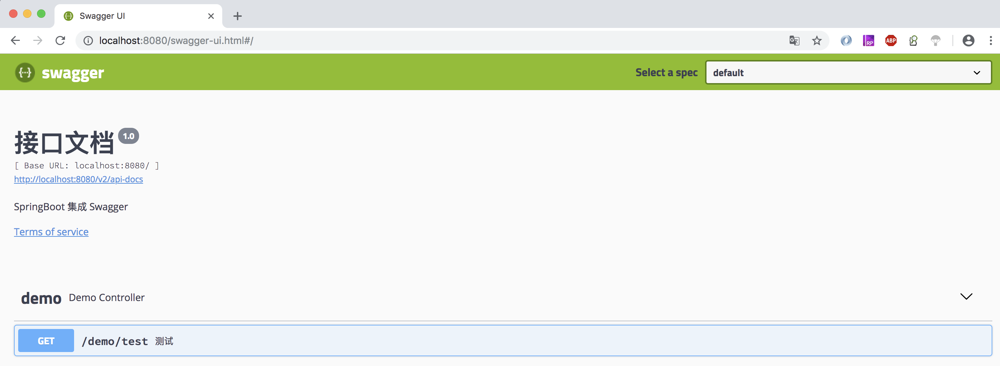

⑥ 使用 Swagger UI 测试 test 接口，点击「 Try it out 」>> 「 Execute 」
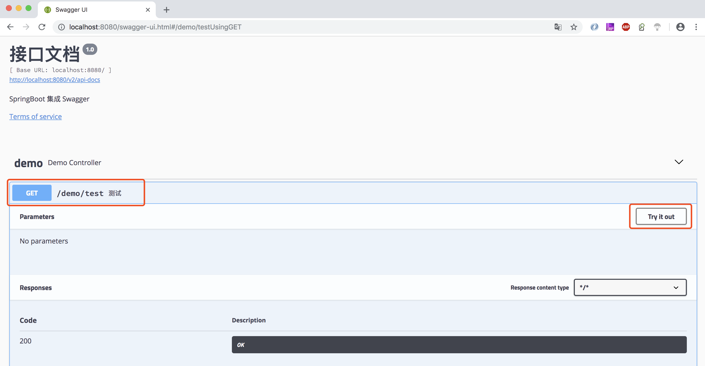
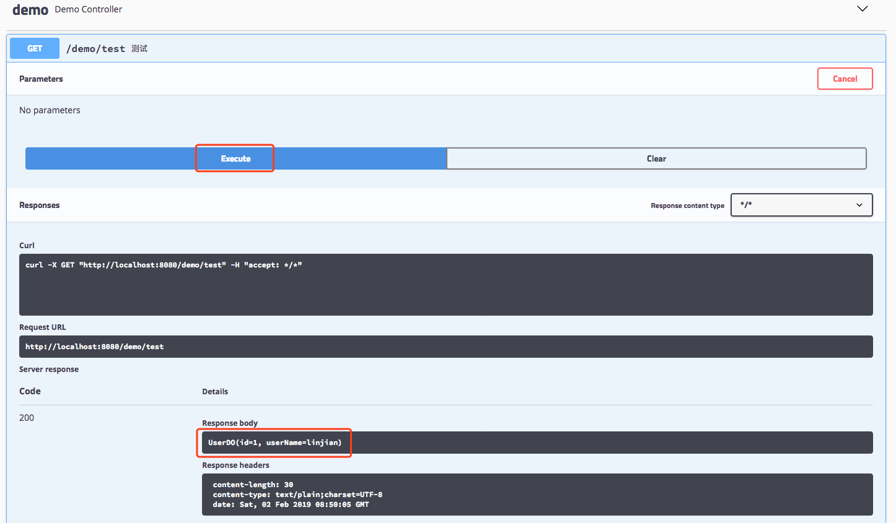

#### 2.3 Swagger 常用注解说明

| 注解              | 说明                           | 使用位置                               |
| ----------------- | ------------------------------ | -------------------------------------- |
| @Api              | 描述 controller 的作用         | 用于 controller 类上                   |
| @ApiOperation     | 描述 controller 方法的作用     | 用于 controller 方法上                 |
| @ApiParam         | 描述 controller 方法参数的作用 | 用于 controller 方法的参数上           |
| @ApiModel         | 描述对象的作用                 | 用于请求对象或者返回结果对象上         |
| @ApiModelProperty | 描述对象里字段的作用           | 用于请求对象或者返回结果对象里的字段上 |

> 注：其余注解大家可自行查阅文档

------

### 三、JavaMelody

#### 3.1 JavaMelody 介绍

JavaMelody 是用来在 QA 和实际运行生产环境中监控 Java 或 Java EE 应用程序服务器的一个开源框架。它不是一个工具来模拟来自用户的请求，而是一个测量和计算用户在实际操作中应用程序的使用情况的工具，并以图表的形式显示，图表可以按天，周，月，年或自定义时间段查看。

#### 3.2 集成 JavaMelody

① 首先在项目父 pom 文件中声明 JavaMelody 依赖

```xml
<dependency>
    <groupId>net.bull.javamelody</groupId>
    <artifactId>javamelody-spring-boot-starter</artifactId>
    <version>1.74.0</version>
</dependency>
```

② 其次在 demo-web 层中的 pom 文件中添加上述依赖

```xml
<dependencies>
    ...省略其余部分...
    <dependency>
        <groupId>net.bull.javamelody</groupId>
        <artifactId>javamelody-spring-boot-starter</artifactId>
    </dependency>
</dependencies>
```

③ 最后启动项目，访问 http://localhost:8080/monitoring 查看
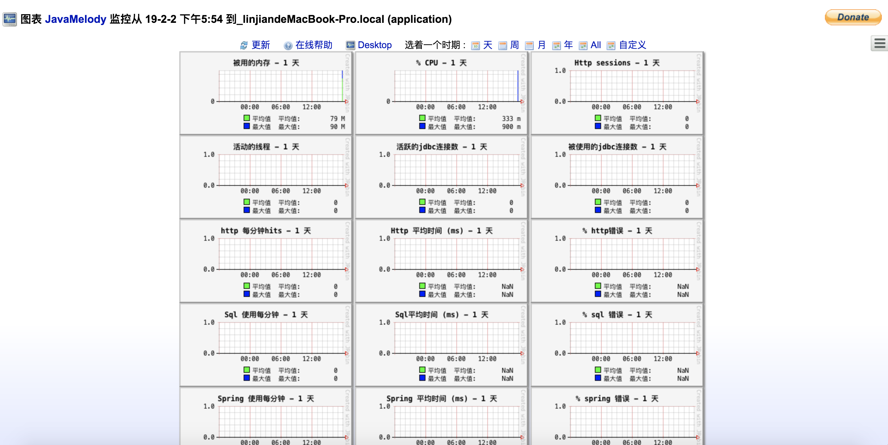
④ 为了加强安全性，修改默认访问地址以及设置为登录后才可访问，可在 application.properties 文件中添加以下配置项

```yml
javamelody.init-parameters.authorized-users = admin:pwd
javamelody.init-parameters.monitoring-path = /demo/monitoring
```

------

### 四、结语

至此，Swagger 及 JavaMelody 的集成步骤已介绍完毕。

# Spring Boot -集成 Redis

### 一、前言

上篇介绍了接口文档工具 Swagger 及项目监控工具 JavaMelody 的集成过程，使项目更加健壮。在 JAVA Web 项目某些场景中，我们需要用缓存解决如热点数据访问的性能问题，业界常用的中间件如 Memcached 、 Redis 等。相比 Memcached ，Redis 支持更丰富的数据结构。本篇将主要介绍在 Spring Boot 中集成 Redis 的过程。

------

### 二、集成 Redis

在 Spring Boot 中使用 Redis 有两种方式：

- 基于 RedisTemplate 类，该类是 Spring Data 提供的工具，可以直接注入使用。
- 基于 Jedis，Jedis 是 Redis 官方推荐的面向 JAVA 的客户端。

本文将介绍第一种使用方式。

#### 2.1 引入依赖包

其实 Spring Boot 提供的父工程中已经包含了所依赖的 Redis jar 包，我们只需在相应模块引入即可。第一篇我们已经提到过 demo-common 层是公用组件层，那么 Redis 相关的声明及配置应该在该层定义。于是乎在 demo-common 层的 pom 文件中引入 Redis 的依赖包。

```xml
<dependency>
    <groupId>org.springframework.boot</groupId>
    <artifactId>spring-boot-starter-data-redis</artifactId>
</dependency>
```

#### 2.2 RedisTemplate 的自动配置

其实我们现在就可以在项目中注入 RedisTemplate 并使用了，至于原因，首先看下「 RedisAutoConfiguration 」类的源码：

```java
@Configuration
@ConditionalOnClass({RedisOperations.class})
@EnableConfigurationProperties({RedisProperties.class})
@Import({LettuceConnectionConfiguration.class, JedisConnectionConfiguration.class})
public class RedisAutoConfiguration {
    public RedisAutoConfiguration() {
    }

    @Bean
    @ConditionalOnMissingBean(
        name = {"redisTemplate"}
    )
    public RedisTemplate<Object, Object> redisTemplate(RedisConnectionFactory redisConnectionFactory) throws UnknownHostException {
        RedisTemplate<Object, Object> template = new RedisTemplate();
        template.setConnectionFactory(redisConnectionFactory);
        return template;
    }

    @Bean
    @ConditionalOnMissingBean
    public StringRedisTemplate stringRedisTemplate(RedisConnectionFactory redisConnectionFactory) throws UnknownHostException {
        StringRedisTemplate template = new StringRedisTemplate();
        template.setConnectionFactory(redisConnectionFactory);
        return template;
    }
}
```

从源码可以看出，Spring Boot 会自动帮我们生成了一个 RedisTemplate 及一个 StringRedisTemplate ，但是这个 RedisTemplate 的泛型是 <Object, Object> ，如果我们直接使用就需要处理各种类型转换。所以为了方便使用，我们需要自定义一个泛型为 <String, Object> 的 RedisTemplate 。
而 @ConditionalOnMissingBean 注解的作用是在当前 Spring 上下文中不存在某个对象时，才会自动实例化一个 Bean 。因此我们可以自定义 RedisTemplate 从而替代默认的。

#### 2.2 自定义 Redis 配置类

Spring Data 提供了若干个 Serializer ，主要包括：

- JdkSerializationRedisSerializer — 使用 JAVA 自带的序列化机制将对象序列化为一个字符串
- OxmSerializer — 将对象序列化为 XML 字符串
- Jackson2JsonRedisSerializer — 将对象序列化为 JSON 字符串

其中 RedisTemplate 默认的序列化方式是 Jdk ，虽然是效率比较高但是序列化结果的字符串是最长的。而 JSON 由于其数据格式的紧凑型，序列化结果的字符串是最小的，即占用的内存最小。所以我们选择用 Jackson 替代默认的 Jdk 方式。

① 首先在项目父 pom 文件中定义 Jackson 的版本号且声明 Jackson 依赖。

```xml
<properties>
    ...省略其余部分...
    <jackson.version>2.9.4</jackson.version>
</properties>
<dependencyManagement>
    <dependencies>
        ...省略其余部分...
        <dependency>
            <groupId>com.fasterxml.jackson.core</groupId>
            <artifactId>jackson-databind</artifactId>
            <version>${jackson.version}</version>
        </dependency>
        <dependency>
            <groupId>com.fasterxml.jackson.datatype</groupId>
            <artifactId>jackson-datatype-jsr310</artifactId>
            <version>${jackson.version}</version>
        </dependency>
    </dependencies>
</dependencyManagement>
```

② 其次在 demo-common 层的 pom 文件中添加上述 Jackson 依赖。

```xml
<dependencies>
    ...省略其余部分...
    <dependency>
        <groupId>com.fasterxml.jackson.core</groupId>
        <artifactId>jackson-databind</artifactId>
    </dependency>
    <dependency>
        <groupId>com.fasterxml.jackson.datatype</groupId>
        <artifactId>jackson-datatype-jsr310</artifactId>
    </dependency>
</dependencies>
```

③ 最后在 demo-common 层创建 com.example.demo.common 包，添加 Redis 目录并在其中创建 RedisConfig 配置类。

```java
package com.example.demo.common.redis;

import com.fasterxml.jackson.annotation.JsonAutoDetect;
import com.fasterxml.jackson.annotation.PropertyAccessor;
import com.fasterxml.jackson.databind.ObjectMapper;
import com.fasterxml.jackson.databind.SerializationFeature;
import com.fasterxml.jackson.datatype.jsr310.JavaTimeModule;
import org.springframework.context.annotation.Bean;
import org.springframework.context.annotation.Configuration;
import org.springframework.data.redis.connection.RedisConnectionFactory;
import org.springframework.data.redis.core.RedisTemplate;
import org.springframework.data.redis.serializer.Jackson2JsonRedisSerializer;
import org.springframework.data.redis.serializer.StringRedisSerializer;

/**
 * @author linjian
 * @date 2019/3/2
 */
@Configuration
public class RedisConfig {

    @Bean
    @SuppressWarnings("all")
    public RedisTemplate<String, Object> redisTemplate(RedisConnectionFactory factory) {
        ObjectMapper objectMapper = new ObjectMapper();
        objectMapper.setVisibility(PropertyAccessor.ALL, JsonAutoDetect.Visibility.ANY);
        objectMapper.enableDefaultTyping(ObjectMapper.DefaultTyping.NON_FINAL);
        objectMapper.registerModule(new JavaTimeModule());
        objectMapper.findAndRegisterModules();
        objectMapper.configure(SerializationFeature.WRITE_DATES_AS_TIMESTAMPS, false);

        // 使用 Jackson2JsonRedisSerialize 替换默认序列化
        Jackson2JsonRedisSerializer jackson2JsonRedisSerializer = new Jackson2JsonRedisSerializer(Object.class);
        jackson2JsonRedisSerializer.setObjectMapper(objectMapper);

        StringRedisSerializer stringRedisSerializer = new StringRedisSerializer();

        RedisTemplate<String, Object> redisTemplate = new RedisTemplate<String, Object>();
        redisTemplate.setConnectionFactory(factory);
        // key 采用 String 的序列化方式
        redisTemplate.setKeySerializer(stringRedisSerializer);
        // hash 的 key 也采用 String 的序列化方式
        redisTemplate.setHashKeySerializer(stringRedisSerializer);
        // value 序列化方式采用 jackson
        redisTemplate.setValueSerializer(jackson2JsonRedisSerializer);
        // hash 的 value 序列化方式采用 jackson
        redisTemplate.setHashValueSerializer(jackson2JsonRedisSerializer);
        redisTemplate.afterPropertiesSet();
        return redisTemplate;
    }
}
```

#### 2.3 自定义 Redis 工具类

直接使用 RedisTemplate 操作 Redis 需要很多额外的代码，最好封装成一个工具类，使用时直接注入。
① 定义一个常用的缓存时间常量类

```java
package com.example.demo.common.redis;

/**
 * @author linjian
 * @date 2019/3/2
 */
public class CacheTime {

    /**
     * 缓存时效 5秒钟
     */
    public static int CACHE_EXP_FIVE_SECONDS = 5;

    /**
     * 缓存时效 1分钟
     */
    public static int CACHE_EXP_MINUTE = 60;

    /**
     * 缓存时效 5分钟
     */
    public static int CACHE_EXP_FIVE_MINUTES = 60 * 5;

    /**
     * 缓存时效 10分钟
     */
    public static int CACHE_EXP_TEN_MINUTES = 60 * 10;

    /**
     * 缓存时效 15分钟
     */
    public static int CACHE_EXP_QUARTER_MINUTES = 60 * 15;

    /**
     * 缓存时效 60分钟
     */
    public static int CACHE_EXP_HOUR = 60 * 60;

    /**
     * 缓存时效 12小时
     */
    public static int CACHE_EXP_HALF_DAY = 12 * 60 * 60;

    /**
     * 缓存时效 1天
     */
    public static int CACHE_EXP_DAY = 3600 * 24;

    /**
     * 缓存时效 1周
     */
    public static int CACHE_EXP_WEEK = 3600 * 24 * 7;

    /**
     * 缓存时效 1月
     */
    public static int CACHE_EXP_MONTH = 3600 * 24 * 30 * 7;

    /**
     * 缓存时效 永久
     */
    public static int CACHE_EXP_FOREVER = 0;
}
```

② 定义工具类

```java
package com.example.demo.common.redis;

import org.springframework.beans.factory.annotation.Autowired;
import org.springframework.data.redis.core.RedisTemplate;
import org.springframework.stereotype.Component;
import org.springframework.util.CollectionUtils;

import java.util.List;
import java.util.Map;
import java.util.Set;
import java.util.concurrent.TimeUnit;

/**
 * @author linjian
 * @date 2019/3/2
 */
@Component
public class RedisClient {

    @Autowired
    private RedisTemplate<String, Object> redisTemplate;

    /**
     * 指定缓存失效时间
     *
     * @param key  键
     * @param time 时间(秒)
     * @return
     */
    public boolean expire(String key, long time) {
        try {
            if (time > 0) {
                redisTemplate.expire(key, time, TimeUnit.SECONDS);
            }
            return true;
        } catch (Exception e) {
            e.printStackTrace();
            return false;
        }
    }

    /**
     * 根据key 获取剩余过期时间
     *
     * @param key 键 不能为null
     * @return 时间(秒) 返回0代表为永久有效
     */
    public long ttl(String key) {
        return redisTemplate.getExpire(key, TimeUnit.SECONDS);
    }

    /**
     * 判断key是否存在
     *
     * @param key 键
     * @return true 存在 false不存在
     */
    public boolean exists(String key) {
        try {
            return redisTemplate.hasKey(key);
        } catch (Exception e) {
            e.printStackTrace();
            return false;
        }
    }

    /**
     * 删除缓存
     *
     * @param key 可以传一个值 或多个
     */
    @SuppressWarnings("unchecked")
    public void del(String... key) {
        if (key != null && key.length > 0) {
            if (key.length == 1) {
                redisTemplate.delete(key[0]);
            } else {
                redisTemplate.delete(CollectionUtils.arrayToList(key));
            }
        }
    }

    /**
     * 模糊匹配批量删除
     *
     * @param pattern 匹配的前缀
     */
    public void deleteByPattern(String pattern) {
        Set<String> keys = redisTemplate.keys(pattern);
        if (!CollectionUtils.isEmpty(keys)) {
            redisTemplate.delete(keys);
        }
    }

    /**
     * 设置指定 key 的值
     *
     * @param key   键
     * @param value 值
     * @param time  时间(秒) time要大于0 如果time小于等于0 将设置无限期
     * @return true成功 false 失败
     */
    public boolean set(String key, Object value, long time) {
        try {
            if (time == CacheTime.CACHE_EXP_FOREVER) {
                redisTemplate.opsForValue().set(key, value);
            } else {
                redisTemplate.opsForValue().set(key, value, time, TimeUnit.SECONDS);
            }
            return true;
        } catch (Exception e) {
            e.printStackTrace();
            return false;
        }
    }

    /**
     * 获取指定 key 的值
     *
     * @param key 键
     * @return 值
     */
    @SuppressWarnings("unchecked")
    public <T> T get(String key) {
        return key == null ? null : (T) redisTemplate.opsForValue().get(key);
    }

    /**
     * 将 key 中储存的数字值递增
     *
     * @param key   键
     * @param delta 要增加几(大于0)
     * @return
     */
    public long incr(String key, long delta) {
        if (delta <= 0) {
            throw new IllegalArgumentException("递增因子必须大于0");
        }
        return redisTemplate.opsForValue().increment(key, delta);
    }

    /**
     * 将 key 中储存的数字值递减
     *
     * @param key   键
     * @param delta 要减少几(小于0)
     * @return
     */
    public long decr(String key, long delta) {
        if (delta <= 0) {
            throw new IllegalArgumentException("递减因子必须大于0");
        }
        return redisTemplate.opsForValue().increment(key, -delta);
    }

    /**
     * 将哈希表 key 中的字段 field 的值设为 value
     *
     * @param key   键
     * @param field 字段
     * @param value 值
     * @param time  时间(秒) 注意:如果已存在的hash表有时间,这里将会替换原有的时间
     * @return true 成功 false失败
     */
    public boolean hset(String key, String field, Object value, long time) {
        try {
            redisTemplate.opsForHash().put(key, field, value);
            if (time != CacheTime.CACHE_EXP_FOREVER) {
                expire(key, time);
            }
            return true;
        } catch (Exception e) {
            e.printStackTrace();
            return false;
        }
    }

    /**
     * 同时将多个 field-value (域-值)对设置到哈希表 key 中
     *
     * @param key  键
     * @param map  对应多个键值
     * @param time 时间(秒)
     * @return true成功 false失败
     */
    public boolean hmset(String key, Map<String, Object> map, long time) {
        try {
            redisTemplate.opsForHash().putAll(key, map);
            if (time != CacheTime.CACHE_EXP_FOREVER) {
                expire(key, time);
            }
            return true;
        } catch (Exception e) {
            e.printStackTrace();
            return false;
        }
    }

    /**
     * 删除一个或多个哈希表字段
     *
     * @param key   键
     * @param field 字段 可以多个
     */
    public void hdel(String key, Object... field) {
        redisTemplate.opsForHash().delete(key, field);
    }

    /**
     * 获取存储在哈希表中指定字段的值
     *
     * @param key   键
     * @param field 字段
     * @return 值
     */
    public <T> T hget(String key, String field) {
        return (T) redisTemplate.opsForHash().get(key, field);
    }

    /**
     * 获取在哈希表中指定 key 的所有字段和值
     *
     * @param key 键
     * @return 对应的多个键值
     */
    public Map<Object, Object> hmget(String key) {
        return redisTemplate.opsForHash().entries(key);
    }


    /**
     * 查看哈希表 key 中，指定的字段是否存在
     *
     * @param key   键
     * @param field 字段
     * @return true 存在 false不存在
     */
    public boolean hexists(String key, String field) {
        return redisTemplate.opsForHash().hasKey(key, field);
    }

    /**
     * 获取哈希表中字段的数量
     *
     * @param key 键
     * @return 字段数量
     */
    public long hlen(String key) {
        try {
            return redisTemplate.opsForHash().size(key);
        } catch (Exception e) {
            e.printStackTrace();
            return 0L;
        }
    }

    /**
     * 向集合添加一个或多个成员
     *
     * @param key    键
     * @param time   时间(秒)
     * @param values 成员 可以是多个
     * @return 成功个数
     */
    public long sadd(String key, long time, Object... values) {
        try {
            Long count = redisTemplate.opsForSet().add(key, values);
            if (time != CacheTime.CACHE_EXP_FOREVER) {
                expire(key, time);
            }
            return count;
        } catch (Exception e) {
            e.printStackTrace();
            return 0L;
        }
    }

    /**
     * 移除集合中一个或多个成员
     *
     * @param key    键
     * @param values 成员 可以是多个
     * @return 移除的个数
     */
    public long srem(String key, Object... values) {
        try {
            return redisTemplate.opsForSet().remove(key, values);
        } catch (Exception e) {
            e.printStackTrace();
            return 0L;
        }
    }

    /**
     * 返回集合中的所有成员
     *
     * @param key 键
     * @return 成员列表
     */
    public <T> Set<T> smembers(String key) {
        try {
            return (Set<T>) redisTemplate.opsForSet().members(key);
        } catch (Exception e) {
            e.printStackTrace();
            return null;
        }
    }

    /**
     * 判断 member 元素是否是集合 key 的成员
     *
     * @param key    键
     * @param member 成员
     * @return true 存在 false不存在
     */
    public boolean sismember(String key, Object member) {
        try {
            return redisTemplate.opsForSet().isMember(key, member);
        } catch (Exception e) {
            e.printStackTrace();
            return false;
        }
    }


    /**
     * 获取集合的成员数
     *
     * @param key 键
     * @return 成员数
     */
    public long slen(String key) {
        try {
            return redisTemplate.opsForSet().size(key);
        } catch (Exception e) {
            e.printStackTrace();
            return 0L;
        }
    }

    /**
     * 在列表头部添加一个值
     *
     * @param key   键
     * @param value 值
     * @param time  时间(秒)
     * @return boolean
     */
    public boolean lpush(String key, Object value, long time) {
        try {
            redisTemplate.opsForList().leftPush(key, value);
            if (time != CacheTime.CACHE_EXP_FOREVER) {
                expire(key, time);
            }
            return true;
        } catch (Exception e) {
            e.printStackTrace();
            return false;
        }
    }

    /**
     * 在列表头部添加多个值
     *
     * @param key    键
     * @param values 值
     * @param time   时间(秒)
     * @return boolean
     */
    public boolean lpush(String key, List<Object> values, long time) {
        try {
            redisTemplate.opsForList().leftPushAll(key, values);
            if (time != CacheTime.CACHE_EXP_FOREVER) {
                expire(key, time);
            }
            return true;
        } catch (Exception e) {
            e.printStackTrace();
            return false;
        }
    }

    /**
     * 在列表尾部添加一个值
     *
     * @param key   键
     * @param value 值
     * @param time  时间(秒)
     * @return boolean
     */
    public boolean rpush(String key, Object value, long time) {
        try {
            redisTemplate.opsForList().rightPush(key, value);
            if (time != CacheTime.CACHE_EXP_FOREVER) {
                expire(key, time);
            }
            return true;
        } catch (Exception e) {
            e.printStackTrace();
            return false;
        }
    }

    /**
     * 在列表尾部添加多个值
     *
     * @param key    键
     * @param values 值
     * @param time   时间(秒)
     * @return boolean
     */
    public boolean rpush(String key, List<Object> values, long time) {
        try {
            redisTemplate.opsForList().rightPushAll(key, values);
            if (time != CacheTime.CACHE_EXP_FOREVER) {
                expire(key, time);
            }
            return true;
        } catch (Exception e) {
            e.printStackTrace();
            return false;
        }
    }

    /**
     * 移除列表元素
     *
     * @param key   键
     * @param count 移除多少个
     * @param value 值
     * @return 移除的个数
     */
    public long lrem(String key, long count, Object value) {
        try {
            return redisTemplate.opsForList().remove(key, count, value);
        } catch (Exception e) {
            e.printStackTrace();
            return 0;
        }
    }

    /**
     * 通过索引设置列表元素的值
     *
     * @param key   键
     * @param index 索引
     * @param value 值
     * @return boolean
     */
    public boolean lset(String key, long index, Object value) {
        try {
            redisTemplate.opsForList().set(key, index, value);
            return true;
        } catch (Exception e) {
            e.printStackTrace();
            return false;
        }
    }

    /**
     * 获取列表指定范围内的元素
     *
     * @param key   键
     * @param start 开始
     * @param end   结束 0 到 -1代表所有值
     * @return 元素列表
     */
    @SuppressWarnings("unchecked")
    public <T> List<T> lrange(String key, long start, long end) {
        try {
            return (List<T>) redisTemplate.opsForList().range(key, start, end);
        } catch (Exception e) {
            e.printStackTrace();
            return null;
        }
    }

    /**
     * 通过索引获取列表中的元素
     *
     * @param key   键
     * @param index 索引 index>=0时， 0 表头，1 第二个元素，依次类推；index<0时，-1，表尾，-2倒数第二个元素，依次类推
     * @return
     */
    public Object lindex(String key, long index) {
        try {
            return redisTemplate.opsForList().index(key, index);
        } catch (Exception e) {
            e.printStackTrace();
            return null;
        }
    }

    /**
     * 获取列表长度
     *
     * @param key 键
     * @return 列表长度
     */
    public long llen(String key) {
        try {
            return redisTemplate.opsForList().size(key);
        } catch (Exception e) {
            e.printStackTrace();
            return 0L;
        }
    }

    /**
     * 向有序集合添加一个成员，或者更新已存在成员的分数
     *
     * @param key    键
     * @param time   时间(秒)
     * @param member 成员
     * @param score  分数
     * @return
     */
    public boolean zadd(String key, long time, Object member, double score) {
        try {
            boolean ret = redisTemplate.opsForZSet().add(key, member, score);
            if (time != CacheTime.CACHE_EXP_FOREVER) {
                expire(key, time);
            }
            return ret;
        } catch (Exception e) {
            e.printStackTrace();
            return false;
        }
    }

    /**
     * 移除有序集合中的一个或多个成员
     *
     * @param key    键
     * @param values 值 可以是多个
     * @return 移除的个数
     */
    public long zrem(String key, Object... values) {
        try {
            return redisTemplate.opsForZSet().remove(key, values);
        } catch (Exception e) {
            e.printStackTrace();
            return 0L;
        }
    }

    /**
     * 通过索引区间返回有序集合成指定区间内的成员 分数从低到高
     *
     * @param key   键
     * @param start 开始
     * @param end   结束 0 到 -1代表所有值
     * @return 成员集合
     */
    public Set<Object> zrange(String key, long start, long end) {
        try {
            return redisTemplate.opsForZSet().range(key, start, end);
        } catch (Exception e) {
            e.printStackTrace();
            return null;
        }
    }

    /**
     * 通过索引区间返回有序集合成指定区间内的成员 分数从高到低
     *
     * @param key   键
     * @param start 开始
     * @param end   结束 0 到 -1代表所有值
     * @return 成员集合
     */
    public Set<Object> zrevrange(String key, long start, long end) {
        try {
            return redisTemplate.opsForZSet().range(key, start, end);
        } catch (Exception e) {
            e.printStackTrace();
            return null;
        }
    }

    /**
     * 返回有序集合中某个成员的分数值
     *
     * @param key    键
     * @param member 成员
     * @return 分数值
     */
    public double zscore(String key, Object member) {
        try {
            return redisTemplate.opsForZSet().score(key, member);
        } catch (Exception e) {
            e.printStackTrace();
            return 0.0;
        }
    }

    /**
     * 判断有序集合中某个成员是否存在
     *
     * @param key    键
     * @param member 成员
     * @return true 存在 false不存在
     */
    public boolean zexist(String key, Object member) {
        try {
            return null != redisTemplate.opsForZSet().score(key, member);
        } catch (Exception e) {
            e.printStackTrace();
            return false;
        }
    }

    /**
     * 获取有序集合的成员数
     *
     * @param key 键
     * @return 成员数
     */
    public long zlen(String key) {
        try {
            return redisTemplate.opsForZSet().size(key);
        } catch (Exception e) {
            e.printStackTrace();
            return 0L;
        }
    }
}
```

#### 2.4 添加 Redis 常用配置项

在 application.properties 文件中的添加 Redis 相关的配置项：

```yml
# 数据库索引（默认为0）
spring.redis.database = 1
# 服务器地址
spring.redis.host = 127.0.0.1
# 服务器连接端口
spring.redis.port = 6379
# 服务器连接密码（默认为空）
spring.redis.password =
# 连接池最大阻塞等待时间（使用负值表示没有限制）
spring.redis.pool.max-wait = -1
# 连接超时时间（毫秒）
spring.redis.timeout = 3000 
# 连接池最大连接数
spring.redis.jedis.pool.max-active = 8
# 连接池中的最大空闲连接
spring.redis.jedis.pool.max-idle = 8
# 连接池中的最小空闲连接
spring.redis.jedis.pool.min-idle = 1
```

#### 2.5 Redis 缓存测试

① 首先在 DemoService 中注入 RedisClient ，修改 test 方法将 user 对象以 user:1 为键存放到 Redis 中。

> Redis 开发规范：https://yq.aliyun.com/articles/531067

```java
package com.example.demo.biz.service.impl;

import com.example.demo.biz.service.DemoService;
import com.example.demo.common.redis.CacheTime;
import com.example.demo.common.redis.RedisClient;
import com.example.demo.dao.entity.UserDO;
import com.example.demo.dao.mapper.business.UserMapper;
import org.springframework.beans.factory.annotation.Autowired;
import org.springframework.stereotype.Service;

/**
 * @author linjian
 * @date 2019/1/15
 */
@Service
public class DemoServiceImpl implements DemoService {

    @Autowired
    private UserMapper userMapper;

    @Autowired
    private RedisClient redisClient;

    @Override
    public String test() {
        UserDO user = userMapper.selectById(1);
        redisClient.set("user:1", user, CacheTime.CACHE_EXP_FIVE_MINUTES);
        return user.toString();
    }
}
```

② 之后使用 Redis Desktop Manager 客户端连接 Redis 服务器，选择数据库「 1 」，查看刚存放的缓存。
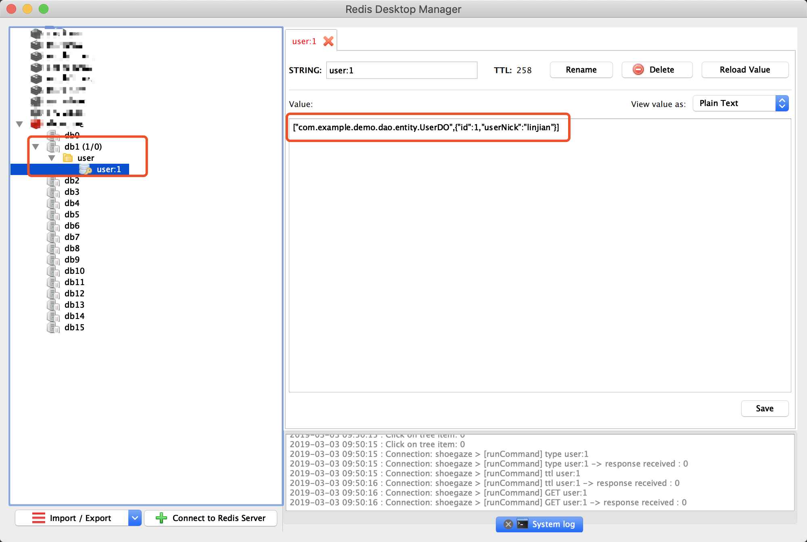

------

### 三、结语

至此 Spring Boot 集成 Redis 的具体步骤介绍完毕，我们自定义了 Redis 的序列化方式，并通过一个简单的例子测试了 Redis 的可用性，相关代码已同步至 GitHub 。

# Spring Boot -集成 Dubbo

### 一、前言

上篇介绍了 Redis 的集成过程，可用于解决热点数据访问的性能问题。随着业务复杂度的提高，单体应用越来越庞大，就好比一个类的代码行数越来越多，分而治之，切成多个类应该是更好的解决方法，所以一个庞大的单体应用分出多个小应用也更符合这种分治的思想。于是乎微服务化的概念油然而生，微服务化的第一步就是选择适用的分布式服务框架，基于团队成员有使用过「 Dubbo 」的经验，我们放弃了完全陌生的「 Spring Cloud 」。本篇将主要介绍在 Spring Boot 中集成 Dubbo 的过程。

------

### 二、集成 Dubbo

#### 2.1 引入 Dubbo 依赖包

① 首先在项目父 pom 文件中声明 Dubbo 依赖。

```xml
<dependencyManagement>
    <dependencies>
    	...省略其余部分...
        <dependency>
            <groupId>com.alibaba.boot</groupId>
            <artifactId>dubbo-spring-boot-starter</artifactId>
            <version>0.2.0</version>
        </dependency>
    </dependencies>
</dependencyManagement>
```

② 其次在 demo-biz 层中的 pom 文件添加上述 Dubbo 依赖。

```xml
<dependencies>
    ...省略其余部分...
    <dependency>
        <groupId>com.alibaba.boot</groupId>
        <artifactId>dubbo-spring-boot-starter</artifactId>
    </dependency>
</dependencies>
```

#### 2.2 添加 Dubbo 常用配置项

在 application.properties 文件中的添加 Dubbo 相关的配置项：

```yml
# 当前应用名称，用于注册中心计算应用间依赖关系
dubbo.application.name = demo
# 组织名称，用于注册中心区分服务来源
dubbo.application.organization = example
# 应用负责人，用于服务治理
dubbo.application.owner = linjian
# 注册中心地址协议
dubbo.registry.protocol = zookeeper
# 注册中心服务器地址
dubbo.registry.address = 127.0.0.1:2181
# 协议名称
dubbo.protocol.name = dubbo
# 服务端口
dubbo.protocol.port = 20880
# 服务版本
dubbo.provider.version = 1.0.0.dev
# 远程服务调用超时时间(毫秒)
dubbo.provider.timeout = 60000
# 启动时检查提供者是否存在
dubbo.consumer.check = false
```

> 注：详细配置见 [官方配置参考手册](http://dubbo.apache.org/zh-cn/docs/user/references/xml/introduction.html)

------

### 三、接口服务化

#### 3.1 Dubbo 接口编程规约

- Dubbo 接口类以 Rpc 为前缀命名并剥离出一个单独的模块，称之为远程服务层
- 请求参数类以 Param 为后缀命名并统一存放于「 param 」目录
- 返回结果类以 DTO 为后缀命名并统一存放于「 result 」目录

```
还有一条重要规则下篇「统一接口返回值」再说明
```

#### 3.2 创建远程服务层

① 首先按照该篇博客 [Spring Boot 项目实战（一）Maven 多模块项目搭建](https://symonlin.github.io/2019/01/15/springboot-1/) 中的「4.2 创建子模块」一节添加「 demo-remote 」子模块。
② 其次在项目父 pom 文件的 dependencyManagement 标签中声明 demo-remote 子模块的依赖。

```xml
<dependency>
    <groupId>com.example.demo</groupId>
    <artifactId>demo-remote</artifactId>
    <version>${demo.version}</version>
</dependency>
```

③ 然后在 demo-biz 层中的 pom 文件中添加 demo-remote 依赖。

```xml
<dependencies>
    ...省略其余部分...
    <dependency>
        <groupId>com.example.demo</groupId>
        <artifactId>demo-remote</artifactId>
    </dependency>
</dependencies>
```

由于 demo-remote 层最终是要打成一个 JAR 包供外部引入，而其接口的内部实现还是需要写在 demo-biz 层，所以我们将这两个模块之间建立了依赖关系，并在 demo-biz 层 com.example.demo.biz.service.impl 包中，新建 remote 目录存放 demo-remote 层远程服务接口的具体实现。
④ 在 DemoWebApplication 入口类中增加 Dubbo 接口实现类包扫描，设置 @DubboComponentScan 注解中的 basePackages 值为 com.example.demo.biz.service.impl.remote

```java
@DubboComponentScan(basePackages = "com.example.demo.biz.service.impl.remote")
```

#### 3.3 简易 Dubbo 接口测试

配置完模块间的依赖关系后，我们通过一个简易的 Dubbo 接口测试是否可用。
① 首先在 demo-remote 层的 pom 文件中添加必要的 lombok 依赖

```xml
<dependencies>
    <dependency>
        <groupId>org.projectlombok</groupId>
        <artifactId>lombok</artifactId>
    </dependency>
</dependencies>
```

① 其次在该层创建 com.example.demo.remote 包，添加 param 目录并在其中创建 DemoParam 请求参数类，添加 result 目录并在其中创建 DemoDTO 返回结果类，添加 service 目录并在其中创建 RpcDemoService 接口类。

```java
package com.example.demo.remote.model.param;

import lombok.Data;

import java.io.Serializable;

/**
 * @author linjian
 * @date 2019/3/15
 */
@Data
public class DemoParam implements Serializable {

    private Integer id;
}
package com.example.demo.remote.model.result;

import lombok.Data;

import java.io.Serializable;

/**
 * @author linjian
 * @date 2019/3/15
 */
@Data
public class DemoDTO implements Serializable {

    private Integer id;

    private String name;
}
package com.example.demo.remote.service;

import com.example.demo.remote.model.param.DemoParam;
import com.example.demo.remote.model.result.DemoDTO;

/**
 * @author linjian
 * @date 2019/3/15
 */
public interface RpcDemoService {

    /**
     * Dubbo 接口测试
     *
     * @param param DemoParam
     * @return DemoDTO
     */
    DemoDTO test(DemoParam param);
}
```

② 在 demo-biz 层 com.example.demo.biz.service.impl.remote 包中新建 RpcDemoServiceImpl 接口实现类。

```java
package com.example.demo.biz.service.impl.remote;

import com.alibaba.dubbo.config.annotation.Service;
import com.example.demo.biz.service.DemoService;
import com.example.demo.remote.model.param.DemoParam;
import com.example.demo.remote.model.result.DemoDTO;
import com.example.demo.remote.service.RpcDemoService;
import org.springframework.beans.factory.annotation.Autowired;

/**
 * @author linjian
 * @date 2019/3/15
 */
@Service
public class RpcDemoServiceImpl implements RpcDemoService {

    @Autowired
    private DemoService demoService;

    @Override
    public DemoDTO test(DemoParam param) {
        DemoDTO demo = new DemoDTO();
        demo.setId(1);
        demo.setName(demoService.test());
        return demo;
    }
}
```

③ 运行 DemoWebApplication 启动类的 main 方法，查看控制台打印日志可以得到如下结果：
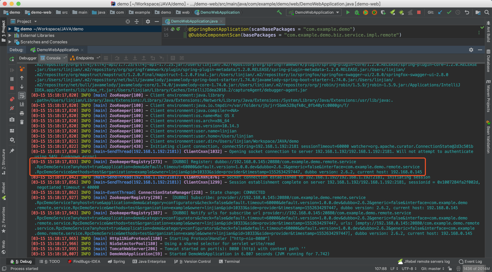
`从上图可以看出服务已经注册成功`

④ 同时通过 Dubbo Admin 管理控制台也可以看到刚注册的服务：
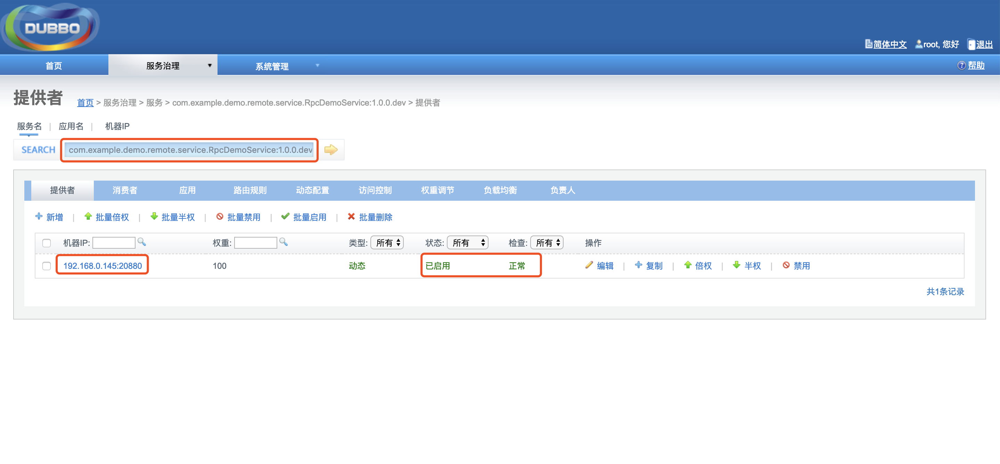

#### 3.4 暴露远程服务

① 在 demo-remote 层的 pom 文件中添加 distributionManagement 标签并在其中配置 Nexus 私服的 snapshot 快照库及 release 发布库。

```xml
<distributionManagement>
    <repository>
        <id>yibao-releases</id>
        <url>http://127.0.0.1:8081/nexus/content/repositories/releases/</url>
    </repository>
    <snapshotRepository>
        <id>yibao-snapshots</id>
        <url>http://127.0.0.1:8081/nexus/content/repositories/snapshots/</url>
    </snapshotRepository>
</distributionManagement>
```

② cd 到 demo-remote 目录，执行 mvn deploy 命令打包，完成后可在 Nexus 私服看到刚打的依赖包。
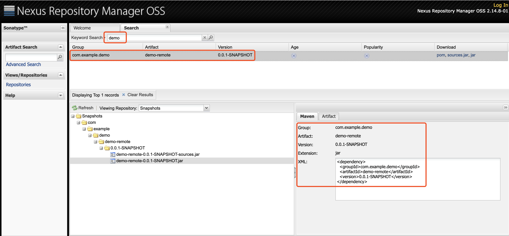
③ 搭建一个测试项目并引入 demo-remote 依赖包，新建 TestController 类测试 Dubbo 接口。

> 注：该测试项目也需集成 Dubbo

```java
package com.example.dawn.web.controller;

import com.alibaba.dubbo.config.annotation.Reference;
import com.example.demo.remote.model.param.DemoParam;
import com.example.demo.remote.model.result.DemoDTO;
import com.example.demo.remote.service.RpcDemoService;
import com.yibao.dawn.web.annotation.LoginIgnore;
import org.springframework.web.bind.annotation.GetMapping;
import org.springframework.web.bind.annotation.RequestMapping;
import org.springframework.web.bind.annotation.RestController;

/**
 * @author linjian
 * @date 2019/3/7
 */
@RestController
@RequestMapping("test")
public class TestController {

    @Reference(version = "1.0.0.dev")
    private RpcDemoService rpcDemoService;

    @GetMapping("dubbo")
    public DemoDTO test() {
        DemoParam param = new DemoParam();
        param.setId(1);
        return rpcDemoService.test(param);
    }
}
```

③ 启动测试项目，观察 Dubbo Admin 管理控制台消费者一栏，可以看到测试项目已经作为一个消费者调用 RpcDemoService 接口类。
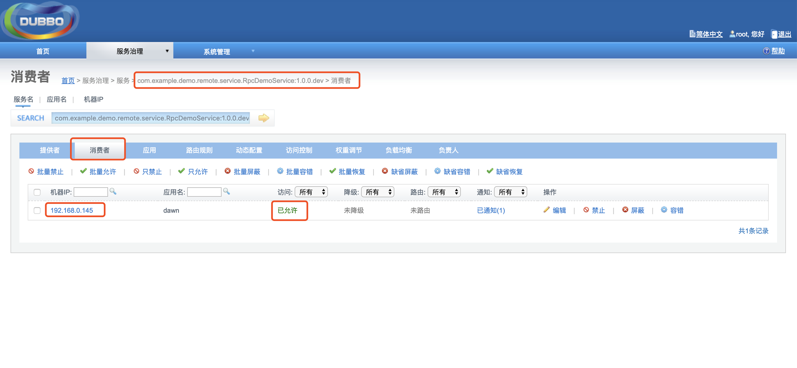
④ 访问 http://localhost:8079/test/dubbo 查看接口返回结果。
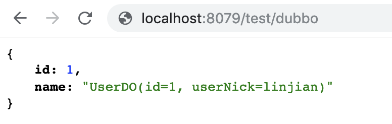

------

### 四、结语

至此 Spring Boot 集成 Dubbo 的过程介绍完毕，我们通过一个简易的 Dubbo 接口测试其可用性，下篇我们将介绍 HTTP 接口及 Dubbo 接口的一个重要编程规约 — `统一返回值`

> 注：相关代码已同步至 GitHub

# Spring Boot -集成 Apollo

### 一、前言

上篇介绍了 Spring Boot 集成 Dubbo，使我们的系统打下了分布式的基础。随着程序功能的日益复杂，程序的配置日益增多：各种功能开关、参数配置、服务器地址等；对程序配置的期望值也越来越高：配置修改后实时生效，灰度发布，分环境、分集群管理配置，完善的权限、审核机制等；在这样的大环境下，传统的通过配置文件、数据库等方式已经越来越无法满足开发人员对配置管理的需求。分布式配置中心应运而生。本篇将主要介绍分布式配置中心 Apollo 的集成过程。

------

### 二、部署 Apollo

① 部署教程见官方文档：https://github.com/ctripcorp/apollo/wiki/分布式部署指南

② 架构剖析：https://mp.weixin.qq.com/s/-hUaQPzfsl9Lm3IqQW3VDQ
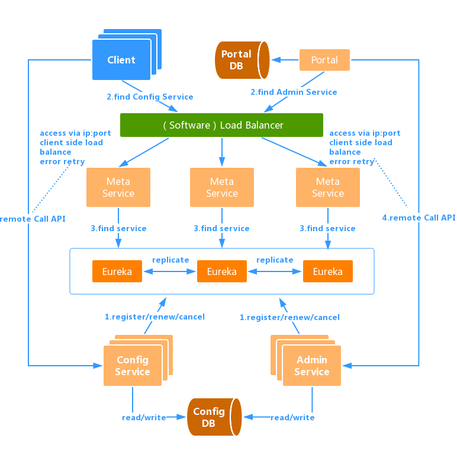

------

### 三、使用 Apollo

① 登录 Apollo 管理控制台后创建项目，其中应用 ID 全局唯一。
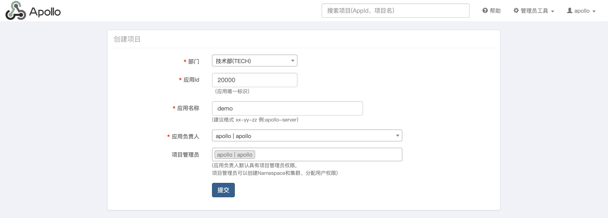
② 创建成功后跳转到项目维护界面，左侧上方为环境列表，中间区域为项目信息，下方可操作集群及 namespace 。右侧为默认 namespace ：**application** ，具体配置项在此区域维护。
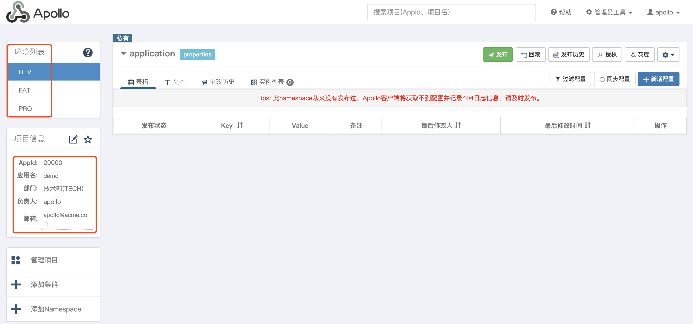

------

### 四、Spring Boot 集成 Apollo

#### 4.1 引入 Apollo 依赖包

① 首先在项目父 pom 文件中声明 Apollo 依赖。

```xml
<dependencyManagement>
    <dependencies>
    	...省略其余部分...
        <dependency>
            <groupId>com.ctrip.framework.apollo</groupId>
            <artifactId>apollo-client</artifactId>
            <version>1.2.0</version>
        </dependency>
    </dependencies>
</dependencyManagement>
```

② 其次在 demo-biz 层中的 pom 文件添加上述 Apollo 依赖。

```xml
<dependencies>
    ...省略其余部分...
    <dependency>
        <groupId>com.ctrip.framework.apollo</groupId>
        <artifactId>apollo-client</artifactId>
    </dependency>
</dependencies>
```

#### 4.2 添加 Apollo 配置项

① 在 application.properties 文件中的添加 Apollo 相关的配置项：

```yml
# 应用全局唯一的身份标识
app.id = 20000
# Apollo Meta Server 地址
apollo.meta = http://xxx.xxx.xxx.xxx:7881
# 自定义本地配置文件缓存路径
apollo.cacheDir = ./config
# 设置在应用启动阶段就加载 Apollo 配置
apollo.bootstrap.enabled = true
# 注入 application namespace
apollo.bootstrap.namespaces = application
```

② 将 application.properties 文件中的除了 Apollo 及 Logback 的其他配置项都转移到 Apollo 控制台中维护。
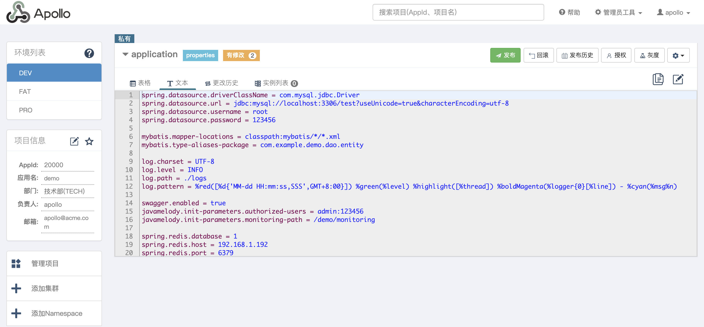

#### 4.3 验证 Apollo

① 启动日志中可以看到 Apollo 从 Meta Server 拉取配置项，并缓存到本地 config 目录。
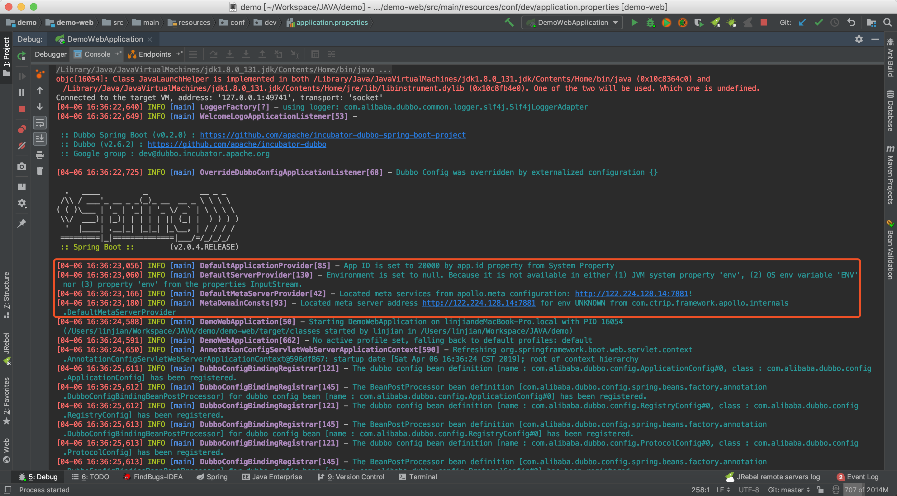
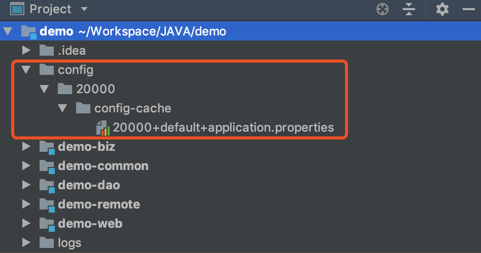
② 访问 http://localhost:8080/demo/test?id=1 接口正常返回。

#### 4.4 托管 Logback 配置项

① Apollo 1.2.0 版本后支持托管日志相关配置项，只需要在 application.properties 文件中增加以下 Apollo 配置项。

```yml
# 将 Apollo 配置加载提到初始化日志系统之前，需要托管日志配置时开启
apollo.bootstrap.eagerLoad.enabled = true
```

② 将 Logback 配置项转移到 Apollo 控制台中维护。

#### 4.5 本地开发模式

某些情况下比如 Dubbo 接口本地联调，需要修改依赖方的接口版本，此时可以开启本地开发模式，在本地开发模式下，Apollo 只会从本地文件读取配置信息，不会从 Apollo 服务器读取配置。通过**设置 JVM 参数**开启。
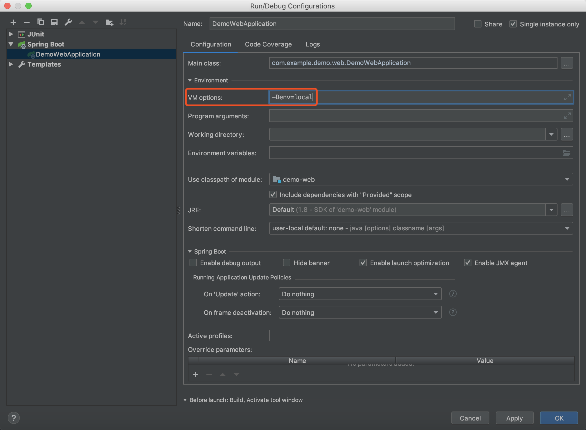

#### 4.6 Dubbo 及 Apollo 的兼容问题

官方在集成 Dubbo 及 Apollo 时提供了两种方式：

- ① 纯 Spring Boot 方式；即依赖 dubbo-spring-boot-starter 包。
- ② 原生 Dubbo 方式；即依赖 dubbo 、zookeeper 、 zkclient 、curator-framework 包，然后通过 XML 方式配置，配置项用 ${} 占位符。

而我当时为了能清楚知道，对外提供了哪些 Dubbo 接口以及依赖了哪些外部 Dubbo 接口，使用 Spring XML 的形式配置 Dubbo，同时又依赖了 dubbo-spring-boot-starter 包，结果将 Dubbo 配置项托管至 Apollo 后，出现无法找到 Dubbo 配置项的情况。原因是**通过 Spring XML 方式配置 Dubbo 时所依赖的 OverrideDubboConfigApplicationListener 执行时机太早了（远早于 Apollo 配置加载的时机）**。Apollo 1.2.0 版本支持「 apollo.bootstrap.eagerLoad.enabled 」配置项后虽然能解决这个问题，但还是不推荐 dubbo-spring-boot-starter + XML 这种形式的配置方式，推荐纯 Spring Boot 方式。

> 注：详见 https://github.com/ctripcorp/apollo/issues/1600

------

### 五、结语

至此 Spring Boot 集成 Apollo 的过程介绍完毕，相关代码已同步至 GitHub 。

# SpringBoot整合H2内存数据库

```
一般我们在测试的时候习惯于使用内存内存数据库，这里我们整合h2数据库。
```

### 第一步：添加必要的jar包

```xml
<dependency>
    <groupId>com.h2database</groupId>
    <artifactId>h2</artifactId>
    <scope>runtime</scope>
</dependency>
<dependency>
    <groupId>org.springframework.boot</groupId>
    <artifactId>spring-boot-starter-data-jpa</artifactId>
</dependency>
还可以添加一些额外的工具jar包
<dependency>
    <groupId>org.springframework.boot</groupId>
    <artifactId>spring-boot-devtools</artifactId>
    <optional>true</optional>
</dependency>
前者是必备jar包，后者是辅助jar包，用于查看内存数据库。
```

### 第二步：添加必要的配置

```properties
#h2配置
spring.jpa.show-sql = true #启用SQL语句的日志记录
spring.jpa.hibernate.ddl-auto = update  #设置ddl模式
##数据库连接设置
spring.datasource.url = jdbc:h2:mem:dbtest  #配置h2数据库的连接地址
spring.datasource.username = sa  #配置数据库用户名
spring.datasource.password = sa  #配置数据库密码
spring.datasource.driverClassName =org.h2.Driver  #配置JDBC Driver
##数据初始化设置
spring.datasource.schema=classpath:db/schema.sql  #进行该配置后，每次启动程序，程序都会运行resources/db/schema.sql文件，对数据库的结构进行操作。
spring.datasource.data=classpath:db/data.sql  #进行该配置后，每次启动程序，程序都会运行resources/db/data.sql文件，对数据库的数据操作。
##h2 web console设置
spring.datasource.platform=h2  #表明使用的数据库平台是h2
spring.h2.console.settings.web-allow-others=true  # 进行该配置后，h2 web consloe就可以在远程访问了。否则只能在本机访问。
spring.h2.console.path=/h2  #进行该配置，你就可以通过YOUR_URL/h2访问h2 web consloe。YOUR_URL是你程序的访问URl。
spring.h2.console.enabled=true  #进行该配置，程序开启时就会启动h2 web consloe。当然这是默认的，如果你不想在启动程序时启动h2 web consloe，那么就设置为false。
```

### 第三步：添加数据库结构与数据脚本

resources/db/schema.sql

```sql
create table if not exists USER (
USE_ID int not null primary key auto_increment,
USE_NAME varchar(100),
USE_SEX varchar(1),
USE_AGE NUMBER(3),
USE_ID_NO VARCHAR(18),
USE_PHONE_NUM VARCHAR(11),
USE_EMAIL VARCHAR(100),
CREATE_TIME DATE,
MODIFY_TIME DATE,
USE_STATE VARCHAR(1));
```

resourses/db/data.sql

```sql
INSERT INTO USER (USE_ID,USE_NAME,USE_SEX,USE_AGE,USE_ID_NO,USE_PHONE_NUM,USE_EMAIL,CREATE_TIME,MODIFY_TIME,USE_STATE) VALUES(
1,'赵一','0',20,'142323198610051234','12345678910','qe259@163.com',sysdate,sysdate,'0');
INSERT INTO USER (USE_ID,USE_NAME,USE_SEX,USE_AGE,USE_ID_NO,USE_PHONE_NUM,USE_EMAIL,CREATE_TIME,MODIFY_TIME,USE_STATE) VALUES(
2,'钱二','0',22,'142323198610051235','12345678911','qe259@164.com',sysdate,sysdate,'0');
INSERT INTO USER (USE_ID,USE_NAME,USE_SEX,USE_AGE,USE_ID_NO,USE_PHONE_NUM,USE_EMAIL,CREATE_TIME,MODIFY_TIME,USE_STATE) VALUES(
3,'孙三','1',24,'142323198610051236','12345678912','qe259@165.com',sysdate,sysdate,'0');
```

### 第四步：查看h2-console

浏览器输入：

```txt
http://localhost:8080/h2
```

可以打开h2数据库管理器登录界面：
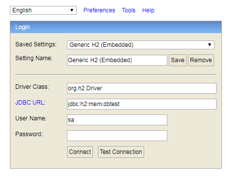
输入配置的数据库信息，点击登录，即可打开操作界面：
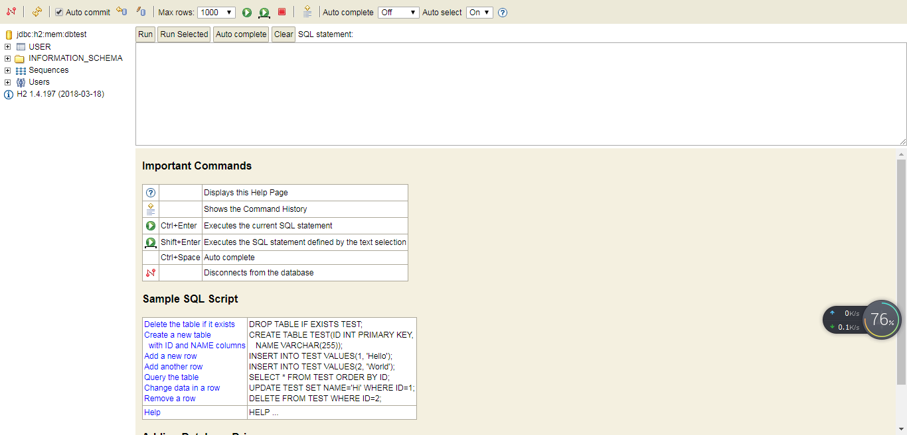

# SpringBoot整合JPA进行数据库开发

## 步骤

### 第一步：添加必要的jar包

```xml
<dependency>
    <groupId>org.springframework.boot</groupId>
    <artifactId>spring-boot-starter-data-jpa</artifactId>
</dependency>
<dependency>
  <groupId>com.querydsl</groupId>
  <artifactId>querydsl-apt</artifactId>
  <version>${querydsl.version}</version>
  <scope>provided</scope>
</dependency>
<dependency>
  <groupId>com.querydsl</groupId>
  <artifactId>querydsl-jpa</artifactId>
  <version>${querydsl.version}</version>
</dependency>
```

### 第二步：添加必要的配置

```properties
spring.datasource.url = jdbc\:h2\:file\:D\:\\testdb;DB_CLOSE_ON_EXIT=FALSE
spring.datasource.username = sa
spring.datasource.password = sa
spring.datasource.driverClassName =org.h2.Driver
```

### 第三步：添加实体，并添加注解

```java
@Entity  
@Table(name = "USER")
public class User {  
     @Id 
     @GeneratedValue(strategy = GenerationType.IDENTITY) 
     private int useId;
     @Column 
     private String useName; 
     @Column 
     private UseSex useSex; 
     @Column 
     private int useAge; 
     @Column(unique = true)
     private String useIdNo; 
     @Column(unique = true)
     private String usePhoneNum; 
     @Column(unique = true)
     private String useEmail; 
     @Column 
     private LocalDateTime createTime; 
     @Column 
     private LocalDateTime modifyTime;
     @Column 
     private UseState useState;
 }
```

### 第四步：添加持久层

```java
@Repository  
public interface UserRepository extends JpaRepository {  
}
```

> 注意：
> 继承自JpaRepository的持久层可以直接使用其定义好的CRUD操作，其实只有增删查操作，关于修改的操作还是需要自定义的。

### 第五步：持久层的使用

```java
@Service  
public class UserService {  
     @Autowired 
     private UserRepository repository; 
     public ResponseEntity addUser(final User user) { 
         return new ResponseEntity<>(repository.save(user),HttpStatus.OK); 
     }
}
```

> 注意：其实在JpaRepository中已经定义了许多方法用于执行实体的增删查操作。

## JPA高级功能

### 方法名匹配

在UserRepository中定义按照规则命名的方法，JPA可以将其自动转换为SQL，而免去手动编写的烦恼，比如定义如下方法：

```java
User getUserByUseIdNo(String useIdNo);
```

JPA会自动将其转换为如下的SQL：

```sql
select * from USER where use_id_no = ?
```

下面简单罗列方法命名规则：

| 关键字            | 例子                     | sql                                      |
| ----------------- | ------------------------ | ---------------------------------------- |
| And               | findByNameAndAge         | ...where x.name=?1 and x.age=?2          |
| Or                | findByNameOrAge          | ...where x.name=?1 or x.age=?2           |
| Between           | findByCreateTimeBetween  | ...where x.create_time between ?1 and ?2 |
| LessThan          | findByAgeLessThan        | ...where x.age < ?1                      |
| GreaterThan       | findByAgeGreaterThan     | ...where x.age > ?1                      |
| IsNull            | findByAgeIsNull          | ...where x.age is null                   |
| IsNotNull,NotNull | findByAgeIsNotNull       | ...where x.age not null                  |
| Like              | findByNameLike           | ...where x.name like ?1                  |
| NotLike           | findByNameNotLike        | ...where x.name not like ?1              |
| OrderBy           | findByAgeOrderByNameDesc | ...where x.age =?1 order by x.name desc  |
| Not               | findByNameNot            | ...where x.name <>?1                     |
| In                | findByAgeIn              | ...where x.age in ?1                     |
| NotIn             | findByAgeNotIn           | ...where x.age not in ?1                 |

### @Query注解

使用@Query注解在接口方法之上自定义执行SQL。

```java
@Modifying
@Query(value = "update USER set USE_PHONE_NUM = :num WHERE USE_ID= :useId", nativeQuery = true)
void updateUsePhoneNum(@Param(value = "num") String num, @Param(value = "useId") int useId);
```

上面的更新语句必须加上@Modifying注解，其实在JpaRepository中并未定义更新的方法，所有的更新操作均需要我们自己来定义，一般采用上面的方式来完成。

```java
/**
 * 表示一个查询方法是修改查询，这会改变执行的方式。只在@Query注解标注的方法或者派生的方法上添加这个注解，而不能
 * 用于默认实现的方法，因为这个注解会修改执行方式，而默认的方法已经绑定了底层的APi。
 */
@Retention(RetentionPolicy.RUNTIME)
@Target({ ElementType.METHOD, ElementType.ANNOTATION_TYPE })
@Documented
public @interface Modifying {
	boolean flushAutomatically() default false;
	boolean clearAutomatically() default false;
}
```

### JPQL(SQL拼接)

使用JPQL需要在持久层接口的实现列中完成，即UserRepositoryImpl，这个类是UserRepository的实现类，我们在其中定义JPQL来完成复杂的SQL查询，包括动态查询，连表查询等高级功能。

### QBE(QueryByExampleExecutor)

使用QBE来进行持久层开发，需要用到两个接口类，Example和ExampleMatcher，开发方式如下：

```java
List users = repository.findAll(Example.of(user));
```

或者配合ExampleMarcher使用：

```java
ExampleMatcher matcher = ExampleMatcher.matching().withIgnoreCase();
List users = repository.findAll(Example.of(user, matcher));
```

以上逻辑一般位于service之中。其中user模型中保存着查询的条件值，null的字段不是条件，只有设置了值的字段才是条件。ExampleMatcher是用来自定义字段匹配模式的。

### 处理枚举

 使用Spring-Data-Jpa时，针对枚举的处理有两种方式，对应于EnumType枚举的两个值：

```java
public enum EnumType {
    /** Persist enumerated type property or field as an integer. */
    ORDINAL,
    /** Persist enumerated type property or field as a string. */
    STRING
}
```

 其中ORDINAL表示的是默认的情况，这种情况下将会将枚举值在当前枚举定义的序号保存到数据库，这个需要是从0开始计算的，正对应枚举值定义的顺序。STRING表示将枚举的名称保存到数据库中。

 前者用于保存序号，这对枚举的变更要求较多，我们不能随便删除枚举值，不能随意更改枚举值的位置，而且必须以0开头，而这一般又与我们定义的业务序号不一致，限制较多，一旦发生改变，极可能造成业务混乱；后者较为稳妥。

 正常情况下，如果不在枚举字段上添加@Enumerated注解的话，默认就以ORDINAL模式存储，若要以STRING模式存储，请在枚举字段上添加如下注解：

```java
@Enumerated(EnumType.STRING)
@Column(nullable=false) // 一般要加上非null约束
private UseState useState;
```

### 分页功能

 Spring-Data-Jpa中实现分页使用到了Pageable接口，这个接口将作为一个参数参与查询。

 Pageable有一个抽象实现类AbstractPageRequest，是Pageable的抽象实现，而这个抽象类有两个实现子类：PageRequest和QPageRequest，前者现已弃用，现在我们使用QPageRequest来定义分页参数，其有三个构造器：

```java
public QPageRequest(int page, int size) {
    this(page, size, QSort.unsorted());
}
public QPageRequest(int page, int size, OrderSpecifier<?>... orderSpecifiers) {
    this(page, size, new QSort(orderSpecifiers));
}
public QPageRequest(int page, int size, QSort sort) {
    super(page, size);
    this.sort = sort;
}
```

 在这里面我们可以看到一个QSort，这个QSort是专门用于与QPageRequest相配合使用的类，用于定义排序规则。默认情况下采用的是无排序的模式，即上面第一个构造器中的描述。

 要构造一个QSort需要借助`querydsl`来完成，其中需要OrderSpecifier来完成。

 这里有个简单的用老版本实现的分页查询：

```java
    public ResponseEntity<Page<User>> getUserPage(final int pageId) {
        Sort sort = new Sort(new Sort.Order(Sort.Direction.DESC, "useId"));
        Page<User> users = repository.findAll(new PageRequest(pageId,2, sort));
        return new ResponseEntity<>(users, HttpStatus.OK);
    }
```

 至于新版本的分页查询和排序涉及内容较多较复杂，稍后再看。

> 注意：分页首页页码为0

# SpringBoot整合Mybatis

## 步骤

### 第一步：添加必要的jar包

```xml
<dependency>
    <groupId>org.mybatis.spring.boot</groupId>
    <artifactId>mybatis-spring-boot-starter</artifactId>
    <version>1.3.1</version>
</dependency>
```

### 第二步：添加必要的配置

application.properties

```properties
##配置数据源
spring.datasource.url = jdbc:h2:mem:dbtest
spring.datasource.username = sa
spring.datasource.password = sa
spring.datasource.driverClassName =org.h2.Driver
```

### 第三步：添加配置类

```java
// 该配置类用于配置自动扫描器，用于扫描自定义的mapper接口,MyBatis会针对这些接口生成代理来调用对应的XMl中的SQL
@Configuration
@MapperScan("com.example.springbootdemo.mapper")
public class MyBatisConfig {
}
```

> 这个注解必须手动配置是因为mapper接口的位置完全就是用户自定义的，自动配置的时候也不可能找到还不存在的位置。

### 第四步：定义实体类型

```java
@Data
@NoArgsConstructor
@AllArgsConstructor
@ToString
@EqualsAndHashCode
@Builder
@ApiModel("书籍模型")
public class Book {
    @ApiModelProperty(value = "书籍ID", notes = "书籍ID",example = "1")
    private Integer bookId;
    @ApiModelProperty(value = "书籍页数", notes = "书籍页数",example = "100")
    private Integer pageNum;
    @ApiModelProperty(value = "书籍名称", notes = "书籍名称",example = "Java编程思想")
    private String bookName;
    @ApiModelProperty(value = "书籍类型", notes = "书籍类型",hidden = false)
    private BookType BookType;
    @ApiModelProperty(value = "书籍简介")
    private String bookDesc;
    @ApiModelProperty(value = "书籍价格")
    private Double bookPrice;
    @ApiModelProperty(value = "创建时间",hidden = true)
    private LocalDateTime createTime;
    @ApiModelProperty(value = "修改时间",hidden = true)
    private LocalDateTime modifyTime;
}
```

还有一个枚举类型

```java
public enum BookType {
    TECHNOLOGY,//技术
    LITERARY,//文学
    HISTORY//历史
    ;
}
```

> 实体类中使用了swagger2和Lombok中的注解，需要添加对应的jar包

### 第五步：定义mapper接口

```java
public interface BookRepository {
    int addBook(Book book);
    int updateBook(Book book);
    int deleteBook(int id);
    Book getBook(int id);
    List<Book> getBooks(Book book);
}
```

### 第六步：定义mapper配置

```xml
<!DOCTYPE mapper PUBLIC "-//mybatis.org//DTD Mapper 3.0//EN" "http://mybatis.org/dtd/mybatis-3-mapper.dtd">
<mapper namespace="com.example.springbootdemo.mapper.BookRepository">
    <insert id="addBook" parameterType="Book">
        INSERT INTO BOOK(
        <if test="pageNum != null">
            PAGE_NUM,
        </if>
        <if test="bookType != null">
            BOOK_TYPE,
        </if>
        <if test="bookName != null">
            BOOK_NAME,
        </if>
        <if test="bookDesc != null">
            BOOK_DESC,
        </if>
        <if test="bookPrice != null">
            BOOK_PRICE,
        </if>
            CREATE_TIME,
            MODIFY_TIME)
        VALUES (
        <if test="pageNum != null">
            #{pageNum},
        </if>
        <if test="bookType != null">
            #{bookType},
        </if>
        <if test="bookName != null">
            #{bookName},
        </if>
        <if test="bookDesc != null">
            #{bookDesc},
        </if>
        <if test="bookPrice != null">
            #{bookPrice},
        </if>
        sysdate,sysdate)
	</insert>
    <update id="updateBook" parameterType="Book">
		UPDATE BOOK SET
		<if test="pageNum != null">
            PAGE_NUM = #{pageNum},
        </if>
        <if test="bookType != null">
            BOOK_TYPE = #{bookType},
        </if>
        <if test="bookDesc != null">
            BOOK_DESC = #{bookDesc},
        </if>
        <if test="bookPrice != null">
            BOOK_PRICE = #{bookPrice},
        </if>
        <if test="bookName != null">
            BOOK_NAME = #{bookName},
        </if>
        MODIFY_TIME=sysdate
        WHERE 1=1
        <if test="bookId != null">
            and BOOK_ID = #{bookId}
        </if>
	</update>
    <delete id="deleteBook" parameterType="int">
		delete from BOOK where BOOK_id=#{bookId}
	</delete>
    <select id="getBook" parameterType="int" resultMap="bookResultMap">
		select * from BOOK where BOOK_ID=#{bookId}
	</select>
    <select id="getBooks" resultMap="bookResultMap">
		select * from BOOK WHERE 1=1
        <if test="bookId != null">
            and BOOK_ID = #{bookId}
        </if>
        <if test="pageNum != null">
            and PAGE_NUM = #{pageNum}
        </if>
        <if test="bookType != null">
            and BOOK_TYPE = #{bookType}
        </if>
        <if test="bookDesc != null">
            and BOOK_DESC = #{bookDesc}
        </if>
        <if test="bookPrice != null">
            and BOOK_PRICE = #{bookPrice}
        </if>
        <if test="bookName != null">
            and BOOK_NAME = #{bookName}
        </if>
	</select>
    <resultMap id="bookResultMap" type="Book">
        <id column="BOOK_ID" property="bookId"/>
        <result column="PAGE_NUM" property="pageNum"/>
        <result column="BOOK_NAME" property="bookName"/>
        <result column="BOOK_TYPE" property="bookType"/>
        <result column="BOOK_DESC" property="bookDesc"/>
        <result column="BOOK_PRICE" property="bookPrice"/>
        <result column="CREATE_TIME" property="createTime"/>
        <result column="MODIFY_TIME" property="modifyTime"/>
    </resultMap>
</mapper>
```

在这个配置文件中我们使用了MyBatis的动态SQL和参数映射

### 第七步：再次添加必要的配置

application.properties

```properties
#配置Xml配置的位置
mybatis.mapper-locations=classpath*:/mapper/*.xml
#配置实体类型别名
mybatis.type-aliases-package=com.example.springbootdemo.entity
```

> 这里的两个配置也和之前的扫描器注解一样，都是自动配置时未知的，需要手动配置，当然可能会存在默认的位置，但是一旦我们自定义了，就必须手动添加配置

### 第八步：定义service和controller

```java
@Service
@Log4j2
public class BookService {
    
    @Autowired
    private BookRepository bookRepository;
    
    public ResponseEntity<Book> addBook(final Book book) {
        int num = bookRepository.addBook(book);
        return ResponseEntity.ok(book);
    }
    
    public ResponseEntity<Integer> updateBook(final Book book){
        return ResponseEntity.ok(bookRepository.updateBook(book));
    }
    
    public ResponseEntity<Integer> deleteBook(final int bookId){
        return ResponseEntity.ok(bookRepository.deleteBook(bookId));
    }
    
    public ResponseEntity<Book> getBook(final int bookId) {
        Book book = bookRepository.getBook(bookId);
        return ResponseEntity.ok(book);
    }
    
    public ResponseEntity<List<Book>> getBooks(final Book book){
        return ResponseEntity.ok(bookRepository.getBooks(book));
    }
    
}
@RestController
@RequestMapping("/book")
@Api(description = "书籍接口")
@Log4j2
public class BookApi {
    @Autowired
    private BookService bookService;
    
    @RequestMapping(value = "/addBook", method = RequestMethod.PUT)
    @ApiOperation(value = "添加书籍", notes = "添加一本新书籍", httpMethod = "PUT")
    public ResponseEntity<Book> addBook(final Book book){
        return bookService.addBook(book);
    }
    
    @RequestMapping(value = "/updateBook", method = RequestMethod.POST)
    @ApiOperation(value = "更新书籍", notes = "根据条件更新书籍信息", httpMethod = "POST")
    public ResponseEntity<Integer> updateBook(final Book book){
        return bookService.updateBook(book);
    }
    
    @RequestMapping(value = "/deleteBook", method = RequestMethod.DELETE)
    @ApiOperation(value = "获取一本书籍", notes = "根据ID获取书籍", httpMethod = "DELETE")
    public ResponseEntity<Integer> deleteBook(final int bookId){
        return bookService.deleteBook(bookId);
    }
    
    @RequestMapping(value = "/getBook", method = RequestMethod.GET)
    @ApiOperation(value = "获取一本书籍", notes = "根据ID获取书籍", httpMethod = "GET")
    public ResponseEntity<Book> getBook(final int bookId){
        return bookService.getBook(bookId);
    }
    
    @RequestMapping(value = "/getBooks", method = RequestMethod.GET)
    @ApiOperation(value = "获取书籍", notes = "根据条件获取书籍", httpMethod = "GET")
    public ResponseEntity<List<Book>> getBooks(final Book book){
        return bookService.getBooks(book);
    }
}
```

这里使用了swagger2的注解
至此设置完毕。

### 第十步：浏览器访问

```txt
http://localhost:8080/swagger-ui.html
```

通过swagger界面可以看到我们定义的接口。

## 高级功能

### 分页（两种，简单分页RowBounds和拦截器分页，插件）

#### RowBounds分页

使用RowBounds分页适用于小数据量的分页查询
使用方式是在查询的Mapper接口上添加RowBounds参数即可，service传参时需要指定其两个属性，当前页和每页数

##### 1-定义分页模型

```java
@Data
@Builder
@ToString
@EqualsAndHashCode
@NoArgsConstructor
@AllArgsConstructor
public class MyPage<T> {
    private Integer pageId;//当前页
    private Integer pageNum;//总页数
    private Integer pageSize;//每页数
    private Integer totalNum;//总数目
    private List<T> body;//分页结果
    private Integer srartIndex;//开始索引
    private boolean isMore;//是否有下一页
}
```

##### 2-定义mapper

```java
public interface BookRepository {
    
    // 省略多余内容
    
    int count(Book book);
    List<Book> getBooks(Book book, RowBounds rowBounds);
}
```

BookRepository.xml

```xml
<!DOCTYPE mapper PUBLIC "-//mybatis.org//DTD Mapper 3.0//EN" "http://mybatis.org/dtd/mybatis-3-mapper.dtd">
<mapper namespace="com.example.springbootdemo.mapper.BookRepository">
   
    <!--省略多余内容-->
    
    <select id="getBooks" resultMap="bookResultMap">
        select * from BOOK WHERE 1=1
        <if test="bookId != null">
            and BOOK_ID = #{bookId}
        </if>
        <if test="pageNum != null">
            and PAGE_NUM = #{pageNum}
        </if>
        <if test="bookType != null">
            and BOOK_TYPE = #{bookType}
        </if>
        <if test="bookDesc != null">
            and BOOK_DESC = #{bookDesc}
        </if>
        <if test="bookPrice != null">
            and BOOK_PRICE = #{bookPrice}
        </if>
        <if test="bookName != null">
            and BOOK_NAME = #{bookName}
        </if>
    </select>
    <select id="count" resultType="int">
        select count(1) from BOOK WHERE 1=1
        <if test="bookId != null">
            and BOOK_ID = #{bookId}
        </if>
        <if test="pageNum != null">
            and PAGE_NUM = #{pageNum}
        </if>
        <if test="bookType != null">
            and BOOK_TYPE = #{bookType}
        </if>
        <if test="bookDesc != null">
            and BOOK_DESC = #{bookDesc}
        </if>
        <if test="bookPrice != null">
            and BOOK_PRICE = #{bookPrice}
        </if>
        <if test="bookName != null">
            and BOOK_NAME = #{bookName}
        </if>
    </select>
    <resultMap id="bookResultMap" type="Book">
        <id column="BOOK_ID" property="bookId"/>
        <result column="PAGE_NUM" property="pageNum"/>
        <result column="BOOK_NAME" property="bookName"/>
        <result column="BOOK_TYPE" property="bookType"/>
        <result column="BOOK_DESC" property="bookDesc"/>
        <result column="BOOK_PRICE" property="bookPrice"/>
        <result column="CREATE_TIME" property="createTime"/>
        <result column="MODIFY_TIME" property="modifyTime"/>
    </resultMap>
</mapper>
```

##### 3-定义service

```java
@Service
@Log4j2
public class BookService {
    
    @Autowired
    private BookRepository bookRepository;
    // 省略多余内容
    // 使用RowBounds实现分页
    public ResponseEntity<MyPage<Book>> getBooksByRowBounds(int pageId,int pageSize){
        MyPage<Book> myPage = new MyPage<>();
        myPage.setPageId(pageId);
        myPage.setPageSize(pageSize);
        List<Book> books = bookRepository.getBooks(Book.builder().build(), new RowBounds(pageId,pageSize));
        int totalNum = bookRepository.count(Book.builder().build());
        myPage.setBody(books);
        myPage.setTotalNum(totalNum);
        return ResponseEntity.ok(myPage);
    }
}
```

##### 4-定义controller

```java
@RestController
@RequestMapping("/book")
@Api(description = "书籍接口")
@Log4j2
public class BookApi {
   
    @Autowired
    private BookService bookService;
    // 省略多余内容
    @RequestMapping(value = "/getBooksPageByRowBounds", method = RequestMethod.GET)
    @ApiOperation(value = "分页获取书籍", notes = "通过RowBounds分页获取书籍", httpMethod = "GET")
    public ResponseEntity<PageInfo<Book>> getBooksPageByRowBounds(final int pageId, final int pageNum){
        return bookService.getBooksByRowBounds(pageId, pageNum);
    }
    
}
```

#### 拦截器分页

当面对大数据量的分页时，RowBounds就力不从心的，这时需要我们使用分页拦截器实现分页。
这里其实可以直接使用插件PageHelper，其就是以拦截器技术实现的分页查询插件。
具体使用方法见[SpringBoot整合MyBatis分页插件PageHelper](https://www.cnblogs.com/V1haoge/p/9971043.html)

### 自定义类型转换器（枚举转换器）

```java
public class BookTypeEnumHandler extends BaseTypeHandler<BookType> {
    /**
     * 用于定义设置参数时，该如何把Java类型的参数转换为对应的数据库类型
     */
    @Override
    public void setNonNullParameter(PreparedStatement ps, int i, BookType parameter, JdbcType jdbcType) throws SQLException {
        int j = 0;
        for (BookType bookType : BookType.values()){
            if(bookType.equals(parameter)){
                ps.setString(i, j +"");
                return;
            }
            j++;
        }
    }
    /**
     * 用于定义通过字段名称获取字段数据时，如何把数据库类型转换为对应的Java类型
     */
    @Override
    public BookType getNullableResult(ResultSet rs, String columnName) throws SQLException {
        int j = Integer.valueOf(rs.getString(columnName));
        if(j >= BookType.values().length) {
            return null;
        }
        int i = 0;
        for(BookType bookType:BookType.values()){
            if(j == i){
                return bookType;
            }
            i++;
        }
        return null;
    }
    /**
     * 用于定义通过字段索引获取字段数据时，如何把数据库类型转换为对应的Java类型
     */
    @Override
    public BookType getNullableResult(ResultSet rs, int columnIndex) throws SQLException {
        return null;
    }
    /**
     * 用定义调用存储过程后，如何把数据库类型转换为对应的Java类型
     */
    @Override
    public BookType getNullableResult(CallableStatement cs, int columnIndex) throws SQLException {
        return null;
    }
}
```

### 使用@Mapper（不常用，可不看）

> 注意：使用@Mapper注解的时候是不需要添加xml配置Mapper文件的，SQL脚本在接口方法的注解内部定义

#### 第一步：定义实体类

```java
@Data
@Builder
@ToString
@EqualsAndHashCode
@NoArgsConstructor
@AllArgsConstructor
public class Tree {
    private Integer treeId;
    private String treeName;
    private Integer treeAge;
    private Double treeHight;
    private TreeType treeType;
    private TreeState treeState;
    private String treeDesc;
}
```

#### 第二步：定义持久层

```java
@Mapper
public interface TreeRepository {
    
    @Insert("INSERT INTO TREE (TREE_NAME,TREE_AGE,TREE_HIGHT,TREE_TYPE,TREE_STATE,TREE_DESC) VALUES (#{treeName},#{treeAge},#{treeHight},#{treeType},#{treeState},#{treeDesc}) ")
    int addTree(Tree tree);
    
    // 此处treeState是一个枚举，此处执行一直报错
    @Update("UPDATE TREE SET TREE_STATE=#{treeState} WHERE TREE_ID=#{treeId}")
    int updateState(final int treeId, final TreeState treeState);
    
    @Delete("DELETE FROM TREE WHERE TREE_ID=#{treeId}")
    int deleteTree(final int treeId);
    
    @Results({
            @Result(id = true, column = "TREE_ID",property = "treeId"),
            @Result(column = "TREE_NAME",property = "treeName"),
            @Result(column = "TREE_AGE", property = "treeAge"),
            @Result(column = "TREE_HIGHT",property = "treeHight"),
            @Result(column = "TREE_TYPE",property = "treeType",typeHandler = EnumOrdinalTypeHandler.class),
            @Result(column = "TREE_STATE",property = "treeState",typeHandler = EnumOrdinalTypeHandler.class),
            @Result(column = "TREE_DESC", property = "treeDesc")
    })
    @Select("SELECT * FROM TREE WHERE TREE_ID=#{treeId}")
    Tree getTree(final int treeId);
    
    @Results({
            @Result(id = true, column = "TREE_ID",property = "treeId"),
            @Result(column = "TREE_NAME",property = "treeName"),
            @Result(column = "TREE_AGE", property = "treeAge"),
            @Result(column = "TREE_HIGHT",property = "treeHight"),
            @Result(column = "TREE_TYPE",property = "treeType",typeHandler = EnumOrdinalTypeHandler.class),
            @Result(column = "TREE_STATE",property = "treeState",typeHandler = EnumOrdinalTypeHandler.class),
            @Result(column = "TREE_DESC", property = "treeDesc")
    })
    @Select("SELECT * FROM TREE")
    List<Tree> getTrees(RowBounds rowBounds);
}
```

> 注意：重点就在这个接口中，我们添加接口注解@Mapper，表示这是一个持久层Mapper,它的实例化依靠SpringBoot自动配置完成。
> 在接口方法上直接添加对应的执行注解，在注解中直接定义SQL，这种SQL仍然可以使用表达式#{}来获取参数的值。
> 注意@Result注解中定义的两个关于枚举的类型处理器EnumOrdinalTypeHandler，其实其为MyBatis内部自带的两种枚举处理器之一，
> 用于存储枚举序号，还有一个EnumTypeHandler用于存储枚举名称。

#### 第三步：定义service和controller

```java
@Service
@Log4j2
public class TreeService {
    
    @Autowired
    private TreeRepository treeRepository;
    
    public ResponseEntity<Tree> addTree(final Tree tree){
        treeRepository.addTree(tree);
        return ResponseEntity.ok(tree);
    }
    
    public ResponseEntity<Tree> updateTree(final int treeId, final TreeState treeState){
        treeRepository.updateState(treeId,treeState);
        return ResponseEntity.ok(Tree.builder().treeId(treeId).treeState(treeState).build());
    }
    
    public ResponseEntity<Integer> deleteTree(final int treeId){
        return ResponseEntity.ok(treeRepository.deleteTree(treeId));
    }
    
    public ResponseEntity<Tree> getTree(final int treeId){
        return ResponseEntity.ok(treeRepository.getTree(treeId));
    }
   
    public ResponseEntity<MyPage<Tree>> getTrees(final int pageId,final int pageSize){
        List<Tree> trees = treeRepository.getTrees(new RowBounds(pageId,pageSize));
        MyPage<Tree> treeMyPage = new MyPage<>();
        treeMyPage.setPageId(pageId);
        treeMyPage.setPageSize(pageSize);
        treeMyPage.setBody(trees);
        return ResponseEntity.ok(treeMyPage);
    }
}
@RestController
@RequestMapping("/tree")
@Api(description = "树木接口")
public class TreeApi {
   
    @Autowired
    private TreeService treeService;
    
    @RequestMapping(value = "/addTree",method = RequestMethod.PUT)
    @ApiOperation(value = "添加树木",notes = "添加新树木",httpMethod = "PUT")
    public ResponseEntity<Tree> addTree(final Tree tree){
        return treeService.addTree(tree);
    }
    
    @RequestMapping(value = "/updateTree",method = RequestMethod.POST)
    @ApiOperation(value = "更新状态",notes = "修改树木状态",httpMethod = "POST")
    public ResponseEntity<Tree> updateTree(final int treeId,final TreeState treeState){
        return treeService.updateTree(treeId,treeState);
    }
    
    @ApiOperation(value = "获取树木",notes = "根据ID获取一棵树",httpMethod = "GET")
    @RequestMapping(value = "/getTree",method = RequestMethod.GET)
    public ResponseEntity<Tree> getTree(final int treeId){
        return treeService.getTree(treeId);
    }
}
```

> 注意：这个例子中更新状态的时候还是无法成功，这个状态是枚举值

# SpringBoot整合MyBatis分页插件PageHelper

## 步骤

### 第一步：首先整合MyBatis

参照之前[SpringBoot整合系列-整合MyBatis](https://www.cnblogs.com/V1haoge/p/9971036.html)

### 第二步：添加必要的依赖

```xml
<dependency>
    <groupId>com.github.pagehelper</groupId>
    <artifactId>pagehelper</artifactId>
    <version>4.1.6</version>
</dependency>
```

### 第三步：添加必要的配置

无

### 第四步：添加必要的配置类

```java
@Configuration
public class PageHelperConfig {
    @Bean
    public PageHelper pageHelper(){
        PageHelper pageHelper = new PageHelper();
        Properties properties = new Properties();
        properties.setProperty("offsetAsPageNum","true");
        properties.setProperty("rowBoundsWithCount","true");
        properties.setProperty("reasonable","true");
        properties.setProperty("dialect","mysql");    //配置mysql数据库的方言
        pageHelper.setProperties(properties);
        return pageHelper;
    }
}
```

### 第五步：使用插件

#### 6-1 定义mapper，延用之前的mapper

BookRepository.xml

```xml
<!DOCTYPE mapper PUBLIC "-//mybatis.org//DTD Mapper 3.0//EN" "http://mybatis.org/dtd/mybatis-3-mapper.dtd">
<mapper namespace="com.example.springbootdemo.mapper.BookRepository">
    
    <!--省略多余内容-->
    
    <select id="getBooks" resultMap="bookResultMap">
        select * from BOOK WHERE 1=1
        <if test="bookId != null">
            and BOOK_ID = #{bookId}
        </if>
        <if test="pageNum != null">
            and PAGE_NUM = #{pageNum}
        </if>
        <if test="bookType != null">
            and BOOK_TYPE = #{bookType}
        </if>
        <if test="bookDesc != null">
            and BOOK_DESC = #{bookDesc}
        </if>
        <if test="bookPrice != null">
            and BOOK_PRICE = #{bookPrice}
        </if>
        <if test="bookName != null">
            and BOOK_NAME = #{bookName}
        </if>
    </select>
    <select id="count" resultType="int">
        select count(1) from BOOK WHERE 1=1
        <if test="bookId != null">
            and BOOK_ID = #{bookId}
        </if>
        <if test="pageNum != null">
            and PAGE_NUM = #{pageNum}
        </if>
        <if test="bookType != null">
            and BOOK_TYPE = #{bookType}
        </if>
        <if test="bookDesc != null">
            and BOOK_DESC = #{bookDesc}
        </if>
        <if test="bookPrice != null">
            and BOOK_PRICE = #{bookPrice}
        </if>
        <if test="bookName != null">
            and BOOK_NAME = #{bookName}
        </if>
    </select>
    <resultMap id="bookResultMap" type="Book">
        <id column="BOOK_ID" property="bookId"/>
        <result column="PAGE_NUM" property="pageNum"/>
        <result column="BOOK_NAME" property="bookName"/>
        <result column="BOOK_TYPE" property="bookType"/>
        <result column="BOOK_DESC" property="bookDesc"/>
        <result column="BOOK_PRICE" property="bookPrice"/>
        <result column="CREATE_TIME" property="createTime"/>
        <result column="MODIFY_TIME" property="modifyTime"/>
    </resultMap>
</mapper>
```

BookRepository.java

```java
public interface BookRepository {
    
    //省略多余内容
    
    List<Book> getBooks(Book book);
    int count(Book book);
}
```

#### 6-2 定义service

```java
@Service
@Log4j2
public class BookService {
    
    @Autowired
    private BookRepository bookRepository;
    
    // 省略多余内容
    
    public ResponseEntity<PageInfo<Book>> getBooksByPageHelper(int pageId, int pageSize) {
        PageHelper.startPage(pageId, pageSize);
        List<Book> books = bookRepository.getBooks(Book.builder().build());
        int totalNum  = bookRepository.count(Book.builder().build());
        PageInfo<Book> page = new PageInfo<>();
        page.setPageNum(pageId);
        page.setPageSize(pageSize);
        page.setSize(totalNum);
        page.setList(books);
        return ResponseEntity.ok(page);
    }
}
```

> 此处使用PageHelper提供的PageInfo来承载分页信息，你也可以自定义分页模型来进行承载，但一般情况下使用给定的完全能满足要求

#### 6-3 定义controller

```java
@RestController
@RequestMapping("/book")
@Api(description = "书籍接口")
@Log4j2
public class BookApi {
    
    @Autowired
    private BookService bookService;
    
    // 省略多余内容
    
    @RequestMapping(value = "/getBooksByPageHelper", method = RequestMethod.GET)
    @ApiOperation(value = "分页获取书籍", notes = "通过PageHelper分页获取书籍", httpMethod = "GET")
    public ResponseEntity<PageInfo<Book>> getBooksByPageHelper(final int pageId, final int pageNum){
        return bookService.getBooksByPageHelper(pageId, pageNum);
    }

}
```

# SpringBoot整合Spring MVC

## 步骤

### 第一步：添加必要依赖

```xml
<dependency>
    <groupId>org.springframework.boot</groupId>
    <artifactId>spring-boot-starter-web</artifactId>
</dependency>
```

### 第二步：添加必要的配置

无

### 第三步：添加必要的配置类

> SpringBoot整合SpringMVC没有必需的配置类，只有在想要自定义的时候添加一些实现了WebMvcConfigurer接口的配置类

```java
@Configuration
public class WebMvcConfig implements WebMvcConfigurer {
    // 添加针对swagger的处理，避免swagger404
    @Override
    public void addResourceHandlers(ResourceHandlerRegistry registry) {
        registry.addResourceHandler("swagger-ui.html")
                .addResourceLocations("classpath:/META-INF/resources/");
    }
    //...自定义实现WebMvcConfigurer中的若干默认方法
}
```

### 第四步：整合模板引擎

#### 整合Freemarker

##### 第一步：添加必要的依赖

```xml
<dependency>
    <groupId>org.springframework.boot</groupId>
    <artifactId>spring-boot-starter-freemarker</artifactId>
</dependency>
```

##### 第二步：添加必要的设置(重点)

```properties
#Freemarker-config
# 设置模板前后缀名
#spring.freemarker.prefix=
spring.freemarker.suffix=.ftl
spring.freemarker.enabled=true
# 设置文档类型
spring.freemarker.content-type=text/html
spring.freemarker.request-context-attribute=request
# 设置ftl文件路径
spring.freemarker.template-loader-path=classpath:/templates/
# 设置页面编码格式
spring.freemarker.charset=UTF-8
# 设置页面缓存
spring.freemarker.cache=false
```

##### 第三步：添加必要的配置类

无

##### 第四步：添加控制器和动态页面

```java
@Controller
@RequestMapping("base")
@Log4j2
@Api(hidden = true)
public class Base {
    @RequestMapping("/book")
    @ApiOperation(value = "测试",hidden = true)
    public String toBookIndexPage(ModelMap model){
        log.info("进来啦！！！");
        model.put("name","浩哥");
        return "/book/index";
    }
}
```

resources/book/index.ftl

```ftl
<#assign base = request.contextPath/>
<!DOCTYPE HTML>
<HTML>
<HEAD>
    <TITLE>测试首页</TITLE>
    <base id="base" href="${base}">
    <link rel="stylesheet" href="/webjars/bootstrap/3.3.7-1/css/bootstrap.min.css" />
    <script src="/webjars/jquery/3.1.1/jquery.min.js"></script>
    <script src="/webjars/bootstrap/3.3.7-1/js/bootstrap.min.js"></script>
</HEAD>
<BODY>
${name}
<a class="getBook" onclick="dianji()">点击</a><br/>
<button onclick="dianji()">点击</button>
</BODY>
<SCRIPT>
    function dianji() {
        $.ajax({
            url: "/account/g/1",
            type: "GET",
            success: function (data) {
                alert(data);
            }
        })
    }
    var base = document.getElementById("base").href;
    // 与后台交互
    _send = function(async,url, value, success, error) {
        $.ajax({
            async : async,
            url : base + '/' + url,
            contentType : "application/x-www-form-urlencoded; charset=utf-8",
            data : value,
            dataType : 'json',
            type : 'post',
            success : function(data) {
                success(data);
            },
            error : function(data) {
                error(data);
            }
        });
    };

</SCRIPT>
</HTML>
```

#### 整合Thymeleaf

##### 第一步：添加必要的jar包

```xml
<dependency>
    <groupId>org.springframework.boot</groupId>
    <artifactId>spring-boot-starter-thymeleaf</artifactId>
</dependency>
```

##### 第二步：添加必要的配置

```properties
spring.thymeleaf.cache=false
spring.thymeleaf.encoding=UTF-8
spring.thymeleaf.enabled=true
spring.thymeleaf.mode=HTML
spring.thymeleaf.prefix=classpath:/templates/
spring.thymeleaf.suffix=.html
spring.thymeleaf.servlet.content-type=text/html
```

以上配置中除了第一个之外，其余皆可不配置，上面的值也是默认值，需要修改的时候再进行配置

##### 第三步：添加必要配置类

无

##### 第四步：添加控制器和动态页面

```java
@Controller
public class BaseController {
    @RequestMapping("index")
    public String toIndex(ModelMap model){
        model.put("name","首页啊");
        return "index";
    }
}
```

resources/index.html

```html
<!Doctype html>
<html>
<head>
    <title>下一页</title>
</head>
<body>
<h1 th:text="${name}">Hello World</h1>
</body>
</html>
```

#### 整合WebJar

##### 第一步：添加必要的jar包

```xml
<!--导入bootstrap-->
<dependency>
    <groupId>org.webjars</groupId>
    <artifactId>bootstrap</artifactId>
    <version>3.3.7-1</version>
</dependency>
<!--导入Jquery-->
<dependency>
    <groupId>org.webjars</groupId>
    <artifactId>jquery</artifactId>
    <version>3.1.1</version>
</dependency>
```

##### 第二步：使用WebJar开发前端页面

```xml
<!DOCTYPE html>
<html lang="en">
<head>
    <meta charset="UTF-8">
    <title>Dalaoyang</title>
    <link rel="stylesheet" href="/webjars/bootstrap/3.3.7-1/css/bootstrap.min.css" />
    <script src="/webjars/jquery/3.1.1/jquery.min.js"></script>
    <script src="/webjars/bootstrap/3.3.7-1/js/bootstrap.min.js"></script>
</head>
<body>
<div class="container"><br/>
    <div class="alert alert-success">
        <a href="#" class="close" data-dismiss="alert" aria-label="close">×</a>
        Hello, <strong>Dalaoyang!</strong>
    </div>
</div>
</body>
</html>
```

# SpringBoot基础系列-SpringBoot配置

## 概述

属性配置方式：

- properties文件
- yaml文件
- 环境变量
- 命令行参数

属性值的使用方式：

- @Value("${propertyKey}")注解获取
- 从Environment中获取
- 使用@ConfigurationProperties绑定到Bean

## 具体配置

### 随机值配置

适用类型：

- integers
- longs
- uuids
- strings

```properties
my.secret=${random.value}
my.number=${random.int}
my.bignumber=${random.long}
my.uuid=${random.uuid}
my.number.less.than.ten=${random.int(10)}
my.number.in.range=${random.int[1024,65536]}
```

> 说明：rendom.value结果是strings；random.int*结果是integers；random.long结果是longs；random.uuid结果是uuids

### 命令行属性

命令行属性会被转换成为property，而保存到Environment之中，而且优先级极高，一般是在最后进行保存，如果有相同的属性会进行覆盖。

### `application.properties`配置文件

格式：

- *.properties
- *.yml

`application.properties`属性文件会被SpringBoot应用自动加载，而且有一个加载顺序：

- 当前目录的/config子目录下
- 当前目录下
- classpath目录的/config子目录下
- classpath目录下

> 上面的排列顺序从上到下是按照优先级从高到低排列，而实际上我们一般使用都在classpath目录下

通过Environment属性`spring.config.name`我们可以自定义`applicaiton.properties`文件的名称，通过Environment属性`spring.config.location`自定义`applicaiton.properties`文件的位置。这两个配置要在应用启用之前配置，所以需要将其配置到系统环境变量或者系统参数或者命令行参数中优先读取。

```youtrack
java -jar xxx.jar --spring.config.name=myAppConfig
java -jar xxx.jar --spring.config.location=classpath:custon-config/,file:./custon-config/
java -jar xxx.jar --spring.config.additional-location=classpath:custon-config/,file:./custon-config/
```

上面将其定义为命令行参数。其中后两个配置是不同的，spring.config.location会覆盖默认的搜索路径，spring.config.additional-location不会覆盖默认的搜索路径

### `application-{profile}.properties`配置文件

我们可以在applicaiton.prperties所在目录定义applicaiton-{profile}.properties配置文件作为某个profile的专属配置文件，只有在该profile处于active状态时才会读取。
如果在application.properties和application-{profile}.properties中定义的相同名称的配置内容，后者会覆盖前者。

### 属性占位符

我们可以在属性配置时使用占位符，动态的使用其他属性的值：

```properties
name=weiyihaoge
desc=${name} is a good man.
```

### 使用YAML文件替换properties

YAML的依赖包SnakeYAML会被Spring-boot-starter自动加载。
无论是YAML还是properties，只要被加载到内存，其实都会设置到environment之中，这时我们使用@Value("${propertyKey}")就能获取到属性的值，该注解其实是在从environment中获取值。
YMAL配置文件除了配置格式不同于properties之外，配置方式基本相同。下面主要看看几个不同之处：

#### Multi-profile YAML

使用properties配置文件时，不同的profile需要定义不同的配置文件，但是使用YAML配置文件时，我们可以在一个YAML文件中定义所有的profile配置。

```yaml
server:
  port: 8080
---
spring:
  profiles: dev
server:
  port: 8081
---
spring:
  profiles: test
server:
  port: 8082
---
spring:
  profiles: pro
server:
  port: 8083
```

#### @PropertySource

YAML配置内容无法通过@PropertySource注解加载，如果要使用该注解加载配置内容，只能使用properties配置文件。
@PropertySource注解一般是用于加载自定义的属性配置文件的，因为如果是默认的配置文件application.properties或者application.yml都会被自动加载，根本用不到这个注解，也只有自定义的配置文件需要这个注解单独进行加载，而该注解只能用于properties配置文件，那么我们就有一个原则：不要自定义YAML文件，凡是自定义的配置文件全部使用properties文件，而默认的配置完全可以采用application.yml，使用YAML的优势。

### 类型安全的配置属性

所谓类型安全的配置属性即我们可以将自定义的配置内容直接对应到一个配置类中，在应用启动后生成一个配置Bean供程序使用。
这一般在配置属性比较多的情况下使用，因为这种情况下使用@Value有些过于麻烦。
使用方法：

#### 第一步：添加自定义配置数据

可以在默认的配置文件application.yml中添加，也可以在自定义的配置文件中添加（如果自定义配置文件，一定要定义成properties文件）

##### 在application.yml中添加配置内容

```yaml
#属性映射测试
app:
  name: springdemo
  size: 100M
  user: weiyihaoge
  version: 0.0.1
```

##### 在myConfig.properties中添加配置内容

```properties
app.name=springdemo2
app.size=50M
app.user=ahaha
app.version=1.0.0
```

#### 定义承接属性的Bean类

##### 针对application.yml中定义的属性

```java
@Data
@NoArgsConstructor
@AllArgsConstructor
@ConfigurationProperties("app")
@Configuration
public class AppProperty {
    private String name;
    private String size;
    private String user;
    private String version;
}
```

##### 针对自定义myConfig.properties中定义的属性

```java
@Data
@NoArgsConstructor
@AllArgsConstructor
@ConfigurationProperties("app")
@Configuration
@PropertySource("classpath:/config/myConfig.properties")
public class AppProperty {
    private String name;
    private String size;
    private String user;
    private String version;
}
```

#### 使用

```java
@Controller
@RequestMapping("base")
@Log4j2
@Api(hidden = true)
public class Base {
    @Autowired
    private AppProperty property;
    
    @RequestMapping(value = "/getProperties",method = RequestMethod.GET)
    @ResponseBody
    @ApiOperation(value = "获取配置属性", httpMethod = "GET")
    public String getProperty(){
        return property.toString();
    }
}
```

#### 执行结果

浏览器执行以下请求：

```txt
http:127.0.0.1:8080/base/getProperties
```

##### 默认配置文件的结果

```txt
AppProperty(name=springdemo, size=100M, user=weiyihaoge, version=0.0.1)
```

##### 自定义配置文件的结果

```txt
AppProperty(name=springdemo2, size=50M, user=ahaha, version=1.0.0)
```

> 注意：如果在默认的配置文件和自定义配置文件中配置了同样的内容，那么自定义的内容将不会被映射，默认的配置文件中配置的信息会优先被映射。

# SpringBoot Web的开发

## 概述

```
web开发就是集成Spring MVC进行开发，非REST开发。
```

## 整合Spring MVC

### Spring MVC自动配置

当我们在POM中添加spring-boot-starter-web之后，SpringBoot就会自动进行SpringMVC整合配置，这些配置内容包括：

- 自动创建ContentNegotiatingViewResolver和BeanNameViewResolver的实例Bean
- 提供对持静态资源，包括WebJar的支持
- 自动创建Converter、GenericConverter和Formatter的实例Bean
- 提供对HttpMessageConverters的支持
- 自动创建MessageCodesResolver实例Bean
- 提供对静态欢迎页面index.html的支持
- 定制Favicon的支持
- 自动使用ConfigurableWebBindingInitializer实例Bean

### 定制Spring MVC

#### 定制方式一

保留默认的自动配置，然后在其基础上新增一些配置：

```java
@Configuration
public class WebMvcConfig implements WebMvcConfigurer {
    // 添加针对swagger的处理，避免swagger404
    @Override
    public void addResourceHandlers(ResourceHandlerRegistry registry) {
        registry.addResourceHandler("swagger-ui.html")
                .addResourceLocations("classpath:/META-INF/resources/");
    }
    //...自定义实现WebMvcConfigurer中的若干默认方法
}
```

#### 定制方式二

完全控制Spring MVC，手动定制其各种功能：

```java
@EnableWebMvc
@Configuration
public class WebMvcConfig {
    //...自定义实现WebMvcConfigurer中的若干默认方法
}
```

#### 定制方式三

定制RequestMappingHandlerMapping、RequestMappingHandlerAdapter或ExceptionHandlerExceptionResolver实例：
通过声明一个WebMvcRegistrationsAdapter实例来提供这些组件。

### HttpMessageConverters

即Http消息转换器，主要用于转换Http请求和响应，比如Objects会被自动转换成为JSON格式或者XML格式。编码类型默认为UTF-8。
可以定制该转换器，方式为：

```java
@Configuration
public class MyConfiguration {
	// 定制HttpMessageConverters
    @Bean
	public HttpMessageConverters customConverters() {
		HttpMessageConverter<?> additional = ...
		HttpMessageConverter<?> another = ...
		return new HttpMessageConverters(additional, another);
	}
}
```

### 定制JSON序列化与反序列化

SpringBoot默认使用Jackson进行Json操作。
可以定制序列化与反序列化操作，方式为：

```java
@JsonComponent
public class Example {
	public static class Serializer extends JsonSerializer<SomeObject> {
		// 定制json序列化逻辑...
	}
	public static class Deserializer extends JsonDeserializer<SomeObject> {
		// 定制json反序列化逻辑...
	}
}
```

或者

```java
@JsonComponent
public static class Serializer extends JsonSerializer<SomeObject> {
    // 定制json序列化逻辑...
}
```

#### 关于注解@JsonComponent

看看源码：

```java
@Target(ElementType.TYPE)
@Retention(RetentionPolicy.RUNTIME)
@Documented
@Component
public @interface JsonComponent {
	@AliasFor(annotation = Component.class)
	String value() default "";
}
```

可以看到该注解是一个@Component，那么他的作用就类似与@Component,主要用于注册Bean。

### MessageCodesResolver

即消息编码解析器，是Spring MVC内部用来生成错误编码来表示错误信息的。

### 静态内容

[待补充]

### 欢迎页面

SpringBoot首先会查找index.html静态欢迎页面，如果找不到再查找index.ftl之类的模板欢迎页面。

### 定制应用图标

SpringBoot会在配置的静态资源路径和类路径中（先后顺序）查找favicon.ico图标，将其用作应用图标。

### ConfigurableWebBindingInitializer

SpringMVC通过一个WebBindingInitializer来为特定的请求提供一个WebDataBinder。如果自定义了ConfigurableWebBindingInitializer，那么SpringBoot将自动配置使SpringMVC使用它。

### 模板引擎

SpringBoot提供对以下模板引擎的自动支持：

- Freemarker
- Groovy
- Thymeleaf
- Mustache

### 错误处理

默认情况下，Spring Boot提供了一个/error映射，以合理的方式处理所有错误，并在servlet容器中注册为“全局”错误页面。
即在SpringBoot内部提供了这么一个控制器类BasicErrorController，接收/error请求，然后针对浏览器请求和客户端请求两种情况作了映射，分别返回不同的内容。浏览器请求返回一个公共的错误页面，而客户端请求则返回一个ResponseEntity实例。

#### 定制错误处理功能

##### 方式一：定制错误页面

定制错误页面就是针对不同的code定义页面
在resources目录下的static目录(或者templates目录)下定义error目录，在error目录中定义401.html,404.html,500.html等错误页面，一旦SpringBoot应用发生了401、404、500错误就会跳转到自定义的错误页面中，而对于未自定义编码的错误还会跳转到公共错误页面
/static/error/404.html
/static/error/500.html
/templates/error/404.ftl
/templates/error/500.ftl

> 注意：必须定义到上面所说的目录中，而且名称必须为:错误编码.html格式，如果不按照以上规则，则定制不成功，其实如果想要自定义错误页面地址和名称也是可以的，只不过需要多加一个步骤：
> 添加EmbeddedServletContainerCustomizer的Bean实例用于手动设置错误页面的映射关系：
> 假如将500.html错误页面创建到resources目录下，也就是类路径根目录下，那么就需要使用如下自定义的ErrorViewResolver来处理了：
> /500.html
> 内容为：
>
> ```html
> <p>根目录的500错误文件</p>
> ```
>
> MyErrorVivwResolver.java
>
> ```java
> @Component
> public class MyErrorVivwResolver implements ErrorViewResolver,ApplicationContextAware {
>    @Override
>    public ModelAndView resolveErrorView(HttpServletRequest request, HttpStatus status, Map<String, Object> model) {
>        Resource resource = this.applicationContext.getResource("classpath:/");
>        try {
>            resource = resource.createRelative(status.value() + ".html");
>        } catch (IOException e) {
>            e.printStackTrace();
>        }
>        ModelAndView modelAndView = new ModelAndView(new HtmlResourceView(resource), model);
>        return modelAndView;
>    }
>    ApplicationContext applicationContext;
>    @Override
>    public void setApplicationContext(ApplicationContext applicationContext) throws BeansException {
>        this.applicationContext = applicationContext;
>    }
>    private static class HtmlResourceView implements View {
>        private Resource resource;
>        HtmlResourceView(Resource resource) {
>            this.resource = resource;
>        }
>        @Override
>        public String getContentType() {
>            return MediaType.TEXT_HTML_VALUE;
>        }
>        @Override
>        public void render(Map<String, ?> model, HttpServletRequest request,
>                           HttpServletResponse response) throws Exception {
>            response.setContentType(getContentType());
>            FileCopyUtils.copy(this.resource.getInputStream(),
>                    response.getOutputStream());
>        }
>    }
> }
> ```

代码中不少内容是抄自SpringBoot内置的DefaultErrorViewResolver。
页面请求：

```text
http://localhost:8080/error
```

页面跳转到500错误页面，页面显示：

```text
根目录的500错误文件
```

##### 方式二：无SpringMVC的错误页面映射（一般不涉及）

在不使用SpringMVC的情况下进行错误页面映射，需要使用ErrorPageRegistrar(错误页面注册器)来直接注册ErrorPages(错误页面)。
这个注册器直接与底层嵌入式servlet容器一起工作，即使没有Spring MVC的DispatcherServlet也可以工作。

### 跨域请求

跨源资源共享(Cross-origin resource sharing, CORS)是由大多数浏览器实现的W3C规范，它允许您以灵活的方式指定哪种跨域请求被授权，而不是使用一些不太安全、功能不太强大的方法，比如IFRAME或JSONP。
有两种配置方式：

#### 全局配置

全局配置针对的是应用的所有控制器接口

```java
@Configuration
public class WebMvcConfig implements WebMvcConfigurer {
    // 跨域请求全局配置
    @Override
    public void addCorsMappings(CorsRegistry registry) {
        registry.addMapping("/book/**");
    }
    //...自定义实现WebMvcConfigurer中的若干默认方法
}
```

#### 细粒度配置

细粒度指的是针对单个控制器中的方法，甚至是单个方法进行配置，使用@CrossOrigin注解

```java
@RestController
@RequestMapping("/book")
@Api(description = "书籍接口")
@Log4j2
@CrossOrigin(maxAge = 3600)
public class BookApi {
    
    @Autowired
    private BookService bookService;
    
    @CrossOrigin("http://localhost:8081")
    @RequestMapping(value = "/getBook", method = RequestMethod.GET)
    @ApiOperation(value = "获取一本书籍", notes = "根据ID获取书籍", httpMethod = "GET")
    public ResponseEntity<Book> getBook(final int bookId){
        return bookService.getBook(bookId);
    }
}
```

# SpringBoot基础系列-使用Profile

## 概述

Profile主要用于区分不同的环境。

## 使用方法

### @Profile

在某个类、或者方法上添加@Profile注解，指定具体的profile环境标签，那么只又在该profile处于active的情况下该类，方法才会被加载、执行。

```java
@Profile({"dev","test"})
public class Xxx{
    
    @Profile({"dev"})
    @Bean
    public Xxx xxx(){
        return new Xxx();
    }
}
```

### 多环境配置

#### properties配置文件

使用properties配置文件实现多环境配置，只能通过添加多个application-{profile}.properties来实现。
比如：application-dev.properties,application-test.properties

#### YAML配置文件

使用YAML实现多环境配置要简单的多，只需要一个文件即可，application.yml
在文件中使用---来区分多个环境，每个环境都需要配置spring.profile属性，不配置的属于默认环境

```yaml
server:
  port: 8080
#属性映射测试
app:
  name: springdemo
  size: 100M
  user: weiyihaoge
  version: 0.0.1
---
spring:
  profiles: dev
server:
  port: 8081
---
spring:
  profiles: test
server:
  port: 8082
---
spring:
  profiles: pro
server:
  port: 8083
```

### 激活profiles

可以在命令行参数、系统参数、application.properties等处进行配置

#### 命令行

```youtrack
--spring.profiles.active=dev
```

#### application.properties

```properties
spring.profiles.active=dev
```

### 添加profiles

我们可以在不修改已启动的profiles的基础上添加新的profiles
使用spring.profiles.include属性进行配置
还可以使用编程的方式实现，使用如下的方式添加：

```java
SpringApplication.setAdditionalProfiles("development");
```

# SpringBoot基础系列-使用日志

## 概述

SpringBoot使用Common Logging进行日志操作，Common Logging是一个日志功能框架，没有具体的实现，具体的日志操作需要具体的日志框架来实现。
常用的日志框架包括：JUL(Java Util Logging)、Log4J2、Logback。
默认情况下，使用的是Logback作为底层实现。

## 日志格式

SpringBoot的默认的日志格式如下：

```txt
2018-11-21 10:23:34.966  INFO 12588 --- [  restartedMain] c.e.s.SpringbootdemoApplication          : Starting SpringbootdemoApplication on PC-20170621WOWM with PID 12588 (F:\Code\etongdai\etongdai-reactor\springbootdemo\target\classes started by Administrator in F:\Code\etongdai\etongdai-reactor\springbootdemo)
2018-11-21 10:23:34.968  INFO 12588 --- [  restartedMain] c.e.s.SpringbootdemoApplication          : No active profile set, falling back to default profiles: default
2018-11-21 10:23:34.968 DEBUG 12588 --- [  restartedMain] o.s.boot.SpringApplication               : Loading source class com.example.springbootdemo.SpringbootdemoApplication
```

格式为：(date) (time) (log level) (process Id) --- ([thread name]) (logger name) : (log message)

### 日志级别

- ERROR(FATAL也属此类)
- WARN
- INFO
- DEBUG
- TRACE

## 日志输出

### 控制台输出

默认情况下，SpringBoot的日志就是输出控制台，而且默认是INFO级别，也就是ERROR、WARN、INFO这三个级别的日志会被输出。

#### 设置日志级别

##### 命令行参数

```youtrack
java -jar xxx.jar --debug
```

##### application.properties

```properties
debug=true
```

#### 彩色输出（无甚用处）

### 文件输出

#### 设置日志输出文件

application.properties

```properties
logging.file=xxx.log
logging.path=/log/
```

前者用于指定输出日志的文件，后者用于指定日志输出文件的位置，其名称为默认的spring.log。

#### 设置日志文件大小

默认情况下当日志文件达到10M大小的时候就会轮转（重新开始），旧的日志内容默认会自动存档，而且自动存档默认是无限期的,可以使用如下配置：

```properties
#设置日志文件的最大尺寸，大于该尺寸，日志开始轮转
logging.file.max-size=20MB
#设置存档日志文件的最大容量
logging.file.max-history=100
```

### 日志级别

SprngBoot中集成了多个模块，我们可以对其分别进行日志级别设置：

```properties
#设置root级日志级别
logging.level.root=WARN
#设置spring web框架的日志级别
logging.level.org.springframework.web=DEBUG
#设置spring中集成的hibernate的日志级别
logging.level.org.hibernate=ERROR
```

## 日志组

为避免针对各个系统进行日志设置，提供了日志组，将相同日志级别的系统模块设置成一组，统一设置一致的日志级别，SpringBoot提供了默认的日志组，我们也能自定义日志组：

### 自定义日志组

```properties
logging.group.tomcat=org.apache.catalina, org.apache.coyote, org.apache.tomcat
```

通过如下配置统一设置日志级别：

```properties
logging.level.tomcat=TRACE
```

### SpringBoot内置日志组

|序号|Name|Loggers|
|1|web|org.springframework.core.codec, org.springframework.http, org.springframework.web|
|2|sql|org.springframework.jdbc.core, org.hibernate.SQL|
通过Name值即可统一设置其中包含的Loggers的日志级别

```properties
logging.level.web=DEBUG
```

## 定制Log配置

SpringBoot底层支持多种日志实现，可以通过添加某种日志系统的jar包的方式来使其自动激活可用（SpringBoot的自动配置功能的作用），然后可以通过在classpath根路径下或者是logging.config配置属性(在application.properties中配置)指定的目录下自定义日志配置文件来进行深度定制。
针对不同的日志底层实现，需要自定义不同名称的日志配置文件
|序号|Logging System|fileName|
|1|Logback|logback-spring.xml, logback-spring.groovy, logback.xml, or logback.groovy|
|2|Log4j2|log4j2-spring.xml or log4j2.xml|
|3|JDK (Java Util Logging)|logging.properties|
推荐使用*-spring.xml格式命名的配置文件作为自定义日志配置文件名

## 扩展Logback

Spring Boot包含了许多可以帮助进行高级配置的Logback扩展。可以在logback-spring.xml配置文件中使用这些扩展。

### 基于profile的日志配置

可以配置在某个profile处于激活时使用的日志配置

```xml
<springProfile name="staging">
	<!-- configuration to be enabled when the "staging" profile is active -->
</springProfile>
<springProfile name="dev | staging">
	<!-- configuration to be enabled when the "dev" or "staging" profiles are active -->
</springProfile>
<springProfile name="!production">
	<!-- configuration to be enabled when the "production" profile is not active -->
</springProfile>
```

### Environment属性

通过标签可以在日志配置文件中使用来自application.properties中配置的属性，因为application.properties中配置的属性会被加载到Environment中，所以也就是获取环境中的属性了。

```xml
<springProperty scope="context" name="fluentHost" source="myapp.fluentd.host"
		defaultValue="localhost"/>
<appender name="FLUENT" class="ch.qos.logback.more.appenders.DataFluentAppender">
	<remoteHost>${fluentHost}</remoteHost>
	...
</appender>
```

# SpringBoot整合MyBatis-plus

## 步骤

### 第一步：添加必要的依赖

第一种是在已存在MyBatis的情况下，直接添加mybatis-plus包即可。

```xml
<dependency>
    <groupId>com.baomidou</groupId>
    <artifactId>mybatis-plus</artifactId>
    <version>2.1.8</version>
</dependency>
```

第二种是直接添加mybatis-plus的starter，它会自动导入mybatis的依赖包及其他相关依赖包

```xml
<dependency>
    <groupId>com.baomidou</groupId>
    <artifactId>mybatis-plus-boot-starter</artifactId>
    <version>3.0.1</version>
</dependency>
```

### 第二步：添加必要的配置

> 注意：Mybatis-plus是MyBatis的再封装，添加MyBatis-plus之后我们的设置针对的应该是MyBatis-plus，而不是MyBatis。

```yaml
mybatis-plus:
  mapper-locations: classpath*:/mapper/*.xml
  type-aliases-package: com.example.springbootdemo.entity
  type-aliases-super-type: java.lang.Object
  type-handlers-package: com.example.springbootdemo.typeHandler
  type-enums-package: com.example.springbootdemo.enums
```

### 第三步：添加必要的配置类

```java
@EnableTransactionManagement
@Configuration
@MapperScan("com.example.springbootdemo.plusmapper")
public class MyBatisPlusConfig {
    
    // mybatis-plus分页插件
    @Bean
    public PaginationInterceptor paginationInterceptor() {
        return new PaginationInterceptor();
    }
    
}
```

### 第四步：定义实体

```java
@Data
@Builder
@ToString
@EqualsAndHashCode
@NoArgsConstructor
@AllArgsConstructor
@TableName(value = "ANIMAL")
public class Animal {
    @TableId(value = "ID",type = IdType.AUTO)
    private Integer id;
    @TableField(value = "NAME",exist = true)
    private String name;
    @TableField(value = "TYPE",exist = true)
    private AnimalType type;
    @TableField(value = "SEX",exist = true)
    private AnimalSex sex;
    @TableField(value = "MASTER",exist = true)
    private String master;
}
public enum AnimalType implements IEnum {
    CAT("1","猫"),DOG("2","狗"),TIGER("3","虎"),MOUSE("4","鼠"),MONKEY("5","猴"),LOAN("6","狮"),OTHER("7","其他");
    private final String value;
    private final String desc;
    AnimalType(final String value,final String desc){
        this.value=value;
        this.desc = desc;
    }
    @Override
    public Serializable getValue() {
        return value;
    }
    public String getDesc() {
        return desc;
    }
}
public enum AnimalSex implements IEnum {
    MALE("1","公"),FEMALE("2","母");
    private final String value;
    private final String desc;
    AnimalSex(final String value,final String desc){
        this.value = value;
        this.desc = desc;
    }
    @Override
    public Serializable getValue() {
        return value;
    }
    public String getDesc() {
        return desc;
    }
}
```

### 第五步：定义mapper接口

```java
public interface AnimalRepository extends BaseMapper<Animal> {
}
```

> 解说：使用MyBatis Plus后Mapper只要继承BaseMapper接口即可，即使不添加XML映射文件也可以实现该接口提供的增删改查功能，还可以配合Wrapper进行条件操作，当然这些操作都仅仅限于单表操作，一旦涉及多表联查，那么还是乖乖添加**Mapper.xml来自定义SQL吧！！！

### 第六步：定义service（重点）

```java
@Service
@Log4j2
public class AnimalService {

    @Autowired
    private AnimalRepository animalRepository;

    //增
    public ResponseEntity<Animal> addAnimal(final Animal animal) {
        animalRepository.insert(animal);
        return ResponseEntity.ok(animal);
    }

    //删
    public ResponseEntity<Integer> deleteAnimalById(final int id){
        return ResponseEntity.ok(animalRepository.deleteById(id));
    }

    public ResponseEntity<Integer> deleteAnimals(final Animal animal){
        return ResponseEntity.ok(animalRepository.delete(packWrapper(animal, WrapperType.QUERY)));
    }

    public ResponseEntity<Integer> deleteAnimalsByIds(List<Integer> ids){
        return ResponseEntity.ok(animalRepository.deleteBatchIds(ids));
    }

    public ResponseEntity<Integer> deleteAnimalsByMap(final Animal animal){
        Map<String, Object> params = new HashMap<>();
        if(Objects.nonNull(animal.getId())){
            params.put("ID",animal.getId());
        }
        if(StringUtils.isNotEmpty(animal.getName())){
            params.put("NAME", animal.getName());
        }
        if(Objects.nonNull(animal.getType())){
            params.put("TYPE", animal.getType());
        }
        if(Objects.nonNull(animal.getSex())){
            params.put("SEX", animal.getSex());
        }
        if (StringUtils.isNotEmpty(animal.getMaster())){
            params.put("MASTER", animal.getMaster());
        }
        return ResponseEntity.ok(animalRepository.deleteByMap(params));
    }

    //改
    public ResponseEntity<Integer> updateAnimals(final Animal animal, final Animal condition){
        return ResponseEntity.ok(animalRepository.update(animal, packWrapper(condition, WrapperType.UPDATE)));
    }

    public ResponseEntity<Integer> updateAnimal(final Animal animal){
        Wrapper<Animal> animalWrapper = new UpdateWrapper<>();
        ((UpdateWrapper<Animal>) animalWrapper).eq("id",animal.getId());
        return ResponseEntity.ok(animalRepository.update(animal, animalWrapper));
    }

    //查
    public ResponseEntity<Animal> getAnimalById(final int id){
        return ResponseEntity.ok(animalRepository.selectById(id));
    }

    public ResponseEntity<Animal> getOneAnimal(final Animal animal){
        return ResponseEntity.ok(animalRepository.selectOne(packWrapper(animal, WrapperType.QUERY)));
    }

    public ResponseEntity<List<Animal>> getAnimals(final Animal animal){
        return ResponseEntity.ok(animalRepository.selectList(packWrapper(animal, WrapperType.QUERY)));
    }

    public ResponseEntity<List<Animal>> getAnimalsByIds(List<Integer> ids){
        return ResponseEntity.ok(animalRepository.selectBatchIds(ids));
    }

    public ResponseEntity<List<Animal>> getAnimalsByMap(final Animal animal){
        Map<String, Object> params = new HashMap<>();
        if(Objects.nonNull(animal.getId())){
            params.put("ID",animal.getId());
        }
        if(StringUtils.isNotEmpty(animal.getName())){
            params.put("NAME", animal.getName());
        }
        if(Objects.nonNull(animal.getType())){
            params.put("TYPE", animal.getType());
        }
        if(Objects.nonNull(animal.getSex())){
            params.put("SEX", animal.getSex());
        }
        if (StringUtils.isNotEmpty(animal.getMaster())){
            params.put("MASTER", animal.getMaster());
        }
        return ResponseEntity.ok(animalRepository.selectByMap(params));
    }

    public ResponseEntity<List<Map<String, Object>>> getAnimalMaps(final Animal animal){
        return ResponseEntity.ok(animalRepository.selectMaps(packWrapper(animal, WrapperType.QUERY)));
    }

    //查个数
    public ResponseEntity<Integer> getCount(final Animal animal){
        return ResponseEntity.ok(animalRepository.selectCount(packWrapper(animal, WrapperType.QUERY)));
    }

    //分页查询
    public ResponseEntity<Page<Animal>> getAnimalPage(final Animal animal,final int pageId,final int pageSize){
        Page<Animal> page = new Page<>();
        page.setCurrent(pageId);
        page.setSize(pageSize);
        return ResponseEntity.ok((Page<Animal>) animalRepository.selectPage(page,packWrapper(animal, WrapperType.QUERY)));
    }

    private Wrapper<Animal> packWrapper(final Animal animal, WrapperType wrapperType){
        switch (wrapperType){
            case QUERY:
                QueryWrapper<Animal> wrapper = new QueryWrapper<>();
                if (Objects.nonNull(animal.getId()))
                    wrapper.eq("ID", animal.getId());
                if (StringUtils.isNotEmpty(animal.getName()))
                    wrapper.eq("name", animal.getName());
                if (Objects.nonNull(animal.getType()))
                    wrapper.eq("type", animal.getType());
                if (Objects.nonNull(animal.getSex()))
                    wrapper.eq("sex", animal.getSex());
                if (StringUtils.isNotEmpty(animal.getMaster()))
                    wrapper.eq("master", animal.getMaster());
                return wrapper;
            case UPDATE:
                UpdateWrapper<Animal> wrapper2 = new UpdateWrapper<>();
                if (Objects.nonNull(animal.getId()))
                    wrapper2.eq("ID", animal.getId());
                if (StringUtils.isNotEmpty(animal.getName()))
                    wrapper2.eq("name", animal.getName());
                if (Objects.nonNull(animal.getType()))
                    wrapper2.eq("type", animal.getType());
                if (Objects.nonNull(animal.getSex()))
                    wrapper2.eq("sex", animal.getSex());
                if (StringUtils.isNotEmpty(animal.getMaster()))
                    wrapper2.eq("master", animal.getMaster());
                return wrapper2;
            case QUERYLAMBDA:
                LambdaQueryWrapper<Animal> wrapper3 = new QueryWrapper<Animal>().lambda();
                if (Objects.nonNull(animal.getId()))
                    wrapper3.eq(Animal::getId, animal.getId());
                if (StringUtils.isNotEmpty(animal.getName()))
                    wrapper3.eq(Animal::getName, animal.getName());
                if (Objects.nonNull(animal.getType()))
                    wrapper3.eq(Animal::getType, animal.getType());
                if (Objects.nonNull(animal.getSex()))
                    wrapper3.eq(Animal::getSex, animal.getSex());
                if (StringUtils.isNotEmpty(animal.getMaster()))
                    wrapper3.eq(Animal::getMaster, animal.getMaster());
                return wrapper3;
            case UPDATELAMBDA:
                LambdaUpdateWrapper<Animal> wrapper4 = new UpdateWrapper<Animal>().lambda();
                if (Objects.nonNull(animal.getId()))
                    wrapper4.eq(Animal::getId, animal.getId());
                if (StringUtils.isNotEmpty(animal.getName()))
                    wrapper4.eq(Animal::getName, animal.getName());
                if (Objects.nonNull(animal.getType()))
                    wrapper4.eq(Animal::getType, animal.getType());
                if (Objects.nonNull(animal.getSex()))
                    wrapper4.eq(Animal::getSex, animal.getSex());
                if (StringUtils.isNotEmpty(animal.getMaster()))
                    wrapper4.eq(Animal::getMaster, animal.getMaster());
                return wrapper4;
            default:return null;
        }
    }
}
enum WrapperType{
    UPDATE,UPDATELAMBDA,QUERY,QUERYLAMBDA;
}
```

### 第七步：定义controller

```java
@RestController
@RequestMapping("animal")
@Api(description = "动物接口")
@Log4j2
public class AnimalApi {
    @Autowired
    private AnimalService animalService;
    @RequestMapping(value = "addAnimal",method = RequestMethod.PUT)
    @ApiOperation(value = "添加动物",notes = "添加动物",httpMethod = "PUT")
    public ResponseEntity<Animal> addAnimal(final Animal animal){
        return animalService.addAnimal(animal);
    }
    @RequestMapping(value = "deleteAnimalById", method = RequestMethod.DELETE)
    @ApiOperation(value = "删除一个动物",notes = "根据ID删除动物",httpMethod = "DELETE")
    public ResponseEntity<Integer> deleteAnimalById(final int id){
        return animalService.deleteAnimalById(id);
    }
    @RequestMapping(value = "deleteAnimalsByIds",method = RequestMethod.DELETE)
    @ApiOperation(value = "删除多个动物",notes = "根据Id删除多个动物",httpMethod = "DELETE")
    public ResponseEntity<Integer> deleteAnimalsByIds(Integer[] ids){
        return animalService.deleteAnimalsByIds(Arrays.asList(ids));
    }
    @RequestMapping(value = "deleteAnimals", method = RequestMethod.DELETE)
    @ApiOperation(value = "删除动物",notes = "根据条件删除动物",httpMethod = "DELETE")
    public ResponseEntity<Integer> deleteAnimalsByMaps(final Animal animal){
        return animalService.deleteAnimalsByMap(animal);
    }
    @RequestMapping(value = "deleteAnimals2", method = RequestMethod.DELETE)
    @ApiOperation(value = "删除动物",notes = "根据条件删除动物",httpMethod = "DELETE")
    public ResponseEntity<Integer> deleteAnimals(final Animal animal){
        return animalService.deleteAnimals(animal);
    }
    @RequestMapping(value = "getAnimalById",method = RequestMethod.GET)
    @ApiOperation(value = "获取一个动物",notes = "根据ID获取一个动物",httpMethod = "GET")
    public ResponseEntity<Animal> getAnimalById(final int id){
        return animalService.getAnimalById(id);
    }
    // 注意，这里参数animal不能用RequstBody标注，否则接收不到参数
    // @RequestBody只能用在只有一个参数模型的方法中，用于将所有请求体中携带的参数全部映射到这个请求参数模型中
    @RequestMapping(value = "getAnimalsByPage")
    @ApiOperation(value = "分页获取动物们",notes = "分页获取所有动物", httpMethod = "GET")
    public ResponseEntity<Page<Animal>> getAnimalsByPage(@RequestParam final int pageId, @RequestParam final int pageSize, final Animal animal) {
        return animalService.getAnimalPage(animal==null?Animal.builder().build():animal, pageId, pageSize);
    }
    @RequestMapping(value = "updateAnimal")
    @ApiOperation(value = "更新动物", notes = "根据条件更新",httpMethod = "POST")
    public ResponseEntity<Integer> updateAnimals(final Animal animal){
        return animalService.updateAnimal(animal);
    }
}
```

## 高级功能

### 代码生成器

### 分页插件

#### 第一步：添加必要的配置

```java
@EnableTransactionManagement
@Configuration
@MapperScan("com.example.springbootdemo.plusmapper")
public class MyBatisPlusConfig {
    @Bean // mybatis-plus分页插件
    public PaginationInterceptor paginationInterceptor() {
        return new PaginationInterceptor();
    }
}
```

#### 第二步：添加Mapper

```java
public interface AnimalRepository extends BaseMapper<Animal> {
}
```

#### 第三步：添加service

```java
@Service
@Log4j2
public class AnimalService {
    @Autowired
    private AnimalRepository animalRepository;
    //...
    public Page<Animal> getAnimalsByPage(int pageId,int pageSize) {
        Page page = new Page(pageId, pageSize);
        return (Page<Animal>)animalRepository.selectPage(page,null);
    }
}
```

### 逻辑删除

```
所谓逻辑删除是相对于物理删除而言的，MyBatis Plus默认的删除操作是物理删除，即直接调用数据库的delete操作，直接将数据从数据库删除，但是，一般情况下，我们在项目中不会直接操作delete，为了保留记录，我们只是将其标记为删除，并不是真的删除，也就是需要逻辑删除，MyBatis Plus也提供了实现逻辑删除的功能，通过这种方式可以将底层的delete操作修改成update操作。
```

#### 第一步：添加必要的配置

```yaml
mybatis-plus:
  global-config:
    db-config:
      logic-delete-value: 1 # 逻辑已删除值(默认为 1)
      logic-not-delete-value: 0 # 逻辑未删除值(默认为 0)
```

#### 第二步：添加必要的配置类

```java
@Configuration
public class MyBatisPlusConfiguration {

    @Bean
    public ISqlInjector sqlInjector() {
        return new LogicSqlInjector();
    }
}
```

#### 第三步：添加字段isDel和注解

```java
@TableLogic
private Integer isDel;
如此一来，我们再执行delete相关操作的时候，底层就会变更为update操作，将isDel值修改为1。
```

> 注意：通过此种方式删除数据后，实际数据还存在于数据库中，只是字段isDel值改变了，虽然如此，但是再通过MyBatis Plus查询数据的时候却会将其忽略，就好比不存在一般。
> 即通过逻辑删除的数据和物理删除的外在表现是一致的，只是内在机理不同罢了。

### 枚举自动注入

#### 第一种方式

```
使用注解@EnumValue
使用方式：定义普通枚举，并在其中定义多个属性，将该注解标注于其中一个枚举属性之上，即可实现自动映射，使用枚举name传递，实际入库的却是添加了注解的属性值，查询也是如此，可以将库中数据与添加注解的属性对应，从而获取到枚举值name。
```

#### 第二种方式

```
Mybatis Plus中定义了IEnum用来统筹管理所有的枚举类型，我们自定义的枚举只要实现IEnum接口即可，在MyBatis Plus初始化的时候，会自动在MyBatis中handler缓存中添加针对IEnum类型的处理器，我们的自定义的枚举均可使用这个处理器进行处理来实现自动映射。
```

##### 步骤一：添加必要的配置

```properties
mybatis-plus.type-enums-package: com.example.springbootdemo.enums
```

##### 步骤二：自定义枚举

```java
public enum AnimalType implements IEnum {
    CAT("1","猫"),DOG("2","狗"),TIGER("3","虎"),MOUSE("4","鼠"),MONKEY("5","猴"),LOAN("6","狮"),OTHER("7","其他");
    private final String value;
    private final String desc;
    AnimalType(final String value,final String desc){
        this.value=value;
        this.desc = desc;
    }
    @Override
    public Serializable getValue() {
        return value;
    }
    public String getDesc() {
        return desc;
    }
}
```

> 注意：一定要实现IEnum接口，否则无法实现自动注入。

### Sql自动注入

### 性能分析插件

#### 第一步：添加必要的配置

```java
@EnableTransactionManagement
@Configuration
@MapperScan("com.example.springbootdemo.plusmapper")
public class MyBatisPlusConfig {
    //...
    //sql执行效率插件（性能分析插件）
    @Bean
    @Profile({"dev","test"})// 设置 dev test 环境开启
    public PerformanceInterceptor performanceInterceptor() {
        return new PerformanceInterceptor();
    }
}
```

> 说明：
> 性能分析拦截器，用于输出每条 SQL 语句及其执行时间:
>
> - maxTime：SQL 执行最大时长，超过自动停止运行，有助于发现问题。
> - format：SQL SQL是否格式化，默认false。

> 注意：性能分析工具最好不要在生产环境部署，只在开发、测试环境部署用于查找问题即可。

### 乐观锁插件

#### 第一步：添加必要的配置

```java
@EnableTransactionManagement
@Configuration
@MapperScan("com.example.springbootdemo.plusmapper")
public class MyBatisPlusConfig {
    //...
    // mybatis-plus乐观锁插件
    @Bean
    public OptimisticLockerInterceptor optimisticLockerInterceptor() {
        return new OptimisticLockerInterceptor();
    }
}
```

#### 第二步：添加@Version

```java
@Version
private int version;
```

> 注意：
>
> - @Version支持的数据类型只有:int,Integer,long,Long,Date,Timestamp,LocalDateTime；
> - 整数类型下 newVersion = oldVersion + 1；
> - newVersion 会回写到 entity 中
> - 仅支持 updateById(id) 与 update(entity, wrapper) 方法
> - 在 update(entity, wrapper) 方法下, wrapper 不能复用!!!

### 实体主键配置

```java
@Getter
public enum IdType {
    /**
     * 数据库ID自增
     */
    AUTO(0),
    /**
     * 该类型为未设置主键类型
     */
    NONE(1),
    /**
     * 用户输入ID
     * 该类型可以通过自己注册自动填充插件进行填充
     */
    INPUT(2),

    /* 以下3种类型、只有当插入对象ID 为空，才自动填充。 */
    /**
     * 全局唯一ID (idWorker)
     */
    ID_WORKER(3),
    /**
     * 全局唯一ID (UUID)
     */
    UUID(4),
    /**
     * 字符串全局唯一ID (idWorker 的字符串表示)
     */
    ID_WORKER_STR(5);

    private int key;

    IdType(int key) {
        this.key = key;
    }
}
```

- AUTO：自增，适用于类似MySQL之类自增主键的情况
- NONE：不设置？？？
- INPUT：通过第三方进行逐渐递增，类似Oracle数据库的队列自增
- ID_WORKER：全局唯一ID，当插入对象ID为空时，自动填充
- UUID：全局唯一ID，当插入对象ID为空时，自动填充，一般情况下UUID是无序的
- ID_WORKER_STR：字符串全局唯一ID，当插入对象ID为空时，自动填充

### 注意事项

```
最好不要和devTools一起使用，因为devTools中的RestartClassLoader会导致MyBatis Plus中的枚举自动映射失败，因为类加载器的不同从而在MyBatis的TypeHasnlerRegistry的TYPE_HANDLER_MAP集合中找不到对应的枚举类型（存在这个枚举类型，只不过是用AppClassLoader加载的，不同的加载器导致类型不同）
MyBatis Plus和JPA分页有些不同，前者从1开始计页数，后者则是从0开始。
```

# SpringCache使用

## 一、概述

SpringCache本身是一个缓存体系的抽象实现，并没有具体的缓存能力，要使用SpringCache还需要配合具体的缓存实现来完成。

虽然如此，但是SpringCache是所有Spring支持的缓存结构的基础，而且所有的缓存的使用最后都要归结于SpringCache，那么一来，要想使用SpringCache，还是要仔细研究一下的。

## 二、缓存注解

SpringCache缓存功能的实现是依靠下面的这几个注解完成的。

- @EnableCaching：开启缓存功能
- @Cacheable：定义缓存，用于触发缓存
- @CachePut：定义更新缓存，触发缓存更新
- @CacheEvict：定义清除缓存，触发缓存清除
- @Caching：组合定义多种缓存功能
- @CacheConfig：定义公共设置，位于class之上

### 2.1 @EnableCaching

该注解主要用于开启基于注解的缓存功能,使用方式为：

```java
@EnableCaching
@Configuration
public class CacheConfig {
    @Bean
    public CacheManager cacheManager() {
        SimpleCacheManager cacheManager = new SimpleCacheManager();
        cacheManager.setCaches(Arrays.asList(new ConcurrentMapCache("default")));
        return cacheManager;
    }
}
```

> 注意：在SpringBoot中使用SpringCache可以由自动配置功能来完成CacheManager的注册，SpringBoot会自动发现项目中拥有的缓存系统，而注册对应的缓存管理器，当然我们也可以手动指定。

使用该注解和如下XML配置具有一样的效果：

```xml
<beans>
    <cache:annotation-driven/>
    <bean id="cacheManager" class="org.springframework.cache.support.SimpleCacheManager>
        <property name="caches">
            <set>
                <bean class="org.springframework.cache.concurrent.ConcurrentMapCacheFactoryBean>
                    <property name="name" value="default"/>
                </bean>
            </set>
        </property>
    </bean>
</beans>
```

下面来看看@EnableCaching的源码：

```java
@Target(ElementType.TYPE)
@Retention(RetentionPolicy.RUNTIME)
@Documented
@Import(CachingConfigurationSelector.class)
public @interface EnableCaching {
    // 用于设置使用哪种代理方式，默认为基于接口的JDK动态代理（false），
    // 设置为true，则使用基于继承的CGLIB动态代理
	boolean proxyTargetClass() default false;
	// 用于设置切面织入方式(设置面向切面编程的实现方式)，
	// 默认为使用动态代理的方式织入，当然也可以设置为ASPECTJ的方式来实现AOP
	AdviceMode mode() default AdviceMode.PROXY;
	// 用于设置在一个切点存在多个通知的时候各个通知的执行顺序，默认为最低优先级，
	// 其中数字却大优先级越低，这里默认为最低优先级，int LOWEST_PRECEDENCE =
	// Integer.MAX_VALUE;，却是整数的最大值
	int order() default Ordered.LOWEST_PRECEDENCE;
}
public enum AdviceMode {
	PROXY,
	ASPECTJ
}
public interface Ordered {
	int HIGHEST_PRECEDENCE = Integer.MIN_VALUE;
	int LOWEST_PRECEDENCE = Integer.MAX_VALUE;
	int getOrder();
}
```

由上面的源码可以看出，缓存功能是依靠AOP来实现的。

### 2.2 @Cacheable

该注解用于标注于方法之上用于标识该方法的返回结果需要被缓存起来，标注于类之上标识该类中所有方法均需要将结果缓存起来。

该注解标注的方法每次被调用前都会触发缓存校验，校验指定参数的缓存是否已存在（已发生过相同参数的调用），若存在，直接返回缓存结果，否则执行方法内容，最后将方法执行结果保存到缓存中。

#### 2.2.1 使用

```java
@Service
@Log4j2
public class AnimalService {
    @Autowired
    private AnimalRepository animalRepository;
    //...
//    @Cacheable("animalById")
    @Cacheable(value = "animalById", key = "#id")
    public ResponseEntity<Animal> getAnimalById(final int id){
        return ResponseEntity.ok(animalRepository.selectById(id));
    }
    //...
}
```

上面的实例中两个@Cacheable配置效果其实是一样的，其中value指定的缓存的名称，它和另一个方法cacheName效果一样，一般来说这个缓存名称必须要有，因为这个是区别于其他方法的缓存的唯一方法。

这里我们介绍一下缓存的简单结构，在缓存中，每个这样的缓存名称的名下都会存在着多个缓存条目，这些缓存条目对应在使用不同的参数调用当前方法时生成的缓存，所有一个缓存名称并不是一个缓存，而是一系列缓存。

另一个key用于指定当前方法的缓存保存时的键的组合方式，默认的情况下使用所有的参数组合而成，这样可以有效区分不同参数的缓存。当然我们也可以手动指定，指定的方法是使用SPEL表达式。

这里我么来简单看看其源码，了解下其他几个方法的作用：

```java
@Target({ElementType.METHOD, ElementType.TYPE})
@Retention(RetentionPolicy.RUNTIME)
@Inherited
@Documented
public @interface Cacheable {
    // 用于指定缓存名称，与cacheNames()方法效果一致
	@AliasFor("cacheNames")
	String[] value() default {};
	// 用于指定缓存名称，与value()方法效果一致
	@AliasFor("value")
	String[] cacheNames() default {};
	// 用于使用SPEL手动指定缓存键的组合方式，默认情况使用所有的参数来组合成键，除非自定义了keyGenerator。
	// 使用SPEL表达式可以根据上下文环境来获取到指定的数据：
	// #root.method：用于获取当前方法的Method实例
	// #root.target：用于获取当前方法的target实例
	// #root.caches：用于获取当前方法关联的缓存
	// #root.methodName：用于获取当前方法的名称
	// #root.targetClass：用于获取目标类类型
	// #root.args[1]：获取当前方法的第二个参数，等同于：#p1和#a1和#argumentName
	String key() default "";
	// 自定义键生成器，定义了该方法之后，上面的key方法自动失效，这个键生成器是：
	// org.springframework.cache.interceptor.KeyGenerator，这是一个函数式接口，
	// 只有一个generate方法，我们可以通过自定义的逻辑来实现自定义的key生成策略。
	String keyGenerator() default "";
	// 用于设置自定义的cacheManager(缓存管理器),可以自动生成一个cacheResolver
	// （缓存解析器），这一下面的cacheResolver()方法设置互斥
	String cacheManager() default "";
	// 用于设置一个自定义的缓存解析器
	String cacheResolver() default "";
	// 用于设置执行缓存的条件，如果条件不满足，方法返回的结果就不会被缓存，默认无条件全部缓存。
	// 同样使用SPEL来定义条件，可以使用的获取方式同key方法。
	String condition() default "";
	// 这个用于禁止缓存功能，如果设置的条件满足，就不执行缓存结果，与上面的condition不同之处在于，
	// 该方法执行在当前方法调用结束，结果出来之后，因此，它除了可以使用上面condition所能使用的SPEL
	// 表达式之外，还可以使用#result来获取方法的执行结果，亦即可以根据结果的不同来决定是否缓存。
	String unless() default "";
	// 设置是否对多个针对同一key执行缓存加载的操作的线程进行同步，默认不同步。这个功能需要明确确定所
	// 使用的缓存工具支持该功能，否则不要滥用。
	boolean sync() default false;
}
```

如何自定义一个KeyGenerator呢？

```java
public class AnimalKeyGenerator implements KeyGenerator {
    @Override
    public Object generate(Object target, Method method, Object... params) {
        StringBuilder sb = new StringBuilder("animal-");
        sb.append(target.getClass().getSimpleName()).append("-").append(method.getName()).append("-");
        for (Object o : params) {
            String s = o.toString();
            sb.append(s).append("-");
        }
        return sb.deleteCharAt(sb.lastIndexOf("-")).toString();
    }
}
```

### 2.3 @CachePut

该注解用于更新缓存，无论结果是否已经缓存，都会在方法执行结束插入缓存，相当于更新缓存。一般用于更新方法之上。

```java
@Service
@Log4j2
public class AnimalService {
    @Autowired
    private AnimalRepository animalRepository;
    //...
    @CachePut(value = "animalById", key = "#animal.id")
    public ResponseEntity<Animal> updateAnimal(final Animal animal){
        Wrapper<Animal> animalWrapper = new UpdateWrapper<>();
        ((UpdateWrapper<Animal>) animalWrapper).eq("id",animal.getId());
        animalRepository.update(animal, animalWrapper);
        return ResponseEntity.ok(this.getAnimalById(animal.getId()));
    }
    //...
}
```

这里指定更新缓存，value同样还是缓存名称，这里更新的是上面查询操作的同一缓存，而且key设置为id也与上面的key设置对应。

如此设置之后，每次执行update方法时都会直接执行方法内容，然后将返回的结果保存到缓存中，如果存在相同的key,直接替换缓存内容执行缓存更新。

下面来看看源码：

```java
@Target({ElementType.METHOD, ElementType.TYPE})
@Retention(RetentionPolicy.RUNTIME)
@Inherited
@Documented
public @interface CachePut {
    // 同上
	@AliasFor("cacheNames")
	String[] value() default {};
	// 同上
	@AliasFor("value")
	String[] cacheNames() default {};
	// 同上
	String key() default "";
	// 同上
	String keyGenerator() default "";
	// 同上
	String cacheManager() default "";
	// 同上
	String cacheResolver() default "";
	// 同上
	String condition() default "";
	// 同上
	String unless() default "";
}
```

只有一点要注意：这里的设置一定要和执行缓存保存的方法的@Cacheable的设置一致，否则无法准确更新。

### 2.4 @CacheEvict

该注解主要用于删除缓存操作。

```java
@Service
@Log4j2
public class AnimalService {
    @Autowired
    private AnimalRepository animalRepository;
    //...
    @CacheEvict(value = "animalById", key = "#id")
    public ResponseEntity<Integer> deleteAnimalById(final int id){
        return ResponseEntity.ok(animalRepository.deleteById(id));
    }
    //...
}
```

简单明了，看看源码：

```java
@Target({ElementType.METHOD, ElementType.TYPE})
@Retention(RetentionPolicy.RUNTIME)
@Inherited
@Documented
public @interface CacheEvict {
    // 同上
	@AliasFor("cacheNames")
	String[] value() default {};
	// 同上
	@AliasFor("value")
	String[] cacheNames() default {};
	// 同上
	String key() default "";
	// 同上
	String keyGenerator() default "";
	// 同上
	String cacheManager() default "";
	// 同上
	String cacheResolver() default "";
	// 同上
	String condition() default "";
	// 这个设置用于指定当前缓存名称名下的所有缓存是否全部删除，默认false。
	boolean allEntries() default false;
	// 这个用于指定删除缓存的操作是否在方法调用之前完成，默认为false，表示先调用方法，在执行缓存删除。
	boolean beforeInvocation() default false;
}
```

### 2.5 @Caching

这个注解用于组个多个缓存操作，包括针对不用缓存名称的相同操作等，源码：

```java
@Target({ElementType.METHOD, ElementType.TYPE})
@Retention(RetentionPolicy.RUNTIME)
@Inherited
@Documented
public @interface Caching {
    // 用于指定多个缓存设置操作
	Cacheable[] cacheable() default {};
    // 用于指定多个缓存更新操作
	CachePut[] put() default {};
	// 用于指定多个缓存失效操作
	CacheEvict[] evict() default {};
}
```

简单用法：

```java
@Service
@Log4j2
public class AnimalService {
    @Autowired
    private AnimalRepository animalRepository;
    //...
    @Caching(
        evict = {
            @CacheEvict(value = "animalById", key = "#id"),
            @CacheEvict(value = "animals", allEntries = true, beforeInvocation = true)
        }
    )
    public ResponseEntity<Integer> deleteAnimalById(final int id){
        return ResponseEntity.ok(animalRepository.deleteById(id));
    }
    @Cacheable("animals")
    public ResponseEntity<Page<Animal>> getAnimalPage(final Animal animal, final int pageId, final int pageSize){
        Page<Animal> page = new Page<>();
        page.setCurrent(pageId);
        page.setSize(pageSize);
        return ResponseEntity.ok((Page<Animal>) animalRepository.selectPage(page,packWrapper(animal, WrapperType.QUERY)));
    }
    //...
}
```

### 2.6 @CacheConfig

该注解标注于类之上，用于进行一些公共的缓存相关配置。源码为：

```java
@Target(ElementType.TYPE)
@Retention(RetentionPolicy.RUNTIME)
@Documented
public @interface CacheConfig {
    // 设置统一的缓存名，适用于整个类中的方法全部是针对同一缓存名操作的情况
	String[] cacheNames() default {};
	// 设置统一个键生成器，免去了每个缓存设置中单独设置
	String keyGenerator() default "";
	// 设置统一个自定义缓存管理器
	String cacheManager() default "";
	// 设置统一个自定义缓存解析器
	String cacheResolver() default "";
}
```

# SpringBoot整合Thymeleaf

#### 一、使用SpringBoot Initializer创建SpringBoot的web项目

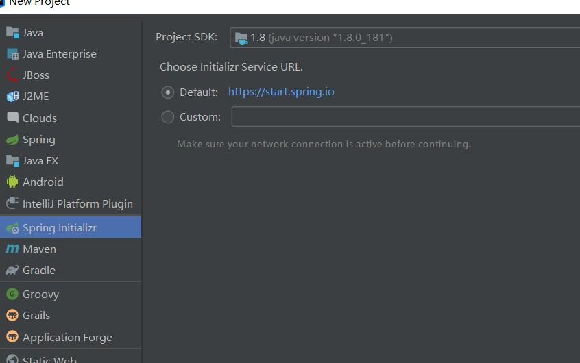

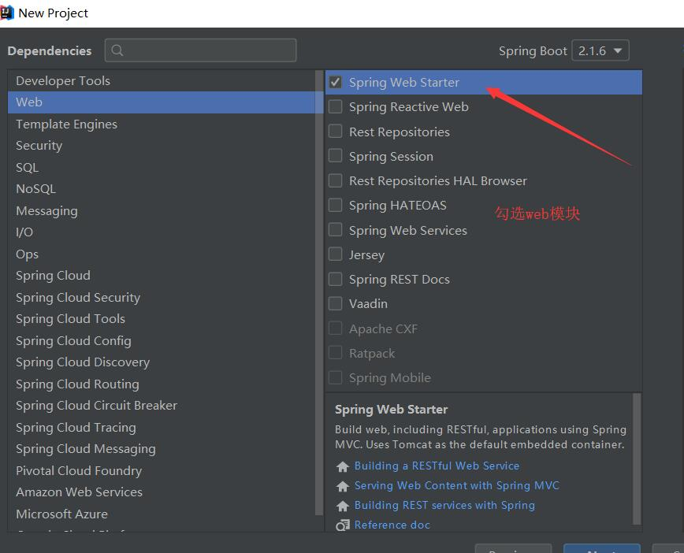

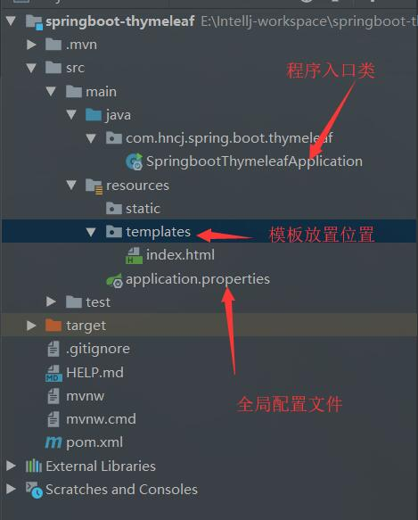

#### 二、引入thymeleaf依赖

```
         <!--引入thymeleaf依赖-->
        <dependency>
            <groupId>org.springframework.boot</groupId>
            <artifactId>spring-boot-starter-thymeleaf</artifactId>
        </dependency>
```

#### 三、创建thymeleaf模板

在templates下新建index.html,内容如下：

```
<!doctype html>

<!--注意：引入thymeleaf的名称空间-->
<html lang="en" xmlns:th="http://www.thymeleaf.org">
<head>
    <meta charset="UTF-8">
    <meta name="viewport"
          content="width=device-width, user-scalable=no, initial-scale=1.0, maximum-scale=1.0, minimum-scale=1.0">
    <meta http-equiv="X-UA-Compatible" content="ie=edge">
    <title>Document</title>
</head>
<body>
    <p th:text="'hello SpringBoot'">hello thymeleaf</p>
</body>
</html>
```

#### 四、启动项目

访问`http://localhost:8080` ,展示效果如下：
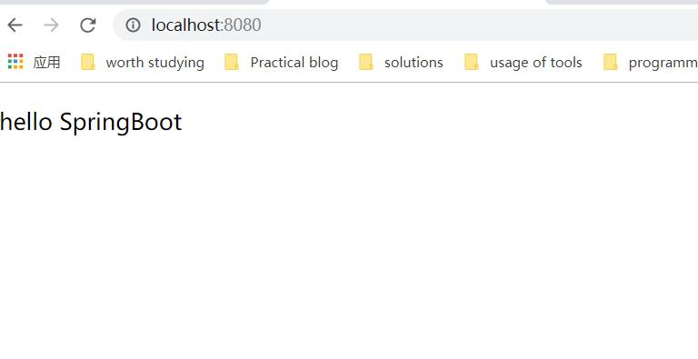

#### 五、通过控制器定位thymeleaf模板：

在入口类所在目录建立controller包，新建控制器，写法与SpringMVC一致：

```
package com.hncj.spring.boot.thymeleaf.controller;

import org.springframework.stereotype.Controller;
import org.springframework.web.bind.annotation.GetMapping;

@Controller
public class IndexController {

    @GetMapping("home")
    public String index() {
        return "index";
    }
}
```

访问`http://localhost:8080/home`,也能显示index.html的内容。

## thymeleaf的相关全局配置

SpringBoot支持.properties和.yml两种格式的全局配置，下面给出thymeleaf的yml格式全局配置：

```
spring:
  thymeleaf:
    enabled: true  #开启thymeleaf视图解析
    encoding: utf-8  #编码
    prefix: classpath:/templates/  #前缀
    cache: false  #是否使用缓存
    mode: HTML  #严格的HTML语法模式
    suffix: .html  #后缀名
```

## thymeleaf常用标签的使用

用到的User实体如下：

```java
package com.hncj.spring.boot.thymeleaf.domain;

import java.util.List;
import java.util.Map;

public class User {
    String username;
    String password;
    List<String> hobbies;
    Map<String, String> secrets;
    public String getUsername() {
        return username;
    }

    public void setUsername(String username) {
        this.username = username;
    }

    public String getPassword() {
        return password;
    }

    public void setPassword(String password) {
        this.password = password;
    }

    public List<String> getHobbies() {
        return hobbies;
    }

    public void setHobbies(List<String> hobbies) {
        this.hobbies = hobbies;
    }

    public Map<String, String> getSecrets() {
        return secrets;
    }

    public void setSecrets(Map<String, String> secrets) {
        this.secrets = secrets;
    }
}
```

具体的属性值为：

```java
package com.hncj.spring.boot.thymeleaf.controller;

import com.hncj.spring.boot.thymeleaf.domain.User;
import org.springframework.stereotype.Controller;
import org.springframework.ui.Model;
import org.springframework.web.bind.annotation.GetMapping;

import java.util.Arrays;
import java.util.HashMap;
import java.util.Map;

@Controller
public class IndexController {

    @GetMapping("home")
    public String index(Model model) {
        User user = new User();
        user.setUsername("jack");
        user.setPassword("112233");
        user.setHobbies(Arrays.asList(new String[]{"singing", "dancing", "football"}));
        Map<String, String> maps = new HashMap<>();
        maps.put("1", "o");
        maps.put("2", "g");
        maps.put("3", "a");
        maps.put("4", "j");
        user.setSecrets(maps);
        model.addAttribute("user", user);
        return "index";
    }
}
```

测试界面如下：

```java
<!doctype html>
<html lang="en" xmlns:th="http://www.thymeleaf.org">
<head>
    <meta charset="UTF-8">
    <meta name="viewport"
          content="width=device-width, user-scalable=no, initial-scale=1.0, maximum-scale=1.0, minimum-scale=1.0">
    <meta http-equiv="X-UA-Compatible" content="ie=edge">
    <title>Document</title>
</head>
<body>
    <!--字符串输出-->
    <p th:text="'hello SpringBoot'">hello thymeleaf</p>
    <!--数学运算-->
    <p th:text="9 + 10"></p>
    <p th:text="10 * 10"></p>
    <p th:text="1 - 10"></p>
    <p th:text="8 / 3"></p>
    <p th:text="3 % 2"></p>
    <!--操作域对象-->
    <p th:text="${user}"></p>
    <p th:text="${user.username}"></p>

    <!--遍历数组-->
    <table th:each="item, sta:${user.hobbies}">
        <tr>
            <td th:text="${item}"></td>
            <td th:text="${sta.index}"></td>
            <td th:text="${sta.odd}"></td>
            <td th:text="${sta.size}"></td>
        </tr>
    </table>


    <!--遍历map-->
    <div th:each="item:${user.secrets}" th:text="${item.key}"></div>

    <!--遍历数组-->
    <div th:each="item:${user.hobbies}" th:text="${item}"></div>

    <!--设置属性-->
    <input type="text" th:attr="value=${user.username}">
    <input type="text" th:attr="value=${user.username}, title=${user.username}">

    <!--表单数据绑定-->
    <form action="" th:object="${user}">
        <input type="text" th:value="*{username}">
        <input type="password" th:value="*{password}">
        <select>
            <option th:each="item:${user.secrets}" th:text="${item.value}" th:selected="'a' eq ${item.value}"></option>
        </select>
    </form>

    <!--解析html文本内容-->
    <p th:utext="'<span>html</span>'"></p>

    <!--流程控制-->
    <p th:if="${user.username} != ${user.password}">yes</p>
    <div th:switch="${user.username}">
        <p th:case="rose">name is rose</p>
        <p th:case="jack">name is jack</p>
    </div>

    <!--外部引入-->
    <link rel="stylesheet" th:href="@{/css/index.css}">
    <script th:src="@{/js/index.js}"></script>

    <a th:href="@{/home}">home</a>
</body>

</html>
```


