------

> **实验环境为**：IDEA2020.1+MySQL8.0.21+Tomcat9.0.36+Maven3.3.9
>
> **最终项目结构图**：

## 一、搭建数据库环境

创建一个存放书籍数据的数据库表

```sql
CREATE DATABASE `ssmbuild`;

USE `ssmbuild`;

DROP TABLE IF EXISTS `books`;

CREATE TABLE `books` (
`bookID` INT(10) NOT NULL AUTO_INCREMENT COMMENT '书id',
`bookName` VARCHAR(100) NOT NULL COMMENT '书名',
`bookCounts` INT(11) NOT NULL COMMENT '数量',
`detail` VARCHAR(200) NOT NULL COMMENT '描述',
KEY `bookID` (`bookID`)
) ENGINE=INNODB DEFAULT CHARSET=utf8

INSERT  INTO `books`(`bookID`,`bookName`,`bookCounts`,`detail`)VALUES
(1,'Java',1,'从入门到放弃'),
(2,'MySQL',10,'从删库到跑路'),
(3,'Linux',5,'从进门到进牢');
123456789101112131415161718
```

**生成表格**：
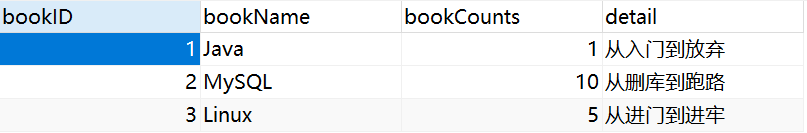

------


## 二、基本环境搭建

### 1、创建maven项目，添加web支持

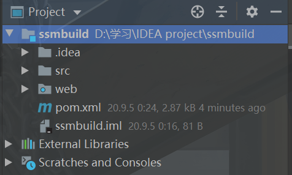

### 2、导入依赖

```xml
<dependencies>
   <!--Junit-->
   <dependency>
       <groupId>junit</groupId>
       <artifactId>junit</artifactId>
       <version>4.13</version>
   </dependency>
   <!--数据库驱动-->
   <dependency>
       <groupId>mysql</groupId>
       <artifactId>mysql-connector-java</artifactId>
       <version>8.0.21</version>
   </dependency>
   <!-- 数据库连接池:c3p0 -->
   <dependency>
       <groupId>com.mchange</groupId>
       <artifactId>c3p0</artifactId>
       <version>0.9.5.5</version>
   </dependency>

   <!--Servlet-->
   <dependency>
       <groupId>javax.servlet</groupId>
       <artifactId>servlet-api</artifactId>
       <version>2.5</version>
   </dependency>
    <!--JSP-->
   <dependency>
       <groupId>javax.servlet.jsp</groupId>
       <artifactId>jsp-api</artifactId>
       <version>2.2</version>
   </dependency>
    <!--jstl-->
   <dependency>
       <groupId>javax.servlet</groupId>
       <artifactId>jstl</artifactId>
       <version>1.2</version>
   </dependency>

   <!--Mybatis-->
   <dependency>
       <groupId>org.mybatis</groupId>
       <artifactId>mybatis</artifactId>
       <version>3.5.5</version>
   </dependency>
   <!--Mybatis-Spring-->
   <dependency>
       <groupId>org.mybatis</groupId>
       <artifactId>mybatis-spring</artifactId>
       <version>2.0.5</version>
   </dependency>

   <!--Spring-->
   <dependency>
       <groupId>org.springframework</groupId>
       <artifactId>spring-webmvc</artifactId>
       <version>5.2.8.RELEASE</version>
   </dependency>
   <!--Spring操作数据库,还需要spring-jdbc-->
   <dependency>
       <groupId>org.springframework</groupId>
       <artifactId>spring-jdb	c</artifactId>
       <version>5.2.6.RELEASE</version>
   </dependency>
    
   <!--lombok-->
    <dependency>
        <groupId>org.projectlombok</groupId>
        <artifactId>lombok</artifactId>
        <version>1.18.12</version>
    </dependency>
</dependencies>
```

最后为了防止`maven配置文件无法被导出或生效`，加入以下代码

```xml
<build>
   <resources>
       <resource>
           <directory>src/main/java</directory>
           <includes>
               <include>**/*.properties</include>
               <include>**/*.xml</include>
           </includes>
           <filtering>false</filtering>
       </resource>
       <resource>
           <directory>src/main/resources</directory>
           <includes>
               <include>**/*.properties</include>
               <include>**/*.xml</include>
           </includes>
           <filtering>false</filtering>
       </resource>
   </resources>
</build>
```

### 3、建立项目基本结构

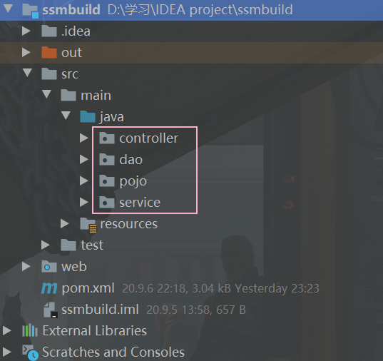

> 在`src/main/java`目录下新建以下四个包，为后续实验准备

- `pojo`：用来放实体类
- `dao`：数据访问层，data access object
- `service`：服务层，调用dao层
- `controller`：控制层，调用service层

------


## 三、MyBatis层编写

### 1、编写数据库配置文件

> 在resource目录下新建`database.properties`

- 注意MySQL8.0以上要设置时区，最后加上`serverTimezone=Asia/Shanghai`

```properties
jdbc.driver=com.mysql.jdbc.Driver
jdbc.url=jdbc:mysql://localhost:3306/ssmbuild?useSSL=true&useUnicode=true&characterEncoding=utf8&serverTimezone=Asia/Shanghai
jdbc.username=root
jdbc.password=200024
```

### 2、IDEA关联数据库

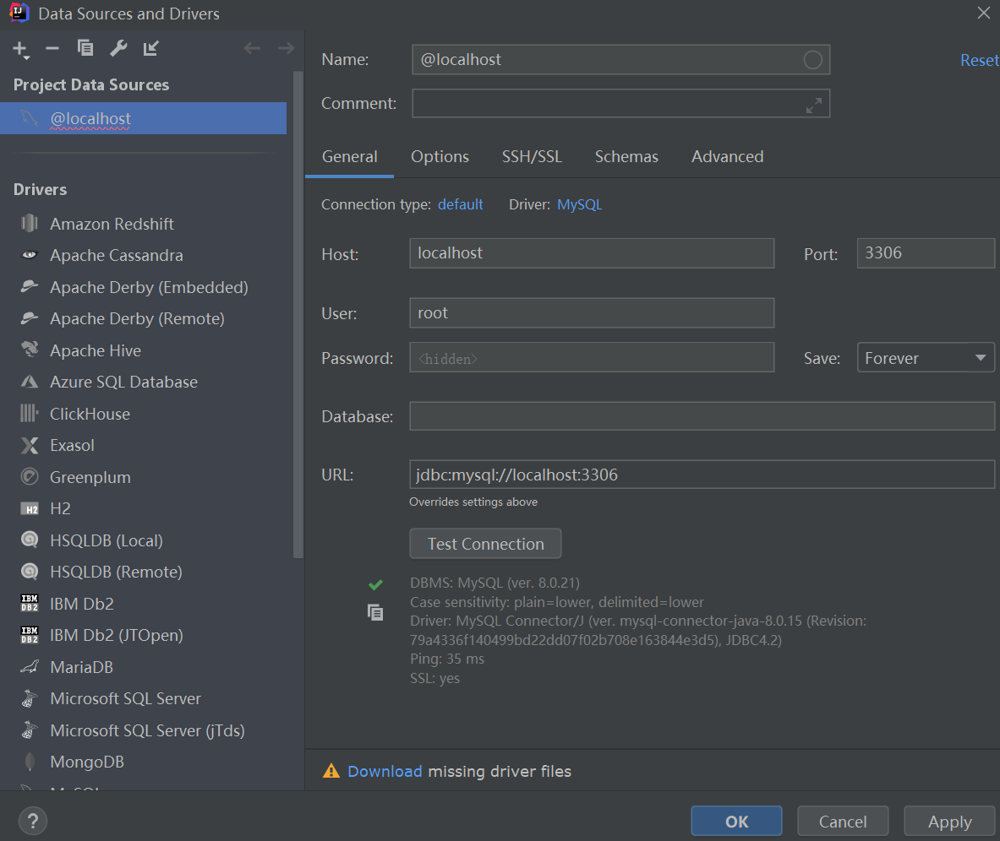
**时区问题解决方案**：https://blog.csdn.net/liuqiker/article/details/102455077

```shell
set global time_zone = '+8:00'; 
```

打开上述新建的数据表
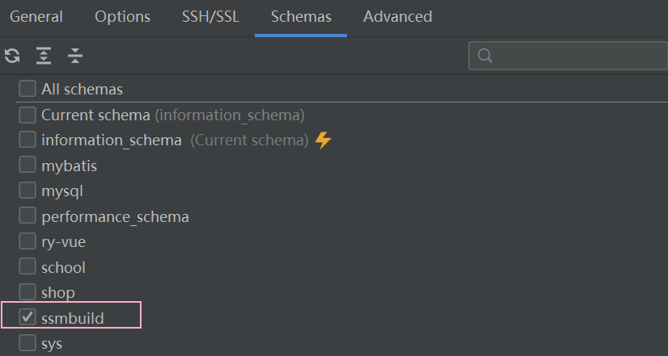

### 3、编写MyBatis核心配置文件

> 在resource目录下新建`mybatis-config.xml`

- 数据源的配置，交给后续`Spring`去做

```xml
<?xml version="1.0" encoding="UTF-8" ?>
<!DOCTYPE configuration
        PUBLIC "-//mybatis.org//DTD Config 3.0//EN"
        "http://mybatis.org/dtd/mybatis-3-config.dtd">
<configuration>
    <!--别名-->
    <typeAliases>
        <package name="pojo"/>
    </typeAliases>
</configuration>
```

### 4、编写pojo实体类

> 在`pojo`包下创建数据库表所对应的实体类`Books`，这里使用了lombok插件

```java
@Data
@AllArgsConstructor
@NoArgsConstructor
public class Books {
    private int bookID;
    private String bookName;
    private int bookCounts;
    private String detail;
}
```

### 5、编写dao层

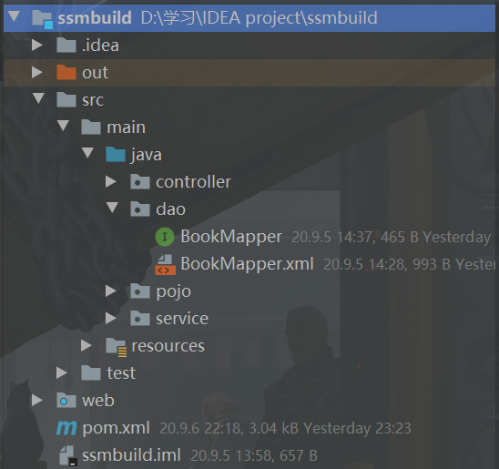

#### 1. 编写Mapper接口

> 在`dao`包下新建`BookMapper`接口，编写增删改查四种业务对应的方法

```java
public interface BookMapper {
    //增加一本书
    int addBook(Books books);

    //删除一本书
    //@Param注解指定传入参数的名称
    int deleteBookByID(@Param("bookID") int id);

    //更新一本书
    int updateBook(Books books);

    //查询一本书
    //@Param注解指定传入参数的名称
    Books queryByID(@Param("bookID") int id);

    //查询全部的书
    List<Books> queryAllBooks();
}
```

#### 2. 编写Mapper接口对应的Mapper.xml

> 一个`Mapper.xml`对应一个`Mapper接口`，要用`namespace`绑定上述接口

- 实现上述接口里的所有方法

```xml
<?xml version="1.0" encoding="UTF-8" ?>
<!DOCTYPE mapper
        PUBLIC "-//mybatis.org//DTD Config 3.0//EN"
        "http://mybatis.org/dtd/mybatis-3-mapper.dtd">
<mapper namespace="dao.BookMapper">
    <!--增加一本书-->
    <insert id="addBook" parameterType="pojo.Books">
        insert into ssmbuild.books(bookName,bookCount,detail)
        values (#{bookName},#{bookCount},#{detail})
    </insert>
    
    <!--删除一本书-->
    <delete id="deleteBookByID" parameterType="int">
        delete from ssmbuild.books where bookID=#{bookID}
    </delete>
    
     <!--更新一本书-->
    <update id="updateBook" parameterType="pojo.Books">
        update ssmbuild.books set
        bookName=#{bookName},bookCounts=#{bookCounts},detail=#{detail}
        where bookID=#{bookID} ;
    </update>

     <!--查询一本书-->
    <select id="queryByID" resultType="pojo.Books">
        select * from ssmbuild.books where bookID=#{bookID}
    </select>

     <!--查询所有书-->
    <select id="queryAllBooks" resultType="pojo.Books">
        select * from ssmbuild.books
    </select>
</mapper>
```

然后到`mybatis核心配置文件`中注册上述`mapper.xml`

```xml
<?xml version="1.0" encoding="UTF-8" ?>
<!DOCTYPE configuration
        PUBLIC "-//mybatis.org//DTD Config 3.0//EN"
        "http://mybatis.org/dtd/mybatis-3-config.dtd">
<configuration>
    <!--别名-->
    <typeAliases>
        <package name="pojo"/>
    </typeAliases>
    
    <!--注册mapper-->
    <mappers>
    	<mapper class="dao.BookMapper"/>
	</mappers>
</configuration>
```

### 6、编写service层

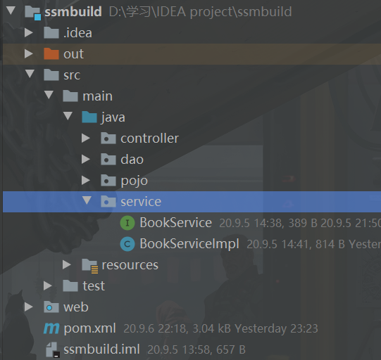

#### 1. 编写service层的接口

> 在`service`包下新建`BookService`接口，同`Mapper接口`里的方法一致

```java
package service;

import pojo.Books;
import java.util.List;

public interface BookService {
    //增加一本书
    int addBook(Books books);

    //删除一本书
    int deleteBookByID(int id);

    //更新一本书
    int updateBook(Books books);

    //查询一本书
    Books queryByID(int id);

    //查询全部的书
    List<Books> queryAllBooks();
}
```

#### 2. 编写service层接口实现类

> 然后再`service`包下新建上述接口的实现类`BookServiceImpl`

- `service层`用来调用`dao层`，所以内置私有属性为**dao层的Mapper接口对象**

```java
package service;

import dao.BookMapper;
import pojo.Books;

import java.awt.print.Book;
import java.util.List;

//service层调用dao层
public class BookServiceImpl implements BookService {
    //dao层的Mapper接口对象
    private BookMapper bookMapper;

    //set方法，为后续Spring注入准备
    public void setBookMapper(BookMapper bookMapper) {
        this.bookMapper = bookMapper;
    }

    public int addBook(Books books) {
        //调用dao层的方法
        return bookMapper.addBook(books);
    }

    public int deleteBookByID(int id) {
        //调用dao层的方法
        return bookMapper.deleteBookByID(id);
    }

    public int updateBook(Books books) {
        //调用dao层的方法
        return bookMapper.updateBook(books);
    }

    public Books queryByID(int id) {
        //调用dao层的方法
        return bookMapper.queryByID(id);
    }

    public List<Books> queryAllBooks() {
        //调用dao层的方法
        return bookMapper.queryAllBooks();
    }
}
```

------


## 四、Spring层编写

### 1、Spring整合dao层

> 在resource目录下新建`spring-dao.xml`

1. 关联数据库配置文件`database.properties`，要引入context约束

2. 配置`MyBatis`数据源，这里使用第三方的`c3p0`，还可以附加一些私有属性

   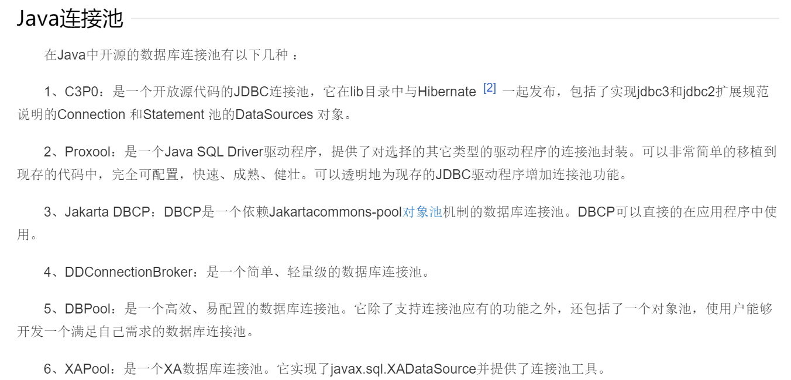

3. 创建`sqlSessionFactory`，在 **MyBatis-Spring** 中，则使用 `SqlSessionFactoryBean` 来创建，要配置两个重要属性

   - `configLocation`绑定MyBatis核心配置文件
   - `dataSource`指定数据源（**必要**）

4. 配置自动扫描包`dao`，动态实现了dao层接口可以注入到Spring容器中

   （在原来我们是创建`sqlSessionTemplate`对象，然后再创建一个Mapper接口实现类，其中内置`sqlSessionTemplate`私有对象，通过该对象进行操作）

```xml
<?xml version="1.0" encoding="UTF-8"?>
<beans xmlns="http://www.springframework.org/schema/beans"
       xmlns:xsi="http://www.w3.org/2001/XMLSchema-instance"
       xmlns:context="http://www.springframework.org/schema/context"
       xsi:schemaLocation="http://www.springframework.org/schema/beans
       http://www.springframework.org/schema/beans/spring-beans.xsd http://www.springframework.org/schema/context https://www.springframework.org/schema/context/spring-context.xsd">

    <!--1.关联数据库配置文件-->
    <context:property-placeholder location="classpath:database.properties"/>

    <!--2.数据库连接池
       		dbcp 半自动化操作 不能自动连接
       		c3p0 自动化操作（自动的加载配置文件 并且设置到对象里面）
       		druid、hikari-->
    <bean id="dataSource" class="com.mchange.v2.c3p0.ComboPooledDataSource">
        <!--配置连接池属性，使用了EL表达式-->
        <property name="driverClass" value="${jdbc.driver}"/>
        <property name="jdbcUrl" value="${jdbc.url}"/>
        <property name="user" value="${jdbc.username}"/>
        <property name="password" value="${jdbc.password}"/>
        
       <!-- c3p0连接池的私有属性 -->
       <property name="maxPoolSize" value="30"/>
       <property name="minPoolSize" value="10"/>
       <!-- 关闭连接后不自动commit -->
       <property name="autoCommitOnClose" value="false"/>
       <!-- 获取连接超时时间 -->
       <property name="checkoutTimeout" value="10000"/>
       <!-- 当获取连接失败重试次数 -->
       <property name="acquireRetryAttempts" value="2"/>
    </bean>

    <!--3.sqlSessionFactory-->
    <bean id="sqlSessionFactory" class="org.mybatis.spring.SqlSessionFactoryBean">
        <!--引用上述数据源-->
        <property name="dataSource" ref="dataSource"/>
        <!--绑定MyBatis配置文件-->
        <property name="configLocation" value="classpath:mybatis-config.xml"/>
    </bean>

    <!--4.配置dao接口扫描包，动态实现了Dao接口可以注入到Spring容器中-->
    <bean class="org.mybatis.spring.mapper.MapperScannerConfigurer">
        <!--注入sqlSessionFactory-->
        <property name="sqlSessionFactoryBeanName" value="sqlSessionFactory"/>
        <!--要扫描的dao包-->
        <property name="basePackage" value="dao"/>
    </bean>
</beans>
```

### 2、Spring整合service层

> 在resource目录下新建`spring-service.xml`

1. 配置扫描`service包`，使该包下的注解生效
2. 将所有业务类注入到`Spring`中
3. 配置声明式事务，**需要注入数据源**

```xml
<?xml version="1.0" encoding="UTF-8"?>
<beans xmlns="http://www.springframework.org/schema/beans"
       xmlns:xsi="http://www.w3.org/2001/XMLSchema-instance"
       xmlns:context="http://www.springframework.org/schema/context"
       xsi:schemaLocation="http://www.springframework.org/schema/beans
       http://www.springframework.org/schema/beans/spring-beans.xsd http://www.springframework.org/schema/context https://www.springframework.org/schema/context/spring-context.xsd">
    
    <!--1.扫描service下的包,这个包下的注解就会生效-->
    <context:component-scan base-package="service"/>

    <!--将所有的业务类注入到Spring，可以通过配置或者注解实现-->
    <bean id="BookServiceImpl" class="service.BookServiceImpl">
        <!--这里的ref指向spring-dao.xml最后Spring注入的dao接口-->
        <property name="bookMapper" ref="bookMapper"/>
    </bean>

    <!--声明式事务配置-->
    <bean id="transactionManager" class="org.springframework.jdbc.datasource.DataSourceTransactionManager">
        <!--注入数据源-->
        <property name="dataSource" ref="dataSource"/>
    </bean>

</beans>
```

------


## 五、SpringMVC层编写

### 1、编写spring-mvc.xml

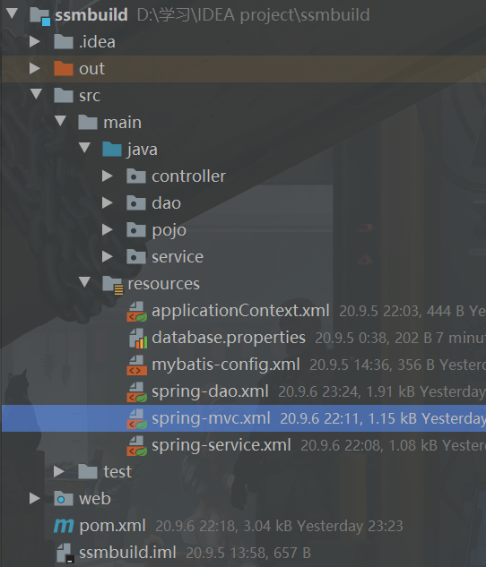

1. 自动扫描包
2. 过滤静态资源
3. 支持mvc注解驱动
4. 视图解析器

```xml
<?xml version="1.0" encoding="UTF-8"?>
<beans xmlns="http://www.springframework.org/schema/beans"
       xmlns:xsi="http://www.w3.org/2001/XMLSchema-instance"
       xmlns:mvc="http://www.springframework.org/schema/mvc"
       xmlns:context="http://www.springframework.org/schema/context"
       xsi:schemaLocation="http://www.springframework.org/schema/beans
       http://www.springframework.org/schema/beans/spring-beans.xsd
       http://www.springframework.org/schema/mvc
       http://www.springframework.org/schema/mvc/spring-mvc.xsd 
       http://www.springframework.org/schema/context
       https://www.springframework.org/schema/context/spring-context.xsd">

    <!--开启SpringMVC注解驱动-->
    <mvc:annotation-driven/>
    
    <!--静态资源过滤-->
    <mvc:default-servlet-handler/>
    
    <!--扫描包controller-->
    <context:component-scan base-package="controller"/>

    <!--视图解析器-->
    <bean class="org.springframework.web.servlet.view.InternalResourceViewResolver">
        <property name="prefix" value="/WEB-INF/jsp/"/>
        <property name="suffix" value=".jsp"/>
    </bean>
</beans>
```

### 2、Spring配置文件整合

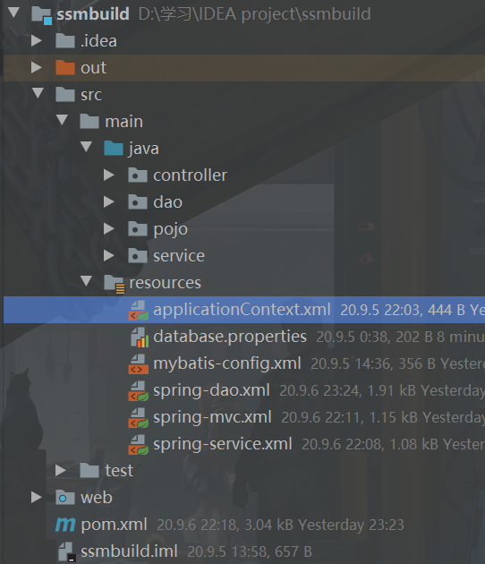

`applicationContext.xml`导入上述配置文件，作为整体的配置文件

```xml
<?xml version="1.0" encoding="UTF-8"?>
<beans xmlns="http://www.springframework.org/schema/beans"
       xmlns:xsi="http://www.w3.org/2001/XMLSchema-instance"
       xsi:schemaLocation="http://www.springframework.org/schema/beans
       http://www.springframework.org/schema/beans/spring-beans.xsd">

    <import resource="spring-dao.xml"/>
    <import resource="spring-service.xml"/>
    <import resource="spring-mvc.xml"/>

</beans>
```

### 3、配置web.xml

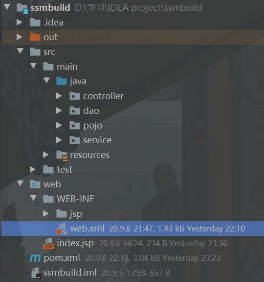

- 注册`DispatcherServlet`，需要绑定SpringMVC配置文件，这里一定要绑定整体的配置文件`applicationContext.xml`，并设置启动级别
- 增加乱码过滤
- 设置session过期时间

```xml
<?xml version="1.0" encoding="UTF-8"?>
<web-app xmlns="http://xmlns.jcp.org/xml/ns/javaee"
         xmlns:xsi="http://www.w3.org/2001/XMLSchema-instance"
         xsi:schemaLocation="http://xmlns.jcp.org/xml/ns/javaee http://xmlns.jcp.org/xml/ns/javaee/web-app_4_0.xsd"
         version="4.0">

    <!--DispatcherServlet-->
    <servlet>
        <servlet-name>springmvc</servlet-name>
        <servlet-class>org.springframework.web.servlet.DispatcherServlet</servlet-class>
        <init-param>
            <param-name>contextConfigLocation</param-name>
            <param-value>classpath:applicationContext.xml</param-value>
        </init-param>
        <load-on-startup>1</load-on-startup>
    </servlet>
    <servlet-mapping>
        <servlet-name>springmvc</servlet-name>
        <url-pattern>/</url-pattern>
    </servlet-mapping>

    <!--乱码过滤-->
    <filter>
        <filter-name>encodingFilter</filter-name>
        <filter-class>org.springframework.web.filter.CharacterEncodingFilter</filter-class>
        <init-param>
            <param-name>encoding</param-name>
            <param-value>utf-8</param-value>
        </init-param>
    </filter>
    <filter-mapping>
        <filter-name>encodingFilter</filter-name>
        <url-pattern>/*</url-pattern>
    </filter-mapping>

    <!--session过期时间-->
    <session-config>
        <session-timeout>15</session-timeout>
    </session-config>
</web-app>
```

### 4、编写Controller

> 再`controller包`下新建`BookController`类

```java
@Controller
@RequestMapping("/book")
public class BookController {
    //controller层调用service层
    @Autowired
    @Qualifier("BookServiceImpl")
    private BookService bookService;

    //查询全部书籍，并且返回到一个页面进行显示
    @RequestMapping("/allBooks")
    public String list(Model model) {
        List<Books> books = bookService.queryAllBooks();
        model.addAttribute("list", books);
        return "allBooks";
    }
}
```

### 5、编写视图层

> 在`web/WEB-INF/`目录下新建`jsp`包，用来存放我们自定义视图页面

#### 1. 编写index.jsp

> 超链接跳转到我们自定的展示所有书籍页面`allBooks.jsp`

```jsp
<%@ page contentType="text/html;charset=UTF-8" language="java" %>
<html>
<head>
    <title>首页</title>
</head>
<body>
<h5>
    <a href="${pageContext.request.contextPath}/book/allBooks">进入书籍页面</a>
</h5>
</body>
</html>
```

#### 2. 编写展示所有书籍页面allBooks.jsp

```jsp
<%@ page contentType="text/html;charset=UTF-8" language="java" %>
<html>
<head>
    <title>全部书籍展示</title>
</head>
<body>
<h1>全部书籍展示</h1>
${list}
</body>
</html>
```

### 6、运行测试

配置Tomcat启动测试，记得添加lib目录，否则Tomcat启动不来
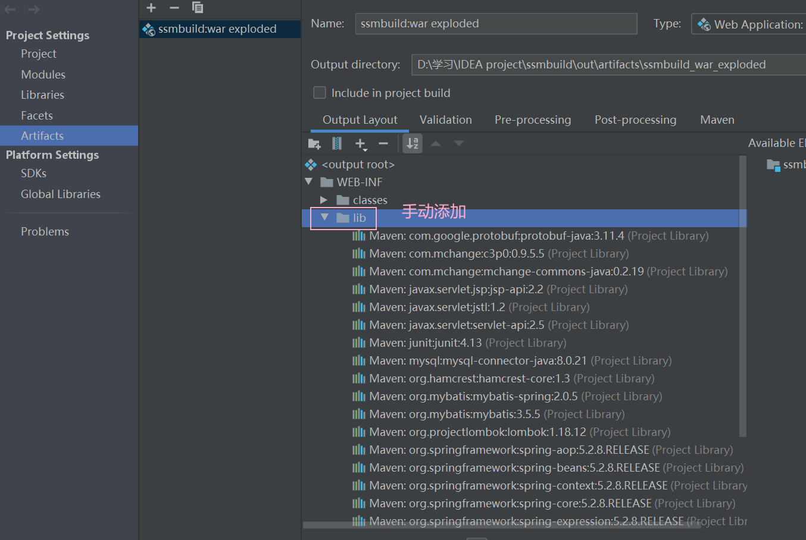
启动Tomcat后，默认进入的`index.jsp`
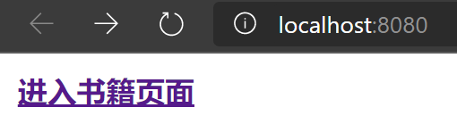

**然后我们点击超链接**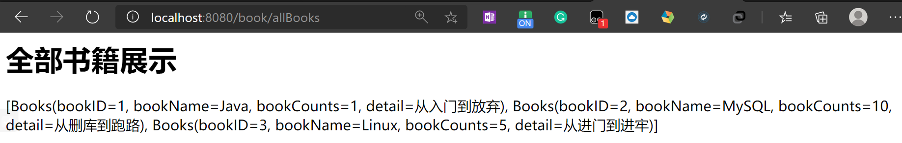
成功显示了我们的所有书籍！

------

**到此位置，SSM整合项目到此结束，后续大家可以自己实现相关业务！！！**