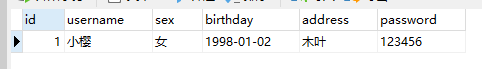
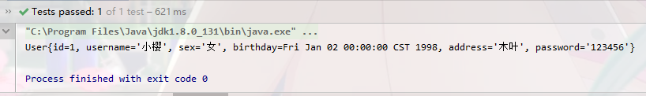

# 一、概述

　　MyBatis的逆向工程指利用MyBatis Generator，可以快速的根据表生成对应的映射文件，接口，以及bean类。
　　 MyBatis Generator，简称MBG，是一个专门为MyBatis框架使用者定制的代码生成器，可以快速的根据表生成对应的映射文件，接口，以及bean类。支持基本的增删改查，以及QBC风格的条件查询。但是表连接、存储过程等这些复杂sql的定义需要我们手工编写。
　　 官方文档地址：http://www.mybatis.org/generator/

　　 官方工程地址：https://github.com/mybatis/generator/releases

# 二、MyBatis Generator的使用

　　在使用MyBatis Generator之前，我们先来看一下数据库中的表结构。


　　OK，MyBatis Generator使用的使用其实非常简单，只需要两步操作就可以快速的根据表生成对应的映射文件，接口，以及bean类。

## 1、导入jar包

```xml
 <dependency>
            <groupId>mysql</groupId>
            <artifactId>mysql-connector-java</artifactId>
            <version>5.1.38</version>
        </dependency>
        <!--逆向工程-->
        <dependency>
            <groupId>org.mybatis.generator</groupId>
            <artifactId>mybatis-generator-core</artifactId>
            <version>1.3.5</version>
        </dependency>

        <dependency>
            <groupId>org.mybatis</groupId>
            <artifactId>mybatis</artifactId>
            <version>3.4.2</version>
        </dependency>
        <!--单元测试-->
        <dependency>
            <groupId>junit</groupId>
            <artifactId>junit</artifactId>
            <version>4.11</version>
        </dependency>
```

## 2、编写MyBatis Generato的配置文件

　　编写MyBatis Generato的配置文件，这是使用MyBatis Generato快速生成映射文件，接口，以及bean类的主要操作，也是最重要的步骤。在工程目录下新建MyBatis Generato的配置文件，命名为generatorConfig.xml。如下所示：
　　接下来完成对MyBatis Generato的配置文件的编写。在编写MyBatis Generato的配置文件的时候，需要注意五处重要的配置，这五个配置也是编写MyBatis Generato的配置文件最基本的五个步骤。
　　1）jdbcConnection：配置数据库连接信息
　　2）javaModelGenerator：配置javaBean的生成策略
　　3）sqlMapGenerator ：配置sql映射文件生成策略
　　4）javaClientGenerator：配置Mapper接口的生成策略
　　5）table ：配置要逆向解析的数据表
　　　　　　tableName：表名
　　　　　　domainObjectName：对应的javaBean名

配置文件的示例代码如下所示：

```xml
<?xml version="1.0" encoding="UTF-8"?>
<!DOCTYPE generatorConfiguration PUBLIC "-//mybatis.org//DTD MyBatis Generator Configuration 1.0//EN"
        "http://mybatis.org/dtd/mybatis-generator-config_1_0.dtd">

<generatorConfiguration>


    <!-- 一、配置数据库连接信息 -->
    <!--targetRuntime=“MyBatis3“可以生成带条件的增删改查 -->
    <!--targetRuntime=“MyBatis3Simple“可以生成基本的增删改查-->
    <context id="DB2Tables" targetRuntime="MyBatis3Simple">
        <!--去除注释-->
        <commentGenerator>
            <property name="suppressAllComments" value="true"/>
        </commentGenerator>

        <jdbcConnection driverClass="com.mysql.jdbc.Driver"
                        connectionURL="jdbc:mysql://localhost:3306/easycode"
                        userId="root"
                        password="981204">
        </jdbcConnection>

        <javaTypeResolver>
            <property name="forceBigDecimals" value="false"/>
        </javaTypeResolver>

        <!-- 二、指定javabean生成的位置 -->
        <javaModelGenerator targetPackage="com.ssm.pojo"
                            targetProject=".\src\main\java">
            <property name="enableSubPackages" value="true"/>
            <property name="trimStrings" value="true"/>
        </javaModelGenerator>

        <!-- 三、指定sql映射文件生成的位置 -->
        <sqlMapGenerator targetPackage="mapper" targetProject=".\src\main\resources">
            <property name="enableSubPackages" value="true"/>
        </sqlMapGenerator>

        <!-- 四、指定dao接口生成的位置 -->
        <javaClientGenerator type="XMLMAPPER"
                             targetPackage="com.ssm.dao"
                             targetProject=".\src\main\java">
            <property name="enableSubPackages" value="true"/>
        </javaClientGenerator>

        <!-- 五、table指定每个表的生成策略 -->
        <!--配置要逆向解析的数据表，tableName对应表名，domainObjectName对应javaBean名-->
        <table tableName="user" domainObjectName="User"></table>
     <!--   <table tableName="tbl_dept" domainObjectName="Department"></table>-->

    </context>
</generatorConfiguration>
```

 　注1：上面代码的五处配置信息是需要根据实际的项目做更改的。
　　注2： 在Context标签之下：targetRuntime=“MyBatis3“可以生成带条件的增删改查，targetRuntime=“MyBatis3Simple“可以生成基本的增删改查。如果再次生成，建议将之前生成的数据删除，避免xml向后追加内容出现的问题。
　　
　　这里有一个讲解MyBatis Generato配置的blog，传送门——>>>[Mybatis Generator最完整配置详解](https://blog.csdn.net/testcs_dn/article/details/77881776)

## 3、运行代码生成器生成代码

在编写好了MyBatis Generato的配置文件之后，就可以运行代码生成器生成代码了。代码生成器代码如下：

```java
  @Test
    public void test() throws Exception {
        List<String> warnings = new ArrayList<String>();
        boolean overwrite = true;
        File configFile = new File("D:\\Project\\IdeaProject\\mybatis_generator\\src\\main\\resources\\generatorConfig.xml");
        ConfigurationParser cp = new ConfigurationParser(warnings);
        Configuration config = cp.parseConfiguration(configFile);
        DefaultShellCallback callback = new DefaultShellCallback(overwrite);
        MyBatisGenerator myBatisGenerator = new MyBatisGenerator(config, callback, warnings);
        myBatisGenerator.generate(null);
    }
```

　　在运行成功后，我们可以看到MyBatis Generato已经根据表的结构为我们自动生成对应的映射文件，接口，以及bean类。OK，接下来就是对生成文件的测试了。

## 4、测试

### 1、

```xml
<?xml version="1.0" encoding="UTF-8" ?>
<!DOCTYPE configuration
        PUBLIC "-//mybatis.org//DTD Config 3.0//EN"
        "http://mybatis.org/dtd/mybatis-3-config.dtd">
<configuration>
    <environments default="development">
        <environment id="development">
            <transactionManager type="JDBC"/>
            <dataSource type="POOLED">
                <property name="driver" value="com.mysql.jdbc.Driver"/>
                <property name="url" value="jdbc:mysql://localhost:3306/easycode"/>
                <property name="username" value="root"/>
                <property name="password" value="981204"/>
            </dataSource>
        </environment>
    </environments>
    <mappers>
        <mapper resource="mapper/UserMapper.xml"></mapper>
    </mappers>
</configuration>
```

### 2、

```java
public class MybatisUtil {
    private MybatisUtil() {}

    public static SqlSession getSqlSession() {
        String resource= "mybatis-config.xml";
        InputStream inputStream = null;
        SqlSession sqlsession = null;
        try {
            //使用Mybatis第一步: 获取sqlSessionFactory对象
            inputStream = Resources.getResourceAsStream(resource);
            SqlSessionFactory sqlSessionFactory = new SqlSessionFactoryBuilder().build(inputStream);
            //既然有了sqlSessionFactory, 顾名思义，我们就可以从中获得sqlsession 的实例了。
            // sqlSession 完全包含了面向数据库执行SQL命令所需的所有方法。
            sqlsession = sqlSessionFactory.openSession(true);
        } catch (Exception e) {
            e.printStackTrace();
        }
        return sqlsession;
    }

    public static void main(String[] args) {
        System.out.println(getSqlSession());
    }

}
```

### 3、

```java
 @Test
    public void getUserById() {
        SqlSession sqlSession = MybatisUtil.getSqlSession();
        UserMapper mapper = sqlSession.getMapper(UserMapper.class);
        User user =mapper.selectByPrimaryKey(1);
            System.out.println(user);
```

### 4、测试结果

