## 课程标题

深入浅出学习webservice

## 课程引导语

webservice是开发中比较常用的技术。
由于企业中的开发平台平台，或平台下所有的系统，均可通过Web浏览器访问，那么就涉及到不同平台下
的系统之间的交互协同工作。webservice为此提供了技术支持。
Web services把Web应用程序提升到了另外一个层面:

1. Web Service平台需支持XML + HTTP, HTTP协议是最常用的因特网协议，XML提供了-种可用于不
   同平台和编程语言之间的语言。
2. Web Services能够解决不同平台、不同语言编写的应用之间如何相互调用问题
   3.使用Web Services,我们的应用程序可以向全世界发布信息，或提供某项功能。

## 课程介绍

 Web Service所使用的是Internet上统一、开放的标准，如HTP、XML、SOAP (简单对象访问协议)、
WSDL等，所以Web Service可以在任何支持这些标准的环境7 Windows,Linux)中使用。
​ 这有助于大量异构程序和平台之间的互操作性，从而使存在的应用程序能够被广泛的用户访问。
从应用来说，Web Service是一件值得企业特别注意的事情。Web Service的应用范围目前包括两个方面:
企业之间的应用、以及企业内部的应用。
​ 企业之间的应用主要包括人们熟悉的企业间的电子商务(B2B)和企业与消费者之间的电子商务(B2C)。
​ Web Service在B2B的应用包括:以企业采购、物流和分销为内容的供应链;以及涉及到零售、B2C以及中间业务
的支付系统。
而相对来说，企业内部的应用比企业之间的电子商务应用要成熟一些，并得到广泛的采用。最为普遍的应用是:
采用中间件应用服务器软件作为工具将企业各项应用都进行改造和开发，开发目标是以Web为基础的应用，或者
称为应用软件的网络化。目前企业内部这种网络应用还包括现在流行的ERP以及CR等等。
通过本课程学习，让大家全面掌握webservice,适应企业级应用开发所需技能。

## 课程知识点与大纲

●webservice基本概念
●ApacheCXF框架介绍
●JAXWS规范下的webservice开发
●JAXRS规范下的webservice开发

# 1、学习目标

(1) webservice基 本概念
(2) ApacheCXF框架介绍
(3) JAX-WS规 范下webservice开发
(4) JAX-RS规范 下webservice开发

# 2、webservice 基本概念

## 2.1什么是web服务

这里列举一些常见的web服务:
1.手机淘宝、京东...
2.天气预报
3.手机号归属地
4.股票查询
5.发手机短消息
6.手机充值功能
7.中英文翻译
8.银行转账业务

9.公司的“进销存系统”在某商品缺货时自动给供应商下订单

## 2.2简介

(1) webservice 即web服务，它是一种跨编程语 言和跨操作系统平台的远程调用技术。
如图:

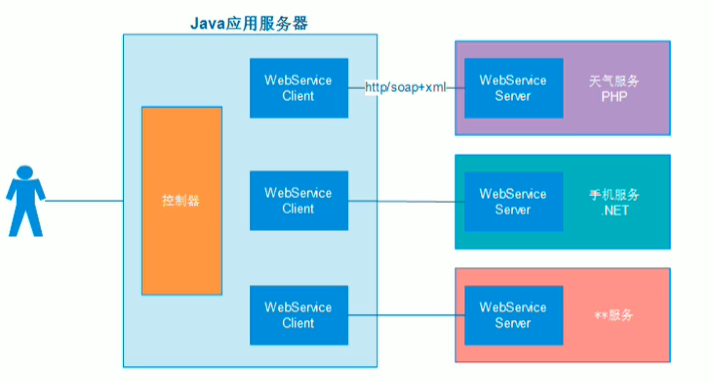

(2) JAVA 中共有三种WebService规范，分别是JAX-WS (JAX-RPC) 、JAXM&SAAJ、JAX-
RS.
(3) webService三要素: soap、 wsdI、 uddi
注:这里的一些概念将在下一章节详细讲解。

## 2.3术语

### 2.3.1 webservice开发规范

JAVA中共有三种WebService规范，分别是JAXM&SAAJ、JAX-WS (JAX-RPC) 、JAX-RS.
下面来分别简要的介绍- - -下这三个规范。
(1.)JAX-WS:
JAX-WS (Java API For XML-WebService)，JDK1.6 自带的版本为AX-WS2.1,其底层支
持为AXB. JAX-WS (JSR 224)规范的API位于javax.xml.ws.*包，其中大部分都是注
解，提供API操作Web服务(通常在客户端使用的较多，由于客户端可以借助SDK生
成，因此这个包中的API我们较少会直接使用)。
(2.JAXM&SAAJ:
JAXM (AVA API For XML Message)主要定义了包含了发送和接收消息所需的API,相
当
于Web服务的服务器端，其API 位于javax.messaging.*包，它是JAVA EE的可选包，因
此

你需要单独下载。
SAAJ (SOAP With Attachment API For Java，JSR 67)是与AXM搭配使用的API,为构
建
SOAP包和解析SOAP包提供了重要的支持，支持附件传输，它在服务器端、客户端都需
要
使用。这里还要提到的是SAAJ规范，其API 位于javax.xml.soap.*包。
JAXM&SAAJ与AX-WS都是基于SOAP的Web服务，相比之下JAXM&SAAJ暴漏了SOAP
更多的底层细节，编码比较麻烦，而JAX-WS更加抽象，隐藏了更多的细节，更加面向对
象，实现起来你基本上不需要关心SOAP的任何细节。那么如果你想控制SOAP消息的更
多细节，可以使用AXM&SAAJ，目前版本为1.3.
(3.)JAX-RS: I
JAX-RS是AVA针对REST(RepresentationState Transfer)风格制定的一套Web 服务规
范，

### 2.3.2 SOAP协议

(1) SOAP即简 单对象访问协议(Simple Object Access Protocol),它是用于交换
XML (标准通用标记语言下的一一个子集)编码信息的轻量级协议。它有三个主要方面:
XML-envelope为描述信息内容和如何处理内容定义了框架，将程序对象编码成为XML对
象的规则，执行远程过程调用(RPC)的约定。SOAP可以运行在任何其他传输协议上。
(2) SOAP作为- 一个基于XML语言的协议用于有网上传输数据。
(3) SOAP=在HTTP的基础上+XML数据。
(4) SOAP是基于HTTP的。
(5) SOAP的组成如下
a) Envelope -必须的部分。以XML的根元素出现。
b) Headers -可选的。
c) Body-必须的。在body部分， 包含要执行的服务器的方法。和发送到服务器的数
据。

### 2.3.3 wsdI说明书

 Web Service描述语言WSDL ( SebService Definition Language)就是用机器能阅读的
方式提供的一个正式描述文档而基于XML (标准通用标记语言下的一个子集)的语言，
用王描述Web Service及其函数、参数和返回值。因为是基于XML的，所以WSDL既是机
器可阅读的，又是人可阅读的。
wsdI说明书，
wsdl说明书，
1)通过wsdl说明书， 就可以描述webservice服务端对外发布的服务:
2) wsdI说明书是-一个基于xml文件，通过xml语言描述整个服务;
3)在wsdI说明中，描述了:
对外发布的服务名称(类)
接口方法名称(方法)
接口参数(方法参数)
服务返回的数据类型(方法返回值)

### 2.3.4 UDDI

 Web服务提供商又如何将自己开发的Web服务公布到因特网上，这就需要使用到UDDI了，UDDI的话，是一个跨产业，跨平台的开放性架构，可以帮助Web服务提供商在互联网上发布Web服务的信息。
UDDI是一种目录服务，企业可以通过UDDI来注册和搜索Web服务。
​ 简单来时候话，UDDI 就是一个目录，只不过在这个目录中存放的是一些关于Web服务的信息而已。
并且UDDI通过SOAP进行通讯，构建于. Net之上。
​ UDDI即Universal Description, Discovery andIntegration，也就是通用的描述，发现以及整合。

## 2.4应用场景

 Web Service可以适用于应用程序集成、软件重用、跨防火墙通信等需求。不同的
业务要求不同。具体如下:
(1) 跨防火墙通信
(2) 应用系统集成
(3) 软件和数据重用
简单来说，如果-一个功能，需要被多个系统使用可以使用webservice开发- - 个服务
端接口，供不同的客户端应用。主要应用在企业内部系统之间的接口调用、面向公网的
webservice服务。

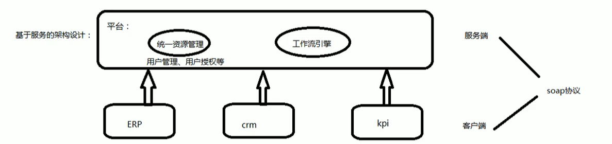

## 2.5优缺点

### 2.5.1优点:

a)异构平台的互通性
理论上，Web Service最大的优势是提供了异构平台的无缝街接技术手段。由于不同的
用户使用不同的硬件平台，不同的操作平台，不同的操作系统，不同的软件，不同的协
议通信，这就产生了互相通信的需求。Web Service使任何两个应用程序，只要能读写
XML，那么就能互相通信。
b)更广泛 的软件复用(例如手机淘宝可以复用已有淘宝的业务逻辑.)
软件的复用技术通过组合已有模块来搭建应用程序，能大幅度提高软件的生产效率和质
量。用户只要获得了描述Web Service的WSDL文件，就可以方便地生成客户端代理，
并通过代理访问Web Service。
c)成本低、可读性强、应用范围广

d)迅捷的软件发行方式
(每个webService称为--个生产者.不同的生产者可以相互协同合作完成整个应用)
Web Service将彻底地改变软件的发行方式。
软件供应商可以把软件分解成若Web Service模块构成的系统，直接在Web.上发布。
e)最重要的一点
客户端与服务端可能是用不同的语言开发的，但是，通过webservice提供服务接口，客
户端与服务端之前可以传递对象。

### 2.5.2缺点:

 由于soap是基于xml传输，本身使用xml传输会传输一些 无关内容从而影响效率，随着
soap协议的完善，soap协议增加了许多内容，这样就导致了使用soap去完成简单的数据
传输而携带的信息更多效率再受影响:
Web Service作为web跨平台访问的标准技术，很多公司都限定要求使用Web Service,
但如果是简单的接口可以直接使用http传输自定义数据格式，开发更快捷。

## 2.6面向服务架构SOA

 SOA(Service-OrientedArchitecture)面向服务架构是一种思想，它将应用程序的不同功
能单元通过中立的契约(独立于硬件平台、操作系统和编程语言)联系起来，使得各种
形式的功能单元更好的集成。目前来说，WebService 是SOA的一种较好的实现方
WebService采用HTTP作为传输协议，SOAP ( Simple Object Access Protocol)作为传
输消息的格式。但WebService 并不是完全符合SOA的概念，因为SOAP协议是
WebService的特有协议，并未符合SOA的传输协议透明化的要求。SOAP是一种应用协
议。早期应用于RPC的实现，传输协议可以依赖于HTTP、SMTP 等。

# 3 ApacheCXF 框架介绍

## 3.1 关于Apache CXF

 Apache CXF = Celtix + XFire, ApacheCXF的前身叫Apache CeltiXfire, 现在已经正式
更名为ApacheCXF了，以下简称为CXF。CXF 继承了Celtix 和XFire两大开源项目的精
华，提供了对JAX-WS全面的支持，并且提供了多种Binding、DataBinding、
Transport以及各种Format的支持，并且可以根据实际项目的需要，采用代码优先
(Code First)或者WSDL优先(WSDL First)来轻松地实现Web Services的发布和使
用。目前它仍只是Apache的一个孵化项目。
Apache CXF是一个开源的Services框架，CXF帮助您利用Frontend编程API来构建和
开发Services，像JAX-WS。这些Services可以支持多种协议，比如: SOAP、
XML/HTTP、RESTfulHTTP 或者CORBA,并且可以在多种传输协议上运行，比如:
HTTP、JMS或者jBI，CXF 大大简化了Services 的创建，同时它继承了XFire 传统，一
样可以天然地和Spring进行无缝集成。

## 3.2功能特性

 CXF包含了大量的功能特性，但是主要集中在以下几个方面:
(1) 支持Web Services标准: CXF支持多种Web Services标准，包含SOAP、Basic
Profile、WS-Addressing. WS-Policy、 WS-ReliableMessaging 和WS-Security。
(2) Frontends: CXF 支持多种"Frontend"编程模型，CXF实现了JAX-WSAPI (遵循
JAX-WS 2.0 TCK版本)，它也包含一个"simple frontend"允许客户端和EndPoint的创.
建，而不需要Annotation注解。CXF既支持WSDL优先开发，也支持从Java的代码优
先开发模式。.
(3) 容易使用: CXF设计得更加直观与容易使用。有大量简单的API用来快速地构建代
码优先的Services，各种Maven的插件也使集成更加容易，支持JAX-WS API，支持
Spring 2.0更加简化的XML配置方式，等等。
(4)支持二进制和遗留协议: CXF 的设计是- -种可插拨的架构，既可以支持XML，也可

# 4 、ApacheCXF 实现(WebService (Jax-Ws ))

## 4.1服务端

### 4.1.1创建项目

1、创建一个空项目

●flel--new -->module...

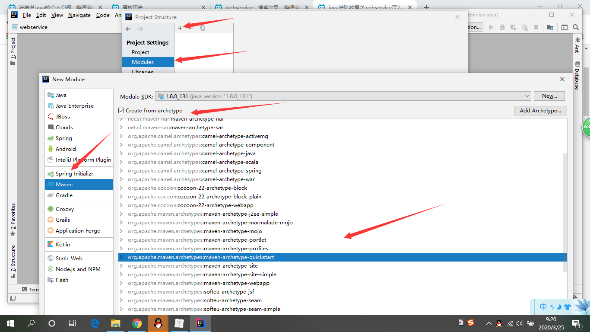

### 4.1.2添加cxf依赖

```xml
 <dependencies>
    <!--要进行jaxws服务开发-->
    <dependency>
      <groupId>org.apache.cxf</groupId>
      <artifactId>cxf-rt-frontend-jaxws</artifactId>
      <version>3.0.1</version>
    </dependency>
    <!--内置jetty web服务器-->
    <dependency>
      <groupId>org.apache.cxf</groupId>
      <artifactId>cxf-rt-transports-http-jetty</artifactId>
      <version>3.0.1</version>
    </dependency>
    <!--日志实现-->
    <dependency>
      <groupId>org.slf4j</groupId>
      <artifactId>slf4j-log4j12</artifactId>
      <version>1.7.12</version>
    </dependency>
    <dependency>
      <groupId>junit</groupId>
      <artifactId>junit</artifactId>
      <version>4.10</version>
      <scope>test</scope>
    </dependency>

  </dependencies>

  <build>
    <pluginManagement>
      <plugins>
        <plugin>
          <groupId>org.apache.maven.plugins</groupId>
          <artifactId>maven-compiler-plugin</artifactId>
          <version>3.2</version>
          <configuration>
            <source>1.8</source>
            <target>1.8</target>
            <encoding>UTF-8</encoding>
            <showWarnings>true</showWarnings>
          </configuration>
        </plugin>
      </plugins>
    </pluginManagement>
  </build>
```

### 4.1.3写服务接口

```java
package com.kuang.service;

import javax.jws.WebService;

/**
 * *对外发布服务的接口
 */
@WebService
public interface HelloService {
    /**
     * 对外发布服务的接口的方法
     * @param name
     * @return
     */
    public String sayHello(String name);
}
```

### 4.1.4写服务接口实现

```java
public class HelloServiceImpl implements HelloService {

    @Override
    public String sayHello(String name) {
        return name + "Welcome to Itheima";
    }
}
```

### 4.1.5发布服务

```java
package com.kuang.service;

import com.kuang.service.Impl.HelloServiceImpl;
import org.apache.cxf.jaxws.JaxWsServerFactoryBean;

public class Server {
    public static void main(String[] args) {
        //发布服务的工厂
        JaxWsServerFactoryBean factory = new JaxWsServerFactoryBean();
        //设置服务地址
        factory.setAddress("http://localhost:8000/ws/hello");
        //设置服务类
        factory.setServiceBean(new HelloServiceImpl());
        //发布服务
        factory.create();
        System.out.println("发布服务成功,端8000...");
    }
}
```

### 4.1.6访问wsdl说明书

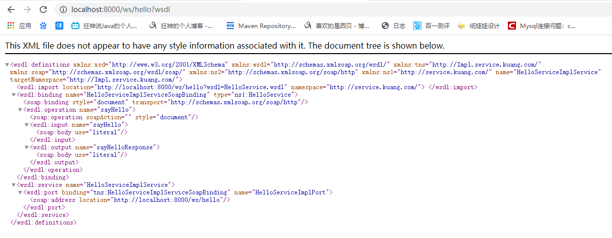

## 4.2客户端

### 4.2.1创建项目

创建项目: 02_jaxws_client

### 4.2.2添加依赖

与服务端项目依赖一致。

### 4.2.3服务接口

```java
/**
 * *对外发布服务的接口
 */
@WebService
public interface HelloService {
    /**
     * 对外发布服务的接口的方法
     * @param name
     * @return
     */
    public String sayHello(String name);
}
```

### 4.2.4远程访问服务端

```java
package com.kuang.service;

import org.apache.cxf.jaxws.JaxWsProxyFactoryBean;

public class Client {
    public static void main(String[] args) {
        //服务接口访问地址: htp://oca/host:000/ws/hello
        //创建cxf代理工厂
        JaxWsProxyFactoryBean factory = new JaxWsProxyFactoryBean();
        //设置远程访问服务端地址
        factory.setAddress("http://localhost:8000/ws/hello");
        //设置按口类型
        factory.setServiceClass(HelloService.class);
        //对接口生成代理对象
        HelloService helloService = factory.create(HelloService.class);
        //代理对象对象 ， class com.sun,proxy.$Proxy34 [Java代理: 1. 静态代理; 2.动态代理(jdk接口代理、 cglib子类代理)] $CGLIB123
        System.out.println(helloService.getClass());
        //远程访问服务端方法
        String content = helloService.sayHello("kuang,");
        System.out.println(content);
    }

}
```

运行测试结果

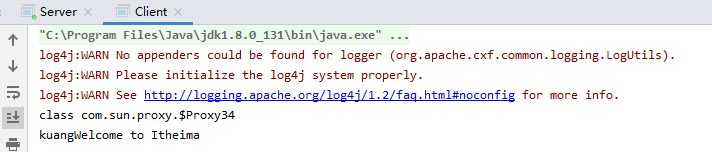

## 4.3添加日志拦截器,观察soap协议内容

### 4.3.1服务端

1添加日志输入、输出拦截器

```java
public class Server {
    public static void main(String[] args) {
        //发布服务的工厂
        JaxWsServerFactoryBean factory = new JaxWsServerFactoryBean();
        //设置服务地址
        factory.setAddress("http://localhost:8000/ws/hello");
        //设置服务类
        factory.setServiceBean(new HelloServiceImpl());

        //添加日志输入、输出拦截器,观索soap请求soap响应内容
        factory.getInInterceptors().add(new LoggingInInterceptor());
        factory.getOutInterceptors().add(new LoggingOutInterceptor());

        //发布服务
        factory.create();
        System.out.println("发布服务成功,端8000...");
    }

}
```

观察

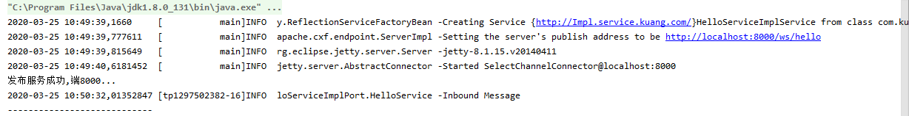

### 4.3.2客户端调用,观察日志

回来看服务端

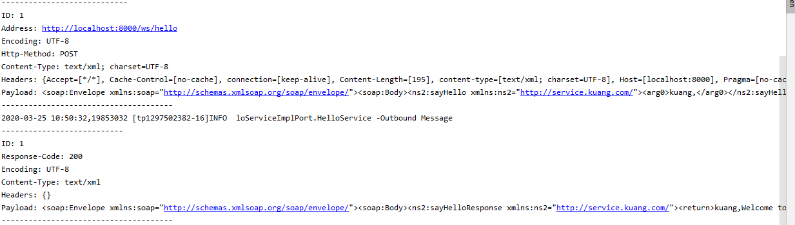

# 5 、Spring 整合ApacheCXF实现

WebService ( Jax-ws )

## 5.1服务端

### 5.1.1创建web项目

03_jaxws_spring_server

### 5.1.2添加依赖

```xml
<dependencies>
        <dependency>
            <groupId>org.apache.cxf</groupId>
            <artifactId>cxf-rt-frontend-jaxws</artifactId>
            <version>3.0.1</version>
        </dependency>
        <dependency>
            <groupId>junit</groupId>
            <artifactId>junit</artifactId>
            <version>4.12</version>
            <scope>test</scope>
        </dependency>
        <dependency>
            <groupId>org.springframework</groupId>
            <artifactId>spring-context</artifactId>
            <version>4.2.4.RELEASE</version>
        </dependency>
        <dependency>
            <groupId>org.springframework</groupId>
            <artifactId>spring-web</artifactId>
            <version>4.2.4.RELEASE</version>
        </dependency>
        <dependency>
            <groupId>org.springframework</groupId>
            <artifactId>spring-test</artifactId>
            <version>4.2.4.RELEASE</version>
        </dependency>
        <dependency>
            <groupId>org.apache.cxf</groupId>
            <artifactId>cxf-rt-transports-http</artifactId>
            <version>3.0.1</version>
            <scope>compile</scope>
        </dependency>
    </dependencies>

    <build>

        <plugins>
            <plugin>
                <groupId>org.apache.maven.plugins</groupId>
                <artifactId>maven-compiler-plugin</artifactId>
                <version>3.2</version>
                <configuration>
                    <source>1.8</source>
                    <target>1.8</target>
                    <encoding>UTF-8</encoding>
                    <showWarnings>true</showWarnings>
                </configuration>
            </plugin>
           <!-- &lt;!&ndash;运行tomcat9方法;tomcat:7:run&ndash;&gt;
            <plugin>
                <groupId>org.apache.tomcat.maven</groupId>
                <artifactId>tomcat7-maven-plugin</artifactId>
                <version>2.2</version>
                <configuration>
                    &lt;!&ndash;指定端口&ndash;&gt;
                    <port>8080</port>
                    &lt;!&ndash;请求路径&ndash;&gt;
                    <path>/</path>
                </configuration>
            </plugin>-->
        </plugins>
    </build>
</project>
```

### 5.1.3 web.xml配置CXFServlet

```xml
<?xml version="1.0" encoding="UTF-8"?>
<web-app xmlns="http://xmlns.jcp.org/xml/ns/javaee"
         xmlns:xsi="http://www.w3.org/2001/XMLSchema-instance"
         xsi:schemaLocation="http://xmlns.jcp.org/xml/ns/javaee
                      http://xmlns.jcp.org/xml/ns/javaee/web-app_4_0.xsd"
         version="4.0"
         metadata-complete="true">

    <display-name>Archetype Created Web Application</display-name>
    <!--cxfsevlet配置-->
    <servlet>
        <servlet-name>cxfservlet</servlet-name>
        <servlet-class>org.apache.cxf.transport.servlet.CXFServlet</servlet-class>
    </servlet>
    <servlet-mapping>
        <servlet-name>cxfservlet</servlet-name>
        <url-pattern>/ws/*</url-pattern>
    </servlet-mapping>
    <!--2.spring容器配置-->
    <context-param>
        <param-name>contextConfigLocation</param-name>
        <param-value>classpath:applicationContext.xml</param-value>
    </context-param>
    <listener>
        <listener-class>org.springframework.web.context.ContextLoaderListener</listener-class>
    </listener>
</web-app>
```

### 5.1.4服务接口、服务实现

```java
package com.kuang.service;

import javax.jws.WebService;

/**
 * *对外发布服务的接口
 */
@WebService
public interface HelloService {
    /**
     * 对外发布服务的接口的方法
     * @param name
     * @return
     */
    public String sayHello(String name);
}
public class HelloServiceImpl implements HelloService {

    @Override
    public String sayHello(String name) {
        return name + "Welcome to Itheima";
    }
}
```

别忘了配置Tomcat

### 5.1.5 Spring整合ApacheCXF

```xml
<?xml version="1.0" encoding="UTF-8"?>
<beans xmlns="http://www.springframework.org/schema/beans"
       xmlns:xsi="http://www.w3.org/2001/XMLSchema-instance"
       xmlns:cxf="http://cxf.apache.org/core"
       xmlns:jaxws="http://cxf.apache.org/jaxws"
       xmlns:jaxrs="http://cxf.apache.org/jaxrs"
       xsi:schemaLocation="
           http://www.springframework.org/schema/beans
           http://www.springframework.org/schema/beans/spring-beans.xsd
           http://cxf.apache.org/core
           http://cxf.apache.org/schemas/core.xsd
           http://cxf.apache.org/jaxws
           http://cxf.apache.org/schemas/jaxws.xsd
           http://cxf.apache.org/jaxrs
           http://cxf.apache.org/schemas/jaxrs.xsd">

    <!--Spring整合cxf发布服务,关键点:
    1.服务地址
    2.服务类
    服务完整访问地址http://localhost:8080/ws/hello
-->
    <jaxws:server address="/hello">
        <jaxws:serviceBean>
            <bean class="com.kuang.service.impl.HelloServiceImpl"></bean>
        </jaxws:serviceBean>
    </jaxws:server>


</beans>
```

### 5.1.6启动服务,发布服务

http://localhost:8080/ws/hello

### 5.1.7访问wsdl说明书

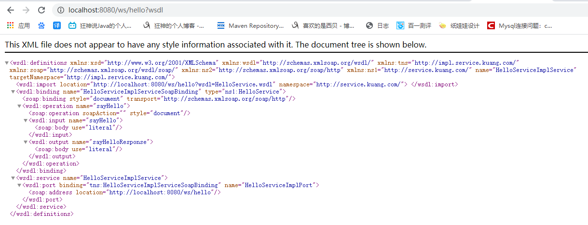

## 5.2、客户端

### 5.2.1创建项目

### 5.2.2添加依赖

```xml
<dependencies>
    <dependency>
      <groupId>org.apache.cxf</groupId>
      <artifactId>cxf-rt-frontend-jaxws</artifactId>
      <version>3.0.1</version>
    </dependency>
    <dependency>
      <groupId>junit</groupId>
      <artifactId>junit</artifactId>
      <version>4.12</version>
      <scope>test</scope>
    </dependency>
    <dependency>
      <groupId>org.springframework</groupId>
      <artifactId>spring-context</artifactId>
      <version>4.2.4.RELEASE</version>
    </dependency>
    <dependency>
      <groupId>org.springframework</groupId>
      <artifactId>spring-web</artifactId>
      <version>4.2.4.RELEASE</version>
    </dependency>
    <dependency>
      <groupId>org.springframework</groupId>
      <artifactId>spring-test</artifactId>
      <version>4.2.4.RELEASE</version>
    </dependency>
    <dependency>
      <groupId>org.apache.cxf</groupId>
      <artifactId>cxf-rt-transports-http</artifactId>
      <version>3.0.1</version>
      <scope>compile</scope>
    </dependency>
  </dependencies>

  <build>

    <plugins>
      <plugin>
        <groupId>org.apache.maven.plugins</groupId>
        <artifactId>maven-compiler-plugin</artifactId>
        <version>3.2</version>
        <configuration>
          <source>1.8</source>
          <target>1.8</target>
          <encoding>UTF-8</encoding>
          <showWarnings>true</showWarnings>
        </configuration>
      </plugin>
    </plugins>
  </build>
</project>
```

### 5.2.3 service接口

```java
@WebService
public interface HelloService {
    /**
     * 对外发布服务的接口的方法
     * @param name
     * @return
     */
    public String sayHello(String name);
}
```

### 5.2.4 Spring整合ApacheCXF配置

```xml
<?xml version="1.0" encoding="UTF-8"?>
<beans xmlns="http://www.springframework.org/schema/beans"
       xmlns:xsi="http://www.w3.org/2001/XMLSchema-instance"
       xmlns:cxf="http://cxf.apache.org/core"
       xmlns:jaxws="http://cxf.apache.org/jaxws"
       xmlns:jaxrs="http://cxf.apache.org/jaxrs"
       xsi:schemaLocation="
           http://www.springframework.org/schema/beans
           http://www.springframework.org/schema/beans/spring-beans.xsd
           http://cxf.apache.org/core
           http://cxf.apache.org/schemas/core.xsd
           http://cxf.apache.org/jaxws
           http://cxf.apache.org/schemas/jaxws.xsd
           http://cxf.apache.org/jaxrs
           http://cxf.apache.org/schemas/jaxrs.xsd">

    <!--
    Spring整合cxt容户端配置:
    1.服务地址http:/localhost:8080/ws/hello
    2.服务接口类型
    -->
    <jaxws:client
            id="helloService"
            serviceClass="com.kuang.service.HelloService"
            address="http://localhost:8080/ws/hello"></jaxws:client>
</beans>
```

### 5.2.5 junit测试

```java
package com.kuang;

import com.kuang.service.HelloService;
import org.junit.Test;
import org.junit.runner.RunWith;
import org.springframework.test.context.ContextConfiguration;
import org.springframework.test.context.junit4.SpringJUnit4ClassRunner;

import javax.annotation.Resource;

@RunWith(SpringJUnit4ClassRunner.class)
@ContextConfiguration("classpath:applicationContext.xml")
public class Client {
    //注入对象
    @Resource
    private HelloService helloService;

    @Test
    public void remote() {
       //查看接口的代理对象类型
        //class com.sun.proxy.$Proxy45
        System.out.println(helloService.getClass());
        //远程访问服务端方法
        System.out.println(helloService.sayHello("xibei"));
    }

}
```

客户端访问服务端测试

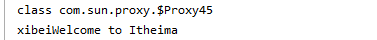

# 6、 Restful风格

 一种软件架构风格，设计风格而不是标准，只是提供了-组设计原则和约束条件。它主
要用于客户端和服务器交互类的软件。基于这个风格设计的软件可以更简洁，更有层
次，更易于实现缓存等机制。

 REST (英文: Representational State Transfer,简称REST)描述了一个架构样式的网
络系统，比如web应用程序。它首次出现在2000年Roy Fielding的博士论文中，他是
HTTP规范的主要编写者之一。在目前主流的三种Web服务交互方案中，REST相比于
SOAP (Simple Object Access protocol,简单对象访问协议)以及XML-RPC更加简单明
了，无论是对URL的处理还是对Payload的编码，REST 都倾向于用更加简单轻量的方法设
计和实现。值得注意的是REST并没有一个明确的标准，而更像是一种设计的风格。

 所谓**"资源"**，就是网络上的一个实体，或者说是网络.上的-一个具体信息。它可以是一段文
本、一张图片、一首歌曲、一种服务，总之就是一个具体的实在。你可以用一个URI指向
它，每种资源对应--个特定的URI。要获取这个资源，访问它的URI就可以，因此URI就成
了每一个资源的地址或独-无二的识别符。所谓"上网"，就是与互联网上一系列的"资
源"互动，调用它的URI。

 **表现层**，我们把"资源"具体呈现出来的形式，叫做它的"表现层" ( Representation)。
比如，文本可以用txt格式表现， 也可以用HTML格式、XML格式、JSON格式表现，甚至
可以采用二进制格式;图片可以用JPG格式表现，也可以用PNG格式表现。
Restful风格: http://bbs.csdn.net/topics/390908212
非resfull风格: http://bbs.csdn.net/topics?tid=390908212
严格地说，有些网址最后的".html"后缀名是不必要的，因为这个后缀名表示格式，属
于"表现层"范畴，而URI应该只代表" 资源"的位置。它的具体表现形式，应该在HTTP请求
的头信息中用Accept和Content-Type字段指定，这两个字段才是对"表现层"的描述。

**状态转化(State Transfer)**

 访问一个网站，就代表了客户端和服务器的一个互动过程。在这个过程中，势必涉及到
数据和状态的变化。互联网通信协议HTTP协议，是一个无状态协议。这意味着，所有的
状态都保存在服务器端。因此，如果客户端想要操作服务器，必须通过某种手段，让服
务器端发生"状态转化" (StateTransfer) 。而这种转化是建立在表现层之上的，所以就
是"表现层状态转化”。客户端用到的手段，只能是HTTP协议。 具体来说，就是HTTP协议
里面，四个表示操作方式的动词: GET. POST、PUT、 DELETE。 它们分别对应四种基本
操作:

GET用来获取资源，
POST用来新建资源，
PUT用来更新资源，
DELETE用来删除资源。
访问服务器资源，通过不同的http请求方式，服务器就知道对CRUD的哪个操作!
JAX-RS发布服务就是使用RESTFUL风格。

- Restful编程风格
  访问url地址更加简洁、更有层次感、更易于浏览器缓存。
  举例
  基于restful风格的url: htps://miaosha.jd.com/#2357091
  访问后台curd方法，url地址怎么写:
  传统做法:
  http://localhost:8080/pr/userAction?type=add
  http://localhost:8080/prj/userAction?type=update
  http://localhost:8080/prj/userAction?type=delete
  基于restful风格的url:
  http://localhost:8080/prj/userAcion系统-一个地址对应后台的crud四个方法。
- 添加
  http://localhost:8080/prj/userAction
  请求方式: post
  修改
  http://localhost:8080/prj/userAction
  请求方式: put
  删除
  http://localhost:8080/prj/userAction
  请求方式: delete

# 7 、ApacheCXF实现webservice ( Jax-rs )

## 7.1服务端

### 7.1.1 创建项目

05_jaxrs__server

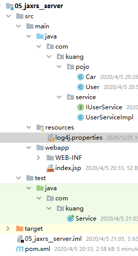

### 7.1.2添加依赖

```xml
 <dependencies>
    <dependency>
      <groupId>org.apache.cxf</groupId>
      <artifactId>cxf-rt-frontend-jaxrs</artifactId>
      <version>3.0.1</version>
    </dependency>
    <dependency>
      <groupId>org.apache.cxf</groupId>
      <artifactId>cxf-rt-transports-http-jetty</artifactId>
      <version>3.0.1</version>
    </dependency>
    <dependency>
      <groupId>org.slf4j</groupId>
      <artifactId>slf4j-log4j12</artifactId>
      <version>1.7.12</version>
    </dependency>
    <!--客户端调用时需要的依赖-->
    <dependency>
      <groupId>org.apache.cxf</groupId>
      <artifactId>cxf-rt-rs-client</artifactId>
      <version>3.0.1</version>
    </dependency>
    <!--基于restful风格的webservice，客户端服务端的通信可以传xml数据，也可以传json数据-->
    <dependency>
      <groupId>org.apache.cxf</groupId>
      <artifactId>cxf-rt-rs-extension-providers</artifactId>
      <version>3.0.1</version>
    </dependency>
    <dependency>
      <groupId>org.codehaus.jettison</groupId>
      <artifactId>jettison</artifactId>
      <version>1.3.7</version>
    </dependency>
    <dependency>
      <groupId>junit</groupId>
      <artifactId>junit</artifactId>
      <version>4.11</version>
      <scope>test</scope>
    </dependency>
  </dependencies>

  <build>
    <plugins>
      <plugin>
        <groupId>org.apache.maven.plugins</groupId>
        <artifactId>maven-compiler-plugin</artifactId>
        <version>3.2</version>
        <configuration>
          <source>1.8</source>
          <target>1.8</target>
          <encoding>UTF-8</encoding>
          <showWarnings>true</showWarnings>
        </configuration>
      </plugin>
    </plugins>
  </build>
</project>
```

### 7.1.3服务接口、实现、实体类

实体类

```java
/**
 * 基于restful风格的webservice,客户端与服务端之间通讯可以传递xm/数据json数据
 * @Xm/RootElement指定对象序列化为xm/t/son数据时根节点的名称
 * xml:
 * <User>
 * <id> </id>
 * <username> </username>
 * <city> </city>
 * </User>
 * , json:
 * ("User: ("id":100, "username :"ack," "ity":"广州"1}
 */
@XmlRootElement(name = "User")
public class User {
    private Integer id;
    private String username;
    private String city;
    private List<Car> cars = new ArrayList<Car>();
@XmlRootElement(name = "Car")
public class Car {
    private Integer id;
    private String carName;
    private Double price;
```

接口

```java
//访问当前服务接口对应的路径
@Path("/userService")
@Produces("*/*")//服务器支持的返回的数据格式类型

public interface IUserService {
    //表示处理的请求的类型，post对应的是insert新增操作

    @POST
    //访问当前服务被口方法对应的路径。[.. /userService/user]
    @Path("/user")
    @Consumes({ "application/xml", "application/json" })
    public void saveUser(User user);
    //表示处理的请求的类型，post对应的是update操作
    @PUT
    @Path("/user")
    @Consumes({ "application/xml", "application/json" })
    public void updateUser(User user);
    //表示处理的请求的类型，post对应的是查询操作
    @GET
    @Path("/user")
    @Produces({ "application/xml", "application/json" })
    public List<User> findAllUsers();

    @GET
    @Path("/user/{id}")
    //服务器支持的请求的数据格式类型
    @Consumes("application/xml")
    //服务器支持的返回的数据格式类型
    @Produces({ "application/xml", "application/json" })
    public User finUserByld(@PathParam("id") Integer id);
    //表示处理的请求的类型，post对应的是删除操作
    @DELETE
    @Path("/user/{id}")
    @Consumes({"application/xml", "application/json"})
    public void deleteUser(@PathParam("id") Integer id);

}
```

实现

```javascript
public class UserServiceImpl implements IUserService {
    public void saveUser(User user) {
        System.out.println(" save user." + user);
    }

    public void updateUser(User user) {
        System.out.println("update user:" + user);
    }

    public List<User> findAllUsers() {
        List<User> users = new ArrayList<User>();
        User user1 = new User();
        user1.setId(1);
        user1.setUsername("小明");
        user1.setCity("北京");
        List<Car> carList1 = new ArrayList<Car>();
        Car car1 = new Car();
        car1.setId(101);
        car1.setCarName("保时捷");
        car1.setPrice(100000d);
        carList1.add(car1);
        Car car2 = new Car();
        car2.setId(102);
        car2.setCarName("宝马");
        car2.setPrice(400000d);
        carList1.add(car2);
        user1.setCars(carList1);
        users.add(user1);
        User user2 = new User();
        user2.setId(2);
        user2.setUsername("小丽");
        user2.setCity("上海");
        users.add(user2);
        return users;

    }

    @Override
    public User finUserByld(Integer id) {
        if (id == 1) {
            User user1 = new User();
            user1.setId(1);
            user1.setUsername("小明");
            user1.setCity("北京");
            return user1;

        }

        return null;
    }

    @Override
    public void deleteUser(Integer id) {
        System.out.println("delete user id:" + id);
    }
}
```

#### 7.1.3.1准备代码

测试类

```java
public class Service {
    public static void main(String[] args) {
        //创建发布服务的工厂
        JAXRSServerFactoryBean factory = new JAXRSServerFactoryBean();
        //设置服务地址
        factory.setAddress("http://localhost:8001/ws/");
        //设置服务类
        factory.setServiceBean(new UserServiceImpl());
        //添加日志输入输出拦截器
        factory.getInInterceptors().add(new LoggingInInterceptor());
        factory.getOutInterceptors().add(new LoggingOutInterceptor());
        //发布服务
        factory.create();
        System.out.println("发布服务成功,端口8001");

    }
}
```

别忘了配置日志log4j.properties

```properties
log4j.rootCategory=info,CONSOLE,LOGFILE

log4j.logger.org.apache.axis.enterprise=FATAL,CONSOLE

log4j.appender.CONSOLE=org.apache.log4j.ConsoleAppender
log4j.appender.CONSOLE.layout=org.apache.log4j.PatternLayout
log4j.appender.CONSOLE.layout.ConversionPattern=%d{ISO8601}%-6r[%15.15t]%-5p %30.30c %x-%m\n

log4j.appender.LOGFILE=org.apache.log4j.FileAppender
log4j.appender.LOGFILE.File=d:\axis.log
log4j.appender.LOGFILE.Append=true
log4j.appender.LOGFILE.layout=org.apache.log4j.PatternLayout
```

#### 7.1.3.2使用的注解分析

### 7.1.4发布服务

启动访问测试

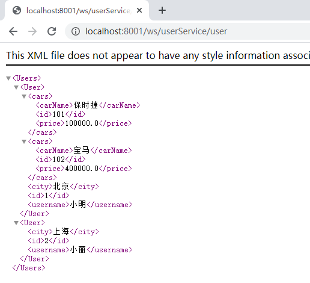

## 7.2客户端

### 7.2.1创建项目

06_jaxrs__client

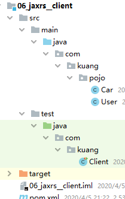

### 7.2.2添加依赖

和服务端一样

将实体类User和Car导入即可

### 7.2.3 写junit ,远程访问服务端

**测试类代码**

```java
public class Client {
    @Test
    public void testSave() {
        User user = new User();
        user.setId(100);
        user.setUsername("Jerry");
        user.setCity("gz");
        //.通过WebClient对象远程调用服务端
        WebClient
                .create("http://localhost:8001/ws/userService/user")
                .type(MediaType.APPLICATION_JSON) // 指定请求的数据格式为json
                .post(user);
    }

    @Test
    public void testGet() {
        //查询一个
        User user =
                WebClient
                        .create("http://localhost:8001/ws/userService/user/1")
                        .accept(MediaType.APPLICATION_JSON)
                        .get(User.class);
        System.out.println(user);

    }
}
```

WebClient
.create()//指定 服务端地址
.type()//指定请求数据格式(xml、 json)
.accept()//指定响 应数据格式
.post()/put()/delete()/get()//指定请求类型

**测试：**

启动服务器端

启动客户端

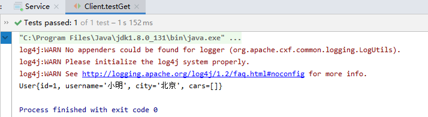

服务器端响应访问结果

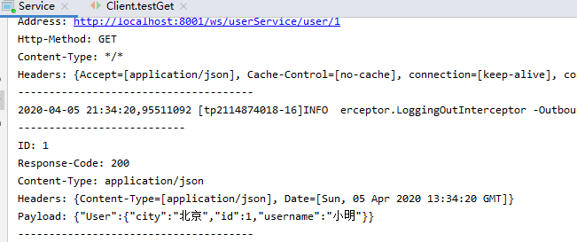

# 8、Sping整合CXF实现基于Restful风格的webservice(jax-rs)

## 8.1服务端

### 8.1.1创建web项目

07_jaxrs_spring_server


### 8.1.2添加依赖

```xml
<!--cxf进行rs开发必须导入-->
  <dependencies>
    <dependency>
      <groupId>org.apache.cxf</groupId>
      <artifactId>cxf-rt-frontend-jaxws</artifactId>
      <version>3.0.1</version>
    </dependency>
    <!--日志引入-->
    <dependency>
      <groupId>org.slf4j</groupId>
      <artifactId>slf4j-log4j12</artifactId>
      <version>1.7.12</version>
    </dependency>
    <!--客户端调用时需要的依赖-->
    <dependency>
      <groupId>org.apache.cxf</groupId>
      <artifactId>cxf-rt-rs-client</artifactId>
      <version>3.0.1</version>
    </dependency>
    <!--扩展json提供者-->
    <dependency>
      <groupId>org.apache.cxf</groupId>
      <artifactId>cxf-rt-rs-extension-providers</artifactId>
      <version>3.0.1</version>
    </dependency>
    <!--转换json工具包，被extension-providers依赖-->
    <dependency>
      <groupId>org.codehaus.jettison</groupId>
      <artifactId>jettison</artifactId>
      <version>1.3.7</version>
    </dependency>

    <!--spring核心-->
    <dependency>
      <groupId>org.springframework</groupId>
      <artifactId>spring-context</artifactId>
      <version>4.2.4.RELEASE</version>
    </dependency>
    <!--spring web集成-->
    <dependency>
      <groupId>org.springframework</groupId>
      <artifactId>spring-web</artifactId>
      <version>4.2.4.RELEASE</version>
    </dependency>
    <dependency>
      <!--spring 整和Junit-->
      <groupId>org.springframework</groupId>
      <artifactId>spring-test</artifactId>
      <version>4.2.4.RELEASE</version>
    </dependency>
    <!--junit开发包-->
    <dependency>
      <groupId>junit</groupId>
      <artifactId>junit</artifactId>
      <version>4.12</version>
      <scope>test</scope>
    </dependency>
  </dependencies>

  <build>

    <plugins>
      <plugin>
        <groupId>org.apache.maven.plugins</groupId>
        <artifactId>maven-compiler-plugin</artifactId>
        <version>3.2</version>
        <configuration>
          <source>1.8</source>
          <target>1.8</target>
          <encoding>UTF-8</encoding>
          <showWarnings>true</showWarnings>
       </configuration>
      </plugin>
    </plugins>
  </build>
</project>
```

### 8.1.3 web.xml

```xml-dtd
<!DOCTYPE web-app PUBLIC
 "-//Sun Microsystems, Inc.//DTD Web Application 2.3//EN"
 "http://java.sun.com/dtd/web-app_2_3.dtd" >

<web-app>
  <display-name>Archetype Created Web Application</display-name>
  <!--cxfsevlet配置-->
  <servlet>
    <servlet-name>cxfservlet</servlet-name>
    <servlet-class>org.apache.cxf.transport.servlet.CXFServlet</servlet-class>
  </servlet>
  <servlet-mapping>
    <servlet-name>cxfservlet</servlet-name>
    <url-pattern>/rs/*</url-pattern>
  </servlet-mapping>
  <!--2.spring容器配置-->
  <context-param>
    <param-name>contextConfigLocation</param-name>
    <param-value>classpath:applicationContext.xml</param-value>
  </context-param>
  <listener>
    <listener-class>org.springframework.web.context.ContextLoaderListener</listener-class>
  </listener>
</web-app>
```

### 8.1.4服务接口、实现、实体类

拿过来User类、Car类、接口、接口实现类

### 8.1.5 Spring整合CXF

applicationContext.xml

```xml
<?xml version="1.0" encoding="UTF-8"?>
<beans xmlns="http://www.springframework.org/schema/beans"
       xmlns:xsi="http://www.w3.org/2001/XMLSchema-instance"
       xmlns:cxf="http://cxf.apache.org/core"
       xmlns:jaxws="http://cxf.apache.org/jaxws"
       xmlns:jaxrs="http://cxf.apache.org/jaxrs"
       xsi:schemaLocation="
           http://www.springframework.org/schema/beans
           http://www.springframework.org/schema/beans/spring-beans.xsd
           http://cxf.apache.org/core
           http://cxf.apache.org/schemas/core.xsd
           http://cxf.apache.org/jaxws
           http://cxf.apache.org/schemas/jaxws.xsd
           http://cxf.apache.org/jaxrs
           http://cxf.apache.org/schemas/jaxrs.xsd">

    <!--Spring整合cxf restful风格发布服务,关键点:
    1.服务地址
    2.服务类
    服务完整访问地址http://localhost:8080/ws/hello
-->
    <jaxrs:server address="/userService">
        <jaxrs:serviceBeans>
            <bean class="com.kuang.service.UserServiceImpl"></bean>
        </jaxrs:serviceBeans>
    </jaxrs:server>


</beans>
```

### 8.1.6发布服务

配置Tomcat启动成功

## 8.2客户端

### 8.2.1创建项目

jaxrs_spring_client

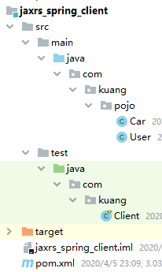

### 8.2.2添加依赖

同客户端

### 8.2.3实体类

同客户端

### 8.2.4测试

```java
public class Client {
    @Test
    public void testSave() {
        User user = new User();
        user.setId(100);
        user.setUsername("Jerry");
        user.setCity("gz");
        //.通过WebClient对象远程调用服务端
        WebClient
                .create("http://localhost:8080/rs/userService/userService/user")
                .type(MediaType.APPLICATION_JSON) // 指定请求的数据格式为json
                .post(user);
    }

    @Test
    public void testGet() {
        //查询一个
        User user =
                WebClient
                        .create("http://localhost:8080/rs/userService/userService/user/1")
                        .accept(MediaType.APPLICATION_JSON)
                        .get(User.class);
        System.out.println(user);

    }
}
```

访问测试

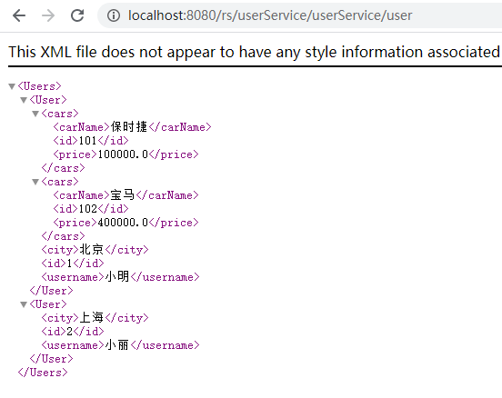

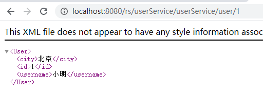

# 9、小结

 所以，以后如果在开发中涉及多个系统之间的交互，webservice是 不错的选择。
个人认为使用service最大的好处是客户端与服务端语言的兼容性及交互时候可以传递对
象。
今天讲到的内容再次梳理一遍:

1. webservice概念

- 简介
- 术语(开发规范、soap协议、UDDI)

2)应用场景、优缺点
3) Apache CXF框架介绍
4) jax-Ws 规范下的webservice开发、与spring整合
5) jax-rs 风格下的webservice开发、与spring整合