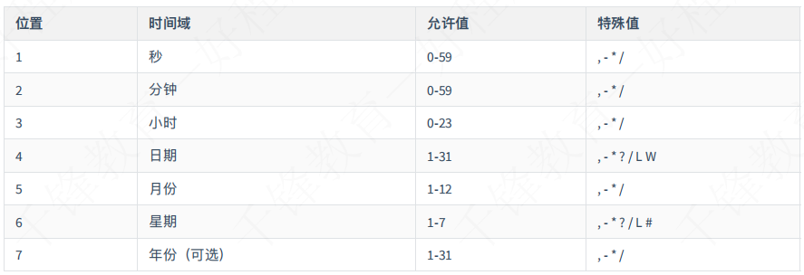
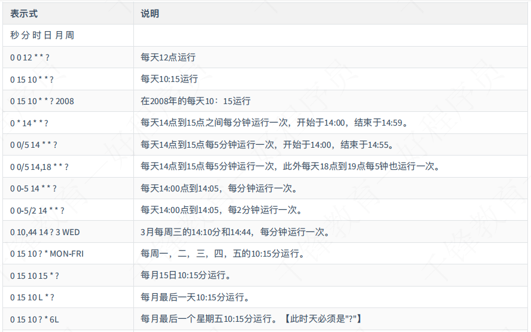
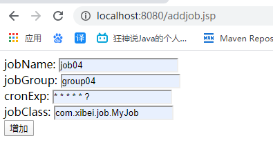

# 一、Quartz简介

## 1.1、简介

```spreadsheet
Quartz是一个任务调度框架。比如你遇到这样的问题
想每月29号，信用卡自动还款
想每年4月1日自己给当年暗恋女神发一封匿名贺卡
想每隔1小时，备份一下自己的学习笔记
这些问题总结起来就是:在某一个有规律的时间点干某件事。并且时间的触发的条件可以非常复杂(比如每月最后一个工作日的17:50)，复杂到需要一个专门的框架来干这个事。
Quartz就是来干这样的事，你给它一个触发条件的定义，它负责到了时间点，触发相应的Job起来干活
如果应用程序需要在给定时间执行任务，或者如果系统有连续维护作业，那么Quartz是理想的解决方案。
```

## 1.2、特点

### 1.2.1、作业调度

```spreadsheet
作业被安排在-个给定的触发时运行。触发器可以使用以下指令的组合来创建:

在一天中的某个时间(到毫秒)
在一周的某几天
在每月的某一天
在一年中的某些日期
不在注册的日历中列出的特定日期(如商业节假日除外)
重复特定次数
重复进行，直到一个特定的时间/日期
无限重复
重复的延迟时间间隔
```

### 1.2.2、作业持久性

```spreadsheet
Quartz的设计包括一个作业存储接口，有多种实现。
通过使用包含的JDBCJobStore,所有的作业和触发器配置为“非挥发性"都存储在通过JDBC关系数据库。
通过使用包含的RAMJobStore,所有的作业和触发器存储在RAM，因此不计划执行仍然存在 - 但这是无需使用外部数据库的优势。
```

# 二、Quartz使用

## 2.1、导入依赖

```xml
 <!--Quartz任务调度-->
    <!-- https://mvnrepository.com/artifact/org.quartz-scheduler/quartz -->
    <dependency>
      <groupId>org.quartz-scheduler</groupId>
      <artifactId>quartz</artifactId>
      <version>2.2.3</version>
    </dependency>
```

## 2.2、定义Job

```java
@DisallowConcurrentExecution
public class MyJob implements Job{
    @Override
    public void execute(JobExecutionContext context) throws JobExecutionException {
        //创建工作详情
        JobDetail jobDetail=context.getJobDetail();
        //获取工作的名称
        String name = jobDetail.getKey().getName();//任务名
        String group = jobDetail.getKey().getGroup();//任务group
        String job=jobDetail.getJobDataMap().getString("data04");//任务中的数据
        System.out.println("job执行，job名："+name+" group:"+group+new Date()+job);//这里是我们最终要定时的任务
    }
}
```

## 2.3、API测试

```java
package com.xibei.test;


import com.xibei.job.MyJob;
import org.quartz.*;
import org.quartz.impl.StdSchedulerFactory;

import static org.quartz.DateBuilder.*;

public class TestQuartz {
    public static void main(String[] args) throws SchedulerException, InterruptedException {
        testSimpleTrigger();
    }


    public static void testSimpleTrigger() throws SchedulerException, InterruptedException {
        // 1. 创建scheduler，调度器  核心组件
        Scheduler scheduler = StdSchedulerFactory.getDefaultScheduler();
        // 2. 定义一个Trigger,创建触发器：Trigger
        /*Trigger trigger = TriggerBuilder.newTrigger()
                .withIdentity("trigger1", "group1") //定义触发器name/group
                .startNow()//一旦加入scheduler，立即生效，即开始时间
                .withSchedule(SimpleScheduleBuilder.simpleSchedule()
                        .withIntervalInSeconds(2)//每隔2秒执行一次
                        .withRepeatCount(2))//一共执行几次
                .build();*/
        Trigger trigger = TriggerBuilder.newTrigger()
                .withIdentity("trigger1", "group1") //定义name/group
                .startNow()//一旦加入scheduler，立即生效，即开始时间
                .withSchedule(SimpleScheduleBuilder.simpleSchedule()
                        .withIntervalInSeconds(2)
                        .repeatForever())//一直执行下去
                //.endAt(new GregorianCalendar(2019,9,19,9,59,10).getTime())//设置最终停止时间
                .build();

        // 3. 创建JobDetail，JobBuilder（任务）
        JobDetail jobDetail = JobBuilder.newJob(MyJob.class)
                .withIdentity("job04", "group04")//任务的名字和组
                .usingJobData("data04", "hello world~~")//任务中的数据和值
                .build();
        // 4. 注册 JobDetail 和 Trigger
        scheduler.scheduleJob(jobDetail, trigger);//将任务和触发器注册到调度器
        // 5. 启动调度器, 内部注册的所有触发器开始计时
        scheduler.start();
        // 6.关闭调度器
        Thread.sleep(10000);//用线程睡眠来操作调度器运行的时间
        scheduler.shutdown();
    }
}
```

## 2.4、配置

```properties
# 指定调度器名称，非实现类
org.quartz.scheduler.instanceName = DefaultQuartzScheduler04
# 指定线程池实现类
org.quartz.threadPool.class = org.quartz.simpl.SimpleThreadPool
# 线程池线程数量
org.quartz.threadPool.threadCount = 15
# 优先级，默认5
org.quartz.threadPool.threadPriority = 5
# 非持久化job
org.quartz.jobStore.class = org.quartz.simpl.RAMJobStore
```

## 2.5、核心类说明

```spreadsheet
Scheduler:调度器。所有的调度都是由它控制
	Scheduler就是Quartz的大脑，所有任务都是由它来设施
	Schduelr包含一个两个重要组件: JobStore和ThreadPool
		JobStore是会来存储运行时信息的，包括Trigger ，Schduler , JobDetail,业务锁等
		ThreadPool就是线程池，Quartz有 自己的线程池实现。所有任务的都会由线程池执行
SchdulerFactory,顾名思义就是来用创建Schduler了，有两个实现: DirectSchedulerFactory和StdSchdulerFactory。 前者可以用来在代码里定制你自己的Schduler参数。后者是直接读取classpath下的quartz .properties (不存 在就都使用默认值)配置来实例化Schduler。通常来讲，我们使用StdSchdulerF actory也就足够了。
SchdulerFactory本身是支持创建RMI stub的， 可以用来管理远程的Scheduler,功能与本地一样
```

# 三、Trigger(重点)

## 3.1 、SimpleTrigger

```spreadsheet
指定从某一个时间开始，以一定的时间间隔(单位是毫秒)执行的任务。
它适合的任务类似于: 9:00开始，每隔1小时，执行一次。
它的属性有:
	repeatInterval重复间隔
	repeatCount重复次数。实际执行次数是repeatCount+1。 因为在startTime的时候一定会执行一次。
```

示例:

```java
SimpleScheduleBuilder.simpleSchedule().
					withIntervalInSeconds(10).//每隔10秒执行-次
					repeatForever().//永远执行
					build();
SimpleScheduleBuilder.simpleSchedule().
					withIntervalInMinutes(3).//每隔3分钟执行一-次
					withRepeatCount(3).//执行3次
					build();
```

## 3.2、CalendarlntervalTrigger

```spreadsheet
类似于SimpleTrigger,指定从某一个时间开始， 以一定的时间间隔执行的任务。但是不同的是SimpleT rigger指定的时间间隔为毫秒，没办法指定每隔一个月执行一次(每月的时间间隔不是固定值)， 而CalendarIntervalTrigger支持的间隔单 位有秒，分钟，小时，天，月，年，星期。
```

示例:

```java
CalendarIntervalScheduleBuilder.calendarIntervalSchedule()
					.withIntervalInDays(2) //每2天执行一次
					.build();
CalendarIntervalScheduleBuilder.calendarIntervalSchedule()
					.withIntervalInWeeks(1) //每周执行一次
					.build();
```

## 3.3、DailyTimelntervalTrigger

```spreadsheet
指定每天的某个时间段内，以一定的时间间隔执行任务。并且它可以支持指定星期。
它适合的任务类似于:指定每天9:00至18:00 ，每隔70秒执行一次，并且只要周一至周五执行。
它的属性有:
startTime0fDay每天开始时间
endTime0fDay每天结束时间
daysOfWeek需要执行的星期
interval执行间隔
intervalUnit执行间隔的单位(秒， 分钟，小时，天，月，年，星期)
repeatCount重复次数
示例:
DailyTimeIntervalScheduleBuilder.dailyTime IntervalSchedule()
					.start ingDailyAt (TimeOfDay.hourAndMinute0fDay(9, 0)) //每天9:00开始
					.endingDailyAt (TimeOfDay.hour AndMinute0fDay(18， 0)) //18:00结束
					.onDaysOfTheWeek( MONDAY,TUESDAY,WEDNESDAY,THURSDAY,FRIDAY) //周一至周五执行
					.withIntervalInHours(1) //每间隔1小时执行一次
					.withRepeatCount(100) //最多重复100次(实际执行100+1次)
					.build();
DailyTimeIntervalScheduleBuilder.dailyTime IntervalSchedule()
							.start ingDailyAt(Time0fDay.hourAndMinuteOfDay(10，0)) //每天10:00开始
							.endingDailyAfterCount(10)//每天执行10次， 这个方法实际上根据startTimeOfDaytinterval*count算出endTimeOfDay
							.onDaysOfTheWeek(MONDAY, TUESDAY, WEDNESDAY, THURSDAY, FRIDAY)//周一至周五执行
							.withIntervalInHours(1)//每间隔1小时执行一次
							.build();
```

## 3.4 CronTrigger (重点)

```spreadsheet
适合于更复杂的任务，它支持类型于Linux Cron的语法(并且更强大)。基本上它覆盖了以上三个Trigger的绝大部分能力(但不是全部) -- 当然，也更难理解。
它适合的任务类似于:每天0:00,9:00,18:00各执行-次。
它的属性只有:
Cron表达式。但这个表示式本身就够复杂了
```

示例:

```java
CronScheduleBuilder.cronSchedule("0 0/2 10-12 * * ?") //每天10:00-12:00, 每隔2分钟执行一次
.build();
cronSchedule("0 30 9 ? * MON") //每周一，9:30执行一次
.build();
CronScheduleBuilder.week1yOnDayAndHourAndMinute(MONDAY,9，30) //等同于 0 30 9 ? * MON
. build();
```

### 3.4.1、Cron表达式



> [1] [2] [3] ? [5] 3#5

```spreadsheet
星号(*): 可用在所有字段中，表示对应时间域的每一个时刻，例如，在分钟字段时， 表示“每分钟”;

问号(?): 该字符只在日期和星期字段中使用，它通常指定为“不确定值”

减号(-): 表达一一个范围，如在小时字段中使用“10-12"，则表示从10到12点，即10, 11,12;

逗号(,): 表达一个列表值，如在星期字段中使用“MON, WED, FRI"，则表示星期一，星期三和星期五;

斜杠(/): x/y表达一个等步长序列， x为起始值，y为增量步长值。如在分钟字段中使用0/15，则表示为日，15,30和45秒，而5/15在分钟字段中表示5, 20, 35, 50，你也可以使用*/y,它等同于0/y;

L: 该字符只在日期和星期字段中使用，代表"Last"的意思，但它在两个字段中意思不同。L在日期字段中，表示这个月份的最后一天，如一月的31号，非闰年二月的28号;如果L用在星期中，则表示星期六，等同于7。但是，如果L出现在星期字段里，而且在前面有-个数值X，则表示"这个月的最后一个周x"，例如，6L表示该月的最后星期五;

W: 该字符只能出现在日期字段里，是对前导日期的修饰，表示离该日期最近的工作日。例如1 5W表示离该月15号最近的工作日，如果该月15号是星期六，则匹配14号星期五;如果15日是星期日，则匹配16号星期一;如果15号是星期二，那结果就是15号星期二。但必须注意关联的匹配日期不能够跨月，如你指定1W，如果1号是星期六，结果匹配的是3号星期一，而非上个月最后的那天。W字符串只能指定单一日期，而不能指定日期范围;

LW组合: 在日期字段可以组合使用LW,它的意思是当月的最后一个工作日;
```

表达式示例:




> Calendar不是jdk的java.util.Calendar,不是为了计算日期的。它的作用是在于补充Trigger的时间。可以排除或加入某一些特定的时间点。
> 以”每月29日零点自动还信用卡“为例，我们想排除掉每年的2月29号零点这个时间点(因为平年和润年2月不一样)。这个时间，就可以用Calendar来实现。

> Quartz提供以下几种Calendar,注意，所有的Calendar既可以是排除， 也可以是包含，取决于:
> HolidayCalendar。指定特定的日期，比如20140613。 精度到天。
> DailyCalendar.指定每天的时间段(rangeStartingTime, rangeEndingTime)，格式是HH:M:SS[:mmm]]。 也就是最大精度可以到毫秒。
> WeeklyCalendar。指定每星期的星期几，可选值比如为java.util.Calendar.SUNDAY.精度是天。
> MonthlyCalendar。指定每月的几号。可选值为1-31。精度是天
> AnnualCalendar。指定每年的哪一天。使用方式如上例。精度是天。
> CronCalendar。指定Cron表达式。精度取决于Cron表达式，也就是最大精度可以到秒。

> 当scheduler比较繁忙的时候，可能在同一个时刻，有多个Trigger被触发了，但资源不足(比如线程池不足)。那么这个时候比剪刀石头布更好的方式，就是设置优先级。优先级高的先执行。
> 需要注意的是，优先级只有在同一时刻执行的Trigger之间才会起作用，如果一个Trigger是9:00， 另-个Trigger是9:30。那么无论后一个优先级多高， 前一个都是先执行。
> 优先级的值默认是5，当为负数时使用默认值。最大值似乎没有指定，但建议遵循Java的标准，使用1-10，不然鬼才知道看到[优先级为10]是时，上头 还有没有更大的值。

# 四、Job并发(重点)

```spreadsheet
job是有可能并发执行的，比如一个任务要执行10秒中，而调度算法是每秒中触发1次，那么就有可能多个任务被并发执行。

有时候我们并不想任务并发执行，比如这个任务要去"获得数据库中所有未发送邮件的名单”，如果是并发执行，就需要一个数据库 锁去避免一个数据被多次处理。这个时候一个@DisallowConcurrentExecution解决这个问题
@DisallowConcur rentExecution
public class DoNothingJob implements Job {
	public void execute (JobExecutionContext context) throws JobExecut ionE xception {
		System.out.println( "操作"):
	}
}
注意，@DisallowConcurrentExecution是对 JobDetail实例生效，也就是如果你定义两个JobDetail,引用同一个Job类，是可以并发执行的
```

代码示例:

```java
@DisallowConcurrentExecution //会不允许并发执行，(如果每1s触发 -次，但每个j ob要执行3秒)
public class MyJob implements Job{
	@Override
	public void execute (JobExecutionContext context) throws JobExecutionException {
		try {
			Thread.sleep(3000);
		} catch (InterruptedException e) {
			e. printStackTrace();
        }
		System.out.println("任务调度:组:"+group+"，工作名:" +name+" "+data+new Date());
    }
}
```

# 五、Spring整合Quartz (重点)

## 5.1、依赖

```xml
 <properties>
    <project.build.sourceEncoding>UTF-8</project.build.sourceEncoding>
    <maven.compiler.source>1.7</maven.compiler.source>
    <maven.compiler.target>1.7</maven.compiler.target>
    <springframework.version>4.3.6.RELEASE</springframework.version>
    <quartz.version>2.2.3</quartz.version>
    <druid>1.1.12</druid>
  </properties>

  <dependencies>
    <dependency>
      <groupId>junit</groupId>
      <artifactId>junit</artifactId>
      <version>4.12</version>
      <scope>test</scope>
    </dependency>
    <!--Quartz任务调度-->
    <!-- https://mvnrepository.com/artifact/org.quartz-scheduler/quartz -->
    <dependency>
      <groupId>org.quartz-scheduler</groupId>
      <artifactId>quartz</artifactId>
      <version>2.2.3</version>
    </dependency>

    <dependency>
      <groupId>org.springframework</groupId>
      <artifactId>spring-context-support</artifactId>
      <version>${springframework.version}</version>
    </dependency>

    <dependency>
      <groupId>org.springframework</groupId>
      <artifactId>spring-tx</artifactId>
      <version>${springframework.version}</version>
    </dependency>
    <dependency>
      <groupId>org.springframework</groupId>
      <artifactId>spring-jdbc</artifactId>
      <version>${springframework.version}</version>
    </dependency>
    <dependency>
      <groupId>org.springframework</groupId>
      <artifactId>spring-test</artifactId>
      <version>${springframework.version}</version>
    </dependency>

    <dependency>
      <groupId>org.springframework</groupId>
      <artifactId>spring-web</artifactId>
      <version>${springframework.version}</version>
    </dependency>

    <dependency>
      <groupId>org.springframework</groupId>
      <artifactId>spring-webmvc</artifactId>
      <version>${springframework.version}</version>
    </dependency>

    <dependency>
      <groupId>org.quartz-scheduler</groupId>
      <artifactId>quartz</artifactId>
      <version>${quartz.version}</version>
    </dependency>

    <!-- druid依赖 -->
    <dependency>
      <groupId>com.alibaba</groupId>
      <artifactId>druid</artifactId>
      <version>${druid}</version>
    </dependency>
    <!-- mysql驱动 依赖 -->
    <dependency>
      <groupId>mysql</groupId>
      <artifactId>mysql-connector-java</artifactId>
      <version>5.1.25</version>
      <scope>runtime</scope>
    </dependency>

    <!-- lombok -->
    <dependency>
      <groupId>org.projectlombok</groupId>
      <artifactId>lombok</artifactId>
      <version>1.18.4</version>
      <scope>provided</scope>
    </dependency>
  </dependencies>
```

## 5.2、配置

```spreadsheet
调度器   SchedulerFactoryBean
触发器   CronTriggerFactoryBean
JobDetail   JobDetailFactoryBean
```

1、applicationContext_quartz.xml

```xml
<?xml version="1.0" encoding="UTF-8"?>
<beans xmlns="http://www.springframework.org/schema/beans"
       xmlns:xsi="http://www.w3.org/2001/XMLSchema-instance"
       xsi:schemaLocation="http://www.springframework.org/schema/beans
       http://www.springframework.org/schema/beans/spring-beans.xsd">

    <!--
        Spring整合Quartz进行配置遵循下面的步骤：
        1：定义工作任务的Job
        2：定义触发器Trigger，并将触发器与工作任务绑定
        3：定义调度器，并将Trigger注册到Scheduler
     -->

    <!-- 1：定义任务的bean ，这里使用JobDetailFactoryBean,也可以使用MethodInvokingJobDetailFactoryBean ，配置类似-->
    <bean name="lxJob" class="org.springframework.scheduling.quartz.JobDetailFactoryBean">
        <!-- 指定job的名称 -->
        <property name="name" value="job1"/>
        <!-- 指定job的分组 -->
        <property name="group" value="group1"/>
        <!-- 指定具体的job类 -->
        <property name="jobClass" value="com.xibei.job.MyJob"/>
        <!-- 如果为false，当没有活动的触发器与之关联时会在调度器中会删除该任务 (可选) -->
        <property name="durability" value="true"/>
        <!-- （可选）
             指定spring容器的key，如果不设定在job中的jobmap中是获取不到spring容器的
             其实现了ApplicationContextWare,则其中的setApplicationContext方法会得到
             当前的工厂对象，且将工厂对象存在了类中的一个属性“applicationContext”中，源码如下

             getJobDataMap().put(this.applicationContextJobDataKey, this.applicationContext);
             则在Job的jobmap中可以获得工厂对象，如果需要可以使用
			 (ApplicationContext) jobDataMap.get("applicationContext04");
			 jobDataMap.get("data04");

			 .usingJobData("data04", "hello world~~")
			 .usingJobData("applicationContext04",spring工厂对象)
        -->
        <!--<property name="applicationContextJobDataKey" value="applicationContext04"/>-->
    </bean>


    <!-- 2.2：定义触发器的bean，定义一个Cron的Trigger，一个触发器只能和一个任务进行绑定 -->
    <bean id="cronTrigger" class="org.springframework.scheduling.quartz.CronTriggerFactoryBean">
        <!-- 指定Trigger的名称 -->
        <property name="name" value="hw_trigger"/>
        <!-- 指定Trigger的名称 -->
        <property name="group" value="hw_trigger_group"/>
        <!-- 指定Tirgger绑定的Job -->
        <property name="jobDetail" ref="lxJob"/>
        <!-- 指定Cron 的表达式 ，当前是每隔5s运行一次 -->
        <property name="cronExpression" value="* * * * * ?" />
    </bean>

    <!-- 3.定义调度器，并将Trigger注册到调度器中 -->
    <bean id="scheduler" class="org.springframework.scheduling.quartz.SchedulerFactoryBean">
        <property name="triggers">
            <list>
                <ref bean="cronTrigger"/>
            </list>
        </property>
        <!-- 添加 quartz 配置，如下两种方式均可 -->
        <!--<property name="configLocation" value="classpath:quartz.properties"></property>-->
        <property name="quartzProperties">
            <value>
                # 指定调度器名称，实际类型为：QuartzScheduler
                org.quartz.scheduler.instanceName = MyScheduler
                # 指定连接池
                org.quartz.threadPool.class = org.quartz.simpl.SimpleThreadPool
                # 连接池线程数量
                org.quartz.threadPool.threadCount = 11
                # 优先级
                org.quartz.threadPool.threadPriority = 5
                # 不持久化job
                org.quartz.jobStore.class = org.quartz.simpl.RAMJobStore
            </value>
        </property>
    </bean>
</beans>
```

web.xml项目的全局配置

```xml

```

## 5.3、代码

MyJob自定义任务类

TestQuartzSpring

```java
@RunWith(SpringJUnit4ClassRunner.class)
@ContextConfiguration("classpath:applicationContext_quartz.xml")
public class TestQuartzSpring {

    @Autowired
    private StdScheduler scheduler;

    @Test
    public void test1() throws InterruptedException, SchedulerException {
        System.out.println("hello");
        Thread.sleep(5000);

        // 删除 job
        /*scheduler.pauseTrigger(TriggerKey.triggerKey("hw_trigger","hw_trigger_group"));//暂停触发器的计时
        scheduler.unscheduleJob(TriggerKey.triggerKey("hw_trigger", "hw_trigger_group"));// 移除触发器中的任务
        scheduler.deleteJob(JobKey.jobKey("job1","group1"));//移除trigger后，删除工作*/

        // job 暂停 和 恢复
       /* scheduler.pauseJob(JobKey.jobKey("job1","group1"));
        Thread.sleep(30000);
        scheduler.resumeJob(JobKey.jobKey("job1","group1"));*/

        GroupMatcher<JobKey> groups = GroupMatcher.groupEquals("group1");//名字等于group1
        scheduler.pauseJobs(groups);// 暂停组内所有的job
        Thread.sleep(5000);
        scheduler.resumeJobs(groups);
        Thread.sleep(5000);
    }
}
```

# 六、持久化

## 6.1、建表

> quartz官方提供了完整的持久化job的支持，并给出了一套库表

```sql
CREATE TABLE QRTZ_JOB_DETAILS(  
SCHED_NAME VARCHAR(120) NOT NULL,  
JOB_NAME VARCHAR(200) NOT NULL,  
JOB_GROUP VARCHAR(200) NOT NULL,  
DESCRIPTION VARCHAR(250) NULL,  
JOB_CLASS_NAME VARCHAR(250) NOT NULL,  
IS_DURABLE VARCHAR(1) NOT NULL,  
IS_NONCONCURRENT VARCHAR(1) NOT NULL,  
IS_UPDATE_DATA VARCHAR(1) NOT NULL,  
REQUESTS_RECOVERY VARCHAR(1) NOT NULL,  
JOB_DATA BLOB NULL,  
PRIMARY KEY (SCHED_NAME,JOB_NAME,JOB_GROUP))  
ENGINE=InnoDB;  
  
CREATE TABLE QRTZ_TRIGGERS (  
SCHED_NAME VARCHAR(120) NOT NULL,  
TRIGGER_NAME VARCHAR(200) NOT NULL,  
TRIGGER_GROUP VARCHAR(200) NOT NULL,  
JOB_NAME VARCHAR(200) NOT NULL,  
JOB_GROUP VARCHAR(200) NOT NULL,  
DESCRIPTION VARCHAR(250) NULL,  
NEXT_FIRE_TIME BIGINT(13) NULL,  
PREV_FIRE_TIME BIGINT(13) NULL,  
PRIORITY INTEGER NULL,  
TRIGGER_STATE VARCHAR(16) NOT NULL,  
TRIGGER_TYPE VARCHAR(8) NOT NULL,  
START_TIME BIGINT(13) NOT NULL,  
END_TIME BIGINT(13) NULL,  
CALENDAR_NAME VARCHAR(200) NULL,  
MISFIRE_INSTR SMALLINT(2) NULL,  
JOB_DATA BLOB NULL,  
PRIMARY KEY (SCHED_NAME,TRIGGER_NAME,TRIGGER_GROUP),  
FOREIGN KEY (SCHED_NAME,JOB_NAME,JOB_GROUP)  
REFERENCES QRTZ_JOB_DETAILS(SCHED_NAME,JOB_NAME,JOB_GROUP))  
ENGINE=InnoDB;  
  
CREATE TABLE QRTZ_SIMPLE_TRIGGERS (  
SCHED_NAME VARCHAR(120) NOT NULL,  
TRIGGER_NAME VARCHAR(200) NOT NULL,  
TRIGGER_GROUP VARCHAR(200) NOT NULL,  
REPEAT_COUNT BIGINT(7) NOT NULL,  
REPEAT_INTERVAL BIGINT(12) NOT NULL,  
TIMES_TRIGGERED BIGINT(10) NOT NULL,  
PRIMARY KEY (SCHED_NAME,TRIGGER_NAME,TRIGGER_GROUP),  
FOREIGN KEY (SCHED_NAME,TRIGGER_NAME,TRIGGER_GROUP)  
REFERENCES QRTZ_TRIGGERS(SCHED_NAME,TRIGGER_NAME,TRIGGER_GROUP))  
ENGINE=InnoDB;  
  
CREATE TABLE QRTZ_CRON_TRIGGERS (  
SCHED_NAME VARCHAR(120) NOT NULL,  
TRIGGER_NAME VARCHAR(200) NOT NULL,  
TRIGGER_GROUP VARCHAR(200) NOT NULL,  
CRON_EXPRESSION VARCHAR(120) NOT NULL,  
TIME_ZONE_ID VARCHAR(80),  
PRIMARY KEY (SCHED_NAME,TRIGGER_NAME,TRIGGER_GROUP),  
FOREIGN KEY (SCHED_NAME,TRIGGER_NAME,TRIGGER_GROUP)  
REFERENCES QRTZ_TRIGGERS(SCHED_NAME,TRIGGER_NAME,TRIGGER_GROUP))  
ENGINE=InnoDB;  
  
CREATE TABLE QRTZ_SIMPROP_TRIGGERS  
  (            
    SCHED_NAME VARCHAR(120) NOT NULL,  
    TRIGGER_NAME VARCHAR(200) NOT NULL,  
    TRIGGER_GROUP VARCHAR(200) NOT NULL,  
    STR_PROP_1 VARCHAR(512) NULL,  
    STR_PROP_2 VARCHAR(512) NULL,  
    STR_PROP_3 VARCHAR(512) NULL,  
    INT_PROP_1 INT NULL,  
    INT_PROP_2 INT NULL,  
    LONG_PROP_1 BIGINT NULL,  
    LONG_PROP_2 BIGINT NULL,  
    DEC_PROP_1 NUMERIC(13,4) NULL,  
    DEC_PROP_2 NUMERIC(13,4) NULL,  
    BOOL_PROP_1 VARCHAR(1) NULL,  
    BOOL_PROP_2 VARCHAR(1) NULL,  
    PRIMARY KEY (SCHED_NAME,TRIGGER_NAME,TRIGGER_GROUP),  
    FOREIGN KEY (SCHED_NAME,TRIGGER_NAME,TRIGGER_GROUP)   
    REFERENCES QRTZ_TRIGGERS(SCHED_NAME,TRIGGER_NAME,TRIGGER_GROUP))  
ENGINE=InnoDB;  
  
CREATE TABLE QRTZ_BLOB_TRIGGERS (  
SCHED_NAME VARCHAR(120) NOT NULL,  
TRIGGER_NAME VARCHAR(200) NOT NULL,  
TRIGGER_GROUP VARCHAR(200) NOT NULL,  
BLOB_DATA BLOB NULL,  
PRIMARY KEY (SCHED_NAME,TRIGGER_NAME,TRIGGER_GROUP),  
INDEX (SCHED_NAME,TRIGGER_NAME, TRIGGER_GROUP),  
FOREIGN KEY (SCHED_NAME,TRIGGER_NAME,TRIGGER_GROUP)  
REFERENCES QRTZ_TRIGGERS(SCHED_NAME,TRIGGER_NAME,TRIGGER_GROUP))  
ENGINE=InnoDB;  
  
CREATE TABLE QRTZ_CALENDARS (  
SCHED_NAME VARCHAR(120) NOT NULL,  
CALENDAR_NAME VARCHAR(200) NOT NULL,  
CALENDAR BLOB NOT NULL,  
PRIMARY KEY (SCHED_NAME,CALENDAR_NAME))  
ENGINE=InnoDB;  
  
CREATE TABLE QRTZ_PAUSED_TRIGGER_GRPS (  
SCHED_NAME VARCHAR(120) NOT NULL,  
TRIGGER_GROUP VARCHAR(200) NOT NULL,  
PRIMARY KEY (SCHED_NAME,TRIGGER_GROUP))  
ENGINE=InnoDB;  
  
CREATE TABLE QRTZ_FIRED_TRIGGERS (  
SCHED_NAME VARCHAR(120) NOT NULL,  
ENTRY_ID VARCHAR(95) NOT NULL,  
TRIGGER_NAME VARCHAR(200) NOT NULL,  
TRIGGER_GROUP VARCHAR(200) NOT NULL,  
INSTANCE_NAME VARCHAR(200) NOT NULL,  
FIRED_TIME BIGINT(13) NOT NULL,  
SCHED_TIME BIGINT(13) NOT NULL,  
PRIORITY INTEGER NOT NULL,  
STATE VARCHAR(16) NOT NULL,  
JOB_NAME VARCHAR(200) NULL,  
JOB_GROUP VARCHAR(200) NULL,  
IS_NONCONCURRENT VARCHAR(1) NULL,  
REQUESTS_RECOVERY VARCHAR(1) NULL,  
PRIMARY KEY (SCHED_NAME,ENTRY_ID))  
ENGINE=InnoDB;  
  
CREATE TABLE QRTZ_SCHEDULER_STATE (  
SCHED_NAME VARCHAR(120) NOT NULL,  
INSTANCE_NAME VARCHAR(200) NOT NULL,  
LAST_CHECKIN_TIME BIGINT(13) NOT NULL,  
CHECKIN_INTERVAL BIGINT(13) NOT NULL,  
PRIMARY KEY (SCHED_NAME,INSTANCE_NAME))  
ENGINE=InnoDB;  
  
CREATE TABLE QRTZ_LOCKS (  
SCHED_NAME VARCHAR(120) NOT NULL,  
LOCK_NAME VARCHAR(40) NOT NULL,  
PRIMARY KEY (SCHED_NAME,LOCK_NAME))  
ENGINE=InnoDB;  
```

## 6.2、配置

```xml
<?xml version="1.0" encoding="UTF-8"?>
<beans xmlns="http://www.springframework.org/schema/beans"
       xmlns:context="http://www.springframework.org/schema/context"
       xmlns:xsi="http://www.w3.org/2001/XMLSchema-instance"
       xsi:schemaLocation="http://www.springframework.org/schema/beans
       http://www.springframework.org/schema/beans/spring-beans.xsd
       http://www.springframework.org/schema/context
       http://www.springframework.org/schema/context/spring-context.xsd">

    <!-- 定义调度器，并将Trigger注册到调度器中 -->
    <bean id="scheduler" class="org.springframework.scheduling.quartz.SchedulerFactoryBean">
        <!-- 添加 quartz 配置，如下两种方式均可 -->
        <!--<property name="configLocation" value="classpath:quartz.properties"></property>-->
        <property name="quartzProperties">
            <value>
                # 指定调度器名称，实际类型为：QuartzScheduler
                org.quartz.scheduler.instanceName = MyScheduler
                # 指定连接池
                org.quartz.threadPool.class = org.quartz.simpl.SimpleThreadPool
                # 连接池线程数量
                org.quartz.threadPool.threadCount = 11
                # 优先级
                org.quartz.threadPool.threadPriority = 5
                # 不持久化job
                # org.quartz.jobStore.class = org.quartz.simpl.RAMJobStore
                #持久化
                org.quartz.jobStore.class = org.quartz.impl.jdbcjobstore.JobStoreTX
                #quartz表的前缀
                org.quartz.jobStore.tablePrefix = QRTZ_
            </value>
        </property>
        <property name="dataSource" ref="druid"/>
    </bean>

    <!-- 导入外部参数文件 -->
    <context:property-placeholder location="classpath:jdbc.properties"/>
    <!-- 连接池：druid -->
    <bean id="druid" class="com.alibaba.druid.pool.DruidDataSource" init-method="init"
          destroy-method="close">
        <!-- 基本属性 url、user、password -->
        <property name="url" value="${jdbc.url}"/>
        <property name="username" value="${jdbc.user}"/>
        <property name="password" value="${jdbc.password}"/>

        <!-- 配置初始化大小、最小、最大 -->
        <property name="initialSize" value="1"/>
        <property name="minIdle" value="1"/>
        <property name="maxActive" value="${jdbc.maxPoolSize}"/>

        <!-- 配置获取连接等待超时的时间 -->
        <property name="maxWait" value="3000"/>

        <!-- 配置间隔多久才进行一次检测，检测需要关闭的空闲连接，单位是毫秒 -->
        <property name="timeBetweenEvictionRunsMillis" value="60000"/>

        <!-- 配置一个连接在池中最小空闲的时间，单位是毫秒 -->
        <property name="minEvictableIdleTimeMillis" value="300000"/>

        <property name="validationQuery" value="SELECT 'x'"/>
        <property name="testWhileIdle" value="true"/>
        <property name="testOnBorrow" value="false"/>
        <property name="testOnReturn" value="false"/>
    </bean>
</beans>
```

mvc.xml

```xml
<beans 	xmlns="http://www.springframework.org/schema/beans"
          xmlns:context="http://www.springframework.org/schema/context"
          xmlns:mvc="http://www.springframework.org/schema/mvc"
          xmlns:aop="http://www.springframework.org/schema/aop"
          xmlns:xsi="http://www.w3.org/2001/XMLSchema-instance"
          xsi:schemaLocation="http://www.springframework.org/schema/beans
							http://www.springframework.org/schema/beans/spring-beans.xsd
							http://www.springframework.org/schema/context
							http://www.springframework.org/schema/context/spring-context.xsd
							http://www.springframework.org/schema/mvc
							http://www.springframework.org/schema/mvc/spring-mvc.xsd
                            http://www.springframework.org/schema/aop
							http://www.springframework.org/schema/aop/spring-aop.xsd">

    <!-- 告知springmvc  哪些包中 存在 被注解的类
         use-default-filters="false"  遇到到 @Controller  @Service  @Repository  @Component类，都会忽略
    -->
    <context:component-scan base-package="com.xibei" use-default-filters="false">
        <!-- 只扫描  有@Controller注解的类 -->
        <context:include-filter type="annotation" expression="org.springframework.stereotype.Controller"/>
    </context:component-scan>
    <!-- 注册注解开发驱动 -->
    <mvc:annotation-driven/>

    <!-- 视图解析器
	     作用：1.捕获后端控制器的返回值="index"
	          2.解析： 在返回值的前后 拼接 ==> "/index.jsp"
	 -->
    <bean class="org.springframework.web.servlet.view.InternalResourceViewResolver">
        <!-- 前缀 -->
        <property name="prefix" value="/"></property>
        <!-- 后缀 -->
        <property name="suffix" value=".jsp"></property>
    </bean>
    <!-- 在项目中 自动添加一个 映射{"/**" : DefaultServletHttpRequestHandler}
         请求进入前端后，会先匹配自定义的Handler，如果没有匹配的则进入DefaultServletHttpRequestHandler。
         DefaultServletHttpRequestHandler会将请求转发给Tomcat中名为"default"的servlet。
         最终实现了静态资源的访问
    -->
    <mvc:default-servlet-handler/>


</beans>
```

web.xml

```xml
<web-app xmlns="http://xmlns.jcp.org/xml/ns/javaee"
         xmlns:xsi="http://www.w3.org/2001/XMLSchema-instance"
         xsi:schemaLocation="http://xmlns.jcp.org/xml/ns/javaee
                      http://xmlns.jcp.org/xml/ns/javaee/web-app_3_1.xsd"
         version="3.1">
    <display-name>Archetype Created Web Application</display-name>

    <servlet>
        <servlet-name>mvc</servlet-name>
        <servlet-class>org.springframework.web.servlet.DispatcherServlet</servlet-class>
        <init-param>
            <param-name>contextConfigLocation</param-name>
            <param-value>classpath:mvc.xml</param-value>
        </init-param>
        <load-on-startup>2</load-on-startup>
    </servlet>
    <servlet-mapping>
        <servlet-name>mvc</servlet-name>
        <url-pattern>/</url-pattern>
    </servlet-mapping>

    <!-- Post请求中文参数乱码解决 -->
    <filter>
        <filter-name>encode</filter-name>
        <filter-class>org.springframework.web.filter.CharacterEncodingFilter</filter-class>
        <init-param>
            <param-name>encoding</param-name>
            <param-value>utf-8</param-value>
        </init-param>
    </filter>
    <filter-mapping>
        <filter-name>encode</filter-name>
        <url-pattern>/*</url-pattern>
    </filter-mapping>

    <listener>
        <listener-class>org.springframework.web.context.ContextLoaderListener</listener-class>
    </listener>
    <context-param>
        <param-name>contextConfigLocation</param-name>
        <param-value>classpath:applicationContext_quartz2.xml</param-value>
    </context-param>
</web-app>
```

## 6.3、增加任务

> 定义一个springMVC的Handler

JobAndTrigger

```java
public class JobAndTrigger {
    private String jobName;
    private String jobGroup;
    private String jobClassName;
    private String triggerName;
    private String triggerGroup;
    private BigInteger repeatInterval;
    private BigInteger timesTriggered;
    private String cronExpression;
    private String timeZoneId;
}
```

QuartzController

```java
@Controller
@RequestMapping("/quartz")
public class QuartzController {

    @Autowired //注入了工厂中 调度器
    private Scheduler scheduler;

    @RequestMapping("/add")
    public String addJob(JobAndTrigger jt) throws ClassNotFoundException, SchedulerException {
        // 创建JobDetail
        JobDetail jobDetail=null;
        jobDetail = JobBuilder.newJob((Class<? extends Job>)Class.forName(jt.getJobClassName()))
                .withIdentity(jt.getJobName(), jt.getJobGroup()).storeDurably(true).build();
        CronTrigger cronTrigger = null;
        cronTrigger = TriggerBuilder.newTrigger().withIdentity(jt.getJobName(),jt.getJobGroup())
                .withSchedule(CronScheduleBuilder.cronSchedule(jt.getCronExpression()))
                .build();
        scheduler.scheduleJob(jobDetail,cronTrigger);
        return "index";
    }
}
```

addjob.jsp

```jsp
<%@ page contentType="text/html;charset=UTF-8" language="java" %>
<html>
<head>
    <title>Title</title>
</head>
<body>
<form action="${pageContext.request.contextPath}/quartz/add" method="post">
    jobName: <input type="text" name="jobName"> <br>
    jobGroup: <input type="text" name="jobGroup"> <br>
    cronExp: <input type="text" name="cronExpression"> <br>
    jobClass: <input type="text" name="jobClassName"> <br>
    <input type="submit" value="增加">
</form>
</body>
</html>
```

启动Tomcat测试



# 七、springboot整合自带的quartz

## 7.1、简单任务

### 1、SimpleJob

```java
@Configuration
public class SimpleJob {
    @Scheduled(cron = "0/1 * * * * ?")
    public void run() {
        //任务
        System.err.println(LocalDateTime.now()+"我是简单的");//输出红色

    }
```

### 2、SpringbootQuartzApplication

```java
@EnableScheduling//开启任务调度支持
@SpringBootApplication
public class SpringbootQuartzApplication {

    public static void main(String[] args) {
        SpringApplication.run(SpringbootQuartzApplication.class, args);
    }
}
```

## 7.2、复杂任务

### 1、pom.xml

```xml
 <dependencies>
        <dependency>
            <groupId>org.springframework.boot</groupId>
            <artifactId>spring-boot-starter-web</artifactId>
        </dependency>
        <dependency>
            <groupId>com.oracle.ojdbc</groupId>
            <artifactId>ojdbc8</artifactId>
            <scope>runtime</scope>
        </dependency>
        <dependency>
            <groupId>org.springframework.boot</groupId>
            <artifactId>spring-boot-starter-test</artifactId>
            <scope>test</scope>
        </dependency>
    </dependencies>
```

### 2、连接Oracle数据库

数据表

| cron_id |     cron      |
| :-----: | :-----------: |
|    1    | 0/1 * * * * ? |
|    2    | 0/5 * * * * ? |

查询语句

```sql
select "cron" from "cron" where "cron_id"=1
```

application.properties

```properties
spring.datasource.driver-class-name=oracle.jdbc.driver.OracleDriver
spring.datasource.url= jdbc:oracle:thin:@localhost:1521:MLDN
spring.datasource.password=zhu
spring.datasource.username=zhu
```

### 3、ComplexJob

```java
@Configuration
public class ComplexJob implements SchedulingConfigurer {
    @Mapper
    public interface CronMapper {
        @Select("select \"cron\" from \"cron\" where \"cron_id\"=1")
        String getCron();//返回查询结果
    }

    //将cronMapper注入给ComplexJob
    @Autowired
    CronMapper cronMapper;


    //任务，触发器
    @Override
    public void configureTasks(ScheduledTaskRegistrar scheduledTaskRegistrar) {
        scheduledTaskRegistrar.addTriggerTask(
                () -> System.out.println(LocalDateTime.now()+"我是复杂的"),//任务
                triggerContext -> {
                    String cron = cronMapper.getCron();
                    return new CronTrigger(cron).nextExecutionTime(triggerContext);//触发器
                });


        /*scheduledTaskRegistrar.addTriggerTask(new Runnable() { //任务
            @Override
            public void run() {
                System.out.println(LocalDateTime.now()+"我是复杂的");
            }
        }, new Trigger() {//触发器
            @Override
            public Date nextExecutionTime(TriggerContext triggerContext) {
                String cron = cronMapper.getCron();
                return new CronTrigger(cron).nextExecutionTime(triggerContext);
            }
        });*/


    }
}
```

### 4、SpringbootQuartzApplication

```java
@EnableScheduling//开启任务调度支持
@SpringBootApplication
public class SpringbootQuartzApplication {

    public static void main(String[] args) {
        SpringApplication.run(SpringbootQuartzApplication.class, args);
    }

}
```

### 5、测试


调度器作用：调度安排一些工作，

触发器作用：每个任务在某个时间触发执行，触发谁

**一个job 对应一个触发器**

jobDetail封装了job

**调度器启动起来，启动调度器中所有触发器+任务（job）**

http://www.bejson.com/othertools/cronvalidate/