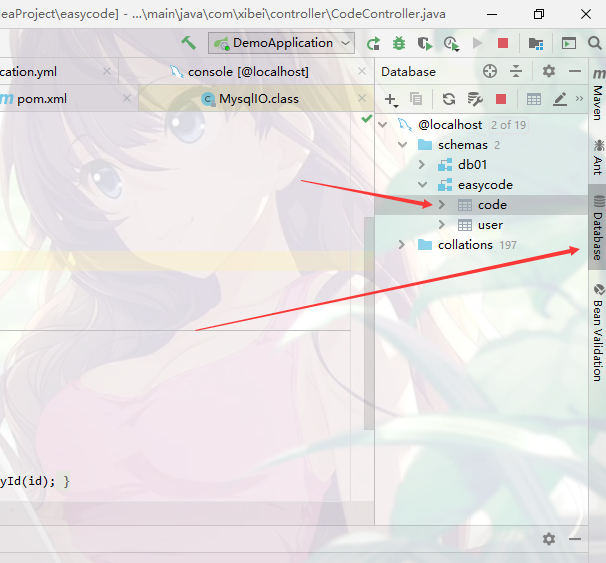
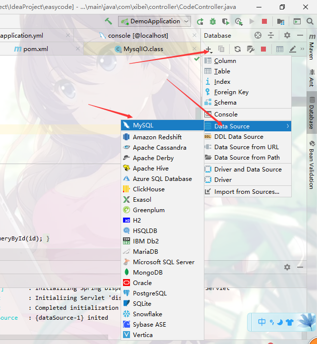
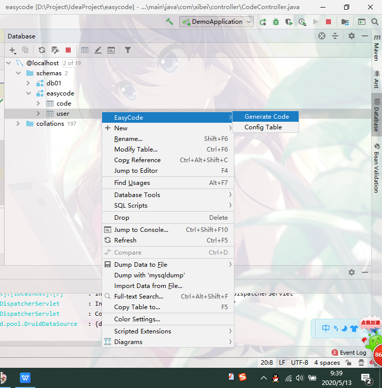
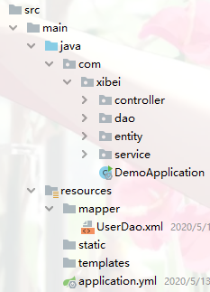
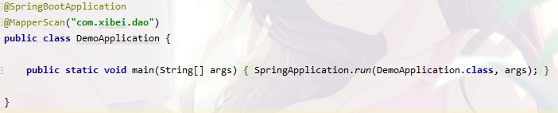

## 懒人 IDEA 插件推荐: EasyCode 一键帮你生成所需代码

Easycode是idea的一个插件，可以直接对数据的表生成entity、controller、service、dao、mapper无需任何编码，简单而强大。

### 1、安装(EasyCode)


我这里的话是已经那装好了。

建议大家在安装一个插件，叫做Lombok。

Lombok能通过注解的方式，在编译时自动为属性生成构造器、getter/setter、equals、hashcode、toString方法。出现的神奇就是在源码中没有getter和setter方法，但是在编译生成的字节码文件中有getter和setter方法。

### 2、建立数据库

```sql
-- ------------------------------ Table structure for user-- ----------------------------DROP TABLE IF EXISTS `user`;
CREATE TABLE `user`(
    `id`int(11) NOT NULL,`username` varchar(20) DEFAULT NULL,
    `sex` varchar(6) DEFAULT NULL,`birthday` date DEFAULT NULL,
    `address` varchar(20) DEFAULT NULL,`password` varchar(20) DEFAULT NULL,  
    PRIMARY KEY (`id`)) ENGINE=InnoDB DEFAULT CHARSET=utf8;
    SET FOREIGN_KEY_CHECKS = 1;
```

### 3、在IDEA配置连接数据库

在这个之前，新建一个Springboot项目，这个应该是比较简单的。

建好SpringBoot项目之后，如下图所示，找到这个Database



按照如下图所示进行操作：



然后填写数据库名字，用户名，密码。点击OK即可。这样的话，IDEA连接数据库就完事了。


### 4、开始生成代码

在这个里面找到你想生成的表，然后右键，就会出现如下所示的截面。



点击1所示的位置，选择你要将生成的代码放入哪个文件夹中，选择完以后点击OK即可。

勾选你需要生成的代码，点击OK。

这样的话就完成了代码的生成了，生成的代码如下图所示：



### 5、pom.xml

```xml
  <dependency>
            <groupId>org.springframework.boot</groupId>
            <artifactId>spring-boot-starter-web</artifactId>
        </dependency>
        <dependency>
            <groupId>org.projectlombok</groupId>
            <artifactId>lombok</artifactId>
            <optional>true</optional>
        </dependency>
        <!--热部署-->
        <dependency>
            <groupId>org.springframework.boot</groupId>
            <artifactId>spring-boot-devtools</artifactId>
            <optional>true</optional><!-- 这个需要为 true 热部署才有效 -->
        </dependency>
        <!--mybatis-->
        <dependency>
            <groupId>org.mybatis.spring.boot</groupId>
            <artifactId>mybatis-spring-boot-starter</artifactId>
            <version>1.3.2</version>
        </dependency>
        <!-- mysql -->
        <dependency>
            <groupId>mysql</groupId>
            <artifactId>mysql-connector-java</artifactId>
            <version>5.1.47</version>
        </dependency>
        <!--阿里巴巴连接池-->
        <dependency>
            <groupId>com.alibaba</groupId>
            <artifactId>druid</artifactId>
            <version>1.0.9</version>
        </dependency>
```

### 6、application.yml

```yml
server:
  port: 8089

spring:
  datasource:
    url: jdbc:mysql://localhost:3306/easycode?useSSL=false&useUnicode=true&characterEncoding=utf-8&autoReconnect=true
    username: root
    password: 981204
    type: com.alibaba.druid.pool.DruidDataSource
    driver-class-name: com.mysql.jdbc.Driver

mybatis:
  mapper-locations: classpath:/mapper/*Dao.xml
  #typeAliasesPackage: com.xibei.entity
```

### 7、启动项目

在启动类里面加上@MapperScan("com.xibei.dao")注解。



启动项目

测试一下

http://localhost:8089/user/selectOne?id=1


EasyCode的用法就介绍到这里了，觉得有用的童鞋赶紧用起来试试吧~