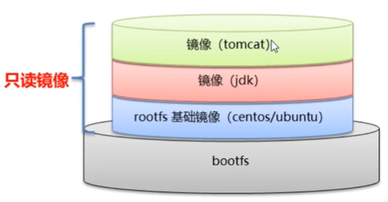
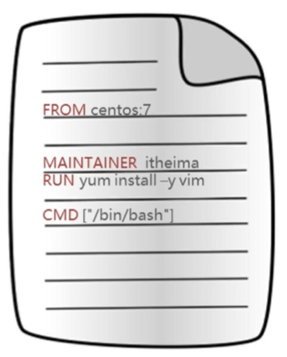

# Docker安装部署

## CentOS

- yum 包更新到最新（花的时间比较多）

  ```
  yum update
  ```

- 安装需要的软件包，yum-util 提供的yum-config-manager功能，另外两个是devicemapper驱动依赖的

  ```
  yum install -y yum-utils device-mapper-persistent-data lvm2
  ```

- 设置yum源

  ```
  yum-confi-manager --add-repo https://download.docker.com/linux/centos/docker-ce.repo
  
  ```

- 安装docker，出现输入的页面都按 y

  ```
  yum install -y docker-ce
  ```

- 查看docker版本，验证是否安装成功

  ```
  docker -v
  ```

### 其他安装方式(推荐)

教程链接：[Here!](https://www.jianshu.com/p/1e5c86accacb)

# Docker命令

## Docker服务相关命令

- 启动docker服务

  ```
  systemctl start docker
  systemctl start docker
  ```

- 停止docker服务

  ```
  systemctl stop docker
  ```

- 重启docker服务

  ```
  systemctl restart docker
  ```

- 查看docker服务状态

  ```
  systemctl status docker
  ```

- 设置开机启动docker服务

  ```
  systemstl enable docker
  ```

## Docker镜像相关命令

- 查看镜像：查看本地所有的镜像

  ```
  docker images
  docker images -q # 查看所有镜像id
  ```

- 搜索镜像：从网络中查找需要的镜像

  ```
  docker search 镜像名称
  ```

- 拉取镜像：从docker仓库下载镜像到本地，镜像名称格式为 名称:版本号，如果版本号不指定则是**最新版本**。如果不知道镜像版本，可以去[docker hub](http://hub.docker.com/) 搜索对应镜像查看

  ```
  docker pull 镜像名称
  ```

- 删除镜像

  ```
  docker rmi 镜像id
  docker rmi `docker images -q` # 删除所有本地镜像
  ```

## Docker容器相关的命令

- 查看容器

  ```
  docker ps # 查看正在运行的容器
  docker ps -a # 查看所有容器
  ```

- 创建并启动容器

  ```
  docker run 参数
  
  ```

  - 参数说明：
    - -i：保持容器运行。通常与-t同时使用。加入it这两个参数后，容器创建后自动进入容器中，退出容器后，容器自动关闭。
    - -t：为容器重新分配一个伪输入终端，通常与-i同时使用。
    - -d:以守护（后台）模式运行容器。创建一个容器在后台运行，需要使用`docker exec`进入容器。退出时，容器不会关闭。
    - -it：创建的容器一般称为**交互式容器**。
    - -id：创建的容器一般称为**守护式容器**。
    - –name：为创建的容器命名。

- 进入容器

  ```
  docker exec 参数 # 退出容器，容器不会关闭
  ```

- 启动容器

  ```
  docker start 容器名称
  ```

- 停止容器

  ```
  docker stop 容器名称
  ```

- 删除容器：如果容器是运行状态则删除失败，需要停止容器才能删除

  ```
  docker rm 容器名称
  ```

- 查看容器信息

  ```
  docker inspect 容器名称
  ```

# Docker容器的数据卷

## 数据卷概念和作用

### 思考

- Docker容器删除后，在容器中产生的数据也会随之销毁吗？
  - 会。
- Docker容器和外部机器可以直接交换文件吗？
  - 不可以。
- 容器之间想要进行数据交互？
  - 不可以。

> *那咋办嘛？这就要用到数据卷了*

### 数据卷

- 数据卷是宿主机中的一个**目录或文件**
- 当容器目录和数据卷目录绑定后，对方的修改会立即同步
- 一个数据卷可以被**多个容器同时挂载**
- 一个容器也可以被挂载**多个数据卷**

### 数据卷的作用

- 容器数据持久化
- 外部机器和容器间接通信
- 容器之间数据交换

## 配置数据卷

- 创建启动容器时，使用`-v`参数设置数据卷

  ```
  docker run ...-v 宿主机目录(文件):容器内目录(文件)...
  
  ```

- 注意事项：

  1. 目录必须是**绝对路径**
  2. 如果目录不存在，会**自动创建**
  3. 可以挂载**多个**数据卷

## 数据卷容器

### 配置数据卷容器

- 创建启动c3数据卷容器，使用`-v`参数设置数据卷

  ```
  docker run -it --name-=c3 -v /volume centos:7 /bin/bash
  
  ```

- 创建启动c1 c2数据卷容器，使用`-volumes-from`参数设置数据卷

  ```
  docker run -it --name-=c1 -volumes-from c3 centos:7 /bin/bash
  docker run -it --name-=c2 -volumes-from c3 centos:7 /bin/bash
  
  ```

\#Docker应用部署

## MySQL部署

- 搜索MySQL镜像

  ```
  docker search mysql
  ```

- 拉取MySQL镜像

  ```
  docker pull mysql:5.6
  ```

- 创建容器，设置端口映射、目录映射

  ```
  # 在/root目录下创建mysql目录用于存储mysql数据信息
  mkdir ~/mysql
  cd ~/mysql
  ```

  ------

  ```
  docker run -id \
  --name=c_mysql \
  -p 3307:3306 \
  -v $PWD/conf:/etc/mysql/confi.d \
  -v $PWD/logs:/logs \
  -v $PWD/data:/var/lib/mysql \
  -e MYSQL_ROOT_PASSWORD=123456 \
  mysql:5.6
  ```

  - 参数说明：
    - -p 3307:3306：将容器的3306端口映射到宿主机的3307端口。
    - -v $PWD/conf:/etc/mysql/confi.d：将主机当前目录下的conf/my.cnf挂载到容器的/etc/mysql/my.cnf。配置目录
    - -v $PWD/logs:/logs：将主机当前目录下的logs目录挂载到容器的/logs。日志目录
    - -v $PWD/data:/var/lib/mysql：将主机当前目录下的data目录挂载到容器的/var/lib/mysql。数据目录
    - -e MYSQL_ROOT_PASSWORD=123456：初始化root用户的密码。

## Tomcat部署

- 搜索Tomcat镜像

  ```
  docker search tomcat
  ```

- 拉取Tomcat镜像

  ```
  docker pull tomcat
  ```

- 创建容器，设置端口映射、目录映射

  ```
  # 在/root目录下创建tomcat目录用于存储tomcat数据信息
  mkdir ~/tomcat
  cd ~/tomcat
  ```

  ------

  ```
  docker run -id \
  --name=c_tomcat \
  -p 8080:8080 \
  -v $PWD:/usr/local/tomcat/webapps \
  tomcat
  ```

  - 参数说明：
    - -p 8000:8080：将容器的8080端口映射到宿主机的8000端口。
    - -v $PWD:/usr/local/tomcat/webapps：将主机当前目录挂载到容器的/usr/local/tomcat/webapps。

## Nginx部署

- 搜索Nginx镜像

  ```
  docker search nginx
  ```

- 拉取Nginx镜像

  ```
  docker pull nginx
  ```

- 创建容器，设置端口映射、目录映射

  ```
  # 在/root目录下创建nginx目录用于存储nginx数据信息
  mkdir ~/nginx
  cd ~/nginx
  mkdir conf
  cd conf
  # 在~/nginx/conf/下创建nginx.conf文件，粘贴下面内容
  vim nginx.conf
  ```

  ------

  ```
  user  nginx;
  worker_processes  1;
   
  error_log  /var/log/nginx/error.log warn;
  pid        /var/run/nginx.pid;
   
  events {
      worker_connections  1024;
  }
   
  http {
      include       /etc/nginx/mime.types;
      default_type  application/octet-stream;
   
      log_format  main  '$remote_addr - $remote_user [$time_local] "$request" '
                        '$status $body_bytes_sent "$http_referer" '
                        '"$http_user_agent" "$http_x_forwarded_for"';
   
      access_log  /var/log/nginx/access.log  main;
   
      sendfile        on;
      #tcp_nopush     on;
   
      keepalive_timeout  65;
   
      #gzip  on;
   
      include /etc/nginx/conf.d/*.conf;
  }
  ```

  ------

  ```
  docker run -id \
  --name=c_nginx \
  -p 81:80 \
  -v $PWD/conf/nginx.conf:/etc/nginx/nginx.conf \
  -v $PWD/logs:/var/log/nginx \
  -v $PWD/html:/usr/share/nginx/html \
  nginx
  ```

  - 参数说明：
    - -p 81:80：将容器的80端口映射到宿主机的81端口。
    - v $PWD/conf/nginx.conf:/etc/nginx/nginx.conf：将主机当前目录下的/conf/nginx.conf挂载到容器的/etc/nginx/nginx.conf。配置目录
    - -v $PWD/logs:/var/log/nginx：将主机当前目录下的logs目录挂载到容器的/var/log/nginx。日志目录
    - -v $PWD/html:/usr/share/nginx/html：将主机当前目录下的/html挂载到容器的/usr/share/nginx/html。

## Redis部署

- 搜索Redis镜像

  ```
  docker search redis
  ```

- 拉取Redis镜像

  ```
  docker pull redis:5.0
  ```

- 创建容器，设置端口映射、目录映射

  ```
  docker run -id --name=c_redis -p 6379:6379 redis:5.0
  
  ```

  - 参数说明：
    - -p 6379:6379：将容器的6379端口映射到宿主机的6379端口。

- 使用外部机器连接redis

  ```
  ./redis-cli.exe -h <your ipAddress> -p 6379    
  ```

# Dockerfile

## Docker镜像原理

### 思考

- Docker镜像本质是什么？

  - 是一个分层的文件系统

- Docker中一个centos镜像为什么只有200MB，而一个centos操作系统的

  ```
  iso
  ```

  文件要几个GB？

  - Centos的`iso`镜像文件包含`bootfs`和`rootfs`，而docker的centos镜像**复用**操作系统的`bootfs`，只包含`rootfs`和其他镜像层

- Docker中一个tomcat镜像为什么有500MB，而一个tomcat安装包只有70多MB？

  - 由于docker中镜像是分层的，tomcat虽然只有70多MB，但它需要依赖于**父镜像**和**子镜像**，所有整个对外暴露的tomcat镜像大小有500多MB

### Linux文件系统

- bootfs：包含`bootloader`（引导加载系统）和`kernel`（内核）
- rootfs：root文件系统，包含的就是典型的Linux系统中的`/dev`，`/proc`，`/bin`，`/etc`等标准目录和文件
- 不用的Linux发行版，`bootfs`基本一样，而`rootfs`不同，如Ubuntu，centos等


### Docker镜像

- Docker镜像是由特殊的文件系统叠加而成
- 最底端是`bootfs`,并使用宿主机的`bootfs`
- 第二层是root文件系统`rootfs`,称为`base image`
- 然后再往上可以叠加其他的镜像文件
- ***统一文件系统(Union File System)\***技术能够将不同的层整合成一个文件系统,为这些层提供了一个统一的视角，这样就隐藏了多层的存在，在用户的角度看来,只存在一个文件系统。
- 一个镜像可以放在另一个镜像的上面。位于下面的镜像称为***父镜像\***，最底部的镜像成为***基础镜像\***。
- 当从一个镜像启动容器时，Docker会从最顶层加载一个**读写文件系统**作为容器



## 镜像制作

- 容器转为镜像

  ```
  docker commit 容器id 镜像名称:版本号  # 将容器转换为镜像文件
  docker save -o 压缩文件名称 镜像名称:版本号  # 将镜像文件打包成压缩文件，之后就能对压缩文件传送了
  docker load -i 压缩文件名称  # 将压缩文件解压称为镜像文件
  ```

- Dockerfile

  - *看下面内容*

## Dockerfile概念及作用

### 概念

- Dockerfile是一个文本文件
- 包含了一条条的指令
- 每一条指令构建一层，基于基础镜像，最终构建出一个新的镜像
- 对于开发人员：可以为开发团队提供一个完全一致的开发环境
- 对于测试人员：可以直接拿开发时所构建的镜像或者通过Dockerfile文件构建一个新的镜像开始工作了
- 对于运维人员：在部署时，可以实现应用的无缝移植



## Dockerfile关键字

*列举一些常用的*

| 关键字      | 作用                     | 备注                                                         |
| :---------- | :----------------------- | :----------------------------------------------------------- |
| FROM        | 指定父镜像               | 指定dockerfile基于那个image构建                              |
| MAINTAINER  | 作者信息                 | 用来标明这个dockerfile谁写的                                 |
| LABEL       | 标签                     | 用来标明dockerfile的标签 可以使用Label代替Maintainer 最终都是在docker image基本信息中可以查看 |
| RUN         | 执行命令                 | 执行一段命令 默认是/bin/sh 格式: RUN command 或者 RUN [“command” , “param1”,”param2”] |
| CMD         | 容器启动命令             | 提供启动容器时候的默认命令 和ENTRYPOINT配合使用.格式 CMD command param1 param2 或者 CMD [“command” , “param1”,”param2”] |
| ENTRYPOINT  | 入口                     | 一般在制作一些执行就关闭的容器中会使用                       |
| COPY        | 复制文件                 | build的时候复制文件到image中                                 |
| ADD         | 添加文件                 | build的时候添加文件到image中 不仅仅局限于当前build上下文 可以来源于远程服务 |
| ENV         | 环境变量                 | 指定build时候的环境变量 可以在启动的容器的时候 通过-e覆盖 格式ENV name=value |
| ARG         | 构建参数                 | 构建参数 只在构建的时候使用的参数 如果有ENV 那么ENV的相同名字的值始终覆盖arg的参数 |
| VOLUME      | 定义外部可以挂载的数据卷 | 指定build的image那些目录可以启动的时候挂载到文件系统中 启动容器的时候使用 -v 绑定 格式 VOLUME [“目录”] |
| EXPOSE      | 暴露端口                 | 定义容器运行的时候监听的端口 启动容器的使用-p来绑定暴露端口 格式: EXPOSE 8080 或者 EXPOSE 8080/udp |
| WORKDIR     | 工作目录                 | 指定容器内部的工作目录 如果没有创建则自动创建 如果指定/ 使用的是绝对地址 如果不是/开头那么是在上一条workdir的路径的相对路径 |
| USER        | 指定执行用户             | 指定build或者启动的时候 用户 在RUN CMD ENTRYPONT执行的时候的用户 |
| HEALTHCHECK | 健康检查                 | 指定监测当前容器的健康监测的命令 基本上没用 因为很多时候 应用本身有健康监测机制 |
| ONBUILD     | 触发器                   | 当存在ONBUILD关键字的镜像作为基础镜像的时候 当执行FROM完成之后 会执行 ONBUILD的命令 但是不影响当前镜像 用处也不怎么大 |
| STOPSIGNAL  | 发送信号量到宿主机       | 该STOPSIGNAL指令设置将发送到容器的系统调用信号以退出。       |
| SHELL       | 指定执行脚本的shell      | 指定RUN CMD ENTRYPOINT 执行命令的时候 使用的shell            |

## 制作自定义centos镜像

### 自定义需求

- 默认登录路径为`/usr`
- 可以使用vim

### 操作

- 创建编辑dockerfile文件

  ```
  mkdir /root/dockerfile
  cd dockerfile
  vim centos_dockerfile
  ```

  - 定义父镜像：`FROM centos:7`
  - 定义作者信息：`MAINTAINER adongyo <adongyo@it.cn>`
  - 执行安装vim命令：`RUN yum install -y vim`
  - 定义默认的工作目录：`WORKDIR /usr`
  - 定义容器启动执行的命令：`CMD /bin/bash`

- 执行命令

  ```
  docker build -f ./centos_dockerfile -t myCentos:1 .
  ```

  - 参数说明：
    - -f： 指定dockerfile文件
    - -t： 设置生成的新的镜像的名称
    - .： 别漏了后面还有一个’.’