# 1、Spring

## 1.1、 简介

- Spring: ----给软件行业带来了春天!
- 2002, 首次推出了Spring框架的雏形: interface21框架!
- Spring框架即以interface21框架为基础,经过重新设计 ，并不断丰富其内涵,于2004年月24日发布了1.0正式
  版。
- Rod Johnson，Spring Framework创始人，著名作者。很难想象Rod Johnson的学历， 真的让好多人大吃一
  惊，他是悉尼大学的博士，然而他的专业不是计算机，而是音乐学。
- spring理念: 使现有的技术更加容易使用，本身是一 个大杂烩，整合了现有的技术框架!
- SSH : Struct2 + Spring + Hibernate!
- SSM: SpringMvc + Spring + Mybatis!

官网: https://docs.spring.io/spring/docs/5.2.3.RELEASE/spring-framework-reference/

官方下载地址:https://repo.spring.io/release/org/springframework/spring/

GitHub:https://github.com/spring-projects/spring-framework

## 1.2、 优点

- Spring是一个开源的免费的框架(容器) !
- Spring是一个轻量级的、非入侵式的框架!
- 控制反转(IOC) ， 面向切面编程(AOP) !
- 支持事务的处理,对框架整合的支持!

总结一句话: Spring就是一个轻量级的控制反转(I0C)和面向切面编程的框架!==

## 1.3、组成

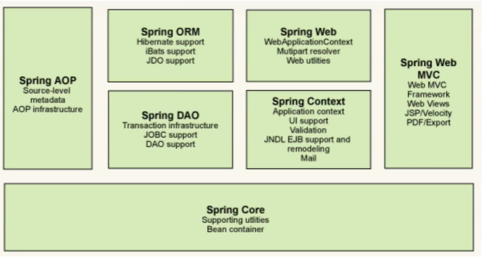

## 1.4、拓展

在Spring的官网有这个介绍:现代化的Java开发!说白就是基于Spring的开发!

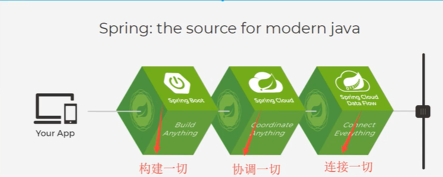

- Spring Boot
  - 一个快速开发的脚手架。
  - 基于SpringBoot可以快速的开发单个微服务。
  - 约定大于配置!
- Spring Cloud
- SpringCloud 是基于SpringBoot实现的。
  因为现在大多数公司都在使用SpringBoot进行快速开发，学习SpringBoot的前提， 需要完全掌握Spring及
  SpringMVC!
- 承上启下的作用!

**弊端:发展了太久之后，违背了原来的理念!配置十分繁琐，人称:”配置地狱!”**

# 2、IOC理论推导

1. UserDao接口
2. UserDaolmpl实现类
3. UserService业务接口
4. UserServicelmpl 业务实现类

在我们之前的业务中,用户的需求可能会影响我们原来的代码，我们需要根据用户的需求去修改原代码!如果程序
代码量十分大，修改一次的成本代价十分昂贵!

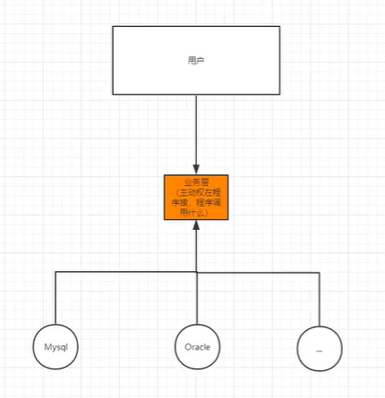

我们使用一个Set接口实现.已经发生了革命性的变化!

```JAVA
 //利set.进行动态实现值的注入!
    public void setUserMapper(UserMapper userMapper) {
       this.userMapper = userMapper;
    }
```

> 之前，程序是主动创建对象!控制权在程序猿手上!
> 使用了set注入后，程序不再具有主动性，而是变成了被动的接受对象!

这种思想，从本质上解决了问题，我们程序猿不用再去管理对象的创建了。系统的耦合性大大降低~，可以更加专
注的在业务的实现上!这是IOC的原型!

现在：

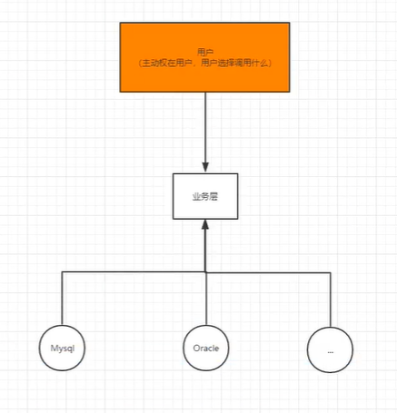

## IOC本质

**控制反转IOC(Inversion of Control),是一种设计思想，DI(依赖注入)是实现IOC的一种方法**，也有人认为DI只是
loC的另一种说法。没有IOC的程序中，我们使用面向对象编程,对象的创建与对象间的依赖关系完全硬编码在程序
中，对象的创建由程序自己控制，控制反转后将对象的创建转移给第三方，个人认为所谓控制反转就是:获得依赖
对象的方式反转了。

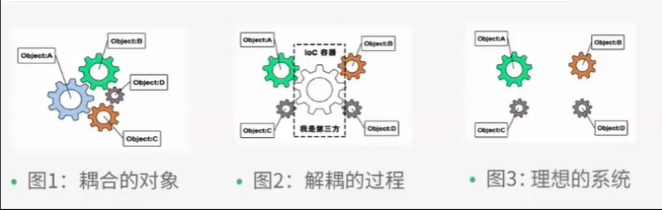

采用XML方式配置Bean的时候，Bean的定义信息是和实现分离的，而采用注解的方式可以把两者合为- -体，
Bean的定义信息直接以注解的形式定义在实现类中，从而达到了零配置的目的。

**控制反转是一种通过描述(XML或注解)并通过第三方去生产或获取特定对象的方式。在Spring中实现控制反
转的是IoC容器，其实现方法是依赖注入(Dependency Injection,DI)。**

# 3、HelloSpring

beans.xml官网配置文件：

```xml
<?xml version="1.0" encoding="UTF-8"?>
<beans xmlns="http://www.springframework.org/schema/beans"
       xmlns:xsi="http://www.w3.org/2001/XMLSchema-instance"
       xsi:schemaLocation="http://www.springframework.org/schema/beans
        https://www.springframework.org/schema/beans/spring-beans.xsd">

    
</beans>
```

bean对象添加：

```xml
<?xml version="1.0" encoding="UTF-8"?>
<beans xmlns="http://www.springframework.org/schema/beans"
       xmlns:xsi="http://www.w3.org/2001/XMLSchema-instance"
       xsi:schemaLocation="http://www.springframework.org/schema/beans
        https://www.springframework.org/schema/beans/spring-beans.xsd">

    <!--使用Spring来创建对象。在Spring这些 都称为Bean
    类型变量名= new类型();
    Hello hello = new HeLlo();
    id =变量名
    class = new的对象:
    property相当于给对象中的属性设置一个值!-->
    <bean id="hello" class="com.lenovo.pojo.Hello">
        <property name="str" value="Spring"/>
    </bean>

</beans>
```

Test方法：

```java
public class MyTest {
    public static void main(String[] args) {
        //获取Spring的上下文对象!
        ApplicationContext context = new ClassPathXmlApplicationContext("beans.xml");
        //我们的对象现在都在Spring中的管理了，我们要使用，直按去里面取出来就可以!
        Hello hello = (Hello) context.getBean("hello");
        System.out.println(hello.toString());
    }

}
```

例：

bean对象添加：

```xml
<?xml version="1.0" encoding="UTF-8"?>
<beans xmlns="http://www.springframework.org/schema/beans"
       xmlns:xsi="http://www.w3.org/2001/XMLSchema-instance"
       xsi:schemaLocation="http://www.springframework.org/schema/beans
        https://www.springframework.org/schema/beans/spring-beans.xsd">

    <bean id="mapperimpl" class="com.lenovo.dao.UserMapperImpl"/>
    <bean id="mysqlimpl" class="com.lenovo.dao.UserMySQLImpl"/>
    <bean id="serviceimpl" class="com.lenovo.service.UserServiceImpl">
        <property name="userMapper" ref="mysqlimpl"/>

        <!--ref :引Spring 容器中创建好的对象
        value :具体的值， 基本数据类型!-->
    </bean>
</beans>
```

Test方法：

```java
public class MyTest {
    @Test
    public void test(){
        //获取ApplicationContext;拿到Spring的容器
        ApplicationContext context = new ClassPathXmlApplicationContext("beans.xml");
        //容器在手，天下我有，需要什么，就直按getf什么!
        UserServiceImpl bean = (UserServiceImpl) context.getBean("serviceimpl");
        bean.getUser();
    }
} 
```

### 思考问题？

- Hello 对象是谁创建的?

  hello对象是由Spring创建的

- Hello 对象的属性是怎么设置的?

  hello对象的属性是由Spring容器设置的,

  这个过程就叫控制反转:

  控制:谁来控制对象的创建,传统应用程序的对象是由程序本身控制创建的，使用Spring后，对象是

  由Spring来创建的.

  反转:程序本身不创建对象,而变成被动的接收对象.

  依赖注入:就是利用set方法来进行注入的.

  IOC是一种编程思想,由主动的编程变成被动的接收.

  可以通过newClassPathXmlApplicationContext去浏览一下底层源码 .

  **OK ,到了现在，我们彻底不用再程序中去改动了,要实现不同的操作，只需要在xm|配置文件中进行
  修改所谓的IoC,一句话搞定:对象由Spring 来创建，管理,装配!**

IDEA快捷创建beans.xml文件，自动导入spring配置信息：

# 4、IOC创建对象的方式

1. 使用无参构造创建对象，默认方式！

2. 假设我们要使用有参构造创建对象。

   1.下标赋值。

   ```xml
    <!--第一所下标赋值-->
       <bean id="user" class="com.lenovo.pojo.User">
           <constructor-arg index="0" value="雏田"/>
       </bean>
   ```

   2.类型赋值。

   ```xml
    <!--第二种，通过类型创建，不建议使用，重复类型难以分辨-->
       <bean id="user" class="com.lenovo.pojo.User">
           <constructor-arg type="java.lang.String" value="小樱"/>
       </bean>
   ```

   3.参数名赋值。(推荐)

   ```xml
   <!--第三种，直接通过参数名来设置-->
       <bean id="user" class="com.lenovo.pojo.User">
           <constructor-arg name="name" value="琳"/>
       </bean>
   ```

# 5、 Spring配置

## 5.1 别名

```xml
<!--别名，如果添加了别名，我们也可以使用别名获取到-->
<alias name="user" alias="userNew"></alias>
```

## 5.2 Bean的配置

```xml
<!--
    id:bean的唯一标识符，相当于我们学的对象名；
    class：bean对象所对应的全限定名：包名+类名；
    name：也是别名，可以同时取多个别名，逗号分割
-->
<bean id="userT" class="com.kuang.pojo.UserT" name="user2,u2 u3;u4">
</bean>
```

## 5.3 import

这个import，一般用于团队开发使用，他可以将多个配置文件，导入合并为一个。

假设，现在项目中有多个人开发，这三个人负责不同的类开发，不同的类需要注册在不同的bean中，我们可以利用import将所有人的beans.xml合并为一个总的！

- 张三
- 李四
- 王五
- applicationContext.xml

```xml
<import resource="beans.xml"/>
<import resource="beans2.xml"/>
<import resource="beans3.xml"/>
```

使用的时候，直接使用总的配置就可以了。

# 6、 依赖注入

## 6.1 构造器注入

之前已经介绍过。

## 6.2 Set方式注入【重点】

- 依赖注入：Set注入！
  - 依赖：bean对象的创建依赖于容器！
  - 注入：bean对象中的所有属性，由容器来注入！

**【环境搭建】**

1.复杂类型

```java
public class Address {
    private String address;

    public String getAddress() {
        return address;
    }

    public void setAddress(String address) {
        this.address = address;
    }
}
```

2.真实测试对象

```java
public class Student {
    private String name;
    private Address address;
    private String[] books;
    private List<String> hobbies;
    private Map<String,String> card;
    private Set<String> games;
    private String wife;
    private Properties info;
}
```

3.beans.xml

```xml
<?xml version="1.0" encoding="UTF-8"?>
<beans xmlns="http://www.springframework.org/schema/beans"
       xmlns:xsi="http://www.w3.org/2001/XMLSchema-instance"
       xsi:schemaLocation="http://www.springframework.org/schema/beans http://www.springframework.org/schema/beans/spring-beans.xsd">
    <bean id="student" class="com.kuang.pojo.Student">
        <!--第一种，普通值注入-->
        <property name="name" value="成博"/>
    </bean>
</beans>
```

4.测试类

```java
public class MyTest {
    public static void main(String[] args) {
        ApplicationContext context = new ClassPathXmlApplicationContext("beans.xml");
        Student student = (Student) context.getBean("student");
        System.out.println(student.getName());
    }
}
```

**完善注入:**

```xml
<?xml version="1.0" encoding="UTF-8"?>
<beans xmlns="http://www.springframework.org/schema/beans"
       xmlns:xsi="http://www.w3.org/2001/XMLSchema-instance"
       xsi:schemaLocation="http://www.springframework.org/schema/beans
        https://www.springframework.org/schema/beans/spring-beans.xsd">

    <bean id="address" class="com.lenovo.pojo.Address">
        <property name="address" value="承德"/>
    </bean>

    <bean id="student" class="com.lenovo.pojo.Student">
        <!--第一种，普通值注入-->
        <property name="name" value="成博"/>
        <!--第二种. Bean注入。ref-->
        <property name="address" ref="address"/>
        <!--数组注入-->
        <property name="books">
            <array>
                <value>红楼梦</value>
                <value>西游记</value>
                <value>水浒传</value>
                <value>三国演义</value>
            </array>
        </property>
        <!--List注入-->
        <property name="hobbies">
            <list>
                <value>听歌</value>
                <value>敲代码</value>
                <value>看电影</value>
            </list>
        </property>
        <!--Map-->
        <property name="card">
            <map>
                <entry key="身份证" value="1555555555"/>
                <entry key="银行卡" value="5555555555"/>
            </map>
        </property>
        <!--Set-->
        <property name="games">
            <set>
                <value>lol</value>
                <value>王者荣耀</value>
                <value>吃鸡</value>
            </set>
        </property>
        <!--null-->
        <property name="wife">
            <null/>
        </property>
        <!--Properties-->
        <property name="info">
            <props>
                <prop key="driver">com.mysql.jdbc.Driver</prop>
                <prop key="url">jdbc:mysql://localhost:3306/news</prop>
                <prop key="root">root</prop>
                <prop key="password">123456</prop>
            </props>
        </property>
    </bean>
</beans>
```

测试结果

```java
public class MyTest {
    public static void main(String[] args) {
        ApplicationContext context = new ClassPathXmlApplicationContext("beans.xml");
        Student student = (Student) context.getBean("student");
        System.out.println(student.toString());
        /*
        * Student{
        * name='成博', 
        * address=Address{address='承德'}, 
        * books=[红楼梦, 西游记, 水浒传, 三国演义], 
        * hobbies=[听歌, 敲代码, 看电影], card={身份证=1555555555, 银行卡=5555555555}, 
        * games=[lol, 王者荣耀, 吃鸡], 
        * wife='null', 
        * info={root=root, url=jdbc:mysql://localhost:3306/news, password=123456, driver=com.mysql.jdbc.Driver}}
        */
    }
}
```

## 6.3 拓展方式注入

我们可以使用c和p命令空间进行注入：（对应属性注入和构造器注入）

使用：

```xml
<?xml version="1.0" encoding="UTF-8"?>
<beans xmlns="http://www.springframework.org/schema/beans"
       xmlns:p="http://www.springframework.org/schema/p"
       xmlns:c="http://www.springframework.org/schema/c"
       xmlns:xsi="http://www.w3.org/2001/XMLSchema-instance"
       xsi:schemaLocation="http://www.springframework.org/schema/beans
        https://www.springframework.org/schema/beans/spring-beans.xsd">
    <!--p命名空间注入，可以直接注入属性的值：property-->
    <bean id="user" class="com.lenovo.pojo.User" p:name="成博" p:age="18"/>

    <!--c命名空间注入，通过构造器注入：construct-args-->
    <bean id="user2" class="com.lenovo.pojo.User" c:age="18" c:name="雏田"/>

</beans>
```

测试:

```java
@Test
public void test2(){
    ApplicationContext context = new ClassPathXmlApplicationContext("userbeans.xml");
    User user = context.getBean("user2", User.class);
    System.out.println(user);
}
```

注意点：p和c命名空间不能直接使用，需要导入xml约束！

```xml
 xmlns:p="http://www.springframework.org/schema/p"
 xmlns:c="http://www.springframework.org/schema/c"
```

## 6.4 bean的作用域

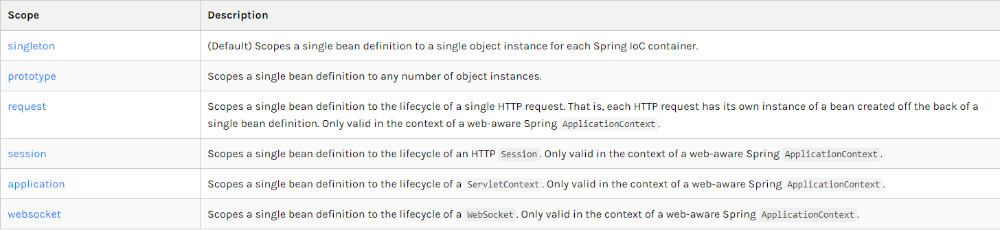

1. 代理模式（Spring默认机制）：get到的都是同一个对象！

   ```xml
   <bean id="user2" class="com.lenovo.pojo.User" c:age="18" c:name="成博" scope="singleton"/>
   ```

2. 原型模式：每次从容器中get的时候，都会产生一个新的对象！

   ```xml
   <bean id="user2" class="com.lenovo.pojo.User" c:age="18" c:name="成博" scope="prototype"/>
   ```

3. 其余的request、session、application、这些个只能在web开发中使用。

# 7、 Bean的自动装配

首先看一般操作

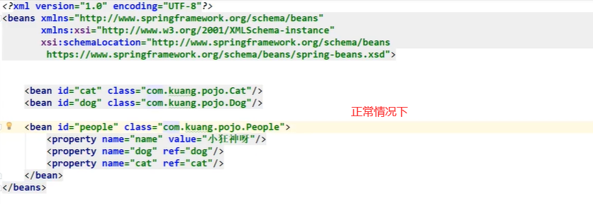

- 自动装配是Spring满足bean依赖的一种方式！
- Spring会在上下文中自动寻找，并自动给bean装配**属性！**

在Spring中有三种装配的方式：

1. 在xml中显式配置；
2. 在java中显式配置；
3. 隐式的自动装配bean

## 7.1 测试

环境搭建：一个人有两个宠物！

## 7.2 ByName自动装配

```xml
    <bean id="cat" class="com.lenovo.pojo.Cat"/>
    <bean id="dog" class="com.lenovo.pojo.Dog"/>
<!--
    byName:会自动在容器上下文中查找和自己对象set方法后面的值对应的beanid！
-->
    <bean id="people" class="com.lenovo.pojo.People" autowire="byName">
        <property name="name" value="小狂神呀"/>

    </bean>
```

## 7.3 ByType自动装配

```xml
 <bean class="com.lenovo.pojo.Cat"/>
 <bean class="com.lenovo.pojo.Dog"/>
    <!--
    byType:会自动在容器上下文中查找，和自己对象属性类型相同的bean！必须保证类型全局唯一。
-->
    <bean id="people" class="com.lenovo.pojo.People" autowire="byType">
        <property name="name" value="小狂神呀"/>

    </bean>
```

小结：

- byName的时候，需要保证所有bean的id唯一，并且这个bean需要和自动注入的属性的set方法的值一致！
- byType的时候，需要保证所有bean的class唯一，并且这个bean需要和自动注入的属性的类型一致！

## 7.4 使用注解实现自动装配

jdk1.5支持注解，Spring2.5开始支持注解。

要使用注解须知：

1. 导入约束：context约束。

2. 配置注解的支持：context:annot-config/【重要】

   ```xml
   <?xml version="1.0" encoding="UTF-8"?>
   <beans xmlns="http://www.springframework.org/schema/beans"
          xmlns:xsi="http://www.w3.org/2001/XMLSchema-instance"
          xmlns:context="http://www.springframework.org/schema/context"
          xsi:schemaLocation="http://www.springframework.org/schema/beans
           https://www.springframework.org/schema/beans/spring-beans.xsd
            http://www.springframework.org/schema/context
           https://www.springframework.org/schema/context/spring-context.xsd">
       <!--开启注解的支持-->
       <context:annotation-config/>
       <bean id="cat" class="com.lenovo.pojo.Cat"/>
       <bean id="dog" class="com.lenovo.pojo.Dog"/>
       <bean id="people" class="com.lenovo.pojo.People"/>
   
   </beans>
   ```

**@Autowired**

直接在属性上使用即可！也可以在set方式上使用！

使用Autowired我们可以不用编写Set方法了，前提是你这个自动装配的属性在IoC（Spring）容器中存在，且符合名字byName！

科普：

```java
@Nullable	字段标记了这个注解，说明这个字段可以为null
    public People(@Nullable String name){
    this.name = name;
}
public @interface Autowired {
    boolean required() default true;
}
```

测试代码：

```java
public class People {
    //如果显式定义了Autowired的required属性为false，说明这个对象可以为null，否则不允许为空
    @Autowired(required = false)
    private Dog dog;
    @Autowired
    private Cat cat;
    private String name;
}
```

如果@Autowired自动装配的环境比较复杂，自动装配无法通过一个注解@Autowired完成的时候，我们可以使用@Qualifier(value="xxx")去配何@Autowired的使用，指定一个唯一的bean对象注入！

```java
public class People {
    @Autowired
    @Qualifier(value="dog11")
    private Dog dog;
    @Autowired
	@Qualifier(value="cat11")
    private Cat cat;
    private String name;
}
```

**@Resource注解**

```java
public class People {
    @Resource(name = "cat2")
    private Cat cat;
    @Resource
    private Dog dog;
}
```

小结：

@Resource和@Autowired的区别：

- 都是用来自动装配的，都可以放在属性字段上；
- @Autowired通过byType的方式实现，而且必须要求这个对象存在！【常用】
- @Resource默认通过byName的方式实现，如果找不到名字，则通过byType实现！如果两个都找不到的情况下，就报错！
- 执行顺序不同：@Autowired通过byType的方式实现，@Resource默认通过byName的方式实现。

总结：在配置文件加载的时候，容器中管理的对象就已经初始化了！

# 8、使用注解开发

在spring4之后，要使用注解开发，必须要保证aop的包导入了。

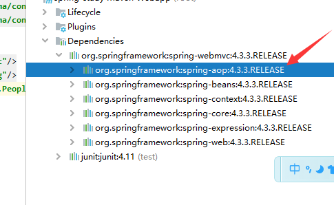

使用注解需要导入context约束，增加注解的支持！

```xml
<!--指定要扫描的包，这个包下的注解会生效-->
<context:component-scan base-package="com.kuang.pojo"/>
```

1. bean

2. 属性如何注入

   ```java
   //等价于<bean id="user" class="com.kuang.pojo.User"/>
   //@Component 组件
   @Component
   public class User {
       public String name="成博";
       public void setName(String name){
           this.name = name;
       }
   }
   ```

   ```java
   //等价于<bean id="user" class="com.kuang.pojo.User"/>
   //@Component 组件
   @Component
   public class User {
       //相当于<property name="name" value="成博"/>
       public String name;
       @Value("成博")
       public void setName(String name){
           this.name = name;
       }
   }
   ```

3. 衍生的注解

   @Component有几个衍生注解，我们在web开发中，会按照mvc三层架构分层！

   - dao【@Repository】

     ```java
     @Repository
     public interface UserDao {
     }
     ```

   - service【@Service】

     ```java
     @Service
     public interface UserService {
     }
     ```

   - controller【@Controller】

     ```java
     @Controller
     public class UserController {
     }
     ```

   **这四个注解功能都是一样的，都是代表将某个类注册到Spring中，装配Bean！**

4. 自动装配

   ```
   -@Autowired:自动装配通过类型，名字
   	如果Autowired不能唯一自动装配上属性，则需要通过@Qualifier(value="xxx")
   -@Nullable:字段标记了这个注解，说明这个字段可以为null
   -@Resource:自动装配通过名字，类型
   ```

5. 作用域

   ```java
   //等价于<bean id="user" class="com.kuang.pojo.User"/>
   //@Component 组件
   @Component
   //设置作用域
   @Scope("singleton")
   public class User {
       public String name="成博";
       public void setName(String name){
           this.name = name;
       }
   }
   ```

6. 小结

   xml与注解：

   - xml更加万能，适用于任何场合！维护简单方便。
   - 注解，不是自己的类使用不了，维护相对复杂！

   xml与注解最佳实践：

   - xml用来管理bean；
   - 注解只负责完成属性的注入；
   - 我们在使用的过程中，只需要注意一个问题：必须让注解生效，就需要开启注解的支持。

   ```xml
       <!--开启注解的支持-->
       <context:annotation-config/>
       <!--指定要扫描的包，这个包下的注解会生效-->
       <context:component-scan base-package="com.lenovo"/>
   ```

# 9、 使用java的方式配置Spring

> 可以完全摒弃掉xml配置文件

我们现在要完全不适用Spring的xml配置了，全权交给java来做！

javaConfig是Spring的一个子项目，在Spring4之后，它成为了一个核心功能。


实体类：

```java
@Component
public class User {
    private String name;

    public String getName() {
        return name;
    }

    @Value("小笨蛋")
    public void setName(String name) {
        this.name = name;
    }

    @Override
    public String toString() {
        return "User{" +
                "name='" + name + '\'' +
                '}';
    }
}
```

KuangConfig

```java
//这个也会被Spring容器托管，注册到容器中，因为本来就是一个@Component
//@Configuration代表这是一个配置类，就和我们之前看的beans.xml
@Configuration
@ComponentScan("com.lenovo.pojo")
@Import(KuangConfig2.class )
public class KuangConfig {
    //注册一个bean，就相当于我们之前写的一个bean标签
    //这个方法的名字，就相当于bean标签中的id属性
    //这个方法的返回值，就相当于bean标签中的class属性
    @Bean
    public User getUser(){
        return new User();//就是返回要注入到bean的对象
    }
}
```

测试类：

```java
import com.lenovo.pojo.KuangConfig;
import com.lenovo.pojo.User;
import org.springframework.context.ApplicationContext;
import org.springframework.context.annotation.AnnotationConfigApplicationContext;

public class MyTest {
    public static void main(String[] args) {
        //如果完全使用了配置类方式去做，我们就只能通过AnnotationConfig上下文来获取容器，通过配置类的class对象加载！
        ApplicationContext context = new AnnotationConfigApplicationContext(KuangConfig.class);
        User getUser = (User) context.getBean("getUser");
        System.out.println(getUser.getName());
    }

}
```

这种纯java的配置方式，在SpringBoot中随处可见！

# 10、 代理模式

为什么要学习代理模式？因为这就是SpringAOP的底层！【SpringAOP 和 SpringMVC 面试必问】

代理模式的分类：

- 静态代理
- 动态代理

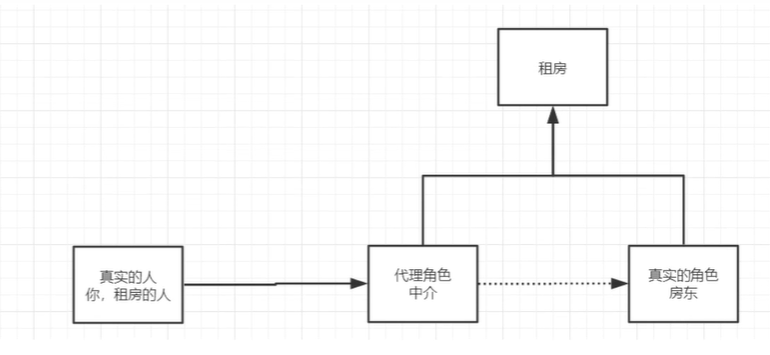

## 10.1 静态代理

角色分析：

- 抽象角色：一般会使用接口或者抽象类来解决
- 真实角色：被代理的角色
- 代理角色：代理真是角色，代理真实角色后，我们一般会做一些附属操作。
- 客户：访问代理对象的人！

代码步骤：

1. 接口

   ```java
   //租房
   public interface Rent {
       public void rent();
   }
   ```

2. 真实角色

   ```java
   //房东
   public class Host implements Rent {
       public void rent(){
           System.out.println("房东要出租房子！");
       }
   }
   ```

3. 代理角色

   ```java
   public class Proxy implements Rent {
       private Host host;
   
       public Proxy() {
       }
       public Proxy(Host host) {
           this.host = host;
       }
   
       public void rent(){
           seeHouse();
           host.rent();
           hetong();
           fee();
       }
       //看房
       public void seeHouse(){
           System.out.println("中介带你看房");
       }
       //签合同
       public void hetong(){
           System.out.println("签合同");
       }
       //收费
       public void fee(){
           System.out.println("收取中介费用");
       }
   }
   ```

4. 客户端访问

   ```java
   public class Client {
       public static void main(String[] args) {
           //房东要租房子
           Host host = new Host();
           //代理，中介帮房东租房子，但是呢？代理角色一般会有一些附属操作！
           Proxy proxy = new Proxy(host);
           proxy.rent();
       }
   }
   ```

代理模式的好处：

- 可以使真实角色的操作更加纯粹！不用去关注一些公共的业务
- 公共也就交给代理角色！实现了业务的分工！
- 公共业务发生扩展的时候，方便集中管理！

缺点：

- 一个真实角色就会产生一个代理角色，代码量会翻倍，开发效率会变低

## 10.2 加深理解

代码步骤：

1. 接口

   ```java
   public interface UserService{
       void add();
       void delete();
       void update();
       void query();
   }
   ```

2. 真实角色

   ```java
   public class UserServiceImpl implements UserService {
       public void add() {
           System.out.println("增加了一个用户");
       }
       public void delete() {
           System.out.println("删除了一个用户");
       }
   
       public void update() {
           System.out.println("修改了一个用户");
       }
       public void query() {
           System.out.println("查询了一个用户");
           //1.改动原有的业务代码，在公司中是大忌!
       }
   }
   ```

3. 代理角色

   ```java
   public class UserServiceProxy implements UserService {
   
       private UserServiceImpl userService;
   
       public void setUserService(UserServiceImpl userService) {
           this.userService = userService;
       }
       @Override
       public void add() {
           log("add");
           userService.add();
       }
       @Override
       public void delete() {
           log("delete");
           userService.add();
       }
       @Override
       public void update() {
           log("update");
           userService.add();
       }
       @Override
       public void query() {
           log("query");
           userService.add();
       }
       //日志方法
       public void log(String msg) {
           System.out.println("[Debug]使用了" + msg + "方法");
       }
   }
   ```

4. 客户端访问

   ```java
   public class Client {
       public static void main(String[] args) {
           UserServiceImpl userService = new UserServiceImpl();
           UserServiceProxy proxy = new UserServiceProxy();
           proxy.setUserService(userService);
           proxy.query();
       }
   }
   ```

聊聊AOP

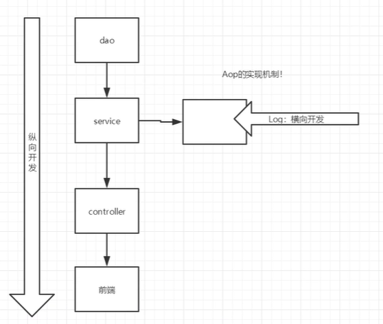

## 10.3 动态代理

- 动态代理和静态代理角色一样
- 动态代理的代理类是动态生成的，不是我们直接写好的。
- 动态代理分为两大类：基于接口的动态代理，基于类的动态代理
  - 基于接口----JDK动态代理. [我们在这里使用]
  - 基于类：cglib
  - java字节码实现：javasisit

需要了解两个类：Proxy：代理；InvocationHandler：调用处理程序

### 10.3.1、动态代理租房代码步骤：

1. 接口

   ```java
   //租房
   public interface Rent {
       public void rent();
   }
   ```

2. 真实角色

   ```java
   //房东
   public class Host implements Rent {
       public void rent(){
           System.out.println("房东要出租房子！");
       }
   }
   ```

3. 自动动生成代理类的类!

   ```java
   //等我们会用这个类， 自动生成代理类!
   public class ProxyInvocationHandler implements InvocationHandler {
       //被代理的按口
       private Rent rent;
   
       public void setRent(Rent rent) {
           this.rent = rent;
       }
   
       //生成得到代理类
       public Object getProxy() {
           return Proxy.newProxyInstance(this.getClass().getClassLoader(), rent.getClass().getInterfaces(), this);
       }
   
       //处理代理实例。并返回结果
       @Override
       public Object invoke(Object proxy, Method method, Object[] args) throws Throwable {
           //动态代理的本质，就是使用反射机制实现!
           seeHouse();
           Object result = method.invoke(rent, args);
           fare();
           return result;
       }
   
       public void seeHouse() {
           System.out.println("中介带看房子");
       }
   
       public void fare() {
           System.out.println("收中介费");
       }
   
   
   }
   ```

4. 客户端访问

   ```java
   public class Client {
       public static void main(String[] args) {
           //真实角色
           Host host = new Host();
           //代理角色:现在没有
           ProxyInvocationHandler pih = new ProxyInvocationHandler();
           //通过调用程序处理角色米处理我们要调用的按口对象!
           pih.setRent(host);
           Rent proxy = (Rent) pih.getProxy();//这里的proxy就是动态生成的，我们并没有写~
   
           proxy.rent();
   
       }
   }
   ```

### 10.3.2、通用代码步骤：

1. 接口

   ```java
   public interface UserService{
       void add();
       void delete();
       void update();
       void query();
   }
   ```

2. 真实角色

   ```java
   public class UserServiceImpl implements UserService {
       public void add() {
           System.out.println("增加了一个用户");
       }
       public void delete() {
           System.out.println("删除了一个用户");
       }
   
       public void update() {
           System.out.println("修改了一个用户");
       }
       public void query() {
           System.out.println("查询了一个用户");
           //1.改动原有的业务代码，在公司中是大忌!
       }
   }
   ```

3. 自动动生成代理类的类!

   ```java
   //等我们会用这个类， 自动生成代理类!
   public class ProxyInvocationHandler implements InvocationHandler {
       //被代理的按口
       private Object target;
   
       public void setTarget(Object target) {
           this.target = target;
       }
   
       //生成得到代理类
       public Object getProxy() {
           return Proxy.newProxyInstance(this.getClass().getClassLoader(), target.getClass().getInterfaces(), this);
       }
   
       //处理代理实例。并返回结果
       @Override
       public Object invoke(Object proxy, Method method, Object[] args) throws Throwable {
           //动态代理的本质，就是使用反射机制实现!
           log(method.getName());
           Object result = method.invoke(target, args);
   
           return result;
       }
   
       public void log(String msg) {
           System.out.println("执行了" + msg + "方法");
       }
   
   
   }
   ```

4. 客户端访问

   ```java
   public class Client {
       public static void main(String[] args) {
           //真实角色
           UserServiceImpl userService = new UserServiceImpl();
           //代理角色，不存在
           ProxyInvocationHandler pih = new ProxyInvocationHandler();
           pih.setTarget(userService);
           //动态生成代理类
           UserService proxy = (UserService) pih.getProxy();
           proxy.query();
   
       }
   }
   ```

动态代理的好处：

- 可以使真实角色的操作更加纯粹！不用去关注一些公共的业务
- 公共也就交给代理角色！实现了业务的分工！
- 公共业务发生扩展的时候，方便集中管理！
- 一个动态代理类代理类代理的是一个接口，一般就是对应的一类业务
- 一个动态代理类可以代理多个类，只要是实现了同一个接口即可！

# 11、 AOP

## 11.1 什么是AOP

AOP（Aspect Oriented Programming）意为：面向切面编程，通过预编译方式和运行期动态代理实现程序功能的统一维护的一种技术。AOP是OOP的延续，是软件开发中的一个热点，也是Spring框架中的一个重要内容，是函数式编程的一种衍生泛型，利用AOP可以对业务逻辑的各个部分进行隔离，从而使得业务逻辑各部分之间的耦合度降低，提高程序的可重用性，同时提高了开发的频率。

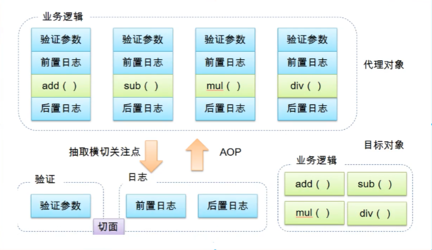

## 11.2 AOP在Spring中的作用

**提供声明式事务；允许用户自定义切面**

- 横切关注点：跨越应用程序多个模块的方法或功能。即是，与我们业务逻辑无关的，但是我们需要关注的部分，就是横切关注点，如日志、安全、缓存、事务等等……
- 切面（ASPECT）：横切关注点被模块化的特殊对象，即是一个类。
- 通知（Advice）：切面必须要完成的工作，即是类中的一个方法。
- 目标（Target）：被通知对象。
- 代理（Proxy）：向目标对象应用通知之后创建的对象。
- 切入点（PointCut）：切面通知执行的“地点”的定义。
- 连接点（jointPoint）：与切入点匹配的执行点。

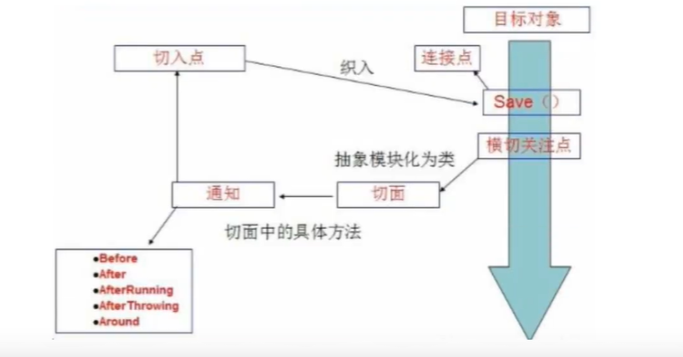

SpringAOP中，通过Advice定义横切逻辑，Spring中支持5种类型的Advice：

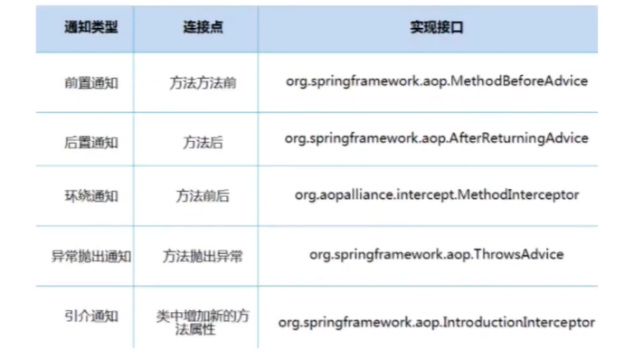

即AOP在不改变原有代码的情况下，去增加新的功能。

## 11.3 使用Spring实现AOP

【重点】使用AOP织入，需要导入一个依赖包。

```xml
<!-- https://mvnrepository.com/artifact/org.aspectj/aspectjweaver -->
	<dependency>
		<groupId>org.aspectj</groupId>
		<artifactId>aspectjweaver</artifactId>
		<version>1.8.10</version>
	</dependency>
```

### 方式一：使用Spring的API接口【主要SpringAPI接口实现】


1.UserService

```java
public interface UserService{
    void add();
    void delete();
    void update();
    void select();
}
```

2.UserServiceImpl

```java
public class UserServiceImpl implements UserService {
    public void add() {
        System.out.println("增加了一个用户");
    }

    public void delete() {
        System.out.println("删除了一个用户");
    }

    public void update() {
        System.out.println("修改了一个用户");
    }

    public void select() {
        System.out.println("查询了一个用户");
        //1.改动原有的业务代码，在公司中是大忌!
    }
}
```

3.BeforeLog

```java
public class BeforeLog implements MethodBeforeAdvice {
    //method:要执 行的目标对象的方法
    //args:多数
    //target:目标对象
    @Override
    public void before(Method method, Object[] args, Object target) throws Throwable {
        System.out.println(target.getClass().getName() + "的" + method.getName() + "被执行了");

    }
}
```

4.AfterLog

```java
public class AfterLog implements AfterReturningAdvice {
    //returnValue;返问值
    @Override
    public void afterReturning(Object returnValue, Method method, Object[] args, Object target) throws Throwable {
        System.out.println("执行了" + method.getName() + "方法。返回结果为" + returnValue);
    }
}
```

5.applicationContext.xml

```xml
<?xml version="1.0" encoding="UTF-8"?>
<beans xmlns="http://www.springframework.org/schema/beans"
       xmlns:xsi="http://www.w3.org/2001/XMLSchema-instance"
       xmlns:aop="http://www.springframework.org/schema/aop"
       xsi:schemaLocation="http://www.springframework.org/schema/beans
        https://www.springframework.org/schema/beans/spring-beans.xsd
         http://www.springframework.org/schema/aop
        https://www.springframework.org/schema/aop/spring-aop.xsd">
    <!--注册bean-->
    <bean id="userService" class="com.lenovo.service.UserServiceImpl"/>
    <bean id="beforeLog" class="com.lenovo.log.BeforeLog"/>
    <bean id="afterLog" class="com.lenovo.log.AfterLog"/>
    <!--方式一 :使用原生Spring API接口1-->
    <!--配置aop:需要导入aop的约束-->
    <aop:config>
        <!--切入点: expression: 表达式，execution( 要执行的位置! * ****)-->
        <!--execution(修饰符，哪个类，哪个方法（方法后参数不限）)-->
        <aop:pointcut id="pointcut" expression="execution(* com.lenovo.service.UserServiceImpl.*(..))"/>
        <!--执行环绕增加! -->
        <aop:advisor advice-ref="beforeLog" pointcut-ref="pointcut"/>
        <aop:advisor advice-ref="afterLog" pointcut-ref="pointcut"/>

    </aop:config>

</beans>
```

6.MyTest

```java
public class MyTest {
    public static void main(String[] args) {
        ApplicationContext context = new ClassPathXmlApplicationContext("applicationContext.xml");
        //动态代理代理的是接口:注意点
        UserService userService = (UserService) context.getBean("userService");
        userService.add();
    }

}
```

### 方式二：自定义来实现AOP【主要是切面定义】

1.DiyPointCut

```java
public class DiyPointCut {
    public void before() {
        System.out.println("=======方法执行前=======");
    }
    public void after() {
        System.out.println("=======方法执行后=======");
    }

}
```

2.applicationContext.xml

```xml
<?xml version="1.0" encoding="UTF-8"?>
<beans xmlns="http://www.springframework.org/schema/beans"
       xmlns:xsi="http://www.w3.org/2001/XMLSchema-instance"
       xmlns:aop="http://www.springframework.org/schema/aop"
       xsi:schemaLocation="http://www.springframework.org/schema/beans
        https://www.springframework.org/schema/beans/spring-beans.xsd
         http://www.springframework.org/schema/aop
        https://www.springframework.org/schema/aop/spring-aop.xsd">
    <!--注册bean-->
    <bean id="userService" class="com.lenovo.service.UserServiceImpl"/>
   
        <!--方式二:自定义类-->
        <bean id="diy" class="com.lenovo.diy.DiyPointCut"/>
        <aop:config>
            <!--自定义切面，ref 要引用的类-->
            <aop:aspect ref="diy">
                <!--切入点-->
                <aop:pointcut id="point" expression=" execution(* com.lenovo.service.UserServiceImpl.*(..))"/>
                <!--.通知-->
                <aop:before method="before" pointcut-ref="point"/>
                <aop:after method="after" pointcut-ref="point"/>
            </aop:aspect>

        </aop:config>

</beans>
```

### 方式三：使用注解实现

1.AnnotationPointCut

```java
//方式三:使用注解方式实现AOP
@Aspect //标注这个类是一个切面
public class AnnotationPointCut {
    @Before("execution(* com.lenovo.service.UserServiceImpl.*(..))")
    public void before() {
        System.out.println("====方法执行前=====");
    }

    @After("execution(* com.lenovo.service.UserServiceImpl.*(..))")
    public void after() {
        System.out.println("====方法执行后=====");
    }
    
    
    
    //在环绕增强中，我们可以给定一一个参数。代表我们要获取处理切入的点:
    @Around("execution(* com.lenovo.service.UserServiceImpl.*(..))")
    public void around(ProceedingJoinPoint jp) throws Throwable {
        System.out.println("环绕前");
        Signature signature = jp.getSignature();//获得签名
        System.out.println("signature:" + signature);
        Object proceed = jp.proceed(); //执行方法
        System.out.println("环绕后");
        System.out.println(proceed);
    }
}
```

2.applicationContext.xml

```xml
<?xml version="1.0" encoding="UTF-8"?>
<beans xmlns="http://www.springframework.org/schema/beans"
       xmlns:xsi="http://www.w3.org/2001/XMLSchema-instance"
       xmlns:aop="http://www.springframework.org/schema/aop"
       xsi:schemaLocation="http://www.springframework.org/schema/beans
        https://www.springframework.org/schema/beans/spring-beans.xsd
         http://www.springframework.org/schema/aop
        https://www.springframework.org/schema/aop/spring-aop.xsd">
    <!--注册bean-->
    <bean id="userService" class="com.lenovo.service.UserServiceImpl"/>
    <!--方式三-->
    <bean id=" annotationPointCut" class="com.lenovo.diy.AnnotationPointCut"/>
    <!--开启注解支持! -->
    <aop:aspectj-autoproxy/>

</beans>
```

我补充下：默认true是JDK，false为cglib

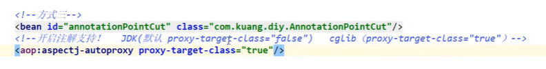

# 12、 整合Mybatis

步骤：

1. 导入相关jar包

   - junit

   - Mybatis

   - mysql数据库

   - spring相关的

   - aop织入

   - mybatis-spring【new知识点】

     ```xml
     <dependency>
             <groupId>junit</groupId>
             <artifactId>junit</artifactId>
             <version>4.11</version>
         </dependency>
         <!--连接数据库-->
         <dependency>
             <groupId>mysql</groupId>
             <artifactId>mysql-connector-java</artifactId>
             <version>5.1.17</version>
         </dependency>
         <!--使用mybatis框架-->
         <!-- https://mvnrepository.com/artifact/org.mybatis/mybatis -->
         <dependency>
             <groupId>org.mybatis</groupId>
             <artifactId>mybatis</artifactId>
             <version>3.5.2</version>
         </dependency>
         <!-- 直接导入spring-webmvc会自动帮我们导入spring-aop，spring-beans，
                 spring-context，spring-core，spring-expression，spring-web的依赖jar包 -->
         <!-- https://mvnrepository.com/artifact/org.springframework/spring-webmvc -->
         <dependency>
             <groupId>org.springframework</groupId>
             <artifactId>spring-webmvc</artifactId>
             <version>4.3.3.RELEASE</version>
         </dependency>
         <!-- 配置声明式事务 -->
         <!-- https://mvnrepository.com/artifact/org.springframework/spring-jdbc -->
         <dependency>
             <groupId>org.springframework</groupId>
             <artifactId>spring-jdbc</artifactId>
             <version>4.3.3.RELEASE</version>
         </dependency>
         <!-- https://mvnrepository.com/artifact/org.aspectj/aspectjweaver -->
         <dependency>
             <groupId>org.aspectj</groupId>
             <artifactId>aspectjweaver</artifactId>
             <version>1.8.10</version>
         </dependency>
         <!-- spring-mybatis -->
         <!-- https://mvnrepository.com/artifact/org.mybatis/mybatis-spring Spring整合Mybatis需要的整合包 -->
         <dependency>
             <groupId>org.mybatis</groupId>
             <artifactId>mybatis-spring</artifactId>
             <version>1.3.2</version>
         </dependency>
     	<dependency>
     		<groupId>org.projectlombok</groupId>
     		<artifactId>lombok</artifactId>
     		<version>1.16.20</version>
     		<scope>provided</scope>
     	</dependency>
     ```

2. 编写配置文件

3. 测试

## 12.1 回忆mybatis

1. 编写实体类

   ```java
   @Data
   public class User {
       private int id;
       private String name;
       private String pwd;
   
   }
   ```

2. 编写核心配置文件

   ```xml
   <?xml version="1.0" encoding="UTF-8" ?>
   <!DOCTYPE configuration
           PUBLIC "-//mybatis.org//DTD Config 3.0//EN"
           "http://mybatis.org/dtd/mybatis-3-config.dtd">
   <configuration>
       <typeAliases>
           <package name="com.kuang.pojo"/>
       </typeAliases>
       <environments default="development">
           <environment id="development">
               <transactionManager type="JDBC"/>
               <dataSource type="POOLED">
                   <property name="driver" value="com.mysql.jdbc.Driver"/>
                   <property name="url" value="jdbc:mysql://localhost:3306/mybatis?useSSL=false&amp;useUnicode=true&amp;characterEncoding=utf-8&amp;autoReconnect=true"/>
                   <property name="username" value="root"/>
                   <property name="password" value="981204"/>
               </dataSource>
           </environment>
       </environments>
       <mappers>
           <mapper resource="com/kuang/mapper/UserMapper.xml"></mapper>
       </mappers>
   </configuration>
   ```

3. 编写接口

   ```java
   public interface UserMapper {
       public List<User> selectUser();
   
   }
   ```

4. 编写Mapper.xml

   ```xml
   <?xml version="1.0" encoding="UTF-8" ?>
   <!DOCTYPE mapper
           PUBLIC "-//mybatis.org//DTD Mapper 3.0//EN"
           "http://mybatis.org/dtd/mybatis-3-mapper.dtd">
   <mapper namespace="com.kuang.mapper.UserMapper">
       <select id="selectUser" resultType="user">
           select* from mybatis.user;
       </select>
   
   </mapper>
   ```

5. 测试

   ```java
   public class MyTest {
       @Test
       public void test() throws IOException {
           String resources = "mybatis-config.xml";
           InputStream in = Resources.getResourceAsStream(resources);
           SqlSessionFactory sessionFactory = new SqlSessionFactoryBuilder().build(in);
           SqlSession sqlSession = sessionFactory.openSession(true);
           UserMapper mapper = sqlSession.getMapper(UserMapper.class);
           List<User> userlist = mapper.selectUser();
           for (User user : userlist) {
               System.out.println(user);
           }
       }
   }
   ```

## 12.2 Mybatis-Spring

### 第一种 sqlSessionTemplate（重点掌握）

1. 编写数据源配置
2. sqlSessionFactory
3. sqlSessionTemplate
4. 需要给接口加实现类
5. 将自己写的实现类，注入到Spring中
6. 测试

代码实现：

1.User

```java
上边有
```

2.UserMapper

```java
上边有
```

3.UserMapper.xml

```java
上边有
```

4.mybatis-config.xml

```xml
<?xml version="1.0" encoding="UTF-8" ?>
<!DOCTYPE configuration
        PUBLIC "-//mybatis.org//DTD Config 3.0//EN"
        "http://mybatis.org/dtd/mybatis-3-config.dtd">
<configuration>
    <typeAliases>
        <package name="com.kuang.pojo"/>
    </typeAliases>

</configuration>
```

5.spring-dao.xml

```xml
<?xml version="1.0" encoding="UTF-8"?>
<beans xmlns="http://www.springframework.org/schema/beans"
       xmlns:xsi="http://www.w3.org/2001/XMLSchema-instance"
       xmlns:aop="http://www.springframework.org/schema/aop" xmlns:jdbc="http://www.springframework.org/schema/jdbc"
       xsi:schemaLocation="http://www.springframework.org/schema/beans
        https://www.springframework.org/schema/beans/spring-beans.xsd
         http://www.springframework.org/schema/aop
        https://www.springframework.org/schema/aop/spring-aop.xsd http://www.springframework.org/schema/jdbc http://www.springframework.org/schema/jdbc/spring-jdbc.xsd">

    <!--DataSource:使用Spring的数据源替换Mybatis的配置c3pe dbcp druid
    我们这里使用spring提供的JDBC : org. springframework. jdbc . datasource
    -->
    <bean id="dataSource" class="org.springframework.jdbc.datasource.DriverManagerDataSource">
        <property name="driverClassName" value="com.mysql.jdbc.Driver"/>
        <property name="url" value="jdbc:mysql://localhost:3306/mybatis?useSSL=false&amp;useUnicode=true&amp;characterEncoding=utf-8&amp;autoReconnect=true"/>
        <property name="username" value="root"/>
        <property name="password" value="981204"/>
    </bean>
    <!--sqlSessionFactory-->
    <bean id="sqlSessionFactory" class="org.mybatis.spring.SqlSessionFactoryBean">
        <property name="dataSource" ref="dataSource"/>
        <!--绑定Mabatis配置文件-->
        <property name="configLocation" value="classpath:mybatis-config.xml"/>
        <property name="mapperLocations" value="classpath:com/kuang/mapper/*.xml"/>
    </bean>
    <!--SqLSessionTemplate:就是我们使用的sqlSession-->
    <bean id="sqlSession" class="org.mybatis.spring.SqlSessionTemplate">
        <!--只能使用构造器注入sqlSessionFactory.因为它没有set方法-->
        <constructor-arg index="0" ref="sqlSessionFactory"/>
    </bean>
</beans>
```

6.UserMapperImpl

```java
public class UserMapperImpl implements UserMapper {
    //我们的所有操作，都使用sqlSessionl来执行， 在原来，现在都使用sqlSessionTemplate;
    private SqlSessionTemplate sqlSession;

    public void setSqlSession(SqlSessionTemplate sqlSession) {
        this.sqlSession = sqlSession;
    }

    @Override
    public List<User> selectUser() {
        UserMapper mapper = sqlSession.getMapper(UserMapper.class);
        return mapper.selectUser();
    }

}
```

7.applicationContext.xml

```xml-dtd
<?xml version="1.0" encoding="UTF-8"?>
<beans xmlns="http://www.springframework.org/schema/beans"
       xmlns:xsi="http://www.w3.org/2001/XMLSchema-instance"
       xmlns:aop="http://www.springframework.org/schema/aop"
       xsi:schemaLocation="http://www.springframework.org/schema/beans
        https://www.springframework.org/schema/beans/spring-beans.xsd
         http://www.springframework.org/schema/aop
        https://www.springframework.org/schema/aop/spring-aop.xsd">

    <import resource="spring-dao.xml"/>
    <!---->
    <bean id="userMapper" class="com.kuang.mapper.UserMapperImpl">
        <property name="sqlSession" ref="sqlSession"/>
    </bean>

</beans>
```

8.MyTest

```java
public class MyTest {
    @Test
    public void test() {
        ApplicationContext context = new ClassPathXmlApplicationContext("applicationContext.xml");
        UserMapper userMapper = context.getBean("userMapper", UserMapper.class);
        for (User user : userMapper.selectUser()) {
            System.out.println(user);
        }
    }
}
```

### 第二种：使用SqlSessionDaoSupport实现（了解即可）

代码实现：

1.User

```java
上边有
```

2.UserMapper

```java
上边有
```

3.UserMapper.xml

```java
上边有
```

4.mybatis-config.xml

```xml
上边有
```

5.spring-dao.xml

```xml
<?xml version="1.0" encoding="UTF-8"?>
<beans xmlns="http://www.springframework.org/schema/beans"
       xmlns:xsi="http://www.w3.org/2001/XMLSchema-instance"
       xmlns:aop="http://www.springframework.org/schema/aop" xmlns:jdbc="http://www.springframework.org/schema/jdbc"
       xsi:schemaLocation="http://www.springframework.org/schema/beans
        https://www.springframework.org/schema/beans/spring-beans.xsd
         http://www.springframework.org/schema/aop
        https://www.springframework.org/schema/aop/spring-aop.xsd http://www.springframework.org/schema/jdbc http://www.springframework.org/schema/jdbc/spring-jdbc.xsd">

    <!--DataSource:使用Spring的数据源替换Mybatis的配置c3pe dbcp druid
    我们这里使用spring提供的JDBC : org. springframework. jdbc . datasource
    -->
    <bean id="dataSource" class="org.springframework.jdbc.datasource.DriverManagerDataSource">
        <property name="driverClassName" value="com.mysql.jdbc.Driver"/>
        <property name="url" value="jdbc:mysql://localhost:3306/mybatis?useSSL=false&amp;useUnicode=true&amp;characterEncoding=utf-8&amp;autoReconnect=true"/>
        <property name="username" value="root"/>
        <property name="password" value="981204"/>
    </bean>
    <!--sqlSessionFactory-->
    <bean id="sqlSessionFactory" class="org.mybatis.spring.SqlSessionFactoryBean">
        <property name="dataSource" ref="dataSource"/>
        <!--绑定Mabatis配置文件-->
        <property name="configLocation" value="classpath:mybatis-config.xml"/>
        <property name="mapperLocations" value="classpath:com/kuang/mapper/*.xml"/>
    </bean>
</beans>
```

6.UserMapperImpl2

```java
public class UserMapperImpl2 extends SqlSessionDaoSupport implements UserMapper {
    @Override
    public List<User> selectUser() {
        return getSqlSession().getMapper(UserMapper.class).selectUser();
    }
}
```

7.applicationContext.xml

```xml-dtd
<?xml version="1.0" encoding="UTF-8"?>
<beans xmlns="http://www.springframework.org/schema/beans"
       xmlns:xsi="http://www.w3.org/2001/XMLSchema-instance"
       xmlns:aop="http://www.springframework.org/schema/aop"
       xsi:schemaLocation="http://www.springframework.org/schema/beans
        https://www.springframework.org/schema/beans/spring-beans.xsd
         http://www.springframework.org/schema/aop
        https://www.springframework.org/schema/aop/spring-aop.xsd">

    <import resource="spring-dao.xml"/>
    <!---->
    <bean id="userMapper2" class="com.kuang.mapper.UserMapperImpl2" >
        <property name="sqlSessionFactory" ref= "sqlSessionFactory" />
    </bean>

</beans>
```

8.MyTest

```java
public class MyTest {
    @Test
    public void test() {
        ApplicationContext context = new ClassPathXmlApplicationContext("applicationContext.xml");
        UserMapper userMapper = context.getBean("userMapper2", UserMapper.class);
        for (User user : userMapper.selectUser()) {
            System.out.println(user);
        }
    }
}
```

# 13、 声明式事务

## 13.1 回顾事务

- 把一组业务当成一个业务来做：要么都成功，要么都失败。
- 事务在项目开发中，十分的重要，涉及到数据的一致性问题，不能马虎。
- 确保完整性和一致性。

事务ACID原则：

- 原子性
  - 确保这些东西要么都成功，要么都失败
- 一致性
  - 事务一旦完成，要么都提交，要么都跪了
- 隔离性
  - 多个业务可能操作同一个资源，是隔离的，防止数据损坏
- 持久性
  - 事务一旦提交，无论系统发生什么问题，结果都不会再被影响，被持久化的写到存储器中。

## 13.2 Spring中的事务管理

- 声明式事务：AOP
- 编程式事务：需要在代码中，进行事务的管理

思考：

为什么需要事务？

- 如果不配置事务，可能存在数据提交不一致的情况
- 如果我们不在Spring中去配置声明式事务，我们就需要在代码中手动配置事务
- 事务在项目的开发中十分重要，涉及到数据的一致性和完整性问题，不容马虎

举例：当我们同时进行添加和删除操作时，如果删除语句出现错误，添加操作还是执行成功了，添加声明式事务可以避免这个问题。保证事务的完整性

代码实现：

1.User

```java
@AllArgsConstructor
@NoArgsConstructor
@Data
public class User {
    private int id;
    private String name;
    private String pwd;
}
```

2.UserMapper

```java
public interface UserMapper {
    public List<User> selectUser();
    //添加一一个户
    public int addUser(User user);
    //删除一一个用户
    public int deleteUser(int id);

}
```

3.UserMapper.xml

```xml
<?xml version="1.0" encoding="UTF-8" ?>
<!DOCTYPE mapper
        PUBLIC "-//mybatis.org//DTD Mapper 3.0//EN"
        "http://mybatis.org/dtd/mybatis-3-mapper.dtd">
<mapper namespace="com.kuang.mapper.UserMapper">
    <select id="selectUser" resultType="user">
        select* from mybatis.user;
    </select>

    <insert id="addUser" parameterType="user">
        insert into mybatis.user (id, name, pwd) values (#{id}, #{name}, #{pwd});
    </insert>
    <delete id="deleteUser" parameterType="int">
        delete from mybatis.user where id=#{id}
    </delete>

</mapper>
```

4.mybatis-config.xml

```xml
<?xml version="1.0" encoding="UTF-8" ?>
<!DOCTYPE configuration
        PUBLIC "-//mybatis.org//DTD Config 3.0//EN"
        "http://mybatis.org/dtd/mybatis-3-config.dtd">
<configuration>
    <typeAliases>
        <package name="com.kuang.pojo"/>
    </typeAliases>

</configuration>
```

5.spring-dao.xml

```xml
<?xml version="1.0" encoding="UTF-8"?>
<beans xmlns="http://www.springframework.org/schema/beans"
       xmlns:xsi="http://www.w3.org/2001/XMLSchema-instance"
       xmlns:aop="http://www.springframework.org/schema/aop"
       xmlns:tx="http://www.springframework.org/schema/tx"
       xmlns:jdbc="http://www.springframework.org/schema/jdbc"
       xsi:schemaLocation="http://www.springframework.org/schema/beans
        https://www.springframework.org/schema/beans/spring-beans.xsd
         http://www.springframework.org/schema/aop
        https://www.springframework.org/schema/aop/spring-aop.xsd
        http://www.springframework.org/schema/tx
        https://www.springframework.org/schema/tx/spring-tx.xsd
        http://www.springframework.org/schema/jdbc
        http://www.springframework.org/schema/jdbc/spring-jdbc.xsd">

    <!--DataSource:使用Spring的数据源替换Mybatis的配置c3pe dbcp druid
    我们这里使用spring提供的JDBC : org. springframework. jdbc . datasource
    -->
    <bean id="dataSource" class="org.springframework.jdbc.datasource.DriverManagerDataSource">
        <property name="driverClassName" value="com.mysql.jdbc.Driver"/>
        <property name="url" value="jdbc:mysql://localhost:3306/mybatis?useSSL=false&amp;useUnicode=true&amp;characterEncoding=utf-8&amp;autoReconnect=true"/>
        <property name="username" value="root"/>
        <property name="password" value="981204"/>
    </bean>
    <!--sqlSessionFactory-->
    <bean id="sqlSessionFactory" class="org.mybatis.spring.SqlSessionFactoryBean">
        <property name="dataSource" ref="dataSource"/>
        <!--绑定Mabatis配置文件-->
        <property name="configLocation" value="classpath:mybatis-config.xml"/>
        <property name="mapperLocations" value="classpath:com/kuang/mapper/*.xml"/>
    </bean>

    <!--配置声明式事务-->
    <bean id="transactionManager" class="org.springframework.jdbc.datasource.DataSourceTransactionManager">
        <property name="dataSource" ref="dataSource"/>
    </bean>
    <!--结合AOP实现事务的织入-->
    <!--配置事务通知; -->
    <tx:advice id="txAdvice" transaction-manager="transactionManager">
        <!--给那些方法配置事务-->
        <!--配置事务的传播特性: new propagation= -->
        <tx:attributes>
            <tx:method name="add" propagation="REQUIRED"/>
            <tx:method name="delete" propagation="REQUIRED"/>
            <tx:method name="update" propagation="REQUIRED"/>
            <tx:method name="query" read-only="true"/>
            <tx:method name="*" propagation="REQUIRED"/>
        </tx:attributes>
    </tx:advice>
    <!--配置事务切入-->
    <aop:config>
        <aop:pointcut id="txPointCut" expression=" execution(* com.kuang.mapper.UserMapperImpl.*(..))"/>
        <aop:advisor advice-ref="txAdvice" pointcut-ref="txPointCut"/>
    </aop:config>
</beans>
```

6.UserMapperImpl

```java
public class UserMapperImpl extends SqlSessionDaoSupport implements UserMapper {
    @Override
    public List<User> selectUser() {

        User user = new User(7, "小王", "2131231");
        UserMapper mapper = getSqlSession().getMapper(UserMapper.class);
        mapper.addUser(user);
        mapper.deleteUser(7);
        return mapper.selectUser();

        //return getSqlSession().getMapper(UserMapper.class).selectUser();
    }

    @Override
    public int addUser(User user) {
        return getSqlSession().getMapper(UserMapper.class).addUser(user);

    }

    @Override
    public int deleteUser(int id) {
        return getSqlSession().getMapper(UserMapper.class).deleteUser(id);
    }

}
```

7.applicationContext.xml

```xml-dtd
<?xml version="1.0" encoding="UTF-8"?>
<beans xmlns="http://www.springframework.org/schema/beans"
       xmlns:xsi="http://www.w3.org/2001/XMLSchema-instance"
       xmlns:aop="http://www.springframework.org/schema/aop"
       xsi:schemaLocation="http://www.springframework.org/schema/beans
        https://www.springframework.org/schema/beans/spring-beans.xsd
         http://www.springframework.org/schema/aop
        https://www.springframework.org/schema/aop/spring-aop.xsd">
    <import resource="spring-dao.xml"/>

    <bean id="userMapper" class="com.kuang.mapper.UserMapperImpl" >
        <property name="sqlSessionFactory" ref= "sqlSessionFactory" />
    </bean>

</beans>
```

8.MyTest

```java
public class MyTest {
    @Test
    public void test() {
        ApplicationContext context = new ClassPathXmlApplicationContext("applicationContext.xml");
        UserMapper userMapper = context.getBean("userMapper", UserMapper.class);
        for (User user : userMapper.selectUser()) {
            System.out.println(user);
        }
    }
}
```

# 100、通用

## 1、可能用到的依赖

```xml
    <!-- 直接导入spring-webmvc会自动帮我们导入spring-aop，spring-beans，spring-context，spring-core，spring-expression，spring-web的依赖jar包 -->
	<!-- https://mvnrepository.com/artifact/org.springframework/spring-webmvc -->
	<dependency>
		<groupId>org.springframework</groupId>
		<artifactId>spring-webmvc</artifactId>
		<version>4.3.3.RELEASE</version>
	</dependency>
<!-- 配置声明式事务 -->
	<!-- https://mvnrepository.com/artifact/org.springframework/spring-jdbc -->
	<dependency>
		<groupId>org.springframework</groupId>
		<artifactId>spring-jdbc</artifactId>
		<version>4.3.3.RELEASE</version>
	</dependency>
<!--AOP的织入-->
<!-- https://mvnrepository.com/artifact/org.aspectj/aspectjweaver -->
	<dependency>
		<groupId>org.aspectj</groupId>
		<artifactId>aspectjweaver</artifactId>
		<version>1.8.10</version>
         <groupId>junit</groupId>
        <artifactId>junit</artifactId>
        <version>4.11</version>
    </dependency>
    <!--连接数据库-->
    <dependency>
        <groupId>mysql</groupId>
        <artifactId>mysql-connector-java</artifactId>
        <version>5.1.17</version>
    </dependency>
    <!--使用mybatis框架-->
    <!-- https://mvnrepository.com/artifact/org.mybatis/mybatis -->
    <dependency>
        <groupId>org.mybatis</groupId>
        <artifactId>mybatis</artifactId>
        <version>3.5.2</version>
    </dependency>
    <!-- spring-mybatis -->
    <!-- https://mvnrepository.com/artifact/org.mybatis/mybatis-spring Spring整合Mybatis需要的整合包 -->
    <dependency>
        <groupId>org.mybatis</groupId>
        <artifactId>mybatis-spring</artifactId>
        <version>1.3.2</version>
    </dependency>
	<dependency>
		<groupId>org.projectlombok</groupId>
		<artifactId>lombok</artifactId>
		<version>1.16.20</version>
		<scope>provided</scope>
	</dependency>
	</dependency>
```

## 2、beans.xml (准确名applicationContext.xml)

```xml
<?xml version="1.0" encoding="UTF-8"?>
<beans xmlns="http://www.springframework.org/schema/beans"
       xmlns:xsi="http://www.w3.org/2001/XMLSchema-instance"
       xsi:schemaLocation="http://www.springframework.org/schema/beans
        https://www.springframework.org/schema/beans/spring-beans.xsd">

    
</beans>
```

## 3、使用注解开发

```xml
<?xml version="1.0" encoding="UTF-8"?>
<beans xmlns="http://www.springframework.org/schema/beans"
       xmlns:xsi="http://www.w3.org/2001/XMLSchema-instance"
       xmlns:context="http://www.springframework.org/schema/context"
       xsi:schemaLocation="http://www.springframework.org/schema/beans
        https://www.springframework.org/schema/beans/spring-beans.xsd
         http://www.springframework.org/schema/context
        https://www.springframework.org/schema/context/spring-context.xsd">
    <!--开启注解的支持-->
    <context:annotation-config/>
    

</beans>
 <!--指定要扫描的包，这个包下的注解会生效-->
    <context:component-scan base-package="com.lenovo"/>
```

## 4、关于AOP的开发配置文件

```xml
<?xml version="1.0" encoding="UTF-8"?>
<beans xmlns="http://www.springframework.org/schema/beans"
       xmlns:xsi="http://www.w3.org/2001/XMLSchema-instance"
       xmlns:aop="http://www.springframework.org/schema/aop"
       xsi:schemaLocation="http://www.springframework.org/schema/beans
        https://www.springframework.org/schema/beans/spring-beans.xsd
         http://www.springframework.org/schema/aop
        https://www.springframework.org/schema/aop/spring-aop.xsd">
    <!--注册bean-->
    <bean id="userService" class="com.lenovo.service.UserServiceImpl"/>
    <!--方式三-->
    <bean id=" annotationPointCut" class="com.lenovo.diy.AnnotationPointCut"/>
    <!--开启注解支持! -->
    <aop:aspectj-autoproxy/>

</beans>
```

## 5、使用到的注解

```java
//1、@Autowired
直接在属性上使用即可！也可以在set方式上使用！
使用Autowired我们可以不用编写Set方法了，前提是你这个自动装配的属性在IoC（Spring）容器中存在，且符合名字byName！
    
//1.1、 @Autowired(required = false)    
如果显式定义了Autowired的required属性为false，说明这个对象可以为null，否则不允许为空

//1.2、@Autowired自动装配的环境比较复杂，自动装配无法通过一个注解@Autowired完成的时候，我们可以使用      @Qualifier(value="xxx")去配何@Autowired的使用，指定一个唯一的bean对象注入！

//1.3、@Resource(name = "cat2")//与@Autowired差不多
    private Cat cat;
    @Resource
    private Dog dog;
    
    
//2、@Nullable
在参数列表的参数前加上注解，实现参数可以为空

//3、@Component
    
//4、@Value("成博")  
    
//5、@Repository
//@Service
// @Controller
    
//6、设置作用域@Scope("singleton")
---------------------------------------------
//7、不用xml情况
@Configuration
@ComponentScan("com.lenovo.pojo")
@Import(KuangConfig2.class )
@Bean
----------------------------------------------
//8、AOP
@Aspect //标注这个类是一个切面

@Before("execution(* com.lenovo.service.UserServiceImpl.*(..))")

@After("execution(* com.lenovo.service.UserServiceImpl.*(..))")

@Around("execution(* com.lenovo.service.UserServiceImpl.*(..))")
```

## 6、自动动生成代理类的类及客户端测试类

```java
//等我们会用这个类， 自动生成代理类!
public class ProxyInvocationHandler implements InvocationHandler {
    //被代理的按口
    private Object target;

    public void setTarget(Object target) {
        this.target = target;
    }

    //生成得到代理类
    public Object getProxy() {
        return Proxy.newProxyInstance(this.getClass().getClassLoader(), target.getClass().getInterfaces(), this);
    }

    //处理代理实例。并返回结果
    @Override
    public Object invoke(Object proxy, Method method, Object[] args) throws Throwable {
        //动态代理的本质，就是使用反射机制实现!
        log(method.getName());
        Object result = method.invoke(target, args);

        return result;
    }

    public void log(String msg) {
        System.out.println("执行了" + msg + "方法");
    }


}
```

Test

```java
public class Client {
    public static void main(String[] args) {
        //真实角色
        UserServiceImpl userService = new UserServiceImpl();
        //代理角色，不存在
        ProxyInvocationHandler pih = new ProxyInvocationHandler();
        pih.setTarget(userService);
        //动态生成代理类
        UserService proxy = (UserService) pih.getProxy();
        proxy.query();

    }
}
```