**回顾之前的知识~**
●JavaSE
●数据库
●前端
●Servlet
●Http
●Mybatis
●Spring
●SpringMVC
●SpringBoot
●Dubbo. Zookeeper. 分布式基础
●Maven. Git
●Ajax. json
●...

**这个阶段该如何学~**
三层架构+ MVC

框架:

spring IOC AOP

SprintBoot,新一代的JavaEE开发标准， 自动装配

模块化~all in one

模块化的开发===all in one, 代码没变化~

**微服务架构4个核心问题?**
1.服务很多，客户端该怎么访问?
2.这么多服务? 服务之间如何通信?
3.这么多服务? 如何治理?
4.服务挂了怎么办?

**解决方案:**
Spring Cloud 生态! SpringBoot

1. Spring cloud NetFlix 一站式解决方案!
   api网关，zuu1组件
   Feign --- HttpClinet ---- Http通信方式，同步，阻塞
   服务注册发现: Eureka
   熔断机制: Hystrix

。。。。

1. Apache Dubbo Zookeeper 半自动，需要整合别人的!
   API:没有，找第三方组件，或者自己实现
   Dubbo
   Zookeeper
   没有:借助Hystrix
   Dubbo这个方案并不完善~
2. Spring cloud Alibaba - -站式解决方案!更简单

新概念:服务网格~ Server Mesh

istio

**万变不离其宗**
1.API---------->路由问题

2.HTTP ,RPC----------》通信问题

3.注册和发现----------》高可用问题

4.熔断机制------------》服务降级问题，防止服务雪崩

1、导入依赖
2、编写配置文件
3、开启这个功能@Enab1eXXXXX
4、配置类

**网络不可靠!**

## 1、常见面试题

### 1.1、 什么是微服务?

### 1.2、微服务之间是如何独立通讯的?

### 1.3、SpringCloud 和Dubbo有哪些区别?

### 1.4、SpringBoot和SpringCloud, 请你谈谈对他们的理解

### 1.5、什么是服务熔断?什么是服务降级

### 1.6、微服务的优缺点是分别是什么?说下你在项目开发中遇到的坑

### 1.7、你所知道的微服务技术栈有哪些?请列举一二

### 1.8、eureka和zookeeper都可以提供服务注册与发现的功能，请说说两个的区别?

## 2、微服务概述

### 2.1、什么是微服务

**什么是微服务?**

微服务(Microservice Architecture)是近几年流行的一种架构思想，关于它的概念很难一言以蔽之。

**究竟什么是微服务呢?**

我们在此引用ThoughtWorks公司的首席科学家Martin Fowler于2014年提出的一段话:

原文: https://martinfowler.com/articles/microservices.html
汉化: https://www.cnblogs.com/liuning8023/p/4493156.html

- 就目前而言,对于微服务，业界并没有一个统一的，标准的定义
- 但通常而言，微服务架构是- 种架构模式，或者说是一 种架构风格，**它提倡将单一的应用程序划分成一组
  小的服务**,每个服务运行在其独立的自己的进程内，服务之间互相协调，互相配置，为用户提供最终价值。服务之间采用轻量级的通信机制互相沟通,每个服务都围绕着具体的业务进行构建，并且能够被独立的部署到
  生产环境中，另外,应尽量避免统一的, 集中式的服务管理机制，对具体的一个服务而言，应根据业务上下
  文,选择合适的语言，工具对其进行构建，可以有一个非常轻量级的集中式管理来协调这些服务,可以使用不
  同的语言来编写服务，也可以使用不同的数据存储;

**可能有的人觉得官方的话太过生涩，我们从技术维度来理解下:**

- 微服务化的核心就是将传统的一站式应用，根据业务拆分成一个一个的服务,彻底地去耦合，每一个微服务提
  供单个业务功能的服务，一个服务做一件事情， 从技术角度看就是一种小而独立的处理过程，类似进程的概
  念,能够自行单独启动或销毁，拥有自己独立的数据库。

### 2.2、微服务与微服务架构

**微服务**

强调的是服务的大小，他关注的是某一个点， 是具体解决某一个问题/提供落地对应服务的一 个服务应用，狭义的
看，可以看做是IDEA中的一个个微服务工程,或者Moudel

1. IDEA 工具里面使用Maven开发的一个个独立的小Moudle,它具体是使用springboot开发的一个小模块，专业的事情交给专业的模块来做，一个模块就做着一件事情
2. 强调的是一个个的个体，每个个体完成一个具体的任务或者功能!

**微服务架构**

一种新的架构形式， Martin Fowler, 2014提出微服务架构是一种架构模式，它提倡将单- -应用程序划分成一组小的服务，服务之间互相协调，互相配合，为用户提供最终价值。每个服务运行在其独立的进程中，服务于服务间采用轻量级的通信机制互相协作，每个服务都围绕着具体的业务进行构建，并且能够被独立的部署到生产环境中,另外，应尽量避免统一的, 集中式的服务管理机制，对具体的一个服务而言,应根据业务上下文,选择合适的语言,工具对其进行构建。

### 2.3、微服务优缺点

**优点**

- 每个服务足够内聚,足够小，代码容易理解,这样能聚焦一个指定的业务功能或业务需求;
- 开发简单,开发效率提高，-个服务可能就是专- -的只干一 -件事;
- 微服务能够被小团队单独开发,这个小团队是2~5人的开发人员组成;
- 微服务是松耦合的，是有功能意义的服务，无论是在开发阶段或部署阶段都是独立的。
- 微服务能使用不同的语言开发。
- 易于和第三方集成，微服务允许容易且灵活的方式集成自动部署,通过持续集成工具,如 jenkins, Hudson,bamboo
- 微服务易于被一个开发人员理解，修改和维护，这样小团队能够更关注自己的工作成果。无需通过合作才能体现价值。
- 微服务允许你利用融合最新技术。
- 微服务只是业务逻辑的代码，不会和HTML，CSS 或其他界面混合
- 每个微服务都有自己的存储能力，可以有自己的数据库,也可以有统- -数据库

**缺点:**

- 开发人员要处理分布式系统的复杂性
- 多服务运维难度，随着服务的增加，运维的压力也在增大
- 系统部署依赖
- 服务间通信成本
- 数据一致性
- 系统集成测试
- 性能监控...

### 2.4、微服务技术栈有哪些?

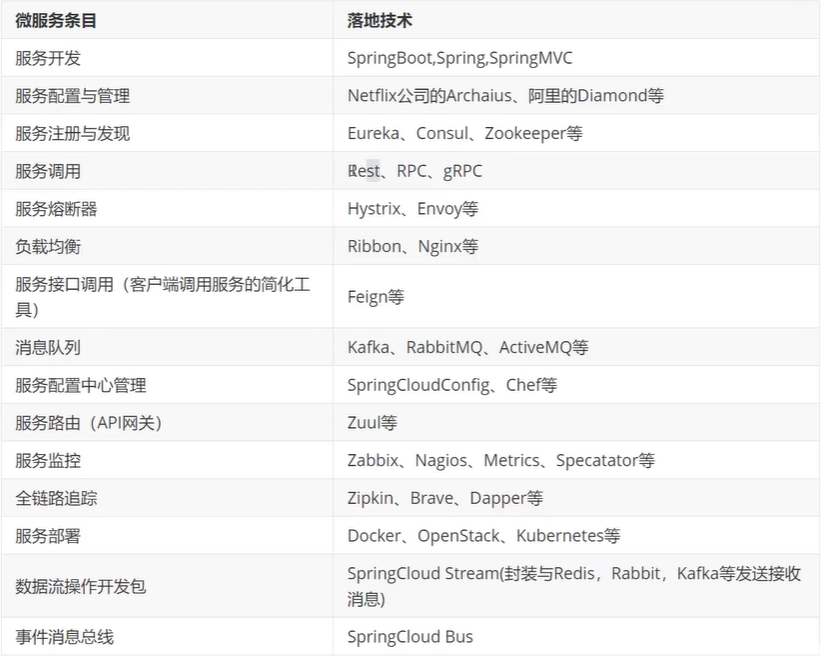

### 2.5、为什么选择SpringCloud作为微服务架构

1、选型依据

- 整体解决方案和框架成熟度
- 社区热度
- 可维护性
- 学习曲线

2、当前各大IT公司用的微服务架构有哪些?

- 阿里: dubbo+HFS
- 京东: JSF
- 新浪: Motan
- 当当网DubboX

3、各微服务框架对比

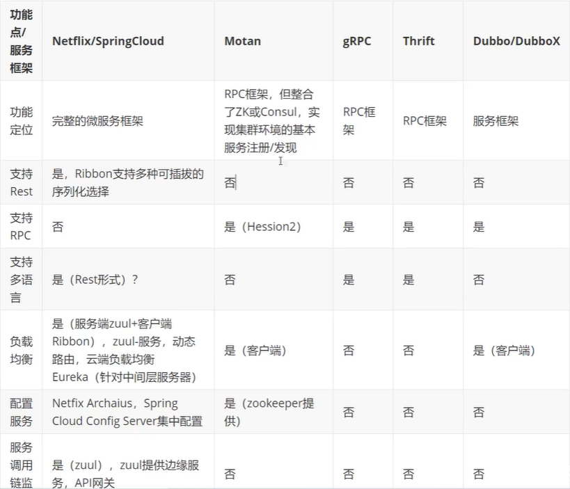

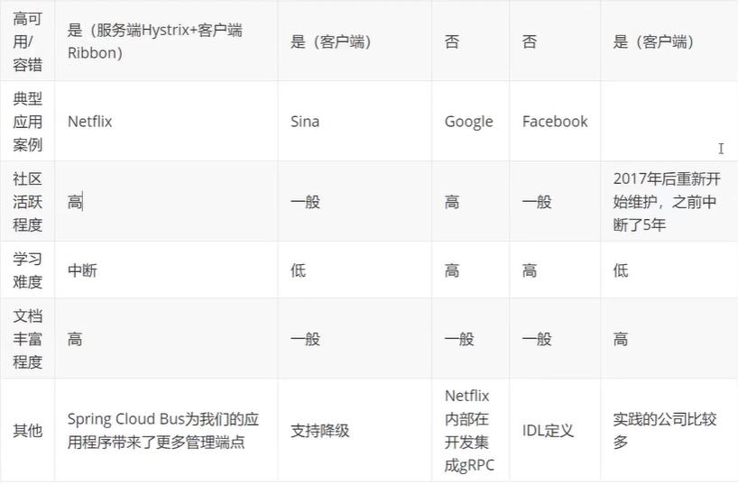

## 3、SpringCloud入门概述

### 3.1、SpringCloud是什么

Spring官网:https://spring.io/

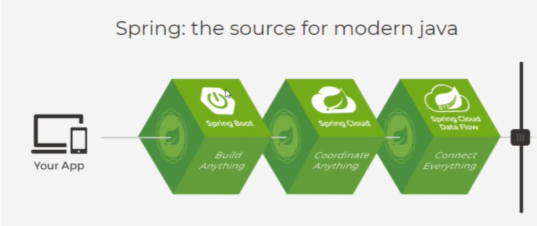

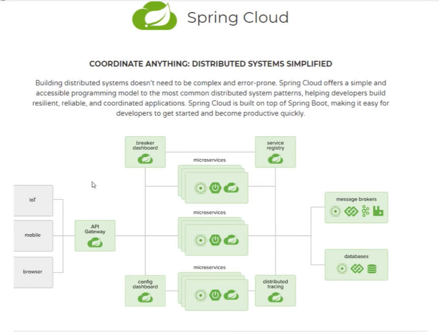

SpringCloud,基于SpringBoot提供了一套微服务解决方案，包括服务注册与发现，配置中心，全链路监控,服务
网关,负载均衡，熔断器等组件,除了基于NetFlix的开源组件做高度抽象封装之外,还有一些选型中立的开源组件。

SpringCloud利用SpringBoot的开发便利性,巧妙地简化了分布式系统基础设施的开发, SpringCloud为开发人员
提供了快速构建分布式系统的一些工具，**包括配置管理，服务发现，断路器，路由,微代理，事件总线，全局锁，**
**决策竞选，分布式会话**等等，他们都可以用SpringBoot的开发风格做到一键启动和部署。

SpringBoot并没有重复造轮子，它只是将目前各家公司开发的比较成熟，经得起实际考研的服务框架组合起来,
通过SpringBoot风格进行再封装，屏蔽掉了复杂的配置和实现原理，**最终给开发者留出了一套简单易懂,易部署**
**和易维护的分布式系统开发工具包**

SpringCloud是分布式微服务架构下的一站式解决方案:是各个微服务架构落地技术的集合体,俗称微服务全家
桶。

### 3.2、SpringCloud和SpringBoot关系

- SpringBoot专注于快速方便的开发单个个体微服务。- Jar
- SpringCloud是关注全局的微服务协调整理治理框架，它将SpringBoot开发的一 个个单体微服务整合并管理起来,为各个微服务之间提供:配置管理，服务发现，断路器，路由，微代理，事件总线，全局锁,决策竞选,分布式会话等等集成服务。
- SpringBoot可以离开SpringClooud独立使用，开发项目,但是SpringCloud离不开SpringBoot, 属于依赖关
  系
- **SpringBoot专注于快速、 方便的开发单个个体微服务, SpringCloud关注全局的服务治理框架**

### 3.3、Dubbo 和SpringCloud技术选型

1、分布式+服务治理Dubbo

目前成熟的互联网架构:应用服务化拆分+消息中间件

**一个完善的项目**

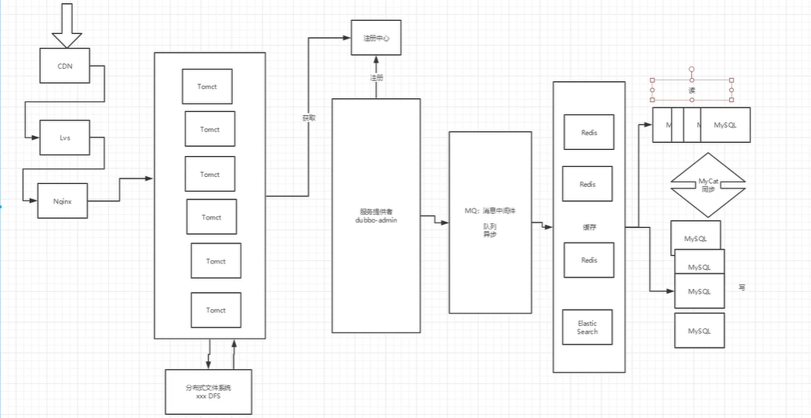

2、Dubbo 和SpringCloud对比

可以看一下社区活跃度
https://github.com/dubbo
https://github.com/spring-cloud

结果:

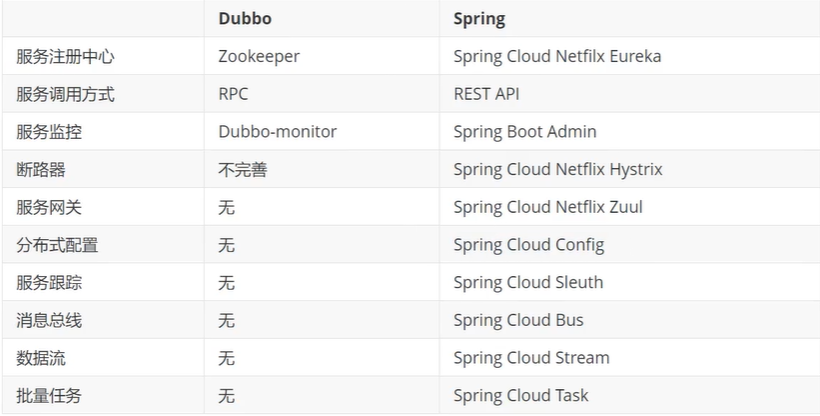

**最大区别: SpringCloud抛弃 了Dubbo的RPC通信,采用的是基于HTTP的REST方式。**

严格来说，这两种方式各有优劣。虽然从一定程度 上来说，后者牺牲了服务调用的性能，但也避免了上面提到的原生RPC带来的问题。而且REST相比RPC更为灵活,服务提供方和调用方的依赖只依靠一纸契约， 不存在代码级别的强依赖，这在强调快速演化的微服务环境下，显得更加合适。

**品牌机与组装机的区别**
很明显，Spring Cloud的功能比DUBBO更加强大,涵盖面更广，而且作为Spring的拳头项目，它也能够与Spring
Framework. Spring Boot. Spring Data. Spring Batch等其他Spring项目完美融合,这些对于微服务而言是至
关重要的。使用Dubbo构建的微服务架构就像组装电脑，各环节我们的选择自由度很高，但是最终结果很有可能
因为一条内存质量不行就点不亮了，总是让人不怎么放心，但是如果你是一名高手, 那这些都不是问题;而Spring
Cloud就像品牌机，在Spring Source的整合下，做了大量的兼容性测试，保证了机器拥有更高的稳定性，但是如
果要在使用非原装组件外的东西，就需要对其基础有足够的了解。

**社区支持与更新力度**
最为重要的是，DUBBO停止了5年左右的更新，虽然2017.7重启了。 对于技术发展的新需求，需要由开发者自行
拓展升级(比如当当网弄出了DubboX),这对于很多想要采用微服务架构的中小软件组织， 显然是不太合适的,
中小公司没有这么强大的技术能力去修改Dubbo源码+周边的一整套解决方案，并不是每-个公司都有阿里的大牛
+真实的线上生产环境测试过。

**设计模式+微服务拆分思想:不-定善于表达,软实力，活跃度**

**总结:**
曾风靡国内的开源RPC服务框架Dubbo在重启维护后，令许多用户为之雀跃，但同时，也迎来了一些质疑的声
音。互联网技术发展迅速，Dubbo 是否还能跟上时代? Dubbo 与Spring Cloud相比又有何优势和差异?是否会
有相关举措保证Dubbo的后续更新频率?

人物: Dubbo重启维护开发的刘军，主要负责人之一
刘军，阿里巴巴中间件高级研发工程师，主导了Dubbo重启维护以后的几个发版计划，专注于高性能RPC框架
和微服务相关领域。曾负责网易考拉RPC框架的研发及指导在内部使用，参与了服务治理平台、分布式跟踪系
统、分布式-致性框架等从无到有的设计与开发过程。

**解决的问题域不一样: Dubbo的定位是-款RPC框架， Spring Cloud的目标是微服务架构下的一站式解决方案**

### 3.4、SpringCloud能干嘛

- Distributed/vjersioned configuration (分布式/版本控制配置)
- Service registration and discovery (服务注册与发现)
- Routing (路由)
- Service-to-service calls (服务到服务的调用)
- Load balancing (负载均衡配置)
- Circuit Breakers (断路器)
- Distributed messaging (分布式消息管理)

### 3.5、SpringCloud在哪下

官网:https://spring.io/projects/spring-cloud
这玩意的版本号有点特别

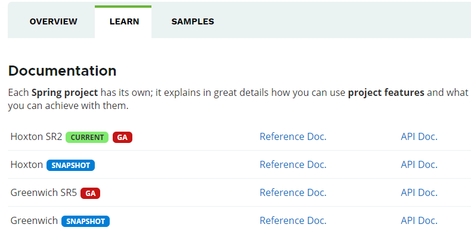

```Spring
Spring cloud是一 一个由众多独立子项目组成的大型综合项目，每个子项目有不同的发行节奏，都维护着自己的发布版
本号。Spring cloud通过一个资源清单BOM (Bi11 of Materials)来管理每个版本的子项目清单。为避免与子项
目的发布号混淆，所以没有采用版本号的方式，而是通过命名的方式。

这些版本名称的命名方式采用了伦敦地铁站的名称，同时根据字母表的顺序来对应版本时间顺序，比如:最早的
Release版本: Angel, 第二个Release版本: Brixton, 然后是Camden、Dalston、 Edgware, 目前最新的是
Finchley版本。
```

## 4、Rest学习环境搭建

### 4.1、总体介绍

- 我们会使用- -个Dept部门模块做-个微服务通 用案例Consumer消费者(Client) 通过REST调用Provider提供
  者(Server)提供的服务。
- 回忆Spring, SpringMVC, MyBatis等以往学习的知识。。.
- Maven的分包分模块架构复习

```
一个简单的Maven模块结构是这样的:
-- app-parent: - - 个父项目(app-parent) 聚合很多子项目(app-util, app-dao, app-web...)
|-- pom. xml
|-- app-core
| l----pom. xml
| -- app -web
| |----pom. xml
```

一个父工程带着多个子Module子模块
MicroServiceCloud父工程(Project) 下初次带着3个子模块(Module)

- microservicecloud-api [封装的整体entity/接口/公共配置等]|
- microservicecloud-provider-dept-8001 [服务提供者]
- microservicecloud-consumer-dept-80 [服务消费者]
- 动手开干!

### 4.2、SpringCloud版本选择

**各大版本说明**

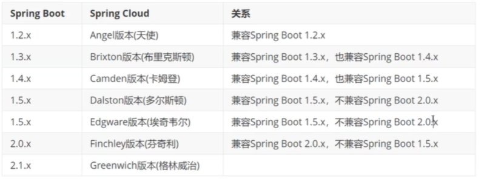

**实际开发版本关系**

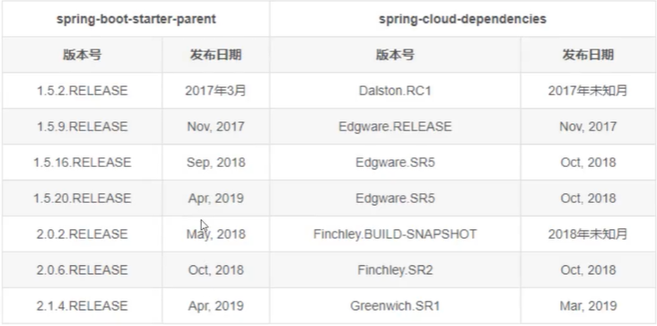

**使用最后的这两个**

### 4.3、创建父工程

●新建父工程项目microservicecloud, 切记Packageing是pom模式
●主要是定义POM文件，将后续各个子模块公用的jar包等统- 提取出来,类似-个抽象父类

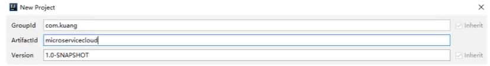

**父pom.xml**

```xml
<?xml version="1.0" encoding="UTF-8"?>
<project xmlns="http://maven.apache.org/POM/4.0.0"
         xmlns:xsi="http://www.w3.org/2001/XMLSchema-instance"
         xsi:schemaLocation="http://maven.apache.org/POM/4.0.0 http://maven.apache.org/xsd/maven-4.0.0.xsd">
    <modelVersion>4.0.0</modelVersion>

    <groupId>com.kuang</groupId>
    <artifactId>springcloud</artifactId>
    <version>1.0-SNAPSHOT</version>
    <modules>
        <module>springcloud-api</module>
        <module>springcloud-priovider-dept-8001</module>
    </modules>

    <!--打包方式  pom-->
    <packaging>pom</packaging>

    <properties>
        <project.build.sourceEncoding>UTF-8</project.build.sourceEncoding>
        <!--maven编辑器-->
        <maven.compiler.source>1.8</maven.compiler.source>
        <maven.compiler.target>1.8</maven.compiler.target>
        <junit.version>4.12</junit.version>
        <lombok.version>1.16.10</lombok.version>
        <log4j.version>1.2.7</log4j.version>
    </properties>

    <dependencyManagement>
        <dependencies>
            <!--springcloud的依赖-->
            <!-- https://mvnrepository.com/artifact/org.springframework.cloud/spring-cloud-dependencies -->
            <dependency>
                <groupId>org.springframework.cloud</groupId>
                <artifactId>spring-cloud-dependencies</artifactId>
                <version>Greenwich.SR1</version>
                <type>pom</type>
                <scope>import</scope>
            </dependency>
            <dependency>
                <groupId>org.springframework.boot</groupId>
                <artifactId>spring-boot-dependencies</artifactId>
                <version>2.1.4.RELEASE</version>
                <type>pom</type>
                <scope>import</scope>
            </dependency>
            <!--连接数据库-->
            <dependency>
                <groupId>mysql</groupId>
                <artifactId>mysql-connector-java</artifactId>
                <version>5.1.47</version>
            </dependency>
            <!--druid数据源-->
            <dependency>
                <groupId>com.alibaba</groupId>
                <artifactId>druid</artifactId>
                <version>1.1.10</version>
            </dependency>
            <!-- 引入 myBatis，这是 MyBatis官方提供的适配 Spring Boot 的，而不是Spring Boot自己的-->
            <dependency>
                <groupId>org.mybatis.spring.boot</groupId>
                <artifactId>mybatis-spring-boot-starter</artifactId>
                <version>1.3.2</version>
            </dependency>
            <!--单元测试-->
            <dependency>
                <groupId>junit</groupId>
                <artifactId>junit</artifactId>
                <version>${junit.version}</version>
            </dependency>
            <!--日志测试-->
            <!--日志门面-->
            <dependency>
                <groupId>ch.qos.logback</groupId>
                <artifactId>logback-core</artifactId>
                <version>1.2.3</version>
            </dependency>
            <!--小辣椒-->
            <dependency>
                <groupId>org.projectlombok</groupId>
                <artifactId>lombok</artifactId>
                <version>${lombok.version}</version>
            </dependency>
            <!--log4j-->
            <dependency>
                <groupId>log4j</groupId>
                <artifactId>log4j</artifactId>
                <version>${log4j.version}</version>
            </dependency>
        </dependencies>
    </dependencyManagement>


</project>
```

#### 模块一：专门放实体类的模块springcloud-api

1、pom.xml

```xml
<!---当前的Module自己需要的依赖， 如果父依赖中已经配置了版本。这里就不用写了-->
    <dependencies>
        <dependency>
            <groupId>org.projectlombok</groupId>
            <artifactId>lombok</artifactId>
        </dependency>
    </dependencies>
```

2、创建数据库，表

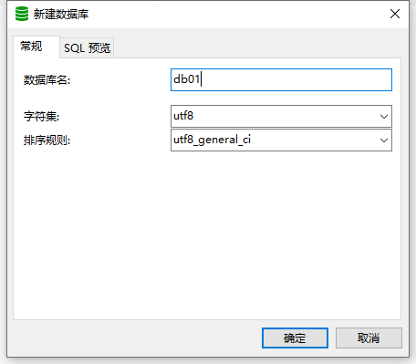

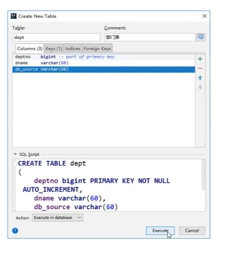

3、实体类

```java
package com.kuang.pojo;


import lombok.experimental.Accessors;

import java.io.Serializable;
@Accessors(chain = true)//链式写法
public class Dept implements Serializable {//Dept 实体类 orm 类表关系映射
    private Long deptno;//主键
    private String dname;
    //这个数据数存在哪个数据库的字段~微服务，一个服务对应一个数据库，同一个信息可能存在不同的数据库
    private String db_source;

    public Dept(String dname) {
        this.dname = dname;
    }

    /*
    链式写法
    Dept dept = new Dept();
    dept. setDeptNo(11). setDname(' 'SSSS ') . setDb_ source( '001' ) ;

     */

    public Dept() {
    }

    public Long getDeptno() {
        return deptno;
    }

    public void setDeptno(Long deptno) {
        this.deptno = deptno;
    }

    public String getDname() {
        return dname;
    }

    public void setDname(String dname) {
        this.dname = dname;
    }

    public String getDb_source() {
        return db_source;
    }

    public void setDb_source(String db_source) {
        this.db_source = db_source;
    }

    @Override
    public String toString() {
        return "Dept{" +
                "deptno=" + deptno +
                ", dname='" + dname + '\'' +
                ", db_source='" + db_source + '\'' +
                '}';
    }
}
```

#### 模块二：服务提供者springcloud-priovider-dept-8001

1、pom.xml

```xml
 <dependencies>
        <!--我们需要拿到实体类，所以要配置api module-->
        <dependency>
            <groupId>com.kuang</groupId>
            <artifactId>springcloud-api</artifactId>
            <version>1.0-SNAPSHOT</version>
        </dependency>
        <!--junit-->
        <dependency>
            <groupId>junit</groupId>
            <artifactId>junit</artifactId>
        </dependency>
        <dependency>
            <groupId>mysql</groupId>
            <artifactId>mysql-connector-java</artifactId>
        </dependency>
        <dependency>
            <groupId>com.alibaba</groupId>
            <artifactId>druid</artifactId>
        </dependency>
        <dependency>
            <groupId>ch.qos.logback</groupId>
            <artifactId>logback-core</artifactId>
        </dependency>
        <dependency>
            <groupId>org.mybatis.spring.boot</groupId>
            <artifactId>mybatis-spring-boot-starter</artifactId>
        </dependency>
        <!--test-->
        <dependency>
            <groupId>org.springframework.boot</groupId>
            <artifactId>spring-boot-test</artifactId>
        </dependency>
        <dependency>
            <groupId>org.springframework.boot</groupId>
            <artifactId>spring-boot-starter-web</artifactId>
        </dependency>
        <!--jetty-->
        <dependency>
            <groupId>org.springframework.boot</groupId>
            <artifactId>spring-boot-starter-jetty</artifactId>
        </dependency>
        <!--热部署工具:-->
        <dependency>
            <groupId>org.springframework.boot</groupId>
            <artifactId>spring-boot-devtools</artifactId>
        </dependency>
    </dependencies>
```

**热部署工具:代码修改后，无需重启服务器，刷新一下即可**

2、application.yml

```yml
server:
 port: 8001
#mybatis配置
mybatis:
 type-aliases-package: com.kuang.pojo
 config-location: classpath:mybatis/mybatis-config.xml
 mapper-locations: classpath:mybatis/mapper/*.xml
#spring的配置&autoReconnect=true
spring:
 application:
  name: springcloud-provider-dept
 datasource:
  type: com.alibaba.druid.pool.DruidDataSource
  driver-class-name: org.gjt.mm.mysql.Driver
  url: jdbc:mysql://localhost:3306/db01?useUnicode=true&characterEncoding=utf-8
  username: root
  password: 981204
```

3、mybatis-config.xml

```xml
<?xml version="1.0" encoding="UTF-8" ?>
<!DOCTYPE configuration
        PUBLIC "-//mybatis.org//DTD Config 3.0//EN"
        "http://mybatis.org/dtd/mybatis-3-config.dtd">
<configuration>
    <settings>
        <!--开启二级缓存-->
        <setting name="cacheEnabled" value="true"/>
    </settings>
</configuration>
```

4、DeptDao

```java
@Mapper
@Repository
public interface DeptDao {
    boolean addDept(Dept dept);

    Dept queryById(Long id);

    List<Dept> queryAll();

}
```

5、DeptDao.xml

```xml
<?xml version="1.0" encoding="UTF-8" ?>
<!DOCTYPE mapper
        PUBLIC "-//mybatis.org//DTD Mapper 3.0//EN"
        "http://mybatis.org/dtd/mybatis-3-mapper.dtd">
<mapper namespace="com.kuang.dao.DeptDao">
    <insert id="addDept" parameterType="Dept">
        insert into dept (dname, db_source)
        values (#{dname}, DATABASE())
    </insert>

    <select id="queryById" resultType="Dept" parameterType="Long">
        select * from dept where deptno = #{deptno};
    </select>

    <select id="queryAll" resultType="Dept" parameterType="Long">
        select * from dept;
    </select>

</mapper>
```

6、DeptService

```java
public interface DeptService {
    boolean addDept(Dept dept);

    Dept queryById(Long id);

    List<Dept> queryAll();

}
```

7、DeptServiceImpl

```java
@Service
public class DeptServiceImpl implements DeptService {
    @Autowired
    private DeptDao deptDao;

    @Override
    public boolean addDept(Dept dept) {
        return deptDao.addDept(dept);
    }

    @Override
    public Dept queryById(Long id) {
        return deptDao.queryById(id);
    }

    @Override
    public List<Dept> queryAll() {
        return deptDao.queryAll();
    }
}
```

8、DeptController

```java
//提供Restfui服务
@RestController
public class DeptController {
    @Autowired
    private DeptService deptService;

    @PostMapping("/dept/add")
    public boolean addDept(Dept dept) {
        return deptService.addDept(dept);
    }

    @GetMapping("/dept/get/{id}")
    public Dept get(@PathVariable("id") Long id) {
        return deptService.queryById(id);
    }

    @GetMapping("/dept/list")
    public List<Dept> queryAll() {
        return deptService.queryAll();
    }
}
```

9、启动类：DeptPriovider_8001

```java
@SpringBootApplication
public class DeptPriovider_8001 {
    public static void main(String[] args) {
        SpringApplication.run(DeptPriovider_8001.class, args);
    }
}
```

10、启动测试

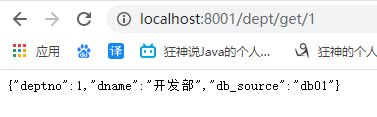

项目结构

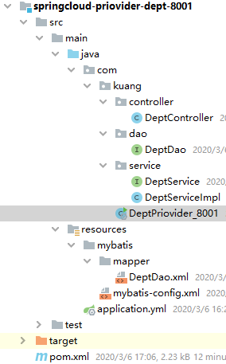

#### 模块三：服务消费者springcloud-cosumer-dept-80

pom.xml

```xml
  <dependencies>
        <!--实体类+web-->
        <dependency>
            <groupId>com.kuang</groupId>
            <artifactId>springcloud-api</artifactId>
            <version>1.0-SNAPSHOT</version>
        </dependency>
        <dependency>
            <groupId>org.springframework.boot</groupId>
            <artifactId>spring-boot-starter-web</artifactId>
        </dependency>
        <dependency>
            <groupId>org.springframework.boot</groupId>
            <artifactId>spring-boot-devtools</artifactId>
        </dependency>
    </dependencies>
```

2、application.yml

```yml
server:
 port: 80
```

3、配置ConfigBean

```java
@Configuration
public class ConfigBean {
    @Bean
    public RestTemplate getRestTemplate() {//@Configuration-- 以前在spring applicationContext.xml中配置
        return new RestTemplate();
    }
}
```

4、DeptConsumerController

```java
@RestController
public class DeptConsumerController {
    // 理解: 消费者，不应该有service层
    // RestTemplate .... 供我们直接调用就可以了!注册到pring中
    // (url,实体: Map , Class<T> responseType)|
    @Autowired
    private RestTemplate restTemplate; // 提供多种便捷访问远http服务的方法，简单的Restful服务模板~
    private static final String REST_URL_PREFIX = "http://localhost:8001";

    @RequestMapping("/consumer/dept/add")
    public boolean add(Dept dept) {
        return restTemplate.postForObject(REST_URL_PREFIX + "/dept/add", dept, Boolean.class);
    }

    @RequestMapping("/consumer/dept/get/{id}")

    public Dept get(@PathVariable("id") Long id) {
        return restTemplate.getForObject(REST_URL_PREFIX + "/dept/get/" + id, Dept.class);
    }

    @RequestMapping("/consumer/dept/list")
    public List<Dept> list() {
        return restTemplate.getForObject(REST_URL_PREFIX + "/dept/list", List.class);
    }

}
```

5、启动类

```java
@SpringBootApplication
public class DeptConsumer_80 {
    public static void main(String[] args) {
        SpringApplication.run(DeptConsumer_80.class, args);
    }

}
```

6、测试，先启动提供者，再启动消费者

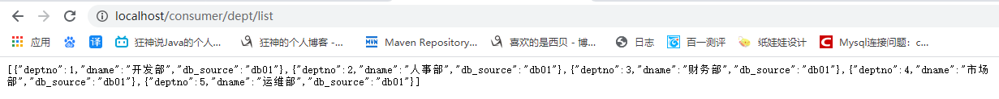

**注：**80为可以省略的默认端口

项目结构：

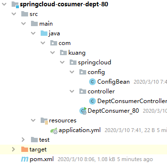

## 5、Eureka服务注册与发现

### 5.1、什么是Eureka

- Eureka: 怎么读? .
- Netflix 在设计Eureka时，遵循的就是AP原则
- Eureka是Netflix的一 个子模块，也是核心模块之一 。Eureka是一 个基于REST的服务，用于定位服务,以实现
  云端中间层服务发现和故障转移，服务注册与发现对于微服务来说是非常重要的，有了服务发现与注册，只需
  要使用服务的标识符，就可以访问到服务,而不需要修改服务调用的配置文件了，功能类似于Dubbo的注册
  中心，比如Zookeeper;

### 5.2、原理讲解

- Eureka的基本架构
  - SpringCloud封装了NetFlix公司开发的Eureka模块来实现服务注册和发现(对比Zookeeper)
  - Eureka采用 了C-S的架构设计，EurekaServer 作为服务注册功能的服务器，他是服务注册中心
  - 而系统中的其他微服务。使用Eureka的客户端连接到EurekaServer并维持心跳连接。这样系统的维护人
    员就可以通过EurekaServer来监控系统中各个微服务是否正常运行，SpringCloud的一 些其他模块(比如
    Zuul)就可以通过EurekaServer来发现系统中的其他微服务,并执行相关的逻辑;
  - 和Dubbo架构对比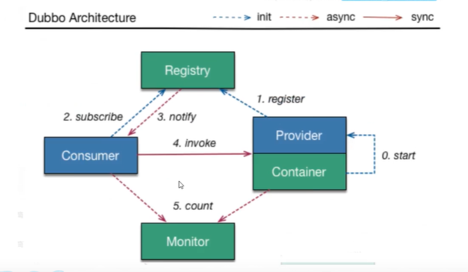
  - Eureka 包含两个组件: Eureka Server和Eureka Client。
  - Eureka Server提供服务注册服务，各个节点启动后，会在EurekaServer中进行注册，这样Eureka Server
    中的服务注册表中将会村粗所有可用服务节点的信息，服务节点的信息可以在界面中直观的看到。
  - Eureka Client是一 个Java客户端，用于简化EurekaServer的交互，客户端同时也具备一 个内置的，使用轮询负载算法的负载均衡器。在应用启动后,将会向EurekaServer发送心跳(默认周期为30秒)。如果
    Eureka Server在多个心跳周期内没有接收到某个节点的心跳，EurekaServer将会从服务注册表中把这个
    服务节点移除掉(默认周期为90秒)
- 三大角色
- Eureka Server: 提供服务的注册于发现。
- Service Provider:将自身服务注册到Eureka中,从而使消费方能够找到。
- Service Consumer:服务消费方从Eureka中获取注册服务列表,从而找到消费服务。
- 盘点目前工程状况

#### 1、EurekaServer环境搭建

### 5.3模块四：Eureka服务springcloud-eureka-7001

1、pom.xml

```xml
  <dependencies>
        <!-- https://mvnrepository.com/artifact/org.springframework.cloud/spring-cloud-starter-eureka-server -->
        <dependency>
            <groupId>org.springframework.cloud</groupId>
            <artifactId>spring-cloud-starter-eureka-server</artifactId>
            <version>1.4.6.RELEASE</version>
        </dependency>
        <dependency>
            <groupId>org.springframework.boot</groupId>
            <artifactId>spring-boot-devtools</artifactId>
        </dependency>
    </dependencies>
```

2、application.yml

```yml
server:
  port: 7001
#Eureka配置
eureka:
  instance:
    hostname: localhost #Eureka 服务端的实例名称
  client:
    register-with-eureka: false #表示是否向eureka注册中心注册自己
    fetch-registry: false #fetch-registry如果为false,则表示自己为注册中心
    service-url: # 监控页面~
      defaultZone: http://${eureka.instance.hostname}:${server.port}/eureka/
```

3、启动类EurekaServer_7001

```java
//启动之后，访问http://Localhost: 7001/
@SpringBootApplication
@EnableEurekaServer //EnableEurekaServer服务端的启动类，可以接受别人注册进*
public class EurekaServer_7001 {
    public static void main(String[] args) {
        SpringApplication.run(EurekaServer_7001.class, args);
    }
}
```

4、访问测试，先启动7001，再启动8001

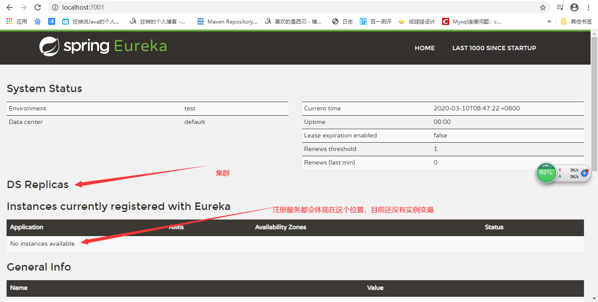

#### 2、将服务提供者注册进去

将8001的服务入驻到7001的eureka中!

1、pom.xml 修改8001服务的pom文件,增加eureka的支持!

```xml
 <!--eureka-->
        <!-- https://mvnrepository.com/artifact/org.springframework.cloud/spring-cloud-starter-eureka -->
        <dependency>
            <groupId>org.springframework.cloud</groupId>
            <artifactId>spring-cloud-starter-eureka</artifactId>
            <version>1.4.6.RELEASE</version>
        </dependency>
```

2、application.yml 增加配置

```yml
#Eureka的配置，服务注册到哪里
eureka:
 client:
  service-url:
   defaultZone: http://localhost:7001/eureka/
 instance:
  instance-id: springcloud-provider-dept8001 #修改eureka 上的默认描述信息!
```

3、8001的主启动类注解支持

启动类中添加注解

```java
@EnableEurekaClient //在服务启动后自动注册到eureka中
```

4、测试

现在服务端也有了，客户端也有了
启动7001，再启动8001,测试访问


#### 3、信息配置

1、pom.xml

```xml
 <!--actuator完善监控信息-->
        <dependency>
            <groupId>org.springframework.boot</groupId>
            <artifactId>spring-boot-starter-actuator</artifactId>
        </dependency>
```

2、application.yml 增加配置

```yml
#info配置
info:
 app.name: kuangshen-springcloud
 company.name: blog.kuangstudy.com
```

3、重启测试

点击

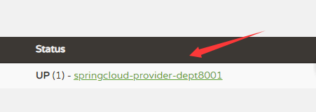

可观察到

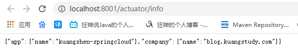

#### 4、自我保护机制

我们修改一个服务名,故意制造错误!

**自我保护机制:好死不如赖活着**

一句话总结:某时刻某一个微服务不可以用了，eureka不会立刻清理，依旧会对该微服务的信息进行保存!

- 默认情况下，如果EurekaServer在一 定时间内没有接收到某个微服务实例的心跳，EurekaServer将会注销该
  实例(默认90秒)。但是当网络分区故障发生时，微服务与Eureka之间无法正常通行，以上行为可能变得非
  常危险了--因为微服务本身其实是健康的，**此时本不应该注销这个服务**。Eureka通过 **自我保护机制**来解决这
  个问题--当EurekaServer节点在短时间内丢失过多客户端时(可能发生了网络分区故障)，那么这个节点就会
  进入自我保护模式。- -旦进入该模式，EurekaServer就会保护服务注册表中的信息, 不再删除服务注册表中
  的数据(也就是不会注销任何微服务)。当网络故障恢复后，该EurekaServer节点会自动退出自我保护模
  式。
- 在自我保护模式中，EurekaServer会保护服务注册表中的信息，不再注销任何服务实例。当它收到的心跳数
  重新恢复到阈值以上时，该EurekaServer节 点就会自动退出自我保护模式。它的设计哲学就是宁可保留错误
  的服务注册信息，也不盲目注销任何可能健康的服务实例。-句话:好死不如赖活着
- 综上，自我保护模式是一种应对网络异常的安全保护措施。它的架构哲学是宁可同时保留所有微服务(健康的
  微服务和不健康的微服务都会保留)，也不盲目注销任何健康的微服务。使用自我保护模式，可以让Eureka
  集群更加的健壮和稳定
- 在SpringCloud中，可以使用eureka. server . enable-self-preservation = false 禁用自我保护模式
  [不推荐关闭自我保护机制]

#### 5、8001服务发现Discovery(扩展)

- 对于注册进eureka里面的微服务,可以通过服务发现来获得该服务的信息。[对外暴露服务 ]
- 修改microservicecloud-provider-dept-8001I程中的DeptController

可以了解多应的服务信息，实现一些消息转换、服务发现

1、Controller中

```java
//获取一些配置的信息，得到具体的微服务!
    @Autowired
    private DiscoveryClient client;


//注册进来的微服务~，获取-些消息~
    @GetMapping("/dept/discovery")
    public Object discovery() {
        //获取微服务列表的清业
        List<String> services = client.getServices();
        System.out.println("discovery=>services:" + services);
        //得到一- 个具体的微服务信息通过具体的微服务id, appl icaioinName;
        List<ServiceInstance> instances = client.getInstances("SPRINGCLOUD-PROVIDER-DEPT");
        for (ServiceInstance instance : instances) {
            System.out.println(
                    instance.getHost() + "\t" +
                            instance.getPort() + "\t" +
                            instance.getUri() + "\t" +
                            instance.getServiceId()
            );
        }
        return this.client;
    }
```

2、启动类开启注解支持

@EnableDiscoveryClient//服务发现

```java
@SpringBootApplication
@EnableEurekaClient //在服务启动后自动注册到eureka中
@EnableDiscoveryClient//服务发现
public class DeptPriovider_8001 {
    public static void main(String[] args) {
        SpringApplication.run(DeptPriovider_8001.class, args);
    }

}
```

3、访问测试

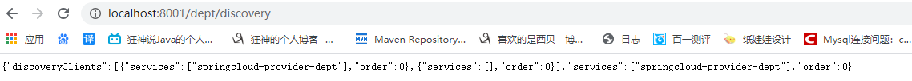

控制器输出

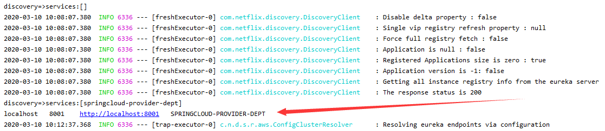

#### 6、集群环境配置

每台远程服务均可以互相访问

这么多服务? 如何治理?

1.创建三个项目，改上面的就行

springcloud-eureka-7001

springcloud-eureka-7002

springcloud-eureka-7003

2、添加域名

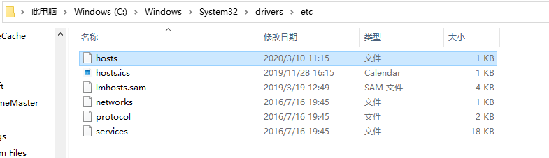

添加

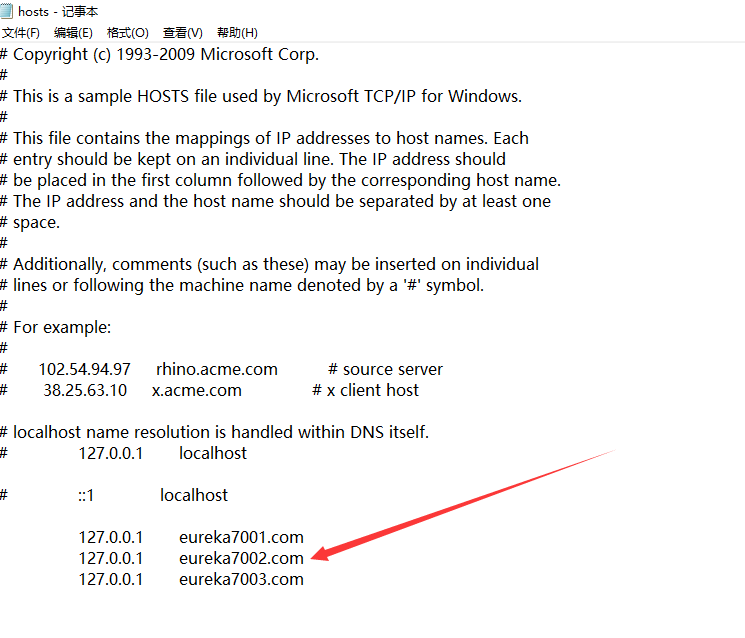

集群配置分析

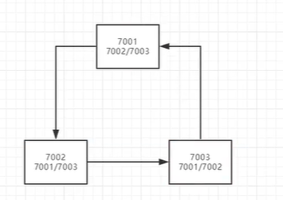

3、该yml配置

三个eureka

```yml
server:
  port: 7001
#Eureka配置
eureka:
  instance:
    hostname: eureka7001.com #Eureka 服务端的实例名称
  client:
    register-with-eureka: false #表示是否向eureka注册中心注册自己
    fetch-registry: false #fetch-registry如果为false,则表示自己为注册中心
    service-url: # 监控页面~
      #单机 http://${eureka.instance.hostname}:${server.port}/eureka/
      #(集群)关联 http://eureka7002.com:7002,http://eureka7003.com:7003
      defaultZone: http://eureka7002.com:7002/eureka/,http://eureka7003.com:7003/eureka/
server:
  port: 7002
#Eureka配置
eureka:
  instance:
    hostname: eureka7002.com #Eureka 服务端的实例名称
  client:
    register-with-eureka: false #表示是否向eureka注册中心注册自己
    fetch-registry: false #fetch-registry如果为false,则表示自己为注册中心
    service-url: # 监控页面~
      defaultZone: http://eureka7001.com:7001/eureka/,http://eureka7003.com:7003/eureka/
server:
  port: 7003
#Eureka配置
eureka:
  instance:
    hostname: eureka7003.com #Eureka 服务端的实例名称
  client:
    register-with-eureka: false #表示是否向eureka注册中心注册自己
    fetch-registry: false #fetch-registry如果为false,则表示自己为注册中心
    service-url: # 监控页面~
      defaultZone: http://eureka7002.com:7002/eureka/,http://eureka7001.com:7001/eureka/
```

提供者中

```yml
   defaultZone: http://eureka7001.com:7001/eureka/,http://eureka7002.com:7002/eureka/,http://eureka7003.com:7003/eureka/
```

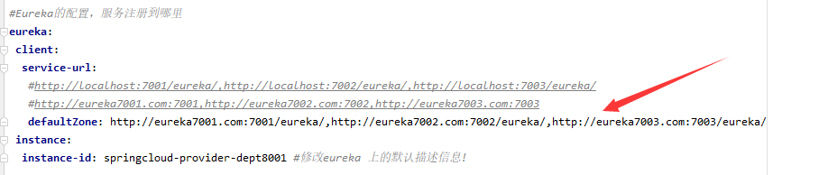

测试，先启动7001/7002/7003/8001三个地址可以相互访问

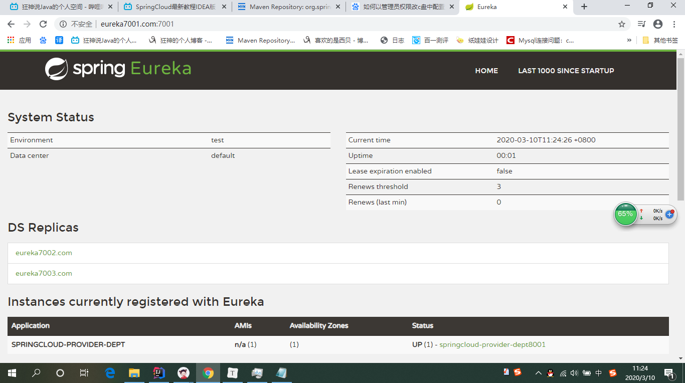

**三个地址服务均注册进去**

**消费者只需在配置中改链接即可**

### 5.4、对比Zookeeper

回顾CAP原则

RDBMS (Mysql. Oracle、 sqIServer) ===>ACID

NoSQL (redis. mongdb) ===> CAP

ACID是什么?

- A (Atomicity) 原子性
- C (Consistency) 一致性
- I (Isolation) 隔离性
- D (Durability) 持久性

CAP是什么?

- C (Consistency)强一致性
- A (Availability) 可用性
- P (Partition tolerance) 分区容错性

CAP的三进二: CA、AP. CP .

CAP理论的核心

- 一个分布式系统不可能同时很好的满足-致性，可用性和分区容错性这三个需求
- 根据CAP原理，将NoSQL数据库分成了满足CA原则，满足CP原则和满足AP原则三大类:
  - CA:单点集群，满足一致性，可用性的系统，通常可扩展性较差
  - CP:满足-致性,分区容错性的系统，通常性能不是特别高
  - AP:满足可用性,分区容错性的系统，通常可能对一致性要求低- -些

##### 作为服务注册中心，Eureka比Zookeeper好在哪里?

著名的CAP理论指出，一个分布式系统不可能同时满足C (一致性)、A (可用性)、P (容错性)。
由于分区容错性P在分布式系统中是必须要保证的，因此我们只能在A和C之间进行权衡。

- Zookeeper保证的是CP;
- Eureka保证的是AP:

**Zookeeper保证的是CP**

当向注册中心查询服务列表时，我们可以容忍注册中心返回的是几分钟以前的注册信息，但不能接受服务直接
down掉不可用。也就是说，服务注册功能对可用性的要求要高于-致性。 但是zk会出现这样一种情况， 当master
节点因为网络故障与其他节点失去联系时，剩余节点会重新进行leader选举。问题在于,选举leader的时间太长,
30~120s，且选举期间整个zk集群都是不可用的，这就导致在选举期间注册服务瘫痪。在云部署的环境下，因为网
络问题使得zk集群失去master节点是较大概率会发生的事件,虽然服务最终能够恢复，但是漫长的选举时间导致
的注册长期不可用是不能容忍的。

**Eureka保证的是AP**

Eureka看明白了这一点，因此在设计时就优先保证可用性。Eureka各个节 点都是平等的，几个节点挂掉不会影
响正常节点的工作,剩余的节点依然可以提供注册和查询服务。而Eureka的客户端在向某个Eureka注册时，如果
发现连接失败，则会自动切换至其他节点，只要有一台Eureka还在, 就能保住注册服务的可用性，只不过查到的
信息可能不是最新的，除此之外，Eureka还有一 种自我保护机制，如果在15分钟内超过85%的节点都没有正常的
心跳，那么Eureka就认为客户端与注册中心出现了网络故障,此时会出现以下几种情况:

1. Eureka不再从注册列表中移除因为长时间没收到心跳而应该过期的服务
2. Eureka仍然能够接受新服务的注册和查询请求，但是不会被同步到其他节点上(即保证当前节点依然可用)
3. 当网络稳定时，当前实例新的注册信息会被同步到其他节点中

**因此，Eureka可以很好的应对因网络故障导致部分节点失去联系的情况，而不会像zookeeper那样使整 个注册服务瘫痪**

## 6、Ribbon负载均衡

例如一万个人发送请求，负载均衡把请求平摊给五台服务器

ribbon怎么读?
ribbon是什么?
●Spring Cloud Ribbon是基于Netflix Ribbon实现的一 套**客户端负载均衡的工具。**
●简单的说，Ribbon是Netflix发布的开源项目, 主要功能是提供客户端的软件负载均衡算法，将NetFlix的中间
层服务连接在一起。 Ribbon的客户端组件提供-系列完整的配置项如:连接超时、重试等等。简单的说，就
是在配置文件中列出LoadBalancer (简称LB:负载均衡)后面所有的机器，Ribbon会 自动的帮助你基于某种
规则(如简单轮询，随机连接等等)去连接这些机器。我们也很容易使用Ribbon实现自定义的负载均衡算
法!
**ribbon能干嘛?**
●LB,即负载均衡(Load Balance) ，在微服务或分布式集群中经常用的一种应用。
●**负载均衡简单的说就是将用户的请求平摊的分配到多个服务上,从而达到系统的HA (高可用)。**
●常见的负载均衡软件有Nginx, Lvs等等
●dubbo. SpringCloud中均给我们提供了 负载均衡，**SpringCloud的负载均衡算法可以自定义**
●负载均衡简单分类:
。集中式LB
■即在服务的消费方和提供方之间使用独立的LB设施，如Nginx, 由该设施负责把访问请求通过某种策
略转发至服务的提供方!
。进程式LB
■将LB逻辑集成到消费方，消费方从服务注册中心获知有哪些地址可用，然后自己再从这些地址中选出
一个合适的服务器。
■Ribbon就属于进程内LB，它只是一个类库,集成于消费方进程，消费方通过它来获取到服务提供方
的地址

### 6.1、使用Ribbon实现负载均衡

springcloud-cosumer-dept-80中

1、添加依赖pom.xml

```xml
<!--ribbon-->
        <!-- https://mvnrepository.com/artifact/org.springframework.cloud/spring-cloud-starter-ribbon -->
        <dependency>
            <groupId>org.springframework.cloud</groupId>
            <artifactId>spring-cloud-starter-ribbon</artifactId>
            <version>1.4.6.RELEASE</version>
        </dependency>
        <!--eureka-->
        <!-- https://mvnrepository.com/artifact/org.springframework.cloud/spring-cloud-starter-eureka -->
        <dependency>
            <groupId>org.springframework.cloud</groupId>
            <artifactId>spring-cloud-starter-eureka</artifactId>
            <version>1.4.6.RELEASE</version>
        </dependency>
```

2、添加yml

```yml
#Eureka配置
eureka:
 client:
  register-with-eureka: false #不向Eureka注册自己
  service-url:
   defaultZone: http://eureka7001.com:7001/eureka/,http://eureka7002.com:7002/eureka/,http://eureka7003.com:7003/eureka/
```

3、配置类中添加注解 @LoadBalanced //Ribbon

```java
@Configuration
public class ConfigBean {

    //配置负载均衡实现Rest Template
    @Bean
    @LoadBalanced //Ribbon
    public RestTemplate getRestTemplate() {//@Configuration-- 以前在spring applicationContext.xml中配置
        return new RestTemplate();
    }
}
```

4、修改DeptConsumerController

```java
//Ribbon. 我们这里的地址，应该是一个变量。通过服务名来访问
//private static final String REST_URL_PREFIX = "http://localhost:8001";
private static final String REST_URL_PREFIX = "http://SPRINGCLOUD-PROVIDER-DEPT";
```

5、启动类中添加@EnableEurekaClient

```java
//Ribbon和Eureka整合以后，客户端可以直接调用。相关心IP地址和端口号
@SpringBootApplication
@EnableEurekaClient
public class DeptConsumer_80 {
    public static void main(String[] args) {
        SpringApplication.run(DeptConsumer_80.class, args);
    }

}
```

6、启动7001/7002/8001/80测试

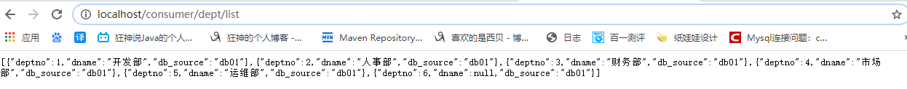

### 6.2、使Ribbon实现负载均衡

1、创建三个提供者

springcloud-priovider-dept-8001

springcloud-priovider-dept-8002

springcloud-priovider-dept-8003

2、复制springcloud-priovider-dept-8001，更改里面的配置

yml

```yml
server:
 port: 8002

#mybatis配置
mybatis:
 type-aliases-package: com.kuang.pojo
 config-location: classpath:mybatis/mybatis-config.xml
 mapper-locations: classpath:mybatis/mapper/*.xml

#spring的配置&autoReconnect=true
spring:
 application:
  name: springcloud-provider-dept #三个服务名称一致
 datasource:
  type: com.alibaba.druid.pool.DruidDataSource
  driver-class-name: org.gjt.mm.mysql.Driver
  url: jdbc:mysql://localhost:3306/db02?useUnicode=true&characterEncoding=utf-8
  username: root
  password: 981204

#Eureka的配置，服务注册到哪里
eureka:
 client:
  service-url:
   #http://localhost:7001/eureka/,http://localhost:7002/eureka/,http://localhost:7003/eureka/
   #http://eureka7001.com:7001,http://eureka7002.com:7002,http://eureka7003.com:7003
   defaultZone: http://eureka7001.com:7001/eureka/,http://eureka7002.com:7002/eureka/,http://eureka7003.com:7003/eureka/
 instance:
  instance-id: springcloud-provider-dept8002 #修改eureka 上的默认描述信息!

#info配置
info:
 app.name: kuangshen-springcloud
 company.name: blog.kuangstudy.com
```

2、更改主启动类

```java
package com.kuang;

import org.springframework.boot.SpringApplication;
import org.springframework.boot.autoconfigure.SpringBootApplication;
import org.springframework.cloud.client.discovery.EnableDiscoveryClient;
import org.springframework.cloud.netflix.eureka.EnableEurekaClient;


@SpringBootApplication
@EnableEurekaClient //在服务启动后自动注册到eureka中
@EnableDiscoveryClient//服务发现
public class DeptPriovider_8002 {
    public static void main(String[] args) {
        SpringApplication.run(DeptPriovider_8002.class, args);
    }

}
```

3、启动测试

启动7001，发现有两个提供者注册进去

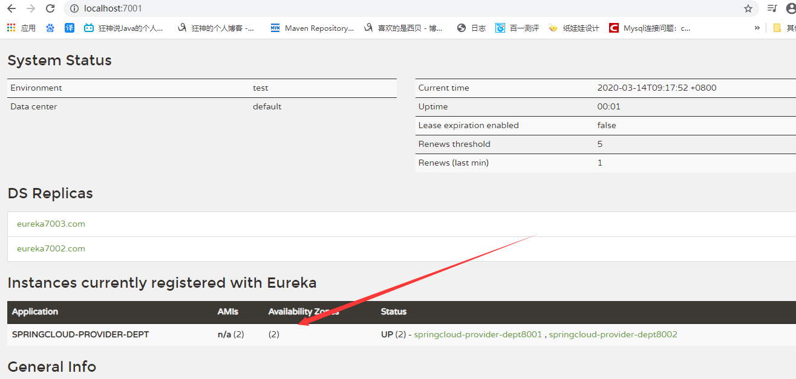

再启动8001/8002/8003/80，结果是**轮询**，判断自己是要连哪个

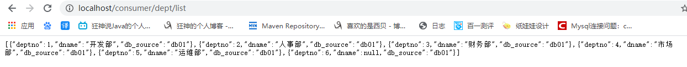

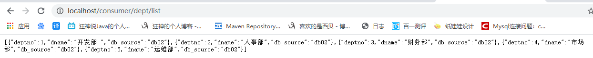

### 6.3、优化Ribbon实现负载均衡

1、使用随机算法代替默认的轮询算法

```java
// IRule
// RoundRobinRule轮询
// RandomRule随机
// AvailabilityFilteringRule :会先过滤掉， 跳闸，访问故障的服务~，对利下的进行轮海~
// RetryRule :会先按照轮 询获取服务~，如果服务获取失败，则会在指定的时间内进行，重试
@Configuration
public class KuangRule {
    @Bean
    public IRule myRu1e() {
        return new RandomRule();
    }

}
```

### 6.4、自定义负载均衡算法

1、复制RandomRule，自己更改将**原来的默认轮询访问**改为**每个服务访问5次,再换下一个服务(3个)**

```java
package com.kuang.myrule;

import com.netflix.client.config.IClientConfig;
import com.netflix.loadbalancer.AbstractLoadBalancerRule;
import com.netflix.loadbalancer.ILoadBalancer;
import com.netflix.loadbalancer.Server;

import java.util.List;
import java.util.concurrent.ThreadLocalRandom;

public class KuangRandomRule extends AbstractLoadBalancerRule {
    //每个服务，访问次,换下一个服务(3个)
    // total=0, 默认=0，如果=5，我们指向下一个服务节点
    // index=0. 默认=0，如果total=5, index+1.
    private int total = 0; //被调用的次数
    private int currentIndex = 0; //当前是谁在提供服务d


    //@SuppressWarnings({"RCN_REDUNDANT_NULLCHECK_OF_NULL_VALUE"})
    public Server choose(ILoadBalancer lb, Object key) {
        if (lb == null) {
            return null;
        } else {
            Server server = null;

            while (server == null) {
                if (Thread.interrupted()) {
                    return null;
                }

                List<Server> upList = lb.getReachableServers();//获得活着的服务
                List<Server> allList = lb.getAllServers();//获得全部服务
                int serverCount = allList.size();
                if (serverCount == 0) {
                    return null;
                }


                // int index = this.chooseRandomInt(serverCount);//生成区间随机数
                //server = (Server) upList.get(index);//从活着的服务中，随机获取一个

                //===============================================
                if (total < 5) {
                    server = upList.get(currentIndex);
                    total++;
                } else {
                    total = 0;
                    currentIndex++;
                    if (currentIndex > upList.size()) {
                        currentIndex = 0;
                    }
                    server = upList.get(currentIndex); //从活着的服务中，获取指定的服务来进行操作
                }
                //=================================================


                if (server == null) {
                    Thread.yield();
                } else {
                    if (server.isAlive()) {
                        return server;
                    }

                    server = null;
                    Thread.yield();
                }
            }

            return server;
        }
    }

    protected int chooseRandomInt(int serverCount) {
        return ThreadLocalRandom.current().nextInt(serverCount);
    }

    public Server choose(Object key) {
        return this.choose(this.getLoadBalancer(), key);
    }

    public void initWithNiwsConfig(IClientConfig clientConfig) {
    }
}
```

2、配置中调用该自定义负载均衡算法

```java
@Configuration
public class KuangRule {
    @Bean
    public IRule myRu1e() {
        return new KuangRandomRule();
    }

}
```

3、启动7001/8001/8002/8003/80访问测试

发现**每个服务访问5次,再换下一个服务(3个)**

## 7、Feign负载均衡

### 7.1、简介

feign是声明式的web service客户端，它让微服务之间的调用变得更简单了，类似controller调用service。 Spring
Cloud集成了Ribbon和Eureka,可在使用Feign时提供负载均衡的http客户端。

只需要创建一个接口，然后添加注解即可!

feign,主要是社区,大家都习惯面向接口编程。这个是很多开发人员的规范。调用微服务访问两种方法

1. 微服务名字[ribbon]
2. 接口和注解[feign ]

**Feign能干什么?**

- Feign旨在使编写Java Http客户端变得更容易
- 前面在使用Ribbon + RestTemplate时, 利用RestTemplate对Http请求的封装处理， 形成了一 套模板化的调用
  方法。但是在实际开发中，由于对服务依赖的调用可能不止一-处, 往往-个接口会被多处调用，所以通常都会
  针对每个微服务自行封装-一些客户端类来包装这些依赖服务的调用。 所以，Feign在此基础 上做了进一步封
  装,由他来帮助我们定义和实现依赖服务接口的定义，在Feign的实现下，我们只需要创建一个接口并使用**
  **注解的方式来配置它(类似于以前Dao接口上标注Mapper注解，现在是一个微服务接口上面标注一个Feign注**
  解即可。)** 即可完成对服务提供方的接口绑定,简化了使用Spring Cloud Ribbon时,自动封装服务调用客
  户端的开发量。

**Feign集成了Ribbon**

- 利用Ribbon维护了MicroServiceCloud-Dept的服务列表信息,并且通过轮询实现了客户端的负载均衡，而与
  Ribbon不同的是，通过Feign只需要定义服务绑定接口且以声明式的方法，优雅而且简单的实现了服务调用。

### 7.2、Feign的使用步骤

1.创建springcloud-cosumer-dept-feign导入springcloud-cosumer-dept-80的那些配置

2.在模块springcloud-api和springcloud-cosumer-dept-feign中添加依赖

```xml
  <!--feign-->
        <!-- https://mvnrepository.com/artifact/org.springframework.cloud/spring-cloud-starter-ribbon -->
        <dependency>
            <groupId>org.springframework.cloud</groupId>
            <artifactId>spring-cloud-starter-feign</artifactId>
            <version>1.4.6.RELEASE</version>
        </dependency>
```

3.在模块springcloud-api中编写DeptClientService

```java
@Component
@FeignClient(value = "SPRINGCLOUD-PROVIDER-DEPT")
public interface DeptClientService {


    @GetMapping("/dept/get/{id}")
    public Dept queryById(@PathVariable("id") Long id);

    @GetMapping("/dept/list")
    public List<Dept> queryAll();

    @PostMapping("/dept/add")
    public boolean addDept(Dept dept);

}
```

4.springcloud-cosumer-dept-feign中编写DeptConsumerController

```java
@RestController
public class DeptConsumerController {
    //@Autowired(required=true)：当使用@Autowired注解的时候，其实默认就是@Autowired(required=true)，表示注入的时候，该bean必须存在，否则就会注入失败。
    @Autowired(required = false)
    private DeptClientService service = null;

    @RequestMapping("/consumer/dept/add")
    public boolean add(Dept dept) {
        return this.service.addDept(dept);
    }

    @RequestMapping("/consumer/dept/get/{id}")
    public Dept get(@PathVariable("id") Long id) {
        return this.service.queryById(id);
    }

    @RequestMapping("/consumer/dept/list")
    public List<Dept> list() {
        return this.service.queryAll();
    }

}
```

5.编写主启动类

```java
//Ribbon和Eureka整合以后，客户端可以直接调用。相关心IP地址和端口号
@SpringBootApplication
@EnableEurekaClient
@EnableFeignClients(basePackages = {"com.kuang"})
public class FeignDeptConsumer_80 {
    public static void main(String[] args) {
        SpringApplication.run(FeignDeptConsumer_80.class, args);
    }

}
```

6.启动7001/8001/8002、fegin80测试访问，发现也是默认轮询

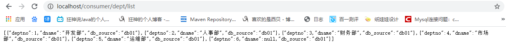

## 8、Hystrix服务熔断

**分布式系统面临的问题**

复杂分布式体系结构中的应用程序有数十个依赖关系，每个依赖关系在某些时候将不可避免的失败!

**服务雪崩**

 多个微服务之间调用的时候，假设微服务A调用微服务B和微服务C,微服务B和微服务(C又调用其他的微服务,
这就是所谓的“扇出”、如果扇出的链路上某个微服务的调用响应时间过长或者不可用，对微服务A的调用就会占用
越来越多的系统资源，进而引起系统崩溃，所谓的“雪崩效应”。
​ 对于高流量的应用来说，单- -的后端依赖可能会导致所有服务器上的所有资源都在几秒中内饱和。比失败更糟
糕的是，这些应用程序还可能导致服务之间的延迟增加，备份队列,线程和其他系统资源紧张，导致整个系统发生
更多的级联故障，这些都表示需要对故障和延迟进行隔离和管理，以便单个依赖关系的失败,不能取消整个应用程
序或系统。
​ 我们需要:弃车保帅.

**什么是Hystrix**
Hystrix是一个用于处理分布式系统的延迟和容错的开源库, 在分布式系统里,许多依赖不可避免的会调用失
败，比如超时，异常等, Hystrix能够保证在一个依赖出问题的情况下， 不会导致整体服务失败，避免级联故障,
以提高分布式系统的弹性。

 “断路器”本身是一种开关装置， 当某个服务单元发生故障之后，通过断路器的故障监控(类似熔断保险丝)，**向**
**调用方返回- -个服务预期的，可处理的备选响应(FallBack) , 而不是长时间的等待或者抛出调用方法无法处理**
**的异常，这样就可以保证了服务调用方的线程不会被长时间，**不必要的占用，从而避免了故障在分布式系统中的蔓
延，乃至雪崩

**能干嘛**
●服务降级.
●服务熔断
●服务限流
●接近实时的监控

官网资料
https://github.com/Netflix/Hystrix/wiki


### 8.1、服务熔断

**是什么**
熔断机制是对应雪崩效应的一种微服务链路保护机制。

 当扇出链路的某个微服务不可用或者响应时间太长时，会进行服务的降级,**进而熔断该节点微服务的调用，快**
**速返回错误的响应信息**。当检测到该节点微服务调用响应正常后恢复调用链路。在SpringCloud框架里熔断机制通
过Hystrix实现。Hystrix会监控微服务间调用的状况，当失败的调用到一定阈值，缺省是5秒内20次调用失败就会
启动熔断机制。熔断机制的注解是@HystrixCommand.

**步骤**

1.创建一个项目springcloud-priovider-dept-hystrix-8001复制springcloud-priovider-dept-8001的配置

2.添加pom依赖

```xml
   <dependency>
            <groupId>org.springframework.cloud</groupId>
            <artifactId>spring-cloud-starter-hystrix</artifactId>
            <version>1.4.6.RELEASE</version>
        </dependency>
```

3.DeptController

```java
//提供Restfui服务
@RestController
public class DeptController {
    @Autowired
    private DeptService deptService;

    @GetMapping("/dept/get/{id}")
    @HystrixCommand(fallbackMethod = "hystrixGet")
    public Dept get(@PathVariable("id") Long id) {
        Dept dept = deptService.queryById(id);
        if (dept == null) {
            throw new RuntimeException("id=>" + id + ".不存在该用户。或者信息无法找到~");
        }
        return dept;
    }

    //备选方法
    public Dept hystrixGet(@PathVariable("id") Long id) {

        Dept dept = new Dept();
        dept.setDeptno(id);
        dept.setDname("id=>" + id + "没有对应的信息。null--@Hystrix");
        dept.setDb_source("no this database in MySQL");
        return dept;
    }

}
```

4.添加@EnableCircuitBreaker//添加对熔断的支持

```java
@SpringBootApplication
@EnableEurekaClient //在服务启动后自动注册到eureka中
@EnableDiscoveryClient//服务发现
@EnableCircuitBreaker//添加对熔断的支持
public class DeptPrioviderHystrix_8001 {
    public static void main(String[] args) {
        SpringApplication.run(DeptPrioviderHystrix_8001.class, args);
    }

}
```

5.启动7001/7002、hystrix8001/80测试访问：

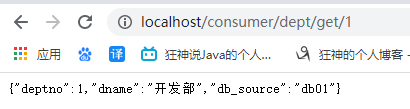

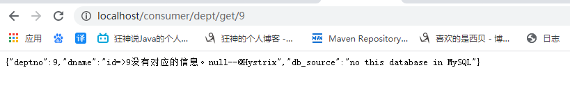

**彩蛋**：显示ip地址

配置

```yml
 prefer-ip-address: true #true 可以显示服务的ip地址
```

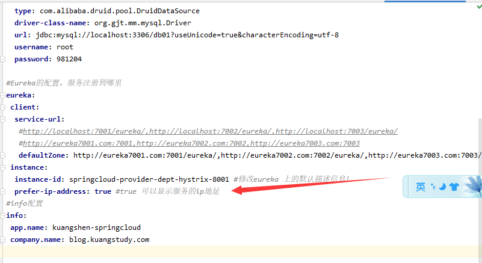

配置前

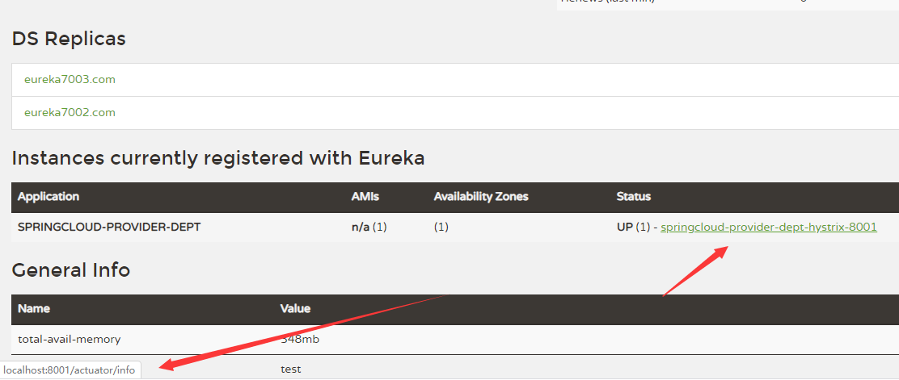

配置后

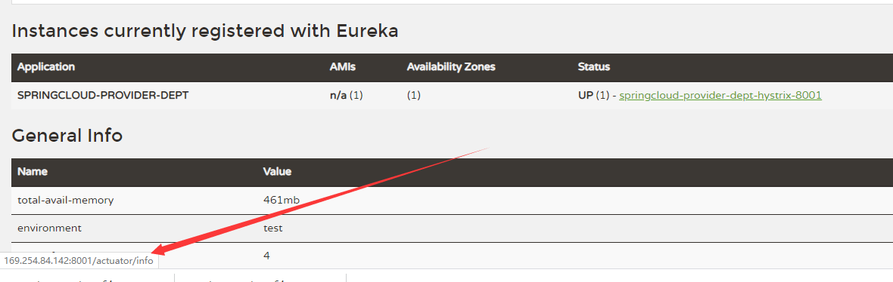

### 8.2、服务降级

服务器访问量大时关闭部分其它服务器

1.springcloud-api中编写DeptClientServiceFallbackFacktory

```java
//降级
@Component
public class DeptClientServiceFallbackFacktory implements FallbackFactory {
    @Override
    public DeptClientService create(Throwable throwable) {
        return new DeptClientService() {
            @Override
            public Dept queryById(Long id) {
                Dept dept = new Dept();
                dept.setDeptno(id);
                dept.setDname("id=>" + id + "没有对应的信息。客户端提供了降级的信息。这个服务现在已经被关闭");
                dept.setDb_source("没有数据~");
                return dept;
            }

            @Override
            public List<Dept> queryAll() {
                return null;
            }

            @Override
            public boolean addDept(Dept dept) {
                return false;
            }
        };
    }

}
```

2.DeptClientService

```java
@FeignClient(value = "SPRINGCLOUD-PROVIDER-DEPT", fallbackFactory = DeptClientServiceFallbackFacktory.class)
```

3.springcloud-cosumer-dept-feign中添加配置

```yml
#开启降级feign. hystrix
feign:
 hystrix:
  enabled: true
```

4.启动7001/8001、feign80测试

http://localhost/consumer/dept/get/1查询成功

5.关闭8001

查询结果

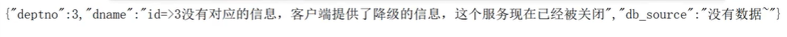

服务熔断:服务券菜 个服务超时或者异常，引起熔断，保险丝~
服务降级:客户端从整体网站请求负载考虑。当菜个服务熔断或者关闭之后。服务将不再被调用
此时在客户端，我们可以准备一- 个FallbackFactory. 返回- - 个默认的值(缺省值)，整体的服务水中下降不但是，好歹能用比直按挂掉强

### 8.3、Dashboard流监控

写监控页面

1.创建springcloud-cosumer-hystrix-dashboard

2.添加依赖

```xml
  <dependency>
            <groupId>org.springframework.cloud</groupId>
            <artifactId>spring-cloud-starter-hystrix</artifactId>
            <version>1.4.6.RELEASE</version>
        </dependency>
        <dependency>
            <groupId>org.springframework.cloud</groupId>
            <artifactId>spring-cloud-starter-hystrix-dashboard</artifactId>
            <version>1.4.6.RELEASE</version>
        </dependency>
```

3.设置端口号

```yml
server:
 port: 9001
```

4.编写启动类启动

```java
@SpringBootApplication
@EnableHystrixDashboard //开启
public class DeptConsumerDashboard_9001 {
    public static void main(String[] args) {
        SpringApplication.run(DeptConsumerDashboard_9001.class,args);
    }

}
```

5、访问测试

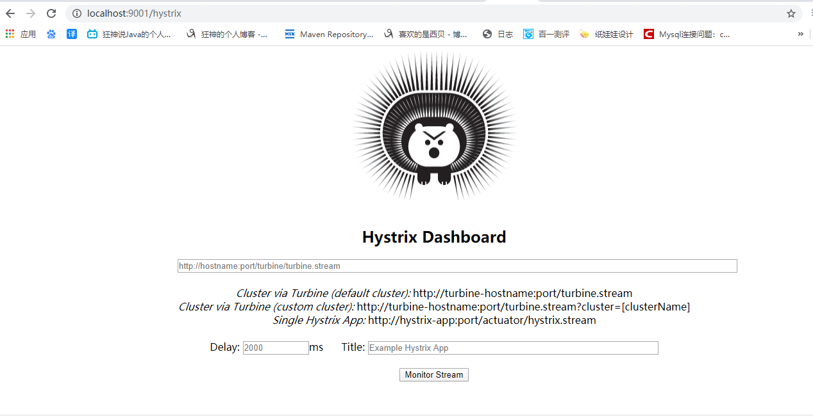

**开始监控了**

项目springcloud-priovider-dept-8001中

1.主启动类中

```java
@SpringBootApplication
@EnableEurekaClient //在服务启动后自动注册到eureka中
@EnableDiscoveryClient//服务发现
public class DeptPriovider_8001 {
    public static void main(String[] args) {
        SpringApplication.run(DeptPriovider_8001.class, args);
    }

    //增加一个Servlet
    @Bean
    public ServletRegistrationBean hystrixMetricsStreamServlet() {
        ServletRegistrationBean registrationBean = new ServletRegistrationBean(new HystrixMetricsStreamServlet());
        registrationBean.addUrlMappings("/actuator/hystrix.stream");
        return registrationBean;
    }

}
```

2.启动7001/9001/8001测试

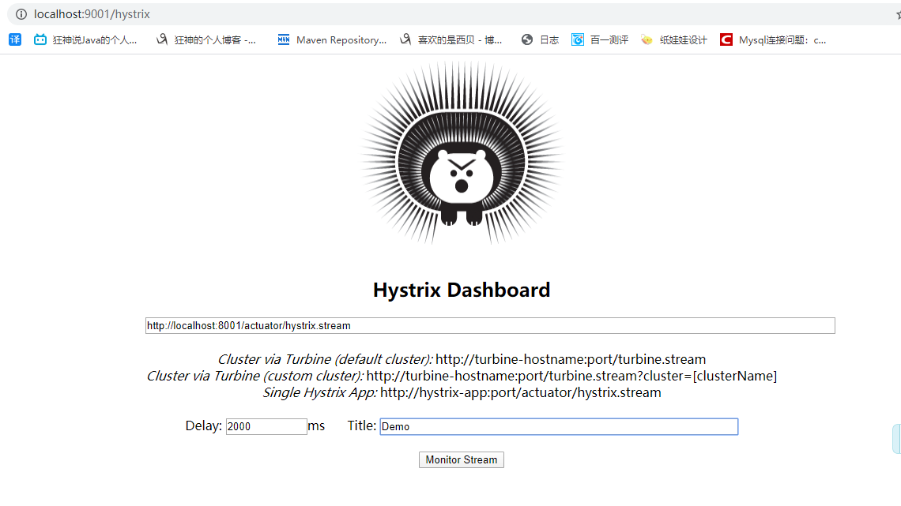

每次发送请求观察监控变化

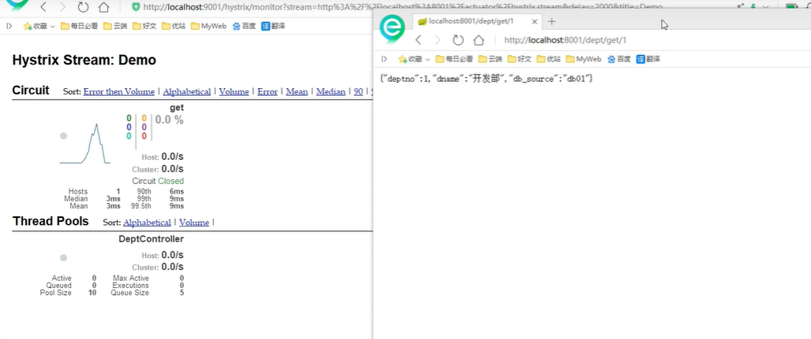

**关于监控

。如何看
■7色

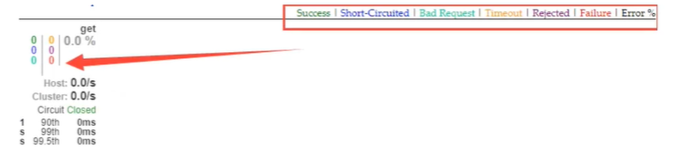

■一圈
实心圆:公有两种含义,他通过颜色的变化代表了实例的健康程度
它的健康程度从绿色<黄色<橙色<红色递减
该实心圆除了颜色的变化之外,它的大小也会根据实例的请求流量发生变化，流量越大,该实心圆就
越大，所以通过该实心圆的展示,就可以在大量的实例中快速发现**故障实例和高压力实例。**

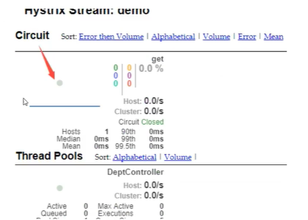
)

■一线
曲线:用来记录2分钟内流量的相对变化，可以通过它来观察到流量的上升和下降趋势!

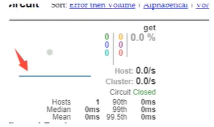

■整图说明

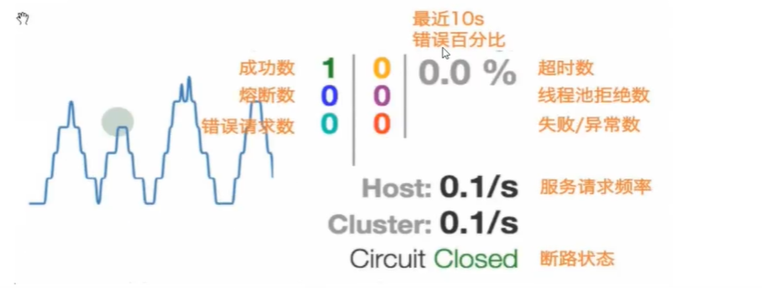

。搞懂一个才能看懂复杂的


## 9、Zuul路由网关

### **概述**

什么是Zuul?

Zuul包含了对请求的路由和过滤两个最主要的功能:
其中路由功能负责将外部请求转发到具体的微服务实例上，实现外部访问统-入口的基础， 而过滤器功能则
负责对请求的处理过程进行干预，是实现请求校验，服务聚合等功能的基础。Zuul和Eureka进行整合,将Zuul自
身注册为Eureka服务治理下的应用，同时从Eureka中获得其他微服务的消息，也即以后的访问微服务都是通过
Zuul跳转后获得。

注意: Zuul服务最终还是会注册进Eureka
提供:代理+路由+过滤三大功能!

**Zuul能干嘛?**
●路由
●过滤
官网文档: https://github.com/Netflix/zuul

### **步骤**

本地更改

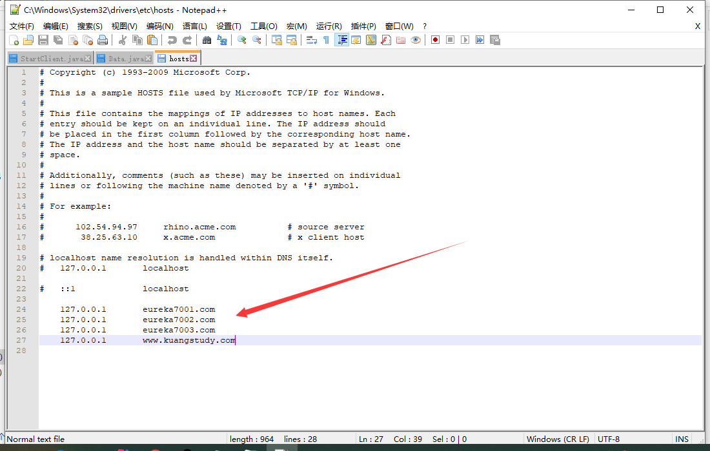

1.创建springcloud-zuul-9527

2.导入依赖

```xml
<dependencies>
        <dependency>
            <groupId>org.springframework.cloud</groupId>
            <artifactId>spring-cloud-starter-zuul</artifactId>
            <version>1.4.6.RELEASE</version>
        </dependency>
        <dependency>
            <groupId>org.springframework.cloud</groupId>
            <artifactId>spring-cloud-starter-hystrix</artifactId>
            <version>1.4.6.RELEASE</version>
        </dependency>
        <dependency>
            <groupId>org.springframework.cloud</groupId>
            <artifactId>spring-cloud-starter-hystrix-dashboard</artifactId>
            <version>1.4.6.RELEASE</version>
        </dependency>
        <!--ribbon-->
        <!-- https://mvnrepository.com/artifact/org.springframework.cloud/spring-cloud-starter-ribbon -->
        <dependency>
            <groupId>org.springframework.cloud</groupId>
            <artifactId>spring-cloud-starter-ribbon</artifactId>
            <version>1.4.6.RELEASE</version>
        </dependency>
        <!--eureka-->
        <!-- https://mvnrepository.com/artifact/org.springframework.cloud/spring-cloud-starter-eureka -->
        <dependency>
            <groupId>org.springframework.cloud</groupId>
            <artifactId>spring-cloud-starter-eureka</artifactId>
            <version>1.4.6.RELEASE</version>
        </dependency>

        <!--实体类+web-->
        <dependency>
            <groupId>com.kuang</groupId>
            <artifactId>springcloud-api</artifactId>
            <version>1.0-SNAPSHOT</version>
        </dependency>
        <dependency>
            <groupId>org.springframework.boot</groupId>
            <artifactId>spring-boot-starter-web</artifactId>
        </dependency>
        <dependency>
            <groupId>org.springframework.boot</groupId>
            <artifactId>spring-boot-devtools</artifactId>
        </dependency>
    </dependencies>
```

3.添加配置

```yml
server:
  port: 9527


spring:
  application:
    name: springcloud-zuul

eureka:
  client:
    service-url:
      defaultZone: http://eureka7001.com:7001/eureka/,http://eureka7002.com:7002/eureka/,http://eureka7003.com:7003/eureka/

  instance:
    instance-id: zuul9527.com
    prefer-ip-address: true

info:
  app.name: kuang-springcloud
  company.name: blog.kuangstudy.com
```

4.启动类

```java
@SpringBootApplication
@EnableZuulProxy //
public class ZuulApplication_9527 {
    public static void main(String[] args) {
        SpringApplication.run(ZuulApplication_9527.class, args);
    }
}
```

5.启动7001/8001/9527测试访问

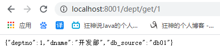

**使用路由网关保证了本地域名不被泄漏**

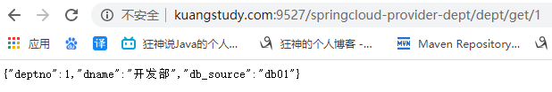

### **隐藏真实的微服务名字（网关的一些配置）**

添加yml配置

```yml
zuul:
  routes:
    mydept.serviceId: springcloud-provider-dept
    mydept.path: /mydept/**
  ignored-services: "*" #不能再使用这个路径访间了ignored :忽略。隐藏全部的~
  prefix: /kuang #设置公共的前缀
```

启动7001/8001/9527访问测试

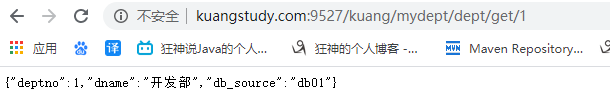

## 10、config分布式配置

### 10.1、概述

**分布式系统面临的-配置文件的问题**
微服务意味着要将单体应用中的业务拆分成一个个子服务,每个服务的粒度相对较小，因此系统中会出现大量的服
务,由于每个服务都需要必要的配置信息才能运行，所以一套集中式的，动态的配置管理设施是必不可少的。
SpringCloud提供了ConfigServer来解决这个问题，我们每一个微服务自己带着- -个application.yml, 那上百的的
配置文件要修改起来，岂不是要发疯! .

**什么是SpringCloud config分布式配置中心**

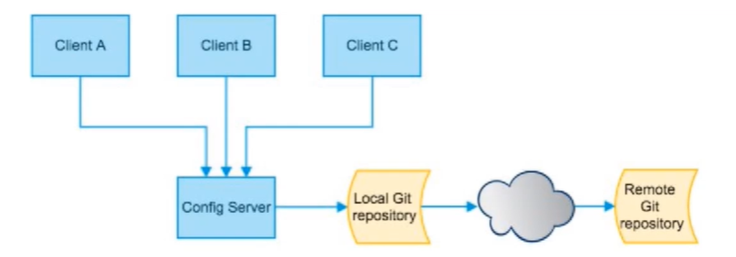

Spring Cloud Config为微服务架构中的微服务提供集中化的外部配置支持,配置服务器为**各个不同微服务应用**
的所有环节提供了一个**中心化的外部配置。**

Spring Cloud Config 分为**服务端**和**客户端**两部分;
服务端也称为分布式配置中心，它是一 个独立的微服务应用，用来连接配置服务器并为客户端提供获取配置信
息，加密，解密信息等访问接口。
客户端则是通过指定的配置中心来管理应用资源，以及与业务相关的配置内容,并在启动的时候从配置中心获
取和加载配置信息。配置服务器默认采用gjt来存储配置信息,这样就有助于对环境配置进行版本管理。并且可以
通过git客户端工具来方便的管理和访问配置内容。

**SpringCloud config分布式配置中心能干嘛**
●集中管理配置文件
●不同环境，不同配置，动态化的配置更新，分环境部署，比如/dev /test/ /prod /beta /release-
●运行期间动态调整配置，不再需要在每个服务部署的机器上编写配置文件,服务会向配置中心统一拉取配置自
己的信息。
●当配置发生变动时，服务不需要重启，即可感知到配置的变化,并应用新的配置
●将配置信息以REST接口的形式暴露
SpringCloud config分布式配置中心与github整合
由于Spring Cloud Config默认使用Git来存储配置文件(也有其他方式， 比如支持SVN和本地文件)，但是最推
荐的还是Git，而且使用的是http 1 https访问的形式;

### 10.2、Git环境搭建

#### 码云中新建仓库

1、

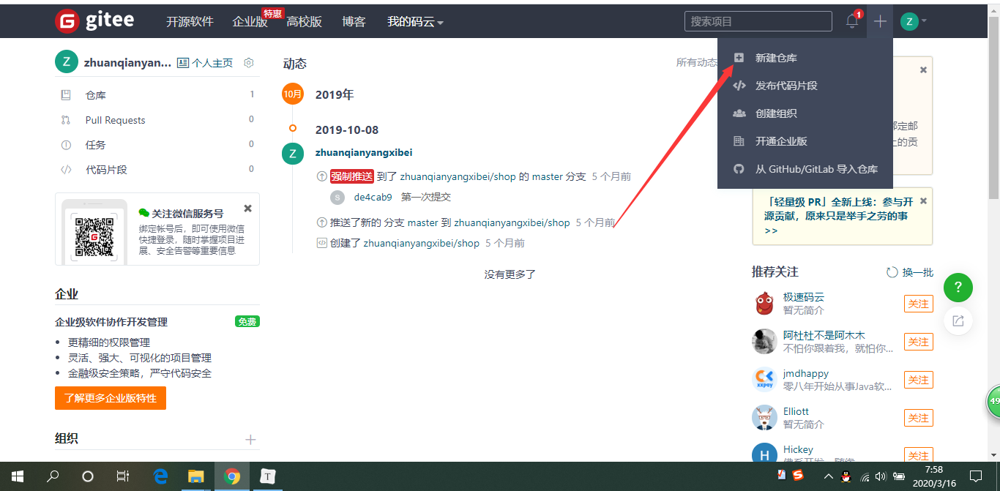

2、

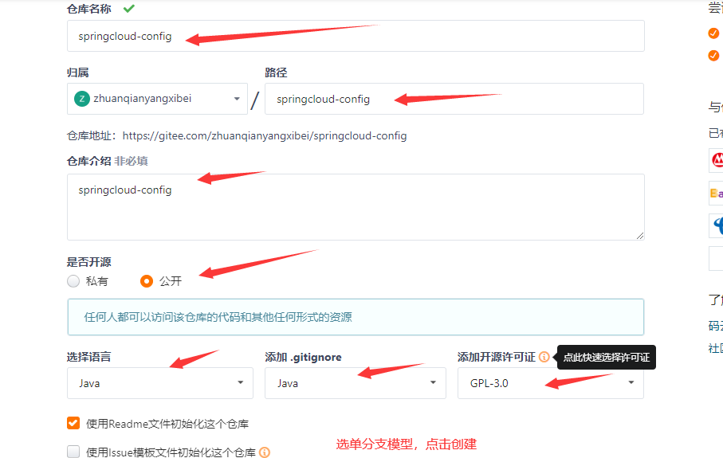

仓库下载到本地

3、点击克隆下载，选中SSH，复制

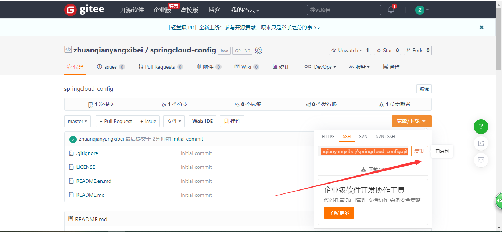

4、创建文件夹GIT，右击打开Git Bash Here

输入

```
git clone git@gitee.com:zhuanqianyangxibei/springcloud-config.git
```

输入

```
yes
```

发现

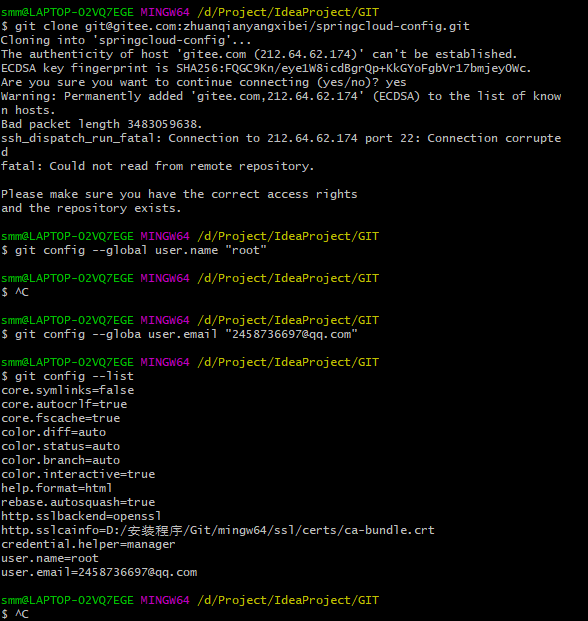

#### 第一次配出现以下权限问题

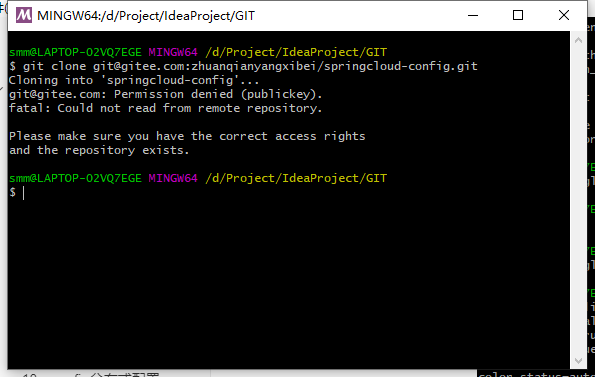

解决办法

1、打开码云，点击设置点击SSH公钥,生成一个公钥

```
ssh-keygen -t rsa -C "2458736697@qq.com"
```

2、可以在这个位置找到生成的公钥

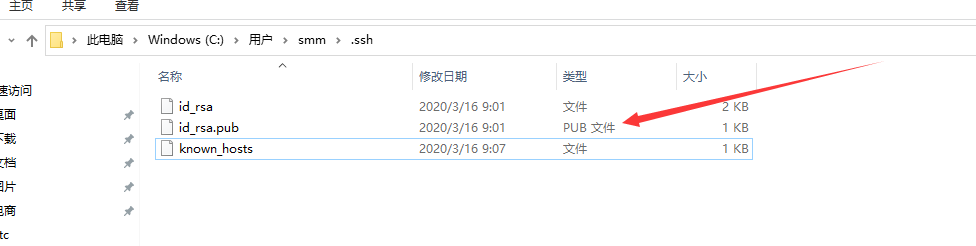

3、添加公钥到码云

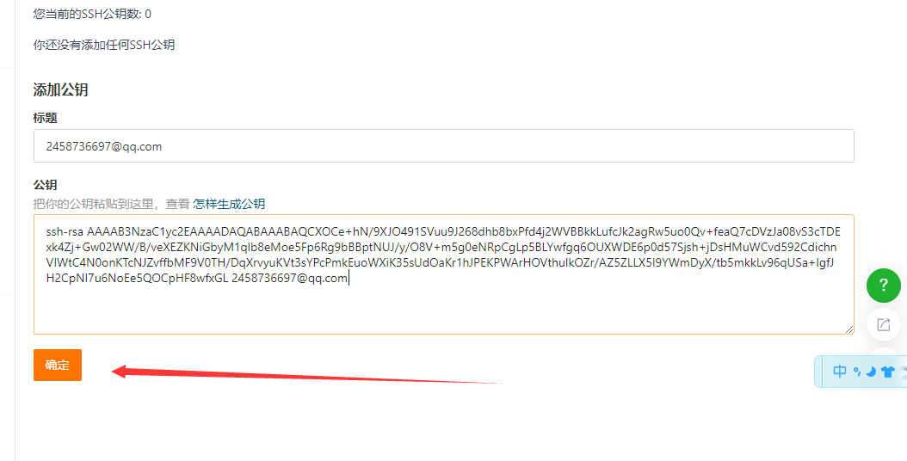

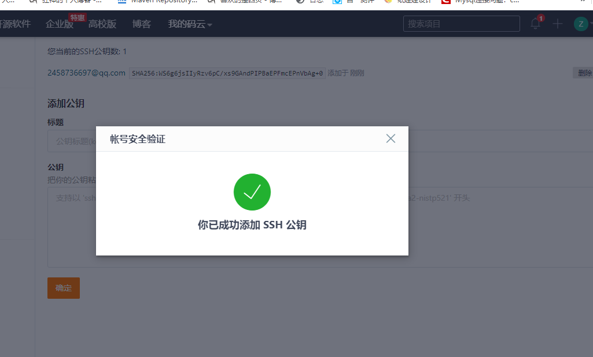

4、输入克隆命令

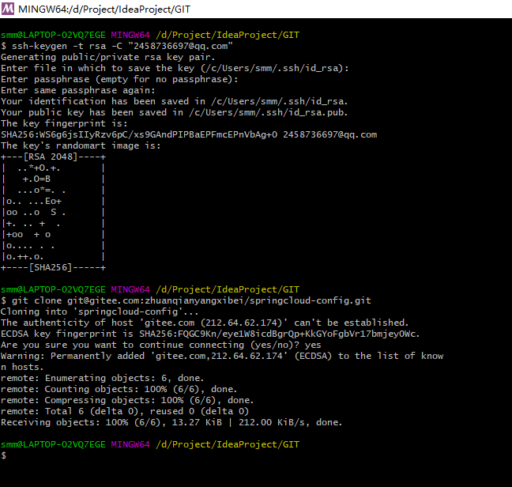

5、成功克隆到本地

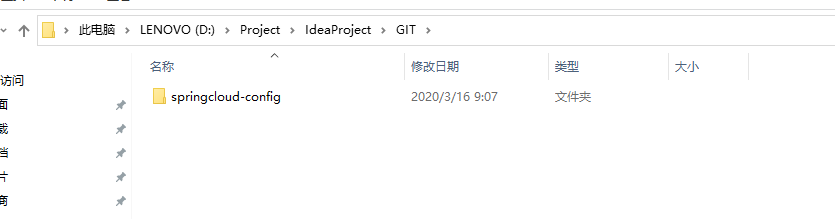

#### 远程文件提交到码云

1.在springcloud-config目录下创建application.yml

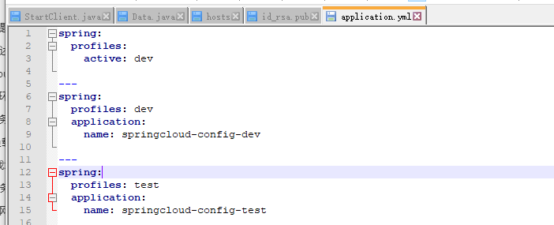

2.输入命令

切换当前目录下

```
cd springcloud-config/
```

添加

```
git add .
```

获得状态

```
git status
```

提交以及设置提交名字

```
git commit -m "first commit"
```

远程提交到码云

```
git push origin master
```

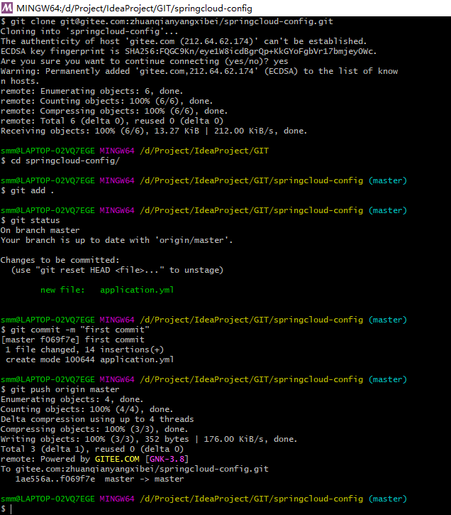

3、刷新码云发现远程提交成功

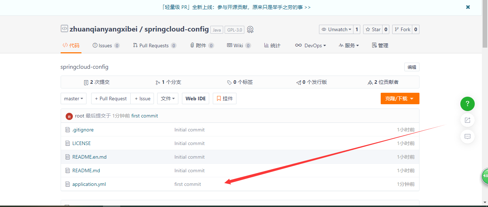

### 10.3、服务端连接Git配置

步骤

1.导入依赖

```xml
<!-- https://mvnrepository.com/artifact/org.springframework.cloud/spring-cloud-config-server -->
    <dependency>
        <groupId>org.springframework.cloud</groupId>
        <artifactId>spring-cloud-config-server</artifactId>
        <version>2.1.1.RELEASE</version>
    </dependency>
    <!--<dependency>
        <groupId>org.springframework.cloud</groupId>
        <artifactId>spring-cloud-starter-eureka</artifactId>
        <version>1.4.6.RELEASE</version>
    </dependency>-->
    <!--actuator完善监控信息-->
    <dependency>
        <groupId>org.springframework.boot</groupId>
        <artifactId>spring-boot-starter-actuator</artifactId>
    </dependency>
    <dependency>
        <groupId>org.springframework.boot</groupId>
        <artifactId>spring-boot-starter-web</artifactId>
    </dependency>
```

2.编写配置文件

```yml
server:
  port: 3344

spring:
  application:
    name: springcloud-config-server
    #连接远程仓库
  cloud:
    config:
      server:
        git:
          uri: https://gitee.com/zhuanqianyangxibei/springcloud-config.git # https ,不是SSH
#通过config-server可以连接到git， 访问其中的资源以及配置~
```

3、启动类及开启服务

```java
@SpringBootApplication
@EnableConfigServer//
public class Config_Server_3344 {
    public static void main(String[] args) {
        SpringApplication.run(Config_Server_3344.class, args);
    }

}
```

4、启动测试

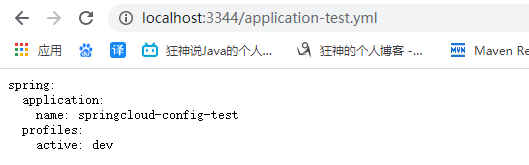


实现了远程访问

### 10.4、客户端连接服务端访问远程

D:\Project\IdeaProject\GIT\springcloud-config中创建一个config-client.yml

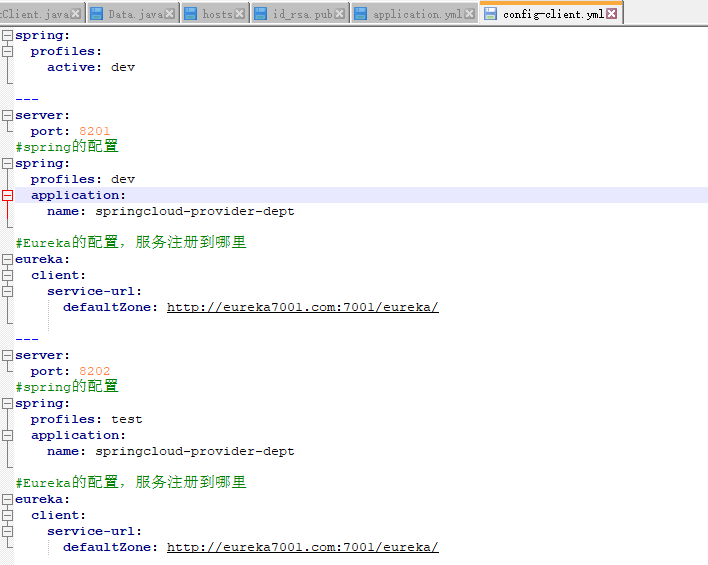

四步远程提交到码云

**步骤**

1.导入依赖

```xml
  <!-- https://mvnrepository.com/artifact/org.springframework.cloud/spring-cloud-starter-config -->
    <dependency>
        <groupId>org.springframework.cloud</groupId>
        <artifactId>spring-cloud-starter-config</artifactId>
        <version>2.1.1.RELEASE</version>
    </dependency>
    <dependency>
        <groupId>org.springframework.boot</groupId>
        <artifactId>spring-boot-starter-actuator</artifactId>
    </dependency>
    <dependency>
        <groupId>org.springframework.boot</groupId>
        <artifactId>spring-boot-starter-web</artifactId>
    </dependency>
</dependencies>
```

2.编写配置文件

bootstrap.yml

```yml
#系统级别的配置
spring:
  cloud:
    config:
      name: config-client #需要从git上读取的资源名称，不要后缀
      profile: dev
      label: master
      uri: http://localhost:3344
```

application.yml

```yml
#用户级别的配置
spring:
  application:
    name: springcloud-config-client-3355
```

3、编写ConfigClientController

```java
@RestController
public class ConfigClientController {

    @Value("${spring.application.name}")
    private String applicationName;
    @Value("${eureka.client.service-url.defaultZone}")
    private String eurekaServer;
    @Value("${server.port}")
    private String port;

    @RequestMapping("/config")
    public String getConfig() {
        return " applicationName : " + applicationName +
                "eurekaServer : " + eurekaServer +
                "port:" + port;
    }

}
```

4、编写启动类

```java
@SpringBootApplication
public class ConfigClient_3355 {
    public static void main(String[] args) {
        SpringApplication.run(ConfigClient_3355.class, args);
    }

}
```

5、启动3344/3355测试访问

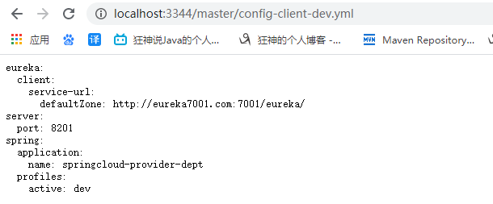

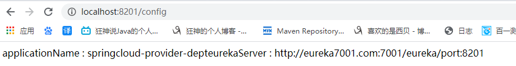

### 10.5、远程配置实战测试

以eureka为例创建配置

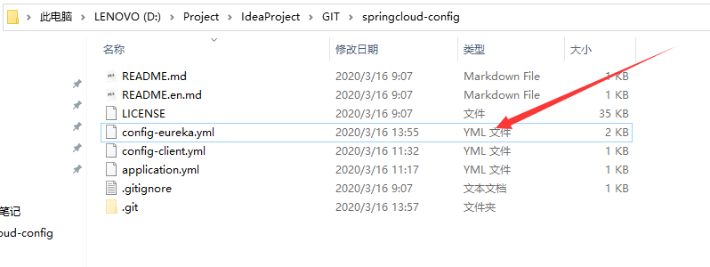

```yml
spring:
  profiles:
    active: dev
  
---  
server:
  port: 7001
  
#spring配置
spring:
  profiles: dev
  application:
    name: springcloud-config-eureka
  
#Eureka配置
eureka:
  instance:
    hostname: eureka7001.com 
  client:
    register-with-eureka: false
    fetch-registry: false 
    service-url: # 监控页面~
      #单机 http://${eureka.instance.hostname}:${server.port}/eureka/
      #(集群)关联 http://eureka7002.com:7002,http://eureka7003.com:7003
      defaultZone: http://eureka7002.com:7002/eureka/,http://eureka7003.com:7003/eureka/
      
---  
server:
  port: 7001
  
#spring配置
spring:
  profiles: test
  application:
    name: springcloud-config-eureka
  
#Eureka配置
eureka:
  instance:
    hostname: eureka7001.com 
  client:
    register-with-eureka: false
    fetch-registry: false 
    service-url: # 监控页面~
      #单机 http://${eureka.instance.hostname}:${server.port}/eureka/
      #(集群)关联 http://eureka7002.com:7002,http://eureka7003.com:7003
      defaultZone: http://eureka7002.com:7002/eureka/,http://eureka7003.com:7003/eureka/
    
```

编写项目springcloud-config-eureka-7001

1、导入pom

```xml
 <dependencies>
        <dependency>
            <groupId>org.springframework.cloud</groupId>
            <artifactId>spring-cloud-starter-config</artifactId>
            <version>2.1.1.RELEASE</version>
        </dependency>
        <!-- https://mvnrepository.com/artifact/org.springframework.cloud/spring-cloud-starter-eureka-server -->
        <dependency>
            <groupId>org.springframework.cloud</groupId>
            <artifactId>spring-cloud-starter-eureka-server</artifactId>
            <version>1.4.6.RELEASE</version>
        </dependency>
        <dependency>
            <groupId>org.springframework.boot</groupId>
            <artifactId>spring-boot-devtools</artifactId>
        </dependency>
    </dependencies>
```

2、编写配置文件

bootstrap.yml（**连接远程**）

```yml
#系统级别的配置
spring:
  cloud:
    config:
      name: config-eureka #需要从git上读取的资源名称，不要后缀
      profile: dev
      label: master
      uri: http://localhost:3344
```

application.yml

```yml
#用户级别的配置
spring:
  application:
    name: springcloud-config-eureka-7001
```

3、启动类

```java
@SpringBootApplication
@EnableEurekaServer //EnableEurekaServer服务端的启动类，可以接受别人注册进*
public class EurekaServer_7001 {
    public static void main(String[] args) {
        SpringApplication.run(EurekaServer_7001.class, args);
    }
}
```

4、先启动3344

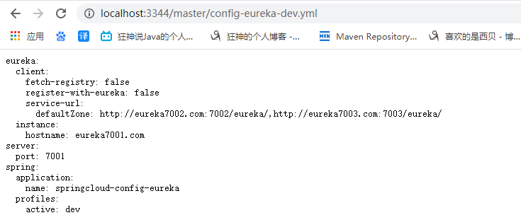

再启动7001

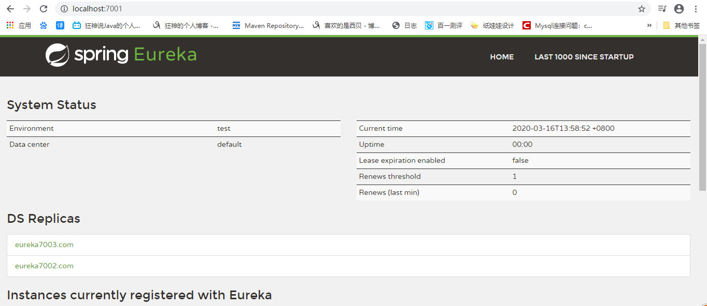

远程配置成功

## 小结

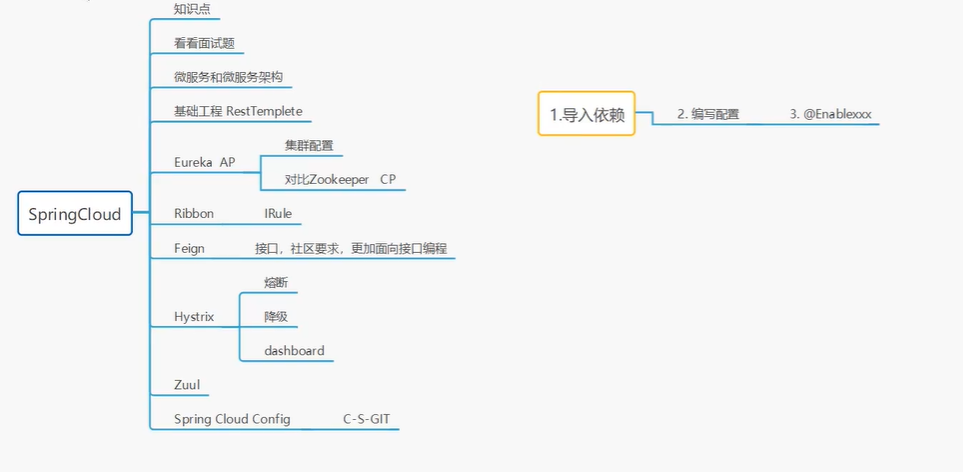

以后

