### 1. 基本概念

#### 1.1 前言

 Java Web，是用Java技术来解决相关web互联网领域的技术栈。web包括：web服务端和web客户端两部分。Java在客户端的应用有java applet，不过使用得很少，Java在服务器端的应用非常的丰富，比如Servlet，JSP和第三方框架等等。Java技术对Web领域的发展注入了强大的动力。

#### 1.2 web应用程序：

可以提供浏览器访问的程序；

1. a.html、b.html.….多个web资源，这些web资源可以被外界访问，对外界提供服务；
2. 你们能访问到的任何一个页面或者资源，都存在于这个世界的某一个角落的计算机上。
3. URL
4. 这个统一的web资源会被放在同一个文件夹下，web应用程序>Tomcat：服务器、
5. 一个web应用由多部分组成（静态web，动态web)
   - html,css
   - jsp,servlet
   - Java程序
   - jar包
   - 配置文件（Properties)

Web应用程序编写完毕后，若想提供给外界访问；需费一个服务器来统一管理。

#### 1.3 静态web

静态网站特点：

　 1. 静态网站是最初的建站方式，浏览者所看到的每个页面是建站者上传到服务器上的一个 html （ htm ）文件**，这种网站每增加、删除、修改一个页面，都必须重新对服务器的文件进行一次下载上传**。网页内容一经发布到网站服务器上，无论是否有用户访问，每个静态网页的内容都是保存在网站服务器上的，也就是说，静态网页是实实在在保存在服务器上的文件，每个网页都是一个独立的文件；
　 2. 静态网页的内容相对稳定，因此容易被搜索引擎检索；
　 3. **静态网页没有数据库的支持**，在网站制作和维护方面工作量较大，因此当网站信息量很大时完全依靠静态网页制作方式比较困难；
　 4. 静态网页的交互性较差，在功能方面有较大的限制。如：不能实现用户注册和用户登录的功能

静态web原理图如下图所示:


#### 1.4 动态web

所谓 “ 动态 ” ，并不是指网页上简单的 GIF 动态图片或是 Flash 动画，动态网站的概念现在还没有统一标准，但都具备以下几个基本特征：

　 1. 交互性：网页会根据用户的要求和选择而动态地改变和响应，浏览器作为客户端，成为一个动态交流的桥梁，动态网页的交互性也是今后 Web 发展的潮流。
　 2. 自动更新：即无须手动更新 HTML 文档，便会自动生成新页面，可以大大节省工作量。
　 3. 因时因人而变：即当不同时间、不同用户访问同一网址时会出现不同页面。

动态web原理图如下图所示：


**NOTE:**

 动态网站在页面里嵌套了程序，这种网站对一些框架相同，更新较快的信息页面进行内容与形式的分离，将信息内容以记录的形式存入了网站的数据库中，以便于网 站各处的调用。这样，我们看到的一个页面，可能在服务器上不一一对应某个 html 的文件了，网页框架里套了很多数据库里的记录中的内容。此外动态网页是与静态网页相对应的，也就是说，网页 URL 的后缀不是 .htm 、 .html 、 .shtml 、 .xml 等静态网页的常见形式，而是以 .asp 、 .jsp 、 .php 、 .perl 、 .cgi 等形式为后缀。

 从网站浏览者的角度来看，无论是动态网页还是静态网页，都可以展示基本的文字和图片信息，但从网站开发、管理、维护的角度来看就有很大的差别。网络营销教学网站将动态网页的一般特点简要归纳如下 :
　　 (1) 动态网页以数据库技术为基础，可以大大降低网站维护的工作量 ;
　　 (2) 采用动态网页技术的网站可以实现更多的功能，如用户注册、用户登录、在线调查、用户管理、订单管理等等 ;
　　 (3) 动态网页实际上并不是独立存在于服务器上的网页文件，只有当用户请求时服务器才返回一个完整的网页 ;

### 2、web服务器

#### 2.1 技术讲解

**ASP：**

**动态服务器网页**（英文：**A**ctive **S**erver **P**ages，简称**ASP**），由微软公司开发的服务器端运行的脚本平台，它被Windows下[Internet Information Services (IIS)](https://zh.wikipedia.org/wiki/IIS)的程序所管理。**特点：**

- 微软：国内最早流行的就是ASP；
- 在HTML中嵌入了VB的脚本， ASP + COM；
- 在ASP开发中，基本一个页面都有几千行的业务代码，页面极其换乱
- 维护成本高！
- C#

**php：**

- PHP开发速度很快，功能很强大，跨平台，代码很简单 （70% , WP）
- 无法承载大访问量的情况（局限性）

**JSP/Servlet : **

- sun公司主推的B/S架构
- 基于Java语言的 (所有的大公司，或者一些开源的组件，都是用Java写的)
- 可以承载三高问题带来的影响；
- 语法像ASP ， ASP–>JSP , 加强市场强度；

**1、不同之处在哪？**

- Servlet在Java代码中通过HttpServletResponse对象动态输出HTML内容
- JSP在静态HTML内容中嵌入Java代码，Java代码被动态执行后生成HTML内容

**2、各自的特点**

- Servlet能够很好地组织业务逻辑代码，但是在Java源文件中通过字符串拼接的方式生成动态HTML内容会导致代码维护困难、可读性差
- JSP虽然规避了Servlet在生成HTML内容方面的劣势，但是在HTML中混入大量、复杂的业务逻辑同样也是不可取的

可以通过mvc模式使两者结合起来：

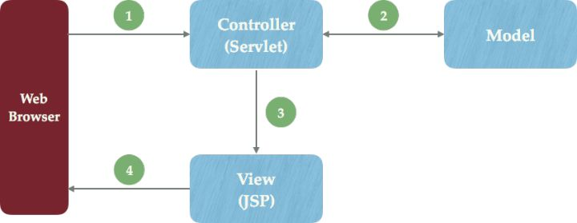

#### 2.2 web服务器

服务器是一种被动的操作，用来处理用户的一些请求和给用户一些响应信息；

**IIS**

微软的； ASP…,Windows中自带的

**Tomcat**

Tomcat是Apache 软件基金会（Apache Software Foundation）的Jakarta 项目中的一个核心项目，最新的Servlet 和JSP 规范总是能在Tomcat 中得到体现，因为Tomcat 技术先进、性能稳定，而且免费，因而深受Java 爱好者的喜爱并得到了部分软件开发商的认可，成为目前比较流行的Web 应用服务器。

Tomcat 服务器是一个免费的开放源代码的Web 应用服务器，属于轻量级应用服务器，在中小型系统和并发访问用户不是很多的场合下被普遍使用，是开发和调试JSP 程序的首选。对于一个Java初学web的人来说，它是最佳的选择

Tomcat 实际上运行JSP 页面和Servlet。Tomcat最新版本为9.0。

### 3. Tomcat

#### 3.1 tomcat文件夹信息

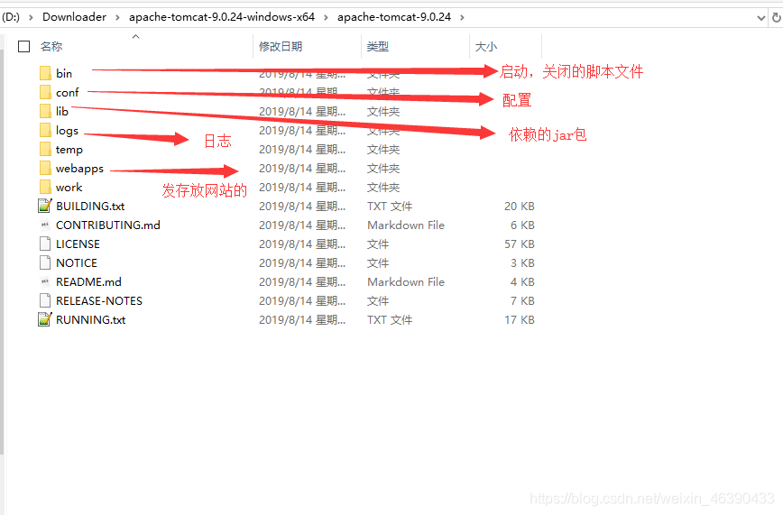

#### 3.2 核心配置文件

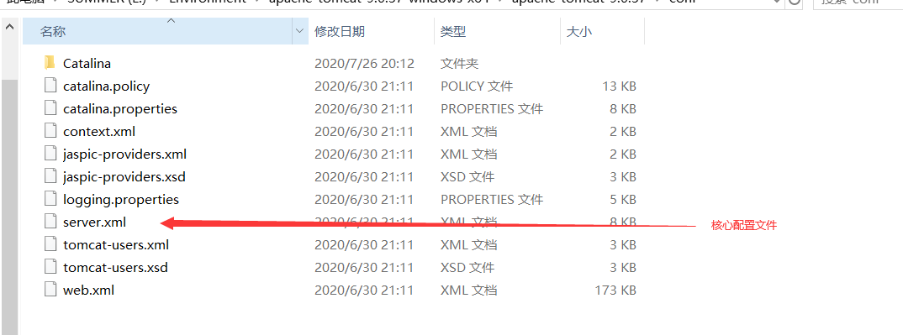

**默认端口号：8080**

```xml
<Connector port="8080" protocol="HTTP/1.1"
           connectionTimeout="20000"
           redirectPort="8443"/>
```

**默认主机名和默认存放网站应用的文件夹**

```xml
<Host name="localhost"  appBase="webapps"
      unpackWARs="true" autoDeploy="true">
```

#### 3.3 发布一个网站

将自己写的网站，放到服务器(Tomcat)中指定的web应用的文件夹（webapps）下，就可以访问了

网站应有的结构：

```java
--webapps ：Tomcat服务器的web目录
	-ROOT
	-kuangstudy ：网站的目录名
		- WEB-INF
			-classes : java程序
			-lib：web应用所依赖的jar包
			-web.xml ：网站配置文件
		- index.html 默认的首页
		- static 
            -css
            	-style.css
            -js
            -img
         -.....
```

### 4. Http协议

#### 4.1 HTTP简介

HTTP协议是Hyper Text Transfer Protocol（超文本传输协议）的缩写,是用于从万维网（WWW:World Wide Web ）服务器传输超文本到本地浏览器的传送协议。

HTTP协议工作于客户端-服务端架构为上。浏览器作为HTTP客户端通过URL向HTTP服务端即WEB服务器发送所有请求。Web服务器根据接收到的请求后，向客户端发送响应信息。

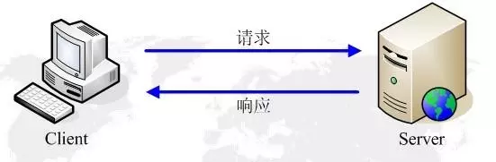

#### 4.2 主要特点

1、简单快速：客户向服务器请求服务时，只需传送请求方法和路径。请求方法常用的有GET、HEAD、POST。每种方法规定了客户与服务器联系的类型不同。由于HTTP协议简单，使得HTTP服务器的程序规模小，因而通信速度很快。

2、灵活：HTTP允许传输任意类型的数据对象。正在传输的类型由Content-Type加以标记。

3.无连接：无连接的含义是限制每次连接只处理一个请求。服务器处理完客户的请求，并收到客户的应答后，即断开连接。采用这种方式可以节省传输时间。

4.无状态：所谓http是无状态协议，言外之意是说http协议没法保存客户机信息，也就没法区分每次请求的不同之处。关于http无状态阻碍了交互式应用程序的实现。比如记录用户浏览哪些网页、判断用户是否拥有权限访问等。于是，两种用于保持HTTP状态的技术就应运而生了，一个是Cookie，而另一个则是Session。
5、支持B/S及C/S模式。

#### 4.3 HTTP之URL

HTTP使用统一资源标识符（Uniform Resource Identifiers, URI）来传输数据和建立连接。**URL是一种特殊类型的URI**（URL则通过描述是哪个主机上哪个路径上的文件来唯一确定一个资源，也就是定位的方式来实现的URI），**URL,全称是UniformResourceLocator, 中文叫统一资源定位符**,是互联网上用来标识某一处资源的地址。以下面这个URL为例，介绍下普通URL的各部分组成：

**http://www.aspxfans.com:8080/news/index.asp?boardID=5&ID=24618&page=1#name**

从上面的URL可以看出，一个完整的URL包括以下几部分：
1.协议部分：该URL的协议部分为“http：”，这代表网页使用的是HTTP协议。在Internet中可以使用多种协议，如HTTP，FTP等等本例中使用的是HTTP协议。在"HTTP"后面的“//”为分隔符

2.域名部分：该URL的域名部分为“[www.aspxfans.com](https://link.jianshu.com/?t=http://www.aspxfans.com)”。一个URL中，也可以使用IP地址作为域名使用

3.端口部分：跟在域名后面的是端口，域名和端口之间使用“:”作为分隔符。端口不是一个URL必须的部分，如果省略端口部分，将采用默认端口

4.虚拟目录部分：从域名后的第一个“/”开始到最后一个“/”为止，是虚拟目录部分。虚拟目录也不是一个URL必须的部分。本例中的虚拟目录是“/news/”

5.文件名部分：从域名后的最后一个“/”开始到“？”为止，是文件名部分，如果没有“?”,则是从域名后的最后一个“/”开始到“#”为止，是文件部分，如果没有“？”和“#”，那么从域名后的最后一个“/”开始到结束，都是文件名部分。本例中的文件名是“index.asp”。文件名部分也不是一个URL必须的部分，如果省略该部分，则使用默认的文件名

6.锚部分：从“#”开始到最后，都是锚部分。本例中的锚部分是“name”。锚部分也不是一个URL必须的部分

7.参数部分：从“？”开始到“#”为止之间的部分为参数部分，又称搜索部分、查询部分。本例中的参数部分为“boardID=5&ID=24618&page=1”。参数可以允许有多个参数，参数与参数之间用“&”作为分隔符。

#### 4.4 Http请求

客户端发送请求（Request）给服务器

> 百度

```java
Request URL:https://www.baidu.com/   请求地址
Request Method:GET    get方法/post方法
Status Code:200 OK    状态码：200
Remote（远程） Address:14.215.177.39:443
Accept:text/html  
Accept-Encoding:gzip, deflate, br
Accept-Language:zh-CN,zh;q=0.9    语言
Cache-Control:max-age=0
Connection:keep-alive
```

##### 1、请求行

- 请求行中的请求方式：GET
- 请求方式：Get，Post，HEAD,DELETE,PUT,TRACT…
  - get：请求能够携带的参数比较少，大小有限制，会在浏览器的URL地址栏显示数据内容，不安全，但高效
  - post：请求能够携带的参数没有限制，大小没有限制，不会在浏览器的URL地址栏显示数据内容，安全，但不高效。

##### 2、消息头

```java
Accept：告诉浏览器，它所支持的数据类型
Accept-Encoding：支持哪种编码格式  GBK   UTF-8   GB2312  ISO8859-1
Accept-Language：告诉浏览器，它的语言环境
Cache-Control：缓存控制
Connection：告诉浏览器，请求完成是断开还是保持连接
HOST：主机..../.
```

#### 4.4、Http响应

- 服务器发出响应给客户端

> 百度

```java
Cache-Control:private    缓存控制
Connection:Keep-Alive    连接
Content-Encoding:gzip    编码
Content-Type:text/html   类型
```

##### 1.响应体

```
Accept：告诉浏览器，它所支持的数据类型
Accept-Encoding：支持哪种编码格式  GBK   UTF-8   GB2312  ISO8859-1
Accept-Language：告诉浏览器，它的语言环境
Cache-Control：缓存控制
Connection：告诉浏览器，请求完成是断开还是保持连接
HOST：主机..../.
Refresh：告诉客户端，多久刷新一次；
Location：让网页重新定位；
```

##### 2、响应状态码

200：请求响应成功 200

3xx：请求重定向

- 重定向：你重新到我给你新位置去；

4xx：找不到资源 404

- 资源不存在；

5xx：服务器代码错误 500 502:网关错误

##### **其他部分请参考链接: [http协议一篇就够了](https://www.jianshu.com/p/80e25cb1d81a)**

### 5. Maven

#### 5.1 简介

Maven是一个采用纯Java编写的开源项目管理工具。Maven采用了一种被称之为**project object model (POM)**概念来管理项目，所有的项目配置信息都被定义在一个叫做POM.xml的文件中，通过该文件，Maven可以管理项目的整个声明周期，包括编译，构建，测试，发布，报告等等。目前Apache下绝大多数项目都已经采用Maven进行管理。而Maven本身还支持多种插件，可以方便更灵活的控制项目。一句话：Maven是一个项目管理和构建工具，主要做编译、测试、报告、打包、部署等操作完成项目的构建。**Maven不仅是构建工具，还是一个依赖管理工具和项目管理工具，它提供了中央仓库，能帮我自动下载构件。**

#### 5.2 配置

配置镜像(镜像（Mirroring）是一种文件存储形式，是冗余的一种类型，一个磁盘上的数据在另一个磁盘上存在一个完全相同的副本即为镜像。)，使用默认仓库下载jar包会比较慢，所以配置一个阿里云镜像

打开maven安装目录下的conf\settings.xml 添加如下信息

```xml
	<mirror>
      <id>nexus-aliyun</id>
	  <mirrorOf>central</mirrorOf>
	  <name>Nexus aliyun</name>
	  <url>http://maven.aliyun.com/nexus/content/repositories/central/</url>
	</mirror>
```

添加本地仓库路径：

```xml
<localRepository>E:\Environment\apache-maven-3.6.3\maven-repo</localRepository>
```

#### 5.3 pom.xml的结构

```xml
<?xml version="1.0" encoding="UTF-8"?>
<!--头文件和maven版本 xmlns:xml name space-->
<project xmlns="http://maven.apache.org/POM/4.0.0" xmlns:xsi="http://www.w3.org/2001/XMLSchema-instance"
  xsi:schemaLocation="http://maven.apache.org/POM/4.0.0 http://maven.apache.org/xsd/maven-4.0.0.xsd">
  <modelVersion>4.0.0</modelVersion>

  <!--刚刚配置的GAV-->
  <groupId>com.iandf</groupId>
  <artifactId>javaweb-01-maven</artifactId>
  <version>1.0-SNAPSHOT</version>
  <packaging>war</packaging>

  <name>javaweb-01-maven Maven Webapp</name>
  <!-- FIXME change it to the project's website -->
  <url>http://www.example.com</url>

  <properties>
    <!--项目默认的构建编码-->
    <project.build.sourceEncoding>UTF-8</project.build.sourceEncoding>
    <!--编码版本-->
    <maven.compiler.source>1.7</maven.compiler.source>
    <maven.compiler.target>1.7</maven.compiler.target>
  </properties>
  <!--项目依赖-->
  <dependencies>
    <!--具体的jar包配置文件-->
    <dependency>
      <groupId>junit</groupId>
      <artifactId>junit</artifactId>
      <version>4.11</version>
      <scope>test</scope>
    </dependency>
  </dependencies>
  <!--项目构建需要用到的东西-->
  <build>
    <finalName>javaweb-01-maven</finalName>
    <pluginManagement><!-- lock down plugins versions to avoid using Maven defaults (may be moved to parent pom) -->
      <plugins>
        <plugin>
          <artifactId>maven-clean-plugin</artifactId>
          <version>3.1.0</version>
        </plugin>
 		。。。。
      </plugins>
    </pluginManagement>
  </build>
</project>
```

#### 5.5 web.xml中webapp版本问题

自动生成的webapp是2.6版本的，最新版的版本在tomcat中可以找到

```xml
<?xml version="1.0" encoding="UTF-8"?>
<web-app xmlns="http://xmlns.jcp.org/xml/ns/javaee"
         xmlns:xsi="http://www.w3.org/2001/XMLSchema-instance"
         xsi:schemaLocation="http://xmlns.jcp.org/xml/ns/javaee
                      http://xmlns.jcp.org/xml/ns/javaee/web-app_4_0.xsd"
         version="4.0"
         metadata-complete="true">
</web-app>
```

#### 5.5 maven其他

[跟我1小时搞定Maven是什么？怎么用？](https://my.oschina.net/u/3375733/blog/1546559)

### 6 servlet

#### 6.1 简介

1. servlet是sun公司用来开发动态web的工具
2. sun在API中提供了一个接口叫做 servlet，开发一个servlet程序需要两个步骤
   - 编写一个java类实现servlet接口
   - 把编写好的java类部署到web服务器上

#### 6.2 编写helloServlet程序

servlet接口sun公司提供了两个默认的实现类: httpServlet,genericServlet

- 构建一个普通的Maven项目，删掉里面的src目录,在这个项目里面建立Moudel(模块)，这个空的工程就是Maven主工程；
- 在Maven父子工程中
- 父项目的pom.xml中自动生成

```xml
<!--读pom文件时，要去读modules下的子pom文件-->
<modules>
    <module>HelloServlet</module>
</modules>
```

- 子类项目的pom.xml自动生成

  ```xml
  <!--使子项目继承父项目的设置，避免导入重复依赖 eg:son extends parent-->
  <parent>
      <artifactId>javaweb-02-servlet</artifactId>
      <groupId>com.iandf</groupId>
      <version>1.0-SNAPSHOT</version>
  </parent>
  ```

- 编写一个Servlet程序

  

- 编写一个普通类,实现Servlet接口，这里我们直接继承HttpServlet（`HttpServlet实现了Servlet接口`）

  ```java
  public class HelloServlet extends HttpServlet {
      @Override
      protected void doGet(HttpServletRequest req, HttpServletResponse resp) throws ServletException, IOException {
          PrintWriter writer = resp.getWriter();//获取响应流
          //响应流输出信息
          writer.print("hello servlet");
      }
  
      @Override
      protected void doPost(HttpServletRequest req, HttpServletResponse resp) throws ServletException, IOException {
          doGet(req, resp);
      }
  }
  ```

- 编写servlet映射

  我们编写的java程序需要被浏览器访问，而浏览器需要访问web服务器，所以我们需要在web服务器中部署servlet，给他一个访问的具体路径。所以我们在web.xml中注册servlet和servlet-mapping

  ```xml
    <!--注册servlet-->
    <servlet>
      <servlet-name>helloServlet</servlet-name>
      <servlet-class>com.iandf.HelloServlet</servlet-class>
    </servlet>
    <!--每一个servlet对应一个映射-->
    <servlet-mapping>
      <servlet-name>helloServlet</servlet-name>
      <url-pattern>/hello</url-pattern>
    </servlet-mapping>
  ```

- 配置tomcat

- 启动项目

  启动后通过请求路径访问程序 --- 域名/发布路径/请求路径 如： http://localhost:8080/HelloServlet_war/hello

#### 6.3 servlet原理

**tomcat 与 servlet配合工作 步骤：**

1. web client 向servlet容器（tomcat）发出请求
2. tomcat接收web client的请求
3. servlet容器创建一个httpResquest对象，将请求的信息封装到对象中
4. servlet容器创建一个httpResponse对象，
5. servlet容器调用HttpServlet对象的service()，把httpResquest和httpResponse传给HttpServlet对象
6. httpServlet调用httpRequest对象的有关方法，获取http请求的信息，如 RequestURL:[https://www.baidu.com](https://www.baidu.com/) Request Method: GET
7. HttpServlet调用HttpResponse对象的有关方法，生成响应数据。
8. Servlet容器把HttpServlet的响应结果传给Web Client。

如下图所示：

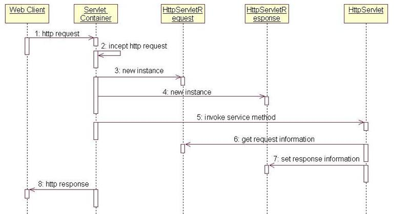

参考博客：

https://www.cnblogs.com/java-chen-hao/p/10688617.html#_label2_0

https://segmentfault.com/a/1190000013101861

#### 6.4 ServletContext

当web容器启动时，会创建一个servletContext对象，可以通过这个对象让servlet之间进行通信，代表当前的web应用

##### 1. 共享数据

我们在一个Servlet中通过servlerContext对象保存（set）的数据，可以在另一个servlet通过servlerContext对象get到

```java
public class SetServletContext extends HttpServlet {
    @Override
    protected void doGet(HttpServletRequest req, HttpServletResponse resp) throws ServletException, IOException {
        ServletContext servletContext = this.getServletContext();
        String name =  "黄鹤";

        resp.setContentType("text/html");
        resp.setCharacterEncoding("utf-8");
        servletContext.setAttribute("username",name);

    }
}
public class GetServletContext extends HttpServlet {
    @Override
    protected void doGet(HttpServletRequest req, HttpServletResponse resp) throws ServletException, IOException {
        ServletContext servletContext = this.getServletContext();
        String username = (String) servletContext.getAttribute("username");

        resp.setContentType("text/html");
        resp.setCharacterEncoding("utf-8");
        resp.getWriter().print("username : " + username);
    }
}
```

先访问SetServletContext设置数据，再访问GetServletContext就可以拿到数据了。

##### 2. 获取配置参数

```java
String db_url = this.getServletContext().getInitParameter("db_url");

resp.getWriter().print(db_url);
```

##### 3. 请求转发

**note: 请求转发和重定向的区别**

**forward（转发）**：

是服务器请求资源,服务器直接访问目标地址的URL,把那个URL的响应内容读取过来,然后把这些内容再发给浏览器.浏览器根本不知道服务器发送的内容从哪里来的,因为这个跳转过程实在服务器实现的，并不是在客户端实现的所以客户端并不知道这个跳转动作，所以它的地址栏还是原来的地址.

**redirect（重定向）**：

是服务端根据逻辑,发送一个状态码,告诉浏览器重新去请求那个地址.所以地址栏显示的是新的URL.

**转发是服务器行为，重定向是客户端行为。**

```java
RequestDispatcher requestDispatcher = this.getServletContext().getRequestDispatcher("/getParams");//获取请求转发的路径
requestDispatcher.forward(req,resp);//使用forward方法将参数传给请求转发的路径，实现请求转发
```

##### 4. 读取配置文件

```java
//文件路径为tomcat生成的webapp文件夹下的资源路径/WEB-INF/classes/db.properties，第一个/代表当前项目
InputStream resourceAsStream = this.getServletContext().getResourceAsStream("/WEB-INF/classes/db.properties");
Properties properties = new Properties();
properties.load(resourceAsStream);

String username = properties.getProperty("username");
String password = properties.getProperty("password");

resp.getWriter().print(username+"  :"+password);
```

#### 6.5 HttpServletResponse

web服务器接收了web client的请求，生成两个对象：HttpServletResponse和HttpServletRequest

1. response负责把数据传给浏览器
2. request负责读取client请求的信息

> 使用HttpServletResponse让浏览器下载文件

```java
protected void doGet(HttpServletRequest req, HttpServletResponse resp) throws ServletException, IOException {
    //获取文件路径
    String filePath = "D:\\ForStrong_java\\javaweb\\javaweb-02-servlet\\ServletHttpResponse\\target\\classes\\1.jpg";
    //获取文件名
    String fileName = filePath.substring(filePath.lastIndexOf("\\") + 1);
    //获取文件输入流
    BufferedInputStream bufferedInputStream = new BufferedInputStream(new FileInputStream(filePath));
    //获取向浏览器的输出流
    BufferedOutputStream bufferedOutputStream = new BufferedOutputStream(resp.getOutputStream());
    //让浏览器知道我们要下载文件，需要设置头，让浏览器支持。中文文件名URLEncoder.encode编码，否则有可能乱码
    resp.addHeader("Content-Disposition", "attachment;filename=" + URLEncoder.encode(fileName,"utf-8"));
    //向浏览器输出数据
    byte[] buffer = new byte[1024];
    int len = 0;
    while ((len = bufferedInputStream.read(buffer))>0){
        bufferedOutputStream.write(buffer,0,len);
    }
    //关闭流
    bufferedInputStream.close();
    bufferedOutputStream.close();
}
```

> response实现验证码，三秒刷新一次

```java
 protected void doGet(HttpServletRequest req, HttpServletResponse resp) throws ServletException, IOException {
        //写一张图片
        BufferedImage bufferedImage = new BufferedImage(80,20,BufferedImage.TYPE_INT_RGB);//需要一张画板
        Graphics graphics = bufferedImage.getGraphics();//需要一只画笔
        //设置背景
        graphics.setColor(Color.white);//设置颜色
        graphics.fillRect(0,0,80,20);
        //设置内容
        graphics.setColor(Color.blue);
        graphics.setFont(new Font(null,Font.ITALIC,20));
        graphics.drawString(Objects.requireNonNull(makeNum()),0,20);

        //告诉浏览器，这个请求用图片的方式打开
        resp.setContentType("image/jpeg");
        //网站存在缓存，不让浏览器缓存
        resp.setDateHeader("expires",-1);
        resp.setHeader("Cache-Control","no-cache");
        resp.setHeader("Pragma","no-cache");
        //给这个响应设置三秒刷新一次，且把缓存机制关掉
        resp.setHeader("refresh","3");
        //将这张图片写入浏览器
        ImageIO.write(bufferedImage,"jpg",resp.getOutputStream());
}
```

> response实现重定向，eg：应用在用户登录页面

```java
 //参数为:项目名/地址名
resp.sendRedirect("/ServletHttpResponse/getImage");
<%--action:这里提交的路径，需要寻找到项目的路径--%>
<%--${pageContext.request.contextPath}代表当前的项目--%>
<form action="${pageContext.request.contextPath}/redirect" method="get">
    username <input name="username" type="text"> <br>
    password: <input name="password" type="password"> <br>
    <input type="submit">
</form>
    protected void doGet(HttpServletRequest req, HttpServletResponse resp) throws ServletException, IOException {
        String username = req.getParameter("username");
        String password = req.getParameter("password");
        System.out.println(username +":  "+password);
        //参数为:项目名/地址名
        resp.sendRedirect("/ServletHttpResponse/success.jsp");
    }
```

#### 6.6 HttpServletRequest

> request获取请求的数据，并请求转发

```java
    protected void doGet(HttpServletRequest req, HttpServletResponse resp) throws ServletException, IOException {
        req.setCharacterEncoding("utf-8");
        resp.setCharacterEncoding("utf-8");

        //获取表单数据
        String username = req.getParameter("username");
        String password = req.getParameter("password");
        String[] hobbies = req.getParameterValues("hobbies");
        System.out.println(username);
        System.out.println(password);
        System.out.println(Arrays.toString(hobbies));

        //请求转发
        req.getRequestDispatcher("/success.jsp").forward(req,resp);
    }
<form action="${pageContext.request.contextPath}/login" method="post">
    username <input name="username" type="text"> <br>
    password: <input name="password" type="password"> <br>
    hobbies:
    <input name="hobbies" type="checkbox" value="女孩">女孩
    <input name="hobbies" type="checkbox" value="代码">代码
    <input name="hobbies" type="checkbox" value="电影">电影
    <input name="hobbies" type="checkbox" value="爬山">爬山
    <input type="submit">
</form>
```

### 7 Cookie、Session

#### 7.1、会话

**会话**：用户打开一个浏览器，点击了很多超链接，访问多个web资源，关闭浏览器，这个过程可以称之为会话；

**有状态会话**：一个同学来过教室，下次再来教室，我们会知道这个同学，曾经来过，称之为有状态会话；

**一个网站，怎么证明你来过？**

客户端 服务端

1. 服务端给客户端一个 信件，客户端下次访问服务端带上信件就可以了； cookie
2. 服务器登记你来过了，下次你来的时候我来匹配你； seesion

#### 7.2、保存会话的两种技术

**cookie**

- 客户端技术 （响应，请求）

**session**

- 服务器技术，利用这个技术，可以保存用户的会话信息？ 我们可以把信息或者数据放在Session中！

常见常见：网站登录之后，你下次不用再登录了，第二次访问直接就上去了！

#### 7.3 cookie

1. 由服务器创建一个cookie,并设置数据和属性，再由服务器发送给客户端，客户端在本地保存该cookie

   ```java
   //服务器给客户端设置cookie
   Cookie time_cookie = new Cookie("lastTime",System.currentTimeMillis()+"");
   time_cookie.setMaxAge(24*60*60);//设置cookie的存活时间，0代表删除cookie，负数代表不会保存该cookie,正数以秒为单位
   resp.addCookie(time_cookie);
   ```

2. 下次访问时带上该cookie，服务器就能知道你先前来过，并可以通过cookie获取数据

   ```java
   //服务器获取客户端的cookie
   Cookie[] cookies = req.getCookies();
   PrintWriter writer = resp.getWriter();
   for (Cookie cookie : cookies) {
   if (cookie.getName().equals("lastTime")) {
   writer.print("上次登陆时间为:  ");
   writer.print(new SimpleDateFormat().format(new Date(Long.valueOf(cookie.getValue()))));
   ```

#### 7.4 seesion

1. 由request对象获取session,如果没有则创建session，在session中保存数据，服务器把sessionID以cookie的形式发送给客户端

   ```java
   /*     Returns the current session associated with this request,
        or if the request does not have a session, creates one.*/
   HttpSession session = req.getSession();
   String sessionId = session.getId();
   
   if (session.isNew()){
       resp.getWriter().print("session创建完成，sessionID为 :"+sessionId);
   }else {
       resp.getWriter().print("session已经在服务器中存在，sessionID为 :"+sessionId);
   }
     //给session设置数据
   session.setAttribute("person",new Person("huangaa",202160211));
   ```

2. 服务器把sessionID以cookie的形式发送给客户端，相当于这段代码

   ```java
    //每个用户对应一个session,服务器会把sessionID保存在JSESSIONID的Cookie中发送给客户端,存活时间是这次会话(expiry = -1)，浏览器退出则删除
    Cookie cookie = new Cookie("JSESSIONID",sessionId);
    cookie.setMaxAge(-1);
    resp.addCookie(cookie);
   ```

3. session的存活时间可以在web.xml中进行配置

   ```xml
     <session-config>
       <!--以分钟为单位-->
       <session-timeout>1</session-timeout>
     </session-config>
   ```

4. 下次请求时，客户端会把该cookie带上，服务器可以通过该cookie获取session，再通过session获取数据,如果将该cookie在客户端移除，服务器端将拿不到这个session。所以服务端的session的实现对客户端的cookie有依赖关系的

   ```java
   HttpSession session = req.getSession();
   Person person = (Person) session.getAttribute("person");
   resp.getWriter().print(person.toString());
   ```

5. 删除session

   ```java
   HttpSession session = req.getSession();
   session.invalidate();
   ```

#### 7.5 cookie和seesion的相同点和不同点

**相同点: **

cookie和session都是为了解决http协议无状态的特征。

**区别:**

1. cookie数据是存放在客户端本地的，session数据是存放在服务器的，但是服务端的session的实现对客户端的cookie有依赖关系的；
2. cookie不是很安全，别人可以分析存放在本地的COOKIE并进行COOKIE欺骗，考虑到安全应当使用session；
3. session会在一段时间内存放在服务器，如果session过多，会导致服务器压力过大,性能降低。如果考虑服务器性能方面应该使用cookie
4. cookie的大小是有限制的
5. 一个用户在一个站点上可以有多个cookie，但是只有一个session

### 8 JSP

**简介：**JSP（JavaServer Pages）是由[Sun Microsystems](https://zh.wikipedia.org/wiki/Sun_Microsystems)公司主导创建的一种动态网页技术标准。JSP部署于网络服务器上，可以响应客户端发送的请求，并根据请求内容动态地生成[HTML](https://zh.wikipedia.org/wiki/HTML)、[XML](https://zh.wikipedia.org/wiki/XML)或其他格式文档的[Web](https://zh.wikipedia.org/wiki/Web)网页，然后返回给请求者。JSP技术以[Java](https://zh.wikipedia.org/wiki/Java)语言作为[脚本语言](https://zh.wikipedia.org/wiki/脚本语言)，为用户的[HTTP](https://zh.wikipedia.org/wiki/HTTP)请求提供服务，并能与服务器上的其它Java程序共同处理复杂的业务需求。

#### 8.1 JSP原理探究

在C:\Users\IANDF\AppData\Local\JetBrains\IntelliJIdea2020.1\tomcat\Unnamed_javaweb-04-jsp\work\Catalina\localhost\jsp_01\org\apache\jsp有

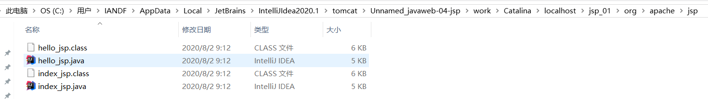

说明xxx.jsp文件最终都会被服务器转换成xxx.java,xxx.class文件。

> index_jsp类结构

```java
public final class index_jsp extends org.apache.jasper.runtime.HttpJspBase
    
public abstract class HttpJspBase extends HttpServlet
```

index_jsp继承了HttpJspBase，查看HttpJspBase源码可以得到HttpJspBase继承自HttpServlet

**这说明jsp最终会装换成servlet**

> 部分方法

```java
//初始化
public void _jspInit()
//销毁
public void _jspDestroy() 
//服务
public void _jspService(HttpServletRequest request, HttpServletResponse response)
```

和servlet一样，有以上的生命周期

> _jspService（）中的部分对象，这些对象可以在jsp文件中直接使用

```java
final javax.servlet.jsp.PageContext pageContext;//页面上下文
javax.servlet.http.HttpSession session = null;//session
final javax.servlet.ServletContext application;//ServletContext，代表整个web网站
final javax.servlet.ServletConfig config;//ServletConfig 配置对象
javax.servlet.jsp.JspWriter out = null;//out等同于resp.getWriter()
final java.lang.Object page = this;//当前页面
```

> _jspService（）中的执行语句

```java
response.setContentType("text/html");
pageContext = _jspxFactory.getPageContext(this, request, response,
null, true, 8192, true);
_jspx_page_context = pageContext;
application = pageContext.getServletContext();
config = pageContext.getServletConfig();
session = pageContext.getSession();
out = pageContext.getOut();
_jspx_out = out;

out.write("<html>\n");
out.write("<body>\n");
out.write("<h2>Hello World!</h2>\n");
out.write("</body>\n");
out.write("</html>\n");
```

**所有的html代码都以out.write(xxx)的形式输出**

**用户拿jsp页面的流程如下图所示:**

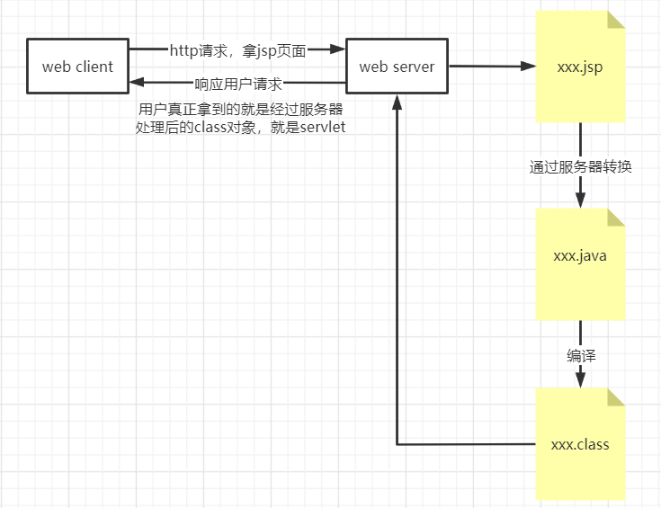

#### 8.2 JSP语法

##### 1. jsp表达式

```jsp
  <%--<%= 变量或者表达式%>--%>
  <%=new SimpleDateFormat("hh:mm:ss").format(new Date(System.currentTimeMillis())) %>
```

##### 2. jsp声明(全局变量和全局函数),默认生成在_jspService()中

```jsp
  <%!
  static {
    System.out.println("该类已被访问");
  }
  private int globalVar = 0;
  public int getGlobalVar(){
      return globalVar;
  }
  %>
```

##### 3.jsp脚本片段

```jsp
<%for (int i = 0; i < 5; i++) {
out.println(getGlobalVar());
%>
<h1>hello world <%= i%></h1>
<% } %>
```

##### 8.3 JSP指令

```jsp
<%@page args.... %>
<%@include file=""%>

<%--@include会将两个页面合二为一--%>
<%@include file="common/header.jsp"%>
<h1>网页主体</h1>

<%@include file="common/footer.jsp"%>

<hr>


<%--jSP标签
    jsp:include：拼接页面，本质还是三个java文件
    --%>
<jsp:include page="/common/header.jsp"/>
<h1>网页主体</h1>
<jsp:include page="/common/footer.jsp"/>
```

#### 8.3 9大内置对象和其作用域

```
PageContext 存东西
Request 存东西
Response
Session 存东西
Application 【SerlvetContext】 存东西
config 【SerlvetConfig】
out
page ，不用了解
exception
```

> 四大作用域

> 存数据

```java
public static final int PAGE_SCOPE = 1;
public static final int REQUEST_SCOPE = 2;
public static final int SESSION_SCOPE = 3;
public static final int APPLICATION_SCOPE = 4;
<%--存数据--%>
<%
    pageContext.setAttribute("pageContextName","pageContext");//保存的数据在当前页面有效
    request.setAttribute("requestName","request");//保存的数据在一次请求中有效,请求转发也会携带这个数据
    session.setAttribute("sessionName","session");//保存的数据在一次会话中有效,从打开浏览器到关闭浏览器
    application.setAttribute("applicationName","application");//保存的数据在服务器中有效
4
    
    \
    
    \]
    
    
    
    ，从打开服务器到关闭服务器
%>
```

源码中存数据做的事情

```java
public void setAttribute (String name,Object attribute,int scope){
    switch (scope) {
    case PAGE_SCOPE:
      mPage.put (name, attribute);
      break;
    case REQUEST_SCOPE:
      mRequest.put (name, attribute);
      break;
    case SESSION_SCOPE:
      mSession.put (name, attribute);
      break;
    case APPLICATION_SCOPE:
      mApp.put (name, attribute);
      break;
    default:
      throw new IllegalArgumentException  ("Bad scope " + scope);
    }
}
```

> 取数据，从作用域最小的开始找，如果存的时候有Key是同名的，数据将会取不出来

```java
<%
    String pageContextName = (String) pageContext.findAttribute("pageContextName");
    String requestName = (String) request.getAttribute("requestName");
    String sessionName = (String) session.getAttribute("sessionName");
    String applicationName = (String) application.getAttribute("applicationName");
%>
```

源码如下

```java
//从作用域最小的开始找
public Object findAttribute (String name){
    if (mPage.containsKey (name)) {
      return mPage.get (name);
    }
    else if (mRequest.containsKey (name)) {
      return mRequest.get (name);
    }
    else if (mSession.containsKey (name)) {
      return mSession.get (name);
    }
    else if (mApp.containsKey (name)) {
      return mApp.get (name);
    }
    else {
      return null;
    }
}
```

#### 8.4 JSTL标签、EL表达式

> 第一步就是添加依赖

```xml
<!-- https://mvnrepository.com/artifact/javax.servlet/jstl -->
<dependency>
    <groupId>javax.servlet</groupId>
    <artifactId>jstl</artifactId>
    <version>1.2</version>
</dependency>
<!-- https://mvnrepository.com/artifact/taglibs/standard -->
<dependency>
    <groupId>taglibs</groupId>
    <artifactId>standard</artifactId>
    <version>1.1.2</version>
</dependency>
```

> EL表达式：${}

- **获取数据**
- **执行运算**
- **获取web开发的常用对象**

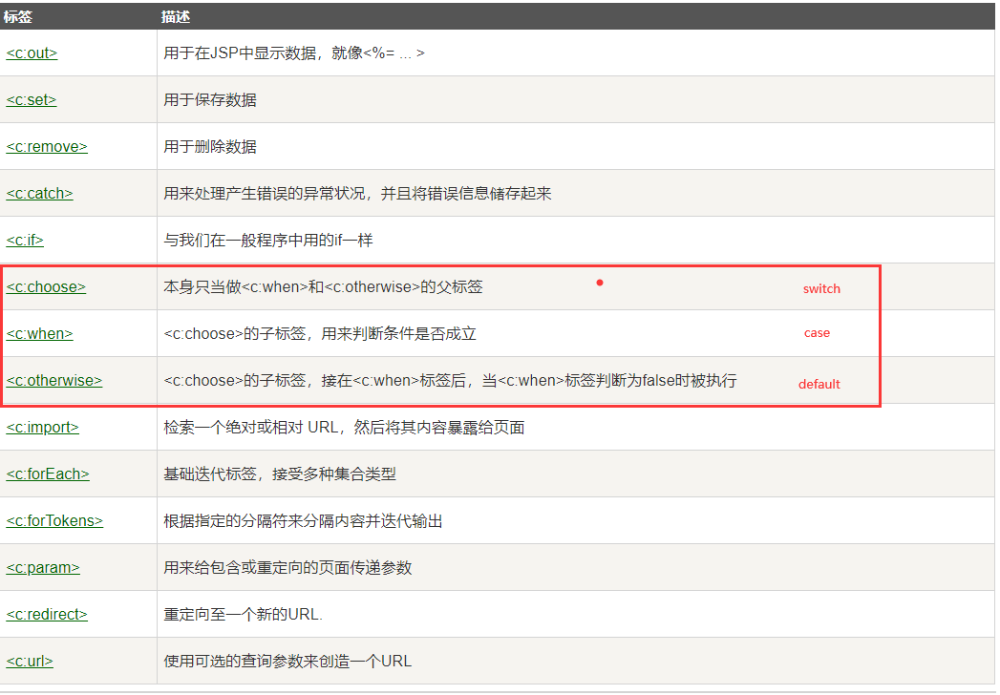

> 测试代码

```jsp
<%--
跳转到coreif.isp页面参数为：username=param.username
完整路径为http://localhost:8080/jsp/coreif.jsp?username=admin
--%>
<form action="coreif.jsp" method="get">
    <%--
    EL表达式获取表单中的数据
    ${param.参数名}
    --%>
    <input type="text" name="username" value="${param.username}">
    <input type="submit" value="登录">
</form>

<%--判断如果提交的用户名是管理员，则登录成功--%>
<c:if test="${param.username=='admin'}" var="isAdmin">
    <c:out value="管理员欢迎您！"/>
</c:if>

<%--自闭合标签--%>
<c:out value="${isAdmin}"/>
```

### 9 mvc

> mvc三层架构如下

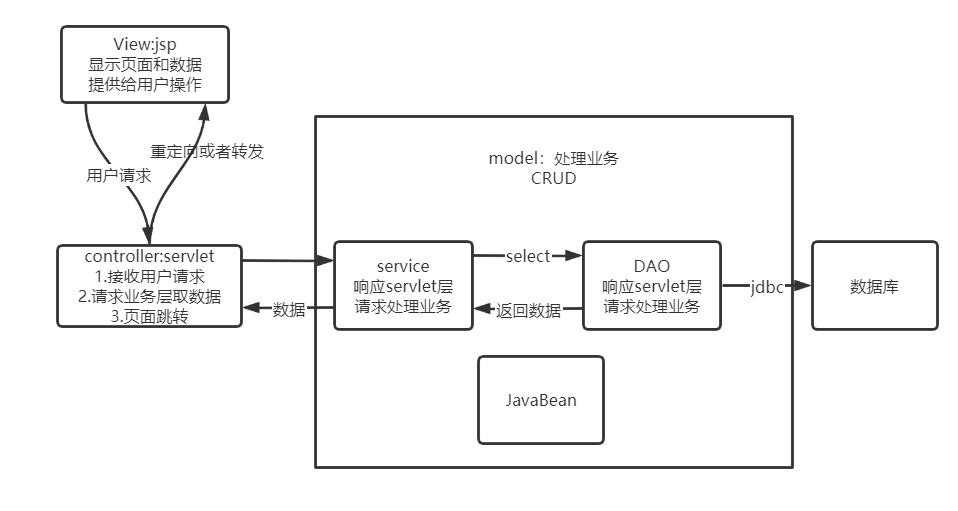

以登录页面到首页为例子，流程如下

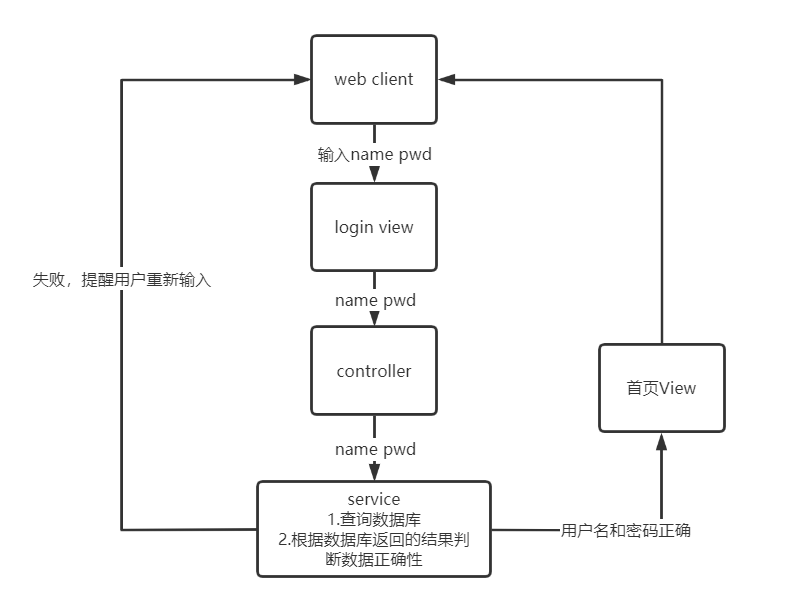

### 10 Filter

#### 10.1 filter工作原理图


#### 10.2 filter的用法

1. 让java类实现javax.servlet.Filter接口

   ```java
       //服务器启动时就执行对filter进行初始化，随时等待过滤特有的链接
       public void init(FilterConfig filterConfig) throws ServletException {
           System.out.println("CharacterEnCodingFilter已经启动");
       }
   
       public void doFilter(ServletRequest servletRequest, ServletResponse servletResponse, FilterChain filterChain) throws IOException, ServletException {
           servletRequest.setCharacterEncoding("utf-8");
           servletResponse.setCharacterEncoding("utf-8");
           servletResponse.setContentType("text/html;charset=utf-8");
           //让请求继续走下去，可能不止一个filter
           filterChain.doFilter(servletRequest,servletResponse);
       }
       //服务器关闭时执行
       public void destroy() {
           System.out.println("CharacterEnCodingFilter已经销毁");
       }
   ```

2. 在web.xml文件中配置filter

   ```xml
       <filter>
           <filter-name>charsetFilter</filter-name>
           <filter-class>com.iandf.filter.CharacterEnCodingFilter</filter-class>
       </filter>
       <filter-mapping>
           <filter-name>charsetFilter</filter-name>
           <!--只要是/servlet/....的请求就会经过这个过滤器-->
           <url-pattern>/servlet/*</url-pattern>
       </filter-mapping>
   ```

#### 监听器应用,实现登录业务

```，
用户点击登录按钮 -->判断用户名是否是admin->成功或者失败的页面
note：
判断操作在loginservlet中完成,成功就往Session中保存一条数据并跳转到success页面，失败跳转到error页面
不能直接访问success页面，使用过滤器完成
```

### 11 邮件发送和发送邮件注册

#### 1 邮件系统简介

电子邮件系统最主要的组成构建

1. 用户代理（qq邮箱等电子邮件系统程序）
2. 邮件服务器
3. 电子邮件使用的协议 ：smtp (simple mial transfer protocol) pop3 (post office protocol)邮局协议第三版

工作原理图


步骤：

①发信人调用用户代理来撰写和编辑要发送的邮件。用户代理用SMTP把邮件传送给发送方邮件服务器。
②发送方邮件服务器将邮件放入邮件缓存队列中，等待发送。
③运行在发送方邮件服务器的SMTP客户进程，发现邮件缓存中有待发送的邮件，就向运行在接收方邮件服务器的SMTP服务器进程发起建立TCP连接
④TCP连接建立后，SMTP客户进程开始向远程SMTP服务器进程发送邮件。当所有待发送邮件发完后，SMTP就关闭所建立的TCP连接。
⑤运行在接收方邮件服务器中的SMTP服务器进程收到邮件后，将邮件放入收信人的用户邮箱，等待收信人在方便时进行读取。
⑥收信人打算收信时，调用用户代理，使用POP3(或IMAP）协议将自己的邮件从接收方邮件服务器的用户邮箱中取回（如果邮箱中有来信的话）。

**smtp协议用于发送（push）邮件，pop3协议用于拉（pull）邮件**

用户读取邮件时，用户代理向邮件服务器发送请求 ，拉取用户邮箱中的邮件

#### 2 简单文本邮件代码测试

**jar包的支持：**

1. activation-1.1.1.jar
2. mail-1.4.7.jar

简易邮件的实现原理图

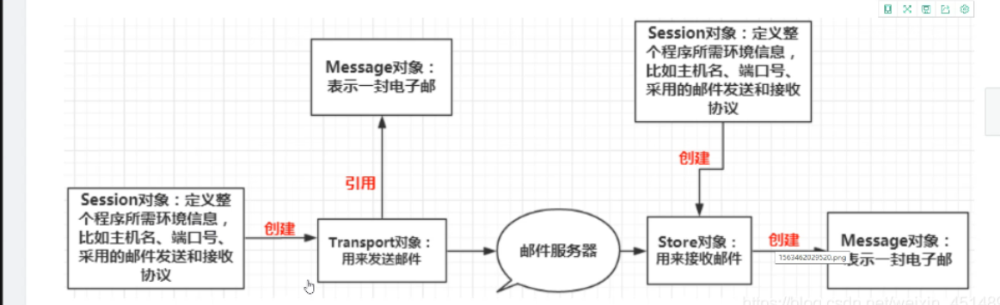

步骤如下：

1. 创建定义整个应用程序所需要的环境信息的session对象
2. 使用session对象创建transport对象
3. 使用邮件用户名和授权码连上邮件服务器
4. 创建邮件
   - 发送人，收件人，主题，要发送的文本
5. 发送邮件，关闭连接

> 代码如下

```java
	    // write your code here
        Properties prop=new Properties();
        prop.setProperty("mail.host","smtp.qq.com");///设置QQ邮件SMTP服务器
        prop.setProperty("mail.transport.protocol","smtp");//邮件发送协议
        prop.setProperty("mail.smtp.auth","true");//需要验证用户密码 authentication

        //QQ邮箱需要设置SSL加密
        MailSSLSocketFactory sf=new MailSSLSocketFactory();
        sf.setTrustAllHosts(true);
        prop.put("mail.smtp.ssl.enable","true");
        prop.put("mail.smtp.ssl.socketFactory",sf);
        //=========================================使用javaMail发送邮件的5个步骤===========================================
        //1.创建定义整个应用程序所需要的环境信息的session对象
        Session session = Session.getDefaultInstance(prop, new Authenticator() {
            @Override
            protected PasswordAuthentication getPasswordAuthentication() {
                return new PasswordAuthentication("1289557927@qq.com","wjuumtponiowfgfg");
            }
        });
        //开启session的debug模式，这样可以查看到程序发送Email的运行状态
        session.setDebug(true);
        //2.通过session得到transport对象
        Transport ts=session.getTransport();
        //3.使用邮箱的用户名和授权码连上邮件服务器 wjuumtponiowfgfg
        ts.connect("smtp.qq.com","1289557927@qq.com","wjuumtponiowfgfg");
        //4.创建邮件：写文件
        //注意需要传递session
        MimeMessage message=new MimeMessage(session);
        //指明邮件的发件人
        message.setFrom(new InternetAddress("1289557927@qq.com"));
        //指明邮件的收件人
        message.setRecipient(Message.RecipientType.TO,new InternetAddress("1289557927@qq.com"));
        //邮件标题
        message.setSubject("发送的标题");
        //邮件的文本内容
        message.setContent("内容","text/html;charset=UTF-8");
        //5.发送邮件
        ts.sendMessage(message,message.getAllRecipients());
        //6.关闭连接
        ts.close();
```

> 测试结果

```
EHLO DESKTOP-16OBIHF
MAIL FROM:<1289557927@qq.com>
250 OK.
RCPT TO:<1289557927@qq.com>
250 OK
DEBUG SMTP: Verified Addresses
DEBUG SMTP:   1289557927@qq.com
DATA
354 End data with <CR><LF>.<CR><LF>.
From: 1289557927@qq.com
To: 1289557927@qq.com
Message-ID: <1073502961.0.1597397272807.JavaMail.IANDF@smtp.qq.com>
Subject: =?UTF-8?B?5Y+R6YCB55qE5qCH6aKY?=
MIME-Version: 1.0
Content-Type: text/html;charset=UTF-8
Content-Transfer-Encoding: base64

5YaF5a65
.
250 OK: queued as.
QUIT
```

#### 3 MIME支持

**多用途互联网邮件扩展**（英语：**M**ultipurpose **I**nternet **M**ail **E**xtensions，缩写：**MIME**）是一个[互联网标准](https://zh.wikipedia.org/wiki/互联网标准)，它扩展了[电子邮件](https://zh.wikipedia.org/wiki/电子邮件)标准，使其能够支持：

- 非[ASCII](https://zh.wikipedia.org/wiki/ASCII)字符文本；
- 非文本格式附件（[二进制](https://zh.wikipedia.org/wiki/二进制)、声音、图像等）；
- 由多部分（multiple parts）组成的消息体；
- 包含非[ASCII](https://zh.wikipedia.org/wiki/ASCII)字符的头信息（Header information）。这个标准被定义在 [RFC 2045](https://tools.ietf.org/html/rfc2045)、[RFC 2046](https://tools.ietf.org/html/rfc2046)、[RFC 2047](https://tools.ietf.org/html/rfc2047)、[RFC 2048](https://tools.ietf.org/html/rfc2048)、[RFC 2049](https://tools.ietf.org/html/rfc2049) 等[RFC](https://zh.wikipedia.org/wiki/RFC)中。

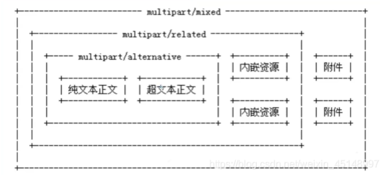

**每一个文本、图片、附件可以分为一个MimeBodyPart，由MimeMultipart完成组装**

```java
        Properties prop = new Properties();
        prop.setProperty("mail.host","smtp.qq.com");///设置QQ邮件服务器
        prop.setProperty("mail.transport.protocol","smtp");///邮件发送协议
        prop.setProperty("mail.smtp.auth","true");//需要验证用户密码
        //QQ邮箱需要设置SSL加密
        MailSSLSocketFactory sf=new MailSSLSocketFactory();
        sf.setTrustAllHosts(true);
        prop.put("mail.smtp.ssl.enable","true");
        prop.put("mail.smtp.ssl.socketFactory",sf);

        //使用javaMail发送邮件的5个步骤
        //1.创建定义整个应用程序所需要的环境信息的session对象
        Session session=Session.getDefaultInstance(prop, new Authenticator() {
            @Override
            protected PasswordAuthentication getPasswordAuthentication() {
                return new PasswordAuthentication("1289557927@qq.com","wjuumtponiowfgfg");
            }
        });
        //开启session的debug模式，这样可以查看到程序发送Email的运行状态
        session.setDebug(true);
        //2.通过session得到transport对象
        Transport ts=session.getTransport();
        //3.使用邮箱的用户名和授权码连上邮件服务器
        ts.connect("smtp.qq.com","1289557927@qq.com","wjuumtponiowfgfg");
        //4.创建邮件：写文件
        //注意需要传递session
        MimeMessage message=new MimeMessage(session);
        //指明邮件的发件人
        message.setFrom(new InternetAddress("1289557927@qq.com"));
        //指明邮件的收件人
        message.setRecipient(Message.RecipientType.TO,new InternetAddress("1289557927@qq.com"));
        //邮件标题
        message.setSubject("java发出");

        //邮件的文本内容
        //=================================准备图片数据=======================================
        MimeBodyPart image=new MimeBodyPart();
        //图片需要经过数据化的处理
        DataHandler dh=new DataHandler(new FileDataSource("D:\\ForStrong_java\\javaweb\\javaweb-08-sendMail\\src\\20200708003918960.png"));
        //在part中放入这个处理过图片的数据
        image.setDataHandler(dh);
        //给这个part设置一个ID名字
        image.setContentID("bz.jpg");

        //准备正文的数据
        MimeBodyPart text=new MimeBodyPart();
        text.setContent("这是一张正文","text/html;charset=UTF-8");

        //描述数据关系
        MimeMultipart mm=new MimeMultipart();
        mm.addBodyPart(text);
        mm.addBodyPart(image);
        mm.setSubType("related");

        //设置到消息中，保存修改
        message.setContent(mm);
        message.saveChanges();
        //5.发送邮件
        ts.sendMessage(message,message.getAllRecipients());

        //6.关闭连接
        ts.close();
```

### 12 文件上传

使用的jar包：

1. commons-fileupload-1.4.jar
2. commons-io-2.6.jar

**上传文件到服务器的流程图如下所示：**

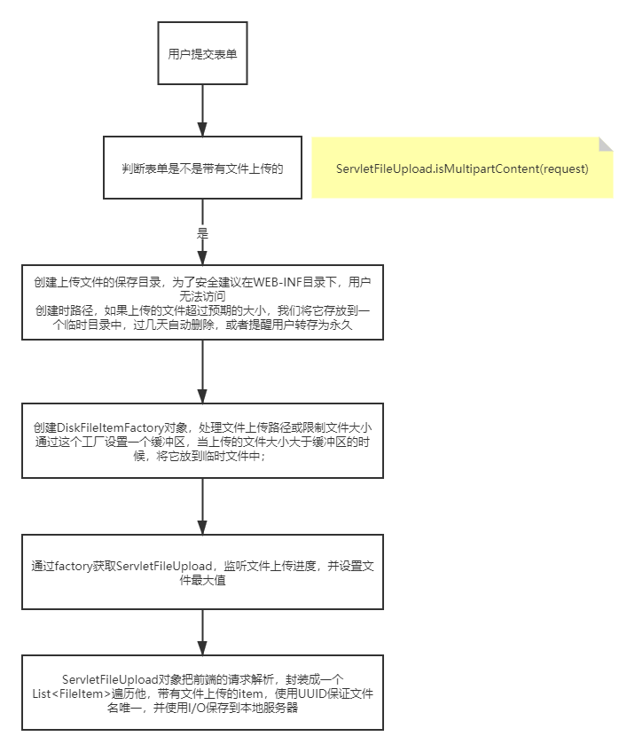

> jsp文件

```jsp
<form action="${pageContext.request.contextPath}/upload.do" method="post" enctype="multipart/form-data">
    上传用户：<input type="text" name="username"> <br>
    <p><input type="file" name="file1"></p>
    <p><input type="file" name="file2"></p>
    <p><input type="submit">|<input type="reset"></p>
</form>
```

> servlet文件

```java
    protected void doPost(HttpServletRequest request, HttpServletResponse response) throws ServletException, IOException {
        //判断上传的表单是普通表单还是带文件的表单，是返回true,否返回false；
        if (!ServletFileUpload.isMultipartContent(request)){
            return;//如果这是一个普通文件我们直接返回
        }//如果通过了这个if，说明我们的表单是带文件上传的

        //创建上传文件的保存目录，为了安全建议在WEB-INF目录下，用户无法访问
        String uploadpath = this.getServletContext().getRealPath("WEB-INF/Upload");//获取上传文件的保存路径
        File uploadfile = new File(uploadpath);
        if (!uploadfile.exists()){
            uploadfile.mkdir();//如果目录不存在就创建这样一个目录
        }

        //临时文件
        //临时路径，如果上传的文件超过预期的大小，我们将它存放到一个临时目录中，过几天自动删除，或者提醒用户转存为永久
        String tmppath = this.getServletContext().getRealPath("WEB-INF/tmp");
        File file = new File(tmppath);
        if (!file.exists()){
            file.mkdir();//如果目录不存在就创建这样临时目录
        }

        //处理上传的文件一般需要通过流来获取，我们可以通过request.getInputstream(),原生态文件上传流获取，十分麻烦
        //但是我们都建议使用Apache的文件上传组件来实现，common-fileupload,它需要依赖于common-io组件；

        try {
            //1、创建DiskFileItemFactory对象，处理文件上传路径或限制文件大小
            DiskFileItemFactory factory = gteDiskFileItemFactory(file);
            //2、获取ServletFileUpload
            ServletFileUpload upload = getServletFileUpload(factory);
            //3、处理上传文件
            String msg = uploadParseRequest(upload,request,uploadpath);
            //Servlet请求转发消息
            request.setAttribute("msg",msg);
            request.getRequestDispatcher("/info.jsp").forward(request,response);
        }catch (FileUploadException e){
            e.printStackTrace();
        }
    }
    public static DiskFileItemFactory gteDiskFileItemFactory(File file){
        //1、创建DiskFileItemFactory对象，处理文件上传路径或限制文件大小
        DiskFileItemFactory factory = new DiskFileItemFactory();
        //通过这个工厂设置一个缓冲区，当上传的文件大小大于缓冲区的时候，将它放到临时文件中；
        factory.setSizeThreshold(1024 * 1024);//缓冲区大小为1M
        factory.setRepository(file);
        return factory;
    }
    public static ServletFileUpload getServletFileUpload(DiskFileItemFactory factory){
        //2、获取ServletFileUpload
        ServletFileUpload upload = new ServletFileUpload(factory);
        //监听文件上传进度
        upload.setProgressListener((pBytesRead, lpContentLenght, i) -> {
            //pBytesRead:已读取到的文件大小
            //pContentLenght：文件大小
            System.out.println("总大小："+lpContentLenght+"已上传："+pBytesRead);
        });

        //处理乱码问题
        upload.setHeaderEncoding("UTF-8");
        //设置单个文件的最大值
        upload.setFileSizeMax(1024 * 1024 * 10);
        //设置总共能够上传文件的大小
        //1024 = 1kb * 1024 = 1M * 10 = 10M
        upload.setSizeMax(1024 * 1024 * 10);
        return upload;
    }
    public static String uploadParseRequest(ServletFileUpload upload,HttpServletRequest request,String uploadpath) throws IOException, FileUploadException {
        String msg = "";
        //3、处理上传文件
        //ServletFileUpload对象把前端的请求解析，封装成一个FileItem对象
        List<FileItem> fileItems = upload.parseRequest(request);
        for (FileItem fileItem : fileItems) {
            if (fileItem.isFormField()){ //判断是普通表单还是带文件的表单
                //getFieldName指的是前端表单控件的name
                String name = fileItem.getFieldName();
                String value = fileItem.getString("UTF-8");//处理乱码
                System.out.println(name+":"+value);
            }else {//判断它是带文件的表单

                //======================处理文件=======================//

                //拿到文件的名字
                String uploadFileName = fileItem.getName();
                System.out.println("上传的文件名："+uploadFileName);
                //返回一个字符串，其值为此字符串，并删除任何前导和尾随空格。
                if (uploadFileName.trim().equals("") || uploadFileName == null){
                    continue;
                }

                //获得上传的文件名，例如/img/girl/ooa.jpg,只需要ooa，其前面的后面的都不需要
                String fileName = uploadFileName.substring(uploadFileName.lastIndexOf("/") + 1);
                System.out.println("fileName："+uploadFileName);
                //获得文件的后缀名
                String fileExtName = uploadFileName.substring(uploadFileName.lastIndexOf(".") + 1);
                      /*
                        如果文件后缀名fileExtName不是我们所需要的
                        就直接return，不处理，告诉用户文件类型不对
                     */

                //可以使用UUID(唯一识别的通用码),保证文件名唯一
                //UUID.randomUUID，随机生一个唯一识别的通用码

                //网络传输中的东西，都需要序列化
                //pojo，实体类，如果想要在多个电脑运行，传输--->需要吧对象都序列化了
                //JNI=java Native Interface
                //implements Serializable ：标记接口，JVM--->java栈 本地方法栈 native-->c++

                System.out.println("文件信息【文件名："+fileName+"文件类型："+fileExtName+"】");

                //可以使用UUID(唯一通用识别码)来保证文件名的统一
                String uuidFileName = UUID.randomUUID().toString();


                //=======================传输文件=========================//
                //获得文件上传的流
                InputStream inputStream = fileItem.getInputStream();

                //创建一个文件输出流
                FileOutputStream fos = new FileOutputStream(uploadpath + "/" + uuidFileName +"."+ fileExtName);

                //创建一个缓冲区
                byte[] buffer = new byte[1024 * 1024];

                //判断是否读取完毕
                int len = 0;

                //如果大于0，说明还存在数据
                while ((len=inputStream.read(buffer))>0){
                    fos.write(buffer,0,len);
                }
                //关闭流
                fos.close();
                inputStream.close();
                msg = "文件上传成功！";
                fileItem.delete();//上传成功，清除临时文件
            }
        }

        return msg;
    }
```