# 1、JVM的位置

# 2、JVM的体系结构

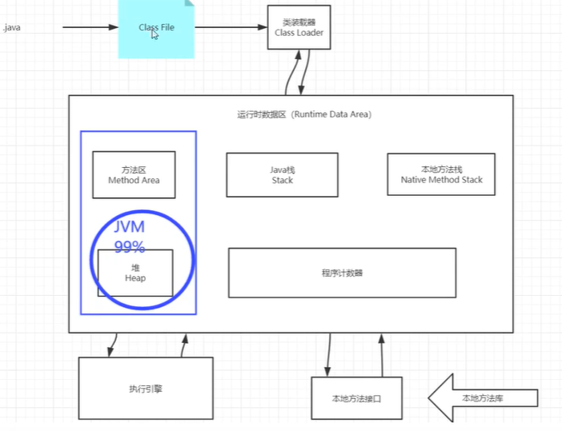

# 3、类加载器

## 3.1.虚拟机自带的加载器

## 3.2.启动类(根)加载器

## 3.3.扩展类加载器

## 3.4.应用程序加载器

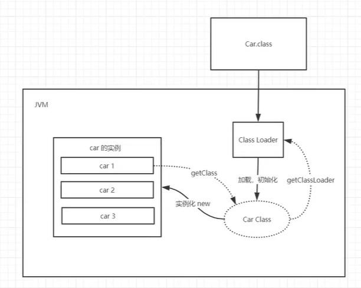

# 4、双亲委派机制

**类加载器在加载类时，会按照**

APP应用类加载器一> EXT扩展类加载器一> Root根类加载器(最终执行)

如果跟加载器没有该类，则会再往前找(根类加载器->扩展类加载器-> 应用类加载器)

**作用**
更安全，避免相同的包类干扰

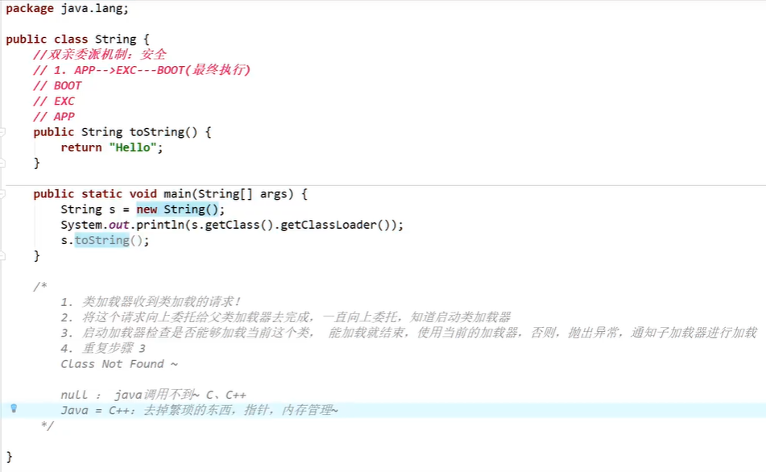

# 5、沙箱安全机制

java代码限定在虚拟机(jvm) 特定的运行范围中

对一些可能存在安全隐患的远程代码进行权限控制

## 组成

字节码校验器

类装载器

存取控制器

安全管理器

安全软件包

# 6、native、PC寄存器(线程私有)、方法区

## 6.1、native

凡是带了native关键字的,说明java范围达不到，回去调用底层C语言的库会进入本地方法栈，调用本地方法接口JNI

JNI作用:扩展java使用，融合不同的编程语言为java所用!最初: C、C++

java诞生的时候C、C++横行，想要立足，必须要调用C、C+ +的程序

它在内存区域中专门开辟了一块标记区域: Native Method Stack,登记native方法

在最终执行的时候，加载本地方法库中的方法通过JNI

实例-------》java程序驱动打印机， 管理系统，掌握即可,在企业应用中较为少见

## 6.2、寄存器(线程私有)

每个钱程都有-个程序计数器，是线程私有的，就是一个指针, 指向方法区中的方法字节码，在执行引擎读取下一条命令，是一个非常小的内存空间，几乎可以忽略不计。

**说白了就是多条线程执行时,不会发生紊乱**

## 6.3、方法区

**存放的东西**

static修饰变量、final (常量)、 所有Class类信息(构造方法,接口定义)、常量池。

但是实例变 量存在堆内存中，和方法区无关

**定义**

方法区被所有线程共享，所有字段和方法字节码，以及一些特殊方法，如构造函数,接口代码也在此定义。简单的说所有所有定义的方法信息都保存在该区域，此区域属于共享空间。

# 7、栈: 一种数据结构

存放的东西：

- 8大基本类型+对象引用+实例的方法

先进后出、后进先出(队列:先进先出FIFO)

为什么main ()先执行，最后结束

栈内存，主管程序运行，生命周期和线程同步

线程结束，栈内存也就是释放,对于栈来说，不存在垃圾回收问题

一旦线程结束,栈就Over
栈的执行原理:栈帧

- 每执行一个方法。产生一个栈帧

栈满了————》StackOverflowError————》 栈内存溢出

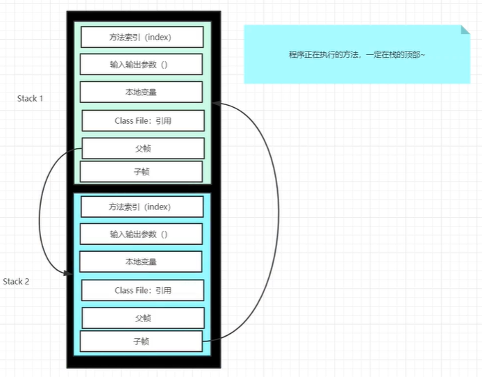

栈+堆+方法区:交互关系

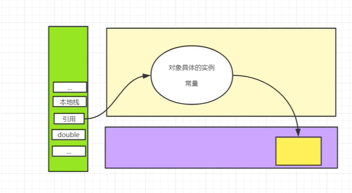

# 8、三种JVM

## 8.1、Sun公司HotSpot

## 8.2、BEA jRockit

## 8.3、IBM J9VM

# 9、堆

## 9.1、类加载器读取了类文件后，一般会把什么 东西放到堆中

类，方法，常量，变量~，保存我们所有引用类型的真实对象

## 9.2、heap 一个jvm只有一个堆内存 ,堆内存的大小是可以调节的

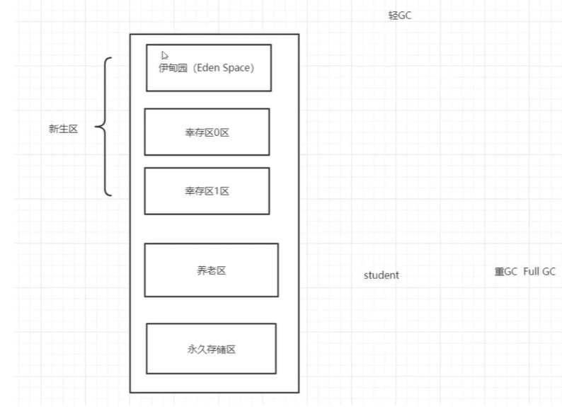

## 9.3、堆内存还要细分为三个区域

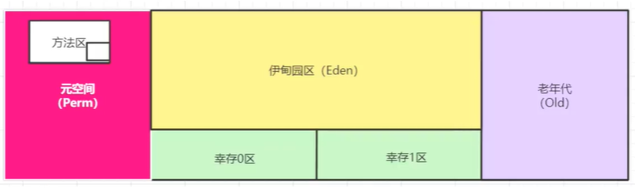

### 9.3.1、新生区(伊甸园区) Young/New

类:诞生和成长的地方,甚至死亡

伊甸园，所有的对象都是在伊甸园区new出来的

幸存者区(0,1)

### 9.3.2、养老区old

真理：经过研究，99%的对象都是临时对象

### 9.3.3、永久区Perm

这个区域常驻内存的，用来存放JDK自身携带的Class对象。Interface元数据，储存的是java运行时的一些环境或类信息~，这个区域不存在垃圾回收！关闭VM虚拟会释放这个区域的内存

一个启动类，加载了大量的第三方jar包。Tomcat部署了太多的应用，大量动态生成的反射类。不断的被加载。直到内存满，就会出现OOM

jdk1.6之前:永久代，常量池是在方法区
jdk1.7 :永久代，但是慢慢的退化了,去永久代，常量池在堆中
jdk1.8之后:无永久代。常量池在元空间

- 元空间：逻辑上存在，物理上不存在（在JDK8以后，永久储存区改了个名字（元空间））

# 10、使用JPofiler工具分析OOM原因

## 10.1、如何快速排除项目中出现的OOM故障

能够看到第几行出错:内存快照分析工具: MATJprofiler
Dubug————》一行行分析代码

## 10.2、假如内存满了，OOM,内存不够! java.lang.OutOfMemoryErrorjava heap space

解决方法：

- 1.尝试扩大堆内存看结果
- 2.分析内存，看哪个地方出现问题

## 10.3、MAT.Jprofiler作用

分析Dump内存文件，快速定位内存泄漏
获得堆中的数据
获得大的对象

## 10.4、一些指令

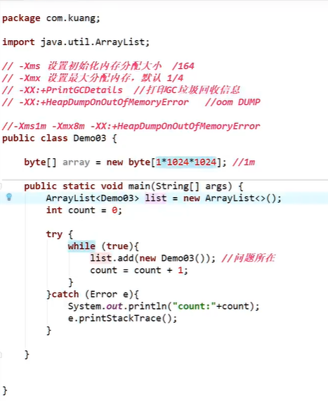

# 11、GC垃圾回收

## 11.1、主要在伊甸园区和养老区~

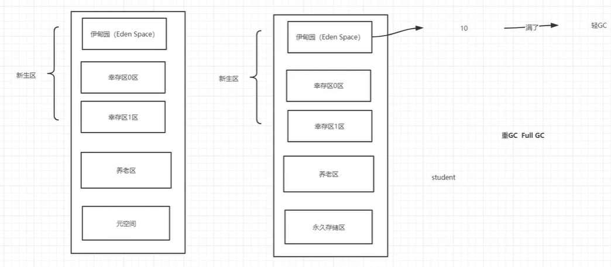

## 11.2、JVM在进行GC时，并不是对这三个区域(新生代，幸存区(from, to) ,老年区)统一回收，大部分时候，回收都是新生代

## 11.3、GC两种类

轻GC (普通的GC)
重GC (全局GC)

## 11.4、GC题目

### 11.4.1、JVM的内存模型和分区~详细到每个区做什么?

### 11.4.2、堆里面的分区有哪些? Eden,from,to，老年区， 说说他们的特点!

### 11.4.3、GC的算法有哪些

#### 11.4.3.1、引用计数法

记录对象的使用次数

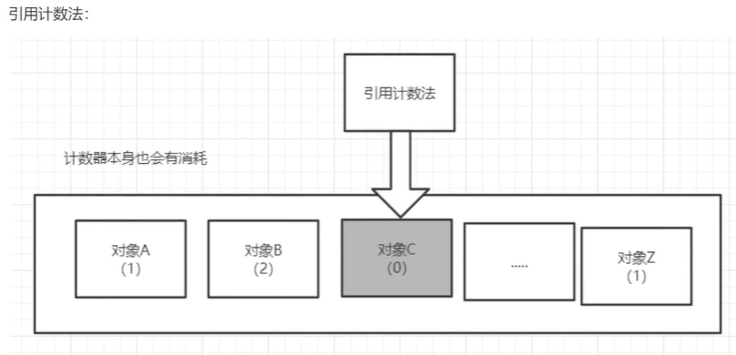

#### 11.4.3.2、复制算法

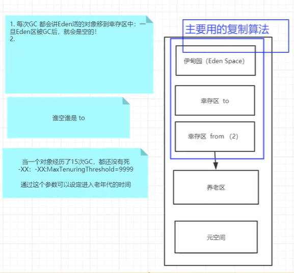

从原来的from区复制到to区，在幸存区活够..次就进入养老区

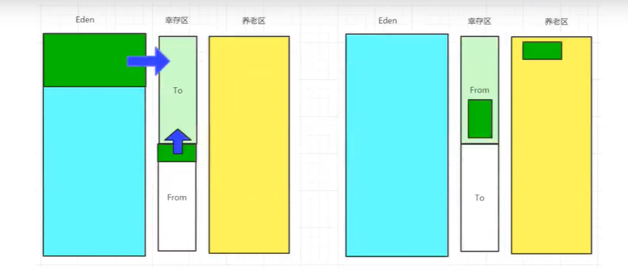

复制算法最佳使用场景:对象活度较低的时候:新生区

优缺点：

- 好处
- - 没有内存的碎片
- 坏处
- - 浪费了内存空间：多了一半空间永远是空to，假设对象100%存活（极端情况）

#### 11.4.3.3、标记清除算法

扫描这些对象，对活着的对象进行标记，对没有标记的对象进行清除

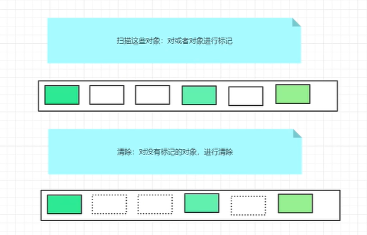

优缺点：

- 优点
  不需要额外的空间
- 缺点
  两次扫描，严重浪费时间，会产生内存碎片

#### 11.4.3.4、标记压缩

#### 11.4.3.5、标记清除压缩

先标记清除几次再进行压缩

### 11.4.4、轻GC,重GC分别在什么时候发生

### 11.4.5、GC总结

- 内存效率
  复制算法>标记清除算法>标记压缩算法(时间复杂度)
- 内存整齐度
  复制算法=标记压缩算法>标记清除算法
- 内存利用率(空间)
  标记压缩算法>标记清除算法>复制算法

### 11.4.6、没有最好的算法，只有最合适的算法

GC：分代收集算法

- 年轻代
  存活率低，使用复制算法
- 老年代
  区域大，存活率，标记清除(内存碎片不是太多) +标记压缩混合实现

# 12、JMM

## 12.1、java内存模型

## 12.2、是干嘛的

作用：缓存一致性协议，用于定义数据读写的规则（遵守，找到这个规则）

JMM定义了线程工作内存和主内存之间的抽象关系：线程之间的共享变量存储在主内存中，每个线程都有一个私有的本地内存

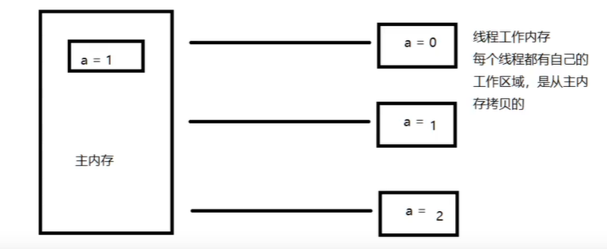

 由于JVM运行程序的实体是线程，而每个线程创建时JVM都会为其创建一个工作内存（栈空间），工作内存是每个线程的私有数据区域，而Java内存模型中规定所有变量都存储在主内存，主内存是共享内存区域，所有线程都可以访问，但线程对变量的操作（读取赋值等）必须在工作内存中进行，首先要将变量从主内存拷贝到自己的工作内存空间，然后对变量进行操作，操作完成后再将变量写回到主内存。不能直接操作主内存里的变量，各个线程中工作内存中存储着主内存变量副本拷贝，因此不同的线程间无法访问对方的工作内存，线程间的通信（传值）必须通过主内存来完成。

## 12.3、JMM关于同步的规定

1、线程解锁前，必须把共享变量的值刷新到主内存
2、线程加锁前，必须读取主内存的最新值到自己的工作内存
3、加锁解锁是同-把锁

## 12.4、JMM线程安全

- 工作内存和主内存同步延迟现象导致的可见性问题
- 可以使用synchronized 或volatile关键字解决，它们都可以使一个线程修改后的变量立即对其他线程可见。对于指令重排导致的可见性问题和有序性问题，可以利用volatile关键字解决，因为volatile的另一个作用就是禁止重排序优化。

## 12.5、 JMM坚持三原则

### 12.5.1、可见性

各个线程对主内存中共变量的操作都是各个线程各自拷贝到自己的工作内存进行操作后再写回到主内存中的，利用volatile关键字解决可见性问题。

 这就可能存在一个线程AAA修改了共享变量的值但是未写回到主内存时，另外一个线程BBB又对主内存中同一个共享变量进行操作，但是此时AA线程工作内存中的共享变量对于线程BBB来说是不可见的，这种工作内存与主内存同步延迟就造成了可见性问题。

### 12.5.2、原子性

原子性是在多线程并发情况下，不会出现分割或加塞，多线程情况下会出现某个线程挂起，数据丢失，不完整，出现Atomic类包下的，保证原子性

### 12.5.3、有序性，即禁止指令重排

计算机在执行程序时，为了提高性能，编译器和处理器常常会对指令进行重排，一般分以下三种
源代码-》编译器优化的重排-》指令并行的重排-》内存系统的重排-》最终执行的指令

单线程环境里面确保程序最终执行结果和代码顺序执行结果一致。

处理器在进行重排序时必须要考虑指令之间的数据依赖性

多线程环境中线程交替执行，由于编译器优化重排的存在，两个线程中使用的变量能否保证一致性 是无法确定的，结果无法预测