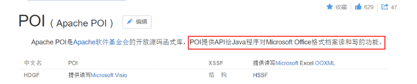
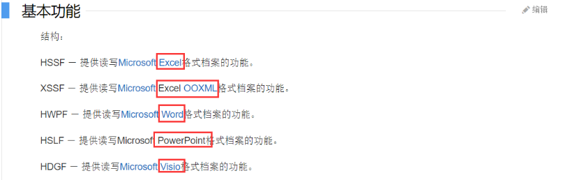
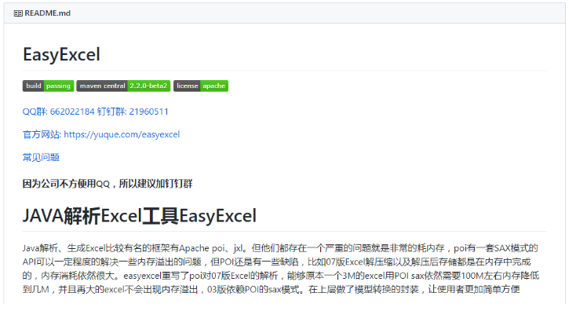
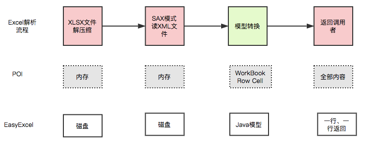
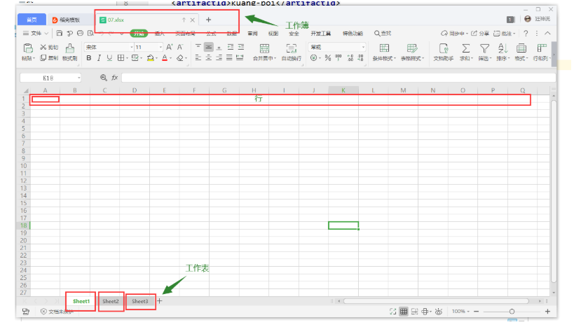

# 一、POI

> 常用进程

1、将用户信息导出为excel表格（导出数据....）

2、将Excel表中的信息录入到网站数据库（习题上传....）

开发中经常会设计到excel的处理，如导出Excel，导入Excel到数据库中！

操作Excel目前比较流行的就是 **Apache POI** 和 阿里巴巴的 **easyExcel** ！

> Apache POI

Apache POI 官网：https://poi.apache.org/





> easyExcel

easyExcel 官网地址：https://github.com/alibaba/easyexcel



EasyExcel 是阿里巴巴开源的一个excel处理框架，**以使用简单、节省内存著称**。

EasyExcel 能大大减少占用内存的主要原因是在解析 Excel 时没有将文件数据一次性全部加载到内存中，而是从磁盘上一行行读取数据，逐个解析。

下图是 EasyExcel 和 POI 在解析Excel时的对比图。



官方文档：https://www.yuque.com/easyexcel/doc/easyexcel

## 1、POI-Excel写

> #### 创建项目

1、建立一个空项目 Bilibili-狂神说java，创建普通Maven的Moudle kuang-poi

2、引入pom依赖

```xml
<dependencies>
    <!--xls(03)-->
    <dependency>
        <groupId>org.apache.poi</groupId>
        <artifactId>poi</artifactId>
        <version>3.9</version>
    </dependency>

    <!--xlsx(07)-->
    <dependency>
        <groupId>org.apache.poi</groupId>
        <artifactId>poi-ooxml</artifactId>
        <version>3.9</version>
    </dependency>
    
    <!--日期格式化工具-->
    <dependency>
        <groupId>joda-time</groupId>
        <artifactId>joda-time</artifactId>
        <version>2.10.1</version>
    </dependency>

    <!--test-->
    <dependency>
        <groupId>junit</groupId>
        <artifactId>junit</artifactId>
        <version>4.12</version>
    </dependency>
</dependencies>
```

> #### 03 | 07 版本的写，就是对象不同，方法一样的！

需要注意：2003 版本和 2007 版本存在兼容性的问题！03最多只有 65535 行！



1、工作簿：

2、工作表：

3、行：

4、列：

#### 03版本：

```Java
@Test
public void testWrite03() throws Exception {
    // 1、创建一个工作簿
    Workbook workbook = new HSSFWorkbook();
    // 2、创建一个工作表
    Sheet sheet = workbook.createSheet("狂神观众统计表");
    // 3、创建一个行  （1,1）
    Row row1 = sheet.createRow(0);
    // 4、创建一个单元格
    Cell cell11 = row1.createCell(0);
    cell11.setCellValue("今日新增观众");
    // (1,2)
    Cell cell12 = row1.createCell(1);
    cell12.setCellValue(666);

    // 第二行 (2,1)
    Row row2 = sheet.createRow(1);
    Cell cell21 = row2.createCell(0);
    cell21.setCellValue("统计时间");
    // (2,2)
    Cell cell22 = row2.createCell(1);
    String time = new DateTime().toString("yyyy-MM-dd HH:mm:ss");
    cell22.setCellValue(time);

    // 生成一张表（IO 流）  03 版本就是使用 xls结尾！
    FileOutputStream fileOutputStream = new FileOutputStream(PATH + "狂神观众统计表03.xls");
    // 输出
    workbook.write(fileOutputStream);
    // 关闭流
    fileOutputStream.close();

    System.out.println("狂神观众统计表03 生成完毕！");

}
```

#### 07版本：

```java
@Test
public void testWrite07() throws Exception {
    // 1、创建一个工作簿 07
    Workbook workbook = new XSSFWorkbook();
    // 2、创建一个工作表
    Sheet sheet = workbook.createSheet("狂神观众统计表");
    // 3、创建一个行  （1,1）
    Row row1 = sheet.createRow(0);
    // 4、创建一个单元格
    Cell cell11 = row1.createCell(0);
    cell11.setCellValue("今日新增观众");
    // (1,2)
    Cell cell12 = row1.createCell(1);
    cell12.setCellValue(666);

    // 第二行 (2,1)
    Row row2 = sheet.createRow(1);
    Cell cell21 = row2.createCell(0);
    cell21.setCellValue("统计时间");
    // (2,2)
    Cell cell22 = row2.createCell(1);
    String time = new DateTime().toString("yyyy-MM-dd HH:mm:ss");
    cell22.setCellValue(time);

    // 生成一张表（IO 流）  03 版本就是使用 xlsx结尾！
    FileOutputStream fileOutputStream = new FileOutputStream(PATH + "狂神观众统计表07.xlsx");
    // 输出
    workbook.write(fileOutputStream);
    // 关闭流
    fileOutputStream.close();

    System.out.println("狂神观众统计表03 生成完毕！");

}
```

注意对象的一个区别，文件后缀！

数据批量导入！

> #### 大文件写HSSF

缺点：最多只能处理65536行，否则会抛出异常

```bash
java.lang.IllegalArgumentException: Invalid row number (65536) outside allowable range (0..65535)
```

优点：过程中写入缓存，不操作磁盘，最后一次性写入磁盘，速度快

```java
@Test
public void testWrite03BigData() throws IOException {
    // 时间
    long begin = System.currentTimeMillis();

    // 创建一个薄
    Workbook workbook = new HSSFWorkbook();
    // 创建表
    Sheet sheet = workbook.createSheet();
    // 写入数据
    for (int rowNum = 0; rowNum < 65537; rowNum++) {
        Row row = sheet.createRow(rowNum);
        for (int cellNum = 0; cellNum < 10 ; cellNum++) {
            Cell cell = row.createCell(cellNum);
            cell.setCellValue(cellNum);
        }
    }
    System.out.println("over");
    FileOutputStream outputStream = new FileOutputStream(PATH + "testWrite03BigData.xls");
    workbook.write(outputStream);
    outputStream.close();
    long end = System.currentTimeMillis();
    System.out.println((double) (end-begin)/1000);
}
```

> #### 大文件写XSSF

缺点：写数据时速度非常慢，非常耗内存，也会发生内存溢出，如100万条

优点：可以写较大的数据量，如20万条

```java
@Test
public void testWrite07BigData() throws IOException {
    // 时间
    long begin = System.currentTimeMillis();

    // 创建一个薄
    Workbook workbook = new XSSFWorkbook();
    // 创建表
    Sheet sheet = workbook.createSheet();
    // 写入数据
    for (int rowNum = 0; rowNum < 100000; rowNum++) {
        Row row = sheet.createRow(rowNum);
        for (int cellNum = 0; cellNum < 10 ; cellNum++) {
            Cell cell = row.createCell(cellNum);
            cell.setCellValue(cellNum);
        }
    }
    System.out.println("over");
    FileOutputStream outputStream = new FileOutputStream(PATH + "testWrite07BigData.xlsx");
    workbook.write(outputStream);
    outputStream.close();
    long end = System.currentTimeMillis();
    System.out.println((double) (end-begin)/1000);
}
```

> #### 大文件写SXSSF

优点：可以写非常大的数据量，如100万条甚至更多条，写数据速度快，占用更少的内存

**注意：**

过程中会产生临时文件，需要清理临时文件

默认由100条记录被保存在内存中，如果超过这数量，则最前面的数据被写入临时文件

如果想自定义内存中数据的数量，可以使用new SXSSFWorkbook ( 数量 )

```java
@Test
public void testWrite07BigDataS() throws IOException {
    // 时间
    long begin = System.currentTimeMillis();

    // 创建一个薄
    Workbook workbook = new SXSSFWorkbook();
    // 创建表
    Sheet sheet = workbook.createSheet();
    // 写入数据
    for (int rowNum = 0; rowNum < 100000; rowNum++) {
        Row row = sheet.createRow(rowNum);
        for (int cellNum = 0; cellNum < 10 ; cellNum++) {
            Cell cell = row.createCell(cellNum);
            cell.setCellValue(cellNum);
        }
    }
    System.out.println("over");
    FileOutputStream outputStream = new FileOutputStream(PATH + "testWrite07BigDataS.xlsx");
    workbook.write(outputStream);
    outputStream.close();
    // 清除临时文件！
    ((SXSSFWorkbook) workbook).dispose();
    long end = System.currentTimeMillis();
    System.out.println((double) (end-begin)/1000);
}
```

SXSSFWorkbook-来至官方的解释：实现“BigGridDemo”策略的流式XSSFWorkbook版本。这允许写入非常大的文件而不会耗尽内存，因为任何时候只有可配置的行部分被保存在内存中。

请注意，仍然可能会消耗大量内存，这些内存基于您正在使用的功能，例如合并区域，注释......仍然只存储在内存中，因此如果广泛使用，可能需要大量内存。

再使用 POI的时候！内存问题 Jprofile！

## 2、POI-Excel读

> #### 03|07

#### 03版本

```java
@Test
public void testRead03() throws Exception {

    // 获取文件流
    FileInputStream inputStream = new FileInputStream(PATH + "kuang-poi狂神观众统计表03.xls");

    // 1、创建一个工作簿。 使用excel能操作的这边他都可以操作！
    Workbook workbook = new HSSFWorkbook(inputStream);
    // 2、得到表
    Sheet sheet = workbook.getSheetAt(0);
    // 3、得到行
    Row row = sheet.getRow(0);
    // 4、得到列
    Cell cell = row.getCell(1);

    // 读取值的时候，一定需要注意类型！
    // getStringCellValue 字符串类型
    //        System.out.println(cell.getStringCellValue());
    System.out.println(cell.getNumericCellValue());
    inputStream.close();
}
```

#### 07版本

```Java
@Test
public void testRead07() throws Exception {

    // 获取文件流
    FileInputStream inputStream = new FileInputStream(PATH + "kuang-poi狂神观众统计表07.xlsx");

    // 1、创建一个工作簿。 使用excel能操作的这边他都可以操作！
    Workbook workbook = new XSSFWorkbook(inputStream);
    // 2、得到表
    Sheet sheet = workbook.getSheetAt(0);
    // 3、得到行
    Row row = sheet.getRow(0);
    // 4、得到列
    Cell cell = row.getCell(1);

    // 读取值的时候，一定需要注意类型！
    // getStringCellValue 字符串类型
    //        System.out.println(cell.getStringCellValue());
    System.out.println(cell.getNumericCellValue());
    inputStream.close();
}
```

注意获取值的类型即可

> #### 读取不同的数据类型（最麻烦的就是这里了！）

```java
@Test
public void testCellType() throws Exception {
    // 获取文件流
    FileInputStream inputStream = new FileInputStream(PATH + "明细表.xls");

    // 创建一个工作簿。 使用excel能操作的这边他都可以操作！
    Workbook workbook = new HSSFWorkbook(inputStream);
    Sheet sheet = workbook.getSheetAt(0);
    // 获取标题内容
    Row rowTitle = sheet.getRow(0);
    if (rowTitle!=null) {
        // 一定要掌握
        int cellCount = rowTitle.getPhysicalNumberOfCells();
        for (int cellNum = 0; cellNum < cellCount; cellNum++) {
            Cell cell = rowTitle.getCell(cellNum);
            if (cell!=null){
                int cellType = cell.getCellType();
                String cellValue = cell.getStringCellValue();
                System.out.print(cellValue + " | ");
            }
        }
        System.out.println();
    }

    // 获取表中的内容
    int rowCount = sheet.getPhysicalNumberOfRows();
    for (int rowNum = 1; rowNum < rowCount ; rowNum++) {
        Row rowData = sheet.getRow(rowNum);
        if (rowData!=null){
            // 读取列
            int cellCount = rowTitle.getPhysicalNumberOfCells();
            for (int cellNum = 0; cellNum < cellCount ; cellNum++) {
                System.out.print("[" +(rowNum+1) + "-" + (cellNum+1) + "]");

                Cell cell = rowData.getCell(cellNum);
                // 匹配列的数据类型
                if (cell!=null) {
                    int cellType = cell.getCellType();
                    String cellValue = "";

                    switch (cellType) {
                        case HSSFCell.CELL_TYPE_STRING: // 字符串
                            System.out.print("【String】");
                            cellValue = cell.getStringCellValue();
                            break;
                        case HSSFCell.CELL_TYPE_BOOLEAN: // 布尔
                            System.out.print("【BOOLEAN】");
                            cellValue = String.valueOf(cell.getBooleanCellValue());
                            break;
                        case HSSFCell.CELL_TYPE_BLANK: // 空
                            System.out.print("【BLANK】");
                            break;
                        case HSSFCell.CELL_TYPE_NUMERIC: // 数字（日期、普通数字）
                            System.out.print("【NUMERIC】");
                            if (HSSFDateUtil.isCellDateFormatted(cell)){ // 日期
                                System.out.print("【日期】");
                                Date date = cell.getDateCellValue();
                                cellValue = new DateTime(date).toString("yyyy-MM-dd");
                            }else {
                                // 不是日期格式，防止数字过长！
                                System.out.print("【转换为字符串输出】");
                                cell.setCellType(HSSFCell.CELL_TYPE_STRING);
                                cellValue = cell.toString();
                            }
                            break;
                        case HSSFCell.CELL_TYPE_ERROR:
                            System.out.print("【数据类型错误】");
                            break;
                    }
                    System.out.println(cellValue);
                }
            }
        }
    }
    inputStream.close();
}
```

注意，类型转换问题；

> #### 计算公式 （了解即可！）

```java
@Test
public void testFormula() throws Exception {
    FileInputStream inputStream = new FileInputStream(PATH + "公式.xls");
    Workbook workbook = new HSSFWorkbook(inputStream);
    Sheet sheet = workbook.getSheetAt(0);

    Row row = sheet.getRow(4);
    Cell cell = row.getCell(0);

    // 拿到计算公司 eval
    FormulaEvaluator FormulaEvaluator = new HSSFFormulaEvaluator((HSSFWorkbook)workbook);

    // 输出单元格的内容
    int cellType = cell.getCellType();
    switch (cellType){
        case Cell.CELL_TYPE_FORMULA: // 公式
            String formula = cell.getCellFormula();
            System.out.println(formula);

            // 计算
            CellValue evaluate = FormulaEvaluator.evaluate(cell);
            String cellValue = evaluate.formatAsString();
            System.out.println(cellValue);
            break;
    }

}
```

# 二、EasyExcel操作

> 导入依赖

```xml
<dependency>
    <groupId>com.alibaba</groupId>
    <artifactId>easyexcel</artifactId>
    <version>2.2.0-beta2</version>
</dependency>
```

## 1、写入测试

https://www.yuque.com/easyexcel/doc/read

### 1.1、创建对象

```java
@Data
public class DemoData {
    @ExcelProperty("字符串标题")
    private String string;
    @ExcelProperty("日期标题")
    private Date date;
    @ExcelProperty("数字标题")
    private Double doubleData;
    /**
     * 忽略这个字段
     */
    @ExcelIgnore
    private String ignore;
}
```

### 1.2、拿到实体类里的值

```java
 String PATH ="D:\\Project\\IdeaProject\\Bilibili-狂神说java\\";

    private List<DemoData> data() {
        List<DemoData> list = new ArrayList<DemoData>();
        for (int i = 0; i < 10; i++) {
            DemoData data = new DemoData();
            data.setString("字符串" + i);
            data.setDate(new Date());
            data.setDoubleData(0.56);
            list.add(data);
        }
        return list;
    }
```

### **1.3、将list写入Excel**

```java
// 根据list 写入excel
    @Test
    public void simpleWrite() {
        // 写法1
        String fileName = PATH + "EasyTest.xlsx";
        // 这里 需要指定写用哪个class去写，然后写到第一个sheet，名字为模板 然后文件流会自动关闭
        // write (fileName, 格式类)
        // sheet (表明)
        // doWrite (数据)
        EasyExcel.write(fileName, DemoData.class).sheet("模板").doWrite(data());
    }
```

## 2、读取测试

https://www.yuque.com/easyexcel/doc/read

### 2.1、对象

### 2.2、监听器

```java
// 有个很重要的点 DemoDataListener 不能被spring管理，要每次读取excel都要new,然后里面用到spring可以构造方法传进去
public class DemoDataListener extends AnalysisEventListener<DemoData> {
    private static final Logger LOGGER = LoggerFactory.getLogger(DemoDataListener.class);

    private static final int BATCH_COUNT = 5;
    List<DemoData> list = new ArrayList<DemoData>();

    private DemoDAO demoDAO;
    public DemoDataListener() {
        // 这里是demo，所以随便new一个。实际使用如果到了spring,请使用下面的有参构造函数
        demoDAO = new DemoDAO();
    }

    public DemoDataListener(DemoDAO demoDAO) {
        this.demoDAO = demoDAO;
    }

    // 读取数据会执行 invoke 方法
    // DemoData 类型
    // AnalysisContext 分析上问
    @Override
    public void invoke(DemoData data, AnalysisContext context) {
        System.out.println(JSON.toJSONString(data));
        list.add(data);
        // 达到BATCH_COUNT了，需要去存储一次数据库，防止数据几万条数据在内存，容易OOM
        if (list.size() >= BATCH_COUNT) {
            saveData(); // 持久化逻辑!
            // 存储完成清理 list
            list.clear();
        }
    }
    /**
     * 所有数据解析完成了 都会来调用
     *
     * @param context
     */
    @Override
    public void doAfterAllAnalysed(AnalysisContext context) {
        // 这里也要保存数据，确保最后遗留的数据也存储到数据库
        saveData();
        LOGGER.info("所有数据解析完成！");
    }
    /**
     * 加上存储数据库
     */
    private void saveData() {
        LOGGER.info("{}条数据，开始存储数据库！", list.size());
        demoDAO.save(list);
        LOGGER.info("存储数据库成功！");
    }
}
```

### 2.3、持久层

```java
/**
 * 假设这个是你的DAO存储。当然还要这个类让spring管理，当然你不用需要存储，也不需要这个类。
 **/
public class DemoDAO {
    public void save(List<DemoData> list) {
        // 持久化操作！
        // 如果是mybatis,尽量别直接调用多次insert,自己写一个mapper里面新增一个方法batchInsert,所有数据一次性插入
    }
}
```

### 2.4、测试代码

```java
@Test
    public void simpleRead() {
        // 有个很重要的点 DemoDataListener 不能被spring管理，要每次读取excel都要new,然后里面用到spring可以构造方法传进去
        // 写法1：
        String fileName = PATH + "EasyTest.xlsx";
        // 这里 需要指定读用哪个class去读，然后读取第一个sheet 文件流会自动关闭

        // 重点注意读取的逻辑 DemoDataListener
        EasyExcel.read(fileName, DemoData.class, new DemoDataListener()).sheet().doRead();
    }
```

固定套路：

1、写入，固定类格式进行写入

2、读取，根据监听器设置的规则进行读取！

## 小结-学习方式

了解，面向对象的思想，学会面向接口编程！

理解使用测试API！

作业：把**EasyExcel** 的所有api都测试一下（2~3小时！）