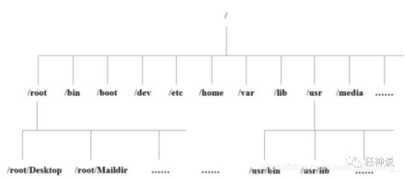
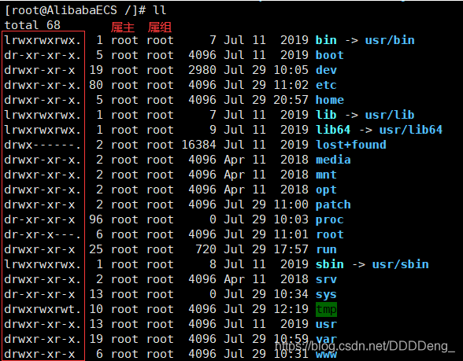
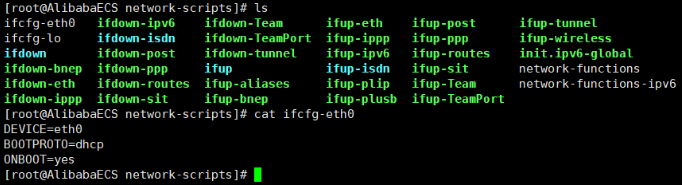
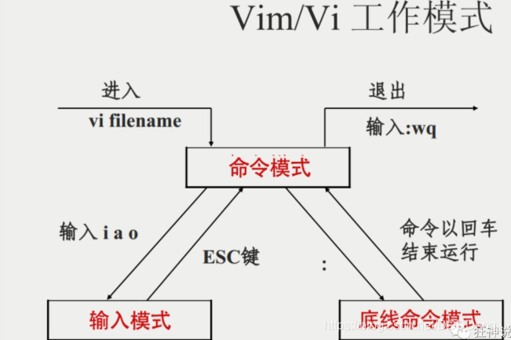
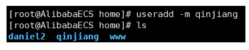
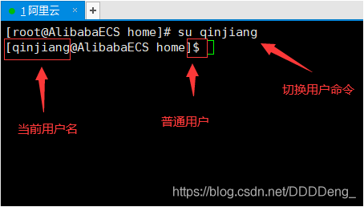
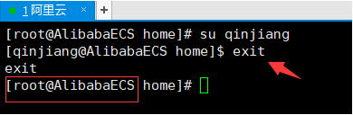

Linux一切皆文件：文件就 读、写、权限三种操作

## 一、Linux常用指令

### 关机

> 关机

```bash
sync # 将数据由内存同步到硬盘中。

shutdown # 关机指令，你可以man shutdown 来看一下帮助文档。例如你可以运行如下命令关机：

shutdown –h 10 # 这个命令告诉大家，计算机将在10分钟后关机

shutdown –h now # 立马关机

shutdown –h 20:25 # 系统会在今天20:25关机

shutdown –h +10 # 十分钟后关机

shutdown –r now # 系统立马重启

shutdown –r +10 # 系统十分钟后重启

reboot # 就是重启，等同于 shutdown –r now

halt # 关闭系统，等同于shutdown –h now 和 poweroff


```

### 系统目录结构

> 系统目录结构

1. 一切皆文件
2. 根目录/，所有的文件都挂载在这个节点上

**树状目录结构：（Linux的一切资源都挂载在这个 / 根节点下）**



- **/bin**：bin是Binary的缩写, 这个目录存放着最经常使用的命令。
- **/boot：** 这里存放的是启动Linux时使用的一些核心文件，包括一些连接文件以及镜像文件。
- **/dev ：** dev是Device(设备)的缩写, 存放的是Linux的外部设备，在Linux中访问设备的方式和访问文件的方式是相同的。
- **/etc：** 这个目录用来存放所有的系统管理所需要的**配置文件**和子目录。
- **/home**：用户的主目录，在Linux中，每个用户都有一个自己的目录，一般该目录名是以用户的账号命名的。
- **/lib**：这个目录里存放着系统最基本的动态连接共享库，其作用类似于Windows里的DLL文件。
- **/lost+found**：这个目录一般情况下是空的，当系统非法关机后，这里就存放了一些文件。
- **/media**：linux系统会自动识别一些设备，例如U盘、光驱等等，当识别后，linux会把识别的设备挂载到这个目录下。
- **/mnt**：系统提供该目录是为了让用户临时挂载别的文件系统的，我们可以将光驱挂载在/mnt/上，然后进入该目录就可以查看光驱里的内容了。
- **/opt**：这是给主机额外安装软件所摆放的目录。比如你安装一个ORACLE数据库则就可以放到这个目录下。默认是空的。
- **/proc**：这个目录是一个虚拟的目录，它是系统内存的映射，我们可以通过直接访问这个目录来获取系统信息。
- **/root**：该目录为系统管理员，也称作超级权限者的用户主目录。
- **/sbin**：s就是Super User的意思，这里存放的是系统管理员使用的系统管理程序。
- **/srv**：该目录存放一些服务启动之后需要提取的数据。
- **/sys**：这是linux2.6内核的一个很大的变化。该目录下安装了2.6内核中新出现的一个文件系统 sysfs 。
- **/tmp**：这个目录是用来存放一些临时文件的。用完即丢的文件，可以放在这个目录下，安装包！
- **/usr**：这是一个非常重要的目录，用户的很多应用程序和文件都放在这个目录下，类似于windows下的program files目录。
- **/usr/bin：** 系统用户使用的应用程序。
- **/usr/sbin：** 超级用户使用的比较高级的管理程序和系统守护程序。
- **/usr/src：** 内核源代码默认的放置目录。
- **/var**：这个目录中存放着在不断扩充着的东西，我们习惯将那些经常被修改的目录放在这个目录下。包括各种日志文件。
- **/run**：是一个临时文件系统，存储系统启动以来的信息。当系统重启时，这个目录下的文件应该被删掉或清除。
- **/www**：存放服务器网站相关的资源，环境，网站的项目

### 常用的基本命令

#### 目录管理

> 绝对路径、相对路径

**绝对路径：**

路径的写法，由根目录 / 写起，例如：/usr/share/doc 这个目录。

**相对路径：**

路径的写法，不是由 / 写起，例如由 /usr/share/doc 要到 /usr/share/man 底下时，可以写成：cd …/man 这就是相对路径的写法啦！

> 处理目录的常用命令

接下来我们就来看几个常见的处理目录的命令吧：

- ls: 列出目录
- cd：切换目录
- pwd：显示目前的目录
- mkdir：创建一个新的目录
- rmdir：删除一个空的目录
- cp: 复制文件或目录
- rm: 移除文件或目录
- mv: 移动文件与目录，或修改文件与目录的名称

**你可以使用 \*man [命令]\* 来查看各个命令的使用文档，如 ：man cp。**

> ls （列出目录）

在Linux系统当中， ls 命令可能是最常被运行的。

选项与参数：

- -a ：全部的文件，连同隐藏文件( 开头为 . 的文件) 一起列出来(常用)
- -l ：长数据串列出，包含文件的属性与权限等等数据；(常用)

> cd （切换目录）

cd是Change Directory的缩写，这是用来变换工作目录的命令。

**Linux中以 “/” 开头的都是绝对路径。**

> pwd ( 显示目前所在的目录 )

pwd 是 **Print Working Directory** 的缩写，也就是显示目前所在目录的命令。

> mkdir （创建新目录）

如果想要创建新的目录的话，那么就使用mkdir (make directory)吧。

```
mkdir [-mp] 目录名称
```

选项与参数：

- -m ：配置文件的权限喔！直接配置，不需要看默认权限 (umask) 的脸色～

- -p ：帮助你直接将所需要的目录(包含上一级目录)递归创建起来！(多级目录)

  ```cmd
  [root@AlibabaECS home]# mkdir -p test1/test2/test3
  ```

> rmdir ( 删除空的目录 )

```
rmdir [-p] 目录名称
```

rmdir 仅能删除空的目录，如果下面存在文件，需要先删除文件，递归删除多个目录使用 -p 参数。

> cp ( 复制文件或目录 )

语法：

```cmd
[root@www ~]# cp [-adfilprsu] 来源档(source) 目标档(destination)
[root@www ~]# cp [options] source1 source2 source3 .... directory
```

选项与参数：

- **-a：**相当於 -pdr 的意思，至於 pdr 请参考下列说明；(常用)
- **-p：**连同文件的属性一起复制过去，而非使用默认属性(备份常用)；
- **-d：**若来源档为连结档的属性(link file)，则复制连结档属性而非文件本身；
- **-r：**递归持续复制，用於目录的复制行为；(常用)
- **-f：**为强制(force)的意思，若目标文件已经存在且无法开启，则移除后再尝试一次；
- **-i：**若目标档(destination)已经存在时，在覆盖时会先询问动作的进行(常用)
- **-l：**进行硬式连结(hard link)的连结档创建，而非复制文件本身。
- **-s：**复制成为符号连结档 (symbolic link)，亦即『捷径』文件；
- **-u：**若 destination 比 source 旧才升级 destination ！

> rm ( 移除文件或目录 )

选项与参数：

- -f ：就是 force 的意思，忽略不存在的文件，不会出现警告信息；
- -i ：互动模式，在删除前会询问使用者是否动作
- -r ：递归删除啊！最常用在目录的删除了！这是非常危险的选项！！！

> mv ( 移动文件与目录，或修改名称 )

语法：

```cmd
[root@www ~]# mv [-fiu] source destination
[root@www ~]# mv [options] source1 source2 source3 .... directory
```

选项与参数：

- -f ：force 强制的意思，如果目标文件已经存在，不会询问而直接覆盖；
- -i ：若目标文件 (destination) 已经存在时，就会询问是否覆盖！
- -u ：若目标文件已经存在，且 source 比较新，才会升级 (update)

#### 基本属性

> 看懂文件属性

Linux系统是一种典型的多用户系统，不同的用户处于不同的地位，拥有不同的权限。为了保护系统的安全性，Linux系统对不同的用户访问同一文件（包括目录文件）的权限做了不同的规定。

在Linux中我们可以使用`ll`或者`ls –l`命令来显示一个文件的属性以及文件所属的用户和组，如：



实例中，boot文件的第一个属性用"d"表示。"d"在Linux中代表该文件是一个目录文件。

在Linux中第一个字符代表这个文件是目录、文件或链接文件等等：

- 当为[ **d** ]则是目录
- 当为[ **-** ]则是文件；
- 若是[ **l** ]则表示为链接文档 ( link file )；
- 若是[ **b** ]则表示为装置文件里面的可供储存的接口设备 ( 可随机存取装置 )；
- 若是[ **c** ]则表示为装置文件里面的串行端口设备，例如键盘、鼠标 ( 一次性读取装置 )。

接下来的字符中，以三个为一组，且均为『rwx』 的三个参数的组合。

其中，[ r ]代表可读(read)、[ w ]代表可写(write)、[ x ]代表可执行(execute)。

要注意的是，这三个权限的位置不会改变，如果没有权限，就会出现减号[ - ]而已。

每个文件的属性由左边第一部分的10个字符来确定（如下图）：


从左至右用0-9这些数字来表示。

第0位确定文件类型，第1-3位确定属主（该文件的所有者）拥有该文件的权限。第4-6位确定属组（所有者的同组用户）拥有该文件的权限，第7-9位确定其他用户拥有该文件的权限。

其中：

第1、4、7位表示读权限，如果用"r"字符表示，则有读权限，如果用"-"字符表示，则没有读权限；

第2、5、8位表示写权限，如果用"w"字符表示，则有写权限，如果用"-"字符表示没有写权限；

第3、6、9位表示可执行权限，如果用"x"字符表示，则有执行权限，如果用"-"字符表示，则没有执行权限。

对于文件来说，它都有一个特定的所有者，也就是对该文件具有所有权的用户。

同时，在Linux系统中，用户是按组分类的，一个用户属于一个或多个组。

文件所有者以外的用户又可以分为文件所有者的同组用户和其他用户。

因此，Linux系统按文件所有者、文件所有者同组用户和其他用户来规定了不同的文件访问权限。

在以上实例中，boot 文件是一个目录文件，属主和属组都为 root。

> 修改文件属性

**1、chgrp：更改文件属组**

```
chgrp [-R] 属组名 文件名
```

-R：递归更改文件属组，就是在更改某个目录文件的属组时，如果加上-R的参数，那么该目录下的所有文件的属组都会更改。

**2、chown：更改文件属主，也可以同时更改文件属组**

```
chown [–R] 属主名 文件名
chown [-R] 属主名：属组名 文件名
```

**3、chmod：更改文件9个属性**

```
chmod [-R] xyz 文件或目录
```

Linux文件属性有两种设置方法，一种是数字，一种是符号。

Linux文件的基本权限就有九个，分别是owner/group/others三种身份各有自己的read/write/execute权限。

先复习一下刚刚上面提到的数据：文件的权限字符为：『-rwxrwxrwx』， 这九个权限是三个三个一组的！其中，我们可以使用数字来代表各个权限，各权限的分数对照表如下：

```
r:4     w:2         x:1
```

每种身份(owner/group/others)各自的三个权限(r/w/x)分数是需要累加的，例如当权限为：[-rwxrwx—] 分数则是：

- owner = rwx = 4+2+1 = 7
- group = rwx = 4+2+1 = 7
- others= — = 0+0+0 = 0

```
chmod 770 filename
```

#### 文件内容查看

> 概述

Linux系统中使用以下命令来查看文件的内容：

- cat 由第一行开始显示文件内容
- tac 从最后一行开始显示，可以看出 tac 是 cat 的倒着写！
- nl 显示的时候，顺道输出行号！
- more 一页一页的显示文件内容
- less 与 more 类似，但是比 more 更好的是，他可以往前翻页！
- head 只看头几行
- tail 只看尾巴几行

> cat 由第一行开始显示文件内容

语法：

```
cat [-AbEnTv]
```

选项与参数：

- -A ：相当於 -vET 的整合选项，可列出一些特殊字符而不是空白而已；
- -b ：列出行号，仅针对非空白行做行号显示，空白行不标行号！
- -E ：将结尾的断行字节 $ 显示出来；
- -n ：列印出行号，连同空白行也会有行号，与 -b 的选项不同；
- -T ：将 [tab] 按键以 ^I 显示出来；
- -v ：列出一些看不出来的特殊字符



> tac

tac与cat命令刚好相反，文件内容从最后一行开始显示，可以看出 tac 是 cat 的倒着写！

> nl 显示行号

语法：

```
nl [-bnw] 文件
```

选项与参数：

- -b ：指定行号指定的方式，主要有两种：-b a ：表示不论是否为空行，也同样列出行号(类似 cat -n)；-b t ：如果有空行，空的那一行不要列出行号(默认值)；
- -n ：列出行号表示的方法，主要有三种：-n ln ：行号在荧幕的最左方显示；-n rn ：行号在自己栏位的最右方显示，且不加 0 ；-n rz ：行号在自己栏位的最右方显示，且加 0 ；
- -w ：行号栏位的占用的位数

> more 一页一页翻动

语法：

```
[root@kuangshen etc]# more /etc/csh.login
....(中间省略)....
--More--(28%) # 重点在这一行喔！你的光标也会在这里等待你的命令
```

在 more 这个程序的运行过程中，你有几个按键可以按的：

- 空白键 (space)：代表向下翻一页；
- Enter ：代表向下翻『一行』；
- /字串 ：代表在这个显示的内容当中，向下搜寻『字串』这个关键字；
- :f ：立刻显示出档名以及目前显示的行数；
- q ：代表立刻离开 more ，不再显示该文件内容。
- b 或 [ctrl]-b ：代表往回翻页，不过这动作只对文件有用，对管线无用。

> less 一页一页翻动，以下实例输出/etc/man.config文件的内容：

less运行时可以输入的命令有：

- 空白键 ：向下翻动一页；
- [pagedown]：向下翻动一页；
- [pageup] ：向上翻动一页；
- /字串 ：向下搜寻『字串』的功能；
- ?字串 ：向上搜寻『字串』的功能；
- n ：重复前一个搜寻 (与 / 或 ? 有关！)
- N ：反向的重复前一个搜寻 (与 / 或 ? 有关！)
- q ：离开 less 这个程序；

> head 取出文件前面几行

语法：

```
head [-n number] 文件
```

选项与参数：**-n** 后面接数字，代表显示几行的意思！

默认的情况中，显示前面 10 行！若要显示前 20 行，就得要这样：

```
[root@kuangshen etc]# head -n 20 /etc/csh.login
```

> tail 取出文件后面几行

语法：

```
tail [-n number] 文件
```

选项与参数：

- -n ：后面接数字，代表显示几行的意思

默认的情况中，显示最后 10 行！若要显示最后 20 行，就得要这样：

```
[root@kuangshen etc]# tail -n 20 /etc/csh.login
```

#### Linux 链接概念

> 拓展：Linux 链接概念

`touch`：创建文件

`echo`：输入字符串，也可以输入到文件中

Linux 链接分两种，一种被称为硬链接（Hard Link），另一种被称为符号链接（Symbolic Link）。

情况下，**ln** 命令产生硬链接。

**硬链接：**A—B，假设B是A的硬链接，那么他们两个指向了同一个文件！允许一个文件拥有多个路径，用户可以通过这种机制建立硬链接到一些重要文件上，防止误删！

**软连接：**类似Windows下的快捷方式，删除了源文件，快捷方式就访问不了了。

```cmd
[root@kuangshen /]# cd /home
[root@kuangshen home]# touch f1 # 创建一个测试文件f1
[root@kuangshen home]# ls
f1
[root@kuangshen home]# ln f1 f2     # 创建f1的一个硬连接文件f2
[root@kuangshen home]# ln -s f1 f3   # 创建f1的一个符号连接文件f3
[root@kuangshen home]# ls -li       # -i参数显示文件的inode节点信息
397247 -rw-r--r-- 2 root root     0 Mar 13 00:50 f1
397247 -rw-r--r-- 2 root root     0 Mar 13 00:50 f2
397248 lrwxrwxrwx 1 root root     2 Mar 13 00:50 f3 -> f1
```

从上面的结果中可以看出，硬连接文件 f2 与原文件 f1 的 inode 节点相同，均为 397247，然而符号连接文件的 inode 节点不同。

```cmd
# echo 字符串输出 >> f1 输出到 f1文件
[root@kuangshen home]# echo "I am f1 file" >>f1
[root@kuangshen home]# cat f1
I am f1 file
[root@kuangshen home]# cat f2
I am f1 file
[root@kuangshen home]# cat f3
I am f1 file
[root@kuangshen home]# rm -f f1
[root@kuangshen home]# cat f2
I am f1 file
[root@kuangshen home]# cat f3
cat: f3: No such file or directory
```

通过上面的测试可以看出：当删除原始文件 f1 后，硬连接 f2 不受影响，但是符号连接 f1 文件无效；

依此您可以做一些相关的测试，可以得到以下全部结论：

- 删除符号连接f3,对f1,f2无影响；
- 删除硬连接f2，对f1,f3也无影响；
- 删除原文件f1，对硬连接f2没有影响，导致符号连接f3失效；
- 同时删除原文件f1,硬连接f2，整个文件会真正的被删除。

## 二、Vim使用及账号用户管理

https://mp.weixin.qq.com/s?__biz=Mzg2NTAzMTExNg==&mid=2247483895&idx=1&sn=b685934ee0d08b9d01cc0c35ed7fed71&scene=19#wechat_redirect

### Vim使用

> 什么是Vim编辑器？

Vim是从 vi 发展出来的一个文本编辑器。代码补完、编译及错误跳转等方便编程的功能特别丰富，在程序员中被广泛使用。

简单的来说， vi 是老式的字处理器，不过功能已经很齐全了，但是还是有可以进步的地方。

vim 则可以说是程序开发者的一项很好用的工具。

所有的 Unix Like 系统都会内建 vi 文书编辑器，其他的文书编辑器则不一定会存在。

连 vim 的官方网站 (http://www.vim.org) 自己也说 vim 是一个程序开发工具而不是文字处理软件。

> 三种使用模式

基本上 vi/vim 共分为三种模式，分别是**命令模式（Command mode）**，**输入模式（Insert mode）\**和\**底线命令模式（Last line mode）**。这三种模式的作用分别是：

**命令模式：**

用户刚刚启动 vi/vim，便进入了命令模式。

此状态下敲击键盘动作会被Vim识别为命令，而非输入字符。比如我们此时按下i，并不会输入一个字符，i被当作了一个命令。

以下是常用的几个命令：

- **i** 切换到输入模式，以输入字符。
- **x** 删除当前光标所在处的字符。
- **:** 切换到底线命令模式，以在最底一行输入命令。

若想要编辑文本：启动Vim，进入了命令模式，按下i，切换到输入模式。

命令模式只有一些最基本的命令，因此仍要依靠底线命令模式输入更多命令。

**输入模式：**

在命令模式下按下i就进入了输入模式。

在输入模式中，可以使用以下按键：

- **字符按键以及Shift组合**，输入字符
- **ENTER**，回车键，换行
- **BACK SPACE**，退格键，删除光标前一个字符
- **DEL**，删除键，删除光标后一个字符
- **方向键**，在文本中移动光标
- **HOME**/**END**，移动光标到行首/行尾
- **Page Up**/**Page Down**，上/下翻页
- **Insert**，切换光标为输入/替换模式，光标将变成竖线/下划线
- **ESC**，退出输入模式，切换到命令模式

**底线命令模式：**

在命令模式下按下:（英文冒号）就进入了底线命令模式。

底线命令模式可以输入单个或多个字符的命令，可用的命令非常多。

在底线命令模式中，基本的命令有（已经省略了冒号）：

- q 退出程序
- w 保存文件

按ESC键可随时退出底线命令模式。

简单的说，我们可以将这三个模式想成底下的图标来表示：


### 账号管理

> 简介

Linux系统是一个多用户多任务的分时操作系统，任何一个要使用系统资源的用户，都必须首先向系统管理员申请一个账号，然后以这个账号的身份进入系统。

用户的账号一方面可以帮助系统管理员对使用系统的用户进行跟踪，并控制他们对系统资源的访问；另一方面也可以帮助用户组织文件，并为用户提供安全性保护。

每个用户账号都拥有一个唯一的用户名和各自的口令。

用户在登录时键入正确的用户名和口令后，就能够进入系统和自己的主目录。

实现用户账号的管理，要完成的工作主要有如下几个方面：

- 用户账号的添加、删除与修改。
- 用户口令的管理。
- 用户组的管理。

> 添加账号 useradd

```
useradd 选项 用户名
```

参数说明：

- 选项 :
- - -c comment 指定一段注释性描述。
  - -d 目录 指定用户主目录，如果此目录不存在，则同时使用-m选项，可以创建主目录。
  - -g 用户组 指定用户所属的用户组。
  - -G 用户组，用户组 指定用户所属的附加组。
  - -m　使用者目录如不存在则自动建立。
  - -s Shell文件 指定用户的登录Shell。
  - -u 用户号 指定用户的用户号，如果同时有-o选项，则可以重复使用其他用户的标识号。
- 用户名 :
- - 指定新账号的登录名。

测试：



***理解一下本质：***

***Linux中一切皆文件，这里的添加用户说白了就是往某一个文件中写入用户的信息！/etc/passwd，增加用户账号就是在/etc/passwd文件中为新用户增加一条记录，同时更新其他系统文件如/etc/shadow, /etc/group等。***

> 删除账号 userdel

```
userdel -r [用户名]
```

> 修改账号 usermod

修改用户账号就是根据实际情况更改用户的有关属性，如用户号、主目录、用户组、登录Shell等。

修改已有用户的信息使用usermod命令，其格式如下：

```bash
usermod 选项 用户名
```

常用的选项包括-c, -d, -m, -g, -G, -s, -u以及-o等，这些选项的意义与useradd命令中的选项一样，可以为用户指定新的资源值。

```bash
usermod -d /home/233 qinjiang
```

修改完毕字后查看配置文件即可！

> 切换用户

root用户
![[外链图片转存失败,源站可能有防盗链机制,建议将图片保存下来直接上传(img-NrFuuI2a-1596161990865)(D:\我\MyBlog\狂神说 Linux.assets\image-20200730104154360.png)]](img/20200731102605275.png)

1.切换用户的命令为：su username 【username是你的用户名哦】


2.从普通用户切换到root用户，还可以使用命令：sudo su

3.在终端输入exit或logout或使用快捷方式ctrl+d，可以退回到原来用户，其实ctrl+d也是执行的exit命令


4.在切换用户时，如果想在切换用户之后使用新用户的工作环境，可以在su和username之间加-，例如：【su - root】

**$表示普通用户**

**#表示超级用户，也就是root用户**

> 用户密码设置

 用户管理的一项重要内容是用户口令的管理。用户账号刚创建时没有口令，但是被系统锁定，无法使用，必须为其指定口令后才可以使用，即使是指定空口令。

指定和修改用户口令的Shell命令是passwd。超级用户可以为自己和其他用户指定口令，普通用户只能用它修改自己的口令。

命令的格式为：

```bash
passwd 选项 用户名
```

可使用的选项：

- -l 锁定口令，即禁用账号。
- -u 口令解锁。
- -d 使账号无口令。
- -f 强迫用户下次登录时修改口令。

> 锁定账户

root，比如张三辞职了，冻结这个账号，一旦冻结，这个人就登录不上系统了！

```bash
password -l qinjiang # 锁定之后这个账户就不能登录了
password -d qinjiang # 清空密码，不能登录
```

### 用户组管理

属主、属组

 每个用户都有一个用户组，系统可以对一个用户组中的所有用户进行集中管理。不同Linux 系统对用户组的规定有所不同，如Linux下的用户属于与它同名的用户组，这个用户组在创建用户时同时创建。

用户组的管理涉及用户组的添加、删除和修改。组的增加、删除和修改实际上就是对/etc/group文件的更新。

> 创建一个用户组 groupadd

[外链图片转存失败,源站可能有防盗链机制,建议将图片保存下来直接上传(img-vd2biyMH-1596161990868)(D:\我\MyBlog\狂神说 Linux.assets\image-20200730113931952.png)]

创建完用户组后可以得到一个组的id，这个id是可以指定的！ `-g 520`

> 删除用户组 groupdel

```bash
groupdel 用户组
```

> 修改用户组的属性 groupmod

```
groupmod 选项 用户组
```

常用的选项有：

- -g GID 为用户组指定新的组标识号。
- -o 与-g选项同时使用，用户组的新GID可以与系统已有用户组的GID相同。
- -n新用户组 将用户组的名字改为新名字

```bash
# 此命令将组group2的组标识号修改为102。
groupmod -g 102 group2

# 将组group2的标识号改为10000，组名修改为group3。
groupmod –g 10000 -n group3 group2
```

> 切换组

如果一个用户同时属于多个用户组，那么用户可以在用户组之间切换，以便具有其他用户组的权限。

用户可以在登录后，使用命令newgrp切换到其他用户组，这个命令的参数就是目的用户组。例如：

```bash
$ newgrp root
```

这条命令将当前用户切换到root用户组，前提条件是root用户组确实是该用户的主组或附加组。

> 拓展：文件的查看！

https://mp.weixin.qq.com/s?__biz=Mzg2NTAzMTExNg==&mid=2247483895&idx=1&sn=b685934ee0d08b9d01cc0c35ed7fed71&scene=19#wechat_redirect

**/etc/passwd**

```bash
用户名:口令(登录密码，我们不可见):用户标识号:组标识号:注释性描述:主目录:登录Shell
```

这个文件中的每一行都代表这一个用户，我们可以从这里看出这个用户的主目录在哪里，可以看到属于哪一个组！

**/etc/shadow**

登录口令：把真正的加密后的用户口令字存放到/etc/shadow文件中，保证我们密码的安全性！

**/etc/group**

用户组的所有信息都存放在/etc/group文件中。

## 三、磁盘管理

> 概述

Linux磁盘管理好坏直接关系到整个系统的性能问题。

Linux磁盘管理常用命令为 df、du。

- df ：列出文件系统的整体磁盘使用量
- du：检查磁盘空间使用量

> df

df命令参数功能：检查文件系统的磁盘空间占用情况。可以利用该命令来获取硬盘被占用了多少空间，目前还剩下多少空间等信息。

语法：

```
df [-ahikHTm] [目录或文件名]
```

选项与参数：

- -a ：列出所有的文件系统，包括系统特有的 /proc 等文件系统；
- -k ：以 KBytes 的容量显示各文件系统；
- -m ：以 MBytes 的容量显示各文件系统；
- -h ：以人们较易阅读的 GBytes, MBytes, KBytes 等格式自行显示；
- -H ：以 M=1000K 取代 M=1024K 的进位方式；
- -T ：显示文件系统类型, 连同该 partition 的 filesystem 名称 (例如 ext3) 也列出；
- -i ：不用硬盘容量，而以 inode 的数量来显示

[外链图片转存失败,源站可能有防盗链机制,建议将图片保存下来直接上传(img-nic6PKJI-1596161990869)(D:\我\MyBlog\狂神说 Linux.assets\image-20200730120256522.png)]

> du

Linux du命令也是查看使用空间的，但是与df命令不同的是Linux du命令是对文件和目录磁盘使用的空间的查看，还是和df命令有一些区别的，这里介绍Linux du命令。

语法：

```
du [-ahskm] 文件或目录名称
```

选项与参数：

- -a ：列出所有的文件与目录容量，因为默认仅统计目录底下的文件量而已。

- -h ：以人们较易读的容量格式 (G/M) 显示；

- -s ：列出总量而已，而不列出每个各别的目录占用容量；

- -S ：不包括子目录下的总计，与 -s 有点差别。

- -k ：以 KBytes 列出容量显示；

- -m ：以 MBytes 列出容量显示；

  [外链图片转存失败,源站可能有防盗链机制,建议将图片保存下来直接上传(img-YVEYMz96-1596161990870)(D:\我\MyBlog\狂神说 Linux.assets\image-20200730121535075.png)]

> 磁盘挂载与卸除

根文件系统之外的其他文件要想能够被访问，都必须通过“关联”至根文件系统上的某个目录来实现，此关联操作即为“挂载”，此目录即为“挂载点”,解除此关联关系的过程称之为“卸载”

Linux 的磁盘挂载使用mount命令，卸载使用umount命令。

磁盘挂载语法：

```bash
mount [-t 文件系统] [-L Label名] [-o 额外选项] [-n] 装置文件名 挂载点
```

磁盘卸载命令 umount 语法：

```bash
umount [-fn] 装置文件名或挂载点
```

选项与参数：

- -f ：强制卸除！可用在类似网络文件系统 (NFS) 无法读取到的情况下；
- -n ：不升级 /etc/mtab 情况下卸除。

卸载/dev/hdc6

## 四、进程管理

Linux中一切皆文件（文件：读写执行（查看，创建，删除，移动，复制，编辑），权限(用户、用户组)，系统 :(磁盘，进程) ）

对于我们开发人员来说，其实Linux更多偏向于使用即可！

> 基本概念

1. 在Linux中，每一个程序都是有自己的一个进程，每一个进程都有一个id号
2. 每一个进程都会有一个父进程
3. 进程可以有两种存在方式：前台、后台运行
4. 一般的话服务都是后台运行的，基本程序都是前台运行的

> 命令

`ps`：查看当前系统中正在执行的各种进程信息

**ps -xx：**

- -a：显示当前终端运行的所有的进程信息（当前的进程一个）
- -u：以用户的信息显示进程
- -x：显示后台运行的进程的参数

```bash
# ps -aux 查看所有的进程
ps -aux|grep mysql
# | 在Linux中这个叫做管道符  A|B
# grep 查找文件中符合条件的字符串
```

对于我们来说，这里目前只需要记住一个命令即可 ps -xx|grep 进程名字 过滤进程信息

**ps -ef : 可以查看到父进程的信息**

```bash
ps -ef|grep mysql # 看父进程我们一般可以通过目录树结构来查看！

# 进程树
pstree -pu
	-p 显示父id
	-u 显示用户组
```

**kill -9 进程的id：杀掉进程，等价于windows结束任务！**

## 五、环境安装

安装软件一般有三种方式：

- **rpm**（Jdk：在线发布一个SpringBoot项目）
- **解压缩**（Tomcat，启动并通过外网访问，发布网站）
- **yum在线安装**（docker：直接安装运行跑起来docker）

https://mp.weixin.qq.com/s?__biz=Mzg2NTAzMTExNg==&mid=2247483895&idx=2&sn=dc368721556dd7c2f15f69344ed28f6d&scene=19#wechat_redirect

### JDK安装

1. 下载JDK rpm。去oralce官网下载即可！
2. 安装Java环境

```bash
# 检查当前系统是否存在java环境！ java-version

# 如果有的话就需要卸载
#1. rpm -qa|grep jdk  # 检测JDK版本信息
#2. rpm -e --nodeps jdk


# 卸载完毕后即可安装jdk
# rpm -ivh rpm包

# 配置环境变量
```

卸载：

[外链图片转存失败,源站可能有防盗链机制,建议将图片保存下来直接上传(img-Ak0zvsSa-1596161990871)(D:\我\MyBlog\狂神说 Linux.assets\image-20200730224709470.png)]

[外链图片转存失败,源站可能有防盗链机制,建议将图片保存下来直接上传(img-TgCPPXZO-1596161990872)(D:\我\MyBlog\狂神说 Linux.assets\image-20200730212734221.png)]

1. 配置环境变量

   **使用rpm和yum方式安装不需要配置环境变量**，使用压缩包需要配置。

   ```bash
   JAVA_HOME=/usr/java/jdk1.8.0_261-i586
   CLASSPATH=%JAVA_HOME%/lib;%JAVA_HOME%/jre/lib
   PATH=$JAVA_HOME/bin;$JAVA_HOME/jre/bin
   export PATH CLASSPATH JAVA_HOME
   ```

   让这个配置文件生效！ `source /etc/profile`

2. 发布项目

   ```bash
   # 开启防火墙端口9000
   firewall -cmd --zone=public --add-port=9000/tcp --permanent
   # 重启防火墙
   systemctl restart firewalld.service
   # 查看所有开启的端口
   firewall-cmd --list-ports
   ```

### Tomcat安装

ssm项目打包方式为war包 需要放在Tomcat中运行！

1. 下载tomcat `apache-tomcat-9.0.37.tar.gz`

2. 解压这个文件

   ```bash
   tar -zxvf apache-tomcat-9.0.37.tar.gz
   ```

   [外链图片转存失败,源站可能有防盗链机制,建议将图片保存下来直接上传(img-gawBhQRi-1596161990873)(D:\我\MyBlog\狂神说 Linux.assets\image-20200730232037048.png)]

3. 启动tomcat测试 ./xxx.sh

   ```bash
   # 执行 ./startup.sh
   # 停止 ./shutdown.sh
   ```

4. 开放8080端口，配置阿里云安全组，重启防火墙服务

5. 上传完毕的项目直接购买自己的域名，备案解析过去即可！

   域名解析后，如果端口是80 - http 或者 443-https 可以直接访问，如果是9000 8080，就需要通过Apcahe或者Nginx做一下反向代理即可，配置文件即可。

### Docker安装

> 基于CentOS 7 安装

1. 官网安装参考手册：https://docs.docker.com/engine/install/centos/

2. 检测CenOS7

   ```bash
   cat /etc/redhat-release
   ```

3. 安装我们的准备环境

   ```bash
   yum -y install 包名   # yum install 安装命令 -y 所有的提示都为y
   # 安装gcc相关
   yum -y install gcc
   yum -y install gcc-c++
   ```

4. 卸载之前的版本

   ```bash
   yum -y remove docker docker-common docker-selinux docker-engine
   # 官网版本
   yum remove docker \
             docker-client \
             docker-client-latest \
             docker-common \
             docker-latest \
             docker-latest-logrotate \
             docker-logrotate \
             docker-engine
   ```

5. 安装需要的软件包

   ```bash
   yum install -y yum-utils device-mapper-persistent-data lvm2
   ```

6. 设置stable镜像仓库

   ```bash
   # 错误
   yum-config-manager --add-repo https://download.docker.com/linux/centos/docker-ce.repo
   ## 报错
   [Errno 14] curl#35 - TCP connection reset by peer
   [Errno 12] curl#35 - Timeout
   
   # 正确推荐使用国内的
   yum-config-manager --add-repo http://mirrors.aliyun.com/docker-ce/linux/centos/docker-ce.repo
   ```

7. 更新yum软件包索引

   ```bash
   yum makecache fast
   ```

8. 安装Docker CE

   ```bash
   yum -y install docker-ce docker-ce-cli containerd.io
   ```

9. 启动docker

   ```b
   systemctl start docker
   ```

10. 测试

    ```bash
    docker version
    
    docker run hello-world
    
    docker images
    ```

### 宝塔面板安装

ocker-common docker-selinux docker-engine

## 官网版本

yum remove docker
docker-client
docker-client-latest
docker-common
docker-latest
docker-latest-logrotate
docker-logrotate
docker-engine

```
5. 安装需要的软件包

​```bash
yum install -y yum-utils device-mapper-persistent-data lvm2
```

1. 设置stable镜像仓库

   ```bash
   # 错误
   yum-config-manager --add-repo https://download.docker.com/linux/centos/docker-ce.repo
   ## 报错
   [Errno 14] curl#35 - TCP connection reset by peer
   [Errno 12] curl#35 - Timeout
   
   # 正确推荐使用国内的
   yum-config-manager --add-repo http://mirrors.aliyun.com/docker-ce/linux/centos/docker-ce.repo
   ```

2. 更新yum软件包索引

   ```bash
   yum makecache fast
   ```

3. 安装Docker CE

   ```bash
   yum -y install docker-ce docker-ce-cli containerd.io
   ```

4. 启动docker

   ```b
   systemctl start docker
   ```

5. 测试

   ```bash
   docker version
   
   docker run hello-world
   
   docker images
   ```

### 宝塔面板安装

（不需要命令，懒人式安装）