## Docker概述

### Docker为什么出现？


Docker的思想来自于集装箱；

JRE – 多个应用（端口冲突）-- 原来都是交叉的！

隔离 ： Docker核心思想，打包装箱，每个箱子是互相隔离的。

Docker通过隔离机制，可以将服务器利用到极致！

### Docker的历史

Docker 是 [PaaS](https://baike.baidu.com/item/PaaS) 提供商 dotCloud 开源的一个基于 [LXC](https://baike.baidu.com/item/LXC) 的高级容器引擎，源代码托管在 [Github](https://baike.baidu.com/item/Github) 上, 基于[go语言](https://baike.baidu.com/item/go语言)并遵从Apache2.0协议开源。

### Docker能做什么

> 之前的虚拟机技术

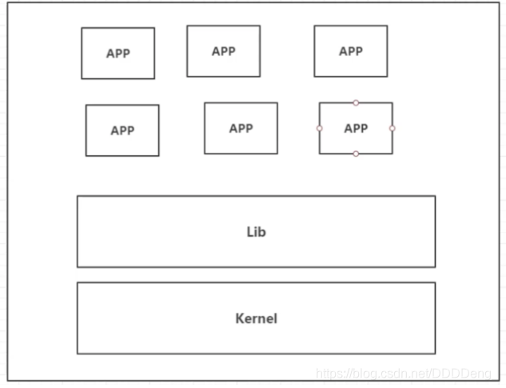

虚拟机技术的缺点：

1. 资源占用十分多
2. 冗余步骤多
3. 启动很慢

> 容器化技术

容器化技术不是模拟一个完整的操作系统

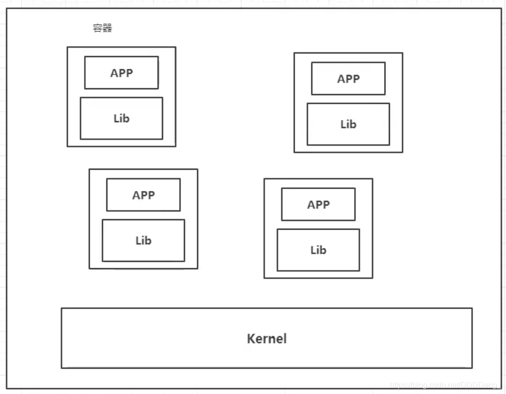

比较Docker和虚拟机技术的不同：

- 传统虚拟机，虚拟出一套硬件，运行一个完整的操作系统，然后在这个系统上安装和运行软件
- Docker容器内的应用直接运行在宿主机的内核，容器没有自己的内核，也没有虚拟我们的硬件，所以就轻便了
- 每个容器间是相互隔离，每个容器都有一个属于自己的文件系统，互不影响

> DevOps（开发、运维）

**应用更快速的交付和部署**

传统：一堆帮助文档，安装程序

Docker : 打包镜像发布测试，一键运行

**更快捷的升级和扩容**

使用了Docker之后，我们部署应用就和搭积木一样！

项目打包为一个镜像

**更简单的系统运维**

在容器化之后，我们的开发，测试环境都是高度一致的

**更高效的计算资源利用**

Docker是内核级别的虚拟化，可以在一个物理机上运行很多的容器实例，服务器的性能可以被压榨到极致。

## Docker安装

### Docker的基本组成

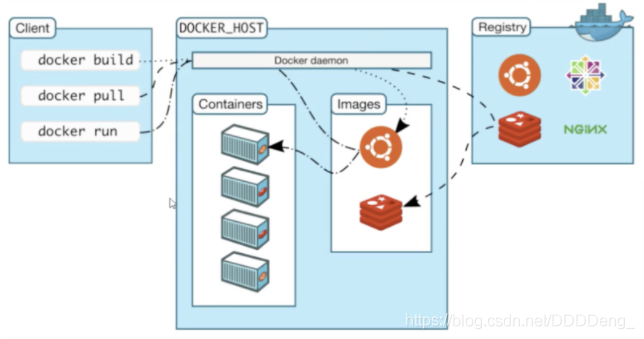

> 镜像（image）

docker镜像就好比是一个模板，可以通过这个模板来创建容器服务。

tomcat镜像 ==> run ==> tomcat容器（提供服务）

通过这个镜像可以创建多个容器（最终运行或者项目运行都是在容器中的）。

> 容器（container）

Docker利用容器技术，独立运行一个或者一组应用，是通过镜像来创建的。

有启动，停止，删除等Linux基本指令！

目前就可以把这个容器理解为一个简易的Linux系统

> 仓库（repository）

仓库就是存放镜像的地方，分为私有仓库和公有仓库；

Docker Hub（默认是国外的）

阿里云…都有容器服务器（配置镜像加速！）

### 安装Docker

> 环境查看

```bash
# 系统内核是3.10以上的
root@theSun:/# uname -r
3.10.0-957.21.3.el7.x86_64


# 系统版本
[root@AlibabaECS ~]# cat /etc/os-release 
NAME="CentOS Linux"
VERSION="7 (Core)"
ID="centos"
ID_LIKE="rhel fedora"
VERSION_ID="7"
PRETTY_NAME="CentOS Linux 7 (Core)"
ANSI_COLOR="0;31"
CPE_NAME="cpe:/o:centos:centos:7"
HOME_URL="https://www.centos.org/"
BUG_REPORT_URL="https://bugs.centos.org/"

CENTOS_MANTISBT_PROJECT="CentOS-7"
CENTOS_MANTISBT_PROJECT_VERSION="7"
REDHAT_SUPPORT_PRODUCT="centos"
REDHAT_SUPPORT_PRODUCT_VERSION="7"
```

> 安装

帮助文档：https://docs.docker.com/engine/install/centos/

```bash
# 1、卸载旧的版本
sudo yum remove docker \
                  docker-client \
                  docker-client-latest \
                  docker-common \
                  docker-latest \
                  docker-latest-logrotate \
                  docker-logrotate \
                  docker-engine
                  
# 2、需要的安装包
sudo yum install -y yum-utils

# 3、设置镜像的仓库
yum-config-manager --add-repo http://mirrors.aliyun.com/docker-ce/linux/centos/docker-ce.repo

# 更新yum软件包索引
yum makecache fast

# 4、安装docker相关的源 docker-ce 社区 ee 企业版
yum install docker-ce docker-ce-cli containerd.io

# 5、启动docker
systemctl start docker

# 6、使用docker version 查看是否安装成功

# 7、docker run hello-world

# 8、查看下载的这个 hello-world 镜像
```

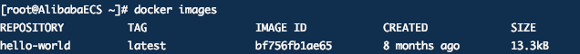

**了解：卸载docker**

```bash
# 1、依赖卸载
yum remove docker-ce docker-ce-cli containerd.io

# 2、删除资源
rm -rf /var/lib/docker

# /var/lib/docker docker的默认工作路径
```

### 阿里云镜像加速

参考：https://blog.csdn.net/wohaqiyi/article/details/89335932#commentBox

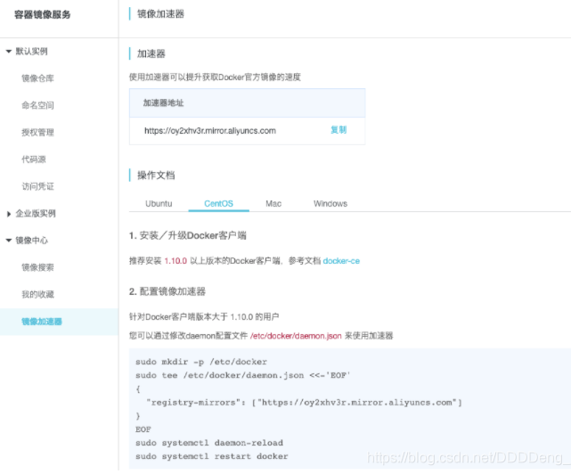

### 回顾HelloWorld流程

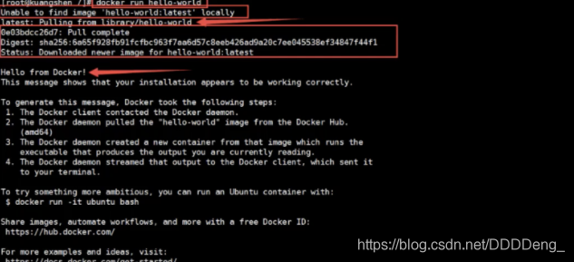


### 底层原理

**Docker是怎么工作的？**

Docker是一个Client-Server结构的系统，Docker的守护进程运行在主机上，通过Socket从客户端访问！

DockerServer接收到Docker-Client的指令，就会执行这个命令！

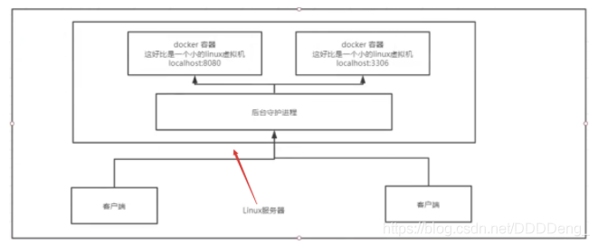

> **Docker为什么比VM快？**

1. Docker有着比虚拟机更少的抽象层
2. Docker利用的是宿主机的内核，VM需要的是Guest OS

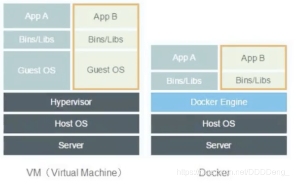

所以说，新建一个容器的时候，docker不需要像虚拟机一样重新加载一个操作系统内核，避免引导。虚拟机是加载Guset OS , 分钟级别的，而docker是利用宿主机的操作系统，省略了这个复杂的过程，秒级。

## Docker的常用命令

### 帮助命令

```shell
docker version      # 显示docker的版本信息
docker info         # 显示docker的系统信息，包括镜像和容器的数量
docker 命令 --help   # 帮助命令
```

帮助文档的地址：https://docs.docker.com/reference/

### 镜像命令

> **docker images** 查看所有本地主机上的镜像

```shell
[root@AlibabaECS ~]# docker images
REPOSITORY          TAG                 IMAGE ID            CREATED             SIZE
hello-world         latest              bf756fb1ae65        8 months ago        13.3kB

# 解释
REPOSITORY  镜像的仓库源
TAG         镜像的标签
IMAGE ID    镜像的id
CREATED     镜像的创建时间

# 可选项
	-a, --all      # 列出所有的镜像
	-q, --quiet    # 只显示镜像的id
```

> **docker search** 搜索镜像

```shell
[root@AlibabaECS ~]# docker  search mysql
NAME                              DESCRIPTION                                     STARS               OFFICIAL            AUTOMATED
mysql                             MySQL is a widely used, open-source relation…   9911  

# 可选项
--filter , -f		Filter output based on conditions provided

docker search mysql -f=stars=5000
```

> **docker pull** 下载镜像

```shell
# 下载镜像 docker pull 镜像名[:tag]
[root@AlibabaECS ~]# docker pull mysql
Using default tag: latest # 如果不写tag,默认就是latest
latest: Pulling from library/mysql 
bf5952930446: Pull complete # 分层下载，docker image的核心 联合文件系统
8254623a9871: Pull complete 
938e3e06dac4: Pull complete 
ea28ebf28884: Pull complete 
f3cef38785c2: Pull complete 
894f9792565a: Pull complete 
1d8a57523420: Pull complete 
6c676912929f: Pull complete 
ff39fdb566b4: Pull complete 
fff872988aba: Pull complete 
4d34e365ae68: Pull complete 
7886ee20621e: Pull complete 
Digest: sha256:c358e72e100ab493a0304bda35e6f239db2ec8c9bb836d8a427ac34307d074ed # 签名
Status: Downloaded newer image for mysql:latest
docker.io/library/mysql:latest # 真实地址

# 两条命令等价
docker pull mysql
docker.io/library/mysql:latest

# 指定版本下载
docker pull mysql:5.7

[root@AlibabaECS ~]# docker pull mysql:5.7
5.7: Pulling from library/mysql
bf5952930446: Already exists 
8254623a9871: Already exists 
938e3e06dac4: Already exists 
ea28ebf28884: Already exists 
f3cef38785c2: Already exists 
894f9792565a: Already exists 
1d8a57523420: Already exists 
5f09bf1d31c1: Pull complete 
1b6ff254abe7: Pull complete 
74310a0bf42d: Pull complete 
d398726627fd: Pull complete 
Digest: sha256:da58f943b94721d46e87d5de208dc07302a8b13e638cd1d24285d222376d6d84
Status: Downloaded newer image for mysql:5.7
docker.io/library/mysql:5.7

```

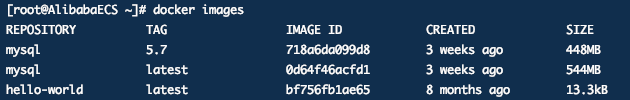

> docker rmi 删除镜像

```shell
[root@AlibabaECS ~]# docker rmi -f 容器id                # 删除指定的容器
[root@AlibabaECS ~]# docker rmi -f  容器id 容器id 容器id  # 删除多个容器
[root@AlibabaECS ~]# docker rmi -f $(docker images -aq) # 删除全部容器
```

### 容器命令

**说明：我们有了镜像才可以创建容器，linux，下载一个centos镜像来测试学习**

```shell
docker pull centos
```

> **新建容器并启动**

```bash
docker run [可选参数] image

# 参数说明
--name = "Name"    容器名字  tomcat01，tomcat02,用来区分容器
-d                 后台方式运行
-it                使用交互方式运行，进入容器查看区分
-p                 指定容器的端口 -p 8080：8080
    -p ip:主机端口：容器端口
    -p 主机端口：容器端口(常用)
    -p 容器端口
    容器端口
-p                 随机指定端口

# 测试，启动并进入容器
[root@AlibabaECS bin]# docker run -it centos /bin/bash
[root@94d468db18da /]# ls  # 查看容器内的centos，基础版本，很多命令都是不完善的！
bin  etc   lib    lost+found  mnt  proc  run   srv  tmp  var
dev  home  lib64  media       opt  root  sbin  sys  usr


# 从容器中退回主机
[root@94d468db18da /]# exit
```

> **列出所有的运行的容器**

```shell
# docker ps 命令
			 # 列出当前正在运行的容器
	-a   # 列出当前正在运行的容器+带出历史运行过的容器
  -n=? # 显示最近创建的容器
  -q   # 只显示容器的编号
```

> **退出容器**

```shell
exit            # 直接容器停止并退出
Ctrl + P + Q    # 容器不停止退出
```

> **删除容器**

```shell
docker rm 容器id                  # 删除指定容器，不能删除正在运行的容器，如果要强制删除 rm -f
docker rm -f $(docker ps -aq)    # 删除所有的容器
docker ps -aq|xargs docker rm    # 删除所有的容器

```

> **启动和停止容器的操作**

```shell
docker start 容器id        # 启动容器
docker restart 容器id      # 重启容器
docker stop 容器id         # 停止当前正在运行的容器
docker kill 容器id         # 强制停止当前容器
```

### 常用其他命令

> **后台启动容器**

```shell
# 命令 docker run -d 镜像名
[root@AlibabaECS /]# docker run -d centos

# 问题docker ps, 发现 centos 停止了

# 常见的坑, docker容器使用后台运行，就必须要有一个前台进程，docker发现没有应用，就会自动停止
# nginx,容器启动后，发现自己没有提供服务，就会立刻停止，就是没有程序了
```

> **查看日志**

```shell
docker logs -f -t --tail 容器，没有日志

# 自己编写一段shell脚本
[root@AlibabaECS /]# docker run -d centos /bin/sh -c "while true;do echo kuangshen;sleep 1;done"

# 显示日志
-tf                # 显示日志
--tail number      # 要显示的日志条数

[root@AlibabaECS /]# docker logs -ft --tail f1178d5b0bd8
```

> 查看容器中的进程信息ps

```shell
# 命令 docker top 容器id

[root@AlibabaECS /]# docker top f1178d5b0bd8
UID                 PID                 PPID                C                   STIME               TTY                 TIME                CMD
root                21626               21609               0                   while true;do echo kuangshen;sleep 1;done
root                27492               21626               0                   13:15               ?                   00:00:00            
```

> 查看镜像源数据

```shell
[root@AlibabaECS /]# docker inspect f1178d5b0bd8 
[
    {
        "Id": "f1178d5b0bd8eea4e0734056c03b35da8a829390d7000d90f863f56fe59af2a3",
        "Created": "2020-08-31T05:10:13.714768846Z",
        "Path": "/bin/sh",
        "Args": [
            "-c",
            "while true;do echo kuangshen;sleep 1;done"
        ],
        "State": {
            "Status": "running",
            "Running": true,
            "Paused": false,
            "Restarting": false,
            "OOMKilled": false,
            "Dead": false,
            "Pid": 21626,
            "ExitCode": 0,
            "Error": "",
            "StartedAt": "2020-08-31T05:10:13.994851078Z",
            "FinishedAt": "0001-01-01T00:00:00Z"
        },
        "Image": "sha256:0d120b6ccaa8c5e149176798b3501d4dd1885f961922497cd0abef155c869566",
        "ResolvConfPath": "/var/lib/docker/containers/f1178d5b0bd8eea4e0734056c03b35da8a829390d7000d90f863f56fe59af2a3/resolv.conf",
        "HostnamePath": "/var/lib/docker/containers/f1178d5b0bd8eea4e0734056c03b35da8a829390d7000d90f863f56fe59af2a3/hostname",
        "HostsPath": "/var/lib/docker/containers/f1178d5b0bd8eea4e0734056c03b35da8a829390d7000d90f863f56fe59af2a3/hosts",
        "LogPath": "/var/lib/docker/containers/f1178d5b0bd8eea4e0734056c03b35da8a829390d7000d90f863f56fe59af2a3/f1178d5b0bd8eea4e0734056c03b35da8a829390d7000d90f863f56fe59af2a3-json.log",
        "Name": "/stupefied_colden",
        "RestartCount": 0,
        "Driver": "overlay2",
        "Platform": "linux",
        "MountLabel": "",
        "ProcessLabel": "",
        "AppArmorProfile": "",
        "ExecIDs": null,
        "HostConfig": {
            "Binds": null,
            "ContainerIDFile": "",
            "LogConfig": {
                "Type": "json-file",
                "Config": {}
            },
            "NetworkMode": "default",
            "PortBindings": {},
            "RestartPolicy": {
                "Name": "no",
                "MaximumRetryCount": 0
            },
            "AutoRemove": false,
            "VolumeDriver": "",
            "VolumesFrom": null,
            "CapAdd": null,
            "CapDrop": null,
            "Capabilities": null,
            "Dns": [],
            "DnsOptions": [],
            "DnsSearch": [],
            "ExtraHosts": null,
            "GroupAdd": null,
            "IpcMode": "private",
            "Cgroup": "",
            "Links": null,
            "OomScoreAdj": 0,
            "PidMode": "",
            "Privileged": false,
            "PublishAllPorts": false,
            "ReadonlyRootfs": false,
            "SecurityOpt": null,
            "UTSMode": "",
            "UsernsMode": "",
            "ShmSize": 67108864,
            "Runtime": "runc",
            "ConsoleSize": [
                0,
                0
            ],
            "Isolation": "",
            "CpuShares": 0,
            "Memory": 0,
            "NanoCpus": 0,
            "CgroupParent": "",
            "BlkioWeight": 0,
            "BlkioWeightDevice": [],
            "BlkioDeviceReadBps": null,
            "BlkioDeviceWriteBps": null,
            "BlkioDeviceReadIOps": null,
            "BlkioDeviceWriteIOps": null,
            "CpuPeriod": 0,
            "CpuQuota": 0,
            "CpuRealtimePeriod": 0,
            "CpuRealtimeRuntime": 0,
            "CpusetCpus": "",
            "CpusetMems": "",
            "Devices": [],
            "DeviceCgroupRules": null,
            "DeviceRequests": null,
            "KernelMemory": 0,
            "KernelMemoryTCP": 0,
            "MemoryReservation": 0,
            "MemorySwap": 0,
            "MemorySwappiness": null,
            "OomKillDisable": false,
            "PidsLimit": null,
            "Ulimits": null,
            "CpuCount": 0,
            "CpuPercent": 0,
            "IOMaximumIOps": 0,
            "IOMaximumBandwidth": 0,
            "MaskedPaths": [
                "/proc/asound",
                "/proc/acpi",
                "/proc/kcore",
                "/proc/keys",
                "/proc/latency_stats",
                "/proc/timer_list",
                "/proc/timer_stats",
                "/proc/sched_debug",
                "/proc/scsi",
                "/sys/firmware"
            ],
            "ReadonlyPaths": [
                "/proc/bus",
                "/proc/fs",
                "/proc/irq",
                "/proc/sys",
                "/proc/sysrq-trigger"
            ]
        },
        "GraphDriver": {
            "Data": {
                "LowerDir": "/var/lib/docker/overlay2/00a62ec6bd23d1b97f6525f3617759eab6a0d3f283aee8b3591f5e2dbd1d916f-init/diff:/var/lib/docker/overlay2/f56573c4e87525abbd1aa5e97f8553016e5b63c6d1773169e87e0b59afc5d845/diff",
                "MergedDir": "/var/lib/docker/overlay2/00a62ec6bd23d1b97f6525f3617759eab6a0d3f283aee8b3591f5e2dbd1d916f/merged",
                "UpperDir": "/var/lib/docker/overlay2/00a62ec6bd23d1b97f6525f3617759eab6a0d3f283aee8b3591f5e2dbd1d916f/diff",
                "WorkDir": "/var/lib/docker/overlay2/00a62ec6bd23d1b97f6525f3617759eab6a0d3f283aee8b3591f5e2dbd1d916f/work"
            },
            "Name": "overlay2"
        },
        "Mounts": [],
        "Config": {
            "Hostname": "f1178d5b0bd8",
            "Domainname": "",
            "User": "",
            "AttachStdin": false,
            "AttachStdout": false,
            "AttachStderr": false,
            "Tty": false,
            "OpenStdin": false,
            "StdinOnce": false,
            "Env": [
                "PATH=/usr/local/sbin:/usr/local/bin:/usr/sbin:/usr/bin:/sbin:/bin"
            ],
            "Cmd": [
                "/bin/sh",
                "-c",
                "while true;do echo kuangshen;sleep 1;done"
            ],
            "Image": "centos",
            "Volumes": null,
            "WorkingDir": "",
            "Entrypoint": null,
            "OnBuild": null,
            "Labels": {
                "org.label-schema.build-date": "20200809",
                "org.label-schema.license": "GPLv2",
                "org.label-schema.name": "CentOS Base Image",
                "org.label-schema.schema-version": "1.0",
                "org.label-schema.vendor": "CentOS"
            }
        },
        "NetworkSettings": {
            "Bridge": "",
            "SandboxID": "d83e7bbffe1ec2f7d31fa4887e986b5e10d0ce83a1a2d2e447617511f3fe71d3",
            "HairpinMode": false,
            "LinkLocalIPv6Address": "",
            "LinkLocalIPv6PrefixLen": 0,
            "Ports": {},
            "SandboxKey": "/var/run/docker/netns/d83e7bbffe1e",
            "SecondaryIPAddresses": null,
            "SecondaryIPv6Addresses": null,
            "EndpointID": "310a86df2f690f9358063ad5ac71ec98eb16a7eab51e13f0e8f2b9ebe5239ea9",
            "Gateway": "172.17.0.1",
            "GlobalIPv6Address": "",
            "GlobalIPv6PrefixLen": 0,
            "IPAddress": "172.17.0.2",
            "IPPrefixLen": 16,
            "IPv6Gateway": "",
            "MacAddress": "02:42:ac:11:00:02",
            "Networks": {
                "bridge": {
                    "IPAMConfig": null,
                    "Links": null,
                    "Aliases": null,
                    "NetworkID": "04038c2f1d641f91c97253ba1e8dfc890f6a9846ba6cb7ea66235079d138c319",
                    "EndpointID": "310a86df2f690f9358063ad5ac71ec98eb16a7eab51e13f0e8f2b9ebe5239ea9",
                    "Gateway": "172.17.0.1",
                    "IPAddress": "172.17.0.2",
                    "IPPrefixLen": 16,
                    "IPv6Gateway": "",
                    "GlobalIPv6Address": "",
                    "GlobalIPv6PrefixLen": 0,
                    "MacAddress": "02:42:ac:11:00:02",
                    "DriverOpts": null
                }
            }
        }
    }
]

```

> **进入当前正在运行的容器**

```shell
# 我们通常都是使用后台方式运行的，需要进入容器，修改一些配置

# 命令
docker exec -it 容器id baseShell

# 测试
[root@AlibabaECS ~]# docker ps
CONTAINER ID        IMAGE               COMMAND                  CREATED             STATUS              PORTS               NAMES
f1178d5b0bd8        centos              "/bin/sh -c 'while t…"   2 hours ago         Up 2 hours                              stupefied_colden
[root@AlibabaECS ~]# docker exec -it f1178d5b0bd8 /bin/bash
[root@f1178d5b0bd8 /]# ls
bin  etc   lib    lost+found  mnt  proc  run   srv  tmp  var
dev  home  lib64  media       opt  root  sbin  sys  usr
[root@f1178d5b0bd8 /]# ps -ef
UID        PID  PPID  C STIME TTY          TIME CMD
root         1     0  0 05:10 ?        00:00:02 /bin/sh -c while true;do echo kuangshen;sleep 1;done
root      8869     0  0 07:38 pts/0    00:00:00 /bin/bash
root      8887     1  0 07:38 ?        00:00:00 /usr/bin/coreutils --coreutils-prog-shebang=sleep /usr/bin/
root      8888  8869  0 07:38 pts/0    00:00:00 ps -ef

# 方式二
docker attach 容器id

# 测试
[root@AlibabaECS ~]# docker attach f1178d5b0bd8
正在执行当前的代码...

# docker exec        # 进入容器后开启一个新的终端，可以在里面操作(常用)
# docker attach      # 进入容器正在执行的终端，不会启动新的进程
```

> **从容器内拷贝到主机上**

```shell
# 命令
docker cp [r] 容器id :容器内路径 目的地主机路径
# 参数r : 递归拷贝
# 测试
[root@AlibabaECS home]# docker cp a485a9d900b4:/home/test.java /home
```

### 小结


### 作业练习

- 安装Nginx
- 安装Tomcat
- 安装ES + Kibana

> Docker安装Nginx

```shell
# 1. 搜索镜像 search 建议大家去docker搜索，可以看到帮助文档
# 2. 下载镜像 pull
# 3. 运行测试

[root@AlibabaECS home]# docker images
REPOSITORY          TAG                 IMAGE ID            CREATED             SIZE
nginx               latest              4bb46517cac3        2 weeks ago         133MB
centos              latest              0d120b6ccaa8        2 weeks ago         215MB

# -d       后台运行
# --name   给容器命名
# -p       宿主机端口：容器内部端口
[root@AlibabaECS home]# docker run -d --name nginx01 -p 3344:80 nginx

[root@AlibabaECS home]# docker ps
CONTAINER ID        IMAGE               COMMAND                  CREATED             STATUS              PORTS                  NAMES
a88edcdfa2e6        nginx               "/docker-entrypoint.…"   8 minutes ago       Up 8 minutes        0.0.0.0:3344->80/tcp   nginx01

[root@AlibabaECS home]# curl localhost:3344
```

**端口暴露的概念：**

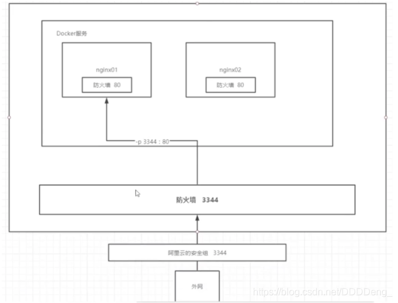

思考问题：

我们每次改动nginx配置文件，都需要进入容器内部，十分的麻烦。我们要是可以在容器外部提供一个映射路径，达到在容器修改文件名，容器内部都可以修改。-v

> Docker 安装Tomcat

```shell
# 官方的使用
docker run -it --rm tomcat:9.0

# 我们之前的启动都是后台，停止了容器之后，容器还是可以查到 docker run -it --rm, 一般用来测试，用完就删除

# 下载再启动
docker pull tomcat

# 启动运行
docker run -d -p 3355:8080 --name tomcat01 tomcat

# 测试访问没有问题

# 进入容器
[root@AlibabaECS ~]# docker exec -it tomcat01 /bin/bash

# 发现问题：1、linux命令少了，2、没有webapps; 阿里云镜像的原因，默认是最小的镜像，所以没必要都剔除掉
# 保证最小可运行的环境
```

**思考问题：**

我们以后要部署项目，如果每次都要进入容器是不是十分麻烦？我要是可以在容器外部提供一个映射路径，webapps，我们在外部放置项目，就自动同步到内部就好了。

> 部署ES + Kibana

```shell
# es 暴露的端口很多
# es 十分的耗内存
# es 的数据一般需要放置到安全目录！ 挂载
# --net somework ? 网络配置

# 启动 elasticsearch
docker run -d --name elasticsearch -p 9200:9300 -e "discovery.type=single-node" elasticsearch:7.6.2

# 启动了 linux就卡住了

# 赶紧关闭，增加内存的限制，修改配置文件 -e 环境配置修改
docker run -d --name elasticsearch02 -p 9200:9300 -e "discovery.type=single-node" -e ES_JAVA_OPTS="-Xms64m -Xmx512m" elasticsearch:7.6.2

# 查看 docker stats
```

**作业：**

使用kibana连接es? 思考网络如何才能连接过去？

[外链图片转存失败,源站可能有防盗链机制,建议将图片保存下来直接上传(img-uwRRTKvP-1599294536743)(图片/狂神说 Docker/image-20200831204651402.png)]

### 可视化

- portainer（先用这个）

  ```shell
  docker run -d -p 8088:9000 \ > --restart=always -v /var/run/docker.sock:/var/run/docker.sock --privileged=true portainer/portainer
  ```

- Rancher（CI/CD再用）

**什么是 portainer ?**

Docker图形化管理工具，提供一个后台面板供我们操作！

```shell
docker run -d -p 8088:9000 \
--restart=always -v /var/run/docker.sock:/var/run/docker.sock --privileged=true portainer/portainer
```

![[外链图片转存失败,源站可能有防盗链机制,建议将图片保存下来直接上传(img-qwr01JIW-1599294536744)(图片/狂神说 Docker/image-20200831212404814.png)]](img/20200905204029772.png)

## Docker镜像讲解

### 镜像是什么

镜像是一种轻量级、可执行的独立软件包，用来打包软件运行环境和基于运行环境开发的软件，他包含运行某个软件所需的所有内容，包括代码、运行时库、环境变量和配置文件。

所有的应用，直接打包docker镜像，就可以直接跑起来！

如何得到镜像：

- 从远程仓库下载
- 拷贝
- 自己制作一个镜像 DockerFile

### Docker镜像加载原理

> UnionFs （联合文件系统)

UnionFs（联合文件系统）：Union文件系统（UnionFs）是一种分层、轻量级并且高性能的文件系统，他支持对文件系统的修改作为一次提交来一层层的叠加，同时可以将不同目录挂载到同一个虚拟文件系统下（ unite several directories into a single virtual filesystem)。Union文件系统是 Docker镜像的基础。镜像可以通过分层来进行继承，基于基础镜像（没有父镜像），可以制作各种具体的应用镜像
特性：一次同时加载多个文件系统，但从外面看起来，只能看到一个文件系统，联合加载会把各层文件系统叠加起来，这样最终的文件系统会包含所有底层的文件和目录

> Docker镜像加载原理

docker的镜像实际上由一层一层的文件系统组成，这种层级的文件系统UnionFS。
boots(boot file system）主要包含 bootloader和 Kernel, bootloader主要是引导加 kernel, Linux刚启动时会加载bootfs文件系统，在 Docker镜像的最底层是 bootfs。这一层与我们典型的Linux/Unix系统是一样的，包含boot加载器和内核。当boot加载完成之后整个内核就都在内存中了，此时**内存的使用权**已由 bootfs转交给内核，此时系统也会卸载bootfs。
rootfs（root file system),在 bootfs之上。包含的就是典型 Linux系统中的/dev,/proc,/bin,/etc等标准目录和文件。 rootfs就是各种不同的操作系统发行版，比如 Ubuntu, Centos等等。

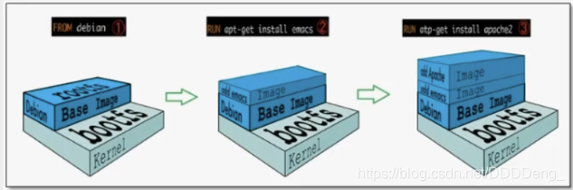

平时我们安装进虚拟机的CentOS都是好几个G，为什么Docker这里才200M？

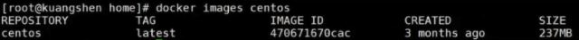

对于一个精简的OS,rootfs可以很小，只需要包合最基本的命令，工具和程序库就可以了，因为底层直接用Host的kernel，自己只需要提供rootfs就可以了。

**由此可见对于不同的Linux发行版， boots基本是一致的， rootfs会有差別，因此不同的发行版可以公用bootfs.**

虚拟机是分钟级别，容器是秒级！

### 分层理解

> 分层的镜像

我们可以去下载一个镜像，注意观察下载的日志输出，可以看到是一层层的在下载

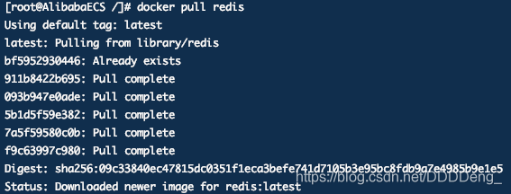

**思考：**

**为什么Docker镜像要采用这种分层的结构呢？**

最大的好处，我觉得莫过于资源共享了！比如有多个镜像都从相同的Base镜像构建而来，那么宿主机只需在磁盘上保留一份base镜像，同时内存中也只需要加载一份base镜像，这样就可以为所有的容器服务了，而且镜像的每一层都可以被共享。

查看镜像分层的方式可以通过docker image inspect name命令

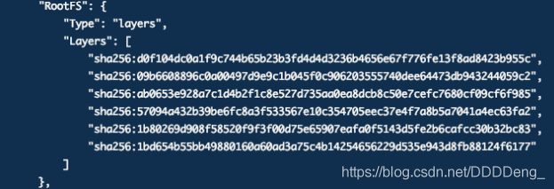

**理解：**

 所有的 Docker镜像都起始于一个基础镜像层，当进行修改或培加新的内容时，就会在当前镜像层之上，创建新的镜像层。

举一个简单的例子，假如基于 Ubuntu Linux16.04创建一个新的镜像，这就是新镜像的第一层；如果在该镜像中添加 Python包，
就会在基础镜像层之上创建第二个镜像层；如果继续添加一个安全补丁，就会创健第三个镜像层该像当前已经包含3个镜像层，如下图所示（这只是一个用于演示的很简单的例子）。

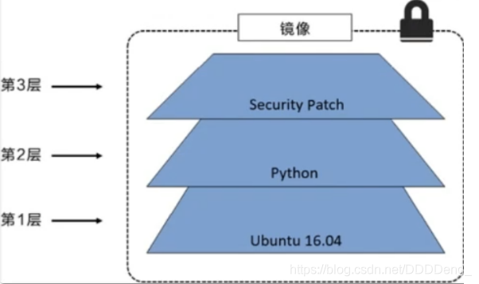

 在添加额外的镜像层的同时，镜像始终保持是当前所有镜像的组合，理解这一点非常重要。下图中举了一个简单的例子，每个镜像层包含3个文件，而镜像包含了来自两个镜像层的6个文件。

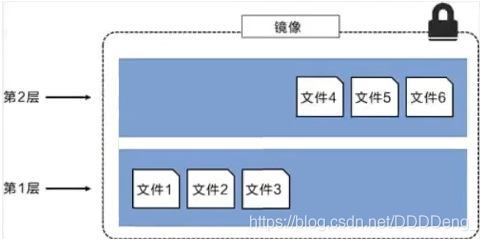

 上图中的镜像层跟之前图中的略有区別，主要目的是便于展示文件
下图中展示了一个稍微复杂的三层镜像，在外部看来整个镜像只有6个文件，这是因为最上层中的文件7是文件5的一个更新版
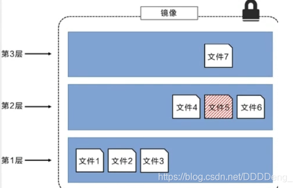

 这种情況下，上层镜像层中的文件覆盖了底层镜像层中的文件。这样就使得文件的更新版本作为一个新镜像层添加到镜像当中

Docker通过存储引擎（新版本采用快照机制）的方式来实现镜像层堆栈，并保证多镜像层对外展示为统一的文件系统

Linux上可用的存储引撃有AUFS、 Overlay2、 Device Mapper、Btrfs以及ZFS。顾名思义，每种存储引擎都基于 Linux中对应的件系统或者块设备技术，井且每种存储引擎都有其独有的性能特点。

Docker在 Windows上仅支持 windowsfilter 一种存储引擎，该引擎基于NTFS文件系统之上实现了分层和CoW [1]。

下图展示了与系统显示相同的三层镜像。所有镜像层堆并合井，对外提供统一的视图

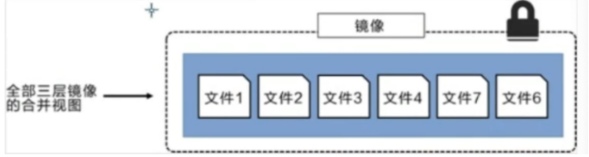

> 特点

**Docker 镜像都是只读的**，当容器启动时，一个新的可写层加载到镜像的顶部！

这一层就是我们通常说的容器层，容器之下的都叫镜像层！

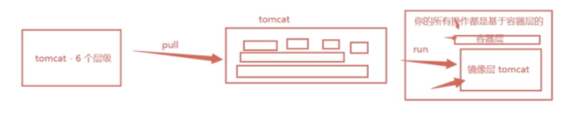

### commit镜像

```shell
docker commit 提交容器成为一个新的副本

# 命令和git原理类似
docker commit -m="描述信息" -a="作者" 容器id 目标镜像名:[TAG]
```

**实战测试:**

```shell
# 1、启动一个默认的tomcat
docker run -d -p 8080:8080 tomcat
# 2、发现这个默认的tomcat 是没有webapps应用，官方的镜像默认webapps下面是没有文件的！
docker exec -it 容器id
# 3、拷贝文件进去

# 4、将操作过的容器通过commit调教为一个镜像！我们以后就使用我们修改过的镜像即可，这就是我们自己的一个修改的镜像。
docker commit -m="描述信息" -a="作者" 容器id 目标镜像名:[TAG]
docker commit -a="kuangshen" -m="add webapps app" 容器id tomcat02:1.0
```

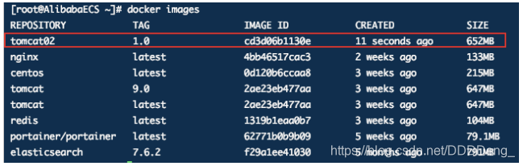

如果你想要保存当前容器的状态，就可以通过commit来提交，获得一个镜像，就好比我们我们使用虚拟机的快照。

入门成功！！！！

## Docker进阶

### 容器数据卷

#### 什么是容器数据卷

**docker的理念回顾**

将应用和环境打包成一个镜像！

数据？如果数据都在容器中，那么我们容器删除，数据就会丢失！需求：数据可以持久化

MySQL，容器删除了，删库跑路！需求：MySQL数据可以存储在本地！

容器之间可以有一个数据共享的技术！Docker容器中产生的数据，同步到本地！

这就是卷技术！目录的挂载，将我们容器内的目录，挂载到Linux上面！

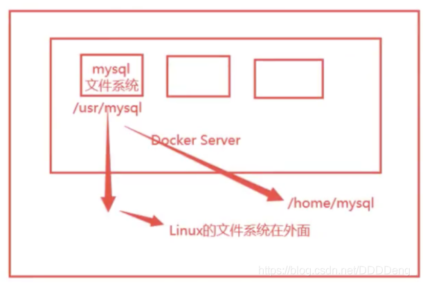

**总结一句话：容器的持久化和同步操作！容器间也是可以数据共享的！**

#### 使用数据卷

> 方式一：直接使用命令来挂载 -v

```shell
docker run -it -v 主机目录:容器内目录

# 测试
[root@AlibabaECS home]# docker run -it -v /home/ceshi:/home centos /bin/bash

# #通过 docker inspect 容器id 查看
```

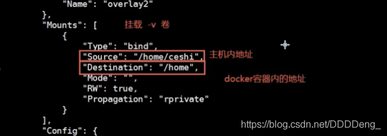

测试文件的同步

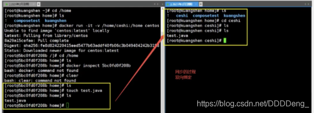

再来测试;

1. 停止容器

2. 宿主机上修改文件

3. 容器启动

   ```shell
   docker attach 容器id
   ```

4. 容器内的数据依旧是同步的

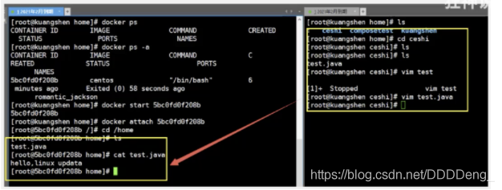

好处：我们以后修改只需要在本地修改即可，容器内会自动同步！

#### 实战：安装MySQL

思考：MySQL的数据持久化问题

```shell
# 获取镜像
[root@AlibabaECS home]# docker pull mysql:5.7

# 运行容器,需要做数据挂载！ # 安装启动mysql, 需要配置密码的，这是要注意的点！
# 参考官网hub 
docker run --name some-mysql -e MYSQL_ROOT_PASSWORD=my-secret-pw -d mysql:tag

# 启动我们的
-d 后台运行
-p 端口映射
-v 卷挂载
-e 环境配置
--name 容器名字

[root@AlibabaECS home]# docker run -d -p 3310:3306 -v /home/mysql/conf:/etc/mysql/conf.d -v /home/mysql/data:/var/lib/mysql -e MYSQL_ROOT_PASSWORD=123456 --name mysql01 mysql:5.7

# 启动成功之后，我们使用本地Navicat连接测试

# 在本地测试创建一个数据库，查看一下我们映射的路径是否ok！
```

假设我们将容器删除

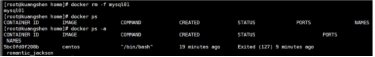

发现，我们挂载到本地的数据卷依旧没有丢失，这就实现了容器数据持久化功能。

#### 具名和匿名挂载

```shell
# 匿名挂载
-v 容器内路径!
docker run -d -P --name nginx01 -v /etc/nginx nginx

# 查看所有的volume的情况
➜  ~ docker volume ls    
DRIVER              VOLUME NAME
local               33ae588fae6d34f511a769948f0d3d123c9d45c442ac7728cb85599c2657e50d
local            
# 这里发现，这种就是匿名挂载，我们在 -v只写了容器内的路径，没有写容器外的路劲！

# 具名挂载
➜  ~ docker run -d -P --name nginx02 -v juming-nginx:/etc/nginx nginx
➜  ~ docker volume ls                  
DRIVER              VOLUME NAME
local               juming-nginx

# 通过 -v 卷名：容器内路径
# 查看一下这个卷
```

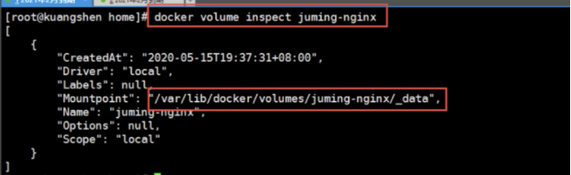

所有的docker容器内的卷，没有指定目录的情况下都是在`/var/lib/docker/volumes/xxxx/_data`下；

我们可以通过具名挂载方便的找到一个卷，大多情况下在使用`具名挂载`

```shell
# 三种挂载： 匿名挂载、具名挂载、指定路径挂载
-v 容器内路径			#匿名挂载
-v 卷名：容器内路径		#具名挂载
-v /宿主机路径：容器内路径 #指定路径挂载 docker volume ls 是查看不到的
```

拓展：

```shell
# 通过 -v 容器内路径： ro rw 改变读写权限
ro #readonly 只读
rw #readwrite 可读可写
docker run -d -P --name nginx05 -v juming:/etc/nginx:ro nginx
docker run -d -P --name nginx05 -v juming:/etc/nginx:rw nginx

# ro 只要看到ro就说明这个路径只能通过宿主机来操作，容器内部是无法操作！
```

#### 初识Dockfile

Dockerfile 就是用来构建 docker 镜像的构建文件！命令脚本！先体验一下！

通过这个脚本可以生成镜像，镜像是一层一层的，脚本是一个个的命令，每个命令都是一层！

```shell
# 创建一个dockerfile文件，名字可以随便 建议Dockerfile
# 文件中的内容 指令(大写) 参数
FROM centos

VOLUME ["volume01","volume02"]

CMD echo "----end----"
CMD /bin/bash
#这里的每个命令，就是镜像的一层！
```

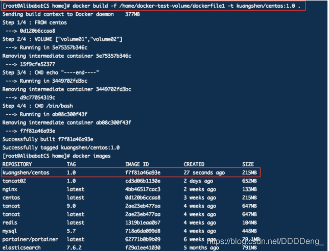

```shell
启动自己写的容器
```

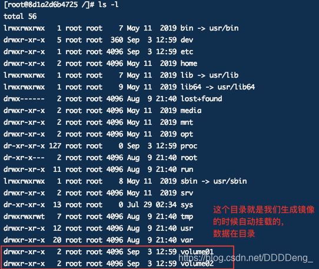

```shell
查看一下卷挂载的路径
```

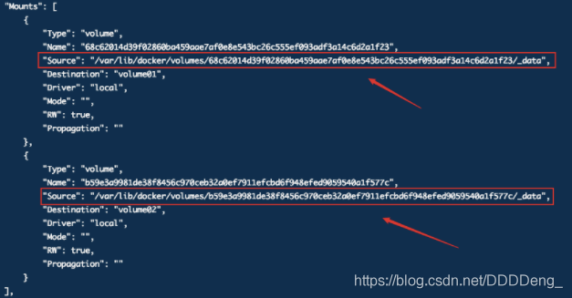

测试一下刚才的文件是否同步出去了！

这种方式使用的十分多，因为我们通常会构建自己的镜像！

假设构建镜像时候没有挂载卷，要手动镜像挂载 -v 卷名：容器内路径！

#### 数据卷容器

多个mysql同步数据！

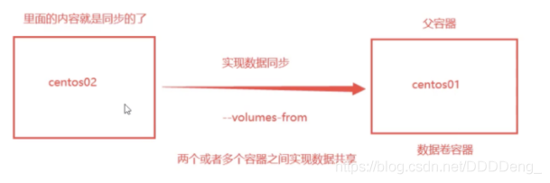

```shell
启动三个容器，通过我们刚才自己的写镜像启动
```

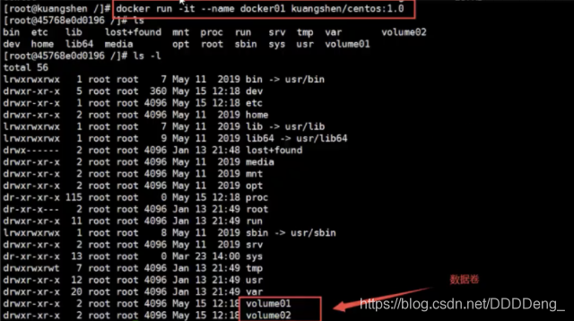

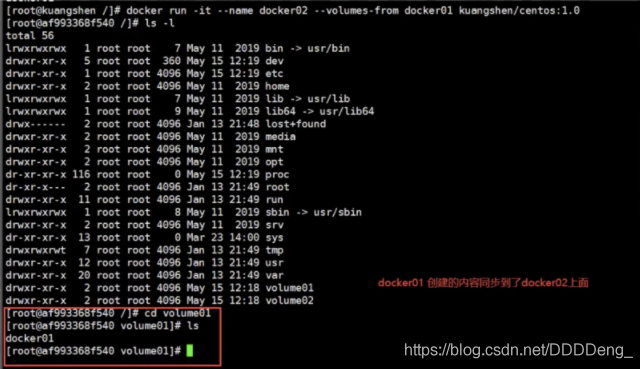

```shell
# 测试：可以删除docker01，查看一下docker02和docker03是否可以访问这个文件
# 测试依旧可以访问
```

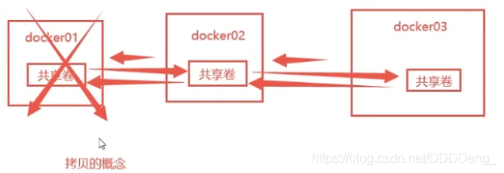

多个mysql实现数据共享

```shell
➜  ~ docker run -d -p 3306:3306 -v /home/mysql/conf:/etc/mysql/conf.d -v /home/mysql/data:/var/lib/mysql -e MYSQL_ROOT_PASSWORD=123456 --name mysql01 mysql:5.7
➜  ~ docker run -d -p 3307:3306 -e MYSQL_ROOT_PASSWORD=123456 --name mysql02 --volumes-from mysql01  mysql:5.7
# 这个时候，可以实现两个容器数据同步！
```

**结论：**

容器之间的配置信息的传递，数据卷容器的生命周期一直持续到没有容器使用为止。

但是一旦你持久化到了本地，这个时候，本地的数据是不会删除的！

### DockerFile

#### DockerFile介绍

`dockerfile`是用来构建docker镜像的文件！命令参数脚本！

构建步骤：

1. 编写一个dockerfile文件
2. docker build 构建称为一个镜像
3. docker run运行镜像
4. docker push发布镜像（DockerHub 、阿里云仓库)

------

**查一下官方是怎么做的？**

[外链图片转存失败,源站可能有防盗链机制,建议将图片保存下来直接上传(img-RWQv9f4x-1599294536769)(图片/狂神说 Docker/image-20200904102455535.png)]

[外链图片转存失败,源站可能有防盗链机制,建议将图片保存下来直接上传(img-ymJoHjy5-1599294536771)(图片/狂神说 Docker/image-20200904102534005.png)]

很多官方镜像都是基础包，很多功能没有，我们通常会自己搭建自己的镜像！

官方既然可以制作镜像，那我们也可以！

#### DockerFile构建过程

**基础知识：**

1. 每个保留关键字（指令）都必须是大写字母
2. 执行从上到下顺序执行
3. /# 表示注释
4. 每一个指令都会创建提交一个新的镜像层，并提交！

[外链图片转存失败,源站可能有防盗链机制,建议将图片保存下来直接上传(img-HAO69W0r-1599294536772)(图片/狂神说 Docker/image-20200904103124656.png)]

dockerfile是面向开发的，我们以后要发布项目，做镜像，就需要编写dockerfile文件，这个文件十分简单！

Docker镜像逐渐成为企业交付的标准，必须要掌握！

> 步骤：开发，部署，运维

DockerFile : 构建文件，定义了一切的步骤，源代码

DockerImages ： 通过DokerFile构建生成的镜像，是最终发布和运行的产品

Docker容器：容器就是镜像运行起来提供服务器

#### DockerFile的指令

以前我们使用别人的，现在我们知道了这些指令之后，我们来练习自己写一个镜像！

```shell
FROM				# 基础镜像，一切从这里开始构建
MAINTAINER	# 镜像是谁写的， 姓名+邮箱
RUN					# 镜像构建的时候需要运行的命令
ADD					# 步骤，tomcat镜像，这个tomcat压缩包！添加内容 添加同目录
WORKDIR			# 镜像的工作目录
VOLUME			# 挂载的目录
EXPOSE			# 保留端口配置
CMD					# 指定这个容器启动的时候要运行的命令，只有最后一个会生效，可被替代。
ENTRYPOINT	# 指定这个容器启动的时候要运行的命令，可以追加命令
ONBUILD			# 当构建一个被继承 DockerFile 这个时候就会运行ONBUILD的指令，触发指令。
COPY				# 类似ADD，将我们文件拷贝到镜像中
ENV					# 构建的时候设置环境变量！
```

[外链图片转存失败,源站可能有防盗链机制,建议将图片保存下来直接上传(img-RtJJgn5S-1599294536773)(图片/狂神说 Docker/image-20200904104606444.png)]

#### 实战测试

> 创建一个自己的centos

```shell
# 1.编写Dockerfile的文件
FROM centos
MAINTAINER dainel<dlgnjupt@qq.com>

ENV MYPATH /usr/local
WORKDIR $MYPATH

RUN yum -y install vim
RUN yum -y install net-tools

EXPOSE 80

CMD echo $MYPATH
CMD echo "-----end----"
CMD /bin/bash

# 2.通过这个文件构建镜像
# 命令 docker build -f 文件路径 -t 镜像名:[tag] .
docker build -f mydockerfile-centos -t mycentos:0.1 .

Successfully built 4af56313b71a
Successfully tagged mycentos:0.1

# 3.测试运行
```

对比：之前原生的centos

[外链图片转存失败,源站可能有防盗链机制,建议将图片保存下来直接上传(img-N2jO7YG1-1599294536774)(图片/狂神说 Docker/image-20200904142059464.png)]

我们增加后的镜像：

[外链图片转存失败,源站可能有防盗链机制,建议将图片保存下来直接上传(img-aRgDDLmL-1599294536775)(图片/狂神说 Docker/image-20200904142143624.png)]

我们可以列出本地进行的变更历史

[外链图片转存失败,源站可能有防盗链机制,建议将图片保存下来直接上传(img-cNBZamnn-1599294536777)(图片/狂神说 Docker/image-20200904143446546.png)]

我们平时拿到一个镜像，可以研究一下它是怎么做的

> CMD 和 ENTRYPOINT区别

```shell
CMD					# 指定这个容器启动的时候要运行的命令，只有最后一个会生效，可被替代。
ENTRYPOINT			# 指定这个容器启动的时候要运行的命令，可以追加命令
```

**测试cmd**

```shell
# 编写dockerfile文件
$ vim dockerfile-test-cmd
FROM centos
CMD ["ls","-a"]
# 构建镜像
$ docker build  -f dockerfile-test-cmd -t cmd-test:0.1 .
# 运行镜像
$ docker run cmd-test:0.1
.
..
.dockerenv
bin
dev

# 想追加一个命令  -l 成为ls -al
$ docker run cmd-test:0.1 -l
docker: Error response from daemon: OCI runtime create failed: container_linux.go:349: starting container process caused "exec: \"-l\":
 executable file not found in $PATH": unknown.
ERRO[0000] error waiting for container: context canceled 
# cmd的情况下 -l 替换了CMD["ls","-l"]。 -l  不是命令所有报错
```

**测试ENTRYPOINT**

```shell
# 编写dockerfile文件
$ vim dockerfile-test-entrypoint
FROM centos
ENTRYPOINT ["ls","-a"]
$ docker run entrypoint-test:0.1
.
..
.dockerenv
bin
dev
etc
home
lib
lib64
lost+found ...
# 我们的命令，是直接拼接在我们得ENTRYPOINT命令后面的
$ docker run entrypoint-test:0.1 -l
total 56
drwxr-xr-x   1 root root 4096 May 16 06:32 .
drwxr-xr-x   1 root root 4096 May 16 06:32 ..
-rwxr-xr-x   1 root root    0 May 16 06:32 .dockerenv
lrwxrwxrwx   1 root root    7 May 11  2019 bin -> usr/bin
drwxr-xr-x   5 root root  340 May 16 06:32 dev
drwxr-xr-x   1 root root 4096 May 16 06:32 etc
drwxr-xr-x   2 root root 4096 May 11  2019 home
lrwxrwxrwx   1 root root    7 May 11  2019 lib -> usr/lib
lrwxrwxrwx   1 root root    9 May 11  2019 lib64 -> usr/lib64 ....
```

Dockerfile中很多命令都十分的相似，我们需要了解它们的区别，我们最好的学习就是对比他们然后测试效果！

#### 实战: Tomcat镜像

1. 准备镜像文件 tomcat压缩包，jdk压缩包

   [外链图片转存失败,源站可能有防盗链机制,建议将图片保存下来直接上传(img-aPZwW7tU-1599294536778)(图片/狂神说 Docker/image-20200904151322505.png)]

2. 编写dockerfile文件，官方命名`Dockerfile`，build会自动寻找这个文件，就不需要-f指定了！

   ```shell
   FROM centos
   MAINTAINER daniel<dlqnjupt@qq.com>
   
   COPY readme.txt /usr/local/readme.txt
   
   ADD jdk-8u261-linux-x64.rpm /usr/local
   ADD apache-tomcat-9.0.37.tar.gz /usr/local
   
   RUN yum -y install vim
   
   ENV MYPATH /usr/local
   WORKDIR $MYPATH
   
   ENV JAVA_HOME /usr/local/jdk1.8.0_11
   ENV CLASSPATH $JAVA_HOME/lib/dt.jar:$JAVA_HOME/lib/tools.jar
   ENV CATALINA_HOME /usr/local/apache-tomcat-9.0.37
   ENV CATALINA_BASH /usr/local/apache-tomcat-9.0.37
   ENV PATH $PATH:$JAVA_HOME/bin:$CATALINA_HOME/lib:$CATALINA_HOME/bin
   
   EXPOSE 8080
   
   CMD /usr/local/apache-tomcat-9.0.37/bin/startup.sh && tail -F /usr/local/apache-tomcat-9.0.37/bin/logs/catalina.out
   ```

   带注释

   ```shell
   FROM centos #
   MAINTAINER cheng<1204598429@qq.com>
   COPY README /usr/local/README #复制文件
   ADD jdk-8u231-linux-x64.tar.gz /usr/local/ #复制解压
   ADD apache-tomcat-9.0.35.tar.gz /usr/local/ #复制解压
   RUN yum -y install vim
   ENV MYPATH /usr/local #设置环境变量
   WORKDIR $MYPATH #设置工作目录
   ENV JAVA_HOME /usr/local/jdk1.8.0_231 #设置环境变量
   ENV CATALINA_HOME /usr/local/apache-tomcat-9.0.35 #设置环境变量
   ENV PATH $PATH:$JAVA_HOME/bin:$CATALINA_HOME/lib #设置环境变量 分隔符是：
   EXPOSE 8080 #设置暴露的端口
   CMD /usr/local/apache-tomcat-9.0.35/bin/startup.sh && tail -F /usr/local/apache-tomcat-9.0.35/logs/catalina.out # 设置默认命令
   ```

3. 构建镜像

   ```shell
   # 因为dockerfile命名使用默认命名 因此不用使用-f 指定文件
   [root@AlibabaECS tomcat]# docker build -t diytomcat .
   ```

4. run镜像

   ```shell
   [root@AlibabaECS tomcat]# docker run -d -p 9090:8080 --name kuangshentomcat -v /home/deng/build/tomcat/test:/url/local/apache-tomcat-9.0.37/webapps/test -v /home/deng/build/tomcat/tomcatlogs/:/usr/local/apache-tomcat-9.0.37/logs diytomcat
   ```

5. 访问测试

6. 发布项目（由于做了卷挂载，我们直接在本地编写项目就可以发布了！）

   **发现：项目部署成功，可以直接访问！**

 我们以后开发的步骤：需要掌握Dockerfile的编写！我们之后的一切都是使用docker镜像来发布运行！

#### 发布自己的镜像

> Dockerhub

1、地址 https://hub.docker.com/

2、确定这个账号可以登录

3、登录

```shell
$ docker login --help
Usage:  docker login [OPTIONS] [SERVER]

Log in to a Docker registry.
If no server is specified, the default is defined by the daemon.

Options:
  -p, --password string   Password
      --password-stdin    Take the password from stdin
  -u, --username string   Username
```

4、提交 push镜像

[外链图片转存失败,源站可能有防盗链机制,建议将图片保存下来直接上传(img-oausk0Re-1599294536779)(图片/狂神说 Docker/image-20200904171048087.png)]

```shell
# 会发现push不上去，因为如果没有前缀的话默认是push到 官方的library
# 解决方法
# 第一种 build的时候添加你的dockerhub用户名，然后在push就可以放到自己的仓库了
$ docker build -t chengcoder/mytomcat:0.1 .
# 第二种 使用docker tag #然后再次push
$ docker tag 容器id chengcoder/mytomcat:1.0 #然后再次push
```

> 阿里云镜像服务器上

1. 看官网 很详细https://cr.console.aliyun.com/repository/登录阿里云
2. 找到容器镜像服务
3. 创建命名空间
4. 创建容器镜像
5. 浏览阿里云

#### 小结

[外链图片转存失败,源站可能有防盗链机制,建议将图片保存下来直接上传(img-NNOHLPUy-1599294536780)(图片/狂神说 Docker/image-20200905093953643.png)]

### Docker网络

#### 理解Docker0

清空所有环境

> 测试

[外链图片转存失败,源站可能有防盗链机制,建议将图片保存下来直接上传(img-PhVFiLvT-1599294536781)(图片/狂神说 Docker/image-20200905100003914.png)]

三个网络

```shell
# 问题： docker 是如何处理容器网络访问的？
```

[外链图片转存失败,源站可能有防盗链机制,建议将图片保存下来直接上传(img-3dYMrf2W-1599294536782)(图片/狂神说 Docker/image-20200905100247145.png)]

```shell
# [root@AlibabaECS ~]# docker run -d -P --name tomcat01 tomcat

# 查看容器的内部网络地址 ip addr , 发现容器启动的时候会得到一个 eth0@if83 ip地址，docker分配的

[root@AlibabaECS ~]# docker exec -it tomcat01 ip addr
1: lo: <LOOPBACK,UP,LOWER_UP> mtu 65536 qdisc noqueue state UNKNOWN group default qlen 1000
    link/loopback 00:00:00:00:00:00 brd 00:00:00:00:00:00
    inet 127.0.0.1/8 scope host lo
       valid_lft forever preferred_lft forever
82: eth0@if83: <BROADCAST,MULTICAST,UP,LOWER_UP> mtu 1500 qdisc noqueue state UP group default 
    link/ether 02:42:ac:11:00:02 brd ff:ff:ff:ff:ff:ff link-netnsid 0
    inet 172.17.0.2/16 brd 172.17.255.255 scope global eth0
       valid_lft forever preferred_lft forever
[root@AlibabaECS ~]# 

# 思考：linux能不能 ping 通容器内部
[root@AlibabaECS ~]# ping 172.17.0.2
PING 172.17.0.2 (172.17.0.2) 56(84) bytes of data.
64 bytes from 172.17.0.2: icmp_seq=1 ttl=64 time=0.086 ms
64 bytes from 172.17.0.2: icmp_seq=2 ttl=64 time=0.068 ms
64 bytes from 172.17.0.2: icmp_seq=3 ttl=64 time=0.064 ms

# linux可以 ping 通 docker 容器内部
```

> 原理

1. 我们每启动一个docker容器，docker就会给docker容器分配一个ip，我们只要按照了docker，就会有一个docker0桥接模式，使用的技术是veth-pair技术！

   再次测试ip add

[外链图片转存失败,源站可能有防盗链机制,建议将图片保存下来直接上传(img-Bbb2waI2-1599294536783)(图片/狂神说 Docker/image-20200905101616595.png)]

1. 再启动一个容器

[外链图片转存失败,源站可能有防盗链机制,建议将图片保存下来直接上传(img-9xZPyqr3-1599294536784)(图片/狂神说 Docker/image-20200905101817237.png)]

```shell
# 我们发现这个容器带来网卡，都是一对对的
# veth-pair 就是一对的虚拟设备接口，他们都是成对出现的，一端连着协议，一端彼此相连
# 正因为有这个特性 veth-pair 充当一个桥梁，连接各种虚拟网络设备的
# OpenStac,Docker容器之间的连接，OVS的连接，都是使用evth-pair技术
```

1. 我们来测试一下 tomcat1 和 tomcat2 是否可以ping 通

```shell
[root@AlibabaECS ~]# docker exec -it tomcat02 ping 172.17.0.3
PING 172.17.0.3 (172.17.0.3) 56(84) bytes of data.
64 bytes from 172.17.0.3: icmp_seq=1 ttl=64 time=0.049 ms
64 bytes from 172.17.0.3: icmp_seq=2 ttl=64 time=0.055 ms

# 结论：容器和容器之间是可以ping通的
```

[外链图片转存失败,源站可能有防盗链机制,建议将图片保存下来直接上传(img-kOQUAaYs-1599294536785)(图片/狂神说 Docker/image-20200905103548916.png)]

**结论 :**

1. tomcat01 和 tomcat02 是公用一个路由器，docker0。
2. 所有的容器不指定网络的情况下，都是通过docker0路由的，docker会给我们的容器分配一个默认的可用IP

> 小结

Docker使用的是Linux的桥接，宿主机是一个Docker容器的网桥 docker0

[外链图片转存失败,源站可能有防盗链机制,建议将图片保存下来直接上传(img-SqHiP4dA-1599294536786)(图片/狂神说 Docker/image-20200905104250653.png)]

Docker中所有网络接口都是虚拟的，虚拟的转发效率高（内网传递文件）。

只要容器删除，对应的网桥一对就没了！

> 思考一个场景：我们编写了一个微服务，database url=ip: 项目不重启，数据ip换了，我们希望可以处理这个问题，可以通过名字来进行访问容器？

#### –link

```shell
[root@AlibabaECS ~]# docker exec -it tomcat02 ping tomcat01
ping: tomcat01: Name or service not known
# ping不通

# 如何解决呢？
# 通过 --link 就可以解决了
[root@AlibabaECS ~]# docker exec -it tomcat03 ping tomcat02
PING tomcat02 (172.17.0.3) 56(84) bytes of data.
64 bytes from tomcat02 (172.17.0.3): icmp_seq=1 ttl=64 time=0.171 ms
64 bytes from tomcat02 (172.17.0.3): icmp_seq=2 ttl=64 time=0.092 ms
64 bytes from tomcat02 (172.17.0.3): icmp_seq=3 ttl=64 time=0.104 ms

# 用tomcat02 ping tomcat03 ping不通
```

查看tomcat03就是在在本地配置了tomcat02的配置

```shell
# 查看hosts 配置，在这里原理发现
[root@AlibabaECS ~]# docker exec -it tomcat03 cat /etc/hosts
127.0.0.1       localhost
::1     localhost ip6-localhost ip6-loopback
fe00::0 ip6-localnet
ff00::0 ip6-mcastprefix
ff02::1 ip6-allnodes
ff02::2 ip6-allrouters
172.17.0.3      tomcat02 c2e5a8a29151
172.17.0.4      50b163f99e32
```

–link 本质就是在hosts配置中添加映射

**现在使用Docker已经不建议使用–link了！**

自定义网络，不适用docker0！

docker0问题：不支持容器名连接访问！

#### 自定义网络

> 查看所有的docker网络

[外链图片转存失败,源站可能有防盗链机制,建议将图片保存下来直接上传(img-HvWdfJIm-1599294536787)(图片/狂神说 Docker/image-20200905123053464.png)]

**网络模式**

bridge ：桥接 docker（默认，自己创建也是用bridge模式）

none ：不配置网络，一般不用

host ：和宿主机共享网络

container ：容器网络连通（用得少！局限很大）

**测试**

```shell
# 我们直接启动的命令
docker run -d -P --name tomcat01 tomcat
docker run -d -P --name tomcat01 --net bridge tomcat

# docker0特点：默认，域名不能访问，--link可以打通连接

# 我们可以自定义一个网络
# --driver bridge 
# --subnet 192.168.0.0/16    子网
# --gateway 192.168.0.1      网关
[root@AlibabaECS ~]# docker network create --driver bridge --subnet 192.168.0.0/16 --gateway 192.168.0.1 mynet
dd7c8522864cb87c332d355ccd837d94433f8f10d58695ecf278f8bcfc88c1fc
[root@AlibabaECS ~]# docker network ls
NETWORK ID          NAME                DRIVER              SCOPE
04038c2f1d64        bridge              bridge              local
81476375c43d        host                host                local
dd7c8522864c        mynet               bridge              local
64ba38c2cb2b        none                null                local
```

自己的网络就创建好了

[外链图片转存失败,源站可能有防盗链机制,建议将图片保存下来直接上传(img-037UmCVA-1599294536788)(图片/狂神说 Docker/image-20200905124739346.png)]

```shell
[root@AlibabaECS ~]# docker run -d -P --name tomcat-net-01 --net mynet tomcat
1de6f5994a480160d932de239b104b366ebd5b954e740a5ab8c0d5aeea8f5ba5
[root@AlibabaECS ~]# docker run -d -P --name tomcat-net-02 --net mynet tomcat
f26916a49e5ee239aee23584020e0d23d53d2e644d5cb5155d831edc0803d957
[root@AlibabaECS ~]# docker network inspect mynet
[
    {
        "Name": "mynet",
        "Id": "dd7c8522864cb87c332d355ccd837d94433f8f10d58695ecf278f8bcfc88c1fc",
        "Created": "2020-09-05T12:43:54.847233062+08:00",
        "Scope": "local",
        "Driver": "bridge",
        "EnableIPv6": false,
        "IPAM": {
            "Driver": "default",
            "Options": {},
            "Config": [
                {
                    "Subnet": "192.168.0.0/16",
                    "Gateway": "192.168.0.1"
                }
            ]
        },
        "Internal": false,
        "Attachable": false,
        "Ingress": false,
        "ConfigFrom": {
            "Network": ""
        },
        "ConfigOnly": false,
        "Containers": {
            "1de6f5994a480160d932de239b104b366ebd5b954e740a5ab8c0d5aeea8f5ba5": {
                "Name": "tomcat-net-01",
                "EndpointID": "c308999d4e51ed9e5975f3b4f3c1d468bfb08d93de7561d55062db055f44ef18",
                "MacAddress": "02:42:c0:a8:00:02",
                "IPv4Address": "192.168.0.2/16",
                "IPv6Address": ""
            },
            "f26916a49e5ee239aee23584020e0d23d53d2e644d5cb5155d831edc0803d957": {
                "Name": "tomcat-net-02",
                "EndpointID": "8d9dbdd6ca119559ef4f1dd82a36e0d279c0b8284fe19f36c6d992047937a764",
                "MacAddress": "02:42:c0:a8:00:03",
                "IPv4Address": "192.168.0.3/16",
                "IPv6Address": ""
            }
        },
        "Options": {},
        "Labels": {}
    }
]

# 再次测试ping连接 ， 现在不适用 --link 也可以ping名字了
[root@AlibabaECS ~]# docker exec -it tomcat-net-01 ping tomcat-net-02
PING tomcat-net-02 (192.168.0.3) 56(84) bytes of data.
64 bytes from tomcat-net-02.mynet (192.168.0.3): icmp_seq=1 ttl=64 time=0.094 ms
64 bytes from tomcat-net-02.mynet (192.168.0.3): icmp_seq=2 ttl=64 time=0.067 ms
```

我们自定义的网络docker当我们维护好了对应的关系，推荐我们平时这样使用网络！

好处：

redis - 不同的集群使用不同的网络，保证集群是健康和安全的

mysql - 不同的集群使用不同的网络，保证集群是健康安全的

[外链图片转存失败,源站可能有防盗链机制,建议将图片保存下来直接上传(img-tbOO7hsy-1599294536789)(图片/狂神说 Docker/image-20200905125700942.png)]

#### 网络连通

[外链图片转存失败,源站可能有防盗链机制,建议将图片保存下来直接上传(img-1JM1YKcl-1599294536790)(图片/狂神说 Docker/image-20200905142633918.png)]

[外链图片转存失败,源站可能有防盗链机制,建议将图片保存下来直接上传(img-vlX9oDH4-1599294536791)(图片/狂神说 Docker/image-20200905142712014.png)]

```shell
# 测试打通 tomcat - mynet
[root@AlibabaECS ~]# docker network connect mynet tomcat01

# 连通之后就是将 tomcat01 放到了 mynet 网络下

# 一个容器两个ip地址
# 阿里云服务：公网ip  私网ip
```

[外链图片转存失败,源站可能有防盗链机制,建议将图片保存下来直接上传(img-ALQQf3w0-1599294536792)(图片/狂神说 Docker/image-20200905143027536.png)]

```shell
# 01连通ok
[root@AlibabaECS ~]# docker exec -it tomcat01 ping tomcat-net-01
PING tomcat-net-01 (192.168.0.2) 56(84) bytes of data.
64 bytes from tomcat-net-01.mynet (192.168.0.2): icmp_seq=1 ttl=64 time=0.098 ms
64 bytes from tomcat-net-01.mynet (192.168.0.2): icmp_seq=2 ttl=64 time=0.091 ms

# 02依旧是打不通的
[root@AlibabaECS ~]# docker exec -it tomcat02 ping tomcat-net-01
Error: No such container: tomcat02
```

结论：假设要跨网络操作别人，就需要使用docker network connect 连通！

#### 实战：部署Redis集群

[外链图片转存失败,源站可能有防盗链机制,建议将图片保存下来直接上传(img-uGHM62qC-1599294536792)(图片/狂神说 Docker/image-20200905143704728.png)]

```shell
# 创建网卡
docker network create redis --subnet 172.38.0.0/16
# 通过脚本创建六个redis配置
for port in $(seq 1 6);\
do \
mkdir -p /mydata/redis/node-${port}/conf
touch /mydata/redis/node-${port}/conf/redis.conf
cat << EOF >> /mydata/redis/node-${port}/conf/redis.conf
port 6379
bind 0.0.0.0
cluster-enabled yes
cluster-config-file nodes.conf
cluster-node-timeout 5000
cluster-announce-ip 172.38.0.1${port}
cluster-announce-port 6379
cluster-announce-bus-port 16379
appendonly yes
EOF
done

# 通过脚本运行六个redis
for port in $(seq 1 6);\
docker run -p 637${port}:6379 -p 1667${port}:16379 --name redis-${port} \
-v /mydata/redis/node-${port}/data:/data \
-v /mydata/redis/node-${port}/conf/redis.conf:/etc/redis/redis.conf \
-d --net redis --ip 172.38.0.1${port} redis:5.0.9-alpine3.11 redis-server /etc/redis/redis.conf
docker exec -it redis-1 /bin/sh #redis默认没有bash
redis-cli --cluster create 172.38.0.11:6379 172.38.0.12:6379 172.38.0.13:6379 172.38.0.14:6379 172.38.0.15:6379 172.38.0.16:6379  --cluster-replicas 1
```

docker搭建redis集群完成！

[外链图片转存失败,源站可能有防盗链机制,建议将图片保存下来直接上传(img-5nbrx9tN-1599294536793)(图片/狂神说 Docker/image-20200905153712902.png)]

我们使用了Docker之后，所有的技术都会变得简单起来！

### SpringBoot微服务打包Docker镜像

1. 架构springboot项目
2. 打包应用
3. 编写dockerfile
4. 构建镜像
5. 发布运行

以后我们使用了Docker之后，给别人交付的就是一个镜像即可！