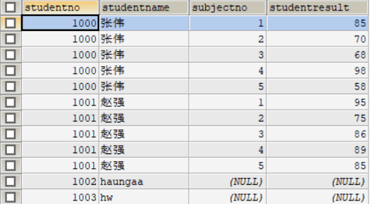
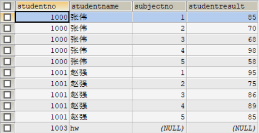
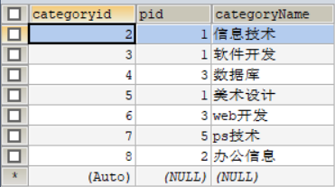
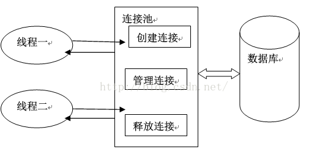

### 1.MYSQL简介

> MySQL是一个轻量级关系型数据库管理系统，由瑞典MySQL AB公司开发，目前属于Oracle公司。目前MySQL被广泛地应用在Internet上的中小型网站中，由于体积小、速度快、总体拥有成本低，开放源码、免费，一般中小型网站的开发都选择Linux + MySQL作为网站数据库。MySQL是一个关系型数据库管理系统，MySQL是一种关联数据库管理系统，关联数据库将数据保存在不同的表中，而不是将所有数据放在一个大仓库内，就增加了速度并提高了灵活性。
>
> 由于分布式和集群的出现，mysql也用于大型的网站上。

### 2.数据库操作

**学习流程： 操作数据库 -> 操作数据库中的表 -> 操作数据库中的表的数据**

**sql语言分类: **

| 名称 | 解释                                     | 命令                  |
| ---- | ---------------------------------------- | --------------------- |
| DDL  | 定义和管理数据对象，如：数据库，数据表等 | create,drop,alter     |
| DML  | 用于操作数据库对象所包含的数据           | insert,delete,update  |
| DQL  | 用于查询数据库对象所包含的数据           | select                |
| DCL  | 用于管理数据库，包括管理权限和数据更改   | grant,commit,rollback |

#### 2.1 连接数据库

```sql
update user set password=password('123456')where user='root'; --修改密码
flush privileges; --刷新数据库
show databases; --显示所有数据库
use dbname；--打开某个数据库
show tables; --显示数据库mysql中所有的表
describe user; --显示表mysql数据库中user表的列信息
create database name; --创建数据库
use databasename; --选择数据库

exit; --退出Mysql
? --命令关键词 : 寻求帮助
-- 表示注释
```

#### 2.2 操作数据库

1. 创建数据库

   ```mysql
    CREATE DATABASE [IF NOT EXISTS] webos;
   ```

2. 删除数据库

   ```mysql
   DROP DATABASE [IF EXISTS] webos;
   ```

3. 查看所有的数据库

   ```mysql
   SHOW DATABASES;
   ```

4. 使用数据库

   ```mysql
   USE student;
   ```

**NOTE:**

 操作sql语句时不区分大小写：例如你运行:
​ SELECT * FROM table WHERE txt = 'a'
​ 那么在utf8_bin中你就找不到 txt = 'A' 的那一行, 而 utf8_general_ci 则可以.


#### 2.3数据值和列类型

列类型 : 规定数据库中该列存放的数据类型

1. 数值类型
   
2. 字符串类型
   
3. 日期和时间型数值类型
   
4. null 值
   - 理解为 "没有值" 或 "未知值"
   - 不要用NULL进行算术运算 , 结果仍为NULL

#### 2.4 数据字段属性

**UnSigned**

- 无符号的
- 声明该数据列不允许负数 .

**ZEROFILL**

- 0填充的
- 不足位数的用0来填充 , 如int(3),5则为005

**Auto_InCrement**

- 自动增长的 , 每添加一条数据 , 自动在上一个记录数上加 1(默认)
- 通常用于设置**主键** , 且为整数类型
- 可定义起始值和步长
- - 当前表设置步长(AUTO_INCREMENT=100) : 只影响当前表
  - SET @@auto_increment_increment=5 ; 影响所有使用自增的表(全局)

**NULL 和 NOT NULL**

- 默认为NULL , 即没有插入该列的数值
- 如果设置为NOT NULL , 则该列必须有值

**DEFAULT**

- 默认的
- 用于设置默认值
- 例如,性别字段,默认为"男" , 否则为 "女" ; 若无指定该列的值 , 则默认值为"男"的值

#### 2.4 操作表

```mysql
-- 目标 : 创建一个school数据库
-- 创建学生表(列,字段)
-- 学号int 登录密码varchar(20) 姓名,性别varchar(2),出生日期(datatime),家庭住址,email
-- 创建表之前 , 一定要先选择数据库

CREATE TABLE IF NOT EXISTS `student` (
`id` int(4) NOT NULL AUTO_INCREMENT COMMENT '学号',
`name` varchar(30) NOT NULL DEFAULT '匿名' COMMENT '姓名',
`pwd` varchar(20) NOT NULL DEFAULT '123456' COMMENT '密码',
`sex` varchar(2) NOT NULL DEFAULT '男' COMMENT '性别',
`birthday` datetime DEFAULT NULL COMMENT '生日',
`address` varchar(100) DEFAULT NULL COMMENT '地址',
`email` varchar(50) DEFAULT NULL COMMENT '邮箱',
PRIMARY KEY (`id`)
) ENGINE=InnoDB DEFAULT CHARSET=utf8

CREATE TABLE '表名' (
	'字段名' 列类型 [属性] [索引] [注释],
    '字段名' 列类型 [属性] [索引] [注释],
    '字段名' 列类型 [属性] [索引] [注释]
)[表类型][字符集设置]

SHOW CREATE DATABASE student; -- 显示建数据库语句
SHOW CREATE TABLE student; -- 显示建表语句
```

#### 2.5 MYISAM和INNODB的区别

| 名称             | MyISAM | InnoDB           |
| ---------------- | ------ | ---------------- |
| 事务支持（ACID） | 不支持 | 支持             |
| 行级锁           | 不支持 | 支持             |
| 外键约束         | 不支持 | 支持             |
| 全文索引         | 支持   | 不支持           |
| 空间大小         | 比较小 | 约为MyISAM的两倍 |

经验 ( 适用场合 ) :

- 适用 MyISAM : 节约空间及相应速度
- 适用 InnoDB : 安全性 , 事务处理及多用户操作数据表

#### 2.6 修改和删除表

> 修改表

```mysql
ALTER TABLE student RENAME AS teacher; -- 修改表名
alter table 旧表名 rename as 新表名

ALTER TABLE teacher ADD sex INT(11); -- 添加字段
alter table 表名 add 字段名 字段属性

ALTER TABLE teacher MODIFY sex VARCHAR(11); -- 修改字段属性
alter table 表名 modify 字段名 字段属性
ALTER TABLE teacher CHANGE sex sex1 VARCHAR(12);-- 修改字段名和属性
alter table 表名 change 旧字段名 新字段名 字段属性[]

ALTER TABLE teacher DROP sex1; -- 删除表的字段
alter table 表名 drop 字段名
```

> 删除表

```mysql
DROP TABLE teacher; --删除表
drop table if exists 表名
```

### 3. MYSQL数据管理（DML）

#### 3.1 外键

**简介：**

- 外键是用来连接数据库的，保证数据库的参照完整性。
- 表的外键是另一表的主键，外键是可以有重复的，可以是空值。
- 以另一个关系的外键作主关键字的表被称为**主表**，具有此外键的表被称为主表的**从表**。
- 保持数据**一致性**，**完整性**，主要目的是控制存储在外键表中的数据,**约束**。使两张表形成关联，外键只能引用外表中的列的值或使用空值。
- 删除表时，只能先删除从表，再删除主表。
- **在开发的时候不会使用外键**

> 在创建表的时候创建外键

```mysql
CREATE TABLE `grade` (
	`gradeID` INT(11) NOT NULL,
	`gradeName` VARCHAR(11) NOT NULL,
	PRIMARY KEY (`gradeID`)
	)ENGINE=INNODB DEFAULT CHARSET=utf8

-- 定义约束名
-- 定义约束名的内容 外键和引用	
CREATE TABLE IF NOT EXISTS `student` (
`id` INT(4) NOT NULL AUTO_INCREMENT COMMENT '学号',
`name` VARCHAR(30) NOT NULL DEFAULT '匿名' COMMENT '姓名',
`pwd` VARCHAR(20) NOT NULL DEFAULT '123456' COMMENT '密码',
`sex` VARCHAR(2) NOT NULL DEFAULT '男' COMMENT '性别',
`birthday` DATETIME DEFAULT NULL COMMENT '生日',
`address` VARCHAR(100) DEFAULT NULL COMMENT '地址',
`email` VARCHAR(50) DEFAULT NULL COMMENT '邮箱',
`gradeID` INT(11) NOT NULL COMMENT '年级名称',
PRIMARY KEY (`id`),
KEY `FK_gradeID`(`gradeID`),
CONSTRAINT `FK_gradeID` FOREIGN KEY (`gradeID`) REFERENCES `grade`(`gradeID`)
) ENGINE=INNODB DEFAULT CHARSET=utf8
```

> 在表创建完之后创建外键

```mysql
ALTER TABLE `student` ADD CONSTRAINT `FK_gradeID` FOREIGN KEY (`gradeID`) REFERENCES `grade`(`gradeID`);
```

> 删除外键

```mysql
ALTER TABLE `student` DROP FOREIGN KEY `FK_gradeID`; -- 删除表的外键，但是索引还存在
-- 注：这个索引是在创建外键是自动生成的
ALTER TABLE `student` DROP INDEX `FK_gradeID`; -- 删除索引
```

#### 3.2 添加

```mysql
INSERT INTO `表名`(`字段1`,`字段2`,...) VALUES (值1,值2,...),(值1,值2,...),...
```

**NOTE: 可以省略字段名，但是值和字段一定要一一对应**

#### 3.3 修改

```mysql
UPDATE `grade` SET `gradeName` = '研一' WHERE `gradeID` = 1;
UPDATE 表名 SET 字段名 = 新值,... WHERE 条件
```

3.4 删除

> 删除一行或者多行数据

```mysql
-- 删除数据
DELETE FROM `grade` WHERE `gradeID` BETWEEN 1 AND 4 
DELETE FROM 表名 WHERE 条件
```

> 删除整张表 delete 和 truncate

```mysql
DELETE FROM `grade`

INSERT INTO `grade`(`gradeName`) VALUES ('大一'),('大二'),('大三'),('大四')

TRUNCATE `grade`
```

**NOTE :**

- delete删除表时，自动增量不会变,truncate 删除表时，自动增量会置一
- 使用TRUNCATE TABLE不会对事务有影响

### 4. DQL 数据库查询语言（非常重要）

> select 语法

```mysql
SELECT [ALL | DISTINCT]
{* | table.* | [table.field1[as alias1][,table.field2[as alias2]][,...]]}
FROM table_name [as table_alias]
    [left | right | inner join table_name2]  -- 联合查询
    [WHERE ...]  -- 指定结果需满足的条件
    [GROUP BY ...]  -- 指定结果按照哪几个字段来分组
    [HAVING]  -- 过滤分组的记录必须满足的次要条件
    [ORDER BY ...]  -- 指定查询记录按一个或多个条件排序
    [LIMIT {[offset,]row_count | row_countOFFSET offset}];
    --  指定查询的记录从哪条至哪条
```

**SQL的执行顺序：**

**–第一步：执行FROM**

**–第二步：WHERE条件过滤**

**–第三步：GROUP BY分组**

**–第四步：执行SELECT投影列**

**–第五步：HAVING条件过滤**

**–第六步：执行ORDER BY 排序**

> 去重(DISTINCT)： 去掉SELECT查询返回的记录结果中重复的记录 ( 返回所有列的值都相同 ) , 只返回一条

```mysql
-- 用as重命名 将结果中表意不清的数据列重新命名
SELECT DISTINCT `studentno` AS '参加过考试的学生' FROM result
```

> 逻辑表达式


> 模糊查询：比较操作符


**NOTE :**

- 使用 like 操作符时 %：表示任意字符 _：表示一个字符
- in(一个或者多个具体的结果)

#### 4.1 连接查询

> join连接


**join 连接的区别**

| 操作符名称 | 描述                                                         |
| ---------- | ------------------------------------------------------------ |
| inner join | 如果表中至少有一个匹配则返回行                               |
| left join  | (以左表作为基准,右边表来一一匹配,匹配不上的,返回左表的记录,右表以NULL填充) |
| right join | (以右表作为基准,左边表来一一匹配,匹配不上的,返回右表的记录,左表以NULL填充) |

**思路：**

1. **分析需求,确定查询的列来源于那些表**
2. **是否使用连接查询，使用那种查询**
3. **确认表与表之间的交叉点**

```mysql
-- 查询参加了考试的同学信息(学号,学生姓名,科目编号,分数)
-- 左连接实现
SELECT s.`studentno`,`studentname`,`subjectno`,`studentresult`
FROM student s
INNER JOIN `result` r ON s.studentno = r.studentno

-- 等值连接实现
SELECT s.studentno,studentname,subjectno,StudentResult
FROM student s , result r
WHERE r.studentno = s.studentno

-- 查询缺考学生(左连接实现)
SELECT s.`studentno`,`studentname`,`subjectno`,`studentresult`
FROM student s
LEFT JOIN `result` r ON s.studentno = r.studentno
WHERE `studentresult` IS NULL

-- 思考题:查询参加了考试的同学信息(学号,学生姓名,科目名,分数)
SELECT s.`studentno`,`studentname`,`subjectname`,`studentresult`
FROM student s
RIGHT JOIN result r ON s.studentno = r.studentno
INNER JOIN `subject` sub ON r.subjectno = sub.subjectno 
```

> where 与 join on的区别

```mysql
-- s.`studentno` != 1002的记录还在，这是由left join的特性决定的，使用left join时on后面的条件只对右表有效（可以看到右表的id=4的记录没了）
SELECT s.`studentno`,`studentname`,`subjectno`,`studentresult`
FROM student s
LEFT JOIN `result` r ON s.studentno = r.studentno AND s.`studentno` != 1002
```



```mysql
-- 先用on后面的条件过滤，再用where条件过滤
SELECT s.`studentno`,`studentname`,`subjectno`,`studentresult`
FROM student s
LEFT JOIN `result` r ON s.studentno = r.studentno
WHERE s.`studentno` != 1002
```



> 自连接



```mysql
-- 编写SQL语句,将栏目的父子关系呈现出来 (父栏目名称,子栏目名称)
-- 核心思想:把一张表看成两张一模一样的表,然后将这两张表连接查询(自连接)
SELECT c1.`categoryName` AS '父栏目',c2.`categoryName` AS '子栏目'
FROM category AS c1
INNER JOIN category AS c2 ON c1.`categoryid` = c2.`pid`
```


#### 4.2 排序和分页

```mysql
/*============== 排序 ================
语法 : ORDER BY
   ORDER BY 语句用于根据指定的列对结果集进行排序。
   ORDER BY 语句默认按照ASC升序对记录进行排序。
   如果您希望按照降序对记录进行排序，可以使用 DESC 关键字。
*/

SELECT s.`studentno`,`studentname`,`subjectname`,`studentresult`
FROM student s
INNER JOIN result r ON s.`studentno` = r.`studentno`
INNER JOIN `subject` sub ON sub.`subjectno` = r.`subjectno`
WHERE `subjectname` = '高等数学-1'
ORDER BY `studentresult` DESC

/*============== 分页 ================
语法 : SELECT * FROM table LIMIT (pageNo-1)*pageSzie,pageSzie 
(pageNo-1)*pageSzie:起始值 pageSzie: 单页面显示条数
好处 : (用户体验,网络传输,查询压力)

推导:
   第一页 : limit 0,5
   第二页 : limit 5,5
   第三页 : limit 10,5
   ......
   第N页 : limit (pageNo-1)*pageSzie,pageSzie
   [pageNo:页码,pageSize:单页面显示条数]   
*/
SELECT * FROM `subject`
LIMIT 0,4
```

#### 4.3 子查询

子查询的定义：

- 子查询是将一个查询语句嵌套在另一个查询语句中；
- 在特定情况下，一个查询语句的条件需要另一个查询语句来获取，内层查询（inner query）语句的查询结果，可以为外层查询（outer query）语句提供查询条件。

```mysql
-- 查询课程为 高等数学-1 且分数不小于80分的学生的学号和姓名
-- 连接查询
SELECT s.studentno,studentname
FROM student s
INNER JOIN result r ON s.studentno = r.studentno 
INNER JOIN `SUBJECT` sub ON sub.subjectno = r.subjectno
WHERE subjectname = '高等数学-1' AND studentresult >= 80

-- 子查询：由内及外. where 语句中的条件就是两张表的交叉点
SELECT studentno,studentname
FROM student 
WHERE studentno IN(
	SELECT studentno FROM result WHERE subjectno = (
		SELECT subjectno FROM `subject` WHERE subjectname = '高等数学-1'
	)
)
```

### 5、MYSQL函数

#### 5.1 常用函数

> 数据函数

```mysql
 SELECT ABS(-8);  /*绝对值*/
 SELECT CEILING(9.4); /*向上取整*/
 SELECT FLOOR(9.4);   /*向下取整*/
 SELECT RAND();  /*随机数,返回一个0-1之间的随机数*/
 SELECT SIGN(0); /*符号函数: 负数返回-1,正数返回1,0返回0*/
```

> 字符串函数

```mysql
 SELECT CHAR_LENGTH('狂神说坚持就能成功'); /*返回字符串包含的字符数*/
 SELECT CONCAT('我','爱','程序');  /*合并字符串,参数可以有多个*/
 SELECT INSERT('我爱编程helloworld',1,2,'超级热爱');  /*替换字符串,从某个位置开始替换某个长度*/
 SELECT LOWER('KuangShen'); /*小写*/
 SELECT UPPER('KuangShen'); /*大写*/
 SELECT LEFT('hello,world',5);   /*从左边截取*/
 SELECT RIGHT('hello,world',5);  /*从右边截取*/
 SELECT REPLACE('狂神说坚持就能成功','坚持','努力');  /*替换字符串*/
 SELECT SUBSTR('狂神说坚持就能成功',4,6); /*截取字符串,开始和长度*/
 SELECT REVERSE('狂神说坚持就能成功'); /*反转
```

> 日期和时间函数

```mysql
 SELECT CURRENT_DATE();   /*获取当前日期*/
 SELECT CURDATE();   /*获取当前日期*/
 SELECT NOW();   /*获取当前日期和时间*/
 SELECT LOCALTIME();   /*获取当前日期和时间*/
 SELECT SYSDATE();   /*获取当前日期和时间*/
 
 -- 获取年月日,时分秒
 SELECT YEAR(NOW());
 SELECT MONTH(NOW());
 SELECT DAY(NOW());
 SELECT HOUR(NOW());
 SELECT MINUTE(NOW());
 SELECT SECOND(NOW());
```

> 系统信息函数

```mysql
 SELECT VERSION();  /*版本*/
 SELECT USER();     /*用户*/
```

#### 5.2 聚合函数

| 函数名  | 描述                                                         |
| ------- | ------------------------------------------------------------ |
| count() | 返回满足Select条件的记录总和数，如 select count(*) 【不建议使用 *，效率低】 |
| min()   | 可以为数值字段，字符字段或表达式列作统计，返回最小的值。     |
| max()   | 可以为数值字段，字符字段或表达式列作统计，返回最大的值。     |
| avg()   | 返回一列的平均值                                             |
| sum()   | 返回一列的总和。                                             |

**NOTE: where不能使用聚合函数**

聚集函数也叫列函数，它们都是基于整列数据进行计算的，而where子句则是对数据行进行过滤的，在筛选过程中依赖“基于已经筛选完毕的数据得出的计算结果”是一种悖论，这是行不通的。更简单地说，因为聚集函数要对全列数据时行计算，因而使用它的前提是：结果集已经确定！

**而where子句还处于“确定”结果集的过程中，因而不能使用聚集函数。**

与where子句不能出现聚集函数正相反的是，我们几乎看不到不使用聚集函数的having子句。为什么？

**因为在水平方向上根据外部指定条件的筛选（也就是对行的筛选），where子句可以独立完成，剩下的往往都是需要根据结果集自身的统计数据进一步筛选了，这时，几乎都需要通过having子句配合聚集函数来完成。**

```mysql
/*
count(*)包括了所有的列，统计行数，在统计结果的时候，不会忽略列值为NULL  
count(1)忽略所有列，用1代表代码行，在统计结果的时候，不会忽略列值为NULL  
count(列名)只包括列名那一列，在统计结果的时候，会忽略列值为空
（这里的空不是只空字符串或者0，而是表示null）的计数，即某个字段值为NULL时，不统计。
*/

SELECT COUNT(*) FROM `student`
SELECT COUNT(1) FROM `student`
SELECT COUNT(`identitycard`) FROM student

SELECT AVG(`studentresult`) AS 平均分 FROM `result` WHERE `studentno` = 1001
SELECT MIN(`studentresult`) AS 最低分 FROM `result` WHERE `studentno` = 1001
SELECT MAX(`studentresult`) AS 最高分 FROM `result` WHERE `studentno` = 1001
SELECT SUM(`studentresult`) AS 总分 FROM `result` WHERE `studentno` = 1001
```

> 分组

**NOTE:在含有Group by子句的查询语句中，对select关键字后的目标列，存在以下规律**

1. 使用group by 时，select 涉及的列要么是参与分组的列，要么列包含在聚合函数中
2. where将对分组前的所有数据进行筛选。having将对分组后的一组数据搞事情。

```mysql
-- 查询不同课程的平均分,最高分,最低分
-- 前提:根据不同的课程进行分组
 SELECT `subjectname`,AVG(`studentresult`),MAX(`studentresult`),MIN(`studentresult`)
 FROM result r
 INNER JOIN `subject` sub ON r.`subjectno` = sub.`subjectno`
 GROUP BY `subjectname`
```

#### 5.3 MD5加密函数

**一、MD5简介**

MD5即Message-Digest Algorithm 5（信息-摘要算法5），用于确保信息传输完整一致。是计算机广泛使用的杂凑算法之一（又译摘要算法、哈希算法），主流编程语言普遍已有MD5实现。将数据（如汉字）运算为另一固定长度值，是杂凑算法的基础原理，MD5的前身有MD2、MD3和MD4。
**二、实现数据加密**

```mysql
CREATE TABLE md5test (
	id INT(11) NOT NULL ,
	`name` VARCHAR(11) NOT NULL,
	`pwd` VARCHAR(11) NOT NULL,
	PRIMARY KEY (id)
 )ENGINE=INNODB,DEFAULT CHARSET = utf8
 
INSERT INTO md5test VALUES (1,'zhangsan','123456'),(2,'lisi','123456'),(3,'wangwu','123456')
UPDATE md5test SET pwd = MD5(pwd) WHERE id = 1
 INSERT INTO md5test VALUES(4,'kuangshen3',md5('123456'));
```

**三、md5实现数据匹配**

```mysql
SELECT * FROM md5test WHERE `name` = 'zhangsan' AND pwd = MD5('123456')
```

**四、md5特点**

不可逆性 --- 根据 MD5 值计算不出原始数据

唯一性 --- 不同原始数据会有不同的 MD5 值 （不完全可靠，后面说）

### 6、数据库事务的四大特性以及隔离级别

> 什么是事务

- 事务就是将一组SQL语句放在同一批次内去执行
- 如果一个SQL语句出错,则该批次内的所有SQL都将被取消执行

> 事务的ACID四大特性

**⑴ 原子性（Atomicity）**

　　原子性是指事务包含的所有操作要么全部成功，要么全部失败回滚，这和前面两篇博客介绍事务的功能是一样的概念，因此事务的操作如果成功就必须要完全应用到数据库，如果操作失败则不能对数据库有任何影响。

**⑵ 一致性（Consistency）**

　　一致性是指事务必须使数据库从一个一致性状态变换到另一个一致性状态，也就是说一个事务执行之前和执行之后都必须处于一致性状态。

　　拿转账来说，假设用户A和用户B两者的钱加起来一共是5000，那么不管A和B之间如何转账，转几次账，事务结束后两个用户的钱相加起来应该还得是5000，这就是事务的一致性。

**⑶ 隔离性（Isolation）**

　　隔离性是当多个用户并发访问数据库时，比如操作同一张表时，数据库为每一个用户开启的事务，不能被其他事务的操作所干扰，多个并发事务之间要相互隔离。

　　即要达到这么一种效果：对于任意两个并发的事务T1和T2，在事务T1看来，T2要么在T1开始之前就已经结束，要么在T1结束之后才开始，这样每个事务都感觉不到有其他事务在并发地执行。

　　关于事务的隔离性数据库提供了多种隔离级别，稍后会介绍到。

**⑷ 持久性（Durability）**

　　持久性是指一个事务一旦被提交了，那么对数据库中的数据的改变就是永久性的，即便是在数据库系统遇到故障的情况下也不会丢失提交事务的操作。

　　例如我们在使用JDBC操作数据库时，在提交事务方法后，提示用户事务操作完成，当我们程序执行完成直到看到提示后，就可以认定事务以及正确提交，即使这时候数据库出现了问题，也必须要将我们的事务完全执行完成，否则就会造成我们看到提示事务处理完毕，但是数据库因为故障而没有执行事务的重大错误。

> 基本语法

```mysql
SET autocommit = 0 -- 关闭事务自动提交
START TRANSACTION -- 开启事务

COMMIT -- 提交事务

ROLLBACK -- 将事务回滚
SET autocommit = 1 -- 开启事务自动提交
-- 保存点
SAVEPOINT 保存点名称 -- 设置一个事务保存点
ROLLBACK TO SAVEPOINT 保存点名称 -- 把事务回滚到保存点
RELEASE SAVEPOINT 保存点名称 -- 释放保存点
```

> 事务实践

```mysql
/*
A在线买一款价格为500元商品,网上银行转账.
A的银行卡余额为2000,然后给商家B支付500.
商家B一开始的银行卡余额为10000
创建数据库shop和创建表account并插入2条数据
*/
CREATE DATABASE shop CHARACTER SET utf8 COLLATE utf8_general_ci
USE shop;

CREATE TABLE account(
	id INT(10) NOT NULL AUTO_INCREMENT,
	`name` VARCHAR(30) NOT NULL,
	money DECIMAL(9,2) NOT NULL,
	PRIMARY KEY (id)
)ENGINE = INNODB DEFAULT CHARSET = utf8

INSERT INTO account(`name`,money) VALUES ('a',2000),('b',10000)

SET autocommit = 0
START TRANSACTION -- 开启事务
UPDATE account SET money = money - 500 WHERE `name` = 'a'
SAVEPOINT temp -- 创建保存点
UPDATE account SET money = money + 500 WHERE `name` = 'b'
ROLLBACK TO SAVEPOINT temp -- 回滚到保存点
COMMIT -- 事务一旦提交不可逆转，持久化到数据库文件了
ROLLBACK -- 回滚数据
SET autocommit = 1
```

### 7、索引

> 索引的作用

- 提高查询速度
- 确保数据的唯一性
- 可以加速表和表之间的连接 , 实现表与表之间的参照完整性
- 使用分组和排序子句进行数据检索时 , 可以显著减少分组和排序的时间
- 全文检索字段进行搜索优化.

> 分类

- 主键索引 (Primary Key)
- 唯一索引 (Unique)
- 常规索引 (Index)
- 全文索引 (FullText)

> 主键索引

主键 : 某一个属性组能唯一标识一条记录

特点 :

- 最常见的索引类型
- 确保数据记录的唯一性
- 确定特定数据记录在数据库中的位置

> 唯一索引

作用 : 避免同一个表中某数据列中的值重复

与主键索引的区别

- 主键索引只能有一个
- 唯一索引可能有多个

> 常规索引

作用 : 快速定位特定数据

注意 :

- index 和 key 关键字都可以设置常规索引
- 应加在查询找条件的字段
- 不宜添加太多常规索引,影响数据的插入,删除和修改操作

```mysql
CREATE TABLE `result`(
    -- 省略一些代码
    INDEX/KEY `ind` (`studentNo`,`subjectNo`) -- 创建表时添加
)

-- 创建后添加
ALTER TABLE `result` ADD INDEX `ind`(`studentNo`,`subjectNo`);
```

> 全文索引

百度搜索：全文索引

作用 : 快速定位特定数据

注意 :

- 只能用于CHAR , VARCHAR , TEXT数据列类型
- 适合大型数据集

```mysql
/*
开始之前，先说一下全文索引的版本、存储引擎、数据类型的支持情况
MySQL 5.6 以前的版本，只有 MyISAM 存储引擎支持全文索引；
MySQL 5.6 及以后的版本，MyISAM 和 InnoDB 存储引擎均支持全文索引;
只有字段的数据类型为 char、varchar、text 及其系列才可以建全文索引。
测试或使用全文索引时，要先看一下自己的 MySQL 版本、存储引擎和数据类型是否支持全文索引。
*/
/*增加全文索引*/
ALTER TABLE student ADD FULLTEXT studentname(`studentname`)

SHOW INDEX FROM student -- 查看student表的索引

/*EXPLAIN : 分析SQL语句执行性能*/
EXPLAIN SELECT * FROM student WHERE studentname = 'huangaa'
```


```mysql
/*使用全文索引*/
-- 全文搜索通过 MATCH() 函数完成。
-- 搜索字符串作为 against() 的参数被给定。搜索以忽略字母大小写的方式执行。对于表中的每个记录行，MATCH() 返回一个相关性值。即，在搜索字符串与记录行在 MATCH() 列表中指定的列的文本之间的相似性尺度。
EXPLAIN SELECT * FROM student WHERE MATCH(`studentname`) AGAINST('haungaa')
```


**索引创建的语法：**

```mysql
/*
#方法一：创建表时
    　　CREATE TABLE 表名 (
                字段名1  数据类型 [完整性约束条件…],
                字段名2  数据类型 [完整性约束条件…],
                [UNIQUE | FULLTEXT | SPATIAL ]   INDEX | KEY
                [索引名]  (字段名[(长度)]  [ASC |DESC])
                );
#方法二：CREATE在已存在的表上创建索引
        CREATE  [UNIQUE | FULLTEXT | SPATIAL ]  INDEX  索引名
                     ON 表名 (字段名[(长度)]  [ASC |DESC]) ;
#方法三：ALTER TABLE在已存在的表上创建索引
        ALTER TABLE 表名 ADD  [UNIQUE | FULLTEXT | SPATIAL ] INDEX
                             索引名 (字段名[(长度)]  [ASC |DESC]) ;
                            
                            
#删除索引：DROP INDEX 索引名 ON 表名字;
#删除主键索引: ALTER TABLE 表名 DROP PRIMARY KEY;
#显示索引信息: SHOW INDEX FROM student;
*/
```

> 索引的效果 耗时测试

```mysql
USE school
CREATE TABLE `app_user` (
`id` BIGINT(20) UNSIGNED NOT NULL AUTO_INCREMENT,
`name` VARCHAR(50) DEFAULT '',
`email` VARCHAR(50) NOT NULL,
`phone` VARCHAR(20) DEFAULT '',
`gender` TINYINT(4) UNSIGNED DEFAULT '0',
`password` VARCHAR(100) NOT NULL DEFAULT '',
`age` TINYINT(4) DEFAULT NULL,
`create_time` DATETIME DEFAULT CURRENT_TIMESTAMP,
`update_time` TIMESTAMP NOT NULL DEFAULT CURRENT_TIMESTAMP ON UPDATE CURRENT_TIMESTAMP,
PRIMARY KEY (`id`)
) ENGINE=INNODB DEFAULT CHARSET=utf8

-- 插入100万数据.
DELIMITER $$
-- 写函数之前必须要写，标志
CREATE FUNCTION mock_data ()
RETURNS INT
BEGIN
DECLARE num INT DEFAULT 1000000;
DECLARE i INT DEFAULT 0;
WHILE i<num DO
INSERT INTO `app_user`(`name`,`email`,`phone`,`gender`)VALUES(CONCAT('用户',i),'19224305@qq.com','123456789',FLOOR(RAND()*2));
SET i=i+1;
END WHILE;
RETURN i;
END;
SELECT mock_data() -- 执行此函数 生成一百万条数据

-- 建立索引前
EXPLAIN SELECT * FROM app_user WHERE NAME = '用户9999'; -- 查看耗时  0.530 sec
-- 建立索引
CREATE INDEX index_app_user_name ON app_user(`name`)
-- 建立索引后
EXPLAIN SELECT * FROM app_user WHERE NAME = '用户9999'; -- 查看耗时  0.001 sec
```


> 索引准则

- 索引不是越多越好
- 不要对经常变动的数据加索引
- 小数据量的表建议不要加索引
- 索引一般应加在查找条件的字段

### 8、用户管理

> 基本命令

```mysql
-- ========================================语法=============================================
/* 用户和权限管理 */ ------------------
用户信息表：mysql.user
 
-- 刷新权限
FLUSH PRIVILEGES
 
-- 增加用户  CREATE USER kuangshen IDENTIFIED BY '123456'
CREATE USER 用户名 IDENTIFIED BY [PASSWORD] 密码(字符串)
    - 必须拥有mysql数据库的全局CREATE USER权限，或拥有INSERT权限。
    - 只能创建用户，不能赋予权限。
    - 用户名，注意引号：如 'user_name'@'192.168.1.1'
    - 密码也需引号，纯数字密码也要加引号
    - 要在纯文本中指定密码，需忽略PASSWORD关键词。要把密码指定为由PASSWORD()函数返回的混编值，需包含关键字PASSWORD
 
-- 重命名用户  RENAME USER kuangshen TO kuangshen2
RENAME USER old_user TO new_user
 
-- 设置密码
SET PASSWORD = PASSWORD('密码')    -- 为当前用户设置密码
SET PASSWORD FOR 用户名 = PASSWORD('密码')    -- 为指定用户设置密码
 
-- 删除用户  DROP USER kuangshen2
DROP USER 用户名
 
-- 分配权限/添加用户
GRANT 权限列表 ON 表名 TO 用户名 [IDENTIFIED BY [PASSWORD] 'password']
    - all privileges 表示所有权限
    - *.* 表示所有库的所有表
    - 库名.表名 表示某库下面的某表
 
-- 查看权限   SHOW GRANTS FOR root@localhost;
SHOW GRANTS FOR 用户名
    -- 查看当前用户权限
    SHOW GRANTS; 或 SHOW GRANTS FOR CURRENT_USER; 或 SHOW GRANTS FOR CURRENT_USER();
 
-- 撤消权限
REVOKE 权限列表 ON 表名 FROM 用户名
REVOKE ALL PRIVILEGES, GRANT OPTION FROM 用户名    -- 撤销所有权限


-- =================================实践=================================================
-- 创建用户
CREATE USER huangaa IDENTIFIED BY '123456'
-- 修改用户名
RENAME USER huangaa TO huang
-- 修改密码
SET PASSWORD = PASSWORD('123456')
-- 授予权限
GRANT ALL PRIVILEGES ON *.* TO huanga
-- 撤销权限
REVOKE ALL PRIVILEGES ON *.* FROM huangaa
-- 删除用户
DROP USER huang
-- 显示用户权限
SHOW GRANTS FOR huangaa -- GRANT ALL PRIVILEGES ON *.* TO 'huangaa'@'%'
SHOW GRANTS FOR root@localhost -- GRANT ALL PRIVILEGES ON *.* TO 'root'@'localhost' WITH GRANT OPTION
```

> 权限解释

```mysql
-- 权限列表
ALL [PRIVILEGES]    -- 设置除GRANT OPTION之外的所有简单权限
ALTER    -- 允许使用ALTER TABLE
ALTER ROUTINE    -- 更改或取消已存储的子程序
CREATE    -- 允许使用CREATE TABLE
CREATE ROUTINE    -- 创建已存储的子程序
CREATE TEMPORARY TABLES        -- 允许使用CREATE TEMPORARY TABLE
CREATE USER        -- 允许使用CREATE USER, DROP USER, RENAME USER和REVOKE ALL PRIVILEGES。
CREATE VIEW        -- 允许使用CREATE VIEW
DELETE    -- 允许使用DELETE
DROP    -- 允许使用DROP TABLE
EXECUTE        -- 允许用户运行已存储的子程序
FILE    -- 允许使用SELECT...INTO OUTFILE和LOAD DATA INFILE
INDEX     -- 允许使用CREATE INDEX和DROP INDEX
INSERT    -- 允许使用INSERT
LOCK TABLES        -- 允许对您拥有SELECT权限的表使用LOCK TABLES
PROCESS     -- 允许使用SHOW FULL PROCESSLIST
REFERENCES    -- 未被实施
RELOAD    -- 允许使用FLUSH
REPLICATION CLIENT    -- 允许用户询问从属服务器或主服务器的地址
REPLICATION SLAVE    -- 用于复制型从属服务器（从主服务器中读取二进制日志事件）
SELECT    -- 允许使用SELECT
SHOW DATABASES    -- 显示所有数据库
SHOW VIEW    -- 允许使用SHOW CREATE VIEW
SHUTDOWN    -- 允许使用mysqladmin shutdown
SUPER    -- 允许使用CHANGE MASTER, KILL, PURGE MASTER LOGS和SET GLOBAL语句，mysqladmin debug命令；允许您连接（一次），即使已达到max_connections。
UPDATE    -- 允许使用UPDATE
USAGE    -- “无权限”的同义词
GRANT OPTION    -- 允许授予权限
 
 
/* 表维护 */
 
-- 分析和存储表的关键字分布
ANALYZE [LOCAL | NO_WRITE_TO_BINLOG] TABLE 表名 ...
-- 检查一个或多个表是否有错误
CHECK TABLE tbl_name [, tbl_name] ... [option] ...
option = {QUICK | FAST | MEDIUM | EXTENDED | CHANGED}
-- 整理数据文件的碎片
OPTIMIZE [LOCAL | NO_WRITE_TO_BINLOG] TABLE tbl_name [, tbl_name] ...
```

### 9、MYSQL备份

**数据库备份必要性**

1. 保证重要数据不丢失
2. 数据转移

**MySQL数据库备份方法**

1. mysqldump备份工具
2. 数据库管理工具,如SQLyog
3. 直接拷贝数据库文件和相关配置文件

**mysqldump客户端作用 :**

1. 转储数据库
2. 搜集数据库进行备份
3. 将数据转移到另一个SQL服务器,不一定是MySQL服务器

```mysql
-- 导出
1. 导出一张表 -- mysqldump -uroot -p123456 school student >D:/a.sql
　　mysqldump -u用户名 -p密码 库名 表名 > 文件名(D:/a.sql)
2. 导出多张表 -- mysqldump -uroot -p123456 school student result >D:/a.sql
　　mysqldump -u用户名 -p密码 库名 表1 表2 表3 > 文件名(D:/a.sql)
3. 导出所有表 -- mysqldump -uroot -p123456 school >D:/a.sql
　　mysqldump -u用户名 -p密码 库名 > 文件名(D:/a.sql)
4. 导出一个库 -- mysqldump -uroot -p123456 -B school >D:/a.sql
　　mysqldump -u用户名 -p密码 -B 库名 > 文件名(D:/a.sql)
 
可以-w携带备份条件
 
-- 导入
1. 在登录mysql的情况下：-- source D:/a.sql
　　source  备份文件
2. 在不登录的情况下
　　mysql -u用户名 -p密码 库名 < 备份文件
```

### 10、JDBC

#### 10.1 简介

JDBC代表Java数据库连接(**J**ava **D**ata**b**ase **C**onnectivity)，它是用于Java编程语言和数据库之间的数据库无关连接的标准Java API，换句话说：JDBC是用于在Java语言编程中与数据库连接的API。从根本上说，JDBC是一个规范，它提供了一整套接口，允许以一种可移植的访问底层数据库API。 Java可以用它来编写不同类型的可执行文件。

**jdbc体系架构由两层组成：**

1. JDBC API: 提供应用程序到JDBC管理器的连接
2. JDBC 驱动程序API： 支持JDBC管理器到驱动程序的连接

JDBC API使用驱动程序管理器并指定数据库的驱动程序来提供与异构数据库的透明连接。

JDBC驱动程序管理器确保使用正确的驱动程序来访问每个数据源。 驱动程序管理器能够支持连接到多个异构数据库的多个并发驱动程序。

以下是架构图，它显示了驱动程序管理器相对于JDBC驱动程序和Java应用程序的位置


#### 10.2 常见的JDBC组件

JDBC API提供以下接口和类 -

- `DriverManager`：此类管理数据库驱动程序列表。 使用通信子协议将来自java应用程序的连接请求与适当的数据库驱动程序进行匹配。在JDBC下识别某个子协议的第一个驱动程序将用于建立数据库连接。
- `Driver`：此接口处理与数据库服务器的通信。我们很少会直接与`Driver`对象进行交互。 但会使用`DriverManager`对象来管理这种类型的对象。 它还提取与使用`Driver`对象相关的信息。
- `Connection`：此接口具有用于联系数据库的所有方法。 连接(`Connection`)对象表示通信上下文，即，与数据库的所有通信仅通过连接对象。***Connection 代表数据库***

```java
//数据库设置自动提交
//事务提交
//事务回滚
connection.rollback();
connection.commit();
connection.setAutoCommit(true);
```

- `Statement`：使用从此接口创建的对象将SQL语句提交到数据库。 除了执行存储过程之外，一些派生接口还接受参数。***Statement执行sql的对象***

```java
statement.executeQuery(); //查询操作返回ResultSet
statement.execute();//执行任何sql
statement.executeUpdate(); //更新，插入，删除都是用这个，返回一个受影响的行数
```

- `ResultSet`：在使用`Statement`对象执行SQL查询后，这些对象保存从数据库检索的数据。 它作为一个迭代器并可移动`ResultSet`对象查询的数据。

```java
resultSet.getObject(); //在不知道列类型的情况使用
//获取指定类型
resultSet.getString();
resultSet.getInt();
resultSet.getFloat();
resultSet.getDate();
```

- `SQLException`：此类处理数据库应用程序中发生的任何错误。

> 测试代码

```java
public static void main(String[] args) throws ClassNotFoundException, SQLException {
    //加载驱动
    Class.forName("com.mysql.jdbc.Driver");
    //连接数据库 需要url,name,pwd
    //协议://主机地址:端口号/数据库名？参数1&参数2&参数3
	//mysql默认端口号3306
    String url = "jdbc:mysql://localhost:3306/jdbcstudy?useUnicode=true&characterEncoding=utf8&useSSL=true";
    String name = "root";
    String password = "123456";
    Connection connection = DriverManager.getConnection(url, name, password);
    //执行sql
    String sql = "SELECT * FROM users";
    Statement statement = connection.createStatement();
    ResultSet resultSet = statement.executeQuery(sql);
    //拿到结果集
    while(resultSet.next()){
        System.out.println(resultSet.getObject("id"));
        System.out.println( resultSet.getObject("NAME"));
        System.out.println( resultSet.getObject("PASSWORD"));
        System.out.println(resultSet.getObject("email"));
        System.out.println(resultSet.getObject("birthday"));
    }
    //释放连接
    resultSet.close();
    statement.close();
    connection.close();
}
```

#### 10.3 jdbc工具类

> 把数据库驱动和连接数据库所需要的参数放在配置文件中，实现代码解耦

```properties
driver=com.mysql.jdbc.Driver
url=jdbc:mysql://localhost:3306/jdbcstudy?useUnicode=true&characterEncoding=utf8&useSSL=true
useName=root
password=123456
```

> 提取工具类：加载驱动，建立连接，释放资源

```java
public class JDBCUtil {
    static String driver = null;
    static String userName = null;
    static String password = null;
    static String url = null;
    //通过配置文件加载驱动,只用加载一次即可，再静态代码块中实现
    static{
        try{
            InputStream inputStream = JDBCUtil.class.getClassLoader().getResourceAsStream("jdbc.properties");
            Properties properties = new Properties();
            properties.load(inputStream);
            driver = properties.getProperty("driver");
            url = properties.getProperty("url");
            userName = properties.getProperty("useName");
            password = properties.getProperty("password");
            Class.forName(driver);
        } catch (Exception e) {
            e.printStackTrace();
        }
    }

    //建立连接
    public static Connection getConnection() throws SQLException {
        return DriverManager.getConnection(url,userName,password);
    }

    //释放资源
    public static void releaseResource(Connection connection, Statement statement, ResultSet resultSet){
        if (connection != null) {
            try {
                connection.close();
            } catch (SQLException throwables) {
                throwables.printStackTrace();
            }
        }

        if (statement != null) {
            try {
                statement.close();
            } catch (SQLException throwables) {
                throwables.printStackTrace();
            }
        }

        if (resultSet != null) {
            try {
                resultSet.close();
            } catch (SQLException throwables) {
                throwables.printStackTrace();
            }
        }
    }
}
```

> 使用工具类来实现查询和删除

```java
    private static void executeQuery() throws SQLException {
        //加载驱动并建立连接
        Connection connection = JDBCUtil.getConnection();
        //执行sql
        String query = "SELECT * FROM users";
        Statement statement = connection.createStatement();
        ResultSet resultSet = statement.executeQuery(query);
        while (resultSet.next()) {
            System.out.println(resultSet.getInt("id"));
            System.out.println(resultSet.getString("NAME"));
            System.out.println(resultSet.getString("PASSWORD"));
            System.out.println(resultSet.getString("email"));
            System.out.println(resultSet.getDate("birthday"));
            System.out.println("=============================================");
        }
        //释放资源
        JDBCUtil.releaseResource(connection,statement,resultSet);
    }
    
    private static void executeDelete() throws SQLException {
        //加载驱动并建立连接
        Connection connection = JDBCUtil.getConnection();
        //执行sql
        String delete = "DELETE FROM users WHERE id = 1";
        Statement statement = connection.createStatement();
        int i = statement.executeUpdate(delete);
        if (i > 0) {
            System.out.println("删除成功");
        }
        JDBCUtil.releaseResource(connection,statement,null);
    }
```

#### 10.4 jdbc模拟事务

```java
public static void main(String[] args) {
        Connection connection = null;
        PreparedStatement statement = null;
        try {
            connection = JDBCUtil.getConnection();
            connection.setAutoCommit(false);//关闭自动提交事务，开启一个事务
            //a 账户 - 100
            String sql1 = "UPDATE account SET money = money - 100 WHERE NAME = 'a'";
            statement = connection.prepareStatement(sql1);
            statement.executeUpdate();

            //模拟出错
            int i = 1/0;

            //b账户 + 100
            String sql2 = "UPDATE account SET money = money + 100 WHERE NAME = 'b'";
            statement = connection.prepareStatement(sql2);
            statement.executeUpdate();
            //提交事务
            connection.commit();
            System.out.println("执行事务成功");
        } catch (SQLException throwables) {
            try {
                connection.rollback();
            } catch (SQLException e) {
                e.printStackTrace();
            }
            throwables.printStackTrace();
        }finally {
            JDBCUtil.releaseResource(connection, statement,null);
        }
    }
```

#### 10.5 数据库连接池

##### 什么是数据库连接池？

官方：[数据库](http://lib.csdn.net/base/mysql)连接池（Connection pooling）是程序启动时建立足够的数据库连接，并将这些连接组成一个连接池，由程序动态地对池中的连接进行申请，使用，释放。
个人理解：创建数据库连接是一个很耗时的操作，也容易对数据库造成安全隐患。所以，在程序初始化的时候，集中创建多个数据库连接，并把他们集中管理，供程序使用，可以保证较快的数据库读写速度，还更加安全可靠。

##### 传统的连接机制与数据库连接池的运行机制区别

传统统链接: 一般来说，Java应用程序访问数据库的过程是：

1. 装载数据库驱动程序；
2. 通过JDBC建立数据库连接；
3. 访问数据库，执行SQL语句；
4. 断开数据库连接。

使用了数据库连接池的机制：

1. 程序初始化时创建连接池
2. 使用时向连接池申请可用连接
3. 使用完毕，将连接返还给连接池
4. 程序退出时，断开所有连接，并释放资源



##### DBCP的使用

```java
public class DBCP_JDBCUtil {
    private static DataSource dataSource = null;
    //通过配置文件加载驱动,只用加载一次即可，再静态代码块中实现
    static{
        try{
            InputStream inputStream = DBCP_JDBCUtil.class.getClassLoader().getResourceAsStream("dbcp.properties");
            Properties properties = new Properties();
            properties.load(inputStream);
            //创建数据源 工厂模式 - - - > 创建
            dataSource = BasicDataSourceFactory.createDataSource(properties);

        } catch (Exception e) {
            e.printStackTrace();
        }
    }

    //建立连接
    public static Connection getConnection() throws SQLException {
        return dataSource.getConnection();
    }

    //释放资源
    public static void releaseResource(Connection connection, Statement statement, ResultSet resultSet){
        if (connection != null) {
            try {
                connection.close();
            } catch (SQLException throwables) {
                throwables.printStackTrace();
            }
        }

        if (statement != null) {
            try {
                statement.close();
            } catch (SQLException throwables) {
                throwables.printStackTrace();
            }
        }

        if (resultSet != null) {
            try {
                resultSet.close();
            } catch (SQLException throwables) {
                throwables.printStackTrace();
            }
        }
    }
}
```

##### c3p0的使用

```java
public class C3PO_JDBCUtils {
    private static ComboPooledDataSource dataSource = null;

    //通过配置文件加载驱动,只用加载一次即可，再静态代码块中实现
    static {
        try {
            //创建数据源 工厂模式 - - - > 创建
            dataSource = new ComboPooledDataSource("mysql");
        } catch (Exception e) {
            e.printStackTrace();
        }
    }

    //建立连接
    public static Connection getConnection() throws SQLException {
        return dataSource.getConnection();
    }

    //释放资源
    public static void releaseResource(Connection connection, Statement statement, ResultSet resultSet) {
        if (connection != null) {
            try {
                connection.close();
            } catch (SQLException throwables) {
                throwables.printStackTrace();
            }
        }

        if (statement != null) {
            try {
                statement.close();
            } catch (SQLException throwables) {
                throwables.printStackTrace();
            }
        }

        if (resultSet != null) {
            try {
                resultSet.close();
            } catch (SQLException throwables) {
                throwables.printStackTrace();
            }
        }
    }
}
```

### 11、sql 注入和PreparedStatement

#### 11.1 什么是SQL注入？

看起来很复杂，其实很简单就能解释，SQL注入就是一种通过操作输入来修改后台SQL语句达到代码执行进行攻击目的的技术。

#### 11.2 sql注入是怎么产生的

构造动态字符串是一种编程技术，它允许开发人员在运行过程中动态构造SQL语句。开发人员可以使用动态SQL来创建通用、灵活的应用。动态SQL语句是在执行过程中构造的，它根据不同的条件产生不同的SQL语句。当开发人员在运行过程中需要根据不同的查询标准来决定提取什么字段(如SELECT语句)，或者根据不同的条件来选择不同的查询表时，动态构造SQL语句会非常有用。

在java中动态构造SQL语句字符串：

```java
 String sql ="select * from users where `name` = '"+username+"' and password = '"+password+"'";
```

看上面代码我们可以控制输入参数username和password，修改所要执行SQL语句，达到攻击的目的。

> java测试sql注入

```java
   //这样可以查询出所有的用户信息 拼接完成的sql语句是：SELECT * FROM users WHERE NAME = ''OR'1=1' AND PASSWORD = '123456'
	public static void main(String[] args) throws SQLException {
        login(" 'or'1=1","123456");
    }

    private static void login(String username, String password) throws SQLException {
        Connection connection = JDBCUtil.getConnection();
        Statement statement = connection.createStatement();
        String sql = "select * from users where name = '"+username+"' and password = '"+password+"'";
        ResultSet resultSet = statement.executeQuery(sql);
        while (resultSet.next()) {
            System.out.println(resultSet.getInt("id"));
            System.out.println(resultSet.getString("NAME"));
            System.out.println(resultSet.getString("PASSWORD"));
            System.out.println(resultSet.getString("email"));
            System.out.println(resultSet.getDate("birthday"));
            System.out.println("=============================================");
        }
        //释放资源
        JDBCUtil.releaseResource(connection,statement,resultSet);
    }
```

#### 11.3 PreparedStatement防止sql注入

```java
    public static void main(String[] args) throws SQLException {
        //加载驱动连接数据库
        Connection connection = JDBCUtil.getConnection();
        //获取preparedStatement对象
        //预先设置sql未知参数使用？代替
        String sql = "select * from users where name = ? and password = ?";
        PreparedStatement preparedStatement = connection.prepareStatement(sql);
        //给sql填充参数,preparedStatement对'进行了转义
        preparedStatement.setString(1,"'OR'1=1");
        preparedStatement.setString(2,"123456");
        //com.mysql.jdbc.JDBC42PreparedStatement@579bb367: select * from users where name = '\'OR\'1=1' and password = '123456'
        System.out.println(preparedStatement.toString());
        //执行sql
        ResultSet resultSet = preparedStatement.executeQuery();
        while (resultSet.next()) {
            System.out.println(resultSet.getInt("id"));
            System.out.println(resultSet.getString("NAME"));
            System.out.println(resultSet.getString("PASSWORD"));
            System.out.println(resultSet.getString("email"));
            System.out.println(resultSet.getDate("birthday"));
            System.out.println("=============================================");
        }
        //释放资源
        JDBCUtil.releaseResource(connection,preparedStatement,resultSet);
    }
```

**总结:**

 简单的在参数后边加一个单引号，就可以快速判断是否可以进行SQL注入，这个百试百灵，如果有漏洞的话，一般会报错。 之所以PreparedStatement能防止注入，是因为它把单引号转义了，变成了'，这样一来，就无法截断SQL语句，进而无法拼接SQL语句，基本上没有办法注入了。所以，如果不用PreparedStatement，又想防止注入，最简单粗暴的办法就是过滤单引号，过滤之后，单纯从SQL的角度，无法进行任何注入。其实，刚刚我们提到的是String参数类型的注入，大多数注入，还是发生在数值类型上，幸运的是PreparedStatement为我们提供了st.setInt(1, 999);这种数值参数赋值API，基本就避免了注入，因为如果用户输入的不是数值类型，类型转换的时候就报错了。

> 转义字符：
>
> 一、转义字符什么时候使用：
> //1、在每门计算机语言里，都有一些字符代表着特殊意义。
> //如果，我们需要使用字符的本意（如：我就希望使用左尖括号），就得用转义字符
> //2、有些字符是没有直接输出的。就需要转义字符；如：回车；
>
> //如：在HTML里，左尖括号代表标签开始，右尖括号代表标签结束。
> //如果，我们需要使用字符的本意（如：我就希望使用左尖括号），就得用转义字符。
> //如：在JS中，双引号表示字符串的开始和结束，如果，我们就像使用双引号，就得用转义字符。