这里两篇文章关于“CentOS安装宝塔面板”

1. https://developer.aliyun.com/ask/233242?spm=a2c6h.13524658
2. http://tencent.yundashi168.com/327.html?spm=a2c6h.13066369.0.0.328d79c6znCKp6

# 宝塔面板安装

## ①

购买完云服务器ECS后，对于新手而言如何搭建Web环境是比较棘手的，分享一款简单易用的主机面板：宝塔面板，分享阿里云服务器安装宝塔面板图文教程：

本文以：Linux云服务器，CentOS 7.4 64位系统为例。

### 一：开放安全组端口

什么是安全组？是阿里云ECS云服务器特有的虚拟防火墙，是一种安全机制，默认情况下宝塔面板依赖的端口并没有开放，所以我们第一步是自定义安全组开放端口，如下图所示：


我们以开放8888号端口为例：
1、登录到云服务器ECS控制台；
2、点击“更多”--“网络和安全组”--“安全组配置”，点击“配置规则”
3、如下图所示，端口范围填：8888/8888，授权对象填：0.0.0.0/0


端口范围按照格式，填写我们需要开放的端口；授权对象填0.0.0.0/0的意思是对所有人开放这个端口，授权范围大家可以按照自己的需求自定义。
宝塔面板需要开放的端口有：8888、888、80、443、20、21，这6个端口都需要开放，大家按照上面的方法开放即可。

安全组不会操作，可以参考阿里云官方文档： [阿里云安全组的典型应用示例](https://help.aliyun.com/document_detail/58746.html?source=5176.11533457&userCode=r3yteowb&type=copy)

### 二：安装宝塔面板

SSH的方式登录到你的云服务器ECS上，命令：ssh root@你的服务器IP
执行命令：
`yum install -y wget && wget -O install.sh http://download.bt.cn/install/install_6.0.sh && sh install.sh`然后输入字母“y”，等待程序自行安装，大约2分钟

### 三：保存宝塔面板后台登录名和密码

执行上述命令后，程序自动安装，安装完毕后，会出现宝塔后台登录的账户名和密码，大家保存下来
`Complete!==================================================================Congratulations! Install succeeded!==================================================================Bt-Panel: http://47.104.71.103:8888username: adminpassword: 66d52887Warning:If you cannot access the panel,release the following port (8888|888|80|443|20|21) in the security group==================================================================`
宝塔面板后台登录地址为：[http://你的服务器IP/8888](http://xn--ip-0p3cl7jf7fo83a16x/8888)
默认登录名为：admin
密码：安装完成后，会随机生成一段密码，请保存好

### 四：登录到宝塔面板后台，安装web环境

使用刚才保存的账户名和密码，登录到宝塔面吧后台，一键安装Web环境，登录宝塔面板后台，地址：[http://你的服务器IP/8888，输入刚才保存好的账户和密码](http://xn--ip-0p3cl7jf7fo83a16x/8888，输入刚才保存好的账户和密码)

登录后会自动弹出安装Web环境页面，如下图所示：


可选LNMP和LAMP两种Web环境，大家按需选择（推荐选择第一个LNMP），然后点击“一键安装”，等待即可。大约需要8分钟。

### 五：创建站点

Web环境一键安装完毕后，点击左侧“网站”---“添加站点”，如下图所示：


输入域名后，默认不会自动创建FTP和MySQL数据库，我们可以选择自动创建，方便省事，点击“提交”，创建成功后，会显示你的FTP和MySQL数据信息，例如：

> FTP账号资料
> 用户：aliyunbaike_com
> 密码：625GcrKSc3
> 只要将网站上传至以上FTP即可访问!
> 数据库账号资料
> 数据库名：aliyunbaike_com
> 用户：aliyunbaike_com
> 密码：e8QZfQDPDT

大家将新建站点的FTP账户密码、数据库账户密码都保存好。

### 六：域名解析

将域名解析到你的服务器IP，解析出成功后，会显示“恭喜，站点创建成功！”

### 七：网站安装

将你的网站程序上传到域名所对应的根目录，如果是新站，输入第五步的数据库账户和密码。

## ②

下面稍微介绍一下如何使用阿里云服务器安装[宝塔面板](https://www.bt.cn/?invite_code=MV9la3hmaXo=)。

### 一、准备

阿里云的[云服务器](https://www.aliyun.com/minisite/goods?userCode=ywqc0ubl&share_source=copy_link)，即 阿里云ECS，默认的用户名 root，密码的话可以修改。

远程连接云服务器使用 ssh 软件工具，使用的是公网ip。

注意事项：出于性能考虑，服务器的操作系统一定要选Linux版本（centos或者ubuntu），不要选Window。

> **主要步骤**：拥有一台云服务器》ssh工具连接云服务器》安装宝塔面板》配置云服务器安全组(放行端口)》宝塔面板在线访问成功

### 二、安装面板

### 1、使用ssh工具连接云服务器

windows下可以使用XShell，macOs的可以使用终端。

> 因为SSH工具有很多种，找到自己用的舒服的工具就可以，不用纠结使用哪一种。

我自己是用的[FinalShell](https://www.jianshu.com/p/14c3b78ca570)这一款SSH工具来进行Linux远程连接的,如何认为不安全的话，也可以继续用Xshell，只是需要激活码,如下图

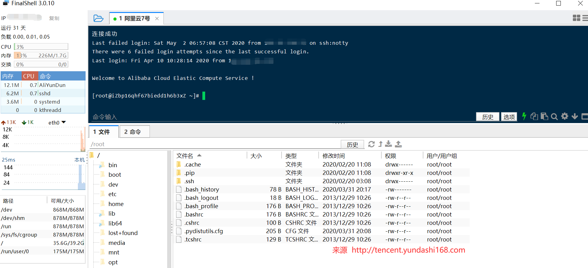

### 2、输入宝塔面板安装命令

> **温馨提示**：宝塔面板最近升级到了7.0版本，Centos7以上的系统建议安装宝塔面板最新版：https://www.bt.cn/bbs/thread-19376-1-1.html（宝塔面板7.x版本，点击查看安装命令）
> https://www.bt.cn/bbs/thread-30562-1-1.html（宝塔面板6.x版本，点击查看安装命令）

安装方法这里也有介绍（以宝塔面板5.x版本举例）：http://www.bt.cn/bbs/thread-1186-1-1.html

> 以下安装命令是宝塔面板5.x版本的，请注意。如果安装出错了，就去安装宝塔面板7.x版本

**Centos安装脚本：**

> yum install -y wget && wget -O install.sh http://download.bt.cn/install/install.sh && sh install.sh

**Ubuntu/Deepin安装脚本：**

> wget -O install.sh http://download.bt.cn/install/install-ubuntu.sh && sudo bash install.sh

Debian安装脚本：

> wget -O install.sh http://download.bt.cn/install/install-ubuntu.sh && bash install.sh

Fedora安装脚本:

> wget -O install.sh http://download.bt.cn/install/install.sh && bash install.sh

前两者偏多。根据操作系统输入不同的安装命令，然后回车

此间不需要任何操作。

### 3、宝塔面板安装成功

稍等一分钟（有时候网速差可能久一点)，然后不要关闭窗口

最终可以看到如下界面

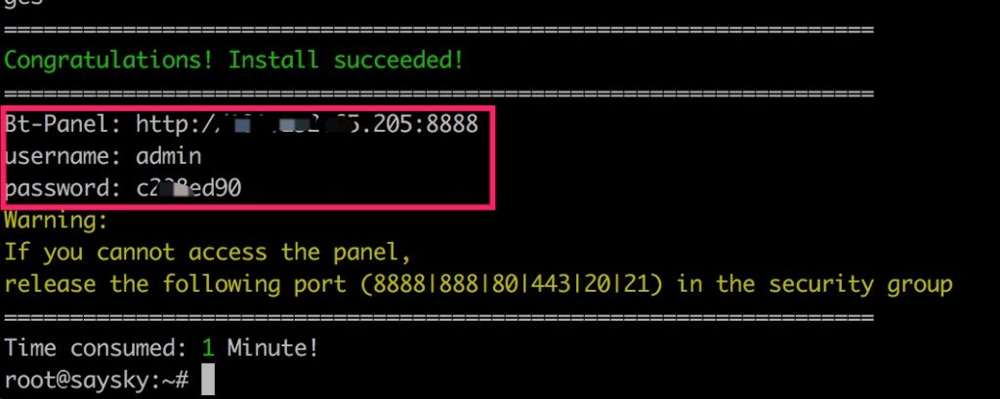

这里会显示宝塔后台地址和账号密码，可以手动复制到记事本暂时存起来。

### 三、配置安全组

> 如果你已经会设置安全组的话，就可以省略这一步，直接浏览器访问宝塔面板
> 访问地址：**[http://云服务器公网IP地址:8888/](http://xn--ip-962cm6ieyb1zkdpbxd959m7y4c:8888/)**

上面的黄色的字也说了，如果不能访问面板，请在安全组中放行端口。

因为刚装的系统，自然也没有放行8888端口，面板后台无法打开

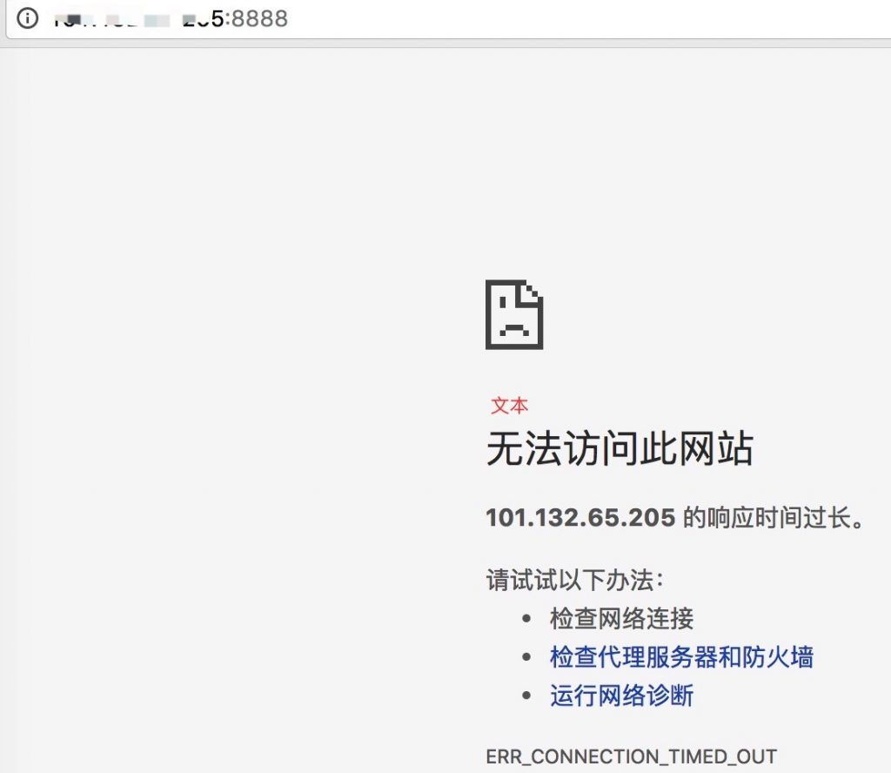

下面我们添加安全组

### 1、进入云服务器管理后台

进入[服务器](https://www.aliyun.com/activity/daily/cloud?source=5176.11533457&userCode=ywqc0ubl&type=copy)(实例)主页，点击右边的查看更多，点击安全组配置。

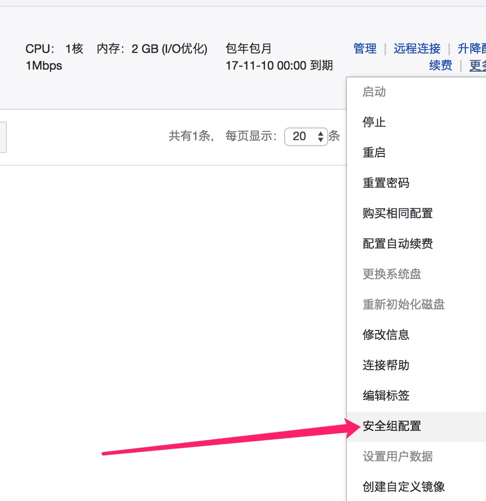

### 2、然后可以看到一条安全组

点击配置规则（如果没有就新建一条安全组）

### 3、点击快速创建规则

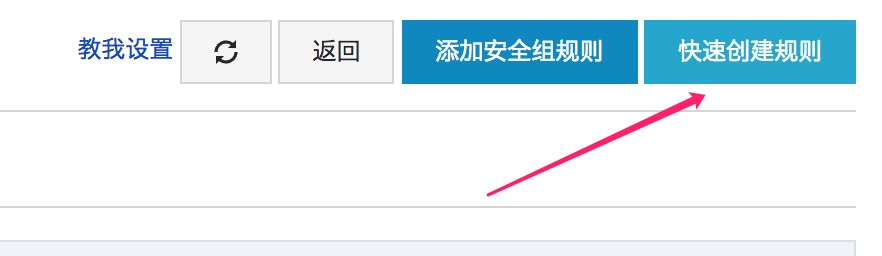

### 4、可以看到如下页面

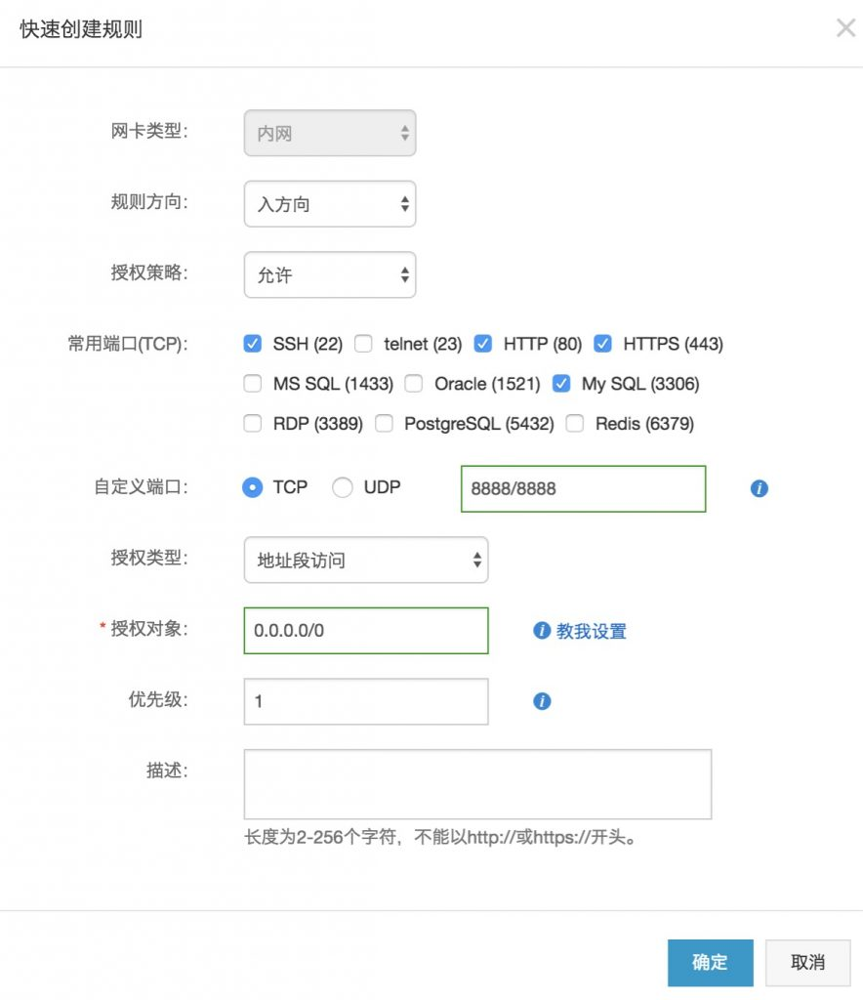

常用端口可以勾选，相当于多选。也可以自定义端口，比如我们要将8888和888添加进去。

授权对象像之前已经填的 0.0.0.0/0 一样。

基本就是这样。

### 5、最终安全记录如下

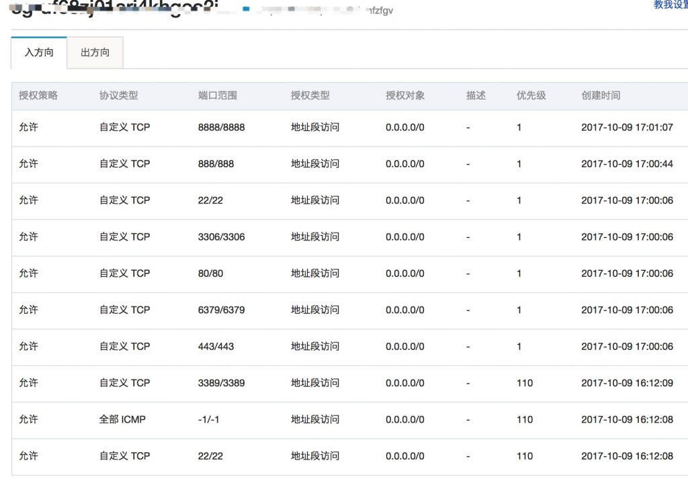

### 6、浏览器访问宝塔面板成功

然后我们再刷新之前的网页就能正常啦

> 在云服务器上安装宝塔面板成功之后，访问地址：**[http://云服务器公网IP地址:8888/](http://xn--ip-962cm6ieyb1zkdpbxd959m7y4c:8888/)**
> 输入安装的时候产生的默认**临时账号和密码登录**。登录之后，请一定记得去改账号和密码哦！

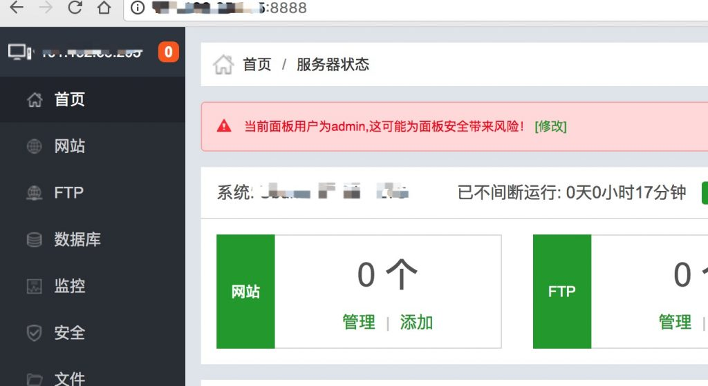

### 7、修改临时账号和密码

> 为了安全考虑，在云服务器上安装完成宝塔面板之后，你应该马上修改你的宝塔面板登录账户和密码（注意：这个账户和密码不是宝塔面板官网的，而是每个云服务器访问宝塔面板需要用到的账户和密码）

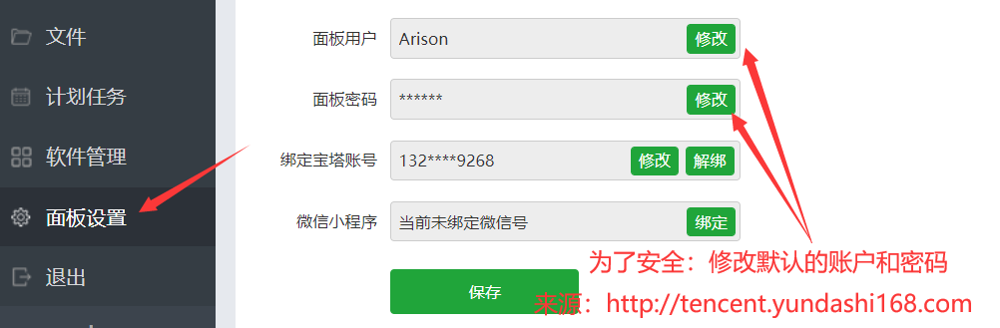

修改账号和密码之后，后面访问登录就是你新设置的账号和密码了

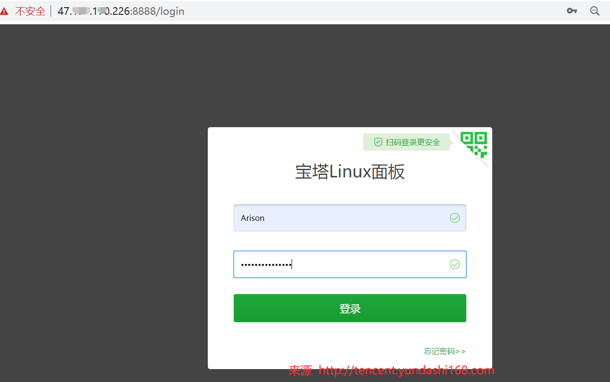

### 8、绑定宝塔面板账号

> 首先解释下为什么要绑定宝塔面板账号：每一台云服务器上安装了宝塔面板之后都需要去绑定你在宝塔面板官网上注册的 宝塔账号 这样每台云服务器的宝塔面板都可以享受你这个账号付过费的服务了。

安装宝塔面板之后必做的事情：[如何注册和绑定宝塔面板账号？](http://tencent.yundashi168.com/319.html)

[](https://i.loli.net/2020/05/02/uqXTf6wH5a14mvl.png)

### 9、安装LNMP网站环境

LNMP网站环境是Linux+Nginx+Mysql+PHP的组合搭配网站程序环境，用来快速搭建各种开源的网站程序（WordPress,帝国CMS，织梦，Zblog等）

**为什么选择LNMP?** 主要归功于Nignx服务器的功能强大和性能出色，还能节省服务器内存开销。

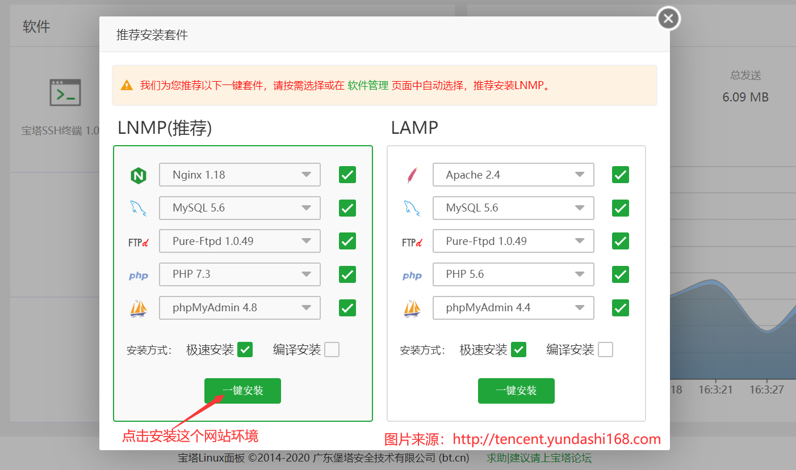

然后会出现这个界面，需要等待十分钟左右，这会你可以去忙其它事情，过会来看。

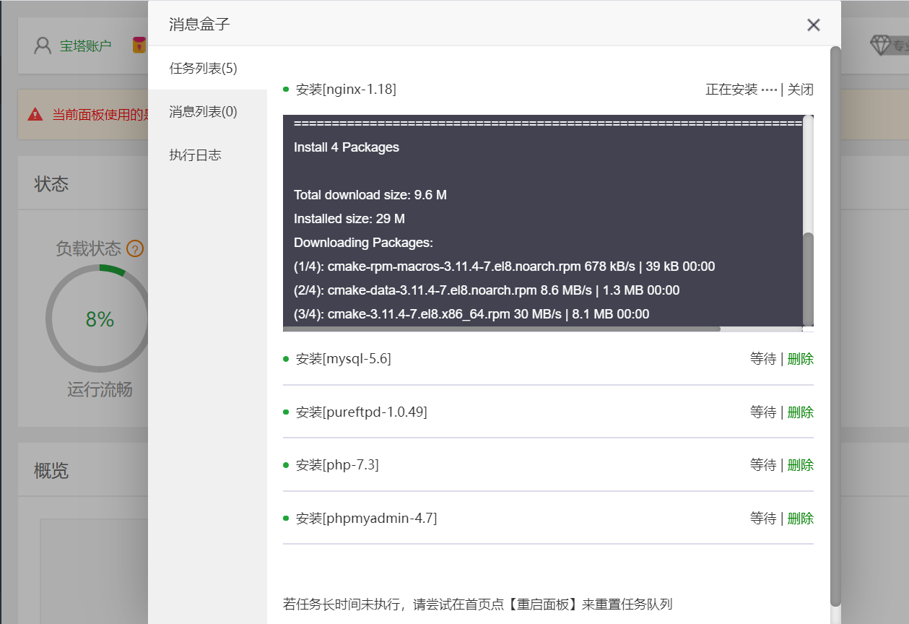

### 10、安装开源建站程序

完成了以上步骤之后，你就可以随心所以的基于宝塔面板来安装各种建站程序了

- [基于宝塔面板安装WordPress个人网站（图文教程）](http://tencent.yundashi168.com/421.html)
- [基于宝塔面板搭建Typecho博客网站（图文教程）](http://tencent.yundashi168.com/407.html)
- [基于宝塔面板安装Hexo个人博客（图文教程）](http://tencent.yundashi168.com/520.html)

------

- [基于宝塔面板对WordPress网站进行备份与恢复（网站迁移教程）](http://tencent.yundashi168.com/503.html)
- [宝塔面板干什么用的? 有什么优点？搭建网站为什么要用它？](http://tencent.yundashi168.com/258.html)
- [使用宝塔面板搭建网站之后的经验总结](http://tencent.yundashi168.com/325.html)

# 宝塔面板常用Linux命令

## 安装宝塔

Centos安装脚本

```
yum install -y wget && wget -O install.sh http://download.bt.cn/install/install_6.0.sh && sh install.sh
```

Ubuntu/Deepin安装脚本

```
wget -O install.sh http://download.bt.cn/install/install-ubuntu_6.0.sh && sudo bash install.sh
```

Debian安装脚本

```
wget -O install.sh http://download.bt.cn/install/install-ubuntu_6.0.sh && bash install.sh
```

Fedora安装脚本

```
wget -O install.sh http://download.bt.cn/install/install_6.0.sh && bash install.sh
```

## 管理宝塔

宝塔工具箱(包含下列绝大部分功能 直接ssh中执行bt命令 仅限6.x以上版本面板)

```
bt
```

停止

```
/etc/init.d/bt stop
```

启动

```
/etc/init.d/bt start
```

重启

```
/etc/init.d/bt restart
```

卸载

```
/etc/init.d/bt stop && chkconfig --del bt && rm -f /etc/init.d/bt && rm -rf /www/server/panel
```

查看当前面板端口

```
cat /www/server/panel/data/port.pl
```

修改面板端口，如要改成8881（centos 6 系统）

```
echo '8881' > /www/server/panel/data/port.pl && /etc/init.d/bt restart
iptables -I INPUT -p tcp -m state --state NEW -m tcp --dport 8881 -j ACCEPT
service iptables save
service iptables restart
```

修改面板端口，如要改成8881（centos 7 系统）

```
echo '8881' > /www/server/panel/data/port.pl && /etc/init.d/bt restart
firewall-cmd --permanent --zone=public --add-port=8881/tcp
firewall-cmd --reload

```

强制修改MySQL管理(root)密码，如要改成123456

```
cd /www/server/panel && python tools.py root 123456
```

修改面板密码，如要改成123456

```
cd /www/server/panel && python tools.py panel 123456
```

查看宝塔日志

```
cat /tmp/panelBoot.pl
```

查看软件安装日志

```
cat /tmp/panelExec.log
```

站点配置文件位置

```
/www/server/panel/vhost
```

删除域名绑定面板

```
rm -f /www/server/panel/data/domain.conf
```

清理登陆限制

```
rm -f /www/server/panel/data/*.login
```

查看面板授权IP

```
cat /www/server/panel/data/limitip.conf
```

关闭访问限制

```
rm -f /www/server/panel/data/limitip.conf
```

查看许可域名

```
cat /www/server/panel/data/domain.conf
```

关闭面板SSL

```
rm -f /www/server/panel/data/ssl.pl && /etc/init.d/bt restart
```

查看面板错误日志

```
cat /tmp/panelBoot
```

查看数据库错误日志

```
cat /www/server/data/*.err
```

站点配置文件目录(nginx)

```
/www/server/panel/vhost/nginx
```

站点配置文件目录(apache)

```
/www/server/panel/vhost/apache
```

站点默认目录

```
/www/wwwroot
```

数据库备份目录

```
/www/backup/database
```

站点备份目录

```
/www/backup/site
```

站点日志

```
/www/wwwlogs
```

## Nginx服务管理

nginx安装目录

```
/www/server/nginx
```

启动

```
/etc/init.d/nginx start
```

停止

```
/etc/init.d/nginx stop
```

重启

```
/etc/init.d/nginx restart
```

启载

```
/etc/init.d/nginx reload
```

nginx配置文件

```
/www/server/nginx/conf/nginx.conf
```

## Apache服务管理

apache安装目录

```
/www/server/httpd
```

启动

```
/etc/init.d/httpd start
```

停止

```
/etc/init.d/httpd stop
```

重启

```
/etc/init.d/httpd restart
```

启载

```
/etc/init.d/httpd reload
```

apache配置文件

```
/www/server/apache/conf/httpd.conf
```

## MySQL服务管理

mysql安装目录

```
/www/server/mysql
```

phpmyadmin安装目录

```
/www/server/phpmyadmin
```

数据存储目录

```
/www/server/data
```

启动

```
/etc/init.d/mysqld start
```

停止

```
/etc/init.d/mysqld stop
```

重启

```
/etc/init.d/mysqld restart
```

启载

```
/etc/init.d/mysqld reload
```

mysql配置文件

```
/etc/my.cnf
```

## FTP服务管理

ftp安装目录

```
/www/server/pure-ftpd
```

启动

```
/etc/init.d/pure-ftpd start
```

停止

```
/etc/init.d/pure-ftpd stop
```

重启

```
/etc/init.d/pure-ftpd restart
```

ftp配置文件

```
/www/server/pure-ftpd/etc/pure-ftpd.conf
```

## PHP服务管理

php安装目录

```
/www/server/php
```

启动(请根据安装PHP版本号做更改，例如：/etc/init.d/php-fpm-54 start)

```
/etc/init.d/php-fpm-{52|53|54|55|56|70|71|72|73|74} start

```

停止(请根据安装PHP版本号做更改，例如：/etc/init.d/php-fpm-54 stop)

```
/etc/init.d/php-fpm-{52|53|54|55|56|70|71|72|73|74} stop

```

重启(请根据安装PHP版本号做更改，例如：/etc/init.d/php-fpm-54 restart)

```
/etc/init.d/php-fpm-{52|53|54|55|56|70|71|72|73|74} restart

```

启载(请根据安装PHP版本号做更改，例如：/etc/init.d/php-fpm-54 reload)

```
/etc/init.d/php-fpm-{52|53|54|55|56|70|71|72|73|74} reload

```

配置文件(请根据安装PHP版本号做更改，例如：/www/server/php/52/etc/php.ini)

```
/www/server/php/{52|53|54|55|56|70|71|72|73|74}/etc/php.ini

```

## Redis服务管理

redis安装目录

```
/www/server/redis
```

启动

```
/etc/init.d/redis start
```

停止

```
/etc/init.d/redis stop
```

redis配置文件

```
/www/server/redis/redis.conf
```

## Memcached服务管理

memcached安装目录

```
/usr/local/memcached
```

启动

```
/etc/init.d/memcached start
```

停止

```
copy
/etc/init.d/memcached stop
```

重启

```
/etc/init.d/memcached restart
```

启载

```
/etc/init.d/memcached reload
```