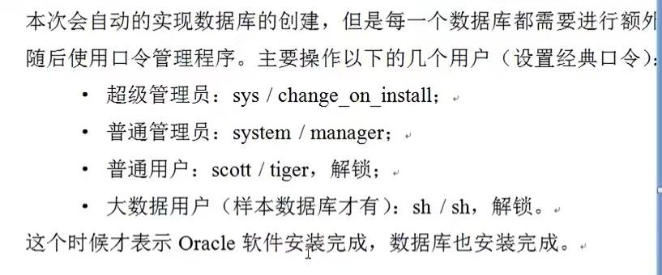
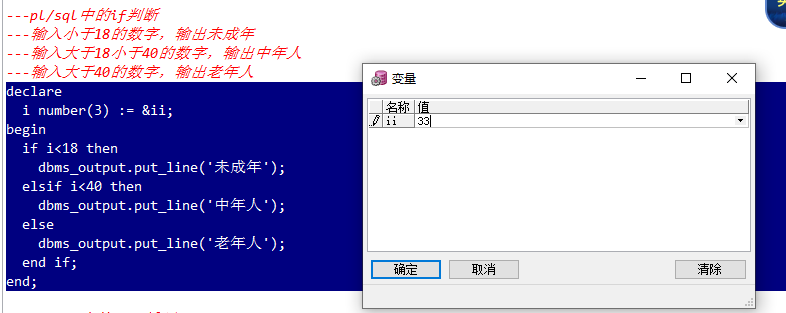

# Oracle中的数据库对象

**数据库对象**是数据库的**组成部分**，常常用**CREATE**命令进行创建，可以使用**ALTER**命令修改，用**DROP**执行删除操作。常见的数据库对象有**用户、表、视图、索引、函数、存储过程、触发器**等，以及Oracle特有的**表空间**

# 1、创建表空间创建用户以及用户授权

当前登录用户为**超级管理员**

```sql
--用户名
sys
--密码
change_on_install
```



## 1.1、创建、删除表空间

```sql
--创建表空间
create tablespace itheima
datafile 'C:\Users\smm\Desktop\Oracle\itheima.dbf'
size 100m
autoextend on
next 10m;
--删除表空间
drop tablespace itheima;
```

## 1.2、创建用户并给用户授权

```sql
--创建用户
create user zhu
identified by zhu
default tablespace itheima;

--给用户授权
--oracle数据库中常用角色
connect--连接角色，基本角色
resource--开发者角色
dba--超级管理员角色
--给itheima用户授予dba角色
grant dba to zhu;
```

# 2、对表进行操作

建表

```sql
---创建一个person表
create table person(
       pid number(20),
       pname varchar2(10)
);
```

修改表结构

```SQL
---添加一列
alter table person add (gender number(1));
---修改列类型
alter table person modify gender char(1);
---修改列名称
alter table person rename column gender to sex;
---删除一列
alter table person drop column sex;
```

增删改查

```sql
---查询表中记录
select * from person;
----添加一条记录
insert into person (pid, pname) values (1, '小明');
commit;
----修改一条记录
update person set pname = '小马' where pid = 1;
commit;

----三个删除
--删除表中全部记录
delete from person;
--删除表结构
drop table person;
--先删除表，再次创建表。效果等同于删除表中全部记录。
--在数据量大的情况下，尤其在表中带有索引的情况下，该操作效率高。
--索引可以提供查询效率，但是会影响增删改效率。
truncate table person;
```

# 3、序列

```sql
----序列不真的属于任何一张表，但是可以逻辑和表做绑定。
----序列：默认从1开始，依次递增，主要用来给主键赋值使用。
----dual：虚表，只是为了补全语法，没有任何意义。
create sequence s_person;
select s_person.nextval from dual;
----添加一条记录
insert into person (pid, pname) values (s_person.nextval, '小明');
commit;
select * from person;
```

**重点：**

1. s_person.nextval 序列的下一个值
2. 序列的当前值

# 4、scott用户，密码tiger

```sql
--解锁scott用户
alter user scott account unlock;
--解锁scott用户的密码【此句也可以用来重置密码】
alter user scott identified by tiger;
--切换到scott用户下
```

# 5、单行函数

```sql
--单行函数：作用于一行，返回一个值。
---字符函数
select upper('yes') from dual;--YES
select lower('YES') from dual;--yes
----数值函数
select round(56.16, 2) from dual;---四舍五入，后面的参数表示保留的位数
select trunc(56.16, 1) from dual;---直接截取，不在看后面位数的数字是否大于5.
select mod(10, 3) from dual;---求余数
----日期函数
----查询出emp表中所有员工入职距离现在几天。
select sysdate-e.hiredate from emp e;
----算出明天此刻
select sysdate+1 from dual;
----查询出emp表中所有员工入职距离现在几月。
select months_between(sysdate,e.hiredate) from emp e;
----查询出emp表中所有员工入职距离现在几年。
select months_between(sysdate,e.hiredate)/12 from emp e;
----查询出emp表中所有员工入职距离现在几周。
select round((sysdate-e.hiredate)/7) from emp e;
----转换函数
---日期转字符串
select to_char(sysdate, 'fm yyyy-mm-dd hh24:mi:ss') from dual;
---字符串转日期
select to_date('2018-6-7 16:39:50', 'fm yyyy-mm-dd hh24:mi:ss'),to_date('2018-6-7 11:39:50', 'yyyy-mm-dd hh:mi:ss') from dual;
----通用函数
---算出emp表中所有员工的年薪
----奖金里面有null值，如果null值和任意数字做算术运算，结果都是null。
select e.sal*12+nvl(e.comm, 0) from emp e;--如果e.comm为空，则返回0
```

**重点：**

1. nvl(e.comm, 0)：如果e.comm为空，则返回0

# 6、条件表达式

```sql
---条件表达式的通用写法，mysql和oracle通用
---给emp表中员工起中文名
select e.ename, 
       case e.ename
         when 'SMITH' then '曹贼'
           when 'ALLEN' then '大耳贼'
             when 'WARD' then '诸葛小儿'
               --else '无名'
                 end
from emp e;
---判断emp表中员工工资，如果高于3000显示高收入，如果高于1500低于3000显示中等收入，
-----其余显示低收入
select e.sal, 
       case 
         when e.sal>3000 then '高收入'
           when e.sal>1500 then '中等收入'
               else '低收入'
                 end
from emp e;
----oracle中除了起别名，都用单引号。
----oracle专用条件表达式
select e.ename, 
        decode(e.ename,
          'SMITH',  '曹贼',
            'ALLEN',  '大耳贼',
              'WARD',  '诸葛小儿',
                '无名') "中文名"             
from emp e;
```

# 7、多行函数

```sql
--多行函数【聚合函数】：作用于多行，返回一个值。
select count(1) from emp;---查询总数量
select sum(sal) from emp;---工资总和
select max(sal) from emp;---最大工资
select min(sal) from emp;---最低工资
select avg(sal) from emp;---平均工资
```

**重点：**

1. 【聚合函数】：作用于多行，返回一个值。

# 8、分组查询

```sql
---分组查询
---查询出每个部门的平均工资
---分组查询中，出现在group by后面的原始列，才能出现在select后面
---没有出现在group by后面的列，想在select后面，必须加上聚合函数。
---聚合函数有一个特性，可以把多行记录变成一个值。
select e.deptno, avg(e.sal)--, e.ename
from emp e
group by e.deptno;
---查询出平均工资高于2000的部门信息
select e.deptno, avg(e.sal) asal
from emp e
group by e.deptno
having avg(e.sal)>2000;
---所有条件都不能使用别名来判断。
--比如下面的条件语句也不能使用别名当条件
select ename, sal s from emp where sal>1500;

---查询出每个部门工资高于800的员工的平均工资
select e.deptno, avg(e.sal) asal
from emp e
where e.sal>800
group by e.deptno;
----where是过滤分组前的数据，having是过滤分组后的数据。
---表现形式：where必须在group by之前，having是在group by之后。
---查询出每个部门工资高于800的员工的平均工资
---然后再查询出平均工资高于2000的部门
select e.deptno, avg(e.sal) asal
from emp e
where e.sal>800
group by e.deptno
having avg(e.sal)>2000;--过滤分组是筛选一些东西出来
```

**重点：**

1. having：过滤分组是根据条件筛选一些东西出来

# 9、多表查询

```sql
---多表查询中的一些概念
---笛卡尔积
select *
from emp e, dept d;
---等值连接
select *
from emp e, dept d
where e.deptno=d.deptno;
---内连接
select *
from emp e inner join dept d
on e.deptno = d.deptno;
---查询出所有部门，以及部门下的员工信息。【外连接】
select *
from emp e right join dept d
on e.deptno=d.deptno;
---查询所有员工信息，以及员工所属部门
select *
from emp e left join dept d
on e.deptno=d.deptno;
---oracle中专用外连接
select *
from emp e, dept d
where e.deptno(+) = d.deptno;

select * from emp;
---查询出员工姓名，员工领导姓名
---自连接：自连接其实就是站在不同的角度把一张表看成多张表。
select e1.ename, e2.ename
from emp e1, emp e2
where e1.mgr = e2.empno;
------查询出员工姓名，员工部门名称，员工领导姓名，员工领导部门名称
select e1.ename, d1.dname, e2.ename, d2.dname
from emp e1, emp e2, dept d1, dept d2
where e1.mgr = e2.empno
and e1.deptno=d1.deptno
and e2.deptno=d2.deptno;
```

**注：**

1. 全连接（内连接）查询结果左表右表的主键都不为空
2. (+)：Oracle特有的左右连接
3. 笛卡尔积 ： 结果为两个表的长度相乘

# 10、子查询

> 查询语句作为查询条件或查询对象

```sql
---子查询
---子查询返回一个值
---查询出工资和SCOTT一样的员工信息
select * from emp where sal in
(select sal from emp where ename = 'SCOTT')
---子查询返回一个集合
---查询出工资和10号部门任意员工一样的员工信息
select * from emp where sal in
(select sal from emp where deptno = 10);
---子查询返回一张表
---查询出每个部门最低工资，和最低工资员工姓名，和该员工所在部门名称
---1，先查询出每个部门最低工资
select deptno, min(sal) msal
from emp 
group by deptno;
---2，三表联查，得到最终结果。
select t.deptno, t.msal, e.ename, d.dname
from (select deptno, min(sal) msal
      from emp 
      group by deptno) t, emp e, dept d
where t.deptno = e.deptno
and t.msal = e.sal
and e.deptno = d.deptno;
```

# 11、分页查询

```sql
----oracle中的分页
---rownum行号：当我们做select操作的时候，
--每查询出一行记录，就会在该行上加上一个行号，
--行号从1开始，依次递增，不能跳着走。

----排序操作会影响rownum的顺序
select rownum, e.* from emp e order by e.sal desc
----如果涉及到排序，但是还要使用rownum的话，我们可以再次嵌套查询。
select rownum, t.* from(
select rownum, e.* from emp e order by e.sal desc) t;


----emp表工资倒叙排列后，每页五条记录，查询第二页。
----rownum行号不能写上大于一个正数。
select * from(
    select rownum rn, tt.* from(
          select * from emp order by sal desc
    ) tt where rownum<11
) where rn>5


--第二种写法、一般不用
select *  
from (select rownum r ,emp.* from emp) b 
where b.r >5 and b.r <11 
```

**重点：**

1. 记住固定格式使用
2. rownum

# 12、视图

```sql
---视图的概念：视图就是提供一个查询的窗口，所有数据来自于原表。

---查询语句创建表
create table emp as select * from scott.emp;
select * from emp;
---创建视图【必须有dba权限】
create view v_emp as select ename, job from emp;
---查询视图
select * from v_emp;
---修改视图[不推荐]
update v_emp set job='CLERK' where ename='ALLEN';
commit;
---创建只读视图
create view v_emp1 as select ename, job from emp with read only;
---视图的作用？
---第一：视图可以屏蔽掉一些敏感字段。
---第二：保证总部和分部数据及时统一。
```

# 13、索引

```sql
--索引的概念：索引就是在表的列上构建一个二叉树
----达到大幅度提高查询效率的目的，但是索引会影响增删改的效率。
---单列索引
---创建单列索引
create index idx_ename on emp(ename);
---单列索引触发规则，条件必须是索引列中的原始值。
---单行函数，模糊查询，都会影响索引的触发。
select * from emp where ename='SCOTT'
---复合索引
---创建复合索引
create index idx_enamejob on emp(ename, job);
---复合索引中第一列为优先检索列
---如果要触发复合索引，必须包含有优先检索列中的原始值。
select * from emp where ename='SCOTT' and job='xx';---触发复合索引
select * from emp where ename='SCOTT' or job='xx';---不触发索引
select * from emp where ename='SCOTT';---触发单列索引。
```

# 14、pl/sql编程语言

```sql
---pl/sql编程语言是对sql语言的扩展，使得sql语言具有过程化编程的特性。
---pl/sql编程语言比一般的过程化编程语言，更加灵活高效。
---pl/sql编程语言主要用来编写存储过程和存储函数等。

---声明方法
---赋值操作可以使用:=也可以使用into查询语句赋值
declare
    i number(2) := 10;
    s varchar2(10) := '小明';
    ena emp.ename%type;---引用型变量
    emprow emp%rowtype;---记录型变量
begin
    dbms_output.put_line(i);
    dbms_output.put_line(s);
    select ename into ena from emp where empno = 7788;
    dbms_output.put_line(ena);
    select * into emprow from emp where empno = 7788;
    dbms_output.put_line(emprow.ename || '的工作为：' || emprow.job);
end;
```

重点：

1. 声明类型
   - emp.ename%type：拿到表中字段类型
   - emprow emp%rowtype：拿到表中一行记录类型
2. 查询出的ename赋值给ena使用into
3. 声明时的赋值使用 :=
4. 字符串拼接使用 ||

# 15、pl/sql中的if判断

```sql
---pl/sql中的if判断
---输入小于18的数字，输出未成年
---输入大于18小于40的数字，输出中年人
---输入大于40的数字，输出老年人
declare
  i number(3) := &ii;
begin
  if i<18 then
    dbms_output.put_line('未成年');
  elsif i<40 then
    dbms_output.put_line('中年人');
  else
    dbms_output.put_line('老年人');
  end if;
end;
```

**重点：**

1. dbms_output.put_line('未成年');输出语句
2. &ii弹出赋值框



# 16、pl/sql中的loop循环

```sql
---
---用三种方式输出1到10是个数字
---while循环
declare
  i number(2) := 1;
begin
  while i<11 loop
     dbms_output.put_line(i);
     i := i+1;
  end loop;  
end;
---exit循环
declare
  i number(2) := 1;
begin
  loop
    exit when i>10;
    dbms_output.put_line(i);
    i := i+1;
  end loop;
end;
---for循环
declare

begin
  for i in 1..10 loop
     dbms_output.put_line(i);  
  end loop;
end;
```

**重点：**

1. loop和end loop;相当于大括号括起来
2. exit when i>10; 当满足条件时循环结束
3. for i in 1..10 loop 输出从1到10

# 17、游标(相当于集合)

```sql
---游标：可以存放多个对象，多行记录。
---输出emp表中所有员工的姓名
declare
  cursor c1 is select * from emp;
  emprow emp%rowtype;
begin
  open c1;
     loop
         fetch c1 into emprow;
         exit when c1%notfound;
         dbms_output.put_line(emprow.ename);
     end loop;
  close c1;
end;

-----给指定部门员工涨工资
declare
  cursor c2(eno emp.deptno%type) 
  is select empno from emp where deptno = eno;
  en emp.empno%type;
begin
  open c2(10);
     loop
        fetch c2 into en;
        exit when c2%notfound;
        update emp set sal=sal+100 where empno=en;
        commit;
     end loop;  
  close c2;
end;
----查询10号部门员工信息
select * from emp where deptno = 10;
```

**重点：**

1. cursor 游标关键字
2. fetch c1 into emprow; 获取集合中的每一个值赋值给emprow
3. open c2(10); close c2; 使用需要打开和关闭游标

# 18、存储过程

## 18.1、

```sql
--存储过程：存储过程就是提前已经编译好的一段pl/sql语言，放置在数据库端
--------可以直接被调用。这一段pl/sql一般都是固定步骤的业务。
----给指定员工涨100块钱
create or replace procedure p1(eno emp.empno%type)
is

begin
   update emp set sal=sal+100 where empno = eno;
   commit;
end;

select * from emp where empno = 7788;
----测试p1
declare

begin
  p1(7788);
end;
```

## 18.2、

```sql
----通过存储函数实现计算指定员工的年薪
----存储过程和存储函数的参数都不能带长度
----存储函数的返回值类型不能带长度
create or replace function f_yearsal(eno emp.empno%type) return number
is
  s number(10);     
begin
  select sal*12+nvl(comm, 0) into s from emp where empno = eno;
  return s;
end;

----测试f_yearsal
----存储函数在调用的时候，返回值需要接收。
declare
  s number(10); 
begin
  s := f_yearsal(7788);
  dbms_output.put_line(s);
end;
```

## 18.3、out类型参数如何使用

```sql
---out类型参数如何使用
---使用存储过程来算年薪
create or replace procedure p_yearsal(eno emp.empno%type, yearsal out number)
is
   s number(10);
   c emp.comm%type;
begin
   select sal*12, nvl(comm, 0) into s, c from emp where empno = eno;
   yearsal := s+c;
end;

---测试p_yearsal
declare
  yearsal number(10);
begin
  p_yearsal(7788, yearsal);
  dbms_output.put_line(yearsal);
end;
```

**重点：**

1. 凡是涉及到into查询语句赋值或者:=赋值操作的参数，都必须使用out来修饰

## 18.4、in和out类型参数的区别是什么？

```sql
----in和out类型参数的区别是什么？
---凡是涉及到into查询语句赋值或者:=赋值操作的参数，都必须使用out来修饰
out为输出类型，默认为in
```

# 19、存储过程和存储函数的区别

```sql
---语法区别：关键字不一样，
------------存储函数比存储过程多了两个return。
---本质区别：存储函数有返回值，而存储过程没有返回值。
----------如果存储过程想实现有返回值的业务，我们就必须使用out类型的参数。
----------即便是存储过程使用了out类型的参数，起本质也不是真的有了返回值，
----------而是在存储过程内部给out类型参数赋值，在执行完毕后，我们直接拿到输出类型参数的值。

----我们可以使用存储函数有返回值的特性，来自定义函数。
----而存储过程不能用来自定义函数。
----案例需求：查询出员工姓名，员工所在部门名称。
----案例准备工作：把scott用户下的dept表复制到当前用户下。
create table dept as select * from scott.dept;
----使用传统方式来实现案例需求
-------------------------------------------1---------------------------------------------
select e.ename, d.dname
from emp e, dept d
where e.deptno=d.deptno;
-------------------------------------------2---------------------------------------------
----使用存储函数来实现提供一个部门编号，输出一个部门名称。
create or replace function fdna(dno dept.deptno%type) return dept.dname%type
is
  dna dept.dname%type;
begin
  select dname into dna from dept where deptno = dno;
  return dna;
end;
---使用fdna存储函数来实现案例需求：查询出员工姓名，员工所在部门名称。
select e.ename, fdna(e.deptno)
from emp e;
```

# 20、触发器

## 20.1、语句级触发器

```SQL
---触发器，就是制定一个规则，在我们做增删改操作的时候，
----只要满足该规则，自动触发，无需调用。
----语句级触发器：不包含有for each row的触发器。
----行级触发器：包含有for each row的就是行级触发器。
-----------加for each row是为了使用:old或者:new对象或者一行记录。


---语句级触发器
----插入一条记录，输出一个新员工入职
create or replace trigger t1
after
insert
on person
declare

begin
  dbms_output.put_line('一个新员工入职');
end;
---触发t1
insert into person values (2, '小红');
commit;
select * from person;
```

**重点：**

1. after 定义语句执行前后触发
   insert 执行的操作
   on person 操作对应的表

## 20.2、行级别触发器

```sql
---行级别触发器
---不能给员工降薪
---raise_application_error(-20001~-20999之间, '错误提示信息');
create or replace trigger t2
before
update
on emp
for each row
declare

begin
  if :old.sal>:new.sal then
     raise_application_error(-20001, '不能给员工降薪');
  end if;
end;
----触发t2
select * from emp where empno = 7788;
update emp set sal=sal-1 where empno = 7788;
commit;
```

**重点：**

1. for each row 行级别触发器使用的
2. raise_application_error(-20001, '不能给员工降薪'); sql中抛异常的语句
3. 加for each row是为了使用:old或者:new对象或者一行记录。

## 20.3、触发器实现主键自增。【行级触发器】

```sql
----触发器实现主键自增。【行级触发器】
---分析：在用户做插入操作的之前，拿到即将插入的数据，
------给该数据中的主键列赋值。
create or replace trigger auid
before
insert
on person
for each row
declare

begin
  select s_person.nextval into :new.pid from dual;
end;
--查询person表数据
select * from person;
---使用auid实现主键自增
insert into person (pname) values ('鸣人');
commit;
insert into person values (1, '小樱');
commit;
```

# 21、java调用存储过程和存储函数

## 21.1、准备工作(maven、jdbc)

```xml
  <!--连接Oracle数据库-->
        <dependency>
            <groupId>com.oracle</groupId>
            <artifactId>ojdbc6</artifactId>
            <version>11.2.0.3</version>
        </dependency>
        <dependency>
            <groupId>junit</groupId>
            <artifactId>junit</artifactId>
            <version>4.12</version>
            <scope>test</scope>
        </dependency>
```

测试:

```java
 @Test
    public void javaCallOracle() throws Exception {
        //加载数据库驱动
        Class.forName("oracle.jdbc.driver.OracleDriver");
        //得到Connection连接
        Connection connection = DriverManager.getConnection("jdbc:oracle:thin:@127.0.0.1:1521:MLDN",
                "zhu", "zhu");
        //得到预编译的Statement对象
        PreparedStatement pstm = connection.prepareStatement("select * from emp where empno = ?");
        //给参数赋值
        pstm.setObject(1, 7788);
        //执行数据库查询操作
        ResultSet rs = pstm.executeQuery();
        //输出结果
        while(rs.next()){
            System.out.println(rs.getString("ename"));
        }
        //释放资源
        rs.close();
        pstm.close();
        connection.close();
    }
```

## 21.2、java调用存储过程

```java
/**
     * java调用存储过程
     * {?= call <procedure-name>[(<arg1>,<arg2>, ...)]}   调用存储函数使用
     *  {call <procedure-name>[(<arg1>,<arg2>, ...)]}   调用存储过程使用
     * @throws Exception
     */
    @Test
    public void javaCallProcedure() throws Exception {
        //加载数据库驱动
        Class.forName("oracle.jdbc.driver.OracleDriver");
        //得到Connection连接
        Connection connection = DriverManager.getConnection("jdbc:oracle:thin:@127.0.0.1:1521:MLDN",
                "zhu", "zhu");
        //得到预编译的Statement对象
        CallableStatement pstm = connection.prepareCall("{call p_yearsal(?, ?)}");
        //给参数赋值
        pstm.setObject(1, 7788);
        pstm.registerOutParameter(2, OracleTypes.NUMBER);
        //执行数据库查询操作
        pstm.execute();
        //输出结果[第二个参数]
        System.out.println(pstm.getObject(2));
        //释放资源
        pstm.close();
        connection.close();
    }
```

## 21.3、java调用存储函数

```java
 /**
     * java调用存储函数
     * {?= call <procedure-name>[(<arg1>,<arg2>, ...)]}   调用存储函数使用
     *  {call <procedure-name>[(<arg1>,<arg2>, ...)]}   调用存储过程使用
     * @throws Exception
     */
    @Test
    public void javaCallFunction() throws Exception {
        //加载数据库驱动
        Class.forName("oracle.jdbc.driver.OracleDriver");
        //得到Connection连接
        Connection connection = DriverManager.getConnection("jdbc:oracle:thin:@127.0.0.1:1521:MLDN",
                "zhu", "zhu");
        //得到预编译的Statement对象
        CallableStatement pstm = connection.prepareCall("{?= call f_yearsal(?)}");
        //给参数赋值
        pstm.setObject(2, 7788);
        pstm.registerOutParameter(1, OracleTypes.NUMBER);
        //执行数据库查询操作
        pstm.execute();
        //输出结果[第一个参数]
        System.out.println(pstm.getObject(1));
        //释放资源
        pstm.close();
        connection.close();
    }
```

测试通过