# 线程是什么？

线程是操作系统能够进行运算调度的最小单位，它被包含在进程之中;

一个进程可以并发多个线程，每条线程并行执行不同的任务;

多线程程序设计的好处是提高了程序的执行吞吐率和执行效率。

## 多线程的常见应用场景

后台任务，:定时向大量用户推送信息例如广告部件，不胜其扰，大家定有体会

异步处理，例如:批量/O操作,发微博、记录日志等

分布式计算，共享稀有资源和平衡负载

web服务器本身，例如: Tomcat

- Tomcat是一个服务器。我们将写好的服务端代码部署到Tomcat中进行工作，一个Tomcat服务器可以同时负载多个不同的项目的服务，每个服务又可以是多线程的。

# 1、顺序执行与并行

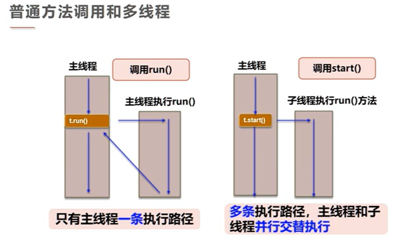

# 2、继承Thread类

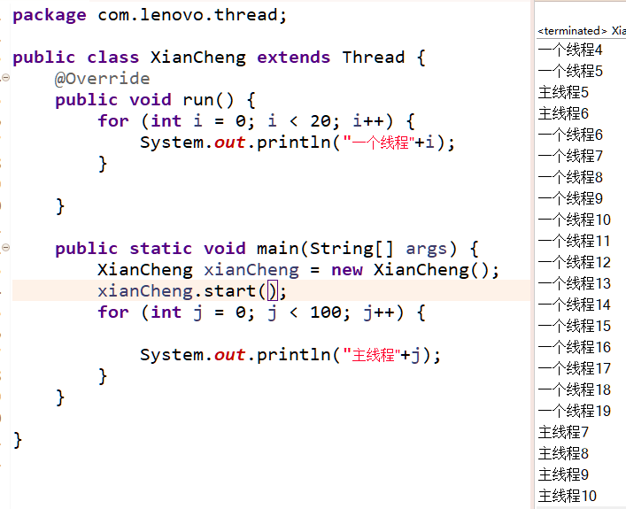

# 3、实现Runnable接口

继承Thread类不建议使用，避兔oop局限性
实现Runnable接口推荐使用，避兔单继承局限性,方便同一个对象被多个线程使用

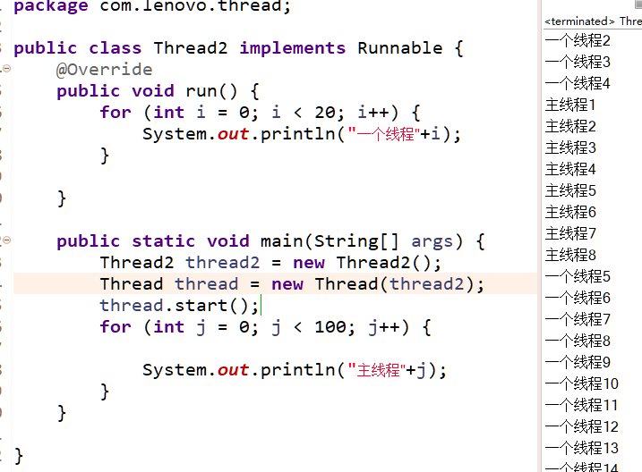

# 4、并发问题

## 4.1、如小明老师和黄牛党同时抢10张票，双方都可能抢到第6张票

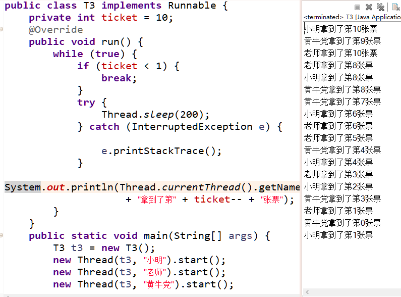

## 4.2、顺序执行，并行，并发的比较例题

**顺序执行:**你吃饭吃到一半，电话来了,你-直到吃完了以后才去接,这就说明你不支持并发也不支持并行。

**并发:**你吃饭吃到一半,电话来了，你停了下来接了电话，接完后继续吃饭，这说明你支持并发。

----------》交替做不同事情的能力

**并行:**你吃饭吃到一半,电话来了,你-边打电话- -边吃饭，这说明你支持并行。此处注意理解:是同时吃，同时说，要真严格的说的话，需要2张嘴才是并行。

----------》同时做不同事情的能力

# 5、线程状态

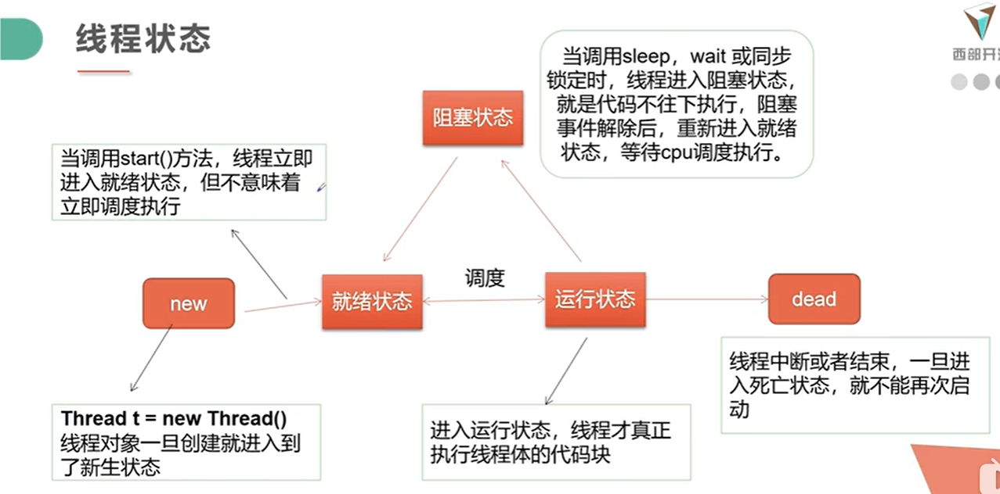

# 6、线程停止

## 6.1、建议线程正常停止--- >利用次数,不建议死循环。

## 6.2、建议使用标志位--->设置一个标志位

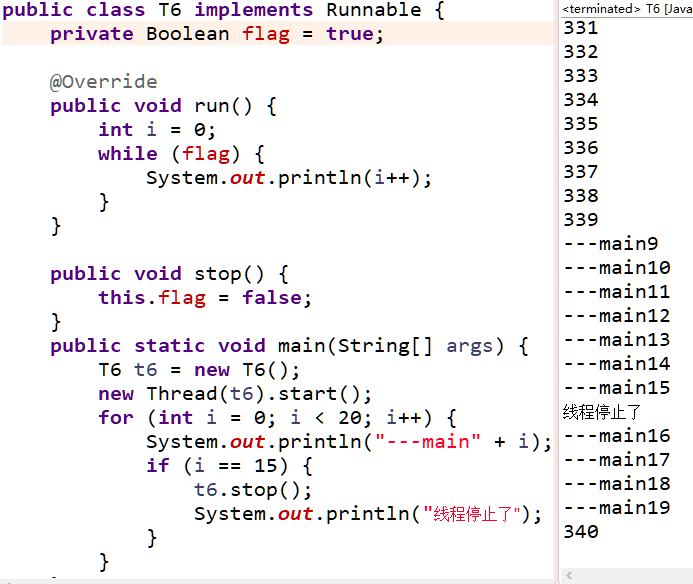

## 6.3、不要使用stop或者destroy等过时或者jdk不建议使用的方法

# 7、线程休眠sleep ()

## 7.1、模拟倒计时

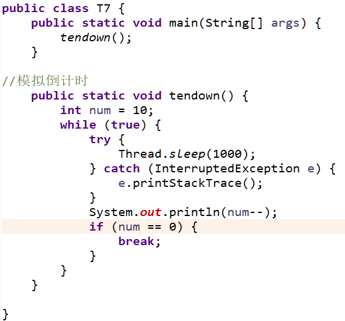

## 7.2、打印系统当前时间

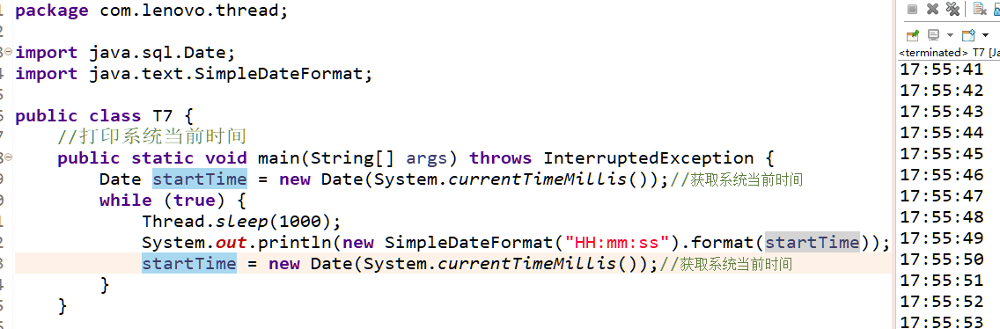

## 7.3、每个对象都有-把锁，sleep不会释放锁

# 8、线程礼让yield()

礼让不一定成功，看CPU心情

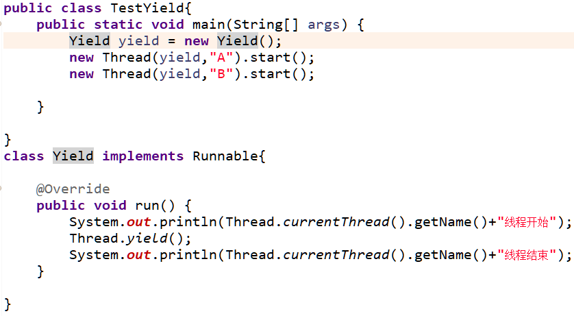

- 礼让成功时

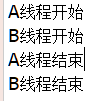

- 礼让不成功时

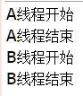

# 9、线程强制执行join ()

想像为vip插队的测试

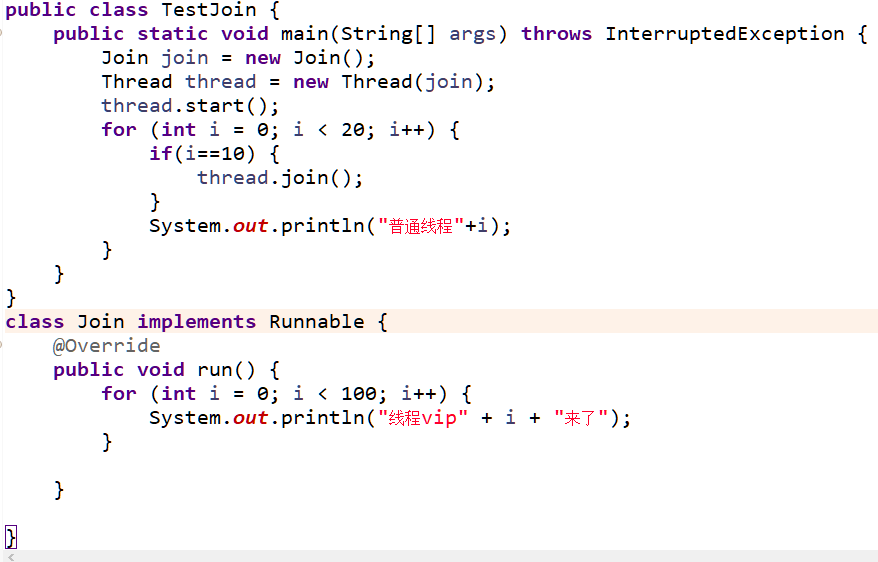

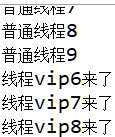

# 10、观察线程状态getState()

getState()

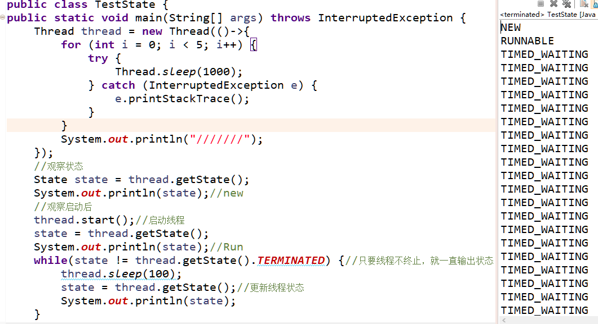

# 11、线程优先级setPriority(1), getPriority()

先设置优先级再启动

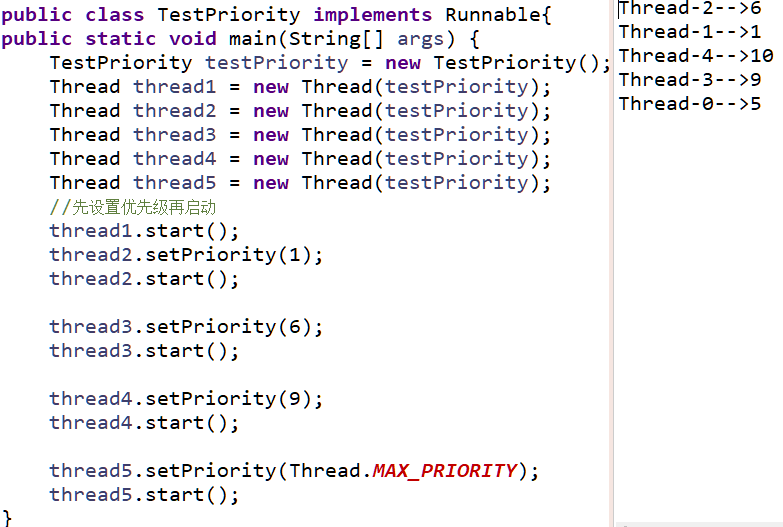

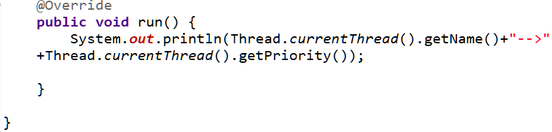

# 12、守护线程setDaemon(true)

线程分为用户线程和守护线程，其它都为用户线程

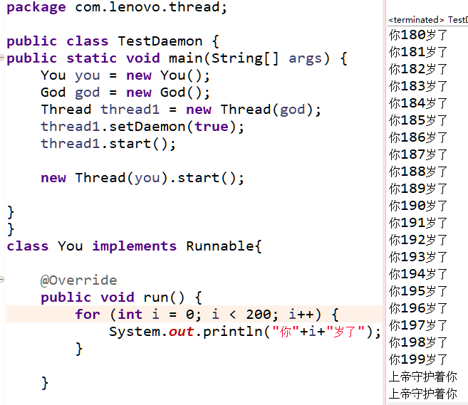

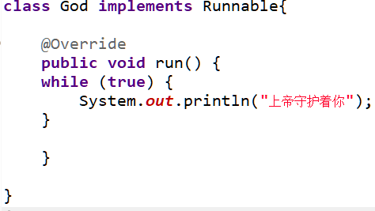

虚拟机必须确保用户线程执行完毕，虚拟机不必确保守护线程执行完毕

如果JVM中没有一个正在运行的非守护线程，这个时候，JVM会退出。换句话说，守护线程拥有自动结束自己生命周期的特性，而非守护线程不具备这个特点。

通常来说，**守护线程经常被用来执行一些后台任务,但是呢，你又希望在程序退出时，或者说JVM退出时，线程能够自动关闭，此时，守护线程是你的首选。**

# 13、线程同步

队列+锁----------》有锁线程安全

# 14、线程不安全三大案例

## 14.1、三人共同买票超过了票的数量

## 14.2、两人取钱超过了钱的金额

## 14.3、ArrayList容器添加大量数据时（向容器中添加1000条数据只添加了998条）

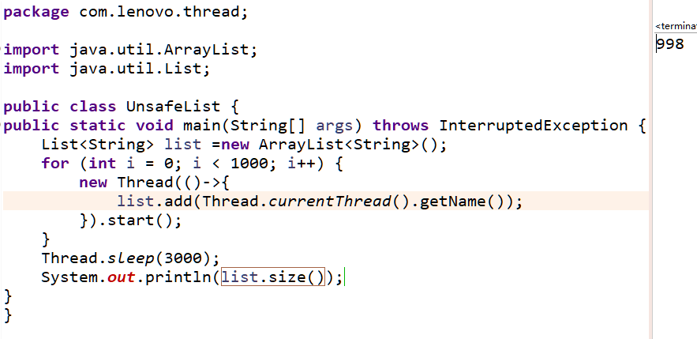

# 15、实现线程同步来实现线程安全

**synchronized每个对象对应一把锁，默认锁的是this，锁的对象就是变化的量（增删改的量）**

## 15.1、使用同步方法

------------》方法中加关键字synchronized

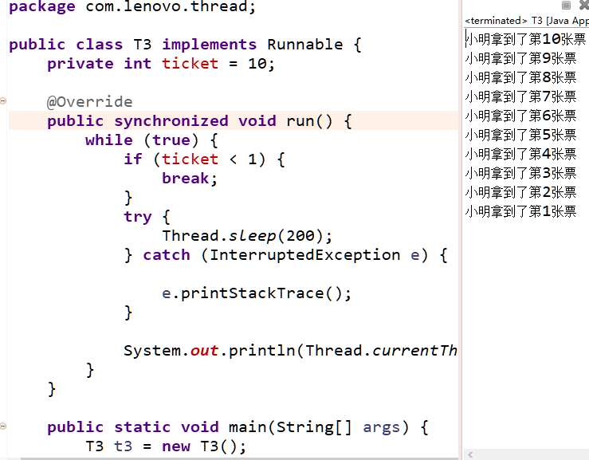

## 15.2、使用同步代码块

-----------》放进代码块中synchronized（变化的量）{}

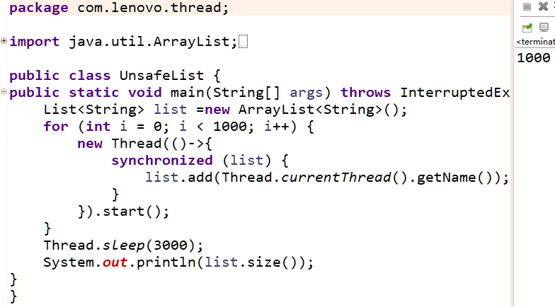

# 16、JUC (并发领域的一些编程)

**线程安全类型的一些类**----------------------》例如：CopyOnWriteArrayList线程安全的集合

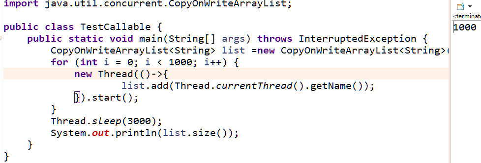

# 17、死锁

## 17.1、定义

多个线程互相抱着对方的资源，然后形成僵持

## 17.2、产生死锁的四个必要条件

1.互斥条件: 一个资源每次只能被一个进程使用。

2.请求与保持条件:一个 进程因请求资源而阻塞时，对已获得的资源保持不放。

3.不剥夺条件:进程已获得的资源，在末使用完之前，不能强行剥夺。

4.循环等待条件:若干进程之间形成-种头尾相接的循环等待资源关系。

上面列出了死锁的四个必要条件,我们只要想办法破其中的任意一个或多 个条件就可以避免死锁发生

## 17.3、就是同步时，想拿到另一个线程正在用着的资源时

# 18、锁Lock

从jdk5.0开始，ReentrantLock类实现了Lock

使用Lock锁，JVM将花费较少的时间来调度线程，性能更好。并且具有更好的扩展性(提供更多的子类)

◆优先使用顺序:

◆Lock >同步代码块(已经进入了方法体，分配了相应资源) >同步方法(在方法体之外)

**synchronized与Lock的对比**

1、Lock是显式锁(手动开启和关闭锁，别忘记关闭锁) synchronized是隐式锁， 出了 作用域自动释放

2、Lock只有代码块锁，synchronized有代码块锁和方法锁

# 19、线程通信

生成者消费者模式

- 线程等待wait()/wait(指定等待的毫秒数)
- 线程唤醒notify()/notfyAll()

测试：

- 1.生产者消费者模型-->利用缓冲区解决：管程法（利用容器）

  - 生产者

    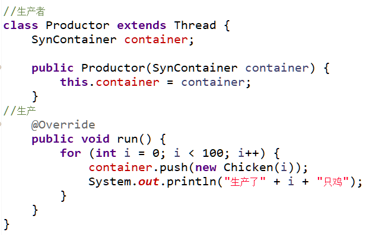

  - 消费者

    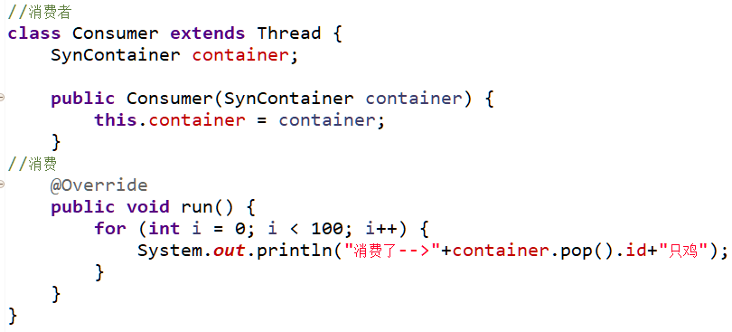

  - 缓冲区

    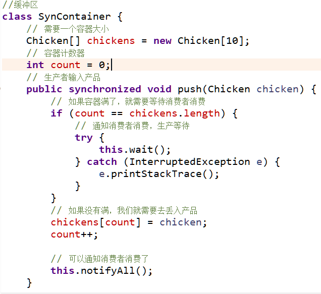

    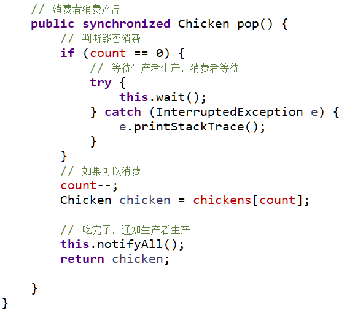

  - 产品

    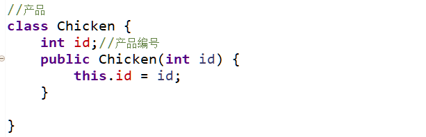

  - 测试类

    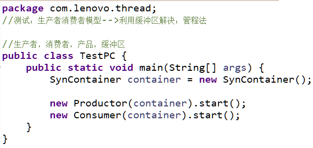

  - 结果

- 信号灯法（利用标志位）

  - 生产者

    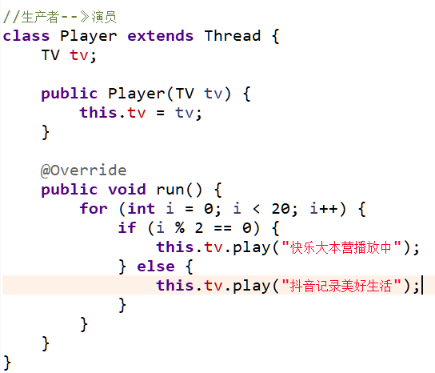

  - 消费者

    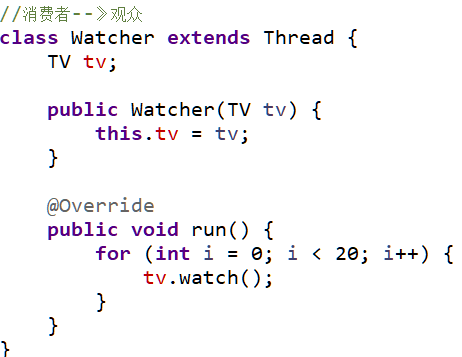

  - 产品

    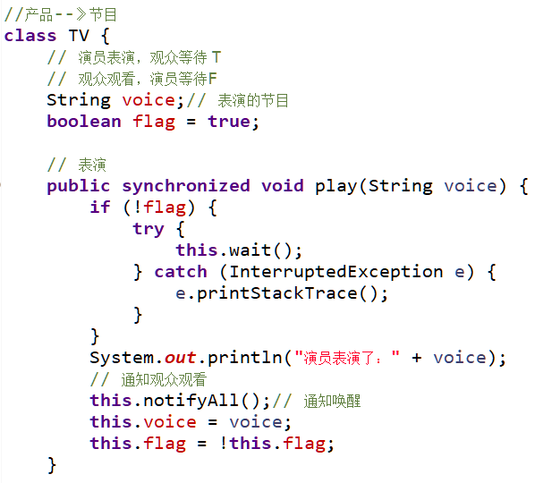

    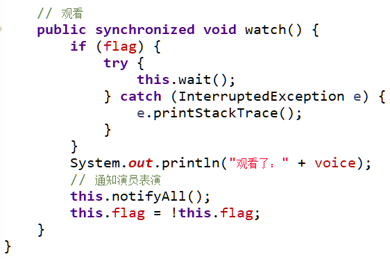

  - 测试

    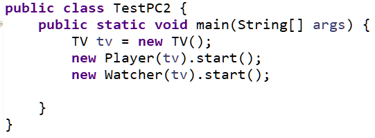

  - 结果

    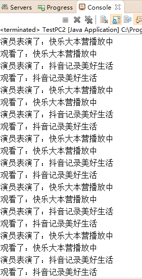

# 20、线程池ExeutorSeriefOExecutors

利用线程池创建线程

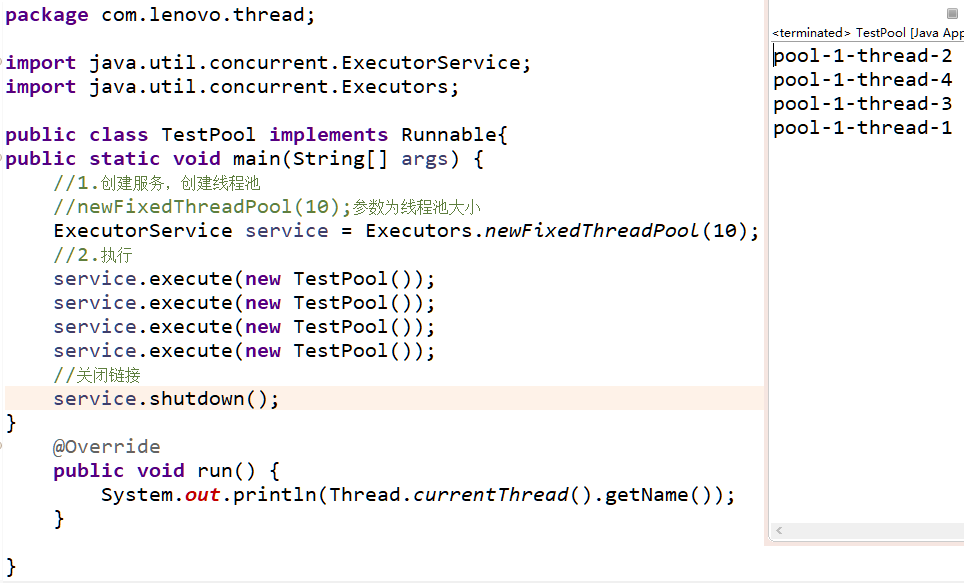

# 21、wait、sleep区别

## 21.1、来自不同的类

wait => Object
sleep => Thread

## 21.2、关于锁的释放

wait会释放锁。

sleep睡觉了,抱着锁睡觉,不会释放!

## 21.3、使用的范围是不同的

wait必须在同步代码块中
sleep可以再任何地方睡

## 21.4、是否需要捕获异常

wait不需要捕获异常
sleep必须要捕获异常

# 22、实现Callable接口(java.util.concurrent.Callable)