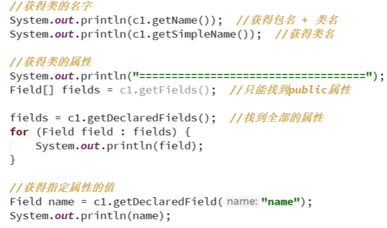
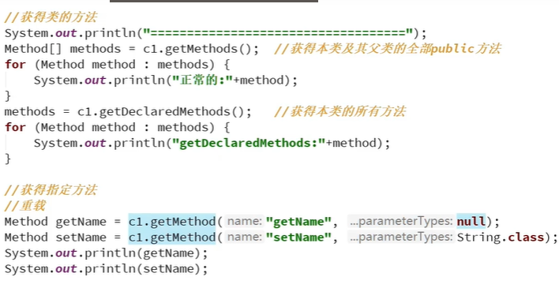
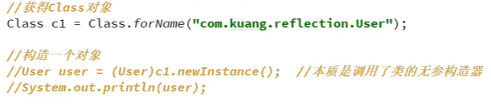
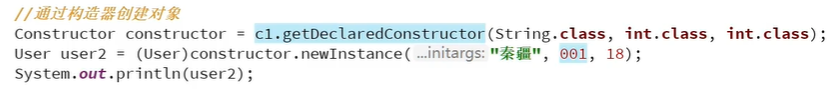
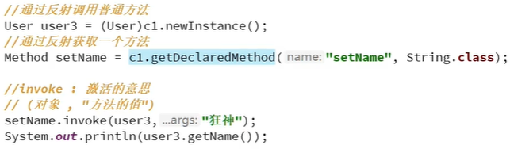
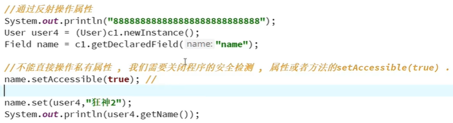

# 1、反射是什么？

动态语言在程序运行时可改变其结构，反射是java被视为动态语言的关键。

# 2、通过反射获取类的Class对象

## 2.1、

Class c1 = Class.forName ("包名+类名") ;

## 2.2、

Class c2 =对象.getClass(); .

## 2.3、

Class c3 =类名.class;

**注意：**

1.一个类在内存中只有一个Class对象
2.一个类被加载后，类的整个结构都会封装在Class对象中。

# 3、什么时候会发生类的初始化

## 3.1、类的主动引用(一定会发生类的初始化)

1. 当虚拟机启动，先初始化main方法所在的类
2. new一个类的对象时
3. 调用类的静态成员(除了final常量)和静态方法
4. 通过反射调用时(使用java.lang.reflect包的方 法对类进行反射调用)
5. 当初始化一个类，如果其父类没有被初始化，则先会初始化它的父类

## 3.2、类的被动引用(不会发生类的初始化)

1. 当访问一个静态域时，只有真正声明这个域的类才会被初始化。如:当通过子类引用父类的静态变量，不会导致子类初始化
2. 通过数组定义类引用，不会触发此类的初始化
3. 引用常量不会触发此类的初始化(常量在链接阶段就存入调用类的常量池中了)

# 4、类加载器

## 4.1、

加载:将class文件字节码内容加载到内存中，并将这些静态数据转换成方法区的运行时数据结构,然后生成一个代表这个类的java.lang.Class对象.

1. 验证:确保加载的类信息符合JVM规范，没有安全方面的问题
2. 准备:正式为类变量(static)分配内存并设置类变量默认初始值的阶段，这些内存都将在方法区中进行分配。
3. 解析:虚拟机常量池内的符号引用(常量名)替换为直接引弓|用(地址)的过程。

## 4.2、

链接:将Java类的二进制代码合并到JVM的运行状态之中的过程。

## 4.3、

初始化:

1. 执行类构造器 ()方法的过程。类构造器< clinit> ()方法是由编译期自动收集类中所有类变量的赋值动作和静态代码块中的语句台并产生的。(类构造器是构造类信息的，不是构造该类对象的构造器)。
2. 当初始化一个类的时候，如果发现其父类还没有进行初始化则需要先触发其父类的初始化。
3. 虚拟机会保证一个类的 ()方法在多线程环境中被正确加锁和同步。

# 5、反射的一些方法

**获得类的名字**

getName（）获得包名+类名

getSimpleName（）获得类名

**获得类的属性**

getFields（）只能找到public属性

getDeclaredFields（）找到全部属性

**获得指定属性的值**

getDeclaredFields(“name”)

**获得类的方法**

getMethods（）获得本类及其父类的全部public方法

getDeclaredMethods（）获得本类的所有方法

getMethods(参数) 获取指定方法

**获取构造器**

getConstructors（）获取public修饰的构造器
getDeclaredConstructors（）获取所有的构造器
getConstructors(参数) 获取指定构造器

**例**

# 6、通过反射获取类的运行时结构

## 6.1、通过反射动态创建对象

**newInstance()**

1.调用无参构造方法

2.通过构造器创建对象

## 6.2、通过反射调用方法

**getDeclaredMethods(“参数”)**

**invoke（）激活**

## 6.3、通过反射操作属性

**getDeclaredFields(“name”)**

**setAccessible(true)不能直接操作程序的私有属性，我们需要关闭程序的安全检测**

转载于[狂神老师](https://www.cnblogs.com/hellokuangshen/) ，本文仅作为笔记使用