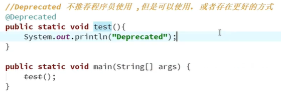
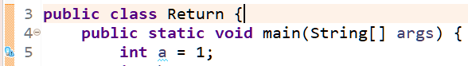
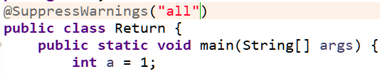
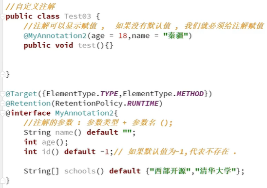
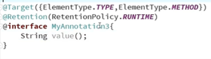
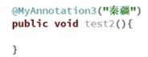

# 1、什么是注解

检查约束作用，可利用反射去读取注解

# 2、内置注解

**@Override**

重写的注解

**@Deprecated**

过时的注解

不推荐程序员使用，但是可以使用，或者存在更好的方式

**@SuppressWarningsl(all")**

镇压警告,消除警告的提示

# 3、元注解

负责解释其它注解的注解，使用元注解我们可以自定义注解

**@Target**({TYPE, FIELD, METHOD, PARAMETER, CONSTRUCTOR, LOCAL_VARIABLE, MODULE})

表示我们的注解可以用在哪些地方

**@Retention**(RetentionPolicy.SOURCE)

表示我们的注解在哪些地方还有效runtime>class>sources

**@Documented**

表示是否将我们的注解生成在JAVAdoc中

**@Inherite**
类可以继承父类的注解

# 4、自定义注解

## 4.1、使用interface定义注解

## 4.2、第二种方式

