#  

# mongoDB

 

### 一、MongoDB的引言

MongoDB是一个基于分布式文件存储的数据库。由C++语言编写。旨在为WEB应用提供可扩展的高性能数据存储解决方案。 Nosql 技术门类 redis 内存型 mongodb 文档型

 

MongoDB是一个介于关系数据库和非关系数据库之间的产品，是非关系数据库当中功能最丰富，最像关系数据库的。他支持的数据结构非常松散，是类似json的bson格式，因此可以存储比较复杂的数据类型。Mongo最大的特点是他支持的查询语言非常强大，其语法有点类似于面向对象的查询语言，几乎可以实现类似关系数据库单表查询的绝大部分功能，而且还支持对数据建立索引。

 

### 二、MongoDB的特点

l 面向集合存储，易存储对象类型的数据

l 支持查询,以及动态查询

l 支持RUBY，PYTHON，JAVA，C++，PHP，C#等多种语言

l 文件存储格式为BSON（一种JSON的扩展）

l 支持复制和故障恢复和分片

 

### 三、MongoDB的安装和使用

\1.    下载mongoDB的安装包(最新版本3.6,只能在64位系统安装)这里使用的3.0.6版本

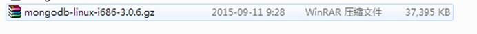

\2.    上传至linux系统中解压当前的linux系统

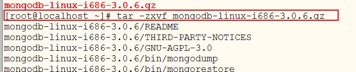

\3.    将解压的文件为了方便目录进行重命名(这步可以跳过)

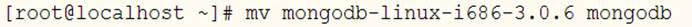

\4.    进入mongodb的文件夹中查看目录

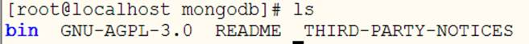

\5.    在bin目录中存在大量mongodb使用的命令

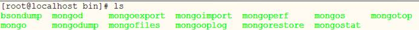

 

\6.    启动mongoDB数据库服务

./mongod --port 27017 --dbpath /root/data 

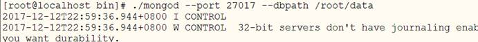

注意:

启动时要求存放数据的目录必须存在

默认的端口号是27017 可以通过--port 指定端口启动

 

\7.    出现如下结果代表启动成功

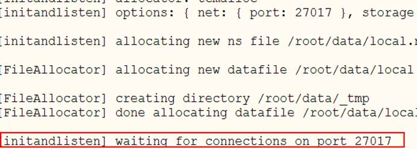

 

### 四、MongoDB的shell(客户端)操作

\1.    进入mongo的bin目录中找到如下指令

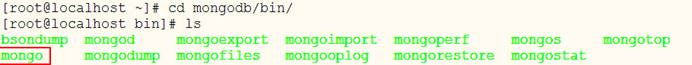

\2.    使用如下命令连接到mongodb的服务中

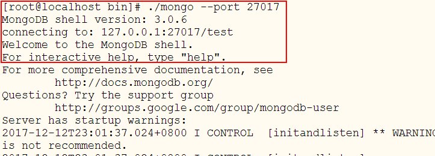

注意:

a)    连接到mongodb后,mongo和mysql数据库有点像,先是一个一个库的概念,操作之前需要先选中库

 

\3.    查看系统中默认的所有库 

show dbs;

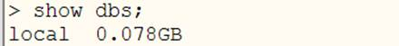

注意:

默认只有一个local库

还有一个默认隐藏不可见的数据库 admin

\4.    选中一个库

a)    use 数据库名称

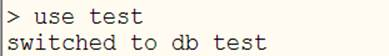

注意:

use命名 存在库使用当前库 不存在则创建当前库

 

\5.    删除一个库

db.dropDatabase();

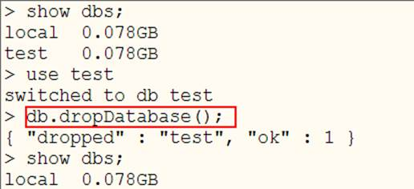

注意: 选中那个库,删除的就是当前选中的库

 

 

\6.    Mongodb的数据库中,库中是一个一个集合的概念,选中库后要创建一个一个的集合,集合类似于传统的关系型数据库中的表

a)    显示创建集合 db.createCollection(“t_user”);

b)    隐式创建集合 创建集合同时添加元素

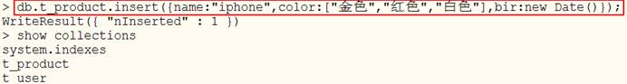

 

 

\7.    查看mongo 中当前库

a)    db 命令显示当前库

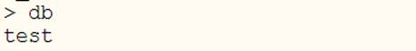

\8.    显示当前库中的所有集合

a)    show collections;

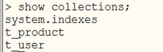

 

\9.    Mongo中插入数据

a)    向集合中插入数据

db.集合名称.insert({name:'xiaohei',age:23,sex:true});

b)    向集合中插入多条数据

db.集合名称.insert([{name:'xiaohei',age:23,sex:true},...]);

\10.   Mongo中的删除数据

a)    db.集合名称.remove({条件}) //删除满足条件的数据

b)    db.集合名称.remove({不加任何条件})//删除所有文档  保留空的集合

\11.   Mongo中的修改数据

a)    db.集合名称.update({条件},{更新内容}); 

b)    db.集合名称.update({"name":"zhangsan"},{name:"11",bir:new date()}) --这个更新是将符合条件的全部更新成后面的文档,相当于先删除在更新

c)    db.集合名称.update({"name":"xiaohei"},{$set:{name:"mingming"}})  --保留原来的值修改,但是只更新符合条件的第一条数据

d)    db.集合名称.update({name:”小黑”},{$set:{name:”小明”}},{multi:true}) ---保留原来数据更新,更新符合条件的所有数据

e)    db.集合名称.update({name:”小黑”},{$set:{name:”小明”}},{multi:true,upsert:true}) ---保留原来数据更新,更新符合条件的所有数据 没有条件符合时插入数据

f)    db.t_user.update({name:"zhangsan"},{$inc:{age:1}},{upsert:true,multi:true}) --在保留原始数据同时给符合条件的所有age这列的值自增指定的大小

g)     

\12.   删除集合

a)    db.集合名称.drop();

\13.   查询集合

a)    db.集合名称.find();

b)    db.集合名称.find({条件})

c)    db.集合名称.find({条件},{显示字段,name:1,age:1}) 1 显示 0 不显示  1和0 不能混合出现

d)    查询结果排序:db.集合名称.find().sort({条件name:1,age:1}), 1  升序   -1 降序

e)    分页查询:db.集合名称.find().sort({条件}).skip(起始条数).limit(显示总记录数);

f)    总条数:db.集合名称.count();|db.t_user.find({"name":"aa"}).count();

g)    模糊查询:使用正则表达式db.集合名称.find({"name":/go/})

h)    等值(==)查询

 db.user.find({name:"张三"});

db.user.find({name:{$eq:"张三"}});

i)     且 ($and) 查询

db.t_user.find({name:"zhangsan",age:12});

db.t_user.find({$and:[{name:"zhangsan"},{id:10}]}) 

j)     $or使用:

i.     

db.集合名称.find({

​               $or:[

​                    {key:value},{age:{$gte:20}}

​               ]    

​          });

k)    $gt大于 $gte大于等于 $lt 小于 $lte 小于等于 $eq 等于:

i.     db.集合名称.find({“age”:{“$lte”:18,”$gte”:30}})

 

l)     $nor查询使用

i.     db.t_user.find({$nor:[{name:"chenyn"},{age:26}]});

 

\14.   shell非正常关闭时,下次无法连接问题解决方案:

i.     删除数据目录中的mongo.lock文件即可

 

 

### 五、Java操作mongoDB

\1.    项目中引入mongo的坐标

  <dependency>      <groupId>org.mongodb</groupId>      <artifactId>mongo-java-driver</artifactId>      <version>3.0.0</version>  </dependency>  

 

\2.    使用java操作mongo

a)    参见代码 mongo-java

 

### 六、Spring Boot整合mongoDB

 

\1.    pom配置

pom包里面添加spring-boot-starter-data-mongodb包引用

  <dependencies>   <dependency>  <groupId>org.springframework.boot</groupId>  <artifactId>spring-boot-starter-data-mongodb</artifactId>  </dependency>   </dependencies>  

 

\2.    在application.properties中添加配置

spring.data.mongodb.uri=mongodb://localhost:27017/test

\3.    详细操作参见springboot-mongo

 

 