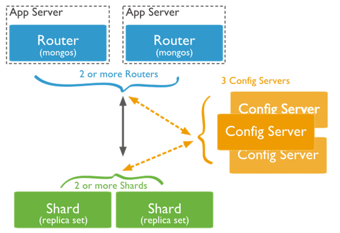

#  

# mongoDB

 

### 一、MongoDB中的索引

索引就是为了加速查询的,MongoDB的索引几乎与传统的关系型数据库一模一样，这其中也包括一些基本的优化技巧。下面是创建索引的命令：

 

 

\1.   创建索引:db.集合名称.ensureIndex({"name":1}) 

a)   1 代表索引升序存储 -1 代表索引降序存储

b)   _id 默认自动创建索引

\2.   创建索引指定索引名称:db.集合名称.ensureIndex({"name":1},{name:"name_index"})

\3.   查看索引是否创建成功:db.集合名称.getIndexes()

\4.   删除索引的命令:db.集合名称.dropIndex({"name":1});

\5.   创建复合索引:db.集合名称.ensureIndex({"name":1, "age":-1,bir:1})

a)   注意: 

i.    该索引被创建后，基于name和age的查询将会用到该索引

ii.   或者是基于name的查询也会用到该索引

iii.   但是只是基于age的查询将不会用到该复合索引。

b)   总结: 

i.    如果想用到复合索引，必须在查询条件中包含复合索引中的前N个索引列。然而如果查询条件中的键值顺序和复合索引中的创建顺序不一致的话，MongoDB可以智能的帮助我们调整该顺序，以便使复合索引可以为查询所用。

 

ii.   如：db.t_user.find({"age": 30, "name": "stephen"})
 对于上面示例中的查询条件，MongoDB在检索之前将会动态的调整查询条件文档的顺序，以使该查询可以用到刚刚创建的复合索引。
 

\6.   创建唯一索引:db.t_user.ensureIndex({"name":1},{"unique":true})

注意: 在缺省情况下创建的索引均不是唯一索引。一旦创建唯一索引, 如果再次插入name重复的文档时，MongoDB将报错，以提示插入重复键 (exception: E11000 duplicate key error index: zpark.t_user.$name_1 dup key: { : \"xiaohei\" })

\7.   重建索引:db.集合名称.reIndex(); 

 

 

### 二、mongoDB中的主从复制(4.0版本废弃) 

主从复制是mongoDB最常用的复制方式,这种方式非常灵活,可用于备份,故障恢复和扩展等.

\1.    搭建主从复制

a)   准备三个机器一个主机两个备机

mongod --port 27017 --dbpath /root/data/master/ --bind_ip 0.0.0.0 --master --oplogSize 50

mongod --port 27018 --dbpath /root/data/slave1 --bind_ip 0.0.0.0 --slave --source 172.16.19.137:27017 --only baizhi –autoresync

mongod --dbpath /root/data/slave2 --port 27019 --bind_ip 0.0.0.0 --slave --source 172.16.19.137:27017 --only baizhi --autoresync --slavedelay 30

\2.   主从复制的选项

--master       主节点

--slave        从节点

--source arg     为从节点时从哪个主节点复制<server:port>

--only  arg     为从节点时只复制主节点的那个库

--slavedelay arg   从节点延迟多长时间复制主节点 秒

--autoresync     从机数据不是最新是自动重新同步数据

--oplogSize      主节点的操作日志单位是M

 

\3.   查看集群状态:

rs.help();

rs.slaveOk(); //开启从机查询

 

 

 

 

### 三、MongoDB中的副本集

MongoDB 副本集（Replica Set）是有自动故障恢复功能的主从集群，有一个Primary节点和一个或多个Secondary节点组成。主从集群和副本集之间最明显的区别就是副本集没有固定的”主节点”,

整个集群会选举一个主节点,当主节点不能工作时自动变更到其他节点.

 

 

\1.   配置主机名

a)   vi /etc/hosts文件加入如下配置  

i.    当前主机地址 mongo

\2.   搭建副本集

a)   准备三个存放数据的目录并启动三个节点

mongod --port 27017 --dbpath /root/repl1 --bind_ip 0.0.0.0 --replSet myreplace/mongo:27018

mongod --port 27018 --dbpath /root/repl2 --bind_ip 0.0.0.0 --replSet myreplace/mongo:27019

mongod --port 27019 --dbpath /root/repl3 --bind_ip 0.0.0.0 --replSet myreplace/mongo:27017

注意: --replSet 副本集 myreplace 副本集名称/集群中其他节点的主机和端口

 

 

 

b)   连接任意一台mongo

i.    use admin

ii.   执行如下命令

​     var config = { 

​      _id:"myreplace",

​      members:[

​       {_id:0,host:"mongo:27017"},

​       {_id:1,host:"mongo:27018"},

​       {_id:2,host:"mongo:27019"}]

​    }

   rs.initiate(config);//初始化配置

 

c)   设置客户端临时访问数据:rs.slaveOk();

 

Springboot 操作副本集

```
        spring.data.mongodb.uri=mongodb://127.0.0.1:27017,127.0.0.1:27018,127.0.0.1:27019/ems(库名)?replcaSet=spock(副本集名称)
```

### 四、Mongodb中的分片

\1.   分片(sharding)

分片目的是通过分片能够增加更多机器来应对不断的增加负载和数据,还不影响应用.

 

分片(sharding)是指将数据拆分,将其分散存在不同机器的过程,有时也用分区(partitioning)来表示这个概念,将数据分散在不同的机器上,不需要功能强大的大型计算机就能存储更多的数据,处理更大的负载.

MongoDB支持自动分片,可以摆脱手动分片的管理困扰,集群自动切分数据做负载均衡.MongoDB分片的基本思想就是将集合拆分成多个块,这些快分散在若干个片里,每个片只负责总数据的一部分,应用程序不必知道哪些片对应哪些数据,甚至不需要知道数据拆分了,所以在分片之前会运行一个路由进程,mongos进程,这个路由器知道所有的数据存放位置,应用只需要直接与mongos交互即可,mongos自动将请求转到相应的片上获取数据.从应用角度看分不分片没有什么区别.

 

\2.   什么时候分片

a)   机器磁盘不够用了

b)   单个的mongo已经不能满足写数据的性能需要了

 

 

 

 

\3.   mongoDB的分片架构图

 



  l   Shard:用于存储实际的数据块，实际生产环境中一个shard server角色可由几台机器组个一个replica set承担，防止主机单点故障  l   Config Server:mongod实例，存储了整个 ClusterMetadata。  l   Query Routers:前端路由，客户端由此接入，且让整个集群看上去像单一数据库，前端应用可以透明使用。  

 

\4.   片键

设置分片时需要在集合中选一个键,用该键的值作为拆分数据的依据,这个片键称之为(shard key)

注意: 在真正的生产环境中,片键的选取很重要,片键的选取要一定要数据散列均匀

\5.   搭建分片集群

a)   分片结构的端口如下

Shard Server 1：27020

Shard Server 2：27021

Shard Server 3：27022

Shard Server 4：27023

Config Server ：27100

Config Server ：27101

Config Server ：27102

Route Process：40000

 

b)    创建数据目录

mkdir -p /root/shard/s0

mkdir -p /root/shard/s1

mkdir -p /root/shard/s2

mkdir -p /root/shard/s3

mkdir -p /root/shard/config1

mkdir -p /root/shard/config2

mkdir -p /root/shard/config3

 

c)   创建数据目录并启动四台shard机器

mongod --port 27020 --dbpath /root/shard/s0 --bind_ip 0.0.0.0 --shardsvr

mongod --port 27021 --dbpath /root/shard/s1 --bind_ip 0.0.0.0 --shardsvr

mongod --port 27022 --dbpath /root/shard/s2 --bind_ip 0.0.0.0 --shardsvr

mongod --port 27023 --dbpath /root/shard/s3 --bind_ip 0.0.0.0 --shardsvr

d)   创建config数据目录启动配置机器

mongod --port 27100 --dbpath /root/shard/config1 --bind_ip 0.0.0.0 --replSet config/mongo:27101 --configsvr

mongod --port 27101 --dbpath /root/shard/config2 --bind_ip 0.0.0.0 --replSet config/mongo:27102 --configsvr

mongod --port 27102 --dbpath /root/shard/config3 --bind_ip 0.0.0.0 --replSet config/mongo:27100 --configsvr

e)   初始化config的配置服务器副本集

i.    登录任意config的server节点中使用 use admin 

ii.   config在admin中执行

var config = { 

​     _id:"config",

```
                       configsvr: true,
```

​     members:[

​     {_id:0,host:"mongo:27100"},

​     {_id:1,host:"mongo:27101"},

​     {_id:2,host:"mongo:27102"}]

}

iii.    初始化副本集配置 rs.initiate(config);

 

f)   启动路由

i.  mongos --port 40000 --configdb config/mongo:27100,mongo:27101,mongo:27102 --bind_ip 0.0.0.0

注意: config为上面的副本集名称

g)   客户端登陆到mongos中 mongo –port 40000

i.    use admin

ii.   添加分片节点: 

db.runCommand({ addshard:"mongo:27020","allowLocal":true });

db.runCommand({ addshard:"mongo:27021","allowLocal":true });

db.runCommand({ addshard:"mongo:27022","allowLocal":true });

db.runCommand({ addshard:"mongo:27023","allowLocal":true });

 

h)  设置分片的库:db.runCommand({ enablesharding:"baizhi" });

i)   设置那个库中那个集合以及片键信息:

db.runCommand({ shardcollection: "baizhi.users", key: { _id:1}})

db.runCommand({ shardcollection: "baizhi.users", key: { _id: "hashed"}})

 

 