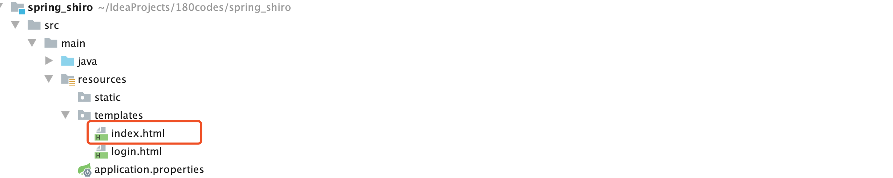
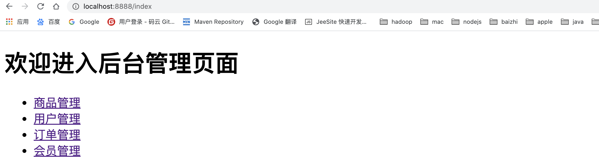
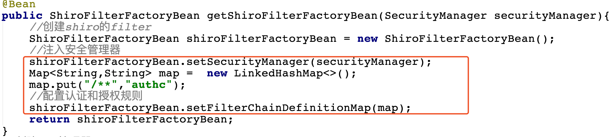
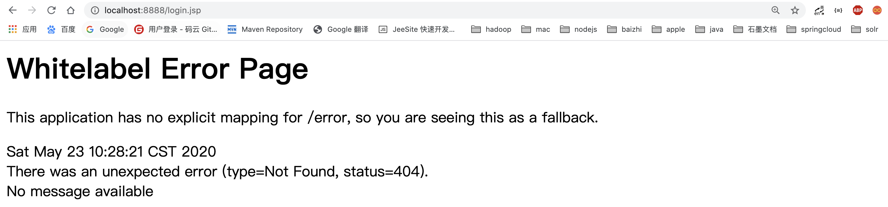
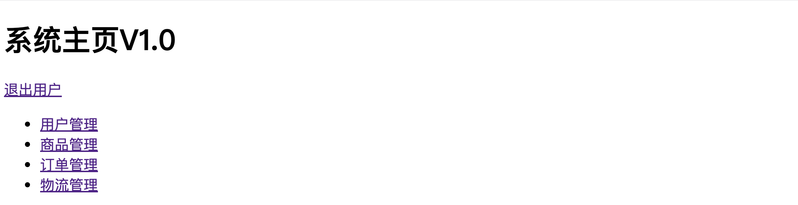
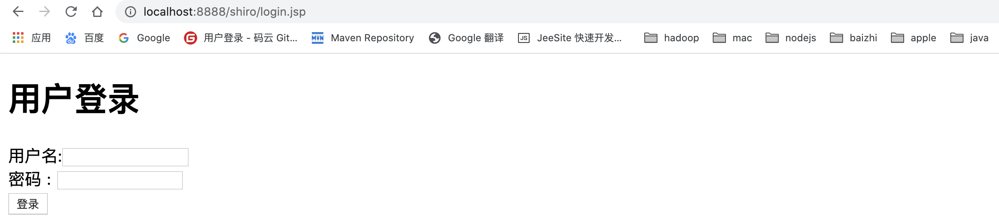
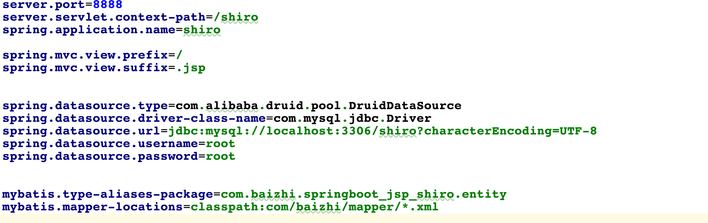
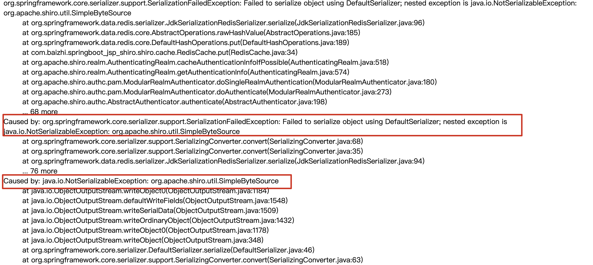

# Shiro 实战教程

- 作者  小陈 
- 微信 chenxu521600
- B站 编程不良人  |  百知教育
- 资料 http://www.baizhiedu.xin

  

## 1.权限的管理

### 1.1 什么是权限管理

基本上涉及到用户参与的系统都要进行权限管理，权限管理属于系统安全的范畴，权限管理实现`对用户访问系统的控制`，按照安全规则或者[安全策略](http://baike.baidu.com/view/160028.htm)控制用户可以访问而且只能访问自己被授权的资源。

权限管理包括用户`身份认证`和`授权`两部分，简称`认证授权`。对于需要访问控制的资源用户首先经过身份认证，认证通过后用户具有该资源的访问权限方可访问。

### 1.2 什么是身份认证

`身份认证`，就是判断一个用户是否为合法用户的处理过程。最常用的简单身份认证方式是系统通过核对用户输入的用户名和口令，看其是否与系统中存储的该用户的用户名和口令一致，来判断用户身份是否正确。对于采用[指纹](http://baike.baidu.com/view/5628.htm)等系统，则出示指纹；对于硬件Key等刷卡系统，则需要刷卡。

### 1.3 什么是授权

`授权，即访问控制`，控制谁能访问哪些资源。主体进行身份认证后需要分配权限方可访问系统的资源，对于某些资源没有权限是无法访问的

----

## 2.什么是shiro

> **Apache Shiro™** is a powerful and easy-to-use Java security framework that performs authentication, authorization, cryptography, and session management. With Shiro’s easy-to-understand API, you can quickly and easily secure any application – from the smallest mobile applications to the largest web and enterprise applications.  
>
> Shiro 是一个功能强大且易于使用的Java安全框架，它执行身份验证、授权、加密和会话管理。使用Shiro易于理解的API，您可以快速轻松地保护任何应用程序—从最小的移动应用程序到最大的web和企业应用程序。

`Shiro是apache旗下一个开源框架，它将软件系统的安全认证相关的功能抽取出来，实现用户身份认证，权限授权、加密、会话管理等功能，组成了一个通用的安全认证框架。`

----

## 3.shiro的核心架构


### 3.1 Subject

`Subject即主体`，外部应用与subject进行交互，subject记录了当前操作用户，将用户的概念理解为当前操作的主体，可能是一个通过浏览器请求的用户，也可能是一个运行的程序。	Subject在shiro中是一个接口，接口中定义了很多认证授相关的方法，外部程序通过subject进行认证授，而subject是通过SecurityManager安全管理器进行认证授权

### 3.2 SecurityManager

`SecurityManager即安全管理器`，对全部的subject进行安全管理，它是shiro的核心，负责对所有的subject进行安全管理。通过SecurityManager可以完成subject的认证、授权等，实质上SecurityManager是通过Authenticator进行认证，通过Authorizer进行授权，通过SessionManager进行会话管理等。

`SecurityManager是一个接口，继承了Authenticator, Authorizer, SessionManager这三个接口。`

### 3.3 Authenticator

`Authenticator即认证器`，对用户身份进行认证，Authenticator是一个接口，shiro提供ModularRealmAuthenticator实现类，通过ModularRealmAuthenticator基本上可以满足大多数需求，也可以自定义认证器。

### 3.4 Authorizer

`Authorizer即授权器`，用户通过认证器认证通过，在访问功能时需要通过授权器判断用户是否有此功能的操作权限。

###  3.5 Realm

`Realm即领域`，相当于datasource数据源，securityManager进行安全认证需要通过Realm获取用户权限数据，比如：如果用户身份数据在数据库那么realm就需要从数据库获取用户身份信息。

- ​	注意：不要把realm理解成只是从数据源取数据，在realm中还有认证授权校验的相关的代码。

### 3.6 SessionManager

`sessionManager即会话管理`，shiro框架定义了一套会话管理，它不依赖web容器的session，所以shiro可以使用在非web应用上，也可以将分布式应用的会话集中在一点管理，此特性可使它实现单点登录。

### 3.7 SessionDAO

`SessionDAO即会话dao`，是对session会话操作的一套接口，比如要将session存储到数据库，可以通过jdbc将会话存储到数据库。

### 3.8 CacheManager

`CacheManager即缓存管理`，将用户权限数据存储在缓存，这样可以提高性能。

### 3.9 Cryptography

​	`Cryptography即密码管理`，shiro提供了一套加密/解密的组件，方便开发。比如提供常用的散列、加/解密等功能。

----

## 4. shiro中的认证

### 4.1 认证

身份认证，就是判断一个用户是否为合法用户的处理过程。最常用的简单身份认证方式是系统通过核对用户输入的用户名和口令，看其是否与系统中存储的该用户的用户名和口令一致，来判断用户身份是否正确。

### 4.2 shiro中认证的关键对象

- **Subject：主体**

访问系统的用户，主体可以是用户、程序等，进行认证的都称为主体； 

- **Principal：身份信息**

是主体（subject）进行身份认证的标识，标识必须具有`唯一性`，如用户名、手机号、邮箱地址等，一个主体可以有多个身份，但是必须有一个主身份（Primary Principal）。

- **credential：凭证信息**

是只有主体自己知道的安全信息，如密码、证书等。

### 4.3 认证流程


### 4.4 认证的开发

##### 1. 创建项目并引入依赖

```xml
<dependency>
  <groupId>org.apache.shiro</groupId>
  <artifactId>shiro-core</artifactId>
  <version>1.5.3</version>
</dependency>
```

##### 2. 引入shiro配置文件并加入如下配置

```ini
[users]
xiaochen=123
zhangsan=456
```


##### 3.开发认证代码

```java
public class TestAuthenticator {
    public static void main(String[] args) {
        //创建securityManager
        DefaultSecurityManager defaultSecurityManager = new DefaultSecurityManager();
        defaultSecurityManager.setRealm(new IniRealm("classpath:shiro.ini"));
        //将安装工具类中设置默认安全管理器
        SecurityUtils.setSecurityManager(defaultSecurityManager);
        //获取主体对象
        Subject subject = SecurityUtils.getSubject();
        //创建token令牌
        UsernamePasswordToken token = new UsernamePasswordToken("xiaochen1", "123");
        try {
            subject.login(token);//用户登录
            System.out.println("登录成功~~");
        } catch (UnknownAccountException e) {
            e.printStackTrace();
            System.out.println("用户名错误!!");
        }catch (IncorrectCredentialsException e){
            e.printStackTrace();
            System.out.println("密码错误!!!");
        }

    }
}
```

- DisabledAccountException（帐号被禁用）

- LockedAccountException（帐号被锁定）

- ExcessiveAttemptsException（登录失败次数过多）

- ExpiredCredentialsException（凭证过期）等

-----

### 4.5 自定义Realm

上边的程序使用的是Shiro自带的IniRealm，IniRealm从ini配置文件中读取用户的信息，大部分情况下需要从系统的数据库中读取用户信息，所以需要自定义realm。

##### 1.shiro提供的Realm


##### 2.根据认证源码认证使用的是SimpleAccountRealm


`SimpleAccountRealm的部分源码中有两个方法一个是 认证 一个是 授权`,

```java
public class SimpleAccountRealm extends AuthorizingRealm {
		//.......省略
    protected AuthenticationInfo doGetAuthenticationInfo(AuthenticationToken token) throws AuthenticationException {
        UsernamePasswordToken upToken = (UsernamePasswordToken) token;
        SimpleAccount account = getUser(upToken.getUsername());

        if (account != null) {

            if (account.isLocked()) {
                throw new LockedAccountException("Account [" + account + "] is locked.");
            }
            if (account.isCredentialsExpired()) {
                String msg = "The credentials for account [" + account + "] are expired";
                throw new ExpiredCredentialsException(msg);
            }

        }

        return account;
    }

    protected AuthorizationInfo doGetAuthorizationInfo(PrincipalCollection principals) {
        String username = getUsername(principals);
        USERS_LOCK.readLock().lock();
        try {
            return this.users.get(username);
        } finally {
            USERS_LOCK.readLock().unlock();
        }
    }
}
```

##### 3.自定义realm

```java
/**
 * 自定义realm
 */
public class CustomerRealm extends AuthorizingRealm {
    //认证方法
    @Override
    protected AuthorizationInfo doGetAuthorizationInfo(PrincipalCollection principals) {
        return null;
    }

    //授权方法
    @Override
    protected AuthenticationInfo doGetAuthenticationInfo(AuthenticationToken token) throws AuthenticationException {
        String principal = (String) token.getPrincipal();
        if("xiaochen".equals(principal)){
            return new SimpleAuthenticationInfo(principal,"123",this.getName());
        }
        return null;
    }
}
```

##### 4.使用自定义Realm认证

```java
public class TestAuthenticatorCusttomerRealm {
    public static void main(String[] args) {
        //创建securityManager
        DefaultSecurityManager defaultSecurityManager = new DefaultSecurityManager();
        //IniRealm realm = new IniRealm("classpath:shiro.ini");
        //设置为自定义realm获取认证数据
        defaultSecurityManager.setRealm(new CustomerRealm());
        //将安装工具类中设置默认安全管理器
        SecurityUtils.setSecurityManager(defaultSecurityManager);
        //获取主体对象
        Subject subject = SecurityUtils.getSubject();
        //创建token令牌
        UsernamePasswordToken token = new UsernamePasswordToken("xiaochen", "123");
        try {
            subject.login(token);//用户登录
            System.out.println("登录成功~~");
        } catch (UnknownAccountException e) {
            e.printStackTrace();
            System.out.println("用户名错误!!");
        }catch (IncorrectCredentialsException e){
            e.printStackTrace();
            System.out.println("密码错误!!!");
        }

    }
}
```

### 4.6 使用MD5和Salt

> 实际应用是将盐和散列后的值存在数据库中，自动realm从数据库取出盐和加密后的值由shiro完成密码校验。

##### 1.自定义md5+salt的realm

```java
/**
 * 自定义md5+salt realm
 */
public class CustomerRealm extends AuthorizingRealm {
    //认证方法
    @Override
    protected AuthorizationInfo doGetAuthorizationInfo(PrincipalCollection principals) {
        return null;
    }

    //授权方法
    @Override
    protected AuthenticationInfo doGetAuthenticationInfo(AuthenticationToken token) throws AuthenticationException {
        String principal = (String) token.getPrincipal();
        if("xiaochen".equals(principal)){
            String password = "3c88b338102c1a343bcb88cd3878758e";
            String salt = "Q4F%";
            return new SimpleAuthenticationInfo(principal,password, 
                                                ByteSource.Util.bytes(salt),this.getName());
        }
        return null;
    }
```

##### 2.使用md5 + salt 认证

```java
public class TestAuthenticatorCusttomerRealm {
    public static void main(String[] args) {
        //创建securityManager
        DefaultSecurityManager defaultSecurityManager = new DefaultSecurityManager();
        //IniRealm realm = new IniRealm("classpath:shiro.ini");
        //设置为自定义realm获取认证数据
        CustomerRealm customerRealm = new CustomerRealm();
        //设置md5加密
        HashedCredentialsMatcher credentialsMatcher = new HashedCredentialsMatcher();
        credentialsMatcher.setHashAlgorithmName("MD5");
        credentialsMatcher.setHashIterations(1024);//设置散列次数
        customerRealm.setCredentialsMatcher(credentialsMatcher);
        defaultSecurityManager.setRealm(customerRealm);
        //将安装工具类中设置默认安全管理器
        SecurityUtils.setSecurityManager(defaultSecurityManager);
        //获取主体对象
        Subject subject = SecurityUtils.getSubject();
        //创建token令牌
        UsernamePasswordToken token = new UsernamePasswordToken("xiaochen", "123");
        try {
            subject.login(token);//用户登录
            System.out.println("登录成功~~");
        } catch (UnknownAccountException e) {
            e.printStackTrace();
            System.out.println("用户名错误!!");
        }catch (IncorrectCredentialsException e){
            e.printStackTrace();
            System.out.println("密码错误!!!");
        }

    }
}
```

-----

## 5. shiro中的授权

### 5.1 授权

授权，即访问控制，控制谁能访问哪些资源。主体进行身份认证后需要分配权限方可访问系统的资源，对于某些资源没有权限是无法访问的。

### 5.2 关键对象

**授权可简单理解为who对what(which)进行How操作：**

`Who，即主体（Subject）`，主体需要访问系统中的资源。

`What，即资源（Resource)`，如系统菜单、页面、按钮、类方法、系统商品信息等。资源包括`资源类型`和`资源实例`，比如`商品信息为资源类型`，类型为t01的商品为`资源实例`，编号为001的商品信息也属于资源实例。

`How，权限/许可（Permission)`，规定了主体对资源的操作许可，权限离开资源没有意义，如用户查询权限、用户添加权限、某个类方法的调用权限、编号为001用户的修改权限等，通过权限可知主体对哪些资源都有哪些操作许可。

### 5.3 授权流程


### 5.4 授权方式

- **基于角色的访问控制**
  
  - RBAC基于角色的访问控制（Role-Based Access Control）是以角色为中心进行访问控制
  
    ```java
    if(subject.hasRole("admin")){
       //操作什么资源
    }
    ```
  
- **基于资源的访问控制**
  
  - RBAC基于资源的访问控制（Resource-Based Access Control）是以资源为中心进行访问控制
  
    ```java
    if(subject.isPermission("user:update:01")){ //资源实例
      //对01用户进行修改
    }
    if(subject.isPermission("user:update:*")){  //资源类型
      //对01用户进行修改
    }
    ```
  
    

### 5.5 权限字符串 

​		权限字符串的规则是：**资源标识符：操作：资源实例标识符**，意思是对哪个资源的哪个实例具有什么操作，“:”是资源/操作/实例的分割符，权限字符串也可以使用*通配符。

例子：

- 用户创建权限：user:create，或user:create:*
- 用户修改实例001的权限：user:update:001
- 用户实例001的所有权限：user:*：001

### 5.6 shiro中授权编程实现方式

- **编程式**

  ```java
  Subject subject = SecurityUtils.getSubject();
  if(subject.hasRole(“admin”)) {
  	//有权限
  } else {
  	//无权限
  }
  ```

- **注解式**

  ```java
  @RequiresRoles("admin")
  public void hello() {
  	//有权限
  }
  ```

- **标签式**

  ```jsp
  JSP/GSP 标签：在JSP/GSP 页面通过相应的标签完成：
  <shiro:hasRole name="admin">
  	<!— 有权限—>
  </shiro:hasRole>
  注意: Thymeleaf 中使用shiro需要额外集成!
  ```

- 

### 5.7 开发授权

##### 1.realm的实现

```java
public class CustomerRealm extends AuthorizingRealm {
    //认证方法
    @Override
    protected AuthorizationInfo doGetAuthorizationInfo(PrincipalCollection principals) {
        String primaryPrincipal = (String) principals.getPrimaryPrincipal();
        System.out.println("primaryPrincipal = " + primaryPrincipal);

        SimpleAuthorizationInfo simpleAuthorizationInfo = new SimpleAuthorizationInfo();

        simpleAuthorizationInfo.addRole("admin");

        simpleAuthorizationInfo.addStringPermission("user:update:*");
        simpleAuthorizationInfo.addStringPermission("product:*:*");


        return simpleAuthorizationInfo;
    }

    //授权方法
    @Override
    protected AuthenticationInfo doGetAuthenticationInfo(AuthenticationToken token) throws AuthenticationException {
        String principal = (String) token.getPrincipal();
        if("xiaochen".equals(principal)){
            String password = "3c88b338102c1a343bcb88cd3878758e";
            String salt = "Q4F%";
            return new SimpleAuthenticationInfo(principal,password, 
                                                ByteSource.Util.bytes(salt),this.getName());
        }
        return null;
    }

}
```

##### 2.授权

```java
public class TestAuthenticatorCusttomerRealm {
    public static void main(String[] args) {
        //创建securityManager
        DefaultSecurityManager defaultSecurityManager = new DefaultSecurityManager();
        //IniRealm realm = new IniRealm("classpath:shiro.ini");
        //设置为自定义realm获取认证数据
        CustomerRealm customerRealm = new CustomerRealm();
        //设置md5加密
        HashedCredentialsMatcher credentialsMatcher = new HashedCredentialsMatcher();
        credentialsMatcher.setHashAlgorithmName("MD5");
        credentialsMatcher.setHashIterations(1024);//设置散列次数
        customerRealm.setCredentialsMatcher(credentialsMatcher);
        defaultSecurityManager.setRealm(customerRealm);
        //将安装工具类中设置默认安全管理器
        SecurityUtils.setSecurityManager(defaultSecurityManager);
        //获取主体对象
        Subject subject = SecurityUtils.getSubject();
        //创建token令牌
        UsernamePasswordToken token = new UsernamePasswordToken("xiaochen", "123");
        try {
            subject.login(token);//用户登录
            System.out.println("登录成功~~");
        } catch (UnknownAccountException e) {
            e.printStackTrace();
            System.out.println("用户名错误!!");
        }catch (IncorrectCredentialsException e){
            e.printStackTrace();
            System.out.println("密码错误!!!");
        }
        //认证通过
        if(subject.isAuthenticated()){
            //基于角色权限管理
            boolean admin = subject.hasRole("admin");
            System.out.println(admin);

            boolean permitted = subject.isPermitted("product:create:001");
            System.out.println(permitted);
        }

    }
}
```

## 6.整合SpringBoot项目实战

### 6.0 整合思路


### 6.1 创建springboot项目


### 6.2 引入shiro依赖

```xml
<dependency>
  <groupId>org.apache.shiro</groupId>
  <artifactId>shiro-spring-boot-starter</artifactId>
  <version>1.5.3</version>
</dependency>
```

### 6.3 配置shiro环境

##### 0.创建配置类


##### 1.配置shiroFilterFactoryBean

```java
@Bean
public ShiroFilterFactoryBean getShiroFilterFactoryBean(SecurityManager securityManager){
  //创建shiro的filter
  ShiroFilterFactoryBean shiroFilterFactoryBean = new ShiroFilterFactoryBean();
  //注入安全管理器
  shiroFilterFactoryBean.setSecurityManager(securityManager);
 	
  return shiroFilterFactoryBean;
}
```

##### 2.配置WebSecurityManager

```java
@Bean
public DefaultWebSecurityManager getSecurityManager(Realm realm){
  DefaultWebSecurityManager defaultWebSecurityManager = new DefaultWebSecurityManager();
  defaultWebSecurityManager.setRealm(realm);
  return defaultWebSecurityManager;
}
```

##### 3.创建自定义realm


```java
public class CustomerRealm extends AuthorizingRealm {
    //处理授权
    @Override
    protected AuthorizationInfo doGetAuthorizationInfo(PrincipalCollection principals) {
        return null;
    }
		//处理认证
    @Override
    protected AuthenticationInfo doGetAuthenticationInfo(AuthenticationToken token) throws 
      																																		AuthenticationException {
        return null;
    }
}
```

##### 4.配置自定义realm

```java
//创建自定义realm
@Bean
public Realm getRealm(){
  return new CustomerRealm();
}
```

##### 5.编写控制器跳转至index.html

```java
@Controller
public class IndexController {
    @RequestMapping("index")
    public String index(){
        System.out.println("跳转至主页");
        return "index";
    }
}
```




##### 6.启动springboot应用访问index



- 注意:
  - **默认在配置好shiro环境后默认环境中没有对项目中任何资源进行权限控制,所有现在项目中所有资源都可以通过路径访问**

##### 7.加入权限控制

- 修改ShiroFilterFactoryBean配置

  ```java
  //注入安全管理器
  shiroFilterFactoryBean.setSecurityManager(securityManager);
  Map<String,String> map =  new LinkedHashMap<>();
  map.put("/**","authc");
  //配置认证和授权规则
  shiroFilterFactoryBean.setFilterChainDefinitionMap(map);
  ```

  

  - **/\**** 代表拦截项目中一切资源  **authc** 代表shiro中的一个filter的别名,详细内容看文档的shirofilter列表

##### 8.重启项目访问查看



### 6.4 常见过滤器

- 注意: **shiro提供和多个默认的过滤器，我们可以用这些过滤器来配置控制指定url的权限：**

| 配置缩写          | 对应的过滤器                   | 功能                                                         |
| ----------------- | ------------------------------ | ------------------------------------------------------------ |
| anon              | AnonymousFilter                | 指定url可以匿名访问                                          |
| authc             | FormAuthenticationFilter       | 指定url需要form表单登录，默认会从请求中获取`username`、`password`,`rememberMe`等参数并尝试登录，如果登录不了就会跳转到loginUrl配置的路径。我们也可以用这个过滤器做默认的登录逻辑，但是一般都是我们自己在控制器写登录逻辑的，自己写的话出错返回的信息都可以定制嘛。 |
| authcBasic        | BasicHttpAuthenticationFilter  | 指定url需要basic登录                                         |
| logout            | LogoutFilter                   | 登出过滤器，配置指定url就可以实现退出功能，非常方便          |
| noSessionCreation | NoSessionCreationFilter        | 禁止创建会话                                                 |
| perms             | PermissionsAuthorizationFilter | 需要指定权限才能访问                                         |
| port              | PortFilter                     | 需要指定端口才能访问                                         |
| rest              | HttpMethodPermissionFilter     | 将http请求方法转化成相应的动词来构造一个权限字符串，这个感觉意义不大，有兴趣自己看源码的注释 |
| roles             | RolesAuthorizationFilter       | 需要指定角色才能访问                                         |
| ssl               | SslFilter                      | 需要https请求才能访问                                        |
| user              | UserFilter                     | 需要已登录或“记住我”的用户才能访问                           |

### 6.5 认证实现

##### 1. 在login.jsp中开发认证界面


```html
<form action="${pageContext.request.contextPath}/user/login" method="post">
  用户名:<input type="text" name="username" > <br/>
  密码  : <input type="text" name="password"> <br>
  <input type="submit" value="登录">
</form>
```

##### 2. 开发controller

```java
@Controller
@RequestMapping("user")
public class UserController {
  /**
    * 用来处理身份认证
    * @param username
    * @param password
    * @return
    */
  @RequestMapping("login")
  public String login(String username,String password){
    //获取主体对象
    Subject subject = SecurityUtils.getSubject();
    try {
      subject.login(new UsernamePasswordToken(username,password));
      return  "redirect:/index.jsp";
    } catch (UnknownAccountException e) {
      e.printStackTrace();
      System.out.println("用户名错误!");
    }catch (IncorrectCredentialsException e){
      e.printStackTrace();
      System.out.println("密码错误!");
    }
    return "redirect:/login.jsp";
  }
}
```

- **在认证过程中使用subject.login进行认证**

##### 3.开发realm中返回静态数据(未连接数据库)

```java
@Override
    protected AuthenticationInfo doGetAuthenticationInfo(AuthenticationToken token) throws AuthenticationException {
        System.out.println("==========================");
        String principal = (String) token.getPrincipal();
        if("xiaochen".equals(principal)){
            return new SimpleAuthenticationInfo(principal,"123",this.getName());
        }
        return null;
    }
}
```

##### 4.启动项目以realm中定义静态数据进行认证




- **认证功能没有md5和随机盐的认证就实现啦**

### 6.6 退出认证

##### 1.开发页面退出连接


##### 2.开发controller

```java
@Controller
@RequestMapping("user")
public class UserController {
  /**
    * 退出登录
    *
    */
  @RequestMapping("logout")
  public String logout(){
    Subject subject = SecurityUtils.getSubject();
    subject.logout();//退出用户
    return "redirect:/login.jsp";
  }
}
```

##### 3.修改退出连接访问退出路径


##### 4.退出之后访问受限资源立即返回认证界面



### 6.7 MD5、Salt的认证实现

#### 1.开发数据库注册

##### 0.开发注册界面

```html
<h1>用户注册</h1>
<form action="${pageContext.request.contextPath}/user/register" method="post">
  用户名:<input type="text" name="username" > <br/>
  密码  : <input type="text" name="password"> <br>
  <input type="submit" value="立即注册">
</form>
```


##### 1.创建数据表结构

```sql
SET NAMES utf8mb4;
SET FOREIGN_KEY_CHECKS = 0;
-- ----------------------------
-- Table structure for t_user
-- ----------------------------
DROP TABLE IF EXISTS `t_user`;
CREATE TABLE `t_user` (
  `id` int(6) NOT NULL AUTO_INCREMENT,
  `username` varchar(40) DEFAULT NULL,
  `password` varchar(40) DEFAULT NULL,
  `salt` varchar(255) DEFAULT NULL,
  PRIMARY KEY (`id`)
) ENGINE=InnoDB AUTO_INCREMENT=2 DEFAULT CHARSET=utf8;

SET FOREIGN_KEY_CHECKS = 1;
```


##### 2.项目引入依赖

```xml
<!--mybatis相关依赖-->
<dependency>
  <groupId>org.mybatis.spring.boot</groupId>
  <artifactId>mybatis-spring-boot-starter</artifactId>
  <version>2.1.2</version>
</dependency>

<!--mysql-->
<dependency>
  <groupId>mysql</groupId>
  <artifactId>mysql-connector-java</artifactId>
  <version>5.1.38</version>
</dependency>


<!--druid-->
<dependency>
  <groupId>com.alibaba</groupId>
  <artifactId>druid</artifactId>
  <version>1.1.19</version>
</dependency>
```

##### 3.配置application.properties配置文件

```properties
server.port=8888
server.servlet.context-path=/shiro
spring.application.name=shiro

spring.mvc.view.prefix=/
spring.mvc.view.suffix=.jsp
#新增配置
spring.datasource.type=com.alibaba.druid.pool.DruidDataSource
spring.datasource.driver-class-name=com.mysql.jdbc.Driver
spring.datasource.url=jdbc:mysql://localhost:3306/shiro?characterEncoding=UTF-8
spring.datasource.username=root
spring.datasource.password=root


mybatis.type-aliases-package=com.baizhi.springboot_jsp_shiro.entity
mybatis.mapper-locations=classpath:com/baizhi/mapper/*.xml

```



##### 4.创建entity

```java
@Data
@Accessors(chain = true)
@AllArgsConstructor
@NoArgsConstructor
public class User {
    private String  id;
    private String username;
    private String password;
    private String salt;
}
```

##### 5.创建DAO接口

```java
@Mapper
public interface UserDAO {
    void save(User user);
}
```

##### 6.开发mapper配置文件

```xml
<insert id="save" parameterType="User" useGeneratedKeys="true" keyProperty="id">
  insert into t_user values(#{id},#{username},#{password},#{salt})
</insert>
```

##### 7.开发service接口

```java
public interface UserService {
    //注册用户方法
    void register(User user);
}
```

##### 8.创建salt工具类

```java
public class SaltUtils {
    /**
     * 生成salt的静态方法
     * @param n
     * @return
     */
    public static String getSalt(int n){
        char[] chars = "ABCDEFGHIJKLMNOPQRSTUVWXYZabcdefghijklmnopqrstuvwxyz01234567890!@#$%^&*()".toCharArray();
        StringBuilder sb = new StringBuilder();
        for (int i = 0; i < n; i++) {
            char aChar = chars[new Random().nextInt(chars.length)];
            sb.append(aChar);
        }
        return sb.toString();
    }
}
```

##### 9.开发service实现类

```java
@Service
@Transactional
public class UserServiceImpl implements UserService {

    @Autowired
    private UserDAO userDAO;

    @Override
    public void register(User user) {
        //处理业务调用dao
        //1.生成随机盐
        String salt = SaltUtils.getSalt(8);
        //2.将随机盐保存到数据
        user.setSalt(salt);
        //3.明文密码进行md5 + salt + hash散列
        Md5Hash md5Hash = new Md5Hash(user.getPassword(),salt,1024);
        user.setPassword(md5Hash.toHex());
        userDAO.save(user);
    }
}
```

##### 10.开发Controller

```java
@Controller
@RequestMapping("user")
public class UserController {

    @Autowired
    private UserService userService;

    /**
     * 用户注册
     */
    @RequestMapping("register")
    public String register(User user) {
        try {
            userService.register(user);
            return "redirect:/login.jsp";
        }catch (Exception e){
            e.printStackTrace();
            return "redirect:/register.jsp";
        }
    }
}
```

##### 11.启动项目进行注册


----


#### 2.开发数据库认证

##### 0.开发DAO

```java
@Mapper
public interface UserDAO {

    void save(User user);
		//根据身份信息认证的方法
    User findByUserName(String username);
}
```

##### 1.开发mapper配置文件

```xml
<select id="findByUserName" parameterType="String" resultType="User">
  select id,username,password,salt from t_user
  where username = #{username}
</select>
```

##### 2.开发Service接口

```java
public interface UserService {
    //注册用户方法
    void register(User user);
    //根据用户名查询业务的方法
    User findByUserName(String username);
}
```

##### 3.开发Service实现类

```java

@Service("userService")
@Transactional
public class UserServiceImpl implements UserService {
    @Autowired
    private UserDAO userDAO;
    @Override
    public User findByUserName(String username) {
        return userDAO.findByUserName(username);
    }
}
```

##### 4.开发在工厂中获取bean对象的工具类

```java

@Component
public class ApplicationContextUtils implements ApplicationContextAware {

    private static ApplicationContext context;

    @Override
    public void setApplicationContext(ApplicationContext applicationContext) throws BeansException {
        this.context = applicationContext;
    }


    //根据bean名字获取工厂中指定bean 对象
    public static Object getBean(String beanName){
        return context.getBean(beanName);
    }
}
```

##### 5.修改自定义realm

```java
 @Override
    protected AuthenticationInfo doGetAuthenticationInfo(AuthenticationToken token) throws AuthenticationException {
        System.out.println("==========================");

        //根据身份信息
        String principal = (String) token.getPrincipal();
        //在工厂中获取service对象
        UserService userService = (UserService) ApplicationContextUtils.getBean("userService");
				//根据身份信息查询
        User user = userService.findByUserName(principal);

        if(!ObjectUtils.isEmpty(user)){
            //返回数据库信息
            return new SimpleAuthenticationInfo(user.getUsername(),user.getPassword(), 
                                               ByteSource.Util.bytes(user.getSalt()),this.getName());
        }
        return null;
    }
```

##### 6.修改ShiroConfig中realm使用凭证匹配器以及hash散列

```java
@Bean
public Realm getRealm(){
  CustomerRealm customerRealm = new CustomerRealm();
  //设置hashed凭证匹配器
  HashedCredentialsMatcher credentialsMatcher = new HashedCredentialsMatcher();
  //设置md5加密
  credentialsMatcher.setHashAlgorithmName("md5");
  //设置散列次数
  credentialsMatcher.setHashIterations(1024);
  customerRealm.setCredentialsMatcher(credentialsMatcher);
  return customerRealm;
}
```


### 6.8 授权实现

##### 0.页面资源授权

```jsp
<%@taglib prefix="shiro" uri="http://shiro.apache.org/tags" %>

<shiro:hasAnyRoles name="user,admin">
        <li><a href="">用户管理</a>
            <ul>
                <shiro:hasPermission name="user:add:*">
                <li><a href="">添加</a></li>
                </shiro:hasPermission>
                <shiro:hasPermission name="user:delete:*">
                    <li><a href="">删除</a></li>
                </shiro:hasPermission>
                <shiro:hasPermission name="user:update:*">
                    <li><a href="">修改</a></li>
                </shiro:hasPermission>
                <shiro:hasPermission name="user:find:*">
                    <li><a href="">查询</a></li>
                </shiro:hasPermission>
            </ul>
        </li>
        </shiro:hasAnyRoles>
        <shiro:hasRole name="admin">
            <li><a href="">商品管理</a></li>
            <li><a href="">订单管理</a></li>
            <li><a href="">物流管理</a></li>
        </shiro:hasRole>
```

##### 1.代码方式授权

```java
@RequestMapping("save")
public String save(){
  System.out.println("进入方法");
  //获取主体对象
  Subject subject = SecurityUtils.getSubject();
  //代码方式
  if (subject.hasRole("admin")) {
    System.out.println("保存订单!");
  }else{
    System.out.println("无权访问!");
  }
  //基于权限字符串
  //....
  return "redirect:/index.jsp";
}
```


##### 2.方法调用授权

- @RequiresRoles               用来基于角色进行授权
- @RequiresPermissions    用来基于权限进行授权

```java
@RequiresRoles(value={"admin","user"})//用来判断角色  同时具有 admin user
@RequiresPermissions("user:update:01") //用来判断权限字符串
@RequestMapping("save")
public String save(){
  System.out.println("进入方法");
  return "redirect:/index.jsp";
}
```


----

##### 3.授权数据持久化


```sql
SET NAMES utf8mb4;
SET FOREIGN_KEY_CHECKS = 0;

-- ----------------------------
-- Table structure for t_pers
-- ----------------------------
DROP TABLE IF EXISTS `t_pers`;
CREATE TABLE `t_pers` (
  `id` int(6) NOT NULL AUTO_INCREMENT,
  `name` varchar(80) DEFAULT NULL,
  `url` varchar(255) DEFAULT NULL,
  PRIMARY KEY (`id`)
) ENGINE=InnoDB DEFAULT CHARSET=utf8;

-- ----------------------------
-- Table structure for t_role
-- ----------------------------
DROP TABLE IF EXISTS `t_role`;
CREATE TABLE `t_role` (
  `id` int(6) NOT NULL AUTO_INCREMENT,
  `name` varchar(60) DEFAULT NULL,
  PRIMARY KEY (`id`)
) ENGINE=InnoDB DEFAULT CHARSET=utf8;

-- ----------------------------
-- Table structure for t_role_perms
-- ----------------------------
DROP TABLE IF EXISTS `t_role_perms`;
CREATE TABLE `t_role_perms` (
  `id` int(6) NOT NULL,
  `roleid` int(6) DEFAULT NULL,
  `permsid` int(6) DEFAULT NULL,
  PRIMARY KEY (`id`)
) ENGINE=InnoDB DEFAULT CHARSET=utf8;

-- ----------------------------
-- Table structure for t_user
-- ----------------------------
DROP TABLE IF EXISTS `t_user`;
CREATE TABLE `t_user` (
  `id` int(6) NOT NULL AUTO_INCREMENT,
  `username` varchar(40) DEFAULT NULL,
  `password` varchar(40) DEFAULT NULL,
  `salt` varchar(255) DEFAULT NULL,
  PRIMARY KEY (`id`)
) ENGINE=InnoDB AUTO_INCREMENT=2 DEFAULT CHARSET=utf8;

-- ----------------------------
-- Table structure for t_user_role
-- ----------------------------
DROP TABLE IF EXISTS `t_user_role`;
CREATE TABLE `t_user_role` (
  `id` int(6) NOT NULL,
  `userid` int(6) DEFAULT NULL,
  `roleid` int(6) DEFAULT NULL,
  PRIMARY KEY (`id`)
) ENGINE=InnoDB DEFAULT CHARSET=utf8;

SET FOREIGN_KEY_CHECKS = 1;

```

----

##### 4.创建dao方法

```java
 //根据用户名查询所有角色
User findRolesByUserName(String username);
//根据角色id查询权限集合
List<Perms> findPermsByRoleId(String id);
```

##### 5.mapper实现

```xml
<resultMap id="userMap" type="User">
  <id column="uid" property="id"/>
  <result column="username" property="username"/>
  <!--角色信息-->
  <collection property="roles" javaType="list" ofType="Role">
    <id column="id" property="id"/>
    <result column="rname" property="name"/>
  </collection>
</resultMap>

<select id="findRolesByUserName" parameterType="String" resultMap="userMap">
  SELECT u.id uid,u.username,r.id,r.NAME rname
  FROM t_user u
  LEFT JOIN t_user_role ur
  ON u.id=ur.userid
  LEFT JOIN t_role r
  ON ur.roleid=r.id
  WHERE u.username=#{username}
</select>

<select id="findPermsByRoleId" parameterType="String" resultType="Perms">
  SELECT p.id,p.NAME,p.url,r.NAME
  FROM t_role r
  LEFT JOIN t_role_perms rp
  ON r.id=rp.roleid
  LEFT JOIN t_perms p ON rp.permsid=p.id
  WHERE r.id=#{id}
</select>
```

##### 6.Service接口

```java
//根据用户名查询所有角色
User findRolesByUserName(String username);
//根据角色id查询权限集合
List<Perms> findPermsByRoleId(String id);
```

##### 7.Service实现

```java
@Override
public List<Perms> findPermsByRoleId(String id) {
  return userDAO.findPermsByRoleId(id);
}

@Override
public User findRolesByUserName(String username) {
  return userDAO.findRolesByUserName(username);
}
```

##### 8.修改自定义realm

```java
public class CustomerRealm extends AuthorizingRealm {
    @Override
    protected AuthorizationInfo doGetAuthorizationInfo(PrincipalCollection principals) {
        //获取身份信息
        String primaryPrincipal = (String) principals.getPrimaryPrincipal();
        System.out.println("调用授权验证: "+primaryPrincipal);
        //根据主身份信息获取角色 和 权限信息
        UserService userService = (UserService) ApplicationContextUtils.getBean("userService");
        User user = userService.findRolesByUserName(primaryPrincipal);
        //授权角色信息
        if(!CollectionUtils.isEmpty(user.getRoles())){
            SimpleAuthorizationInfo simpleAuthorizationInfo = new SimpleAuthorizationInfo();
            user.getRoles().forEach(role->{
                simpleAuthorizationInfo.addRole(role.getName());
                //权限信息
                List<Perms> perms = userService.findPermsByRoleId(role.getId());
                if(!CollectionUtils.isEmpty(perms)){
                    perms.forEach(perm->{
                        simpleAuthorizationInfo.addStringPermission(perm.getName());
                    });
                }
            });
            return simpleAuthorizationInfo;
        }
        return null;
    }
}
```


##### 9.启动测试

---

### 6.9 使用CacheManager

#### 1.Cache 作用

- Cache 缓存: **计算机内存中一段数据**  
- 作用: **用来减轻DB的访问压力,从而提高系统的查询效率**
- 流程: 


#### 2.使用shiro中默认EhCache实现缓存

##### 1.引入依赖

```xml
<!--引入shiro和ehcache-->
<dependency>
  <groupId>org.apache.shiro</groupId>
  <artifactId>shiro-ehcache</artifactId>
  <version>1.5.3</version>
</dependency>
```

##### 2.开启缓存

```java
//3.创建自定义realm
    @Bean
    public Realm getRealm(){
        CustomerRealm customerRealm = new CustomerRealm();
        //修改凭证校验匹配器
        HashedCredentialsMatcher credentialsMatcher = new HashedCredentialsMatcher();
        //设置加密算法为md5
        credentialsMatcher.setHashAlgorithmName("MD5");
        //设置散列次数
        credentialsMatcher.setHashIterations(1024);
        customerRealm.setCredentialsMatcher(credentialsMatcher);

        //开启缓存管理器
        customerRealm.setCachingEnabled(true);
        customerRealm.setAuthorizationCachingEnabled(true);
        customerRealm.setAuthorizationCachingEnabled(true);
        customerRealm.setCacheManager(new EhCacheManager());
        return customerRealm;
    }
```


##### 3.启动刷新页面进行测试

- 注意:如果控制台没有任何sql展示说明缓存已经开启

#### 3.shiro中使用Redis作为缓存实现

##### 1.引入redis依赖

```xml
<!--redis整合springboot-->
<dependency>
  <groupId>org.springframework.boot</groupId>
  <artifactId>spring-boot-starter-data-redis</artifactId>
</dependency>
```

##### 2.配置redis连接

```properties
spring.redis.port=6379
spring.redis.host=localhost
spring.redis.database=0
```


##### 3.启动redis服务

```powershell
➜  bin ls
dump.rdb        redis-check-aof redis-cli       redis-server    redis.conf
redis-benchmark redis-check-rdb redis-sentinel  redis-trib.rb
➜  bin ./redis-server redis.conf
```


##### 4.开发RedisCacheManager

```java
public class RedisCacheManager implements CacheManager {
    @Override
    public <K, V> Cache<K, V> getCache(String cacheName) throws CacheException {
        System.out.println("缓存名称: "+cacheName);
        return new RedisCache<K,V>(cacheName);
    }
}
```

##### 5.开RedisCache实现

```java
public class RedisCache<K,V> implements Cache<K,V> {

    private String cacheName;

    public RedisCache() {
    }

    public RedisCache(String cacheName) {
        this.cacheName = cacheName;
    }

    @Override
    public V get(K k) throws CacheException {
        System.out.println("获取缓存:"+ k);
        return (V) getRedisTemplate().opsForHash().get(this.cacheName,k.toString());
    }

    @Override
    public V put(K k, V v) throws CacheException {
        System.out.println("设置缓存key: "+k+" value:"+v);
        getRedisTemplate().opsForHash().put(this.cacheName,k.toString(),v);
        return null;
    }

    @Override
    public V remove(K k) throws CacheException {
        return (V) getRedisTemplate().opsForHash().delete(this.cacheName,k.toString());
    }

    @Override
    public v remove(k k) throws CacheException {
        return (v) getRedisTemplate().opsForHash().delete(this.cacheName,k.toString());
    }

    @Override
    public void clear() throws CacheException {
        getRedisTemplate().delete(this.cacheName);
    }

    @Override
    public int size() {
        return getRedisTemplate().opsForHash().size(this.cacheName).intValue();
    }

    @Override
    public Set<k> keys() {
        return getRedisTemplate().opsForHash().keys(this.cacheName);
    }

    @Override
    public Collection<v> values() {
        return getRedisTemplate().opsForHash().values(this.cacheName);
    }

    private RedisTemplate getRedisTemplate(){
        RedisTemplate redisTemplate = (RedisTemplate) ApplicationContextUtils.getBean("redisTemplate");
        redisTemplate.setKeySerializer(new StringRedisSerializer());
        redisTemplate.setHashKeySerializer(new StringRedisSerializer());
        return redisTemplate;
    }


    //封装获取redisTemplate
    private RedisTemplate getRedisTemplate(){
        RedisTemplate redisTemplate = (RedisTemplate) ApplicationContextUtils.getBean("redisTemplate");
        redisTemplate.setKeySerializer(new StringRedisSerializer());
        redisTemplate.setHashKeySerializer(new StringRedisSerializer());
        return redisTemplate;
    }
}
```

##### 6.启动项目测试发现报错




- 错误解释: **由于shiro中提供的simpleByteSource实现没有实现序列化,所有在认证时出现错误信息**

- 解决方案: **需要自动salt实现序列化**

  - 自定义salt实现序列化

    ```java
    //自定义salt实现  实现序列化接口
    public class MyByteSource extends SimpleByteSource implements Serializable {
        public MyByteSource(String string) {
            super(string);
        }
    }
    ```

  - 在realm中使用自定义salt

    ```java
     @Override
    protected AuthenticationInfo doGetAuthenticationInfo(AuthenticationToken token) throws AuthenticationException {
      System.out.println("==========================");
      //根据身份信息
      String principal = (String) token.getPrincipal();
      //在工厂中获取service对象
      UserService userService = (UserService) ApplicationContextUtils.getBean("userService");
      User user = userService.findByUserName(principal);
      if(!ObjectUtils.isEmpty(user)){
        return new SimpleAuthenticationInfo(user.getUsername(),user.getPassword(), 
                                          new MyByteSource(user.getSalt()),this.getName());
      }
      return null;
    }
    ```

    

##### 7.再次启动测试,发现可以成功放入redis缓存


----

#### 4. 加入验证码验证

##### 0.开发页面加入验证码

- 开发控制器

  ```java
  @RequestMapping("getImage")
  public void getImage(HttpSession session, HttpServletResponse response) throws IOException {
    //生成验证码
    String code = VerifyCodeUtils.generateVerifyCode(4);
    //验证码放入session
    session.setAttribute("code",code);
    //验证码存入图片
    ServletOutputStream os = response.getOutputStream();
    response.setContentType("image/png");
    VerifyCodeUtils.outputImage(220,60,os,code);
  }
  ```

- 放行验证码

  

- 开发页面

  

- 修改认证流程

  ```java
  @RequestMapping("login")
      public String login(String username, String password,String code,HttpSession session) {
          //比较验证码
          String codes = (String) session.getAttribute("code");
          try {
              if (codes.equalsIgnoreCase(code)){
                  //获取主体对象
                  Subject subject = SecurityUtils.getSubject();
                      subject.login(new UsernamePasswordToken(username, password));
                      return "redirect:/index.jsp";
              }else{
                  throw new RuntimeException("验证码错误!");
              }
          } catch (UnknownAccountException e) {
              e.printStackTrace();
              System.out.println("用户名错误!");
          } catch (IncorrectCredentialsException e) {
              e.printStackTrace();
              System.out.println("密码错误!");
          }catch (Exception e){
              e.printStackTrace();
              System.out.println(e.getMessage());
          }
          return "redirect:/login.jsp";
      }
  ```

- 修改salt不能序列化的问题

  ```java
  //自定义salt实现  实现序列化接口
  public class MyByteSource implements ByteSource,Serializable {
  
      private  byte[] bytes;
      private String cachedHex;
      private String cachedBase64;
  
      //加入无参数构造方法实现序列化和反序列化
      public MyByteSource(){
  
      }
  
      public MyByteSource(byte[] bytes) {
          this.bytes = bytes;
      }
  
      public MyByteSource(char[] chars) {
          this.bytes = CodecSupport.toBytes(chars);
      }
  
      public MyByteSource(String string) {
          this.bytes = CodecSupport.toBytes(string);
      }
  
      public MyByteSource(ByteSource source) {
          this.bytes = source.getBytes();
      }
  
      public MyByteSource(File file) {
          this.bytes = (new MyByteSource.BytesHelper()).getBytes(file);
      }
  
      public MyByteSource(InputStream stream) {
          this.bytes = (new MyByteSource.BytesHelper()).getBytes(stream);
      }
  
      public static boolean isCompatible(Object o) {
          return o instanceof byte[] || o instanceof char[] || o instanceof String || o instanceof ByteSource || o instanceof File || o instanceof InputStream;
      }
  
      public byte[] getBytes() {
          return this.bytes;
      }
  
      public boolean isEmpty() {
          return this.bytes == null || this.bytes.length == 0;
      }
  
      public String toHex() {
          if (this.cachedHex == null) {
              this.cachedHex = Hex.encodeToString(this.getBytes());
          }
  
          return this.cachedHex;
      }
  
      public String toBase64() {
          if (this.cachedBase64 == null) {
              this.cachedBase64 = Base64.encodeToString(this.getBytes());
          }
  
          return this.cachedBase64;
      }
  
      public String toString() {
          return this.toBase64();
      }
  
      public int hashCode() {
          return this.bytes != null && this.bytes.length != 0 ? Arrays.hashCode(this.bytes) : 0;
      }
  
      public boolean equals(Object o) {
          if (o == this) {
              return true;
          } else if (o instanceof ByteSource) {
              ByteSource bs = (ByteSource)o;
              return Arrays.equals(this.getBytes(), bs.getBytes());
          } else {
              return false;
          }
      }
  
      private static final class BytesHelper extends CodecSupport {
          private BytesHelper() {
          }
  
          public byte[] getBytes(File file) {
              return this.toBytes(file);
          }
  
          public byte[] getBytes(InputStream stream) {
              return this.toBytes(stream);
          }
      }
  }
  ```

  ----

## 7.Shiro整合springboot之thymeleaf权限控制

### 1.引入扩展依赖

```xml
<dependency>
    <groupId>com.github.theborakompanioni</groupId>
    <artifactId>thymeleaf-extras-shiro</artifactId>
    <version>2.0.0</version>
</dependency>
```

### 2.页面中引入命名空间

-  xmlns:shiro="http://www.pollix.at/thymeleaf/shiro"

```html
<html xmlns="http://www.w3.org/1999/xhtml" xmlns:th="http://www.thymeleaf.org"
      xmlns:shiro="http://www.pollix.at/thymeleaf/shiro">
......
```

### 3.常见权限控制标签使用

```html
<!-- 验证当前用户是否为“访客”，即未认证（包含未记住）的用户。 -->
<p shiro:guest="">Please <a href="login.html">login</a></p>


<!-- 认证通过或已记住的用户。 -->
<p shiro:user="">
    Welcome back John! Not John? Click <a href="login.html">here</a> to login.
</p>

<!-- 已认证通过的用户。不包含已记住的用户，这是与user标签的区别所在。 -->
<p shiro:authenticated="">
    Hello, <span shiro:principal=""></span>, how are you today?
</p>
<a shiro:authenticated="" href="updateAccount.html">Update your contact information</a>

<!-- 输出当前用户信息，通常为登录帐号信息。 -->
<p>Hello, <shiro:principal/>, how are you today?</p>


<!-- 未认证通过用户，与authenticated标签相对应。与guest标签的区别是，该标签包含已记住用户。 -->
<p shiro:notAuthenticated="">
    Please <a href="login.html">login</a> in order to update your credit card information.
</p>

<!-- 验证当前用户是否属于该角色。 -->
<a shiro:hasRole="admin" href="admin.html">Administer the system</a><!-- 拥有该角色 -->

<!-- 与hasRole标签逻辑相反，当用户不属于该角色时验证通过。 -->
<p shiro:lacksRole="developer"><!-- 没有该角色 -->
    Sorry, you are not allowed to developer the system.
</p>

<!-- 验证当前用户是否属于以下所有角色。 -->
<p shiro:hasAllRoles="developer, 2"><!-- 角色与判断 -->
    You are a developer and a admin.
</p>

<!-- 验证当前用户是否属于以下任意一个角色。  -->
<p shiro:hasAnyRoles="admin, vip, developer,1"><!-- 角色或判断 -->
    You are a admin, vip, or developer.
</p>

<!--验证当前用户是否拥有指定权限。  -->
<a shiro:hasPermission="userInfo:add" href="createUser.html">添加用户</a><!-- 拥有权限 -->

<!-- 与hasPermission标签逻辑相反，当前用户没有制定权限时，验证通过。 -->
<p shiro:lacksPermission="userInfo:del"><!-- 没有权限 -->
    Sorry, you are not allowed to delete user accounts.
</p>

<!-- 验证当前用户是否拥有以下所有角色。 -->
<p shiro:hasAllPermissions="userInfo:view, userInfo:add"><!-- 权限与判断 -->
    You can see or add users.
</p>

<!-- 验证当前用户是否拥有以下任意一个权限。  -->
<p shiro:hasAnyPermissions="userInfo:view, userInfo:del"><!-- 权限或判断 -->
    You can see or delete users.
</p>
<a shiro:hasPermission="pp" href="createUser.html">Create a new User</a>

```

### 4.加入shiro的方言配置

- 页面标签不起作用一定要记住加入方言处理

```java
@Bean(name = "shiroDialect")
public ShiroDialect shiroDialect(){
  return new ShiroDialect();
}
```


