# SpringCloud 微服务工具集v1.1

- **版本: Hoxton SR6**

## 1.什么是微服务

- 官网: https://www.martinfowler.com/articles/microservices.html

In short, the microservice architectural style is an approach to developing a single application as `a suite of small services`, each `running in its own process` and communicating with lightweight mechanisms, often an HTTP resource API. These services are `built around business capabilities` and `independently deployable` by fully automated deployment machinery. `There is a bare minimum of centralized management of these services`, which may be written in different programming languages and use different data storage technologies.                        -----[摘自官网]

```markdown
- a suite of small services                      								--一系列微小服务
- running in its own process                                    --运行在自己的进程里
- built around business capabilities                            --围绕自己的业务开发
- independently deployable                                      --独立部署
- bare minimum of centralized management of these services      --基于分布式管理
```

- 官方定义:**微服务就是由一系列围绕自己业务开发的微小服务构成,他们独立部署运行在自己的进程里,基于分布式的管理**

  App 应学项目  分类模块   视频模块 评论模块  用户模块  统计模块...    单体应用

  

  分类服务     独立应用  ---> 计算进程里面 --->  独立部署   

  视频服务                                                                                     基于分布式服务管理

  评论服务

  用户服务

  ....服务

- 通俗定义:**微服务是一种架构，这种架构是将单个的整体应用程序分割成更小的项目关联的独立的服务。一个服务通常实现一组独立的特性或功能，包含自己的业务逻辑和适配器。各个微服务之间的关联通过暴露api来实现。这些独立的微服务不需要部署在同一个虚拟机，同一个系统和同一个应用服务器中。**

---

## 2.为什么是微服务?

### 单体应用


```markdown
# 1.优点
-	单一架构模式在项目初期很小的时候开发方便，测试方便，部署方便，运行良好。

# 2.缺点
- 应用随着时间的推进，加入的功能越来越多，最终会变得巨大，一个项目中很有可能数百万行的代码，互相之间繁琐的jar包。
- 久而久之，开发效率低，代码维护困难
- 还有一个如果想整体应用采用新的技术，新的框架或者语言，那是不可能的。
- 任意模块的漏洞或者错误都会影响这个应用，降低系统的可靠性
```

### 微服务架构应用


```markdown
# 1.优点
- 将服务拆分成多个单一职责的小的服务，进行单独部署，服务之间通过网络进行通信
- 每个服务应该有自己单独的管理团队，高度自治
- 服务各自有自己单独的职责，服务之间松耦合，避免因一个模块的问题导致服务崩溃

# 2.缺点
- 开发人员要处理分布式系统的复杂性
- 多服务运维难度，随着服务的增加，运维的压力也在增大
- 服务治理 和 服务监控 关键
```

### 架构的演变

```markdown
# 1.架构的演变过程
- [单一应用架构] `===>` [垂直应用架构] `===>` [分布式服务架构] `===>` [流动计算架构]||[微服务架构] `===>` [未知]
```

- dubbo官网:http://dubbo.apache.org/zh-cn/docs/user/preface/background.html


```markdown
# 1. All in One Application 	单一架构
- 起初当网站流量很小时,将所有功能都写在一个应用里面,对整个应用进行部署,以减少部署节点和成本。对于这个架构简化增删改查的工作量的数据访问框架（ORM）是关键。

# 2. Vertical Application 		垂直架构
- 当访问量逐渐增大，单一应用增加机器带来的加速度越来越小，提升效率的方法之一是将应用拆成互不相干的几个应用，以提升效率。此时，用于加速前端页面开发的Web框架(MVC)是关键。

# 3. Distributed Service    	分布式服务架构
- 当垂直应用越来越多，应用之间交互不可避免，将核心业务抽取出来，作为独立的服务，逐渐形成稳定的服务中心，使前端应用能更快速的响应多变的市场需求。此时，用于提高业务复用及整合的分布式服务框架(RPC)是关键。

# 4. Elastic Computing				流动计算架构即微服务架构
- 当服务越来越多，容量的评估，小服务资源的浪费等问题逐渐显现，此时需增加一个调度中心基于访问压力实时管理集群容量，提高集群利用率。此时，用于提高机器利用率的资源调度和治理中心(SOA)是关键
```

- 友情提醒: **好的架构并不是设计出来的,一定是进化来的!!!**

----

## 3.微服务的解决方案

```markdown
# 1.Dubbo (阿里系)
- 初出茅庐:2011年末，阿里巴巴在GitHub上开源了基于Java的分布式服务治理框架Dubbo，之后它成为了国内该类开源项目的佼佼者，许多开发者对其表示青睐。同时，先后有不少公司在实践中基于Dubbo进行分布式系统架构，目前在GitHub上，它的fork、star数均已破万。Dubbo致力于提供高性能和透明化的RPC远程服务调用方案，以及SOA服务治理方案，使得应用可通过高性能RPC实现服务的输出、输入功能和Spring框架无缝集成。Dubbo包含远程通讯、集群容错和自动发现三个核心部分。

- 停止维护:从2012年10月23日Dubbo 2.5.3发布后，在Dubbo开源将满一周年之际，阿里基本停止了对Dubbo的主要升级。只在之后的2013年和2014年更新过2次对Dubbo 2.4的维护版本，然后停止了所有维护工作。Dubbo对Srping的支持也停留在了Spring 2.5.6版本上。

- 死而复生:多年漫长的等待，随着微服务的火热兴起，在国内外开发者对阿里不再升级维护Dubbo的吐槽声中，阿里终于开始重新对Dubbo的升级和维护工作。在2017年9月7日，阿里发布了Dubbo的2.5.4版本，距离上一个版本2.5.3发布已经接近快5年时间了。在随后的几个月中，阿里Dubbo开发团队以差不多每月一版本的速度开始快速升级迭代，修补了Dubbo老版本多年来存在的诸多bug，并对Spring等组件的支持进行了全面升级。

- 2018年1月8日，Dubbo创始人之一梁飞在Dubbo交流群里透露了Dubbo 3.0正在动工的消息。Dubbo 3.0内核与Dubbo 2.0完全不同，但兼容Dubbo 2.0。Dubbo 3.0将以Streaming为内核，不再是Dubbo 时代的RPC，但是RPC会在Dubbo 3.0中变成远程Streaming对接的一种可选形态。从Dubbo新版本的路线规划上可以看出，新版本的Dubbo在原有服务治理的功能基础上，将全面拥抱微服务解决方案。

- 结论:当前由于RPC协议、注册中心元数据不匹配等问题，在面临微服务基础框架选型时Dubbo与Spring Cloud是只能二选一，这也是为什么大家总是拿Dubbo和Spring Cloud做对比的原因之一。Dubbo之后会积极寻求适配到Spring Cloud生态，比如作为Spring Cloud的二进制通信方案来发挥Dubbo的性能优势，或者Dubbo通过模块化以及对http的支持适配到Spring Cloud。
```


```markdown
# Spring Cloud:
- Spring Cloud NetFlix(美国 在线视频网站)   
	基于美国Netflix公司开源的组件进行封装,提供了微服务一栈式的解决方案。 G版本

- Spring Cloud alibaba
	在Spring cloud netflix基础上封装了阿里巴巴的微服务解决方案。
	
- Spring Cloud                          
	目前spring官方趋势正在逐渐吸收Netflix组件的精华,并在此基础进行二次封装优化,打造spring专有的解决方案
```

## 4.什么是SpringCloud

### 官方定义

- 官方网址: https://cloud.spring.io/spring-cloud-static/Hoxton.SR5/reference/html/

**Spring Cloud provides tools for developers to quickly build some of the common patterns in distributed systems** (e.g. `configuration management`,` service discovery`, `circuit breakers, intelligent routing, micro-proxy, control bus`). Coordination of distributed systems leads to boiler plate patterns, and using Spring Cloud developers can quickly stand up services and applications that implement those patterns.  -------[摘自官网]

```markdown
# 1.翻译
- springcloud为开发人员提供了在分布式系统中快速构建一些通用模式的工具（例如配置管理、服务发现、断路器、智能路由、微代理、控制总线）。分布式系统的协调导致了锅炉板模式，使用springcloud开发人员可以快速地建立实现这些模式的服务和应用程序。

# 2.通俗理解
- springcloud是一个含概多个子项目的开发工具集,集合了众多的开源框架,他利用了Spring Boot开发的便利性实现了很多功能,如服务注册,服务注册发现,负载均衡等.SpringCloud在整合过程中主要是针对Netflix(耐非)开源组件的封装.SpringCloud的出现真正的简化了分布式架构的开发。
- NetFlix 是美国的一个在线视频网站,微服务业的翘楚,他是公认的大规模生产级微服务的杰出实践者,NetFlix的开源组件已经在他大规模分布式微服务环境中经过多年的生产实战验证,因此Spring Cloud中很多组件都是基于NetFlix组件的封装。

# 3.微服务架构下所存在问题?
-   基于独立业务拆分成一个微小的服务  每个服务独立部署 运行在自己的进程里面   服务之间使用http rest的方式进行通信
-   单体应用  分类模块  视频模块  用户模块    产生  测试    前端 pc  app  统一入口 localhost:8989
-   微服务架构应用   分类服务 8080  视频服务 8081  用户服务 8082 8083  .....
-   问题
		1.要有个组件帮助我们记录服务,监控服务,服务发现  服务注册和发现组件  注册中心
		2.服务调用问题http rest方式调用  --- 如何调用? 服务调用时如何实现服务负载均衡 ?
		3.服务雪崩效应?  
		4.服务配置文件管理?   
		5.网关组件?    
```

### 核心架构及其组件

```markdown
# 1.核心组件说明
- eurekaserver、consul、nacos    服务注册中心组件
- rabbion & openfeign  			    服务负载均衡 和 服务调用组件
- hystrix & hystrix dashboard   服务断路器  和  服务监控组件
- zuul、gateway 								 服务网关组件
- config 											  统一配置中心组件
- bus                           消息总线组件
......
```


---

## 5.环境搭建

### 版本命名

- 官网地址:https://spring.io/projects/spring-cloud

Spring Cloud is an umbrella(伞) project consisting of independent projects with, in principle, different release cadences. To manage the portfolio a BOM (Bill of Materials) is published with a curated set of dependencies on the individual project (see below). The release trains have names, not versions, to avoid confusion with the sub-projects. The names are an alphabetic sequence (so you can sort them chronologically) with names of London Tube stations ("Angel" is the first release, "Brixton" is the second). When point releases of the individual projects accumulate to a critical mass, or if there is a critical bug in one of them that needs to be available to everyone, the release train will push out "service releases" with names ending ".SRX", where "X" is a number.     ---[摘自官网]

```markdown
# 1.翻译
- springcloud 版本管理方式: 命名方式  Angel.SR1~6 Brixton.SR1~6 Camden.SR1~6
- springcloud是一个由众多独立子项目组成的大型综合项目，原则每个子项目上有不同的发布节奏,都维护自己发布版本号。为了更好的管理springcloud的版本,通过一个资源清单BOM(Bill of Materials),为避免与子项目的发布号混淆，所以没有采用版本号的方式，而是通过命名的方式。这些名字是按字母顺序排列的。如伦敦地铁站的名称（“天使”是第一个版本，“布里斯顿”是第二个版本,"卡姆登"是第三个版本）。当单个项目的点发布累积到一个临界量，或者其中一个项目中有一个关键缺陷需要每个人都可以使用时，发布序列将推出名称以“.SRX”结尾的“服务发布”，其中“X”是一个数字。

# 2.伦敦地铁站名称 [了解]
- Angel、Brixton、Camden、Dalston、Edgware、Finchley、Greenwich、Hoxton、
```

### 版本选择

```markdown
# 1.版本选择官方建议 https://spring.io/projects/spring-cloud
- Angel 										版本基于springboot1.2.x版本构建与1.3版本不兼容
- Brixton										版本基于springboot1.3.x版本构建与1.2版本不兼容
	`2017年Brixton and Angel release官方宣布报废
- Camden      							版本基于springboot1.4.x版本构建并在1.5版本通过测试
	`2018年Camden release官方宣布报废
- Dalston、Edgware 				 版本基于springboot1.5.x版本构建目前不能再springboot2.0.x版本中使用
	`Dalston(达尔斯顿)将于2018年12月官方宣布报废。Edgware将遵循Spring Boot 1.5.x的生命周期结束。
- Finchley 									版本基于springboot2.0.x版本进行构建,不能兼容1.x版本
- Greenwich									版本基于springboot2.1.x版本进行构建,不能兼容1.x版本
- Hoxton										版本基于springboot2.2.x版本进行构建
```


### 环境搭建

```markdown
# 0.说明
- springboot 2.2.x.RELEASE+
- springcloud Hoxton SR1~6
- java8+
- maven 3.3.6+
- idea 2018.3.5+

# 1.创建springboot项目 指定版本为 2.2.5版本
```

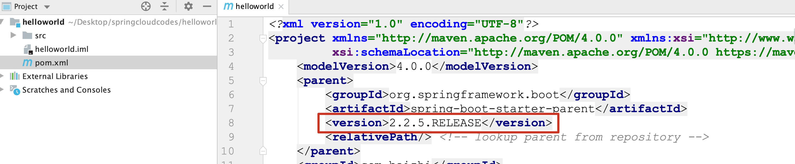

```markdown
# 2.引入springcloud的版本管理
```

```xml
<!--定义springcloud使用版本号-->
<properties>
  <java.version>1.8</java.version>
  <spring-cloud.version>Hoxton.SR6</spring-cloud.version>
</properties>
<!--全局管理springcloud版本,并不会引入具体依赖-->
<dependencyManagement>
  <dependencies>
    <dependency>
      <groupId>org.springframework.cloud</groupId>
      <artifactId>spring-cloud-dependencies</artifactId>
      <version>${spring-cloud.version}</version>
      <type>pom</type>
      <scope>import</scope>
    </dependency>
  </dependencies>
</dependencyManagement>
```


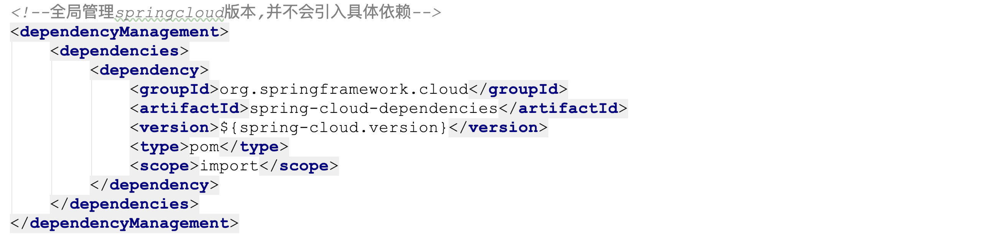

```markdown
# 3.完成上述操作springboot与springcloud环境搭建完成
- 接下来就是使用到具体的springcloud组件,在项目中引入具体的组件即可
```

-----

## 6.服务注册中心

### 什么服务注册中心

所谓服务注册中心就是在整个的微服务架构中单独提出一个服务，这个服务不完成系统的任何的业务功能，仅仅用来完成对整个微服务系统的服务注册和服务发现，以及对服务健康状态的监控和管理功能。


```markdown
# 1.服务注册中心
- 可以对所有的微服务的信息进行存储，如微服务的名称、IP、端口等
- 可以在进行服务调用时通过服务发现查询可用的微服务列表及网络地址进行服务调用
- 可以对所有的微服务进行心跳检测，如发现某实例长时间无法访问，就会从服务注册表移除该实例。
```

### 常用的注册中心

springcloud支持的多种注册中心Eureka(netflix)、Consul、Zookeeper、以及阿里巴巴推出Nacos组件。这些注册中心在本质上都是用来管理服务的注册和发现以及服务状态的检查的。

#### 1.Eureka

```markdown
# 0.简介
- https://github.com/Netflix/eureka/wiki
- Eureka是Netflix开发的服务发现框架，本身是一个基于REST的服务。SpringCloud将它集成在其子项目spring-cloud-netflix中，		以实现SpringCloud的服务注册和发现功能。
	Eureka包含两个组件：Eureka Server和Eureka Client。
```

单体应用  ------>  分类服务   商品服务  订单服务 用户服务......

Eureka Server 组件 :  服务注册中心组件    管理所有服务  支持所有服务注册

Eureka Client 组件 :   分类服务  商品服务  订单服务(微服务)

##### 开发Eureka Server

```markdown
# 1.创建项目并引入eureka server依赖
```

```xml
<!--引入 eureka server-->
<dependency>
  <groupId>org.springframework.cloud</groupId>
  <artifactId>spring-cloud-starter-netflix-eureka-server</artifactId>
</dependency>
```


```markdown
# 2.编写配置application.properties
```

```properties
server.port=8761																			#执行服务端口
spring.application.name=eurekaserver 									#指定服务名称 唯一标识
eureka.client.service-url.defaultZone=http://localhost:8761/eureka  #指定服务注册中心的地址
```

```markdown
# 3.开启Eureka Server,入口类加入注解
```

```java
@SpringBootApplication
@EnableEurekaServer
public class Eurekaserver8761Application {
    public static void main(String[] args) {
        SpringApplication.run(Eurekaserver8761Application.class, args);
    }
}
```


```markdown
# 4.访问Eureka的服务注册页面
- http://localhost:8761
```

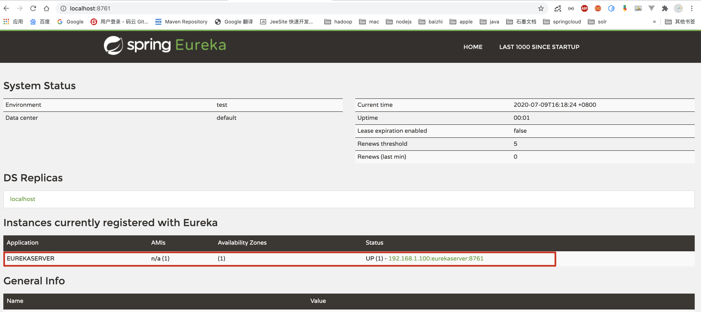

```markdown
# 5.虽然能看到管理界面为什么项目启动控制台报错? eureka server 服务注册中心 & client 微服务
```


```markdown
- 出现上述问题原因:eureka组件包含 eurekaserver 和 eurekaclient。server是一个服务注册中心,用来接受客户端的注册。client的特性会让当前启动的服务把自己作为eureka的客户端进行服务中心的注册,当项目启动时服务注册中心还没有创建好,所以找我不到服务的客户端组件就直接报错了，当启动成功服务注册中心创建好了，日后client也能进行注册，就不再报错啦！
```

```markdown
# 6.关闭Eureka自己注册自己
```

```properties
server.port=8761
spring.application.name=eurekaserver
eureka.client.service-url.defaultZone=http://localhost:8761/eureka
eureka.client.register-with-eureka=false    #不再将自己同时作为客户端进行注册  
eureka.client.fetch-registry=false				  #关闭作为客户端时从eureka server获取服务信息
```


```markdown
# 7.再次启动,当前应用就是一个单纯Eureka Server,控制器也不再报错
```


##### 开发Eureka Client 

```markdown
# 1.创建项目并引入eureka client依赖
```

```xml
<!--引入eureka client-->
<dependency>
  <groupId>org.springframework.cloud</groupId>
  <artifactId>spring-cloud-starter-netflix-eureka-client</artifactId>
</dependency>
```

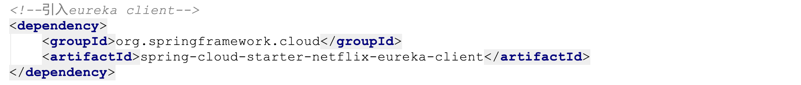

```markdown
# 2.编写配置application.properties
```

```properties
server.port=8888																		#服务端口号
spring.application.name=eurekaclient8888						#服务名称唯一标识
eureka.client.service-url.defaultZone=http://localhost:8761/eureka #eureka注册中心地址
```


```markdown
# 3.开启eureka客户端加入注解
```

```java
@SpringBootApplication
@EnableEurekaClient
public class Eurekaclient8888Application {
    public static void main(String[] args) {
        SpringApplication.run(Eurekaclient8888Application.class, args);
    }
}
```

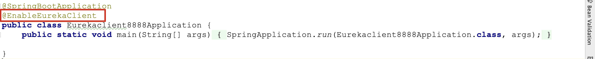

```markdown
# 4.启动之前的8761的服务注册中心,在启动eureka客户端服务
```


```markdown
# 5.查看eureka server的服务注册情况
```

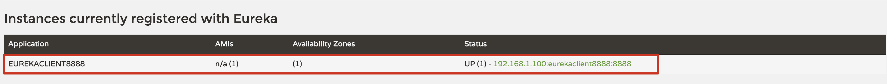

##### eureka自我保护机制

```markdown
# 0.服务频繁启动时 EurekaServer出现警告
- EMERGENCY! EUREKA MAY BE INCORRECTLY CLAIMING INSTANCES ARE UP WHEN THEY'RE NOT. RENEWALS ARE LESSER THAN THRESHOLD AND HENCE THE INSTANCES ARE NOT BEING EXPIRED JUST TO BE SAFE.
```

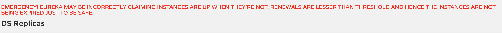

```markdown
# 1.自我保护机制
- 官网地址: https://github.com/Netflix/eureka/wiki/Server-Self-Preservation-Mode
- 默认情况下，如果Eureka Server在一定时间内（默认90秒）没有接收到某个微服务实例的心跳，Eureka Server将会移除该实例。但是当网络分区故障发生时，微服务与Eureka Server之间无法正常通信，而微服务本身是正常运行的，此时不应该移除这个微服务，所以引入了自我保护机制。Eureka Server在运行期间会去统计心跳失败比例在 15 分钟之内是否低于 85%，如果低于 85%，Eureka Server 会将这些实例保护起来，让这些实例不会过期。这种设计的哲学原理就是"宁可信其有不可信其无!"。自我保护模式正是一种针对网络异常波动的安全保护措施，使用自我保护模式能使Eureka集群更加的健壮、稳定的运行。

# 2.在eureka server端关闭自我保护机制
```

```properties
eureka.server.enable-self-preservation=false  #关闭自我保护
eureka.server.eviction-interval-timer-in-ms=3000 #超时3s自动清除
```

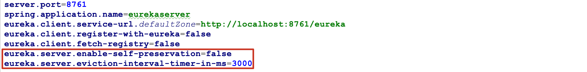

```markdown
# 3.微服务修改减短服务心跳的时间
```

```properties
eureka.instance.lease-expiration-duration-in-seconds=10 #用来修改eureka server默认接受心跳的最大时间 默认是90s
eureka.instance.lease-renewal-interval-in-seconds=5     #指定客户端多久向eureka server发送一次心跳 默认是30s
```

```markdown
# 4.尽管如此关闭自我保护机制还是会出现警告
- THE SELF PRESERVATION MODE IS TURNED OFF. THIS MAY NOT PROTECT INSTANCE EXPIRY IN CASE OF NETWORK/OTHER PROBLEMS.
- `官方并不建议在生产情况下关闭
```

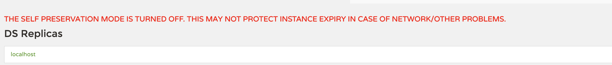

##### eureka 停止更新

```markdown
# 1.官方停止更新说明
- https://github.com/Netflix/eureka/wiki
- 在1.x版本项目还是活跃的,但是在2.x版本中停止维护,出现问题后果自负!!!
```

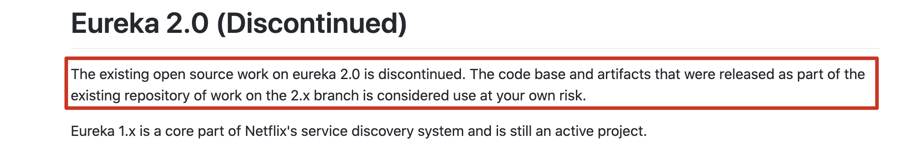

consul  服务注册中心  启动consul服务注册中心  运行 

consul 客户端 将springcloud 客户端(微服务)

#### 2.Consul

```markdown
# 0.consul 简介
- https://www.consul.io
- consul是一个可以提供服务发现，健康检查，多数据中心，Key/Value存储等功能的分布式服务框架，用于实现分布式系统的服务发现与配置。与其他分布式服务注册与发现的方案，使用起来也较为简单。Consul用Golang实现，因此具有天然可移植性(支持Linux、Windows和Mac OS X)；安装包仅包含一个可执行文件，方便部署。
```

##### 安装consul

```markdown
# 1.下载consul
- https://www.consul.io/downloads
```

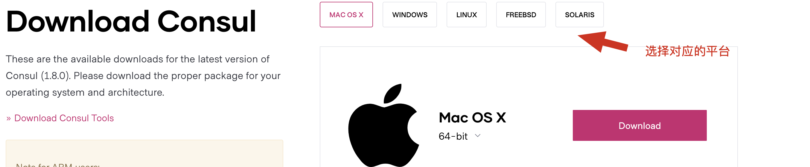


```markdown
# 2.安装consul
- 官方安装视频地址: https://learn.hashicorp.com/consul/getting-started/install.html
- 1.解压之后发现consul只有一个脚本文件
```


```markdown
# 3.根据解压缩目录配置环境变量
- 根据安装目录进行环境变量配置 [这里是macos和linux系统配置]
```

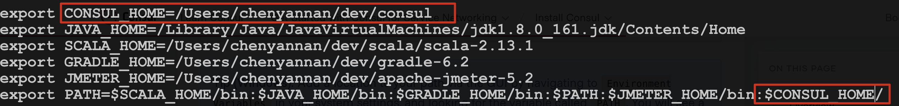

```markdown
# 4.查看consul环境变量是否配置成功,执行命令出现如下信息代表成功
- consul -v
```


```markdown
# 5.启动consul服务
- consul agent -dev
```


```markdown
# 6.访问consul的web服务端口
- http://localhost:8500
	`consul默认服务端口是8500
```


##### 开发consul 客户端即微服务

```markdown
# 1.创建项目并引入consul客户端依赖
```

```xml
 <!--引入consul依赖-->
<dependency>
  <groupId>org.springframework.cloud</groupId>
  <artifactId>spring-cloud-starter-consul-discovery</artifactId>
</dependency>
```


```markdown
# 2.编写properties配置
```

```properties
server.port=8889
spring.application.name=consulclient8889
spring.cloud.consul.host=localhost														#注册consul服务的主机
spring.cloud.consul.port=8500																	#注册consul服务的端口号
spring.cloud.consul.discovery.register-health-check=false	    #关闭consu了服务的健康检查[不推荐]
spring.cloud.consul.discovery.service-name=${spring.application.name} #指定注册的服务名称 默认就是应用名
```


```markdown
# 3.启动服务查看consul界面服务信息
```

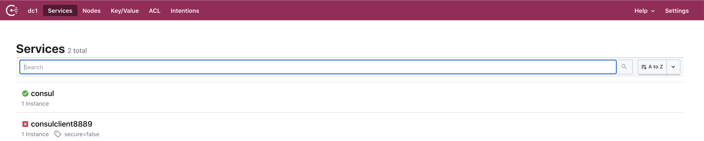

##### consul 开启健康监控检查

```markdown
# 1.开启consul健康监控
- 默认情况加consul监控健康是开启的,但是必须依赖健康监控依赖才能正确监控健康状态所以直接启动会显示错误,引入健康监控依赖之后服务正常
```

```xml
<!-- 这个包是用做健康度监控的-->
<dependency>
  <groupId>org.springframework.boot</groupId>
  <artifactId>spring-boot-starter-actuator</artifactId>
</dependency>
```

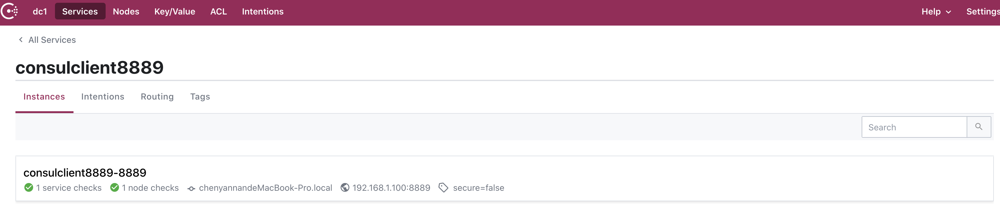

##### consul 关闭健康监控检查

```properties
server.port=8889
spring.application.name=consulclient8889
spring.cloud.consul.host=localhost														#注册consul服务的主机
spring.cloud.consul.port=8500																	#注册consul服务的端口号
spring.cloud.consul.discovery.register-health-check=false	    #关闭consu了服务的健康检查[不推荐]
spring.cloud.consul.discovery.service-name=${spring.application.name} #指定注册的服务名称 默认就是应用名
```


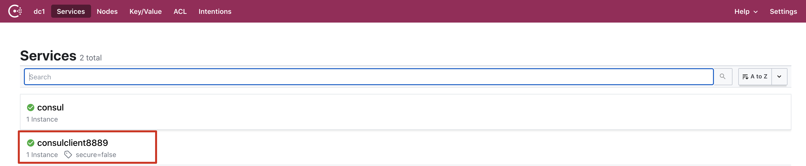

### 不同注册中心区别

```markdown
# 1.CAP定理     服务注册中心集群 node1   node2  node3    ...   eureka(AP)   consul zk(CP)

- CAP定理：CAP定理又称CAP原则，指的是在一个分布式系统中，一致性（Consistency）、可用性（Availability）、分区容错性（Partition tolerance）。CAP 原则指的是，这三个要素最多只能同时实现两点，不可能三者兼顾。
	`一致性（C）：在分布式系统中的所有数据备份，在同一时刻是否同样的值。（等同于所有节点访问同一份最新的数据副本）
	`可用性（A）：在集群中一部分节点故障后，集群整体是否还能响应客户端的读写请求。（对数据更新具备高可用性）
	`分区容忍性（P），就是高可用性，一个节点崩了，并不影响其它的节点（100个节点，挂了几个，不影响服务，越多机器越好）
	
# 2.Eureka特点  
- Eureka中没有使用任何的数据强一致性算法保证不同集群间的Server的数据一致，仅通过数据拷贝的方式争取注册中心数据的最终一致性，虽然放弃数据强一致性但是换来了Server的可用性，降低了注册的代价，提高了集群运行的健壮性。

# 3.Consul特点
- 基于Raft算法，Consul提供强一致性的注册中心服务，但是由于Leader节点承担了所有的处理工作，势必加大了注册和发现的代价，降低了服务的可用性。通过Gossip协议，Consul可以很好地监控Consul集群的运行，同时可以方便通知各类事件，如Leader选择发生、Server地址变更等。

# 4.zookeeper特点
- 基于Zab协议，Zookeeper可以用于构建具备数据强一致性的服务注册与发现中心，而与此相对地牺牲了服务的可用性和提高了注册需要的时间。  
```


----

## 7. 服务间通信方式

接下来在整个微服务架构中,我们比较关心的就是服务间的服务改如何调用,有哪些调用方式?


> 总结:`在springcloud中服务间调用方式主要是使用 http restful方式进行服务间调用`

### 基于RestTemplate的服务调用

```markdown
# 0.说明
- spring框架提供的RestTemplate类可用于在应用中调用rest服务，它简化了与http服务的通信方式，统一了RESTful的标准，封装了http链接， 我们只需要传入url及返回值类型即可。相较于之前常用的HttpClient，RestTemplate是一种更优雅的调用RESTful服务的方式。
```

#### 1. RestTemplate 服务调用

```markdown
# 1.创建两个服务并注册到consul注册中心中
- users    代表用户服务 端口为 9999
- products 代表商品服务 端口为 9998
	`注意:这里服务仅仅用来测试,没有实际业务意义
```


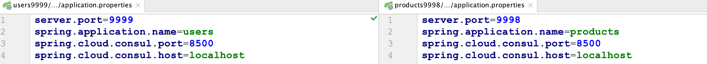

```markdown
# 2.在商品服务中提供服务方法
```

````java
@RestController
@Slf4j
public class ProductController {
    @Value("${server.port}")
    private int port;
    @GetMapping("/product/findAll")
    public Map<String,Object> findAll(){
        log.info("商品服务查询所有调用成功,当前服务端口:[{}]",port);
        Map<String, Object> map = new HashMap<String,Object>();
        map.put("msg","服务调用成功,服务提供端口为: "+port);
        map.put("status",true);
        return map;
    }
}
````

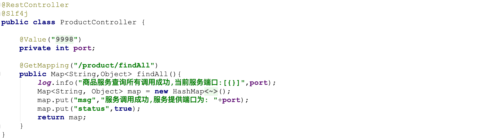

```markdown
# 3.在用户服务中使用restTemplate进行调用
```


```java
@RestController
@Slf4j
public class UserController {
    @GetMapping("/user/findAll")
    public String findAll(){
        log.info("调用用户服务...");
        //1.使用restTemplate调用商品服务
        RestTemplate restTemplate = new RestTemplate();
        String forObject = restTemplate.getForObject("http://localhost:9998/product/findAll", 
                                                     String.class);
        return forObject;
    }
}
```

```markdown
# 4.启动服务
```


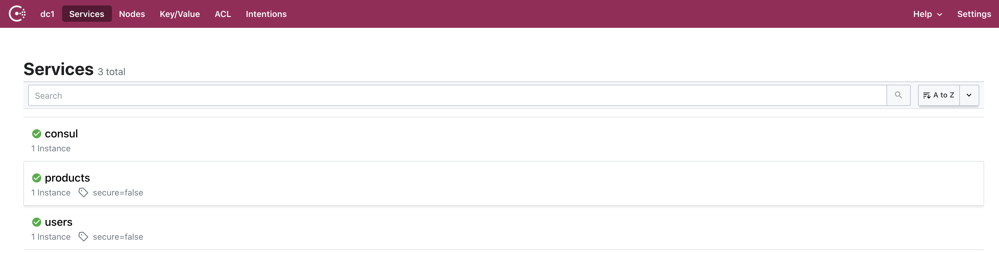

```markdown
# 5.测试服务调用
- 浏览器访问用户服务 http://localhost:9999/user/findAll
```

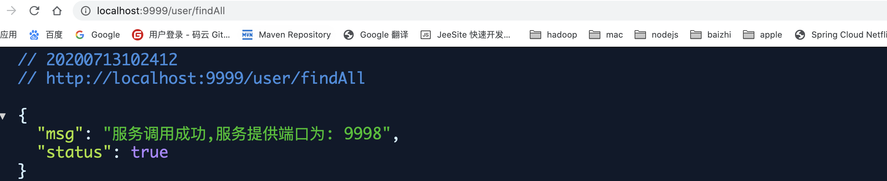


```markdown
# 6.总结
- rest Template是直接基于服务地址调用没有在服务注册中心获取服务,也没有办法完成服务的负载均衡如果需要实现服务的负载均衡需要自己书写服务负载均衡策略。

# 7.restTemplate直接调用存在问题
-  1.直接使用restTemplate方式调用没有经过服务注册中心获取服务地址,代码写死不利于维护,当服务宕机时不能高效剔除
-  2.调用服务时没有负载均衡需要自己实现负载均衡策略
```

### 基于Ribbon的服务调用

```markdown
# 0.说明
- 官方网址: https://github.com/Netflix/ribbon
- Spring Cloud Ribbon是一个基于HTTP和TCP的客户端负载均衡工具，它基于Netflix Ribbon实现。通过Spring Cloud的封装，可以让我们轻松地将面向服务的REST模版请求自动转换成客户端负载均衡的服务调用。
```

#### 1.Ribbon 服务调用

```markdown
# 1.项目中引入依赖
- 说明: 
	1.如果使用的是eureka client 和 consul client,无须引入依赖,因为在eureka,consul中默认集成了ribbon组件
	2.如果使用的client中没有ribbon依赖需要显式引入如下依赖
```

```xml
<!--引入ribbon依赖-->
<dependency>
  <groupId>org.springframework.cloud</groupId>
  <artifactId>spring-cloud-starter-netflix-ribbon</artifactId>
</dependency>
```

```markdown
# 2.查看consul client中依赖的ribbon
```

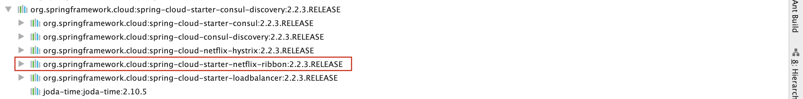

```markdown
# 3.使用restTemplate + ribbon进行服务调用
- 使用discovery client  进行客户端调用
- 使用loadBalanceClient 进行客户端调用
- 使用@loadBalanced     进行客户端调用
```

```markdown
# 3.1 使用discovery Client形式调用
```

```java
@Autowired
private DiscoveryClient discoveryClient;

//获取服务列表
List<ServiceInstance> products = discoveryClient.getInstances("服务ID");
for (ServiceInstance product : products) {
  log.info("服务主机:[{}]",product.getHost());
  log.info("服务端口:[{}]",product.getPort());
  log.info("服务地址:[{}]",product.getUri());
  log.info("====================================");
}
```

```markdown
# 3.2 使用loadBalance Client形式调用
```

```java
@Autowired
private LoadBalancerClient loadBalancerClient;
//根据负载均衡策略选取某一个服务调用
ServiceInstance product = loadBalancerClient.choose("服务ID");//地址  轮询策略
log.info("服务主机:[{}]",product.getHost());
log.info("服务端口:[{}]",product.getPort());
log.info("服务地址:[{}]",product.getUri());
```

```markdown
# 3.3 使用@loadBalanced
```

```java
//1.整合restTemplate + ribbon
@Bean
@LoadBalanced
public RestTemplate getRestTemplate(){
  return new RestTemplate();
}
//2.调用服务位置注入RestTemplate
@Autowired
private RestTemplate restTemplate;
//3.调用
String forObject = restTemplate.getForObject("http://服务ID/hello/hello?name=" + name, String.class);
```

#### 2.Ribbon负载均衡策略

```markdown
# 1.ribbon负载均衡算法
- RoundRobinRule         		轮训策略	按顺序循环选择 Server 
- RandomRule             		随机策略	随机选择 Server  
- AvailabilityFilteringRule 可用过滤策略
 	`会先过滤由于多次访问故障而处于断路器跳闸状态的服务，还有并发的连接数量超过阈值的服务，然后对剩余的服务列表按照轮询策略进行		访问

- WeightedResponseTimeRule  响应时间加权策略   
	`根据平均响应的时间计算所有服务的权重，响应时间越快服务权重越大被选中的概率越高，刚启动时如果统计信息不足，则使用		
		RoundRobinRule策略，等统计信息足够会切换到

- RetryRule                 重试策略          
	`先按照RoundRobinRule的策略获取服务，如果获取失败则在制定时间内进行重试，获取可用的服务。
	
- BestAviableRule           最低并发策略     
	`会先过滤掉由于多次访问故障而处于断路器跳闸状态的服务，然后选择一个并发量最小的服务
```


#### 3.修改服务的默认负载均衡策略

```markdown
# 1.修改服务默认随机策略
- 服务id.ribbon.NFLoadBalancerRuleClassName=com.netflix.loadbalancer.RandomRule
	`下面的products为服务的唯一标识
```

```properties
products.ribbon.NFLoadBalancerRuleClassName=com.netflix.loadbalancer.RandomRule
```


#### 4.Ribbon停止维护

```markdown
# 1.官方停止维护说明
- https://github.com/Netflix/ribbon
```


---

## 8.OpenFeign组件的使用

- 思考: 使用RestTemplate+ribbon已经可以完成服务间的调用，为什么还要使用feign？

```java
String restTemplateForObject = restTemplate.getForObject("http://服务名/url?参数" + name, String.class);
```

```markdown
# 存在问题:
- 1.每次调用服务都需要写这些代码,存在大量的代码冗余
- 2.服务地址如果修改,维护成本增高
- 3.使用时不够灵活
```

### OpenFeign 组件

```markdown
# 0.说明
- https://cloud.spring.io/spring-cloud-openfeign/reference/html/
- Feign是一个声明式的伪Http客户端，它使得写Http客户端变得更简单。使用Feign，只需要创建一个接口并注解。它具有可插拔的注解特性(可以使用springmvc的注解)，可使用Feign 注解和JAX-RS注解。Feign支持可插拔的编码器和解码器。Feign默认集成了Ribbon，默认实现了负载均衡的效果并且springcloud为feign添加了springmvc注解的支持。
```

#### 1.openFeign 服务调用

```markdown
# 1.服务调用方法引入依赖OpenFeign依赖
```

```xml
<!--Open Feign依赖-->
<dependency>
    <groupId>org.springframework.cloud</groupId>
    <artifactId>spring-cloud-starter-openfeign</artifactId>
</dependency>
```


```markdown
# 2.入口类加入注解开启OpenFeign支持
```

```java
@SpringBootApplication
@EnableFeignClients   //开启openfeign支持
public class Users9999Application {
    public static void main(String[] args) {
        SpringApplication.run(Users9999Application.class, args);
    }
}
```

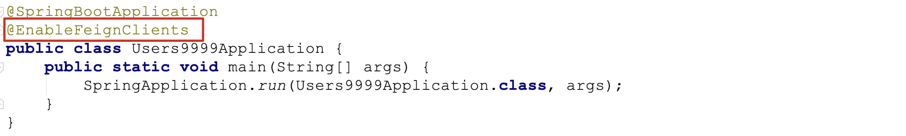

```markdown
# 3.创建一个客户端调用接口
```

```java
//value属性用来指定:调用服务名称
@FeignClient("PRODUCTS")
public interface ProductClient {
  
    @GetMapping("/product/findAll") //书写服务调用路径
    String findAll();
}
```

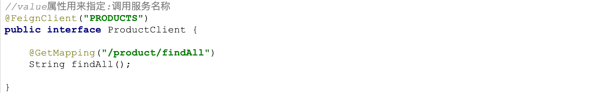

```markdown
# 4.使用feignClient客户端对象调用服务
```

```java
//注入客户端对象
@Autowired
private ProductClient productClient;

@GetMapping("/user/findAllFeignClient")
public String findAllFeignClient(){
  log.info("通过使用OpenFeign组件调用商品服务...");
  String msg = productClient.findAll();
  return msg;
}
```


```markdown
# 5.访问并测试服务
- http://localhost:9999/user/findAllFeignClient
```


#### 2.调用服务并传参

```markdown
# 0.说明
- 服务和服务之间通信,不仅仅是调用,往往在调用过程中还伴随着参数传递,接下来重点来看看OpenFeign在调用服务时如何传递参数
```

###### GET方式调用服务传递参数

```markdown
# 1.GET方式调用服务传递参数
- 在商品服务中加入需要传递参数的服务方法来进行测试
- 在用户服务中进行调用商品服务中需要传递参数的服务方法进行测试
```

```java
// 1.商品服务中添加如下方法
 @GetMapping("/product/findOne")
public Map<String,Object> findOne(String productId){
  log.info("商品服务查询商品信息调用成功,当前服务端口:[{}]",port);
  log.info("当前接收商品信息的id:[{}]",productId);
  Map<String, Object> map = new HashMap<String,Object>();
  map.put("msg","商品服务查询商品信息调用成功,当前服务端口: "+port);
  map.put("status",true);
  map.put("productId",productId);
  return map;
}
```

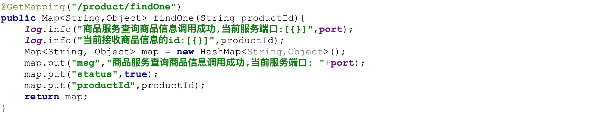

```java
//2.用户服务中在product客户端中声明方法
@FeignClient("PRODUCTS")
public interface ProductClient { 
	@GetMapping("/product/findOne")
 	String findOne(@RequestParam("productId") String productId);
}
```


```java
//3.用户服务中调用并传递参数
//注入客户端对象
@Autowired
private ProductClient productClient;

@GetMapping("/feign/test1")
public Map<String,Object> test1(String id){
  log.info("用来测试Openfiegn的GET方式参数传递");
  Map<String, Object> msg = productClient.findOne(id);
  log.info("调用返回信息:[{}]",msg);
  return msg;
}
```


```markdown
# 测试访问
```


###### post方式调用服务传递参数

```markdown
# 2.post方式调用服务传递参数
- 在商品服务中加入需要传递参数的服务方法来进行测试
- 在用户服务中进行调用商品服务中需要传递参数的服务方法进行测试
```

```java
//1.商品服务加入post方式请求并接受name
@PostMapping("/product/save")
public Map<String,Object> save(String name){
  log.info("商品服务保存商品调用成功,当前服务端口:[{}]",port);
  log.info("当前接收商品名称:[{}]",name);
  Map<String, Object> map = new HashMap<String,Object>();
  map.put("msg","商品服务查询商品信息调用成功,当前服务端口: "+port);
  map.put("status",true);
  map.put("name",name);
  return map;
}
```


```java
//2.用户服务中在product客户端中声明方法
//value属性用来指定:调用服务名称
@FeignClient("PRODUCTS")
public interface ProductClient {
    @PostMapping("/product/save")
    String save(@RequestParam("name") String name);
}
```

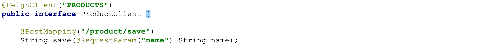

```java
//3.用户服务中调用并传递参数
@Autowired
private ProductClient productClient;

@GetMapping("/user/save")
public String save(String productName){
  log.info("接收到的商品信息名称:[{}]",productName);
  String save = productClient.save(productName);
  log.info("调用成功返回结果: "+save);
  return save;
}
```


```markdown
# 测试访问
```


```markdown
# 2.传递对象类型参数
- 商品服务定义对象
- 商品服务定义对象接收方法
- 用户服务调用商品服务定义对象参数方法进行参数传递
```

```java
//1.商品服务定义对象
@Data
public class Product {
    private Integer id;
    private String name;
    private Date bir;
}
```

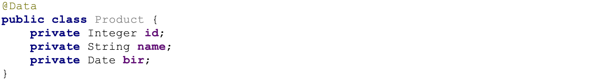

```java
//2.商品服务定义接收对象的方法
@PostMapping("/product/saveProduct")
public Map<String,Object> saveProduct(@RequestBody Product product){
  log.info("商品服务保存商品信息调用成功,当前服务端口:[{}]",port);
  log.info("当前接收商品名称:[{}]",product);
  Map<String, Object> map = new HashMap<String,Object>();
  map.put("msg","商品服务查询商品信息调用成功,当前服务端口: "+port);
  map.put("status",true);
  map.put("product",product);
  return map;
}

```


```java
//3.将商品对象复制到用户服务中
//4.用户服务中在product客户端中声明方法
@FeignClient("PRODUCTS")
public interface ProductClient {
  @PostMapping("/product/saveProduct")
  String saveProduct(@RequestBody Product product);
}
//注意:服务提供方和调用方一定要加入@RequestBody注解 
```

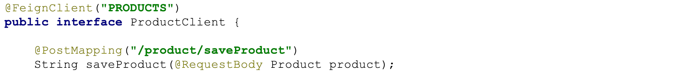

```java
// 5.在用户服务中调用保存商品信息服务
//注入客户端对象
@Autowired
private ProductClient productClient;

@GetMapping("/user/saveProduct")
public String saveProduct(Product product){
  log.info("接收到的商品信息:[{}]",product);
  String save = productClient.saveProduct(product);
  log.info("调用成功返回结果: "+save);
  return save;
}
```


```markdown
# 测试
```


#### 3.OpenFeign超时设置

```markdown
# 0.超时说明
- 默认情况下,openFiegn在进行服务调用时,要求服务提供方处理业务逻辑时间必须在1S内返回,如果超过1S没有返回则OpenFeign会直接报错,不会等待服务执行,但是往往在处理复杂业务逻辑是可能会超过1S,因此需要修改OpenFeign的默认服务调用超时时间。
- 调用超时会出现如下错误：
```

```markdown
# 1.模拟超时
- 服务提供方加入线程等待阻塞
```

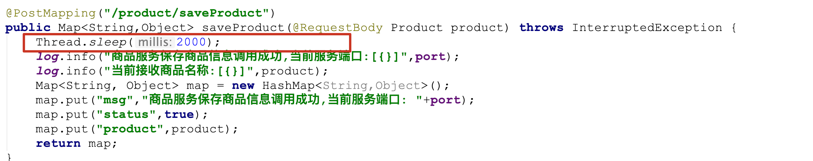

```markdown
# 2.进行客户端调用
```

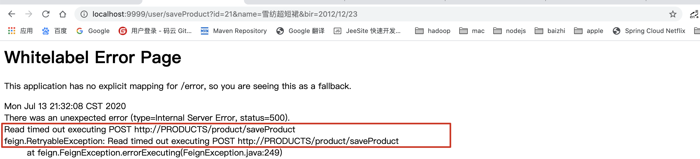

```markdown
# 3.修改OpenFeign默认超时时间
```

```properties
feign.client.config.PRODUCTS.connectTimeout=5000  #配置指定服务连接超时
feign.client.config.PRODUCTS.readTimeout=5000		  #配置指定服务等待超时
#feign.client.config.default.connectTimeout=5000  #配置所有服务连接超时
#feign.client.config.default.readTimeout=5000			#配置所有服务等待超时
```

#### 4.OpenFeign调用详细日志展示

```markdown
# 0.说明
- 往往在服务调用时我们需要详细展示feign的日志,默认feign在调用是并不是最详细日志输出,因此在调试程序时应该开启feign的详细日志展示。feign对日志的处理非常灵活可为每个feign客户端指定日志记录策略，每个客户端都会创建一个logger默认情况下logger的名称是feign的全限定名需要注意的是，feign日志的打印只会DEBUG级别做出响应。
- 我们可以为feign客户端配置各自的logger.level对象，告诉feign记录那些日志logger.lever有以下的几种值
	`NONE  不记录任何日志
	`BASIC 仅仅记录请求方法，url，响应状态代码及执行时间
	`HEADERS 记录Basic级别的基础上，记录请求和响应的header
	`FULL 记录请求和响应的header，body和元数据
```

```markdown
# 1.开启日志展示
```

```properties
feign.client.config.PRODUCTS.loggerLevel=full  #开启指定服务日志展示
#feign.client.config.default.loggerLevel=full  #全局开启服务日志展示
logging.level.com.baizhi.feignclients=debug    #指定feign调用客户端对象所在包,必须是debug级别
```

```markdown
# 2.测试服务调用查看日志
```


---

## 9.Hystrix组件使用

### Hystrix组件


In a distributed environment, inevitably some of the many service dependencies will fail. Hystrix is a library that helps you control the interactions between these distributed services by adding latency tolerance and fault tolerance logic. Hystrix does this by isolating points of access between the services, stopping cascading failures across them, and providing fallback options, all of which improve your system’s overall resiliency.														--[摘自官方]

```markdown
# 0.说明
- https://github.com/Netflix/Hystrix
- 译: 在分布式环境中，许多服务依赖项不可避免地会失败。Hystrix是一个库，它通过添加延迟容忍和容错逻辑来帮助您控制这些分布式服务之间的交互。Hystrix通过隔离服务之间的访问点、停止它们之间的级联故障以及提供后备选项来实现这一点，所有这些都可以提高系统的整体弹性。

- 通俗定义: Hystrix是一个用于处理分布式系统的延迟和容错的开源库，在分布式系统中，许多依赖不可避免的会调用失败，超时、异常等，Hystrix能够保证在一个依赖出问题的情况下，不会导致整体服务失败，避免级联故障(服务雪崩现象)，提高分布式系统的弹性。
```

#### 1.服务雪崩

```markdown
# 1.服务雪崩
- 在微服务之间进行服务调用是由于某一个服务故障，导致级联服务故障的现象，称为雪崩效应。雪崩效应描述的是提供方不可用，导致消费方不可用并将不可用逐渐放大的过程。
# 2.图解雪崩效应
- 如存在如下调用链路:
```


```markdown
- 而此时，Service A的流量波动很大，流量经常会突然性增加！那么在这种情况下，就算Service A能扛得住请求，Service B和Service C未必能扛得住这突发的请求。此时，如果Service C因为抗不住请求，变得不可用。那么Service B的请求也会阻塞，慢慢耗尽Service B的线程资源，Service B就会变得不可用。紧接着，Service A也会不可用，这一过程如下图所示
```

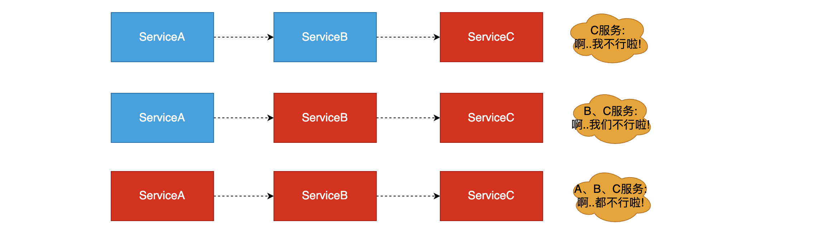

#### 2.服务熔断

```markdown
# 服务熔断
- “熔断器”本身是一种开关装置，当某个服务单元发生故障之后，通过断路器的故障监控，某个异常条件被触发，直接熔断整个服务。向调用方法返回一个符合预期的、可处理的备选响应(FallBack),而不是长时间的等待或者抛出调用方法无法处理的异常，就保证了服务调用方的线程不会被长时间占用，避免故障在分布式系统中蔓延，乃至雪崩。如果目标服务情况好转则恢复调用。服务熔断是解决服务雪崩的重要手段。

# 服务熔断图示
```


#### 3.服务降级

```markdown
# 服务降级说明
- 服务压力剧增的时候根据当前的业务情况及流量对一些服务和页面有策略的降级，以此环节服务器的压力，以保证核心任务的进行。同时保证部分甚至大部分任务客户能得到正确的相应。也就是当前的请求处理不了了或者出错了，给一个默认的返回。

-  通俗: 关闭系统中边缘服务 保证系统核心服务的正常运行  称之为服务降级
   //12  淘宝 删除地址  确认收货  删除订单   取消支付   节省cpu  内存
# 服务降级图示
```


#### 4.降级和熔断总结

```markdown
# 1.共同点
- 目的很一致，都是从可用性可靠性着想，为防止系统的整体缓慢甚至崩溃，采用的技术手段；
- 最终表现类似，对于两者来说，最终让用户体验到的是某些功能暂时不可达或不可用；
- 粒度一般都是服务级别，当然，业界也有不少更细粒度的做法，比如做到数据持久层（允许查询，不允许增删改）；
- 自治性要求很高，熔断模式一般都是服务基于策略的自动触发，降级虽说可人工干预，但在微服务架构下，完全靠人显然不可能，开关预置、配置中心都是必要手段；

# 2.异同点
- 触发原因不太一样，服务熔断一般是某个服务（下游服务）故障引起，而服务降级一般是从整体负荷考虑；
- 管理目标的层次不太一样，熔断其实是一个框架级的处理，每个微服务都需要（无层级之分），而降级一般需要对业务有层级之分（比如降级一般是从最外围服务开始）

# 3.总结
- 熔断必会触发降级,所以熔断也是降级一种,区别在于熔断是对调用链路的保护,而降级是对系统过载的一种保护处理
```

#### 5.服务熔断的实现

```markdown
#服务熔断的实现思路
- 引入hystrix依赖,并开启熔断器(断路器)
- 模拟降级方法
- 进行调用测试
```

```markdown
# 1.项目中引入hystrix依赖
```

```xml
<!--引入hystrix-->
<dependency>
  <groupId>org.springframework.cloud</groupId>
  <artifactId>spring-cloud-starter-netflix-hystrix</artifactId>
</dependency>
```


```markdown
# 2.开启断路器
```

```java
@SpringBootApplication
@EnableCircuitBreaker  //用来开启断路器
public class Products9998Application {
    public static void main(String[] args) {
        SpringApplication.run(Products9998Application.class, args);
    }
}
```


```markdown
# 3.使用HystrixCommand注解实现断路
```

```java
//服务熔断
@GetMapping("/product/break")
@HystrixCommand(fallbackMethod = "testBreakFall" )
public String testBreak(int id){
  log.info("接收的商品id为: "+ id);
  if(id<=0){
    throw new RuntimeException("数据不合法!!!");
  }
  return "当前接收商品id: "+id;
}

public String testBreakFall(int id){
  return "当前数据不合法: "+id;
}
```

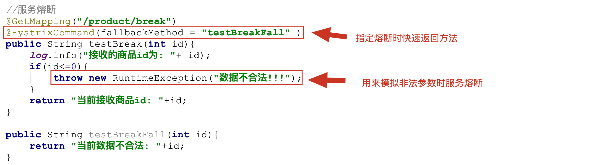

```markdown
# 4.访问测试
- 正常参数访问
- 错误参数访问
```

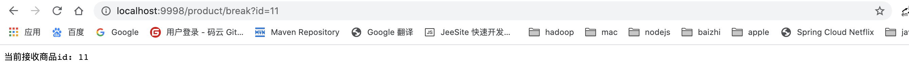


```markdown
# 5.总结
- 从上面演示过程中会发现如果触发一定条件断路器会自动打开,过了一点时间正常之后又会关闭。那么断路器打开条件是什么呢？
```

```markdown
# 6.断路器打开条件
- 官网: https://cloud.spring.io/spring-cloud-netflix/2.2.x/reference/html/#circuit-breaker-spring-cloud-circuit-breaker-with-hystrix
```

A service failure in the lower level of services can cause cascading failure all the way up to the user. When calls to a particular service exceed `circuitBreaker.requestVolumeThreshold` (default: 20 requests) and the failure percentage is greater than `circuitBreaker.errorThresholdPercentage` (default: >50%) in a rolling window defined by `metrics.rollingStats.timeInMilliseconds` (default: 10 seconds), the circuit opens and the call is not made. In cases of error and an open circuit, a fallback can be provided by the developer.																		--摘自官方

```markdown
# 原文翻译之后,总结打开关闭的条件:
- 1、  当满足一定的阀值的时候（默认10秒内超过20个请求次数）
- 2、  当失败率达到一定的时候（默认10秒内超过50%的请求失败）
- 3、  到达以上阀值，断路器将会开启
- 4、  当开启的时候，所有请求都不会进行转发
- 5、  一段时间之后（默认是5秒），这个时候断路器是半开状态，会让其中一个请求进行转发。如果成功，断路器会关闭，若失败，继续开启。重复4和5。
```


```markdown
# 7.默认的服务FallBack处理方法
- 如果为每一个服务方法开发一个降级,对于我们来说,可能会出现大量的代码的冗余,不利于维护,这个时候就需要加入默认服务降级处理方法
```

```java
@GetMapping("/product/hystrix")
@HystrixCommand(fallbackMethod = "testHystrixFallBack") //通过HystrixCommand降级处理 指定出错的方法
public String testHystrix(String name) {
  log.info("接收名称为: " + name);
  int n = 1/0;
  return "服务[" + port + "]响应成功,当前接收名称为:" + name;
}
//服务降级处理
public String testHystrixFallBack(String name) {
  return port + "当前服务已经被降级处理!!!,接收名称为: "+name;
}
```

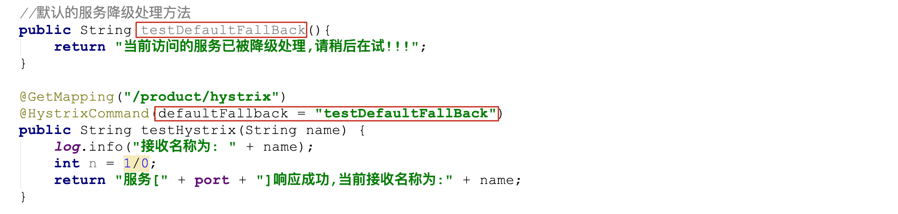

#### 6.服务降级的实现

```markdown
# 1.客户端openfeign + hystrix实现服务降级实现
- 引入hystrix依赖
- 配置文件开启feign支持hystrix
- 在feign客户端调用加入fallback指定降级处理
- 开发降级处理方法
```

```markdown
# 2.开启openfeign支持服务降级
```

```properties
feign.hystrix.enabled=true #开启openfeign支持降级
```

```markdown
# 3.在openfeign客户端中加如Hystrix
```

```java
@FeignClient(value = "PRODUCTS",fallback = ProductFallBack.class)
public interface ProductClient {
    @GetMapping("/product/hystrix")
    String testHystrix(@RequestParam("name") String name);
}
```

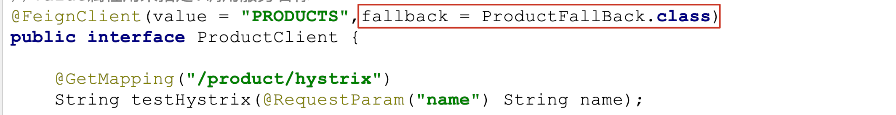

```markdown
# 4.开发fallback处理类
```

```java
@Component
public class ProductFallBack implements ProductClient {
    @Override
    public String testHystrix(String name) {
        return "我是客户端的Hystrix服务实现!!!";
    }
}
```

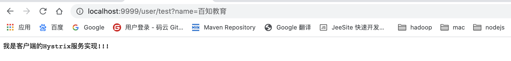

**注意:如果服务端降级和客户端降级同时开启,要求服务端降级方法的返回值必须与客户端方法降级的返回值一致!!!**

#### 7.Hystrix Dashboard

```markdown
# 0.说明
- Hystrix Dashboard的一个主要优点是它收集了关于每个HystrixCommand的一组度量。Hystrix仪表板以高效的方式显示每个断路器的运行状况。
```

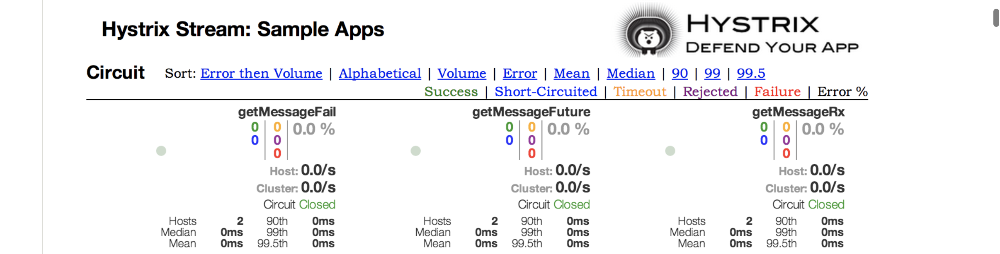

```markdown
# 1.项目中引入依赖
```

```xml
<!--引入hystrix dashboard 依赖-->
<dependency>
  <groupId>org.springframework.cloud</groupId>
  <artifactId>spring-cloud-starter-netflix-hystrix-dashboard</artifactId>
</dependency>
```

```markdown
# 2.入口类中开启hystrix dashboard
```

```java
@SpringBootApplication
@EnableHystrixDashboard //开启监控面板
public class Hystrixdashboard9990Application {
	public static void main(String[] args) {
		SpringApplication.run(Hystrixdashboard9990Application.class, args);
  }
}
```

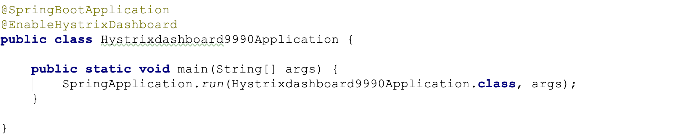

```markdown
# 3.启动hystrix dashboard应用
- http://localhost:9990(dashboard端口)/hystrix
```

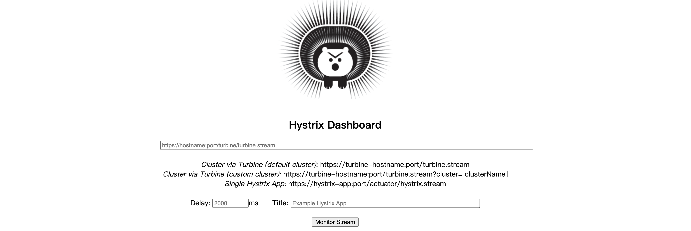

```markdown
# 4.监控的项目中入口类中加入监控路径配置[新版本坑],并启动监控项目
```

```java
@Bean
public ServletRegistrationBean getServlet() {
  HystrixMetricsStreamServlet streamServlet = new HystrixMetricsStreamServlet();
  ServletRegistrationBean registrationBean = new ServletRegistrationBean(streamServlet);
  registrationBean.setLoadOnStartup(1);
  registrationBean.addUrlMappings("/hystrix.stream");
  registrationBean.setName("HystrixMetricsStreamServlet");
  return registrationBean;
}
```

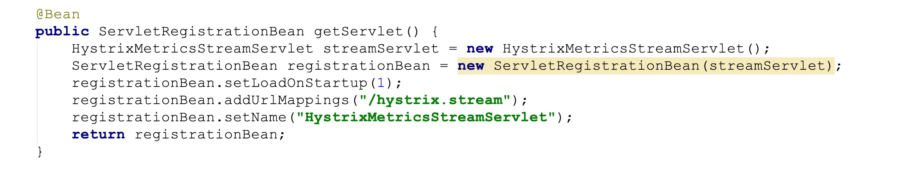

```markdown
# 5.通过监控界面监控
```

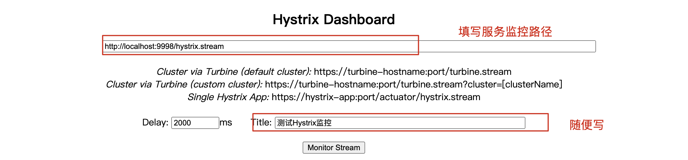

```markdown
# 6.点击监控,一致loading,打开控制台发现报错[特别坑]
```

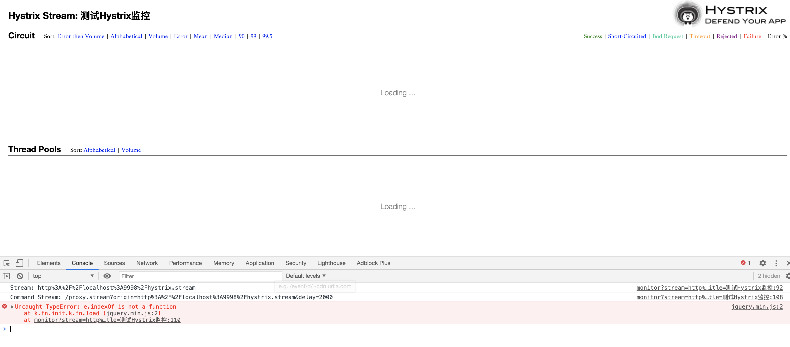

```markdown
# 解决方案
- 新版本中springcloud将jquery版本升级为3.4.1，定位到monitor.ftlh文件中，js的写法如下：
	$(window).load(function() 
- jquery 3.4.1已经废弃上面写法

- 修改方案 修改monitor.ftlh为如下调用方式：
	$(window).on("load",function()
	
- 编译jar源文件，重新打包引入后，界面正常响应。
```

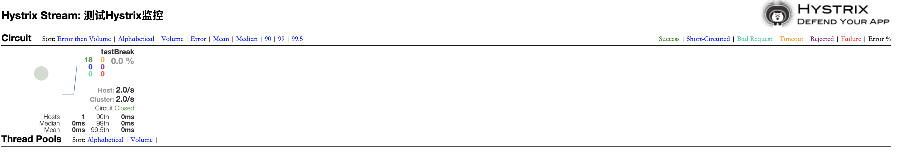

#### 8.Hystrix停止维护


```markdown
# 官方地址:https://github.com/Netflix/Hystrix
- 翻译:Hystrix（版本1.5.18）足够稳定，可以满足Netflix对我们现有应用的需求。同时，我们的重点已经转移到对应用程序的实时性能作出反应的更具适应性的实现，而不是预先配置的设置（例如，通过自适应并发限制）。对于像Hystrix这样的东西有意义的情况，我们打算继续在现有的应用程序中使用Hystrix，并在新的内部项目中利用诸如resilience4j这样的开放和活跃的项目。我们开始建议其他人也这样做。
- Dashboard也被废弃
```

## 10.Gateway组件使用

### 什么是服务网关

```markdown
# 1.说明
- 网关统一服务入口，可方便实现对平台众多服务接口进行管控，对访问服务的身份认证、防报文重放与防数据篡改、功能调用的业务鉴权、响应数据的脱敏、流量与并发控制，甚至基于API调用的计量或者计费等等。

- 网关 =  路由转发 + 过滤器
	`路由转发：接收一切外界请求，转发到后端的微服务上去；
	`在服务网关中可以完成一系列的横切功能，例如权限校验、限流以及监控等，这些都可以通过过滤器完成
	
# 2.为什么需要网关
 - 1.网关可以实现服务的统一管理
 - 2.网关可以解决微服务中通用代码的冗余问题(如权限控制,流量监控,限流等)

# 3.网关组件在微服务中架构
```

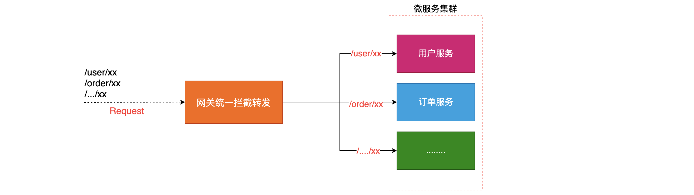

### 服务网关组件

#### zuul

Zuul is the front door for all requests from devices and web sites to the backend of the Netflix streaming application. As an edge service application, Zuul is built to enable dynamic routing, monitoring, resiliency and security.

```markdown
# 0.原文翻译
- https://github.com/Netflix/zuul/wiki
- zul是从设备和网站到Netflix流媒体应用程序后端的所有请求的前门。作为一个边缘服务应用程序，zul被构建为支持动态路由、监视、弹性和安全性。

# 1.zuul版本说明
- 目前zuul组件已经从1.0更新到2.0，但是作为springcloud官方不再推荐使用zuul2.0，但是依然支持zuul2.

# 2.springcloud 官方集成zuul文档
- https://cloud.spring.io/spring-cloud-netflix/2.2.x/reference/html/#netflix-zuul-starter
```

#### gateway

This project provides a library for building an API Gateway on top of Spring MVC. Spring Cloud Gateway aims to provide a simple, yet effective way to route to APIs and provide cross cutting concerns to them such as: security, monitoring/metrics, and resiliency.

```markdown
# 0.原文翻译
- https://spring.io/projects/spring-cloud-gateway
- 这个项目提供了一个在springmvc之上构建API网关的库。springcloudgateway旨在提供一种简单而有效的方法来路由到api，并为api提供横切关注点，比如：安全性、监控/度量和弹性。

# 1.特性
- 基于springboot2.x 和 spring webFlux 和 Reactor 构建 响应式异步非阻塞IO模型
- 动态路由
- 请求过滤
```

###### 1.开发网关动态路由

```markdown
# 0.翻译
- 网关配置有两种方式一种是快捷方式,一种是完全展开方式

# 1.创建项目引入网关依赖
```

```xml
<!--引入gateway网关依赖-->
<dependency>
  <groupId>org.springframework.cloud</groupId>
  <artifactId>spring-cloud-starter-gateway</artifactId>
</dependency>
```


- **快捷方式配置路由**

```markdown
# 2.编写网关配置
```

```yml
spring:
  application:
    name: gateway
  cloud:
    consul:
      host: localhost
      port: 8500
    gateway:
      routes:
        - id: user_route							# 指定路由唯一标识
          uri: http://localhost:9999/ # 指定路由服务的地址
          predicates:
            - Path=/user/**					  # 指定路由规则

        - id: product_route
          uri: http://localhost:9998/
          predicates:
            - Path=/product/**
server:
  port: 8989
```

```markdown
# 3.启动gateway网关项目
- 直接启动报错:
```

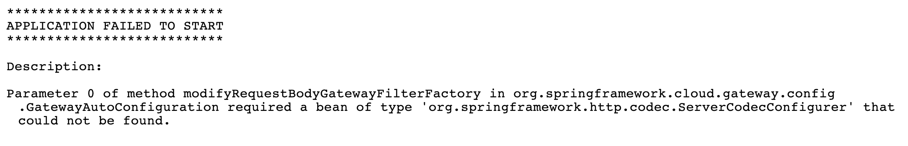

```markdown
- 在启动日志中发现,gateway为了效率使用webflux进行异步非阻塞模型的实现,因此和原来的web包冲突,去掉原来的web即可
```


```markdown
- 再次启动成功启动
```

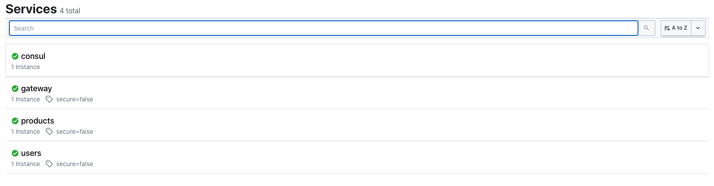

```markdown
# 4.测试网关路由转发
- 测试通过网关访问用户服务: http://localhost:8989/user/findOne?productId=21
- 测试通过网关访问商品服务: http://localhost:8989/product/findOne?productId=1
```

- **java方式配置路由**

```java
@Configuration
public class GatewayConfig {
    @Bean
    public RouteLocator customRouteLocator(RouteLocatorBuilder builder) {
        return builder.routes()
                .route("order_route", r -> r.path("/order/**")
                        .uri("http://localhost:9997/"))
                .build();
    }
}
```

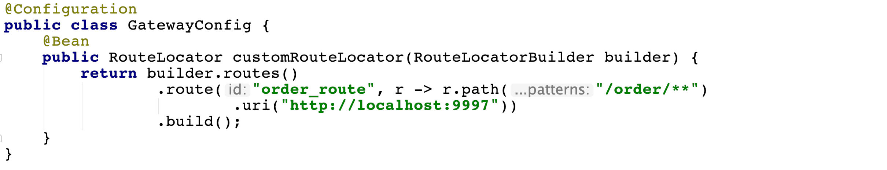

###### 2.查看网关路由规则列表

```markdown
# 1.说明
- gateway提供路由访问规则列表的web界面,但是默认是关闭的,如果想要查看服务路由规则可以在配置文件中开启
```

```yml
management:
  endpoints:
    web:
      exposure:
        include: "*"   #开启所有web端点暴露
```

```markdown
- 访问路由管理列表地址
- http://localhost:8989/actuator/gateway/routes
```


###### 3.配置路由服务负载均衡

```markdown
# 1.说明
- 现有路由配置方式,都是基于服务地址写死的路由转发,能不能根据服务名称进行路由转发同时实现负载均衡的呢?

# 2.动态路由以及负载均衡转发配置
```

```yml
spring:
  application:
    name: gateway
  cloud:
    consul:
      host: localhost
      port: 8500
    gateway:
      routes:
        - id: user_route
          #uri: http://localhost:9999/
          uri: lb://users							# lb代表转发后台服务使用负载均衡,users代表服务注册中心上的服务名
          predicates:
            - Path=/user/**

        - id: product_route
          #uri: http://localhost:9998/
          uri: lb://products          # lb(loadbalance)代表负载均衡转发路由
          predicates:
            - Path=/product/**
      discovery:
        locator:
          enabled: true 							#开启根据服务名动态获取路由
```

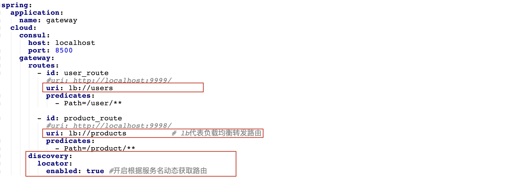


###### 4.常用路由predicate(断言,验证)

```markdown
# 1.Gateway支持多种方式的predicate
```

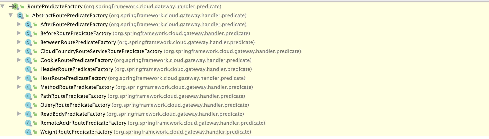

```markdown
- After=2020-07-21T11:33:33.993+08:00[Asia/Shanghai]  			`指定日期之后的请求进行路由
- Before=2020-07-21T11:33:33.993+08:00[Asia/Shanghai]       `指定日期之前的请求进行路由
- Between=2017-01-20T17:42:47.789-07:00[America/Denver], 2017-01-21T17:42:47.789-07:00[America/Denver]
- Cookie=username,chenyn																		`基于指定cookie的请求进行路由
- Cookie=username,[A-Za-z0-9]+															`基于指定cookie的请求进行路由	
	`curl http://localhost:8989/user/findAll --cookie "username=zhangsna"
- Header=X-Request-Id, \d+																 ``基于请求头中的指定属性的正则匹配路由(这里全是整数)
	`curl http://localhost:8989/user/findAll -H "X-Request-Id:11"
- Method=GET,POST																						 `基于指定的请求方式请求进行路由

- 官方更多: https://cloud.spring.io/spring-cloud-static/spring-cloud-gateway/2.2.3.RELEASE/reference/html/#the-cookie-route-predicate-factory
```

```markdown
# 2.使用predicate
```

```yml
spring:
  application:
    name: gateway
  cloud:
    consul:
      host: localhost
      port: 8500
    gateway:
      routes:
        - id: user_route
          #uri: http://localhost:9999/
          uri: lb://users
          predicates:
            - Path=/user/**
            - After=2020-07-21T11:39:33.993+08:00[Asia/Shanghai]
            - Cookie=username,[A-Za-z0-9]+
            - Header=X-Request-Id, \d+
```

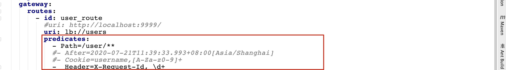

###### 5.常用的Filter以及自定义filter

Route filters allow the modification of the incoming HTTP request or outgoing HTTP response in some manner. Route filters are scoped to a particular route. Spring Cloud Gateway includes many built-in GatewayFilter Factories.

```markdown
# 1.原文翻译
- 官网: 
	https://cloud.spring.io/spring-cloud-static/spring-cloud-gateway/2.2.3.RELEASE/reference/html/#gatewayfilter-factories
	
- 路由过滤器允许以某种方式修改传入的HTTP请求或传出的HTTP响应。路由筛选器的作用域是特定路由。springcloudgateway包括许多内置的GatewayFilter工厂。

# 2.作用
- 当我们有很多个服务时，比如下图中的user-service、order-service、product-service等服务，客户端请求各个服务的Api时，每个服务都需要做相同的事情，比如鉴权、限流、日志输出等。
```


```markdown
# 2.使用内置过滤器
```


```markdown
- 更多参加官网:https://cloud.spring.io/spring-cloud-static/spring-cloud-gateway/2.2.3.RELEASE/reference/html/#gatewayfilter-factories

- 使用方式如下:
```

```yml
spring:
  application:
    name: gateway
  cloud:
    gateway:
      routes:
        - id: product_route
          #uri: http://localhost:9998/
          uri: lb://products     # lb: 使用负载均衡策略   products代表注册中心的具体服务名
          predicates:
            - Path=/product/**
            #- After=2020-07-30T09:45:49.078+08:00[Asia/Shanghai]
          filters:
            - AddRequestParameter=id,34
            - AddResponseHeader=username,chenyn
```

```markdown
# 3.使用自定义filter
```

```java
@Configuration
@Slf4j
public class CustomGlobalFilter implements GlobalFilter, Ordered {
    @Override
    public Mono<Void> filter(ServerWebExchange exchange, GatewayFilterChain chain) {
        log.info("进入自定义的filter");
        if(exchange.getRequest().getQueryParams().get("username")!=null){
            log.info("用户身份信息合法,放行请求继续执行!!!");
            return chain.filter(exchange);
        }
        log.info("非法用户,拒绝访问!!!");
       return exchange.getResponse().setComplete();
    }

    @Override
    public int getOrder() {  //filter 数字越小filter越先执行
        return -1;           //-1  最先执行
    }
}
```


-----

## 11.Config组件使用

### 什么是Config

```markdown
# 0.说明
- https://cloud.spring.io/spring-cloud-static/spring-cloud-config/2.2.3.RELEASE/reference/html/#_spring_cloud_config_server

- config(配置)又称为 统一配置中心顾名思义,就是将配置统一管理,配置统一管理的好处是在日后大规模集群部署服务应用时相同的服务配置一致,日后再修改配置只需要统一修改全部同步,不需要一个一个服务手动维护。

# 1.统一配置中心组件流程图
```


### Config Server 开发

```markdown
# 1.引入依赖
```

```xml
<!--引入统一配置中心-->
<dependency>
  <groupId>org.springframework.cloud</groupId>
  <artifactId>spring-cloud-config-server</artifactId>
</dependency>
```

```markdown
# 2.开启统一配置中心服务
```

```java
@SpringBootApplication
@EnableConfigServer
public class Configserver7878Application {
	public static void main(String[] args) {
		SpringApplication.run(Configserver7878Application.class, args);
	}
}
```


```markdown
# 3.修改配置文件
```

```properties
server.port=7878
spring.application.name=configserver
spring.cloud.consul.host=localhost
spring.cloud.consul.port=8500
```


```markdown
# 4.直接启动服务报错
-  没有指定远程仓库的相关配置
```


```markdown
# 5.创建远程仓库
- github创建一个仓库
```

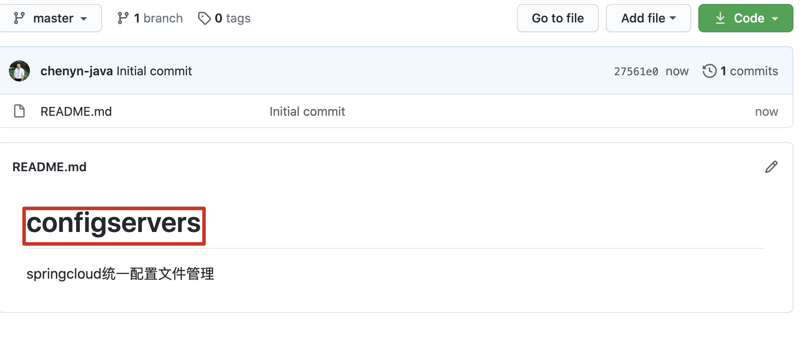

```markdown
# 6.复制仓库地址
- https://github.com/chenyn-java/configservers.git
```


```markdown
# 7.在统一配置中心服务中修改配置文件指向远程仓库地址
```

```properties
spring.cloud.config.server.git.uri=https://github.com/chenyn-java/configservers.git
#spring.cloud.config.server.git.username=       私有仓库访问用户名
#spring.cloud.config.server.git.password=				私有仓库访问密码
```

```markdown
# 8.再次启动统一配置中心
```

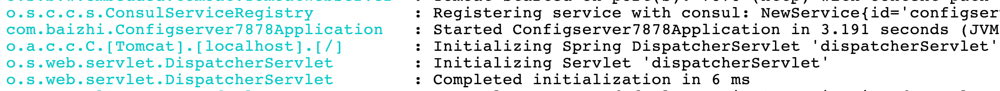

```markdown
# 9.拉取远端配置 [三种方式][]
- 1. http://localhost:7878/test-xxxx.properties
- 2. http://localhost:7878/test-xxxx.json
- 3. http://localhost:7878/test-xxxx.yml
```


```markdown
# 10.拉取远端配置规则
- label/name-profiles.yml
	`label   代表去那个分支获取 默认使用master分支
	`name    代表读取那个具体的配置文件文件名称
	`profile 代表读取配置文件环境
```

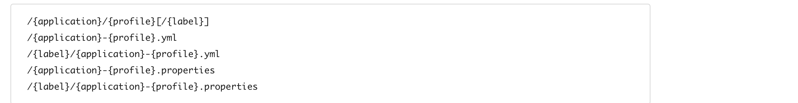

```markdown
# 11.查看拉取配置详细信息
- http://localhost:7878/client/dev       [client:代表远端配置名称][dev:代表远程配置的环境]
```


```markdown
# 12.指定分支和本地仓库位置
```

```properties
spring.cloud.config.server.git.basedir=/localresp 		#一定要是一个空目录,在首次会将该目录清空
spring.cloud.config.server.git.default-label=master   #指定使用远程仓库中那个分支中内容
```

### Config Client 开发

```markdown
# 1.项目中引入config client依赖
```

```xml
<!--引入config client-->
<dependency>
  <groupId>org.springframework.cloud</groupId>
  <artifactId>spring-cloud-starter-config</artifactId>
</dependency>
```

```markdown
# 2.编写配置文件
```

```properties
spring.cloud.config.discovery.enabled=true                #开启统一配置中心服务
spring.cloud.config.discovery.service-id=configserver     #指定统一配置服务中心的服务唯一标识
spring.cloud.config.label=master													#指定从仓库的那个分支拉取配置	
spring.cloud.config.name=client														#指定拉取配置文件的名称
spring.cloud.config.profile=dev														#指定拉取配置文件的环境
```

```markdown
# 3.远程仓库创建配置文件
- client.properties										[用来存放公共配置][]
	spring.application.name=configclient
	spring.cloud.consul.host=localhost
	spring.cloud.consul.port=8500

- client-dev.properties  							[用来存放研发相关配置][注意:这里端口为例,以后不同配置分别存放]
	server.port=9099

- client-prod.properties							[用来存放生产相关配置][]
	server.port=9098
```

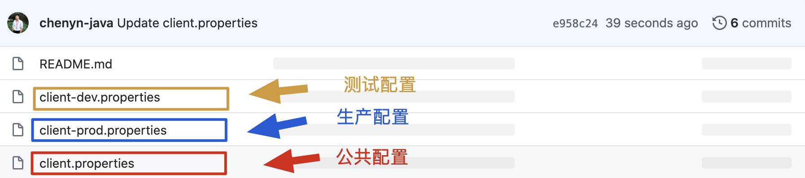

```markdown
# 4.启动客户端服务进行远程配置拉取测试
- 直接启动过程中发现无法启动直接报错
```

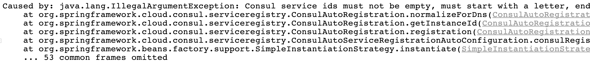

```markdown
# 报错原因
- 项目中目前使用的是application.properties启动项目,使用这个配置文件在springboot项目启动过程中不会等待远程配置拉取,直接根据配置文件中内容启动,因此当需要注册中心,服务端口等信息时,远程配置还没有拉取到,所以直接报错
```


```markdown
# 解决方案
- 应该在项目启动时先等待拉取远程配置,拉取远程配置成功之后再根据远程配置信息启动即可,为了完成上述要求springboot官方提供了一种解决方案,就是在使用统一配置中心时应该将微服务的配置文件名修改为bootstrap.(properties|yml),bootstrap.properties作为配置启动项目时,会优先拉取远程配置,远程配置拉取成功之后根据远程配置启动当前应用。
```


```markdown
# 再次启动服务
```

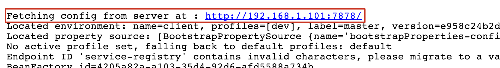

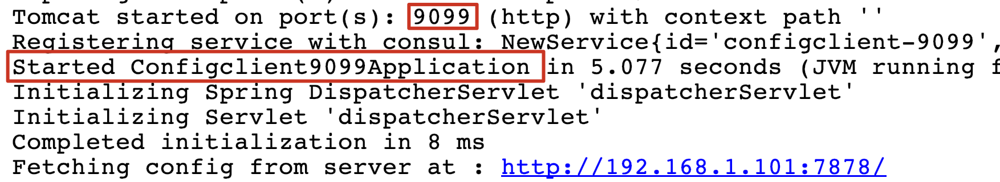

-----

### 手动配置刷新

```markdown
# 1.说明
- 在生产环境中,微服务可能非常多,每次修改完远端配置之后,不可能对所有服务进行重新启动,这个时候需要让修改配置的服务能够刷新远端修改之后的配置,从而不要每次重启服务才能生效,进一步提高微服务系统的维护效率。在springcloud中也为我们提供了手动刷新配置和自动刷新配置两种策略,这里我们先试用手动配置文件刷新。

# 2.在config client端加入刷新暴露端点
```

```properties
management.endpoints.web.exposure.include=*            #开启所有web端点暴露  [推荐使用这种]
```


```markdown
# 3.在需要刷新代码的类中加入刷新配置的注解
```

```java
@RestController
@RefreshScope
@Slf4j
public class TestController {
    @Value("${name}")
    private String name;
    @GetMapping("/test/test")
    public String test(){
      log.info("当前加载配置文件信息为:[{}]",name);
      return name;
    }
}
```

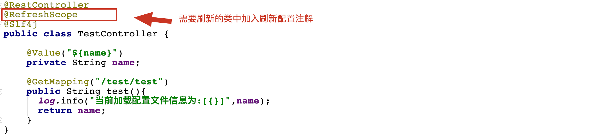

```markdown
# 4.在远程配置中加入name并启动测试
```

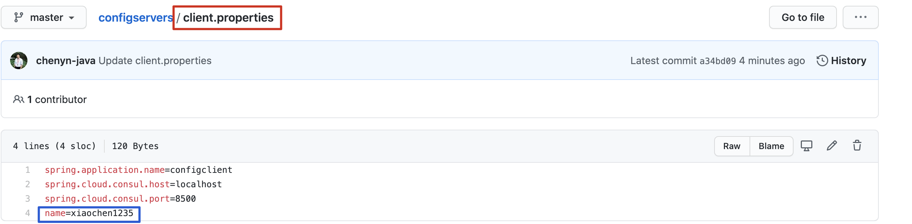

```markdown
# 5.启动之后直接访问
```


```markdown
# 6.修改远程配置
```

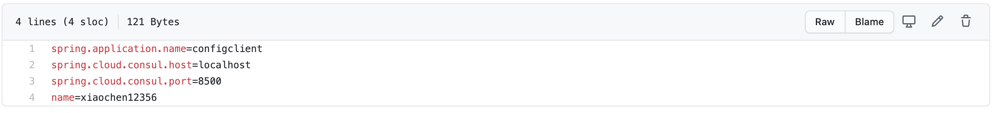

```markdown
# 7.修改之后在访问
- 发现并没有自动刷新配置?
- 必须调用刷新配置接口才能刷新配置
```

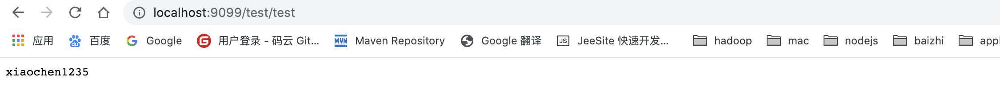

```markdown
# 8.手动调用刷新配置接口
- curl -X POST http://localhost:9099/actuator/refresh
```


```markdown
# 9.在次访问发现配置已经成功刷新
```

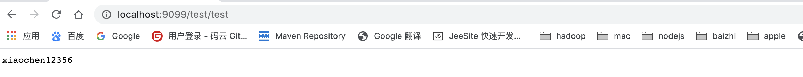

-----

## 12.Bus组件的使用

### 什么是Bus

Spring Cloud Bus links nodes of a distributed system with a lightweight message broker. This can then be used to broadcast state changes (e.g. configuration changes) or other management instructions. AMQP and Kafka broker implementations are included with the project. Alternatively, any [Spring Cloud Stream](https://spring.io/projects/spring-cloud-stream) binder found on the classpath will work out of the box as a transport.   --摘自官网

```markdown
# 0.翻译
- https://spring.io/projects/spring-cloud-bus
- springcloudbus使用轻量级消息代理将分布式系统的节点连接起来。然后，可以使用它来广播状态更改（例如配置更改）或其他管理指令。AMQP和Kafka broker实现包含在项目中。或者，在类路径上找到的任何springcloudstream绑定器都可以作为传输使用。

- 通俗定义: bus称之为springcloud中消息总线,主要用来在微服务系统中实现远端配置更新时通过广播形式通知所有客户端刷新配置信息,避免手动重启服务的工作
```

### 实现配置刷新原理

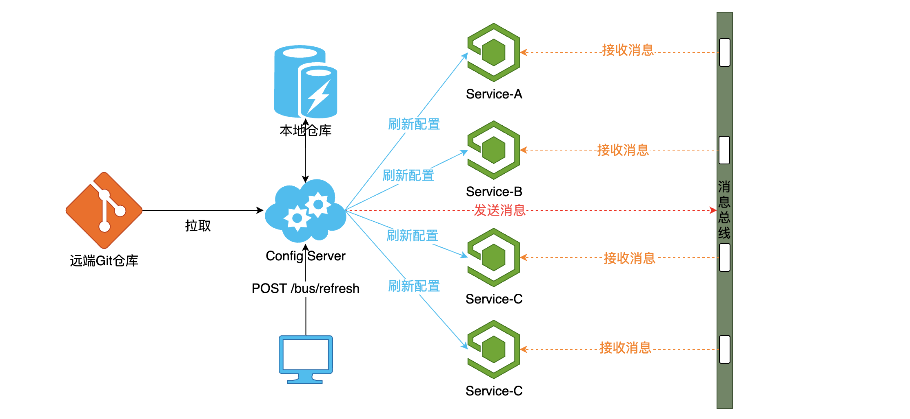

### 搭建RabbitMQ服务

```markdown
# 0.下载rabbitmq安装包 [][可以直接使用docker安装更方便]
- 官方安装包下载:https://www.rabbitmq.com/install-rpm.html#downloads
[注意:][这里安装包只能用于centos7.x系统]
```


```markdown

# 1.将rabbitmq安装包上传到linux系统中
	erlang-22.0.7-1.el7.x86_64.rpm
	rabbitmq-server-3.7.18-1.el7.noarch.rpm

# 2.安装Erlang依赖包
	rpm -ivh erlang-22.0.7-1.el7.x86_64.rpm

# 3.安装RabbitMQ安装包(需要联网)
	yum install -y rabbitmq-server-3.7.18-1.el7.noarch.rpm
		注意:默认安装完成后配置文件模板在:/usr/share/doc/rabbitmq-server-3.7.18/rabbitmq.config.example目录中,需要将配置文件复制到/etc/rabbitmq/目录中,并修改名称为rabbitmq.config

# 4.复制配置文件
	cp /usr/share/doc/rabbitmq-server-3.7.18/rabbitmq.config.example /etc/rabbitmq/rabbitmq.config

# 5.查看配置文件位置
	ls /etc/rabbitmq/rabbitmq.config

# 6.修改配置文件(参见下图:)
	vim /etc/rabbitmq/rabbitmq.config 
```


将上图中配置文件中红色部分去掉`%%`,以及最后的`,`逗号 修改为下图:


```markdown
# 7.执行如下命令,启动rabbitmq中的插件管理
	rabbitmq-plugins enable rabbitmq_management
	
	出现如下说明:
		Enabling plugins on node rabbit@localhost:
    rabbitmq_management
    The following plugins have been configured:
      rabbitmq_management
      rabbitmq_management_agent
      rabbitmq_web_dispatch
    Applying plugin configuration to rabbit@localhost...
    The following plugins have been enabled:
      rabbitmq_management
      rabbitmq_management_agent
      rabbitmq_web_dispatch

    set 3 plugins.
    Offline change; changes will take effect at broker restart.

# 8.启动RabbitMQ的服务
	systemctl start rabbitmq-server
	systemctl restart rabbitmq-server
	systemctl stop rabbitmq-server
	

# 9.查看服务状态(见下图:)
	systemctl status rabbitmq-server
  ● rabbitmq-server.service - RabbitMQ broker
     Loaded: loaded (/usr/lib/systemd/system/rabbitmq-server.service; disabled; vendor preset: disabled)
     Active: active (running) since 三 2019-09-25 22:26:35 CST; 7s ago
   Main PID: 2904 (beam.smp)
     Status: "Initialized"
     CGroup: /system.slice/rabbitmq-server.service
             ├─2904 /usr/lib64/erlang/erts-10.4.4/bin/beam.smp -W w -A 64 -MBas ageffcbf -MHas ageffcbf -
             MBlmbcs...
             ├─3220 erl_child_setup 32768
             ├─3243 inet_gethost 4
             └─3244 inet_gethost 4
      .........
```


```markdown
# 10.关闭防火墙服务
	systemctl disable firewalld
    Removed symlink /etc/systemd/system/multi-user.target.wants/firewalld.service.
    Removed symlink /etc/systemd/system/dbus-org.fedoraproject.FirewallD1.service.
	systemctl stop firewalld   

# 11.访问web管理界面
	http://10.15.0.8:15672/
```

 

```markdown
# 12.登录管理界面
	username:  guest
	password:  guest
```


```markdown
# 13.MQ服务搭建成功
```

### 实现自动配置刷新

```markdown
# 1.在所有项目中引入bus依赖
```

```xml
<!--引入bus依赖-->
<dependency>
  <groupId>org.springframework.cloud</groupId>
  <artifactId>spring-cloud-starter-bus-amqp</artifactId>
</dependency>
```


```markdown
# 2.配置统一配置中心连接到mq
```

```properties
spring.rabbitmq.host=localhost											#连接主机
spring.rabbitmq.port=5672														#连接mq端口
spring.rabbitmq.username=user												#连接mq用户名
spring.rabbitmq.password=password										#连接mq密码
```

```markdown
# 3.远端配置中加入连接mq配置
```


```markdown
# 4.启动统一配置中心服务
- 正常启动
```


```markdown
# 5.启动客户端服务
- 加入bus组件之后客户端启动报错
- 原因springcloud中默认链接不到远程服务器不会报错,但是在使用bus消息总线时必须开启连接远程服务失败报错
```


```properties
spring.cloud.config.fail-fast=true
```

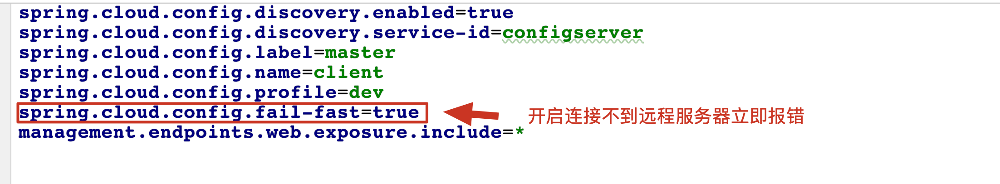

```markdown
# 6.修改远程配置后在配置中心服务通过执行post接口刷新配置
- curl -X POST http://localhost:7878/actuator/bus-refresh
```


```markdown
# 7.通过上述配置就实现了配置统一刷新
```

### 指定服务刷新配置

```markdown
# 1.说明
- 默认情况下使用curl -X POST http://localhost:7878/actuator/bus-refresh这种方式刷新配置是全部广播形式,也就是所有的微服务都能接收到刷新配置通知,但有时我们修改的仅仅是某个服务的配置,这个时候对于其他服务的通知是多余的,因此就需要指定服务进行通知

# 2.指定服务刷新配置实现
- 指定端口刷新某个具体服务: curl -X POST http://localhost:7878/actuator/bus-refresh/configclient:9090
- 指定服务id刷新服务集群节点: curl -X POST http://localhost:7878/actuator/bus-refresh/configclient
 	[注意:][configclient代表刷新服务的唯一标识]
```

### 集成webhook实现自动刷新

```markdown
# 1.配置webhooks
- 添加webhooks
- 在webhooks中添加刷新配置接口
```


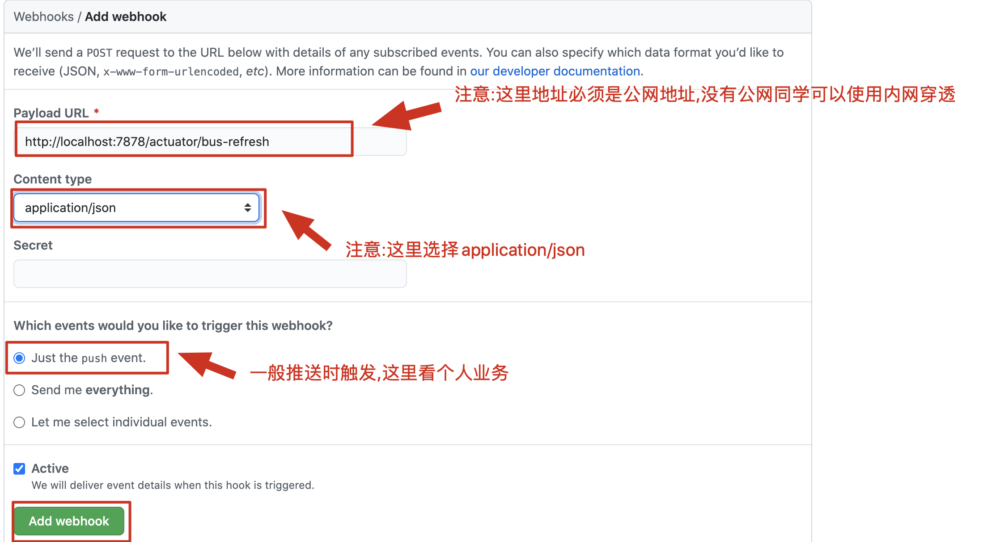

```markdown
# 2.解决400错误问题
- 在配置中心服务端加入过滤器进行解决(springcloud中一个坑)
```

```java
@Component
public class UrlFilter  implements Filter {
    @Override
    public void init(FilterConfig filterConfig) throws ServletException {
 
    }
 
    @Override
    public void doFilter(ServletRequest request, ServletResponse response, FilterChain chain) throws IOException, ServletException {
        HttpServletRequest httpServletRequest = (HttpServletRequest)request;
        HttpServletResponse httpServletResponse = (HttpServletResponse)response;
 
        String url = new String(httpServletRequest.getRequestURI());
 
        //只过滤/actuator/bus-refresh请求
        if (!url.endsWith("/bus-refresh")) {
            chain.doFilter(request, response);
            return;
        }
 
        //获取原始的body
        String body = readAsChars(httpServletRequest);
 
        System.out.println("original body:   "+ body);
 
        //使用HttpServletRequest包装原始请求达到修改post请求中body内容的目的
        CustometRequestWrapper requestWrapper = new CustometRequestWrapper(httpServletRequest);
 
        chain.doFilter(requestWrapper, response);
 
    }
 
    @Override
    public void destroy() {
 
    }
 
    private class CustometRequestWrapper extends HttpServletRequestWrapper {
        public CustometRequestWrapper(HttpServletRequest request) {
            super(request);
        }
 
        @Override
        public ServletInputStream getInputStream() throws IOException {
            byte[] bytes = new byte[0];
            ByteArrayInputStream byteArrayInputStream = new ByteArrayInputStream(bytes);
 
            return new ServletInputStream() {
                @Override
                public boolean isFinished() {
                    return byteArrayInputStream.read() == -1 ? true:false;
                }
 
                @Override
                public boolean isReady() {
                    return false;
                }
 
                @Override
                public void setReadListener(ReadListener readListener) {
 
                }
 
                @Override
                public int read() throws IOException {
                    return byteArrayInputStream.read();
                }
            };
        }
    }
 
    public static String readAsChars(HttpServletRequest request)
    {
 
        BufferedReader br = null;
        StringBuilder sb = new StringBuilder("");
        try
        {
            br = request.getReader();
            String str;
            while ((str = br.readLine()) != null)
            {
                sb.append(str);
            }
            br.close();
        }
        catch (IOException e)
        {
            e.printStackTrace();
        }
        finally
        {
            if (null != br)
            {
                try
                {
                    br.close();
                }
                catch (IOException e)
                {
                    e.printStackTrace();
                }
            }
        }
        return sb.toString();
    }
}
```

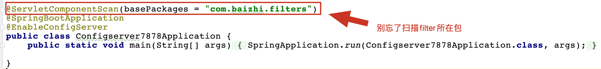

-----

