# Spring Cloud Alibaba 微服工具集

**版本: 2.2.1** 

## 1.简介

Spring Cloud Alibaba provides a one-stop solution for distributed application development. It contains all the components required to develop distributed applications, making it easy for you to develop your applications using Spring Cloud.

With Spring Cloud Alibaba, you only need to add some annotations and a small amount of configurations to connect Spring Cloud applications to the distributed solutions of Alibaba, and build a distributed application system with Alibaba middleware.

```markdown
# 0.原文翻译
- https://spring.io/projects/spring-cloud-alibaba
- 阿里云为分布式应用开发提供了一站式解决方案。它包含了开发分布式应用程序所需的所有组件，使您可以轻松地使用springcloud开发应用程序。
- 有了阿里云，你只需要添加一些注解和少量的配置，就可以将Spring云应用连接到阿里的分布式解决方案上，用阿里中间件搭建一个分布式应用系统。
```

## 2.环境搭建

```markdown
# 0.构建项目并引入依赖
```

```xml
<!--定义springcloud版本-->
<properties>
  <spring.cloud.alibaba.version>2.2.1.RELEASE</spring.cloud.alibaba.version>
</properties>

<!--全局引入springcloudalibaba下载依赖地址,并不会引入依赖-->
<dependencyManagement>
  <dependencies>
    <dependency>
      <groupId>com.alibaba.cloud</groupId>
      <artifactId>spring-cloud-alibaba-dependencies</artifactId>
      <version>${spring.cloud.alibaba.version}</version>
      <type>pom</type>
      <scope>import</scope>
    </dependency>
  </dependencies>
</dependencyManagement>
```


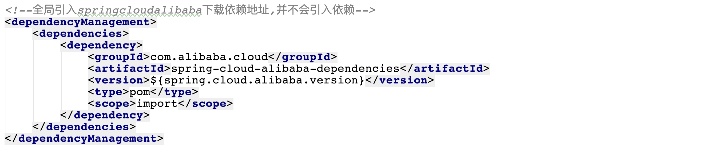

----

## 3.Nacos

### 什么是Nacos  Name Service & Configurations Services


```markdown
- https://nacos.io/zh-cn/index.html
- Nacos 致力于帮助您发现、配置和管理微服务。Nacos 提供了一组简单易用的特性集，帮助您快速实现动态服务发现、服务配置、服务元数据及流量管理。
```

- 总结:**Nacos就是微服务架构中服务注册中心以及统一配置中心,用来替换原来的(eureka,consul)以及config组件**

### 安装Nacos

```markdown
# 0.准备环境
- 1.64 bit OS，支持 Linux/Unix/Mac/Windows，推荐选用 Linux/Unix/Mac。
- 2.64 bit JDK 1.8+；下载 & 配置。
- 3.Maven 3.2.x+；下载 & 配置。

# 1.下载nacos [本次课程版本:][1.3.0版本]
- https://github.com/alibaba/nacos/releases 
```

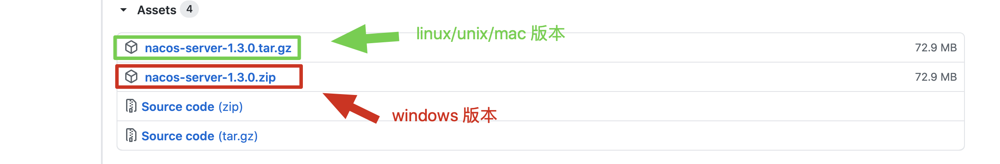

```markdown
# 2.解压缩安装包到指定位置
- bin  			启动nacos服务的脚本目录
- conf 			nacos的配置文件目录
- target 		nacos的启动依赖存放目录
- data		  nacos启动成功后保存数据的目录
```


````markdown
# 3.启动安装服务
- linux/unix/mac启动
	打开终端进入nacos的bin目录执行如下命令 
	./startup.sh -m standalone

- windows启动
	在 cmd中 
	执行 startup.cmd -m standalone 或者双击startup.cmd运行文件。
````


```markdown
# 4.访问nacos的web服务管理界面
- http://localhost:8848/nacos/
- 用户名 和 密码都是nacos
```

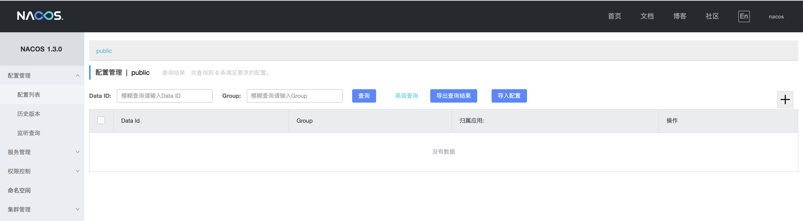

### 开发服务注册到nacos

```markdown
# 0.创建项目并引入依赖
```

```xml
<!--引入nacos client的依赖-->
<dependency>
    <groupId>com.alibaba.cloud</groupId>
    <artifactId>spring-cloud-starter-alibaba-nacos-discovery</artifactId>
</dependency>
```


```markdown
# 1.配置注册地址
```

```properties
server.port=8789 																												#指定当前服务端口
spring.application.name=nacosclient																			#指定服务名称
spring.cloud.nacos.server-addr=localhost:8848														#指定nacos服务地址
spring.cloud.nacos.discovery.server-addr=${spring.cloud.nacos.server-addr} #指定注册中心地址							
management.endpoints.web.exposure.include=*														  #暴露所有web端点
```

```markdown
# 2.加入启动服务注册注解 [注意:][新版本之后这步可以省略不写]
```

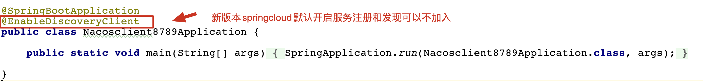

```markdown
# 3.查看nacos的服务列表
```

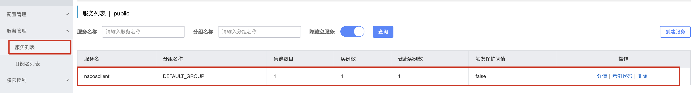

### 使用nacos作为配置中心

#### 1.从nacos获取配置

```markdown
# 1.创建项目并引入nacons配置中心依赖
```

```xml
<!--引入nacos client依赖-->
<dependency>
  <groupId>com.alibaba.cloud</groupId>
  <artifactId>spring-cloud-starter-alibaba-nacos-discovery</artifactId>
</dependency>

<!--引入nacos config 依赖-->
<dependency>
  <groupId>com.alibaba.cloud</groupId>
  <artifactId>spring-cloud-starter-alibaba-nacos-config</artifactId>
</dependency>
```

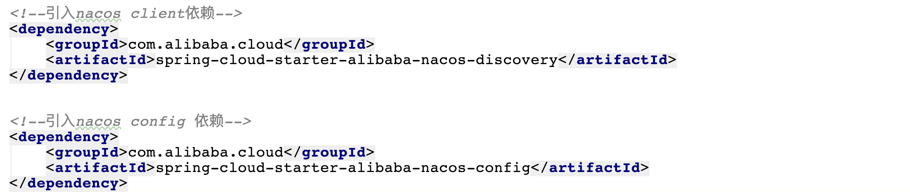

```markdown
# 2.配置配置中心地址
```

```properties
spring.cloud.nacos.server-addr=localhost:8848								# 远程配置中心的地址
spring.cloud.nacos.config.group=DEFAULT_GROUP								# 读取配置的分组
spring.cloud.nacos.config.file-extension=properties					# 指定读取文件后缀
spring.application.name=config															# 指定读取文件的前缀
spring.profiles.active=prod																	# 指定读取文件的具体环境
```


```markdown
# 3.在nacos中创建配置
```


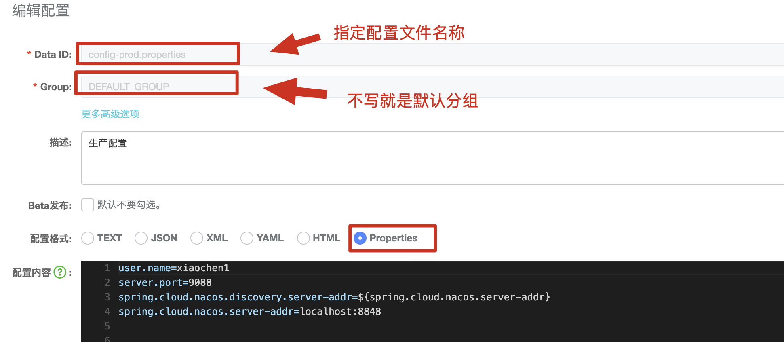

```markdown
# 4.编写控制器测试配置读取情况
```

```java
@RestController
@Slf4j
public class HelloController {
    //注入配置
    @Value("${user.name}")
    private String username;
    @GetMapping("/hello/config")
    public String config(){
        log.info("用户名: [{}]",username);
        return username;
    }
}
```

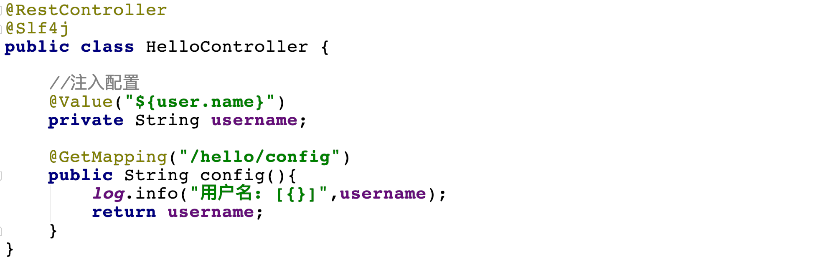

```markdown
# 5.启动项目方式测试配置读取
```


#### 2. DataId

```markdown
# 1.DataId
- 用来读取远程配置中心的中具体配置文件其完整格式如下:
- ${prefix}-${spring.profile.active}.${file-extension}
	a. prefix 默认为 spring.application.name 的值，也可以通过配置项 spring.cloud.nacos.config.prefix来配置。
	
	b. spring.profile.active 即为当前环境对应的 profile，详情可以参考 Spring Boot文档。 注意：当 spring.profile.active 为空时，对应的连接符 - 也将不存在，dataId 的拼接格式变成 ${prefix}.${file-extension}
	
	c. file-exetension 为配置内容的数据格式，可以通过配置项 spring.cloud.nacos.config.file-extension 来配置。目前只支持 properties 和 yaml 类型。
```

#### 3.实现自动配置刷新

```markdown
# 1.自动刷新
- 默认情况下nacos已经实现了自动配置刷新功能,如果需要刷新配置直接在控制器中加入@RefreshScope注解即可
```

```java
@RestController
@Slf4j
@RefreshScope
public class HelloController {
    //注入配置
    @Value("${user.name}")
    private String username;
    @GetMapping("/hello/config")
    public String config(){
        log.info("用户名: [{}]",username);
        return username;
    }
}
```


#### 4.命名空间

```markdown
# 1.命名空间(namespace)
- https://github.com/alibaba/spring-cloud-alibaba/wiki/Nacos-config
- namespace命名空间是nacos针对于企业级开发设计用来针对于不同环境的区分,比如正在企业开发时有测试环境,生产环境,等其他环境,因此为了保证不同环境配置实现隔离,提出了namespace的概念,默认在nacos中存在一个public命名空间所有配置在没有指定命名空间时都在这个命名空间中获取配置,在实际开发时可以针对于不能环境创建不同的namespace空间。默认空间不能删除!
```


```markdown
# 2.创建其他命名空间
- 每个命名空间都有一个唯一id,这个id是读取配置时指定空间的唯一标识
```

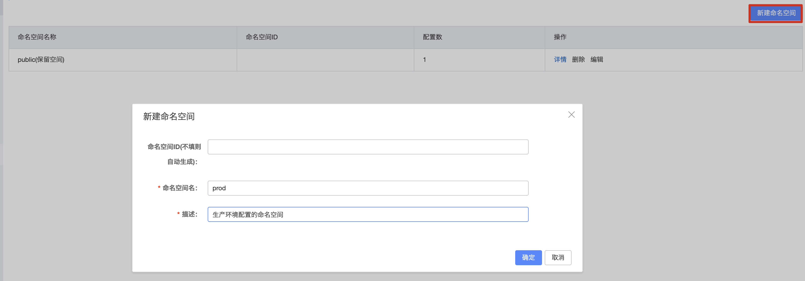

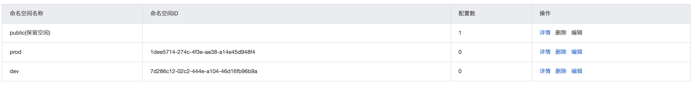

```markdown
# 3.在配置列表查看空间
```

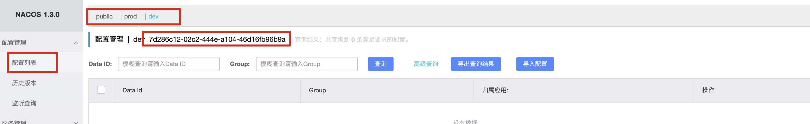

```markdown
# 4.在指定空间下载创建配置文件
```


```markdown
# 5.项目中使用命名空间指定配置
```


```markdown
# 6.测试配置
```

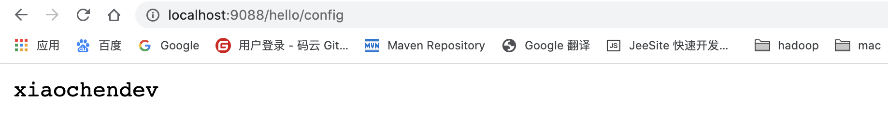

#### 5.配置分组

```markdown
# 1.配置分组(group)
- 配置分组是对配置集进行分组，通过一个有意义的字符串（如 Buy 或 Trade ）来表示，不同的配置分组下可以有相同的配置集（Data ID）。当您在 Nacos 上创建一个配置时，如果未填写配置分组的名称，则配置分组的名称默认采用 DEFAULT_GROUP 。配置分组的常见场景：可用于区分不同的项目或应用，例如：学生管理系统的配置集可以定义一个group为：STUDENT_GROUP。
```

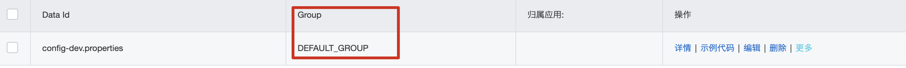

```markdown
# 2.创建分组
```


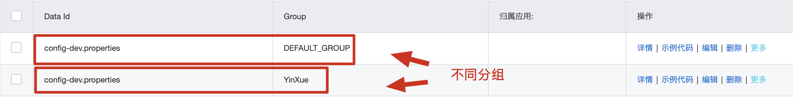

```markdown
# 3.读取不同分组的配置
```

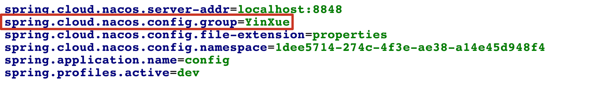

---

## 4.sentinel 流量卫兵

### 什么是sentinel


As microservices become popular, the stability of service calls is becoming increasingly important. [Sentinel](https://github.com/alibaba/Sentinel) takes "flow" as the breakthrough point, and works on multiple fields including flow control, circuit breaking and load protection to protect service reliability.				---[摘自官网]

```markdown
# 0.说明
- https://spring-cloud-alibaba-group.github.io/github-pages/hoxton/en-us/index.html#_how_to_use_sentinel
- https://github.com/alibaba/Sentinel/wiki
- 翻译:随着微服务的普及，服务调用的稳定性变得越来越重要。Sentinel以“流量”为突破口，在流量控制、断路、负载保护等多个领域进行工作，保障服务可靠性。
- 通俗:用来在微服务系统中保护微服务对的作用 如何 服务雪崩 服务熔断  服务降级 就是用来替换hystrix

# 1.特性
- 丰富的应用场景：Sentinel 承接了阿里巴巴近 10 年的双十一大促流量的核心场景，例如秒杀（即突发流量控制在系统容量可以承受的范围）、消息削峰填谷、集群流量控制、实时熔断下游不可用应用等。

- 完备的实时监控：Sentinel 同时提供实时的监控功能。您可以在控制台中看到接入应用的单台机器秒级数据，甚至 500 台以下规模的集群的汇总运行情况。

- 广泛的开源生态：Sentinel 提供开箱即用的与其它开源框架/库的整合模块，例如与 Spring Cloud、Dubbo、gRPC 的整合。您只需要引入相应的依赖并进行简单的配置即可快速地接入 Sentinel。
```


### sentinel使用

```markdown
- sentinel提供了两个服务组件：
	一个是 sentinel 用来实现微服务系统中服务熔断、降级等功能。这点和hystrix 类似
	一个是 sentinel dashboard 用来监控微服务系统中流量调用等情况。这点和hystrix 类似
```

#### 1. sentinel dashboard的安装

```markdown
# 1.下载
- https://github.com/alibaba/Sentinel/releases
```

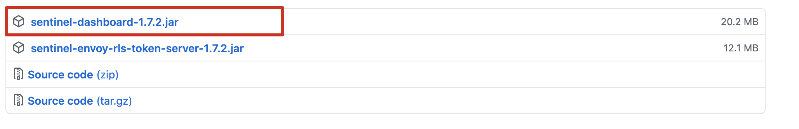

```markdown
# 2.启动
- 仪表盘是个jar包可以直接通过java命令启动 如: java -jar 方式运行 默认端口为 8080
- java -Dserver.port=9191 -jar  sentinel-dashboard-1.7.2.jar
```


```markdown
# 3.访问web界面
- http://localhost:9191/#/login
```


```markdown
# 4.登录
- 用户名&密码: sentinel
```


#### 2.sentinel 实时监控服务

```markdown
# 1.创建项目引入依赖
```

```xml
<!--引入nacos client依赖-->
<dependency>
  <groupId>com.alibaba.cloud</groupId>
  <artifactId>spring-cloud-starter-alibaba-nacos-discovery</artifactId>
</dependency>

<!--引入sentinel依赖-->
<dependency>
    <groupId>com.alibaba.cloud</groupId>
    <artifactId>spring-cloud-starter-alibaba-sentinel</artifactId>
</dependency>
```

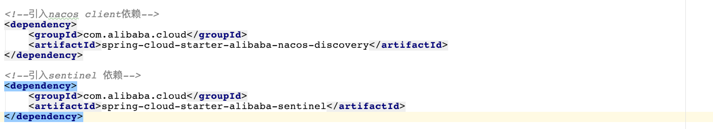

```markdown
# 2.配置
```

```properties
server.port=8789
spring.application.name=nacosclient
spring.cloud.nacos.server-addr=localhost:8848
spring.cloud.nacos.discovery.server-addr=${spring.cloud.nacos.server-addr}

spring.cloud.sentinel.enabled=true											 # 开启sentinel 默认开启
spring.cloud.sentinel.transport.dashboard=localhost:9191 # 连接dashboard
spring.cloud.sentinel.transport.port=8719								 # 与dashboard通信的端口
```


```markdown
# 3.启动服务
```


```markdown
# 4.访问dashboard界面查看服务监控
- 发现界面什么都没有? 
- 默认情况下sentiel为延迟加载,不会在启动之后立即创建服务监控,需要对服务进行调用时才会初始化
```


```markdown
# 5.开发服务
```

```java
@RestController
@Slf4j
public class SentinelController {
    @GetMapping("/sentinel/test")
    public String test(){
        log.info("sentinel test");
        return "sentinel test ";
    }

    @GetMapping("/sentinel/test1")
    public String test1(){
        log.info("sentinel test1");
        return "sentinel test1 ";
    }
}
```


```markdown
# 6.启动进行调用
- http://localhost:8789/sentinel/test
```

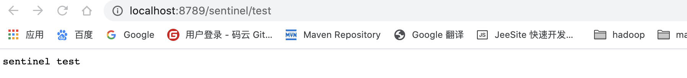

```markdown
# 7.查看监控界面
```

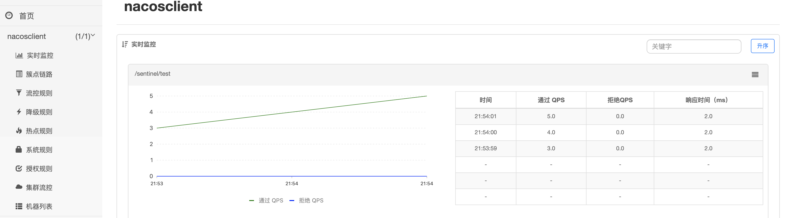

#### 3.sentinel 流量控制

```markdown
# 0.说明
- 流量控制（flow control），其原理是监控应用流量的 QPS 或并发线程数等指标，当达到指定的阈值时对流量进行控制，以避免被瞬时的流量高峰冲垮，从而保障应用的高可用性。

- 同一个资源可以创建多条限流规则。FlowSlot 会对该资源的所有限流规则依次遍历，直到有规则触发限流或者所有规则遍历完毕。

- 一条限流规则主要由下面几个因素组成，我们可以组合这些元素来实现不同的限流效果：
	resource：资源名，即限流规则的作用对象
	count: 限流阈值
	grade: 限流阈值类型（QPS 或并发线程数）
	limitApp: 流控针对的调用来源，若为 default 则不区分调用来源
	strategy: 调用关系限流策略
	controlBehavior: 流量控制效果（直接拒绝、Warm Up、匀速排队）

- 流量控制主要有两种统计类型，一种是统计并发线程数，另外一种则是统计 QPS
- 更多细节参见官网:https://github.com/alibaba/Sentinel/wiki/%E6%B5%81%E9%87%8F%E6%8E%A7%E5%88%B6
```

###### QPS限流

```markdown
# 1.配置QPS流量控制
```

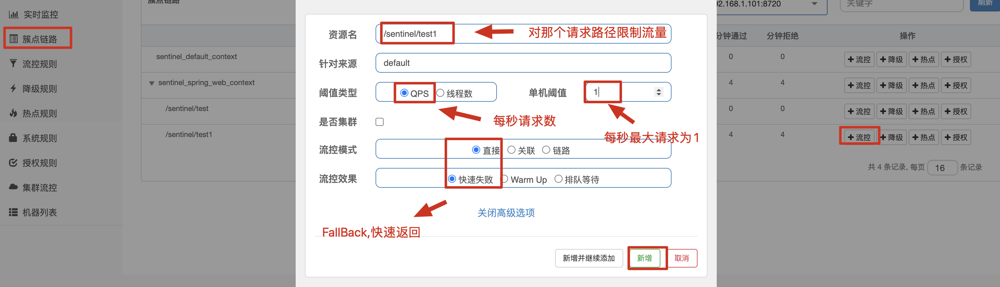

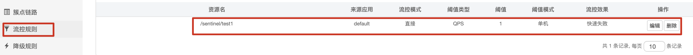

```markdown
# 2.测试
- 每秒只能最大接收1个请求,超过1个报错
```

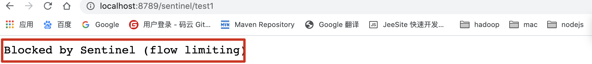

###### 线程数限流

```markdown
# 1.配置线程数限流
```


```markdown
# 2.访问测试
```


###### 流控模式

```markdown
# 1.说明
- 直接:标识流量控制规则到达阈值直接触发流量控制
- 关联: 当两个资源之间具有资源争抢或者依赖关系的时候，这两个资源便具有了关联。比如对数据库同一个字段的读操作和写操作存在争抢，读的速度过高会影响写得速度，写的速度过高会影响读的速度。如果放任读写操作争抢资源，则争抢本身带来的开销会降低整体的吞吐量。可使用关联限流来避免具有关联关系的资源之间过度的争抢，举例来说，read_db 和 write_db 这两个资源分别代表数据库读写，我们可以给 read_db 设置限流规则来达到写优先的目的：设置 strategy 为 RuleConstant.STRATEGY_RELATE 同时设置 refResource 为 write_db。这样当写库操作过于频繁时，读数据的请求会被限流。
```


```markdown
- 链路限流: https://github.com/alibaba/Sentinel/wiki/%E6%B5%81%E9%87%8F%E6%8E%A7%E5%88%B6
```

###### 流控效果

```markdown
- 直接拒绝:（RuleConstant.CONTROL_BEHAVIOR_DEFAULT）方式是默认的流量控制方式，当QPS超过任意规则的阈值后，新的请求就会被立即拒绝，拒绝方式为抛出FlowException。

- Warm Up:（RuleConstant.CONTROL_BEHAVIOR_WARM_UP）方式，即预热/冷启动方式。当系统长期处于低水位的情况下，当流量突然增加时，直接把系统拉升到高水位可能瞬间把系统压垮。通过"冷启动"，让通过的流量缓慢增加，在一定时间内逐渐增加到阈值上限，给冷系统一个预热的时间，避免冷系统被压垮。
	更多:https://github.com/alibaba/Sentinel/wiki/%E9%99%90%E6%B5%81---%E5%86%B7%E5%90%AF%E5%8A%A8
	
	
- 匀速排队:(RuleConstant.CONTROL_BEHAVIOR_RATE_LIMITER）方式会严格控制请求通过的间隔时间，也即是让请求以均匀的速度通过，对应的是漏桶算法。 只能对请求进行排队等待
	更多:https://github.com/alibaba/Sentinel/wiki/%E6%B5%81%E9%87%8F%E6%8E%A7%E5%88%B6-%E5%8C%80%E9%80%9F%E6%8E%92%E9%98%9F%E6%A8%A1%E5%BC%8F
```

---

#### 4.熔断降级

```markdown
# 0.说明
- https://github.com/alibaba/Sentinel/wiki/%E7%86%94%E6%96%AD%E9%99%8D%E7%BA%A7
- 除了流量控制以外，对调用链路中不稳定的资源进行熔断降级也是保障高可用的重要措施之一。由于调用关系的复杂性，如果调用链路中的某个资源不稳定，最终会导致请求发生堆积。Sentinel **熔断降级**会在调用链路中某个资源出现不稳定状态时（例如调用超时或异常比例升高），对这个资源的调用进行限制，让请求快速失败，避免影响到其它的资源而导致级联错误。当资源被降级后，在接下来的降级时间窗口之内，对该资源的调用都自动熔断（默认行为是抛出 `DegradeException`）。
```

###### 降级策略

- 平均响应时间 (DEGRADE_GRADE_RT)：当 1s 内持续进入 N 个请求，对应时刻的平均响应时间（秒级）均超过阈值（count，以 ms 为单位），那么在接下的时间窗口（DegradeRule 中的 timeWindow，以 s 为单位）之内，对这个方法的调用都会自动地熔断（抛出 DegradeException）。注意 Sentinel 默认统计的 RT 上限是 4900 ms，超出此阈值的都会算作 4900 ms，若需要变更此上限可以通过启动配置项 -Dcsp.sentinel.statistic.max.rt=xxx 来配置。


- 异常比例 (DEGRADE_GRADE_EXCEPTION_RATIO)：当资源的每秒请求量 >= N（可配置），并且每秒异常总数占通过量的比值超过阈值（DegradeRule 中的 count）之后，资源进入降级状态，即在接下的时间窗口（DegradeRule 中的 timeWindow，以 s 为单位）之内，对这个方法的调用都会自动地返回。异常比率的阈值范围是 [0.0, 1.0]，代表 0% - 100%。


- 异常数 (DEGRADE_GRADE_EXCEPTION_COUNT)：当资源近 1 分钟的异常数目超过阈值之后会进行熔断。注意由于统计时间窗口是分钟级别的，若 timeWindow 小于 60s，则结束熔断状态后仍可能再进入熔断状态。


####  5.SentinelResource注解

```markdown
# 0.说明
- https://github.com/alibaba/Sentinel/wiki/%E6%B3%A8%E8%A7%A3%E6%94%AF%E6%8C%81
```


```java
 @GetMapping("/sentinel/test1")
    @SentinelResource(value = "aa",blockHandler = "fallBack",fallback = "fall")
    public String test1(int id){
        log.info("sentinel test1");
        if(id<0)		
            throw new RuntimeException("非法参数!!!");
        }
        return "sentinel test1 :"+id;
    }
		//降级异常处理
    public String fallBack(int id,BlockException e){
            if(e instanceof FlowException){
                return "当前服务已被流控! "+e.getClass().getCanonicalName();
            }
            return "当前服务已被降级处理! "+e.getClass().getCanonicalName();
    }
		//异常处理
    public String fall(int id){
        return "当前服务已不可用!";
    }
```

## 5.整合环境公共依赖

**spring boot 2.2+**

**springcloud Hoxton**

**springcloud alibaba 2.2.1+**

```markdown
# 0.构建项目并引入依赖
```

```xml

<properties>
  <java.version>1.8</java.version>
  <spring-cloud.version>Hoxton.SR6</spring-cloud.version>
  <spring.cloud.alibaba.version>2.2.1.RELEASE</spring.cloud.alibaba.version>
</properties>

<dependencyManagement>
  <dependencies>
    <!--引入springcloud alibaba-->
    <dependency>
      <groupId>com.alibaba.cloud</groupId>
      <artifactId>spring-cloud-alibaba-dependencies</artifactId>
      <version>${spring.cloud.alibaba.version}</version>
      <type>pom</type>
      <scope>import</scope>
    </dependency>
    <!--引入springcloud-->
    <dependency>
      <groupId>org.springframework.cloud</groupId>
      <artifactId>spring-cloud-dependencies</artifactId>
      <version>${spring-cloud.version}</version>
      <type>pom</type>
      <scope>import</scope>
    </dependency>
  </dependencies>
</dependencyManagement>
```

----

