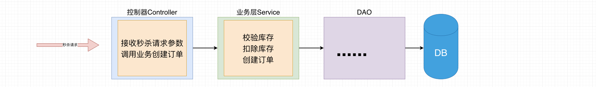
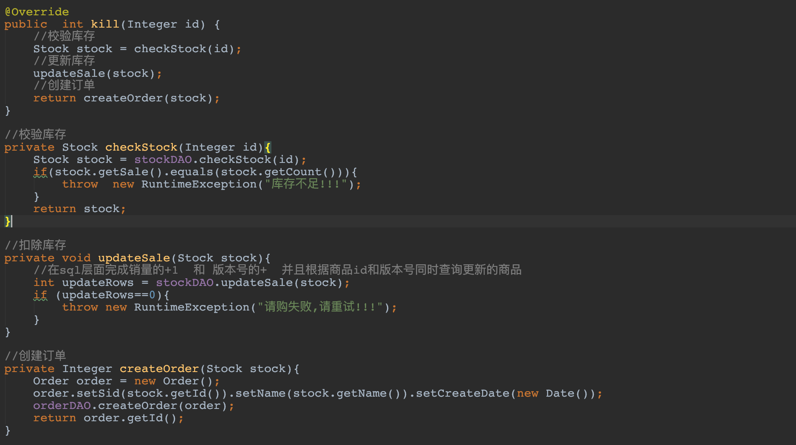
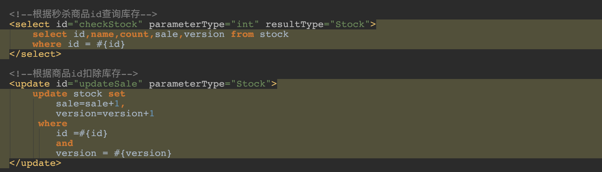
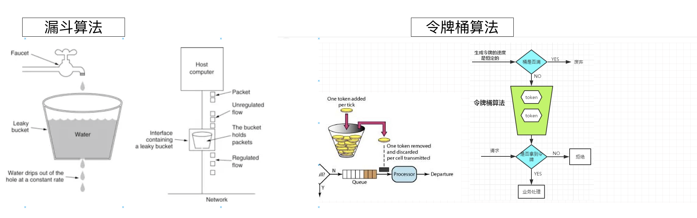

# 秒杀系统

- 小陈
- 微信: chenxu521600

## 1. 秒杀系统

### 1.1 秒杀场景

- 电商抢购限量商品
- 卖周董演唱会的门票
- 火车票抢座 12306
- ..........

### 1.2 为什么要做个系统

`如果你的项目流量非常小，完全不用担心有并发的购买请求，那么做这样一个系统意义不大。`但如果你的系统要像12306那样，接受高并发访问和下单的考验，那么你就需要一套完整的`流程保护措施`，来保证你系统在用户流量高峰期不会被搞挂了。

- 严格防止超卖：库存100件你卖了120件，等着辞职吧

- 防止黑产：防止不怀好意的人群通过各种技术手段把你本该下发给群众的利益全收入了囊中。

- 保证用户体验：高并发下，别网页打不开了，支付不成功了，购物车进不去了，地址改不了了。这个问题非常之大，涉及到各种技术，也不是一下子就能讲完的，甚至根本就没法讲完。

  

### 1.3 保护措施有哪些

- `乐观锁防止超卖`  ---核心基础
- `令牌桶限流`
- `Redis 缓存`
- `消息队列异步处理订单`
- ....


---

## 2. 防止超卖

毕竟，你网页可以卡住最多是大家没参与到活动，上网口吐芬芳，骂你一波。但是你要是卖多了，本该拿到商品的用户可就不乐意了，轻则投诉你，重则找漏洞起诉赔偿。让你吃不了兜着走。

### 2.1 数据库表

```sql
-- ----------------------------
-- Table structure for stock
-- ----------------------------
DROP TABLE IF EXISTS `stock`;
CREATE TABLE `stock` (
  `id` int(11) unsigned NOT NULL AUTO_INCREMENT,
  `name` varchar(50) NOT NULL DEFAULT '' COMMENT '名称',
  `count` int(11) NOT NULL COMMENT '库存',
  `sale` int(11) NOT NULL COMMENT '已售',
  `version` int(11) NOT NULL COMMENT '乐观锁，版本号',
  PRIMARY KEY (`id`)
) ENGINE=InnoDB DEFAULT CHARSET=utf8;

-- ----------------------------
-- Table structure for stock_order
-- ----------------------------
DROP TABLE IF EXISTS `stock_order`;
CREATE TABLE `stock_order` (
  `id` int(11) unsigned NOT NULL AUTO_INCREMENT,
  `sid` int(11) NOT NULL COMMENT '库存ID',
  `name` varchar(30) NOT NULL DEFAULT '' COMMENT '商品名称',
  `create_time` timestamp NOT NULL DEFAULT CURRENT_TIMESTAMP ON UPDATE CURRENT_TIMESTAMP COMMENT '创建时间',
  PRIMARY KEY (`id`)
) ENGINE=InnoDB DEFAULT CHARSET=utf8;
```

### 2.2 分析业务



### 2.3 开发代码

- DAO

  ```java
  public interface StockDAO {
      Stock checkStock(Integer id);//校验库存
      void updateSale(Stock stock);//扣除库存
  }
  
  public interface OrderDAO {
      void createOrder(Order order);//创建订单
  }
  
  ```

- Service

  ```java
  @Service
  @Transactional
  public class OrderServiceImpl implements OrderService {
      @Autowired
      private OrderDAO orderDAO;
      @Autowired
      private StockDAO stockDAO;
      @Override
      public Integer createOrder(Integer id) {
          //校验库存
          Stock stock = checkStock(id);
          //扣库存
          updateSale(stock);
          //下订单
          return createOrder(stock);
      }
      //校验库存
      private Stock checkStock(Integer id) {
          Stock stock = stockDAO.checkStock(id);
          if (stock.getSale().equals(stock.getCount())) {
              throw new RuntimeException("库存不足");
          }
          return stock;
      }
      //扣库存
      private void updateSale(Stock stock){
          stock.setSale(stock.getSale() + 1);
          stockDAO.updateSale(stock);
      }
      //下订单
      private Integer createOrder(Stock stock){
          Order order = new Order();
          order.setSid(stock.getId());
          order.setCreateDate(new Date());
          order.setName(stock.getName());
          orderDAO.createOrder(order);
          return order.getId();
      }
  }
  ```

  

- Controller

  ```java
  @RestController
  @RequestMapping("stock")
  public class StockController {
      @Autowired
      private OrderService orderService;
      //秒杀方法
      @GetMapping("sale")
      public String sale(Integer id){
          int orderId = 0;
          try{
              //根据商品id创建订单,返回创建订单的id
              orderId =  orderService.createOrder(id);
              System.out.println("orderId = " + orderId);
              return String.valueOf(orderId);
          }catch (Exception e){
              e.printStackTrace();
              return e.getMessage();
          }
      }
  }
  ```

### 2.4 正常测试

`在正常测试下发现没有任何问题`

### 2.5 使用Jmeter进行压力测试

官网: https://jmeter.apache.org/   

#### 1. 介绍

`Apache JMeter是Apache组织开发的基于Java的压力测试工具`。用于对软件做压力测试，它最初被设计用于Web应用测试，但后来扩展到其他测试领域。 它可以用于测试静态和动态资源，例如静态文件、Java [小服务程序](https://baike.baidu.com/item/小服务程序/4148836)、CGI 脚本、Java 对象、数据库、FTP 服务器， 等等。JMeter 可以用于对服务器、网络或对象模拟巨大的负载，来自不同压力类别下测试它们的强度和分析整体性能。另外，JMeter能够对应用程序做功能/[回归测试](https://baike.baidu.com/item/回归测试/1925732)，通过创建带有断言的脚本来验证你的程序返回了你期望的结果

#### 2. 安装Jmeter

```markdown
# 1.下载jmeter
 	   https://jmeter.apache.org/download_jmeter.cgi
		 下载地址:https://mirror.bit.edu.cn/apache//jmeter/binaries/apache-jmeter-5.2.1.tgz
# 2.解压缩
		backups    ---用来对压力测试进行备份目录
    bin        ---Jmeter核心执行脚本文件
    docs	     ---官方文档和案例
    extras     ---额外的扩展
    lib        ---第三方依赖库
    licenses   ---说明
    printable_docs ---格式化文档

# 3.安装Jmeter
	  0.要求: 必须事先安装jdk环境
	  1.配置jmeter环境变量
	      export JMETER_HOME=/Users/chenyannan/dev/apache-jmeter-5.2
				export PATH=$SCALA_HOME/bin:$JAVA_HOME/bin:$GRADLE_HOME/bin:$PATH:$JMETER_HOME/bin
		2.是配置生效
			  source ~/.bash_profile
		3.测试jemeter
```

#### 3. Jmeter使用

Don't use GUI mode for load testing !, only for Test creation and Test debugging.

For load testing, use CLI Mode (was NON GUI):

​	`jmeter -n -t [jmx file] -l [results file] -e -o [Path to web report folder]`

& increase Java Heap to meet your test requirements:

Modify current env variable HEAP="-Xms1g -Xmx1g -XX:MaxMetaspaceSize=256m" in the jmeter batch file

Check : https://jmeter.apache.org/usermanual/best-practices.html

#### 4. Jmeter压力测试

```shell
jmeter -n -t [jmx file](jmx压力测试文件) -l [results file](结果输出的文件) -e -o [Path to web report folder](生成html版压力测试报告)
```

----

### 2.6 乐观锁解决商品超卖问题

说明: 使用乐观锁解决商品的超卖问题,实际上是把主要防止超卖问题交给数据库解决,利用数据库中定义的`version字段`以及数据库中的`事务`实现在并发情况下商品的超卖问题。

#### 0.校验库存的方法(不变)

```java
//校验库存
private Stock checkStock(Integer id){
  Stock stock = stockDAO.checkStock(id);
  if(stock.getSale().equals(stock.getCount())){
    throw  new RuntimeException("库存不足!!!");
  }
  return stock;
}
```

```xml
<!--根据秒杀商品id查询库存-->
    <select id="checkStock" parameterType="int" resultType="Stock">
        select id,name,count,sale,version from stock
        where id = #{id}
    </select>
```

#### 1. 更新库存方法改造

```java
//扣除库存
private void updateSale(Stock stock){
    //在sql层面完成销量的+1  和 版本号的+  并且根据商品id和版本号同时查询更新的商品
    stockDAO.updateSale(stock);
}
```

```xml
 <update id="updateSale" parameterType="Stock">
        update stock set 
            sale=sale+1,
            version=version+1
         where 
            id =#{id}
            and 
            version = #{version}
 </update>
```

#### 2. 创建订单

```java
//创建订单
private Integer createOrder(Stock stock){
  Order order = new Order();
  order.setSid(stock.getId()).setName(stock.getName()).setCreateDate(new Date());
  orderDAO.createOrder(order);
  return order.getId();
}
```

```xml
<!--创建订单-->
<insert id="createOrder" parameterType="Order" useGeneratedKeys="true" keyProperty="id" >
  insert into stock_order values(#{id},#{sid},#{name},#{createDate})
</insert>

```

#### 3. 完整的业务方法与Mapper.xml

- Service方法

  

- StockDAOMapper.xml

  

- OrderDAOMapper.xml

   -

----

## 3. 接口限流

`限流:是对某一时间窗口内的请求数进行限制，保持系统的可用性和稳定性，防止因流量暴增而导致的系统运行缓慢或宕机`

### 3.1 接口限流

在面临高并发的抢购请求时，我们如果不对接口进行限流，可能会对后台系统造成极大的压力。大量的请求抢购成功时需要调用下单的接口，过多的请求打到数据库会对系统的稳定性造成影响。

### 3.2 如何解决接口限流

常用的限流算法有`令牌桶`和和`漏桶(漏斗算法)`，而Google开源项目Guava中的RateLimiter使用的就是令牌桶控制算法。在开发高并发系统时有三把利器用来保护系统：`缓存`、`降级`和`限流`

- 缓存：缓存的目的是提升系统访问速度和增大系统处理容量
- 降级：降级是当服务器压力剧增的情况下，根据当前业务情况及流量对一些服务和页面有策略的降级，以此释放服务器资源以保证核心任务的正常运行
- 限流：限流的目的是通过对并发访问/请求进行限速，或者对一个时间窗口内的请求进行限速来保护系统，一旦达到限制速率则可以拒绝服务、排队或等待、降级等处理。

### 3.3 令牌桶和漏斗算法



- `漏斗算法:漏桶算法思路很简单，水（请求）先进入到漏桶里，漏桶以一定的速度出水，当水流入速度过大会直接溢出，可以看出漏桶算法能强行限制数据的传输速率。`
- `令牌桶算法:`最初来源于计算机网络。在网络传输数据时，为了防止网络拥塞，需限制流出网络的流量，使流量以比较均匀的速度向外发送。令牌桶算法就实现了这个功能，可控制发送到网络上数据的数目，并允许突发数据的发送。大小固定的令牌桶可自行以恒定的速率源源不断地产生令牌。如果令牌不被消耗，或者被消耗的速度小于产生的速度，令牌就会不断地增多，直到把桶填满。后面再产生的令牌就会从桶中溢出。最后桶中可以保存的最大令牌数永远不会超过桶的大小。这意味，面对瞬时大流量，该算法可以在短时间内请求拿到大量令牌，而且拿令牌的过程并不是消耗很大的事情。

### 3.4 令牌桶简单使用

1. ##### 项目中引入依赖

```xml
<dependency>
    <groupId>com.google.guava</groupId>
    <artifactId>guava</artifactId>
    <version>28.2-jre</version>
</dependency>
```

2. ##### 令牌桶算法的基本使用

   ```java
   public class StockController {
       @Autowired
       private OrderService orderService;
   
       //创建令牌桶实例
       private RateLimiter rateLimiter =  RateLimiter.create(40);
   
       @GetMapping("sale")
       public String sale(Integer id){
           //1.没有获取到token请求一直知道获取到token 令牌
           //log.info("等待的时间: "+  rateLimiter.acquire());
   
           //2.设置一个等待时间,如果在等待的时间内获取到了token 令牌,则处理业务,如果在等待时间内没有获取到响应token则抛弃
           if(!rateLimiter.tryAcquire(2, TimeUnit.SECONDS)){
               System.out.println("当前请求被限流,直接抛弃,无法调用后续秒杀逻辑....");
               return "抢购失败!";
           }
           System.out.println("处理业务.....................");
           return "抢购成功";
       }
   }
   ```

### 3.5使用令牌桶算法实现乐观锁+限流

1. ##### 使用令牌桶改造controller实现乐观锁+限流

   ```java
    //开发一个秒杀方法 乐观锁防止超卖+ 令牌桶算法限流
       @GetMapping("killtoken")
       public String killtoken(Integer id){
           System.out.println("秒杀商品的id = " + id);
           //加入令牌桶的限流措施
           if(!rateLimiter.tryAcquire(3, TimeUnit.SECONDS)){
               log.info("抛弃请求: 抢购失败,当前秒杀活动过于火爆,请重试");
               return "抢购失败,当前秒杀活动过于火爆,请重试!";
           }
           try {
               //根据秒杀商品id 去调用秒杀业务
               int orderId = orderService.kill(id);
               return "秒杀成功,订单id为: " + String.valueOf(orderId);
           }catch (Exception e){
               e.printStackTrace();
               return e.getMessage();
           }
       }
   ```

   ----

   