# Redis使用手册

## 一、   NoSql简介

NoSQL(NoSQL = Not Only SQL )，意即“不仅仅是SQL”, 泛指非关系型的数据库

Nosql(13年-15)这个技术门类,早期就有人提出,发展至2009年趋势越发高涨。

 

RDBMS 关系型数据库管理系统 mysql oracle sql

NOSQL 不仅仅是sql 泛指 非关系型数据库 redis mongo hbase

 

## 二、   为什么会出现Nosql这个技术门类

 

11 淘宝 京东  12306 全年每天并发 mysql oracle 磁盘 票 29

限时抢购 秒杀 排行榜 Nosql redis

随着互联网web2.0(3.0)(web.xml 2.5 3.0)网站的兴起，传统的关系数据库在应付web2.0网站，特别是超大规模和高并发的web2.0纯动态网站已经显得力不从心，暴露了很多难以克服的问题。微信(朋友圈文字,朋友圈图片 朋友圈 小视频)如图片(Blob CLob)，音频，视频传统的关系型数据库只能存储结构化数据，对于非结构化的数据支持不够完善，nosql这个技术门类的出现，更好的解决了这些问题，它告诉了世界不仅仅是sql。

 

 

## 三、   NoSQL数据库的四大分类 非关系型数据库

 

l **键值(Key-Value)****存储数据库 Redis map key value** **性能较高** **限时** **秒杀** **排行榜**

​    这一类数据库主要会使用到一个哈希表，这个表中有一个特定的键和一个指针指向特定的数据。

​    Key/value模型对于IT系统来说的优势在于简单、易部署。 

​    但是如果DBA只对部分值进行查询或更新的时候，Key/value就显得效率低下了。

   举例如：Tokyo Cabinet/Tyrant, **Redis(****基于内存)  (SSDB(****基于硬盘) key-value)**, Voldemort, 

Oracle BDB. SSDB 磁盘 性能不差于redis   Redis 基于内存

​    

l **列存储数据库 Hbase**  **大数据 Hadoop RouteKey** **列** **对应大量数据**

​    这部分数据库通常是用来应对分布式存储的海量数据。

​    键仍然存在，但是它们的特点是指向了多个列。这些列是由列家族来安排的。

​    如：Cassandra, **HBase( routeKey** **设计key)**, Riak.

 

l **文档型数据库 JSON {“key”:value,......}** **事务替代关系型数据库**  

**性能 10000 1s****内 JSON js****对象标记  javascript**  **磁盘存储** **引擎内存** 

​    文档型数据库的灵感是来自于Lotus Notes办公软件的，而且它同第一种键值存储相类似该类型的数据模型是版本化的文档，半结构化的文档以特定的格式存储，比如JSON。文档型数据库可 以看作是键值数据库的升级版，允许之间嵌套键值。而且文档型数据库比键值数据库的查询效率更高。

​    如：CouchDB, **MongoDb(4.x)**. 国内也有文档型数据库SequoiaDB，已经开源。

​    

 

l **图形(Graph)****数据库 (****图片** **音频** **视频)** **文件服务器** 

​    图形结构的数据库同其他行列以及刚性结构的SQL数据库不同，它是使用灵活的图形模型，并且能够扩展到多个服务器上。

​    NoSQL数据库没有标准的查询语言(SQL)，因此进行数据库查询需要制定数据模型。许多NoSQL数据库都有REST式的数据接口或者查询API。

​    如：Neo4J, **InfoGrid**, Infinite Graph.

 

 

## 四、   Nosql中key value的适应场景

1、数据模型比较简单； key  value mongo 复杂数据

​    2、需要灵活性更强的IT系统；nosql 效率高 

​    3、对数据库性能要求较高；  nosql

​    4、不需要高度的数据一致性； nosql 事务 原子性

## 五、   什么是Redis

Redis is an open source (BSD licensed), in-memory data structure store, used as a database, cache and message broker.

 

Redis 开源 遵循BSD 基于内存数据存储 被用于作为 数据库 缓存 消息中间件

 

Redis 是一个开源的,遵循BSD许可,基于内存的,键值对型的Nosql型数据库

 

总结:   redis是一个内存型的数据库  redis数据都是在内存 ===>持久化到硬盘

 

## 六、   Redis的特点

Ø Redis是一个高性能key/value内存型数据库 key value

Ø Redis支持丰富的数据类型如(String,list,set,zset,hash) value得类型

Ø Redis支持持久化 内存中数据持久化到硬盘 数据库特性

Ø Redis单线程,单进程 慢(不支持并发 并发时多个线程串行)  分布式锁

 

## 七、   Redis与memcahed对比

u **共同点**

无论是Memcahed还是Redis底层都是使用C语言编写,都是基于key-value(键值对存储) 内存存储

 

u **不同点**

 

Memcahed支持的数据类型,比较简单(String,Object) 字符串 对象

Redis支持的数据类型比较丰富(String,List,set,zset,hash) string list set zset hash 

 

Memcahed默认一个值的最大存储不能超过1M  value

Redis一个值的最大存储1G key value

 

Memcahed中存储的数据不能持久化,一旦断电,立即丢失 key value

Redis中存储的数据可以持久化

 

Memcahed 多线程,支持并发访问 数据安全 大量锁线程锁

Redis 单线程,并发时串行执行,将单进程单线程效率发挥到最大 

 

Memcahced自身不支持集群环境 (使用中间件)

Redis从3.0版本之后自身开始提供集群环境支持(集群环境)

 

 

## 八、   Redis的安装

**1.**    **准备环境**

a)    VMware 虚拟机一台

b)    Centos 7,x

c)    需要安装gcc依赖 yum install gcc

 

 

**2.**    **访问redis****主页**

a)    主页: [www.redis.io](http://www.redis.io)

b)    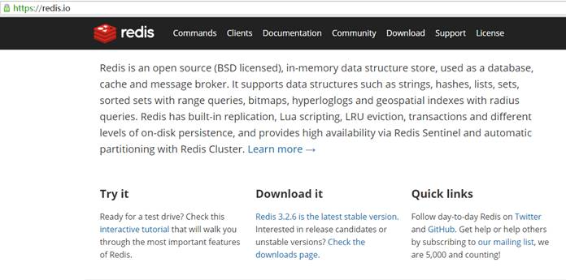

c)    下载redis的最新资料包

d)    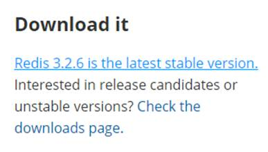

e)    完成下载

 

\3.    将下载redis资料包上传到Linux中将压缩包在linux系统中解压

\4.    安装gcc依赖 yum install -y gcc

\5.    解压完成后进入解压目录直接的目录中执行make MALLOC=libc即可

\6.    编译完成后make install PREFIX=/usr/redis安装

\7.    启动redis服务 ./redis-server ../redis.conf启动成功看到如下画面

\8.    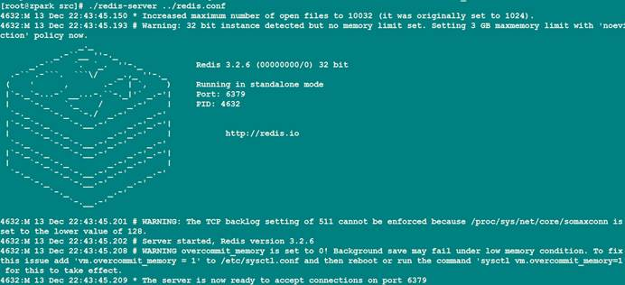

\9.    redis的服务的默认端口是6379

\10.   使用redis的客户端连接redis服务,使用./redis-cli –p 6379 连接redis的服务端

\11.   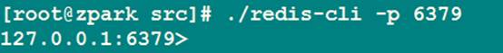

\12.   连接成功就可以使用客户端命令进行操作

## 九、   Redis中常用的与数据库有关的指令

**说明 :** 使用redis的默认配置器动redis服务后,默认会存在16个库,编号从0-15

可以使用select 库的编号 来选择一个redis的库

 

\1.    清空当前的库  FLUSHDB

\2.    清空全部的库  FLUSHALL

## 十、   Redis中常用的与key相关的指令

**1.**    **DEL**

语法 : DEL key [key ...] 

作用 : 删除给定的一个或多个key 。不存在的key 会被忽略。

可用版本： >= 1.0.0

时间复杂度：

O(N)，N 为被删除的key 的数量。

删除单个字符串类型的key ，时间复杂度为O(1)。

删除单个列表、集合、有序集合或哈希表类型的key ，时间复杂度为O(M)，M为以上数据结构内的元素数量。

返回值： 被删除key 的数量。

 

**2.**    **EXISTS**

语法:  EXISTS key

作用:  检查给定key 是否存在。

可用版本： >= 1.0.0

时间复杂度： O(1)

返回值： 若key 存在，返回1 ，否则返回0 。

 

**3.**    **EXPIRE**

语法: EXPIRE key seconds

作用:  为给定key 设置生存时间，当key 过期时(生存时间为0 )，它会被自动删除。

在Redis 中，带有生存时间的key 被称为『易失的』(volatile)。生存时间可以通过使用DEL 命令来删除整个key 来移除，或者被SET 和GETSET 命令覆写(overwrite)，

这意味着，如果一个命令只是修改(alter) 一个带生存时间的key 的值而不是用一个新的key 值来代替(replace) 它的话，那么生存时间不会被改变。

比如说，对一个key 执行INCR 命令，对一个列表进行LPUSH 命令，或者对一个哈希表执行HSET 命令，这类操作都不会修改key 本身的生存时间。

另一方面，如果使用RENAME 对一个key 进行改名，那么改名后的key 的生存时间和改名前一样。RENAME 命令的另一种可能是，尝试将一个带生存时间的key 改名成另一个带生存时间的another_key这时旧的another_key (以及它的生存时间) 会被删除，然后旧的key 会改名为another_key ，因此，新的another_key 的生存时间也和原本的key 一样。使用PERSIST 命令可以在不删除key 的情况下，移除key 的生存时间，让key 重新成为一个『持久的』(persistent) key 。更新生存时间可以对一个已经带有生存时间的key 执行EXPIRE 命令，新指定的生存时间会取代旧的生存时间。过期时间的精确度在Redis 2.4 版本中，过期时间的延迟在1 秒钟之内——也即是，就算key 已经过期，但它还是可能在过期之后一秒钟之内被访问到，而在新的Redis 2.6 版本中，延迟被降低到1 毫秒之内。Redis 2.1.3 之前的不同之处

在Redis 2.1.3 之前的版本中，修改一个带有生存时间的key 会导致整个key 被删除，这一行为是受当时复制(replication) 层的限制而作出的，现在这一限制已经被修复。

可用版本： >= 1.0.0

时间复杂度： O(1)

返回值：设置成功返回1 。

 

 

**4.**    **KEYS**

语法 :  KEYS pattern

作用 :  查找所有符合给定模式pattern 的key 。

KEYS * 匹配数据库中所有key 。

KEYS h?llo 匹配hello ，hallo 和hxllo 等。

KEYS h*llo 匹配hllo 和heeeeello 等。

KEYS h[ae]llo 匹配hello 和hallo ，但不匹配hillo 。

特殊符号用 \ 隔开

注意:  KEYS 的速度非常快，但在一个大的数据库中使用它仍然可能造成性能问题，如果你需要从一个数据集中查找特定的key ，你最好还是用Redis 的集合结构(set) 来代替。

可用版本： >= 1.0.0

时间复杂度： O(N)，N 为数据库中key 的数量。

返回值： 符合给定模式的key 列表。

 

**5.**    **MOVE**

语法 : MOVE key db

作用 :  将当前数据库的key 移动到给定的数据库db 当中。

如果当前数据库(源数据库) 和给定数据库(目标数据库) 有相同名字的给定key ，或者key 不存在于当前数据库，那么MOVE 没有任何效果。因此，也可以利用这一特性，将MOVE 当作锁(locking) 原语(primitive)。

可用版本： >= 1.0.0

时间复杂度： O(1)

返回值： 移动成功返回1 ，失败则返回0 。

 

**6.**    **PEXPIRE**

语法 : PEXPIRE key milliseconds

作用 : 这个命令和EXPIRE 命令的作用类似，但是它以毫秒为单位设置key 的生存时间，而不像EXPIRE 命令那样，以秒为单位。

可用版本： >= 2.6.0

时间复杂度： O(1)

返回值：设置成功，返回1 key 不存在或设置失败，返回0

 

**7.**    **PEXPIREAT**

语法 : PEXPIREAT key milliseconds-timestamp

作用 : 这个命令和EXPIREAT 命令类似，但它以毫秒为单位设置key 的过期unix 时间戳，而不是像EXPIREAT那样，以秒为单位。

可用版本： >= 2.6.0

时间复杂度： O(1)

返回值：如果生存时间设置成功，返回1 。当key 不存在或没办法设置生存时间时，返回0 。(查看EXPIRE 命令获取更多信息)

 

**8.**    **TTL**

语法 :  TTL key

作用 :  以秒为单位，返回给定key 的剩余生存时间(TTL, time to live)。

可用版本： >= 1.0.0

时间复杂度： O(1)

返回值：

当key 不存在时，返回-2 。

当key 存在但没有设置剩余生存时间时，返回-1 。

否则，以秒为单位，返回key 的剩余生存时间。

Note : 在Redis 2.8 以前，当key 不存在，或者key 没有设置剩余生存时间时，命令都返回-1 。

 

**9.**    **PTTL**

语法 : PTTL key

作用 : 这个命令类似于TTL 命令，但它以毫秒为单位返回key 的剩余生存时间，而不是像TTL 命令那样，以秒为单位。

可用版本： >= 2.6.0

复杂度： O(1)

返回值： 当key 不存在时，返回-2 。当key 存在但没有设置剩余生存时间时，返回-1 。

否则，以毫秒为单位，返回key 的剩余生存时间。

注意 : 在Redis 2.8 以前，当key 不存在，或者key 没有设置剩余生存时间时，命令都返回-1 。

 

**10.**   **RANDOMKEY**

语法 : RANDOMKEY

作用 : 从当前数据库中随机返回(不删除) 一个key 。

可用版本： >= 1.0.0

时间复杂度： O(1)

返回值：当数据库不为空时，返回一个key 。当数据库为空时，返回nil 。

 

**11.**   **RENAME**

语法 : RENAME key newkey

作用 : 将key 改名为newkey 。当key 和newkey 相同，或者key 不存在时，返回一个错误。当newkey 已经存在时，RENAME 命令将覆盖旧值。

可用版本： >= 1.0.0

时间复杂度： O(1)

返回值： 改名成功时提示OK ，失败时候返回一个错误。

 

**12.**   **TYPE**

语法 : TYPE key

作用 : 返回key 所储存的值的类型。

可用版本： >= 1.0.0

时间复杂度： O(1)

返回值：

none (key 不存在)

string (字符串)

list (列表)

set (集合)

zset (有序集)

hash (哈希表)

## 十一、     Redis的String类型的操作 key value(字符串)

key string value(string) 

| **命令**                                     | **说明**                                   |
| -------------------------------------------- | ------------------------------------------ |
| set                                          | 设置一个key/value                          |
| get                                          | 根据key获得对应的value                     |
| mset                                         | 一次设置多个key  value                     |
| mget                                         | 一次获得多个key的value                     |
| getset                                       | 获得原始key的值，同时设置新值              |
| strlen                                       | 获得对应key存储value的长度                 |
| append                                       | 为对应key的value追加内容                   |
| getrange 索引0开始                           | 截取value的内容                            |
| setex                                        | 设置一个key存活的有效期（秒）              |
| psetex                                       | 设置一个key存活的有效期（毫秒）            |
| setnx                                        | 存在不做任何操作,不存在添加                |
| msetnx  原子操作(只要有一个存在不做任何操作) | 可以同时设置多个key,只有有一个存在都不保存 |
| decr                                         | 进行数值类型的-1操作                       |
| decrby                                       | 根据提供的数据进行减法操作                 |
| Incr                                         | 进行数值类型的+1操作                       |
| incrby                                       | 根据提供的数据进行加法操作                 |
| Incrbyfloat                                  | 根据提供的数据加入浮点数                   |

 

**
**

## 十二、     Redis的List类型的操作

**1.**    **图示 key value(list)** **特点: list** **元素可以重复 list****元素有序的**

**2.**    **命令**

| **命令**     | **说明**                             |
| ------------ | ------------------------------------ |
| lpush        | 将某个值加入到一个key列表头部        |
| lpushx       | 同lpush,但是必须要保证这个key存在    |
| rpush        | 将某个值加入到一个key列表末尾        |
| rpushx       | 同rpush,但是必须要保证这个key存在    |
| lpop         | 返回和移除列表的第一个元素           |
| rpop         | 返回和移除列表的第一个元素           |
| lrange  0 -1 | 获取某一个下标区间内的元素           |
| llen         | 获取列表元素个数                     |
| lset         | 设置某一个指定索引的值(索引必须存在) |
| lindex       | 获取某一个指定索引位置的元素         |
| lrem         | 删除重复元素                         |
| ltrim        | 保留列表中特定区间内的元素           |
| linsert      | 在某一个元素之前，之后插入新元素     |

 

**
**

## 十三、     Redis的SET类型的操作

SET 特点:元素没有顺序 不能重复

 

**1.**    **图示**

**2.**    **命令**

| **命令**    | **说明**                               |
| ----------- | -------------------------------------- |
| sadd        | 为集合添加元素                         |
| smembers    | 显示集合中所有元素 无序                |
| scard       | 返回集合中元素的个数                   |
| spop        | 随机返回一个元素 并将元素在集合中删除  |
| smove       | 从一个集合中向另一个集合移动元素       |
| srem        | 从集合中删除一个元素                   |
| sismember   | 判断一个集合中是否含有这个元素         |
| srandmember | 随机返回元素                           |
| sdiff       | 去掉第一个集合中其它集合含有的相同元素 |
| sinter      | 求交集                                 |
| sunion      | 求和集                                 |

 

**
**

## 十四、     Redis的ZSET类型的操作

**1.**    **图示 ZSET(****排行榜)  SortSet (****排序set) ScoreSet(****分数 set) zset**

 

**特点:** **元素不可以重复** **但是因为每个元素存在分数** **可以通过分数排序**

**2.**    **命令**

| **命令**                   | **说明**                     |
| -------------------------- | ---------------------------- |
| zadd                       | 添加一个有序集合元素         |
| zcard                      | 返回集合的元素个数           |
| zrange 升序 zrevrange 降序 | 返回一个范围内的元素         |
| zrangebyscore              | 按照分数查找一个范围内的元素 |
| zrank                      | 返回排名                     |
| zrevrank                   | 倒序排名                     |
| zscore                     | 显示某一个元素的分数         |
| zrem                       | 移除某一个元素               |
| zincrby                    | 给某个特定元素加分           |

 

**
**

## 十五、     Redis的HASH类型的操作

**1.**    **图示 value****值是一个map Map<String,Map<String,value>>**

**2.**    **命令**

| **命令**     | **说明**                |
| ------------ | ----------------------- |
| hset         | 设置一个key/value对     |
| hget         | 获得一个key对应的value  |
| hgetall      | 获得所有的key/value对   |
| hdel         | 删除某一个key/value对   |
| hexists      | 判断一个key是否存在     |
| hkeys        | 获得所有的key           |
| hvals        | 获得所有的value         |
| hmset        | 设置多个key/value       |
| hmget        | 获得多个key的value      |
| hsetnx       | 设置一个不存在的key的值 |
| hincrby      | 为value进行加法运算     |
| hincrbyfloat | 为value加入浮点值       |

 

**
**

## 十六、     Redis中的持久化机制

说明 :  Redis提供了两种不同的持久化方法来将数据存储到硬盘里面 

 

Ø 快照(snapshotting)

 

这种方式可以将某一时刻的所有数据都写入硬盘中,当然这也是redis的默认持久化方式,保存的文件是以.rdb形式结尾的文件因此这种方式也称之为RDB方式

 

Ø AOF(append only file)只追加文件

​    

这种方式可以将所有客户端执行的写命令记录到日志文件中

 

\1.   快照持久化

a)    快照持久化也是redis中的默认开启的持久化方案, 根据redis.conf中的配置,快照将被写入dbfilename指定的文件里面(默认是dump.rdb文件中)

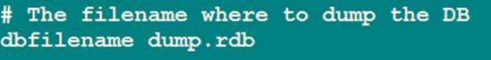

 

b)    根据redis.conf中的配置,快照将保存在dir选项指定的路径上

 

c)    创建快照的几种方式

 

l 客户端可以使用BGSAVE命令来创建一个快照,当接收到客户端的BGSAVE命令时,redis会调用fork¹来创建一个子进程,然后子进程负责将快照写入磁盘中,而父进程则继续处理命令请求

l  

 

l 客户端还可以使用SAVE命令来创建一个快照,接收到SAVE命令的redis服务器在快照创建完毕之前将不再响应任何其他的命令

 

注意 :  SAVE命令并不常用,使用SAVE命令在快照创建完毕之前,redis处于阻塞状态,无法对外服务

 

名词解释 : fork当一个进程创建子进程的时候,底层的操作系统会创建该进程的一个副本,在类unix系统中创建子进程的操作会进行优化:在刚开始的时候,父子进程共享相同内存,直到父进程或子进程对内存进行了写之后,对被写入的内存的共享才会结束服务

 

 

l 如果用户在redis.conf中设置了save配置选项,redis会在save选项条件满足之后自动触发一次BGSAVE命令,如果设置多个save配置选项,当任意一个save配置选项条件满足,redis也会触发一次BGSAVE命令

 

l 当redis通过shutdown指令接收到关闭服务器的请求时,会执行一个save命令,阻塞所有的客户端,不再执行客户端执行发送的任何命令,并且在save命令执行完毕之后关闭服务器

 

 

\2.   AOF持久化机制

a)    在redis的默认配置中AOF持久化机制 是没有开启的,AOF持久化会将被执行的写命令写到AOF的文件末尾,以此来记录数据发生的变化,因此只要redis从头到尾执行一次AOF文件所包含的所有写命令,就可以恢复AOF文件的记录的数据集.

 

b)    开启AOF持久化机制,需要修改redis.conf的配置文件, 

 

l 通过修改redis.conf配置中appendonly yes来开启AOF持久化

l 通过appendfilename指定日志文件名字(默认为:appendonly.aof)

l 通过appendfsync指定日志记录频率

 

c)    AOF 日志记录频率的选项

 

l 可选项

| **选项** | **同步频率**                                      |
| -------- | ------------------------------------------------- |
| always   | 每个redis写命令都要同步写入硬盘,严重降低redis速度 |
| everysec | 每秒执行一次同步显式的将多个写命令同步到磁盘      |
| no       | 由操作系统决定何时同步                            |

l 三种日志记录频率的详细分析 :

ü 如果用户使用了always选项,那么每个redis写命令都会被写入硬盘,从而将发生系统崩溃时出现的数据丢失减到最少;遗憾的是,因为这种同步策略需要对硬盘进行大量的写入操作,所以redis处理命令的速度会受到硬盘性能的限制;

注意 : 转盘式硬盘在这种频率下200左右个命令/s ; 固态硬盘(SSD) 几百万个命令/s;

警告 :  使用SSD用户请谨慎使用always选项,这种模式不断写入少量数据的做法有可能会引发严重的写入放大问题,导致将固态硬盘的寿命从原来的几年降低为几个月

 

ü 为了兼顾数据安全和写入性能,用户可以考虑使用everysec选项,让redis每秒一次的频率对AOF文件进行同步;redis每秒同步一次AOF文件时性能和不使用任何持久化特性时的性能相差无几,而通过每秒同步一次AOF文件,redis可以保证,即使系统崩溃,用户最多丢失一秒之内产生的数据(推荐使用这种方式)

 

ü 最后使用no选项,将完全有操作系统决定什么时候同步AOF日志文件,这个选项不会对redis性能带来影响但是系统崩溃时,会丢失不定数量的数据,另外如果用户硬盘处理写入操作不够快的话,当缓冲区被等待写入硬盘数据填满时,redis会处于阻塞状态,并导致redis的处理命令请求的速度变慢(不推荐使用)

 

## 十七、     AOF文件的重写

 

aof 的方式也同时带来了另一个问题。持久化文件会变的越来越大。例如我们调用incr test命令100次，文件中必须保存全部的100条命令，其实有99条都是多余的。因为要恢复数据库的状态其实文件中保存一条set test 100就够了。为了压缩aof的持久化文件Redis提供了AOF重写机制

 

 

l 重写 aof 文件的两种方式

 

ü 执行BGREWRITEAOF命令 不会阻塞redis的服务

 

ü 配置redis.conf中的auto-aof-rewrite-percentage选项

 

 

l BGREWRITEAOF 方式

 

收到此命令redis将使用与快照类似的方式将内存中的数据 以命令的方式保存到临时文件中，最后替换原来的文件。具体过程如下

 

ü redis调用fork ，现在有父子两个进程 子进程根据内存中的数据库快照，往临时文件中写入重建数据库状态的命令

 

ü 父进程继续处理client请求，除了把写命令写入到原来的aof文件中。同时把收到的写命令缓存起来。这样就能保证如果子进程重写失败的话并不会出问题。

 

 

ü 当子进程把快照内容写入已命令方式写到临时文件中后，子进程发信号通知父进程。然后父进程把缓存的写命令也写入到临时文件。

 

ü 现在父进程可以使用临时文件替换老的aof文件，并重命名，后面收到的写命令也开始往新的aof文件中追加。

 

Ø 注意 : 重写aof文件的操作，并没有读取旧的aof文件，而是将整个内存中的数据库内容用命令的方式重写了一个新的aof文件,替换原有的文件这点和快照有点类似。(AOF重写过程完成后会删除旧的AOF文件,删除一个体积达几十GB大的旧的AOF文件可能会导致系统随时挂起 )

 

l 配置redis.conf中的auto-aof-rewrite-percentage选项

 

ü AOF重写也可以使用auto-aof-rewrite-percentage 200

和auto-aof-rewrite-min-size 64mb来自动执行BGREWRITEAOF.

 

说明: 如果设置auto-aof-rewrite-percentage值为100和auto-aof-rewrite-min-size 64mb,并且启用的AOF持久化时,那么当AOF文件体积大于64M,并且AOF文件的体积比上一次重写之后体积大了至少一倍(100%)时,会自动触发,如果重写过于频繁,用户可以考虑将auto-aof-rewrite-percentage设置为更大

 

Aof 64Mb---à 34M----à 68M --à50M--à100M-à70M->140M-> 120M--à240M à200M---> 400M---10G---->20G

 

## 十八、      两种持久化方案的总结

ü AOF持久化既可以将丢失的数据的时间降低到1秒(甚至不丢失任何数据),那么我们还有什么理由不是用AOF呢?

 

注意 : 

这个问题实际上并没有这么简单,因为redis会不断将执行的写命令记录到AOF文件中,所以随着redis运行,AOF文件的体积会不断增大,在极端情况下甚至会用完整个硬盘,还有redis重启重新执行AOF文件记录的所有写命令的来还原数据集,AOF文件体积非常大,会导致redis执行恢复时间过长 

  

两种持久化方案既可以同时使用(aof),又可以单独使用,在某种情况下也可以都不使用,具体使用那种持久化方案取决于用户的数据和应用决定

 

无论使用AOF还是快照机制持久化,将数据持久化到硬盘都是有必要的,除了持久化外,用户还应该对持久化的文件进行备份(最好备份在多个不同地方)

 

 

## 十九、     Java API 调用Redis

\1.    在项目中导入redis的驱动jar jedis的jar包和commons-pools的jar包即可

\2.    在项目中使用jedis

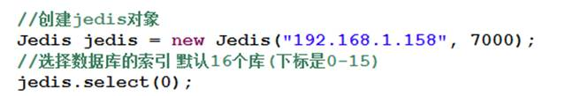

 

\3.    测试与key相关的API

 

 

\1.    删除一个key

 

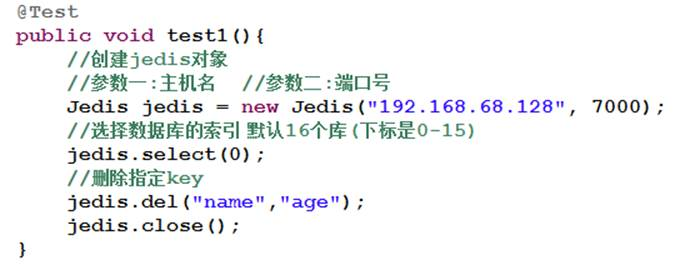

 

 

\2.    判断某个key类型

 

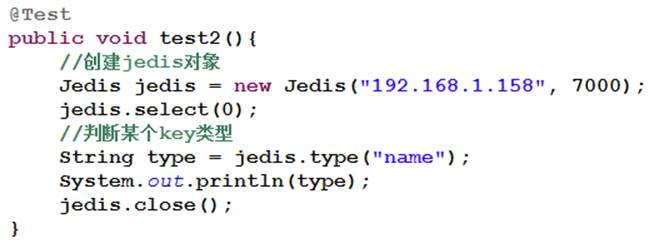

 

 

 

\3.    查看库中所有key

 

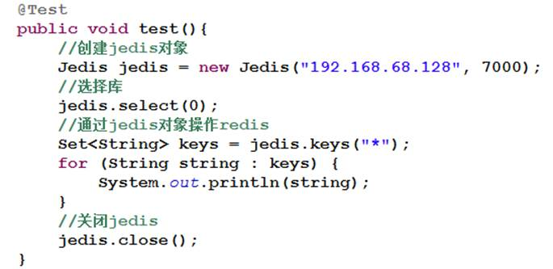

 

 

 

 

\4.    返回随机的key

 

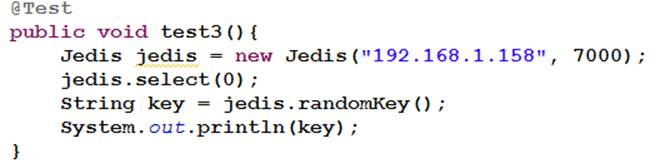

 

 

 

\5.    返回key的失效时间

 

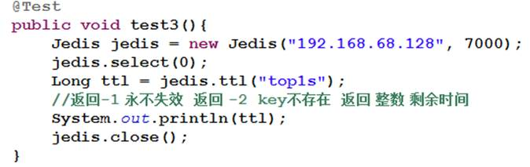

 

 

\6.    移动某个key到指定的库中

 

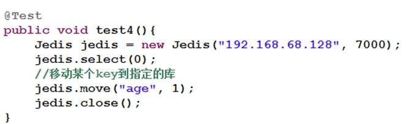

 

 

\4.    测试与字符串相关API

 

\5.    测试与list相关的API  

\6.    测试与Set相关的API

\7.    测试与Zset相关的API

\8.    测试与Hash相关的API

 

## 二十、     springboot集成redis

\1.  引入依赖
 

​     <dependency>      <groupId>org.springframework.boot</groupId>      <artifactId>spring-boot-starter-data-redis</artifactId>   </dependency>     

\2. 配置配置文件

| spring:  redis:     host: 10.15.0.8     port: 6379     database: 0     pool:      max-active: 8      max-wait: -1 |
| ------------------------------------------------------------ |
|                                                              |

 

 

## 二十一、      Redis的集群搭建

 

\1.    Redis的集群

 

Redis在3.0后开始支持Cluster(模式)模式,目前redis的集群支持节点的自动发现,

支持slave-master选举和容错,支持在线分片(sharding shard )等特性

 

\2.    Redis的集群架构图

 

\3.    Redis的集群细节

 

ü 所有的redis节点彼此互联(PING-PONG机制),内部使用二进制协议优化传输速度和带宽.

 

ü 节点的fail是通过集群中超过半数的节点检测失效时才生效. 奇数个

 

ü 客户端与redis节点直连,不需要中间proxy层.客户端不需要连接集群所有节点,连接集群中任何一个可用节点即可

 

ü redis-cluster把所有的物理节点映射到[0-16383]slot上,cluster 负责维护node<->slot<->value

\4.    redis容错架构图 5 

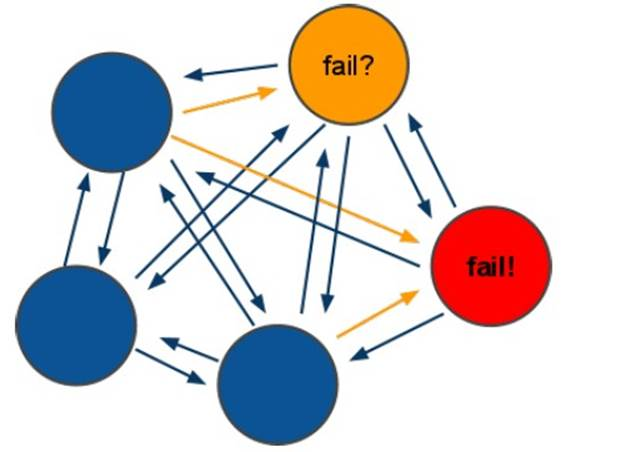

\5.    Redis的容错细节

 

ü 领着选举过程是集群中所有master参与,如果半数以上master节点与master节点通信超过(cluster-node-timeout),认为当前master节点挂掉

 

ü 什么时候整个集群不可用(cluster_state:fail),当集群不可用时,所有对集群的操作做都不可用，收到((error) CLUSTERDOWN The cluster is down)错误 

 

 

注意 :

 

​    如果集群任意master挂掉,且当前master没有slave.集群进入fail状态,也可以理解成进群的slot映射[0-16383]不完成时进入fail状态.

 

​    如果集群超过半数以上master挂掉，无论是否有slave集群进入fail状态(老版本)

 

\6.    Redis的集群搭建

 

注意 : 

\1.    判断一个是集群中的节点是否可用,是集群中的所用主节点选举过程,如果半数以上的节点认为当前节点挂掉,那么当前节点就是挂掉了,所以搭建redis集群时建议节点数最好为奇数.

 

\2.    搭建集群至少需要三个主节点,三个从节点,至少需要6个节点

 

\1.    集群需要安装ruby环境

 

ü 可以直接使用联网形式安装

 

n yum install -y ruby rubygems

n gem install redis

 

ü 也可以使用使用本地方式安装

 

n 将下载好的ruby和rubygems脚本上传到linux中

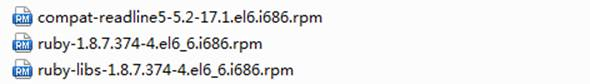

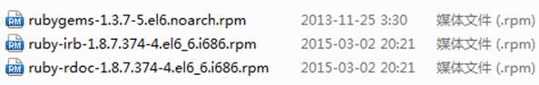

 

n 使用如下方式安装

 

u 首先进入ruby的安装包中执行     rpm  -ivh  * 

 

u 进而进入rubygems安装包中执行    rpm  -ivh  *

 

u 接下来执行             gem install  redis

 

u 出现下图提示代表ruby脚本安装成功

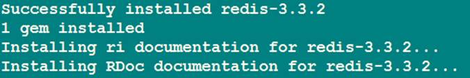

 

 

 

\2.    准备7台机器,其中一台用来做测试集群操作,在linux中创建7个文件夹用来存放redis的配置文件

 

 

​           i.      创建7个文件夹

 

 

 

 

​          ii.      向每个目录中复制一个redis的配置文件

 

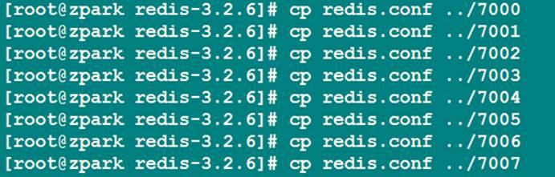

 

l 注意 : 

 

\1.    在单机搭建集群需要修改端口号

 

修改每个配置文件的端口不同这里是7000,7001,7002…7007

 

\2.    每个配置文件中需要修改如下配置

cluster-enabled yes          //开启集群模式

cluster-config-file nodes-.conf        //集群节点配置文件

cluster-node-timeout 5000     //集群节点超时时间

appendonly yes            //开启AOF持久化

 

​         iii.      开始搭建集群

 

\1.    分别启动六个节点(使用如下命令加载不同配置文件)

 

\2.    使用redis安装目录中src目录下的redis-trib.rb如下命令

 

./redis-trib.rb create --replicas 1 192.168.68.128:7000 192.168.68.128:7001 192.168.68.128:7002 192.168.68.128:7003 192.168.68.128:7004 192.168.68.128:7005

 

\3.    执行如下命令会出现如下状态

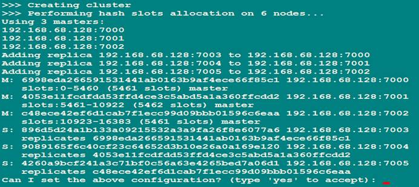

 

\4.    输入yes后集群确定搭建,输入其它命令不创建集群

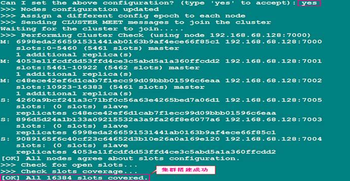

 

\5.    客户端操作集群

a)    集群中的节点平等使用如下命令连接集群中的任意节点即可

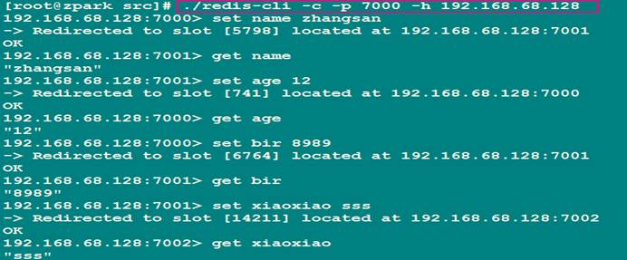

 

 

\6.    查看接群节点的状态

Ø 使用./redis-trib.rb check 主机:集群中任意节点 查看集群中节点的详细 

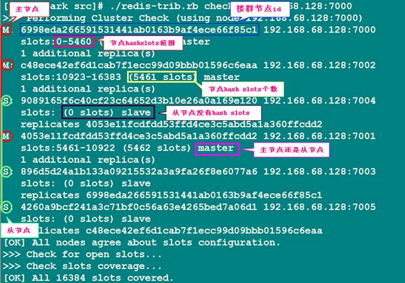

 

Ø 节点状态说明

 

l 主节点 : 

 

ü 主节点存在hash slots,且主节点的hash slots 没有交叉

ü 主节点不能删除

ü 一个主节点可以有多个从节点

ü 主节点宕机时多个副本之间自动选举主节点

 

l 从节点 :

 

ü 从节点没有hash slots

ü 从节点可以删除

ü 从节点不负责数据的写,只负责数据的同步

## 二十二、      集群节点的操作

\1.    向集群中添加一个主节点

 

a)    使用./redis-trib.rb add-node 192.168.1.158:7006 192.168.1.158:7005

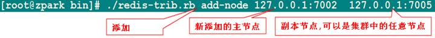

 

b)    参数说明

​                      i.      第一个参数是新节点的地址，

​                     ii.      第二个参数是任意一个已经存在的节点的IP和端口

 

注意 : 

 

\1.   该节点必须以集群模式启动

 

\2.   默认情况下该节点就是以master节点形式添加,但是该节点没有hashslots 

 

 

 

\2.    向集群中添加副本节点

a)    使用./redis-trib.rb add-node --slave 192.168.1.158:7006 192.168.1.158:7000

 

说明 : 

 

--slave 添加从节点

参数一:新的从节点

参数二:集群中的任意节点

 

注意 :

 

当添加副本节点时没有指定主节点,redis会随机给副本节点较少的主节点添加当前副本节点

 

 

 

 

 

 

 

\3.    为某个指定主节点添加从节点

 

a)    ./redis-trib.rb  add-node

--slave --master-id 3c3a0c74aae0b56170ccb03a76b60cfe7dc1912e 127.0.0.1:7006  127.0.0.1:7000

 

​            说明 :

​                --master-id 指定主节点id

​             参数一: 添加的备份节点

​              参数二: 集群中的某个节点

 

\4.    从集群中删除副本节点

 

a)    使用

./redis-trib.rb del-node 127.0.0.1:7002 0ca3f102ecf0c888fc7a7ce43a13e9be9f6d3dd1

​        

​                说明 :

 

第一个参数是任意一个节点的地址 

第二个节点是你想要移除的节点地址 

 

注意 :

​    被删除的节点必须是从节点或没有被分配hash slots的节点

 

\5.    节点的从新分片 

 

a)    集群节点(hash slots)的从新分配(reshard)

 

使用 ./redis-trib.rb reshard 192.168.1.158:7000

​               说明 : 

需要指定集群中其中一个节点的地址 

redis-trib就会自动找到集群中的其他主节点。

​            

b)    为哪个主节点分配hash slots

c)    从哪些主节点中移动

## 二十三、      Spring-data操作Redis

\1.    使用spring-data操作redis

 

ü Spring-Data-Redis项目（简称SDR）对Redis的Key-Value数据存储操作提供了更高层次的抽象，类似于Spring Framework对JDBC支持一样。Spring-Data-Redis项目（简称SDR）对Redis的Key-Value数据存储操作提供了更高层次的抽象，类似于Spring Framework对JDBC支持一样。

 

ü Spring Data Redis使得在Spring应用中读写Redis数据库更加容易

 

\2.    连接Redis服务(单机)

 

ü 在Spring Data Redis中通过org.springframework.data.redis.connection包中的RedisConnection和RedisConnectionFactory类来获取Redis连接。

 

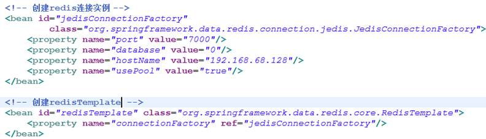

 

连接redis服务集群

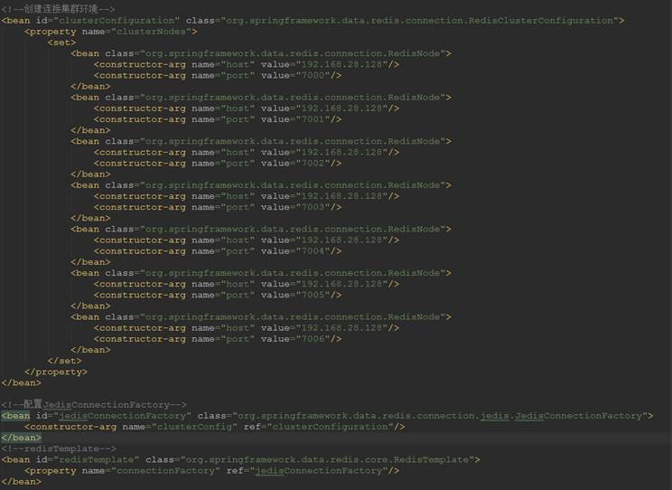

 

\3.    RedisTemplate的支持

 

ü 熟悉Spring的JdbcTemplate对象的话，应该大概能猜出来RedisTemplate的作用了，RedisTemplate对象对RedisConnection进行了封装，它提供了连接管理，序列化等功能，它对Redis的交互进行了更高层次的抽象。另外还提供了Redis操作命令的操作视图，这极大的方便和简化了Redis的操作。

 

 

 

 

 

 

 

 

ü 下表是具体的操作视图接口类介绍：

 

| Key类型操作          |                             |
| -------------------- | --------------------------- |
| ValueOperations      | Redis String/Value 操作     |
| ListOperations       | Redis List 操作             |
| SetOperations        | Redis Set 操作              |
| ZSetOperations       | Redis Sort Set 操作         |
| HashOperations       | Redis Hash 操作             |
| Value约束操作        |                             |
| BoundValueOperations | Redis String/Value key 约束 |
| BoundListOperations  | Redis List key 约束         |
| BoundSetOperations   | Redis Set key 约束          |
| BoundZSetOperations  | Redis Sort Set key 约束     |
| BoundHashOperations  | Redis Hash key 约束         |

 

 

 

 

 

\4.    测试redisTemplate

 

ü 简单的String操作

 

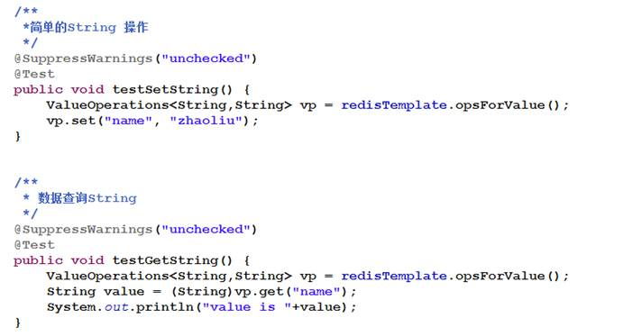

 

ü 简单的List操作

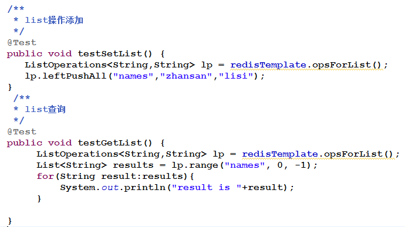

 

 

 

 

 

 

 

 

ü 简单的Set操作

 

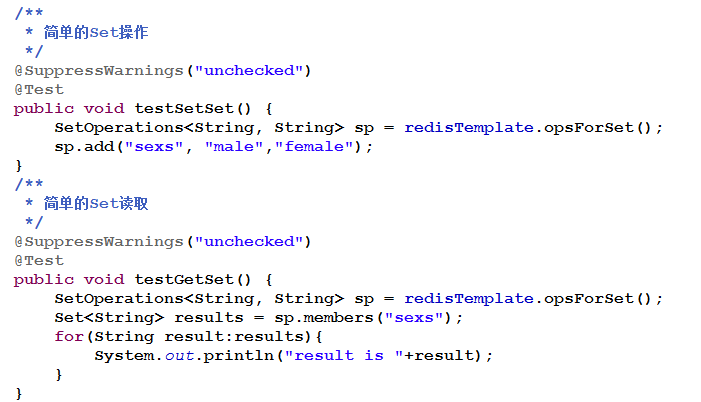

​            

ü 简单的Zset操作

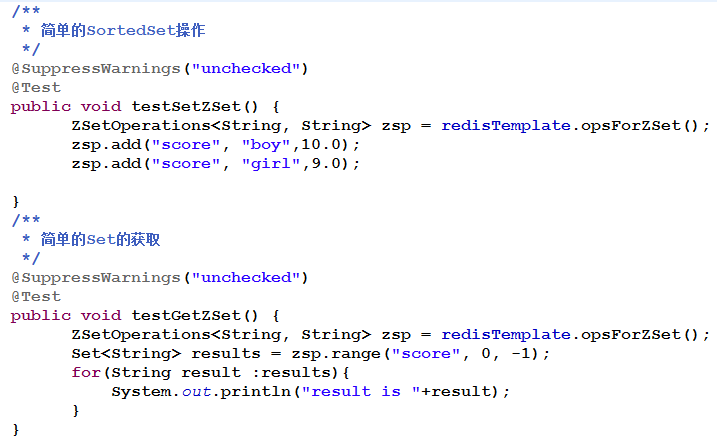

 

ü 简单的Hash操作

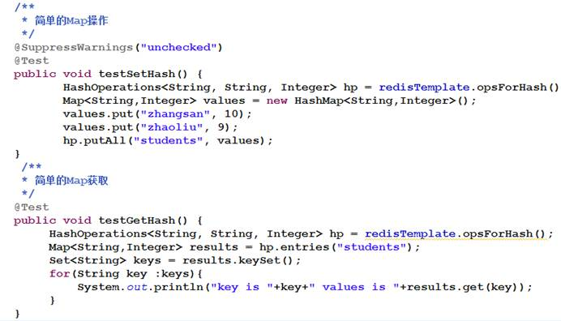

 

ü 其他操作

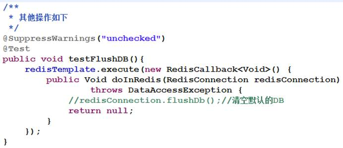

 

ü 使用RedisSerializer

 

​                      i.      Spring Data Redis提供了对Key-Value的序列号，在使用RedisTemplate对象是默认使用JdkSerializationRedisSerializer实现。还提供了其它的序列化实现如：Jackson2JsonRedisSerializer，JacksonJsonRedisSerializer，GenericToStringSerializer，StringRedisSerializer，OxmSerializer。

 

​                     ii.      另外用户可以提供自己的序列化实现, 配置RedisTemplate

 

\1.    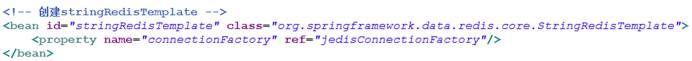

 

说明 :

这里配置了RedisTemplate和StringRedisTemplate,不同之处在于StringRedisTemplate的Key-Value序列化使用的是StringRedisSerializer。使用StringRedisTemplate操作Redis之后的结果是读友好的。

 

另外对Hash类型而言，还有对应的HashKey序列化（其对应于Hash类型的字段名）。

 

 

 