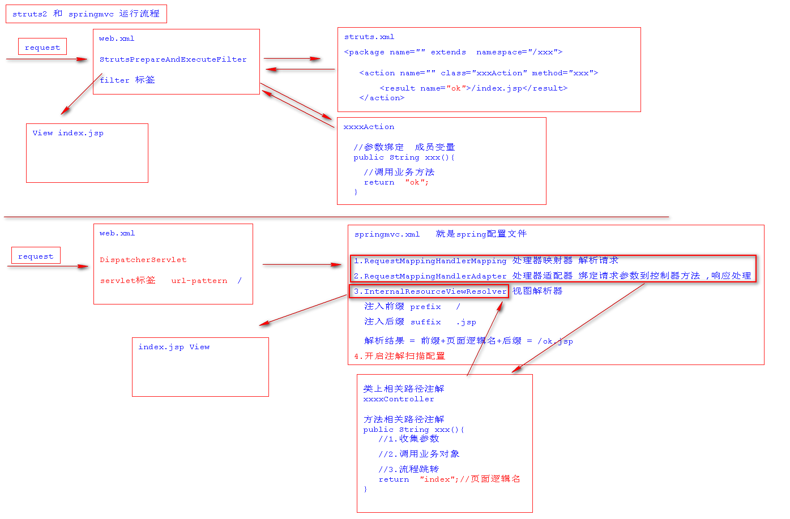
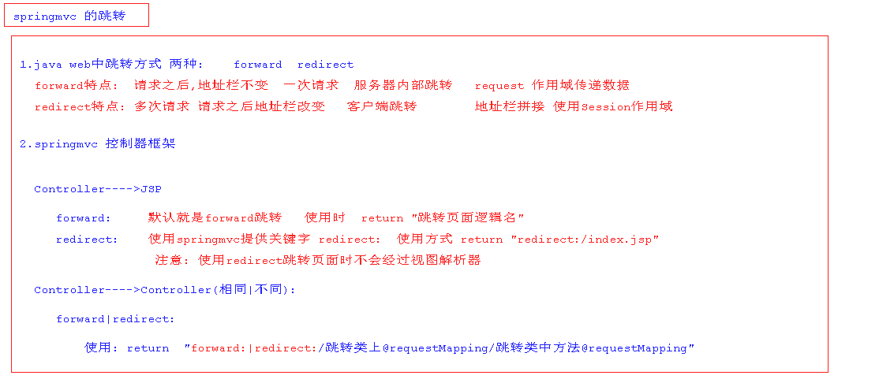

# SpringMVC_day1

## 1.SpringMVC的引言

为了使Spring可插入的MVC架构,SpringFrameWork在Spring基础上开发SpringMVC框架,从而在使用Spring进行WEB开发时可以选择使用**Spring的SpringMVC框架作为web开发的控制器框架**。

## 2.为什么是SpringMVC

- 可以和spring框架无缝整合
- 运行效率高于struts2框架
- 注解式开发更高效

## 3.SpringMVC的特点

SpringMVC **轻量级，典型MVC框架**，在整个MVC架构中充当控制器框架,相对于之前学习的struts2框架,**SpringMVC运行更快,其注解式开发更高效灵活**。

## 4.SpringMVC与Struts2运行流程对比



## 5.第一个环境搭建

###  1.引入相关依赖

```xml
		<dependency>
      <groupId>org.springframework</groupId>
      <artifactId>spring-core</artifactId>
      <version>4.3.2.RELEASE</version>
    </dependency>
    <dependency>
      <groupId>org.springframework</groupId>
      <artifactId>spring-context</artifactId>
      <version>4.3.2.RELEASE</version>
    </dependency>
    <dependency>
      <groupId>org.springframework</groupId>
      <artifactId>spring-context-support</artifactId>
      <version>4.3.2.RELEASE</version>
    </dependency>
    <dependency>
      <groupId>org.springframework</groupId>
      <artifactId>spring-jdbc</artifactId>
      <version>4.3.2.RELEASE</version>
    </dependency>
    <dependency>
      <groupId>org.springframework</groupId>
      <artifactId>spring-aop</artifactId>
      <version>4.3.2.RELEASE</version>
    </dependency>
    <dependency>
      <groupId>org.springframework</groupId>
      <artifactId>spring-beans</artifactId>
      <version>4.3.2.RELEASE</version>
    </dependency>
    <dependency>
      <groupId>org.springframework</groupId>
      <artifactId>spring-expression</artifactId>
      <version>4.3.2.RELEASE</version>
    </dependency>
    <dependency>
      <groupId>org.springframework</groupId>
      <artifactId>spring-aspects</artifactId>
      <version>4.3.2.RELEASE</version>
    </dependency>
    <dependency>
      <groupId>org.springframework</groupId>
      <artifactId>spring-tx</artifactId>
      <version>4.3.2.RELEASE</version>
    </dependency>
    <dependency>
      <groupId>org.springframework</groupId>
      <artifactId>spring-web</artifactId>
      <version>4.3.2.RELEASE</version>
    </dependency>
		<!--springmvc核心依赖-->
		<dependency>
      <groupId>org.springframework</groupId>
      <artifactId>spring-webmvc</artifactId>
      <version>4.3.2.RELEASE</version>
    </dependency>
   <!--servlet-api-->
    <dependency>
      <groupId>javax.servlet</groupId>
      <artifactId>servlet-api</artifactId>
      <version>2.5</version>
      <scope>provided</scope>
    </dependency>

```

### 2.编写springmvc配置文件

```xml
  <!--开启注解扫描-->
    <context:component-scan base-package="com"/>

    <!--注册处理器映射器-->
    <bean class="org.springframework.web.servlet.mvc.method.annotation.RequestMappingHandlerMapping"/>
    <!--注册处理器适配器-->
    <bean class="org.springframework.web.servlet.mvc.method.annotation.RequestMappingHandlerAdapter"/>
    <!--注册视图解析器-->
    <bean class="org.springframework.web.servlet.view.InternalResourceViewResolver">
        <property name="prefix" value="/"/>
        <property name="suffix" value=".jsp"/>
    </bean>
```

### 3.配置springmvc的核心Servlet

```xml
	<servlet>
    <servlet-name>springmvc</servlet-name>
    <servlet-class>org.springframework.web.servlet.DispatcherServlet</servlet-class>
    <!--指定springmvc配置文件位置-->
    <init-param>
      <param-name>contextConfigLocation</param-name>
      <param-value>classpath:springmvc.xml</param-value>
    </init-param>
  </servlet>

  <servlet-mapping>
    <servlet-name>springmvc</servlet-name>
    <url-pattern>/</url-pattern>
  </servlet-mapping>
```

- 注意: `这里还要加载spring配置,通过在servlet写init­param标签,还是contextConfigLocation属性,value用来加载springmvc配置文件`

### 4.创建控制器

```java
@Controller
@RequestMapping("/hello")
public class HelloController {
    @RequestMapping("/hello")
    public String hello(){
        System.out.println("hello springmvc");
        return "index";//解析结果:前缀+返回值+后缀
    }
}
```

- `@Controller`: 该注解用来类上标识这是一个控制器组件类并创建这个类实例

- `@RequestMapping`: 

  - 修饰范围: **用在方法或者类上**
  - 注解作用: **用来指定类以及类中方法的请求路径**
  - 注解详解: 

  ​						**用在类上相当于struts2中namespace在访问类中方法必须先加入这个路径**

  ​						**用在方法上相当于action标签的name属性用来表示访问这个方法的路径**

### 5.部署项目,启动项目测试

```http
访问路径: http://localhost:8989/springmvc_day1/hello/hello
```

----

## 6.SpringMVC中跳转方式

### 1.跳转方式

- 说明 : 跳转有两种,一种**forward**,一种是**redirect**。`forward跳转,一次请求,地址栏不变,redirect跳转多次请求,地址栏改变`。

```markdown
# 1. Controller跳转到JSP

			forward跳转到页面 :   默认就是forward跳转 		
									 语法:   return "页面逻辑名"

			redirect跳转到页面:   使用springmvc提供redirect:关键字进行重定向页面跳转
      						 语法:   return "redirect:/index.jsp"  
      						 注意:   使用redirect跳转页面不会经过试图解析器

# 2. Controller跳转到Controller
			
			forward跳转到Controller  :  使用springmvc提供的关键字forward:
												   语法:  forward:/跳转类上@requestMapping的值/跳转类上@RequestMapping的值
												   
			redirect:跳转到Controller:  使用springmvc提供关键字redirect:
													 语法:  redirect:/跳转类上@requestMapping的值/跳转类上@RequestMapping的值
```

### 2.跳转方式总结



----

## 7.SpringMVC中参数接收

- 接收参数语法说明:springmvc中使用控制器方法参数来收集客户端的请求参数,因此在接收请求参数时直接在需要控制器方法声明即可,springmvc可以自动根据指定类型完成类型的转换操作

### 1.接收零散类型参数

> `如: 八种基本类型 +  String + 日期类型`

#### a.前台传递参数

```html
# GET 方式传递参数
	http://localhost:8080/springmvc_day1/param/test?name=zhangsan&age=19&sex=true&salary=11.11&bir=2012/12/12

# POST 方式传递参数
		<h1>测试参数接收</h1>
    <form action="${pageContext.request.contextPath}/param/test" method="post">
        用户名: <input type="text" name="name"/>  <br>
        年龄:  <input type="text" name="age"/>   <br>
        性别:  <input type="text" name="sex">    <br>
        工资:  <input type="text" name="salary"> <br>
        生日:  <input type="text" name="bir"> <br>
        <input type="submit" value="提交"/>
    </form>
```

#### b.后台控制器接收

```java
@Controller
@RequestMapping("/param")
public class ParamController {
    @RequestMapping("/test")
    public String test(String name, Integer age, Boolean sex,Double salary,Date bir){
        System.out.println("姓名: "+name);
        System.out.println("年龄: "+age);
        System.out.println("性别: "+sex);
        System.out.println("工资: "+salary);
        System.out.println("生日: "+bir);
        return "index";
    }
}
```

> `注意:springmvc在接收日期类型参数时日期格式必须为yyyy/MM/dd HH:mm:ss`

### 2.接收对象类型参数

#### a.前台传递参数

```html
# GET 方式请求参数传递
		http://localhost:8080/springmvc_day1/param/test1?name=zhangsan&age=19&sex=true&salary=11.11&bir=2012/12/12

# POST 方式请求参数传递
		<h1>测试对象类型参数接收</h1>
    <form action="${pageContext.request.contextPath}/param/test1" method="post">
        用户名: <input type="text" name="name"/>  <br>
        年龄:  <input type="text" name="age"/>   <br>
        性别:  <input type="text" name="sex">    <br>
        工资:  <input type="text" name="salary"> <br>
        生日:  <input type="text" name="bir"> <br>
        <input type="submit" value="提交"/>
    </form>
```

> `注意:在接收对象类型参数时和struts2接收不同,springmvc直接根据传递参数名与对象中属性名一致自动封装对象`

#### b.后台控制器接收

```java
// 1.定义对象
public class User {
    private String name;
    private Integer age;
    private Double salary;
    private Boolean sex;
    private Date bir;
}

//  2.控制器中接收
 @RequestMapping("/test1")
public String test1(User user){
  System.out.println("接收的对象: "+user);
  return "index";
}
```

### 3.接收数组类型参数

#### 	a.前台传递参数

```html
# GET 方式请求参数传递
		http://localhost:8080/springmvc_day1/param/test2?names=zhangsan&names=lisi&names=wangwu

# POST 方式请求参数传递
		<h1>测试对象类型参数接收</h1>
    <form action="${pageContext.request.contextPath}/param/test2" method="post">
        爱好: <br>
        	看书:  <input type="checkbox" name="names"/> 
        	看电视:<input type="checkbox" name="names"/>
        	吃饭:  <input type="checkbox" name="names"/>
        	玩游戏: <input type="checkbox" name="names"/>
        <input type="submit" value="提交"/>
    </form>
```

#### b.后台控制器接收

```java
@RequestMapping("/test2")
public String test2(String[] names){
  for (String name : names) {
    System.out.println(name);
  }
  return "index";
}
```

> `注意:接收数组类型数据时前台传递多个key一致自动放入同一个数组中`

----

### 4.接收集合类型参数

> `说明:springmvc不支持直接将接收集合声明为控制器方法参数进行接收,如果要接收集合类型参数必须使用对象封装要接收接收类型才可以`

#### a.前台传递参数

```markdown
# GET 方式请求参数传递
		http://localhost:8080/springmvc_day1/param/test3?lists=zhangsan&lists=lisi&lists=wangwu

# POST 方式请求参数传递
		<h1>测试对象类型参数接收</h1>
    <form action="${pageContext.request.contextPath}/param/test3" method="post">
        爱好: <br>
        	看书:  <input type="checkbox" name="lists"/> 
        	看电视:<input type="checkbox" name="lists"/>
        	吃饭:  <input type="checkbox" name="lists"/>
        	玩游戏: <input type="checkbox" name="lists"/>
        <input type="submit" value="提交"/>
    </form>
```

#### b.后台控制器接收

```java
// 1.封装接收集合类型对象---->在spring mvc中用来接收集合类型参数
public class CollectionVO {
    private List<String> lists;

    public List<String> getLists() {
        return lists;
    }

    public void setLists(List<String> lists) {
        this.lists = lists;
    }
}

// 2.控制器中接收集合类型参数
@RequestMapping("/test3")
public String test3(CollectionVO collectionVO){
  collectionVO.getLists().forEach(name-> System.out.println(name));
  return "index";
}
```

-----

## 8. 接收参数中文乱码解决方案

> `注意:在使用springmvc过程中接收客户端的请求参数时有时会出现中文乱码,这事因此springmvc并没有对象请求参数进行编码控制,如果需要控制需要自行指定`

```markdown
# 1.针对于GET方式中文乱码解决方案:
<Connector connectionTimeout="20000" port="8080" protocol="HTTP/1.1" redirectPort="8443" URIEncoding="UTF-8"/>
```

## 9.SpringMVC中数据传递机制

### 1.数据传递机制

```markdown
# 1.数据怎么存
			Servlet 作用域 			Struts2  作用域				SpringMVC 作用域
# 2.数据怎么取
			Servlet EL表达式			Struts2  EL表达式		  SpringMVC EL表达式
# 3.数据怎么展示		
			Servlet JSTL标签	 	 Struts2  JSTl标签     SpringMVC  JSTL标签
```

### 2.使用forward跳转传递数据

```markdown
# 1.使用servlet中原始的request作用域传递数据
		request.setAttribute("key",value);

# 2.使用是springmvc中封装的Model和ModelMap对象(底层对request作用域封装)
		model.addAttribute(key,value);
		modelMap.addAttribute(key,value);
```

### 3.使用Redirect跳转传递数据

```markdown
# 1.使用地址栏进行数据传递
	 url?name=zhangsan&age=21

# 2.使用session作用域
	session.setAttribute(key,value);
	session.getAttribute(key);
```

----

## 10.SpringMVC处理静态资源拦截

```markdown
# 1.处理静态资源拦截

# 问题:当web.xml中配置为"/"时,会拦截项目静态资源
    <mvc:default-servlet-handler/>
```

-----

