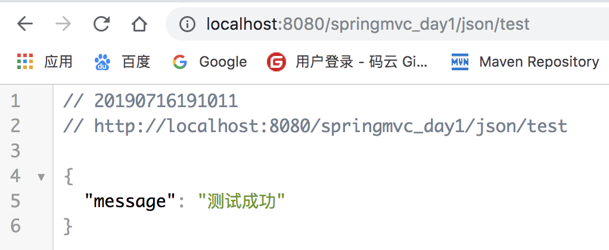

# SpringMVC_day2

## 1.文件上传

> `文件上传`: 指的就是将用户本地计算机中文件上传到服务器上的过程称之为文件上传

### 1).文件上传编程步骤

```markdown
# 1.项目中引入相关依赖
```

```xml
 		<dependency>
      <groupId>commons-fileupload</groupId>
      <artifactId>commons-fileupload</artifactId>
      <version>1.3</version>
    </dependency>
```

```markdown
# 2.开发页面
```

```html
		<h1>文件上传</h1>
    <form action="${pageContext.request.contextPath}/file/upload" method="post" enctype="multipart/form-data">
        <input type="file" name="aaa"/>
        <input type="submit" value="上传文件"/>
    </form>
```

> `注意:`
>
> ​			`1. form表单提交方式必须为post`
>
> ​			`2.form表单的enctype属性必须为multipart/form-data`

```markdown
# 3.开发控制器
```

```java
@RequestMapping("upload")
public String upload(MultipartFile aaa, HttpServletRequest request) throws IOException {
  //获取上传路径
  String realPath = request.getSession().getServletContext().getRealPath("/upload");
  //获取文件原始名称
  String originalFilename = aaa.getOriginalFilename();
  System.out.println("文件名: "+originalFilename);
  //上传文件到服务器
  aaa.transferTo(new File(realPath,originalFilename));
  return "index";
}
```

```markdown
# 4.配置文件上传解析器
```

```xml
<bean id="multipartResolver" class="org.springframework.web.multipart.commons.CommonsMultipartResolver">
  <!--控制文件上传大小单位字节 默认没有大小限制 这里是2-->
  <property name="maxUploadSize" value="2097152"/>
</bean>
```

> `注意:使用springmvc中multipartfile接收客户端上传的文件必须配置文件上传解析器且解析的id必须为multipartResolver`

-------

## 2.文件下载

> ​	<u>文件下载</u>:`将服务器上的文件下载到当前用户访问的计算机的过程称之为文件下载`

### 1).文件下载编程思路

```markdown
# 1.项目中准备下载目录并存在下载的相关文件
```


```markdown
# 2.开发下载控制器
```

```java
 /**
     * 测试文件下载
     * @param fileName 要下载文件名
     * @return
     */
    @RequestMapping("download")
    public String download(String fileName, HttpServletRequest request, HttpServletResponse response) throws IOException {
        //获取下载服务器上文件的绝对路径
        String realPath = request.getSession().getServletContext().getRealPath("/down");
        //根据文件名获取服务上指定文件
        FileInputStream is = new FileInputStream(new File(realPath, fileName));
        //获取响应对象设置响应头信息
        response.setHeader("content-disposition","attachment;fileName="+ URLEncoder.encode(fileName,"UTF-8"));
        ServletOutputStream os = response.getOutputStream();
        IOUtils.copy(is,os);
        IOUtils.closeQuietly(is);
        IOUtils.closeQuietly(os);
        return null;
    }
```

> `注意:下载时必须设置响应的头信息,指定文件以何种方式保存,另外下载文件的控制器不能存在返回值,代表响应只用来下载文件信息`

```markdown
# 3.开发页面
```

```html
<h1>文件下载</h1>
<a href="${pageContext.request.contextPath}/file/download?fileName=init.txt">init.txt</a>
```

------

## 3.@ResponseBody注解使用

> ​	`@ResponseBody`: `为了进一步方便控制器与ajax集成,springmvc提供@responseBody该注解用在方法的返回值上,代表可以将方法的返回值转换为json格式字符串并响应到前台,省去了通过第三方工具转换json的过程`

### 1). 引入相关依赖

```xml
<dependency>
  <groupId>com.fasterxml.jackson.core</groupId>
  <artifactId>jackson-databind</artifactId>
  <version>2.9.0</version>
</dependency>
```

### 2).开发控制器

```java
@Controller
@RequestMapping("json")
public class JsonController {
  
    @RequestMapping("test")
    @ResponseBody
    public Map<String,String> test(){
        HashMap<String,String> map = new HashMap<>();
        map.put("message","测试成功");
        return map;
    }
}

```

### 3).访问测试

> /http://localhost:8989/springmvc_day2/json/test/



-----

## 4.SpringMVC中拦截器

### 1.作用

> `作用:类似于javaweb中的Filter,用来对请求进行拦截,可以将多个Controller中执行的共同代码放入拦截器中执行,减少Controller类中代码的冗余.`

### 2.特点

> * 拦截器器只能拦截Controller的请求,不能拦截jsp
>
> * 拦截器可中断用户的请求轨迹
>
> + 请求先经过拦截器,之后之后还会经过拦截器

### 3.开发拦截器

```java
//自定义拦截器
public class MyInterceptor implements HandlerInterceptor {
    //请求最先经过的方法 返回为true放行请求  返回为false中断请求
    @Override
    public boolean preHandle(HttpServletRequest httpServletRequest, HttpServletResponse httpServletResponse, Object o) throws Exception {
        System.out.println("1");
        return true;
    }
		//控制器方法执行完成之后进入这个方法执行
    @Override
    public void postHandle(HttpServletRequest httpServletRequest, HttpServletResponse httpServletResponse, Object o, ModelAndView modelAndView) throws Exception {
        System.out.println("3");
    }
		//最后执行的方法
    @Override
    public void afterCompletion(HttpServletRequest httpServletRequest, HttpServletResponse httpServletResponse, Object o, Exception e) throws Exception {
        System.out.println("4");
    }
}
```

### 4.配置拦截器

```xml
<!--配置拦截器-->
    <mvc:interceptors>
        <mvc:interceptor>
            <mvc:mapping path="/json/*"/>
            <mvc:exclude-mapping path="/json/test1"/>
            <ref bean="myInterceptor"/>
        </mvc:interceptor>
    </mvc:interceptors>
```

> `/*``: 代表拦截所有请求路径`

-----

## 5.SpringMVC全局异常处理

### 1.作用

> ​	`当控制器中某个方法在运行过程中突然发生运行时异常时,为了增加用户体验对于用户不能出现500错误代码,应该给用户良好展示错误界面,全局异常处理就能更好解决这个问题`

### 2.全局异常处理开发

```java
public class CustomerHanlderExceptionResolver implements HandlerExceptionResolver {
    @Override
    public ModelAndView resolveException(HttpServletRequest httpServletRequest, HttpServletResponse httpServletResponse, Object o, Exception e) {
        ModelAndView modelAndView = new ModelAndView();
        modelAndView.setViewName("500");//跳转到500页面
        return modelAndView;
    }
}
```

### 3.配置全局异常处理

```xml
<!--配置全局异常处理 -->
<bean class="com.baizhi.globalexception.CustomerHanlderExceptionResolver"></bean>
```

----

