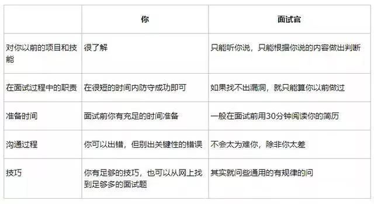
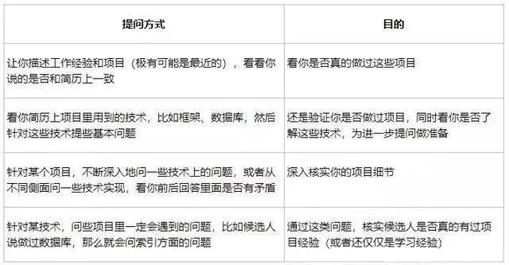
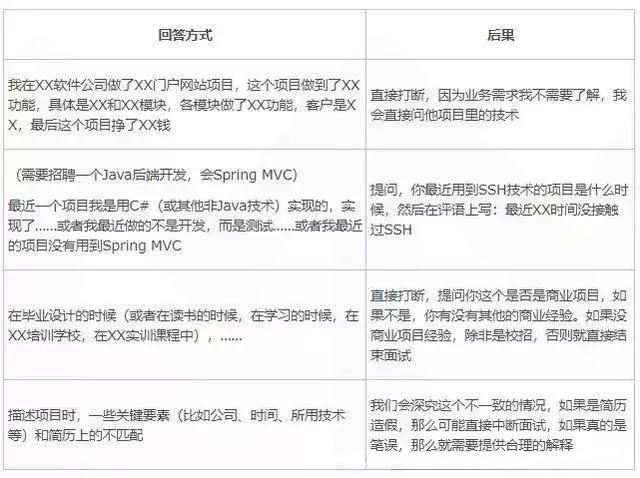
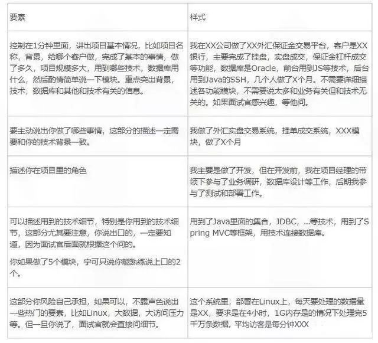
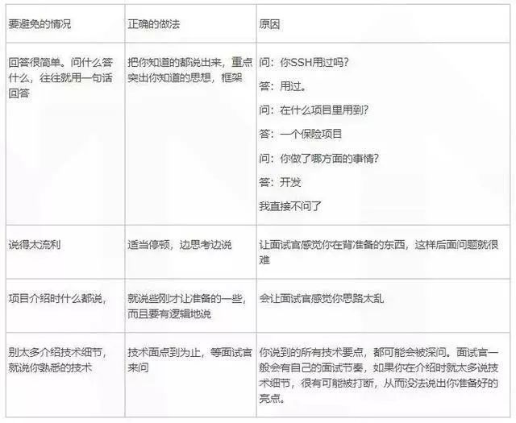
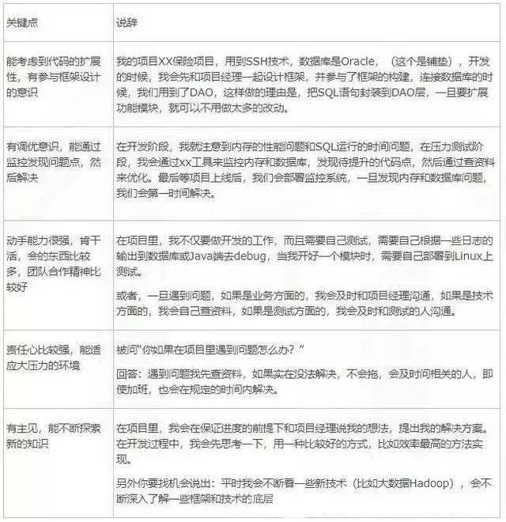
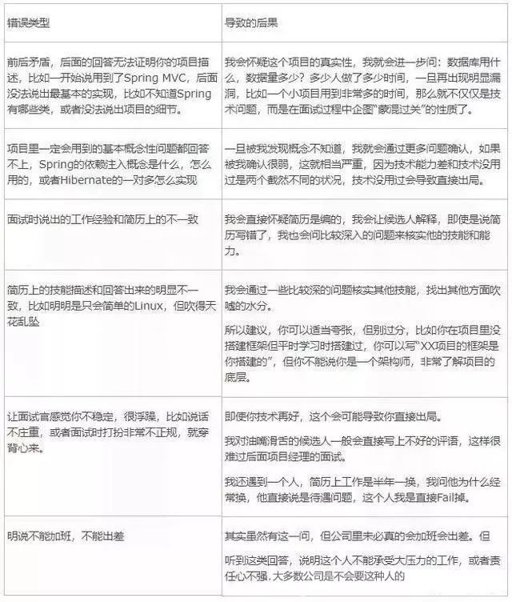

# 项目描述

在面试时，经过寒暄后，一般面试官会让你介绍项目经验。常见的问法是：“说下你最近的（或最拿得出手的）一个项目”。

可能不少程序员对此没准备，说起来磕磕巴巴，甚至有人说出项目经验从时间段或技术等方面和简历上的不匹配，这样就会造成如下的后果：

**第一印象就不好了，至少会感觉该候选人表述能力不强。**

一般来说，面试官会根据程序员介绍的项目背景来提问题。假设面试时会问10个问题，那么至少有5个问题会根据程序员所介绍的项目背景来问，程序员如果没说好，那么就没法很好地引导后继问题了，就相当于把提问权完全交给面试官了。

面试时7份靠能力，3份靠技能。而刚开始时的介绍项目又是技能中的重中之重，**所以下面将从“介绍”和“引导”两大层面告诉大家如何准备面试时的项目介绍。**

1 

在面试前准备项目描述，别害怕，因为面试官什么都不知道

面试官是人，不是神，拿到你的简历的时候，是没法核实你的项目细节的（有些公司会到录用后，用背景调查的方式来核实）。

更何况，你做的项目是以月为单位算的，而面试官最多用30分钟来从你的简历上了解你的项目经验，所以你对项目的熟悉程度要远远超过面试官，所以你一点也不用紧张。如果你的工作经验比面试官还丰富的话，甚至还可以控制整个面试流程。

既然面试官无法了解你的底细，那么他们怎么来验证你的项目经验和技术？下面总结了一些常用的提问方式。

2 

准备项目的各种细节，一旦被问倒了，就说明你没做过

一般来说，在面试前，大家应当准备项目描述的说辞，**自信些，因为这部分你说了算，流利些，因为你经过充分准备后，可以知道你要说些什么。**而且这些是你实际的项目经验，那么一旦让面试官感觉你都说不上来，那么可信度就很低了。

不少人是拘泥于“项目里做了什么业务，以及代码实现的细节”，这就相当于把后继提问权直接交给面试官。下表列出了一些不好的回答方式。

在避免上述不好的回答的同时，大家可以按下表所给出的要素准备项目介绍。如果可以，也请大家准备一下用英语描述。其实刚毕业的学生，或者工作经验较少的人，英语能力都差不多，但你说了，这就是质的进步。

> https://demo.51eduline.com/
>
> Eduline在线网校系统
> 项目介绍的要素:
> 控制在一分钟之内,讲出项目基本情况,比如项目名称背景,给哪个客户做完成了哪些基本功能,做了多久,规模多大,用到哪些技术,数据库用什么然后酌情简单说一下模块,重点突出背景、技术、数据库及其他和技术相关的信息
> 样板:
> **我在XX公司做了一个XX(Eduline在线网校系统)客户是XX公司,这个网校系统主要分为两个端:客户端(客户端又分为PC端和APP端)、机构端(机构端又分为平台和入驻机构)因为项目是前后端分离的,我主要负责后台部分的开发,当然也涉及到一些前端的内容，后台技术栈主要用的是SpringBoot+SpringCloud,数据库用的MySQL8的版本,PC客户端框架用的是Vuejs + Nuxt.js虽然没参与页面编写,但是基本代码能看懂并能进行数据访问和绑定,机构端管理系统用的是Vuejs + ElementUI编写的,机构端和平台端用的同一套系统,只是登录的用户不一样,展示的菜单有所不同,我们项目组有十几个人,目前开发了6个月左右的时间**(这里不需要详细描述各个功能模块,不需要说太多和业务有关但是和技术无关的,如果面试官感兴趣,自然会问你的)
>
> 面试官追问:
>
> 1.那么在项目中你承担的角色是什么呢?(或者你能描述一下你们项目中使用的技术栈吗)
>
> 当面试官问到这个的时候,说明面试官对你的项目还是很感兴趣的,这个时候你就要好好的发挥了,安哥在这里给你们列举几个点,希望你们能背下来
>
> 答：在项目开展前期,我和项目经理及相关技术人员一起进行了项目的构建以及数据库的设计,在后台框架方面,我们选择了开箱即用的SpringBoot作为web框架，ORM使用现在主流的MyBatis,然后为了提升开发效率,我们这边还融入了MyBatis-Plus，考虑到项目比较大,我们对项目大模块进行了拆分,使用SpringCloud构建成一个个的微服务,这样我们开发人员只需要关注自己对应的模块,分工合作,同时考虑到SpringCloud中的一些组件已经进入了维护阶段,所以这边将Eureka服务注册中心替换成了Alibaba的Nacos作为注册中心和配置中心,Zuul网关替换成了Gateway,项目开发中期,我充当一个开发者的角色,先通过编写后台API接口,暴露接口地址,然后还需要在平台端通过Axios请求后台接口对数据进行绑定,在这个过程中,不仅仅熟练了掌握了API接口的编写,对前端Vue及前端Element有了更深层次的了解
>
> 2.请描述一下你在项目中的职责?
>
> 答：一、我在项目中主要负责后台API接口的编写,PC端和APP端复用的同一套API接口（后台能力）
>
> 二、通过调用自己编写的API接口，绑定平台端管理系统的数据并进行展示（前端能力）
>
> 三、写代码多多少少会有些Bug,所有这边也会使用Juint进行单元测试,会对一些特定模块使用Jemeter，LoadRunner进行压力测试，进行了解程序的并发量和吞吐量，Postman进行接口测试（测试能力）
>
> 四、在开发环境下写的代码未必能在生产环境完美运行的，所有这边在写完自己的功能之后我会将项目部署到公司提供的云服务器上进行测试,所以也熟练的掌握了Linux及一些服务器应用的知识（运维能力）
>
> 3.你在项目中负责的模块
>
> 答：我在项目中主要负责用户模块、权限模块、课程模块、视频点播等
>
> 在用户模块中，我主要负责用户的注册、登录、认证和授权。注册又分为三种，一个是用户注册，一个是机构/讲师入驻的注册，如果是机构入驻那就需要提供营业执照,对公账号等等,个人入驻仅仅只需要提供身份证明等信息...
>
> 用户注册仅仅只能观看视频和购买视频不会分配后台管理账号
>
> 但是机构/个人入驻的话是可以发布课程，管理课程，可以赚钱的
>
> 注册的流程：如果是个人注册,那你可以通过微信、QQ、微博等进行一个授权登录等方式在数据库中创建账号，也可以通过手机号进行注册
>
> 一、如果是讲师/个人入驻的话流程就不一样：如果是已经入驻过的，那会展示你已经入驻过我们平台,显示一个超链接去登录
>
> 二、如果没有入驻，那就是先进入欢迎界面并且知道入驻,点下一步的时候填写相关的注册信息(对公账号，邮箱，名称，logo，营业执照...)
>
> 三、提交了资料但是被驳回的，这边直接跳转到填写信息的界面,首次展示会出现驳回原因,需要进行再次提交
>
> 四、提交了资料，但是后台还没审核的时候，再次进入入驻会出现入驻审核等待的界面
>
> 五、普通用户注册是不需要后台审核的,只有机构/讲师入驻的时候平台需要在后台进行审核，审核又分为拒绝、驳回、通过
>
> 登录:登录又分为三种，普通用户登录、平台登录、机构登录(入驻的机构和讲师)
>
> 这里涉及到权限
>
> 你在项目中做过什么优化吗?
>
> 1.之前使用for  jdkfoeach
>
> 2.前面写的都是一些子查询   改成连表查询
>
> 3.微服务项目跑起来比较耗时，调整了JVM参数  新生代 老年代

面试前，一定要准备，一定要有自信，但也要避免如下的一些情况：

3 

不露痕迹地说出面试官爱听的话

在项目介绍的时候（当然包括后继的面试），面试官其实很想要听一些关键点，只要你说出来，而且回答相关问题比较好，这绝对是加分项。下面列些面试官爱听的关键点和对应的说辞。

4 

一定要主动，面试官没有义务挖掘你的亮点

作为面试者，应当主动说出自己的亮点和优势，而不是等着问，但请注意，说的时候要有技巧，找机会说，通常是找一些开放性的问题说。

**比如：**在这个项目里用到了什么技术？你除了说一些基本的技术，比如Spring MVC，Hibernate，还有数据库方面的常规技术时，还得说，用到了Java内存管理，这样能减少对虚拟机内存的压力，或者说用到了大数据处理技术等。

也就是说，得找一切机会说出你拿得出手的而且当前也非常热门的技术。

**或者找个相关的问题做扩展性说明，比如被问到：**你有没有用到过一对多和多对多？你除了说基本知识点以外，还可以说，一般我还会根据需求适当地设置cascade和inverse关键字，随后通过一个实际的案例来说明合理设计对你项目的帮助，这样就能延伸性地说明你的技能了。相反如果你不说，面试官一定会认为你只会简单的一对一和一对多操作。

面试的时候，如果程序员回答问题很简单，有一说一，不会扩展，或者用非常吝啬的语句来回答问题，有些面试官一般会给机会让他们深入讲述（但不能保证每个面试官都会深入提问），如果回答再简洁，那么也会很吝啬地给出好的评语。

记住：面试官不是你的亲戚，面试官很忙，能挖掘出你的亮点的面试官很少，而说出你的亮点是你的义务。

一位面试官在面试程序员过程中，根据不同的情况一般会给出如下的评语：

A 

回答很简答，但回答里能证明出他对框架等技术确实是做过，我会在评语里些“对框架了解一般，不知道一些深层次的知识”，同时会加一句“表达能力很一般，沟通能力不强”，这样即使他通过技术面试，后面的面试他也会很吃力。

B 

回答很简单，通过回答我没法验证他是在项目里做过这个技术，还是仅仅在平时学习中学过这个技术。我就会写“在简历中说用过XX技术，但对某些细节说不上来，没法看出在项目里用到这个技术”，如果这个技术是职务必需点，那么他通过面试的可能性就非常小。

C 

回答很简单，而且只通过嗯啊之类的虚词回答，经过提醒还这样，我会敷衍几句结束面试，直接写“技术很薄弱，没法通过面试”。

D 

虽然通过回答能很好地展示自己的技能，但逻辑调理不清晰，那么我会让他通过技术面试，但会写上“技能很好，但表达能力一般（或有待提高），请后继面试经理斟酌”。这样通过后继综合面试的机会就一般了，毕竟综合面试会着重考察表达能力交往能力等非技术因素。

不管怎样，一旦回答简单，不主动说出你的擅长点，或没有条理很清楚地说出你的亮点，就算让你通过面试，也不会写上“框架细节了解比较深，数据库应用比较熟练”等之类的好评语，你即使通过技术和后面的综合面试，工资也是比较低的。

5 

一旦有低级错误，可能会直接出局

面试过程中有些方面你是绝对不能出错，所以你在准备过程中需要尤其注意如下的因素。下面列了些会导致你直接出局的错误回答。

6 

引导篇：准备些加分点，在介绍时有意提到，但别说全

在做项目介绍的时候，你可以穿插说出一些你的亮点，但请记得，不论在介绍项目还是在回答问题，你当前的职责不是说明亮点而是介绍项目，一旦你详细说，可能会让面试官感觉你跑题了。所以这时你可以一笔带过，比如你可以说，“我们的项目对数据要求比较大，忙的时候平均每小时要处理几十万条数据”，这样就可以把面试官引入“大数据”的方向。

你在面试前可以根据职位的需求，准备好这种“一笔带过”的话。比如这个职位的需求点是Spring MVC框架，大数据高并发，要有数据库调优经验，那么介绍以往项目时，你就最好突出这些方面你的实际技能。

再给大家举个例子，比如Java虚拟机内存管理和数据库优化是绝大多数项目都要遇到的两大问题，大家都可以在叙述项目经验时说，在这个项目里，我们需要考虑内存因素，因为我们的代码只允许在2G内存环境中运行，而且对数据库性能要求比较高，所以我们经常要监控优化内存和数据库里的SQL语句。这样当面试官深入提问时，就能抛出自己准备好的虚拟机内存优化和数据库优化方面的说辞。

实在不行，你也可以说“我除了做开发，也做了了解需求，测试和部署的工作，因为这个项目人手比较少，压力比较大”，这样你也能展示你有过独挡一面的经历。

**面试过程中，面试官一旦听到有亮点，就会等到他说好当前问题后，顺口去问，一般技术面试最多办半小时，你把时间用在回答准备好的问题点上的时候，被问其他问题的时间就会少了。**

7 

你可以引导，但不能自说自话

**面试时，事先准备很重要，但要注意别露出太明显的痕迹，切勿凭着有准备而太强势，毕竟面试是面试官主导的。**

个别程序员面试时说话太多，一般会主动扩展，比如问他数据库用什么，他不仅回答数据库是什么，自己做了什么，甚至顺便会把大数据处理技术都说出来。

其实过犹不及，面试官可能会重点考察你说的每个细节，一旦答不上来会很尴尬。

他如果仅仅说，数据量比较大，但点到为止，不继续说后面的话，面试官随着深入提问，他自然有机会表达。同时请注意，一般在面试过程中，一旦你亮出加分点，但面试官没接嘴，这个加分点可能就不是项目必备的，也不是他所关注的，当前你就可以别再说了，或者等到你提问题的时候再说。

8 

不是结尾的总结

到这里，我已经给出了介绍项目的一些技巧。两句话：

- 面试前一定要准备。
- 本文给出是的方法，不是教条，大家可以按本文给出的方向结合自己的项目背景做准备，而不是死记硬背本文给出的一些说辞。

当大家介绍好项目背景后，面试才刚刚开始，哪怕你说得再好，哪怕你把问题引导到你准备的范围里，这也得应付Java Web（比如Spring MVC，ORM等）、Java Core（多线程、集合、JDBC等）和数据库等方面的问题。