# MongoDB

## MongoDB入门

**1.什么是NoSQL**

Nosql的全称是Not Only Sql
这个概念早起就有人提出，而我们常用的都是关系型数据库。就像我们常用mysql,sqlserver一样，这些数据库一般用来存储重要信息，应对普通的业务是没有问题的。但是，随着互联网的高速发展，传统的关系型数据库在应付超大规模，超大流量以及高并发的时候力不从心。而就在这个时候，Nosql得到的告诉的发展。

**2.为什么要使用NoSQL**

**单机 MySQL 的美好时代**

在90年代，一个网站的访问量一般都不大，用单个数据库完全可以轻松应付。
在那个时候，更多的都是静态网页，动态交互类型的网站不多

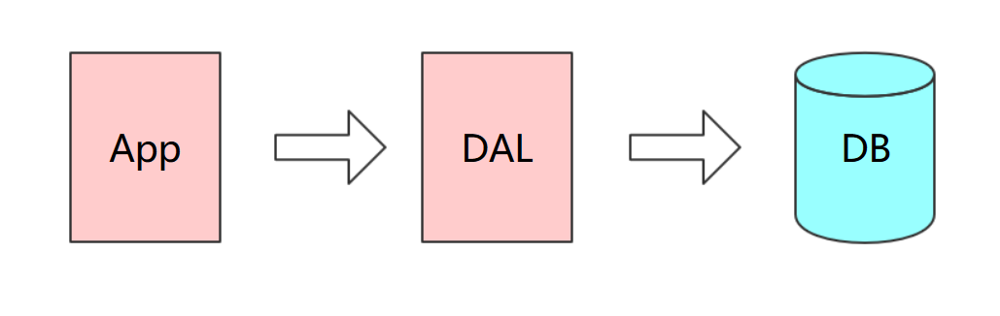

上述架构下，我们来看看数据存储的瓶颈是什么？

DAL : Data Access Layer（数据访问层 – Hibernate，MyBatis）

- 数据量的总大小一个机器放不下时
- 数据的索引（B+ Tree）一个机器的内存放不下时
- 访问量(读写混合)一个实例不能承受

如果满足了上述1 or 3个时，只能对数据库的整体架构进行重构。

**Memcached(缓存)+MySQL+垂直拆分**

后来，随着访问量的上升，几乎大部分使用MySQL架构的网站在数据库上都开始出现了性能问题，web程序不再仅仅专注在功能上，同时也在追求性能。程序员们开始大量的使用缓存技术来缓解数据库的压力，优化数据库的结构和索引。开始比较流行的是通过文件缓存来缓解数据库压力，但是当访问量继续增大的时候，多台web机器通过文件缓存不能共享，大量的小文件缓存也带了了比较高的IO压力。在这个时候，Memcached就自然的成为一个非常时尚的技术产品

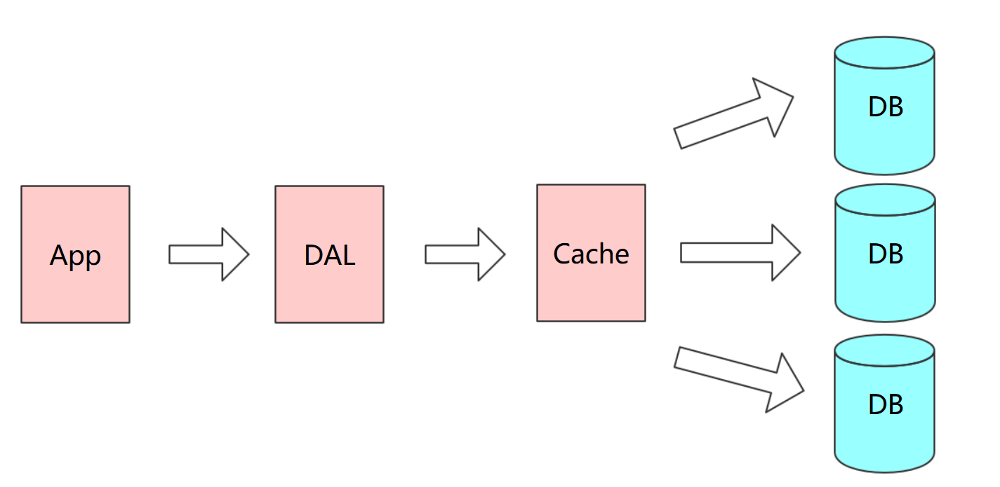

Memcached作为一个独立的分布式的缓存服务器，为多个web服务器提供了一个共享的高性能缓存服务，在Memcached服务器上，又发展了根据hash算法来进行多台Memcached缓存服务的扩展，然后又出现了一致性hash来解决增加或减少缓存服务器导致重新hash带来的大量缓存失效的弊端

**Mysql主从读写分离**

由于数据库的写入压力增加，Memcached只能缓解数据库的读取压力。读写集中在一个数据库上让数据库不堪重负，大部分网站开始使用主从复制技术来达到读写分离，以提高读写性能和读库的可扩展性。Mysql的master-slave模式成为这个时候的网站标配了

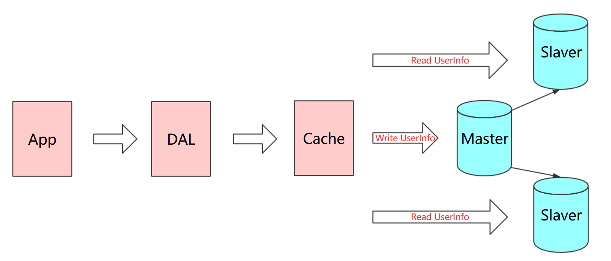

**分库分表+水平拆分+mysql集群**

在Memcached的高速缓存，MySQL的主从复制，读写分离的基础之上，这时MySQL主库的写压力开始出现瓶颈，而数据量的持续猛增，**由于MyISAM在写数据的时候会使用表锁，在高并发写数据的情况下会出现严重的锁问题，大量的高并发MySQL应用开始使用InnoDB引擎代替MyISAM**

> ps：这就是为什么 MySQL 在 5.6 版本之后使用 InnoDB 做为默认存储引擎的原因 – MyISAM 写会锁表，InnoDB 有行锁，发生冲突的几率低，并发性能高。

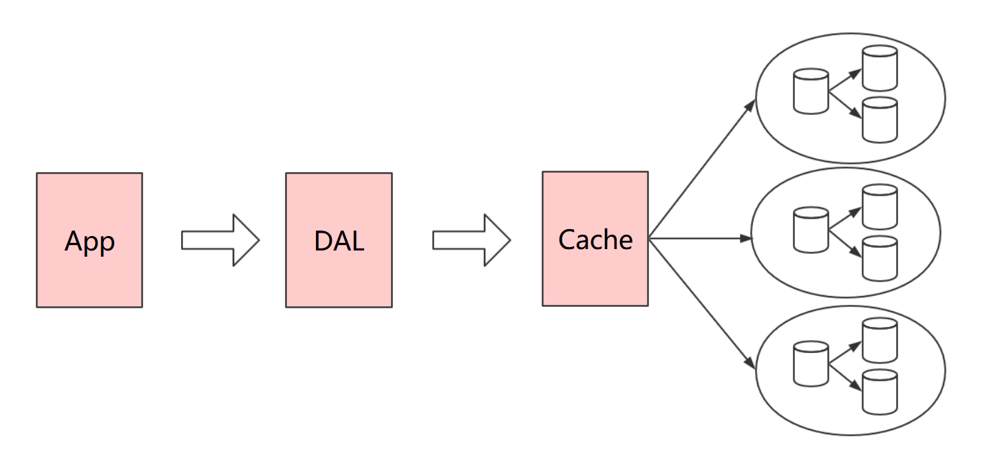

同时，开始流行使用分表分库来缓解写压力和数据增长的扩展问题。这个时候，分表分库成了一个热门技术，是面试的热门问题也是业界讨论的热门技术问题。也就在这个时候，MySQL推出了还不太稳定的表分区，这也给技术实力一般的公司带来了希望。虽然MySQL推出了MySQL Cluster集群，但性能也不能很好满足互联网的要求，只是在高可靠性上提供了非常大的保证

**MySQL的扩展性瓶颈**

MySQL数据库也经常存储一些大文本字段，导致数据库表非常的大，在做数据库恢复的时候就导致非常的慢，不容易快速恢复数据库。比如1000万4KB大小的文本就接近40GB的大小，如果能把这些数据从MySQL省去，MySQL将变得非常的小。关系数据库很强大，但是它并不能很好的应付所有的应用场景。MySQL的扩展性差（需要复杂的技术来实现），大数据下IO压力大，表结构更改困难，正是当前使用MySQL的开发人员面临的问题

**今天是什么样子**

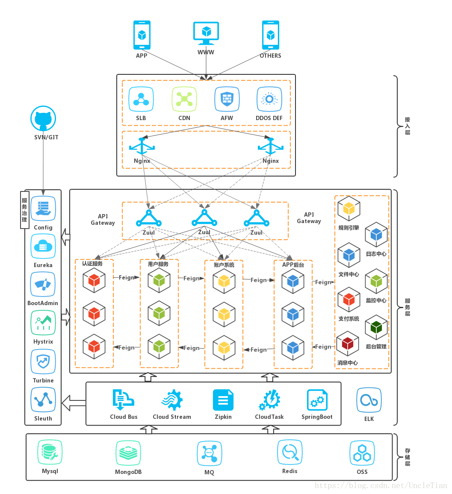

最前面的是企业级防火墙，后面通过负载均衡主机（软负载：Nginx，硬负载：F5）在 web 服务器集群之间进行调度，再由具体的 web 服务器（Tomcat）去访问缓存，访问数据库。

今天我们可以通过第三方平台（如：Google,Facebook等）可以很容易的访问和抓取数据。用户的个人信息，社交网络，地理位置，用户生成的数据和用户操作日志已经成倍的增加。我们如果要对这些用户数据进行挖掘，那SQL数据库已经不适合这些应用了, NoSQL数据库的发展也却能很好的处理这些大的数据

**3.NoSQL代表**

MongDB、 Redis、Memcache、ES

**4.关系型数据库与NoSQL的区别**

**RDBMS(关系型数据库)**

- 高度组织化结构化数据
- 结构化查询语言（SQL）
- 数据和关系都存储在单独的表中。
- 数据操纵语言，数据定义语言
- 严格的一致性
- 基础事务
- ACID

**关系型数据库遵循ACID规则**

事务在英文中是transaction，和现实世界中的交易很类似，它有如下四个特性：

    A (Atomicity) 原子性
    原子性很容易理解，也就是说事务里的所有操作要么全部做完，要么都不做，事务成功的条件是事务里的所有操作都成功，只要有一个操作失败，整个事务就失败，需要回滚。比如银行转账，从A账户转100元至B账户，分为两个步骤：1）从A账户取100元；2）存入100元至B账户。这两步要么一起完成，要么一起不完成，如果只完成第一步，第二步失败，钱会莫名其妙少了100元。
    
    C (Consistency) 一致性
    一致性也比较容易理解，也就是说数据库要一直处于一致的状态，事务的运行不会改变数据库原本的一致性约束。
    
    I (Isolation) 独立性
    所谓的独立性是指并发的事务之间不会互相影响，如果一个事务要访问的数据正在被另外一个事务修改，只要另外一个事务未提交，它所访问的数据就不受未提交事务的影响。比如现有有个交易是从A账户转100元至B账户，在这个交易还未完成的情况下，如果此时B查询自己的账户，是看不到新增加的100元的
    
    D (Durability) 持久性
    持久性是指一旦事务提交后，它所做的修改将会永久的保存在数据库上，即使出现宕机也不会丢失。
**NoSQL(非关系型数据库)**

- 代表着不仅仅是SQL
- 没有声明性查询语言
- 没有预定义的模式
- 键 - 值对存储，列存储，文档存储，图形数据库
- 最终一致性，而非ACID属性
- 非结构化和不可预知的数据
- CAP定理
- 高性能，高可用性和可伸缩性

**分布式数据库中的CAP原理(了解)**

    CAP定理：
        Consistency(一致性), 数据一致更新，所有数据变动都是同步的
        Availability(可用性), 好的响应性能
        Partition tolerance(分区容错性) 可靠性
        P: 系统中任意信息的丢失或失败不会影响系统的继续运作。
定理：任何分布式系统只可同时满足二点，没法三者兼顾。

CAP理论的核心是：一个分布式系统不可能同时很好的满足一致性，可用性和分区容错性这三个需求，

因此，根据 CAP 原理将 NoSQL 数据库分成了满足 CA 原则、满足 CP 原则和满足 AP 原则三 大类：

    CA - 单点集群，满足一致性，可用性的系统，通常在可扩展性上不太强大。
    CP - 满足一致性，分区容忍性的系统，通常性能不是特别高。
    AP - 满足可用性，分区容忍性的系统，通常可能对一致性要求低一些。

**CAP理论就是说在分布式存储系统中，最多只能实现上面的两点。**

**而由于当前的网络硬件肯定会出现延迟丢包等问题，所以分区容忍性是我们必须需要实现的。**

**所以我们只能在一致性和可用性之间进行权衡，没有NoSQL系统能同时保证这三点**

> 说明：C：强一致性 A：高可用性 P：分布式容忍性

举例：

CA：传统Oracle数据库

AP：大多数网站架构的选择

CP：Redis、Mongodb

**注意：分布式架构的时候必须做出取舍。**

**一致性和可用性之间取一个平衡。多余大多数web应用，其实并不需要强一致性。**

**因此牺牲C换取P，这是目前分布式数据库产品的方向。**


**5.数据库流行度排名**

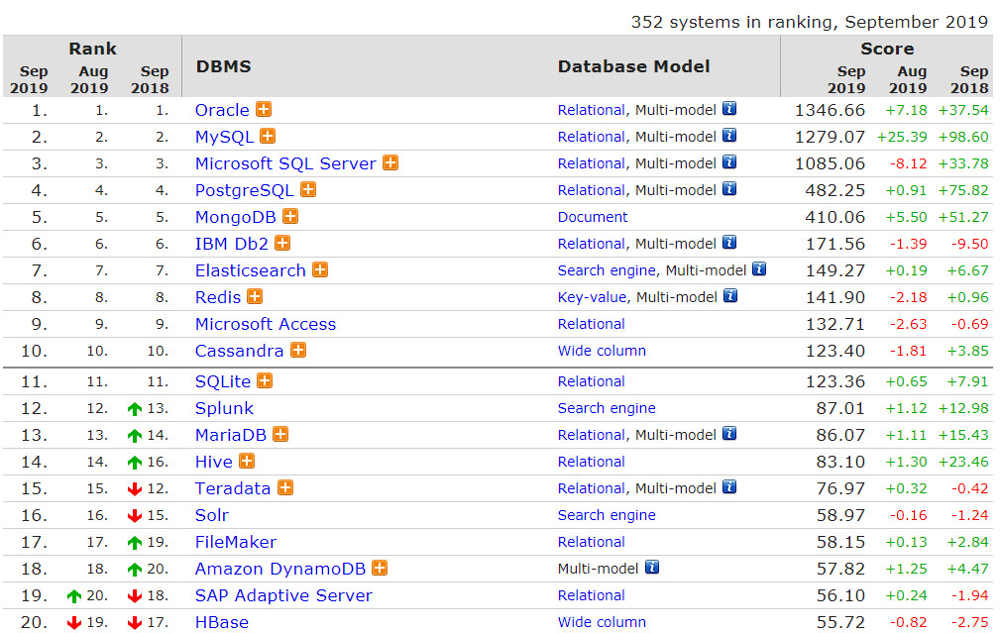


**6.国内哪些公司在使用MongoDB**


**7.什么是MongoDB**

MongoDB 是一个跨平台的，面向文档的数据库，是当前 NoSQL数据库产品中最热门的一种。**它介于关系数据库和非关系数据库之间，是非关系数据库当中功能最丰富，最像关系数据库的产品**。它支持的数据结构非常松散，是类似 JSON 的 BSON 格式，因此可以存储比较复杂的数据类型。 

MongoDB 的官方网站地址是：http://www.mongodb.org/

**8.MongoDB特点**

MongoDB 最大的特点是他支持的查询语言非常强大，其语法有点类似于面向对象 的查询语言，几乎可以实现类似关系数据库单表查询的绝大部分功能，而且还支持对数据建立索引。它是一个面向集合的,模式自由的文档型数据库。 

具体特点总结如下： 

- 面向集合存储，易于存储对象类型的数据 
- 模式自由 
- 支持动态查询 
- 支持完全索引，包含内部对象 
- 支持复制和故障恢复 
- 使用高效的二进制数据存储，包括大型对象（如视频等） 
- 自动处理碎片，以支持云计算层次的扩展性 
- 支持 Python，PHP，Ruby，Java，C，C#，Javascript，Perl 及 C++语言的驱动程 序，社区中也提供了对 Erlang 及.NET 等平台的驱动程序 
- 文件存储格式为 BSON（一种 JSON 的扩展）

**9.MongoDB体系结构** 

MongoDB 的逻辑结构是一种层次结构。主要由： 文档(document)、集合(collection)、数据库(database)这三部分组成的。逻辑结构是面 向用户的，用户使用 MongoDB 开发应用程序使用的就是逻辑结构。 

1. MongoDB 的文档（document），相当于关系数据库中的一行记录。 
2. 多个文档组成一个集合（collection），相当于关系数据库的表。
3. 多个集合（collection），逻辑上组织在一起，就是数据库（database）。 
4. 一个 MongoDB 实例支持多个数据库（database）。 文档(document)、集合(collection)、数据库(database)


**数据库中的对应关系，及存储形式的说明**


**10.数据类型**

- 基本数据类型 
- null：用于表示空值或者不存在的字段，{“x”:null} 
- 布尔型：布尔类型有两个值true和false，{“x”:true} 
- 数值：shell默认使用64为浮点型数值。{“x”：3.14}或{“x”：3}。对于整型值，可以使用 
- NumberInt（4字节符号整数）或NumberLong（8字节符号整数）， {“x”:NumberInt(“3”)}{“x”:NumberLong(“3”)} 
- 字符串：UTF-8字符串都可以表示为字符串类型的数据，{“x”：“呵呵”} 
- 日期：日期被存储为自新纪元依赖经过的毫秒数，不存储时区，{“x”:new Date()}
- 正则表达式：查询时，使用正则表达式作为限定条件，语法与JavaScript的正则表达式相同，{“x”:/[abc]/} 
- 数组：数据列表或数据集可以表示为数组，{“x”： [“a“，“b”,”c”]} 
- 内嵌文档：文档可以嵌套其他文档，被嵌套的文档作为值来处理，{“x”:{“y”:3 }} 
- 对象Id：对象id是一个12字节的字符串，是文档的唯一标识，{“x”: objectId() } 
- 二进制数据：二进制数据是一个任意字节的字符串。它不能直接在shell中使用。如果要将非utf-字符保存到数据库中，二进制数据是唯一的方式。 
- 代码：查询和文档中可以包括任何JavaScript代码，{“x”:function(){/…/}} 

**11.Mongodb的优点与不足**

（1）Mongodb的不足之处

    在集群分片中的数据分布不均匀
    单机可靠性比较差
    大数据量持续插入，写入性能有较大波动
    磁盘空间占用比较大

（2）Mongodb的过人之处

    无模式
    查询与索引方式灵活，是最像SQL的Nosql
    支持复制集、主备、互为主备、自动分片等特性

**12.MongoDB 的应用场景和不适用场景**

1.适用场景

对于MongoDB实际应用来讲，是否使用MongoDB需要根据项目的特定特点进行甄别，这就需要我们对MongoDB适用和不适用的场景有一定的了解。

根据MongoDB 官网的说明，MongoDB 的适用场景如下:

```tex
网站实时数据：mongoDB非常适合实时的插入，更新与查询，并具备网站实时数据存储所需的复制及高度伸缩性。
数据缓存:由于性能很高，MongoDB 也适合作为信息基础设施的缓存层。在系统重启之后，由MongoDB搭建的持久化缓存层可以避免下层的数据源过载。
大尺寸、低价值数据存储:使用传统的关系型数据库存储一些数据时可能会比较昂贵，在此之前，很多时候程序员往往会选择传统的文件进行存储。
高伸缩性场景:MongoDB 非常适合由数十或数百台服务器组成的数据库。MongoDB 的路线图中已经包含对MapReduce引擎的内置支持。
对象或JSON数据存储:MongoDB 的BSON 数据格式非常适合文档化格式的存储及查询。
```

2.不适合场景

```tex
高度事务性系统:例如银行或会计系统。传统的关系型数据库目前还是更适用于需要大量原子性复杂事务的应用程序。
传统的商业智能应用:针对特定问题的BI 数据库会对产生高度优化的查询方式。对于此类应用，数据仓库可能是更合适的选择。
需要复杂SQL查询的问题。
```

相信通过上面的说明，你已经大致了解了MongoDB 的使用规则，需要说明一点的是，MongoDB 不仅仅
是数据库，更多的使用是将MongoDB 作为一个数据库中间件在实际应用中合理划分使用细节，这一点对
于MongoDB 应用来讲至关重要！

## MongoDB的安装

1.环境说明

```tex
系统环境:Centos7.0
远程连接工具:xshell6.0
软件及版本：mongodb-linux-x86_64-3.6.3.tgz
```

2.下载安装MongoDB

```shell
#进入官网:https://www.mongodb.com/   https://www.mongodb.com/download-center/enterprise
#https://www.mongodb.com/download-center/community?jmp=nav
wget https://fastdl.mongodb.org/linux/mongodb-linux-x86_64-rhel70-3.6.5.tgz

#在usr/local/文件夹下创建mongodb文件夹
mkdir mongodb

#将mongodb-linux-x86_64-3.6.5下的文件移动到mongodb文件夹下
mv mongodb-linux-x86_64-3.6.5/* /usr/local/mongodb/

#进入mongodb
cd mongodb

#新建data文件夹和logs文件
mkdir data
touch /usr/local/mongodb/logs

#进入/usr/local/mongodb/bin目录下，启动mongodb服务
./mongod --dbpath=/usr/local/mongodb/data --logpath=/usr/local/mongodb/logs --logappend  --port=27017 --fork

#启动客户端，进入/usr/local/mongodb/bin目录下
./mongo
```

## MongoDB的语法

**1、查看所有数据库：**

```sh
show dbs
```

**2、查看当前所在数据库：**

```sh
db
```

**3、查看当前所在数据库中所有集合：**

```sh
show collections
```

**4、查看当前数据库相关信息（名称、文档个数、视图、索引、大小等）：**

```sh
db.stats()
```

**5、创建、打开、切换 数据库：**

```sh
use 数据库名字
 
如：use student
```

注：use 这个命令很特殊，它具有打开、 切换、 创建数据库的功能：如果打开的这个数据库存在就是打开这个数据库。如果打开的是一个不存在的数据库，那么就会创建一个同名的数据库，但是：注意：既然是创建一个新的数据库，那么就必须向数据库中新增一个集合(collections【就像关系数据库中的表】)，并且插入一条数据（这样这个数据库才算创建成功）。

如：往集合中插入一条数据。可以不用先创建集合，直接往里添加数据即可：

```sh
db.student.insert({"name": "ange"});

db.student.insert({_id:"1",content:"我还是没有想明白到底为啥出错",userid:"1012",name:"ange",visits:NumberInt(2020)}); 
db.student.insert({_id:"2",content:"加班到半夜",userid:"1013",name:"rock",visits:NumberInt(1023)}); 
db.student.insert({_id:"3",content:"手机流量超了咋办？",userid:"1013",name:"pika",visits:NumberInt(111)}); 
db.student.insert({_id:"4",content:"坚持就是胜利",userid:"1014",name:"tiger",visits:NumberInt(1223)}); 
```

当命令执行后，数据库系统发现student是一个数据集合不存的，就自动创建一个集合，并随着数据的插入，数据库和集合也就真正的创建成功了。

**6、删除数据库（注：这里是删除当前所在的数据库）**

```sh
db.dropDatabase();
```

**7、清屏（这是Dos的命令，当窗口中的内容太多时，可以使用该命令，清除屏幕内容，保持界面清晰）：**

```sh
cls
```

**8、导入数据**

当要插入的数据太多时，一条一条的insert在繁琐了。所以，我们可以在代码编辑器中以JSON格式编辑好要插入的数据，以.json文件格式保存，然后导入数据库：

下面就是将mydata.json文件，导入到test数据库的student集合中。

```sh
mongoimport --db test --collection student --drop --file mydata.json
```

**mongoimport 导入命令**

**--db test  要导入的数据库**

**--collection student  要哪个集合中导入**

**--drop 导入前先把集合清空**

**--file mydata.json  要导入的那个文件**

**先创建好一个json文件，然后用mongoimport命令导入，这样比敲命令行代码要好很多（当然，在真正项目中，一般都是有用户界面，让用户自己输入的）**

**9、操作帮助命令（列出MongoDB数据库所有的操作方法）**

```sh
db.help()
```

```sh
DB methods:
db.adminCommand(nameOrDocument) - switches to 'admin' db, and runs command [just calls db.runCommand(...)]
db.aggregate([pipeline], {options}) - performs a collectionless aggregation on this database; returns a cursor
db.auth(username, password)
db.cloneDatabase(fromhost)
db.commandHelp(name) returns the help for the command
db.copyDatabase(fromdb, todb, fromhost)
db.createCollection(name, {size: ..., capped: ..., max: ...})
db.createView(name, viewOn, [{$operator: {...}}, ...], {viewOptions})
db.createUser(userDocument)
db.currentOp() displays currently executing operations in the db
db.dropDatabase()
db.eval() - deprecated
db.fsyncLock() flush data to disk and lock server for backups
db.fsyncUnlock() unlocks server following a db.fsyncLock()
db.getCollection(cname) same as db['cname'] or db.cname
db.getCollectionInfos([filter]) - returns a list that contains the names and options of the db's collections
db.getCollectionNames()
db.getLastError() - just returns the err msg string
db.getLastErrorObj() - return full status object
db.getLogComponents()
db.getMongo() get the server connection object
db.getMongo().setSlaveOk() allow queries on a replication slave server
db.getName()
db.getPrevError()
db.getProfilingLevel() - deprecated
db.getProfilingStatus() - returns if profiling is on and slow threshold
db.getReplicationInfo()
db.getSiblingDB(name) get the db at the same server as this one
db.getWriteConcern() - returns the write concern used for any operations on this db, inherited from server object if set
db.hostInfo() get details about the server's host
db.isMaster() check replica primary status
db.killOp(opid) kills the current operation in the db
db.listCommands() lists all the db commands
db.loadServerScripts() loads all the scripts in db.system.js
db.logout()
db.printCollectionStats()
db.printReplicationInfo()
db.printShardingStatus()
db.printSlaveReplicationInfo()
db.dropUser(username)
db.repairDatabase()
db.resetError()
db.runCommand(cmdObj) run a database command.  if cmdObj is a string, turns it into {cmdObj: 1}
db.serverStatus()
db.setLogLevel(level,<component>)
db.setProfilingLevel(level,slowms) 0=off 1=slow 2=all
db.setWriteConcern(<write concern doc>) - sets the write concern for writes to the db
db.unsetWriteConcern(<write concern doc>) - unsets the write concern for writes to the db
db.setVerboseShell(flag) display extra information in shell output
db.shutdownServer()
db.stats()
db.version() current version of the server
```

**MongoDB数据的操作：（和关系型数据库一样，就是增、删、查、改）**

 **1、插入数据:insert()**

插入数据(这里以student集合【表】为例)

```sh
db.student.insert({"name": "ange", "age": 26, "sex": "男", job: "teacher"});
```

```te
#删除users中的所有数据
db.users.drop();
var user1 = {
        "username" : "王昭君",
        "country" : "china",
        "address" : {
                "aCode" : "411000",
                "add" : "长沙"
        },
        "favorites" : {
                "movies" : ["杀破狼2","战狼","雷神1"],
                "cites" : ["长沙","深圳","上海"]
        },
        "age" : 18,
	   "salary":NumberDecimal("18889.09"),
       "lenght" :1.79
	    
};
var user2 = {
        "username" : "威尔史密斯",
        "country" : "English",
        "address" : {
                "aCode" : "311000",
                "add" : "地址"
        },
        "favorites" : {
                "movies" : ["复仇者联盟","战狼","雷神1"],
                "cites" : ["西安","东京","上海"]
        },
        "age" : 24,
       "salary":NumberDecimal("7889.09"),
       "lenght" :1.35
};
var user3 ={
        "username" : "吴亦凡",
        "country" : "japan",
        "address" : {
                "aCode" : "411000",
                "add" : "长沙"
        },
        "favorites" : {
                "movies" : ["肉蒲团","一路向西","倩女幽魂"],
                "cites" : ["东莞","深圳","东京"]
        },
        "age" : 22,
       "salary":NumberDecimal("6666.66"),
       "lenght" :1.85
};
var user4 =
{
        "username" : "slina",
        "country" : "USA",
        "address" : {
                "aCode" : "411000",
                "add" : "长沙"
        },
        "favorites" : {
                "movies" : ["蜘蛛侠","钢铁侠","蝙蝠侠"],
                "cites" : ["青岛","东莞","上海"]
        },
        "age" : 20,
       "salary":NumberDecimal("6398.22"),
       "lenght" :1.77
};

var user5 =
{
        "username" : "森瑶",
        "country" : "UK",
        "address" : {
                "aCode" : "411000",
                "add" : "TEST"
        },
        "favorites" : {
                "movies" : ["蜘蛛侠","钢铁侠","蝙蝠侠"],
                "cites" : ["青岛","东莞","上海"]
        },
       "salary":NumberDecimal("1969.88")
};

db.users.insert(user1);
db.users.insert(user2);
db.users.insert(user3);
db.users.insert(user4);
db.users.insert(user5);

db.users.find().pretty();

查询喜欢的城市包含东莞和东京的user
select * from users  where favorites.cites has "东莞"、"东京“
db.users.find({ "favorites.cites" : { "$all" : [ "东莞" , "东京"]}})

只要包含东莞和东京的都会被查询出来
db.users.find({ "favorites.cites" : { "$in" : [ "东莞" , "东京"]}})

查询国籍为英国或者美国，名字中包含s的user
select * from users  where username like '%s%' and (country= English or country= USA)
db.users.find({ "$and" : [ { "username" : { "$regex" : ".*s.*"}} , { "$or" : [ { "country" : "English"} , { "country" : "USA"}]}]})
```

**2、查找数据find()**

查找数据，如果find()中没有参数，那么将列出这个集合的所有文档：

```sh
db.student.find()
 
//相当于下面关系数据库中的语法：
select * from test.student
```

精确匹配：

```sh
db.student.find({"name":"ange"});
```

多个条件：

```sh
db.student.find({"name":"ange" , "age":26})
```

大于条件：

```tex
db.集合名称.find({ "field" : { $gt: value }}) // 大于: field > value 
db.集合名称.find({ "field" : { $lt: value }}) // 小于: field < value 
db.集合名称.find({ "field" : { $gte: value }}) // 大于等于: field >= value 
db.集合名称.find({ "field" : { $lte: value }}) // 小于等于: field <= value 
db.集合名称.find({ "field" : { $ne: value }}) // 不等于: field != value 
```

```sh
db.student.find({"age":{$gt:20}});
```

小于条件:

```sh
db.student.find({"age":{$lt:20}});
```

包含与不包含

包含使用$in操作符。 

示例：查询学生集合中userid字段包含1013和1014的文档

```sh
db.student.find({userid:{$in:["1013","1014"]}})
```

不包含使用$nin操作符。 

示例：查询学生集合中userid字段不包含1013和1014的文档

```sh
db.student.find({userid:{$nin:["1013","1014"]}})
```

条件连接

我们如果需要查询同时满足两个以上条件，需要使用$and操作符将条件进行关联。（相当于SQL的and） 

格式为： 

```sh
$and:[ { },{ },{ } ]
db.student.find({$and:[ {visits:{$gte:1000}} ,{visits:{$lt:2000} }]})
```

如果两个以上条件之间是或者的关系，我们使用 操作符进行关联，与前面and的使用方式相同 

格式为：

```sh
$or:[ { },{ },{ } ]
db.student.find({$or:[ {userid:"1013"} ,{visits:{$lt:2000} }]})
```

寻找所有年龄是9岁，或者11岁的学生

```sh
db.student.find({$or:[{"age":9},{"age":11}]});
```

统计条数

```sh
db.student.count()
```

如果按条件统计 ，例如：统计userid为1013的记录条数

```sh
db.student.count({userid:"1013"})
```

模糊查询

MongoDB的模糊查询是通过正则表达式的方式实现的。格式为：

```sh
/模糊查询字符串/
```

例如，我要查询学生中内容包含“流量”的所有文档，代码如下：

```sh
db.student.find({content:/流量/})
```

如果要查询学生的内容中以“加班”开头的，代码如下：

```sh
db.student.find({content:/^加班/})
```

列值增长

如果我们想实现对某列值在原有值的基础上进行增加或减少，可以使用$inc运算符来实现

```sh
db.student.update({_id:"2"},{$inc:{visits:NumberInt(1)}} )
```

**3、修改数据:update()**

查找名字叫做ange的，把年龄更改为16岁：

```sh
db.student.update({"name":"ange"},{$set:{"age":16}});
```

查找成绩是70，把年龄更改为33岁：

```sh
db.student.update({"score":70},{$set:{"age":33}});
```

更改所有匹配项【默认情况下，update()方法是更新单个文档。 要更新多个文档，请使用开启update()方法中的multi选项】。

```sh
db.student.update({"sex":"男"},{$set:{"age":33}},{multi: true});
```

完整替换，不出现$set关键字了：

```sh
db.student.update({"name":"ange"},{"name":"rock","age":16});
```

**4、删除数据:remove()**

```sh
db.student.remove({"name":"ange"});
```

默认情况下，remove()方法将删除所有符合删除条件的文档。 使用开启justOne选项将删除操作限制为仅匹配文档之一。

```sh
db.student.remove({"name":"ange"}, {justOne: true});
```

## Java操作MongoDB

mongodb-driver是mongo官方推出的java连接mongoDB的驱动包，相当于JDBC驱动。 

我们通过一个入门的案例来了解mongodb-driver的基本使用

**查询全部记录**

* 创建工程 mongoDemo, 引入依赖 

  ```xml
  <dependencies>
      <dependency>
          <groupId>org.mongodb</groupId>
          <artifactId>mongodb-driver</artifactId>
          <version>3.8.2</version>
      </dependency>
  </dependencies>
  ```

* 创建测试类

  ```java
  /**
  * MongoDb入门小demo 
  */ 
  public class MongoDemo { 
      public static void main(String[] args) { 
          MongoClient client=new MongoClient("192.168.126.154");//创建连接
          MongoDatabase studentdb = client.getDatabase("studentdb");//打开数据库
          MongoCollection<Document> student = studentdb.getCollection("student");// 获取集合
          FindIterable<Document> documents = student.find();//查询记录获取文档集合
          for(Document document:documents){ //
              System.out.println("内容："+ document.getString("content"));
              System.out.println("用户ID:"+document.getString("userid"));
              System.out.println("浏览量："+document.getInteger("visits"));
          }
          client.close();//关闭连接 
      } 
  }
  
  //第二种方法
  MongoClient client=new MongoClient("192.168.126.154");//创建连接
  MongoDatabase spitdb = client.getDatabase("studentdb");//打开数据库
  MongoCollection<Document> student = spitdb.getCollection("student");// 获取集合
  //查找集合中的所有文档
  FindIterable findIterable = student.find();
  MongoCursor cursor = findIterable.iterator();
  while (cursor.hasNext()) {
      System.out.println(cursor.next());
  }
  
  //第三种
  MongoClient client=new MongoClient("192.168.126.154");//创建连接
  MongoDatabase spitdb = client.getDatabase("studentdb");//打开数据库
  MongoCollection<Document> student = spitdb.getCollection("student");// 获取集合
  //查找集合中的所有文档
  FindIterable findIterable = student.find();
  //取出查询到的第一个文档
  Document document = (Document) findIterable.first();
  //打印输出
  System.out.println(document);
  ```

**条件查询**

BasicDBObject对象：表示一个具体的记录，BasicDBObject实现了DBObject，是key- value的数据结构，用起来和HashMap是基本一致的。

**查询userid为1013的记录**

```java
public class MongoDemo1 { 
    public static void main(String[] args) { 
        MongoClient client=new MongoClient("192.168.126.154");//创建连接
        MongoDatabase studentdb = client.getDatabase("studentdb");//打开数据库
        MongoCollection<Document> student = studentdb.getCollection("student");//获取集合
        BasicDBObject bson=new BasicDBObject("userid","1013");// 构建查询条件
        FindIterable<Document> documents = student.find(bson);//查询记录获取结果集合
        for(Document document:documents){ //
            System.out.println("内容："+ document.getString("content"));
            System.out.println("用户ID:"+document.getString("userid"));
            System.out.println("浏览量："+document.getInteger("visits"));
        }
        client.close(); 
    } 
}

//第二种
MongoClient client=new MongoClient("192.168.126.154");//创建连接
MongoDatabase spitdb = client.getDatabase("studentdb");//打开数据库
MongoCollection<Document> student = spitdb.getCollection("student");// 获取集合
Bson filter = Filters.eq("name", "ange");
//指定查询过滤器查询
FindIterable findIterable = student.find(filter);
MongoCursor cursor = findIterable.iterator();
while (cursor.hasNext()) {
    System.out.println(cursor.next());
}
```

**插入数据**

```java
public class MongoDemo1 { 
    public static void main(String[] args) { 
        MongoClient client=new MongoClient("192.168.126.154");//创建连接
        MongoDatabase studentdb = client.getDatabase("studentdb");//打开数据库
        MongoCollection<Document> student = studentdb.getCollection("student");// 获取集合
        Map<String,Object> map=new HashMap();
        map.put("_id","5");
        map.put("content","我要吐槽");
        map.put("userid","9999");
        map.put("visits",123);
        map.put("name","ange");
        Document document=new Document(map);
        student.insertOne(document);//插入数据
        client.close(); 
    } 
}
```

**删除数据**

```java
MongoClient client=new MongoClient("192.168.126.154");//创建连接
MongoDatabase spitdb = client.getDatabase("studentdb");//打开数据库
MongoCollection<Document> student = spitdb.getCollection("student");// 获取集合
//BasicDBObject bson=new BasicDBObject("visits",123);
Bson bson= Filters.eq("_id","3");
//student.deleteOne(bson);
student.deleteMany(bson);
client.close();
```

**更新数据**

```java
MongoClient client=new MongoClient("192.168.126.154");//创建连接
MongoDatabase spitdb = client.getDatabase("studentdb");//打开数据库
MongoCollection<Document> student = spitdb.getCollection("student");// 获取集合
//BasicDBObject bson=new BasicDBObject("visits",123);
Bson bson= Filters.eq("_id","2");
//指定修改的更新文档
Document document = new Document("$set", new Document("content", "朝九晚五很舒服"));
student.updateOne(bson,document);
client.close();
```

## SpringBoot操作MongoDB

* **pom.xml引入依赖**

```xml
<dependency>
    <groupId>org.springframework.boot</groupId>
    <artifactId>spring-boot-starter-data-mongodb</artifactId>
</dependency>
```

* **创建application.yml**

```yaml
spring:
  data:
    mongodb:
      host: 192.168.126.154
      database: studentdb
```

* **创建实体类**

```java
package com.changan.mongdb.pojo;

import org.springframework.data.annotation.Id;
import org.springframework.data.mongodb.core.mapping.Document;

import java.io.Serializable;

@Document(collection = "student")
public class Student implements Serializable {

    @Id
    private Long id;

    private String name;

    private String sex;

    private String age;

    private String introduce;

    public String getSex() {
        return sex;
    }

    public void setSex(String sex) {
        this.sex = sex;
    }

    public String getAge() {
        return age;
    }

    public void setAge(String age) {
        this.age = age;
    }

    public String getIntroduce() {
        return introduce;
    }

    public void setIntroduce(String introduce) {
        this.introduce = introduce;
    }

    public String getName() {
        return name;
    }

    public void setName(String name) {
        this.name = name;
    }

    public Long getId() {
        return id;
    }

    public void setId(Long id) {
        this.id = id;
    }
}
```

* **创建数据访问接口**

```java
package com.changan.mongdb.dao;

import com.changan.mongdb.pojo.Student;

import java.util.List;
import java.util.Map;

public interface StudentDao {


    void save(Student student);

    void update(Student student);

    List<Student> findAll();

    void delete(Integer id);
}
```

* **创建业务逻辑类**

```java
package com.changan.mongdb.dao.impl;

import com.changan.mongdb.dao.StudentDao;
import com.changan.mongdb.pojo.Student;
import org.springframework.beans.factory.annotation.Autowired;
import org.springframework.data.mongodb.core.MongoTemplate;
import org.springframework.data.mongodb.core.aggregation.Aggregation;
import org.springframework.data.mongodb.core.aggregation.LookupOperation;
import org.springframework.data.mongodb.core.query.Criteria;
import org.springframework.data.mongodb.core.query.Query;
import org.springframework.data.mongodb.core.query.Update;
import org.springframework.stereotype.Component;

import java.util.List;

@Component
public class StudentDaoImpl implements StudentDao {

    @Autowired
    private MongoTemplate mongoTemplate;

    /**
     * 新增信息
     * @param student
     */
    @Override
    public void save(Student student) {
        mongoTemplate.save(student);
    }

    /**
     * 修改信息
     * @param student
     */
    @Override
    public void update(Student student) {
        //修改的条件
        Query query = new Query(Criteria.where("id").is(student.getId()));

        //修改的内容
        Update update = new Update();
        update.set("name",student.getName());

        mongoTemplate.updateFirst(query,update,Student.class);
    }

    /**
     * 查询所有信息
     * @return
     */
    @Override
    public List<Student> findAll() {
        return mongoTemplate.findAll(Student.class);
    }

    /**
     * 根据id查询所有信息
     * @param id
     */
    @Override
    public void delete(Integer id) {
        Student byId = mongoTemplate.findById(1,Student.class);
        mongoTemplate.remove(byId);
    }

}
```

* **创建测试类**

```java
package com.changan.mongdb;

import com.changan.mongdb.dao.StudentDao;
import com.changan.mongdb.pojo.Student;
import org.junit.Test;
import org.junit.runner.RunWith;
import org.springframework.beans.factory.annotation.Autowired;
import org.springframework.boot.test.context.SpringBootTest;
import org.springframework.test.context.junit4.SpringRunner;

import java.util.List;
import java.util.Map;

@RunWith(SpringRunner.class)
@SpringBootTest
public class MongdbApplicationTests {

    @Autowired
    private StudentDao studentDao;

    /**
     * 查询所有信息
     */
    @Test
    public void findAll() {
        List<Student> all = studentDao.findAll();
        System.out.println(all.size());
    }

    /**
     * 新增信息
     */
    @Test
    public void save() {
        Student student = new Student();
        student.setId(6l);
        student.setName("宋人头");
        studentDao.save(student);
    }

    /**
     * 修改信息
     */
    @Test
    public void update() {
        Student student = new Student();
        student.setId(2l);
        student.setName("吴很帅");
        studentDao.update(student);
    }

    /**
     * 删除信息
     */
    @Test
    public void delete() {
        studentDao.delete(3);
    }
}
```


## MongoDB复制集技术

**为什么使用MongogDB复制集技术**

```tex
mysql中:一主一从，一主多从结构存在的问题
1、fileover（故障转移）
   a)选主投票
   b)切换
2、是否对就用透明化
3、数据补偿的问题
   a)两阶段数据补偿
4、解决方法 mysql中使用MHA+VIP + binlogserver
mongodb通过复制集技术解决以上所有问题，不需要第三方软件，自已原生支持
```

**MongoDB复制集简介**

```tex
一组Mongodb复制集，就是一组mongod进程，这些进程维护同一个数据集合。复制集提供了数据冗余和高等级的可靠性，这是生产部署的基础。
保证数据在生产部署时的冗余和可靠性，通过在不同的机器上保存副本来保证数据的不会因为单点损坏而丢失。能够随时应对数据丢失、机器损坏带来的风险，牛逼到不行。换一句话来说，还能提高读取能力，用户的读取服务器和写入服务器在不同的地方，而且，由不同的服务器为不同的用户提供服务，提高整个系统的负载，简直就是云存储的翻版...一组复制集就是一组mongod实例掌管同一个数据集，实例可以在不同的机器上面。实例中包含一个主导，接受客户端所有的写入操作，其他都是副本实例，从主服务器上获得数据并保持同步。
主服务器很重要，包含了所有的改变操作（写）的日志。但是副本服务器集群包含有所有的主服务器数据，因此当主服务器挂掉了，就会在副本服务器上重新选取一个成为主服务器。每个复制集还有一个仲裁者，仲裁者不存储数据，只是负责通过心跳包来确
认集群中集合的数量，并在主服务器选举的时候作为仲裁决定结果。
```

**复制集的基本架构**

一个包含3个mongod的复制集架构如下所示:


如果主服务器失效，会变成：


如果加上可选的仲裁者：


如果主服务器失效：


**复制集技术实现**

* 系统环境

  ```tex
  操作系统:centos7.0
  远程连接工具:xshell
  远程传输工具:xftp
  主从信息:
  primary:192.168.126.154
  secondary1:192.168.126.158
  secondary2:192.168.126.159
  ```

* 安装MongoDB

  ```shell
  #分别给三台服务器上传MongoDB的安装包 /home/
  #解压
  tar -zxvf mongodb-linux-x86_64-rhel70-4.2.1.tgz
  #在/home/下创建目录
  mkdir data logs
  #在/home/文件夹下创建文件
  #创建MongoDB的配置文件(mongo.conf)
  touch mongo.conf
  
  #小插曲 killall
  yum install psmisc
  ```

* 配置mongo.conf

  ```shell
  # 是否后台运行
  fork = true
  # 任何机器可以连接
  #bind_ip_all = true
  # 任何机器都可以访问
  bind_ip = 0.0.0.0
  # 实例运行在27017端口（默认）
  port = 27017
  # 数据文件夹存放地址（db要预先创建）
  dbpath = /home/mongo/data/db
  # 日志文件地址
  logpath = /home/mongo/logs/mongodb.log
  # 启动时 添加还是重写日志文件
  logappend = true
  # 开启校验用户
  #auth = true
  #开启小文件存储
  #smallfiles=true
  #复制集的名字
  replSet=youruike_repl
  ```

* 启动mongod的服务

  ```shell
  #启动服务
  ./mongod --config /home/mongo/mongo.conf
  
  #查看状态
  netstat -ntlp
  
  #进入mongo客户端
  ./mongo
  
  #配置复制集
  var config = {
    _id : "youruike_repl",
    members : [
       {_id : 1, host : "192.168.126.154:27017"},
       {_id : 2, host : "192.168.126.158:27017"},
       {_id : 3, host : "192.168.126.159:27017"},
    ]
  }
  
  #初始化配置
  rs.initiate(config)
  
  #关闭防火墙
  systemctl stop firewalld
  
  #初始化配置
  rs.initiate(config)
  
  #查看复制集状态
  rs.status()
  ```

* 测试复制集

  ```shell
  #进入客户端
  ./mongo
  
  #新建数据库
  use studentdb
  
  #添加测试数据
  db.student.insert({_id:"1",content:"我还是没有想明白到底为啥出错",userid:"1012",name:"ange",visits:NumberInt(2020)}); 
  db.student.insert({_id:"2",content:"加班到半夜",userid:"1013",name:"rock",visits:NumberInt(1023)}); 
  db.student.insert({_id:"3",content:"手机流量超了咋办？",userid:"1013",name:"pika",visits:NumberInt(111)}); 
  db.student.insert({_id:"4",content:"坚持就是胜利",userid:"1014",name:"tiger",visits:NumberInt(1223)});
  
  #查询
  db.student.find().pretty()
  
  #从节点无法查看数据
  rs.slaveOk()
  
  #复制集中加入节点
  rs.add("ip:port")
  #删除
  rs.remove("ip:port")
  
  #查看配置信息
  rs.config()
  
  #主备测试
  [root@localhost bin]# netstat -ntlp
  Active Internet connections (only servers)
  Proto Recv-Q Send-Q Local Address           Foreign Address         State       PID/Program name    
  tcp        0      0 0.0.0.0:27017           0.0.0.0:*               LISTEN      9083/./mongod       
  tcp        0      0 0.0.0.0:22              0.0.0.0:*               LISTEN      1030/sshd           
  tcp        0      0 127.0.0.1:25            0.0.0.0:*               LISTEN      1159/master         
  tcp6       0      0 :::22                   :::*                    LISTEN      1030/sshd           
  tcp6       0      0 ::1:25                  :::*                    LISTEN      1159/master         
  [root@localhost bin]# kill -9 9083
  
  #查看主备状态
  youruike_repl:SECONDARY> rs.status()
  {
  			"_id" : 2,
  			"name" : "192.168.126.158:27017",
  			"ip" : "192.168.126.158",
  			"health" : 1,
  			"state" : 1,
  			"stateStr" : "PRIMARY",
  			"uptime" : 1849,
  			"optime" : {
  				"ts" : Timestamp(1576057772, 2),
  				"t" : NumberLong(2)
  			},
  			"optimeDate" : ISODate("2019-12-11T09:49:32Z"),
  			"syncingTo" : "",
  			"syncSourceHost" : "",
  			"syncSourceId" : -1,
  			"infoMessage" : "could not find member to sync from",
  			"electionTime" : Timestamp(1576057772, 1),
  			"electionDate" : ISODate("2019-12-11T09:49:32Z"),
  			"configVersion" : 1,
  			"self" : true,
  			"lastHeartbeatMessage" : ""
  		},
  		{
  			"_id" : 3,
  			"name" : "192.168.126.159:27017",
  			"ip" : "192.168.126.159",
  			"health" : 1,
  			"state" : 2,
  			"stateStr" : "SECONDARY",
  			"uptime" : 1261,
  			"optime" : {
  				"ts" : Timestamp(1576057772, 2),
  				"t" : NumberLong(2)
  			},
  			"optimeDurable" : {
  				"ts" : Timestamp(1576057772, 2),
  				"t" : NumberLong(2)
  			},
  			"optimeDate" : ISODate("2019-12-11T09:49:32Z"),
  			"optimeDurableDate" : ISODate("2019-12-11T09:49:32Z"),
  			"lastHeartbeat" : ISODate("2019-12-11T09:49:34.102Z"),
  			"lastHeartbeatRecv" : ISODate("2019-12-11T09:49:33.308Z"),
  			"pingMs" : NumberLong(0),
  			"lastHeartbeatMessage" : "",
  			"syncingTo" : "192.168.126.158:27017",
  			"syncSourceHost" : "192.168.126.158:27017",
  			"syncSourceId" : 2,
  			"infoMessage" : "",
  			"configVersion" : 1
  		}
  ```

## MongoDB分片式高可用集群搭建

**一、高可用集群的解决方案**

> 高可用性即HA（High Availability）指的是通过尽量缩短因日常维护操作（计划）和突发的系统崩溃（非计划）所导致的停机时间，以提高系统和应用的可用性。

计算机系统的高可用在不同的层面上有不同的表现：

**（1）网络高可用**

由于网络存储的快速发展，网络冗余技术被不断提升，提高IT系统的高可用性的关键应用就是网络高可用性，网络高可用性与网络高可靠性是有区别的，网络高可用性是通过匹配冗余的网络设备实现网络设备的冗余，达到高可用的目的。
比如冗余的交换机，冗余的路由器等

**（2）服务器高可用**

服务器高可用主要使用的是服务器集群软件或高可用软件来实现。

**（3）存储高可用**

使用软件或硬件技术实现存储的高度可用性。其主要技术指标是存储切换功能，数据复制功能，数据快照功能等。当一台存储出现故障时，另一台备用的存储可以快速切换，达一存储不停机的目的


**二、MongoDB的高可用集群配置**

高可用集群，即High Availability Cluster，简称HA Cluster。
集群（cluster）就是一组计算机，它们作为一个整体向用户提供一组网络资源。
这些单个的计算机系统 就是集群的节点（node）。
搭建高可用集群需要合理的配置多台计算机之间的角色，数据恢复，一致性等，主要有以下几种方式：

**（1）主从方式 （非对称方式）**

主机工作，备机处于监控准备状况；当主机宕机时，备机接管主机的一切工作，待主机恢复正常后，按使用者的设定以自动或手动方式将服务切换到主机上运行，数据的一致性通过共享存储系统解决。

**（2）双机双工方式（互备互援）**

两台主机同时运行各自的服务工作且相互监测情况，当任一台主机宕机时，另一台主机立即接管它的一切工作，保证工作实时，应用服务系统的关键数据存放在共享存储系统中。

**（3）集群工作方式（多服务器互备方式）**

多台主机一起工作，各自运行一个或几个服务，各为服务定义一个或多个备用主机，当某个主机故障时，运行在其上的服务就可以被其它主机接管。

MongoDB集群配置的实践也遵循了这几个方案，主要有主从结构，副本集方式和Sharding分片方式

**三、Master-Slave主从结构**


主从架构一般用于备份或者做读写分离。一般有一主一从设计和一主多从设计。

由两种角色构成：

**（1）主(Master)**

可读可写，当数据有修改的时候，会将oplog同步到所有连接的salve上去。

**（2）从(Slave)**

只读不可写，自动从Master同步数据。

特别的，对于Mongodb来说，并不推荐使用Master-Slave架构，因为Master-Slave其中Master宕机后不能自动恢复，推荐使用Replica Set，后面会有介绍，除非Replica的节点数超过50，才需要使用Master-Slave架构，正常情况是不可能用那么多节点的。

还有一点，Master-Slave不支持链式结构，Slave只能直接连接Master。Redis的Master-Slave支持链式结构，Slave可以连接Slave，成为Slave的Slave。

**四、Relica Set副本集方式**

Mongodb的Replica Set即副本集方式主要有两个目的，一个是数据冗余做故障恢复使用，当发生硬件故障或者其它原因造成的宕机时，可以使用副本进行恢复。

另一个是做读写分离，读的请求分流到副本上，减轻主（Primary）的读压力。

**1.Primary和Secondary搭建的Replica Set**


Replica Set是mongod的实例集合，它们有着同样的数据内容。包含三类角色：

**（1）主节点（Primary）**

接收所有的写请求，然后把修改同步到所有Secondary。一个Replica Set只能有一个Primary节点，当Primary挂掉后，其他Secondary或者Arbiter节点会重新选举出来一个主节点。默认读请求也是发到Primary节点处理的，需要转发到Secondary需要客户端修改一下连接配置。

**（2）副本节点（Secondary）**

与主节点保持同样的数据集。当主节点挂掉的时候，参与选主。

**（3）仲裁者（Arbiter）**

不保有数据，不参与选主，只进行选主投票。使用Arbiter可以减轻数据存储的硬件需求，Arbiter跑起来几乎没什么大的硬件资源需求，但重要的一点是，在生产环境下它和其他数据节点不要部署在同一台机器上。

注意，一个自动failover的Replica Set节点数必须为奇数，目的是选主投票的时候要有一个大多数才能进行选主决策。

**（4）选主过程**

其中Secondary宕机，不受影响，若Primary宕机，会进行重新选主：

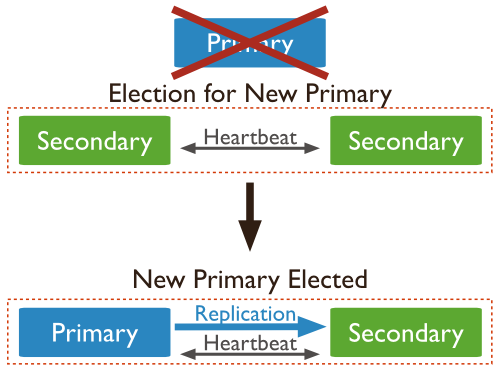

**2.使用Arbiter搭建Replica Set**

 偶数个数据节点，加一个Arbiter构成的Replica Set方式：

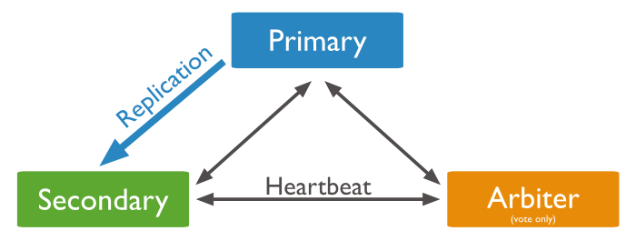

**MongoDB之分片集群（Sharding）**

**基本概念**

分片（sharding）是一个通过多台机器分配数据的方法。**MongoDB使用分片支持大数据集和高吞吐量的操作**。大数据集和高吞吐量的数据库系统挑战着单一服务的性能。例如：高查询率将耗尽CPU的性能。大于系统RAM的工作集将给磁盘的IO很大的压力。

应对系统的增长有两个方法：垂直扩展和水平扩展。

垂直扩展的方法是提升单一服务的性能，例如：使用一个更强的CPU，或更多的内存，或提升大量的存储空间。可用技术的局限性将限制单一服务的工作负载。另外基于云的提供者也有硬件配置的上限。所以，垂直扩展是有上限的。

水平扩展的方法是将系统的数据集分配到多个服务上，添加额外的服务可以提升系统的能力。一个单独机器的性能和速度可以不是很高，每台机器处理整个工作负载的一个子集，潜在地相比一个单一的高速度、高性能的服务，提供了更好的性能。扩展部署的能力仅仅需要添加额外的需要的服务，这比添加高档的硬件要便宜不少。

**分片集群**

MongoDB 的分片集群由下面的几个组件组成：

- 分片（shard）：每个分片包含了分片数据的一个子集，每个分片可以作为一个副本集部署。
- mongos：mongos扮演者查询路由的角色，提供着客户端应用和分片集群的接口。
- config servers：配置服务存储着集群的元数据和配置设置，MongoDB3.4以后，配置服务必须部署成副本集。

下图描述了分片集群中，各个组件的交互

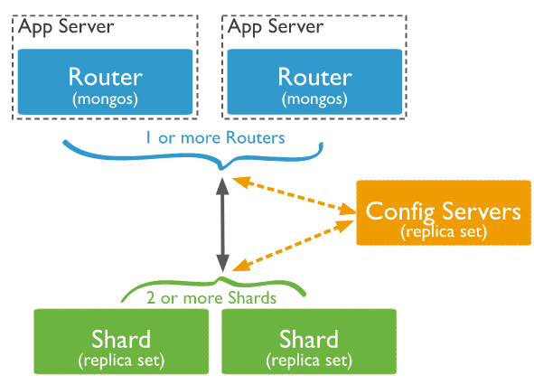

mongodb在collection级别对数据进行分片，分配collection数据到集群中的每一个分片。

**分片主键（shard keys）**

为了在集合中分配文档，MongoDB使用分片主键分割集合。分片主键由不重复的字段或者字段集合组成。

对一个集合分片时，你要选择分片主键，分片主键在分片以后不能修改。一个分片集合只有一个分片主键。

为了对非空的集合进行分片，集合必须有一个以分片主键开头的索引。对于空集合，如果集合对于分片主键没有一个合适的索引，MongoDB将创建索引。

分片主键的选择将影响分片集群的性能、效果和扩展能力。一个最佳的硬件和基础设施的集群的瓶颈取决于分片主键的选择。分片主键的选择将影响你的集群使用的分片策略。

**区块（chunks）**

MongoDB分割分片数据到区块，每一个区块包含基于分片主键的左闭右开的区间范围。在分片集群中，MongoDB通过分片迁移区块，使用分片集群权衡器。权衡器视图完成一个公平的区块平衡，通过集群中所有的分片。

**分片的优点**

MongoDB通过集群中的分片分配读和写的工作负载，允许每个分片处理集群中的一部分操作，读和写的工作负载可以通过添加分片进行横向扩展。包含分片主键或者组合主键前缀的查询，mongos可以定位这个查询到特定的分片或者分片子集上。这种定位操作比广播到所有分片要高效的多。

集群中的分片存储整个数据中的一部分，随着数据的增长，增加额外的分片可以增加集群的存储能力。

即使集群中的一个或多个分片不可用，集群也可以继续执行一部分读写操作。在宕机期间，不可用的分片上的数据是不能够处理的，可用分片上的读写操作是可以被成功处理的。在生产环境，每一个分片将被部署成副本集，提供可增长的冗余和高可用。

**分片之前的考虑**

分片集群的基础需求和复杂性需要小心的计划、执行和维护。谨慎地考虑分片主键是确保集群性能和效率所必须的。在分片之后，你不能改变分片的主键，也不能使集合不分片。如果查询不包含分片主键或者组合主键的前缀，mongos将执行广播操作，查询所有分片，这些查询将执行很长时间。

**分片和不分片集合**

一个数据库可以有分片集合和不分片集合的混合，分片集合通过集群中的分片进行分割和分配，不分片集合将存储在基础分片中。每个数据库都有一个自己的基础分片。

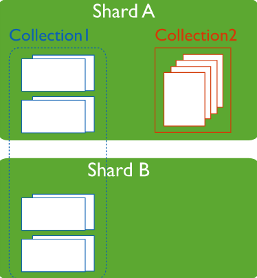

**连接分片集群**

你必须连接mongos路由和集合中的集合进行交互。这包含分片和不分片的集合。客户端绝不可能连接一个单独的分片进行操作。你可以像连接mongod一样连接mongos，他们是一样的。

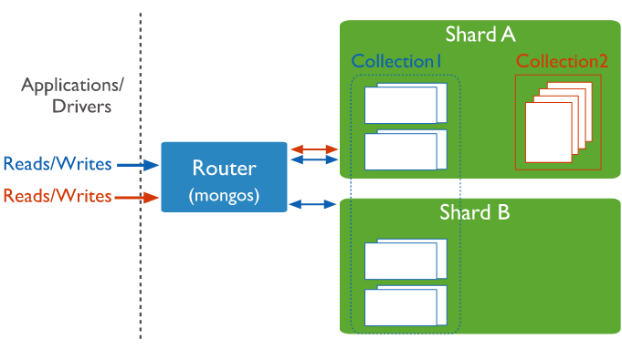

**分片策略**

MongoDB支持两种分片策略进行数据分片。

**Hash分片**

Hash分片是计算一个分片主键的hash值，每一个区块将分配一个范围的hash值。

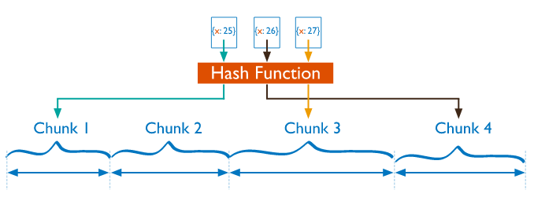

当分片主键中的一个范围被“关闭”，他们的hash值不可能在相同的区块中。基于hash值分布的数据促使了更多的数据分布，特别是分片主键单调变化的数据集。

Hash分布意味着基于分片主键的范围查询很少可能命中一个单一的分片，导致了更多的广播操作。

**范围分片**

范围分片是基于分片主键的值切分数据，每一个区块将会分配到一个范围。

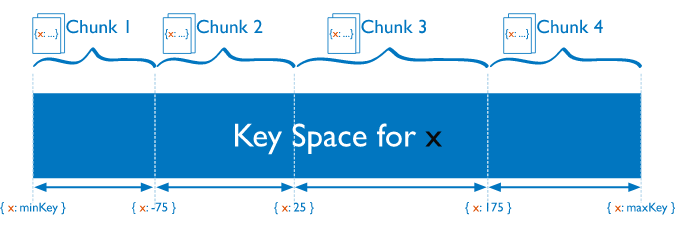

分片主键的范围被“关闭”，他们也很有可能落在相同的区块中。这使得mongos可以路由操作到请求数据的分片上。范围分片的效率取决于分片主键的选择，欠考虑的分片主键将导致数据分布不均匀。这将取消一些分片的益处，还可以导致性能瓶颈。

**分片集群的搭建**

由于测试机有限，这里我们只展示最简单的分片搭建，即一个分片、一个配置服务、一个路由。

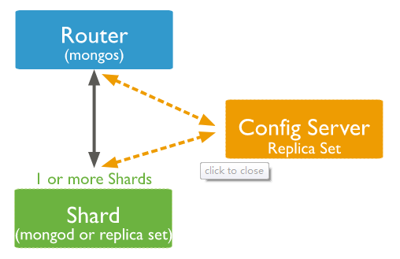


**实现步骤**

添加youruike_repl复制集

```shell
# 是否后台运行
fork = true
# 任何机器可以连接
#bind_ip_all = true
# 任何机器都可以访问
bind_ip = 0.0.0.0
# 实例运行在27017端口（默认）
port = 27017
# 数据文件夹存放地址（db要预先创建）
dbpath = /home/mongo/data/db
# 日志文件地址
logpath = /home/mongo/logs/mongodb.log
# 启动时 添加还是重写日志文件
logappend = true
# 开启校验用户
#auth = true
#开启小文件存储
#smallfiles=true
#复制集的名字
replSet=youruike_repl
#分片集必须要有的属性
shardsvr=true
```

启动

```shell
/home/mongodb-linux-x86_64-rhel70-4.2.1/bin/mongod -f /home/mongo/mongo.conf
```

添加youruike_repl2复制集

```shell
# 是否后台运行
fork = true
# 任何机器可以连接
#bind_ip_all = true
# 任何机器都可以访问
bind_ip = 0.0.0.0
# 实例运行在27017端口（默认）
port = 27018
# 数据文件夹存放地址（db要预先创建）
dbpath = /home/mongo/data/db2
# 日志文件地址
logpath = /home/mongo/logs/mongodb2.log
# 启动时 添加还是重写日志文件
logappend = true
# 开启校验用户
#auth = true
#开启小文件存储
#smallfiles=true
#复制集的名字
replSet=youruike_repl2
#分片集必须要有的属性
shardsvr=true
```

启动

```she
/home/mongodb-linux-x86_64-rhel70-4.2.1/bin/mongod -f /home/mongo/mongo2.conf
```


登录复制集客户端

```shell
/home/mongodb-linux-x86_64-rhel70-4.2.1/bin/mongo -port 27017
/home/mongodb-linux-x86_64-rhel70-4.2.1/bin/mongo -port 27018
```

配置复制集27017文件

```shell
#配置复制集
var config = {
  _id : "youruike_repl",
  members : [
     {_id : 1, host : "192.168.126.158:27017"},
     {_id : 2, host : "192.168.126.159:27017"},
     {_id : 3, host : "192.168.126.160:27017"},
  ]
}

#初始化配置
rs.initiate(config)

#关闭防火墙
systemctl stop firewalld

#初始化配置
rs.initiate(config)

#查看复制集状态
rs.status()
```


配置复制集27018文件

```shell
#配置复制集
var config = {
  _id : "youruike_repl2",
  members : [
     {_id : 1, host : "192.168.126.158:27018"},
     {_id : 2, host : "192.168.126.159:27018"},
     {_id : 3, host : "192.168.126.160:27018"},
  ]
}

#初始化配置
rs.initiate(config)

#关闭防火墙
systemctl stop firewalld

#初始化配置
rs.initiate(config)

#查看复制集状态
rs.status()
```


搭建config节点复制集

```shell
systemLog:
  destination: file
  path: /home/mongo/mongo-cfg/logs/mongodb.log
  logAppend: true  
storage:
  journal:
    enabled: true
  dbPath: /home/mongo/mongo-cfg/data
  directoryPerDB: true
  wiredTiger:
    engineConfig:
      cacheSizeGB: 1
      directoryForIndexes: true
    collectionConfig:
      blockCompressor: zlib
    indexConfig:
      prefixCompression: true
net:
  port: 28018
  bindIp: 192.168.126.158
replication:
  oplogSizeMB: 2048
  replSetName: configReplSet
sharding:
  clusterRole: configsvr
processManagement:
  fork: true
```

启动配置复制集

```shell
/home/mongodb-linux-x86_64-rhel70-4.2.1/bin/mongod -f /home/mongo/mongo-cfg.conf
```

登录配置复制集客户端

```shell
/home/mongodb-linux-x86_64-rhel70-4.2.1/bin/mongo -host 192.168.126.158 -port 28018
```

初始化配置复制集

```shell
#配置复制集
var config = {
  _id : "configReplSet",
  configsvr: true, 
  members : [
     {_id : 1, host : "192.168.126.158:28018"},
     {_id : 2, host : "192.168.126.159:28018"},
     {_id : 3, host : "192.168.126.160:28018"},
  ]
}

#初始化配置
rs.initiate(config)

#关闭防火墙
systemctl stop firewalld

#初始化配置
rs.initiate(config)

#查看复制集状态
rs.status()
```

mongos节点配置

```shell
systemLog:
  destination: file
  path: /home/mongo/mongos/logs/mongos.log
  logAppend: true
net:
  port: 28017
  bindIp: 192.168.126.158
sharding:
  configDB: configReplSet/192.168.126.158:28018,192.168.126.159:28018,192.168.126.160:28018
processManagement:
  fork: true
```

启动mongos

```shell
/home/mongodb-linux-x86_64-rhel70-4.2.1/bin/mongos -config /home/mongo/mongos/mongos.conf
```

登录mongos节点

```shell
/home/mongodb-linux-x86_64-rhel70-4.2.1/bin/mongo -host 192.168.126.158 -port 28017
```

添加集群分片节点:

切换到admin

```shell
use admin
```

添加shard1

```shell
db.runCommand({addshard:"youruike_repl/192.168.126.158:27017,192.168.126.159:27017,192.168.126.160:27017",name:"shard1"})
```

添加shard2

```shell
db.runCommand({addshard:"youruike_repl2/192.168.126.158:27018,192.168.126.159:27018,192.168.126.160:27018",name:"shard2"})
```

查看副本分片

```she
db.runCommand({listshards:1})
```

查看分片状态

```shell
sh.status()
```


测试分片集群:

开启数据库分片配置

```shell
db.runCommand({enablesharding:"testdb"})
```

创建分片的键

```shell
db.runCommand({shardcollection:"testdb.users",key:{id:1}})
```

创建索引

```shell
use testdb
db.users.ensureIndex({id:1})
```

添加测试数据

```shell
var arr=[];
for(var i=0;i<200000;i++){
    var uid=i;
    var name="youruike"+i;
    arr.push({"id":uid,"name":name});
}
db.users.insertMany(arr)
```

其他分片集群的命令

添加分片

```shell

```

删除分片

```shell

```

balance平衡

