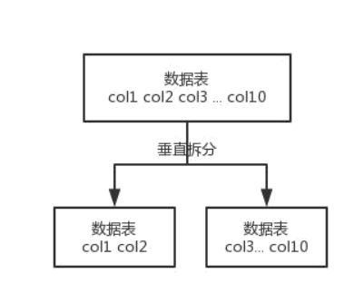

# 			MySQL实现主从复制

* 环境的介绍

  ```tex
  系统环境:centos7.0
  客户端连接工具:xshell
  远程文件传输工具:xftp
  服务器:
  192.168.126.138(主)   192.168.126.139(从)
  ```

* 安装MySQL

  基于rpm实现MySQL的安装

  ```shell
  #查看有没有安装MySQL
  rpm -qa | grep -i mysql
  #卸载
  rpm -e --nodeps mysql-community-client-5.7.28-1.el7.x86_64
  #查找
  find / -name mysql
  #删除存在的MySQL文件
  rm -rf /etc/selinux/targeted/active/modules/100/mysql /usr/lib64/mysql /usr/share/mysql
  #安装server
  rpm -ivh mysql-community-server-5.7.28-1.el7.x86_64.rpm --force --nodeps
  #安装客户端
  rpm -ivh mysql-community-client-5.7.28-1.el7.x86_64.rpm --force --nodeps
  ```

* 登录MySQL

  ```shell
  [root@localhost home]# mysql -u root -p
  Enter password: 
  ERROR 2002 (HY000): Can't connect to local MySQL server through socket '/var/lib/mysql/mysql.sock' (2)
  #出现错误(因为密码不正确)
  #实现免密登录
  #修改配置文件
  vi /etc/my.cnf
  #在MySQLd的下面加上 跳过授权
  skip-grant-tables
  #重启MySQL的服务
  service mysqld restart
  #继续登录
  mysql -u root -p
  Enter password:(这个地方不用输入任何东西直接回车)
  #其实免密登录时不安全的,所以进来之后一定要设置密码
  #刷新系统权限表
  flush PRIVILEGES;
  #重新设置密码
  #alter user 'root'@'localhost' identified by '123456';
  SET PASSWORD FOR 'root'@'localhost' = PASSWORD('123456');
  #刷新系统权限表
  flush PRIVILEGES;
  #记得添加一个数据库
  mysql> create database youruike;
  Query OK, 1 row affected (0.00 sec)
  
  mysql> show databases;
  +--------------------+
  | Database           |
  +--------------------+
  | information_schema |
  | youruike                |
  | mysql              |
  | performance_schema |
  | sys                |
  +--------------------+
  5 rows in set (0.00 sec)
  #退出MySQL
  mysql> exit;
  ```

* 实现MySQL的主从复制

  ```shell
  #先配置主服务器
  #修改配置文件
  vi /etc/my.cnf
  #添加以下的内容
  #日志文件的名字
  log_bin=master-a-bin
  #日志文件的格式
  binlog-format=ROW
  #服务器的id(zk的集群),一定要是唯一的
  server-id=1
  #对应需要实现主从复制的数据库
  binlog_do_db=youruike
  
  #添加完之后需要登录主服务器给从服务器授权
  grant replication slave on *.* to 'root'@'192.168.126.%' identified by '123456';
  #刷新系统权限表
  flush PRIVILEGES;
  ```

* 从服务器的配置

  ```shell
  #修改配置文件
  vi /etc/my.cnf
  #添加以下的内容
  #日志文件的名字
  log_bin=master-a-bin
  #日志文件的格式
  binlog-format=ROW
  #服务器的id(zk的集群),一定要是唯一的
  server-id=2
  #双主互相备份(表示从服务器可能是另外一台服务器的主服务器)
  #log-slave-updates=true
  ```

* 设置并验证主从复制

  ```shell
  #重启主服务器和从服务器
  service mysqld restart
  #登录主服务器
  mysql -u root -p
  #查看主服务器的状态
  mysql> show master status;
  +---------------------+----------+--------------+------------------+-------------------+
  | File                | Position | Binlog_Do_DB | Binlog_Ignore_DB | Executed_Gtid_Set |
  +---------------------+----------+--------------+------------------+-------------------+
  | master-a-bin.000001 |      154 | youruike          |                  |                   |
  +---------------------+----------+--------------+------------------+-------------------+
  1 row in set (0.01 sec)
  #解释对应的一些名词
  #File        生成的日志文件名
  #Position    文件名所处的一个位置(偏移量)
  #Binlog_Do_DB需要实现主从复制的数据库
  #启动服务  systemctl mysqld restart
  
  #登录从服务器
  #设置从服务器如何找到主服务器
  #设置主从复制的日志和偏移量
  change master to master_host='192.168.126.165',master_port=3306,master_user='root',master_password='123456',master_log_file='master-a-bin.000001',master_log_pos=154;
  
  #启动slave的数据同步
  start slave;
  #停止slave的数据同步
  stop slave;
  #查看salve的配置信息
  show slave status/G;
  
  #这边还正在连接中
  mysql> show slave status/G;
  *************************** 1. row ***************************
                 Slave_IO_State: Connecting to master
                    Master_Host: 192.168.126.138
                    Master_User: root
                    Master_Port: 3306
                  Connect_Retry: 60
                Master_Log_File: master-a-bin.000001
            Read_Master_Log_Pos: 154
                 Relay_Log_File: localhost-relay-bin.000001
                  Relay_Log_Pos: 4
          Relay_Master_Log_File: master-a-bin.000001
               Slave_IO_Running: Connecting
              Slave_SQL_Running: Yes
                Replicate_Do_DB: 
            Replicate_Ignore_DB: 
             Replicate_Do_Table: 
         Replicate_Ignore_Table: 
        Replicate_Wild_Do_Table: 
    Replicate_Wild_Ignore_Table: 
                     Last_Errno: 0
                     Last_Error: 
                   Skip_Counter: 0
            Exec_Master_Log_Pos: 154
                Relay_Log_Space: 154
                Until_Condition: None
                 Until_Log_File: 
                  Until_Log_Pos: 0
             Master_SSL_Allowed: No
             Master_SSL_CA_File: 
             Master_SSL_CA_Path: 
                Master_SSL_Cert: 
              Master_SSL_Cipher: 
                 Master_SSL_Key: 
          Seconds_Behind_Master: NULL
  Master_SSL_Verify_Server_Cert: No
                  Last_IO_Errno: 2003
                  Last_IO_Error: error connecting to master 'root@192.168.126.138:3306' - retry-time: 60  retries: 1
                 Last_SQL_Errno: 0
                 Last_SQL_Error: 
    Replicate_Ignore_Server_Ids: 
               Master_Server_Id: 0
                    Master_UUID: 
               Master_Info_File: /var/lib/mysql/master.info
                      SQL_Delay: 0
            SQL_Remaining_Delay: NULL
        Slave_SQL_Running_State: Slave has read all relay log; waiting for more updates
             Master_Retry_Count: 86400
                    Master_Bind: 
        Last_IO_Error_Timestamp: 191119 20:48:42
       Last_SQL_Error_Timestamp: 
                 Master_SSL_Crl: 
             Master_SSL_Crlpath: 
             Retrieved_Gtid_Set: 
              Executed_Gtid_Set: 
                  Auto_Position: 0
           Replicate_Rewrite_DB: 
                   Channel_Name: 
             Master_TLS_Version: 
  1 row in set (0.00 sec)
  
  ERROR: 
  No query specified
  #需要解决正在连接中的问题
  #使用navicat客户端进行连接,发现连接不上
  #1.防火墙的问题   2.端口未开放    3.未授权
  #可以开放端口3306
  firewall-cmd --zone=public --add-port=3306/tcp --permanent
  #重新加载防火墙
  firewall-cmd --reload
  #还是没有将权限授予客户端
  #with grant option  不仅仅是授予增删改查的权限,还授予权限的权限
  grant all privileges on *.* to root@'%' identified by '123456' with grant option;
  #授权报错
  mysql> grant all privileges on *.* to root@'%' identified by '123456' with grant option;
  ERROR 1819 (HY000): Unknown error 1819
  mysql> select @@validate_password_policy;
  +----------------------------+
  | @@validate_password_policy |
  +----------------------------+
  | MEDIUM                     |
  +----------------------------+
  1 row in set (0.00 sec)
  
  mysql> SHOW VARIABLES LIKE 'validate_password%';
  +--------------------------------------+--------+
  | Variable_name                        | Value  |
  +--------------------------------------+--------+
  | validate_password_check_user_name    | OFF    |
  | validate_password_dictionary_file    |        |
  | validate_password_length             | 8      |
  | validate_password_mixed_case_count   | 1      |
  | validate_password_number_count       | 1      |
  | validate_password_policy             | MEDIUM |
  | validate_password_special_char_count | 1      |
  +--------------------------------------+--------+
  7 rows in set (0.00 sec)
  
  mysql> set global validate_password_policy=0;
  Query OK, 0 rows affected (0.00 sec)
  
  mysql> set global validate_password_mixed_case_count=0;
  Query OK, 0 rows affected (0.00 sec)
  
  mysql> set global validate_password_number_count=3;
  Query OK, 0 rows affected (0.00 sec)
  
  mysql> set global validate_password_special_char_count=0;
  Query OK, 0 rows affected (0.00 sec)
  
  mysql> set global validate_password_length=3;
  Query OK, 0 rows affected (0.00 sec)
  
  mysql> SHOW VARIABLES LIKE 'validate_password%';
  +--------------------------------------+-------+
  | Variable_name                        | Value |
  +--------------------------------------+-------+
  | validate_password_check_user_name    | OFF   |
  | validate_password_dictionary_file    |       |
  | validate_password_length             | 3     |
  | validate_password_mixed_case_count   | 0     |
  | validate_password_number_count       | 3     |
  | validate_password_policy             | LOW   |
  | validate_password_special_char_count | 0     |
  +--------------------------------------+-------+
  7 rows in set (0.00 sec)
  
  mysql> SET PASSWORD FOR 'root'@'localhost' = PASSWORD('123456');
  Query OK, 0 rows affected (0.00 sec)
  
  mysql> flush privileges;
  Query OK, 0 rows affected (0.01 sec)
  
  mysql> grant all privileges on *.* to root@'%' identified by '123456' with grant option;
  Query OK, 0 rows affected, 1 warning (0.01 sec)
  
  mysql> flush privileges;
  Query OK, 0 rows affected (0.00 sec)
  
  #重启从服务器并且查看状态
  mysql> stop slave;
  Query OK, 0 rows affected (0.00 sec)
  
  mysql> start slave;
  Query OK, 0 rows affected (0.01 sec)
  
  mysql> show slave status/G;
  *************************** 1. row ***************************
                 Slave_IO_State: Waiting for master to send event
                    Master_Host: 192.168.126.138
                    Master_User: root
                    Master_Port: 3306
                  Connect_Retry: 60
                Master_Log_File: master-a-bin.000001
            Read_Master_Log_Pos: 1000
                 Relay_Log_File: localhost-relay-bin.000003
                  Relay_Log_Pos: 323
          Relay_Master_Log_File: master-a-bin.000001
               Slave_IO_Running: Yes
              Slave_SQL_Running: Yes
                Replicate_Do_DB: 
            Replicate_Ignore_DB: 
             Replicate_Do_Table: 
         Replicate_Ignore_Table: 
        Replicate_Wild_Do_Table: 
    Replicate_Wild_Ignore_Table: 
                     Last_Errno: 0
                     Last_Error: 
                   Skip_Counter: 0
            Exec_Master_Log_Pos: 1000
                Relay_Log_Space: 1549
                Until_Condition: None
                 Until_Log_File: 
                  Until_Log_Pos: 0
             Master_SSL_Allowed: No
             Master_SSL_CA_File: 
             Master_SSL_CA_Path: 
                Master_SSL_Cert: 
              Master_SSL_Cipher: 
                 Master_SSL_Key: 
          Seconds_Behind_Master: 0
  Master_SSL_Verify_Server_Cert: No
                  Last_IO_Errno: 0
                  Last_IO_Error: 
                 Last_SQL_Errno: 0
                 Last_SQL_Error: 
    Replicate_Ignore_Server_Ids: 
               Master_Server_Id: 1
                    Master_UUID: 0f900ff3-0ac6-11ea-aac7-000c299a89e6
               Master_Info_File: /var/lib/mysql/master.info
                      SQL_Delay: 0
            SQL_Remaining_Delay: NULL
        Slave_SQL_Running_State: Slave has read all relay log; waiting for more updates
             Master_Retry_Count: 86400
                    Master_Bind: 
        Last_IO_Error_Timestamp: 
       Last_SQL_Error_Timestamp: 
                 Master_SSL_Crl: 
             Master_SSL_Crlpath: 
             Retrieved_Gtid_Set: 
              Executed_Gtid_Set: 
                  Auto_Position: 0
           Replicate_Rewrite_DB: 
                   Channel_Name: 
             Master_TLS_Version: 
  1 row in set (0.00 sec)
  
  ERROR: 
  No query specified
  ```

* 测试是否成功

  ```shell
  mysql> show databases;
  +--------------------+
  | Database           |
  +--------------------+
  | information_schema |
  | youruike                |
  | mysql              |
  | performance_schema |
  | sys                |
  +--------------------+
  5 rows in set (0.00 sec)
  
  mysql> use youruike;
  Database changed
  mysql> show tables;
  Empty set (0.00 sec)
  
  mysql> create table user(id int primary key auto_increment,name varchar(20) not null)charset='utf8';
  Query OK, 0 rows affected (0.12 sec)
  
  mysql> show tables;
  +---------------+
  | Tables_in_youruike |
  +---------------+
  | user          |
  +---------------+
  1 row in set (0.00 sec)
  
  mysql> insert into user values(null,'a');
  Query OK, 1 row affected (0.01 sec)
  
  mysql> select * from user;
  +----+------+
  | id | name |
  +----+------+
  |  1 | a    |
  +----+------+
  1 row in set (0.00 sec)
  
  mysql> insert into user values(null,'b');
  Query OK, 1 row affected (0.01 sec)
  
  mysql> insert into user values(null,'c');
  Query OK, 1 row affected (0.00 sec)
  
  mysql> delete from user where id = 3;
  Query OK, 1 row affected (0.00 sec)
  
  mysql> select * from user;
  +----+------+
  | id | name |
  +----+------+
  |  1 | a    |
  |  2 | b    |
  +----+------+
  2 rows in set (0.00 sec)
  ```

# MySQL实现读写分离

要想实现读写分离,一定要是基于主从复制而实现的

1. 系统环境

```shell
  系统环境:centos7.0
  mycat的版本:1.6
  MySQL主机:192.168.126.143(mycat也使用这台主机)
  MySQL从机:192.168.126.148
  mycat的下载地址:http://dl.mycat.io/1.6-RELEASE/Mycat-server-1.6-RELEASE-20161028204710-linux.tar.gz
```

1. 安装mycat

```shell
  #查询有没有安装mycat
  find / -name mycat
  #因为mycat是基于java语言编写的,所以一定要配置jdk的环境
  #解压jdk
  tar -zxvf jdk-8u221-linux-x64.tar.gz
  #配置环境变量
  [root@localhost home]# ls
  ange  jdk1.8.0_221  jdk-8u221-linux-x64.tar.gz
  [root@localhost home]# mv jdk1.8.0_221/ jdk8
  [root@localhost home]# mv jdk8 /usr/
  [root@localhost home]# ls
  ange  jdk-8u221-linux-x64.tar.gz
  [root@localhost home]# cd /usr/
  [root@localhost usr]# ls
  bin  etc  games  include  jdk8  lib  lib64  libexec  local  sbin  share  src  tmp
  [root@localhost usr]# vi /etc/profile
  #加到最末尾
  JAVA_HOME=/usr/jdk8
  CLASSPATH=%JAVA_HOME%/lib:%JAVA_HOME%/jre/lib
  PATH=$PATH:$JAVA_HOME/bin:$JAVA_HOME/jre/bin
  export PATH CLASSPATH JAVA_HOME
  [root@localhost usr]# source /etc/profile
  [root@localhost usr]# java -version
  java version "1.8.0_221"
  Java(TM) SE Runtime Environment (build 1.8.0_221-b11)
  Java HotSpot(TM) 64-Bit Server VM (build 25.221-b11, mixed mode)
  [root@localhost usr]# 
  #安装mycat
  #报错
  [root@localhost usr]# wget http://dl.mycat.io/1.6-RELEASE/Mycat-server-1.6-RELEASE-20161028204710-linux.tar.gz-bash: wget: 未找到命令
  #安装wget
  yum install wget
  #继续执行下载命令
  wget http://dl.mycat.io/1.6-RELEASE/Mycat-server-1.6-RELEASE-20161028204710-linux.tar.gz
  #加压下载好的压缩文件
  tar -zxvf Mycat-server-1.6-RELEASE-20161028204710-linux.tar.gz
  #mycat的目录结构
  -lib   jar包存放的目录
  -conf
   -schema.xml
   -server.xml
   -rule.xml
   -log4j2.xml
  -logs
   -mycat.log
   -wrapper.log
  -bin
   -mycat.sh
```

  配置mycat

- 先配置server.xml

```shell
  <!-- 有读写权限的用户（最高权限的用户） -->
  <user name="root">
      <property name="password">123456</property>
      <!-- 对应schema.xml的逻辑数据库名称 -->
      <property name="schemas">TESTDB</property>
  </user>
  
  <!-- 只有只读权限 -->
  <user name="user">
      <property name="password">123456</property>
      <property name="schemas">TESTDB</property>
      <property name="readOnly">true</property>
  </user>
```

- schema.xml

  ```shell
  <?xml version="1.0"?>
  <!DOCTYPE mycat:schema SYSTEM "schema.dtd">
  <mycat:schema xmlns:mycat="http://io.mycat/">
  
  	<schema name="TESTDB" checkSQLschema="false" sqlMaxLimit="100" dataNode="dn1">
  		<!-- 里面的tables是实现分库分表的 -->
  	</schema>
  	<dataNode name="dn1" dataHost="localhost1" database="youruike" />
  	<!--
  	1. balance="0"，所有读操作都发送到当前可用的writeHost上。
  	2. balance="1"，所有读操作都随机的发送到readHost。
  	3. balance="2"，所有读操作都随机的在writeHost、readhost上分发。
  	4. balance="3"，所有读请求随机的分发到 wiriterHost 对应的 readhost 执行,writerHost 不负担读压力,注意 balance=3 只在 1.4 及其以后版本有,1.3没有
  
  	1. writeType="0", 所有写操作都发送到可用的writeHost上。
  	2. writeType="1"，所有写操作都随机的发送到readHost。
  	3. writeType="2"，所有写操作都随机的在writeHost、readhost分上发
  	-->
  	<dataHost name="localhost1" maxCon="1000" minCon="10" balance="3"
  			  writeType="0" dbType="mysql" dbDriver="native" switchType="1"  slaveThreshold="100">
  		<!-- 心跳检测,检测主机和从机是否正常 -->
  		<heartbeat>select user()</heartbeat>
  		<writeHost host="hostM1" url="127.0.0.1:3306" user="root"
  				   password="123456">
  			<readHost host="hostS2" url="192.168.126.148:3306" user="root" password="123456" />
  		</writeHost>
  	</dataHost>
  </mycat:schema>
  ```

- 启动mycat

  ```shell
  [root@localhost bin]# ./mycat start console
  Starting Mycat-server...
  [root@localhost bin]# ./mycat status console
  Mycat-server is running (11067).
  [root@localhost bin]# netstat -ntlp
  -bash: netstat: 未找到命令
  [root@localhost bin]# yum -y install net-tools
  [root@localhost bin]# netstat -ntlp
  Active Internet connections (only servers)
  Proto Recv-Q Send-Q Local Address           Foreign Address         State       PID/Program name    
  tcp        0      0 127.0.0.1:32000         0.0.0.0:*               LISTEN      11069/java          
  tcp        0      0 0.0.0.0:22              0.0.0.0:*               LISTEN      1030/sshd           
  tcp        0      0 127.0.0.1:25            0.0.0.0:*               LISTEN      1188/master         
  tcp6       0      0 :::1984                 :::*                    LISTEN      11069/java          
  tcp6       0      0 :::8066                 :::*                    LISTEN      11069/java          
  tcp6       0      0 :::9066                 :::*                    LISTEN      11069/java          
  tcp6       0      0 :::3306                 :::*                    LISTEN      1742/mysqld         
  tcp6       0      0 :::39666                :::*                    LISTEN      11069/java          
  tcp6       0      0 :::22                   :::*                    LISTEN      1030/sshd           
  tcp6       0      0 :::41304                :::*                    LISTEN      11069/java          
  tcp6       0      0 ::1:25                  :::*                    LISTEN      1188/master
  ```

- 登录mycat查看配置内容

  ```shell
  #登录mycat的管理端口
  mysql -uroot -p123456 -h127.0.0.1 -P9066
  #查看帮助手册
  show @@help;
  #查看读写分离情况
  show @@datasource;
  #查看心跳检测
  show @@heartbeat;
  	RS_CODE 状态:
          OK_STATUS = 1;正常状态
          ERROR_STATUS = -1; 连接出错
          TIMEOUT_STATUS = -2; 连接超时
          INIT_STATUS = 0; 初始化状态
  #连接数据端口(登录mycat的主机，mycat在192.168.126.161)
  mysql -uroot -p123456 -h127.0.0.1 -P8066
  ```

- 测试读写分离情况

  ```xml
  #修改日志打印情况
  <Loggers>
      <!--<AsyncLogger name="io.mycat" level="info" includeLocation="true" additivity="false">-->
      <!--<AppenderRef ref="Console"/>-->
      <!--<AppenderRef ref="RollingFile"/>-->
      <!--</AsyncLogger>-->
      <asyncRoot level="debug" includeLocation="true">
  
          <AppenderRef ref="Console" />
          <AppenderRef ref="RollingFile"/>
  
      </asyncRoot>
  </Loggers>
  
  #查看日志情况
  tail -f wrapper.log
  ```

# MySQL分库分表

为什么要分库分表（设计高并发系统的时候，数据库层面该如何设计）？用过哪些分库分表中间件？不同的分库分表中间件都有什么优点和缺点？你们具体是如何对数据库如何进行垂直拆分或水平拆分的？

**为什么要分库分表？（设计高并发系统的时候，数据库层面该如何设计？）**

说白了，分库分表是两回事儿，大家可别搞混了，可能是光分库不分表，也可能是光分表不分库，都有可能。给大家抛出来一个场景。

假如我们现在是一个小创业公司（或者是一个 BAT 公司刚兴起的一个新部门），现在注册用户就 20 万，每天活跃用户就 1 万，每天单表数据量就 1000，然后高峰期每秒钟并发请求最多就 10。天，就这种系统，随便找一个有几年工作经验的，然后带几个刚培训出来的，随便干干都可以。

结果没想到我们运气居然这么好，碰上个 CEO 带着我们走上了康庄大道，业务发展迅猛，过了几个月，注册用户数达到了 2000 万！每天活跃用户数 100 万！每天单表数据量 10 万条！高峰期每秒最大请求达到 1000！同时公司还顺带着融资了两轮，进账了几个亿人民币啊！公司估值达到了惊人的几亿美金！这是小独角兽的节奏！

好吧，没事，现在大家感觉压力已经有点大了，为啥呢？因为每天多 10 万条数据，一个月就多 300 万条数据，现在咱们单表已经几百万数据了，马上就破千万了。但是勉强还能撑着。高峰期请求现在是 1000，咱们线上部署了几台机器，负载均衡搞了一下，数据库撑 1000QPS 也还凑合。但是大家现在开始感觉有点担心了，接下来咋整呢......

再接下来几个月，我的天，CEO 太牛逼了，公司用户数已经达到 1 亿，公司继续融资几十亿人民币啊！公司估值达到了惊人的几十亿美金，成为了国内今年最牛逼的明星创业公司！天，我们太幸运了。

但是我们同时也是不幸的，因为此时每天活跃用户数上千万，每天单表新增数据多达 50 万，目前一个表总数据量都已经达到了两三千万了！扛不住啊！数据库磁盘容量不断消耗掉！高峰期并发达到惊人的 5000~8000 ！别开玩笑了，哥。我跟你保证，你的系统支撑不到现在，已经挂掉了！

好吧，所以你看到这里差不多就理解分库分表是怎么回事儿了，实际上这是跟着你的公司业务发展走的，你公司业务发展越好，用户就越多，数据量越大，请求量越大，那你单个数据库一定扛不住。

**分表**

比如你单表都几千万数据了，你确定你能扛住么？绝对不行，单表数据量太大，会极大影响你的 sql 执行的性能，到了后面你的 sql 可能就跑的很慢了。一般来说，就以我的经验来看，单表到几百万的时候，性能就会相对差一些了，你就得分表了。 

分表是啥意思？就是把一个表的数据放到多个表中，然后查询的时候你就查一个表。比如按照用户 id 来分表，将一个用户的数据就放在一个表中。然后操作的时候你对一个用户就操作那个表就好了。这样可以控制每个表的数据量在可控的范围内，比如每个表就固定在 200 万以内。

**分库**

分库是啥意思？就是你一个库一般我们经验而言，最多支撑到并发 2000，一定要扩容了，而且一个健康的单库并发值你最好保持在每秒 1000 左右，不要太大。那么你可以将一个库的数据拆分到多个库中，访问的时候就访问一个库好了。


| #            | 分库分表前                   | 分库分表后                                   |      |
| ------------ | ---------------------------- | -------------------------------------------- | ---- |
|              |                              |                                              |      |
| 并发支撑情况 | MySQL 单机部署，扛不住高并   | MySQL从单机到多机，能承受的并发增加了多倍    |      |
| 发           |                              |                                              |      |
|              |                              |                                              |      |
|              |                              |                                              |      |
| 磁盘使用情况 | MySQL 单机磁盘容量几乎撑满   | 拆分为多个库，数据库服务器磁盘使用率大大降低 |      |
|              |                              |                                              |      |
| SQL 执行性能 | 单表数据量太大，SQL 越跑越慢 | 单表数据量减少，SQL 执行效率明显提升         |      |
|              |                              |                                              |      |
|              |                              |                                              |      |
|              |                              |                                              |      |

**如何对数据库如何进行垂直拆分或水平拆分的？**

水平拆分的意思，就是把一个表的数据给弄到多个库的多个表里去，但是每个库的表结构都一样，只不过每个库表放的数据是不同的，所有库表的数据加起来就是全部数据。水平拆分的意义，就是将数据均匀放更多的库里，然后用多个库来扛更高的并发，还有就是用多个库的存储容量来进行扩容。

 

垂直拆分的意思，就是把一个有很多字段的表给拆分成多个表，或者是多个库上去。每个库表的结构都不一样，每个库表都包含部分字段。一般来说，会将较少的访问频率很高的字段放到一个表里去，然后将较多的访问频率很低的字段放到另外一个表里去。因为数据库是有缓存的，你访问频率高的行字段越少，就可以在缓存里缓存更多的行，性能就越好。这个一般在表层面做的较多一些。

 

这个其实挺常见的，不一定我说，大家很多同学可能自己都做过，把一个大表拆开，订单表、订单支付表、订单商品表。

还有表层面的拆分，就是分表，将一个表变成 N 个表，就是让每个表的数据量控制在一定范围内，保证 SQL 的性能。否则单表数据量越大，SQL 性能就越差。一般是 200 万行左右，不要太多，但是也得看具体你怎么操作，也可能是 500 万，或者是 100 万。你的SQL越复杂，就最好让单表行数越少。

好了，无论分库还是分表，上面说的那些数据库中间件都是可以支持的。就是基本上那些中间件可以做到你分库分表之后，中间件可以根据你指定的某个字段值，比如说 userid，自动路由到对应的库上去，然后再自动路由到对应的表里去。

你就得考虑一下，你的项目里该如何分库分表？一般来说，垂直拆分，你可以在表层面来做，对一些字段特别多的表做一下拆分；水平拆分，你可以说是并发承载不了，或者是数据量太大，容量承载不了，你给拆了，按什么字段来拆，你自己想好；分表，你考虑一下，你如果哪怕是拆到每个库里去，并发和容量都ok了，但是每个库的表还是太大了，那么你就分表，将这个表分开，保证每个表的数据量并不是很大。

 

而且这儿还有两种分库分表的方式：

- 一种是按照 range 来分，就是每个库一段连续的数据，这个一般是按比如时间范围来的，但是这种一般较少用，因为很容易产生热点问题，大量的流量都打在最新的数据上了。
- 或者是按照某个字段 hash 一下均匀分散，这个较为常用。

 

range 来分，好处在于说，扩容的时候很简单，因为你只要预备好，给每个月都准备一个库就可以了，到了一个新的月份的时候，自然而然，就会写新的库了；缺点，但是大部分的请求，都是访问最新的数据。实际生产用 range，要看场景。

hash 分发，好处在于说，可以平均分配每个库的数据量和请求压力；坏处在于说扩容起来比较麻烦，会有一个数据迁移的过程，之前的数据需要重新计算 hash 值重新分配到不同的库或表。


- 安装mycat

  ```shell
  #解压缩
  tar xzvf Mycat-server-1.6-RELEASE-20161028204710-linux.tar.gz
  
  #需要jdk环境变量
  ```

- 配置mycat  server.xml

  ```xml
  <property name="sequnceHandlerType">0</property>
  
  <user name="root">
      <property name="password">123456</property>
      <property name="schemas">mycat_order</property>
  </user>
  
  <user name="user">
      <property name="password">123456</property>
      <property name="schemas">mycat_order</property>
      <property name="readOnly">true</property>
  </user>
  ```

- 配置 schema.xml

  ```xml
  <?xml version="1.0"?>
  <!DOCTYPE mycat:schema SYSTEM "schema.dtd">
  <mycat:schema xmlns:mycat="http://io.mycat/">
  
  	<schema name="mycat_order" checkSQLschema="false" sqlMaxLimit="100">
  		<table name="t_order" dataNode="dn1,dn2" rule="mod-long">
  			<childTable name="t_order_detail" primaryKey="od_id" joinKey="order_id"
  						parentKey="order_id" />
  		</table>
  	</schema>
  	
  	<dataNode name="dn1" dataHost="host1" database="youruike2" />
  	<dataNode name="dn2" dataHost="host2" database="youruike2" />
  	
  	<dataHost name="host1" maxCon="1000" minCon="10" balance="0"
  			  writeType="0" dbType="mysql" dbDriver="native" switchType="1"  slaveThreshold="100">
  		<heartbeat>select user()</heartbeat>
  		<writeHost host="host1" url="127.0.0.1:3306" user="root"
  				   password="123456"/>
  	</dataHost>
  	
  	<dataHost name="host2" maxCon="1000" minCon="10" balance="0"
  			  writeType="0" dbType="mysql" dbDriver="native" switchType="1"  slaveThreshold="100">
  		<heartbeat>select user()</heartbeat>
  		<writeHost host="host2" url="192.168.126.147:3306" user="root"
  				   password="123456"/>
  	</dataHost>
  </mycat:schema>
  ```

- 创建 youruike2数据库和数据库表：t_order、t_order_detail

  ```sql
  CREATE TABLE `t_order` (
  	`order_id` BIGINT (20),
  	`user_id` INT (11),
  	`pay_mode` TINYINT (4),
  	`amount` FLOAT,
  	`order_date` datetime,
  	PRIMARY KEY (`order_id`)
  );
  
  
  CREATE TABLE `t_order_detail` (
  	`od_id` BIGINT (20),
  	`order_id` INT (11),
  	`goods_id` INT (11),
  	`unit_price` FLOAT,
  	`qty` INT (11),
  	PRIMARY KEY (`od_id`)
  );
  ```

- 配置rule.xml

  ```xml
  <tableRule name="mod-long">
      <rule>
          <columns>order_id</columns>
          <algorithm>mod-long</algorithm>
      </rule>
  </tableRule>
  
  <function name="mod-long" class="io.mycat.route.function.PartitionByMod">
      <!-- how many data nodes -->
      <property name="count">2</property>
  </function>
  ```

- 配置sequence_conf.properties

  ```properties
  #default global sequence
  GLOBAL.HISIDS=
  GLOBAL.MINID=10001
  GLOBAL.MAXID=20000
  GLOBAL.CURID=10000
  
  # self define sequence
  COMPANY.HISIDS=
  COMPANY.MINID=1001
  COMPANY.MAXID=2000
  COMPANY.CURID=1000
  
  CUSTOMER.HISIDS=
  CUSTOMER.MINID=1001
  CUSTOMER.MAXID=2000
  CUSTOMER.CURID=1000
  
  ORDER.HISIDS=
  ORDER.MINID=1001
  ORDER.MAXID=2000
  ORDER.CURID=1000
  
  ORDERDETAIL.HISIDS=
  ORDERDETAIL.MINID=1001
  ORDERDETAIL.MAXID=2000
  ORDERDETAIL.CURID=1000
  ```

- 启动并测试

  ```shell
  ./mycat start
  ```

- 插入测试数据

  ```sql
  insert into t_order(order_id,user_id,pay_mode,amount) 
  values(next value for MYCATSEQ_ORDER,101,5,11.1);
  
  insert into t_order(order_id,user_id,pay_mode,amount) 
  values(next value for MYCATSEQ_ORDER,102,5,22.2);
  
  insert into t_order(order_id,user_id,pay_mode,amount) 
  values(next value for MYCATSEQ_ORDER,103,7,33.3);
  
  
  insert into t_order_detail(od_id,order_id,goods_id,unit_price,qty) 
  values(next value for MYCATSEQ_ORDERDETAIL,1001,55,10,20);
  
  insert into t_order_detail(od_id,order_id,goods_id,unit_price,qty) 
  values(next value for MYCATSEQ_ORDERDETAIL,1002,66,14,30);
  
  insert into t_order_detail(od_id,order_id,goods_id,unit_price,qty) 
  values(next value for MYCATSEQ_ORDERDETAIL,1003,77,14,60);
  ```

# MyCat高可用

我们可以使用 HAProxy + Keepalived 配合两台 Mycat 搭起 Mycat 集群，实现高可用性。HAProxy  

实现了 MyCat 多节点的集群高可用和负载均衡，而 HAProxy 自身的高可用则可以通过 Keepalived 来 

实现。


编号 角色 IP 地址 机器名 

1 Mycat1 192.168.140.128 host79.youruike 

2 Mycat2 192.168.140.127 host80.youruike 

3 HAProxy（master） 192.168.140.126 host81.youruike 

4 Keepalived（master） 192.168.140.126 host81.youruike 

5 HAProxy（backup） 192.168.140.125 host82.youruike 

6 Keepalived（backup） 192.168.140.125 host82.youruike

## 安装配置 HAProxy

```shell
#1准备好HAProxy安装包，传到/opt目录下
#2解压到/usr/local/src
tar -zxvf haproxy-1.5.14.tar.gz  -C /usr/local/src
#3进入解压后的目录，查看内核版本，进行编译
cd /usr/local/src/haproxy-1.5.14/
uname -r
make TARGET=linux310 PREFIX=/usr/local/haproxy ARCH=x86_64
# TARGET=linux310，内核版本，使用uname -r查看内核，如：3.10.0-514.el7，此时该参数就为linux310； #ARCH=x86_64，系统位数；
#PREFIX=/usr/local/haprpxy #/usr/local/haprpxy，为haprpxy安装路径。
#4编译完成后，进行安装
make install PREFIX=/usr/local/haproxy
#5安装完成后，创建目录、创建HAProxy配置文件
mkdir -p /usr/data/haproxy/
vi /usr/local/haproxy/haproxy.conf
#6向配置文件中插入以下配置信息,并保存
```

https://blog.csdn.net/l1028386804/article/details/76397064

```yaml
global
	log 127.0.0.1 local0
	maxconn 4096
	chroot /usr/local/haproxy
	pidfile /usr/data/haproxy/haproxy.pid
	uid 99
	gid 99
	daemon
	#debug
	#quiet
defaults
	log global
	mode tcp
	option abortonclose
	option redispatch
	retries 3
	maxconn 2000
	timeout connect 5000
	timeout client 50000
	timeout server 50000
listen proxy_status
	bind :48066
		mode tcp
		balance roundrobin
		server mycat_1 192.168.126.161:8066 check inter 10s
		server mycat_2 192.168.126.171:8066 check inter 10s
frontend admin_stats 
	bind :7777
		mode http
		stats enable
		option httplog
		maxconn 10
		stats refresh 30s
		stats uri /admin
		stats auth admin:123123
		stats hide-version
		stats admin if TRUE
```

**启动验证**

```shell
#1启动HAProxy
/usr/local/haproxy/sbin/haproxy -f /usr/local/haproxy/haproxy.conf
#2查看HAProxy进程
ps -ef|grep haproxy
#3打开浏览器访问
http://192.168.126.172:7777/admin
#在弹出框输入用户名：admin密码：123123
#如果Mycat主备机均已启动，则可以看到绿色说明成功
#4验证负载均衡，通过HAProxy访问Mycat
mysql -uroot -p123456 -h 127.0.0.1 -P 48066
```

**配置 Keepalived**

```shell
#1准备好Keepalived安装包，传到/opt目录下
#2解压到/usr/local/src
tar -zxvf keepalived-1.4.2.tar.gz -C /usr/local/src
#3安装依赖插件
yum install -y gcc openssl-devel popt-devel
#3进入解压后的目录，进行配置，进行编译
cd /usr/local/src/keepalived-1.4.2
./configure --prefix=/usr/local/keepalived
#4进行编译，完成后进行安装
make && make install
#5运行前配置
cp /usr/local/src/keepalived-1.4.2/keepalived/etc/init.d/keepalived /etc/init.d/
mkdir /etc/keepalived
cp /usr/local/keepalived/etc/keepalived/keepalived.conf /etc/keepalived/
cp /usr/local/src/keepalived-1.4.2/keepalived/etc/sysconfig/keepalived /etc/sysconfig/
cp /usr/local/keepalived/sbin/keepalived /usr/sbin/
#6修改配置文件
vi /etc/keepalived/keepalived.conf
#修改内容如下
```

```shell
! Configuration File for keepalived
global_defs {
	notification_email {
		xlcocoon@foxmail.com
	}
	notification_email_from keepalived@showjoy.com
	smtp_server 127.0.0.1
	smtp_connect_timeout 30
	router_id LVS_DEVEL
	vrrp_skip_check_adv_addr
	vrrp_garp_interval 0
	vrrp_gna_interval 0
}
vrrp_instance VI_1 {
	#主机配MASTER，备机配BACKUP
	state MASTER
	#所在机器网卡
	interface ens33
	virtual_router_id 51
	#数值越大优先级越高
	priority 100
	advert_int 1
	authentication {
		auth_type PASS
		auth_pass 1111
	}
	virtual_ipaddress {
		#虚拟IP
		192.168.140.200
	} 
}
virtual_server 192.168.140.200 48066 {
	delay_loop 6
	lb_algo rr
	lb_kind NAT
	persistence_timeout 50
	protocol TCP
	real_server 192.168.126.172 48066 {
		weight 1
		TCP_CHECK {
			connect_timeout 3
			retry 3
			delay_before_retry 3
		} 
	}
	real_server 192.168.126.173 48066 {
		weight 1
		TCP_CHECK {
			connect_timeout 3
			nb_get_retry 3
			delay_before_retry 3
		} 
	}
}
```

**启动验证**

```shell
#启动Keepalived
service keepalived start
#查看启动情况
ps -ef | grep keepalived
#登录验证
mysql -uroot -p123456 -h 192.168.140.200 -P 48066
```

测试高可用

```shell
#1关闭mycat
#2通过虚拟ip查询数据
mysql -uroot -p123456 -h 192.168.140.200 -P 48066
```

