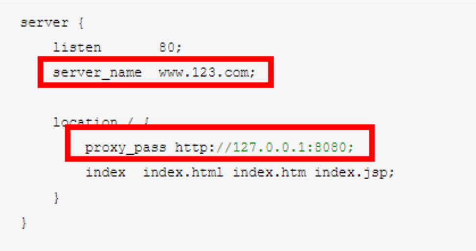
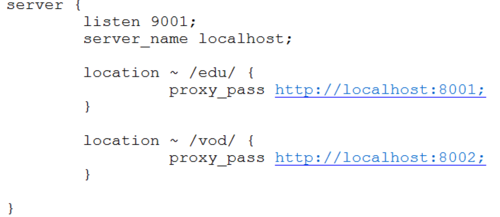
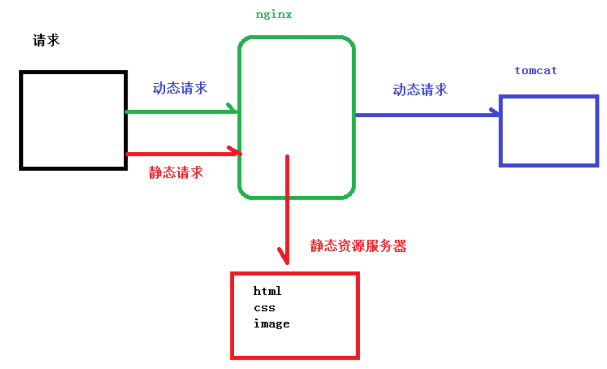

# 深入了解Nginx

## Nginx基本概念

### Nginx 概述

Nginx ("engine x") 是一个**高性能**的 HTTP 和反向代理服务器,特点是占有内存少，并发能力强，事实上 nginx 的并发能力确实在同类型的网页服务器中表现较好，中国大陆使用 nginx网站用户有：百度、京东、新浪、网易、腾讯、淘宝等

### Nginx 作为 web 服务器

Nginx 可以作为静态页面的 web 服务器，同时还支持 CGI 协议的动态语言，比如 perl、php等。但是不支持 java。Java 程序只能通过与 tomcat 配合完成。Nginx 专为性能优化而开发，性能是其最重要的考量,实现上非常注重效率 ，能经受高负载的考验,有报告表明能支持高达 50,000 个并发连接数。 

https://lnmp.org/nginx.html

### 正向代理

Nginx 不仅可以做反向代理，实现负载均衡。还能用作正向代理来进行上网等功能。正向代理：如果把局域网外的 Internet 想象成一个巨大的资源库，则局域网中的客户端要访问 Internet，则需要通过代理服务器来访问，这种代理服务就称为正向代理。

### 反向代理

反向代理，其实客户端对代理是无感知的，因为客户端不需要任何配置就可以访问，我们只需要将请求发送到反向代理服务器，由反向代理服务器去选择目标服务器获取数据后，在返 回给客户端，此时反向代理服务器和目标服务器对外就是一个服务器，暴露的是代理服务器地址，隐藏了真实服务器 IP 地址。 

### 负载均衡

客户端发送多个请求到服务器，服务器处理请求，有一些可能要与数据库进行交互，服务器处理完毕后，再将结果返回给客户端。这种架构模式对于早期的系统相对单一，并发请求相对较少的情况下是比较适合的，成本也低。但是随着信息数量的不断增长，访问量和数据量的飞速增长，以及系统业务的复杂度增加，这种架构会造成服务器相应客户端的请求日益缓慢，并发量特别大的时候，还容易造成服务器直接崩溃。很明显这是由于服务器性能的瓶颈造成的问题，那么如何解决这种情况呢？
我们首先想到的可能是升级服务器的配置，比如提高 CPU 执行频率，加大内存等提高机器的物理性能来解决此问题，但是我们知道摩尔定律的日益失效，硬件的性能提升已经不能满足日益提升的需求了。最明显的一个例子，天猫双十一当天，某个热销商品的瞬时访问量是极其庞大的，那么类似上面的系统架构，将机器都增加到现有的顶级物理配置，都是不能够满足需求的。那么怎么办呢？
上面的分析我们去掉了增加服务器物理配置来解决问题的办法，也就是说纵向解决问题的办法行不通了，那么横向增加服务器的数量呢？这时候集群的概念产生了，单个服务器解决不了，我们增加服务器的数量，然后将请求分发到各个服务器上，将原先请求集中到单个服务器上的情况改为将请求分发到多个服务器上，将负载分发到不同的服务器，也就是我们所说的负载均衡

### 动静分离

为了加快网站的解析速度，可以把动态页面和静态页面由不同的服务器来解析，加快解析速度。降低原来单个服务器的压力。

## Nginx安装，常用命令和配置文件

### 进入 nginx 官网，下载

http://nginx.org/

### 安装 nginx

**查看开放的端口号** 

firewall-cmd --list-all

**设置开放的端口号** 

firewall-cmd --add-service=http –permanent 

sudo firewall-cmd --add-port=80/tcp --permanent

**重启防火墙** 

firewall-cmd –reload 

### nginx 常用的命令

**启动命令**

在/usr/local/nginx/sbin 目录下执行 ./nginx 

**关闭命令**

在/usr/local/nginx/sbin 目录下执行 ./nginx -s stop

**重新加载命令**

在/usr/local/nginx/sbin 目录下执行 ./nginx -s reload

### nginx.conf 配置文件

nginx 安装目录下，其默认的配置文件都放在这个目录的 conf 目录下，而主配置文件nginx.conf 也在其中，后续对 nginx 的使用基本上都是对此配置文件进行相应的修改

配置文件中有很多#， 开头的表示注释内容，我们去掉所有以 # 开头的段落，精简之后的内容如下：

```shell
worker_processes  1; #工作进程：数目。根据硬件调整，通常等于cpu数量或者2倍cpu数量。

events {
    worker_connections  1024; # 工作进程的最大连接数量
}
 
 
http {
    include       mime.types; #指定mime类型，由mime.type来定义
    default_type  application/octet-stream;

					
    sendfile        on; #指定nginx是否调用sendfile函数来输出文件，对于普通应用，必须设置on。
			如果用来进行下载等应用磁盘io重负载应用，可设着off，以平衡磁盘与网络io处理速度，降低系统uptime。
 
    keepalive_timeout  65;
 
    #虚拟主机
    server {
        listen       80;  #配置监听端口号
        server_name  localhost; #配置访问域名，域名可以有多个，用空格隔开
 
        location / {
            root   html;
            index  index.html index.htm;
        }
        error_page   500 502 503 504  /50x.html;
        location = /50x.html {
            root   html;
        }
    }
}
```

根据上述文件，我们可以很明显的将 nginx.conf 配置文件分为三部分：

**第一部分：全局块**

从配置文件开始到 events 块之间的内容，主要会设置一些影响 nginx 服务器整体运行的配置指令，主要包括配 

置运行 Nginx 服务器的用户（组）、允许生成的 worker process 数，进程 PID 存放路径、日志存放路径和类型以 

及配置文件的引入等。 

比如上面第一行配置的：

```shell
worker_processes  1;
```

这是 Nginx 服务器并发处理服务的关键配置，worker_processes 值越大，可以支持的并发处理量也越多，但是 

会受到硬件、软件等设备的制约 

**第二部分：events 块**

比如上面的配置：

```shell
events {
    worker_connections  1024; # 工作进程的最大连接数量
}
```

events 块涉及的指令主要影响 Nginx 服务器与用户的网络连接，常用的设置包括是否开启对多 work process  

下的网络连接进行序列化，是否允许同时接收多个网络连接，选取哪种事件驱动模型来处理连接请求，每个 word  

process 可以同时支持的最大连接数等。 

上述例子就表示每个 work process 支持的最大连接数为 1024. 

这部分的配置对 Nginx 的性能影响较大，在实际中应该灵活配置。 

**第三部分：http 块**

```shell
http {
    include       mime.types; #指定mime类型，由mime.type来定义
    default_type  application/octet-stream;

					
    sendfile        on; #指定nginx是否调用sendfile函数来输出文件，对于普通应用，必须设置on。
			如果用来进行下载等应用磁盘io重负载应用，可设着off，以平衡磁盘与网络io处理速度，降低系统uptime。
 
    keepalive_timeout  65;
 
    #虚拟主机
    server {
        listen       80;  #配置监听端口号
        server_name  localhost; #配置访问域名，域名可以有多个，用空格隔开
 
        location / {
            root   html;
            index  index.html index.htm;
        }
        error_page   500 502 503 504  /50x.html;
        location = /50x.html {
            root   html;
        }
    }
}
```

这算是 Nginx 服务器配置中最频繁的部分，代理、缓存和日志定义等绝大多数功能和第三方模块的配置都在这里。 

需要注意的是：http 块也可以包括 http 全局块、server 块。 

- http 全局块

http 全局块配置的指令包括文件引入、MIME-TYPE 定义、日志自定义、连接超时时间、单链接请求数上限等。

- server 块

这块和虚拟主机有密切关系，虚拟主机从用户角度看，和一台独立的硬件主机是完全一样的，该技术的产生是为了 

节省互联网服务器硬件成本。 

每个 http 块可以包括多个 server 块，而每个 server 块就相当于一个虚拟主机。 

而每个 server 块也分为全局 server 块，以及可以同时包含多个 **locaton 块**。 

**1、全局 server 块** 

最常见的配置是本虚拟机主机的监听配置和本虚拟主机的名称或 IP 配置。 

**2、location 块** 

一个 server 块可以配置多个 location 块。 

这块的主要作用是基于 Nginx 服务器接收到的请求字符串（例如 server_name/uri-string），对虚拟主机名称 

（也可以是 IP 别名）之外的字符串（例如 前面的 /uri-string）进行匹配，对特定的请求进行处理。地址定向、数据缓存和应答控制等功能，还有许多第三方模块的配置也在这里进行。 

## Nginx配置实例 1-反向代理

**反向代理实例一**

实现效果：使用 nginx 反向代理，访问 www.123.com 直接跳转到 127.0.0.1:8080

**实验代码**

1） 启动一个 tomcat，浏览器地址栏输入 127.0.0.1:8080

2） 通过修改本地 host 文件，将 www.123.com 映射到 127.0.0.1

配置完成之后，我们便可以通过 www.123.com:8080 访问到第一步出现的 Tomcat 初始界面。

那么如何只需要输入 www.123.com 便可以跳转到 Tomcat 初始界面呢？便用到 nginx的反向代理。 

3） 在 nginx.conf 配置文件中增加如下配置



如上配置，我们监听 80 端口，访问域名为 www.123.com，不加端口号时默认为 80 端口，故 

访问该域名时会跳转到 127.0.0.1:8080 路径上。在浏览器端输入 www.123.com 结果如下：


**反向代理实例二**

实现效果：使用 nginx 反向代理，根据访问的路径跳转到不同端口的服务中nginx 监听端口为 9001， 

访问 http://127.0.0.1:9001/edu/ 直接跳转到 127.0.0.1:8081 

访问 http://127.0.0.1:9001/vod/ 直接跳转到 127.0.0.1:8082

**实验代码**

第一步，准备两个 tomcat，一个 8001 端口，一个 8002 端口，并准备好测试的页面 

第二步，修改 nginx 的配置文件 

在 http 块中添加 server{} 



**location 指令说明**

​	该指令用于匹配 URL。 

​	语法如下： 

```shell
location [= | ~ | ~* | ^~] uri{
    
}
```

1、= ：用于不含正则表达式的 uri 前，要求请求字符串与 uri 严格匹配，如果匹配 

成功，就停止继续向下搜索并立即处理该请求。 

2、~：用于表示 uri 包含正则表达式，并且区分大小写。 

3、~*：用于表示 uri 包含正则表达式，并且不区分大小写。 

4、^~：用于不含正则表达式的 uri 前，要求 Nginx 服务器找到标识 uri 和请求字 

符串匹配度最高的 location 后，立即使用此 location 处理请求，而不再使用 location  

块中的正则 uri 和请求字符串做匹配。 

注意：如果 uri 包含正则表达式，则必须要有 ~ 或者 ~* 标识。

## Nginx配置实例 2-负载均衡

1、实现效果 

（1）浏览器地址栏输入地址 http://192.168.126.162，负载均衡效果，平均 8080 

和 8081 端口中 

2、准备工作 

（1）准备两台 tomcat 服务器，一台 8080，一台 8081 

（2）在两台 tomcat 里面 webapps 目录中，修改ROOT目录下的index.jsp文件,分别添加一个8080的标签和8082的标签实现区分

页面 a.html，用于测试 

3、在 nginx 的配置文件中进行负载均衡的配置

具体配置如下

```shell
upstream myserver{
	server 192.168.126.162:8080;
	server 192.168.126.162:8081;
}

server{
	listen 80;
	server_name 192.168.126.162;
	
	location /{
        proxy_pass http://myserver;
	}
}
```

4、nginx 分配服务器策略 

**第一种 轮询（默认）** 

每个请求按时间顺序逐一分配到不同的后端服务器，如果后端服务器 down 掉，能自动剔除。 

**第二种 weight** 

weight 代表权重默认为 1,权重越高被分配的客户端越多 

**第三种 ip_hash** 

```shell
upstream myserver{
    ip_hash;
	server 192.168.126.162:8080;
	server 192.168.126.162:8081;
}

server{
	listen 80;
	server_name 192.168.126.162;
	
	location /{
        proxy_pass http://myserver;
	}
}
```

每个请求按访问 ip 的 hash 结果分配，这样每个访客固定访问一个后端服务器

**第四种 fair（第三方）** 

按后端服务器的响应时间来分配请求，响应时间短的优先分配。 

```shell
upstream myserver{
    fair;
	server 192.168.126.162:8080;
	server 192.168.126.162:8081;
}

server{
	listen 80;
	server_name 192.168.126.162;
	
	location /{
        proxy_pass http://myserver;
	}
}
```

## Nginx配置实例 3-动静分离

1、什么是动静分离



通过 location 指定不同的后缀名实现不同的请求转发。通过 expires 参数设置，可以使浏览器缓存过期时间，减少与服务器之前的请求和流量。具体 Expires 定义：是给一个资源设定一个过期时间，也就是说无需去服务端验证，直接通过浏览器自身确认是否过期即可，所以不会产生额外的流量。此种方法非常适合不经常变动的资源。（如果经常更新的文件，不建议使用 Expires 来缓存），我这里设置 3d，表示在这 3 天之内访问这个 URL，发送一 个请求，比对服务器该文件最后更新时间没有变化，则不会从服务器抓取，返回状态码 304， 如果有修改，则直接从服务器重新下载，返回状态码 200。

2、准备工作 

（1）在 liunx 系统中准备静态资源，用于进行访问  

创建/data文件夹,data文件夹中创建一个image文件夹和一个youruike的文件夹

3、具体配置 

（1）在 nginx 配置文件中进行配置

```shell
server{
	listen 80;
	server_name 192.168.126.162;
	
	location /youruike/{
        root /data/;
        index index.html index.htm;
	}
	
	location /image/{
        root /data/;
        # 展示这个文件夹下所有的索引(文件)
        autoindex on;
	}
}
```

4、最终测试 

（1）浏览器中输入地址 

http://192.168.126.162/image/a.jpg

（2）在浏览器地址栏输入地址 

http://192.168.126.162/youruike/index.html

## Nginx配置高可用集群

1、什么是 nginx 高可用

https://www.cnblogs.com/mzhaox/p/11181943.html

（1）需要两台 nginx 服务器 

（2）需要 keepalived

（3）需要虚拟 ip

2、配置高可用的准备工作

https://blog.csdn.net/qq_43079376/article/details/104041101

（1）需要两台服务器 192.168.126.162 和 192.168.126.161

（2）在两台服务器安装 nginx 

（3）在两台服务器安装 keepalived 

3、在两台服务器安装 keepalived 

（1）使用 yum 命令进行安装 

yum install keepalived –y 

rpm -qa keepalived

（2）安装之后，在 etc 里面生成目录 keepalived，有文件 keepalived.conf

4、完成高可用配置（主从配置） 

（1）修改/etc/keepalived/keepalivec.conf 配置文件

```shell
global_defs {
   notification_email {
   #如果没有配置邮箱的服务器,里面的内容可以省略
     acassen@firewall.loc
     failover@firewall.loc
     sysadmin@firewall.loc
   }
   #notification_email_from Alexandre.Cassen@firewall.loc
   #smtp_server 192.168.11.3
   #smtp_connect_timeout 30
   router_id LVS_DEVEL
}
## 作用就是没间隔两秒执行/usr/local/src目录下的nginx_check.sh脚本
vrrp_script chk_http_port{
     script "/usr/local/src/nginx_check.sh"
     interval 2
     #检测脚本执行的间隔
     weight 2
}

vrrp_instance VI_1 {
    state BACKUP   #备份服务器将master 改为backup
    interface ens33
    virtual_router_id 51     #主备机的虚拟路由id必须相同
    priority 90  #主备机取不同的优先级 主机值较大 备机值较小
    advert_int 1  #每间隔一秒就检测下自己是否活着
    
    authentication {
        auth_type PASS
        auth_pass 1111
    }
    #虚拟的ip地址
    virtual_ipaddress {
        192.168.11.50
    }
}
```

（2）在/usr/local/src 添加检测脚本

```shell
#!/bin/bash
A=`ps -C nginx –no-header |wc -l`
if [ $A -eq 0 ];then
/usr/local/nginx/sbin/nginx
sleep 2
if [ `ps -C nginx --no-header |wc -l` -eq 0 ];then
killall keepalived
fi
fi
```

（3）把两台服务器上 nginx 和 keepalived 启动 

启动 nginx：./nginx 

启动 keepalived：systemctl start keepalived.service

5、最终测试 

（1）在浏览器地址栏输入 虚拟 ip 地址 192.168.17.50  

（2）把主服务器（192.168.17.129）nginx 和 keepalived 停止，再输入 192.168.17.50

## Nginx原理

1、master 和 worker


https://www.cnblogs.com/yblackd/p/12194143.html

2、worker 如何进行工作的

抢占式的

3、一个 master 和多个 woker 有好处 

（1）可以使用 nginx –s reload 热部署，利用 nginx 进行热部署操作 

（2）每个 woker 是独立的进程，如果有其中的一个 woker 出现问题，其他 woker 独立的， 继续进行争抢，实现请求过程，不会造成服务中断 

4、设置多少个 woker 合适

worker 数和服务器的 cpu 数相等是最为适宜的

5、连接数 worker_connection 

第一个：发送请求，占用了 woker 的几个连接数？ 

答案：2 或者 4 个 

第二个：nginx 有一个 master，有四个 woker，每个 woker 支持最大的连接数 1024，支持的 

最大并发数是多少？ 

- 普通的静态访问最大并发数是： worker_connections * worker_processes /2， 
- 而如果是 HTTP 作 为反向代理来说，最大并发数量应该是 worker_connections *  worker_processes/4。

