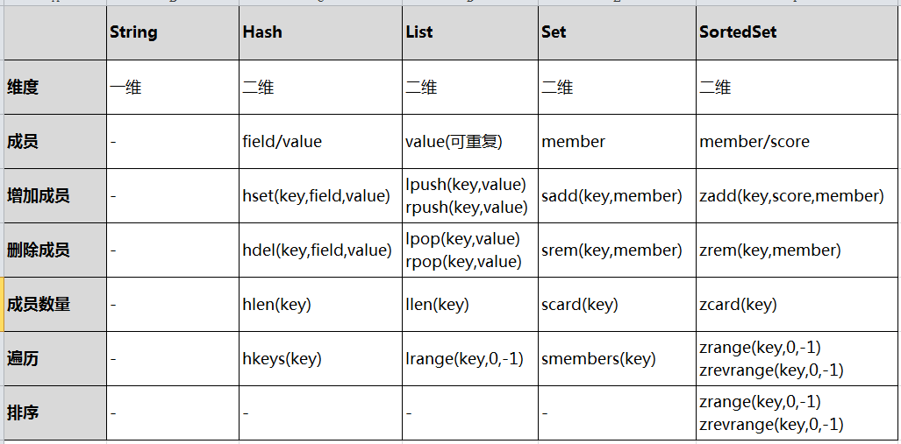
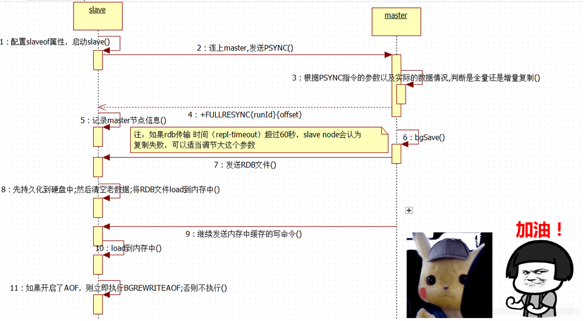
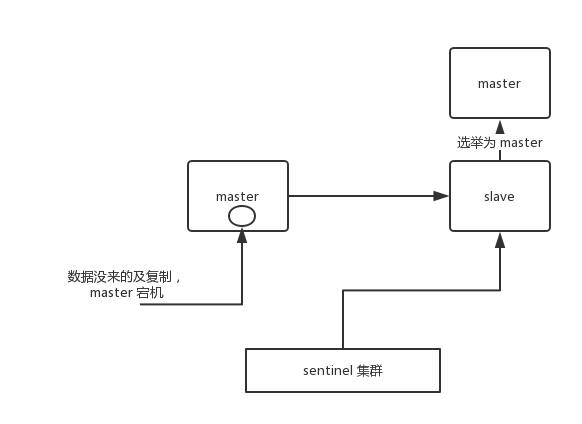
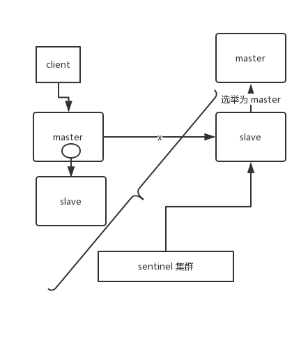
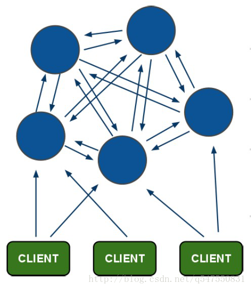
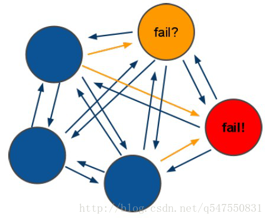
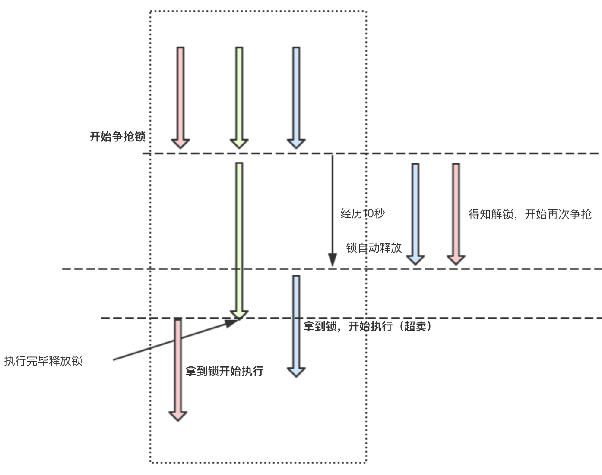
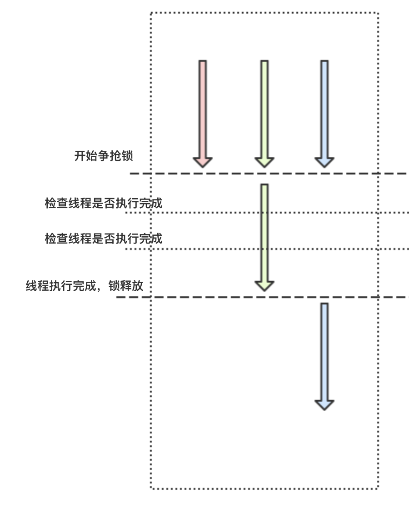
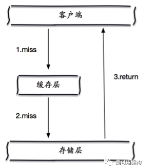
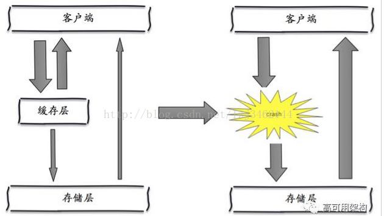

# 		分布式缓存数据库Redis

> 作者:叮当猫Ange

## 课程介绍

* Redis基本入门
* 使用Jedis操作Redis/SpringBoot整合Redis
* Redis主从复制/读写分离/哨兵
* Redis集群的搭建方式
* Redis分布式锁实战
* MySQL与Redis数据的同步
* 面试题

## 什么是Redis&Redis版本介绍

* redis

  ```tex
  Redis 是一个基于内存的高性能key-value数据库,是一个开源（BSD许可）的，内存中的数据结构存储系统，它可以用作数据库、缓存和消息中间件
  ```

* Reids的特点

  ```tex
  	Redis本质上是一个Key-Value类型的内存数据库，很像memcached，整个数据库通通加载在内存当中进行操作，定期通过异步操作把数据库数据flush到硬盘上进行保存。因为是纯内存操作，Redis的性能非常出色，每秒可以处理超过 10万次读写操作，是已知性能最快的Key-Value DB。
  　　　Redis的出色之处不仅仅是性能，Redis最大的魅力是支持保存多种数据结构，此外单个value的最大限制是1GB，不像memcached只能保存1MB的数据，因此Redis可以用来实现很多有用的功能，比方说用他的List来做FIFO双向链表，实现一个轻量级的高性 能消息队列服务，用他的Set可以做高性能的tag系统等等。另外Redis也可以对存入的Key-Value设置expire时间，因此也可以被当作一 个功能加强版的memcached来用。
  　　　Redis的主要缺点是数据库容量受到物理内存的限制，不能用作海量数据的高性能读写，因此Redis适合的场景主要局限在较小数据量的高性能操作和运算上。
  ```

* 应用场景

  ```tex
  redis应用场景总结redis平时我们用到的地方蛮多的，下面就了解的应用场景做个总结：
  1、热点数据的缓存
  由于redis访问速度块、支持的数据类型比较丰富，所以redis很适合用来存储热点数据，另外结合expire，我们可以设置过期时间然后再进行缓存更新操作，这个功能最为常见，我们几乎所有的项目都有所运用。
  
  2、限时业务的运用(实现验证码60s)
  redis中可以使用expire命令设置一个键的生存时间，到时间后redis会删除它。利用这一特性可以运用在限时的优惠活动信息、手机验证码等业务场景。
  
  3、计数器相关问题
  redis由于incrby命令可以实现原子性的递增，所以可以运用于高并发的秒杀活动、分布式序列号的生成、具体业务还体现在比如限制一个手机号发多少条短信、一个接口一分钟限制多少请求、一个接口一天限制调用多少次等等。
  
  4、排行榜相关问题
  关系型数据库在排行榜方面查询速度普遍偏慢，所以可以借助redis的SortedSet进行热点数据的排序。
  在奶茶活动中，我们需要展示各个部门的点赞排行榜， 所以我针对每个部门做了一个SortedSet,然后以用户的openid作为上面的username,以用户的点赞数作为上面的score, 然后针对每个用户做一个hash,通过zrangebyscore就可以按照点赞数获取排行榜，然后再根据username获取用户的hash信息，这个当时在实际运用中性能体验也蛮不错的。
  
  5、分布式锁(Redission)
  这个主要利用redis的setnx命令进行，setnx："set if not exists"就是如果不存在则成功设置缓存同时返回1，否则返回0 ，这个特性在俞你奔远方的后台中有所运用，因为我们服务器是集群的，定时任务可能在两台机器上都会运行，所以在定时任务中首先 通过setnx设置一个lock，如果成功设置则执行，如果没有成功设置，则表明该定时任务已执行。 当然结合具体业务，我们可以给这个lock加一个过期时间，比如说30分钟执行一次的定时任务，那么这个过期时间设置为小于30分钟的一个时间 就可以，这个与定时任务的周期以及定时任务执行消耗时间相关。
  当然我们可以将这个特性运用于其他需要分布式锁的场景中，结合过期时间主要是防止死锁的出现。
  
  6、延时操作
  这个目前我做过相关测试，但是还没有运用到我们的实际项目中，下面我举个该特性的应用场景。 比如在订单生产后我们占用了库存，10分钟后去检验用户是够真正购买，如果没有购买将该单据设置无效，同时还原库存。 由于redis自2.8.0之后版本提供Keyspace Notifications功能，允许客户订阅Pub/Sub频道，以便以某种方式接收影响Redis数据集的事件。 所以我们对于上面的需求就可以用以下解决方案，我们在订单生产时，设置一个key，同时设置10分钟后过期， 我们在后台实现一个监听器，监听key的实效，监听到key失效时将后续逻辑加上。 当然我们也可以利用rabbitmq、activemq等消息中间件的延迟队列服务实现该需求。
  
  7、分页、模糊搜索
  redis的set集合中提供了一个zrangebylex方法，语法如下：
  ZRANGEBYLEX key min max [LIMIT offset count]
  通过ZRANGEBYLEX zset - + LIMIT 0 10 可以进行分页数据查询，其中- +表示获取全部数据
  zrangebylex key min max 这个就可以返回字典区间的数据，利用这个特性可以进行模糊查询功能，这个也是目前我在redis中发现的唯一一个支持对存储内容进行模糊查询的特性。
  前几天我通过这个特性，对学校数据进行了模拟测试，学校数据60万左右，响应时间在700ms左右，比mysql的like查询稍微快一点，但是由于它可以避免大量的数据库io操作，所以总体还是比直接mysql查询更利于系统的性能保障。
  
  8、点赞、好友等相互关系的存储
  Redis set对外提供的功能与list类似是一个列表的功能，特殊之处在于set是可以自动排重的，当你需要存储一个列表数据，又不希望出现重复数据时，set是一个很好的选择，并且set提供了判断某个成员是否在一个set集合内的重要接口，这个也是list所不能提供的。 又或者在微博应用中，每个用户关注的人存在一个集合中，就很容易实现求两个人的共同好友功能。
  
  这个在奶茶活动中有运用，就是利用set存储用户之间的点赞关联的，另外在点赞前判断是否点赞过就利用了sismember方法，当时这个接口的响应时间控制在10毫秒内，十分高效。
  
  9、队列(MQ,java---->Queue)
  由于redis有list push和list pop这样的命令，所以能够很方便的执行队列操作。 
  ```

* 使用redis有哪些好处

  ```tex
  (1) 速度快，因为数据存在内存中，类似于HashMap，HashMap的优势就是查找和操作的时间复杂度都是O(1) 
  (2) 支持丰富数据类型，支持string，list，set，sorted set，hash 
  (3) 支持事务，操作都是原子性，所谓的原子性就是对数据的更改要么全部执行，要么全部不执行 
  (4) 丰富的特性：可用于缓存，消息，按key设置过期时间，过期后将会自动删除 
  ```

* 版本介绍

  ```tex
  第二位数为偶数代表稳定版,奇数则是测试版
  ```

## Redis的获取和下载安装

* 下载地址

  ```tex
  http://www.redis.cn/download.html
  ```

* 历史版本地址

  ```tex
  http://download.redis.io/releases
  ```

* 下载4.0的版本

  ```shell
  #没有wget
  yum install wget
  #获取安装包(其实可以使用网易镜像或者阿里镜像下载)
  wget -P /usr/local/src/ http://download.redis.io/releases/redis-4.0.0.tar.gz
  ```

* 下载、解压、编译Redis

  ```shell
  #切换目录
  cd /usr/local/src/
  #查看
  ls
  #解压
  tar -zxvf redis-4.0.0.tar.gz
  #如果安装报错gcc：命令未找到(因为redis基于c语言编写)
  #先查看是否安装c++的编译器
  yum -y install gcc-c++
  #进行编译
  cd redis-4.0.0
  make
  #如果报错 执行 make clean 后再次 执行 make
  make clean
  #致命错误：jemalloc/jemalloc.h：没有那个文件或目录
  make MALLOC=libc
  ```

  ```shell
  $ wget http://download.redis.io/releases/redis-4.0.0.tar.gz
  $ tar xzf redis-4.0.0.tar.gz
  $ cd redis-4.0.0
  $ make
  ```

## Redis的启动和卸载

```shell
#启动redis服务端
./redis-server

#启动redis客户端
./redis-cli

#测试(查询所有的键)
keys *

#守护进程启动
[root@localhost redis-4.0.0]# cp redis.conf ./src/
vi redis.conf
# By default Redis does not run as a daemon. Use 'yes' if you need it.
# Note that Redis will write a pid file in /var/run/redis.pid when daemonized.
daemonize yes
#再次启动
./redis-server redis.conf
[root@localhost src]# ./redis-cli 
127.0.0.1:6379> keys *
(empty list or set)
127.0.0.1:6379> exit
#结束进程
[root@localhost src]# ps -ef | grep redis
root       5664   5645  0 17:08 pts/1    00:00:00 ./redis-cli
root       5734      1  0 17:28 ?        00:00:00 ./redis-server 127.0.0.1:6379
root       5766   1327  0 17:33 pts/0    00:00:00 grep --color=auto redis
[root@localhost src]# kill -9 5664
[root@localhost src]# kill -9 5734
[root@localhost src]# ps -ef | grep redis
root       5768   1327  0 17:34 pts/0    00:00:00 grep --color=auto redis
[root@localhost src]#
#卸载的话直接删除redis的安装文件夹就行了
```

## Redis和Memcache的对比

```tex
1)、存储方式 Memecache把数据全部存在内存之中，断电后会挂掉，数据不能超过内存大小。 Redis有部份存在硬盘上，这样能保证数据的持久性。 
2)、数据支持类型 Memcache对数据类型支持相对简单。 Redis有复杂的数据类型。 
3)、使用底层模型不同 它们之间底层实现方式 以及与客户端之间通信的应用协议不一样。 Redis直接自己构建了VM 机制 ，因为一般的系统调用系统函数的话，会浪费一定的时间去移动和请求
```

## Redis的数据结构_字符串

string 是 redis 最基本的类型，你可以理解成与 Memcached 一模一样的类型，一个 key 对应一个 value。

string 类型是二进制安全的。意思是 redis 的 string 可以包含任何数据。比如jpg图片或者序列化的对象。

string 类型是 Redis 最基本的数据类型，string 类型的值最大能存储 512MB。 （Redis是单线程的,这也是为什么能够去实现分布式锁的一个重要条件）

```shell
#会涉及到分布式锁
Setnx（SET if Not eXists）

[root@localhost src]# ./redis-cli 
127.0.0.1:6379> set name 'ange'
OK
127.0.0.1:6379> get name
"ange"
```

## Redis的数据结构_哈希

一般是用来存放对象的

Redis hash 是一个键值(key=>value)对集合。

Redis hash 是一个 string 类型的 field 和 value 的映射表，hash 特别适合用于存储对象。

```shell
127.0.0.1:6379> hset user name 'ange'
(integer) 1
127.0.0.1:6379> hset user age 18
(integer) 1
127.0.0.1:6379> hset user sex 1
(integer) 1
127.0.0.1:6379> hkeys user
1) "name"
2) "age"
3) "sex"
127.0.0.1:6379> hlen user
(integer) 3
127.0.0.1:6379> hget user name
"ange"
127.0.0.1:6379> hdel user name
(integer) 1
127.0.0.1:6379> hkeys user
1) "age"
2) "sex"
127.0.0.1:6379> hget user name
(nil)
127.0.0.1:6379>
```

## Redis的数据结构_列表

Redis 列表是简单的字符串列表，允许重复的值，按照插入顺序排序。你可以添加一个元素到列表的头部（左边）或者尾部（右边）。列表最多可存储  232 - 1 元素 (4294967295, 每个列表可存储40多亿)。

```shell
127.0.0.1:6379> lpush teachers 'ange'
(integer) 1
127.0.0.1:6379> lpush teachers 'pika'
(integer) 2
127.0.0.1:6379> lpush teachers 'rock'
(integer) 3
127.0.0.1:6379> lrange teachers 0 1
1) "rock"
2) "pika"
127.0.0.1:6379> lrange teachers 0 -1
1) "rock"
2) "pika"
3) "ange"
127.0.0.1:6379> rpop teachers
"ange"
127.0.0.1:6379> lrange teachers 0 -1
1) "rock"
2) "pika"
127.0.0.1:6379> lpop teachers
"rock"
127.0.0.1:6379> lrange teachers 0 -1
1) "pika"
127.0.0.1:6379>

#lpop 从左开始删除   rpop从右开始删除
```

## Redis的数据结构_集合

Redis 的 Set 是 string 类型的无序集合，但是值是唯一的。

集合是通过哈希表实现的，所以添加，删除，查找的复杂度都是 O(1)。

```shell
127.0.0.1:6379> sadd num 1
(integer) 1
127.0.0.1:6379> sadd num 2
(integer) 1
127.0.0.1:6379> sadd num 3
(integer) 1
127.0.0.1:6379> smembers num
1) "1"
2) "2"
3) "3"
127.0.0.1:6379> spop num
"3"
127.0.0.1:6379> sadd num 3
(integer) 1
127.0.0.1:6379> sadd num 2
(integer) 0
```

## Redis的数据结构_有序集合

Redis  zset 和 set 一样也是string类型元素的集合,且不允许重复的成员。

不同的是每个元素都会关联一个double类型的分数。redis正是通过分数来为集合中的成员进行从小到大的排序。

zset的成员是唯一的,但分数(score)却可以重复。

```shell
127.0.0.1:6379> zadd teacher 1 'ange'
(integer) 1
127.0.0.1:6379> zadd teacher 2 'pika'
(integer) 1
127.0.0.1:6379> zadd teacher 3 'rokc'
(integer) 1
127.0.0.1:6379> zrange teacher 0 -1
1) "ange"
2) "pika"
3) "rokc"
127.0.0.1:6379> zrange teacher 0 -1 withscores
1) "ange"
2) "1"
3) "pika"
4) "2"
5) "rokc"
6) "3"
127.0.0.1:6379> zadd teacher 3 'rock'
(integer) 1
127.0.0.1:6379> zrange teacher 0 -1 withscores
1) "ange"
2) "1"
3) "pika"
4) "2"
5) "rock"
6) "3"
7) "rokc"
8) "3"
127.0.0.1:6379> zrem teacher 'ange'
(integer) 1
127.0.0.1:6379> zrange teacher 0 -1 withscores
1) "pika"
2) "2"
3) "rock"
4) "3"
5) "rokc"
6) "3"
```

## Redis的数据结构对比




## Redis的持久化策略

reids是一个key-value存储系统，为了保证效率，缓存在内存中，但是redis会周期性的把更新的数据写入磁盘或者把修改操作写入追加的记录文件，以保证数据的持久化。

所以：redis是一个支持持久化的内存数据库，可以将内存中的数据同步到磁盘保证持久化。

Redis的持久化策略：2种

```tex
rdb:快照形式是直接把内存中的数据保存到一个dump文件中，定时保存，保存策略
aof：把所有的对redis的服务器进行修改的命令都存到一个文件里，命令的集合
```

**RDB**

默认情况下，是快照rdb的持久化方式，将内存中的数据以快照的方式写入二进制文件中，默认的文件名是dump.rdb

```shell
redis.conf配置：
save 900 1 
save 300 10
save 60 10000
```

默认是如上配置：900秒之内，如果超过1个key被修改，则发起快照保存；

300秒内，如果超过10个key被修改，则发起快照保存

1分钟之内，如果1万个key被修改，则发起快照保存

这种方式不能完全保证数据持久化，因为是定时保存，所以当redis服务down掉，就会丢失一部分数据，而且数据量大，写操作多的情况下，会引起大量的磁盘IO操作，会影响性能。

所以，如果这两种方式同时开启，如果对数据进行恢复，不应该用rdb持久化方式对数据库进行恢复。

**AOF**

使用aof做持久化，每一个写命令都通过write函数追加到appendonly.aof中.

配置方式：启动aof持久化的方式 

```tex
appendonly yes  
```


两种持久化策略，各有各的优缺点，依需求而定。

## 混合持久化

重启 Redis 时，我们很少使用 rdb 来恢复内存状态，因为会丢失大量数据。我们通常使用 AOF 日志重放，但是重放 AOF 日志性能相对 rdb 来说要慢很多，这样在 Redis 实例很大的情况下，启动需要花费很长的时间。 Redis 4.0 为了解决这个问题，带来了一个新的持久化选项——混合持久化。AOF在重写(aof文件里可能有太多没用指令，所以aof会定期根据内存的最新数据生成aof文件)时将重写这一刻之前的内存rdb快照文件的内容和增量的 AOF修改内存数据的命令日志文件存在一起，都写入新的aof文件，新的文件一开始不叫appendonly.aof，等到重写完新的AOF文件才会进行改名，原子的覆盖原有的AOF文件，完成新旧两个AOF文件的替换；
 AOF根据配置规则在后台自动重写，也可以人为执行命令bgrewriteaof重写AOF。 于是在 Redis 重启的时候，可以先加载 rdb 的内容，然后再重放增量 AOF 日志就可以完全替代之前的 AOF 全量文件重放，重启效率因此大幅得到提升。
 **相关配置：**

```php
#redis 4.0引入
# 是否开启混合持久化
aof-use-rdb-preamble yes
```

## 过期键删除和淘汰策略

Redis的数据存在内存中,保证数据的高效,万一内存满了呢?Redis的内存管理,从两方面下手:

- 过期键的处理
- 淘汰策略

一，过期删除策略

　　redis数据库键的过期时间都保存在过期字典中，根据系统时间和存活时间判断是否过期。(一直存放)

　　redis有三种不同的删除策略：

　　1，定时删除：实现方式，创建定时器

　　2，惰性删除：每次获取键时，检查是否过期

　　3，定期删除：每隔一段时间，对数据库进行一次检查，删除过期键，由算法决定删除多少过期键和检查多少数据库

二，优缺点

　　1，定时删除，对内存友好，但是对cpu很不友好

　　2，惰性删除，对cpu友好，对内存很不友好

　　3，定期删除，是两种折中，但是，如果删除太频繁，将退化为定时删除，如果删除次数太少，将退化为惰性删除。

**淘汰策略**

```shell
# MAXMEMORY POLICY: how Redis will select what to remove when maxmemory
# is reached. You can select among five behaviors:
#最大内存策略：当到达最大使用内存时，你可以在下面5种行为中选择，Redis如何选择淘汰数据库键

#当内存不足以容纳新写入数据时

# volatile-lru -> remove the key with an expire set using an LRU algorithm
# volatile-lru ：在设置了过期时间的键空间中，移除最近最少使用的key。这种情况一般是把 redis 既当缓存，又做持久化存储的时候才用。

# allkeys-lru -> remove any key according to the LRU algorithm
# allkeys-lru ： 移除最近最少使用的key （推荐）

# volatile-random -> remove a random key with an expire set
# volatile-random ： 在设置了过期时间的键空间中，随机移除一个键，不推荐

# allkeys-random -> remove a random key, any key
# allkeys-random ： 直接在键空间中随机移除一个键，弄啥叻

# volatile-ttl -> remove the key with the nearest expire time (minor TTL)
# volatile-ttl ： 在设置了过期时间的键空间中，有更早过期时间的key优先移除 不推荐

# noeviction -> don't expire at all, just return an error on write operations
# noeviction ： 不做过键处理，只返回一个写操作错误。 不推荐

# Note: with any of the above policies, Redis will return an error on write
#       operations, when there are no suitable keys for eviction.
# 上面所有的策略下，在没有合适的淘汰删除的键时，执行写操作时，Redis 会返回一个错误。下面是写入命令：
#       At the date of writing these commands are: set setnx setex append
#       incr decr rpush lpush rpushx lpushx linsert lset rpoplpush sadd
#       sinter sinterstore sunion sunionstore sdiff sdiffstore zadd zincrby
#       zunionstore zinterstore hset hsetnx hmset hincrby incrby decrby
#       getset mset msetnx exec sort

# 过期策略默认是：
# The default is:
# maxmemory-policy noeviction
```


## Java操作Redis(Jedis)

 1.连接Redis的时候报错

```java
(error) DENIED Redis is running in protected mode because protected mode is enabled, no bind address was specified, no authentication password is requested to clients. In this mode connections are only accepted from the lookback interface. If you want to connect from external computers to Redis you may adopt one of the following solutions: 1) Just disable protected mode sending the command 'CONFIG SET protected-mode no' from the loopback interface by connecting to Redis from the same host the server is running, however MAKE SURE Redis is not publicly accessible from internet if you do so. Use CONFIG REWRITE to make this change permanent. 2) Alternatively you can just disable the protected mode by editing the Redis configuration file, and setting the protected mode option to 'no', and then restarting the server. 3) If you started the server manually just for testing, restart it with the --portected-mode no option. 4) Setup a bind address or an authentication password. NOTE: You only need to do one of the above things in order for the server to start accepting connections from the outside.
```

解决方法:

```shell
#1)打开配置文件把下面对应的注释掉
# bind 127.0.0.1
#2)Redis默认不是以守护进程的方式运行，可以通过该配置项修改，使用yes启用守护进程，设置为no
daemonize no
#3)保护模式
protected-mode no 
#启动
$ redis-server redis.conf
#将含有”redis”关键词的进程杀死:
$ ps -ef | grep redis | awk ‘{print $2}’ | xargs kill -9
```

2.测试Redis是否能够正常使用java连接

pom.xml

```xml
<dependencies>
    <dependency>
        <groupId>commons-pool</groupId>
        <artifactId>commons-pool</artifactId>
        <version>1.5.6</version>
    </dependency>
    <dependency>
        <groupId>redis.clients</groupId>
        <artifactId>jedis</artifactId>
        <version>2.7.0</version>
    </dependency>
</dependencies>
```

Main.java

```java
//连接本地的 Redis 服务
Jedis jedis = new Jedis("192.168.126.144");
System.out.println("连接成功");
//设置 redis 字符串数据
jedis.set("ange", "大帅逼");
// 获取存储的数据并输出
System.out.println("redis 存储的字符串为: "+ jedis.get("ange"));
```

3.使用java操作Redis

* 如果只想单纯的使用Jedis操作Java的话

  ```java
  package com.ddmzx.utils;
  
  import redis.clients.jedis.Jedis;
  import redis.clients.jedis.JedisPool;
  import redis.clients.jedis.JedisPoolConfig;
  
  public class RedisUtil {
      //服务器IP地址
      private static String ADDR = "192.168.126.144";
      //端口
      private static int PORT = 6379;
      //密码
      private static String AUTH = "";
      //连接实例的最大连接数
      private static int MAX_ACTIVE = 1024;
      //控制一个pool最多有多少个状态为idle(空闲的)的jedis实例，默认值也是8。
      private static int MAX_IDLE = 200;
      //等待可用连接的最大时间，单位毫秒，默认值为-1，表示永不超时。如果超过等待时间，则直接抛出JedisConnectionException
      private static int MAX_WAIT = 10000;
      //连接超时的时间　　
      private static int TIMEOUT = 10000;
      // 在borrow一个jedis实例时，是否提前进行validate操作；如果为true，则得到的jedis实例均是可用的；
      private static boolean TEST_ON_BORROW = true;
  
      private static JedisPool jedisPool = null;
      //数据库模式是16个数据库 0~15
      public static final int DEFAULT_DATABASE = 0;
  
      /**
       * 初始化Redis连接池
       */
  
      static {
          try {
              JedisPoolConfig config = new JedisPoolConfig();
              config.setMaxTotal(MAX_ACTIVE);
              config.setMaxIdle(MAX_IDLE);
              config.setMaxWaitMillis(MAX_WAIT);
              config.setTestOnBorrow(TEST_ON_BORROW);
              jedisPool = new JedisPool(config, ADDR, PORT, TIMEOUT, null, DEFAULT_DATABASE);
          } catch (Exception e) {
              e.printStackTrace();
          }
      }
  
      /**
       * 获取Jedis实例
       */
      public synchronized static Jedis getJedis() {
          try {
  
              if (jedisPool != null) {
                  Jedis resource = jedisPool.getResource();
                  System.out.println("redis--服务正在运行: " + resource.ping());
                  return resource;
              } else {
                  return null;
              }
  
          } catch (Exception e) {
              e.printStackTrace();
              return null;
          }
  
      }
  
      /***
       *
       * 释放资源
       */
      public static void returnResource(final Jedis jedis) {
          if (jedis != null) {
              jedisPool.returnResource(jedis);
          }
  
      }
  }
  ```

* 测试

  ```java
  public class Main {
      public static void main(String[] args) {
          Jedis jedis = RedisUtil.getJedis();
          //这里可以执行redis的任何操作
          RedisUtil.returnResource(jedis);
      }
  }
  ```

* 如果不知道怎么测试,常用命令集合

  ```tex
  常用命令
      1）连接操作命令
      quit：关闭连接（connection）
      auth：简单密码认证
      help cmd： 查看cmd帮助，例如：help quit
      
      2）持久化
      save：将数据同步保存到磁盘
      bgsave：将数据异步保存到磁盘
      lastsave：返回上次成功将数据保存到磁盘的Unix时戳
      shundown：将数据同步保存到磁盘，然后关闭服务
      
      3）远程服务控制
      info：提供服务器的信息和统计
      monitor：实时转储收到的请求
      slaveof：改变复制策略设置
      config：在运行时配置Redis服务器
      
      4）对key操作的命令
      exists(key)：确认一个key是否存在
      del(key)：删除一个key
      type(key)：返回值的类型
      keys(pattern)：返回满足给定pattern的所有key
      randomkey：随机返回key空间的一个
      keyrename(oldname, newname)：重命名key
      dbsize：返回当前数据库中key的数目
      expire：设定一个key的活动时间（s）
      ttl：获得一个key的活动时间
      select(index)：按索引查询
      move(key, dbindex)：移动当前数据库中的key到dbindex数据库
      flushdb：删除当前选择数据库中的所有key
      flushall：删除所有数据库中的所有key
      
      5）String
      set(key, value)：给数据库中名称为key的string赋予值value
      get(key)：返回数据库中名称为key的string的value
      getset(key, value)：给名称为key的string赋予上一次的value
      mget(key1, key2,…, key N)：返回库中多个string的value
      setnx(key, value)：添加string，名称为key，值为value
      setex(key, time, value)：向库中添加string，设定过期时间time
      mset(key N, value N)：批量设置多个string的值
      msetnx(key N, value N)：如果所有名称为key i的string都不存在
      incr(key)：名称为key的string增1操作
      incrby(key, integer)：名称为key的string增加integer
      decr(key)：名称为key的string减1操作
      decrby(key, integer)：名称为key的string减少integer
      append(key, value)：名称为key的string的值附加value
      substr(key, start, end)：返回名称为key的string的value的子串
      
      6）List 
      rpush(key, value)：在名称为key的list尾添加一个值为value的元素
      lpush(key, value)：在名称为key的list头添加一个值为value的 元素
      llen(key)：返回名称为key的list的长度
      lrange(key, start, end)：返回名称为key的list中start至end之间的元素
      ltrim(key, start, end)：截取名称为key的list
      lindex(key, index)：返回名称为key的list中index位置的元素
      lset(key, index, value)：给名称为key的list中index位置的元素赋值
      lrem(key, count, value)：删除count个key的list中值为value的元素
      lpop(key)：返回并删除名称为key的list中的首元素
      rpop(key)：返回并删除名称为key的list中的尾元素
      blpop(key1, key2,… key N, timeout)：lpop命令的block版本。
      brpop(key1, key2,… key N, timeout)：rpop的block版本。
      rpoplpush(srckey, dstkey)：返回并删除名称为srckey的list的尾元素，并将该元素添加到名称为		dstkey的list的头部
      
      7）Set
      sadd(key, member)：向名称为key的set中添加元素member
      srem(key, member) ：删除名称为key的set中的元素member
      spop(key) ：随机返回并删除名称为key的set中一个元素
      smove(srckey, dstkey, member) ：移到集合元素
      scard(key) ：返回名称为key的set的基数
      sismember(key, member) ：member是否是名称为key的set的元素
      sinter(key1, key2,…key N) ：求交集
      sinterstore(dstkey, (keys)) ：求交集并将交集保存到dstkey的集合
      sunion(key1, (keys)) ：求并集
      sunionstore(dstkey, (keys)) ：求并集并将并集保存到dstkey的集合
      sdiff(key1, (keys)) ：求差集
      sdiffstore(dstkey, (keys)) ：求差集并将差集保存到dstkey的集合
      smembers(key) ：返回名称为key的set的所有元素
      srandmember(key) ：随机返回名称为key的set的一个元素
      
      8）Hash
      hset(key, field, value)：向名称为key的hash中添加元素field
      hget(key, field)：返回名称为key的hash中field对应的value
      hmget(key, (fields))：返回名称为key的hash中field i对应的value
      hmset(key, (fields))：向名称为key的hash中添加元素field 
      hincrby(key, field, integer)：将名称为key的hash中field的value增加integer
      hexists(key, field)：名称为key的hash中是否存在键为field的域
      hdel(key, field)：删除名称为key的hash中键为field的域
      hlen(key)：返回名称为key的hash中元素个数
      hkeys(key)：返回名称为key的hash中所有键
      hvals(key)：返回名称为key的hash中所有键对应的value
      hgetall(key)：返回名称为key的hash中所有的键（field）及其对应的value
  ```

4.使用java对Redis实现分片操作

* RedisClient.java类

  ```java
  package com.ddmzx.redis;
  
  import redis.clients.jedis.*;
  
  import java.util.ArrayList;
  import java.util.Iterator;
  import java.util.List;
  import java.util.Set;
  
  public class RedisClient {
  
      private Jedis jedis;//非切片额客户端连接
      private JedisPool jedisPool;//非切片连接池
      private ShardedJedis shardedJedis;//切片额客户端连接
      private ShardedJedisPool shardedJedisPool;//切片连接池
  
      public RedisClient() {
          initialPool();
          initialShardedPool();
          shardedJedis = shardedJedisPool.getResource();
          jedis = jedisPool.getResource();
      }
  
      /**
       * 初始化非切片池
       */
      private void initialPool() {
          // 池基本配置
          JedisPoolConfig config = new JedisPoolConfig();
          config.setMaxTotal(20);
          config.setMaxIdle(5);
          config.setMaxWaitMillis(1000);
          config.setTestOnBorrow(false);
  
          jedisPool = new JedisPool(config, "192.168.126.144", 6379);
      }
  
      /**
       * 初始化切片池
       */
      private void initialShardedPool() {
          // 池基本配置
          JedisPoolConfig config = new JedisPoolConfig();
          config.setMaxTotal(20);
          config.setMaxIdle(5);
          config.setMaxWaitMillis(1000);
          config.setTestOnBorrow(false);
          // slave链接
          List<JedisShardInfo> shards = new ArrayList<JedisShardInfo>();
          shards.add(new JedisShardInfo("192.168.126.144", 6379, "master"));
  
          // 构造池
          shardedJedisPool = new ShardedJedisPool(config, shards);
      }
  
      public void show() {
          KeyOperate();
          StringOperate();
          ListOperate();
          SetOperate();
          SortedSetOperate();
          HashOperate();
          jedisPool.returnResource(jedis);
          shardedJedisPool.returnResource(shardedJedis);
      }
  
      private void KeyOperate() {
          System.out.println("======================key==========================");
          // 清空数据
          System.out.println("清空库中所有数据：" + jedis.flushDB());
          // 判断key否存在
          System.out.println("判断key999键是否存在：" + shardedJedis.exists("key999"));
          System.out.println("新增key001,value001键值对：" + shardedJedis.set("key001", "value001"));
          System.out.println("判断key001是否存在：" + shardedJedis.exists("key001"));
          // 输出系统中所有的key
          System.out.println("新增key002,value002键值对：" + shardedJedis.set("key002", "value002"));
          System.out.println("系统中所有键如下：");
          Set<String> keys = jedis.keys("*");
          Iterator<String> it = keys.iterator();
          while (it.hasNext()) {
              String key = it.next();
              System.out.println(key);
          }
          // 删除某个key,若key不存在，则忽略该命令。
          System.out.println("系统中删除key002: " + jedis.del("key002"));
          System.out.println("判断key002是否存在：" + shardedJedis.exists("key002"));
          // 设置 key001的过期时间
          System.out.println("设置 key001的过期时间为5秒:" + jedis.expire("key001", 5));
          try {
              Thread.sleep(2000);
          } catch (InterruptedException e) {
          }
          // 查看某个key的剩余生存时间,单位【秒】.永久生存或者不存在的都返回-1
          System.out.println("查看key001的剩余生存时间：" + jedis.ttl("key001"));
          // 移除某个key的生存时间
          System.out.println("移除key001的生存时间：" + jedis.persist("key001"));
          System.out.println("查看key001的剩余生存时间：" + jedis.ttl("key001"));
          // 查看key所储存的值的类型
          System.out.println("查看key所储存的值的类型：" + jedis.type("key001"));
          /*
           * 一些其他方法：1、修改键名：jedis.rename("key6", "key0");
           *             2、将当前db的key移动到给定的db当中：jedis.move("foo", 1)
           */
      }
  
      private void StringOperate() {
          System.out.println("======================String_1==========================");
          // 清空数据
          System.out.println("清空库中所有数据：" + jedis.flushDB());
  
          System.out.println("=============增=============");
          jedis.set("key001", "value001");
          jedis.set("key002", "value002");
          jedis.set("key003", "value003");
          System.out.println("已新增的3个键值对如下：");
          System.out.println(jedis.get("key001"));
          System.out.println(jedis.get("key002"));
          System.out.println(jedis.get("key003"));
  
          System.out.println("=============删=============");
          System.out.println("删除key003键值对：" + jedis.del("key003"));
          System.out.println("获取key003键对应的值：" + jedis.get("key003"));
  
          System.out.println("=============改=============");
          //1、直接覆盖原来的数据
          System.out.println("直接覆盖key001原来的数据：" + jedis.set("key001", "value001-update"));
          System.out.println("获取key001对应的新值：" + jedis.get("key001"));
          //2、直接覆盖原来的数据
          System.out.println("在key002原来值后面追加：" + jedis.append("key002", "+appendString"));
          System.out.println("获取key002对应的新值" + jedis.get("key002"));
  
          System.out.println("=============增，删，查（多个）=============");
          /**
           * mset,mget同时新增，修改，查询多个键值对
           * 等价于：
           * jedis.set("name","ssss");
           * jedis.set("jarorwar","xxxx");
           */
          System.out.println("一次性新增key201,key202,key203,key204及其对应值：" + jedis.mset("key201", "value201",
                  "key202", "value202", "key203", "value203", "key204", "value204"));
          System.out.println("一次性获取key201,key202,key203,key204各自对应的值：" +
                  jedis.mget("key201", "key202", "key203", "key204"));
          System.out.println("一次性删除key201,key202：" + jedis.del(new String[]{"key201", "key202"}));
          System.out.println("一次性获取key201,key202,key203,key204各自对应的值：" +
                  jedis.mget("key201", "key202", "key203", "key204"));
          System.out.println();
  
  
          //jedis具备的功能shardedJedis中也可直接使用，下面测试一些前面没用过的方法
          System.out.println("======================String_2==========================");
          // 清空数据
          System.out.println("清空库中所有数据：" + jedis.flushDB());
  
          System.out.println("=============新增键值对时防止覆盖原先值=============");
          System.out.println("原先key301不存在时，新增key301：" + shardedJedis.setnx("key301", "value301"));
          System.out.println("原先key302不存在时，新增key302：" + shardedJedis.setnx("key302", "value302"));
          System.out.println("当key302存在时，尝试新增key302：" + shardedJedis.setnx("key302", "value302_new"));
          System.out.println("获取key301对应的值：" + shardedJedis.get("key301"));
          System.out.println("获取key302对应的值：" + shardedJedis.get("key302"));
  
          System.out.println("=============超过有效期键值对被删除=============");
          // 设置key的有效期，并存储数据
          System.out.println("新增key303，并指定过期时间为2秒" + shardedJedis.setex("key303", 2, "key303-2second"));
          System.out.println("获取key303对应的值：" + shardedJedis.get("key303"));
          try {
              Thread.sleep(3000);
          } catch (InterruptedException e) {
          }
          System.out.println("3秒之后，获取key303对应的值：" + shardedJedis.get("key303"));
  
          System.out.println("=============获取原值，更新为新值一步完成=============");
          System.out.println("key302原值：" + shardedJedis.getSet("key302", "value302-after-getset"));
          System.out.println("key302新值：" + shardedJedis.get("key302"));
  
          System.out.println("=============获取子串=============");
          System.out.println("获取key302对应值中的子串：" + shardedJedis.getrange("key302", 5, 7));
      }
  
      private void ListOperate() {
          System.out.println("======================list==========================");
          // 清空数据
          System.out.println("清空库中所有数据：" + jedis.flushDB());
  
          System.out.println("=============增=============");
          shardedJedis.lpush("stringlists", "vector");
          shardedJedis.lpush("stringlists", "ArrayList");
          shardedJedis.lpush("stringlists", "vector");
          shardedJedis.lpush("stringlists", "vector");
          shardedJedis.lpush("stringlists", "LinkedList");
          shardedJedis.lpush("stringlists", "MapList");
          shardedJedis.lpush("stringlists", "SerialList");
          shardedJedis.lpush("stringlists", "HashList");
          shardedJedis.lpush("numberlists", "3");
          shardedJedis.lpush("numberlists", "1");
          shardedJedis.lpush("numberlists", "5");
          shardedJedis.lpush("numberlists", "2");
          System.out.println("所有元素-stringlists：" + shardedJedis.lrange("stringlists", 0, -1));
          System.out.println("所有元素-numberlists：" + shardedJedis.lrange("numberlists", 0, -1));
  
          System.out.println("=============删=============");
          // 删除列表指定的值 ，第二个参数为删除的个数（有重复时），后add进去的值先被删，类似于出栈
          System.out.println("成功删除指定元素个数-stringlists：" + shardedJedis.lrem("stringlists", 2, "vector"));
          System.out.println("删除指定元素之后-stringlists：" + shardedJedis.lrange("stringlists", 0, -1));
          // 删除区间以外的数据
          System.out.println("删除下标0-3区间之外的元素：" + shardedJedis.ltrim("stringlists", 0, 3));
          System.out.println("删除指定区间之外元素后-stringlists：" + shardedJedis.lrange("stringlists", 0, -1));
          // 列表元素出栈
          System.out.println("出栈元素：" + shardedJedis.lpop("stringlists"));
          System.out.println("元素出栈后-stringlists：" + shardedJedis.lrange("stringlists", 0, -1));
  
          System.out.println("=============改=============");
          // 修改列表中指定下标的值
          shardedJedis.lset("stringlists", 0, "hello list!");
          System.out.println("下标为0的值修改后-stringlists：" + shardedJedis.lrange("stringlists", 0, -1));
          System.out.println("=============查=============");
          // 数组长度
          System.out.println("长度-stringlists：" + shardedJedis.llen("stringlists"));
          System.out.println("长度-numberlists：" + shardedJedis.llen("numberlists"));
          // 排序
          /*
           * list中存字符串时必须指定参数为alpha，如果不使用SortingParams，而是直接使用sort("list")，
           * 会出现"ERR One or more scores can't be converted into double"
           */
          SortingParams sortingParameters = new SortingParams();
          sortingParameters.alpha();
          sortingParameters.limit(0, 3);
          System.out.println("返回排序后的结果-stringlists：" + shardedJedis.sort("stringlists", sortingParameters));
          System.out.println("返回排序后的结果-numberlists：" + shardedJedis.sort("numberlists"));
          // 子串：  start为元素下标，end也为元素下标；-1代表倒数一个元素，-2代表倒数第二个元素
          System.out.println("子串-第二个开始到结束：" + shardedJedis.lrange("stringlists", 1, -1));
          // 获取列表指定下标的值
          System.out.println("获取下标为2的元素：" + shardedJedis.lindex("stringlists", 2) + "/n");
      }
  
      private void SetOperate() {
  
          System.out.println("======================set==========================");
          // 清空数据
          System.out.println("清空库中所有数据：" + jedis.flushDB());
  
          System.out.println("=============增=============");
          System.out.println("向sets集合中加入元素element001：" + jedis.sadd("sets", "element001"));
          System.out.println("向sets集合中加入元素element002：" + jedis.sadd("sets", "element002"));
          System.out.println("向sets集合中加入元素element003：" + jedis.sadd("sets", "element003"));
          System.out.println("向sets集合中加入元素element004：" + jedis.sadd("sets", "element004"));
          System.out.println("查看sets集合中的所有元素:" + jedis.smembers("sets"));
          System.out.println();
  
          System.out.println("=============删=============");
          System.out.println("集合sets中删除元素element003：" + jedis.srem("sets", "element003"));
          System.out.println("查看sets集合中的所有元素:" + jedis.smembers("sets"));
          /*System.out.println("sets集合中任意位置的元素出栈："+jedis.spop("sets"));//注：出栈元素位置居然不定？--无实际意义
          System.out.println("查看sets集合中的所有元素:"+jedis.smembers("sets"));*/
          System.out.println();
  
          System.out.println("=============改=============");
          System.out.println();
  
          System.out.println("=============查=============");
          System.out.println("判断element001是否在集合sets中：" + jedis.sismember("sets", "element001"));
          System.out.println("循环查询获取sets中的每个元素：");
          Set<String> set = jedis.smembers("sets");
          Iterator<String> it = set.iterator();
          while (it.hasNext()) {
              Object obj = it.next();
              System.out.println(obj);
          }
          System.out.println();
  
          System.out.println("=============集合运算=============");
          System.out.println("sets1中添加元素element001：" + jedis.sadd("sets1", "element001"));
          System.out.println("sets1中添加元素element002：" + jedis.sadd("sets1", "element002"));
          System.out.println("sets1中添加元素element003：" + jedis.sadd("sets1", "element003"));
          System.out.println("sets1中添加元素element002：" + jedis.sadd("sets2", "element002"));
          System.out.println("sets1中添加元素element003：" + jedis.sadd("sets2", "element003"));
          System.out.println("sets1中添加元素element004：" + jedis.sadd("sets2", "element004"));
          System.out.println("查看sets1集合中的所有元素:" + jedis.smembers("sets1"));
          System.out.println("查看sets2集合中的所有元素:" + jedis.smembers("sets2"));
          System.out.println("sets1和sets2交集：" + jedis.sinter("sets1", "sets2"));
          System.out.println("sets1和sets2并集：" + jedis.sunion("sets1", "sets2"));
          System.out.println("sets1和sets2差集：" + jedis.sdiff("sets1", "sets2"));//差集：set1中有，set2中没有的元素
  
      }
  
      private void SortedSetOperate() {
          System.out.println("======================zset==========================");
          // 清空数据
          System.out.println(jedis.flushDB());
  
          System.out.println("=============增=============");
          System.out.println("zset中添加元素element001：" + shardedJedis.zadd("zset", 7.0, "element001"));
          System.out.println("zset中添加元素element002：" + shardedJedis.zadd("zset", 8.0, "element002"));
          System.out.println("zset中添加元素element003：" + shardedJedis.zadd("zset", 2.0, "element003"));
          System.out.println("zset中添加元素element004：" + shardedJedis.zadd("zset", 3.0, "element004"));
          System.out.println("zset集合中的所有元素：" + shardedJedis.zrange("zset", 0, -1));//按照权重值排序
          System.out.println();
  
          System.out.println("=============删=============");
          System.out.println("zset中删除元素element002：" + shardedJedis.zrem("zset", "element002"));
          System.out.println("zset集合中的所有元素：" + shardedJedis.zrange("zset", 0, -1));
          System.out.println();
  
          System.out.println("=============改=============");
          System.out.println();
  
          System.out.println("=============查=============");
          System.out.println("统计zset集合中的元素中个数：" + shardedJedis.zcard("zset"));
          System.out.println("统计zset集合中权重某个范围内（1.0——5.0），元素的个数：" + shardedJedis.zcount("zset", 1.0, 5.0));
          System.out.println("查看zset集合中element004的权重：" + shardedJedis.zscore("zset", "element004"));
          System.out.println("查看下标1到2范围内的元素值：" + shardedJedis.zrange("zset", 1, 2));
  
      }
  
      private void HashOperate() {
          System.out.println("======================hash==========================");
          //清空数据
          System.out.println(jedis.flushDB());
  
          System.out.println("=============增=============");
          System.out.println("hashs中添加key001和value001键值对：" + shardedJedis.hset("hashs", "key001", "value001"));
          System.out.println("hashs中添加key002和value002键值对：" + shardedJedis.hset("hashs", "key002", "value002"));
          System.out.println("hashs中添加key003和value003键值对：" + shardedJedis.hset("hashs", "key003", "value003"));
          System.out.println("新增key004和4的整型键值对：" + shardedJedis.hincrBy("hashs", "key004", 4l));
          System.out.println("hashs中的所有值：" + shardedJedis.hvals("hashs"));
          System.out.println();
  
          System.out.println("=============删=============");
          System.out.println("hashs中删除key002键值对：" + shardedJedis.hdel("hashs", "key002"));
          System.out.println("hashs中的所有值：" + shardedJedis.hvals("hashs"));
          System.out.println();
  
          System.out.println("=============改=============");
          System.out.println("key004整型键值的值增加100：" + shardedJedis.hincrBy("hashs", "key004", 100l));
          System.out.println("hashs中的所有值：" + shardedJedis.hvals("hashs"));
          System.out.println();
  
          System.out.println("=============查=============");
          System.out.println("判断key003是否存在：" + shardedJedis.hexists("hashs", "key003"));
          System.out.println("获取key004对应的值：" + shardedJedis.hget("hashs", "key004"));
          System.out.println("批量获取key001和key003对应的值：" + shardedJedis.hmget("hashs", "key001", "key003"));
          System.out.println("获取hashs中所有的key：" + shardedJedis.hkeys("hashs"));
          System.out.println("获取hashs中所有的value：" + shardedJedis.hvals("hashs"));
          System.out.println();
      }
  }
  ```

## SpringBoot整合Redis

1.对字符串的增删改查

* pom.xml

  ```xml
  <dependency>
      <groupId>org.springframework.boot</groupId>
      <artifactId>spring-boot-starter-data-redis</artifactId>
  </dependency>
  ```

* application.properties

  ```properties
  #redis配置
  #Redis服务器地址
  spring.redis.host=192.168.126.144
  #Redis服务器连接端口
  spring.redis.port=6379
  #Redis数据库索引（默认为0）
  spring.redis.database=0  
  #连接池最大连接数（使用负值表示没有限制）
  spring.redis.jedis.pool.max-active=50
  #连接池最大阻塞等待时间（使用负值表示没有限制）
  spring.redis.jedis.pool.max-wait=3000
  #连接池中的最大空闲连接
  spring.redis.jedis.pool.max-idle=20
  #连接池中的最小空闲连接
  spring.redis.jedis.pool.min-idle=2
  #连接超时时间（毫秒）
  spring.redis.timeout=5000
  ```

* RedisUtils.java

  ```java
  package com.ddmzx.springbootredis.utils;
  
  import org.springframework.beans.factory.annotation.Autowired;
  import org.springframework.data.redis.core.RedisTemplate;
  import org.springframework.stereotype.Component;
  
  /**
   * redis操作工具类
   * (基于RedisTemplate)
   */
  @Component
  public class RedisUtils {
  
      @Autowired
      private RedisTemplate<String, String> redisTemplate;
  
      /**
       * 读取缓存
       *
       * @param key
       * @return
       */
      public String get(final String key) {
          return redisTemplate.opsForValue().get(key);
      }
  
      /**
       * 写入缓存
       */
      public boolean set(final String key, String value) {
          boolean result = false;
          try {
              redisTemplate.opsForValue().set(key, value);
              result = true;
          } catch (Exception e) {
              e.printStackTrace();
          }
          return result;
      }
  
      /**
       * 更新缓存
       */
      public boolean getAndSet(final String key, String value) {
          boolean result = false;
          try {
              redisTemplate.opsForValue().getAndSet(key, value);
              result = true;
          } catch (Exception e) {
              e.printStackTrace();
          }
          return result;
      }
  
      /**
       * 删除缓存
       */
      public boolean delete(final String key) {
          boolean result = false;
          try {
              redisTemplate.delete(key);
              result = true;
          } catch (Exception e) {
              e.printStackTrace();
          }
          return result;
      }
  }
  ```

* SpringbootredisApplicationTests.java

  ```java
  package com.ddmzx.springbootredis;
  
  import com.ddmzx.springbootredis.utils.RedisUtils;
  import org.junit.jupiter.api.Test;
  import org.junit.runner.RunWith;
  import org.springframework.boot.test.context.SpringBootTest;
  import org.springframework.test.context.junit4.SpringJUnit4ClassRunner;
  
  import javax.annotation.Resource;
  
  @RunWith(SpringJUnit4ClassRunner.class)
  @SpringBootTest
  class SpringbootredisApplicationTests {
      @Resource
      private RedisUtils redisUtils;
  
      /**
       * 插入缓存数据
       */
      @Test
      public void set() {
          redisUtils.set("redis_key", "redis_vale");
      }
  
      /**
       * 读取缓存数据
       */
      @Test
      public void get() {
          String value = redisUtils.get("redis_key");
          System.out.println(value);
      }
  }
  ```

2.如果是对其他数据类型的操作

* 更换工具类就行了

  ```java
  package com.ddmzx.springbootredis.utils;
  
  import java.util.List;
  import java.util.Map;
  import java.util.Set;
  import java.util.concurrent.TimeUnit;
  
  import org.springframework.beans.factory.annotation.Autowired;
  import org.springframework.context.annotation.Lazy;
  import org.springframework.data.redis.core.RedisTemplate;
  import org.springframework.stereotype.Component;
  import org.springframework.util.CollectionUtils;
  
  @Lazy
  @Component
  public class RedisUtil{
  
  	@Autowired
  	private RedisTemplate redisTemplate;
  
  	public void setRedisTemplate(RedisTemplate redisTemplate) {
  		this.redisTemplate = redisTemplate;
  	}
  	//=============================common============================
  	/**
  	 * 指定缓存失效时间
  	 * @param key 键
  	 * @param time 时间(秒)
  	 * @return
  	 */
  	public boolean expire(String key,long time){
  		try {
  			if(time>0){
  				redisTemplate.expire(key, time, TimeUnit.SECONDS);
  			}
  			return true;
  		} catch (Exception e) {
  			e.printStackTrace();
  			return false;
  		}
  	}
  
  	/**
  	 * 根据key 获取过期时间
  	 * @param key 键 不能为null
  	 * @return 时间(秒) 返回0代表为永久有效
  	 */
  	public long getExpire(String key){
  		return redisTemplate.getExpire(key,TimeUnit.SECONDS);
  	}
  
  	/**
  	 * 判断key是否存在
  	 * @param key 键
  	 * @return true 存在 false不存在
  	 */
  	public boolean hasKey(String key){
  		try {
  			return redisTemplate.hasKey(key);
  		} catch (Exception e) {
  			e.printStackTrace();
  			return false;
  		}
  	}
  
  	/**
  	 * 删除缓存
  	 * @param key 可以传一个值 或多个
  	 */
  	@SuppressWarnings("unchecked")
  	public void del(String ... key){
  		if(key!=null&&key.length>0){
  			if(key.length==1){
  				redisTemplate.delete(key[0]);
  			}else{
  				redisTemplate.delete(CollectionUtils.arrayToList(key));
  			}
  		}
  	}
  
  	//============================String=============================
  	/**
  	 * 普通缓存获取
  	 * @param key 键
  	 * @return 值
  	 */
  	public Object get(String key, int indexdb){
  		return key==null?null:redisTemplate.opsForValue().get(key);
  	}
  
  	/**
  	 * 普通缓存放入
  	 * @param key 键
  	 * @param value 值
  	 * @return true成功 false失败
  	 */
  	public boolean set(String key,Object value,int indexdb) {
  		try {
  			redisTemplate.opsForValue().set(key, value);
  			return true;
  		} catch (Exception e) {
  			e.printStackTrace();
  			return false;
  		}
  
  	}
  
  	/**
  	 * 普通缓存放入并设置时间
  	 * @param key 键
  	 * @param value 值
  	 * @param time 时间(秒) time要大于0 如果time小于等于0 将设置无限期
  	 * @return true成功 false 失败
  	 */
  	public boolean set(String key,Object value,long time){
  		try {
  			if(time>0){
  				redisTemplate.opsForValue().set(key, value, time, TimeUnit.SECONDS);
  			}else{
  				redisTemplate.opsForValue().set(key, value);
  			}
  			return true;
  		} catch (Exception e) {
  			e.printStackTrace();
  			return false;
  		}
  	}
  
  	/**
  	 * 递增
  	 * @param key 键
  	 * @param by 要增加几(大于0)
  	 * @return
  	 */
  	public long incr(String key, long delta){
  		if(delta<0){
  			throw new RuntimeException("递增因子必须大于0");
  		}
  		return redisTemplate.opsForValue().increment(key, delta);
  	}
  
  	/**
  	 * 递减
  	 * @param key 键
  	 * @param by 要减少几(小于0)
  	 * @return
  	 */
  	public long decr(String key, long delta){
  		if(delta<0){
  			throw new RuntimeException("递减因子必须大于0");
  		}
  		return redisTemplate.opsForValue().increment(key, -delta);
  	}
  
  	//================================Map=================================
  	/**
  	 * HashGet
  	 * @param key 键 不能为null
  	 * @param item 项 不能为null
  	 * @return 值
  	 */
  	public Object hget(String key,String item){
  		return redisTemplate.opsForHash().get(key, item);
  	}
  
  	/**
  	 * 获取hashKey对应的所有键值
  	 * @param key 键
  	 * @return 对应的多个键值
  	 */
  	public Map<Object,Object> hmget(String key){
  		return redisTemplate.opsForHash().entries(key);
  	}
  
  	/**
  	 * HashSet
  	 * @param key 键
  	 * @param map 对应多个键值
  	 * @return true 成功 false 失败
  	 */
  	public boolean hmset(String key, Map<String,Object> map){
  		try {
  			redisTemplate.opsForHash().putAll(key, map);
  			return true;
  		} catch (Exception e) {
  			e.printStackTrace();
  			return false;
  		}
  	}
  
  	/**
  	 * HashSet 并设置时间
  	 * @param key 键
  	 * @param map 对应多个键值
  	 * @param time 时间(秒)
  	 * @return true成功 false失败
  	 */
  	public boolean hmset(String key, Map<String,Object> map, long time){
  		try {
  			redisTemplate.opsForHash().putAll(key, map);
  			if(time>0){
  				expire(key, time);
  			}
  			return true;
  		} catch (Exception e) {
  			e.printStackTrace();
  			return false;
  		}
  	}
  
  	/**
  	 * 向一张hash表中放入数据,如果不存在将创建
  	 * @param key 键
  	 * @param item 项
  	 * @param value 值
  	 * @return true 成功 false失败
  	 */
  	public boolean hset(String key,String item,Object value) {
  		try {
  			redisTemplate.opsForHash().put(key, item, value);
  			return true;
  		} catch (Exception e) {
  			e.printStackTrace();
  			return false;
  		}
  	}
  
  	/**
  	 * 向一张hash表中放入数据,如果不存在将创建
  	 * @param key 键
  	 * @param item 项
  	 * @param value 值
  	 * @param time 时间(秒)  注意:如果已存在的hash表有时间,这里将会替换原有的时间
  	 * @return true 成功 false失败
  	 */
  	public boolean hset(String key,String item,Object value,long time) {
  		try {
  			redisTemplate.opsForHash().put(key, item, value);
  			if(time>0){
  				expire(key, time);
  			}
  			return true;
  		} catch (Exception e) {
  			e.printStackTrace();
  			return false;
  		}
  	}
  
  	/**
  	 * 删除hash表中的值
  	 * @param key 键 不能为null
  	 * @param item 项 可以使多个 不能为null
  	 */
  	public void hdel(String key, Object... item){
  		redisTemplate.opsForHash().delete(key,item);
  	}
  
  	/**
  	 * 判断hash表中是否有该项的值
  	 * @param key 键 不能为null
  	 * @param item 项 不能为null
  	 * @return true 存在 false不存在
  	 */
  	public boolean hHasKey(String key, String item){
  		return redisTemplate.opsForHash().hasKey(key, item);
  	}
  
  	/**
  	 * hash递增 如果不存在,就会创建一个 并把新增后的值返回
  	 * @param key 键
  	 * @param item 项
  	 * @param by 要增加几(大于0)
  	 * @return
  	 */
  	public double hincr(String key, String item,double by){
  		return redisTemplate.opsForHash().increment(key, item, by);
  	}
  
  	/**
  	 * hash递减
  	 * @param key 键
  	 * @param item 项
  	 * @param by 要减少记(小于0)
  	 * @return
  	 */
  	public double hdecr(String key, String item,double by){
  		return redisTemplate.opsForHash().increment(key, item,-by);
  	}
  
  	//============================set=============================
  	/**
  	 * 根据key获取Set中的所有值
  	 * @param key 键
  	 * @return
  	 */
  	public Set<Object> sGet(String key){
  		try {
  			return redisTemplate.opsForSet().members(key);
  		} catch (Exception e) {
  			e.printStackTrace();
  			return null;
  		}
  	}
  
  	/**
  	 * 根据value从一个set中查询,是否存在
  	 * @param key 键
  	 * @param value 值
  	 * @return true 存在 false不存在
  	 */
  	public boolean sHasKey(String key,Object value){
  		try {
  			return redisTemplate.opsForSet().isMember(key, value);
  		} catch (Exception e) {
  			e.printStackTrace();
  			return false;
  		}
  	}
  
  	/**
  	 * 将数据放入set缓存
  	 * @param key 键
  	 * @param values 值 可以是多个
  	 * @return 成功个数
  	 */
  	public long sSet(String key, Object...values) {
  		try {
  			return redisTemplate.opsForSet().add(key, values);
  		} catch (Exception e) {
  			e.printStackTrace();
  			return 0;
  		}
  	}
  
  	/**
  	 * 将set数据放入缓存
  	 * @param key 键
  	 * @param time 时间(秒)
  	 * @param values 值 可以是多个
  	 * @return 成功个数
  	 */
  	public long sSetAndTime(String key,long time,Object...values) {
  		try {
  			Long count = redisTemplate.opsForSet().add(key, values);
  			if(time>0) {
  				expire(key, time);
  			}
  			return count;
  		} catch (Exception e) {
  			e.printStackTrace();
  			return 0;
  		}
  	}
  
  	/**
  	 * 获取set缓存的长度
  	 * @param key 键
  	 * @return
  	 */
  	public long sGetSetSize(String key){
  		try {
  			return redisTemplate.opsForSet().size(key);
  		} catch (Exception e) {
  			e.printStackTrace();
  			return 0;
  		}
  	}
  
  	/**
  	 * 移除值为value的
  	 * @param key 键
  	 * @param values 值 可以是多个
  	 * @return 移除的个数
  	 */
  	public long setRemove(String key, Object ...values) {
  		try {
  			Long count = redisTemplate.opsForSet().remove(key, values);
  			return count;
  		} catch (Exception e) {
  			e.printStackTrace();
  			return 0;
  		}
  	}
  	//===============================list=================================
  
  	/**
  	 * 获取list缓存的内容
  	 * @param key 键
  	 * @param start 开始
  	 * @param end 结束  0 到 -1代表所有值
  	 * @return
  	 */
  	public List<Object> lGet(String key,long start, long end){
  		try {
  			return redisTemplate.opsForList().range(key, start, end);
  		} catch (Exception e) {
  			e.printStackTrace();
  			return null;
  		}
  	}
  
  	/**
  	 * 获取list缓存的长度
  	 * @param key 键
  	 * @return
  	 */
  	public long lGetListSize(String key){
  		try {
  			return redisTemplate.opsForList().size(key);
  		} catch (Exception e) {
  			e.printStackTrace();
  			return 0;
  		}
  	}
  
  	/**
  	 * 通过索引 获取list中的值
  	 * @param key 键
  	 * @param index 索引  index>=0时， 0 表头，1 第二个元素，依次类推；index<0时，-1，表尾，-2倒数第二个元素，依次类推
  	 * @return
  	 */
  	public Object lGetIndex(String key,long index){
  		try {
  			return redisTemplate.opsForList().index(key, index);
  		} catch (Exception e) {
  			e.printStackTrace();
  			return null;
  		}
  	}
  
  	/**
  	 * 将list放入缓存
  	 * @param key 键
  	 * @param value 值
  	 * @param time 时间(秒)
  	 * @return
  	 */
  	public boolean lSet(String key, Object value) {
  		try {
  			redisTemplate.opsForList().rightPush(key, value);
  			return true;
  		} catch (Exception e) {
  			e.printStackTrace();
  			return false;
  		}
  	}
  
  	/**
  	 * 将list放入缓存
  	 * @param key 键
  	 * @param value 值
  	 * @param time 时间(秒)
  	 * @return
  	 */
  	public boolean lSet(String key, Object value, long time) {
  		try {
  			redisTemplate.opsForList().rightPush(key, value);
  			if (time > 0) expire(key, time);
  			return true;
  		} catch (Exception e) {
  			e.printStackTrace();
  			return false;
  		}
  	}
  
  	/**
  	 * 将list放入缓存
  	 * @param key 键
  	 * @param value 值
  	 * @param time 时间(秒)
  	 * @return
  	 */
  	public boolean lSet(String key, List<Object> value) {
  		try {
  			redisTemplate.opsForList().rightPushAll(key, value);
  			return true;
  		} catch (Exception e) {
  			e.printStackTrace();
  			return false;
  		}
  	}
  
  	/**
  	 * 将list放入缓存
  	 * @param key 键
  	 * @param value 值
  	 * @param time 时间(秒)
  	 * @return
  	 */
  	public boolean lSet(String key, List<Object> value, long time) {
  		try {
  			redisTemplate.opsForList().rightPushAll(key, value);
  			if (time > 0) expire(key, time);
  			return true;
  		} catch (Exception e) {
  			e.printStackTrace();
  			return false;
  		}
  	}
  
  	/**
  	 * 根据索引修改list中的某条数据
  	 * @param key 键
  	 * @param index 索引
  	 * @param value 值
  	 * @return
  	 */
  	public boolean lUpdateIndex(String key, long index,Object value) {
  		try {
  			redisTemplate.opsForList().set(key, index, value);
  			return true;
  		} catch (Exception e) {
  			e.printStackTrace();
  			return false;
  		}
  	}
  
  	/**
  	 * 移除N个值为value
  	 * @param key 键
  	 * @param count 移除多少个
  	 * @param value 值
  	 * @return 移除的个数
  	 */
  	public long lRemove(String key,long count,Object value) {
  		try {
  			Long remove = redisTemplate.opsForList().remove(key, count, value);
  			return remove;
  		} catch (Exception e) {
  			e.printStackTrace();
  			return 0;
  		}
  	}
  
  	public static void main(String[] args) {
  		/*JedisPool jedisPool = new JedisPool(null,"localhost",6379,100,"123456");
  		Jedis jedis = jedisPool.getResource();
  		//r.get("", RedisConstants.datebase4);
  		jedis.select(RedisConstants.datebase4);
  		Set<String> str =  jedis.keys("*");
  		for (String string : str) {
  			System.out.println(string);
  		}*/
  	}
  }
  ```

3.缓存对象

* application.yml

  ```yaml
  spring:
    datasource:
      driver-class-name: com.mysql.cj.jdbc.Driver
      url: jdbc:mysql://localhost:3306/studentdb?useUnicode=true&characterEncoding=UTF-8&serverTimezone=UTC
      username: root
      password: root
    redis:
      host: 192.168.126.144
  ## 打印mybatis的日志
  logging:
    level:
      com.ddmzx.springboot_redis_student.mapper.*: debug
  ## 以调试的方式打印信息
  debug: true
  ```

* StudentServiceImpl.java

  ```java
  package com.ddmzx.springboot_redis_student.service.impl;
  
  import com.alibaba.fastjson.JSON;
  import com.alibaba.fastjson.JSONObject;
  import com.ddmzx.springboot_redis_student.mapper.StudentMapper;
  import com.ddmzx.springboot_redis_student.pojo.Student;
  import com.ddmzx.springboot_redis_student.service.StudentService;
  import com.google.gson.Gson;
  import org.springframework.beans.factory.annotation.Autowired;
  import org.springframework.data.redis.core.RedisTemplate;
  import org.springframework.data.redis.core.ValueOperations;
  import org.springframework.stereotype.Service;
  
  @Service
  public class StudentServiceImpl implements StudentService {
      @Autowired
      private RedisTemplate redisTemplate;
  
      @Autowired
      private StudentMapper studentMapper;
  
      @Override
      public Student findById(Integer id) {
  
          Student student = null;
          //查询之后一定要进行缓存
          String key = "student_"+id;
          if(redisTemplate.hasKey(key)){
              //存在键的话说明Redis中(内存/缓存)有数据
              //直接从Redis中获取就行了
              ValueOperations<String,Object> ops = redisTemplate.opsForValue();
              Gson gson = new Gson();
              student = gson.fromJson(ops.get(key).toString(),Student.class);
  
              //student = JSON.parseObject(ops.get(key).toString(),Student.class);
              //JSON.
              //JSONObject jsonObject = JSON.parseObject(ops.get(key).toString());
              //System.out.println(jsonObject);
              //student = (Student) jsonObject;
  
          }else{
              //缓存中没有从数据库中获取,获取完之后应该添加到缓存
              student = studentMapper.findById(id);
              redisTemplate.opsForValue().set(key,student);
          }
          return student;
      }
  }
  
  ```

* RedisConfig.java

  ```java
  package com.ddmzx.springboot_redis_student.config;
  
  import org.springframework.context.annotation.Bean;
  import org.springframework.context.annotation.Configuration;
  import org.springframework.data.redis.connection.RedisConnectionFactory;
  import org.springframework.data.redis.core.RedisTemplate;
  import org.springframework.data.redis.serializer.Jackson2JsonRedisSerializer;
  
  import java.net.UnknownHostException;
  
  @Configuration
  public class RedisConfig {
      //覆盖默认的自动配置
      @Bean
      public RedisTemplate<Object, Object> redisTemplate(
              RedisConnectionFactory redisConnectionFactory) throws UnknownHostException {
          RedisTemplate<Object, Object> template = new RedisTemplate<>();
          template.setConnectionFactory(redisConnectionFactory);
          //修改默认的序列化规则
          //1.创建序列化规则对象
          Jackson2JsonRedisSerializer jackson2JsonRedisSerializer=new Jackson2JsonRedisSerializer(Object.class);
          //2.更改默认的序列化规则
          template.setDefaultSerializer(jackson2JsonRedisSerializer);
          return template;
      }
  }
  ```

* Student.java

  ```java
  package com.ddmzx.springboot_redis_student.pojo;
  
  import lombok.Data;
  
  import java.io.Serializable;
  
  @Data
  public class Student implements Serializable {
  
      private Integer id;
  
      private String name;
  
      private String sex;
  
      private Integer gradeId;
  }
  ```

## Redis主从复制/读写分离

1.为什么需要使用主从复制/读写分离

```tex
一般对于高并发的系统来说，搭建一个健壮的缓存系统是不可避免的。单机的reids的QPS可能只能上万，如果有再高并发的场景，单机是不能搞定的，就会有它的系统瓶颈。一般来说缓存是用来支撑高并发读，这时候我们可能就会想到读写分离；读写分离是用来处理读的并发量大，而写的并发量小的场景。 我们知道数据库可以通过主从复制，读写分离，以及分库分表来减轻流量的压力，可以看下这篇文章数据库主从复制，读写分离，分库分表；那么下面来简单介绍下redis主从复制和读写分离的原理。
```

2.replication的核心机制

    1.redis采用异步方式复制数据到slave节点，不过redis 2.8开始，slave node会周期性地确认自己每次复制的数据量
    2.一个master node是可以配置多个slave node；slave node也可以连 接其他的slave node
    3.slave node做复制的时候，不会影响master node的正常工作；也不会影响对自己的查询操作，它会用旧的数据集来提供服务; 但是复制完成的时候，需要删除旧数据集，加载新数据集，这个时候就会暂停对外服务。
    4.slave node主要用来进行横向扩容，读写分离，扩容的slave node可以提高读的吞吐量
3.主从复制的核心流程



```tex
1. slave服务器配置master的连接信息（slaveof属性）；
2. slave连接上master，发送psync指令
3. master判断是否为全量复制：如果是全量复制，则进入下一步；否则可以看增量复制的子流程。
4. master启动一个后台线程，生成一份RDB快照文件，同时将从客户端收到的所有写命令缓存在内存中。
5. RDB文件生成完毕之后，master会将RDB发送给slave。
6. slave收到RDB文件之后，清空自己的旧数据，然后持久化到本地磁盘，再从本地磁盘加载到内存中。
7. 最后salve node保存了RDB文件之后，master会将内存中缓存的写命令发送给slave，slave也会同步这些数据。
8. 如果slave node开启了AOF，那么会立即执行BGREWRITEAOF，重写AOF

增量复制子流程：如果全量复制过程中，master-slave网络连接断掉，salve重新连接master时，会触发增量复制；master直接从自己的backlog中获取部分丢失的数据，发送给slave node，默认backlog就是1MB；msater就是根据slave发送的psync中的offset来从backlog中获取数据的

断点续传:从redis 2.8开始，就支持主从复制的断点续传，如果主从复制过程中，网络连接断掉了，那么可以接着上次复制的地方，继续复制下去，而不是从头开始复制一份

master node会在内存中常见一个backlog，master和slave都会保存一个replica offset还有一个master id，offset就是保存在backlog中的。如果master和slave网络连接断掉了，slave会让master从上次的replica offset开始继续复制；如果没有找到对应的offset，那么就会执行一次full resynchronization。
```


5.Redis实现主从复制

* 环境准备

  ```tex
  系统环境:centos7.0
  redis版本4.0.0
  远程连接工具xshell
  主从机器:
  master:192.168.126.143
  slave1:192.168.126.149
  slave2:192.168.126.150
  ```

- 下载地址

  ```tex
  http://www.redis.cn/download.html
  ```

- 历史版本地址

  ```tex
  http://download.redis.io/releases
  ```

- 下载4.0的版本

  ```shell
  #没有wget
  yum install wget
  #获取安装包(其实可以使用网易镜像或者阿里镜像下载)
  wget -P /usr/local/src/ http://download.redis.io/releases/redis-4.0.0.tar.gz
  ```

- 下载、解压、编译Redis

  ```shell
  #切换目录
  cd /usr/local/src/
  #查看
  ls
  #解压
  tar -zxvf redis-4.0.0.tar.gz
  #如果安装报错gcc：命令未cd 找到(因为redis基于c语言编写)
  #先查看是否安装c++的编译器
  yum -y install gcc-c++
  #进行编译
  cd redis-4.0.0
  make
  #如果报错 执行 make clean 后再次 执行 make
  make clean
  #致命错误：jemalloc/jemalloc.h：没有那个文件或目录
  make MALLOC=libc
  ```

  ```shell
  $ wget http://download.redis.io/releases/redis-4.0.0.tar.gz
  $ tar xzf redis-4.0.0.tar.gz
  $ cd redis-4.0.0
  $ make
  ```

* 启动redis

  ```shell
  #启动redis服务端
  ./redis-server
  
  #启动redis客户端
  ./redis-cli
  
  #测试(查询所有的键)
  keys *
  
  #守护进程启动
  [root@localhost redis-4.0.0]# cp redis.conf ./src/
  vi redis.conf
  # By default Redis does not run as a daemon. Use 'yes' if you need it.
  # Note that Redis will write a pid file in /var/run/redis.pid when daemonized.
  #1)打开配置文件把下面对应的注释掉
  bind 127.0.0.1
  #2)Redis默认不是以守护进程的方式运行，可以通过该配置项修改，使用yes启用守护进程，设置为no
  daemonize no
  #3)保护模式
  protected-mode no 
  #启动
  $ redis-server redis.conf
  #将含有”redis”关键词的进程杀死:
  $ ps -ef | grep redis | awk ‘{print $2}’ | xargs kill -9
  #再次启动
  ./redis-server redis.conf
  [root@localhost src]# ./redis-cli 
  127.0.0.1:6379> keys *
  (empty list or set)
  127.0.0.1:6379> exit
  #结束进程
  [root@localhost src]# ps -ef | grep redis
  root       5664   5645  0 17:08 pts/1    00:00:00 ./redis-cli
  root       5734      1  0 17:28 ?        00:00:00 ./redis-server 127.0.0.1:6379
  root       5766   1327  0 17:33 pts/0    00:00:00 grep --color=auto redis
  [root@localhost src]# kill -9 5664
  [root@localhost src]# kill -9 5734
  [root@localhost src]# ps -ef | grep redis
  root       5768   1327  0 17:34 pts/0    00:00:00 grep --color=auto redis
  ```

* 主从关系配置

  ```shell
  #关闭防火墙或者开放端口
  systemctl stop firewalld
  #查看防火墙状态
  systemctl status firewalld
  #配置主从信息
  slaveof 192.168.126.143 6379
  #重启服务
  ./redis-server redis.conf
  #登录客户端
  ./redis-cli
  #查看主从状态
  info Replication
  ```


## Redis哨兵实现高可用原理及实战

### 哨兵的介绍

sentinel，中文名是哨兵。哨兵是 redis 集群机构中非常重要的一个组件，主要有以下功能：

- 集群监控：负责监控 redis master 和 slave 进程是否正常工作。
- 消息通知：如果某个 redis 实例有故障，那么哨兵负责发送消息作为报警通知给管理员。
- 故障转移：如果 master node 挂掉了，会自动转移到 slave node 上。
- 配置中心：如果故障转移发生了，通知 client 客户端新的 master 地址。

哨兵用于实现 redis 集群的高可用，本身也是分布式的，作为一个哨兵集群去运行，互相协同工作。

- 故障转移时，判断一个 master node 是否宕机了，需要大部分的哨兵都同意才行，涉及到了分布式选举的问题。
- 即使部分哨兵节点挂掉了，哨兵集群还是能正常工作的，因为如果一个作为高可用机制重要组成部分的故障转移系统本身是单点的，那就很坑爹了。

### 哨兵的核心知识

- 哨兵至少需要 3 个实例，来保证自己的健壮性。
- 哨兵 + redis 主从的部署架构，是**不保证数据零丢失**的，只能保证 redis 集群的高可用性。
- 对于哨兵 + redis 主从这种复杂的部署架构，尽量在测试环境和生产环境，都进行充足的测试和演练。

哨兵集群必须部署 2 个以上节点，如果哨兵集群仅仅部署了 2 个哨兵实例，quorum = 1。

```tex
+----+         +----+
| M1 |---------| R1 |
| S1 |         | S2 |
+----+         +----+
```

配置 `quorum=1`，如果 master 宕机， s1 和 s2 中只要有 1 个哨兵认为 master 宕机了，就可以进行切换，同时 s1 和 s2 会选举出一个哨兵来执行故障转移。但是同时这个时候，需要 majority，也就是大多数哨兵都是运行的。

```tex
2 个哨兵，majority=2
3 个哨兵，majority=2
4 个哨兵，majority=2
5 个哨兵，majority=3
...
```

如果此时仅仅是 M1 进程宕机了，哨兵 s1 正常运行，那么故障转移是 OK 的。但是如果是整个 M1 和 S1 运行的机器宕机了，那么哨兵只有 1 个，此时就没有 majority 来允许执行故障转移，虽然另外一台机器上还有一个 R1，但是故障转移不会执行。

经典的 3 节点哨兵集群是这样的：

```tex
       +----+
       | M1 |
       | S1 |
       +----+
          |
+----+    |    +----+
| R2 |----+----| R3 |
| S2 |         | S3 |
+----+         +----+
```

配置 `quorum=2`，如果 M1 所在机器宕机了，那么三个哨兵还剩下 2 个，S2 和 S3 可以一致认为 master 宕机了，然后选举出一个来执行故障转移，同时 3 个哨兵的 majority 是 2，所以还剩下的 2 个哨兵运行着，就可以允许执行故障转移。

### Redis哨兵主备切换的数据丢失问题

主备切换的过程，可能会导致数据丢失：

- 异步复制导致的数据丢失
   因为 master->slave 的复制是异步的，所以可能有部分数据还没复制到 slave，master 就宕机了，此时这部分数据就丢失了

  

* 脑裂导致的数据丢失
   脑裂，也就是说，某个 master 所在机器突然**脱离了正常的网络**，跟其他 slave 机器不能连接，但是实际上 master 还运行着。此时哨兵可能就会**认为** master 宕机了，然后开启选举，将其他 slave 切换成了 master。这个时候，集群里就会有两个 master ，也就是所谓的**脑裂**。

此时虽然某个 slave 被切换成了master，但是可能 client 还没来得及切换到新的 master，还继续向旧 master 写数据。因此旧 master 再次恢复的时候，会被作为一个 slave 挂到新的 master 上去，自己的数据会清空，重新从新的 master 复制数据。而新的 master 并没有后来 client 写入的数据，因此，这部分数据也就丢失了。



### 数据丢失问题的解决方案

进行如下配置：

```shell
min-slaves-to-write 1
min-slaves-max-lag 10
```

### 哨兵配置

```shell
#以此修改修改sentinel.cnf文件
#vi sentinel.conf
sentinel monitor mymaster 192.168.126.143 6379 2

#启动哨兵服务器
./redis-server ../sentinel.conf --sentinel

#出现警告
第一个警告：The TCP backlog setting of 511 cannot be enforced because /proc/sys/net/core/somaxconn is set to the lower value of 128.
第二个警告：overcommit_memory is set to 0! Background save may fail under low memory condition. To fix this issue add 'vm.overcommit_memory = 1' to/etc/sysctl.conf and then reboot or run the command 'sysctl vm.overcommit_memory=1' for this to take effect.
第三个警告：you have Transparent Huge Pages (THP) support enabled in your kernel. This will create latency and memory usage issues with Redis. To fix thisissue run the command 'echo never > /sys/kernel/mm/transparent_hugepage/enabled' as root, and add it to your /etc/rc.local in order to retain thesetting after a reboot. Redis must be restarted after THP is disabled.

#解决方法
考虑到redis一般都是部署在服务器上作为服务存在的。这里的解决方案都是持久性配置，不是临时配置。
第一个警告

将net.core.somaxconn = 1024添加到/etc/sysctl.conf中，然后执行sysctl -p生效配置。
第二个警告

将vm.overcommit_memory = 1添加到/etc/sysctl.conf中，然后执行sysctl -p生效配置。
第三个警告

将echo never > /sys/kernel/mm/transparent_hugepage/enabled添加到/etc/rc.local中，然后执行source /etc/rc.local生效配置。

##启动哨兵客户端
./redis-cli -h 192.168.126.143 -p 26379
#查看哨兵信息
[root@localhost src]# ./redis-cli -h 192.168.126.143 -p 26379
192.168.126.143:26379> info
DENIED Redis is running in protected mode because protected mode is enabled, no bind address was specified, no authentication password is requested to clients. In this mode connections are only accepted from the loopback interface. If you want to connect from external computers to Redis you may adopt one of the following solutions: 1) Just disable protected mode sending the command 'CONFIG SET protected-mode no' from the loopback interface by connecting to Redis from the same host the server is running, however MAKE SURE Redis is not publicly accessible from internet if you do so. Use CONFIG REWRITE to make this change permanent. 2) Alternatively you can just disable the protected mode by editing the Redis configuration file, and setting the protected mode option to 'no', and then restarting the server. 3) If you started the server manually just for testing, restart it with the '--protected-mode no' option. 4) Setup a bind address or an authentication password. NOTE: You only need to do one of the above things in order for the server to start accepting connections from the outside.
192.168.126.143:26379> exit

#报错解决方法
#关闭保护模式
protected-mode no
#还可以指定日志信息
logfile "/var/log/redis/redis.log"

#哨兵信息
[root@localhost src]# ./redis-cli -h 192.168.126.143 -p 26379
192.168.126.143:26379> info
# Server
redis_version:4.0.0
redis_git_sha1:00000000
redis_git_dirty:0
redis_build_id:6fac7fea124ff93f
redis_mode:sentinel
os:Linux 3.10.0-862.el7.x86_64 x86_64
arch_bits:64
multiplexing_api:epoll
atomicvar_api:atomic-builtin
gcc_version:4.8.5
process_id:1578
run_id:4de74ad107517a858e02e626567e659034c648d2
tcp_port:26379
uptime_in_seconds:41
uptime_in_days:0
hz:14
lru_clock:14737320
executable:/usr/local/src/redis-4.0.0/src/./redis-server
config_file:/usr/local/src/redis-4.0.0/sentinel.conf

# Clients
connected_clients:3
client_longest_output_list:0
client_biggest_input_buf:0
blocked_clients:0

# CPU
used_cpu_sys:0.18
used_cpu_user:0.01
used_cpu_sys_children:0.00
used_cpu_user_children:0.00

# Stats
total_connections_received:3
total_commands_processed:120
instantaneous_ops_per_sec:3
total_net_input_bytes:7037
total_net_output_bytes:748
instantaneous_input_kbps:0.19
instantaneous_output_kbps:0.02
rejected_connections:0
sync_full:0
sync_partial_ok:0
sync_partial_err:0
expired_keys:0
evicted_keys:0
keyspace_hits:0
keyspace_misses:0
pubsub_channels:0
pubsub_patterns:0
latest_fork_usec:0
migrate_cached_sockets:0
slave_expires_tracked_keys:0
active_defrag_hits:0
active_defrag_misses:0
active_defrag_key_hits:0
active_defrag_key_misses:0

# Sentinel
sentinel_masters:1
sentinel_tilt:0
sentinel_running_scripts:0
sentinel_scripts_queue_length:0
sentinel_simulate_failure_flags:0
master0:name=mymaster,status=ok,address=192.168.126.143:6379,slaves=2,sentinels=3

#简单分析下日志
老大下线了
疯狂的发送心跳进行询问（老大，你死了没？没回答，就应该是死了，哨兵进程辅助slave(s)建立新的老大）
自己成为老大 MASTER MODE enabled
其他小弟进行数据请求
新的主从建立
```

* 依次启动所有的哨兵,使用java代码进行测试

  pom.xml

  ```xml
  <dependencies>
      <dependency>
          <groupId>commons-pool</groupId>
          <artifactId>commons-pool</artifactId>
          <version>1.5.6</version>
      </dependency>
      <dependency>
          <groupId>redis.clients</groupId>
          <artifactId>jedis</artifactId>
          <version>2.7.0</version>
      </dependency>
  </dependencies>
  ```

  Main.java

  ```java
  package com.ddm.test;
  
  import redis.clients.jedis.Jedis;
  import redis.clients.jedis.JedisSentinelPool;
  
  import java.util.HashSet;
  import java.util.Set;
  
  public class Main {
  
      public static void main(String[] args) {
          Set<String> sentinels = new HashSet<String>();
          String host1 = "192.168.126.153:26379";
          String host2 = "192.168.126.151:26379";
          String host3 = "192.168.126.152:26379";
          sentinels.add(host1);
          sentinels.add(host2);
          sentinels.add(host3);
          String clusterName = "mymaster" ;
          JedisSentinelPool pool = new JedisSentinelPool(clusterName,sentinels);
          Jedis jedis = null;
          try {
              //JedisPool
              jedis = pool.getResource();
              jedis.set("key2", "aaa");
              System.out.println(jedis.get("key"));
          } catch (Exception e) {
              e.printStackTrace();
          } finally {
              jedis.close();
          }
          pool.close();
      }
  }
  ```

## Redis集群的搭建方式

```tex
1.为什么使用redis？
redis是一种典型的no-sql 即非关系数据库 像python的字典一样 存储key-value键值对 工作在memory中
所以很适合用来充当整个互联网架构中各级之间的cache 比如lvs的4层转发层 nginx的7层代理层
尤其是lnmp架构应用层如php-fpm或者是Tomcat到mysql之间 做一个cache 以减轻db的压力
因为有相当一部分的数据 只是简单的key-value对应关系，而且在实际的业务中常常在短时间内迅速变动 
如果用关系数据库mysql之类存储 会大大增加对db的访问 导致db的负担很重 因为所有的require中的大部分最后都要汇聚到db
所以如果想要业务稳定 那么解决db的压力 就是关键 所以现在大部分的解决方案就是在db层之上的各级使用多级的no-sql 
像memcache redis 等 来为db提供缓冲  

2.为什么使用redis-cluster？
为了在大流量访问下提供稳定的业务，集群化是存储的必然形态
未来的发展趋势肯定是云计算和大数据的紧密结合 只有分布式架构能满足要求
如果没有集群化 何来的分布式？

3.顺带一提总结一波今天的redis原理之数据持久化
虽然redis这种no-sql一般都是作为cache来服务  但是如果完全没有数据可持久化的方法 那么显得有些单薄
就像memcache 由于这种no-sql是工作在memory的 那么由于memory的实体是ram
所以如果重启或者宕机 memory中的数据就全没了 数据的一致性的不到保障 
但是 redis不同 redis有相对的数据持久化的方案 由两种方式构成 aof & rdb
aof就像关系数据库中的binlog一样  把每一次写操作以追加的形式记录在其中以文件的形式刷到磁盘里 
并且可以使用不同的fsync策略     无fsync,每秒fsync,每次写的时候fsync.
使用默认的每秒fsync策略,Redis的性能依然很好(fsync是由后台线程进行处理的,主线程会尽力处理客户端请求)
一旦出现故障，最多丢失1秒的数据.
但是缺点也随之而来 那就是aof文件的大小会随着时间线性增长 一段时间之后 就会变得很大 
如果要在一端以AOF的形式来恢复数据 那么由于AOF文件的巨大体积 可能会让进程如同假死一样 十分的慢
rdb则是一种快照机制
redis工作在内存中 rdb就是每隔一段时间 对内存中的数据做一次快照  保存在rdb文件中 
而且redis的主从同步可以实现异步 也是由于rdb的机制 他在做快照时会fork出一个子进程 由子进程来做快照
父进程完全处理请求 毫不影响 很适合数据的备份 
但是问题是 如果数据量很大的话 rdb它要保存一个完整的数据集 是一个大的工作 如果时间间隔设置的太短 
那么严重影响redis的性能 但是按照常规设置的话 如5分钟一次 那么如果宕机或者重启 就会基于上次做rdb的时间
从而丢失分钟级的数据
point：在redis4.0的新特性中 采用了aof-rdb的混合方案来保障数据的持久性 但是官方的说法是还不成熟
是一个长期的工作  所以有待观察吧 

4.redis集群实现方案： 
关于redis的集群化方案 目前有三种 
（1）Twitter开发的twemproxy
（2）豌豆荚开发的codis
（3）redis官方的redis-cluster(5.0之前  5.0之后)

简介：
twemproxy架构简单 就是用proxy对后端redis server进行代理 但是由于代理层的消耗性能很低 而且通常涉及多个key的操作都是不支持的 而且本身不支持动态扩容和透明的数据迁移 而且也失去维护 Twitter内部已经不使用了

redis-cluster是三个里性能最强大的 因为他使用去中心化的思想 使用hash slot方式 将16348个hash slot 覆盖到所有节点上 对于存储的每个key值 使用CRC16(KEY)&16348=slot 得到他对应的hash slot 并在访问key时就去找他的hash slot在哪一个节点上 然后由当前访问节点从实际被分配了这个hash slot的节点去取数据 节点之间使用轻量协议通信 减少带宽占用 性能很高 自动实现负载均衡与高可用 自动实现failover  并且支持动态扩展 官方已经玩到可以1000个节点 实现的复杂度低 总之个人比较喜欢这个架构 因为他的去中心化思想免去了proxy的消耗 是全新的思路
但是它也有一些不足 例如官方没有提供图形化管理工具 运维体验差 全手工数据迁移 并且自己对自己本身的redis命令支持也不完全等 但是这些问题 我觉得不能掩盖他关键的新思想所带来的的优势 随着官方的推进 这些问题应该都能在一定时间内得到解决 那么这时候去中心化思想带来的高性能就会表现出他巨大的优势 

codis使用的也是proxy思路 但是做的比较好 是这两种之间的一个中间级 而且支持redis命令是最多的 有图形化GUI管理和监控工具 运维友好 这个过段时间会详细另外写出来原理 工作机制和搭建实现
```


### 基本介绍

`Redis` 集群是一个可以在多个 `Redis` 节点之间进行数据共享的设施`installation`。

`Redis` 集群不支持那些需要同时处理多个键的 `Redis` 命令， 因为执行这些命令需要在多个 `Redis` 节点之间移动数据， 并且在高负载的情况下， 这些命令将降低`Redis`集群的性能， 并导致不可预测的行为。

`Redis` 集群通过分区`partition`来提供一定程度的可用性`availability`： 即使集群中有一部分节点失效或者无法进行通讯， 集群也可以继续处理命令请求。

`Redis`集群提供了以下两个好处：

- 将数据自动切分`split`到多个节点的能力。
- 当集群中的一部分节点失效或者无法进行通讯时， 仍然可以继续处理命令请求的能力。


### 集群原理

**redis-cluster架构图**



1. 所有的`redis`节点彼此互联(`PING`-`PONG`机制),内部使用二进制协议优化传输速度和带宽。
2. 节点的`fail`是通过集群中超过半数的节点检测失效时才生效。
3. 客户端与`redis`节点直连,不需要中间`proxy`层.客户端不需要连接集群所有节点,连接集群中任何一个可用节点即可。
4. `redis-cluster`把所有的物理节点映射到[`0-16383`]`slot`上,`cluster` 负责维护`node`<->`slot`<->`value`

`Redis`集群中内置了 `16384` 个哈希槽，当需要在 `Redis` 集群中放置一个 `key-value` 时，`redis` 先对`key` 使用 `crc16` 算法算出一个结果，然后把结果对 `16384` 求余数，这样每个 `key` 都会对应一个编号在 `0-16383` 之间的哈希槽，`redis` 会根据节点数量大致均等的将哈希槽映射到不同的节点

**redis-cluster投票:容错**




投票过程是集群中所有master参与,如果半数以上master节点与master节点通信超时(cluster-node-timeout),认为当前master节点挂掉.
什么时候整个集群不可用(cluster_state:fail)?
如果集群任意master挂掉,且当前master没有slave.集群进入fail状态,也可以理解成集群的slot映射[0-16383]不完整时进入fail状态. 
redis-3.0.0.rc1加入cluster-require-full-coverage参数,默认关闭,打开集群兼容部分失败.
如果集群超过半数以上master挂掉，无论是否有slave，集群进入fail状态.


redis-3.0.0开始支持集群，redis-4.0.0开始支持module，redis-5.0.0开始支持类似于kafka那样的消息队列。

本文参考官方文档而成：http://redis.io/topics/cluster-tutorial，不适用redis-5.0.0以下版本，原因是从redis-5.0.0版本开始，redis-trib.rb的功能被redis-cli替代了。

redis-5.0.0以下版本的安装和部署，可参考：https://blog.csdn.net/Aquester/article/details/50150163。

redis运维工具和部署工具：https://github.com/eyjian/redis-tools

5.0以前的版本实现集群搭建

https://blog.csdn.net/qq_42815754/article/details/82912130

1.系统环境

```tex
操作系统:centos7.0
Redis版本:redis-5.0.0

集群环境:
3台机器:192.168.126.155、192.168.126.156、192.168.126.157
6个Redis节点:node1 -> node6

节点角色:
node1、node2、node3 -----> master -->[0-16384]
node4、node5、node6 -----> slaver
```


2.集群安装前准备

```shell
[root@localhost src]# cd /usr/local/
[root@localhost local]# mkdir redis-cluster
[root@localhost local]# ls
bin  etc  games  include  lib  lib64  libexec  redis-cluster  sbin  share  src
[root@localhost local]# mv /usr/local/src/redis-4.0.0/ redis-cluster/
[root@localhost local]# cd redis-cluster/
[root@localhost redis-cluster]# mv redis-4.0.0/ redis1
[root@localhost redis-cluster]# cp redis1/ redis2 -rf

#创建数据文件夹
[root@localhost redis-cluster]# mkdir redis-data
#创建两个配置文件
[root@localhost redis-cluster]# touch redis-7001.conf
[root@localhost redis-cluster]# touch redis-7002.conf
[root@localhost redis-cluster]# ll
总用量 8
drwxrwxr-x. 6 root root 4096 7月  14 2017 redis1
drwxr-xr-x. 6 root root 4096 12月  2 16:54 redis2
-rw-r--r--. 1 root root    0 12月  2 17:04 redis-7001.conf
-rw-r--r--. 1 root root    0 12月  2 17:04 redis-7002.conf
drwxr-xr-x. 2 root root    6 12月  2 17:03 redis-data
[root@localhost redis-cluster]# cd redis-data/
#创建配置文件的文件夹
[root@localhost redis-data]# mkdir 7001 7002
[root@localhost redis-data]# ll
总用量 0
drwxr-xr-x. 2 root root 6 12月  2 17:04 7001
drwxr-xr-x. 2 root root 6 12月  2 17:04 7002
[root@localhost redis-data]#

#redis-7001.conf redis-7002.conf中的配置内容
#端口7001,7002
port 7001
#redis后台运行
daemonize yes
#pidfile文件对应7001,7002
pidfile /var/run/redis_7001.pid
#目录位置
dir /usr/local/redis-cluster/redis-data/7001
#开启集群 把注释#去掉
cluster-enabled yes
#集群的配置 配置文件首次启动自动生成7001,7002
cluster-config-file nodes_7001.conf
#请求超时 默认15秒，可自行设置
cluster-node-timeout 15000
#aof日志开启 有需要就开启，它会每次写操作都记录一条日志
appendonly yes
#守护进程设置为no
protected-mode no
```


3.创建启动集群的脚本stop-all.sh

```shell
/usr/local/redis-cluster/redis1/src/redis-server /usr/local/redis-cluster/redis-7001.conf
/usr/local/redis-cluster/redis2/src/redis-server /usr/local/redis-cluster/redis-7002.conf

#添加执行权限
/usr/local/redis-cluster/redis1/src/redis-cli -p 7001 shutdown
/usr/local/redis-cluster/redis2/src/redis-cli -p 7002 shutdown
```

停止集群的脚本

```shell
/usr/local/redis-cluster/redis1/src/redis-server /usr/local/redis-cluster/redis-7001.conf
/usr/local/redis-cluster/redis2/src/redis-server /usr/local/redis-cluster/redis-7002.conf

#添加执行权限
chmod +x stop-all.sh
```


4.启动集群

```shell
[root@localhost redis-cluster]# ./start-all.sh 
1524:C 02 Dec 17:35:31.848 # oO0OoO0OoO0Oo Redis is starting oO0OoO0OoO0Oo
1524:C 02 Dec 17:35:31.848 # Redis version=4.0.0, bits=64, commit=00000000, modified=0, pid=1524, just started
1524:C 02 Dec 17:35:31.848 # Configuration loaded
1526:C 02 Dec 17:35:32.014 # oO0OoO0OoO0Oo Redis is starting oO0OoO0OoO0Oo
1526:C 02 Dec 17:35:32.014 # Redis version=4.0.0, bits=64, commit=00000000, modified=0, pid=1526, just started
1526:C 02 Dec 17:35:32.014 # Configuration loaded

#关闭防火墙
#查看集群的端口
yum -y install net-tools
netstat -ntlp
```


5.配置(创建)redis-cluster集群

```shell
./redis-cli --cluster create 1 192.168.126.155:7001 192.168.126.155:7002 192.168.126.156:7001 192.168.126.156:7002 192.168.126.157:7001 192.168.126.157:7002 --cluster-replicas 1
#这样都可以
./redis-cli --cluster create --cluster-replicas 1 192.168.126.155:7001 192.168.126.155:7002 192.168.126.156:7001 192.168.126.156:7002 192.168.126.157:7001 192.168.126.157:7002
```


6.登录集群

```shell
#登录
./redis-cli -c -h 127.0.0.1 -p 7001
> cluster info
> cluster nodes

#检查节点的状态
./redis-cli --cluster check 127.0.0.1:7001

#修复节点
./redis-cli --cluster fix 127.0.0.1:7001
```


## Redis分布式锁实战

**1.单个JVM下多线程的问题**

实例：多线程实现网络购票，用户提交购票信息后，
第一步：网站修改网站车票数据
第二部；显示出票反馈信息给用户
线程类：

```java
public class Site implements Runnable {
//记录剩余票数
    private int count = 10;
    //记录当前抢到第几张票
    private int num = 0;
    
    public void run() {
        //循环，当剩余票数为0时，结束
        while (true) {
            if (count <= 0) {
                break;
            } else {
              // 1、修改数据（剩余票数,抢到第几张票)        
                count--;
              // 2、显示信息，反馈用户抢到第几张票
                num++;
                try {
                    Thread.sleep(1000);
                } catch (InterruptedException e) {
                    e.printStackTrace();
                }
            
                System.out.println(Thread.currentThread().getName() + "抢到第" + num + "张票，剩余" + count + "张票");
            }
        }   
    }   
}
```

测试类：

```java
public static void main(String[] args) {
    Site site = new Site();
    Thread person1 = new Thread(site,"ange");
    Thread person2 = new Thread(site,"pika");
    Thread person3 = new Thread(site,"rock");
    person1.start();
    person2.start();
    person3.start();
}
```

运行结果：

```tex
ange抢到第3张票，剩余7张票
pika抢到第3张票，剩余7张票
rock抢到第3张票，剩余7张票
rock抢到第6张票，剩余4张票
ange抢到第6张票，剩余4张票
pika抢到第6张票，剩余4张票
pika抢到第9张票，剩余1张票
rock抢到第9张票，剩余1张票
ange抢到第9张票，剩余1张票
pika抢到第10张票，剩余0张票
```

从运行结果看，简直不能看，输出的数据都是些什么东西啊。存在的问题如下：
 1、不是从第一张票开始
 2、存在多人抢到一张票的情况
 3、有些票号没有被抢到
 **当多个线程共享同一资源时，一个线程未完成全部操作的时候，其他线程修改数据，造成数据的不安全问题。**
 原因分析：
 第一个线程在休眠的1000ms中，其他的两个线程也完成了抢票动作然后进入休眠。等第一个线程一觉醒来一脸懵逼地发现只剩七张票了。剩下两个线程也是这样。
 解决思路：将这两步操作绑定在一起，只有当一个线程全部完成这些操作时，才能允许其他线程进行操作

**修改:**

1、当用synchronized关键字来修改run方法时：

```java
public synchronized void run() {
        //循环，当剩余票数为0时，结束
        while (true) {
            if (count == 0) {
                break;
            } else {
                // 1、修改数据（剩余票数,抢到第几张票)
                count--;
                // 2、显示信息，反馈用户抢到第几张票
                num++;
                try {
                    Thread.sleep(1000);
                } catch (InterruptedException e) {
                    e.printStackTrace();
                }

                System.out.println(Thread.currentThread().getName() + "抢到第" + num + "张票，剩余" + count + "张票");
            }
        }
 }      
```

输出结果为：

```tex
ange抢到第1张票，剩余9张票
ange抢到第2张票，剩余8张票
ange抢到第3张票，剩余7张票
ange抢到第4张票，剩余6张票
ange抢到第5张票，剩余5张票
ange抢到第6张票，剩余4张票
ange抢到第7张票，剩余3张票
ange抢到第8张票，剩余2张票
ange抢到第9张票，剩余1张票
ange抢到第10张票，剩余0张票
```

此时第一个线程抢到了全部的票。因为第一个线程一直在run方法中的while中循环，直到票被抢完才会终止。此时运行第二和第三个线程的时候没有票可抢。

2、但是将代码修改为以下时：

```java
public void run() {
    //循环，当剩余票数为0时，结束
    while (true) {
        if (count <= 0) {
            break;
        } else {
            this.a();
        }
    }
} 

synchronized public void a() {
    // 1、修改数据（剩余票数,抢到第几张票)
    count--;
    // 2、显示信息，反馈用户抢到第几张票
    num++;
    try {
        Thread.sleep(1000);
    } catch (InterruptedException e) {
        e.printStackTrace();
    }
    System.out.println(Thread.currentThread().getName() + "抢到第" + num + "张票，剩余" + count + "张票");
}
```

输出结果为：

```tex
ange抢到第1张票，剩余9张票
ange抢到第2张票，剩余8张票
ange抢到第3张票，剩余7张票
ange抢到第4张票，剩余6张票
ange抢到第5张票，剩余5张票
rock抢到第6张票，剩余4张票
rock抢到第7张票，剩余3张票
rock抢到第8张票，剩余2张票
rock抢到第9张票，剩余1张票
rock抢到第10张票，剩余0张票
pika抢到第11张票，剩余-1张票
ange抢到第12张票，剩余-2张票
```

从结果来看，多抢了两张票。
当把if的控制条件改为以下时：

```java
public  void run() {
    //循环，当剩余票数为0时，结束
    while (true) {
        if (count <= 2) {
            break;
        } else {
            this.a();
        }
    }
}   
```

输出结果为：

```java
ange抢到第1张票，剩余9张票
pika抢到第2张票，剩余8张票
pika抢到第3张票，剩余7张票
pika抢到第4张票，剩余6张票
pika抢到第5张票，剩余5张票
pika抢到第6张票，剩余4张票
pika抢到第7张票，剩余3张票
pika抢到第8张票，剩余2张票
rock抢到第9张票，剩余1张票
ange抢到第10张票，剩余0张票
```

此时的结果没问题，但是为什么啊？在我看来，控制条件无论如何也不应该是  <= 2。
 原因可能如下：三个线程都会运行run方法，在运行过程中都走过了if的判断条件，只是在else中的语句前停下，因为else中的语句设置了锁，在他们等待运行的时间中，票数可能就改变了，变得小于0了，但是他们还是会运行完自己的语句。直到下一次运行进不去else的条件时为止。
 同时，如果将条件改为`count == 0`的话，结果可能会更糟，因为在他们等待的时间中，票数可能已经变化过去0了，一旦这样的话就会陷入到一个死循环中。

3、同时这样改也没问题：定义了一个flag来控制while循环条件

```java
public class Site implements Runnable {
    //记录剩余票数
    private int count = 10;
    //记录当前抢到第几张票
    private int num = 0;
    boolean flag = false;

    public void run() {
        //循环，当剩余票数为0时，结束
        while (!false) {
            this.a();
        }
    } 

    synchronized public void a() {
        if (count <= 0) {
            flag = true;
            return;
        } else {

        }
        // 1、修改数据（剩余票数,抢到第几张票)
        count--;
        // 2、显示信息，反馈用户抢到第几张票
        num++;
        try {
            Thread.sleep(1000);
        } catch (InterruptedException e) {
            e.printStackTrace();
        }
        System.out.println(Thread.currentThread().getName() + "抢到第" + num + "张票，剩余" + count + "张票");
    }
}
```

此时结果为：

```tex
ange抢到第1张票，剩余9张票
rock抢到第2张票，剩余8张票
rock抢到第3张票，剩余7张票
rock抢到第4张票，剩余6张票
rock抢到第5张票，剩余5张票
rock抢到第6张票，剩余4张票
pika抢到第7张票，剩余3张票
pika抢到第8张票，剩余2张票
pika抢到第9张票，剩余1张票
pika抢到第10张票，剩余0张票
```

4、使用修改代码块的方式来修改如下：

```java
public class Site implements Runnable {
    //记录剩余票数
    private int count = 10;
    //记录当前抢到第几张票
    private int num = 0;
    boolean flag = false;

    public void run() {
        //循环，当剩余票数为0时，结束
        while (!flag) {
            synchronized (this) {   
                this.a();
            }
        }
    }   


    synchronized public void a() {
        if (count <= 0) {
            flag = true;
            return;
        } else {
            // 1、修改数据（剩余票数,抢到第几张票)
            count--;
            // 2、显示信息，反馈用户抢到第几张票
            num++;
            try {
                Thread.sleep(1000);
            } catch (InterruptedException e) {
                e.printStackTrace();
            }
            System.out.println(Thread.currentThread().getName() + "抢到第" + num + "张票，剩余" + count + "张票");
        }
    }
}
```

运行结果如下：

```tex
ange抢到第1张票，剩余9张票
ange抢到第2张票，剩余8张票
rock抢到第3张票，剩余7张票
rock抢到第4张票，剩余6张票
pika抢到第5张票，剩余5张票
pika抢到第6张票，剩余4张票
pika抢到第7张票，剩余3张票
rock抢到第8张票，剩余2张票
rock抢到第9张票，剩余1张票
rock抢到第10张票，剩余0张票
```

**总结:**

多个并发线程访问同一资源的同步代码块时
 1、同一时刻只能有一个线程进入synchronized同步代码块。
 2、当一个线程访问一个synchronized（this），其他synchronized（this）同步代码块同样被锁定
 3、当一个线程访问一个synchronized（this）同步代码块时，其他线程可以访问该资源的非synchronized（this）同步代码。

什么锁，其实就是个厕所，你不出来我就进不去

**2.构建SpringBoot的redis-lock项目**

* pom.xml

  ```xml
  <dependencies>
      <dependency>
          <groupId>org.springframework.boot</groupId>
          <artifactId>spring-boot-starter-data-redis</artifactId>
      </dependency>
      <dependency>
          <groupId>org.springframework.boot</groupId>
          <artifactId>spring-boot-starter-web</artifactId>
      </dependency>
  
      <dependency>
          <groupId>org.springframework.boot</groupId>
          <artifactId>spring-boot-starter-test</artifactId>
          <scope>test</scope>
          <exclusions>
              <exclusion>
                  <groupId>org.junit.vintage</groupId>
                  <artifactId>junit-vintage-engine</artifactId>
              </exclusion>
          </exclusions>
      </dependency>
  </dependencies>
  ```

* application.yml

  ```yaml
  spring:
    redis:
      host: 192.168.126.134
      database: 0
      port: 6379
  server:
    port: 8090
  ```

2.思路与场景

我们在Zookeeper中提到过分布式锁，这里我们先用redis实现一个简单的分布式锁，这里是我们一个简单的售卖减库存的小实例，剩余库存假设存在数据库内。

RedisController.java

```java
@Autowired
private StringRedisTemplate stringRedisTemplate;
//我们在Zookeeper中提到过分布式锁，
// 这里我们先用redis实现一个简单的分布式锁，
// 这里是我们一个简单的售卖减库存的小实例，
// 剩余库存假设存在数据库内
@RequestMapping("/getLock")
public String getLock(){
    int stock = Integer.parseInt(stringRedisTemplate.opsForValue().get("stock"));
    if (stock > 0) {
        int realStock = stock - 1;
        stringRedisTemplate.opsForValue().set("stock", realStock + "");
        System.out.println("售卖成功,剩余" + realStock + "");
        return "success";
    }else{
        System.out.println("剩余库存不足");
        return "fail";
    }
}
```

这样简单的实现了一个售卖的过程，现在看来确实没什么问题的，但是如果是一个并发下的场景就可能会出现超卖的情况了，我们来改造一下代码。

```java
@GetMapping(value = "/getLock")
public String getLock() {
    synchronized (this) {
        int stock = Integer.parseInt(stringRedisTemplate.opsForValue().get("stock"));
        if (stock > 0) {
            int realStock = stock - 1;
            stringRedisTemplate.opsForValue().set("stock", realStock + "");
            System.out.println("售卖成功,剩余" + realStock + "");
            return "success";
        } else {
            System.out.println("剩余库存不足");
            return "fail";
        }
    }
}
```

貌似这回就可以了，可以抗住高并发了，但是新的问题又来了，我们如果是分布式的场景下，synchronized关键字是不起作用的啊。也就是说还是会出现超卖的情况的啊，我们再来改造一下

```java
@GetMapping(value = "/getLock")
public String getLock() {
    String lockKey = "product_001";

    Boolean bool = stringRedisTemplate.opsForValue().setIfAbsent(lockKey, "Ange");//相当于我们的setnx命令  setnotexists  如果有相同的键,则该代码不会再次执行 不存在则返回true
    if(!bool){
        return "error";
    }

    int stock = Integer.parseInt(stringRedisTemplate.opsForValue().get("stock"));
    if (stock > 0) {
        int realStock = stock - 1;
        stringRedisTemplate.opsForValue().set("stock", realStock + "");
        System.out.println("售卖成功,剩余" + realStock + "");
        stringRedisTemplate.delete(lockKey);
        return "success";
    } else {
        System.out.println("剩余库存不足");
        stringRedisTemplate.delete(lockKey);
        return "fail";
    }
}
```

这次我们看来基本可以了，使用我们的setnx命令来做一次唯一的限制，万一报错了呢？解锁怎么办？再来改造一下。

```java
@GetMapping(value = "/getLock")
public String getLock() {
    String lockKey = "lock";
    Boolean bool = stringRedisTemplate.opsForValue().setIfAbsent(lockKey, "Ange", 10, TimeUnit.SECONDS);//相当于我们的setnx命令
    try {
        if (!bool) {
            return "error";
        }

        int stock = Integer.parseInt(stringRedisTemplate.opsForValue().get("stock"));
        if (stock > 0) {
            int realStock = stock - 1;
            stringRedisTemplate.opsForValue().set("stock", realStock + "");
            System.out.println("售卖成功,剩余" + realStock + "");
            return "success";
        } else {
            System.out.println("剩余库存不足");
            return "fail";
        }
    } finally {
        if (bool) {
            stringRedisTemplate.delete(lockKey);
        }
    }
}
```

这次貌似真的可以了，可以加锁，最后在finally解锁，如果解锁还是不成功，我们还设置了我们的超时时间，貌似完美了，我们再来提出一个场景。



就是什么意思呢？我们的线程来争抢锁，拿到锁的线程开始执行，但是我们并不知道何时执行完成，我们只是设定了10秒自动释放掉锁，如果说我们的线程10秒还没有结束，其它线程会拿到锁资源，开始执行代码，但是过了一段时间（蓝色线程还未执行完成），这时我们的绿色线程执行完毕了，开始释放锁资源，他释放的其实已经不是他自己的锁了，他自己的锁超时了，自动释放了，实则绿色线程释放的蓝色的资源，这也就造成了释放其它的锁，其它的线程又会重复的拿到锁，重复执行该操作。明显有点乱了，这不合理，我们来改善一下。

```java
@GetMapping(value = "/getLock")
public String getLock() {
    String lockKey = "lock";
    String lockValue = UUID.randomUUID().toString();
    Boolean bool = stringRedisTemplate.opsForValue().setIfAbsent(lockKey, lockValue, 10, TimeUnit.SECONDS);//相当于我们的setnx命令
    try {
        if (!bool) {
            return "error";
        }

        int stock = Integer.parseInt(stringRedisTemplate.opsForValue().get("stock"));
        if (stock > 0) {
            int realStock = stock - 1;
            stringRedisTemplate.opsForValue().set("stock", realStock + "");
            System.out.println("售卖成功,剩余" + realStock + "");

            return "success";
        } else {
            System.out.println("剩余库存不足");
            return "fail";
        }
    } finally {
        if (lockValue.equals(stringRedisTemplate.opsForValue().get(lockKey))) {
            stringRedisTemplate.delete(lockKey);
        }
    }
}
```

这次再来看一下流程，我们设置一个UUID，设置为锁的值，也就是说，每次上锁的UUID都是不一致的，我们的线程A的锁这次只能由我们的线程A来释放掉，不会造成释放其它锁的问题了，还是上次的图，我们回过头来看一下，10秒？真的合理吗？万一10秒还没有执行完成呢？有的人还会问，那设置100秒？万一执行到delete操作的时候，服务宕机了呢？是不是还要等待100秒才可以释放锁。别说那只是万一，我们的代码希望达到我们能力范围之内的最严谨。这次来说一下我们本节的其中一个重点，Lua脚本，后面会去说，我们来先用我们这次的Redisson吧

**Redisson**

刚才我们提到了我们锁的时间设置，多长才是合理的，100秒？可能宕机，造成等待100秒自动释放，1秒？线程可能执行不完，我们可不可以这样来做呢？我们设置一个30秒，或者说设置10秒，然后我们给予一个固定时间来检查我们的主线程是否执行完成，执行完成再释放我们的锁，思路有了，但是代码实现起来并不简单，别着急，我们已经有了现成的包供我们使用的，就是我们的Redisson，首先我们来引入我们的依赖，修改一下pom文件。

```xml
<!-- https://mvnrepository.com/artifact/org.redisson/redisson -->
<dependency>
    <groupId>org.redisson</groupId>
    <artifactId>redisson</artifactId>
    <version>3.6.5</version>
</dependency>
```

然后通过@Bean的方式注入容器，三种方式我都写在上面了。

```java
@Bean
public Redisson redisson(){
    Config config = new Config();
    //主从(单机)
    config.useSingleServer().setAddress("redis://127.0.0.1:6379").setDatabase(0);
    //哨兵
//    config.useSentinelServers().setMasterName("mymaster");
//    config.useSentinelServers().addSentinelAddress("redis://192.168.1.1:26379");
//    config.useSentinelServers().addSentinelAddress("redis://192.168.1.2:26379");
//    config.useSentinelServers().addSentinelAddress("redis://192.168.1..3:26379");
//    config.useSentinelServers().setDatabase(0);
//    //集群
//    config.useClusterServers()
//            .addNodeAddress("redis://192.168.0.1:8001")
//            .addNodeAddress("redis://192.168.0.2:8002")
//            .addNodeAddress("redis://192.168.0.3:8003")
//            .addNodeAddress("redis://192.168.0.4:8004")
//            .addNodeAddress("redis://192.168.0.5:8005")
//            .addNodeAddress("redis://192.168.0.6:8006");
//    config.useSentinelServers().setPassword("xiaocai");//密码设置
    return (Redisson) Redisson.create(config);
}
```

如果我们的是springboot也可以通过配置来实现的。

application.properties

```properties
## 因为springboot-data-redis 是用到了jedis，所已这里得配置
spring.redis.database=10
spring.redis.pool.max-idle=8
spring.redis.pool.min-idle=0
spring.redis.pool.max-active=8
spring.redis.pool.max-wait=-1
## jedis 哨兵配置
spring.redis.sentinel.master=mymaster
spring.redis.sentinel.nodes=192.168.1.241:26379,192.168.1.241:36379,192.168.1.241:46379
spring.redis.password=admin
## 关键地方 redisson
spring.redis.redisson.config=classpath:redisson.json
```

redisson.json

```json
## redisson.json 文件
{
  "sentinelServersConfig":{
    "sentinelAddresses": ["redis://192.168.1.241:26379","redis://192.168.1.241:36379","redis://192.168.1.241:46379"],
    "masterName": "mymaster",
    "database": 0,
    "password":"admin"
  }
}
```

这样我们就建立了我们的Redisson的连接了，我们来看一下如何使用吧。

```java
package com.redisclient.cluster;

import org.redisson.Redisson;
import org.redisson.api.RLock;
import org.springframework.beans.factory.annotation.Autowired;
import org.springframework.data.redis.core.StringRedisTemplate;
import org.springframework.web.bind.annotation.GetMapping;
import org.springframework.web.bind.annotation.RestController;


@RestController
public class RedisCluster {

    @Autowired
    private StringRedisTemplate stringRedisTemplate;

    @Autowired
    private Redisson redisson;

    @GetMapping(value = "/getLock")
    public String getLock() {
        String lockKey = "lock";
        RLock redissonLock = redisson.getLock(lockKey);
        try {
            redissonLock.lock();
            int stock = Integer.parseInt(stringRedisTemplate.opsForValue().get("stock"));
            if (stock > 0) {
                int realStock = stock - 1;
                stringRedisTemplate.opsForValue().set("stock", realStock + "");
                System.out.println("售卖成功,剩余" + realStock + "");

                return "success";
            } else {
                System.out.println("剩余库存不足");
                return "fail";
            }
        } finally {
            redissonLock.unlock();
        }
    }
}
```



使用也是超级简单的，Redisson还有重入锁功能等等，有兴趣的可以去Redisson查看，地址：<https://redisson.org/> 国外的地址打开可能会慢一些。

**虚拟机中构建Docker**

1.更新yum

```shell
yum update
```

2.安装docker

```shell
yum install docker
```

3.查看docker版本

```shell
docker -v
```

4.配置国内仓库地址

```shell
vi /etc/docker/daemon.json
将以下配置写入到文件中，保存并退出（不会操作的百度下vi命令吧）：
{
	"registry-mirrors": ["http://f1361db2.m.daocloud.io"]
}
重启docker：systemctl restart docker.service
```

5.启动和开机启动docker

```shell
systemctl start docker
systemctl enable docker
```

6.查询镜像

```shell
docker search 镜像名称:tag(例如:docker search mysql:tag)
tag代表版本号,可以省略,默认是最新的latest
```

7.拉取镜像

```java
docker pull 镜像名称:tag(例如:docker pull mysql)
```

8.查看镜像

```shell
docker images
```

9.删除镜像

```java
docker rmi 镜像名称:tag
```

10.制作容器

```shell
docker run --name redis -p 6379:6379 -d redis
```

**安装Nginx所需插件**

1、安装gcc

gcc是linux下的编译器在此不多做解释，感兴趣的小伙伴可以去查一下相关资料，它可以编译 C,C++,Ada,Object C和Java等语言

命令：查看gcc版本

```shell
gcc -v
```


一般阿里云的centOS7里面是都有的，没有安装的话会提示命令找不到，

安装命令:

```shell
yum -y install gcc
```


2、pcre、pcre-devel安装

pcre是一个perl库，包括perl兼容的正则表达式库，nginx的http模块使用pcre来解析正则表达式，所以需要安装pcre库。

安装命令：

```shell
yum install -y pcre pcre-devel
```


3、zlib安装

zlib库提供了很多种压缩和解压缩方式nginx使用zlib对http包的内容进行gzip，所以需要安装

安装命令：

```shell
yum install -y zlib zlib-devel
```

4、安装openssl

openssl是web安全通信的基石，没有openssl，可以说我们的信息都是在裸奔。。。。。。

安装命令：

```she
yum install -y openssl openssl-devel
```

**安装nginx**

1、下载nginx安装包

```shell
wget http://nginx.org/download/nginx-1.9.9.tar.gz  
```

如果命令无法进行

```shell
yum -y install wget
```


这里需要到/usr/local/ 新建java的文件夹

2、把压缩包解压到usr/local/java

```shell
tar -zxvf  nginx-1.9.9.tar.gz
```

3、切换到cd /usr/local/java/nginx-1.9.9/下面

执行三个命令：

```shell
./configure
 
make
 
make install
```

4、切换到/usr/local/nginx安装目录


5、配置nginx的配置文件nginx.conf文件，主要也就是端口


可以按照自己服务器的端口使用情况来进行配置

ESC键，wq！强制保存并退出

6、启动nginx服务

切换目录到/usr/local/nginx/sbin下面


启动nginx命令：

```shell
./nginx
./nginx -s reload
```

7、查看nginx服务是否启动成功

```shell
ps -ef | grep nginx
```


8、访问你的服务器IP


如果访问不了,关闭防火墙

```te
查看防火墙状态：systemctl status firewalld
关闭防火墙：systemctl stop firewalld
开启防火墙：systemctl start firewalld
```

**nginx.conf说明**

```sh
worker_processes  1;

events {
    worker_connections  1024;
}


http {
    include       mime.types;
    default_type  application/octet-stream;

    sendfile        on;
    
    keepalive_timeout  65;
    
	upstream redislock{
		server 192.168.1.62:8080 weight=1;
		server 192.168.1.62:8090 weight=1;
	}

    server {
        listen       80;
        server_name  localhost;

        location / {
            root   html;
            index  index.html index.htm;
			proxy_pass http://redislock;
        }

        error_page   500 502 503 504  /50x.html;
        location = /50x.html {
            root   html;
        }
    }
}
```

```sh
#user  nobody;
worker_processes  1; #工作进程：数目。根据硬件调整，通常等于cpu数量或者2倍cpu数量。
 
#错误日志存放路径
#error_log  logs/error.log;
#error_log  logs/error.log  notice;
#error_log  logs/error.log  info;
 
#pid        logs/nginx.pid; # nginx进程pid存放路径
 
 
events {
    worker_connections  1024; # 工作进程的最大连接数量
}
 
 
http {
    include       mime.types; #指定mime类型，由mime.type来定义
    default_type  application/octet-stream;
 
    # 日志格式设置
    #log_format  main  '$remote_addr - $remote_user [$time_local] "$request" '
    #                  '$status $body_bytes_sent "$http_referer" '
    #                  '"$http_user_agent" "$http_x_forwarded_for"';
 
    #access_log  logs/access.log  main; #用log_format指令设置日志格式后，需要用access_log来指定日志文件存放路径
					
    sendfile        on; #指定nginx是否调用sendfile函数来输出文件，对于普通应用，必须设置on。
			如果用来进行下载等应用磁盘io重负载应用，可设着off，以平衡磁盘与网络io处理速度，降低系统uptime。
    #tcp_nopush     on; #此选项允许或禁止使用socket的TCP_CORK的选项，此选项仅在sendfile的时候使用
 
    #keepalive_timeout  0;  #keepalive超时时间
    keepalive_timeout  65;
 
    #gzip  on; #开启gzip压缩服务
 
    #虚拟主机
    server {
        listen       80;  #配置监听端口号
        server_name  localhost; #配置访问域名，域名可以有多个，用空格隔开
 
        #charset koi8-r; #字符集设置
 
        #access_log  logs/host.access.log  main;
 
        location / {
            root   html;
            index  index.html index.htm;
        }
        #错误跳转页
        #error_page  404              /404.html; 
 
        # redirect server error pages to the static page /50x.html
        #
        error_page   500 502 503 504  /50x.html;
        location = /50x.html {
            root   html;
        }
 
        # proxy the PHP scripts to Apache listening on 127.0.0.1:80
        #
        #location ~ /.php$ {
        #    proxy_pass   http://127.0.0.1;
        #}
 
        # pass the PHP scripts to FastCGI server listening on 127.0.0.1:9000
        #
        #location ~ /.php$ { #请求的url过滤，正则匹配，~为区分大小写，~*为不区分大小写。
        #    root           html; #根目录
        #    fastcgi_pass   127.0.0.1:9000; #请求转向定义的服务器列表
        #    fastcgi_index  index.php; # 如果请求的Fastcgi_index URI是以 / 结束的, 该指令设置的文件会被附加到URI的后面并保存在变量$fastcig_script_name中
        #    fastcgi_param  SCRIPT_FILENAME  /scripts$fastcgi_script_name;
        #    include        fastcgi_params;
        #}
 
        # deny access to .htaccess files, if Apache's document root
        # concurs with nginx's one
        #
        #location ~ //.ht {
        #    deny  all;
        #}
    }
 
 
    # another virtual host using mix of IP-, name-, and port-based configuration
    #
    #server {
    #    listen       8000;
    #    listen       somename:8080;
    #    server_name  somename  alias  another.alias;
 
    #    location / {
    #        root   html;
    #        index  index.html index.htm;
    #    }
    #}
 
 
    # HTTPS server
    #
    #server {
    #    listen       443 ssl;  #监听端口
    #    server_name  localhost; #域名
 
    #    ssl_certificate      cert.pem; #证书位置
    #    ssl_certificate_key  cert.key; #私钥位置
 
    #    ssl_session_cache    shared:SSL:1m;
    #    ssl_session_timeout  5m; 
 
    #    ssl_ciphers  HIGH:!aNULL:!MD5; #密码加密方式
    #    ssl_prefer_server_ciphers  on; # ssl_prefer_server_ciphers  on; #
 
 
    #    location / {
    #        root   html;
    #        index  index.html index.htm;
    #    }
    #}
}
```

## 面试题

**Redis主要有哪些功能？**

**哨兵（Sentinel）和复制（Replication）**

Redis服务器毫无征兆的罢工是个麻烦事，如何保证备份的机器是原始服务器的完整备份呢？这时候就需要哨兵和复制。

Sentinel可以管理多个Redis服务器，它提供了监控，提醒以及自动的故障转移的功能，Replication则是负责让一个Redis服务器可以配备多个备份的服务器。

Redis也是利用这两个功能来保证Redis的高可用的

**事务**

很多情况下我们需要一次执行不止一个命令，而且需要其同时成功或者失败。redis对事务的支持也是源自于这部分需求，即支持一次性按顺序执行多个命令的能力，并保证其原子性。

**LUA脚本**

在事务的基础上，如果我们需要在服务端一次性的执行更复杂的操作（包含一些逻辑判断），则lua就可以排上用场了

**持久化**

redis的持久化指的是redis会把内存的中的数据写入到硬盘中，在redis重新启动的时候加载这些数据，从而最大限度的降低缓存丢失带来的影响。

**集群（Cluster）**

单台服务器资源的总是有上限的，CPU资源和IO资源我们可以通过主从复制，进行读写分离，把一部分CPU和IO的压力转移到从服务器上，这也有点类似mysql数据库的主从同步。

在Redis官方的分布式方案出来之前，有twemproxy和codis两种方案，这两个方案总体上来说都是依赖proxy来进行分布式的。

 

**Redis支持哪几种数据类型？**

支持多种类型的数据结构

1.string：最基本的数据类型，二进制安全的字符串，最大512M。

2.list：按照添加顺序保持顺序的字符串列表。

3.set：无序的字符串集合，不存在重复的元素。

4.sorted set：已排序的字符串集合。

5.hash：key-value对的一种集合。


 

**Redis是单进程单线程的？**

Redis是单进程单线程的，Redis利用队列技术将并发访问变为串行访问，消除了传统数据库串行控制的开销。

 

**Redis为什么是单线程的？**

多线程处理会涉及到锁，而且多线程处理会涉及到线程切换而消耗CPU。因为CPU不是Redis的瓶颈，Redis的瓶颈最有可能是机器内存或者网络带宽。单线程无法发挥多核CPU性能，不过可以通过在单机开多个Redis实例来解决。


**其它开源软件采用的模型**

Nginx：多进程单线程模型

Memcached：单进程多线程模型

 

**使用Redis的优势？**

1. 速度快，因为数据存在内存中，类似于HashMap，HashMap的优势就是查找和操作的时间复杂度都是O(1)

2. 支持丰富数据类型，支持string，list，set，sorted set，hash
3. 支持事务，操作都是原子性，所谓的原子性就是对数据的更改要么全部执行，要么全部不执行
4. 丰富的特性：可用于缓存，消息，按key设置过期时间，过期后将会自动删除

 

**Redis单点吞吐量**

单点TPS达到8万/秒，QPS达到10万/秒，补充下TPS和QPS的概念

**1.QPS:** **应用系统每秒钟最大能接受的用户访问量**

每秒钟处理完请求的次数，注意这里是处理完，具体是指发出请求到服务器处理完成功返回结果。可以理解在server中有个counter，每处理一个请求加1，1秒后counter=QPS。

**2.TPS：** **每秒钟最大能处理的请求数**

每秒钟处理完的事务次数，一个应用系统1s能完成多少事务处理，一个事务在分布式处理中，可能会对应多个请求，对于衡量单个接口服务的处理能力，用QPS比较合理。

 

**Redis相比memcached有哪些优势？**

1.memcached所有的值均是简单的字符串，Redis作为其替代者，支持更为丰富的数据类型

2.Redis的速度比memcached快很多

3.Redis可以持久化其数据

4.Redis支持数据的备份，即master-slave模式的数据备份。


**Redis有哪几种数据淘汰策略？**

在Redis中，允许用户设置最大使用内存大小server.maxmemory，当Redis 内存数据集大小上升到一定大小的时候，就会施行数据淘汰策略。

1.volatile-lru:从已设置过期的数据集中挑选最近最少使用的淘汰

2.volatile-ttr:从已设置过期的数据集中挑选将要过期的数据淘汰

3.volatile-random:从已设置过期的数据集中任意挑选数据淘汰

4.allkeys-lru:从数据集中挑选最近最少使用的数据淘汰

5.allkeys-random:从数据集中任意挑选数据淘汰

6.noenviction:禁止淘汰数据

redis淘汰数据时还会同步到aof

 

**Redis集群方案应该怎么做？都有哪些方案？**

1.twemproxy

2.codis，目前用的最多的集群方案，基本和twemproxy一致的效果，但它支持在 节点数量改变情况下，旧节点数据可恢复到新hash节点。

3.Redis cluster3.0自带的集，特点在于他的分布式算法不是一致性hash，而是hash槽的概念，以及自身支持节点设置从节点。

 

**Redis读写分离模型**

通过增加Slave DB的数量，读的性能可以线性增长。为了避免Master DB的单点故障，集群一般都会采用两台Master DB做双机热备，所以整个集群的读和写的可用性都非常高。

读写分离架构的缺陷在于，不管是Master还是Slave，每个节点都必须保存完整的数据，如果在数据量很大的情况下，集群的扩展能力还是受限于单个节点的存储能力，而且对于Write-intensive类型的应用，读写分离架构并不适合。

 

**Redis数据分片模型**

为了解决读写分离模型的缺陷，可以将数据分片模型应用进来。

可以将每个节点看成都是独立的master，然后通过业务实现数据分片。

结合上面两种模型，可以将每个master设计成由一个master和多个slave组成的模型。

 

**Redis提供了哪几种持久化方式？**

RDB持久化方式能够在指定的时间间隔能对你的数据进行快照存储

AOF持久化方式记录每次对服务器写的操作,当服务器重启的时候会重新执行这些命令来恢复原始的数据,AOF命令以Redis协议追加保存每次写的操作到文件末尾.Redis还能对AOF文件进行后台重写,使得AOF文件的体积不至于过大.

如果你只希望你的数据在服务器运行的时候存在,你也可以不使用任何持久化方式.

你也可以同时开启两种持久化方式, 在这种情况下, 当Redis重启的时候会优先载入AOF文件来恢复原始的数据,因为在通常情况下AOF文件保存的数据集要比RDB文件保存的数据集要完整.

最重要的事情是了解RDB和AOF持久化方式的不同,让我们以RDB持久化方式开始。

 

**如何选择合适的持久化方式？**

Redis主要提供了两种持久化机制：**RDB和AOF；**

**RDB**

默认开启，会按照配置的指定时间将内存中的数据快照到磁盘中，创建一个dump.rdb文件，Redis启动时再恢复到内存中。

Redis会单独创建fork()一个子进程，将当前父进程的数据库数据复制到子进程的内存中，然后由子进程写入到临时文件中，持久化的过程结束了，再用这个临时文件替换上次的快照文件，然后子进程退出，内存释放。

需要注意的是，每次快照持久化都会将主进程的数据库数据复制一遍，导致内存开销加倍，若此时内存不足，则会阻塞服务器运行，直到复制结束释放内存；都会将内存数据完整写入磁盘一次，所以如果数据量大的话，而且写操作频繁，必然会引起大量的磁盘I/O操作，严重影响性能，并且最后一次持久化后的数据可能会丢失；

**AOF**

以日志的形式记录每个写操作（读操作不记录），只需追加文件但不可以改写文件，Redis启动时会根据日志从头到尾全部执行一遍以完成数据的恢复工作。包括flushDB也会执行。

主要有两种方式触发：有写操作就写、每秒定时写（也会丢数据）。

因为AOF采用追加的方式，所以文件会越来越大，针对这个问题，新增了重写机制，就是当日志文件大到一定程度的时候，会fork出一条新进程来遍历进程内存中的数据，每条记录对应一条set语句，写到临时文件中，然后再替换到旧的日志文件（类似rdb的操作方式）。默认触发是当aof文件大小是上次重写后大小的一倍且文件大于64M时触发。

当两种方式同时开启时，数据恢复Redis会优先选择AOF恢复。一般情况下，只要使用默认开启的RDB即可，因为相对于AOF，RDB便于进行数据库备份，并且恢复数据集的速度也要快很多。

开启持久化缓存机制，对性能会有一定的影响，特别是当设置的内存满了的时候，更是下降到几百reqs/s。所以如果只是用来做缓存的话，可以关掉持久化。


**Redis常见性能问题和解决方案？**

(1) Master最好不要做任何持久化工作，如RDB内存快照和AOF日志文件

(2) 如果数据比较重要，某个Slave开启AOF备份数据，策略设置为每秒同步一次

(3) 为了主从复制的速度和连接的稳定性，Master和Slave最好在同一个局域网内

(4) 尽量避免在压力很大的主库上增加从库

(5) 主从复制不要用图状结构，用单向链表结构更为稳定，即：Master <- Slave1 <- Slave2 <- Slave3…

这样的结构方便解决单点故障问题，实现Slave对Master的替换。如果Master挂了，可以立刻启用Slave1做Master，其他不变。


**Redis支持的Java客户端都有哪些？官方推荐用哪个？**

Redisson、Jedis、lettuce等等，官方推荐使用Redisson。


**Redis哈希槽的概念？**

Redis集群没有使用一致性hash,而是引入了哈希槽的概念，当需要在 Redis 集群中放置一个 key-value 时，根据 CRC16(key) mod 16384的值，决定将一个key放到哪个桶中。


**Redis集群最大节点个数是多少？**

Redis集群预分好16384个桶(哈希槽)


**Redis集群的主从复制模型是怎样的？**

为了使在部分节点失败或者大部分节点无法通信的情况下集群仍然可用，所以集群使用了主从复制模型,每个节点都会有N-1个复制品.


**Redis集群会有写操作丢失吗？为什么？**

Redis并不能保证数据的强一致性，这意味这在实际中集群在特定的条件下可能会丢失写操作。


**Redis集群之间是如何复制的？**

异步复制


**Redis如何做内存优化？**

尽可能使用散列表（hashes），散列表（是说散列表里面存储的数少）使用的内存非常小，所以你应该尽可能的将你的数据模型抽象到一个散列表里面。比如你的web系统中有一个用户对象，不要为这个用户的名称，姓氏，邮箱，密码设置单独的key,而是应该把这个用户的所有信息存储到一张散列表里面.


**Redis回收进程如何工作的？**

一个客户端运行了新的命令，添加了新的数据。

Redi检查内存使用情况，如果大于maxmemory的限制, 则根据设定好的策略进行回收。


**Redis回收使用的是什么算法？**

LRU算法


**Redis有哪些适合的场景？**

1）Session共享(单点登录)

2）页面缓存

3）队列

4）排行榜/计数器

5）发布/订阅


**Redis缓存穿透**

一般的缓存系统，都是按照key值去缓存查询，如果不存在对应的value，就应该去DB中查找 。这个时候，如果请求的并发量很大，就会对后端的DB系统造成很大的压力。这就叫做缓存穿透。关键词：缓存value为空；并发量很大去访问DB。



造成的原因

1.业务自身代码或数据出现问题；

2.一些恶意攻击、爬虫造成大量空的命中，此时会对数据库造成很大压力。

**解决方法**

- 设置布隆过滤器，将所有可能存在的数据哈希到一个足够大的bitmap中，一个一定不存在的数据会被这个bitmap拦截掉，从避免了对底层存储系统的查询压力。
- 如果一个查询返回的数据为空，不管是数据不存在还是系统故障，我们仍然把这个结果进行缓存，但是它的过期时间会很短最长不超过5分钟。


**Redis雪崩**

1.什么是雪崩

因为缓存层承载了大量的请求，有效的保护了存储 层，但是如果缓存由于某些原因，整体不能够提供服务，于是所有的请求，就会到达存储层，存储层的调用量就会暴增，造成存储层也会挂掉的情况。缓存雪崩的英文解释是奔逃的野牛，指的是缓存层当掉之后，并发流量会像奔腾的野牛一样，大量后端存储。

存在这种问题的一个场景是：当缓存服务器重启或者大量缓存集中在某一个时间段失效，这样在失效的时候，大量数据会去直接访问DB，此时给DB很大的压力。

 

**解决方法**

（1）设置redis集群和DB集群的高可用，如果redis出现宕机情况，可以立即由别的机器顶替上来。这样可以防止一部分的风险。

（2）使用互斥锁

在缓存失效后，通过加锁或者队列来控制读和写数据库的线程数量。比如：对某个key只允许一个线程查询数据和写缓存，其他线程等待。单机的话，可以使用synchronized或者lock来解决，如果是分布式环境，可以是用redis的setnx命令来解决。

（3）不同的key,可以设置不同的过期时间，让缓存失效的时间点不一致，尽量达到平均分布。

（4）永远不过期

redis中设置永久不过期，这样就保证了，不会出现热点问题，也就是物理上不过期。

（5）资源保护

使用netflix的hystrix，可以做各种资源的线程池隔离，从而保护主线程池。