# Spring Security 5

Spring Security 是 Spring 家族中的一个安全管理框架，实际上，在 Spring Boot 出现之前，Spring Security 就已经发展了多年了，但是使用的并不多，安全管理这个领域，一直是 Shiro 的天下。

相对于 Shiro，在 SSM/SSH 中整合 Spring Security 都是比较麻烦的操作，所以，Spring Security  虽然功能比 Shiro 强大，但是使用反而没有 Shiro 多（Shiro 虽然功能没有 Spring Security  多，但是对于大部分项目而言，Shiro 也够用了）。

自从有了 Spring Boot 之后，Spring Boot 对于 Spring Security 提供了 自动化配置方案，可以零配置使用 Spring Security。

因此，一般来说，常见的安全管理技术栈的组合是这样的：

- SSM + Shiro
- Spring Boot/Spring Cloud + Spring Security

**注意，这只是一个推荐的组合而已，如果单纯从技术上来说，无论怎么组合，都是可以运行的**

spring security 的核心功能主要包括：

- 认证 （你是谁）
- 授权 （你能干什么）
- 攻击防护 （防止伪造身份）

其核心就是一组过滤器链，项目启动后将会自动配置。最核心的就是 Basic Authentication Filter 用来认证用户的身份，一个在spring security中一种过滤器处理一种认证方式。

在本课件中，将基于 SpringBoot 2.X 框架，从零到一学习 Spring Security

首先在学习Spring security之前要了解一下RBAC权限管理系统

# RBAC权限系统分析、设计与实现


目前，使用最普遍的权限管理模型正是RBAC（Role-Based Access Control）模型，这些文章也主要是介绍基于RBAC的权限管理系统，我会从RBAC是什么、如何设计RBAC两部分来介绍。

## 一、RBAC是什么

### 1、RBAC模型概述

RBAC模型（Role-Based Access  Control：基于角色的访问控制）模型是20世纪90年代研究出来的一种新模型，但其实在20世纪70年代的多用户计算时期，这种思想就已经被提出来，直到20世纪90年代中后期，RBAC才在研究团体中得到一些重视，并先后提出了许多类型的RBAC模型。其中以美国George  Mason大学信息安全技术实验室（LIST）提出的[RBAC96](https://www.profsandhu.com/infs767/infs767fall03/lecture01-2.pdf)模型最具有代表，并得到了普遍的公认。

RBAC认为权限授权的过程可以抽象地概括为：Who是否可以对What进行How的访问操作，并对这个逻辑表达式进行判断是否为True的求解过程，也即是将权限问题转换为What、How的问题，Who、What、How构成了访问权限三元组，具体的理论可以参考RBAC96的论文，这里我们就不做详细的展开介绍，大家有个印象即可。

### 2、RBAC的组成

在RBAC模型里面，有3个基础组成部分，分别是：用户、角色和权限。

RBAC通过定义角色的权限，并对用户授予某个角色从而来控制用户的权限，实现了用户和权限的逻辑分离（区别于ACL模型），极大地方便了权限的管理

下面在讲解之前，先介绍一些名词：

- User（用户）：每个用户都有唯一的UID识别，并被授予不同的角色
- Role（角色）：不同角色具有不同的权限
- Permission（权限）：访问权限
- 用户-角色映射：用户和角色之间的映射关系
- 角色-权限映射：角色和权限之间的映射

它们之间的关系如下图所示：


例如下图，管理员和普通用户被授予不同的权限，普通用户只能去修改和查看个人信息，而不能创建创建用户和冻结用户，而管理员由于被授 予所有权限，所以可以做所有操作。


### 3、RBAC支持的安全原则

RBAC支持三个著名的安全原则：最小权限原则、责任分离原则和数据抽象原则

- 最小权限原则：RBAC可以将角色配置成其完成任务所需的最小权限集合
- 责任分离原则：可以通过调用相互独立互斥的角色来共同完成敏感的任务，例如要求一个计账员和财务管理员共同参与统一过账操作
- 数据抽象原则：可以通过权限的抽象来体现，例如财务操作用借款、存款等抽象权限，而不是使用典型的读、写、执行权限

### 4、RBAC的优缺点

（1）优点：

- 简化了用户和权限的关系
- 易扩展、易维护

（2）缺点：

- RBAC模型没有提供操作顺序的控制机制，这一缺陷使得RBAC模型很难适应哪些对操作次序有严格要求的系统

### 5、RBAC的4种模型

（1）RBAC0

RBAC0，是最简单、最原始的实现方式，也是其他RBAC模型的基础。


在该模型中，用户和角色之间可以是多对多的关系，即一个用户在不同场景下是可以有不同的角色，例如：项目经理也可能是组长也可能是架构师。同时每个角色都至少有一个权限。这种模型下，用户和权限被分离独立开来，使得权限的授权认证更加灵活。

（2）RBAC1

基于RBAC0模型，引入了角色间的继承关系，即角色上有了上下级的区别。


角色间的继承关系可分为一般继承关系和受限继承关系。一般继承关系仅要求角色继承关系是一个绝对偏序关系，允许角色间的多继承。而受限继承关系则进一步要求角色继承关系是一个树结构，实现角色间的单继承。

这种模型适合于角色之间层次分明，可以给角色分组分层。

（3）RBAC2

RBAC2，基于RBAC0模型的基础上，进行了角色的访问控制。


RBAC2中的一个基本限制是互斥角色的限制，互斥角色是指各自权限可以互相制约的两个角色。对于这类角色一个用户在某一次活动中只能被分配其中的一个角色，不能同时获得两个角色的使用权。

该模型有以下几种约束：

- 互斥角色  ：同一用户只能分配到一组互斥角色集合中至多一个角色，支持责任分离的原则。互斥角色是指各自权限互相制约的两个角色。对于这类角色一个用户在某一次活动中只能被分配其中的一个角色，不能同时获得两个角色的使用权。常举的例子：在审计活动中，一个角色不能同时被指派给会计角色和审计员角色。
- 基数约束 ：一个角色被分配的用户数量受限；一个用户可拥有的角色数目受限；同样一个角色对应的访问权限数目也应受限，以控制高级权限在系统中的分配。例如公司的领导人有限的；
- 先决条件角色 ：可以分配角色给用户仅当该用户已经是另一角色的成员；对应的可以分配访问权限给角色，仅当该角色已经拥有另一种访问权限。指要想获得较高的权限，要首先拥有低一级的权限。就像我们生活中，国家主席是从副主席中选举的一样。
- 运行时互斥 ：例如，允许一个用户具有两个角色的成员资格，但在运行中不可同时激活这两个角色。

## 二、如何设计RBAC

这一节，我会介绍设计基于RBAC模型的权限系统的功能模块组成、流程以及数据库的设计。

### 1、RBAC的功能模块


### 2、RBAC执行流程


### 3、RBAC数据库设计


复杂一点的设计

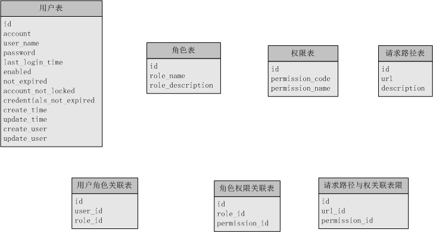

好了，了解了RBAC之后，我们就可以结合spring security实现这么一套权限系统了

`docker-compose.yml`

```yaml
version: '3.1'
services:
  mysql8:
    image: mysql:8.0.13
    restart: always
    environment:
      MYSQL_ROOT_PASSWORD: 123456
    command:
      --default-authentication-plugin=mysql_native_password
      --character-set-server=utf8mb4
      --collation-server=utf8mb4_general_ci
      --explicit_defaults_for_timestamp=true
      --lower_case_table_names=1
    ports:
      - 3306:3306
    volumes:
      - ./data:/var/lib/mysql
```

# 一、入门程序

系统环境：SpringBoot 2.0 + Mybatis + Spring Security 5.0

**注意：SpringSecurity 5.0+ 版本变动较多，且不兼容之前版本，确保你的 SpringBoot 版本为 2.0，能帮你避免掉大部分的坑。**

## 一、导入依赖

导入 `spring-boot-starter-security` 依赖，在 SpringBoot 2.3.3.RELEASE 环境下默认使用的是 5.3.4.RELEASE 版本。

```xml
<?xml version="1.0" encoding="UTF-8"?>
<project xmlns="http://maven.apache.org/POM/4.0.0" xmlns:xsi="http://www.w3.org/2001/XMLSchema-instance"
         xsi:schemaLocation="http://maven.apache.org/POM/4.0.0 https://maven.apache.org/xsd/maven-4.0.0.xsd">
    <modelVersion>4.0.0</modelVersion>
    <parent>
        <groupId>org.springframework.boot</groupId>
        <artifactId>spring-boot-starter-parent</artifactId>
        <version>2.3.4.RELEASE</version>
        <relativePath/> <!-- lookup parent from repository -->
    </parent>
    <groupId>com.xiaoge</groupId>
    <artifactId>login</artifactId>
    <version>0.0.1-SNAPSHOT</version>
    <name>login</name>
    <description>Demo project for Spring Boot</description>

    <properties>
        <java.version>1.8</java.version>
    </properties>

    <dependencies>
        <dependency>
            <groupId>org.springframework.boot</groupId>
            <artifactId>spring-boot-starter-security</artifactId>
        </dependency>
        <dependency>
            <groupId>org.springframework.boot</groupId>
            <artifactId>spring-boot-starter-web</artifactId>
        </dependency>

        <dependency>
            <groupId>mysql</groupId>
            <artifactId>mysql-connector-java</artifactId>
            <version>8.0.13</version>
        </dependency>
        <dependency>
            <groupId>org.projectlombok</groupId>
            <artifactId>lombok</artifactId>
            <optional>true</optional>
        </dependency>

        <!--mybatis-plus的版本-->
        <dependency>
            <groupId>com.baomidou</groupId>
            <artifactId>mybatis-plus-boot-starter</artifactId>
            <version>3.4.0</version>
        </dependency>

        <!--mybatis自动代码生成-->
        <dependency>
            <groupId>com.baomidou</groupId>
            <artifactId>mybatis-plus-generator</artifactId>
            <version>3.4.0</version>
        </dependency>

        <!--代码生成的模板引擎-->
        <dependency>
            <groupId>org.apache.velocity</groupId>
            <artifactId>velocity-engine-core</artifactId>
            <version>2.2</version>
        </dependency>

        <dependency>
            <groupId>org.springframework.boot</groupId>
            <artifactId>spring-boot-starter-test</artifactId>
            <scope>test</scope>
            <exclusions>
                <exclusion>
                    <groupId>org.junit.vintage</groupId>
                    <artifactId>junit-vintage-engine</artifactId>
                </exclusion>
            </exclusions>
        </dependency>
        <dependency>
            <groupId>org.springframework.security</groupId>
            <artifactId>spring-security-test</artifactId>
            <scope>test</scope>
        </dependency>

        <!--swagger-->
        <dependency>
            <groupId>io.springfox</groupId>
            <artifactId>springfox-swagger2</artifactId>
            <version>2.7.0</version>
        </dependency>

        <dependency>
            <groupId>io.springfox</groupId>
            <artifactId>springfox-swagger-ui</artifactId>
            <version>2.7.0</version>
        </dependency>

        <dependency>
            <groupId>com.github.xiaoymin</groupId>
            <artifactId>knife4j-spring-boot-starter</artifactId>
            <version>2.0.4</version>
        </dependency>
    </dependencies>

    <build>
        <plugins>
            <plugin>
                <groupId>org.springframework.boot</groupId>
                <artifactId>spring-boot-maven-plugin</artifactId>
            </plugin>
        </plugins>
    </build>

</project>
```

## 二、创建数据库

一般权限控制有三层，即：`用户`<–>`角色`<–>`权限`，用户与角色是多对多，角色和权限也是多对多。这里我们先暂时不考虑权限，只考虑`用户`<–>`角色`。

创建用户表`sys_user_table`：

```sql
DROP TABLE IF EXISTS `sys_user_table`;
CREATE TABLE `sys_user_table`  (
  `user_id` varchar(50) CHARACTER SET utf8mb4 COLLATE utf8mb4_0900_ai_ci NOT NULL COMMENT '主键',
  `user_name` varchar(45) CHARACTER SET utf8mb4 COLLATE utf8mb4_0900_ai_ci NOT NULL COMMENT '用户名称',
  `pass_word` varchar(100) CHARACTER SET utf8mb4 COLLATE utf8mb4_0900_ai_ci NOT NULL COMMENT '用户密码-BCR算法加密',
  `description` varchar(800) CHARACTER SET utf8mb4 COLLATE utf8mb4_0900_ai_ci NULL DEFAULT NULL COMMENT '描述',
  `state` int(11) NULL DEFAULT NULL COMMENT '状态',
  PRIMARY KEY (`user_id`) USING BTREE
) ENGINE = InnoDB CHARACTER SET = utf8 COLLATE = utf8_bin ROW_FORMAT = Dynamic;
```

创建权限表`sys_role_table`：

```sql
DROP TABLE IF EXISTS `sys_role_table`;
CREATE TABLE `sys_role_table`  (
  `role_id` varchar(45) CHARACTER SET utf8mb4 COLLATE utf8mb4_0900_ai_ci NOT NULL COMMENT '主键',
  `role_name` varchar(20) CHARACTER SET utf8mb4 COLLATE utf8mb4_0900_ai_ci NOT NULL COMMENT '角色ID',
  `description` varchar(45) CHARACTER SET utf8mb4 COLLATE utf8mb4_0900_ai_ci NULL DEFAULT NULL COMMENT '描述',
  PRIMARY KEY (`role_id`) USING BTREE,
  UNIQUE INDEX `sys_role_table_pk`(`role_id`) USING BTREE
) ENGINE = InnoDB CHARACTER SET = utf8 COLLATE = utf8_bin ROW_FORMAT = Dynamic;
```

创建用户-角色表`sys_user_role`：

```sql
DROP TABLE IF EXISTS `sys_role_user_table`;
CREATE TABLE `sys_role_user_table`  (
  `id` int(11) NOT NULL AUTO_INCREMENT COMMENT '主键',
  `role_id` varchar(45) CHARACTER SET utf8mb4 COLLATE utf8mb4_0900_ai_ci NOT NULL COMMENT '角色ID',
  `user_id` varchar(45) CHARACTER SET utf8mb4 COLLATE utf8mb4_0900_ai_ci NOT NULL COMMENT '用户ID',
  PRIMARY KEY (`id`) USING BTREE
) ENGINE = InnoDB AUTO_INCREMENT = 79 CHARACTER SET = utf8 COLLATE = utf8_bin ROW_FORMAT = Dynamic;
```

初始化一下数据：

```sql
INSERT INTO `sys_user_table` VALUES ('0f09bb6fd9b516d25932fcd4c2d1fbfc', '刘伟', '$2a$10$mKVSgJnapbUKoBYfIVJyT.19wG3SuSrn6ZYu20eeon0Mrpc/D1Oey', NULL, 1);
INSERT INTO `sys_user_table` VALUES ('13a0d86310b052bb1d7c57786316077a', '白杨树', '$2a$10$jalwt9mC7GWOkM5HjZroeOuD/1xhXcqvXgSYYX7ruCXBSeIX/ypW6', NULL, 1);
INSERT INTO `sys_user_table` VALUES ('1a9fa07a96f44f40a020b24c54b52428', '程小东', '$2a$10$TKeidhFBUt5oAnCkYkmQj.DpMULqZR3ITCqKep0J36kf50HEgXRZa', NULL, 1);
INSERT INTO `sys_user_table` VALUES ('1f540f553a4dd536e52aeca3d470dad7', '郭强', '$2a$10$Q7Xcmhe8N71niSFriYRREOKACg8nSA8cFDk1NUQTm2JStuasGllN.', NULL, 1);
INSERT INTO `sys_user_table` VALUES ('330708e6680c4e9dd0d772af7343f01e', '谭红红', '$2a$10$jVFVJ59rKW1VObOVWX7Wpedhlb.oubFIFWfqg9RWby5jE2AkPw3bS', NULL, 1);
INSERT INTO `sys_user_table` VALUES ('40529d21d3f4fb975043c63e43630253', '韦博', '$2a$10$Gwk0Oaz04AxZz1O9s7LSfuOw56H9zGX2HG1I3wqLtpEPh/fRbdR2y', NULL, 1);
INSERT INTO `sys_user_table` VALUES ('469c4d4d21d900d2446edaf5f646c663', '郭德纲', '$2a$10$y4d3fWr7ajYQ9qyAdGfW/OG8qInla9U7U4gL0/EDwRvCm2fAeJl6m', NULL, 1);
INSERT INTO `sys_user_table` VALUES ('5ae28c392a6779e41c7d0f8c9f7dfb09', '任静', '$2a$10$VCRbyDApB15zA5wLNTfkNeEvG7Yu3h3fHeG82Cgz6JpaSXeXx/fHe', NULL, 1);
INSERT INTO `sys_user_table` VALUES ('6268cbe21e573513a66799114d925e04', '李兰', '$2a$10$uAU6hwGYTdynwnjOpQFfYO.a17DWhqkaKU52fdw9IKdYY7Pj/QOuy', NULL, 1);
INSERT INTO `sys_user_table` VALUES ('86c887c04ec842d1a5ce7050f263355a', '含', '$2a$10$Omd.iEgCyiHbc8pxPMF.F./FLmRuvf.9tLjjHf8f/mXAzWVGJjToG', 'ceshi', 1);
INSERT INTO `sys_user_table` VALUES ('b0b4c302687e1c29409ebb688298b667', '李四', '$2a$10$mjMbuWPgl/ZkBkfv.uHTk.6k1LTbpPvFoKHivz5I16mEnRbq0REcu', NULL, 1);
INSERT INTO `sys_user_table` VALUES ('b3c9e9218fdf0347cc358755c365f2fa', '郭明', '$2a$10$UdhLqkJ.uCD3e/3Z13mV3eEkIrbxpG3oXNyBLm4y8Kwxs8NnXcOly', NULL, 1);
INSERT INTO `sys_user_table` VALUES ('bcad19f214499feab47f15b18ae9bc88', 'admin', '$2a$10$1H81ddXs9x/KqYC3IA.kBO7hFac5KXHz1Bgwt49GZbwvjXkXbLFTq', '超级管理员', 1);
INSERT INTO `sys_user_table` VALUES ('c2ea699c481735cd2288dcedbc558d54', '魏艳梅', '$2a$10$h5RdNWDVHmwdRV4X/HYR0eOXT9ISRtDXf8RA5/y3nmczAGCZI/iya', NULL, 1);
INSERT INTO `sys_user_table` VALUES ('c915222fff04f4a3e29afff8d62a56f2', '胡柳杨', '$2a$10$VRtWxeuvWP8ILmGWKoDPv.5AACxhznGKV.pspWYVqLrVYHdWp3PAC', NULL, 1);
INSERT INTO `sys_user_table` VALUES ('c9b52031507db4e87e128747afb686bc', '伊能静', '$2a$10$Z./P3eWTSs9klr9cmHwC9uui/BFtfhF5pzwUrKP8Jyi0TisqFL5S2', NULL, 1);
INSERT INTO `sys_user_table` VALUES ('d01c54801e8155223f3a6656056fa2dd', '张三', '$2a$10$4ed508knTPCdkBp5TfiZROge2WWxcYTTCV.LHo3/jI6tbZPK5wwna', NULL, 1);
INSERT INTO `sys_user_table` VALUES ('da52a0c77af941b43fb54074313ebd9a', '郭敬明', '$2a$10$9hWszcWfimQNiwEiet.dCueLMkXxiUAfX35KBLcaNUdwZu4ZvwpZe', NULL, 1);

INSERT INTO `sys_role_table` VALUES ('1', 'ROLE_ADMIN', '超级管理员');
INSERT INTO `sys_role_table` VALUES ('2f412c59e5077e0cd53d21fac3eee402', 'ROLE_收银员', '收银员');
INSERT INTO `sys_role_table` VALUES ('d04c2ebb1e32995f384ad49f6d4b421d', 'ROLE_店长', '店长');

INSERT INTO `sys_role_user_table` VALUES (40, '1', 'bcad19f214499feab47f15b18ae9bc88');
INSERT INTO `sys_role_user_table` VALUES (43, 'd04c2ebb1e32995f384ad49f6d4b421d', '6268cbe21e573513a66799114d925e04');
INSERT INTO `sys_role_user_table` VALUES (76, '2f412c59e5077e0cd53d21fac3eee402', 'd01c54801e8155223f3a6656056fa2dd');
INSERT INTO `sys_role_user_table` VALUES (77, '2f412c59e5077e0cd53d21fac3eee402', '86c887c04ec842d1a5ce7050f263355a');
INSERT INTO `sys_role_user_table` VALUES (78, '2f412c59e5077e0cd53d21fac3eee402', '0f09bb6fd9b516d25932fcd4c2d1fbfc');
INSERT INTO `sys_role_user_table` VALUES (79, '2f412c59e5077e0cd53d21fac3eee402', 'b0b4c302687e1c29409ebb688298b667');
```

**注意：**

> 这里的权限格式为`ROLE_XXX`，是Spring Security规定的，不要乱起名字哦。

## 三、准备页面

因为是示例程序，页面越简单越好，只用于登陆的`login.html`以及用于登陆成功后的`home.html`，将其放置在 `resources/static` 目录下：

(1)login.html：

```html
<!DOCTYPE html>
<html lang="en">
<head>
    <meta charset="UTF-8">
    <title>登陆</title>
</head>
<body>
<h1>登陆</h1>
<form method="post" action="/login">
    <div>
        用户名：<input type="text" name="username">
    </div>
    <div>
        密码：<input type="password" name="password">
    </div>
    <div>
        <button type="submit">立即登陆</button>
    </div>
</form>
</body>
</html>
```

**注意：**

> 用户的登陆认证是由Spring Security进行处理的，请求路径默认为`/login`，用户名字段默认为`username`，密码字段默认为`password`

(2)home.html：

```html
<!DOCTYPE html>
<html lang="en">
<head>
    <meta charset="UTF-8">
    <title>Title</title>
</head>
<body>
    <h1>登陆成功</h1>
    <a href="/admin">检测ROLE_ADMIN角色</a>
    <a href="/checker">检测ROLE_收银员角色</a>
    <a href="/manager">检测ROLE_店长角色</a>
    <button onclick="window.location.href='/logout'">退出登录</button>
</body>
</html>
```

## 四、配置application.properties

在配置文件中配置下数据库连接：

```properties
spring:
  application:
    name: login

  datasource:
    driver-class-name: com.mysql.cj.jdbc.Driver
    url: jdbc:mysql://localhost:3306/springsecurity?useUnicode=true&characterEncoding=UTF-8&serverTimezone=GMT%2B8
    username: root
    password: root
  jackson:
    date-format: yyyy-MM-dd HH:mm:ss
    time-zone: GMT+8

mybatis-plus:
  configuration:
    log-impl: org.apache.ibatis.logging.stdout.StdOutImpl
  global-config:
    db-config:
      logic-delete-field: deleted  # 全局逻辑删除的实体字段名(since 3.3.0,配置后可以忽略不配置步骤2)
      logic-delete-value: 1 # 逻辑已删除值(默认为 1)
      logic-not-delete-value: 0 # 逻辑未删除值(默认为 0)
  mapper-locations: classpath*:/mapper/*.xml
  type-aliases-package: com.xiaoge.security.entity
```

## 五、创建实体、Dao、Service和Controller

### 5.1 实体

(1)UserTable

```java
package com.xiaoge.security.entity;

import com.baomidou.mybatisplus.annotation.TableName;
import com.baomidou.mybatisplus.annotation.IdType;
import com.baomidou.mybatisplus.annotation.TableId;
import java.io.Serializable;
import io.swagger.annotations.ApiModel;
import io.swagger.annotations.ApiModelProperty;
import lombok.Data;
import lombok.EqualsAndHashCode;

/**
 * <p>
 * 
 * </p>
 *
 * @author xiaoge
 * @since 2020-09-21
 */
@Data
@EqualsAndHashCode(callSuper = false)
@TableName("sys_user_table")
@ApiModel(value="UserTable对象", description="")
public class UserTable implements Serializable {

    private static final long serialVersionUID = 1L;

    @ApiModelProperty(value = "主键")
    @TableId(value = "user_id", type = IdType.AUTO)
    private String userId;

    @ApiModelProperty(value = "用户名称")
    private String userName;

    @ApiModelProperty(value = "用户密码-BCR算法加密")
    private String passWord;

    @ApiModelProperty(value = "描述")
    private String description;

    @ApiModelProperty(value = "状态")
    private Integer state;
}
```

(2)RoleTable

```java
package com.xiaoge.security.entity;

import com.baomidou.mybatisplus.annotation.TableName;
import com.baomidou.mybatisplus.annotation.IdType;
import com.baomidou.mybatisplus.annotation.TableId;
import java.io.Serializable;
import io.swagger.annotations.ApiModel;
import io.swagger.annotations.ApiModelProperty;
import lombok.Data;
import lombok.EqualsAndHashCode;

/**
 * <p>
 * 
 * </p>
 *
 * @author xiaoge
 * @since 2020-09-21
 */
@Data
@EqualsAndHashCode(callSuper = false)
@TableName("sys_role_table")
@ApiModel(value="RoleTable对象", description="")
public class RoleTable implements Serializable {

    private static final long serialVersionUID = 1L;

    @ApiModelProperty(value = "主键")
    @TableId(value = "role_id", type = IdType.AUTO)
    private String roleId;

    @ApiModelProperty(value = "角色ID")
    private String roleName;

    @ApiModelProperty(value = "描述")
    private String description;
}
```

(3)RoleUserTable

```java
package com.xiaoge.security.entity;

import com.baomidou.mybatisplus.annotation.TableName;
import com.baomidou.mybatisplus.annotation.IdType;
import com.baomidou.mybatisplus.annotation.TableId;
import java.io.Serializable;
import io.swagger.annotations.ApiModel;
import io.swagger.annotations.ApiModelProperty;
import lombok.Data;
import lombok.EqualsAndHashCode;

/**
 * <p>
 * 
 * </p>
 *
 * @author xiaoge
 * @since 2020-09-21
 */
@Data
@EqualsAndHashCode(callSuper = false)
@TableName("sys_role_user_table")
@ApiModel(value="RoleUserTable对象", description="")
public class RoleUserTable implements Serializable {

    private static final long serialVersionUID = 1L;

    @ApiModelProperty(value = "主键")
    @TableId(value = "id", type = IdType.AUTO)
    private Integer id;

    @ApiModelProperty(value = "角色ID")
    private String roleId;

    @ApiModelProperty(value = "用户ID")
    private String userId;


}
```

### 5.2 Dao

(1)UserTableMapper

```java
package com.xiaoge.security.mapper;

import com.xiaoge.security.entity.UserTable;
import com.baomidou.mybatisplus.core.mapper.BaseMapper;
import org.apache.ibatis.annotations.Select;

/**
 * <p>
 *  Mapper 接口
 * </p>
 *
 * @author xiaoge
 * @since 2020-09-21
 */
public interface UserTableMapper extends BaseMapper<UserTable> {

    @Select("SELECT * FROM sys_user_table WHERE user_id = #{id}")
    UserTable selectById(String id);

    @Select("SELECT * FROM sys_user_table WHERE user_name = #{name}")
    UserTable selectByName(String name);
}
```

(2)RoleTableMapper

```java
package com.xiaoge.security.mapper;

import com.xiaoge.security.entity.RoleTable;
import com.baomidou.mybatisplus.core.mapper.BaseMapper;
import org.apache.ibatis.annotations.Select;

/**
 * <p>
 *  Mapper 接口
 * </p>
 *
 * @author xiaoge
 * @since 2020-09-21
 */
public interface RoleTableMapper extends BaseMapper<RoleTable> {

    @Select("SELECT * FROM sys_role_table WHERE role_id = #{id}")
    RoleTable selectById(String id);
}
```

(3)RoleUserTableMapper

```java
package com.xiaoge.security.mapper;

import com.xiaoge.security.entity.RoleUserTable;
import com.baomidou.mybatisplus.core.mapper.BaseMapper;
import org.apache.ibatis.annotations.Select;

import java.util.List;

/**
 * <p>
 *  Mapper 接口
 * </p>
 *
 * @author xiaoge
 * @since 2020-09-21
 */
public interface RoleUserTableMapper extends BaseMapper<RoleUserTable> {

    @Select("SELECT * FROM sys_role_user_table WHERE user_id = #{userId}")
    List<RoleUserTable> listByUserId(String userId);
}
```

### 5.3 Service

(1)UserTableService

```java
package com.xiaoge.security.service;

import com.xiaoge.security.entity.UserTable;
import com.baomidou.mybatisplus.extension.service.IService;

/**
 * <p>
 *  服务类
 * </p>
 *
 * @author xiaoge
 * @since 2020-09-21
 */
public interface UserTableService extends IService<UserTable> {

    UserTable selectById(String id);

    UserTable selectByName(String name);
}
```

(2)RoleTableService

```java
package com.xiaoge.security.service;

import com.xiaoge.security.entity.RoleTable;
import com.baomidou.mybatisplus.extension.service.IService;

/**
 * <p>
 *  服务类
 * </p>
 *
 * @author xiaoge
 * @since 2020-09-21
 */
public interface RoleTableService extends IService<RoleTable> {

    RoleTable selectById(String id);
}
```

(3)RoleUserTableService

```java
package com.xiaoge.security.service;

import com.xiaoge.security.entity.RoleUserTable;
import com.baomidou.mybatisplus.extension.service.IService;

import java.util.List;

/**
 * <p>
 *  服务类
 * </p>
 *
 * @author xiaoge
 * @since 2020-09-21
 */
public interface RoleUserTableService extends IService<RoleUserTable> {

    List<RoleUserTable> listByUserId(String userId);
}
```

**Impl**

(1)UserTableServiceImpl

```java
package com.xiaoge.security.service.impl;

import com.xiaoge.security.entity.UserTable;
import com.xiaoge.security.mapper.UserTableMapper;
import com.xiaoge.security.service.UserTableService;
import com.baomidou.mybatisplus.extension.service.impl.ServiceImpl;
import org.springframework.beans.factory.annotation.Autowired;
import org.springframework.stereotype.Service;

/**
 * <p>
 *  服务实现类
 * </p>
 *
 * @author xiaoge
 * @since 2020-09-21
 */
@Service
public class UserTableServiceImpl extends ServiceImpl<UserTableMapper, UserTable> implements UserTableService {

    @Override
    public UserTable selectById(String id) {
        return this.baseMapper.selectById(id);
    }

    @Override
    public UserTable selectByName(String name) {
        return this.baseMapper.selectByName(name);
    }
}
```

(2)RoleTableServiceImpl

```java
package com.xiaoge.security.service.impl;

import com.xiaoge.security.entity.RoleTable;
import com.xiaoge.security.mapper.RoleTableMapper;
import com.xiaoge.security.service.RoleTableService;
import com.baomidou.mybatisplus.extension.service.impl.ServiceImpl;
import org.springframework.beans.factory.annotation.Autowired;
import org.springframework.stereotype.Service;

/**
 * <p>
 *  服务实现类
 * </p>
 *
 * @author xiaoge
 * @since 2020-09-21
 */
@Service
public class RoleTableServiceImpl extends ServiceImpl<RoleTableMapper, RoleTable> implements RoleTableService {

    @Override
    public RoleTable selectById(String id){
        return this.baseMapper.selectById(id);
    }
}
```

(3)RoleUserTableServiceImpl

```java
package com.xiaoge.security.service.impl;

import com.xiaoge.security.entity.RoleUserTable;
import com.xiaoge.security.mapper.RoleUserTableMapper;
import com.xiaoge.security.service.RoleUserTableService;
import com.baomidou.mybatisplus.extension.service.impl.ServiceImpl;
import org.springframework.beans.factory.annotation.Autowired;
import org.springframework.stereotype.Service;

import java.util.List;

/**
 * <p>
 *  服务实现类
 * </p>
 *
 * @author xiaoge
 * @since 2020-09-21
 */
@Service
public class RoleUserTableServiceImpl extends ServiceImpl<RoleUserTableMapper, RoleUserTable> implements RoleUserTableService {

    @Override
    public List<RoleUserTable> listByUserId(String userId) {
        return this.baseMapper.listByUserId(userId);
    }
}
```

### 5.4 Controller

```java
package com.xiaoge.security.controller;

import org.slf4j.Logger;
import org.slf4j.LoggerFactory;
import org.springframework.security.access.prepost.PreAuthorize;
import org.springframework.security.core.context.SecurityContextHolder;
import org.springframework.stereotype.Controller;
import org.springframework.web.bind.annotation.RequestMapping;
import org.springframework.web.bind.annotation.ResponseBody;

/**
 * @author NieChangan
 */
@Controller
public class LoginController {
    private Logger logger = LoggerFactory.getLogger(LoginController.class);

    @RequestMapping("/")
    public String showHome() {
        String name = SecurityContextHolder.getContext().getAuthentication().getName();
        logger.info("当前登陆用户：" + name);

        return "home.html";
    }

    @RequestMapping("/login")
    public String showLogin() {
        return "login.html";
    }

    @RequestMapping("/admin")
    @ResponseBody
    @PreAuthorize("hasRole('ROLE_ADMIN')")
    public String printAdmin() {
        return "如果你看见这句话，说明你有ROLE_ADMIN角色";
    }

    @RequestMapping("/checker")
    @ResponseBody
    @PreAuthorize("hasRole('ROLE_收银员')")
    public String printChecker() {
        return "如果你看见这句话，说明你有ROLE_收银员角色";
    }

    @RequestMapping("/manager")
    @ResponseBody
    @PreAuthorize("hasRole('ROLE_店长')")
    public String printManager() {
        return "如果你看见这句话，说明你有ROLE_店长角色";
    }
}
```

**注意：**

> 如代码所示，获取当前登录用户：`SecurityContextHolder.getContext().getAuthentication()`
>
> `@PreAuthorize` 用于判断用户是否有指定权限，没有就不能访问

## 六、配置SpringSecurity

### 6.1 UserDetailsService

首先我们需要自定义 `UserDetailsService` ，将用户信息和权限注入进来。

我们需要重写 `loadUserByUsername` 方法，参数是用户输入的用户名。返回值是`UserDetails`，这是一个接口，一般使用它的子类`org.springframework.security.core.userdetails.User`，它有三个参数，分别是用户名、密码和权限集。

> 实际情况下，大多将 DAO 中的 User 类继承 `org.springframework.security.core.userdetails.User` 返回。

```java
package com.xiaoge.security.service.auth;

import com.xiaoge.security.entity.RoleTable;
import com.xiaoge.security.entity.RoleUserTable;
import com.xiaoge.security.entity.UserTable;
import com.xiaoge.security.service.RoleTableService;
import com.xiaoge.security.service.RoleUserTableService;
import com.xiaoge.security.service.UserTableService;
import org.springframework.beans.factory.annotation.Autowired;
import org.springframework.security.core.GrantedAuthority;
import org.springframework.security.core.authority.SimpleGrantedAuthority;
import org.springframework.security.core.userdetails.User;
import org.springframework.security.core.userdetails.UserDetails;
import org.springframework.security.core.userdetails.UserDetailsService;
import org.springframework.security.core.userdetails.UsernameNotFoundException;
import org.springframework.stereotype.Service;

import java.util.ArrayList;
import java.util.Collection;
import java.util.List;

/**
 * @author NieChangan
 */
@Service("userDetailsService")
public class CustomUserDetailsService implements UserDetailsService {
    @Autowired
    private UserTableService userTableService;

    @Autowired
    private RoleTableService roleTableService;

    @Autowired
    private RoleUserTableService roleUserTableService;

    @Override
    public UserDetails loadUserByUsername(String username) throws UsernameNotFoundException {
        Collection<GrantedAuthority> authorities = new ArrayList<>();
        if(username==null){
            throw new RuntimeException("用户名不能为空");
        }
        UserTable userTable = userTableService.selectByName(username);
        if(userTable==null){
            throw new UsernameNotFoundException(String.format("%s这个用户不存在",username));
        }
        List<RoleUserTable> roles = roleUserTableService.listByUserId(userTable.getUserId());
        roles.forEach(role->{
            RoleTable roleTable = roleTableService.selectById(role.getRoleId());
            authorities.add(new SimpleGrantedAuthority(roleTable.getRoleName()));
        });
        return new User(userTable.getUserName(),userTable.getPassWord(),authorities);
    }
}
```

### 6.2 WebSecurityConfig

该类是 Spring Security 的配置类，该类的三个注解分别是标识该类是配置类、开启 Security 服务、开启全局 Securtiy 注解。

首先将我们自定义的 `userDetailsService` 注入进来，在 `configure()` 方法中使用 `auth.userDetailsService()` 方法替换掉默认的 userDetailsService。

这里我们还指定了密码的加密方式（5.0 版本强制要求设置），因为我们数据库是明文存储的，所以明文返回即可，如下所示：

```java
@Configuration
@EnableWebSecurity
@EnableGlobalMethodSecurity(prePostEnabled = true)
public class WebSecurityConfig extends WebSecurityConfigurerAdapter {
    @Autowired
    private CustomUserDetailsService userDetailsService;

    @Override
    protected void configure(AuthenticationManagerBuilder auth) throws Exception {
        auth.userDetailsService(userDetailsService).passwordEncoder(new PasswordEncoder() {
            @Override
            public String encode(CharSequence charSequence) {
                return charSequence.toString();
            }

            @Override
            public boolean matches(CharSequence charSequence, String s) {
                return s.equals(charSequence.toString());
            }
        });
    }

    @Override
    protected void configure(HttpSecurity http) throws Exception {
        http.authorizeRequests()
                // 如果有允许匿名的url，填在下面
//                .antMatchers().permitAll()
                .anyRequest().authenticated()
                .and()
                // 设置登陆页
                .formLogin().loginPage("/login")
                // 设置登陆成功页
                .defaultSuccessUrl("/").permitAll()
                // 自定义登陆用户名和密码参数，默认为username和password
//                .usernameParameter("username")
//                .passwordParameter("password")
                .and()
                .logout().permitAll();

        // 关闭CSRF跨域
        http.csrf().disable();
    }

    @Override
    public void configure(WebSecurity web) throws Exception {
        // 设置拦截忽略文件夹，可以对静态资源放行
        web.ignoring().antMatchers("/css/**", "/js/**");
    }
}
```

**项目结构**

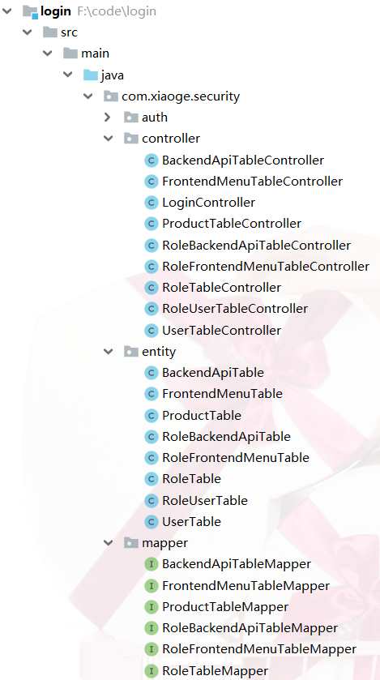


## 七、运行程序

> ROLE_ADMIN 账户：用户名 **admin**，密码 **000000**
>  ROLE_USER 账户：用户名 **xiaoge**，密码 **123**

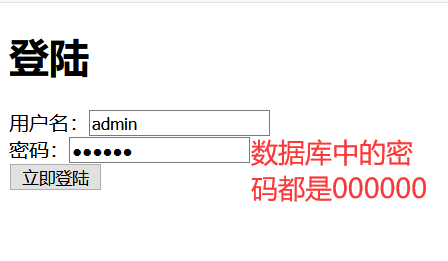

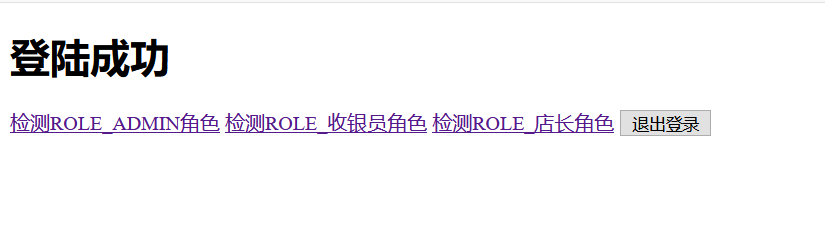

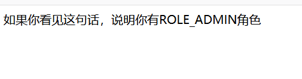

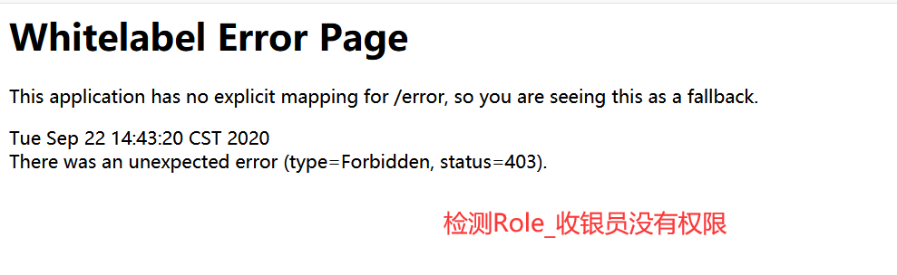

注：如果你想要将密码加密，可以修改 `configure()` 方法如下：

```java
@Override
protected void configure(AuthenticationManagerBuilder auth) throws Exception {
     auth.userDetailsService(userDetailsService)
         .passwordEncoder(new BCryptPasswordEncoder());
 }
```

## 八、扩展知识

### HttpSecurity 中的 form 表单登录

启用表单登录通过两种方式一种是通过 `HttpSecurity` 的 `apply(C configurer)` 方法自己构造一个 `AbstractAuthenticationFilterConfigurer` 的实现，这种是比较高级的玩法。 另一种是我们常见的使用 `HttpSecurity` 的 `formLogin()` 方法来自定义 `FormLoginConfigurer` 。我们先搞一下比较常规的第二种。

### FormLoginConfigurer

该类是 **form** 表单登录的配置类。它提供了一些我们常用的配置方法：

-  **loginPage(String loginPage)** : 登录 **页面**而并不是接口，对于前后分离模式需要我们进行改造 默认为 `/login`。
-  **loginProcessingUrl(String loginProcessingUrl)**   实际表单向后台提交用户信息的 `Action`，再由过滤器`UsernamePasswordAuthenticationFilter` 拦截处理，该 `Action` 其实不会处理任何逻辑。
-  **usernameParameter(String usernameParameter)** 用来自定义用户参数名，默认 `username` 。
-  **passwordParameter(String passwordParameter)** 用来自定义用户密码名，默认 `password` 
-  **failureUrl(String authenticationFailureUrl)**  登录失败后会重定向到此路径， 一般前后分离不会使用它。
-  **failureForwardUrl(String forwardUrl)** 登录失败会转发到此， 一般前后分离用到它。 可定义一个 `Controller` （控制器）来处理返回值,但是要注意 `RequestMethod`。
-  **defaultSuccessUrl(String defaultSuccessUrl, boolean alwaysUse)**  默认登陆成功后跳转到此 ，如果 `alwaysUse` 为 `true`  只要进行认证流程而且成功，会一直跳转到此。一般推荐默认值 `false` 
-  **successForwardUrl(String forwardUrl)**  效果等同于上面 `defaultSuccessUrl` 的 `alwaysUse` 为 `true` 但是要注意 `RequestMethod`。
-  **successHandler(AuthenticationSuccessHandler successHandler)** 自定义认证成功处理器，可替代上面所有的 `success` 方式
-  **failureHandler(AuthenticationFailureHandler authenticationFailureHandler)** 自定义失败成功处理器，可替代上面所有的 `failure` 方式
-  **permitAll(boolean permitAll)**  **form** 表单登录是否放开

知道了这些我们就能来搞个定制化的登录了。

# 二、自动登录

## 一、修改login.html

在登陆页添加自动登录的选项，注意自动登录字段的 name 必须是 `remember-me` ：

```html
<!DOCTYPE html>
<html lang="en">
<head>
    <meta charset="UTF-8">
    <title>登陆</title>
</head>
<body>
<h1>登陆</h1>
<form method="post" action="/login">
    <div>
        用户名：<input type="text" name="username">
    </div>
    <div>
        密码：<input type="password" name="password">
    </div>
    <div>
        <label><input type="checkbox" name="remember-me"/>自动登录</label>
        <button type="submit">立即登陆</button>
    </div>
</form>
</body>
</html>
```

## 二、两种实现方式

### 2.1 Cookie 存储

这种方式十分简单，只要在 WebSecurityConfig 中的 configure() 方法添加一个 `rememberMe()` 即可,如下所示：

```java
@Override
protected void configure(HttpSecurity http) throws Exception {
    http.authorizeRequests()
            // 如果有允许匿名的url，填在下面
//                .antMatchers().permitAll()
            .anyRequest().authenticated()
            .and()
            // 设置登陆页
            .formLogin().loginPage("/login")
            // 设置登陆成功页
            .defaultSuccessUrl("/").permitAll()
            // 自定义登陆用户名和密码参数，默认为username和password
//                .usernameParameter("username")
//                .passwordParameter("password")
            .and()
            .logout().permitAll()
            // 自动登录
            .and().rememberMe();

    // 关闭CSRF跨域
    http.csrf().disable();
}
```

当我们登陆时勾选自动登录时，会自动在 Cookie 中保存一个名为 `remember-me` 的cookie，默认有效期为2周，其值是一个加密字符串：

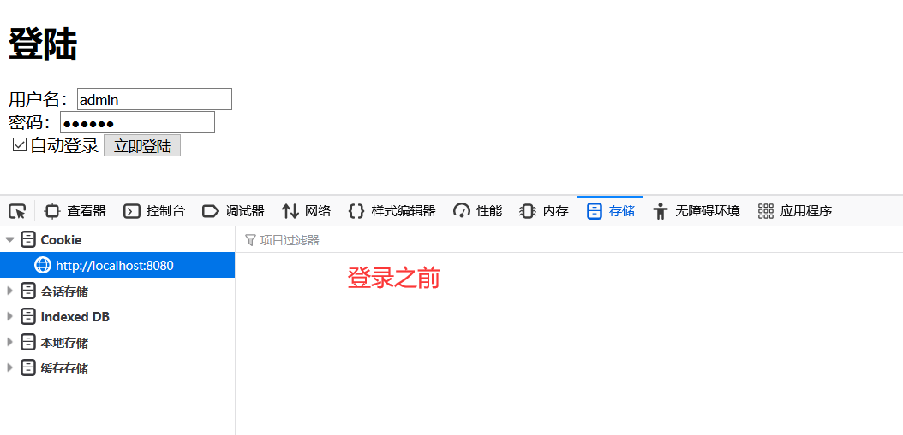

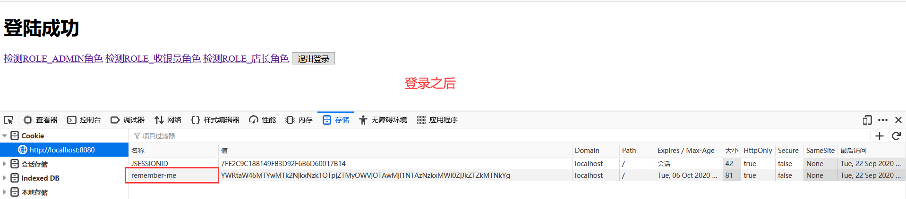

### 2.2 数据库存储

使用 Cookie 存储虽然很方便，但是大家都知道 Cookie 毕竟是保存在客户端的，而且 Cookie 的值还与用户名、密码这些敏感数据相关，虽然加密了，但是将敏感信息存在客户端，毕竟不太安全。

Spring security 还提供了另一种相对更安全的实现机制：**在客户端的 Cookie 中，仅保存一个无意义的加密串（与用户名、密码等敏感数据无关），然后在数据库中保存该加密串-用户信息的对应关系，自动登录时，用 Cookie 中的加密串，到数据库中验证，如果通过，自动登录才算通过。**

#### 2.2.1 基本原理

当浏览器发起表单登录请求时，当通过 `UsernamePasswordAuthenticationFilter` 认证成功后，会经过 `RememberMeService`，在其中有个 `TokenRepository`，它会生成一个 token，首先将 token 写入到浏览器的 Cookie 中，然后将 token、认证成功的用户名写入到数据库中。

当浏览器下次请求时，会经过 `RememberMeAuthenticationFilter`，它会读取 Cookie 中的 token，交给 RememberMeService 从数据库中查询记录。如果存在记录，会读取用户名并去调用 `UserDetailsService`，获取用户信息，并将用户信息放入Spring Security 中，实现自动登陆。


RememberMeAuthenticationFilter 在整个过滤器链中是比较靠后的位置，也就是说在传统登录方式都无法登录的情况下才会使用自动登陆。


#### 2.2.2 代码实现

首先需要创建一张表来存储 token 信息：

其实这些创建表的sql语句在`JdbcTokenRepositoryImpl`类中都可以找到

```sql
CREATE TABLE `persistent_logins` (
  `username` varchar(64) NOT NULL,
  `series` varchar(64) NOT NULL,
  `token` varchar(64) NOT NULL,
  `last_used` timestamp NOT NULL DEFAULT CURRENT_TIMESTAMP ON UPDATE CURRENT_TIMESTAMP,
  PRIMARY KEY (`series`)
) ENGINE=InnoDB DEFAULT CHARSET=utf8;
```

**注意：**

> 创建的表名称一定要是**persistent_logins**，安哥亲身经历,血的教训

在 WebSecurityConfig 中注入 `dataSource` ，创建一个 `PersistentTokenRepository` 的Bean：

```java
@Autowired
private DataSource dataSource;

 @Bean
 public PersistentTokenRepository persistentTokenRepository(){
     JdbcTokenRepositoryImpl tokenRepository = new JdbcTokenRepositoryImpl();
     tokenRepository.setDataSource(dataSource);
     // 如果token表不存在，使用下面语句可以初始化该表；若存在，请注释掉这条语句，否则会报错。
//        tokenRepository.setCreateTableOnStartup(true);
     return tokenRepository;
 }
```

在 `config()` 中按如下所示配置自动登陆：

```java
@Override
protected void configure(HttpSecurity http) throws Exception {
    http.authorizeRequests()
            // 如果有允许匿名的url，填在下面
//                .antMatchers().permitAll()
            .anyRequest().authenticated()
            .and()
            // 设置登陆页
            .formLogin().loginPage("/login")
            // 设置登陆成功页
            .defaultSuccessUrl("/").permitAll()
            // 自定义登陆用户名和密码参数，默认为username和password
//                .usernameParameter("username")
//                .passwordParameter("password")
            .and()
            .logout().permitAll()
            // 自动登录
            .and().rememberMe()
                .tokenRepository(persistentTokenRepository())
                // 有效时间：单位s
                .tokenValiditySeconds(60)
                .userDetailsService(userDetailsService);

    // 关闭CSRF跨域
    http.csrf().disable();
}
```

## 三、运行程序

勾选自动登录后，Cookie 和数据库中均存储了 token 信息：

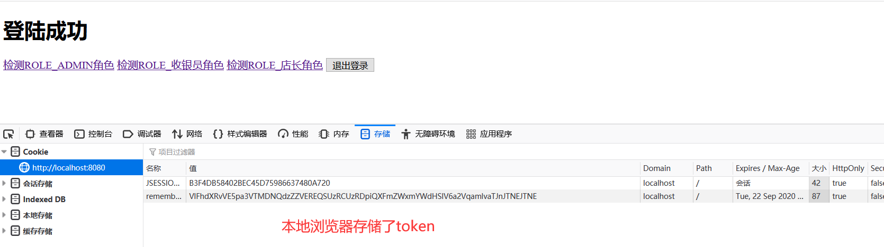

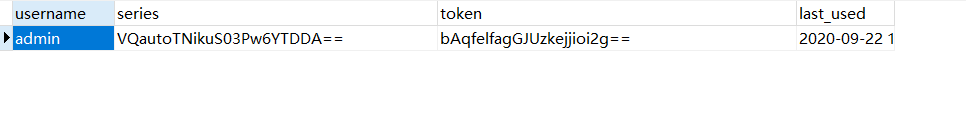

# 三、异常处理

不知道你有没有注意到，当我们登陆失败时候，Spring security 帮我们跳转到了 `/login?error` Url，奇怪的是不管是控制台还是网页上都没有打印错误信息。

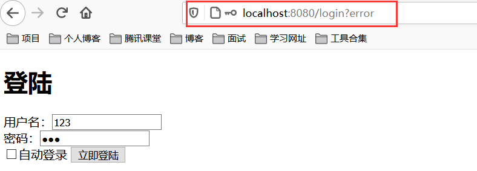

这是因为首先 `/login?error` 是 Spring security 默认的失败 Url，其次**如果你不手动处理这个异常，这个异常是不会被处理的**。

## 一、常见异常

我们先来列举下一些 Spring Security 中常见的异常：

- `UsernameNotFoundException`（用户不存在）
- `DisabledException`（用户已被禁用）
- `BadCredentialsException`（坏的凭据/也可以理解为密码有问题吧）
- `LockedException`（账户锁定）
- `AccountExpiredException` （账户过期）
- `CredentialsExpiredException`（证书过期）
- …

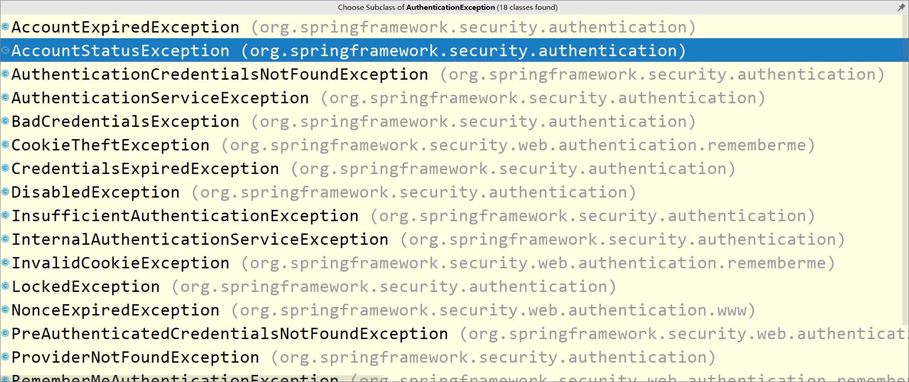

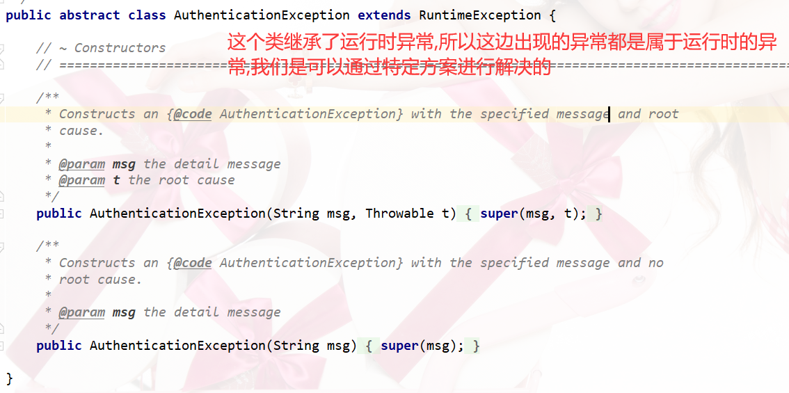

以上列出的这些异常都是 `AuthenticationException` 的子类，然后我们来看看 Spring security 如何处理 `AuthenticationException` 异常的。

## 二、源码分析

我们知道异常处理一般在过滤器中处理，我们在 `AbstractAuthenticationProcessingFilter` 中找到了对 `AuthenticationException` 的处理：

（1）在 `doFilter()` 中，捕捉了 `AuthenticationException` 异常，并交给了 `unsuccessfulAuthentication()` 处理。

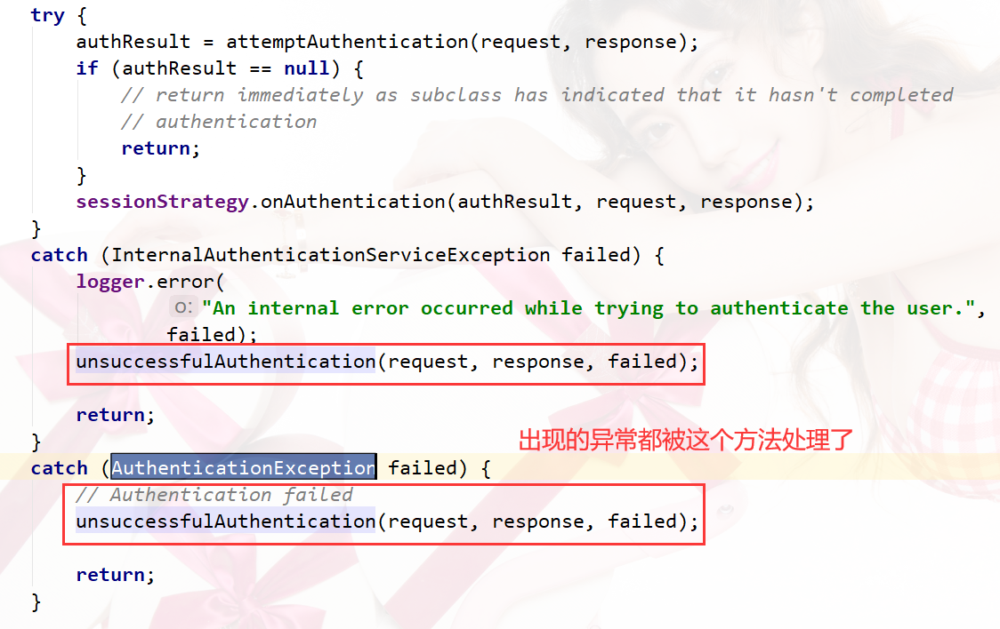

（2）在 `unsuccessfulAuthentication()` 中，转交给了 `SimpleUrlAuthenticationFailureHandler` 类的 `onAuthenticationFailure()` 处理。

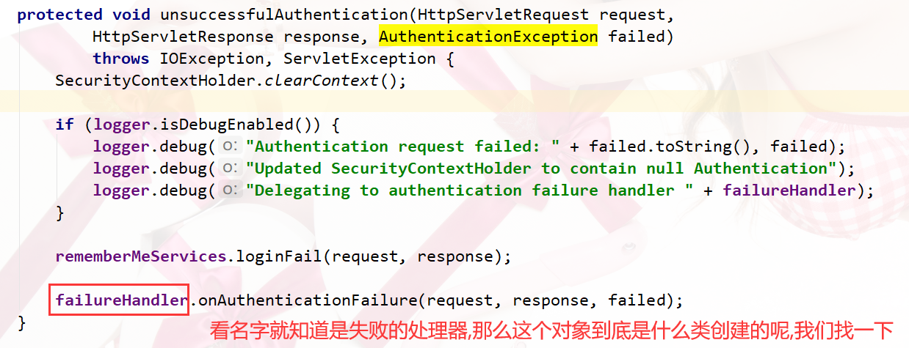

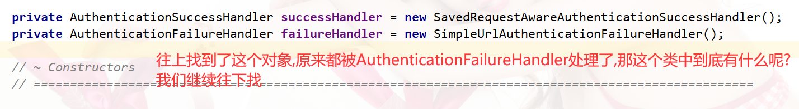

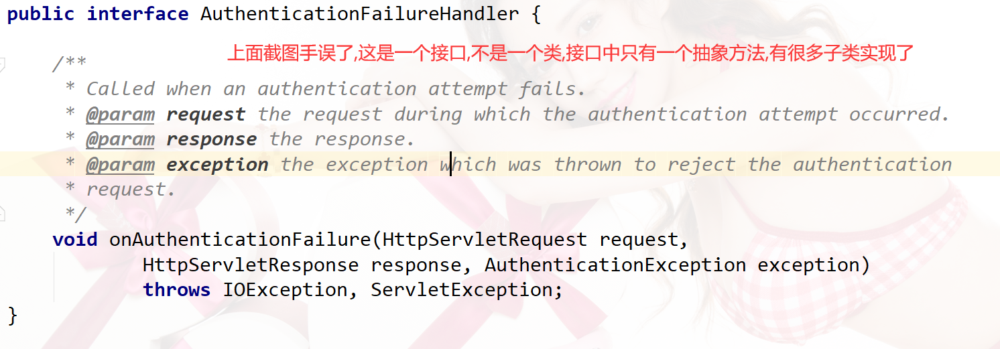

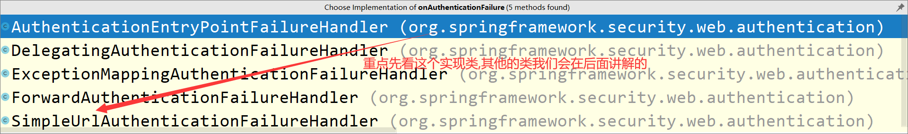

（3）在`onAuthenticationFailure()`中，首先判断有没有设置`defaultFailureUrl`。

- 如果没有设置，直接返回 401 错误，即 `HttpStatus.UNAUTHORIZED` 的值。
- 如果设置了，首先执行 `saveException()` 方法。然后判断 `forwardToDestination` ，即是否是服务器跳转，默认使用重定向即客户端跳转。

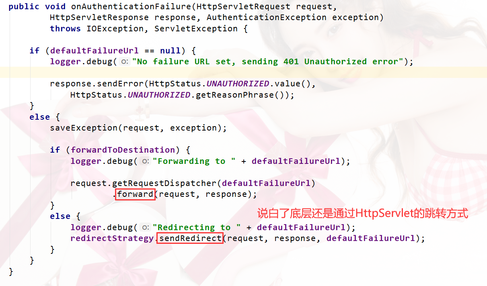

（4）在 `saveException()` 方法中，首先判断`forwardToDestination`，如果使用服务器跳转则写入 Request，客户端跳转则写入 Session。写入名为 `SPRING_SECURITY_LAST_EXCEPTION` ，值为 `AuthenticationException`。

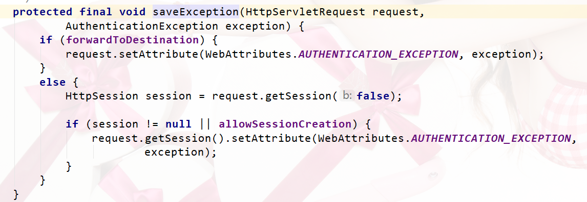

至此 Spring security 完成了异常处理，总结一下流程：

–> AbstractAuthenticationProcessingFilter`.doFilter()`

–> AbstractAuthenticationProcessingFilter.`unsuccessfulAuthentication()`

–> SimpleUrlAuthenticationFailureHandler.`onAuthenticationFailure()`

–> SimpleUrlAuthenticationFailureHandler.`saveException()`

## 三、处理异常

上面源码说了那么多，真正处理起来很简单，我们只需要指定错误的url，然后再该方法中对异常进行处理即可。

（1）指定错误Url，`WebSecurityConfig`中添加`.failureUrl("/login/error")`

```java
...
@Override
protected void configure(HttpSecurity http) throws Exception {
    http.authorizeRequests()
            // 如果有允许匿名的url，填在下面
//                .antMatchers().permitAll()
            .anyRequest().authenticated()
            .and()
            // 设置登陆页
            .formLogin().loginPage("/login")
            // 设置登陆成功页
            .defaultSuccessUrl("/").permitAll()
            // 登录失败Url
            .failureUrl("/login/error")
            // 自定义登陆用户名和密码参数，默认为username和password
//                .usernameParameter("username")
//                .passwordParameter("password")
            .and()
            .logout().permitAll()
            // 自动登录
            .and().rememberMe()
                .tokenRepository(persistentTokenRepository())
                // 有效时间：单位s
                .tokenValiditySeconds(60)
                .userDetailsService(userDetailsService);

    // 关闭CSRF跨域
    http.csrf().disable();
}
```

（2）在Controller中处理异常

```java
@RequestMapping("/login/error")
public void loginError(HttpServletRequest request, HttpServletResponse response) {
    response.setContentType("text/html;charset=utf-8");
    AuthenticationException exception =
            (AuthenticationException)request.getSession().getAttribute("SPRING_SECURITY_LAST_EXCEPTION");
    try {
        response.getWriter().write(exception.toString());
    }catch (IOException e) {
        e.printStackTrace();
    }
}
```

我们首先获取了 session 中的 `SPRING_SECURITY_LAST_EXCEPTION` 。为了演示，我只是简单的将错误信息返回给了页面。运行程序，当我们输入错误密码时：

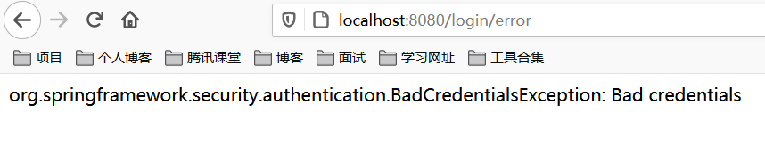

# 四、自定义表单登录

通过前面三章的学习，应该大致了解了 Spring Security 的流程。你应该发现了，真正的 login 请求是由 Spring Security 帮我们处理的，那么我们如何实现自定义表单登录呢，比如添加一个验证码…

首先在上一篇文章的基础上，添加验证码功能。

### 一、添加验证码

验证码的 Servlet 代码，大家无需关心其内部实现，我也是百度直接捞了一个，直接复制即可。

#### 1.1 验证码 Servlet

```java
public class VerifyServlet extends HttpServlet {

    private static final long serialVersionUID = -5051097528828603895L;

    /**
     * 验证码图片的宽度。
     */
    private int width = 100;

    /**
     *  验证码图片的高度。
     */
    private int height = 30;

    /**
     * 验证码字符个数
     */
    private int codeCount = 4;

    /**
     * 字体高度
     */
    private int fontHeight;

    /**
     * 干扰线数量
     */
    private int interLine = 16;

    /**
     * 第一个字符的x轴值，因为后面的字符坐标依次递增，所以它们的x轴值是codeX的倍数
     */
    private int codeX;

    /**
     * codeY ,验证字符的y轴值，因为并行所以值一样
     */
    private int codeY;

    /**
     * codeSequence 表示字符允许出现的序列值
     */
    char[] codeSequence = { 'A', 'B', 'C', 'D', 'E', 'F', 'G', 'H', 'I', 'J',
            'K', 'L', 'M', 'N', 'O', 'P', 'Q', 'R', 'S', 'T', 'U', 'V', 'W',
            'X', 'Y', 'Z', '0', '1', '2', '3', '4', '5', '6', '7', '8', '9' };

    /**
     * 初始化验证图片属性
     */
    @Override
    public void init() throws ServletException {
        // 从web.xml中获取初始信息
        // 宽度
        String strWidth = this.getInitParameter("width");
        // 高度
        String strHeight = this.getInitParameter("height");
        // 字符个数
        String strCodeCount = this.getInitParameter("codeCount");
        // 将配置的信息转换成数值
        try {
            if (strWidth != null && strWidth.length() != 0) {
                width = Integer.parseInt(strWidth);
            }
            if (strHeight != null && strHeight.length() != 0) {
                height = Integer.parseInt(strHeight);
            }
            if (strCodeCount != null && strCodeCount.length() != 0) {
                codeCount = Integer.parseInt(strCodeCount);
            }
        } catch (NumberFormatException e) {
            e.printStackTrace();
        }
        //width-4 除去左右多余的位置，使验证码更加集中显示，减得越多越集中。
        //codeCount+1     //等比分配显示的宽度，包括左右两边的空格
        codeX = (width-4) / (codeCount+1);
        //height - 10 集中显示验证码
        fontHeight = height - 10;
        codeY = height - 7;
    }

    /**
     * @param request
     * @param response
     * @throws ServletException
     * @throws java.io.IOException
     */
    @Override
    protected void service(HttpServletRequest request, HttpServletResponse response) throws ServletException, java.io.IOException {
        // 定义图像buffer
        BufferedImage buffImg = new BufferedImage(width, height, BufferedImage.TYPE_INT_RGB);
        Graphics2D gd = buffImg.createGraphics();
        // 创建一个随机数生成器类
        Random random = new Random();
        // 将图像填充为白色
        gd.setColor(Color.LIGHT_GRAY);
        gd.fillRect(0, 0, width, height);
        // 创建字体，字体的大小应该根据图片的高度来定。
        Font font = new Font("Times New Roman", Font.PLAIN, fontHeight);
        // 设置字体。
        gd.setFont(font);
        // 画边框。
        gd.setColor(Color.BLACK);
        gd.drawRect(0, 0, width - 1, height - 1);
        // 随机产生16条干扰线，使图象中的认证码不易被其它程序探测到。
        gd.setColor(Color.gray);
        for (int i = 0; i < interLine; i++) {
            int x = random.nextInt(width);
            int y = random.nextInt(height);
            int xl = random.nextInt(12);
            int yl = random.nextInt(12);
            gd.drawLine(x, y, x + xl, y + yl);
        }
        // randomCode用于保存随机产生的验证码，以便用户登录后进行验证。
        StringBuffer randomCode = new StringBuffer();
        int red = 0, green = 0, blue = 0;
        // 随机产生codeCount数字的验证码。
        for (int i = 0; i < codeCount; i++) {
            // 得到随机产生的验证码数字。
            String strRand = String.valueOf(codeSequence[random.nextInt(36)]);
            // 产生随机的颜色分量来构造颜色值，这样输出的每位数字的颜色值都将不同。
            red = random.nextInt(255);
            green = random.nextInt(255);
            blue = random.nextInt(255);
            // 用随机产生的颜色将验证码绘制到图像中。
            gd.setColor(new Color(red,green,blue));
            gd.drawString(strRand, (i + 1) * codeX, codeY);
            // 将产生的四个随机数组合在一起。
            randomCode.append(strRand);
        }
        // 将四位数字的验证码保存到Session中。
        HttpSession session = request.getSession();
        session.setAttribute("validateCode", randomCode.toString());
        // 禁止图像缓存。
        response.setHeader("Pragma", "no-cache");
        response.setHeader("Cache-Control", "no-cache");
        response.setDateHeader("Expires", 0);

        response.setContentType("image/jpeg");
        // 将图像输出到Servlet输出流中。
        ServletOutputStream sos = response.getOutputStream();
        ImageIO.write(buffImg, "jpeg", sos);
        sos.close();
    }
}
```

然后在 Application 中注入该 Servlet：

```java
@SpringBootApplication
public class Application {
    public static void main(String[] args) {
        SpringApplication.run(Application.class, args);
    }

    /**
     * 注入验证码servlet
     */
    @Bean
    public ServletRegistrationBean indexServletRegistration() {
        ServletRegistrationBean registration = new ServletRegistrationBean(new VerifyServlet());
        registration.addUrlMappings("/getVerifyCode");
        return registration;
    }
}
```

当然也可以使用开源的[Java图形验证码](https://gitee.com/whvse/EasyCaptcha)实现

#### 1.2 修改 login.html

在原本的 Login 页面基础上加上验证码字段：

```html
<!DOCTYPE html>
<html lang="en">
<head>
    <meta charset="UTF-8">
    <title>登陆</title>
</head>
<body>
<h1>登陆</h1>
<form method="post" action="/login">
    <div>
        用户名：<input type="text" name="username">
    </div>
    <div>
        密码：<input type="password" name="password">
    </div>
    <div>
        <input type="text" class="form-control" name="verifyCode" required="required" placeholder="验证码">
        
    </div>
    <div>
        <label><input type="checkbox" name="remember-me"/>自动登录</label>
        <button type="submit">立即登陆</button>
    </div>
</form>
<script>
    function refresh(obj) {
        obj.src = "captcha?" + Math.random();
    }

    function mouseover(obj) {
        obj.style.cursor = "pointer";
    }
</script>
</body>
</html>
```

#### 1.3 添加匿名访问 Url

不要忘记在 WebSecurityConfig 中允许该 Url 的匿名访问，不然没有登录是没有办法访问的：

```java
@Override
protected void configure(HttpSecurity http) throws Exception {
    http.authorizeRequests()
            // 如果有允许匿名的url，填在下面
            .antMatchers("/captcha").permitAll()
            .anyRequest().authenticated()
            .and()
            // 设置登陆页
            .formLogin().loginPage("/login")
            // 设置登陆成功页
            .defaultSuccessUrl("/").permitAll()
            // 登录失败Url
            .failureUrl("/login/error")
            // 自定义登陆用户名和密码参数，默认为username和password
//                .usernameParameter("username")
//                .passwordParameter("password")
            .and()
            .logout().permitAll()
            // 自动登录
            .and().rememberMe()
                .tokenRepository(persistentTokenRepository())
                // 有效时间：单位s
                .tokenValiditySeconds(60)
                .userDetailsService(userDetailsService);

    // 关闭CSRF跨域
    http.csrf().disable();
}
```

这样验证码就加好了，运行下程序：

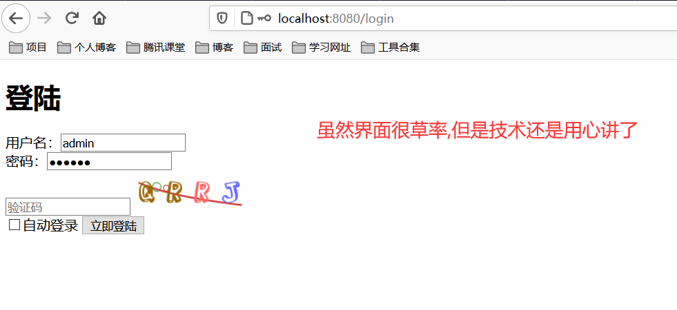

下面才算是这篇文章真正的部分。我们如何才能实现验证码验证呢，思考一下，应该有以下几种实现方式：

1. 登录表单提交前发送 AJAX 验证验证码
2. 使用自定义过滤器(Filter)，在 Spring security 校验前验证验证码合法性
3. 和用户名、密码一起发送到后台，在 Spring security 中进行验证

### 二、AJAX 验证

使用 AJAX 方式验证和我们 Spring Security 框架就没有任何关系了，其实就是表单提交前先发个 HTTP 请求验证验证码，本篇不再赘述。

### 三、过滤器验证

使用过滤器的思路是：**在 Spring Security 处理登录验证请求前，验证验证码，如果正确，放行；如果不正确，调到异常**。

#### 3.1 编写验证码过滤器

自定义一个过滤器，实现 `OncePerRequestFilter` （该 Filter 保证每次请求一定会过滤），在 `isProtectedUrl()` 方法中拦截了 POST 方式的 /login 请求。

在逻辑处理中从 request 中取出验证码，并进行验证，如果验证成功，放行；验证失败，手动生成异常。

```java
public class VerifyFilter extends OncePerRequestFilter {
    private static final PathMatcher pathMatcher = new AntPathMatcher();

    @Override
    protected void doFilterInternal(HttpServletRequest request, HttpServletResponse response, FilterChain filterChain) throws ServletException, IOException {
        if(isProtectedUrl(request)) {
            String verifyCode = request.getParameter("verifyCode");
            if(!validateVerify(verifyCode)) {
                //手动设置异常
                request.getSession().setAttribute("SPRING_SECURITY_LAST_EXCEPTION",new DisabledException("验证码输入错误"));
                // 转发到错误Url
                request.getRequestDispatcher("/login/error").forward(request,response);
            } else {
                filterChain.doFilter(request,response);
            }
        } else {
            filterChain.doFilter(request,response);
        }

    }

    private boolean validateVerify(String inputVerify) {
        //获取当前线程绑定的request对象
        HttpServletRequest request = ((ServletRequestAttributes) RequestContextHolder.getRequestAttributes()).getRequest();
        // 不分区大小写
        // 这个validateCode是在servlet中存入session的名字
        String validateCode = ((String) request.getSession().getAttribute("validateCode")).toLowerCase();
        inputVerify = inputVerify.toLowerCase();

        System.out.println("验证码：" + validateCode + "用户输入：" + inputVerify);
        return validateCode.equals(inputVerify);
    }

    // 拦截 /login的POST请求
    private boolean isProtectedUrl(HttpServletRequest request) {
        return "POST".equals(request.getMethod()) && pathMatcher.match("/login", request.getServletPath());
    }
}
```

#### 3.2 注入过滤器

修改 WebSecurityConfig 的 configure 方法，添加一个 `addFilterBefore()` ，具有两个参数，作用是在参数二之前执行参数一设置的过滤器。

Spring Security 对于用户名/密码登录方式是通过 `UsernamePasswordAuthenticationFilter` 处理的，我们在它之前执行验证码过滤器即可。

```java
@Override
protected void configure(HttpSecurity http) throws Exception {
    http.authorizeRequests()
            // 如果有允许匿名的url，填在下面
            .antMatchers("/getVerifyCode").permitAll()
            .anyRequest().authenticated()
            .and()
            // 设置登陆页
            .formLogin().loginPage("/login")
            // 设置登陆成功页
            .defaultSuccessUrl("/").permitAll()
            // 登录失败Url
            .failureUrl("/login/error")
            // 自定义登陆用户名和密码参数，默认为username和password
//                .usernameParameter("username")
//                .passwordParameter("password")
            .and()
            .addFilterBefore(new VerifyFilter(),UsernamePasswordAuthenticationFilter.class)
            .logout().permitAll()
            // 自动登录
            .and().rememberMe()
                .tokenRepository(persistentTokenRepository())
                // 有效时间：单位s
                .tokenValiditySeconds(60)
                .userDetailsService(userDetailsService);

    // 关闭CSRF跨域
    http.csrf().disable();
}
```

#### 3.3 运行程序

现在来测试下，当验证码错误后：

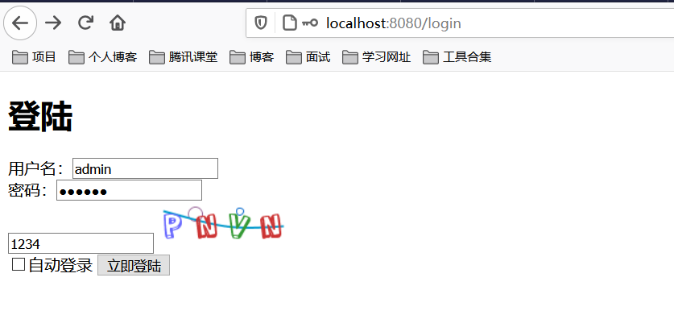

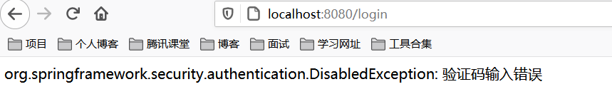


### 四、Spring Security 验证

使用过滤器就已经实现了验证码功能，但其实它和 AJAX 验证差别不大。

- AJAX 是在提交前发一个请求，请求返回成功就提交，否则不提交；
- 过滤器是先验证验证码，验证成功就让 Spring Security 验证用户名和密码；验证失败，则产生异常·。

如果我们要做的需求是用户登录是需要多个验证字段，不单单是用户名和密码，那么使用过滤器会让逻辑变得复杂，这时候可以考虑自定义 Spring Security 的验证逻辑了…

#### 4.1 WebAuthenticationDetails

我们知道 Spring security 默认只会处理用户名和密码信息。这时候就要请出我们的主角——`WebAuthenticationDetails`。

> `WebAuthenticationDetails`: 该类提供了获取用户登录时携带的额外信息的功能，默认提供了 remoteAddress 与 sessionId 信息。

我们需要实现自定义的 `WebAuthenticationDetails`，并在其中加入我们的验证码：

```java
import org.springframework.security.web.authentication.WebAuthenticationDetails;

import javax.servlet.http.HttpServletRequest;

public class CustomWebAuthenticationDetails extends WebAuthenticationDetails {
    private static final long serialVersionUID = 6975601077710753878L;
    private final String verifyCode;

    public CustomWebAuthenticationDetails(HttpServletRequest request) {
        super(request);
        // verifyCode为页面中验证码的name
        verifyCode = request.getParameter("verifyCode");
    }

    public String getVerifyCode() {
        return this.verifyCode;
    }

    @Override
    public String toString() {
        StringBuilder sb = new StringBuilder();
        sb.append(super.toString()).append("; VerifyCode: ").append(this.getVerifyCode());
        return sb.toString();
    }
}
```

在这个方法中，我们将前台 form 表单中的 `verifyCode` 获取到，并通过 get 方法方便被调用。

#### 4.2 AuthenticationDetailsSource

自定义了`WebAuthenticationDetails`，我i们还需要将其放入 `AuthenticationDetailsSource` 中来替换原本的 `WebAuthenticationDetails` ，因此还得实现自定义 `AuthenticationDetailsSource` ：

```java
import org.springframework.security.authentication.AuthenticationDetailsSource;
import org.springframework.security.web.authentication.WebAuthenticationDetails;
import org.springframework.stereotype.Component;

import javax.servlet.http.HttpServletRequest;

@Component("authenticationDetailsSource")
public class CustomAuthenticationDetailsSource implements AuthenticationDetailsSource<HttpServletRequest, WebAuthenticationDetails> {
    @Override
    public WebAuthenticationDetails buildDetails(HttpServletRequest request) {
        return new CustomWebAuthenticationDetails(request);
    }
}
```

该类内容将原本的 `WebAuthenticationDetails` 替换为了我们的 `CustomWebAuthenticationDetails`。

然后我们将 `CustomAuthenticationDetailsSource` 注入Spring Security中，替换掉默认的 `AuthenticationDetailsSource`。

修改 `WebSecurityConfig`，将其注入，然后在config()中使用 `authenticationDetailsSource(authenticationDetailsSource)`方法来指定它。

```java
@Autowired
private AuthenticationDetailsSource<HttpServletRequest, WebAuthenticationDetails> authenticationDetailsSource;

@Override
protected void configure(HttpSecurity http) throws Exception {
    http.authorizeRequests()
            // 如果有允许匿名的url，填在下面
            .antMatchers("/getVerifyCode").permitAll()
            .anyRequest().authenticated()
            .and()
            // 设置登陆页
            .formLogin().loginPage("/login")
            // 设置登陆成功页
            .defaultSuccessUrl("/").permitAll()
            // 登录失败Url
            .failureUrl("/login/error")
            // 自定义登陆用户名和密码参数，默认为username和password
//                .usernameParameter("username")
//                .passwordParameter("password")
            // 指定authenticationDetailsSource
            .authenticationDetailsSource(authenticationDetailsSource)
            .and()
            .logout().permitAll()
            // 自动登录
            .and().rememberMe()
                .tokenRepository(persistentTokenRepository())
                // 有效时间：单位s
                .tokenValiditySeconds(60)
                .userDetailsService(userDetailsService);

    // 关闭CSRF跨域
    http.csrf().disable();
}
```

#### 4.3 AuthenticationProvider

至此我们通过自定义`WebAuthenticationDetails`和`AuthenticationDetailsSource`将验证码和用户名、密码一起带入了Spring Security中，下面我们需要将它取出来。

这里需要我们自定义AuthenticationProvider，需要注意的是，**如果是我们自己实现AuthenticationProvider，那么我们就需要自己做密码校验了。**

```java
@Component
public class CustomAuthenticationProvider implements AuthenticationProvider {
    @Autowired
    private CustomUserDetailsService customUserDetailsService;

    @Override
    public Authentication authenticate(Authentication authentication) throws AuthenticationException {
        // 获取用户输入的用户名和密码
        String inputName = authentication.getName();
        String inputPassword = authentication.getCredentials().toString();

        CustomWebAuthenticationDetails details = (CustomWebAuthenticationDetails) authentication.getDetails();

        String verifyCode = details.getVerifyCode();
        if(!validateVerify(verifyCode)) {
            throw new DisabledException("验证码输入错误");
        }

        // userDetails为数据库中查询到的用户信息
        UserDetails userDetails = customUserDetailsService.loadUserByUsername(inputName);

        // 如果是自定义AuthenticationProvider，需要手动密码校验
        if(!userDetails.getPassword().equals(inputPassword)) {
            throw new BadCredentialsException("密码错误");
        }

        return new UsernamePasswordAuthenticationToken(inputName, inputPassword, userDetails.getAuthorities());
    }

    private boolean validateVerify(String inputVerify) {
        //获取当前线程绑定的request对象
        HttpServletRequest request = ((ServletRequestAttributes) RequestContextHolder.getRequestAttributes()).getRequest();
        // 不分区大小写
        // 这个validateCode是在servlet中存入session的名字
        String validateCode = ((String) request.getSession().getAttribute("validateCode")).toLowerCase();
        inputVerify = inputVerify.toLowerCase();

        System.out.println("验证码：" + validateCode + "用户输入：" + inputVerify);

        return validateCode.equals(inputVerify);
    }

    @Override
    public boolean supports(Class<?> authentication) {
        // 这里不要忘记，和UsernamePasswordAuthenticationToken比较
        return authentication.equals(UsernamePasswordAuthenticationToken.class);
    }
}
```

最后在 `WebSecurityConfig` 中将其注入，并在 config 方法中通过 `auth.authenticationProvider()` 指定使用。

```java
@Autowired
private CustomAuthenticationProvider customAuthenticationProvider;

@Override
protected void configure(AuthenticationManagerBuilder auth) throws Exception {
    auth.authenticationProvider(customAuthenticationProvider);
}
```

#### 4.4 运行程序

是不是比较复杂，为了实现该需求自定义了 `WebAuthenticationDetails`、`AuthenticationDetailsSource`、`AuthenticationProvider`，让我们运行一下程序，当输入错误验证码时：


# 权限控制

# 登录管理

# 短信验证码登录

# 异常处理(二)

# 角色继承

# 前后端分离(一)

使用postman进行测试

# 前后端分离(二)

结合vue实现前后端分离