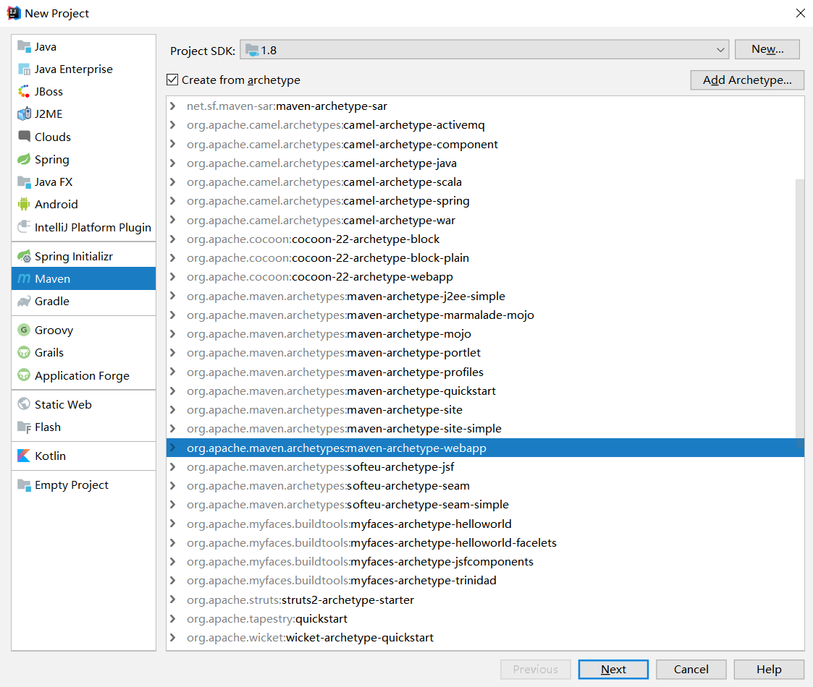

小哥主页地址:https://space.bilibili.com/471822092

谢谢你们长得这么好看还关注我!!!

> Java全栈交流群: 1135453115

# ssm整合

ssm:spring+springmvc+mybatis

springboot还是有点难度

> 步骤

* 创建项目



* 添加坐标(依赖)

```xml
<properties>
    <project.build.sourceEncoding>UTF-8</project.build.sourceEncoding>
    <maven.compiler.source>1.7</maven.compiler.source>
    <maven.compiler.target>1.7</maven.compiler.target>
    <spring-version>5.1.3.RELEASE</spring-version>
</properties>

<dependencies>
    <!--springmvc-->
    <dependency>
        <groupId>org.springframework</groupId>
        <artifactId>spring-webmvc</artifactId>
        <version>${spring-version}</version>
    </dependency>

    <!--spring-jdbc-->
    <dependency>
        <groupId>org.springframework</groupId>
        <artifactId>spring-jdbc</artifactId>
        <version>${spring-version}</version>
    </dependency>

    <!--spring aop-->
    <dependency>
        <groupId>org.springframework</groupId>
        <artifactId>spring-aop</artifactId>
        <version>${spring-version}</version>
    </dependency>
    <dependency>
        <groupId>org.springframework</groupId>
        <artifactId>spring-aspects</artifactId>
        <version>${spring-version}</version>
    </dependency>

    <!--mybatis-->
    <dependency>
        <groupId>org.mybatis</groupId>
        <artifactId>mybatis</artifactId>
        <version>3.4.5</version>
    </dependency>

    <!--mybatis整合spring-->
    <dependency>
        <groupId>org.mybatis</groupId>
        <artifactId>mybatis-spring</artifactId>
        <version>1.3.2</version>
    </dependency>

    <!--mysql驱动-->
    <dependency>
        <groupId>mysql</groupId>
        <artifactId>mysql-connector-java</artifactId>
        <version>8.0.13</version>
    </dependency>

    <!--数据源-->
    <dependency>
        <groupId>commons-dbcp</groupId>
        <artifactId>commons-dbcp</artifactId>
        <version>1.4</version>
    </dependency>

    <!--jstl-->
    <dependency>
        <groupId>jstl</groupId>
        <artifactId>jstl</artifactId>
        <version>1.2</version>
    </dependency>

    <!--Servlet-->
    <dependency>
        <groupId>javax.servlet</groupId>
        <artifactId>javax.servlet-api</artifactId>
        <version>3.1.0</version>
    </dependency>

    <!--简化getter and setter-->
    <dependency>
        <groupId>org.projectlombok</groupId>
        <artifactId>lombok</artifactId>
        <version>1.16.22</version>
    </dependency>

    <!--pageHelper实现分页-->
    <dependency>
        <groupId>com.github.pagehelper</groupId>
        <artifactId>pagehelper</artifactId>
        <version>5.1.2</version>
    </dependency>
</dependencies>
```

* 配置web.xml

```xml
<!DOCTYPE web-app PUBLIC
 "-//Sun Microsystems, Inc.//DTD Web Application 2.3//EN"
 "http://java.sun.com/dtd/web-app_2_3.dtd" >

<web-app>
    <display-name>Archetype Created Web Application</display-name>

    <!--先配置spring-->
    <context-param>
        <param-name>contextConfigLocation</param-name>
        <param-value>classpath:Spring.xml</param-value>
    </context-param>

    <!--配置字符编码的过滤器-->
    <filter>
        <filter-name>encodingFilter</filter-name>
        <filter-class>org.springframework.web.filter.CharacterEncodingFilter</filter-class>
        <init-param>
            <param-name>encoding</param-name>
            <param-value>UTF-8</param-value>
        </init-param>
    </filter>
    <filter-mapping>
        <filter-name>encodingFilter</filter-name>
        <url-pattern>/*</url-pattern>
    </filter-mapping>

    <!--添加监听器-->
    <listener>
        <listener-class>org.springframework.web.context.ContextLoaderListener</listener-class>
    </listener>

    <!--配置springmvc-->
    <servlet>
        <servlet-name>springmvc</servlet-name>
        <servlet-class>org.springframework.web.servlet.DispatcherServlet</servlet-class>
        <init-param>
            <param-name>contextConfigLocation</param-name>
            <param-value>classpath:SpringMVC.xml</param-value>
        </init-param>
    </servlet>
    <servlet-mapping>
        <servlet-name>springmvc</servlet-name>
        <url-pattern>/</url-pattern>
    </servlet-mapping>

    <!--配置静态资源访问-->
    <servlet-mapping>
        <servlet-name>default</servlet-name>
        <url-pattern>*.js</url-pattern>
    </servlet-mapping>
    <servlet-mapping>
        <servlet-name>default</servlet-name>
        <url-pattern>*.css</url-pattern>
    </servlet-mapping>
    <servlet-mapping>
        <servlet-name>default</servlet-name>
        <url-pattern>*.jpg</url-pattern>
    </servlet-mapping>

</web-app>
```

* 配置spring.xml

```xml
<?xml version="1.0" encoding="UTF-8"?>
    <beans xmlns="http://www.springframework.org/schema/beans"
           xmlns:xsi="http://www.w3.org/2001/XMLSchema-instance"
           xmlns:context="http://www.springframework.org/schema/context" xmlns:tx="http://www.springframework.org/schema/tx"
           xsi:schemaLocation="http://www.springframework.org/schema/beans http://www.springframework.org/schema/beans/spring-beans.xsd http://www.springframework.org/schema/context http://www.springframework.org/schema/context/spring-context.xsd http://www.springframework.org/schema/tx http://www.springframework.org/schema/tx/spring-tx.xsd">

    <!--1.配置数据源-->
    <bean name="dataSource" class="org.apache.commons.dbcp.BasicDataSource">
        <property name="driverClassName" value="com.mysql.cj.jdbc.Driver"></property>
        <property name="url" value="jdbc:mysql://localhost:3306/ssm_user?useUnicode=true&amp;characterEncoding=UTF-8&amp;serverTimezone=GMT%2B8"></property>
        <property name="username" value="root"></property>
        <property name="password" value="root"></property>
        <property name="initialSize" value="5"></property>
        <property name="maxActive" value="10"></property>
    </bean>

    <!--2.获取sqlSession  sqlSessionFactory-->
    <bean name="sqlSessionFactory" class="org.mybatis.spring.SqlSessionFactoryBean">
        <!--数据源-->
        <property name="dataSource" ref="dataSource"></property>
        <!--指定mapper.xml的位置-->
        <property name="mapperLocations" value="classpath:/mapper/*Mapper.xml"></property>
        <!--指定mybatis的文件位置-->
        <property name="configLocation" value="classpath:mybatis-config.xml"></property>
    </bean>

    <!--3.配置自动扫描mapper的bean-->
    <bean class="org.mybatis.spring.mapper.MapperScannerConfigurer">
        <property name="basePackage" value="com.xiaoge.mapper"></property>
    </bean>
</beans>
```

* 配置mybatis-config.xml

```xml
<?xml version="1.0" encoding="UTF-8" ?>
<!DOCTYPE configuration
        PUBLIC "-//mybatis.org//DTD Config 3.0//EN"
        "http://mybatis.org/dtd/mybatis-3-config.dtd">
<configuration>
    <settings>
        <!--配置日志打印-->
        <setting name="logImpl" value="STDOUT_LOGGING"/>
    </settings>

    <!--配置包的别名-->
    <typeAliases>
        <package name="com.xiaoge.entity"></package>
    </typeAliases>

    <!--配置分页插件pageHelper-->
    <plugins>
        <plugin interceptor="com.github.pagehelper.PageInterceptor"></plugin>
    </plugins>
</configuration>
```

* 配置SpringMVC.xml

```xml
<?xml version="1.0" encoding="UTF-8"?>
<beans xmlns="http://www.springframework.org/schema/beans"
       xmlns:xsi="http://www.w3.org/2001/XMLSchema-instance"
       xmlns:mvc="http://www.springframework.org/schema/mvc"
       xmlns:context="http://www.springframework.org/schema/context"
       xsi:schemaLocation="http://www.springframework.org/schema/beans
       http://www.springframework.org/schema/beans/spring-beans.xsd
       http://www.springframework.org/schema/context
       http://www.springframework.org/schema/context/spring-context.xsd
       http://www.springframework.org/schema/mvc
       http://www.springframework.org/schema/mvc/spring-mvc.xsd">

    <!--1.配置注解驱动-->
    <mvc:annotation-driven></mvc:annotation-driven>

    <!--2.扫包  让ioc容器进行管理-->
    <!--可以多扫,但是不要漏扫-->
    <context:component-scan base-package="com.xiaoge"></context:component-scan>

    <!--3.配置视图解析器-->
    <bean class="org.springframework.web.servlet.view.InternalResourceViewResolver">
        <property name="prefix" value="/"></property>
        <property name="suffix" value=".jsp"></property>
    </bean>

</beans>
```

* 新建数据库和数据

```sql
DROP TABLE IF EXISTS user;

CREATE TABLE user
(
	id BIGINT(20) NOT NULL COMMENT '主键ID',
	name VARCHAR(30) NULL DEFAULT NULL COMMENT '姓名',
	age INT(11) NULL DEFAULT NULL COMMENT '年龄',
	email VARCHAR(50) NULL DEFAULT NULL COMMENT '邮箱',
	PRIMARY KEY (id)
);

DELETE FROM user;

INSERT INTO user (id, name, age, email) VALUES
(1, 'Jone', 18, 'test1@baomidou.com'),
(2, 'Jack', 20, 'test2@baomidou.com'),
(3, 'Tom', 28, 'test3@baomidou.com'),
(4, 'Sandy', 21, 'test4@baomidou.com'),
(5, 'Billie', 24, 'test5@baomidou.com');
```

* 编写实体类

```java
package com.xiaoge.entity;

import lombok.Data;

@Data
public class User {

    private Long id;

    private String name;

    private Integer age;

    private String email;

}
```

* 创建UserMapper接口

```java
package com.xiaoge.mapper;

import com.xiaoge.entity.User;
import org.springframework.stereotype.Repository;

import java.util.List;

/**
 * 持久层
 */
@Repository
public interface UserMapper {

    /**
     * 查询所有用户信息
     * @return
     */
    List<User> findAll();
}
```

* 创建UserService及其实现类UserServiceImpl

```java
package com.xiaoge.service;

import com.xiaoge.entity.User;

import java.util.List;

/**
 * 小哥
 */
public interface UserService {

    /**
     * 查询所有用户信息
     * @return
     */
    List<User> findAll();

}
```

```java
package com.xiaoge.service.impl;

import com.xiaoge.entity.User;
import com.xiaoge.mapper.UserMapper;
import com.xiaoge.service.UserService;
import org.springframework.beans.factory.annotation.Autowired;
import org.springframework.stereotype.Service;

import java.util.List;

/**
 * 小哥
 * UserService实现类
 */
@Service
public class UserServiceImpl implements UserService {
    @Autowired
    private UserMapper userMapper;

    @Override
    public List<User> findAll() {
        return userMapper.findAll();
    }
}
```

* 创建UserController

```java
package com.xiaoge.controller;

import com.github.pagehelper.PageHelper;
import com.github.pagehelper.PageInfo;
import com.xiaoge.entity.User;
import com.xiaoge.service.UserService;
import org.springframework.beans.factory.annotation.Autowired;
import org.springframework.stereotype.Controller;
import org.springframework.ui.Model;
import org.springframework.web.bind.annotation.RequestMapping;

import javax.annotation.Resource;
import java.util.List;

/**
 * 小哥
 * 控制器
 */
@Controller
public class UserController {

    @Autowired
    private UserService userService;

    @RequestMapping(value = {"/","/users"})
    public String findByPage(Model model){
        //分页查询
        //1.开始分页 1.页码  2.每页显示条数
        PageHelper.startPage(2,2);
        //2.查询所有的信息
        List<User> users = userService.findAll();
        //封装分页信息类
        PageInfo<User> pageInfo = new PageInfo<>(users);
        //将数据传递到View层
        model.addAttribute("pageInfo",pageInfo);
        //跳转解析页面  /list.jsp
        return "list";
    }
}
```

* 创建list.jsp

```jsp
<%--
  Created by IntelliJ IDEA.
  User: 13512
  Date: 0006
  Time: 23:46
  To change this template use File | Settings | File Templates.
--%>
<%@ page contentType="text/html;charset=UTF-8" language="java" isELIgnored="false" %>
<%@ taglib prefix="c" uri="http://java.sun.com/jsp/jstl/core" %>
<html>
<head>
    <title>查询用户信息</title>
</head>
<body>
    <table>
        <tr>
            <th>编号</th>
            <th>姓名</th>
            <th>年龄</th>
            <th>邮箱</th>
            <th>操作</th>
        </tr>
        <c:forEach items="${pageInfo.list}" var="user">
            <tr>
                <td>${user.id}</td>
                <td>${user.name}</td>
                <td>${user.age}</td>
                <td>${user.email}</td>
                <td>
                    <a href="">编辑</a>
                    <a href="">删除</a>
                </td>
            </tr>
        </c:forEach>
    </table>
</body>
</html>
```

# 实现CURD

* list.jsp

```jsp
<%@ page contentType="text/html;charset=UTF-8" language="java" isELIgnored="false" %>
<%@ taglib prefix="c" uri="http://java.sun.com/jsp/jstl/core" %>
<!DOCTYPE html>
<html lang="zh-CN">
<head>
    <meta charset="utf-8">
    <meta http-equiv="X-UA-Compatible" content="IE=edge">
    <meta name="viewport" content="width=device-width, initial-scale=1">
    <title>用户列表</title>
    <link href="https://cdn.jsdelivr.net/npm/bootstrap@3.3.7/dist/css/bootstrap.min.css" rel="stylesheet">
    <script src="https://cdn.jsdelivr.net/npm/html5shiv@3.7.3/dist/html5shiv.min.js"></script>
    <script src="https://cdn.jsdelivr.net/npm/respond.js@1.4.2/dest/respond.min.js"></script>

    <style type="text/css">
        .box {
            width: 800px;
            margin: 50px auto;
            border: 1px solid #DCDFE6;
            border-radius: 20px;
            padding: 20px;
        }

        .box:hover {
            box-shadow: 0 2px 4px rgba(0, 0, 0, .12), 0 0 6px rgba(0, 0, 0, .04)
        }

        .box-title {
            text-align: center;
        }

        .box-table {
            margin-top: 20px;
        }
        .box-nav{
            text-align: center;
        }
    </style>
</head>
<body>
<div class="box">
    <h3 class="box-title">用户信息列表</h3>
    <form class="form-inline" style="width: 100%" action="/findByCondition" method="post">
        <div class="form-group">
            <label for="name">姓名</label>
            <input type="text" class="form-control" id="name" placeholder="请输入用户名称" name="name">
        </div>
        <button type="submit" class="btn btn-default">查询</button>
        <a href="/edit" style="float: right">
            增加
        </a>
    </form>
    <table class="table table-bordered box-table">
        <tr>
            <th>编号</th>
            <th>姓名</th>
            <th>年龄</th>
            <th>邮箱</th>
            <th>操作</th>
        </tr>
        <c:forEach items="${pageInfo.list}" var="user">
            <tr>
                <td>${user.id}</td>
                <td>${user.name}</td>
                <td>${user.age}</td>
                <td>${user.email}</td>
                <td>
                    <a href="/edit?id=${user.id}">
                        <span class="glyphicon glyphicon-pencil" aria-hidden="true"></span>
                    </a>
                    &nbsp;&nbsp;&nbsp;&nbsp;
                    <a href="/del?id=${user.id}">
                        <span class="glyphicon glyphicon-trash" aria-hidden="true"></span>
                    </a>
                </td>
            </tr>
        </c:forEach>
    </table>
    <div class="box-nav">
        <nav aria-label="Page navigation">
            <ul class="pagination">
                <c:if test="${pageInfo.hasPreviousPage}">
                    <li>
                        <a href="/users?pageNum=${pageInfo.pageNum-1}" aria-label="Previous">
                            <span aria-hidden="true">&laquo;</span>
                        </a>
                    </li>
                </c:if>
                <c:forEach begin="1" end="${pageInfo.pages}" var="i">
                    <li><a href="/users?pageNum=${i}">${i}</a></li>
                </c:forEach>
                <c:if test="${pageInfo.hasNextPage}">
                    <li>
                        <a href="/users?pageNum=${pageInfo.pageNum+1}" aria-label="Next">
                            <span aria-hidden="true">&raquo;</span>
                        </a>
                    </li>
                </c:if>
            </ul>
        </nav>
    </div>
</div>
<script src="https://cdn.jsdelivr.net/npm/jquery@1.12.4/dist/jquery.min.js"></script>
<script src="https://cdn.jsdelivr.net/npm/bootstrap@3.3.7/dist/js/bootstrap.min.js"></script>
</body>
</html>
```

* edit.jsp

```jsp
<%@ page contentType="text/html;charset=UTF-8" language="java" isELIgnored="false" %>
<%@ taglib prefix="c" uri="http://java.sun.com/jsp/jstl/core" %>
<html lang="zh-CN">
<head>
    <meta charset="utf-8">
    <meta http-equiv="X-UA-Compatible" content="IE=edge">
    <meta name="viewport" content="width=device-width, initial-scale=1">
    <title>用户信息编辑</title>

    <link href="https://cdn.jsdelivr.net/npm/bootstrap@3.3.7/dist/css/bootstrap.min.css" rel="stylesheet">
    <script src="https://cdn.jsdelivr.net/npm/html5shiv@3.7.3/dist/html5shiv.min.js"></script>
    <script src="https://cdn.jsdelivr.net/npm/respond.js@1.4.2/dest/respond.min.js"></script>
    <style type="text/css">
        .box-form {
            width: 500px;
            margin: 50px auto;
            border: 1px solid #DCDFE6;
            border-radius: 20px;
            padding: 20px;
        }

        .box-form:hover {
            box-shadow: 0 2px 4px rgba(0, 0, 0, .12), 0 0 6px rgba(0, 0, 0, .04)
        }
    </style>
</head>
<body>
<div class="box-form">
    <h1>编辑用户信息</h1>
    <form class="form-horizontal" action="${user==null?'/addUser':'/updateUser'}" method="post">
        <div class="form-group">
            <label for="id" class="col-sm-2 control-label">编号</label>
            <div class="col-sm-10">
                <input type="text" class="form-control" id="id" placeholder="编号" value="${user.id}" name="id" readonly>
            </div>
        </div>
        <div class="form-group">
            <label for="name" class="col-sm-2 control-label">姓名</label>
            <div class="col-sm-10">
                <input type="text" class="form-control" id="name" placeholder="姓名" value="${user.name}" name="name">
            </div>
        </div>
        <div class="form-group">
            <label for="age" class="col-sm-2 control-label">年龄</label>
            <div class="col-sm-10">
                <input type="text" class="form-control" id="age" placeholder="年龄" value="${user.age}" name="age">
            </div>
        </div>
        <div class="form-group">
            <label for="email" class="col-sm-2 control-label">邮箱</label>
            <div class="col-sm-10">
                <input type="text" class="form-control" id="email" placeholder="邮箱" value="${user.email}" name="email">
            </div>
        </div>
        <div class="form-group">
            <div class="col-sm-offset-2 col-sm-10">
                <button type="submit" class="btn btn-default">编辑</button>
            </div>
        </div>
    </form>
</div>

<script src="https://cdn.jsdelivr.net/npm/jquery@1.12.4/dist/jquery.min.js"></script>
<script src="https://cdn.jsdelivr.net/npm/bootstrap@3.3.7/dist/js/bootstrap.min.js"></script>
</body>
</html>
```

* UserController

```java
package com.xiaoge.controller;

import com.github.pagehelper.PageHelper;
import com.github.pagehelper.PageInfo;
import com.xiaoge.entity.User;
import com.xiaoge.service.UserService;
import org.springframework.beans.factory.annotation.Autowired;
import org.springframework.stereotype.Controller;
import org.springframework.ui.Model;
import org.springframework.web.bind.annotation.RequestMapping;
import org.springframework.web.bind.annotation.RequestParam;

import javax.annotation.Resource;
import java.util.List;

/**
 * 小哥
 * 控制器
 */
@Controller
public class UserController {

    @Autowired
    private UserService userService;

    @RequestMapping(value = {"/","/users"})
    public String findByPage(@RequestParam(required = false) Integer pageNum,@RequestParam(required = false) Integer pageSize , Model model){
        if(pageNum==null){
            pageNum = 1;
        }
        if(pageSize==null){
            pageSize = 2;
        }
        PageInfo<User> pageInfo = userService.findByPage(pageNum, pageSize);
        model.addAttribute("pageInfo",pageInfo);
        //跳转解析页面  /list.jsp
        return "list";
    }

    @RequestMapping("/del")
    public String del(Long id){
        int i = userService.delUser(id);
        //删除成功之后查询所有用户信息
        return "redirect:/users";
    }

    @RequestMapping("/edit")
    public String edit(Long id,Model model){
        //修改
        if(id!=null){
            User user = userService.findById(id);
            model.addAttribute("user",user);
        }
        return "edit";
    }

    @RequestMapping("/addUser")
    public String addUser(User user){
        int i = userService.addUser(user);
        return "redirect:/users";
    }

    @RequestMapping("/updateUser")
    public String updateUser(User user){
        int i = userService.updateUser(user);
        return "redirect:/users";
    }

    @RequestMapping("/findByCondition")
    public String findByCondition(String name,Model model){
        PageHelper.startPage(1,2);
        List<User> users = userService.findByCondition(name);
        PageInfo<User> pageInfo = new PageInfo<>(users);
        model.addAttribute("pageInfo",pageInfo);
        //跳转解析页面  /list.jsp
        return "list";
    }
}
```

* UserServiceImpl

```java
package com.xiaoge.service.impl;

import com.github.pagehelper.PageHelper;
import com.github.pagehelper.PageInfo;
import com.xiaoge.entity.User;
import com.xiaoge.mapper.UserMapper;
import com.xiaoge.service.UserService;
import org.springframework.beans.factory.annotation.Autowired;
import org.springframework.stereotype.Service;

import java.util.List;

/**
 * 小哥
 * UserService实现类
 */
@Service
public class UserServiceImpl implements UserService {
    @Autowired
    private UserMapper userMapper;


    /**
     * 查询所有用户信息
     *
     * @return
     */
    @Override
    public List<User> findAll() {
        return userMapper.findAll();
    }

    /**
     * 根据id查询一个用户
     *
     * @param id
     * @return
     */
    @Override
    public User findById(Long id) {
        return userMapper.findById(id);
    }

    /**
     * 添加一个用户
     *
     * @param user 用户对象
     * @return
     */
    @Override
    public int addUser(User user) {
        return userMapper.addUser(user);
    }

    /**
     * 修改用户信息
     *
     * @param user 用户对象
     * @return
     */
    @Override
    public int updateUser(User user) {
        return userMapper.updateUser(user);
    }

    /**
     * 删除一个用户
     *
     * @param id 用户编号
     * @return
     */
    @Override
    public int delUser(Long id) {
        return userMapper.delUser(id);
    }

    /**
     * 分页查询
     *
     * @param pageNum  当前页码
     * @param pageSize 每页显示的条数
     * @return 分页信息对象
     */
    @Override
    public PageInfo<User> findByPage(Integer pageNum, Integer pageSize) {
        //启动分页
        PageHelper.startPage(pageNum,pageSize);
        //查询所有的用户信息
        List<User> users = userMapper.findAll();
        //封装分页对象
        PageInfo<User> pageInfo = new PageInfo<>(users);
        //返回数据
        return pageInfo;
    }

    @Override
    public List<User> findByCondition(String name) {
        return userMapper.findByCondition(name);
    }
}
```

* UserService

```java
package com.xiaoge.service;

import com.github.pagehelper.PageInfo;
import com.xiaoge.entity.User;

import java.util.List;

/**
 * 小哥
 */
public interface UserService {

    /**
     * 查询所有用户信息
     * @return
     */
    List<User> findAll();

    /**
     * 根据id查询一个用户
     * @param id
     * @return
     */
    User findById(Long id);

    /**
     * 添加一个用户
     * @param user 用户对象
     * @return
     */
    int addUser(User user);

    /**
     * 修改用户信息
     * @param user 用户对象
     * @return
     */
    int updateUser(User user);

    /**
     * 删除一个用户
     * @param id 用户编号
     * @return
     */
    int delUser(Long id);

    /**
     * 分页查询
     * @param pageNum 当前页码
     * @param pageSize 每页显示的条数
     * @return 分页信息对象
     */
    PageInfo<User> findByPage(Integer pageNum,Integer pageSize);

    List<User> findByCondition(String name);
}
```

* UserMapper

```java
package com.xiaoge.mapper;

import com.xiaoge.entity.User;
import org.springframework.stereotype.Repository;

import java.util.List;

/**
 * 持久层
 */
@Repository
public interface UserMapper {

    /**
     * 查询所有用户信息
     * @return
     */
    List<User> findAll();

    /**
     * 添加一个用户
     * @param user 用户对象
     * @return
     */
    int addUser(User user);

    /**
     * 修改用户信息
     * @param user 用户对象
     * @return
     */
    int updateUser(User user);

    /**
     * 删除一个用户
     * @param id 用户编号
     * @return
     */
    int delUser(Long id);

    /**
     * 根据id查询一个用户
     * @param id
     * @return
     */
    User findById(Long id);

    List<User> findByCondition(String name);
}
```

* UserMapper.xml

```xml
<?xml version="1.0" encoding="UTF-8" ?>
<!DOCTYPE mapper
        PUBLIC "-//mybatis.org//DTD Mapper 3.0//EN"
        "http://mybatis.org/dtd/mybatis-3-mapper.dtd">
<mapper namespace="com.xiaoge.mapper.UserMapper">
    <select id="findAll" resultType="User">
     select * from user
    </select>

    <select id="findById" resultType="User">
     select * from user where id = #{id}
    </select>

    <select id="findByCondition" resultType="User">
     select * from user where name like concat('%',#{name},'%')
    </select>

    <insert id="addUser">
      INSERT INTO `ssm_user`.`user`(`id`, `name`, `age`, `email`) VALUES (null, #{name}, #{age}, #{email});
    </insert>

    <update id="updateUser">
      UPDATE `ssm_user`.`user` SET `name` = #{name}, `age` = #{age}, `email` = #{email} WHERE `id` = #{id};
    </update>

    <delete id="delUser">
      delete from user where id = #{id}
    </delete>

</mapper>
```

* User

```java
package com.xiaoge.entity;

import lombok.Data;

@Data
public class User {

    private Long id;

    private String name;

    private Integer age;

    private String email;

}
```