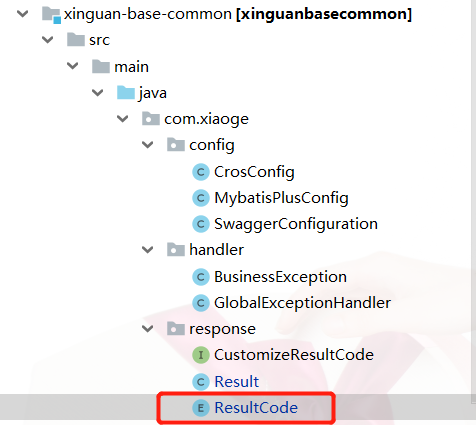
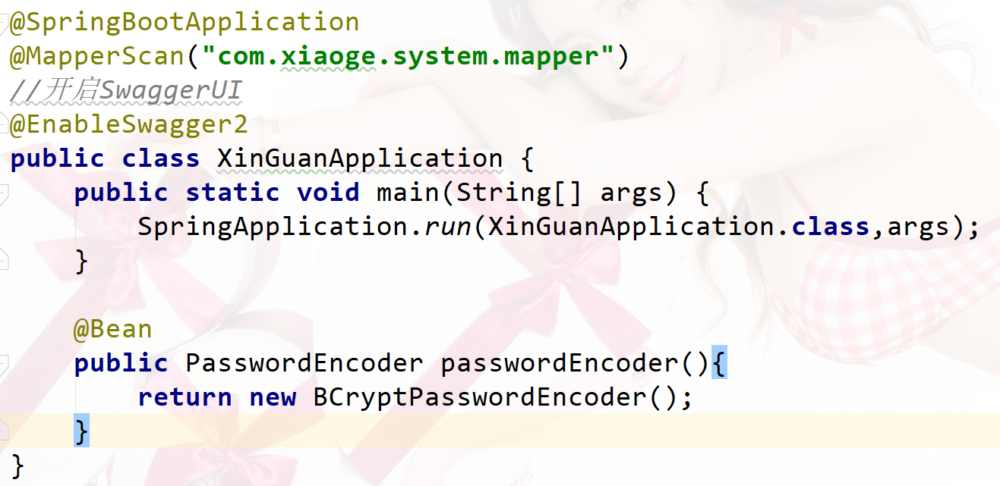
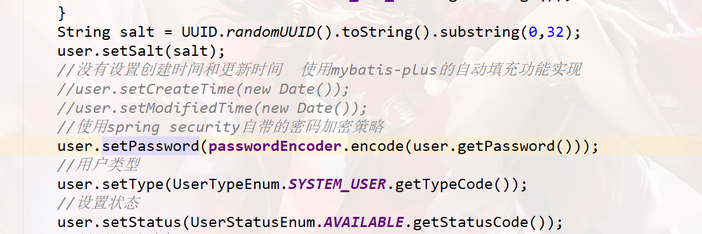

# 实现添加用户

## 前言

这里对之前的课件及部分代码进行了修改:



因为之前这个枚举类写的杂乱无章,也没有一个规范,现在改动如下：

```java
package com.xiaoge.response;

/**
 * @Author: NieChangan
 * @Description: 返回码定义
 * 规定:
 * #200表示成功
 * #1001～1999 区间表示参数错误
 * #2001～2999 区间表示用户错误
 * #3001～3999 区间表示接口异常
 * #后面对什么的操作自己在这里注明就行了
 */
public enum ResultCode implements CustomizeResultCode{
    /* 成功 */
    SUCCESS(200, "成功"),

    /* 默认失败 */
    COMMON_FAIL(999, "失败"),

    /* 参数错误：1000～1999 */
    PARAM_NOT_VALID(1001, "参数无效"),
    PARAM_IS_BLANK(1002, "参数为空"),
    PARAM_TYPE_ERROR(1003, "参数类型错误"),
    PARAM_NOT_COMPLETE(1004, "参数缺失"),

    /* 用户错误 */
    USER_NOT_LOGIN(2001, "用户未登录"),
    USER_ACCOUNT_EXPIRED(2002, "账号已过期"),
    USER_CREDENTIALS_ERROR(2003, "密码错误"),
    USER_CREDENTIALS_EXPIRED(2004, "密码过期"),
    USER_ACCOUNT_DISABLE(2005, "账号不可用"),
    USER_ACCOUNT_LOCKED(2006, "账号被锁定"),
    USER_ACCOUNT_NOT_EXIST(2007, "账号不存在"),
    USER_ACCOUNT_ALREADY_EXIST(2008, "账号已存在"),
    USER_ACCOUNT_USE_BY_OTHERS(2009, "账号下线"),

    /*部门错误*/
    DEPARTMENT_NOT_EXIST(3007, "部门不存在"),
    DEPARTMENT_ALREADY_EXIST(3008, "部门已存在"),

    /* 业务错误 */
    NO_PERMISSION(3001, "没有权限"),

    /*运行时异常*/
    ARITHMETIC_EXCEPTION(9001,"算数异常");

    private Integer code;

    private String message;

    ResultCode(Integer code,String message){
        this.code = code;
        this.message = message;
    }

    @Override
    public Integer getCode() {
        return code;
    }

    @Override
    public String getMessage() {
        return message;
    }
}
```

**RoleStatusEnum**

```java
package com.xiaoge.system.enums;

/**
 * @Author xiaoge
 * @Date 2020/9/26 16:52
 **/


public enum  RoleStatusEnum {
    DISABLE(0),
    AVAILABLE(1);

    private int statusCode;

    RoleStatusEnum(int statusCode) {
        this.statusCode = statusCode;
    }

    public int getStatusCode() {
        return statusCode;
    }

    public void setStatusCode(int statusCode) {
        this.statusCode = statusCode;
    }
}
```

**UserStatusEnum**

```java
package com.xiaoge.system.enums;

/**
 * 用户状态
 * @Author xiaoge
 * @Date 2020/9/26 12:29
 **/
public enum  UserStatusEnum {

    DISABLE(0),
    AVAILABLE(1);

    private int statusCode;

    UserStatusEnum(int statusCode) {
        this.statusCode = statusCode;
    }

    public int getStatusCode() {
        return statusCode;
    }

    public void setStatusCode(int statusCode) {
        this.statusCode = statusCode;
    }
}
```

**UserTypeEnum**

```java
package com.xiaoge.system.enums;

/**
 * 用户类型
 * @Author xiaoge
 * @Date 2020/9/26 12:25
 **/
public enum UserTypeEnum {

    //系统管理员admin
    SYSTEM_ADMIN(0),

    //系统的普通用户
    SYSTEM_USER(1);

    private int typeCode;

    UserTypeEnum(int typeCode) {
        this.typeCode = typeCode;
    }

    public int getTypeCode() {
        return typeCode;
    }

    public void setTypeCode(int typeCode) {
        this.typeCode = typeCode;
    }
}
```

## 用户添加后台

**添加pom依赖**

```xml
<!--spring security-->
<dependency>
    <groupId>org.springframework.boot</groupId>
    <artifactId>spring-boot-starter-security</artifactId>
</dependency>
```

因为添加的时候要对密码进行加密操作,所以这边需要用到spring security的加密功能

**UserService**

```java
package com.xiaoge.system.service;

import com.baomidou.mybatisplus.core.conditions.query.QueryWrapper;
import com.baomidou.mybatisplus.core.metadata.IPage;
import com.baomidou.mybatisplus.extension.plugins.pagination.Page;
import com.xiaoge.system.entity.User;
import com.baomidou.mybatisplus.extension.service.IService;
import com.xiaoge.vo.UserVO;

/**
 * <p>
 * 用户表 服务类
 * </p>
 *
 * @author xiaoge
 * @since 2020-09-04
 */
public interface UserService extends IService<User> {

    /**
     * 根据条件分页查询用户信息
     * @param page
     * @param wrapper
     * @return
     */
    IPage<User> findUserPage(Page<User> page,QueryWrapper<User> wrapper);

    /**
     * 添加用户
     * @param user
     */
    void addUser(User user);
}
```

主要是添加了一个addUser的方法

**UserServiceImpl**

```java
package com.xiaoge.system.service.impl;

import com.baomidou.mybatisplus.core.conditions.query.QueryWrapper;
import com.baomidou.mybatisplus.core.metadata.IPage;
import com.baomidou.mybatisplus.extension.plugins.pagination.Page;
import com.xiaoge.handler.BusinessException;
import com.xiaoge.response.ResultCode;
import com.xiaoge.system.entity.Department;
import com.xiaoge.system.entity.User;
import com.xiaoge.system.enums.UserStatusEnum;
import com.xiaoge.system.enums.UserTypeEnum;
import com.xiaoge.system.mapper.DepartmentMapper;
import com.xiaoge.system.mapper.UserMapper;
import com.xiaoge.system.service.UserService;
import com.baomidou.mybatisplus.extension.service.impl.ServiceImpl;
import org.springframework.beans.factory.annotation.Autowired;
import org.springframework.security.crypto.password.PasswordEncoder;
import org.springframework.stereotype.Service;

import java.util.Date;
import java.util.UUID;

/**
 * <p>
 * 用户表 服务实现类
 * </p>
 *
 * @author xiaoge
 * @since 2020-09-04
 */
@Service
public class UserServiceImpl extends ServiceImpl<UserMapper, User> implements UserService {

    @Autowired
    private DepartmentMapper departmentMapper;

    @Autowired
    private PasswordEncoder passwordEncoder;

    @Override
    public IPage<User> findUserPage(Page<User> page, QueryWrapper<User> wrapper) {
        return this.baseMapper.findUserPage(page,wrapper);
    }

    @Override
    public void addUser(User user) {
        String username = user.getUsername();
        Long departmentId = user.getDepartmentId();
        QueryWrapper<User> wrapper = new QueryWrapper<>();
        wrapper.eq("username",username);
        Integer count = this.baseMapper.selectCount(wrapper);
        if(count!=0){
            //账号已经存在
            throw new BusinessException(ResultCode.USER_ACCOUNT_ALREADY_EXIST.getCode(),
                    ResultCode.USER_ACCOUNT_ALREADY_EXIST.getMessage());
        }
        Department department =departmentMapper.selectById(departmentId);
        if(department==null){
            throw new BusinessException(ResultCode.DEPARTMENT_NOT_EXIST.getCode(),
                    ResultCode.DEPARTMENT_NOT_EXIST.getMessage());
        }
        String salt= UUID.randomUUID().toString().substring(0,32);
        user.setPassword(passwordEncoder.encode(user.getPassword()));
        user.setModifiedTime(new Date());
        user.setCreateTime(new Date());
        //设置盐值  在这里其实已经没有意义了,因为spring security加密的密码默认已经提供了盐值
        user.setSalt(salt);
        //添加的用户默认是普通用户
        user.setType(UserTypeEnum.SYSTEM_USER.getTypeCode());
        //添加的用户默认启用
        user.setStatus(UserStatusEnum.AVAILABLE.getStatusCode());
        this.baseMapper.insert(user);
    }
}
```

这里注入了一个`private PasswordEncoder passwordEncoder`

这是spring security给我们提供的一个加密工具类,可以实现加盐和加密,但是使用的时候需要在配置类中申明



启动类上申明一下就行了,当然也可以在其他配置类中申明

**自动填充功能的实现**

* 修改用户类的属性

```java
@ApiModelProperty(value = "创建时间")
@TableField(fill = FieldFill.INSERT)
private Date createTime;

@ApiModelProperty(value = "修改时间")
@TableField(fill = FieldFill.INSERT_UPDATE)
private Date modifiedTime;
```

* 增加一个处理类MyMetaObjectHandler

```java
package com.xiaoge.handler;

import com.baomidou.mybatisplus.core.handlers.MetaObjectHandler;
import lombok.extern.slf4j.Slf4j;
import org.apache.ibatis.reflection.MetaObject;
import org.springframework.stereotype.Component;

import java.util.Date;

/**
 * @author NieChangan
 */
@Slf4j
@Component
public class MyMetaObjectHandler implements MetaObjectHandler {

    @Override
    public void insertFill(MetaObject metaObject) {
        log.info("start insert fill ....");
        // 起始版本 3.3.0(推荐使用)
        this.strictInsertFill(metaObject, "createTime", Date.class, new Date());

        // 起始版本 3.3.0(推荐使用)
        //在执行增加操作的时候,不仅仅要给createTime赋值,而且要给modifiedTime赋值
        this.strictInsertFill(metaObject, "modifiedTime", Date.class, new Date());

    }

    @Override
    public void updateFill(MetaObject metaObject) {
        log.info("start update fill ....");

        // 起始版本 3.3.0(推荐)
        this.strictUpdateFill(metaObject, "modifiedTime", Date.class, new Date());
    }
}
```



这里就可以省略不写了

**UserController**

```java
package com.xiaoge.system.controller;


import com.baomidou.mybatisplus.core.conditions.query.LambdaQueryWrapper;
import com.baomidou.mybatisplus.core.conditions.query.QueryWrapper;
import com.baomidou.mybatisplus.core.metadata.IPage;
import com.baomidou.mybatisplus.extension.plugins.pagination.Page;
import com.xiaoge.response.Result;
import com.xiaoge.system.entity.User;
import com.xiaoge.system.service.UserService;
import com.xiaoge.vo.UserVO;
import io.swagger.annotations.Api;
import io.swagger.annotations.ApiOperation;
import org.springframework.beans.factory.annotation.Autowired;
import org.springframework.beans.factory.annotation.Qualifier;
import org.springframework.stereotype.Repository;
import org.springframework.util.StringUtils;
import org.springframework.web.bind.annotation.*;

import javax.annotation.Resource;
import java.util.List;

/**
 * <p>
 * 用户表 前端控制器
 * </p>
 *
 * @author xiaoge
 * @since 2020-09-03
 */
@Api(value = "用户管理")
@RestController
@RequestMapping("/user")
@CrossOrigin
public class UserController {

    @Resource
    private UserService userService;

    /**
     * 分页查询用户列表
     *
     * @return
     */
    @ApiOperation("分页查询用户列表")
    @GetMapping("/findUserList")
    public Result findUserList(@RequestParam(required = true, defaultValue = "1") Integer current,
                               @RequestParam(required = true, defaultValue = "6") Integer size) {
        //对用户进行分页,泛型中注入的就是用户实体类
        Page<User> page = new Page<>(current, size);
        //单表的时候其实这个方法是非常好用的
        LambdaQueryWrapper<User> queryWrapper = new LambdaQueryWrapper<>();
        Page<User> userPage = userService.page(page);
        long total = userPage.getTotal();
        List<User> records = userPage.getRecords();
        return Result.ok().data("total", total).data("records", records);
    }

    /**
     * 根据条件进行分页查询
     *
     * @param current
     * @param size
     * @param userVO
     * @return
     */
    @PostMapping("/findUserPage")
    public Result findUserPage(@RequestParam(required = true, defaultValue = "1") Integer current,
                               @RequestParam(required = true, defaultValue = "6") Integer size,
                               @RequestBody UserVO userVO) {
        //对用户进行分页,泛型中注入的就是用户实体类
        Page<User> page = new Page<>(current, size);
        //单表的时候其实这个方法是非常好用的
        QueryWrapper<User> wrapper = getWrapper(userVO);
        IPage<User> userPage = userService.findUserPage(page, wrapper);
        long total = userPage.getTotal();
        List<User> records = userPage.getRecords();
        return Result.ok().data("total", total).data("records", records);
    }

    /**
     * 封装查询条件
     *
     * @param userVO
     * @return
     */
    private QueryWrapper<User> getWrapper(UserVO userVO) {
        QueryWrapper<User> queryWrapper = new QueryWrapper<>();
        if (userVO != null) {
            if (!StringUtils.isEmpty(userVO.getDepartmentId())) {
                queryWrapper.eq("department_id", userVO.getDepartmentId());
            }
            if (!StringUtils.isEmpty(userVO.getUsername())) {
                queryWrapper.eq("username", userVO.getUsername());
            }
            if (!StringUtils.isEmpty(userVO.getEmail())) {
                queryWrapper.eq("email", userVO.getEmail());
            }
            if (!StringUtils.isEmpty(userVO.getSex())) {
                queryWrapper.eq("sex", userVO.getSex());
            }
            if (!StringUtils.isEmpty(userVO.getNickname())) {
                queryWrapper.eq("nickname", userVO.getNickname());
            }
        }
        return queryWrapper;
    }

    /**
     * 添加用户信息
     *
     * @param user
     * @return
     */
    @ApiOperation(value = "添加用户", notes = "添加用户信息")
    @PostMapping("/addUser")
    public Result addUser(@RequestBody User user) {
        try {
            userService.addUser(user);
            return Result.ok();
        } catch (Exception e) {
            e.printStackTrace();
            return Result.error();
        }
    }
}
```

增加了一个addUser的方法

**WebSecurityConfig**

```java
package com.xiaoge.auth;

import org.springframework.context.annotation.Bean;
import org.springframework.context.annotation.Configuration;
import org.springframework.security.config.annotation.authentication.builders.AuthenticationManagerBuilder;
import org.springframework.security.config.annotation.method.configuration.EnableGlobalMethodSecurity;
import org.springframework.security.config.annotation.web.builders.HttpSecurity;
import org.springframework.security.config.annotation.web.builders.WebSecurity;
import org.springframework.security.config.annotation.web.configuration.EnableWebSecurity;
import org.springframework.security.config.annotation.web.configuration.WebSecurityConfigurerAdapter;
import org.springframework.security.crypto.bcrypt.BCryptPasswordEncoder;
import org.springframework.security.crypto.password.PasswordEncoder;

/**
 * @author NieChangan
 */
@Configuration
@EnableWebSecurity
@EnableGlobalMethodSecurity(prePostEnabled = true)
public class WebSecurityConfig extends WebSecurityConfigurerAdapter {

    @Bean
    public PasswordEncoder passwordEncoder(){
        return new BCryptPasswordEncoder();
    }

    @Override
    protected void configure(AuthenticationManagerBuilder auth) throws Exception {
        super.configure(auth);
    }

    @Override
    public void configure(WebSecurity web) throws Exception {
        super.configure(web);
    }

    @Override
    protected void configure(HttpSecurity http) throws Exception {
        //http.anonymous();

        // 关闭CSRF跨域
        http.csrf().disable();
    }
}
```

引入了spring security的启动器,默认所有的请求都会被认证,配置这个类暂时放行所有的拦截和请求

这个类在后面讲权限的时候会重点配置

## 用户添加前端

**UserAdd.vue**

```vue
<template>
  <div>
    <el-dialog v-bind="$attrs" v-on="$listeners" :visible.sync="showDialog" @open="onOpen" @close="onClose"
               title="添加用户">
      <el-row :gutter="15">
        <el-form ref="elForm" :model="user" :rules="rules" size="medium" label-width="80px">
          <el-col :span="24">
            <!-- 用户头像 -->
            <el-form-item label="用户头像">

              <!-- 头衔缩略图 -->
              <pan-thumb :image="image"/>
              <!-- 文件上传按钮 -->
              <el-button type="primary" icon="el-icon-upload" @click="imagecropperShow=true">更换头像
              </el-button>

              <!--
                v-show：是否显示上传组件
                :key：类似于id，如果一个页面多个图片上传控件，可以做区分
                :url：后台上传的url地址
                @close：关闭上传组件
                @crop-upload-success：上传成功后的回调 -->
              <image-cropper
                v-show="imagecropperShow"
                :width="300"
                :height="300"
                :key="imagecropperKey"
                :url="'/ossservice/upload/uploadImgFile'"
                field="file"
                @close="closeImage"
                @crop-upload-success="cropSuccess"/>

            </el-form-item>
          </el-col>
          <el-col :span="12">
            <el-form-item label="用户名" prop="username">
              <el-input v-model="user.username" placeholder="请输入用户名" clearable :style="{width: '100%'}">
              </el-input>
            </el-form-item>
            <el-form-item label="昵称" prop="nickname">
              <el-input v-model="user.nickname" placeholder="请输入昵称" clearable :style="{width: '100%'}">
              </el-input>
            </el-form-item>
            <el-form-item label="密码" prop="password">
              <el-input v-model="user.password" placeholder="请输入密码" clearable :style="{width: '100%'}">
              </el-input>
            </el-form-item>
            <el-form-item label="手机" prop="phoneNumber">
              <el-input v-model="user.phoneNumber" placeholder="请输入手机" clearable :style="{width: '100%'}">
              </el-input>
            </el-form-item>
          </el-col>
          <el-col :span="12">
            <el-form-item label="部门" prop="departmentId">
              <el-select v-model="user.departmentId" placeholder="请选择部门" clearable
                         :style="{width: '100%'}">
                <el-option v-for="(item, index) in departments" :key="index" :label="item.name"
                           :value="item.id" :disabled="item.disabled"></el-option>
              </el-select>
            </el-form-item>
            <el-form-item label="性别" prop="sex">
              <el-radio-group v-model="user.sex" size="medium">
                <el-radio v-for="(item, index) in sexOptions" :key="index" :label="item.value"
                          :disabled="item.disabled">{{item.label}}
                </el-radio>
              </el-radio-group>
            </el-form-item>
            <el-form-item label="邮箱" prop="email">
              <el-input v-model="user.email" placeholder="请输入邮箱" clearable :style="{width: '100%'}">
              </el-input>
            </el-form-item>
            <el-form-item label="生日" prop="birth">
              <el-date-picker v-model="user.birth" format="yyyy-MM-dd" value-format="yyyy-MM-dd"
                              :style="{width: '100%'}" placeholder="请选择生日" clearable></el-date-picker>
            </el-form-item>
          </el-col>
        </el-form>
      </el-row>
      <div slot="footer">
        <el-button @click="close">取消</el-button>
        <el-button type="primary" @click="handelConfirm">确定</el-button>
      </div>
    </el-dialog>
  </div>
</template>
<script>
  import ImageCropper from '../../components/ImageCropper'
  import PanThumb from '../../components/PanThumb'

  import { saveUser } from '../../api/users'

  export default {
    name: 'UserAdd',
    components: {
      ImageCropper,
      PanThumb
    },
    // 接受父组件传递的值
    props: {
      addOrUpdateVisible: {
        type: Boolean,
        default: false
      },
      departments: {
        type: Array,
        default: []
      }
    },
    data () {
      return {
        user: {
          avatar: null,
          username: undefined,
          departmentId: undefined,
          nickname: undefined,
          sex: 1,
          password: undefined,
          email: undefined,
          phoneNumber: undefined,
          birth: '2020-09-09',
        },
        // 控制弹出框显示隐藏
        showDialog: false,
        imagecropperShow: false, // 是否显示上传组件
        imagecropperKey: 0, // 上传组件id
        image: 'https://wpimg.wallstcn.com/577965b9-bb9e-4e02-9f0c-095b41417191',
        rules: {
          username: [{
            required: true,
            message: '请输入用户名',
            trigger: 'blur'
          }],
          departmentId: [{
            required: true,
            message: '请选择部门',
            trigger: 'change'
          }],
          nickname: [{
            required: true,
            message: '请输入昵称',
            trigger: 'blur'
          }],
          sex: [{
            required: true,
            message: '性别不能为空',
            trigger: 'change'
          }],
          password: [{
            required: true,
            message: '请输入密码',
            trigger: 'blur'
          }],
          email: [{
            required: true,
            message: '请输入邮箱',
            trigger: 'blur'
          }],
          phoneNumber: [{
            required: true,
            message: '请输入手机',
            trigger: 'blur'
          }],
          birth: [{
            required: true,
            message: '请选择生日',
            trigger: 'change'
          }],
        },
        field101Action: 'https://jsonplaceholder.typicode.com/posts/',
        field101fileList: [],
        sexOptions: [{
          'label': '帅哥',
          'value': 1
        }, {
          'label': '美女',
          'value': 2
        }],
      }
    },
    computed: {},
    watch: {
      // 监听 addOrUpdateVisible 改变
      addOrUpdateVisible (oldVal, newVal) {
        this.showDialog = this.addOrUpdateVisible
      },
    },
    created () {
    },
    mounted () {
    },
    methods: {
      onOpen () {

      },
      onClose () {
        this.$refs['elForm'].resetFields()
        this.$emit('changeShow', 'false')
      },
      close () {
        this.$emit('changeShow', 'false')
      },
      handelConfirm () {
        this.$refs['elForm'].validate(valid => {
          if (!valid) {
            return
          }
          console.log(this.user)
          this.addUser()
        })
      },
      field101BeforeUpload (file) {
        let isRightSize = file.size / 1024 / 1024 < 2
        if (!isRightSize) {
          this.$message.error('文件大小超过 2MB')
        }
        let isAccept = new RegExp('image/*').test(file.type)
        if (!isAccept) {
          this.$message.error('应该选择image/*类型的文件')
        }
        return isRightSize && isAccept
      },
      // 上传成功后的回调函数
      cropSuccess (data) {
        console.log(data)
        this.imagecropperShow = false
        this.image = data.url
        // 上传成功后，重新打开上传组件时初始化组件，否则显示上一次的上传结果
        this.imagecropperKey = this.imagecropperKey + 1
      },

      // 关闭上传组件
      closeImage () {
        this.imagecropperShow = false
        // 上传失败后，重新打开上传组件时初始化组件，否则显示上一次的上传结果
        this.imagecropperKey = this.imagecropperKey + 1
      },
      //添加用户
      async addUser () {
        const { data: res } = await saveUser(this.user)
        if (res.code == 200) {
          this.$notify.success({
            title: '操作成功',
            message: '用户添加成功',
          })
          //关闭
          this.$emit('changeShow', 'false')
          this.user = {}
          //this.$parent.getUserList();
          this.$emit('getUserList');
          this.$emit('getDeptAndCount');
          //this.$parent.getDeptAndCount();
        } else {
          return this.$message.error('用户添加失败:' + res.message)
        }
      },
    }
  }

</script>
<style>
  .el-upload__tip {
    line-height: 1.2;
  }

</style>
```

**users.js**

```javascript
import request from '../utils/request'

/**
 * 后面的每次请求都是需要携带token的
 */
export const findUserList= (current,size,userVO) => {
  return request({
    url: "/user/findUserPage",
    method: 'post',
    params: {
      current,
      size
    },
    data: userVO
  })
}

/**
 * 后面的每次请求都是需要携带token的
 */
export const saveUser= (user) => {
  return request({
    url: "/user/addUser",
    method: 'post',
    data: user
  })
}
```

添加了一个saveUser方法