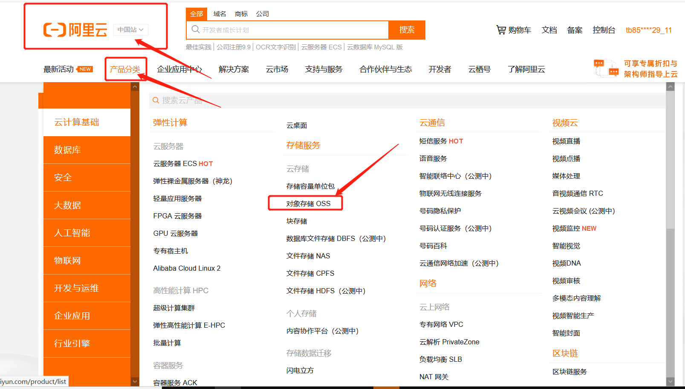

# 对象存储 OSS

海量、安全、低成本、高可靠的云存储服务，提供99.9999999999%(12个9)的数据持久性。使用RESTful API 可以在互联网任何位置存储和访问，容量和处理能力弹性扩展，多种存储类型供选择全面优化存储成本。


入口:https://www.aliyun.com




# 快速入门

# 开始使用阿里云OSS

阿里云对象存储OSS（Object Storage Service）为您提供基于**网络**的数据存取服务。使用OSS，您可以通过网络随时存储和调用包括文本、图片、音视频在内的各种数据文件。

初次使用阿里云OSS，请您先了解[阿里云OSS常见问题](https://help.aliyun.com/document_detail/130345.html#concept-1698037) 和 [阿里云OSS使用限制](https://help.aliyun.com/document_detail/54464.html#concept-pzk-crg-tdb)。                

阿里云OSS将数据文件以对象（Object）的形式上传到存储空间（Bucket）中。您可以进行以下操作：

- 创建一个或者多个存储空间，向每个存储空间中添加一个或多个文件。
- 通过获取已上传文件的地址进行文件的分享和下载。
- 通过修改存储空间或文件的读写权限（ACL）来设置访问权限。
- 通过阿里云管理控制台、各种便捷工具以及丰富的SDK包执行基本和高级OSS操作。

## 快速开始

OSS的基本操作流程如下：


1. [开通OSS服务](https://help.aliyun.com/document_detail/31884.html#task-njz-hf4-tdb)
2. [创建存储空间](https://help.aliyun.com/document_detail/31885.html#task-u3p-3n4-tdb)
3. [上传对象](https://help.aliyun.com/document_detail/31886.html#concept-zx1-4p4-tdb)
4. [下载对象](https://help.aliyun.com/document_detail/31887.html#task-2038465)
5. [删除文件](https://help.aliyun.com/document_detail/31888.html#concept-pgg-qt4-tdb)
6. [删除存储空间](https://help.aliyun.com/document_detail/31889.html#concept-pkl-qdp-tdb)                 

[官方开发文档地址](https://help.aliyun.com/document_detail/31883.html?spm=a2c4g.11174283.2.18.26ce7da26WM1nz)

# 创建存储空间

开通阿里云OSS服务后，您需要首先创建存储空间（Bucket）来存储文件。

## 使用OSS管理控制台

您可以根据以下步骤，使用OSS管理控制台创建存储空间。

1. 登录[OSS管理控制台](https://oss.console.aliyun.com/?spm=a2c4g.11186623.2.11.6ca76ab3UMIRAc)。

2. 单击Bucket列表，之后单击创建Bucket。

   您也可以单击概览，之后单击右侧的创建Bucket。                         

3. 在创建Bucket页面配置Bucket参数。

具体参考: [官方开发文档](https://help.aliyun.com/document_detail/31885.html?spm=a2c4g.11186623.6.610.5fc61c62FLEOxW)


# 使用Java操作

[官方文档地址](https://help.aliyun.com/document_detail/32008.html?spm=a2c4g.11186623.6.902.56e97815d5Jsmy)

**pom.xml**

```xml
<dependencies>
    <dependency>
        <groupId>org.springframework.boot</groupId>
        <artifactId>spring-boot-starter</artifactId>
    </dependency>

    <dependency>
        <groupId>org.springframework.boot</groupId>
        <artifactId>spring-boot-starter-web</artifactId>
    </dependency>

    <dependency>
        <groupId>org.springframework.boot</groupId>
        <artifactId>spring-boot-starter-test</artifactId>
        <scope>test</scope>
        <exclusions>
            <exclusion>
                <groupId>org.junit.vintage</groupId>
                <artifactId>junit-vintage-engine</artifactId>
            </exclusion>
        </exclusions>
    </dependency>

    <dependency>
        <groupId>com.aliyun.oss</groupId>
        <artifactId>aliyun-sdk-oss</artifactId>
        <version>3.10.2</version>
    </dependency>

    <dependency>
        <groupId>org.projectlombok</groupId>
        <artifactId>lombok</artifactId>
    </dependency>

    <dependency>
        <groupId>joda-time</groupId>
        <artifactId>joda-time</artifactId>
        <version>2.9.9</version>
    </dependency>

    <dependency>
        <groupId>io.springfox</groupId>
        <artifactId>springfox-swagger-ui</artifactId>
        <version>2.9.2</version>
    </dependency>

    <dependency>
        <groupId>io.springfox</groupId>
        <artifactId>springfox-swagger2</artifactId>
        <version>2.9.2</version>
    </dependency>
</dependencies>
```

**application.yml**

```yaml
alioss:
  endpoint: oss-cn-hangzhou.aliyuncs.com
  accessKeyId: LTAI4G8PUgUKQLi5jNwu4rJe
  accessKeySecret: NXgV8j2clb8nxeAbnubE11YY2FrRvO
  bucketName: xinguan-parent
```

**OssEntity**

```java
package com.xiaoge.system.entity.oss;

import lombok.Data;
import org.springframework.boot.context.properties.ConfigurationProperties;
import org.springframework.stereotype.Component;

/**
 * @author NieChangan
 */
@ConfigurationProperties(prefix = "alioss")
@Component
@Data
public class OssEntity {

    private String endpoint;

    private String accessKeyId;

    private String accessKeySecret;

    private String bucketName;
}
```

**AliOssService**

```java
package com.xiaoge.system.service;

import org.springframework.web.multipart.MultipartFile;

import java.io.IOException;

/**
 * @author NieChangan
 */
public interface AliOssService {

    /**
     * 创建存储空间
     */
    void createBucket();

    /**
     * 上传文件
     * @param file 文件对象
     * @return
     */
    String upload(MultipartFile file);

    /**
     * 下载文件
     * @throws IOException
     */
    void download(String fileName) throws IOException;

    /**
     * 列举文件
     */
    void listFile();

    /**
     * 删除文件
     */
    void deleteFile(String fileName);


}
```

**AliOssServiceImpl**

```java
package com.xiaoge.system.service.impl;

import com.aliyun.oss.OSS;
import com.aliyun.oss.OSSClientBuilder;
import com.aliyun.oss.model.*;
import com.xiaoge.system.entity.oss.OssEntity;
import com.xiaoge.system.service.AliOssService;
import org.joda.time.DateTime;
import org.springframework.beans.factory.InitializingBean;
import org.springframework.beans.factory.annotation.Autowired;
import org.springframework.stereotype.Service;
import org.springframework.web.multipart.MultipartFile;

import java.io.BufferedReader;
import java.io.IOException;
import java.io.InputStream;
import java.io.InputStreamReader;
import java.util.Date;
import java.util.UUID;

/**
 * @author NieChangan
 */
@Service
public class AliOssServiceImpl implements AliOssService, InitializingBean {

    @Autowired
    private OssEntity ossEntity;

    private String endpoint;
    private String accessKeyId;
    private String accessKeySecret;
    private String bucketName;

    @Override
    public void afterPropertiesSet() throws Exception {
        //// Endpoint以杭州为例，其它Region请按实际情况填写。
        endpoint = ossEntity.getEndpoint();
        //// 阿里云主账号AccessKey拥有所有API的访问权限，风险很高。强烈建议您创建并使用RAM账号进行API访问或日常运维，请登录RAM控制台创建RAM账号。
        accessKeyId = ossEntity.getAccessKeyId();
        accessKeySecret = ossEntity.getAccessKeySecret();
        bucketName = ossEntity.getBucketName();
    }

    @Override
    public void createBucket() {
        // 创建OSSClient实例。
        OSS ossClient = new OSSClientBuilder().build(endpoint, accessKeyId, accessKeySecret);

        if (ossClient.doesBucketExist(bucketName)) {
            throw new RuntimeException(bucketName + "在对象存储的Bucket列表中已经存在");
        }

        // 创建存储空间。
        ossClient.createBucket(bucketName);

        // 关闭OSSClient。
        ossClient.shutdown();
    }

    @Override
    public String upload(MultipartFile file) {
        //上传地址
        String uploadUrl = null;

        try {
            //判断oss实例是否存在：如果不存在则创建，如果存在则获取
            // 创建OSSClient实例。
            OSS ossClient = new OSSClientBuilder().build(endpoint, accessKeyId, accessKeySecret);
            if (!ossClient.doesBucketExist(bucketName)) {
                //创建bucket
                ossClient.createBucket(bucketName);
                //设置oss实例的访问权限：公共读
                ossClient.setBucketAcl(bucketName, CannedAccessControlList.PublicRead);
            }

            //获取上传文件流
            InputStream inputStream = file.getInputStream();

            //构建日期路径：avatar/2020/07/31/文件名
            String datePath = new DateTime().toString("yyyy/MM/dd");

            //文件名：uuid.扩展名
            //获取上传文件的全名称
            String original = file.getOriginalFilename();
            //去掉uuid中生成的-
            String fileName = UUID.randomUUID().toString().replaceAll("-", "");
            //截取掉文件获得扩展名
            String fileType = original.substring(original.lastIndexOf("."));
            //uuid+.jpg/.png
            String newName = fileName + fileType;
            // yyyy/MM/dd+/uuid+.jpg/.png
            fileName = datePath + "/" + newName;

            //如果想要实现图片的预览效果,一定要设置一下几个点
            //1.设置文件 ACL为反正不能为私有  要么是公共读,要么是公共读写
            //2.一定要设置文本类型为(image/jpg)
            ObjectMetadata objectMetadata = new ObjectMetadata();
            //设置公共读权限
            objectMetadata.setObjectAcl(CannedAccessControlList.PublicRead);
            //设置类型
            objectMetadata.setContentType(getcontentType(fileName.substring(fileName.lastIndexOf("."))));

            //文件上传至阿里云
            ossClient.putObject(bucketName, fileName, inputStream, objectMetadata);

            // 关闭OSSClient。
            ossClient.shutdown();

            //默认十年不过期
            Date expiration = new Date(System.currentTimeMillis() + 3600L * 1000 * 24 * 365 * 10);
            //bucket名称  文件名   过期时间
            uploadUrl = ossClient.generatePresignedUrl(bucketName, fileName, expiration).toString();

            //获取url地址
            //uploadUrl = "https://" + bucketName + "." + endPoint + "/" + fileName;

        } catch (IOException e) {
            e.printStackTrace();
        }

        return uploadUrl.substring(0, uploadUrl.indexOf("?"));
        //return uploadUrl;
    }

    @Override
    public void download(String fileName) throws IOException {
        // <yourObjectName>从OSS下载文件时需要指定包含文件后缀在内的完整路径，例如abc/efg/123.jpg。
        String objectName = fileName;

        // 创建OSSClient实例。
        OSS ossClient = new OSSClientBuilder().build(endpoint, accessKeyId, accessKeySecret);

        // 调用ossClient.getObject返回一个OSSObject实例，该实例包含文件内容及文件元信息。
        OSSObject ossObject = ossClient.getObject(bucketName, objectName);
        // 调用ossObject.getObjectContent获取文件输入流，可读取此输入流获取其内容。
        InputStream content = ossObject.getObjectContent();
        if (content != null) {
            BufferedReader reader = new BufferedReader(new InputStreamReader(content));
            while (true) {
                String line = reader.readLine();
                if (line == null) {
                    break;
                }
                System.out.println("\n" + line);
            }
            // 数据读取完成后，获取的流必须关闭，否则会造成连接泄漏，导致请求无连接可用，程序无法正常工作。
            content.close();
        }
        // 关闭OSSClient。
        ossClient.shutdown();
    }

    @Override
    public void listFile() {
        // 创建OSSClient实例。
        OSS ossClient = new OSSClientBuilder().build(endpoint, accessKeyId, accessKeySecret);

        // ossClient.listObjects返回ObjectListing实例，包含此次listObject请求的返回结果。
        ObjectListing objectListing = ossClient.listObjects(bucketName);
        // objectListing.getObjectSummaries获取所有文件的描述信息。
        for (OSSObjectSummary objectSummary : objectListing.getObjectSummaries()) {
            System.out.println(" - " + objectSummary.getKey() + "  " +
                    "(size = " + objectSummary.getSize() + ")");
        }

        // 关闭OSSClient。
        ossClient.shutdown();
    }

    @Override
    public void deleteFile(String fileName) {
        // <yourObjectName>从OSS下载文件时需要指定包含文件后缀在内的完整路径，例如abc/efg/123.jpg。
        String objectName = fileName;

        // 创建OSSClient实例。
        OSS ossClient = new OSSClientBuilder().build(endpoint, accessKeyId, accessKeySecret);

        // 删除文件。
        ossClient.deleteObject(bucketName, objectName);

        // 关闭OSSClient。
        ossClient.shutdown();
    }

    /**
     * Description: 判断OSS服务文件上传时文件的contentType
     *
     * @param FilenameExtension 文件后缀
     * @return String
     */
    public static String getcontentType(String FilenameExtension) {
        if (FilenameExtension.equalsIgnoreCase(".bmp")) {
            return "image/bmp";
        }
        if (FilenameExtension.equalsIgnoreCase(".gif")) {
            return "image/gif";
        }
        if (FilenameExtension.equalsIgnoreCase(".jpeg") ||
                FilenameExtension.equalsIgnoreCase(".jpg") ||
                FilenameExtension.equalsIgnoreCase(".png")) {
            return "image/jpg";
        }
        if (FilenameExtension.equalsIgnoreCase(".html")) {
            return "text/html";
        }
        if (FilenameExtension.equalsIgnoreCase(".txt")) {
            return "text/plain";
        }
        if (FilenameExtension.equalsIgnoreCase(".vsd")) {
            return "application/vnd.visio";
        }
        if (FilenameExtension.equalsIgnoreCase(".pptx") ||
                FilenameExtension.equalsIgnoreCase(".ppt")) {
            return "application/vnd.ms-powerpoint";
        }
        if (FilenameExtension.equalsIgnoreCase(".docx") ||
                FilenameExtension.equalsIgnoreCase(".doc")) {
            return "application/msword";
        }
        if (FilenameExtension.equalsIgnoreCase(".xml")) {
            return "text/xml";
        }
        return "image/jpg";
    }
}
```

**AliOssController**

```java
package com.xiaoge.system.controller;

import com.xiaoge.response.Result;
import com.xiaoge.system.service.AliOssService;
import io.swagger.annotations.Api;
import io.swagger.annotations.ApiOperation;
import org.springframework.beans.factory.annotation.Autowired;
import org.springframework.stereotype.Controller;
import org.springframework.web.bind.annotation.CrossOrigin;
import org.springframework.web.bind.annotation.PostMapping;
import org.springframework.web.bind.annotation.RestController;
import org.springframework.web.multipart.MultipartFile;

/**
 * @author NieChangan
 */
@Api
@RestController
@CrossOrigin
public class AliOssController {
    @Autowired
    private AliOssService aliOssService;

    @ApiOperation(value = "上传图片文件")
    @PostMapping("/uploadImgFile")
    public Result uploadImgFile(MultipartFile file){
        String s = aliOssService.upload(file);
        return Result.ok().data("url",s);
    }

    @ApiOperation(value = "删除上传替换之后的头像")
    @PostMapping("/deleteImgFile")
    public Result deleteImgFile(String file){
        //https://xinguan-parent.oss-cn-hangzhou.aliyuncs.com/2020/09/25/1575345b2cd14c13872f9b83a0aac919.png
        try {
            String[] splitFile = file.split(".com/");
            aliOssService.deleteFile(splitFile[1]);
            return Result.ok();
        }catch (Exception e){
            return Result.error();
        }
    }
}
```

# 前端代码操作


**发送请求的代码**

```js
export const deleteImgFile= (file) => {
  return request({
    url: "/deleteImgFile",
    method: 'post',
    params: {
      file
    }
  })
}
```

**添加用户全部代码**

```vue
<template>
  <div>
    <el-dialog v-bind="$attrs" v-on="$listeners" :visible.sync="showDialog" @open="onOpen" @close="onClose" title="添加用户">
      <el-row :gutter="15">
        <el-form ref="elForm" :model="formData" :rules="rules" size="medium" label-width="80px">
          <el-col :span="24">
            <!-- 用户头像 -->
            <el-form-item label="用户头像">

              <!-- 头衔缩略图 -->
              <pan-thumb :image="image"/>
              <!-- 文件上传按钮 -->
              <el-button type="primary" icon="el-icon-upload" @click="imagecropperShow=true">更换头像
              </el-button>

              <!--
                v-show：是否显示上传组件
                :key：类似于id，如果一个页面多个图片上传控件，可以做区分
                :url：后台上传的url地址
                @close：关闭上传组件
                @crop-upload-success：上传成功后的回调 -->
              <image-cropper
                v-show="imagecropperShow"
                :width="300"
                :height="300"
                :key="imagecropperKey"
                :url="'/uploadImgFile'"
                field="file"
                @close="closeImage"
                @crop-upload-success="cropSuccess"/>

            </el-form-item>
          </el-col>
          <el-col :span="12">
            <el-form-item label="用户名" prop="username">
              <el-input v-model="formData.username" placeholder="请输入用户名" clearable :style="{width: '100%'}">
              </el-input>
            </el-form-item>
            <el-form-item label="昵称" prop="nickname">
              <el-input v-model="formData.nickname" placeholder="请输入昵称" clearable :style="{width: '100%'}">
              </el-input>
            </el-form-item>
            <el-form-item label="密码" prop="password">
              <el-input v-model="formData.password" placeholder="请输入密码" clearable :style="{width: '100%'}">
              </el-input>
            </el-form-item>
            <el-form-item label="手机" prop="phoneNumber">
              <el-input v-model="formData.phoneNumber" placeholder="请输入手机" clearable :style="{width: '100%'}">
              </el-input>
            </el-form-item>
          </el-col>
          <el-col :span="12">
            <el-form-item label="部门" prop="departmentId">
              <el-select v-model="formData.departmentId" placeholder="请选择部门" clearable
                         :style="{width: '100%'}">
                <el-option v-for="(item, index) in departments" :key="index" :label="item.name"
                           :value="item.id" :disabled="item.disabled"></el-option>
              </el-select>
            </el-form-item>
            <el-form-item label="性别" prop="sex">
              <el-radio-group v-model="formData.sex" size="medium">
                <el-radio v-for="(item, index) in sexOptions" :key="index" :label="item.value"
                          :disabled="item.disabled">{{item.label}}</el-radio>
              </el-radio-group>
            </el-form-item>
            <el-form-item label="邮箱" prop="email">
              <el-input v-model="formData.email" placeholder="请输入邮箱" clearable :style="{width: '100%'}">
              </el-input>
            </el-form-item>
            <el-form-item label="生日" prop="birth">
              <el-date-picker v-model="formData.birth" format="yyyy-MM-dd" value-format="yyyy-MM-dd"
                              :style="{width: '100%'}" placeholder="请选择生日" clearable></el-date-picker>
            </el-form-item>
          </el-col>
        </el-form>
      </el-row>
      <div slot="footer">
        <el-button @click="close">取消</el-button>
        <el-button type="primary" @click="handelConfirm">确定</el-button>
      </div>
    </el-dialog>
  </div>
</template>
<script>
  import ImageCropper from '../../components/ImageCropper'
  import PanThumb from '../../components/PanThumb'
  import { deleteImgFile } from '../../api/users'

  export default {
    name: 'UserAdd',
    components: {ImageCropper, PanThumb},
    // 接受父组件传递的值
    props:{
      addOrUpdateVisible:{
        type: Boolean,
        default: false
      },
      departments:{
        type: Array,
        default: []
      }
    },
    data() {
      return {
        formData: {
          field101: null,
          username: undefined,
          departmentId: undefined,
          nickname: undefined,
          sex: 1,
          password: undefined,
          email: undefined,
          phoneNumber: undefined,
          birth: "2020-09-09",
        },
        // 控制弹出框显示隐藏
        showDialog:false,
        imagecropperShow: false, // 是否显示上传组件
        imagecropperKey: 0, // 上传组件id
        image: 'https://wpimg.wallstcn.com/577965b9-bb9e-4e02-9f0c-095b41417191',
        rules: {
          username: [{
            required: true,
            message: '请输入用户名',
            trigger: 'blur'
          }],
          departmentId: [{
            required: true,
            message: '请选择部门',
            trigger: 'change'
          }],
          nickname: [{
            required: true,
            message: '请输入昵称',
            trigger: 'blur'
          }],
          sex: [{
            required: true,
            message: '性别不能为空',
            trigger: 'change'
          }],
          password: [{
            required: true,
            message: '请输入密码',
            trigger: 'blur'
          }],
          email: [{
            required: true,
            message: '请输入邮箱',
            trigger: 'blur'
          }],
          phoneNumber: [{
            required: true,
            message: '请输入手机',
            trigger: 'blur'
          }],
          birth: [{
            required: true,
            message: '请选择生日',
            trigger: 'change'
          }],
        },
        sexOptions: [{
          "label": "帅哥",
          "value": 1
        }, {
          "label": "美女",
          "value": 2
        }],
      }
    },
    computed: {},
    watch: {
      // 监听 addOrUpdateVisible 改变
      addOrUpdateVisible(oldVal,newVal){
        this.showDialog = this.addOrUpdateVisible
      },
    },
    created() {},
    mounted() {},
    methods: {
      onOpen() {

      },
      onClose() {
        this.$refs['elForm'].resetFields()
        this.$emit('changeShow', 'false')
      },
      close() {
        this.$emit('changeShow', 'false')
      },
      handelConfirm() {
        this.$refs['elForm'].validate(valid => {
          if (!valid) return
          console.log(this.formData)
        })
      },
      field101BeforeUpload(file) {
        let isRightSize = file.size / 1024 / 1024 < 2
        if (!isRightSize) {
          this.$message.error('文件大小超过 2MB')
        }
        let isAccept = new RegExp('image/*').test(file.type)
        if (!isAccept) {
          this.$message.error('应该选择image/*类型的文件')
        }
        return isRightSize && isAccept
      },
      // 上传成功后的回调函数
      cropSuccess(data) {
        console.log(data)
        var oldImage = this.image;
        this.imagecropperShow = false
        this.image = data.data.url;
        // 上传成功后，重新打开上传组件时初始化组件，否则显示上一次的上传结果
        this.imagecropperKey = this.imagecropperKey + 1
        //上传成功之后删除之前的头像
        this.deleteAvatar(oldImage);
      },
      // 关闭上传组件
      closeImage() {
        this.imagecropperShow = false
        // 上传失败后，重新打开上传组件时初始化组件，否则显示上一次的上传结果
        this.imagecropperKey = this.imagecropperKey + 1
      },
      //删除上传之前的图片
      async deleteAvatar(oldImage){
        const {data} = await deleteImgFile(oldImage)
      }
    }
  }

</script>
<style>
  .el-upload__tip {
    line-height: 1.2;
  }
</style>
```

