vo 后端传给前端的包装类

bo前端传给后端的包装类

# 首页轮播图

> 不同图片背景不同.应该增加一个属性控制背景,点击图片可能跳转到具体商品或者跳转到某一类商品,通过轮播图类型控制,数据库存的是图片地址

## 表结构

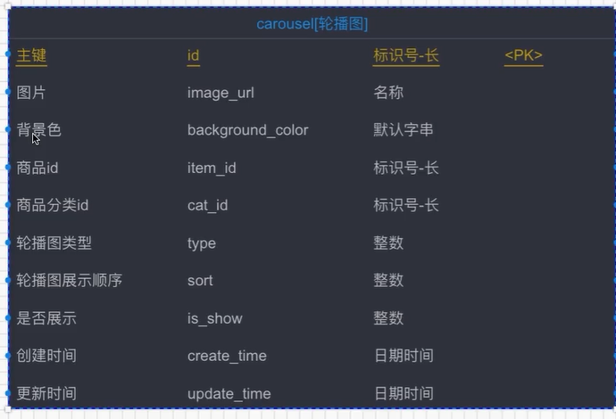

## 页面

```html
<div id="index444">
		<div class="banner" style="top: 213px;">
			<!--轮播 -->
			<div class="am-slider am-slider-default scoll" data-am-flexslider id="demo-slider-0">
				<ul class="am-slides">
					<li class="banner1"><a></a></li>
				</ul>
			</div>
			<div class="clear"></div>
</div>
```

## Js

```js
	<!-- <script>
		window.jQuery || document.write('<script src="basic/js/jquery.min.js "><\/script>');
	</script> -->
	<script type="text/javascript " src="basic/js/quick_links.js"></script>
	<!-- <script type="text/javascript " src="js/jquery.blockUI.js"></script> -->
	<!-- <script type="text/javascript " src="components/mloading/jquery.mloading.js"></script> -->
	<script type="text/javascript " src="js/app.js"></script>
	<script type="text/javascript">
		function showPage(type, catOrItemId) {
			// console.log("type:" + type);
			// console.log("catOrItemId:" + catOrItemId);

			if(type == 1) {
				window.open("item.html?itemId=" + catOrItemId);
			} else if (type == 2) {
				window.open("catItems.html?searchType=catItems&catId=" + catOrItemId);
				
			}
		}
	</script>
	<script type="text/javascript">
		var index = new Vue({
			el: "#index",
			data: {
				carouselList: [],
				categoryList: [],
				sixNewItemsList: [],

				userIsLogin: false,
				userInfo: {},

				keywords: null,
				catIndex: 0,			// 用于懒加载判断每次的幅度
				isScrolling: true,

				shopcartItemCounts: 0,	// 购物车中商品的数量
			},
			created() {
				// var me = this;
				// 用户cookie操作
				var userCookie = app.getCookie("user");
				if (userCookie != null && userCookie != undefined && userCookie != '') {
					var userInfoStr = decodeURIComponent(userCookie);
					if (userInfoStr != null && userInfoStr != undefined && userInfoStr != '') {
						var userInfo = JSON.parse(userInfoStr);
						// 判断是否是一个对象
						if ( typeof(userInfo)  == "object" ) {
							this.userIsLogin = true;
							// console.log(userInfo);
							this.userInfo = userInfo;
						} else {
							this.userIsLogin = false;
							this.userInfo = {};
						}
					}
				} else {
					this.userIsLogin = false;
					this.userInfo = {};
				}

				// 渲染轮播图
				this.renderCarousel();
				// 渲染分类
				this.renderCategorys();
				// 渲染分类下最新商品
				// this.renderSixNewItems();

				// 从购物车中拿到商品的数量
				this.shopcartItemCounts = app.getShopcartItemCounts();
			},
			methods: {
				goUserCenter() {
					// 判断用户是否登录
					var userIsLogin = this.userIsLogin;
					if (!userIsLogin) {
						// 用户未登录，则跳转
						window.location.href = "login.html?returnUrl=" + app.centerServerUrl;
					} else {
						window.location.href = app.centerServerUrl;
					}
				},
				goToShopcart() {
					window.location.href = "shopcart.html";
				},
				doSearch() {
					var keywords = this.keywords;
					// console.log(keywords);
					if (keywords == null || keywords == undefined || keywords == '') {
						alert("搜索内容不能为空");
						return;
					}
					// window.location.href = "search.html?keywords=" + keywords;
					window.open("catItems.html?searchType=searchItems&keywords=" + keywords);
					// window.open("search.html?searchType=searchItems&keywords=" + keywords);
				},
				renderSixNewItems() {

					var serverUrl = app.serverUrl;
					var categoryList = this.categoryList;
					var catIndex = this.catIndex;
					
					var rootCat = categoryList[catIndex];
					if (rootCat == undefined || rootCat == null || rootCat == '') {
						return;
					}
					var rootCatId = rootCat.id;

					catIndex++;
					this.catIndex = catIndex;

					// 获得各个分类下的最新6个商品
					axios.get(
							serverUrl + '/index/sixNewItems/' + rootCatId, {})
						.then(res => {
							if (res.data.status == 200) {
								var sixNewItemsListTemp = res.data.data
								var sixNewItemsList = this.sixNewItemsList;
								sixNewItemsList.push(sixNewItemsListTemp[0]);
								this.sixNewItemsList = sixNewItemsList;
								// console.log(sixNewItemsList);
								this.isScrolling = false;	// 加载完毕以后表示下次可以继续滚动加载
							}
						});
				},
				
				renderCarousel() {
					var serverUrl = app.serverUrl;
					// 获得轮播图
					axios.get(
							serverUrl + '/index/carousel', {})
						.then(res => {
							if (res.data.status == 200) {
								var carouselList = res.data.data
								this.carouselList = carouselList;

							
								// 循环渲染轮播图
								var $slider = $('#demo-slider-0');
								for (var i = 0; i < carouselList.length; i++) {

									var type = carouselList[i].type;
									var catId = carouselList[i].catId;
									var itemId = carouselList[i].itemId;
									var catOrItemId = "";

									if (type == 1) {
										catOrItemId = itemId;
									}
									if (type == 2) {
										catOrItemId = catId;
									}
									
									catOrItemId = encodeURI(catOrItemId);

									var cal = '<li class="" style="background: ' + carouselList[i].backgroundColor +
										';">' +
										'<a href=javascript:showPage(' + type + ',\"'+catOrItemId+'\");></a>' +
										+'</li>';
									$slider.flexslider('addSlide', cal);
								}
								// <li class="banner4"><a></a></li>

								// console.log($slider.flexslider('count'));
								$slider.flexslider('removeSlide', 0);

								// var img1 = '<li>';
								// $slider.flexslider('addSlide', img1);
							}
						});
				},
				renderCategorys() {
					var serverUrl = app.serverUrl;

					// 获得商品分类 - 大分类
					axios.get(
							serverUrl + '/index/cats', {})
						.then(res => {
							
							if (res.data.status == 200) {
								var categoryList = res.data.data
								this.categoryList = categoryList;

								var rootCatHtml = "";
								for (var i = 0; i < categoryList.length; i++) {

									var cat = categoryList[i];
									rootCatHtml += '' +
										'<li class="appliance js_toggle relative">' +
										'<div class="category-info">' +
										'<h3 class="category-name b-category-name">' +
										'<i></i>' +
										'<a class="ml-22" title="' + cat.name + '">' + cat.name + '</a>' +
										'</h3>' +
										'<em>&gt;</em></div>' +
										'<div class="menu-item menu-in top">' +
										'<div class="area-in">' +
										'<div class="area-bg">' +
										'<div class="menu-srot">' +
										'<div class="sort-side" rootCatId="' + cat.id + '"></div>' +
										'</div>' +
										'</div>' +
										'</div>' +
										'</div>' +
										'<b class="arrow"></b>' +
										'</li>';
								}
								var $leftNav = $('#js_climit_li');
								$leftNav.html(rootCatHtml);

								$("li").hover(function () {
									// debugger;
									$(".category-content .category-list li.first .menu-in").css("display",
										"none");
									$(".category-content .category-list li.first").removeClass("hover");

									var meLi = $(this);

									var subWapper = $(this).children("div.menu-in").children("div.area-in")
										.children("div.area-bg").children("div.menu-srot").children(
											"div.sort-side");
									// console.log(subWapper.html());
									var subCatHtml = subWapper.html();
									var rootCatId = subWapper.attr("rootCatId");
									// console.log(rootCatId);
									// 如果该节点下没有内容，则发起请求查询子分类并且渲染到页面，如果有的话就不查询了（懒加载模式）
									if (subCatHtml == null || subCatHtml == '' || subCatHtml == undefined) {
										if (rootCatId != undefined && rootCatId != null && rootCatId != '') {
											// 根据root分类id查询该分类下的所有子分类
											axios.get(
													serverUrl + '/index/subCat/' + rootCatId, {})
												.then(res => {
													if (res.data.status == 200) {
														var catList = res.data.data
														// this.catList = catList;
														// debugger;
														var subRenderHtml = '';
														for (var i = 0; i < catList.length; i++) {
															var cat = catList[i];
															subRenderHtml += '' +
																'<dl class="dl-sort">' +
																'<dt><span title="' + cat.name + '">' +
																cat.name + '</span></dt>';

															// 拼接第三级分类
															var subCatList = cat.subCatList;
															for (var j = 0; j < subCatList.length; j++) {
																var subCat = subCatList[j];
																subRenderHtml += '<dd><a title="' + subCat
																	.subName + '" href="catItems.html?searchType=catItems&catId='+ subCat.subId +'" target="_blank"><span>' +
																	subCat.subName + '</span></a></dd>'
															}

															subRenderHtml += '</dl>';
														}
														subWapper.html(subRenderHtml);
														meLi.addClass("hover");
														meLi.children("div.menu-in").css("display",
															"block");
													}
												});
										}
										// var renderHtml = '' 
										// 	+ '<dl class="dl-sort">'
										// 		+ '<dt><span title="大包装">大包装</span></dt>'
										// 		+ '<dd><a title="蒸蛋糕" href="#"><span>蒸蛋糕</span></a></dd>'
										// 		+ '<dd><a title="脱水蛋糕" href="#"><span>脱水蛋糕</span></a></dd>'
										// 		+ '<dd><a title="瑞士卷" href="#"><span>瑞士卷</span></a></dd>'
										// 		+ '<dd><a title="软面包" href="#"><span>软面包</span></a></dd>'
										// 		+ '<dd><a title="马卡龙" href="#"><span>马卡龙</span></a></dd>'
										// 		+ '<dd><a title="千层饼" href="#"><span>千层饼</span></a></dd>'
										// 		+ '<dd><a title="甜甜圈" href="#"><span>甜甜圈</span></a></dd>'
										// 		+ '<dd><a title="蒸三明治" href="#"><span>蒸三明治</span></a></dd>'
										// 		+ '<dd><a title="铜锣烧" href="#"><span>铜锣烧</span></a></dd>'
										// 	+ '</dl>'
										// 	+ '<dl class="dl-sort">'
										// 		+ '<dt><span title="两件套">两件套</span></dt>'
										// 		+ '<dd><a title="蒸蛋糕" href="#"><span>蒸蛋糕</span></a></dd>'
										// 		+ '<dd><a title="脱水蛋糕" href="#"><span>脱水蛋糕</span></a></dd>'
										// 		+ '<dd><a title="瑞士卷" href="#"><span>瑞士卷</span></a></dd>'
										// 		+ '<dd><a title="软面包" href="#"><span>软面包</span></a></dd>'
										// 		+ '<dd><a title="马卡龙" href="#"><span>马卡龙</span></a></dd>'
										// 		+ '<dd><a title="千层饼" href="#"><span>千层饼</span></a></dd>'
										// 		+ '<dd><a title="甜甜圈" href="#"><span>甜甜圈</span></a></dd>'
										// 		+ '<dd><a title="蒸三明治" href="#"><span>蒸三明治</span></a></dd>'
										// 		+ '<dd><a title="铜锣烧" href="#"><span>铜锣烧</span></a></dd>'
										// 	+ '</dl>';
										// 	$(this)
										// 		.children("div.menu-in")
										// 		.children("div.area-in")
										// 		.children("div.area-bg")
										// 		.children("div.menu-srot")
										// 		.children("div.sort-side")
										// 		.html(renderHtml);
									} else {
										$(this).addClass("hover");
										$(this).children("div.menu-in").css("display", "block");
									}

									// $(this).addClass("hover");
									// $(this).children("div.menu-in").css("display", "block")
								}, function () {
									$(this).removeClass("hover")
									$(this).children("div.menu-in").css("display", "none")
								});
								this.renderSixNewItems();
							}
						});
				},
				getRequest() {},
				postRequest() {},
				logout() {
					var userId = this.userInfo.id;
					var serverUrl = app.serverUrl;

					axios.defaults.withCredentials = true;
					axios.post(serverUrl + '/passport/logout?userId=' + userId, {})
						.then(res => {
							if (res.data.status == 200) {
								window.location.href = "index.html";
							} else if (res.data.status == 500) {
								alert(res.data.msg);
								return;
							}
						});
				}
			}
		});
	</script>
	<script type="text/javascript">
		
		$(window).scroll(
			function() {
				// scrollTop为滚动条在Y轴上的滚动距离。
				// clientHeight为内容可视区域的高度。
				// scrollHeight为内容可视区域的高度加上溢出（滚动）的距离。
				var scrollTop = $(this).scrollTop();
				var scrollHeight = $(document).height();
				var windowHeight = $(this).height();
				if (scrollTop + windowHeight > (scrollHeight - 50) ) {
				// 此处是滚动条到底部时候触发的事件，在这里写要加载的数据，或者是拉动滚动条的操作
				// console.log("123");
				index.renderSixNewItems();
			}
		});

	</script>

```

## 代码

### js片段

> 在Created函数里调用 this.renderCarousel();

```js
renderCarousel() {
					var serverUrl = app.serverUrl;
					// 获得轮播图
					axios.get(
							serverUrl + '/index/carousel', {})
						.then(res => {
							if (res.data.status == 200) {
								var carouselList = res.data.data
								this.carouselList = carouselList;

							
								// 循环渲染轮播图
								var $slider = $('#demo-slider-0');
								for (var i = 0; i < carouselList.length; i++) {

									var type = carouselList[i].type;
									var catId = carouselList[i].catId;
									var itemId = carouselList[i].itemId;
									var catOrItemId = "";

									if (type == 1) {
										catOrItemId = itemId;
									}
									if (type == 2) {
										catOrItemId = catId;
									}
									
									catOrItemId = encodeURI(catOrItemId);

									var cal = '<li class="" style="background: ' + carouselList[i].backgroundColor +
										';">' +
										'<a href=javascript:showPage(' + type + ',\"'+catOrItemId+'\");></a>' +
										+'</li>';
									$slider.flexslider('addSlide', cal);
								}
								// <li class="banner4"><a></a></li>

								// console.log($slider.flexslider('count'));
								$slider.flexslider('removeSlide', 0);

								// var img1 = '<li>';
								// $slider.flexslider('addSlide', img1);
							}
						});
				},
```

### Controller

```java
@Api(value = "首页", tags = {"首页展示的相关接口"})
@RestController
@RequestMapping("index")
public class IndexController {

    @Autowired
    private CarouselService carouselService;

    @Autowired
    private CategoryService categoryService;

    @ApiOperation(value = "获取首页轮播图列表", notes = "获取首页轮播图列表", httpMethod = "GET")
    @GetMapping("/carousel")
    public IMOOCJSONResult carousel() {
        List<Carousel> list = carouselService.queryAll(YesOrNo.YES.type);
        return IMOOCJSONResult.ok(list);
    }
}
```

### Services

```java
@Service
public class CarouselServiceImpl implements CarouselService {

    @Autowired
    private CarouselMapper carouselMapper;

    @Transactional(propagation = Propagation.SUPPORTS)
    @Override
    public List<Carousel> queryAll(Integer isShow) {

        Example example = new Example(Carousel.class);
        example.orderBy("sort").desc();
        Example.Criteria criteria = example.createCriteria();
        criteria.andEqualTo("isShow", isShow);

        List<Carousel> result =  carouselMapper.selectByExample(example);

        return result;
    }
}
```

### Dao

```java
public interface CarouselMapper extends MyMapper<Carousel> {
}
```

### CarouselMapper.xml

```xml
<?xml version="1.0" encoding="UTF-8" ?>
<!DOCTYPE mapper PUBLIC "-//mybatis.org//DTD Mapper 3.0//EN" "http://mybatis.org/dtd/mybatis-3-mapper.dtd" >
<mapper namespace="com.imooc.mapper.CarouselMapper" >
  <resultMap id="BaseResultMap" type="com.imooc.pojo.Carousel" >
    <!--
      WARNING - @mbg.generated
    -->
    <id column="id" property="id" jdbcType="VARCHAR" />
    <result column="image_url" property="imageUrl" jdbcType="VARCHAR" />
    <result column="background_color" property="backgroundColor" jdbcType="VARCHAR" />
    <result column="item_id" property="itemId" jdbcType="VARCHAR" />
    <result column="cat_id" property="catId" jdbcType="VARCHAR" />
    <result column="type" property="type" jdbcType="INTEGER" />
    <result column="sort" property="sort" jdbcType="INTEGER" />
    <result column="is_show" property="isShow" jdbcType="INTEGER" />
    <result column="create_time" property="createTime" jdbcType="TIMESTAMP" />
    <result column="update_time" property="updateTime" jdbcType="TIMESTAMP" />
  </resultMap>
</mapper>
```

# 首页分类

> 树形结构,三级分类,懒加载,鼠标移动展示对应子分类,把一张表看成三张表,自连接查询
>
> 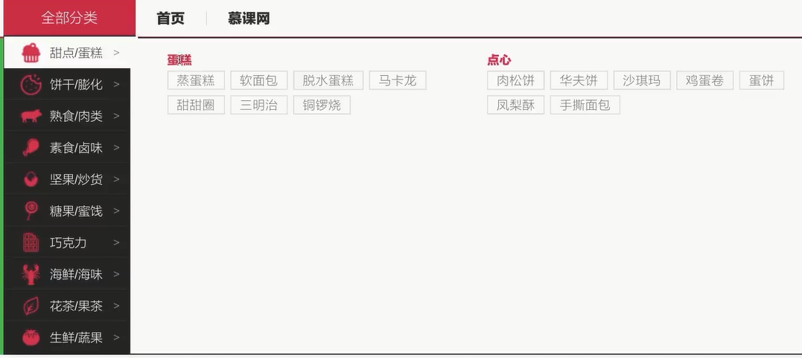

## 表结构

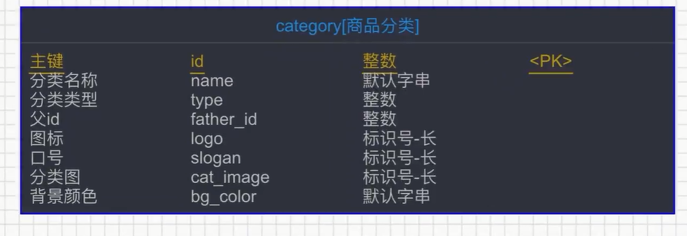

## 代码

### js片段

> 在created函数里面用this.renderCategorys();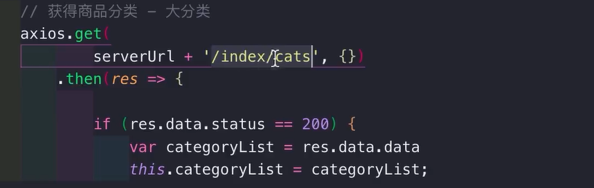
>
> 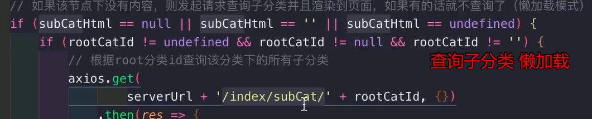

```js
renderCategorys() {
					var serverUrl = app.serverUrl;

					// 获得商品分类 - 大分类
					axios.get(
							serverUrl + '/index/cats', {})
						.then(res => {
							
							if (res.data.status == 200) {
								var categoryList = res.data.data
								this.categoryList = categoryList;

								var rootCatHtml = "";
								for (var i = 0; i < categoryList.length; i++) {

									var cat = categoryList[i];
									rootCatHtml += '' +
										'<li class="appliance js_toggle relative">' +
										'<div class="category-info">' +
										'<h3 class="category-name b-category-name">' +
										'<i></i>' +
										'<a class="ml-22" title="' + cat.name + '">' + cat.name + '</a>' +
										'</h3>' +
										'<em>&gt;</em></div>' +
										'<div class="menu-item menu-in top">' +
										'<div class="area-in">' +
										'<div class="area-bg">' +
										'<div class="menu-srot">' +
										'<div class="sort-side" rootCatId="' + cat.id + '"></div>' +
										'</div>' +
										'</div>' +
										'</div>' +
										'</div>' +
										'<b class="arrow"></b>' +
										'</li>';
								}
								var $leftNav = $('#js_climit_li');
								$leftNav.html(rootCatHtml);

								$("li").hover(function () {
									// debugger;
									$(".category-content .category-list li.first .menu-in").css("display",
										"none");
									$(".category-content .category-list li.first").removeClass("hover");

									var meLi = $(this);

									var subWapper = $(this).children("div.menu-in").children("div.area-in")
										.children("div.area-bg").children("div.menu-srot").children(
											"div.sort-side");
									// console.log(subWapper.html());
									var subCatHtml = subWapper.html();
									var rootCatId = subWapper.attr("rootCatId");
									// console.log(rootCatId);
									// 如果该节点下没有内容，则发起请求查询子分类并且渲染到页面，如果有的话就不查询了（懒加载模式）
									if (subCatHtml == null || subCatHtml == '' || subCatHtml == undefined) {
										if (rootCatId != undefined && rootCatId != null && rootCatId != '') {
											// 根据root分类id查询该分类下的所有子分类
											axios.get(
													serverUrl + '/index/subCat/' + rootCatId, {})
												.then(res => {
													if (res.data.status == 200) {
														var catList = res.data.data
														// this.catList = catList;
														// debugger;
														var subRenderHtml = '';
														for (var i = 0; i < catList.length; i++) {
															var cat = catList[i];
															subRenderHtml += '' +
																'<dl class="dl-sort">' +
																'<dt><span title="' + cat.name + '">' +
																cat.name + '</span></dt>';

															// 拼接第三级分类
															var subCatList = cat.subCatList;
															for (var j = 0; j < subCatList.length; j++) {
																var subCat = subCatList[j];
																subRenderHtml += '<dd><a title="' + subCat
																	.subName + '" href="catItems.html?searchType=catItems&catId='+ subCat.subId +'" target="_blank"><span>' +
																	subCat.subName + '</span></a></dd>'
															}

															subRenderHtml += '</dl>';
														}
														subWapper.html(subRenderHtml);
														meLi.addClass("hover");
														meLi.children("div.menu-in").css("display",
															"block");
													}
												});
										}
										// var renderHtml = '' 
										// 	+ '<dl class="dl-sort">'
										// 		+ '<dt><span title="大包装">大包装</span></dt>'
										// 		+ '<dd><a title="蒸蛋糕" href="#"><span>蒸蛋糕</span></a></dd>'
										// 		+ '<dd><a title="脱水蛋糕" href="#"><span>脱水蛋糕</span></a></dd>'
										// 		+ '<dd><a title="瑞士卷" href="#"><span>瑞士卷</span></a></dd>'
										// 		+ '<dd><a title="软面包" href="#"><span>软面包</span></a></dd>'
										// 		+ '<dd><a title="马卡龙" href="#"><span>马卡龙</span></a></dd>'
										// 		+ '<dd><a title="千层饼" href="#"><span>千层饼</span></a></dd>'
										// 		+ '<dd><a title="甜甜圈" href="#"><span>甜甜圈</span></a></dd>'
										// 		+ '<dd><a title="蒸三明治" href="#"><span>蒸三明治</span></a></dd>'
										// 		+ '<dd><a title="铜锣烧" href="#"><span>铜锣烧</span></a></dd>'
										// 	+ '</dl>'
										// 	+ '<dl class="dl-sort">'
										// 		+ '<dt><span title="两件套">两件套</span></dt>'
										// 		+ '<dd><a title="蒸蛋糕" href="#"><span>蒸蛋糕</span></a></dd>'
										// 		+ '<dd><a title="脱水蛋糕" href="#"><span>脱水蛋糕</span></a></dd>'
										// 		+ '<dd><a title="瑞士卷" href="#"><span>瑞士卷</span></a></dd>'
										// 		+ '<dd><a title="软面包" href="#"><span>软面包</span></a></dd>'
										// 		+ '<dd><a title="马卡龙" href="#"><span>马卡龙</span></a></dd>'
										// 		+ '<dd><a title="千层饼" href="#"><span>千层饼</span></a></dd>'
										// 		+ '<dd><a title="甜甜圈" href="#"><span>甜甜圈</span></a></dd>'
										// 		+ '<dd><a title="蒸三明治" href="#"><span>蒸三明治</span></a></dd>'
										// 		+ '<dd><a title="铜锣烧" href="#"><span>铜锣烧</span></a></dd>'
										// 	+ '</dl>';
										// 	$(this)
										// 		.children("div.menu-in")
										// 		.children("div.area-in")
										// 		.children("div.area-bg")
										// 		.children("div.menu-srot")
										// 		.children("div.sort-side")
										// 		.html(renderHtml);
									} else {
										$(this).addClass("hover");
										$(this).children("div.menu-in").css("display", "block");
									}

									// $(this).addClass("hover");
									// $(this).children("div.menu-in").css("display", "block")
								}, function () {
									$(this).removeClass("hover")
									$(this).children("div.menu-in").css("display", "none")
								});
								this.renderSixNewItems();
							}
						});
				},
```

### Controller

```java
/**
     * 首页分类展示需求：
     * 1. 第一次刷新主页查询大分类，渲染展示到首页
     * 2. 如果鼠标上移到大分类，则加载其子分类的内容，如果已经存在子分类，则不需要加载（懒加载）
     */
    @ApiOperation(value = "获取商品分类(一级分类)", notes = "获取商品分类(一级分类)", httpMethod = "GET")
    @GetMapping("/cats")
    public IMOOCJSONResult cats() {
        List<Category> list = categoryService.queryAllRootLevelCat();
        return IMOOCJSONResult.ok(list);
    }

    @ApiOperation(value = "获取商品子分类", notes = "获取商品子分类", httpMethod = "GET")
    @GetMapping("/subCat/{rootCatId}")
    public IMOOCJSONResult subCat(
            @ApiParam(name = "rootCatId", value = "一级分类id", required = true)
            @PathVariable Integer rootCatId) {

        if (rootCatId == null) {
            return IMOOCJSONResult.errorMsg("分类不存在");
        }

        List<CategoryVO> list = categoryService.getSubCatList(rootCatId);
        return IMOOCJSONResult.ok(list);
    }
```

### Services

```java
@Service
public class CategoryServiceImpl implements CategoryService {

    @Autowired
    private CategoryMapper categoryMapper;

    @Autowired
    private CategoryMapperCustom categoryMapperCustom;

    @Transactional(propagation = Propagation.SUPPORTS)
    @Override
    public List<Category> queryAllRootLevelCat() {

        Example example = new Example(Category.class);
        Example.Criteria criteria = example.createCriteria();
        criteria.andEqualTo("type", 1);

        List<Category> result =  categoryMapper.selectByExample(example);

        return result;
    }

    @Transactional(propagation = Propagation.SUPPORTS)
    @Override
    public List<CategoryVO> getSubCatList(Integer rootCatId) {
        return categoryMapperCustom.getSubCatList(rootCatId);
    }
}
```

### Dao

```java
public interface CategoryMapper extends MyMapper<Category> {
}

public interface CategoryMapperCustom {

    public List<CategoryVO> getSubCatList(Integer rootCatId);

    public List<NewItemsVO> getSixNewItemsLazy(@Param("paramsMap") Map<String, Object> map);
```

### CategoryMapper.xml

```xml
<mapper namespace="com.imooc.mapper.CategoryMapper" >
  <resultMap id="BaseResultMap" type="com.imooc.pojo.Category" >
    <!--
      WARNING - @mbg.generated
    -->
    <id column="id" property="id" jdbcType="INTEGER" />
    <result column="name" property="name" jdbcType="VARCHAR" />
    <result column="type" property="type" jdbcType="INTEGER" />
    <result column="father_id" property="fatherId" jdbcType="INTEGER" />
    <result column="logo" property="logo" jdbcType="VARCHAR" />
    <result column="slogan" property="slogan" jdbcType="VARCHAR" />
    <result column="cat_image" property="catImage" jdbcType="VARCHAR" />
    <result column="bg_color" property="bgColor" jdbcType="VARCHAR" />
  </resultMap>
</mapper>
```

### CategoryMapperCustom.xml

```xml
<mapper namespace="com.imooc.mapper.CategoryMapperCustom" >

  <resultMap id="myCategoryVO" type="com.imooc.pojo.vo.CategoryVO">
    <id column="id" property="id"/>
    <result column="name" property="name"/>
    <result column="type" property="type"/>
    <result column="fatherId" property="fatherId"/>

    <!--
      collection 标签：用于定义关联的list集合类型的封装规则
      property：对应三级分类的list属性名
      ofType：集合的类型，三级分类的vo
    -->
    <collection property="subCatList" ofType="com.imooc.pojo.vo.SubCategoryVO">
      <id column="subId" property="subId"/>
      <result column="subName" property="subName"/>
      <result column="subType" property="subType"/>
      <result column="subFatherId" property="subFatherId"/>
    </collection>
  </resultMap>

  <select id="getSubCatList" resultMap="myCategoryVO" parameterType="int">
    SELECT
        f.id as id,
        f.`name` as `name`,
        f.type as type,
        f.father_id as fatherId,
        c.id as subId,
        c.`name` as subName,
        c.type as subType,
        c.father_id as subFatherId
    FROM
        category f
    LEFT JOIN
        category c
    on
        f.id = c.father_id
    WHERE
        f.father_id = #{rootCatId}
  </select>
```

### SubCategoryVO 

```java
public class SubCategoryVO {

    private Integer subId;
    private String subName;
    private String subType;
    private Integer subFatherId;

    public Integer getSubId() {
        return subId;
    }

    public void setSubId(Integer subId) {
        this.subId = subId;
    }

    public String getSubName() {
        return subName;
    }

    public void setSubName(String subName) {
        this.subName = subName;
    }

    public String getSubType() {
        return subType;
    }

    public void setSubType(String subType) {
        this.subType = subType;
    }

    public Integer getSubFatherId() {
        return subFatherId;
    }

    public void setSubFatherId(Integer subFatherId) {
        this.subFatherId = subFatherId;
    }
}

```


# 首页分类商品推荐

> 有10个分类,电脑一屏幕显示不下,采用滚动鼠标加载对应分类推荐商品;每个分类下面显示6个最新的商品.属于懒加载方式
>
> 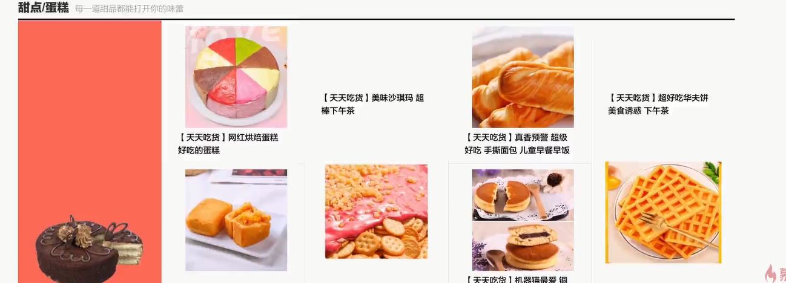

## 表

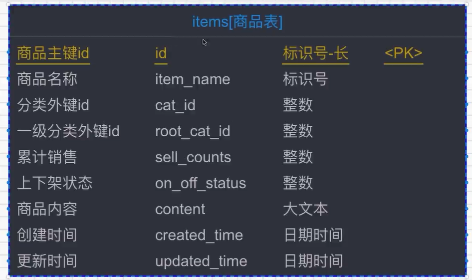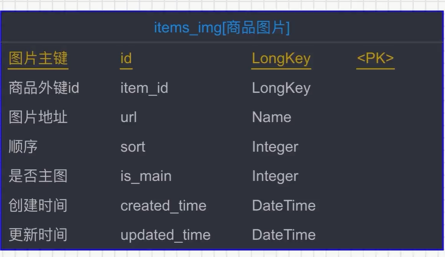

## js片段

### 滚动鼠标事件

```js
<script type="text/javascript">
		
		$(window).scroll(
			function() {
				// scrollTop为滚动条在Y轴上的滚动距离。
				// clientHeight为内容可视区域的高度。
				// scrollHeight为内容可视区域的高度加上溢出（滚动）的距离。
				var scrollTop = $(this).scrollTop();
				var scrollHeight = $(document).height();
				var windowHeight = $(this).height();
				if (scrollTop + windowHeight > (scrollHeight - 50) ) {
				// 此处是滚动条到底部时候触发的事件，在这里写要加载的数据，或者是拉动滚动条的操作
				// console.log("123");
				index.renderSixNewItems();
			}
		});

	</script>
```

### 查询6个新商品

```js
renderSixNewItems() {

					var serverUrl = app.serverUrl;
					var categoryList = this.categoryList;
					var catIndex = this.catIndex;
					
					var rootCat = categoryList[catIndex];
					if (rootCat == undefined || rootCat == null || rootCat == '') {
						return;
					}
					var rootCatId = rootCat.id;

					catIndex++;
					this.catIndex = catIndex;

					// 获得各个分类下的最新6个商品
					axios.get(
							serverUrl + '/index/sixNewItems/' + rootCatId, {})
						.then(res => {
							if (res.data.status == 200) {
								var sixNewItemsListTemp = res.data.data
								var sixNewItemsList = this.sixNewItemsList;
								sixNewItemsList.push(sixNewItemsListTemp[0]);
								this.sixNewItemsList = sixNewItemsList;
								// console.log(sixNewItemsList);
								this.isScrolling = false;	// 加载完毕以后表示下次可以继续滚动加载
							}
						});
				},
```

## 代码

### Controller

```java
@ApiOperation(value = "查询每个一级分类下的最新6条商品数据", notes = "查询每个一级分类下的最新6条商品数据", httpMethod = "GET")
    @GetMapping("/sixNewItems/{rootCatId}")
    public IMOOCJSONResult sixNewItems(
            @ApiParam(name = "rootCatId", value = "一级分类id", required = true)
            @PathVariable Integer rootCatId) {

        if (rootCatId == null) {
            return IMOOCJSONResult.errorMsg("分类不存在");
        }

        List<NewItemsVO> list = categoryService.getSixNewItemsLazy(rootCatId);
        return IMOOCJSONResult.ok(list);
    }
```

### Services

```java
  @Transactional(propagation = Propagation.SUPPORTS)
    @Override
    public List<NewItemsVO> getSixNewItemsLazy(Integer rootCatId) {

        Map<String, Object> map = new HashMap<>();
        map.put("rootCatId", rootCatId);

        return categoryMapperCustom.getSixNewItemsLazy(map);
    }
```

### Dao

```java
public interface CategoryMapper extends MyMapper<Category> {
}

public interface CategoryMapperCustom {

    public List<CategoryVO> getSubCatList(Integer rootCatId);

    public List<NewItemsVO> getSixNewItemsLazy(@Param("paramsMap") Map<String, Object> map);
```

### CategoryMapper.xml

```xml
<mapper namespace="com.imooc.mapper.CategoryMapper" >
  <resultMap id="BaseResultMap" type="com.imooc.pojo.Category" >
    <!--
      WARNING - @mbg.generated
    -->
    <id column="id" property="id" jdbcType="INTEGER" />
    <result column="name" property="name" jdbcType="VARCHAR" />
    <result column="type" property="type" jdbcType="INTEGER" />
    <result column="father_id" property="fatherId" jdbcType="INTEGER" />
    <result column="logo" property="logo" jdbcType="VARCHAR" />
    <result column="slogan" property="slogan" jdbcType="VARCHAR" />
    <result column="cat_image" property="catImage" jdbcType="VARCHAR" />
    <result column="bg_color" property="bgColor" jdbcType="VARCHAR" />
  </resultMap>
</mapper>
```

### CategoryMapperCustom.xml

```xml
</select>

    <resultMap id="myNewItemsVO" type="com.imooc.pojo.vo.NewItemsVO">
        <id column="rootCatId" property="rootCatId"/>
        <result column="rootCatName" property="rootCatName"/>
        <result column="slogan" property="slogan"/>
        <result column="catImage" property="catImage"/>
        <result column="bgColor" property="bgColor"/>

        <collection property="simpleItemList" ofType="com.imooc.pojo.vo.SimpleItemVO">
            <id column="itemId" property="itemId"/>
            <result column="itemName" property="itemName"/>
            <result column="itemUrl" property="itemUrl"/>
        </collection>
    </resultMap>

    <select id="getSixNewItemsLazy" resultMap="myNewItemsVO" parameterType="Map">
        SELECT
            f.id as rootCatId,
            f.`name` as rootCatName,
            f.slogan as slogan,
            f.cat_image as catImage,
            f.bg_color as bgColor,
            i.id as itemId,
            i.item_name as itemName,
            ii.url as itemUrl,
            i.created_time as createdTime
        FROM
            category f
        LEFT JOIN items i ON f.id = i.root_cat_id
        LEFT JOIN items_img ii ON i.id = ii.item_id
        WHERE
            f.type = 1
        AND
            i.root_cat_id = #{paramsMap.rootCatId}
        AND
            ii.is_main = 1
        ORDER BY
            i.created_time
        DESC
        LIMIT 0,6
    </select>
```

### NewItemsVO

```java
/**
 * 最新商品VO
 */
public class NewItemsVO {

    private Integer rootCatId;
    private String rootCatName;
    private String slogan;
    private String catImage;
    private String bgColor;

    private List<SimpleItemVO> simpleItemList;

    public Integer getRootCatId() {
        return rootCatId;
    }

    public void setRootCatId(Integer rootCatId) {
        this.rootCatId = rootCatId;
    }

    public String getRootCatName() {
        return rootCatName;
    }

    public void setRootCatName(String rootCatName) {
        this.rootCatName = rootCatName;
    }

    public String getSlogan() {
        return slogan;
    }

    public void setSlogan(String slogan) {
        this.slogan = slogan;
    }

    public String getCatImage() {
        return catImage;
    }

    public void setCatImage(String catImage) {
        this.catImage = catImage;
    }

    public String getBgColor() {
        return bgColor;
    }

    public void setBgColor(String bgColor) {
        this.bgColor = bgColor;
    }

    public List<SimpleItemVO> getSimpleItemList() {
        return simpleItemList;
    }

    public void setSimpleItemList(List<SimpleItemVO> simpleItemList) {
        this.simpleItemList = simpleItemList;
    }
}
```

# 商品详情

> 点击搜索的商品根据商品ID查询商品信息并展示

## 表

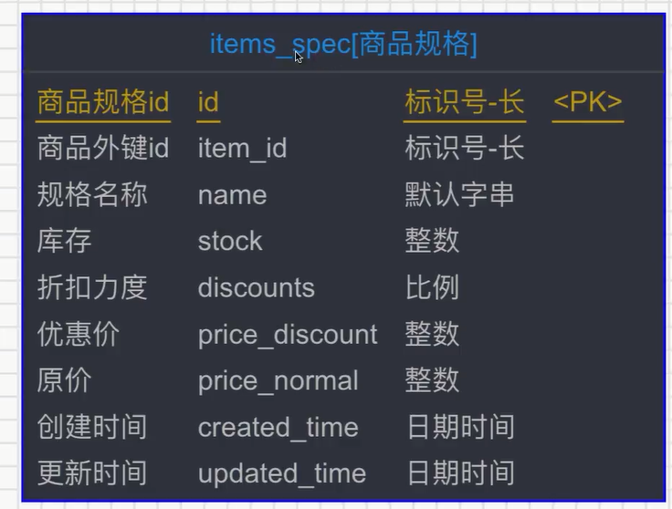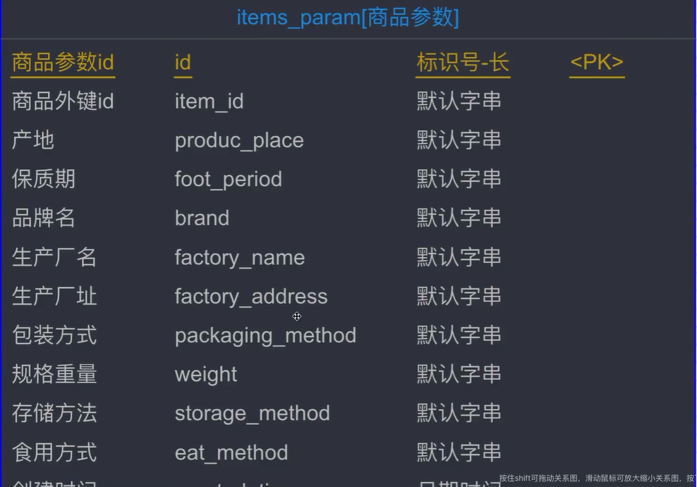

## js片段

### Created中调用

```js
// 渲染商品信息
				var itemId = app.getUrlParam("itemId");
				// 如果itemId为空，跳转到错误页面
				if (itemId == null || itemId == undefined || itemId == '') {
					window.location.href = "http://www.imooc.com/error/noexists";
					return;
				}
				this.itemId = itemId;
				this.renderItemInfo(itemId);
```

### 发起请求查询

```js
	// 渲染商品信息
				renderItemInfo(itemId) {
					var serverUrl = app.serverUrl;
					axios.get(serverUrl + '/items/info/' + itemId, {})
						.then(res => {
							if (res.data.status == 200) {
								var itemInfo = res.data.data;
								var item = itemInfo.item;
								// 如果item为空，则商品不存在，跳转错误页面
								if (item == null || item == undefined || item == '') {
									window.location.href = "http://www.imooc.com/error/noexists";
								}

								// console.log(itemInfo);
								this.item = item;

								// 商品图片放大镜效果实现
								var itemImgListTemp = itemInfo.itemImgList;
								this.renderZoomItemImgs(itemImgListTemp);

								// 商品规格实现
								var itemSpecListTemp = itemInfo.itemSpecList;
								this.itemSpecList = itemSpecListTemp;
								var selectedSku = itemSpecListTemp[0];
								this.selectedSku = selectedSku;

								this.itemParams = itemInfo.itemParams;

								// console.log(this.itemImgList);

							} else if (res.data.status == 500) {
								alert(res.data.msg);
							}
						});
				},
```

## 代码

### Controller

```java
@Api(value = "商品接口", tags = {"商品信息展示的相关接口"})
@RestController
@RequestMapping("items")
public class ItemsController extends BaseController {

    @Autowired
    private ItemService itemService;

    @ApiOperation(value = "查询商品详情", notes = "查询商品详情", httpMethod = "GET")
    @GetMapping("/info/{itemId}")
    public IMOOCJSONResult info(
            @ApiParam(name = "itemId", value = "商品id", required = true)
            @PathVariable String itemId) {

        if (StringUtils.isBlank(itemId)) {
            return IMOOCJSONResult.errorMsg(null);
        }

        Items item = itemService.queryItemById(itemId);
        List<ItemsImg> itemImgList = itemService.queryItemImgList(itemId);
        List<ItemsSpec> itemsSpecList = itemService.queryItemSpecList(itemId);
        ItemsParam itemsParam = itemService.queryItemParam(itemId);

        ItemInfoVO itemInfoVO = new ItemInfoVO();
        itemInfoVO.setItem(item);
        itemInfoVO.setItemImgList(itemImgList);
        itemInfoVO.setItemSpecList(itemsSpecList);
        itemInfoVO.setItemParams(itemsParam);

        return IMOOCJSONResult.ok(itemInfoVO);
    }
}
```

### Services

```java
@Service
public class ItemServiceImpl implements ItemService {

    @Autowired
    private ItemsMapper itemsMapper;
    @Autowired
    private ItemsImgMapper itemsImgMapper;
    @Autowired
    private ItemsSpecMapper itemsSpecMapper;
    @Autowired
    private ItemsParamMapper itemsParamMapper;
    @Autowired
    private ItemsCommentsMapper itemsCommentsMapper;
    @Autowired
    private ItemsMapperCustom itemsMapperCustom;

    @Transactional(propagation = Propagation.SUPPORTS)
    @Override
    public Items queryItemById(String itemId) {
        return itemsMapper.selectByPrimaryKey(itemId);
    }

    @Transactional(propagation = Propagation.SUPPORTS)
    @Override
    public List<ItemsImg> queryItemImgList(String itemId) {
        Example itemsImgExp = new Example(ItemsImg.class);
        Example.Criteria criteria = itemsImgExp.createCriteria();
        criteria.andEqualTo("itemId", itemId);

        return itemsImgMapper.selectByExample(itemsImgExp);
    }

    @Transactional(propagation = Propagation.SUPPORTS)
    @Override
    public List<ItemsSpec> queryItemSpecList(String itemId) {
        Example itemsSpecExp = new Example(ItemsSpec.class);
        Example.Criteria criteria = itemsSpecExp.createCriteria();
        criteria.andEqualTo("itemId", itemId);

        return itemsSpecMapper.selectByExample(itemsSpecExp);
    }

    @Transactional(propagation = Propagation.SUPPORTS)
    @Override
    public ItemsParam queryItemParam(String itemId) {
        Example itemsParamExp = new Example(ItemsParam.class);
        Example.Criteria criteria = itemsParamExp.createCriteria();
        criteria.andEqualTo("itemId", itemId);

        return itemsParamMapper.selectOneByExample(itemsParamExp);
    }

  
}

```

### Dao

```java
public interface ItemsMapper extends MyMapper<Items> {
}

public interface ItemsImgMapper extends MyMapper<ItemsImg> {
}

public interface ItemsSpecMapper extends MyMapper<ItemsSpec> {
}

public interface ItemsParamMapper extends MyMapper<ItemsParam> {
}
```

# 商品评价

> 评价包含两部分.一部分好评度,一部分分页展示所有评论.而且用户名脱敏处理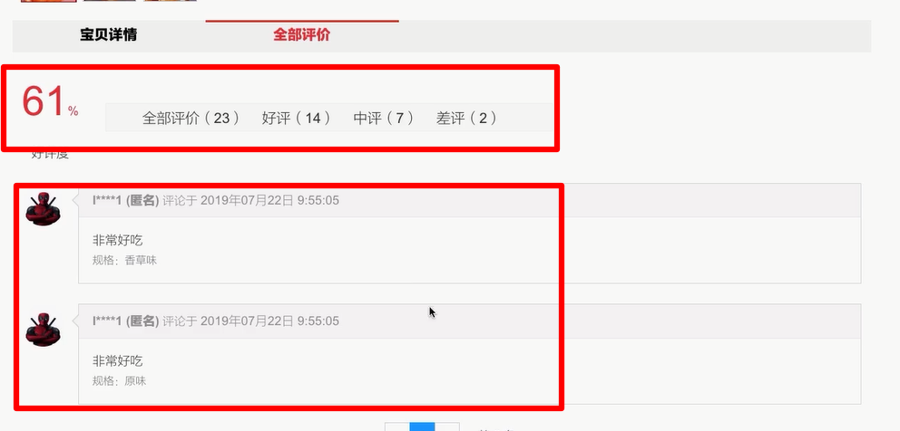

## 表

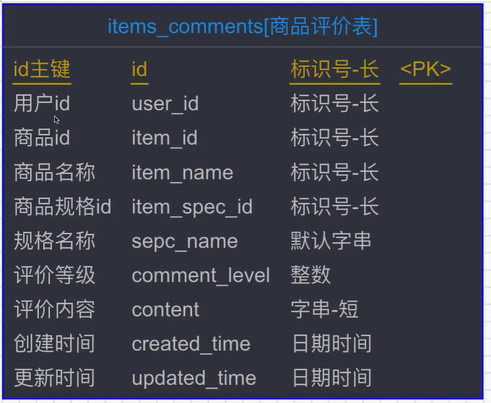!

## 评价等级实现

> 查询好中差 差三次 在计算

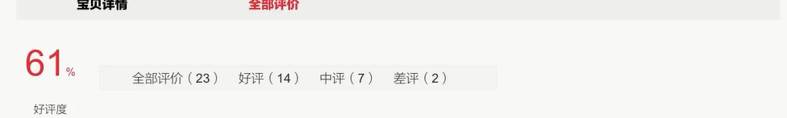

### 页面

```html
<div class="am-tab-panel am-fade">

						<div class="actor-new comment-summary">
							<div class="rate">
								<div v-if="countsVO.totalCounts == 0">
									<strong>100<span>%</span></strong>
								</div>
								<div v-if="countsVO.totalCounts > 0">
									<strong>{{Math.round(countsVO.goodCounts / countsVO.totalCounts * 100)}}<span>%</span></strong>
								</div>
								<br /><span>好评度</span>
							</div>
							<div class="comment-counts">

								<div class="counts-words" @click="renderCommentsByLevel('')">全部评价（{{countsVO.totalCounts}}）</div>
								<div class="counts-words" @click="renderCommentsByLevel(1)" style="margin-left: 20px;">好评（{{countsVO.goodCounts}}）</div>
								<div class="counts-words" @click="renderCommentsByLevel(2)" style="margin-left: 20px;">中评（{{countsVO.normalCounts}}）</div>
								<div class="counts-words" @click="renderCommentsByLevel(3)" style="margin-left: 20px;">差评（{{countsVO.badCounts}}）</div>

							</div>
						</div>
```

### js

```js
	// 渲染商品评价等级数量
				renderCommentLevelCounts(itemId) {

					var serverUrl = app.serverUrl;
					axios.defaults.withCredentials = true;
					axios.get(
							serverUrl + '/items/commentLevel?itemId=' + itemId, {})
						.then(res => {
							if (res.data.status == 200) {
								var countsVO = res.data.data;
								this.countsVO = countsVO;
								// console.log(countsVO);

							} else if (res.data.status == 500) {
								alert(res.data.msg);
							}
						});
				},
				// 根据评论等级进行查询
				renderCommentsByLevel(level) {
					console.log(level);
					this.level = level;
					this.renderComments(this.itemId, level, 1, this.pageSize);
				},
```

### CommentLevelCountsVO

```java
/**
 * 用于展示商品评价数量的vo
 */
public class CommentLevelCountsVO {

    public Integer totalCounts;
    public Integer goodCounts;
    public Integer normalCounts;
    public Integer badCounts;

    public Integer getTotalCounts() {
        return totalCounts;
    }

    public void setTotalCounts(Integer totalCounts) {
        this.totalCounts = totalCounts;
    }

    public Integer getGoodCounts() {
        return goodCounts;
    }

    public void setGoodCounts(Integer goodCounts) {
        this.goodCounts = goodCounts;
    }

    public Integer getNormalCounts() {
        return normalCounts;
    }

    public void setNormalCounts(Integer normalCounts) {
        this.normalCounts = normalCounts;
    }

    public Integer getBadCounts() {
        return badCounts;
    }

    public void setBadCounts(Integer badCounts) {
        this.badCounts = badCounts;
    }
}

```

### Controller

```java
  

    @ApiOperation(value = "查询商品评价等级", notes = "查询商品评价等级", httpMethod = "GET")
    @GetMapping("/commentLevel")
    public IMOOCJSONResult commentLevel(
            @ApiParam(name = "itemId", value = "商品id", required = true)
            @RequestParam String itemId) {

        if (StringUtils.isBlank(itemId)) {
            return IMOOCJSONResult.errorMsg(null);
        }

        CommentLevelCountsVO countsVO = itemService.queryCommentCounts(itemId);

        return IMOOCJSONResult.ok(countsVO);
    }
```

### services

```java
@Transactional(propagation = Propagation.SUPPORTS)
    Integer getCommentCounts(String itemId, Integer level) {
        ItemsComments condition = new ItemsComments();
        condition.setItemId(itemId);
        if (level != null) {
            condition.setCommentLevel(level);
        }
        return itemsCommentsMapper.selectCount(condition);
    }
```

### Dao

```java
public interface ItemsCommentsMapper extends MyMapper<ItemsComments> {
}
```

## 评论分页显示

> 分页展示评论

### 页面

```html
	<ul class="am-comments-list am-comments-list-flip">

							<li class="am-comment" v-for="(commentRecord, commentIndex) in commentList">
								<!-- 评论容器 -->
								<a href="javascript:void(0);">
									
									<!-- 评论者头像 -->
								</a>
								<div class="am-comment-main">
									<!-- 评论内容容器 -->
									<header class="am-comment-hd">
										<!--<h3 class="am-comment-title">评论标题</h3>-->
										<div class="am-comment-meta">
											<!-- 评论元数据 -->
											<a href="#link-to-user"
												class="am-comment-author">{{commentRecord.nickname}} (匿名)</a>
											<!-- 评论者 -->
											评论于
											<time datetime="">{{commentRecord.createdTime}}</time>
										</div>
									</header>

									<div class="am-comment-bd">
										<div class="tb-rev-item " data-id="255776406962">
											<div class="J_TbcRate_ReviewContent tb-tbcr-content ">
												{{commentRecord.content}}
											</div>
											<div class="tb-r-act-bar">
												<span class="specName">规格：{{commentRecord.specName}}</span>
											</div>
										</div>

									</div>
									<!-- 评论内容 -->
								</div>
							</li>
						</ul>

						<div class="clear"></div>

						<!-- 分页 start-->
						<div class="wrap" id="wrap">
							<zpagenav v-bind:page="page" v-bind:page-size="pageSize" v-bind:total="total" 
								v-bind:max-page="maxPage"  v-on:pagehandler="doPaging">
							</zpagenav>
						</div>
						<!-- 分页 end-->
```


### js

```js
	created() {
				// var me = this;
				// 通过cookie判断用户是否登录
				this.judgeUserLoginStatus();

				// 渲染商品信息
				var itemId = app.getUrlParam("itemId");
				// 如果itemId为空，跳转到错误页面
				if (itemId == null || itemId == undefined || itemId == '') {
					window.location.href = "http://www.imooc.com/error/noexists";
					return;
				}
				this.itemId = itemId;
				this.renderItemInfo(itemId);

				// 从购物车中拿到商品的数量
				this.shopcartItemCounts = app.getShopcartItemCounts();


				// 渲染商品评价列表内容
				this.renderComments(itemId, this.level, this.page, this.pageSize);
				this.renderCommentLevelCounts(itemId);

			},
```


```js
// 根据评论等级进行查询
				renderCommentsByLevel(level) {
					console.log(level);
					this.level = level;
					this.renderComments(this.itemId, level, 1, this.pageSize);
				},
				// 分页实现方法 跳转到page页
                doPaging: function (page) {
                    this.page = page;
					this.renderComments(this.itemId, this.level, page, this.pageSize);
                },
				renderComments(itemId, level, page, pageSize) {

					var serverUrl = app.serverUrl;
					axios.defaults.withCredentials = true;
					axios.get(
							serverUrl + '/items/comments?itemId=' + itemId + "&level=" + level + "&page=" + page +
							"&pageSize=" + pageSize, {})
						.then(res => {
							if (res.data.status == 200) {
								var grid = res.data.data;
								var commentList = grid.rows;
								this.commentList = commentList;
								// console.log(commentList);

								for (var i = 0 ; i < commentList.length ; i ++) {
									var date = commentList[i].createdTime;
									var formatedTime = moment(date).format('YYYY年MM月DD日 h:mm:ss');
									// console.log(formatedTime);
									commentList[i].createdTime = formatedTime;
								}

								var maxPage = grid.total; // 获得总页数
								var total = grid.records; // 获得总记录数

								this.maxPage = maxPage;
								this.total = total;

							} else if (res.data.status == 500) {
								alert(res.data.msg);
							}
						});
				},
```

### ItemCommentVO

```java
/**
 * 用于展示商品评价的VO
 */
public class ItemCommentVO {

    private Integer commentLevel;
    private String content;
    private String specName;
    private Date createdTime;
    private String userFace;
    private String nickname;

    public Integer getCommentLevel() {
        return commentLevel;
    }

    public void setCommentLevel(Integer commentLevel) {
        this.commentLevel = commentLevel;
    }

    public String getContent() {
        return content;
    }

    public void setContent(String content) {
        this.content = content;
    }

    public String getSpecName() {
        return specName;
    }

    public void setSpecName(String specName) {
        this.specName = specName;
    }

    public Date getCreatedTime() {
        return createdTime;
    }

    public void setCreatedTime(Date createdTime) {
        this.createdTime = createdTime;
    }

    public String getUserFace() {
        return userFace;
    }

    public void setUserFace(String userFace) {
        this.userFace = userFace;
    }

    public String getNickname() {
        return nickname;
    }

    public void setNickname(String nickname) {
        this.nickname = nickname;
    }
}

```

### Controller

```java
 @ApiOperation(value = "查询商品评论", notes = "查询商品评论", httpMethod = "GET")
    @GetMapping("/comments")
    public IMOOCJSONResult comments(
            @ApiParam(name = "itemId", value = "商品id", required = true)
            @RequestParam String itemId,
            @ApiParam(name = "level", value = "评价等级", required = false)
            @RequestParam Integer level,
            @ApiParam(name = "page", value = "查询下一页的第几页", required = false)
            @RequestParam Integer page,
            @ApiParam(name = "pageSize", value = "分页的每一页显示的条数", required = false)
            @RequestParam Integer pageSize) {

        if (StringUtils.isBlank(itemId)) {
            return IMOOCJSONResult.errorMsg(null);
        }

        if (page == null) {
            page = 1;
        }

        if (pageSize == null) {
            pageSize = COMMON_PAGE_SIZE;
        }

        PagedGridResult grid = itemService.queryPagedComments(itemId,
                                                                level,
                                                                page,
                                                                pageSize);

        return IMOOCJSONResult.ok(grid);
    }

```

### services

```java

    @Transactional(propagation = Propagation.SUPPORTS)
    Integer getCommentCounts(String itemId, Integer level) {
        ItemsComments condition = new ItemsComments();
        condition.setItemId(itemId);
        if (level != null) {
            condition.setCommentLevel(level);
        }
        return itemsCommentsMapper.selectCount(condition);
    }

    @Transactional(propagation = Propagation.SUPPORTS)
    @Override
    public PagedGridResult queryPagedComments(String itemId,
                                                  Integer level,
                                                  Integer page,
                                                  Integer pageSize) {

        Map<String, Object> map = new HashMap<>();
        map.put("itemId", itemId);
        map.put("level", level);

        // mybatis-pagehelper

        /**
         * page: 第几页
         * pageSize: 每页显示条数
         */
        PageHelper.startPage(page, pageSize);

        List<ItemCommentVO> list = itemsMapperCustom.queryItemComments(map);
        for (ItemCommentVO vo : list) {
            vo.setNickname(DesensitizationUtil.commonDisplay(vo.getNickname()));
        }

        return setterPagedGrid(list, page);
    }
    private PagedGridResult setterPagedGrid(List<?> list, Integer page) {
        PageInfo<?> pageList = new PageInfo<>(list);
        PagedGridResult grid = new PagedGridResult();
        grid.setPage(page);
        grid.setRows(list);
        grid.setTotal(pageList.getPages());
        grid.setRecords(pageList.getTotal());
        return grid;
    }
```

### Dao

```java
public interface ItemsCommentsMapperCustom extends MyMapper<ItemsComments> {

    public void saveComments(Map<String, Object> map);

    public List<MyCommentVO> queryMyComments(@Param("paramsMap") Map<String, Object> map);

}
```

### ItemsCommentsMapperCustom.xml

```xml
<mapper namespace="com.imooc.mapper.ItemsCommentsMapperCustom" >

  <select id="saveComments" parameterType="Map">

    insert into
      items_comments
      (
        id,
        user_id,
        item_id,
        item_name,
        item_spec_id,
        sepc_name,
        comment_level,
        content,
        created_time,
        updated_time
      )
    values
      <foreach collection="commentList" item="item" index="index" separator=",">
      (
        #{item.commentId},
        #{userId},
        #{item.itemId},
        #{item.itemName},
        #{item.itemSpecId},
        #{item.itemSpecName},
        #{item.commentLevel},
        #{item.content},
        now(),
        now()
      )
      </foreach>

  </select>
  
  <resultMap id="myComments" type="com.imooc.pojo.vo.MyCommentVO">
    <id column="commentId" property="commentId"/>
    <result column="content" property="content"/>
    <result column="createdTime" property="createdTime"/>
    <result column="itemId" property="itemId"/>
    <result column="itemName" property="itemName"/>
    <result column="sepcName" property="specName"/>
    <result column="itemImg" property="itemImg"/>
  </resultMap>

  <select id="queryMyComments" parameterType="Map" resultMap="myComments">
    SELECT
        ic.id as commentId,
        ic.content as content,
        ic.created_time as createdTime,
        ic.item_id as itemId,
        ic.item_name as itemName,
        ic.sepc_name as sepcName,
        ii.url as itemImg
    FROM
        items_comments ic
    LEFT JOIN
        items_img ii
    ON
        ic.item_id = ii.item_id
    WHERE
        ic.user_id = #{paramsMap.userId}
    AND
        ii.is_main = 1
    ORDER BY
        ic.created_time
    desc
  </select>

</mapper>
```

# 商品搜索

> 分页展示,过滤,排序,

## 表

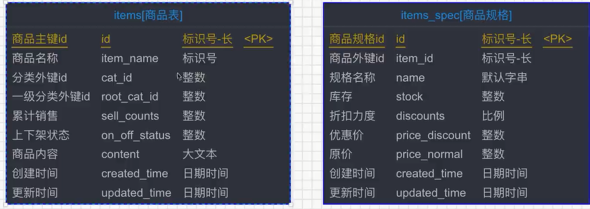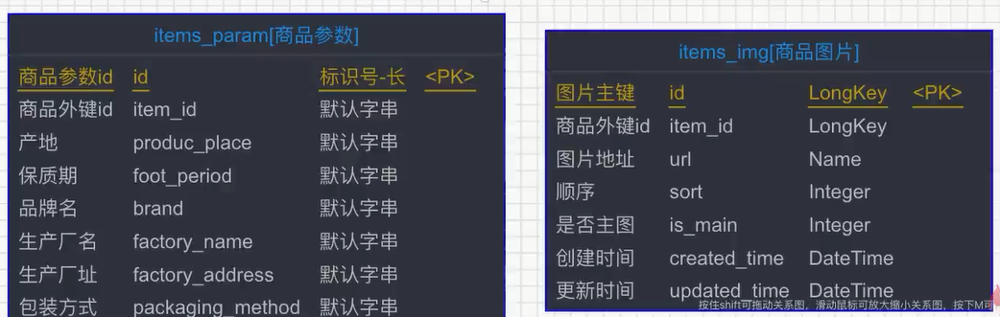

## 页面

```html
<!--悬浮搜索框-->
		<div class="nav white">
			<!-- <div class="logo"></div> -->
			<div class="logoBig">
				<li></li>
			</div>
			<div class="search-bar pr">
				<a name="index_none_header_sysc" href="#"></a>
				<form>
					<input id="searchInput" v-model="keywords" name="index_none_header_sysc" type="text"
						placeholder="搜索" autocomplete="off">
					<input id="ai-topsearch" @click="doSearch" class="submit am-btn" value="搜索" index="1">
				</form>
			</div>
```


## js

```js
doSearch() {
					var keywords = this.keywords;
					// console.log(keywords);
					if (keywords == null || keywords == undefined || keywords == '') {
						alert("搜索内容不能为空");
						return;
					}
					// window.location.href = "search.html?keywords=" + keywords;
					window.open("catItems.html?searchType=searchItems&keywords=" + keywords);
					// window.open("search.html?searchType=searchItems&keywords=" + keywords);
				},
```

## SearchItemsVO

```java
package com.imooc.pojo.vo;

import java.util.Date;

/**
 * 用于展示商品搜索列表结果的VO
 */
public class  {

    private String itemId;
    private String itemName;
    private int sellCounts;
    private String imgUrl;
    private int price;

    public String getItemId() {
        return itemId;
    }

    public void setItemId(String itemId) {
        this.itemId = itemId;
    }

    public String getItemName() {
        return itemName;
    }

    public void setItemName(String itemName) {
        this.itemName = itemName;
    }

    public int getSellCounts() {
        return sellCounts;
    }

    public void setSellCounts(int sellCounts) {
        this.sellCounts = sellCounts;
    }

    public String getImgUrl() {
        return imgUrl;
    }

    public void setImgUrl(String imgUrl) {
        this.imgUrl = imgUrl;
    }

    public int getPrice() {
        return price;
    }

    public void setPrice(int price) {
        this.price = price;
    }
}

```

## Controller

```java
 @ApiOperation(value = "搜索商品列表", notes = "搜索商品列表", httpMethod = "GET")
    @GetMapping("/search")
    public IMOOCJSONResult search(
            @ApiParam(name = "keywords", value = "关键字", required = true)
            @RequestParam String keywords,
            @ApiParam(name = "sort", value = "排序", required = false)
            @RequestParam String sort,
            @ApiParam(name = "page", value = "查询下一页的第几页", required = false)
            @RequestParam Integer page,
            @ApiParam(name = "pageSize", value = "分页的每一页显示的条数", required = false)
            @RequestParam Integer pageSize) {

        if (StringUtils.isBlank(keywords)) {
            return IMOOCJSONResult.errorMsg(null);
        }

        if (page == null) {
            page = 1;
        }

        if (pageSize == null) {
            pageSize = PAGE_SIZE;
        }

        PagedGridResult grid = itemService.searhItems(keywords,
                                                        sort,
                                                        page,
                                                        pageSize);

        return IMOOCJSONResult.ok(grid);
    }

    @ApiOperation(value = "通过分类id搜索商品列表", notes = "通过分类id搜索商品列表", httpMethod = "GET")
    @GetMapping("/catItems")
    public IMOOCJSONResult catItems(
            @ApiParam(name = "catId", value = "三级分类id", required = true)
            @RequestParam Integer catId,
            @ApiParam(name = "sort", value = "排序", required = false)
            @RequestParam String sort,
            @ApiParam(name = "page", value = "查询下一页的第几页", required = false)
            @RequestParam Integer page,
            @ApiParam(name = "pageSize", value = "分页的每一页显示的条数", required = false)
            @RequestParam Integer pageSize) {

        if (catId == null) {
            return IMOOCJSONResult.errorMsg(null);
        }

        if (page == null) {
            page = 1;
        }

        if (pageSize == null) {
            pageSize = PAGE_SIZE;
        }

        PagedGridResult grid = itemService.searhItems(catId,
                sort,
                page,
                pageSize);

        return IMOOCJSONResult.ok(grid);
    }

```

## services

```java
 private PagedGridResult setterPagedGrid(List<?> list, Integer page) {
        PageInfo<?> pageList = new PageInfo<>(list);
        PagedGridResult grid = new PagedGridResult();
        grid.setPage(page);
        grid.setRows(list);
        grid.setTotal(pageList.getPages());
        grid.setRecords(pageList.getTotal());
        return grid;
    }

    @Transactional(propagation = Propagation.SUPPORTS)
    @Override
    public PagedGridResult searhItems(String keywords, String sort, Integer page, Integer pageSize) {

        Map<String, Object> map = new HashMap<>();
        map.put("keywords", keywords);
        map.put("sort", sort);

        PageHelper.startPage(page, pageSize);
        List<SearchItemsVO> list = itemsMapperCustom.searchItems(map);

        return setterPagedGrid(list, page);
    }

    @Transactional(propagation = Propagation.SUPPORTS)
    @Override
    public PagedGridResult searhItems(Integer catId, String sort, Integer page, Integer pageSize) {
        Map<String, Object> map = new HashMap<>();
        map.put("catId", catId);
        map.put("sort", sort);

        PageHelper.startPage(page, pageSize);
        List<SearchItemsVO> list = itemsMapperCustom.searchItemsByThirdCat(map);

        return setterPagedGrid(list, page);
    }
```

## Dao

```java
public interface ItemsMapperCustom {

    public List<ItemCommentVO> queryItemComments(@Param("paramsMap") Map<String, Object> map);

    public List<SearchItemsVO> searchItems(@Param("paramsMap") Map<String, Object> map);

    public List<SearchItemsVO> searchItemsByThirdCat(@Param("paramsMap") Map<String, Object> map);

    public List<ShopcartVO> queryItemsBySpecIds(@Param("paramsList") List specIdsList);

    public int decreaseItemSpecStock(@Param("specId") String specId,
                                     @Param("pendingCounts") int pendingCounts);
}
```

## ItemsMapperCustom.xml

```xml
<mapper namespace="com.imooc.mapper.ItemsMapperCustom" >

  <select id="queryItemComments" parameterType="Map" resultType="com.imooc.pojo.vo.ItemCommentVO">
    SELECT
        ic.comment_level as commentLevel,
        ic.content as content,
        ic.sepc_name as specName,
        ic.created_time as createdTime,
        u.face as userFace,
        u.nickname as nickname
    FROM
        items_comments ic
    LEFT JOIN
        users u
    ON
        ic.user_id = u.id
    WHERE
        ic.item_id = #{paramsMap.itemId}
        <if test=" paramsMap.level != null and paramsMap.level != '' ">
          AND ic.comment_level = #{paramsMap.level}
        </if>
  </select>

    <select id="searchItems" parameterType="Map" resultType="com.imooc.pojo.vo.SearchItemsVO">
        SELECT
            i.id as itemId,
            i.item_name as itemName,
            i.sell_counts as sellCounts,
            ii.url as imgUrl,
            tempSpec.price_discount as price
        FROM
            items i
        LEFT JOIN
            items_img ii
        on
            i.id = ii.item_id
        LEFT JOIN
            (SELECT item_id,MIN(price_discount) as price_discount from items_spec GROUP BY item_id) tempSpec
        on
            i.id = tempSpec.item_id
        WHERE
            ii.is_main = 1
            <if test=" paramsMap.keywords != null and paramsMap.keywords != '' ">
                AND i.item_name like '%${paramsMap.keywords}%'
            </if>
            order by
            <choose>
                <when test=" paramsMap.sort == &quot;c&quot; ">
                    i.sell_counts desc
                </when>
                <when test=" paramsMap.sort == &quot;p&quot; ">
                    tempSpec.price_discount asc
                </when>
                <otherwise>
                    i.item_name asc
                </otherwise>
            </choose>
    </select>
    <!-- k: 默认，代表默认排序，根据name-->
    <!-- c: 根据销量排序-->
    <!-- p: 根据价格排序-->


    <select id="searchItemsByThirdCat" parameterType="Map" resultType="com.imooc.pojo.vo.SearchItemsVO">
        SELECT
            i.id as itemId,
            i.item_name as itemName,
            i.sell_counts as sellCounts,
            ii.url as imgUrl,
            tempSpec.price_discount as price
        FROM
          items i
        LEFT JOIN
          items_img ii
        on
          i.id = ii.item_id
        LEFT JOIN
          (SELECT item_id,MIN(price_discount) as price_discount from items_spec GROUP BY item_id) tempSpec
        on
          i.id = tempSpec.item_id
        WHERE
          ii.is_main = 1
          and
          i.cat_id = #{paramsMap.catId}
        order by
        <choose>
            <when test=" paramsMap.sort == &quot;c&quot; ">
                i.sell_counts desc
            </when>
            <when test=" paramsMap.sort == &quot;p&quot; ">
                tempSpec.price_discount asc
            </when>
            <otherwise>
                i.item_name asc
            </otherwise>
        </choose>
    </select>


    <select id="queryItemsBySpecIds" parameterType="List" resultType="com.imooc.pojo.vo.ShopcartVO">
        SELECT
            t_items.id as itemId,
            t_items.item_name as itemName,
            t_items_img.url as itemImgUrl,
            t_items_spec.id as specId,
            t_items_spec.`name` as specName,
            t_items_spec.price_discount as priceDiscount,
            t_items_spec.price_normal as priceNormal
        FROM
            items_spec t_items_spec
        LEFT JOIN
            items t_items
        ON
            t_items.id = t_items_spec.item_id
        LEFT JOIN
            items_img t_items_img
        on
            t_items_img.item_id = t_items.id
        WHERE
            t_items_img.is_main = 1
        AND
            t_items_spec.id IN
            <foreach collection="paramsList" index="index" item="specId" open="(" separator="," close=")">
              #{specId}
            </foreach>
    </select>

    <update id="decreaseItemSpecStock">

        update
            items_spec
        set
            stock = stock - #{pendingCounts}
        where
            id = #{specId}
        and
            stock >= #{pendingCounts}

    </update>

</mapper>
```

# 购物车

> 未登录放在cookie登录放到redis中

## 页面

```html
	<div id="shopCart " class="item " @click="goToShopcart">
					<a href="# ">
						<span class="message "></span>
					</a>
					<p>购物车</p>
					<p class="cart_num ">{{shopcartItemCounts}}</p>
				</div>
```

```html
					</li> -->
		<li>
			<div class="clearfix tb-btn tb-btn-basket theme-login">
				<a id="LikBasket"
					style="width:160px; height: 46px;background-color: #df2e33; font-weight: bold; line-height: 46px;font-size: 18px;padding: 0 26px;font-family: 'microsoft yahei';"
					title="加入购物车" href="javascript:void(0);" @click="addToCart"><i></i>加入购物车</a>
			</div>
		</li>
```


## js

```js
goToShopcart() {
					window.location.href = "shopcart.html";
				},
				minus() {
					var tmpCounts = parseInt(this.buyCounts) - 1;
					if (tmpCounts <= 0) {
						tmpCounts = 1;
					}
					this.buyCounts = tmpCounts;
				},
				plus() {
					var tmpCounts = parseInt(this.buyCounts) + 1;
					if (tmpCounts >= 100) {
						tmpCounts = 99;
					}
					this.buyCounts = tmpCounts;
				},

                    
 addToCart() {
					// 由于cookie大小限制为4k，另外课程第一阶段是没有redis的，所以相关暂存性内容会存入到cookie中
					var shopcartCounts = app.getShopcartItemCounts();
					if (shopcartCounts >= 8) {
						alert("您购物车中的食物太多啦~请把它们带回家吧~！");
						return;
					}

					// 创建购物车对象
					var item = this.item;
					var itemImgList = this.itemImgList;
					var selectedSku = this.selectedSku;

					var tmpBuyCounts = this.buyCounts;
					tmpBuyCounts = parseInt(tmpBuyCounts);
					if (typeof (tmpBuyCounts) != "number") {
						alert("购买数量不能为非数字！");
						// tmpBuyCounts = 1;
						this.buyCounts = 1;
						return;
					}

					// 构建购物车商品对象
					var shopcartItem = new app.ShopcartItem(item.id,
						itemImgList[0].url,
						item.itemName,
						selectedSku.id,
						selectedSku.name,
						tmpBuyCounts,
						selectedSku.priceDiscount,
						selectedSku.priceNormal);
					// console.log(shopcartItem);
					// 添加商品至购物车list
					app.addItemToShopcart(shopcartItem);

					// 购物车应该在登录/注册的时候同步

					// 判断当前用户是否登录，如果登录，则把购物车数据发送至后端（后端需要合并已存在的商品）
					var userIsLogin = this.userIsLogin;
					if (userIsLogin) {
						var userInfo = this.userInfo;
						var serverUrl = app.serverUrl;
						axios.defaults.withCredentials = true;
						axios.post(
								serverUrl + '/shopcart/add?userId=' + userInfo.id,
								shopcartItem, {
									headers: {
										'headerUserId': userInfo.id,
										'headerUserToken': userInfo.userUniqueToken
									}
								})
							.then(res => {
								if (res.data.status == 200) {

								} else if (res.data.status == 500) {
									alert(res.data.msg);
								}
							});
					}

					alert("商品添加至购物车成功！");

					// 以下仅供测试观察数据
					// var foodieShopcartCookie = app.getCookie("shopcart");
					// var foodieShopcart = [];
					// if (foodieShopcartCookie != null && foodieShopcartCookie != "" && foodieShopcartCookie != undefined) {
					// 	var foodieShopcartStr = decodeURIComponent(foodieShopcartCookie);
					// 	foodieShopcart = JSON.parse(foodieShopcartStr);
					// }
					// console.log(foodieShopcart);

					// 刷新购物车数量
					this.shopcartItemCounts = app.getShopcartItemCounts();
				},
```

```js
// 判断是否登录
						var userIsLogin = this.userIsLogin;
						if (userIsLogin) {
							var specIdsStr = selectedItemSpecIds.toString();
							window.location.href = "pay.html?selectedItemSpecIds=" + specIdsStr;
						} else {
							var bool = window.confirm("请登录/注册后再进行结算操作噢~！");
							if (!bool) {
								return;
							} else {
								this.goLogin();
							}
						}
					},
					// 从购物车中删除商品
					delFromCart(specId) {
						// console.log(specId);

						var bool = window.confirm("确认从购物车中移除该商品吗？");
						if (!bool) {
							return;
						}
						
						// 删除cookie中的商品
						var shopcartList = app.getShopcartList();
						for (var i = 0 ; i < shopcartList.length ; i ++) {
							var tmpItem = shopcartList[i];
							if (tmpItem.specId == specId) {
								shopcartList.splice(i, 1);
								break;
							}
						}
						// 重新放入cookie，更新一下
						app.setCookie("shopcart", JSON.stringify(shopcartList));
						this.shopcartList = shopcartList;

						// 清除选中项
						var specIds = this.specIds;
						for (var i = 0 ; i < specIds.length ; i++) {
							var tmpSpecId = specIds[i];
							if (specId == tmpSpecId) {
								specIds.splice(i, 1);
							}
						}
						this.reCalItemsCountsAndAmount();

						// 如果用户是已经登录状态，需要再把redis中的购物车商品删除
						var userIsLogin = this.userIsLogin;
						if (userIsLogin) {
							var userInfo = this.userInfo;
							var serverUrl = app.serverUrl;
							axios.defaults.withCredentials = true;
							axios.post(
									serverUrl + '/shopcart/del?userId=' + userInfo.id + '&itemSpecId=' + specId, 
									{}, 
									{
										headers: {
											'headerUserId': userInfo.id,
											'headerUserToken': userInfo.userUniqueToken
										}
									})
									.then(res => {
										if (res.data.status == 200) {
											
										} else if (res.data.status == 500) {
											alert(res.data.msg);
										}
									});
						}

					},
					// 重新计算购物车中选中的件数以及总价格
					reCalItemsCountsAndAmount() {
						var specIds = this.specIds;
						if (specIds == null || specIds == '' || specIds == undefined || specIds.length == 0) {
							this.allSelectedCounts = 0;
							this.totalAmount = 0;
						} else {
							// 把specIds和cookie中的购物车进行对比
							this.allSelectedCounts = specIds.length;

							var shopcartList = app.getShopcartList();

							var totalAmount = 0;
							// debugger;
							for (var i = 0 ; i < shopcartList.length ; i ++) {
								var tmpItem = shopcartList[i];

								for (var j = 0 ; j < specIds.length ; j ++) {
									var selectSpecId = specIds[j];
									if (tmpItem.specId == selectSpecId) {
										totalAmount += tmpItem.priceDiscount * tmpItem.buyCounts;
									}
								}
							}
							this.totalAmount = totalAmount;
						}
					},
					// 全选与反选
					checkedAll() {
						var _this = this;
						// console.log(_this.specIds);
						// console.log(_this.allChecked);
						if (_this.allChecked) { //实现反选
							_this.specIds = [];
						} else { //实现全选
							_this.specIds = [];
							this.shopcartList.forEach(function(item, index) {
								_this.specIds.push(item.specId);
							});
						}
						this.reCalItemsCountsAndAmount();
					},
					renderShopcart() {
						var shopcartList = app.getShopcartList();

						// console.log(shopcartList);
						// this.shopcartList = shopcartList;

						if (shopcartList.length <= 0) {
							return;
						}

						// 刷新购物车中价格，以防长时间未登录网址，价格发生变动
						// 拼接规格ids
						var itemSpecIds = "";
						for (var i = 0 ; i < shopcartList.length ; i ++) {
							var tmpSpecId = shopcartList[i].specId;
							itemSpecIds += tmpSpecId;
							if (i < shopcartList.length-1) {
								itemSpecIds += ",";
							}
						}
						// 1001，2002，3003，4004

						// 请求后端获得最新数据
						var serverUrl = app.serverUrl;
							axios.defaults.withCredentials = true;
							axios.get(
									serverUrl + '/items/refresh?itemSpecIds=' + itemSpecIds, 
									{},)
									.then(res => {
										if (res.data.status == 200) {
											var newItemList = res.data.data;
											// 删除现有购物车cookie
											app.deleteCookie("shopcart");
											// console.log(newItemList);
											// 拿到最新商品数据以后，重新组合成购物车数据
											for (var i = 0 ; i < newItemList.length ; i ++) {
												var tmpNewItem = newItemList[i];
												var tmpNewItemSpecId = tmpNewItem.specId;
												var buyCounts = this.getBuyCountsFromCookieShopcartList(shopcartList, tmpNewItemSpecId);
												// console.log(buyCounts);

												// 构建购物车商品对象
												var shopcartItem = new app.ShopcartItem(tmpNewItem.itemId, 
																						tmpNewItem.itemImgUrl,
																						tmpNewItem.itemName, 
																						tmpNewItem.specId, 
																						tmpNewItem.specName, 
																						buyCounts, 
																						tmpNewItem.priceDiscount, 
																						tmpNewItem.priceNormal);
												// 添加商品至购物车list
												app.addItemToShopcart(shopcartItem);
											}
											// 重新获取cookie中的商品list渲染到页面
											shopcartList = app.getShopcartList();
											// console.log(shopcartList);
											this.shopcartList = shopcartList;	
										} else if (res.data.status == 500) {
											alert(res.data.msg);
										}
									});
						

					},
					getBuyCountsFromCookieShopcartList(shopcartList, specId) {
						for (var i = 0 ; i < shopcartList.length ; i ++) {
							var tmpSpecId = shopcartList[i].specId;
							if (tmpSpecId == specId) {
								return shopcartList[i].buyCounts;
							}
						}
					},
					goToShopcart() {
						window.location.href = "shopcart.html";
					},
```


## ShopcartVO

```java
public class ShopcartVO {

    private String itemId;
    private String itemImgUrl;
    private String itemName;
    private String specId;
    private String specName;
    private String priceDiscount;
    private String priceNormal;

    public String getItemId() {
        return itemId;
    }

    public void setItemId(String itemId) {
        this.itemId = itemId;
    }

    public String getItemImgUrl() {
        return itemImgUrl;
    }

    public void setItemImgUrl(String itemImgUrl) {
        this.itemImgUrl = itemImgUrl;
    }

    public String getItemName() {
        return itemName;
    }

    public void setItemName(String itemName) {
        this.itemName = itemName;
    }

    public String getSpecId() {
        return specId;
    }

    public void setSpecId(String specId) {
        this.specId = specId;
    }

    public String getSpecName() {
        return specName;
    }

    public void setSpecName(String specName) {
        this.specName = specName;
    }

    public String getPriceDiscount() {
        return priceDiscount;
    }

    public void setPriceDiscount(String priceDiscount) {
        this.priceDiscount = priceDiscount;
    }

    public String getPriceNormal() {
        return priceNormal;
    }

    public void setPriceNormal(String priceNormal) {
        this.priceNormal = priceNormal;
    }

}

```

## Controller

```java
@Api(value = "购物车接口controller", tags = {"购物车接口相关的api"})
@RequestMapping("shopcart")
@RestController
public class ShopcatController {

    @ApiOperation(value = "添加商品到购物车", notes = "添加商品到购物车", httpMethod = "POST")
    @PostMapping("/add")
    public IMOOCJSONResult add(
            @RequestParam String userId,
            @RequestBody ShopcartBO shopcartBO,
            HttpServletRequest request,
            HttpServletResponse response
    ) {

        if (StringUtils.isBlank(userId)) {
            return IMOOCJSONResult.errorMsg("");
        }

        System.out.println(shopcartBO);

        // TODO 前端用户在登录的情况下，添加商品到购物车，会同时在后端同步购物车到redis缓存

        return IMOOCJSONResult.ok();
    }

    @ApiOperation(value = "从购物车中删除商品", notes = "从购物车中删除商品", httpMethod = "POST")
    @PostMapping("/del")
    public IMOOCJSONResult del(
            @RequestParam String userId,
            @RequestParam String itemSpecId,
            HttpServletRequest request,
            HttpServletResponse response
    ) {

        if (StringUtils.isBlank(userId) || StringUtils.isBlank(itemSpecId)) {
            return IMOOCJSONResult.errorMsg("参数不能为空");
        }

        // TODO 用户在页面删除购物车中的商品数据，如果此时用户已经登录，则需要同步删除后端购物车中的商品

        return IMOOCJSONResult.ok();
    }

}

```


