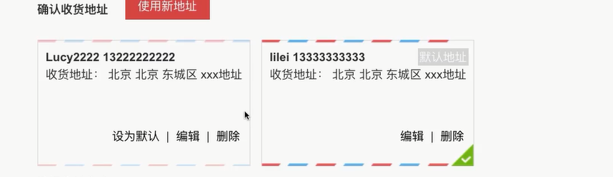
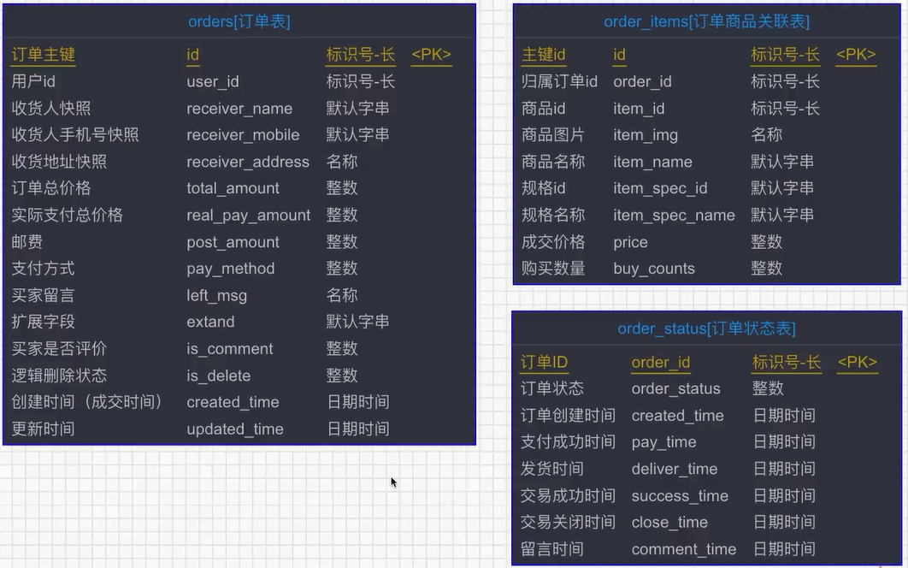
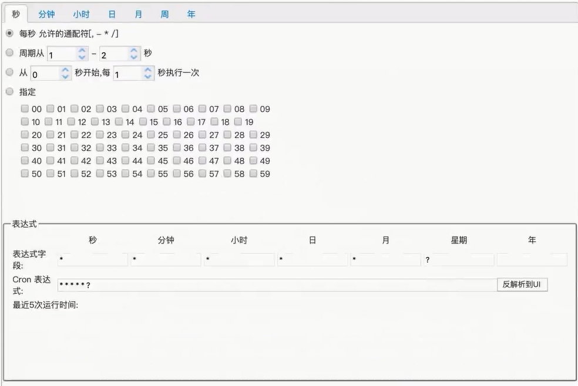
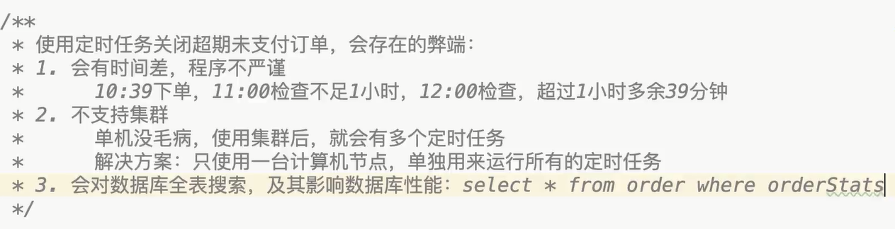
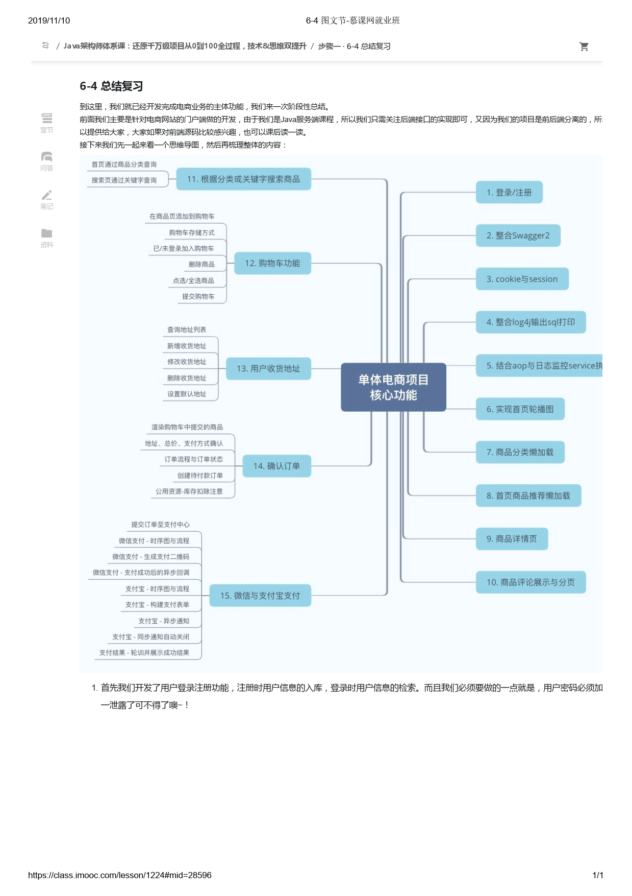

结算页面开发,用于用户确定订单信息.选择支付方式,支付等

# 收货地址

> 
>
> 列表展示--新增--修改--设为默认-删除

## 表


## 页面

```html
<!--地址 -->
			<div class="paycont">
				<div class="address">
					<h3>确认收货地址 </h3>
					<div class="control">
						<div class="tc-btn createAddr theme-login am-btn am-btn-danger">使用新地址</div>
					</div>
					<div class="clear"></div>
					<ul>
						<span v-show="addressList.length > 0">
							<!-- <block v-for="(address, aindex) in addressList" :key="aindex">
								<div class="per-border"></div> -->
							<!-- <li class="user-addresslist " v-for="(address, aindex) in addressList" :key="aindex" style="margin-top: 6px;"> -->
							<li :class="['user-addresslist', {'defaultAddr' : address.id == choosedAddressId}]" 
								v-for="(address, aindex) in addressList" 
								:key="aindex" 
								@click="chooseAddress(address.id)"
								style="margin-top: 6px;">
								<!-- <li :class="['user-addresslist', {'DefaultAddr' : address.isDefault == 1}]"> -->

								<div class="address-left">
									<!-- background: url(../images/peraddbg.png)no-repeat scroll 0% 0%; -->
									<!-- :style="address.isDefault == 1 ? " -->
									<div class="user DefaultAddr">

										<span class="buy-address-detail">
											<span class="buy-user">{{address.receiver}}</span>
											<span class="buy-phone">{{address.mobile}}</span>
										</span>
									</div>
									<div class="default-address DefaultAddr">
										<span class="buy-line-title buy-line-title-type">收货地址：</span>
										<span class="buy--address-detail">
											<span class="province">{{address.province}}</span>
											<span class="city">{{address.city}}</span>
											<span class="dist">{{address.district}}</span>
											<span class="street">{{address.detail}}</span>
										</span>
									</div>
									<ins class="deftip" v-show="address.isDefault == 1">默认地址</ins>
								</div>
								<div class="address-right">
									<a href="person/address.html">
										<span class="am-icon-angle-right am-icon-lg"></span></a>
								</div>
								<div class="clear"></div>

								<div class="new-addr-btn">
									<a href="javascript:void(0);" @click.stop="setDefaultAddress(address.id)" :class="[{'hidden' : address.id == defaultAddressId}]" >设为默认</a>
									<span :class="['new-addr-bar', {'hidden' : address.id == defaultAddressId}]">|</span>
									<a href="javascript:void(0);" @click.stop="editAddress(address.id)">编辑</a>
									<span class="new-addr-bar">|</span>
									<a href="javascript:void(0);" @click.stop="deleteAddress(address.id)">删除</a>
								</div>
							</li>
							<!-- </block> -->
						</span>

					</ul>

					<div class="clear"></div>
				</div>
```

## js

```js
<script type="text/javascript">
		// $(document).ready(function(){
		// 	$("#alipayLink").one("click",function(){
		// 		var orderId = $("#hiddenOrderId").val();
		// 		debugger;
		// 		window.open('alipayTempTransit.html?orderId='+orderId);
		// 	});
		// });
		var index = new Vue({
			el: "#pay",
			data: {
				userIsLogin: false,
				userInfo: {},

				orderItemList: [], // 订单结算的商品列表
				totalAmount: 0, // 订单总价格

				defaultAddressId: "",	// 默认地址id
				choosedAddressId: "",	// 选中的地址id
				addressList: [],

				updatedAddressId: "",	// 用于更新地址的id，如果为空，新增，如果不为空，修改

				confirmAddress: {},	// 确认地址

				choosedPayMethod: 0,
				orderRemarker: "",		// 用户备注留言

				receiver: "",
				mobile: "",
				province: "",
				// city: "",
				// district: "",
				detail: "",

				orderId: "",

				arr: arrAll,
				prov: '北京',
				city: '北京',
				district: '东城区',
				cityArr: [],
				districtArr: []
			},

			watch: {
				prov: {
					// 表格数据刷新后需清空之前查看的订单详情内容
					handler: function (newVal, oldVal) {
						this.updateCity();
						this.updateDistrict();
					},
					deep: true,
				},
				city: {
					// 表格数据刷新后需清空之前查看的订单详情内容
					handler: function (newVal, oldVal) {
						this.updateDistrict();
					},
					deep: true,
				},

			},

			created() {
				this.updateCity();
				this.updateDistrict();

				// var me = this;
				// 通过cookie判断用户是否登录
				this.judgeUserLoginStatus();

				// 渲染结算订单信息
				this.renderOrderInfoList();

				// 渲染地址信息
				this.renderUserAddressList();
			},
			methods: {
				goUserCenter() {
					// 判断用户是否登录
					var userIsLogin = this.userIsLogin;
					if (!userIsLogin) {
						// 用户未登录，则跳转
						window.location.href = "login.html?returnUrl=" + app.centerServerUrl;
					} else {
						window.location.href = app.centerServerUrl;
					}
				},
				// goAlipay() {
                //     window.open("alipayTempTransit.html?orderId=" + this.orderId);
                // },
				choosePayMethod(payMethod) {
					this.choosedPayMethod = payMethod;
					
				},
				// 提交订单，创建订单
				submitOrder() {
					// 判断提交的商品不能为空
					var orderItemList = this.orderItemList;
					if (orderItemList == null || orderItemList == undefined || orderItemList == '' || orderItemList.length <= 0) {
						alert("没有商品信息，订单无法提交~！");
						return;
					}
					// 拼接规格ids
					var itemSpecIds = "";
					for (var i = 0 ; i < orderItemList.length ; i ++) {
						var tmpSpecId = orderItemList[i].specId;
						itemSpecIds += tmpSpecId;
						if (i < orderItemList.length-1) {
							itemSpecIds += ",";
						}
					}

					// 判断选中的地址id不能为空
					var choosedAddressId = this.choosedAddressId;
					if (choosedAddressId == null || choosedAddressId == undefined || choosedAddressId == '') {
						alert("请选择收货地址！");
						return;
					}

					// 判断支付方式不能为空
					var choosedPayMethod = parseInt(this.choosedPayMethod);
					if (choosedPayMethod != 1 && choosedPayMethod != 2) {
						alert("请选择支付方式！");
						return;
					}

					// var newWindow = window.open();

					// 买家备注可以为空
					var orderRemarker = this.orderRemarker;
					// console.log(orderRemarker);

					var userInfo = this.userInfo;
					var serverUrl = app.serverUrl;
					axios.defaults.withCredentials = true;
					axios.post(
							serverUrl + '/orders/create', 
							{
								"userId": userInfo.id,
								"itemSpecIds": itemSpecIds,
								"addressId": choosedAddressId,
								"payMethod": choosedPayMethod,
								"leftMsg": orderRemarker,
							},
							{
								headers: {
									'headerUserId': userInfo.id,
									'headerUserToken': userInfo.userUniqueToken
								}
							})
							.then(res => {
								if (res.data.status == 200) {
									// alert("OK");
									var orderId = res.data.data;
									// 判断是否微信还是支付宝支付
									if (choosedPayMethod == 1) {
										// 微信支付则跳转到微信支付页面，并且获得支付二维码
										window.location.href = "wxpay.html?orderId=" + orderId;
									} else if (choosedPayMethod == 2) {
										this.orderId = orderId;

										// 支付宝支付直接跳转
										window.location.href = "alipay.html?orderId=" + orderId + "&amount="+this.totalAmount;
										window.open("alipayTempTransit.html?orderId=" + orderId);
										// const newWindow = window.open();
										// 弹出的新窗口进行支付
										// newWindow.location = "alipayTempTransit.html?orderId=" + orderId;
										// this.$nextTick(()=> {
										// 	// 当前页面跳转后会轮训支付结果
										// 	newWindow.location.href = "alipay.html?orderId=" + orderId;
										// })
									} else {
										alert("目前只支持微信或支付宝支付！");
									}

								} else {
									alert(res.data.msg);
								}
							});
				},
				// 编辑地址
				editAddress(addressId) {
					// 获得编辑的地址内容
					var addressList = this.addressList;
					var updateAddress = null;
					for (var i = 0 ; i < addressList.length ; i ++) {
						var tmpAddress = addressList[i];
						if (tmpAddress.id == addressId) {
							updateAddress = tmpAddress;
							break;
						}
					}

					// 赋值
					this.receiver = updateAddress.receiver;
					this.mobile = updateAddress.mobile;
					this.prov = updateAddress.province;
					this.city = updateAddress.city;
					this.district = updateAddress.district;
					this.detail = updateAddress.detail;

					// 弹出对话框
					this.showAddressDialog();

					// 设置更新地址的id
					this.updatedAddressId = addressId;
				},
				// 弹出对话框
				showAddressDialog() {
					// 禁止遮罩层下面的内容滚动
					$(document.body).css("overflow","hidden");
					$(this).addClass("selected");
					$(this).parent().addClass("selected");
									
					$('.theme-popover-mask').show();
					$('.theme-popover-mask').height($(window).height());
					$('.theme-popover').slideDown(200);		
				},
				// 删除地址
				deleteAddress(addressId) {
					var isDel = window.confirm("确认删除改地址吗");
					if (!isDel) {
						return;
					}

					// 如果删除的地址是默认地址或者选中地址，则choosedAddressId和defaultAddressId要设置为空
					if (addressId == this.choosedAddressId) {
						this.choosedAddressId = "";
					}

					if (addressId == this.defaultAddressId) {
						this.defaultAddressId = "";
					}

					var userInfo = this.userInfo;
					var serverUrl = app.serverUrl;
					axios.defaults.withCredentials = true;
					axios.post(
							serverUrl + '/address/delete?userId=' + userInfo.id + "&addressId=" + addressId, 
							{},
							{
								headers: {
									'headerUserId': userInfo.id,
									'headerUserToken': userInfo.userUniqueToken
								}
							})
							.then(res => {
								if (res.data.status == 200) {
									this.renderUserAddressList();
								} else {
									alert(res.data.msg);
								}
							});
				},
				// 设置默认地址
				setDefaultAddress(addressId) {
					var userInfo = this.userInfo;
					var serverUrl = app.serverUrl;
					axios.defaults.withCredentials = true;
					axios.post(
							serverUrl + '/address/setDefalut?userId=' + userInfo.id + "&addressId=" + addressId, 
							{},
							{
								headers: {
									'headerUserId': userInfo.id,
									'headerUserToken': userInfo.userUniqueToken
								}
							})
							.then(res => {
								if (res.data.status == 200) {
									this.renderUserAddressList();
								} else {
									alert(res.data.msg);
								}
							});
				},
				// 选择地址，切换选中效果
				chooseAddress(choosedAddressId) {
					this.choosedAddressId = choosedAddressId;
					// this.defaultAddressId = choosedAddressId;
					// console.log("this.defaultAddressId:" + this.defaultAddressId);
					// console.log("this.choosedAddressId:" + this.choosedAddressId);

					// 确认地址动态改变
					this.renderConfirmAddress(choosedAddressId);
				},
				renderConfirmAddress(addressId) {
					// 提交订单的确认地址要跟着动态改变
					var addressList = this.addressList;
					var confirmAddress = null;
					for (var i = 0 ; i < addressList.length ; i ++) {
						var tmpAddress = addressList[i];
						if (tmpAddress.id == addressId) {
							confirmAddress = tmpAddress;
							break;
						}
					}
					// 赋值
					this.confirmAddress = confirmAddress;
				},
				updateCity() {
					for (var i in this.arr) {
						var obj = this.arr[i];
						if (obj.name == this.prov) {
							this.cityArr = obj.sub;
							break;
						}
					}
					this.city = this.cityArr[1].name;
				},
				updateDistrict() {
					for (var i in this.cityArr) {
						var obj = this.cityArr[i];
						if (obj.name == this.city) {
							this.districtArr = obj.sub;
							break;
						}
					}
					if (this.districtArr && this.districtArr.length > 0 && this.districtArr[1].name) {
						this.district = this.districtArr[1].name;
					} else {
						this.district = '';
					}
				},
				// 创建用户新地址
				saveNewAddressOrUpdate() {
					var receiver = this.receiver;
					if (receiver == null || receiver == '' || receiver == undefined) {
						alert("收货人姓名不能为空");
						return;
					}
					if (receiver.length > 12) {
						alert("收货人姓名不能太长");
						return;
					}

					var mobile = this.mobile;
					if (mobile == null || mobile == '' || mobile == undefined) {
						alert("手机不能为空");
						return;
					}
					if (mobile.length != 11) {
						alert("手机号长度为11位");
						return;
					}
					var checkMobile = app.checkMobile(mobile);
					if (!checkMobile) {
						alert('请输入有效的手机号码！');
						return;
					}

					var prov = this.prov;
					var city = this.city;
					var district = this.district;

					var detail = this.detail;
					if (detail == null || detail == '' || detail == undefined) {
						alert("详细地址不能为空");
						return;
					}

					// 添加新地址
					var userInfo = this.userInfo;
					var serverUrl = app.serverUrl;
					axios.defaults.withCredentials = true;

					var addressId = this.updatedAddressId;

					// 地址id为空，则新增地址，否则更新地址
					if (addressId == "" || addressId == undefined || addressId == null) {
						axios.post(
							serverUrl + '/address/add', 
							{
								"userId": userInfo.id,
								"receiver": receiver,
								"mobile": mobile,
								"province": prov,
								"city": city,
								"district": district,
								"detail": detail
							},
							{
								headers: {
									'headerUserId': userInfo.id,
									'headerUserToken': userInfo.userUniqueToken
								}
							})
							.then(res => {
								if (res.data.status == 200) {
									this.closeAddressDialog();
									this.renderUserAddressList();

									// 设置更新地址的id为空
									this.updatedAddressId = "";
								} else if (res.data.status == 500) {
									alert(res.data.msg);
								}
							});
					} else {
						axios.post(
							serverUrl + '/address/update', 
							{
								"addressId": addressId,
								"userId": userInfo.id,
								"receiver": receiver,
								"mobile": mobile,
								"province": prov,
								"city": city,
								"district": district,
								"detail": detail
							},
							{
								headers: {
									'headerUserId': userInfo.id,
									'headerUserToken': userInfo.userUniqueToken
								}
							})
							.then(res => {
								if (res.data.status == 200) {
									this.closeAddressDialog();
									this.renderUserAddressList();
								} else if (res.data.status == 500) {
									alert(res.data.msg);
								}
							});
					}
					
				},
				closeAddressDialog() {
					$(document.body).css("overflow","visible");
					$('.theme-login').removeClass("selected");
					$('.item-props-can').removeClass("selected");					
					$('.theme-popover-mask').hide();
					$('.theme-popover').slideUp(200);

					// 设置更新地址的id为空
					this.updatedAddressId = "";
					this.flushAddressForm();
				},
				renderUserAddressList() {
					var userInfo = this.userInfo;
					// 请求后端获得最新数据
					var serverUrl = app.serverUrl;
					axios.defaults.withCredentials = true;
					axios.post(
							serverUrl + '/address/list?userId=' + userInfo.id, {}, 
							{
								headers: {
									'headerUserId': userInfo.id,
									'headerUserToken': userInfo.userUniqueToken
								}
							})
						.then(res => {
							if (res.data.status == 200) {
								var addressList = res.data.data;
								// console.log(addressList);
								this.addressList = addressList;

								// 设置默认应该选中的地址id
								this.setDefaultChoosedAddressId(addressList);

								// 清空地址内容
								this.flushAddressForm();
							} else if (res.data.status == 500) {
								alert(res.data.msg);
								console.log(res.data.msg);
							} else {
								alert(res.data.msg);
								console.log(res.data.msg);
							}
						});
				},
				flushAddressForm() {
					this.receiver = "";
					this.mobile = "";
					this.prov = "北京";
					this.city = "北京";
					this.district = "东城区";
					this.detail = "";
					this.updateCity();
					this.updateDistrict();
				},
				setDefaultChoosedAddressId(addressList) {
					var confirmAddress = {};
					for (var i = 0 ; i < addressList.length ; i ++) {
						var address = addressList[i];
						if (address.isDefault == 1) {
							this.defaultAddressId = address.id;
							confirmAddress = address;
							// 如果当前页面还没有选中的地址，则把默认地址作为选中地址
							var choosedAddressId = this.choosedAddressId;
							if (choosedAddressId == null || choosedAddressId == undefined || choosedAddressId == '') {
								this.choosedAddressId = address.id;
							}
							break;
						}
					}

					// 赋值
					this.confirmAddress = confirmAddress;
				},
				renderOrderInfoList() {
					var selectedItemSpecIds = app.getUrlParam("selectedItemSpecIds");
					if (selectedItemSpecIds == null || selectedItemSpecIds == '' || selectedItemSpecIds ==
						undefined) {
						app.goErrorPage();
					}

					var specIdsArray = new Array();
					specIdsArray = selectedItemSpecIds.split(",");

					var orderItemList = [];
					var totalAmount = 0;
					for (var i = 0; i < specIdsArray.length; i++) {
						var tmpSpecId = specIdsArray[i];
						var orderItem = this.getItemFromCookieShopcartList(tmpSpecId);
						orderItemList.push(orderItem);
						totalAmount += (orderItem.priceDiscount * orderItem.buyCounts);
					}
					// console.log(orderItemList);
					this.orderItemList = orderItemList;
					this.totalAmount = totalAmount;

					if (orderItemList.length <= 0) {
						alert("没有商品信息，或订单已经提交");
						window.location.href = "shopcart.html";
					}
				},
				getItemFromCookieShopcartList(specId) {
					var shopcartList = app.getShopcartList();

					if (shopcartList == null || shopcartList == undefined || shopcartList.length == 0) {
						app.goErrorPage();
					}

					for (var i = 0; i < shopcartList.length; i++) {
						var tmpSpecId = shopcartList[i].specId;
						if (tmpSpecId == specId) {
							return shopcartList[i];
						}
					}
				},
				// 打开商品详情页面
				showItemDetail(itemId) {
					window.open("item.html?itemId=" + itemId);
				},
				// 通过cookie判断用户是否登录
				judgeUserLoginStatus() {
					var userCookie = app.getCookie("user");
					if (userCookie != null && userCookie != undefined && userCookie != '') {
						var userInfoStr = decodeURIComponent(userCookie);
						// console.log(userInfo);
						if (userInfoStr != null && userInfoStr != undefined && userInfoStr != '') {
							var userInfo = JSON.parse(userInfoStr);
                            // 判断是否是一个对象
                            if ( typeof(userInfo)  == "object" ) {
                                this.userIsLogin = true;
                                // console.log(userInfo);
                                this.userInfo = userInfo;
                            } else {
                                this.userIsLogin = false;
                                this.userInfo = {};
                            }
						}
					} else {
						this.userIsLogin = false;
						this.userInfo = {};
					}
				}
			}
		});
	</script>
```

## Controller

```java
@Api(value = "地址相关", tags = {"地址相关的api接口"})
@RequestMapping("address")
@RestController
public class AddressController {

    /**
     * 用户在确认订单页面，可以针对收货地址做如下操作：
     * 1. 查询用户的所有收货地址列表
     * 2. 新增收货地址
     * 3. 删除收货地址
     * 4. 修改收货地址
     * 5. 设置默认地址
     */

    @Autowired
    private AddressService addressService;

    @ApiOperation(value = "根据用户id查询收货地址列表", notes = "根据用户id查询收货地址列表", httpMethod = "POST")
    @PostMapping("/list")
    public IMOOCJSONResult list(
            @RequestParam String userId) {

        if (StringUtils.isBlank(userId)) {
            return IMOOCJSONResult.errorMsg("");
        }

        List<UserAddress> list = addressService.queryAll(userId);
        return IMOOCJSONResult.ok(list);
    }

    @ApiOperation(value = "用户新增地址", notes = "用户新增地址", httpMethod = "POST")
    @PostMapping("/add")
    public IMOOCJSONResult add(@RequestBody AddressBO addressBO) {

        IMOOCJSONResult checkRes = checkAddress(addressBO);
        if (checkRes.getStatus() != 200) {
            return checkRes;
        }

        addressService.addNewUserAddress(addressBO);

        return IMOOCJSONResult.ok();
    }
    private IMOOCJSONResult checkAddress(AddressBO addressBO) {
        String receiver = addressBO.getReceiver();
        if (StringUtils.isBlank(receiver)) {
            return IMOOCJSONResult.errorMsg("收货人不能为空");
        }
        if (receiver.length() > 12) {
            return IMOOCJSONResult.errorMsg("收货人姓名不能太长");
        }

        String mobile = addressBO.getMobile();
        if (StringUtils.isBlank(mobile)) {
            return IMOOCJSONResult.errorMsg("收货人手机号不能为空");
        }
        if (mobile.length() != 11) {
            return IMOOCJSONResult.errorMsg("收货人手机号长度不正确");
        }
        boolean isMobileOk = MobileEmailUtils.checkMobileIsOk(mobile);
        if (!isMobileOk) {
            return IMOOCJSONResult.errorMsg("收货人手机号格式不正确");
        }

        String province = addressBO.getProvince();
        String city = addressBO.getCity();
        String district = addressBO.getDistrict();
        String detail = addressBO.getDetail();
        if (StringUtils.isBlank(province) ||
                StringUtils.isBlank(city) ||
                StringUtils.isBlank(district) ||
                StringUtils.isBlank(detail)) {
            return IMOOCJSONResult.errorMsg("收货地址信息不能为空");
        }

        return IMOOCJSONResult.ok();
    }

    @ApiOperation(value = "用户修改地址", notes = "用户修改地址", httpMethod = "POST")
    @PostMapping("/update")
    public IMOOCJSONResult update(@RequestBody AddressBO addressBO) {

        if (StringUtils.isBlank(addressBO.getAddressId())) {
            return IMOOCJSONResult.errorMsg("修改地址错误：addressId不能为空");
        }

        IMOOCJSONResult checkRes = checkAddress(addressBO);
        if (checkRes.getStatus() != 200) {
            return checkRes;
        }

        addressService.updateUserAddress(addressBO);

        return IMOOCJSONResult.ok();
    }

    @ApiOperation(value = "用户删除地址", notes = "用户删除地址", httpMethod = "POST")
    @PostMapping("/delete")
    public IMOOCJSONResult delete(
            @RequestParam String userId,
            @RequestParam String addressId) {

        if (StringUtils.isBlank(userId) || StringUtils.isBlank(addressId)) {
            return IMOOCJSONResult.errorMsg("");
        }

        addressService.deleteUserAddress(userId, addressId);
        return IMOOCJSONResult.ok();
    }

    @ApiOperation(value = "用户设置默认地址", notes = "用户设置默认地址", httpMethod = "POST")
    @PostMapping("/setDefalut")
    public IMOOCJSONResult setDefalut(
            @RequestParam String userId,
            @RequestParam String addressId) {

        if (StringUtils.isBlank(userId) || StringUtils.isBlank(addressId)) {
            return IMOOCJSONResult.errorMsg("");
        }

        addressService.updateUserAddressToBeDefault(userId, addressId);
        return IMOOCJSONResult.ok();
    }
}

```

## Service

```java
@Service
public class AddressServiceImpl implements AddressService {

    @Autowired
    private UserAddressMapper userAddressMapper;

    @Autowired
    private Sid sid;

    @Transactional(propagation = Propagation.SUPPORTS)
    @Override
    public List<UserAddress> queryAll(String userId) {

        UserAddress ua = new UserAddress();
        ua.setUserId(userId);

        return userAddressMapper.select(ua);
    }

    @Transactional(propagation = Propagation.REQUIRED)
    @Override
    public void addNewUserAddress(AddressBO addressBO) {

        // 1. 判断当前用户是否存在地址，如果没有，则新增为‘默认地址’
        Integer isDefault = 0;
        List<UserAddress> addressList = this.queryAll(addressBO.getUserId());
        if (addressList == null || addressList.isEmpty() || addressList.size() == 0) {
            isDefault = 1;
        }

        String addressId = sid.nextShort();

        // 2. 保存地址到数据库
        UserAddress newAddress = new UserAddress();
        BeanUtils.copyProperties(addressBO, newAddress);

        newAddress.setId(addressId);
        newAddress.setIsDefault(isDefault);
        newAddress.setCreatedTime(new Date());
        newAddress.setUpdatedTime(new Date());

        userAddressMapper.insert(newAddress);
    }

    @Transactional(propagation = Propagation.REQUIRED)
    @Override
    public void updateUserAddress(AddressBO addressBO) {

        String addressId = addressBO.getAddressId();

        UserAddress pendingAddress = new UserAddress();
        BeanUtils.copyProperties(addressBO, pendingAddress);

        pendingAddress.setId(addressId);
        pendingAddress.setUpdatedTime(new Date());

        userAddressMapper.updateByPrimaryKeySelective(pendingAddress);
    }

    @Transactional(propagation = Propagation.REQUIRED)
    @Override
    public void deleteUserAddress(String userId, String addressId) {

        UserAddress address = new UserAddress();
        address.setId(addressId);
        address.setUserId(userId);

        userAddressMapper.delete(address);
    }

    @Transactional(propagation = Propagation.REQUIRED)
    @Override
    public void updateUserAddressToBeDefault(String userId, String addressId) {

        // 1. 查找默认地址，设置为不默认
        UserAddress queryAddress = new UserAddress();
        queryAddress.setUserId(userId);
        queryAddress.setIsDefault(YesOrNo.YES.type);
        List<UserAddress> list  = userAddressMapper.select(queryAddress);
        for (UserAddress ua : list) {
            ua.setIsDefault(YesOrNo.NO.type);
            userAddressMapper.updateByPrimaryKeySelective(ua);
        }

        // 2. 根据地址id修改为默认的地址
        UserAddress defaultAddress = new UserAddress();
        defaultAddress.setId(addressId);
        defaultAddress.setUserId(userId);
        defaultAddress.setIsDefault(YesOrNo.YES.type);
        userAddressMapper.updateByPrimaryKeySelective(defaultAddress);
    }

    @Transactional(propagation = Propagation.SUPPORTS)
    @Override
    public UserAddress queryUserAddres(String userId, String addressId) {

        UserAddress singleAddress = new UserAddress();
        singleAddress.setId(addressId);
        singleAddress.setUserId(userId);

        return userAddressMapper.selectOne(singleAddress);
    }
}

```

## Dao

```java
public interface UserAddressMapper extends MyMapper<UserAddress> {
}
```

## AddressBO

```java
**
 * 用户新增或修改地址的BO
 */
public class AddressBO {

    private String addressId;

    private String userId;
    private String receiver;
    private String mobile;
    private String province;
    private String city;
    private String district;
    private String detail;

    public String getAddressId() {
        return addressId;
    }

    public void setAddressId(String addressId) {
        this.addressId = addressId;
    }

    public String getUserId() {
        return userId;
    }

    public void setUserId(String userId) {
        this.userId = userId;
    }

    public String getReceiver() {
        return receiver;
    }

    public void setReceiver(String receiver) {
        this.receiver = receiver;
    }

    public String getMobile() {
        return mobile;
    }

    public void setMobile(String mobile) {
        this.mobile = mobile;
    }

    public String getProvince() {
        return province;
    }

    public void setProvince(String province) {
        this.province = province;
    }

    public String getCity() {
        return city;
    }

    public void setCity(String city) {
        this.city = city;
    }

    public String getDistrict() {
        return district;
    }

    public void setDistrict(String district) {
        this.district = district;
    }

    public String getDetail() {
        return detail;
    }

    public void setDetail(String detail) {
        this.detail = detail;
    }
}

```

# 确认订单

> 订单有点像购物车业务,首先是提交订单,然后是订单页渲染,然后是订单页相关订单的操作.以及付款状态更新订单等.提交订单一定要确保价格是数据库最新价格 所以要查询一次.*(订单价格和实际支付价格)
>
> 扣库存:单体架构可以通过数据库乐观锁   分布式的时候可以通过分布式锁实现

## 表



## JS

```js
// 提交订单，创建订单
				submitOrder() {
					// 判断提交的商品不能为空
					var orderItemList = this.orderItemList;
					if (orderItemList == null || orderItemList == undefined || orderItemList == '' || orderItemList.length <= 0) {
						alert("没有商品信息，订单无法提交~！");
						return;
					}
					// 拼接规格ids
					var itemSpecIds = "";
					for (var i = 0 ; i < orderItemList.length ; i ++) {
						var tmpSpecId = orderItemList[i].specId;
						itemSpecIds += tmpSpecId;
						if (i < orderItemList.length-1) {
							itemSpecIds += ",";
						}
					}

					// 判断选中的地址id不能为空
					var choosedAddressId = this.choosedAddressId;
					if (choosedAddressId == null || choosedAddressId == undefined || choosedAddressId == '') {
						alert("请选择收货地址！");
						return;
					}

					// 判断支付方式不能为空
					var choosedPayMethod = parseInt(this.choosedPayMethod);
					if (choosedPayMethod != 1 && choosedPayMethod != 2) {
						alert("请选择支付方式！");
						return;
					}

					// var newWindow = window.open();

					// 买家备注可以为空
					var orderRemarker = this.orderRemarker;
					// console.log(orderRemarker);

					var userInfo = this.userInfo;
					var serverUrl = app.serverUrl;
					axios.defaults.withCredentials = true;
					axios.post(
							serverUrl + '/orders/create', 
							{
								"userId": userInfo.id,
								"itemSpecIds": itemSpecIds,
								"addressId": choosedAddressId,
								"payMethod": choosedPayMethod,
								"leftMsg": orderRemarker,
							},
							{
								headers: {
									'headerUserId': userInfo.id,
									'headerUserToken': userInfo.userUniqueToken
								}
							})
							.then(res => {
								if (res.data.status == 200) {
									// alert("OK");
									var orderId = res.data.data;
									// 判断是否微信还是支付宝支付
									if (choosedPayMethod == 1) {
										// 微信支付则跳转到微信支付页面，并且获得支付二维码
										window.location.href = "wxpay.html?orderId=" + orderId;
									} else if (choosedPayMethod == 2) {
										this.orderId = orderId;

										// 支付宝支付直接跳转
										window.location.href = "alipay.html?orderId=" + orderId + "&amount="+this.totalAmount;
										window.open("alipayTempTransit.html?orderId=" + orderId);
										// const newWindow = window.open();
										// 弹出的新窗口进行支付
										// newWindow.location = "alipayTempTransit.html?orderId=" + orderId;
										// this.$nextTick(()=> {
										// 	// 当前页面跳转后会轮训支付结果
										// 	newWindow.location.href = "alipay.html?orderId=" + orderId;
										// })
									} else {
										alert("目前只支持微信或支付宝支付！");
									}

								} else {
									alert(res.data.msg);
								}
							});
				},
```

SubmitOrderBO

```java
/**
 * 用于创建订单的BO对象
 */
public class SubmitOrderBO {

    private String userId;
    private String itemSpecIds;
    private String addressId;
    private Integer payMethod;
    private String leftMsg;

    public String getUserId() {
        return userId;
    }

    public void setUserId(String userId) {
        this.userId = userId;
    }

    public String getItemSpecIds() {
        return itemSpecIds;
    }

    public void setItemSpecIds(String itemSpecIds) {
        this.itemSpecIds = itemSpecIds;
    }

    public String getAddressId() {
        return addressId;
    }

    public void setAddressId(String addressId) {
        this.addressId = addressId;
    }

    public Integer getPayMethod() {
        return payMethod;
    }

    public void setPayMethod(Integer payMethod) {
        this.payMethod = payMethod;
    }

    public String getLeftMsg() {
        return leftMsg;
    }

    public void setLeftMsg(String leftMsg) {
        this.leftMsg = leftMsg;
    }

    @Override
    public String toString() {
        return "SubmitOrderBO{" +
                "userId='" + userId + '\'' +
                ", itemSpecIds='" + itemSpecIds + '\'' +
                ", addressId='" + addressId + '\'' +
                ", payMethod=" + payMethod +
                ", leftMsg='" + leftMsg + '\'' +
                '}';
    }
}

```

## Controller

```java
@Api(value = "订单相关", tags = {"订单相关的api接口"})
@RequestMapping("orders")
@RestController
public class OrdersController extends BaseController {

    final static Logger logger = LoggerFactory.getLogger(OrdersController.class);

    @Autowired
    private OrderService orderService;

    @Autowired
    private RestTemplate restTemplate;

    @ApiOperation(value = "用户下单", notes = "用户下单", httpMethod = "POST")
    @PostMapping("/create")
    public IMOOCJSONResult create(
            @RequestBody SubmitOrderBO submitOrderBO,
            HttpServletRequest request,
            HttpServletResponse response) {

        if (submitOrderBO.getPayMethod() != PayMethod.WEIXIN.type
            && submitOrderBO.getPayMethod() != PayMethod.ALIPAY.type ) {
            return IMOOCJSONResult.errorMsg("支付方式不支持！");
        }

//        System.out.println(submitOrderBO.toString());

        // 1. 创建订单
        OrderVO orderVO = orderService.createOrder(submitOrderBO);
        String orderId = orderVO.getOrderId();

        // 2. 创建订单以后，移除购物车中已结算（已提交）的商品
        /**
         * 1001
         * 2002 -> 用户购买
         * 3003 -> 用户购买
         * 4004
         */
        // TODO 整合redis之后，完善购物车中的已结算商品清除，并且同步到前端的cookie
//        CookieUtils.setCookie(request, response, FOODIE_SHOPCART, "", true);

        // 3. 向支付中心发送当前订单，用于保存支付中心的订单数据
        MerchantOrdersVO merchantOrdersVO = orderVO.getMerchantOrdersVO();
        merchantOrdersVO.setReturnUrl(payReturnUrl);

        // 为了方便测试购买，所以所有的支付金额都统一改为1分钱
        merchantOrdersVO.setAmount(1);

        HttpHeaders headers = new HttpHeaders();
        headers.setContentType(MediaType.APPLICATION_JSON);
        headers.add("imoocUserId","imooc");
        headers.add("password","imooc");

        HttpEntity<MerchantOrdersVO> entity =
                new HttpEntity<>(merchantOrdersVO, headers);

        ResponseEntity<IMOOCJSONResult> responseEntity =
                restTemplate.postForEntity(paymentUrl,
                                            entity,
                                            IMOOCJSONResult.class);
        IMOOCJSONResult paymentResult = responseEntity.getBody();
        if (paymentResult.getStatus() != 200) {
            logger.error("发送错误：{}", paymentResult.getMsg());
            return IMOOCJSONResult.errorMsg("支付中心订单创建失败，请联系管理员！");
        }

        return IMOOCJSONResult.ok(orderId);
    }

    @PostMapping("notifyMerchantOrderPaid")
    public Integer notifyMerchantOrderPaid(String merchantOrderId) {
        orderService.updateOrderStatus(merchantOrderId, OrderStatusEnum.WAIT_DELIVER.type);
        return HttpStatus.OK.value();
    }

    @PostMapping("getPaidOrderInfo")
    public IMOOCJSONResult getPaidOrderInfo(String orderId) {

        OrderStatus orderStatus = orderService.queryOrderStatusInfo(orderId);
        return IMOOCJSONResult.ok(orderStatus);
    }
}

```

## Service

OrderServiceImpl

```java
@Service
public class OrderServiceImpl implements OrderService {

    @Autowired
    private OrdersMapper ordersMapper;

    @Autowired
    private OrderItemsMapper orderItemsMapper;

    @Autowired
    private OrderStatusMapper orderStatusMapper;

    @Autowired
    private AddressService addressService;

    @Autowired
    private ItemService itemService;

    @Autowired
    private Sid sid;

    @Transactional(propagation = Propagation.REQUIRED)
    @Override
    public OrderVO createOrder(SubmitOrderBO submitOrderBO) {

        String userId = submitOrderBO.getUserId();
        String addressId = submitOrderBO.getAddressId();
        String itemSpecIds = submitOrderBO.getItemSpecIds();
        Integer payMethod = submitOrderBO.getPayMethod();
        String leftMsg = submitOrderBO.getLeftMsg();
        // 包邮费用设置为0
        Integer postAmount = 0;

        String orderId = sid.nextShort();

        UserAddress address = addressService.queryUserAddres(userId, addressId);

        // 1. 新订单数据保存
        Orders newOrder = new Orders();
        newOrder.setId(orderId);
        newOrder.setUserId(userId);

        newOrder.setReceiverName(address.getReceiver());
        newOrder.setReceiverMobile(address.getMobile());
        newOrder.setReceiverAddress(address.getProvince() + " "
                                    + address.getCity() + " "
                                    + address.getDistrict() + " "
                                    + address.getDetail());

//        newOrder.setTotalAmount();
//        newOrder.setRealPayAmount();
        newOrder.setPostAmount(postAmount);

        newOrder.setPayMethod(payMethod);
        newOrder.setLeftMsg(leftMsg);

        newOrder.setIsComment(YesOrNo.NO.type);
        newOrder.setIsDelete(YesOrNo.NO.type);
        newOrder.setCreatedTime(new Date());
        newOrder.setUpdatedTime(new Date());


        // 2. 循环根据itemSpecIds保存订单商品信息表
        String itemSpecIdArr[] = itemSpecIds.split(",");
        Integer totalAmount = 0;    // 商品原价累计
        Integer realPayAmount = 0;  // 优惠后的实际支付价格累计
        for (String itemSpecId : itemSpecIdArr) {

            // TODO 整合redis后，商品购买的数量重新从redis的购物车中获取
            int buyCounts = 1;

            // 2.1 根据规格id，查询规格的具体信息，主要获取价格
            ItemsSpec itemSpec = itemService.queryItemSpecById(itemSpecId);
            totalAmount += itemSpec.getPriceNormal() * buyCounts;
            realPayAmount += itemSpec.getPriceDiscount() * buyCounts;

            // 2.2 根据商品id，获得商品信息以及商品图片
            String itemId = itemSpec.getItemId();
            Items item = itemService.queryItemById(itemId);
            String imgUrl = itemService.queryItemMainImgById(itemId);

            // 2.3 循环保存子订单数据到数据库
            String subOrderId = sid.nextShort();
            OrderItems subOrderItem = new OrderItems();
            subOrderItem.setId(subOrderId);
            subOrderItem.setOrderId(orderId);
            subOrderItem.setItemId(itemId);
            subOrderItem.setItemName(item.getItemName());
            subOrderItem.setItemImg(imgUrl);
            subOrderItem.setBuyCounts(buyCounts);
            subOrderItem.setItemSpecId(itemSpecId);
            subOrderItem.setItemSpecName(itemSpec.getName());
            subOrderItem.setPrice(itemSpec.getPriceDiscount());
            orderItemsMapper.insert(subOrderItem);

            // 2.4 在用户提交订单以后，规格表中需要扣除库存
            itemService.decreaseItemSpecStock(itemSpecId, buyCounts);
        }

        newOrder.setTotalAmount(totalAmount);
        newOrder.setRealPayAmount(realPayAmount);
        ordersMapper.insert(newOrder);

        // 3. 保存订单状态表
        OrderStatus waitPayOrderStatus = new OrderStatus();
        waitPayOrderStatus.setOrderId(orderId);
        waitPayOrderStatus.setOrderStatus(OrderStatusEnum.WAIT_PAY.type);
        waitPayOrderStatus.setCreatedTime(new Date());
        orderStatusMapper.insert(waitPayOrderStatus);

        // 4. 构建商户订单，用于传给支付中心
        MerchantOrdersVO merchantOrdersVO = new MerchantOrdersVO();
        merchantOrdersVO.setMerchantOrderId(orderId);
        merchantOrdersVO.setMerchantUserId(userId);
        merchantOrdersVO.setAmount(realPayAmount + postAmount);
        merchantOrdersVO.setPayMethod(payMethod);

        // 5. 构建自定义订单vo
        OrderVO orderVO = new OrderVO();
        orderVO.setOrderId(orderId);
        orderVO.setMerchantOrdersVO(merchantOrdersVO);

        return orderVO;
    }

    @Transactional(propagation = Propagation.REQUIRED)
    @Override
    public void updateOrderStatus(String orderId, Integer orderStatus) {

        OrderStatus paidStatus = new OrderStatus();
        paidStatus.setOrderId(orderId);
        paidStatus.setOrderStatus(orderStatus);
        paidStatus.setPayTime(new Date());

        orderStatusMapper.updateByPrimaryKeySelective(paidStatus);
    }

    @Transactional(propagation = Propagation.SUPPORTS)
    @Override
    public OrderStatus queryOrderStatusInfo(String orderId) {
        return orderStatusMapper.selectByPrimaryKey(orderId);
    }

    @Transactional(propagation = Propagation.REQUIRED)
    @Override
    public void closeOrder() {

        // 查询所有未付款订单，判断时间是否超时（1天），超时则关闭交易
        OrderStatus queryOrder = new OrderStatus();
        queryOrder.setOrderStatus(OrderStatusEnum.WAIT_PAY.type);
        List<OrderStatus> list = orderStatusMapper.select(queryOrder);
        for (OrderStatus os : list) {
            // 获得订单创建时间
            Date createdTime = os.getCreatedTime();
            // 和当前时间进行对比
            int days = DateUtil.daysBetween(createdTime, new Date());
            if (days >= 1) {
                // 超过1天，关闭订单
                doCloseOrder(os.getOrderId());
            }
        }
    }

    @Transactional(propagation = Propagation.REQUIRED)
    void doCloseOrder(String orderId) {
        OrderStatus close = new OrderStatus();
        close.setOrderId(orderId);
        close.setOrderStatus(OrderStatusEnum.CLOSE.type);
        close.setCloseTime(new Date());
        orderStatusMapper.updateByPrimaryKeySelective(close);
    }
}

```

ItemServiceImpl

```java
package com.imooc.service.impl;

import com.github.pagehelper.PageHelper;
import com.github.pagehelper.PageInfo;
import com.imooc.enums.CommentLevel;
import com.imooc.enums.YesOrNo;
import com.imooc.mapper.*;
import com.imooc.pojo.*;
import com.imooc.pojo.vo.CommentLevelCountsVO;
import com.imooc.pojo.vo.ItemCommentVO;
import com.imooc.pojo.vo.SearchItemsVO;
import com.imooc.pojo.vo.ShopcartVO;
import com.imooc.service.ItemService;
import com.imooc.utils.DesensitizationUtil;
import com.imooc.utils.PagedGridResult;
import org.springframework.beans.factory.annotation.Autowired;
import org.springframework.stereotype.Service;
import org.springframework.transaction.annotation.Propagation;
import org.springframework.transaction.annotation.Transactional;
import tk.mybatis.mapper.entity.Example;

import java.util.*;

@Service
public class ItemServiceImpl implements ItemService {

    @Autowired
    private ItemsMapper itemsMapper;
    @Autowired
    private ItemsImgMapper itemsImgMapper;
    @Autowired
    private ItemsSpecMapper itemsSpecMapper;
    @Autowired
    private ItemsParamMapper itemsParamMapper;
    @Autowired
    private ItemsCommentsMapper itemsCommentsMapper;
    @Autowired
    private ItemsMapperCustom itemsMapperCustom;

    @Transactional(propagation = Propagation.SUPPORTS)
    @Override
    public Items queryItemById(String itemId) {
        return itemsMapper.selectByPrimaryKey(itemId);
    }

    @Transactional(propagation = Propagation.SUPPORTS)
    @Override
    public List<ItemsImg> queryItemImgList(String itemId) {
        Example itemsImgExp = new Example(ItemsImg.class);
        Example.Criteria criteria = itemsImgExp.createCriteria();
        criteria.andEqualTo("itemId", itemId);

        return itemsImgMapper.selectByExample(itemsImgExp);
    }

    @Transactional(propagation = Propagation.SUPPORTS)
    @Override
    public List<ItemsSpec> queryItemSpecList(String itemId) {
        Example itemsSpecExp = new Example(ItemsSpec.class);
        Example.Criteria criteria = itemsSpecExp.createCriteria();
        criteria.andEqualTo("itemId", itemId);

        return itemsSpecMapper.selectByExample(itemsSpecExp);
    }

    @Transactional(propagation = Propagation.SUPPORTS)
    @Override
    public ItemsParam queryItemParam(String itemId) {
        Example itemsParamExp = new Example(ItemsParam.class);
        Example.Criteria criteria = itemsParamExp.createCriteria();
        criteria.andEqualTo("itemId", itemId);

        return itemsParamMapper.selectOneByExample(itemsParamExp);
    }

    @Transactional(propagation = Propagation.SUPPORTS)
    @Override
    public CommentLevelCountsVO queryCommentCounts(String itemId) {
        Integer goodCounts = getCommentCounts(itemId, CommentLevel.GOOD.type);
        Integer normalCounts = getCommentCounts(itemId, CommentLevel.NORMAL.type);
        Integer badCounts = getCommentCounts(itemId, CommentLevel.BAD.type);
        Integer totalCounts = goodCounts + normalCounts + badCounts;

        CommentLevelCountsVO countsVO = new CommentLevelCountsVO();
        countsVO.setTotalCounts(totalCounts);
        countsVO.setGoodCounts(goodCounts);
        countsVO.setNormalCounts(normalCounts);
        countsVO.setBadCounts(badCounts);

        return countsVO;
    }

    @Transactional(propagation = Propagation.SUPPORTS)
    Integer getCommentCounts(String itemId, Integer level) {
        ItemsComments condition = new ItemsComments();
        condition.setItemId(itemId);
        if (level != null) {
            condition.setCommentLevel(level);
        }
        return itemsCommentsMapper.selectCount(condition);
    }

    @Transactional(propagation = Propagation.SUPPORTS)
    @Override
    public PagedGridResult queryPagedComments(String itemId,
                                                  Integer level,
                                                  Integer page,
                                                  Integer pageSize) {

        Map<String, Object> map = new HashMap<>();
        map.put("itemId", itemId);
        map.put("level", level);

        // mybatis-pagehelper

        /**
         * page: 第几页
         * pageSize: 每页显示条数
         */
        PageHelper.startPage(page, pageSize);

        List<ItemCommentVO> list = itemsMapperCustom.queryItemComments(map);
        for (ItemCommentVO vo : list) {
            vo.setNickname(DesensitizationUtil.commonDisplay(vo.getNickname()));
        }

        return setterPagedGrid(list, page);
    }
    private PagedGridResult setterPagedGrid(List<?> list, Integer page) {
        PageInfo<?> pageList = new PageInfo<>(list);
        PagedGridResult grid = new PagedGridResult();
        grid.setPage(page);
        grid.setRows(list);
        grid.setTotal(pageList.getPages());
        grid.setRecords(pageList.getTotal());
        return grid;
    }

    @Transactional(propagation = Propagation.SUPPORTS)
    @Override
    public PagedGridResult searhItems(String keywords, String sort, Integer page, Integer pageSize) {

        Map<String, Object> map = new HashMap<>();
        map.put("keywords", keywords);
        map.put("sort", sort);

        PageHelper.startPage(page, pageSize);
        List<SearchItemsVO> list = itemsMapperCustom.searchItems(map);

        return setterPagedGrid(list, page);
    }

    @Transactional(propagation = Propagation.SUPPORTS)
    @Override
    public PagedGridResult searhItems(Integer catId, String sort, Integer page, Integer pageSize) {
        Map<String, Object> map = new HashMap<>();
        map.put("catId", catId);
        map.put("sort", sort);

        PageHelper.startPage(page, pageSize);
        List<SearchItemsVO> list = itemsMapperCustom.searchItemsByThirdCat(map);

        return setterPagedGrid(list, page);
    }

    @Transactional(propagation = Propagation.SUPPORTS)
    @Override
    public List<ShopcartVO> queryItemsBySpecIds(String specIds) {

        String ids[] = specIds.split(",");
        List<String> specIdsList = new ArrayList<>();
        Collections.addAll(specIdsList, ids);

        return itemsMapperCustom.queryItemsBySpecIds(specIdsList);
    }

    @Transactional(propagation = Propagation.SUPPORTS)
    @Override
    public ItemsSpec queryItemSpecById(String specId) {
        return itemsSpecMapper.selectByPrimaryKey(specId);
    }

    @Transactional(propagation = Propagation.SUPPORTS)
    @Override
    public String queryItemMainImgById(String itemId) {
        ItemsImg itemsImg = new ItemsImg();
        itemsImg.setItemId(itemId);
        itemsImg.setIsMain(YesOrNo.YES.type);
        ItemsImg result = itemsImgMapper.selectOne(itemsImg);
        return result != null ? result.getUrl() : "";
    }

    @Transactional(propagation = Propagation.REQUIRED)
    @Override
    public void decreaseItemSpecStock(String specId, int buyCounts) {

        // synchronized 不推荐使用，集群下无用，性能低下
        // 锁数据库: 不推荐，导致数据库性能低下
        // 分布式锁 zookeeper redis

        // lockUtil.getLock(); -- 加锁

        // 1. 查询库存
//        int stock = 10;

        // 2. 判断库存，是否能够减少到0以下
//        if (stock - buyCounts < 0) {
            // 提示用户库存不够
//            10 - 3 -3 - 5 = -1
//        }

        // lockUtil.unLock(); -- 解锁


        int result = itemsMapperCustom.decreaseItemSpecStock(specId, buyCounts);
        if (result != 1) {
            throw new RuntimeException("订单创建失败，原因：库存不足!");
        }
    }
}

```


## Dao

```java
public interface OrderItemsMapper extends MyMapper<OrderItems> {
}

public interface OrderStatusMapper extends MyMapper<OrderStatus> {
}
public interface OrdersMapper extends MyMapper<Orders> {
}

```

## OrdersMapperCustom

```java
public interface OrdersMapperCustom {

    public List<MyOrdersVO> queryMyOrders(@Param("paramsMap") Map<String, Object> map);

    public int getMyOrderStatusCounts(@Param("paramsMap") Map<String, Object> map);

    public List<OrderStatus> getMyOrderTrend(@Param("paramsMap") Map<String, Object> map);

}

```

## OrdersMapperCustom.xml

```xml
<?xml version="1.0" encoding="UTF-8" ?>
<!DOCTYPE mapper PUBLIC "-//mybatis.org//DTD Mapper 3.0//EN" "http://mybatis.org/dtd/mybatis-3-mapper.dtd" >
<mapper namespace="com.imooc.mapper.OrdersMapperCustom" >

  <resultMap id="myOrdersVO" type="com.imooc.pojo.vo.MyOrdersVO">
    <id column="orderId" property="orderId"/>
    <result column="createdTime" property="createdTime"/>
    <result column="payMethod" property="payMethod"/>
    <result column="realPayAmount" property="realPayAmount"/>
      <result column="postAmount" property="postAmount"/>
      <result column="orderStatus" property="orderStatus"/>
      <result column="isComment" property="isComment"/>

    <collection property="subOrderItemList"
                select="getSubItems"
                column="orderId"
                ofType="com.imooc.pojo.vo.MySubOrderItemVO">
      <result column="itemId" property="itemId"/>
      <result column="itemName" property="itemName"/>
      <result column="itemImg" property="itemImg"/>
        <result column="itemSpecId" property="itemSpecId"/>
        <result column="itemSpecName" property="itemSpecName"/>
        <result column="buyCounts" property="buyCounts"/>
        <result column="price" property="price"/>
    </collection>
  </resultMap>

  <select id="queryMyOrders" resultMap="myOrdersVO" parameterType="Map">
    SELECT
        od.id as orderId,
        od.created_time as createdTime,
        od.pay_method as payMethod,
        od.real_pay_amount as realPayAmount,
        od.post_amount as postAmount,
        os.order_status as orderStatus,
        od.is_comment as isComment
    FROM
        orders od
    LEFT JOIN
        order_status os
    on od.id = os.order_id
    WHERE
        od.user_id = #{paramsMap.userId}
    AND
        od.is_delete = 0
        <if test="paramsMap.orderStatus != null">
          and os.order_status = #{paramsMap.orderStatus}
        </if>
    ORDER BY
        od.updated_time ASC
  </select>
    
    
    <select id="getSubItems" parameterType="String" resultType="com.imooc.pojo.vo.MySubOrderItemVO">

      select
        oi.item_id as itemId,
        oi.item_name as itemName,
        oi.item_img as itemImg,
        oi.item_spec_name as itemSpecName,
        oi.buy_counts as buyCounts,
        oi.price as price
      from
        order_items oi
      where
        oi.order_id = #{orderId}

    </select>
    

    <select id="queryMyOrdersDoNotUse" resultMap="myOrdersVO" parameterType="Map">
        SELECT
        od.id as orderId,
        od.created_time as createdTime,
        od.pay_method as payMethod,
        od.real_pay_amount as realPayAmount,
        od.post_amount as postAmount,
        os.order_status as orderStatus,
        oi.item_id as itemId,
        oi.item_name as itemName,
        oi.item_img as itemImg,
        oi.item_spec_name as itemSpecName,
        oi.buy_counts as buyCounts,
        oi.price as price
        FROM
        orders od
        LEFT JOIN
        order_status os
        on od.id = os.order_id
        LEFT JOIN
        order_items oi
        ON od.id = oi.order_id
        WHERE
        od.user_id = #{paramsMap.userId}
        AND
        od.is_delete = 0
        <if test="paramsMap.orderStatus != null">
            and os.order_status = #{paramsMap.orderStatus}
        </if>
        ORDER BY
        od.updated_time ASC
    </select>


    <select id="getMyOrderStatusCounts" parameterType="Map" resultType="int">
        SELECT
            count(1)
        FROM
            orders o
        LEFT JOIN
            order_status os
        on
            o.id = os.order_id
        WHERE
            o.user_id = #{paramsMap.userId}
        AND
            os.order_status = #{paramsMap.orderStatus}
        <if test="paramsMap.isComment != null">
            and o.is_comment = #{paramsMap.isComment}
        </if>
    </select>


    <select id="getMyOrderTrend" parameterType="Map" resultType="com.imooc.pojo.OrderStatus">

        SELECT
            os.order_id as orderId,
            os.order_status as orderStatus,
            os.created_time as createdTime,
            os.pay_time as payTime,
            os.deliver_time as deliverTime,
            os.success_time as successTime,
            os.close_time as closeTime,
            os.comment_time as commentTime
        FROM
          orders o
        LEFT JOIN
          order_status os
        on
          o.id = os.order_id
        WHERE
          o.is_delete = 0
        AND
          o.user_id = #{paramsMap.userId}
        AND
          os.order_status in (20, 30, 40)
        ORDER BY
          os.order_id
        DESC
    </select>
</mapper>
```

## ItemsMapperCustom.xml

乐观锁扣库存

```xml
<update id="decreaseItemSpecStock">

        update
            items_spec
        set
            stock = stock - #{pendingCounts}
        where
            id = #{specId}
        and
            stock >= #{pendingCounts}

    </update>
```

# 支付

## js

生成订单根据选的支付方式跳转到对应支付页面

```JS
// 提交订单，创建订单
				submitOrder() {
					// 判断提交的商品不能为空
					var orderItemList = this.orderItemList;
					if (orderItemList == null || orderItemList == undefined || orderItemList == '' || orderItemList.length <= 0) {
						alert("没有商品信息，订单无法提交~！");
						return;
					}
					// 拼接规格ids
					var itemSpecIds = "";
					for (var i = 0 ; i < orderItemList.length ; i ++) {
						var tmpSpecId = orderItemList[i].specId;
						itemSpecIds += tmpSpecId;
						if (i < orderItemList.length-1) {
							itemSpecIds += ",";
						}
					}

					// 判断选中的地址id不能为空
					var choosedAddressId = this.choosedAddressId;
					if (choosedAddressId == null || choosedAddressId == undefined || choosedAddressId == '') {
						alert("请选择收货地址！");
						return;
					}

					// 判断支付方式不能为空
					var choosedPayMethod = parseInt(this.choosedPayMethod);
					if (choosedPayMethod != 1 && choosedPayMethod != 2) {
						alert("请选择支付方式！");
						return;
					}

					// var newWindow = window.open();

					// 买家备注可以为空
					var orderRemarker = this.orderRemarker;
					// console.log(orderRemarker);

					var userInfo = this.userInfo;
					var serverUrl = app.serverUrl;
					axios.defaults.withCredentials = true;
					axios.post(
							serverUrl + '/orders/create', 
							{
								"userId": userInfo.id,
								"itemSpecIds": itemSpecIds,
								"addressId": choosedAddressId,
								"payMethod": choosedPayMethod,
								"leftMsg": orderRemarker,
							},
							{
								headers: {
									'headerUserId': userInfo.id,
									'headerUserToken': userInfo.userUniqueToken
								}
							})
							.then(res => {
								if (res.data.status == 200) {
									// alert("OK");
									var orderId = res.data.data;
									// 判断是否微信还是支付宝支付
									if (choosedPayMethod == 1) {
										// 微信支付则跳转到微信支付页面，并且获得支付二维码
										window.location.href = "wxpay.html?orderId=" + orderId;
									} else if (choosedPayMethod == 2) {
										this.orderId = orderId;

										// 支付宝支付直接跳转
										window.location.href = "alipay.html?orderId=" + orderId + "&amount="+this.totalAmount;
										window.open("alipayTempTransit.html?orderId=" + orderId);
										// const newWindow = window.open();
										// 弹出的新窗口进行支付
										// newWindow.location = "alipayTempTransit.html?orderId=" + orderId;
										// this.$nextTick(()=> {
										// 	// 当前页面跳转后会轮训支付结果
										// 	newWindow.location.href = "alipay.html?orderId=" + orderId;
										// })
									} else {
										alert("目前只支持微信或支付宝支付！");
									}

								} else {
									alert(res.data.msg);
								}
							});
				}
```

生成二维码

```js
// 查询是否支付成功 
                checkPayResult() {
                    var orderId = this.orderId;
                    // console.log(orderId);
                    // 查询订单是否成功
                    var userInfo = this.userInfo;

                    // 发起请求获得微信支付扫描二维码
                    var serverUrl = app.serverUrl;
					axios.defaults.withCredentials = true;
					axios.post(
                            serverUrl + '/orders/getPaidOrderInfo?orderId=' + orderId, 
							{},
							{
								headers: {
									'headerUserId': userInfo.id,
									'headerUserToken': userInfo.userUniqueToken
								}
							})
							.then(res => {
								if (res.data.status == 200) {
                                    var orderStatus = res.data.data;
                                    // console.log(orderStatus);

                                    if (orderStatus.orderStatus == 20) {
                                        window.location.href = "success.html?orderId=" + orderId + "&orderAmount=" + this.paymentInfo.amount;
                                    }
								} else {
									alert(res.data.msg);
								}
							});
                },
                getWXPayQRCodeUrl(orderId) {
                    var userInfo = this.userInfo;

                    // 发起请求获得微信支付扫描二维码
                    var paymentServerUrl = app.paymentServerUrl;
					axios.defaults.withCredentials = true;
					axios.post(
                            paymentServerUrl + '/payment/getWXPayQRCode?merchantUserId=' + userInfo.id + "&merchantOrderId=" + orderId, 
							{},
							{
								headers: {
									'imoocUserId': "imooc",
									'password': "imooc"
								}
							})
							.then(res => {
								if (res.data.status == 200) {
                                    var paymentInfo = res.data.data;
                                    this.paymentInfo = paymentInfo;
                                    // qrCodeUrl
                                    // console.log(paymentInfo);
                                    
                                    $('#wxqrcode-display').qrcode({
                                        width: 200,
                                        height:200,
                                        text: paymentInfo.qrCodeUrl
                                    });


								} else {
									alert(res.data.msg);
								}
							});
                },
```


## 微信支付


### js

```js
 <script type="text/javascript">
        var index = new Vue({
            el: "#wxpay",
            data: {
                userIsLogin: false,
                userInfo: {},

                orderId: null,
                paymentInfo: [],
            },
            created() {
                // var me = this;
                // 通过cookie判断用户是否登录
                this.judgeUserLoginStatus();

                // 获得订单号
                var orderId = app.getUrlParam("orderId");
                // 如果orderId为空，跳转到错误页面
                if (orderId == null || orderId == undefined || orderId == '') {
                    app.goErrorPage();
                    return;
                }

                this.orderId = orderId;
                this.getWXPayQRCodeUrl(orderId);

                // 每隔3秒调用后台方法，查看订单是否已经支付成功
                this.setTimer();
            },
            methods: {
                setTimer() {
                    return setInterval(()=>{
                        this.checkPayResult()
                    }, 3000)
                },
                // 查询是否支付成功 
                checkPayResult() {
                    var orderId = this.orderId;
                    // console.log(orderId);
                    // 查询订单是否成功
                    var userInfo = this.userInfo;

                    // 发起请求获得微信支付扫描二维码
                    var serverUrl = app.serverUrl;
					axios.defaults.withCredentials = true;
					axios.post(
                            serverUrl + '/orders/getPaidOrderInfo?orderId=' + orderId, 
							{},
							{
								headers: {
									'headerUserId': userInfo.id,
									'headerUserToken': userInfo.userUniqueToken
								}
							})
							.then(res => {
								if (res.data.status == 200) {
                                    var orderStatus = res.data.data;
                                    // console.log(orderStatus);

                                    if (orderStatus.orderStatus == 20) {
                                        window.location.href = "success.html?orderId=" + orderId + "&orderAmount=" + this.paymentInfo.amount;
                                    }
								} else {
									alert(res.data.msg);
								}
							});
                },
                getWXPayQRCodeUrl(orderId) {
                    var userInfo = this.userInfo;

                    // 发起请求获得微信支付扫描二维码
                    var paymentServerUrl = app.paymentServerUrl;
					axios.defaults.withCredentials = true;
					axios.post(
                            paymentServerUrl + '/payment/getWXPayQRCode?merchantUserId=' + userInfo.id + "&merchantOrderId=" + orderId, 
							{},
							{
								headers: {
									'imoocUserId': "imooc",
									'password': "imooc"
								}
							})
							.then(res => {
								if (res.data.status == 200) {
                                    var paymentInfo = res.data.data;
                                    this.paymentInfo = paymentInfo;
                                    // qrCodeUrl
                                    // console.log(paymentInfo);
                                    
                                    $('#wxqrcode-display').qrcode({
                                        width: 200,
                                        height:200,
                                        text: paymentInfo.qrCodeUrl
                                    });


								} else {
									alert(res.data.msg);
								}
							});
                },
                // 通过cookie判断用户是否登录
                judgeUserLoginStatus() {
                    var userCookie = app.getCookie("user");
                    if (
                        userCookie != null &&
                        userCookie != undefined &&
                        userCookie != ""
                    ) {
                        var userInfoStr = decodeURIComponent(userCookie);
                        // console.log(userInfo);
                        if (
                            userInfoStr != null &&
                            userInfoStr != undefined &&
                            userInfoStr != ""
                        ) {
                            var userInfo = JSON.parse(userInfoStr);
                            // 判断是否是一个对象
                            if ( typeof(userInfo)  == "object" ) {
                                this.userIsLogin = true;
                                // console.log(userInfo);
                                this.userInfo = userInfo;
                            } else {
                                this.userIsLogin = false;
                                this.userInfo = {};
                            }
                        }
                    } else {
                        this.userIsLogin = false;
                        this.userInfo = {};
                    }
                }
            }
        });
    </script>
```

### BaseController

用于后端向支付中心下单,支付中心返回预支付链接给后端

```java
@Controller
public class BaseController {

    public static final String FOODIE_SHOPCART = "shopcart";

    public static final Integer COMMON_PAGE_SIZE = 10;
    public static final Integer PAGE_SIZE = 20;

    // 支付中心的调用地址
    String paymentUrl = "http://payment.t.mukewang.com/foodie-payment/payment/createMerchantOrder";		// produce

    // 微信支付成功 -> 支付中心 -> 天天吃货平台
    //                       |-> 回调通知的url
    String payReturnUrl = "http://api.z.mukewang.com/foodie-dev-api/orders/notifyMerchantOrderPaid";

    // 用户上传头像的位置
    public static final String IMAGE_USER_FACE_LOCATION = File.separator + "workspaces" +
                                                            File.separator + "images" +
                                                            File.separator + "foodie" +
                                                            File.separator + "faces";
//    public static final String IMAGE_USER_FACE_LOCATION = "/workspaces/images/foodie/faces";


    @Autowired
    public MyOrdersService myOrdersService;

    /**
     * 用于验证用户和订单是否有关联关系，避免非法用户调用
     * @return
     */
    public IMOOCJSONResult checkUserOrder(String userId, String orderId) {
        Orders order = myOrdersService.queryMyOrder(userId, orderId);
        if (order == null) {
            return IMOOCJSONResult.errorMsg("订单不存在！");
        }
        return IMOOCJSONResult.ok(order);
    }
}

```


### Controller

```java
@Api(value = "订单相关", tags = {"订单相关的api接口"})
@RequestMapping("orders")
@RestController
public class OrdersController extends BaseController {

    final static Logger logger = LoggerFactory.getLogger(OrdersController.class);

    @Autowired
    private OrderService orderService;

    @Autowired
    private RestTemplate restTemplate;

    @ApiOperation(value = "用户下单", notes = "用户下单", httpMethod = "POST")
    @PostMapping("/create")
    public IMOOCJSONResult create(
            @RequestBody SubmitOrderBO submitOrderBO,
            HttpServletRequest request,
            HttpServletResponse response) {

        if (submitOrderBO.getPayMethod() != PayMethod.WEIXIN.type
            && submitOrderBO.getPayMethod() != PayMethod.ALIPAY.type ) {
            return IMOOCJSONResult.errorMsg("支付方式不支持！");
        }

//        System.out.println(submitOrderBO.toString());

        // 1. 创建订单
        OrderVO orderVO = orderService.createOrder(submitOrderBO);
        String orderId = orderVO.getOrderId();

        // 2. 创建订单以后，移除购物车中已结算（已提交）的商品
        /**
         * 1001
         * 2002 -> 用户购买
         * 3003 -> 用户购买
         * 4004
         */
        // TODO 整合redis之后，完善购物车中的已结算商品清除，并且同步到前端的cookie
//        CookieUtils.setCookie(request, response, FOODIE_SHOPCART, "", true);

        // 3. 向支付中心发送当前订单，用于保存支付中心的订单数据
        MerchantOrdersVO merchantOrdersVO = orderVO.getMerchantOrdersVO();
        merchantOrdersVO.setReturnUrl(payReturnUrl);

        // 为了方便测试购买，所以所有的支付金额都统一改为1分钱
        merchantOrdersVO.setAmount(1);

        HttpHeaders headers = new HttpHeaders();
        headers.setContentType(MediaType.APPLICATION_JSON);
        headers.add("imoocUserId","imooc");
        headers.add("password","imooc");

        //向支付中心下单
        HttpEntity<MerchantOrdersVO> entity =
                new HttpEntity<>(merchantOrdersVO, headers);

        ResponseEntity<IMOOCJSONResult> responseEntity =
                restTemplate.postForEntity(paymentUrl,
                                            entity,
                                            IMOOCJSONResult.class);
        IMOOCJSONResult paymentResult = responseEntity.getBody();
        if (paymentResult.getStatus() != 200) {
            logger.error("发送错误：{}", paymentResult.getMsg());
            return IMOOCJSONResult.errorMsg("支付中心订单创建失败，请联系管理员！");
        }

        return IMOOCJSONResult.ok(orderId);
    }
    
//支付回调通知,更该订单状态
    @PostMapping("notifyMerchantOrderPaid")
    public Integer notifyMerchantOrderPaid(String merchantOrderId) {
        orderService.updateOrderStatus(merchantOrderId, OrderStatusEnum.WAIT_DELIVER.type);
        return HttpStatus.OK.value();
    }

    //向支付中心查询商户订单
    @PostMapping("getPaidOrderInfo")
    public IMOOCJSONResult getPaidOrderInfo(String orderId) {

        OrderStatus orderStatus = orderService.queryOrderStatusInfo(orderId);
        return IMOOCJSONResult.ok(orderStatus);
    }
}
```

### Service

支付回调更改订单状态

```java
  @Transactional(propagation = Propagation.REQUIRED)
    @Override
    public void updateOrderStatus(String orderId, Integer orderStatus) {

        OrderStatus paidStatus = new OrderStatus();
        paidStatus.setOrderId(orderId);
        paidStatus.setOrderStatus(orderStatus);
        paidStatus.setPayTime(new Date());

        orderStatusMapper.updateByPrimaryKeySelective(paidStatus);
    }

```

向支付中心下单

```java
package com.imooc.service.impl;

import com.imooc.enums.OrderStatusEnum;
import com.imooc.enums.YesOrNo;
import com.imooc.mapper.OrderItemsMapper;
import com.imooc.mapper.OrderStatusMapper;
import com.imooc.mapper.OrdersMapper;
import com.imooc.pojo.*;
import com.imooc.pojo.bo.SubmitOrderBO;
import com.imooc.pojo.vo.MerchantOrdersVO;
import com.imooc.pojo.vo.OrderVO;
import com.imooc.service.AddressService;
import com.imooc.service.ItemService;
import com.imooc.service.OrderService;
import com.imooc.utils.DateUtil;
import org.n3r.idworker.Sid;
import org.springframework.beans.factory.annotation.Autowired;
import org.springframework.stereotype.Service;
import org.springframework.transaction.annotation.Propagation;
import org.springframework.transaction.annotation.Transactional;

import java.util.Date;
import java.util.List;

@Service
public class OrderServiceImpl implements OrderService {

    @Autowired
    private OrdersMapper ordersMapper;

    @Autowired
    private OrderItemsMapper orderItemsMapper;

    @Autowired
    private OrderStatusMapper orderStatusMapper;

    @Autowired
    private AddressService addressService;

    @Autowired
    private ItemService itemService;

    @Autowired
    private Sid sid;

    @Transactional(propagation = Propagation.REQUIRED)
    @Override
    public OrderVO createOrder(SubmitOrderBO submitOrderBO) {

        String userId = submitOrderBO.getUserId();
        String addressId = submitOrderBO.getAddressId();
        String itemSpecIds = submitOrderBO.getItemSpecIds();
        Integer payMethod = submitOrderBO.getPayMethod();
        String leftMsg = submitOrderBO.getLeftMsg();
        // 包邮费用设置为0
        Integer postAmount = 0;

        String orderId = sid.nextShort();

        UserAddress address = addressService.queryUserAddres(userId, addressId);

        // 1. 新订单数据保存
        Orders newOrder = new Orders();
        newOrder.setId(orderId);
        newOrder.setUserId(userId);

        newOrder.setReceiverName(address.getReceiver());
        newOrder.setReceiverMobile(address.getMobile());
        newOrder.setReceiverAddress(address.getProvince() + " "
                                    + address.getCity() + " "
                                    + address.getDistrict() + " "
                                    + address.getDetail());

//        newOrder.setTotalAmount();
//        newOrder.setRealPayAmount();
        newOrder.setPostAmount(postAmount);

        newOrder.setPayMethod(payMethod);
        newOrder.setLeftMsg(leftMsg);

        newOrder.setIsComment(YesOrNo.NO.type);
        newOrder.setIsDelete(YesOrNo.NO.type);
        newOrder.setCreatedTime(new Date());
        newOrder.setUpdatedTime(new Date());


        // 2. 循环根据itemSpecIds保存订单商品信息表
        String itemSpecIdArr[] = itemSpecIds.split(",");
        Integer totalAmount = 0;    // 商品原价累计
        Integer realPayAmount = 0;  // 优惠后的实际支付价格累计
        for (String itemSpecId : itemSpecIdArr) {

            // TODO 整合redis后，商品购买的数量重新从redis的购物车中获取
            int buyCounts = 1;

            // 2.1 根据规格id，查询规格的具体信息，主要获取价格
            ItemsSpec itemSpec = itemService.queryItemSpecById(itemSpecId);
            totalAmount += itemSpec.getPriceNormal() * buyCounts;
            realPayAmount += itemSpec.getPriceDiscount() * buyCounts;

            // 2.2 根据商品id，获得商品信息以及商品图片
            String itemId = itemSpec.getItemId();
            Items item = itemService.queryItemById(itemId);
            String imgUrl = itemService.queryItemMainImgById(itemId);

            // 2.3 循环保存子订单数据到数据库
            String subOrderId = sid.nextShort();
            OrderItems subOrderItem = new OrderItems();
            subOrderItem.setId(subOrderId);
            subOrderItem.setOrderId(orderId);
            subOrderItem.setItemId(itemId);
            subOrderItem.setItemName(item.getItemName());
            subOrderItem.setItemImg(imgUrl);
            subOrderItem.setBuyCounts(buyCounts);
            subOrderItem.setItemSpecId(itemSpecId);
            subOrderItem.setItemSpecName(itemSpec.getName());
            subOrderItem.setPrice(itemSpec.getPriceDiscount());
            orderItemsMapper.insert(subOrderItem);

            // 2.4 在用户提交订单以后，规格表中需要扣除库存
            itemService.decreaseItemSpecStock(itemSpecId, buyCounts);
        }

        newOrder.setTotalAmount(totalAmount);
        newOrder.setRealPayAmount(realPayAmount);
        ordersMapper.insert(newOrder);

        // 3. 保存订单状态表
        OrderStatus waitPayOrderStatus = new OrderStatus();
        waitPayOrderStatus.setOrderId(orderId);
        waitPayOrderStatus.setOrderStatus(OrderStatusEnum.WAIT_PAY.type);
        waitPayOrderStatus.setCreatedTime(new Date());
        orderStatusMapper.insert(waitPayOrderStatus);

        // 4. 构建商户订单，用于传给支付中心
        MerchantOrdersVO merchantOrdersVO = new MerchantOrdersVO();
        merchantOrdersVO.setMerchantOrderId(orderId);
        merchantOrdersVO.setMerchantUserId(userId);
        merchantOrdersVO.setAmount(realPayAmount + postAmount);
        merchantOrdersVO.setPayMethod(payMethod);

        // 5. 构建自定义订单vo
        OrderVO orderVO = new OrderVO();
        orderVO.setOrderId(orderId);
        orderVO.setMerchantOrdersVO(merchantOrdersVO);

        return orderVO;
    }

    @Transactional(propagation = Propagation.REQUIRED)
    @Override
    public void updateOrderStatus(String orderId, Integer orderStatus) {

        OrderStatus paidStatus = new OrderStatus();
        paidStatus.setOrderId(orderId);
        paidStatus.setOrderStatus(orderStatus);
        paidStatus.setPayTime(new Date());

        orderStatusMapper.updateByPrimaryKeySelective(paidStatus);
    }

    @Transactional(propagation = Propagation.SUPPORTS)
    @Override
    public OrderStatus queryOrderStatusInfo(String orderId) {
        return orderStatusMapper.selectByPrimaryKey(orderId);
    }

    @Transactional(propagation = Propagation.REQUIRED)
    @Override
    public void closeOrder() {

        // 查询所有未付款订单，判断时间是否超时（1天），超时则关闭交易
        OrderStatus queryOrder = new OrderStatus();
        queryOrder.setOrderStatus(OrderStatusEnum.WAIT_PAY.type);
        List<OrderStatus> list = orderStatusMapper.select(queryOrder);
        for (OrderStatus os : list) {
            // 获得订单创建时间
            Date createdTime = os.getCreatedTime();
            // 和当前时间进行对比
            int days = DateUtil.daysBetween(createdTime, new Date());
            if (days >= 1) {
                // 超过1天，关闭订单
                doCloseOrder(os.getOrderId());
            }
        }
    }

    @Transactional(propagation = Propagation.REQUIRED)
    void doCloseOrder(String orderId) {
        OrderStatus close = new OrderStatus();
        close.setOrderId(orderId);
        close.setOrderStatus(OrderStatusEnum.CLOSE.type);
        close.setCloseTime(new Date());
        orderStatusMapper.updateByPrimaryKeySelective(close);
    }
}

```


## 支付宝支付


### js

```js
<script type="text/javascript">
        var index = new Vue({
            el: "#wxpay",
            data: {
                userIsLogin: false,
                userInfo: {},

                orderId: null,
                paymentInfo: [],
                amount: 0,

                alipayForm: "",
            },
            created() {
                // var me = this;
                // 通过cookie判断用户是否登录
                this.judgeUserLoginStatus();

                // 获得订单号
                var orderId = app.getUrlParam("orderId");
                // 如果orderId为空，跳转到错误页面
                if (orderId == null || orderId == undefined || orderId == '') {
                    app.goErrorPage();
                    return;
                }
                var amount = app.getUrlParam("amount");
                this.amount = amount;

                this.orderId = orderId;

                // 每个3秒调用后台方法，查看订单是否已经支付成功
                this.setTimer();
            },
            methods: {
                setTimer() {
                    return setInterval(()=>{
                        this.checkPayResult()
                    }, 3000)
                },
                // 查询是否支付成功 
                checkPayResult() {
                    var orderId = this.orderId;
                    // console.log(orderId);
                    // 查询订单是否成功
                    var userInfo = this.userInfo;

                    // 发起请求获得微信支付扫描二维码
                    var serverUrl = app.serverUrl;
					axios.defaults.withCredentials = true;
					axios.post(
                            serverUrl + '/orders/getPaidOrderInfo?orderId=' + orderId, 
							{},
							{
								headers: {
									'headerUserId': userInfo.id,
									'headerUserToken': userInfo.userUniqueToken
								}
							})
							.then(res => {
								if (res.data.status == 200) {
                                    var orderStatus = res.data.data;
                                    console.log(orderStatus);
    
                                    if (orderStatus.orderStatus == 20) {
                                        window.location.href = "success.html?orderId=" + orderId + "&orderAmount=" + this.amount;
                                    }
								} else {
									alert(res.data.msg);
								}
							});
                },
                // 获得支付宝构建的支付提交form 
                // 通过cookie判断用户是否登录
                judgeUserLoginStatus() {
                    var userCookie = app.getCookie("user");
                    if (
                        userCookie != null &&
                        userCookie != undefined &&
                        userCookie != ""
                    ) {
                        var userInfoStr = decodeURIComponent(userCookie);
                        // console.log(userInfo);
                        if (
                            userInfoStr != null &&
                            userInfoStr != undefined &&
                            userInfoStr != ""
                        ) {
                            var userInfo = JSON.parse(userInfoStr);
                            // 判断是否是一个对象
                            if ( typeof(userInfo)  == "object" ) {
                                this.userIsLogin = true;
                                // console.log(userInfo);
                                this.userInfo = userInfo;
                            } else {
                                this.userIsLogin = false;
                                this.userInfo = {};
                            }
                        }
                    } else {
                        this.userIsLogin = false;
                        this.userInfo = {};
                    }
                }
            }
        });
    </script>
```

# 订单定时关闭

> 订单超时间未支付关闭订单

## 定时表达式Cron

cron.qqe2.com



## 定时任务实现

### 编写定时任务类


```java
package com.imooc.config;

import com.imooc.service.OrderService;
import com.imooc.utils.DateUtil;
import org.springframework.beans.factory.annotation.Autowired;
import org.springframework.scheduling.annotation.Scheduled;
import org.springframework.stereotype.Component;

@Component
public class OrderJob {

    @Autowired
    private OrderService orderService;

    /**
     * 使用定时任务关闭超期未支付订单，会存在的弊端：
     * 1. 会有时间差，程序不严谨
     *      10:39下单，11:00检查不足1小时，12:00检查，超过1小时多余39分钟
     * 2. 不支持集群
     *      单机没毛病，使用集群后，就会有多个定时任务
     *      解决方案：只使用一台计算机节点，单独用来运行所有的定时任务
     * 3. 会对数据库全表搜索，及其影响数据库性能：select * from order where orderStatus = 10;
     * 定时任务，仅仅只适用于小型轻量级项目，传统项目
     *
     * 后续课程会涉及到消息队列：MQ-> RabbitMQ, RocketMQ, Kafka, ZeroMQ...
     *      延时任务（队列）
     *      10:12分下单的，未付款（10）状态，11:12分检查，如果当前状态还是10，则直接关闭订单即可
     */

//    @Scheduled(cron = "0/3 * * * * ?")
//    @Scheduled(cron = "0 0 0/1 * * ?")
    public void autoCloseOrder() {
        orderService.closeOrder();
        System.out.println("执行定时任务，当前时间为："
                + DateUtil.getCurrentDateString(DateUtil.DATETIME_PATTERN));
    }

}

```

### 开启定时任务

@EnableScheduling  

```java

@SpringBootApplication
// 扫描 mybatis 通用 mapper 所在的包
@MapperScan(basePackages = "com.imooc.mapper")
// 扫描所有包以及相关组件包
@ComponentScan(basePackages = {"com.imooc", "org.n3r.idworker"})
//@EnableTransactionManagement
@EnableScheduling       // 开启定时任务
public class Application {

    public static void main(String[] args) {
        SpringApplication.run(Application.class, args);
    }

}

```

## 定时关闭订单任务栏

### Service

```java


    @Transactional(propagation = Propagation.REQUIRED)
    @Override
    public void closeOrder() {

        // 查询所有未付款订单，判断时间是否超时（1天），超时则关闭交易
        OrderStatus queryOrder = new OrderStatus();
        queryOrder.setOrderStatus(OrderStatusEnum.WAIT_PAY.type);
        List<OrderStatus> list = orderStatusMapper.select(queryOrder);
        for (OrderStatus os : list) {
            // 获得订单创建时间
            Date createdTime = os.getCreatedTime();
            // 和当前时间进行对比
            int days = DateUtil.daysBetween(createdTime, new Date());
            if (days >= 1) {
                // 超过1天，关闭订单
                doCloseOrder(os.getOrderId());
            }
        }
    }

    @Transactional(propagation = Propagation.REQUIRED)
    void doCloseOrder(String orderId) {
        OrderStatus close = new OrderStatus();
        close.setOrderId(orderId);
        close.setOrderStatus(OrderStatusEnum.CLOSE.type);
        close.setCloseTime(new Date());
        orderStatusMapper.updateByPrimaryKeySelective(close);
    }
```

### 定时任务关闭订单

```java
package com.imooc.config;

import com.imooc.service.OrderService;
import com.imooc.utils.DateUtil;
import org.springframework.beans.factory.annotation.Autowired;
import org.springframework.scheduling.annotation.Scheduled;
import org.springframework.stereotype.Component;

@Component
public class OrderJob {

    @Autowired
    private OrderService orderService;

    /**
     * 使用定时任务关闭超期未支付订单，会存在的弊端：
     * 1. 会有时间差，程序不严谨
     *      10:39下单，11:00检查不足1小时，12:00检查，超过1小时多余39分钟
     * 2. 不支持集群
     *      单机没毛病，使用集群后，就会有多个定时任务
     *      解决方案：只使用一台计算机节点，单独用来运行所有的定时任务
     * 3. 会对数据库全表搜索，及其影响数据库性能：select * from order where orderStatus = 10;
     * 定时任务，仅仅只适用于小型轻量级项目，传统项目
     *
     * 后续课程会涉及到消息队列：MQ-> RabbitMQ, RocketMQ, Kafka, ZeroMQ...
     *      延时任务（队列）
     *      10:12分下单的，未付款（10）状态，11:12分检查，如果当前状态还是10，则直接关闭订单即可
     */

//    @Scheduled(cron = "0/3 * * * * ?")
//    @Scheduled(cron = "0 0 0/1 * * ?")
    public void autoCloseOrder() {
        orderService.closeOrder();
        System.out.println("执行定时任务，当前时间为："
                + DateUtil.getCurrentDateString(DateUtil.DATETIME_PATTERN));
    }

}

```

## 定时关闭订单存在问题

定时任务定期的去全表扫描数据库,如果订单数据量大,会给数据库造成很大的压力,而且还存在时间差问题.



## 优化

> 使用RabbitMQ的延迟队列,到时间去关闭.

# SpringBoot整合PageHelper

## 引入分页插件依赖  

```xml
<!--pagehelper -->
<dependency>
	<groupId>com.github.pagehelper</groupId>
	<artifactId>pagehelper-spring-boot-starter</artifactId>
	<version>1.2.12</version>
</dependency>
```

## 配置yml  

```properties
# 分页插件配置
pagehelper:
helperDialect: mysql
supportMethodsArguments: true
```

## 使用分页插件

> 在查询前使用分页插件，原理：统一拦截sql，为其提供分页功能  

```java
/**
* page: 第几页
* pageSize: 每页显示条数
*/
PageHelper.startPage(page, pageSize);
```

## 分页数据封装  

PagedGridResult  

```java
PageInfo<?> pageList = new PageInfo<>(list);
PagedGridResult grid = new PagedGridResult();
grid.setPage(page);
grid.setRows(list);
grid.setTotal(pageList.getPages());
grid.setRecords(pageList.getTotal())
```

# 复习




