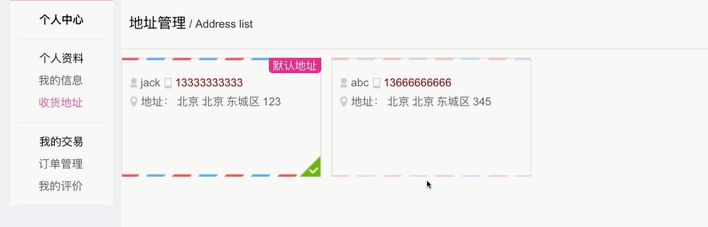
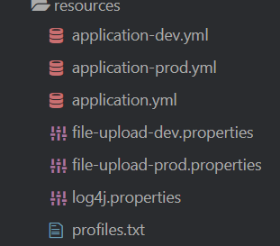
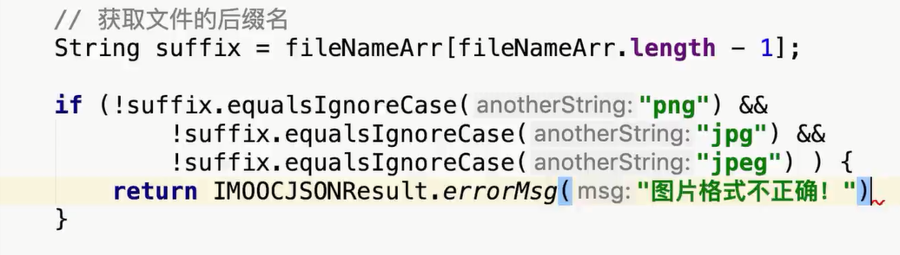
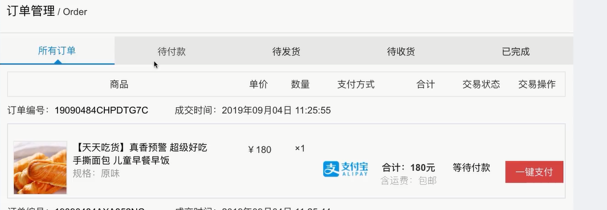
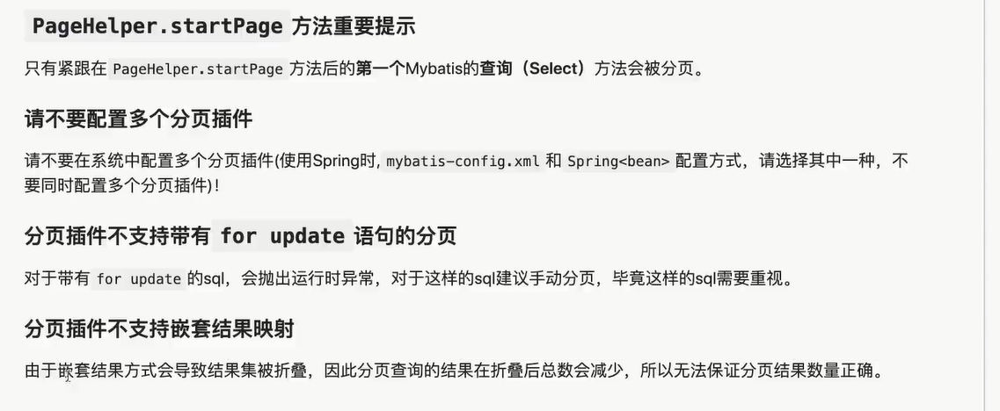
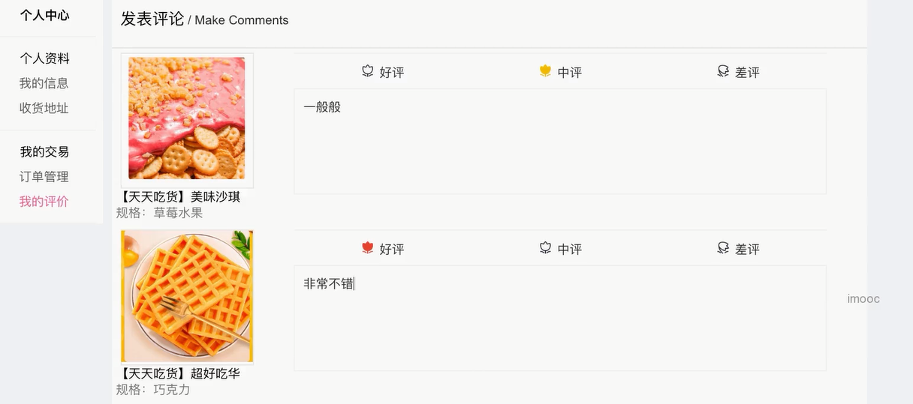
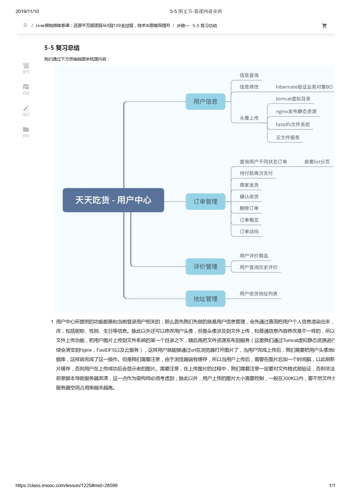

用户中心开发;用户中心是一个单独的项目,和前台门户一样



# 查询用户信息

## js

> 在页面加载函数里面调用

```js
renderUserInfo() {
						var userInfo = this.userInfo;
						// console.log(userInfo);
						// 请求后端获得最新数据
						var serverUrl = app.serverUrl;
						axios.defaults.withCredentials = true;
						axios.get(
								serverUrl + '/center/userInfo?userId=' + userInfo.id, 
								{
									headers: {
										'headerUserId': userInfo.id,
										'headerUserToken': userInfo.userUniqueToken
									}
								})
							.then(res => {
								if (res.data.status == 200) {
									var userInfoMore = res.data.data;
									// console.log(userInfoMore);
									this.userInfoMore = userInfoMore;

									var datepicker = moment(userInfoMore.birthday).format('YYYY-MM-DD');
									$("#datepicker").attr("value", datepicker);
								} else {
									alert(res.data.msg);
									console.log(res.data.msg);
								}
							});
					},
```


## Controller

```java
@Api(value = "center - 用户中心", tags = {"用户中心展示的相关接口"})
@RestController
@RequestMapping("center")
public class CenterController {

    @Autowired
    private CenterUserService centerUserService;

    @ApiOperation(value = "获取用户信息", notes = "获取用户信息", httpMethod = "GET")
    @GetMapping("userInfo")
    public IMOOCJSONResult userInfo(
            @ApiParam(name = "userId", value = "用户id", required = true)
            @RequestParam String userId) {

        Users user = centerUserService.queryUserInfo(userId);
        return IMOOCJSONResult.ok(user);
    }


}
```

## service

```java
@Service
public class CenterUserServiceImpl implements CenterUserService {

    @Autowired
    public UsersMapper usersMapper;

    @Autowired
    private Sid sid;

    @Transactional(propagation = Propagation.SUPPORTS)
    @Override
    public Users queryUserInfo(String userId) {
        Users user = usersMapper.selectByPrimaryKey(userId);
        user.setPassword(null);
        return user;
    }

```

## Dao

```java
public interface UsersMapper extends MyMapper<Users> {
}
```

# 更新用户信息

## js

```js
saveUserInfo() {
						var userInfoMore = this.userInfoMore;

						var nickname = userInfoMore.nickname;
						if (nickname == null || nickname == "" || nickname == undefined) {
							alert("昵称不能为空");
							return;
						}
						if (nickname.length > 12) {
							alert("昵称长度不能超过12位");
							return;
						}

						var realname = userInfoMore.realname;
						if (realname != null && realname != "" && realname != undefined) {
							if (realname.length > 12) {
								alert("真实姓名长度不能超过12位");
								return;
							}
						}

						var mobile = userInfoMore.mobile;
						if (mobile != null && mobile != "" && mobile != undefined) {
							if (mobile.length != 11) {
								alert("手机号长度为11位");
								return;
							}
							var checkMobile = app.checkMobile(mobile);
							if (!checkMobile) {
								alert('请输入有效的手机号码！');
								return;
							}
						}
						
						var email = userInfoMore.email;
						if (email != null && email != "" && email != undefined) {
							var checkEmail = app.checkEmail(email);
							if (!checkEmail) {
								alert('请输入有效的邮箱地址！');
								return;
							}
						}
						

						// console.log(this.userInfoMore);
						var birthday = $("#datepicker").val();
						userInfoMore.birthday = birthday;
						// console.log(userInfoMore);

						var userInfo = this.userInfo;
						// console.log(userInfo);
						// 请求后端获得最新数据
						var serverUrl = app.serverUrl;
						axios.defaults.withCredentials = true;
						axios.post(
								serverUrl + '/userInfo/update?userId=' + userInfo.id, 
								userInfoMore, 
								{
									headers: {
										'headerUserId': userInfo.id,
										'headerUserToken': userInfo.userUniqueToken
									}
								})
							.then(res => {
								if (res.data.status == 200) {
									// var userInfoMore = res.data.data;
									// console.log(userInfoMore);
									alert("用户信息修改成功!");

									window.location.reload();
								} else {
									alert(res.data.msg);
									console.log(res.data.msg);
								}
							});
					},
```

## Controller

```java

@Api(value = "用户信息接口", tags = {"用户信息相关接口"})
@RestController
@RequestMapping("userInfo")
public class CenterUserController extends BaseController {

    @Autowired
    private CenterUserService centerUserService;


    @ApiOperation(value = "修改用户信息", notes = "修改用户信息", httpMethod = "POST")
    @PostMapping("update")
    public IMOOCJSONResult update(
            @ApiParam(name = "userId", value = "用户id", required = true)
            @RequestParam String userId,
            @RequestBody @Valid CenterUserBO centerUserBO,
            BindingResult result,
            HttpServletRequest request, HttpServletResponse response) {

        System.out.println(centerUserBO);

        // 判断BindingResult是否保存错误的验证信息，如果有，则直接return
        if (result.hasErrors()) {
            Map<String, String> errorMap = getErrors(result);
            return IMOOCJSONResult.errorMap(errorMap);
        }

        Users userResult = centerUserService.updateUserInfo(userId, centerUserBO);

        userResult = setNullProperty(userResult);
        CookieUtils.setCookie(request, response, "user",
                JsonUtils.objectToJson(userResult), true);

        // TODO 后续要改，增加令牌token，会整合进redis，分布式会话

        return IMOOCJSONResult.ok();
    }

    private Map<String, String> getErrors(BindingResult result) {
        Map<String, String> map = new HashMap<>();
        List<FieldError> errorList = result.getFieldErrors();
        for (FieldError error : errorList) {
            // 发生验证错误所对应的某一个属性
            String errorField = error.getField();
            // 验证错误的信息
            String errorMsg = error.getDefaultMessage();

            map.put(errorField, errorMsg);
        }
        return map;
    }

    private Users setNullProperty(Users userResult) {
        userResult.setPassword(null);
        userResult.setMobile(null);
        userResult.setEmail(null);
        userResult.setCreatedTime(null);
        userResult.setUpdatedTime(null);
        userResult.setBirthday(null);
        return userResult;
    }

}

```

## Service

```java
@Service
public class CenterUserServiceImpl implements CenterUserService {

    @Autowired
    public UsersMapper usersMapper;

    @Autowired
    private Sid sid;

    @Transactional(propagation = Propagation.REQUIRED)
    @Override
    public Users updateUserInfo(String userId, CenterUserBO centerUserBO) {

        Users updateUser = new Users();
        BeanUtils.copyProperties(centerUserBO, updateUser);
        updateUser.setId(userId);
        updateUser.setUpdatedTime(new Date());

        usersMapper.updateByPrimaryKeySelective(updateUser);

        return queryUserInfo(userId);
    }

  
}

```

## Dao

```java
public interface UsersMapper extends MyMapper<Users> {
}
```

# Hibernate数据验证

> 数据验证可以在前端验证也可以在后端验证,一般都要做本次用 Hibernate Validtor 验证,SpringBoot web 依赖自动引入

## 验证Bean的注解

```java
public class ValBean {
/**
* Bean Validation 中内置的 constraint
* @Null 被注释的元素必须为 null
* @NotNull 被注释的元素必须不为 null
* @AssertTrue 被注释的元素必须为 true
* @AssertFalse 被注释的元素必须为 false
* @Min(value) 被注释的元素必须是一个数字，其值必须大于等于指定的最小值
* @Max(value) 被注释的元素必须是一个数字，其值必须小于等于指定的最大值
* @DecimalMin(value) 被注释的元素必须是一个数字，其值必须大于等于指定的最小值
* @DecimalMax(value) 被注释的元素必须是一个数字，其值必须小于等于指定的最大值
* @Size(max=, min=) 被注释的元素的大小必须在指定的范围内
* @Digits (integer, fraction) 被注释的元素必须是一个数字，其值必须在可接受的范围内
* @Past 被注释的元素必须是一个过去的日期
* @Future 被注释的元素必须是一个将来的日期
* @Pattern(regex=,flag=) 被注释的元素必须符合指定的正则表达式
* Hibernate Validator 附加的 constraint
* @NotBlank(message =) 验证字符串非null，且长度必须大于0
* @Email 被注释的元素必须是电子邮箱地址
* @Length(min=,max=) 被注释的字符串的大小必须在指定的范围内
* @NotEmpty 被注释的字符串的必须非空
* @Range(min=,max=,message=) 被注释的元素必须在合适的范围内
*/
private Long id;
@Max(value=20, message="{val.age.message}")
private Integer age;
@NotBlank(message="{username.not.null}")
@Length(max=6, min=3, message="{username.length}")
private String username;
@NotBlank(message="{pwd.not.null}")
@Pattern(regexp="/^(?![0-9]+$)(?![a-zA-Z]+$)[0-9A-Za-z]{6,10}$/", message="密码必须是6~10位数字和字母的组合
private String password;
@Pattern(regexp="^((13[0-9])|(15[^4,\D])|(18[0,5-9]))\d{8}$", message="手机号格式不正确")
private String phone;
@Email(message="{email.format.error}")
private String email;
}
```

```java
@ApiModel(value="用户对象", description="从客户端，由用户传入的数据封装在此entity中")
public class CenterUserBO {

    @ApiModelProperty(value="用户名", name="username", example="json", required = false)
    private String username;
    @ApiModelProperty(value="密码", name="password", example="123456", required = false)
    private String password;
    @ApiModelProperty(value="确认密码", name="confirmPassword", example="123456", required = false)
    private String confirmPassword;


    @NotBlank(message = "用户昵称不能为空")
    @Length(max = 12, message = "用户昵称不能超过12位")
    @ApiModelProperty(value="用户昵称", name="nickname", example="杰森", required = false)
    private String nickname;

    @Length(max = 12, message = "用户真实姓名不能超过12位")
    @ApiModelProperty(value="真实姓名", name="realname", example="杰森", required = false)
    private String realname;

    @Pattern(regexp = "^(((13[0-9]{1})|(15[0-9]{1})|(18[0-9]{1}))+\\d{8})$", message = "手机号格式不正确")
    @ApiModelProperty(value="手机号", name="mobile", example="13999999999", required = false)
    private String mobile;

    @Email
    @ApiModelProperty(value="邮箱地址", name="email", example="imooc@imooc.com", required = false)
    private String email;

    @Min(value = 0, message = "性别选择不正确")
    @Max(value = 2, message = "性别选择不正确")
    @ApiModelProperty(value="性别", name="sex", example="0:女 1:男 2:保密", required = false)
    private Integer sex;
    @ApiModelProperty(value="生日", name="birthday", example="1900-01-01", required = false)
    private Date birthday;

    public String getUsername() {
        return username;
    }

    public void setUsername(String username) {
        this.username = username;
    }

    public String getPassword() {
        return password;
    }

    public void setPassword(String password) {
        this.password = password;
    }

    public String getConfirmPassword() {
        return confirmPassword;
    }

    public void setConfirmPassword(String confirmPassword) {
        this.confirmPassword = confirmPassword;
    }

    public String getNickname() {
        return nickname;
    }

    public void setNickname(String nickname) {
        this.nickname = nickname;
    }

    public String getRealname() {
        return realname;
    }

    public void setRealname(String realname) {
        this.realname = realname;
    }

    public String getMobile() {
        return mobile;
    }

    public void setMobile(String mobile) {
        this.mobile = mobile;
    }

    public String getEmail() {
        return email;
    }

    public void setEmail(String email) {
        this.email = email;
    }

    public Integer getSex() {
        return sex;
    }

    public void setSex(Integer sex) {
        this.sex = sex;
    }

    public Date getBirthday() {
        return birthday;
    }

    public void setBirthday(Date birthday) {
        this.birthday = birthday;
    }

    @Override
    public String toString() {
        return "CenterUserBO{" +
                "username='" + username + '\'' +
                ", password='" + password + '\'' +
                ", confirmPassword='" + confirmPassword + '\'' +
                ", nickname='" + nickname + '\'' +
                ", realname='" + realname + '\'' +
                ", mobile='" + mobile + '\'' +
                ", email='" + email + '\'' +
                ", sex=" + sex +
                ", birthday=" + birthday +
                '}';
    }
}
```


## 验证Controller的注解

```java
@Controller
@RequestMapping(value = "/val")
public class ValidateController {
@RequestMapping(value = "/val", method=RequestMethod.POST)
@ResponseBody
```

## 获取错误信息反馈给前端

>@RequestBody @Valid CenterUserBO centerUserBO,接受前端提交的修改数据封装
>     
>
> BindingResult result,不满足绑定错误信息封装

```java


@Api(value = "用户信息接口", tags = {"用户信息相关接口"})
@RestController
@RequestMapping("userInfo")
public class CenterUserController extends BaseController {

    @Autowired
    private CenterUserService centerUserService;


    @ApiOperation(value = "修改用户信息", notes = "修改用户信息", httpMethod = "POST")
    @PostMapping("update")
    public IMOOCJSONResult update(
            @ApiParam(name = "userId", value = "用户id", required = true)
            @RequestParam String userId,
            @RequestBody @Valid CenterUserBO centerUserBO,
            BindingResult result,
            HttpServletRequest request, HttpServletResponse response) {

        System.out.println(centerUserBO);

        // 判断BindingResult是否保存错误的验证信息，如果有，则直接return
        if (result.hasErrors()) {
            Map<String, String> errorMap = getErrors(result);
            return IMOOCJSONResult.errorMap(errorMap);
        }

        Users userResult = centerUserService.updateUserInfo(userId, centerUserBO);

        userResult = setNullProperty(userResult);
        CookieUtils.setCookie(request, response, "user",
                JsonUtils.objectToJson(userResult), true);

        // TODO 后续要改，增加令牌token，会整合进redis，分布式会话

        return IMOOCJSONResult.ok();
    }

    //处理错误信息
    private Map<String, String> getErrors(BindingResult result) {
        Map<String, String> map = new HashMap<>();
        List<FieldError> errorList = result.getFieldErrors();
        for (FieldError error : errorList) {
            // 发生验证错误所对应的某一个属性
            String errorField = error.getField();
            // 验证错误的信息
            String errorMsg = error.getDefaultMessage();

            map.put(errorField, errorMsg);
        }
        return map;
    }
    
//对前端不需要的信息设置为null,因为cookie有大小限制
    private Users setNullProperty(Users userResult) {
        userResult.setPassword(null);
        userResult.setMobile(null);
        userResult.setEmail(null);
        userResult.setCreatedTime(null);
        userResult.setUpdatedTime(null);
        userResult.setBirthday(null);
        return userResult;
    }

}

```

# 上传头像


## 页面

```html
<!--头像 -->
							<div class="user-infoPic">

								<div class="filePic">
									<input type="file" id="userFace" @change="uploadFace" class="inputPic" allowexts="jpeg,jpg,png,gif" accept="image/gif,image/jpeg,image/jpg,image/png">
									
								</div>

								<p class="am-form-help">头像</p>

								<div class="info-m">
									<div style="margin-top: 20px;"><b>用户名：<i>{{userInfo.username}}</i></b></div>
								</div>
							</div>

```


## js

```js
uploadFace(e) {
						// let $target = e.target || e.srcElement;
						// let file = $target.files[0];
					
						let f = document.getElementById('userFace').files[0];
						// console.log(f);
						let multiForm = new FormData() ; 		//创建一个form对象
						multiForm.append('file', f, f.name);  	//append 向form表单添加数据

						var userInfo = this.userInfo;
						// console.log(userInfo);
						// 请求后端获得最新数据
						var serverUrl = app.serverUrl;
						axios.defaults.withCredentials = true;
						axios.post(
								serverUrl + '/userInfo/uploadFace?userId=' + userInfo.id, 
								multiForm, 
								{
									headers: {
										'Content-Type': 'multipart/form-data',
										'headerUserId': userInfo.id,
										'headerUserToken': userInfo.userUniqueToken
									}
								})
							.then(res => {
								if (res.data.status == 200) {
									// var userInfoMore = res.data.data;
									// console.log(userInfoMore);
									alert("头像上传成功!");

									window.location.reload();
								} else {
									alert(res.data.msg);
									console.log(res.data.msg);
								}
							});
					}
```

## Controller

```java

@Api(value = "用户信息接口", tags = {"用户信息相关接口"})
@RestController
@RequestMapping("userInfo")
public class CenterUserController extends BaseController {

    @Autowired
    private CenterUserService centerUserService;

    @Autowired
    private FileUpload fileUpload;

    @ApiOperation(value = "用户头像修改", notes = "用户头像修改", httpMethod = "POST")
    @PostMapping("uploadFace")
    public IMOOCJSONResult uploadFace(
            @ApiParam(name = "userId", value = "用户id", required = true)
            @RequestParam String userId,
            @ApiParam(name = "file", value = "用户头像", required = true)
            MultipartFile file,
            HttpServletRequest request, HttpServletResponse response) {

        // .sh .php

        // 定义头像保存的地址
//        String fileSpace = IMAGE_USER_FACE_LOCATION;
        String fileSpace = fileUpload.getImageUserFaceLocation();
        // 在路径上为每一个用户增加一个userid，用于区分不同用户上传
        String uploadPathPrefix = File.separator + userId;

        // 开始文件上传
        if (file != null) {
            FileOutputStream fileOutputStream = null;
            try {
                // 获得文件上传的文件名称
                String fileName = file.getOriginalFilename();

                if (StringUtils.isNotBlank(fileName)) {

                    // 文件重命名  imooc-face.png -> ["imooc-face", "png"]
                    String fileNameArr[] = fileName.split("\\.");

                    // 获取文件的后缀名
                    String suffix = fileNameArr[fileNameArr.length - 1];

                    if (!suffix.equalsIgnoreCase("png") &&
                            !suffix.equalsIgnoreCase("jpg") &&
                            !suffix.equalsIgnoreCase("jpeg") ) {
                        return IMOOCJSONResult.errorMsg("图片格式不正确！");
                    }

                    // face-{userid}.png
                    // 文件名称重组 覆盖式上传，增量式：额外拼接当前时间
                    String newFileName = "face-" + userId + "." + suffix;

                    // 上传的头像最终保存的位置
                    String finalFacePath = fileSpace + uploadPathPrefix + File.separator + newFileName;
                    // 用于提供给web服务访问的地址
                    uploadPathPrefix += ("/" + newFileName);

                    File outFile = new File(finalFacePath);
                    if (outFile.getParentFile() != null) {
                        // 创建文件夹
                        outFile.getParentFile().mkdirs();
                    }

                    // 文件输出保存到目录
                    fileOutputStream = new FileOutputStream(outFile);
                    InputStream inputStream = file.getInputStream();
                    IOUtils.copy(inputStream, fileOutputStream);
                }
            } catch (IOException e) {
                e.printStackTrace();
            } finally {
                try {
                    if (fileOutputStream != null) {
                        fileOutputStream.flush();
                        fileOutputStream.close();
                    }
                } catch (IOException e) {
                    e.printStackTrace();
                }
            }

        } else {
            return IMOOCJSONResult.errorMsg("文件不能为空！");
        }

        // 获取图片服务地址
        String imageServerUrl = fileUpload.getImageServerUrl();

        // 由于浏览器可能存在缓存的情况，所以在这里，我们需要加上时间戳来保证更新后的图片可以及时刷新
        String finalUserFaceUrl = imageServerUrl + uploadPathPrefix
                + "?t=" + DateUtil.getCurrentDateString(DateUtil.DATE_PATTERN);

        // 更新用户头像到数据库
        Users userResult = centerUserService.updateUserFace(userId, finalUserFaceUrl);

        userResult = setNullProperty(userResult);
        CookieUtils.setCookie(request, response, "user",
                JsonUtils.objectToJson(userResult), true);

        // TODO 后续要改，增加令牌token，会整合进redis，分布式会话

        return IMOOCJSONResult.ok();
    }


}

```


## BaseController

> 用于抽取一些配置信息,常亮  比如文件存储地址

```java
@Controller
public class BaseController {

    public static final String FOODIE_SHOPCART = "shopcart";

    public static final Integer COMMON_PAGE_SIZE = 10;
    public static final Integer PAGE_SIZE = 20;

    // 支付中心的调用地址
    String paymentUrl = "http://payment.t.mukewang.com/foodie-payment/payment/createMerchantOrder";		// produce

    // 微信支付成功 -> 支付中心 -> 天天吃货平台
    //                       |-> 回调通知的url
    String payReturnUrl = "http://api.z.mukewang.com/foodie-dev-api/orders/notifyMerchantOrderPaid";

    // 用户上传头像的位置  兼容写法
    public static final String IMAGE_USER_FACE_LOCATION = File.separator + "workspaces" +
                                                            File.separator + "images" +
                                                            File.separator + "foodie" +
                                                            File.separator + "faces";
//    public static final String IMAGE_USER_FACE_LOCATION = "/workspaces/images/foodie/faces";


    @Autowired
    public MyOrdersService myOrdersService;

    /**
     * 用于验证用户和订单是否有关联关系，避免非法用户调用
     * @return
     */
    public IMOOCJSONResult checkUserOrder(String userId, String orderId) {
        Orders order = myOrdersService.queryMyOrder(userId, orderId);
        if (order == null) {
            return IMOOCJSONResult.errorMsg("订单不存在！");
        }
        return IMOOCJSONResult.ok(order);
    }
}

```


## Service

```java
 @Transactional(propagation = Propagation.REQUIRED)
   
    @Transactional(propagation = Propagation.REQUIRED)
    @Override
    public Users updateUserFace(String userId, String faceUrl) {
        Users updateUser = new Users();
        updateUser.setId(userId);
        updateUser.setFace(faceUrl);
        updateUser.setUpdatedTime(new Date());

        usersMapper.updateByPrimaryKeySelective(updateUser);

        return queryUserInfo(userId);
    }
```


## Dao

```java
public interface UsersMapper extends MyMapper<Users> {
}
```

## 配置上传路径写到配置文件

为了测试 --开发--生产环境配置

> 因为以后配置可能很多,所以要写到配置文件,而不是写到BaseController
>
> 

### file-upload-dev.properties

```properties
file.imageUserFaceLocation=/workspaces/images/foodie/faces
file.imageServerUrl=http://localhost:8088/foodie/faces
```

### file-upload-Prod.properties

```properties
file.imageUserFaceLocation=/workspaces/images/foodie/faces
file.imageServerUrl=http://api.z.mukewang.com:8088/foodie-dev-api/foodie/faces
```

### 读取配置类

> 用于关联配置

FileUpload

```java
@Component
@ConfigurationProperties(prefix = "file")
@PropertySource("classpath:file-upload-prod.properties")
public class FileUpload {

    private String imageUserFaceLocation;
    private String imageServerUrl;

    public String getImageServerUrl() {
        return imageServerUrl;
    }

    public void setImageServerUrl(String imageServerUrl) {
        this.imageServerUrl = imageServerUrl;
    }

    public String getImageUserFaceLocation() {
        return imageUserFaceLocation;
    }

    public void setImageUserFaceLocation(String imageUserFaceLocation) {
        this.imageUserFaceLocation = imageUserFaceLocation;
    }
}

```

### 使用配置类

直接在需要的地方注入就可以


## 限制文件格式

通过后缀名判断



## 限制文件大小

```properties
servlet:
    multipart:
      max-file-size: 512000     # 文件上传大小限制为500kb
      max-request-size: 512000  # 请求大小限制为500kb
```

### 大小超过异常提供给前端

```java
@RestControllerAdvice
public class CustomExceptionHandler {

    // 上传文件超过500k，捕获异常：MaxUploadSizeExceededException
    @ExceptionHandler(MaxUploadSizeExceededException.class)
    public IMOOCJSONResult handlerMaxUploadFile(MaxUploadSizeExceededException ex) {
        return IMOOCJSONResult.errorMsg("文件上传大小不能超过500k，请压缩图片或者降低图片质量再上传！");
    }
}
```


# 静态资源提供网络映射

> 为了可以在浏览器访问静态资源,可以用|Tomcat 也可以用Nigix,这里先介绍用SpringBoot的内置Tomcat实现

SpringBoot需要修改web的默认配置

```java
@Configuration
public class WebMvcConfig implements WebMvcConfigurer {

    // 实现静态资源的映射
    @Override
    public void addResourceHandlers(ResourceHandlerRegistry registry) {
        registry.addResourceHandler("/**")
                .addResourceLocations("classpath:/META-INF/resources/")  // 映射swagger2,不配置访问不了
                .addResourceLocations("file:/workspaces/images/");  // 映射本地静态资源
    }

    @Bean
    public RestTemplate restTemplate(RestTemplateBuilder builder) {
        return builder.build();
    }

}

```


# 收货地址

> 列表展示,新增,修改,设置默认 和第三周相同

# 订单管理



## 表


## js

```js
<script type="text/javascript">
		var index = new Vue({
			el: "#myOrders",
			data: {
				userIsLogin: false,
				userInfo: {},

				shopServerUrl: "",		// 门户网站地址

				addressList: {},

				myOrderList: [], // 订单列表
				orderStatus: "", // 订单状态
				page: 1, // 分页页数
				pageSize: 10, // 分页每页显示数量
				maxPage: 1, // 总页数
				total: 1, // 总记录数
			},
			created() {
				// var me = this;
				// 通过cookie判断用户是否登录
				this.judgeUserLoginStatus();

				this.shopServerUrl = app.shopServerUrl;

				// 渲染订单列表信息
				this.renderOrderList(this.orderStatus, this.page, this.pageSize);
			},
			methods: {
				deleteOrder(orderId) {
					var confirm = window.confirm("确认删除吗？");
					if (!confirm) {
						return false;
					}

					var userInfo = this.userInfo;
					// 请求后端获得最新数据
					var serverUrl = app.serverUrl;
					axios.defaults.withCredentials = true;
					axios.post(
							serverUrl + '/myorders/delete?userId=' + userInfo.id + "&orderId=" + orderId, {}, 
							{
								headers: {
									'headerUserId': userInfo.id,
									'headerUserToken': userInfo.userUniqueToken
								}
							})
						.then(res => {
							if (res.data.status == 200) {
								this.renderOrderList(this.orderStatus, this.page, this.pageSize);
							} else if (res.data.status == 500) {
								alert(res.data.msg);
							}
						});
				},
				commentItems(orderId) {
					window.location.href = "doComment.html?orderId=" + orderId;
				},
				confirmReceive(orderId) {

					var confirm = window.confirm("确认收货吗？");
					if (!confirm) {
						return false;
					}

					var userInfo = this.userInfo;
					// 请求后端获得最新数据
					var serverUrl = app.serverUrl;
					axios.defaults.withCredentials = true;
					axios.post(
							serverUrl + '/myorders/confirmReceive?userId=' + userInfo.id + "&orderId=" + orderId, {}, 
							{
								headers: {
									'headerUserId': userInfo.id,
									'headerUserToken': userInfo.userUniqueToken
								}
							})
						.then(res => {
							if (res.data.status == 200) {
								this.renderOrderList(this.orderStatus, this.page, this.pageSize);
							} else if (res.data.status == 500) {
								alert(res.data.msg);
							}
						});
				},
				goPay(orderId, payMethod, totalAmount) {
					// console.log(orderId);
					// console.log(payMethod);
					// 判断是否微信还是支付宝支付
					if (payMethod == 1) {
						// 微信支付则跳转到微信支付页面，并且获得支付二维码
						window.location.href = app.shopServerUrl + "wxpay.html?orderId=" + orderId;
					} else if (payMethod == 2) {
						// 支付宝支付直接跳转
						window.location.href = app.shopServerUrl + "alipay.html?orderId=" + orderId + "&amount=" + totalAmount;
						window.open(app.shopServerUrl + "alipayTempTransit.html?orderId=" + orderId);
					} else {
						alert("目前只支持微信或支付宝支付！");
					}
				},
				queryOrdersByStatus(status) {
					if (status == null || status =="" || status == undefined) {
						status = "";
					}

					this.orderStatus = status;
					this.page = 1;
					this.renderOrderList(status, 1, this.pageSize);
				},
				// 分页实现方法 跳转到page页
                doPaging: function (page) {
                    this.page = page;
					this.renderOrderList(this.orderStatus, page, this.pageSize);
                },
				renderOrderList(orderStatus, page, pageSize) {
					var userInfo = this.userInfo;
					// 请求后端获得最新数据
					var serverUrl = app.serverUrl;
					axios.defaults.withCredentials = true;
					axios.post(
							serverUrl + '/myorders/query?userId=' + userInfo.id + "&orderStatus=" + orderStatus +
							"&page=" + page +
							"&pageSize=" + pageSize, {}, {
								headers: {
									'headerUserId': userInfo.id,
									'headerUserToken': userInfo.userUniqueToken
								}
							})
						.then(res => {
							if (res.data.status == 200) {
								var grid = res.data.data;
								var myOrderList = grid.rows;
								this.myOrderList = myOrderList;

								for (var i = 0; i < myOrderList.length; i++) {
									var date = myOrderList[i].createdTime;
									var formatedTime = moment(date).format('YYYY年MM月DD日 h:mm:ss');
									// console.log(formatedTime);
									myOrderList[i].createdTime = formatedTime;
								}
								console.log(myOrderList);

								var maxPage = grid.total; // 获得总页数
								var total = grid.records; // 获得总记录数

								this.maxPage = maxPage;
								this.total = total;

							} else if (res.data.status == 500) {
								alert(res.data.msg);
							}
						});
				},
				// 通过cookie判断用户是否登录
				judgeUserLoginStatus() {
					var userCookie = app.getCookie("user");
					if (
						userCookie != null &&
						userCookie != undefined &&
						userCookie != ""
					) {
						var userInfoStr = decodeURIComponent(userCookie);
						// console.log(userInfoStr);
						if (
							userInfoStr != null &&
							userInfoStr != undefined &&
							userInfoStr != ""
						) {
							var userInfo = JSON.parse(userInfoStr);
                            // 判断是否是一个对象
                            if ( typeof(userInfo)  == "object" ) {
                                this.userIsLogin = true;
                                // console.log(userInfo);
                                this.userInfo = userInfo;
                            } else {
                                this.userIsLogin = false;
                                this.userInfo = {};
                            }
						}
					} else {
						this.userIsLogin = false;
						this.userInfo = {};
					}
				}
			}
		});
	</script>
```

一键支付

```js
goPay(orderId, payMethod, totalAmount) {
					// console.log(orderId);
					// console.log(payMethod);
					// 判断是否微信还是支付宝支付
					if (payMethod == 1) {
						// 微信支付则跳转到微信支付页面，并且获得支付二维码
						window.location.href = app.shopServerUrl + "wxpay.html?orderId=" + orderId;
					} else if (payMethod == 2) {
						// 支付宝支付直接跳转
						window.location.href = app.shopServerUrl + "alipay.html?orderId=" + orderId + "&amount=" + totalAmount;
						window.open(app.shopServerUrl + "alipayTempTransit.html?orderId=" + orderId);
					} else {
						alert("目前只支持微信或支付宝支付！");
					}
				},
```


## Controller

```java
@Api(value = "用户中心我的订单", tags = {"用户中心我的订单相关接口"})
@RestController
@RequestMapping("myorders")
public class MyOrdersController extends BaseController {

//    @Autowired
//    private MyOrdersService myOrdersService;

    @ApiOperation(value = "获得订单状态数概况", notes = "获得订单状态数概况", httpMethod = "POST")
    @PostMapping("/statusCounts")
    public IMOOCJSONResult statusCounts(
            @ApiParam(name = "userId", value = "用户id", required = true)
            @RequestParam String userId) {

        if (StringUtils.isBlank(userId)) {
            return IMOOCJSONResult.errorMsg(null);
        }

        OrderStatusCountsVO result = myOrdersService.getOrderStatusCounts(userId);

        return IMOOCJSONResult.ok(result);
    }

    @ApiOperation(value = "查询订单列表", notes = "查询订单列表", httpMethod = "POST")
    @PostMapping("/query")
    public IMOOCJSONResult query(
            @ApiParam(name = "userId", value = "用户id", required = true)
            @RequestParam String userId,
            @ApiParam(name = "orderStatus", value = "订单状态", required = false)
            @RequestParam Integer orderStatus,
            @ApiParam(name = "page", value = "查询下一页的第几页", required = false)
            @RequestParam Integer page,
            @ApiParam(name = "pageSize", value = "分页的每一页显示的条数", required = false)
            @RequestParam Integer pageSize) {

        if (StringUtils.isBlank(userId)) {
            return IMOOCJSONResult.errorMsg(null);
        }
        if (page == null) {
            page = 1;
        }
        if (pageSize == null) {
            pageSize = COMMON_PAGE_SIZE;
        }

        PagedGridResult grid = myOrdersService.queryMyOrders(userId,
                                                            orderStatus,
                                                            page,
                                                            pageSize);

        return IMOOCJSONResult.ok(grid);
    }


    // 商家发货没有后端，所以这个接口仅仅只是用于模拟
    @ApiOperation(value="商家发货", notes="商家发货", httpMethod = "GET")
    @GetMapping("/deliver")
    public IMOOCJSONResult deliver(
            @ApiParam(name = "orderId", value = "订单id", required = true)
            @RequestParam String orderId) throws Exception {

        if (StringUtils.isBlank(orderId)) {
            return IMOOCJSONResult.errorMsg("订单ID不能为空");
        }
        myOrdersService.updateDeliverOrderStatus(orderId);
        return IMOOCJSONResult.ok();
    }


    @ApiOperation(value="用户确认收货", notes="用户确认收货", httpMethod = "POST")
    @PostMapping("/confirmReceive")
    public IMOOCJSONResult confirmReceive(
            @ApiParam(name = "orderId", value = "订单id", required = true)
            @RequestParam String orderId,
            @ApiParam(name = "userId", value = "用户id", required = true)
            @RequestParam String userId) throws Exception {

        IMOOCJSONResult checkResult = checkUserOrder(userId, orderId);
        if (checkResult.getStatus() != HttpStatus.OK.value()) {
            return checkResult;
        }

        boolean res = myOrdersService.updateReceiveOrderStatus(orderId);
        if (!res) {
            return IMOOCJSONResult.errorMsg("订单确认收货失败！");
        }

        return IMOOCJSONResult.ok();
    }

    @ApiOperation(value="用户删除订单", notes="用户删除订单", httpMethod = "POST")
    @PostMapping("/delete")
    public IMOOCJSONResult delete(
            @ApiParam(name = "orderId", value = "订单id", required = true)
            @RequestParam String orderId,
            @ApiParam(name = "userId", value = "用户id", required = true)
            @RequestParam String userId) throws Exception {

        IMOOCJSONResult checkResult = checkUserOrder(userId, orderId);
        if (checkResult.getStatus() != HttpStatus.OK.value()) {
            return checkResult;
        }

        boolean res = myOrdersService.deleteOrder(userId, orderId);
        if (!res) {
            return IMOOCJSONResult.errorMsg("订单删除失败！");
        }

        return IMOOCJSONResult.ok();
    }


    /**
     * 用于验证用户和订单是否有关联关系，避免非法用户调用
     * @return
     */
//    private IMOOCJSONResult checkUserOrder(String userId, String orderId) {
//        Orders order = myOrdersService.queryMyOrder(userId, orderId);
//        if (order == null) {
//            return IMOOCJSONResult.errorMsg("订单不存在！");
//        }
//        return IMOOCJSONResult.ok();
//    }

    @ApiOperation(value = "查询订单动向", notes = "查询订单动向", httpMethod = "POST")
    @PostMapping("/trend")
    public IMOOCJSONResult trend(
            @ApiParam(name = "userId", value = "用户id", required = true)
            @RequestParam String userId,
            @ApiParam(name = "page", value = "查询下一页的第几页", required = false)
            @RequestParam Integer page,
            @ApiParam(name = "pageSize", value = "分页的每一页显示的条数", required = false)
            @RequestParam Integer pageSize) {

        if (StringUtils.isBlank(userId)) {
            return IMOOCJSONResult.errorMsg(null);
        }
        if (page == null) {
            page = 1;
        }
        if (pageSize == null) {
            pageSize = COMMON_PAGE_SIZE;
        }

        PagedGridResult grid = myOrdersService.getOrdersTrend(userId,
                page,
                pageSize);

        return IMOOCJSONResult.ok(grid);
    }

}

```


## Service

```java
@Service
public class MyCommentsServiceImpl extends BaseService implements MyCommentsService {

    @Autowired
    public OrderItemsMapper orderItemsMapper;

    @Autowired
    public OrdersMapper ordersMapper;

    @Autowired
    public OrderStatusMapper orderStatusMapper;

    @Autowired
    public ItemsCommentsMapperCustom itemsCommentsMapperCustom;

    @Autowired
    private Sid sid;

    @Transactional(propagation = Propagation.SUPPORTS)
    @Override
    public List<OrderItems> queryPendingComment(String orderId) {
        OrderItems query = new OrderItems();
        query.setOrderId(orderId);
        return orderItemsMapper.select(query);
    }

    @Transactional(propagation = Propagation.REQUIRED)
    @Override
    public void saveComments(String orderId, String userId,
                             List<OrderItemsCommentBO> commentList) {

        // 1. 保存评价 items_comments
        for (OrderItemsCommentBO oic : commentList) {
            oic.setCommentId(sid.nextShort());
        }
        Map<String, Object> map = new HashMap<>();
        map.put("userId", userId);
        map.put("commentList", commentList);
        itemsCommentsMapperCustom.saveComments(map);

        // 2. 修改订单表改已评价 orders
        Orders order = new Orders();
        order.setId(orderId);
        order.setIsComment(YesOrNo.YES.type);
        ordersMapper.updateByPrimaryKeySelective(order);

        // 3. 修改订单状态表的留言时间 order_status
        OrderStatus orderStatus = new OrderStatus();
        orderStatus.setOrderId(orderId);
        orderStatus.setCommentTime(new Date());
        orderStatusMapper.updateByPrimaryKeySelective(orderStatus);
    }

    @Transactional(propagation = Propagation.SUPPORTS)
    @Override
    public PagedGridResult queryMyComments(String userId,
                                           Integer page,
                                           Integer pageSize) {

        Map<String, Object> map = new HashMap<>();
        map.put("userId", userId);

        PageHelper.startPage(page, pageSize);
        List<MyCommentVO> list = itemsCommentsMapperCustom.queryMyComments(map);

        return setterPagedGrid(list, page);
    }
}

```


## Dao

```java
public interface OrdersMapperCustom {

    public List<MyOrdersVO> queryMyOrders(@Param("paramsMap") Map<String, Object> map);

  

}
```

## OrdersMapperCustom.xml

```xml
<mapper namespace="com.imooc.mapper.OrdersMapperCustom" >

  <resultMap id="myOrdersVO" type="com.imooc.pojo.vo.MyOrdersVO">
    <id column="orderId" property="orderId"/>
    <result column="createdTime" property="createdTime"/>
    <result column="payMethod" property="payMethod"/>
    <result column="realPayAmount" property="realPayAmount"/>
      <result column="postAmount" property="postAmount"/>
      <result column="orderStatus" property="orderStatus"/>
      <result column="isComment" property="isComment"/>

    <collection property="subOrderItemList"
                select="getSubItems"
                column="orderId"
                ofType="com.imooc.pojo.vo.MySubOrderItemVO">
      <result column="itemId" property="itemId"/>
      <result column="itemName" property="itemName"/>
      <result column="itemImg" property="itemImg"/>
        <result column="itemSpecId" property="itemSpecId"/>
        <result column="itemSpecName" property="itemSpecName"/>
        <result column="buyCounts" property="buyCounts"/>
        <result column="price" property="price"/>
    </collection>
  </resultMap>

  <select id="queryMyOrders" resultMap="myOrdersVO" parameterType="Map">
    SELECT
        od.id as orderId,
        od.created_time as createdTime,
        od.pay_method as payMethod,
        od.real_pay_amount as realPayAmount,
        od.post_amount as postAmount,
        os.order_status as orderStatus,
        od.is_comment as isComment
    FROM
        orders od
    LEFT JOIN
        order_status os
    on od.id = os.order_id
    WHERE
        od.user_id = #{paramsMap.userId}
    AND
        od.is_delete = 0
        <if test="paramsMap.orderStatus != null">
          and os.order_status = #{paramsMap.orderStatus}
        </if>
    ORDER BY
        od.updated_time ASC
  </select>
    
    
    <select id="getSubItems" parameterType="String" resultType="com.imooc.pojo.vo.MySubOrderItemVO">

      select
        oi.item_id as itemId,
        oi.item_name as itemName,
        oi.item_img as itemImg,
        oi.item_spec_name as itemSpecName,
        oi.buy_counts as buyCounts,
        oi.price as price
      from
        order_items oi
      where
        oi.order_id = #{orderId}

    </select>
    

    <select id="queryMyOrdersDoNotUse" resultMap="myOrdersVO" parameterType="Map">
        SELECT
        od.id as orderId,
        od.created_time as createdTime,
        od.pay_method as payMethod,
        od.real_pay_amount as realPayAmount,
        od.post_amount as postAmount,
        os.order_status as orderStatus,
        oi.item_id as itemId,
        oi.item_name as itemName,
        oi.item_img as itemImg,
        oi.item_spec_name as itemSpecName,
        oi.buy_counts as buyCounts,
        oi.price as price
        FROM
        orders od
        LEFT JOIN
        order_status os
        on od.id = os.order_id
        LEFT JOIN
        order_items oi
        ON od.id = oi.order_id
        WHERE
        od.user_id = #{paramsMap.userId}
        AND
        od.is_delete = 0
        <if test="paramsMap.orderStatus != null">
            and os.order_status = #{paramsMap.orderStatus}
        </if>
        ORDER BY
        od.updated_time ASC
    </select>


    <select id="getMyOrderStatusCounts" parameterType="Map" resultType="int">
        SELECT
            count(1)
        FROM
            orders o
        LEFT JOIN
            order_status os
        on
            o.id = os.order_id
        WHERE
            o.user_id = #{paramsMap.userId}
        AND
            os.order_status = #{paramsMap.orderStatus}
        <if test="paramsMap.isComment != null">
            and o.is_comment = #{paramsMap.isComment}
        </if>
    </select>


    <select id="getMyOrderTrend" parameterType="Map" resultType="com.imooc.pojo.OrderStatus">

        SELECT
            os.order_id as orderId,
            os.order_status as orderStatus,
            os.created_time as createdTime,
            os.pay_time as payTime,
            os.deliver_time as deliverTime,
            os.success_time as successTime,
            os.close_time as closeTime,
            os.comment_time as commentTime
        FROM
          orders o
        LEFT JOIN
          order_status os
        on
          o.id = os.order_id
        WHERE
          o.is_delete = 0
        AND
          o.user_id = #{paramsMap.userId}
        AND
          os.order_status in (20, 30, 40)
        ORDER BY
          os.order_id
        DESC
    </select>
</mapper>
```

##  MyOrdersVO

```java
/**
 * 用户中心，我的订单列表VO
 */
public class MyOrdersVO {

    private String orderId;
    private Date createdTime;
    private Integer payMethod;
    private Integer realPayAmount;
    private Integer postAmount;
    private Integer isComment;
    private Integer orderStatus;

    private List<MySubOrderItemVO> subOrderItemList;

    public String getOrderId() {
        return orderId;
    }

    public void setOrderId(String orderId) {
        this.orderId = orderId;
    }

    public Date getCreatedTime() {
        return createdTime;
    }

    public void setCreatedTime(Date createdTime) {
        this.createdTime = createdTime;
    }

    public Integer getPayMethod() {
        return payMethod;
    }

    public void setPayMethod(Integer payMethod) {
        this.payMethod = payMethod;
    }

    public Integer getRealPayAmount() {
        return realPayAmount;
    }

    public void setRealPayAmount(Integer realPayAmount) {
        this.realPayAmount = realPayAmount;
    }

    public Integer getPostAmount() {
        return postAmount;
    }

    public void setPostAmount(Integer postAmount) {
        this.postAmount = postAmount;
    }

    public Integer getOrderStatus() {
        return orderStatus;
    }

    public void setOrderStatus(Integer orderStatus) {
        this.orderStatus = orderStatus;
    }

    public List<MySubOrderItemVO> getSubOrderItemList() {
        return subOrderItemList;
    }

    public void setSubOrderItemList(List<MySubOrderItemVO> subOrderItemList) {
        this.subOrderItemList = subOrderItemList;
    }

    public Integer getIsComment() {
        return isComment;
    }

    public void setIsComment(Integer isComment) {
        this.isComment = isComment;
    }
}
```

## MySubOrderItemVO

```java
/**
 * 用户中心，我的订单列表嵌套商品VO
 */
public class MySubOrderItemVO {

    private String itemId;
    private String itemImg;
    private String itemName;
    private String itemSpecName;
    private Integer buyCounts;
    private Integer price;

    public String getItemId() {
        return itemId;
    }

    public void setItemId(String itemId) {
        this.itemId = itemId;
    }

    public String getItemImg() {
        return itemImg;
    }

    public void setItemImg(String itemImg) {
        this.itemImg = itemImg;
    }

    public String getItemName() {
        return itemName;
    }

    public void setItemName(String itemName) {
        this.itemName = itemName;
    }

    public String getItemSpecName() {
        return itemSpecName;
    }

    public void setItemSpecName(String itemSpecName) {
        this.itemSpecName = itemSpecName;
    }

    public Integer getBuyCounts() {
        return buyCounts;
    }

    public void setBuyCounts(Integer buyCounts) {
        this.buyCounts = buyCounts;
    }

    public Integer getPrice() {
        return price;
    }

    public void setPrice(Integer price) {
        this.price = price;
    }
}
```

## 分页查询bug

分页插件在查询一对多的时候就会嵌套分页从而实际数据条数比查询要少,及一对多写一条Sql就会出现这种问题



### 解决方式一

先查询订单,在查询订单关联商品信息  java代中解决

### 方式 二

把一条Sql拆分橙两条Sql,任然使用分页插件

> 在多的哪里写
>
> ```xml
> <collection property="subOrderItemList"
>                 select="getSubItems"
>                 column="orderId"
>                 ofType="com.imooc.pojo.vo.MySubOrderItemVO">
> ```
>
> 

```xml
 <resultMap id="myOrdersVO" type="com.imooc.pojo.vo.MyOrdersVO">
    <id column="orderId" property="orderId"/>
    <result column="createdTime" property="createdTime"/>
    <result column="payMethod" property="payMethod"/>
    <result column="realPayAmount" property="realPayAmount"/>
      <result column="postAmount" property="postAmount"/>
      <result column="orderStatus" property="orderStatus"/>
      <result column="isComment" property="isComment"/>

    <collection property="subOrderItemList"
                select="getSubItems"
                column="orderId"
                ofType="com.imooc.pojo.vo.MySubOrderItemVO">
      <result column="itemId" property="itemId"/>
      <result column="itemName" property="itemName"/>
      <result column="itemImg" property="itemImg"/>
        <result column="itemSpecId" property="itemSpecId"/>
        <result column="itemSpecName" property="itemSpecName"/>
        <result column="buyCounts" property="buyCounts"/>
        <result column="price" property="price"/>
    </collection>
  </resultMap>

  <select id="queryMyOrders" resultMap="myOrdersVO" parameterType="Map">
    SELECT
        od.id as orderId,
        od.created_time as createdTime,
        od.pay_method as payMethod,
        od.real_pay_amount as realPayAmount,
        od.post_amount as postAmount,
        os.order_status as orderStatus,
        od.is_comment as isComment
    FROM
        orders od
    LEFT JOIN
        order_status os
    on od.id = os.order_id
    WHERE
        od.user_id = #{paramsMap.userId}
    AND
        od.is_delete = 0
        <if test="paramsMap.orderStatus != null">
          and os.order_status = #{paramsMap.orderStatus}
        </if>
    ORDER BY
        od.updated_time ASC
  </select>
    
    
    <select id="getSubItems" parameterType="String" resultType="com.imooc.pojo.vo.MySubOrderItemVO">

      select
        oi.item_id as itemId,
        oi.item_name as itemName,
        oi.item_img as itemImg,
        oi.item_spec_name as itemSpecName,
        oi.buy_counts as buyCounts,
        oi.price as price
      from
        order_items oi
      where
        oi.order_id = #{orderId}

    </select>
```

# 评价管理

> 前提必须交易成功
>
> 

## js

渲染评论

```js
<script type="text/javascript">
		var index = new Vue({
			el: "#commentList",
			data: {
				userIsLogin: false,
				userInfo: {},

				myCommentList: [], // 评论列表
				page: 1, // 分页页数
				pageSize: 10, // 分页每页显示数量
				maxPage: 1, // 总页数
				total: 1, // 总记录数
			},
			created() {
				// var me = this;
				// 通过cookie判断用户是否登录
				this.judgeUserLoginStatus();

				// 渲染评论列表信息
				this.renderMyCommentList(this.page, this.pageSize);
			},
			methods: {
				// 分页实现方法 跳转到page页
				doPaging: function (page) {
					this.page = page;
					this.renderMyCommentList(page, this.pageSize);
				},
				renderMyCommentList(page, pageSize) {
					var userInfo = this.userInfo;
					// 请求后端获得最新数据
					var serverUrl = app.serverUrl;
					axios.defaults.withCredentials = true;
					axios.post(
							serverUrl + '/mycomments/query?userId=' + userInfo.id +
							"&page=" + page +
							"&pageSize=" + pageSize, {}, {
								headers: {
									'headerUserId': userInfo.id,
									'headerUserToken': userInfo.userUniqueToken
								}
							})
						.then(res => {
							if (res.data.status == 200) {
								var grid = res.data.data;
								var myCommentList = grid.rows;
								this.myCommentList = myCommentList;

								for (var i = 0; i < myCommentList.length; i++) {
									var date = myCommentList[i].createdTime;
									var formatedTime = moment(date).format('YYYY年MM月DD日 h:mm:ss');
									// console.log(formatedTime);
									myCommentList[i].createdTime = formatedTime;
								}
								// console.log(myCommentList);
								var maxPage = grid.total; // 获得总页数
								var total = grid.records; // 获得总记录数

								this.maxPage = maxPage;
								this.total = total;

							} else if (res.data.status == 500) {
								alert(res.data.msg);
							}
						});
				},
				// 通过cookie判断用户是否登录
				judgeUserLoginStatus() {
					var userCookie = app.getCookie("user");
					if (
						userCookie != null &&
						userCookie != undefined &&
						userCookie != ""
					) {
						var userInfoStr = decodeURIComponent(userCookie);
						// console.log(userInfoStr);
						if (
							userInfoStr != null &&
							userInfoStr != undefined &&
							userInfoStr != ""
						) {
							var userInfo = JSON.parse(userInfoStr);
                            // 判断是否是一个对象
                            if ( typeof(userInfo)  == "object" ) {
                                this.userIsLogin = true;
                                // console.log(userInfo);
                                this.userInfo = userInfo;
                            } else {
                                this.userIsLogin = false;
                                this.userInfo = {};
                            }
						}
					} else {
						this.userIsLogin = false;
						this.userInfo = {};
					}
				}
			}
		});
	</script>
```

评论

```js
<script type="text/javascript">
		$(document).ready(function () {
			$(".comment-list .item-opinion li").click(function () {
				$(this).prevAll().children('i').removeClass("active");
				$(this).nextAll().children('i').removeClass("active");
				$(this).children('i').addClass("active");
			});
		})
	</script>
	<script type="text/javascript" src="js/app.js"></script>
	<script type="text/javascript">
		var index = new Vue({
			el: "#makeComments",
			data: {
				userIsLogin: false,
				userInfo: {},

				flowerList: [],	// 评价等级list
				orderItemList: [],
				
			},
			created() {
				// var me = this;
				// 通过cookie判断用户是否登录
				this.judgeUserLoginStatus();


				var orderId = app.getUrlParam("orderId");
				// 如果orderId为空，跳转到错误页面
				if (orderId == null || orderId == undefined || orderId == '') {
					app.goErrorPage();
					return;
				}
				this.orderId = orderId;
				// 渲染评论页内容
				this.renderItemComment(orderId);
			},
			methods: {
				saveComments() {
					var orderItemList = this.orderItemList;
					// console.log(orderItemList);

					// 判断每项元素是否有评论等级
					// 判断每项元素是否包含评论内容
					for (var i = 0 ; i < orderItemList.length ; i ++) {
						var tempItem = orderItemList[i];
						if (tempItem.commentLevel == "" || tempItem.commentLevel == undefined || tempItem.commentLevel == null) {
							alert("每个商品都需要一朵小花噢~");
							return;
						}
						if (tempItem.content == "" || tempItem.content == undefined || tempItem.content == null) {
							alert("每个商品都需要您宝贵的评论噢~");
							return;
						}
					}

					// 保存评论
					var userInfo = this.userInfo;
					// 请求后端获得最新数据
					var serverUrl = app.serverUrl;
					axios.defaults.withCredentials = true;
					axios.post(
							serverUrl + '/mycomments/saveList?userId=' + userInfo.id + "&orderId=" + this.orderId,
							orderItemList, 
							{
								headers: {
									'headerUserId': userInfo.id,
									'headerUserToken': userInfo.userUniqueToken
								}
							})
						.then(res => {
							if (res.data.status == 200) {
								// var orderItemList = res.data.data;
								// console.log(orderItemList);
								alert("评论成功！");
								window.location.href = "order.html";
							} else if (res.data.status == 500) {
								alert(res.data.msg);
							}
						});
				},
				makeComment(orderItemId, level) {
					var orderItemList = this.orderItemList;
					for (var i = 0 ; i < orderItemList.length ; i ++) {
						var tempId = orderItemList[i].id;
						if (tempId == orderItemId) {
							orderItemList[i].commentLevel = level;
						}
					}
					// console.log(orderItemList);
					this.orderItemList = orderItemList;

					var liId = "";
					if (level == 1) {
						liId = "good_" + orderItemId;
					} else if (level == 2) {
						liId = "normal_" + orderItemId;
					} else if (level == 3) {
						liId = "bad_" + orderItemId;
					}

					var goodLiId = "good_" + orderItemId;
					var normalLiId = "normal_" + orderItemId;
					var badLiId = "bad_" + orderItemId;

					// 判断评价等级，先把所有的颜色去掉，然后再在当前点击的上面标记颜色
					var goodDomLi = document.getElementById(goodLiId);
					var normalDomLi = document.getElementById(normalLiId);
					var badDomLi = document.getElementById(badLiId);
					goodDomLi.children[0].classList.remove("active");
					normalDomLi.children[0].classList.remove("active");
					badDomLi.children[0].classList.remove("active");

					var domLi = document.getElementById(liId);
					var classList = domLi.children[0].classList;
					classList.add("active");

					// console.log(domLi.children[0].classList);
				},
				renderItemComment(orderId) {
					var userInfo = this.userInfo;
					// 请求后端获得最新数据
					var serverUrl = app.serverUrl;
					axios.defaults.withCredentials = true;
					axios.post(
							serverUrl + '/mycomments/pending?userId=' + userInfo.id + "&orderId=" + orderId, {}, 
							{
								headers: {
									'headerUserId': userInfo.id,
									'headerUserToken': userInfo.userUniqueToken
								}
							})
						.then(res => {
							if (res.data.status == 200) {
								var orderItemList = res.data.data;
								// console.log(orderItemList);
								this.orderItemList = orderItemList;

								for (var i = 0 ; i < orderItemList.length ; i ++) {
									orderItemList[i].commentLevel = 0;
									orderItemList[i].commentId = 0;
								}

							} else if (res.data.status == 500) {
								alert(res.data.msg);
							}
						});
				},
				// 通过cookie判断用户是否登录
				judgeUserLoginStatus() {
					var userCookie = app.getCookie("user");
					if (
						userCookie != null &&
						userCookie != undefined &&
						userCookie != ""
					) {
						var userInfoStr = decodeURIComponent(userCookie);
						// console.log(userInfoStr);
						if (
							userInfoStr != null &&
							userInfoStr != undefined &&
							userInfoStr != ""
						) {
							var userInfo = JSON.parse(userInfoStr);
                            // 判断是否是一个对象
                            if ( typeof(userInfo)  == "object" ) {
                                this.userIsLogin = true;
                                // console.log(userInfo);
                                this.userInfo = userInfo;
                            } else {
                                this.userIsLogin = false;
                                this.userInfo = {};
                            }
						}
					} else {
						this.userIsLogin = false;
						this.userInfo = {};
					}
				}
			}
		});
	</script>
```


## Controller

```java
@Api(value = "用户中心评价模块", tags = {"用户中心评价模块相关接口"})
@RestController
@RequestMapping("mycomments")
public class MyCommentsController extends BaseController {

    @Autowired
    private MyCommentsService myCommentsService;

    @ApiOperation(value = "查询订单列表", notes = "查询订单列表", httpMethod = "POST")
    @PostMapping("/pending")
    public IMOOCJSONResult pending(
            @ApiParam(name = "userId", value = "用户id", required = true)
            @RequestParam String userId,
            @ApiParam(name = "orderId", value = "订单id", required = true)
            @RequestParam String orderId) {

        // 判断用户和订单是否关联
        IMOOCJSONResult checkResult = checkUserOrder(userId, orderId);
        if (checkResult.getStatus() != HttpStatus.OK.value()) {
            return checkResult;
        }
        // 判断该笔订单是否已经评价过，评价过了就不再继续
        Orders myOrder = (Orders)checkResult.getData();
        if (myOrder.getIsComment() == YesOrNo.YES.type) {
            return IMOOCJSONResult.errorMsg("该笔订单已经评价");
        }

        List<OrderItems> list = myCommentsService.queryPendingComment(orderId);

        return IMOOCJSONResult.ok(list);
    }


    @ApiOperation(value = "保存评论列表", notes = "保存评论列表", httpMethod = "POST")
    @PostMapping("/saveList")
    public IMOOCJSONResult saveList(
            @ApiParam(name = "userId", value = "用户id", required = true)
            @RequestParam String userId,
            @ApiParam(name = "orderId", value = "订单id", required = true)
            @RequestParam String orderId,
            @RequestBody List<OrderItemsCommentBO> commentList) {

        System.out.println(commentList);

        // 判断用户和订单是否关联
        IMOOCJSONResult checkResult = checkUserOrder(userId, orderId);
        if (checkResult.getStatus() != HttpStatus.OK.value()) {
            return checkResult;
        }
        // 判断评论内容list不能为空
        if (commentList == null || commentList.isEmpty() || commentList.size() == 0) {
            return IMOOCJSONResult.errorMsg("评论内容不能为空！");
        }

        myCommentsService.saveComments(orderId, userId, commentList);
        return IMOOCJSONResult.ok();
    }

    @ApiOperation(value = "查询我的评价", notes = "查询我的评价", httpMethod = "POST")
    @PostMapping("/query")
    public IMOOCJSONResult query(
            @ApiParam(name = "userId", value = "用户id", required = true)
            @RequestParam String userId,
            @ApiParam(name = "page", value = "查询下一页的第几页", required = false)
            @RequestParam Integer page,
            @ApiParam(name = "pageSize", value = "分页的每一页显示的条数", required = false)
            @RequestParam Integer pageSize) {

        if (StringUtils.isBlank(userId)) {
            return IMOOCJSONResult.errorMsg(null);
        }
        if (page == null) {
            page = 1;
        }
        if (pageSize == null) {
            pageSize = COMMON_PAGE_SIZE;
        }

        PagedGridResult grid = myCommentsService.queryMyComments(userId,
                page,
                pageSize);

        return IMOOCJSONResult.ok(grid);
    }

}

```

## Service

```java
@Service
public class MyCommentsServiceImpl extends BaseService implements MyCommentsService {

    @Autowired
    public OrderItemsMapper orderItemsMapper;

    @Autowired
    public OrdersMapper ordersMapper;

    @Autowired
    public OrderStatusMapper orderStatusMapper;

    @Autowired
    public ItemsCommentsMapperCustom itemsCommentsMapperCustom;

    @Autowired
    private Sid sid;

    @Transactional(propagation = Propagation.SUPPORTS)
    @Override
    public List<OrderItems> queryPendingComment(String orderId) {
        OrderItems query = new OrderItems();
        query.setOrderId(orderId);
        return orderItemsMapper.select(query);
    }

    @Transactional(propagation = Propagation.REQUIRED)
    @Override
    public void saveComments(String orderId, String userId,
                             List<OrderItemsCommentBO> commentList) {

        // 1. 保存评价 items_comments
        for (OrderItemsCommentBO oic : commentList) {
            oic.setCommentId(sid.nextShort());
        }
        Map<String, Object> map = new HashMap<>();
        map.put("userId", userId);
        map.put("commentList", commentList);
        itemsCommentsMapperCustom.saveComments(map);

        // 2. 修改订单表改已评价 orders
        Orders order = new Orders();
        order.setId(orderId);
        order.setIsComment(YesOrNo.YES.type);
        ordersMapper.updateByPrimaryKeySelective(order);

        // 3. 修改订单状态表的留言时间 order_status
        OrderStatus orderStatus = new OrderStatus();
        orderStatus.setOrderId(orderId);
        orderStatus.setCommentTime(new Date());
        orderStatusMapper.updateByPrimaryKeySelective(orderStatus);
    }

    @Transactional(propagation = Propagation.SUPPORTS)
    @Override
    public PagedGridResult queryMyComments(String userId,
                                           Integer page,
                                           Integer pageSize) {

        Map<String, Object> map = new HashMap<>();
        map.put("userId", userId);

        PageHelper.startPage(page, pageSize);
        List<MyCommentVO> list = itemsCommentsMapperCustom.queryMyComments(map);

        return setterPagedGrid(list, page);
    }
}
```

## Dao

```java
public interface ItemsCommentsMapper extends MyMapper<ItemsComments> {
}

public interface ItemsCommentsMapperCustom extends MyMapper<ItemsComments> {

    public void saveComments(Map<String, Object> map);

    public List<MyCommentVO> queryMyComments(@Param("paramsMap") Map<String, Object> map);

}
```

## ItemsCommentsMapperCustom.xml

```xml
<mapper namespace="com.imooc.mapper.ItemsCommentsMapperCustom" >

  <select id="saveComments" parameterType="Map">

    insert into
      items_comments
      (
        id,
        user_id,
        item_id,
        item_name,
        item_spec_id,
        sepc_name,
        comment_level,
        content,
        created_time,
        updated_time
      )
    values
      <foreach collection="commentList" item="item" index="index" separator=",">
      (
        #{item.commentId},
        #{userId},
        #{item.itemId},
        #{item.itemName},
        #{item.itemSpecId},
        #{item.itemSpecName},
        #{item.commentLevel},
        #{item.content},
        now(),
        now()
      )
      </foreach>

  </select>
  
  <resultMap id="myComments" type="com.imooc.pojo.vo.MyCommentVO">
    <id column="commentId" property="commentId"/>
    <result column="content" property="content"/>
    <result column="createdTime" property="createdTime"/>
    <result column="itemId" property="itemId"/>
    <result column="itemName" property="itemName"/>
    <result column="sepcName" property="specName"/>
    <result column="itemImg" property="itemImg"/>
  </resultMap>

  <select id="queryMyComments" parameterType="Map" resultMap="myComments">
    SELECT
        ic.id as commentId,
        ic.content as content,
        ic.created_time as createdTime,
        ic.item_id as itemId,
        ic.item_name as itemName,
        ic.sepc_name as sepcName,
        ii.url as itemImg
    FROM
        items_comments ic
    LEFT JOIN
        items_img ii
    ON
        ic.item_id = ii.item_id
    WHERE
        ic.user_id = #{paramsMap.userId}
    AND
        ii.is_main = 1
    ORDER BY
        ic.created_time
    desc
  </select>

</mapper>
```

# 复习



# 


