# 总结

这是基于该项目的一些总结

## 1、spring版本

```
1、springcloud版本由各微服务自己控制
2、spring.cloud.alibaba版本是由common控制的
3、springboot的版本也是由各微服务自己控制的
4、spring5
```


## 2、为什么使用分布式、集群

分布式：不同的模块独立部署，共同组成一套系统对外提供服务。【用户不会感受到有多台服务器】

集群：提供一组相同服务的机器，通过负载均衡将请求转发到不同的服务器上处理


分布式环境简介：https://spring.io/projects/spring-cloud-netflix 

如何查看官方文档

```
1、百度spring cloud
2、点击左侧Spring Cloud Netflix查看注册中心
   服务的注册发现使用Eureka 
	Features
	Spring Cloud Netflix features:
		Service Discovery: Eureka instances can be registered and clients can discover 			the instances using Spring-managed beans
3、点击spring cloud.Config查看配置中心文档
```


## 3、为什么使用微服务

微服务：拒绝大型单体应用，基于业务边界进行服务微化拆分。

1、每一个微服务都可以独立部署、运行、升级【不影响其他业务】【独立自治：技术(语言)、架构、业务】

2、松耦合；

3、可使用不同语言开发；

4、能够被小团队开发，更专注于业务逻辑


## 4、dubbo和springcloud的区别


## 5、远程调用的协议

相同点：

​	一种网络传输协议，规定了传输时的数据格式

​	底层基于TCP


不同点：

1、HTTP协议

​	1）只规定了网络传输时的**数据**格式，没有规定语言类型【springcloud用HTTP，可跨语言】

2、rpc协议

​	1） RPC需要使用统一的语言互相调用 【早期的webservice，现在热门的dubbo 】

​	2）RMI是java端的API


## 6、什么是RestTemplate

这个网站讲了HTTP客户端： https://blog.csdn.net/shenzhen_zsw/article/details/91382650 

先了解HTTP客户端：可以发起HTTP请求类似浏览器一样，常见以下三个客户端：

- HttpClient
- OKHttp
-  JDK原生的URLConnection（默认的） 

1、作用：模拟HTTP请求

2、发送请求后可接收返回值

​	1）返回值是json格式，需要进行Json反序列化【这里要说明一下，这个json串与@Responsebody指定的以json格式返回不同，@Responsebody只是指定了请求返回的数据被包装成了json格式。而所有请求返回的response对象都是一个json串，所以这里引出了RestTemplate】


什么是RestTemplate？

​	1） Spring提供的一个RestTemplate模板工具类，  对基于Http的客户端进行了封装， 并没有限定Http的客户端类型，而是进行了抽象 

​	2） 实现了对象与json的序列化和反序列化 

​	3）可用于服务间调用，走HTTP请求

使用：

```java
// 在启动类位置注册
@EnableCircuitBreaker  // 服务熔断
@EnableDiscoveryClient // 内部既能兼容eurake、zookeeper、nacos
@SpringBootApplication(exclude={DataSourceAutoConfiguration.class})
public class HttpDemoApplication {

	public static void main(String[] args) {
		SpringApplication.run(HttpDemoApplication.class, args);
	}

	@Bean
    @LoadBalanced
	public RestTemplate restTemplate() {
        // 默认的RestTemplate，底层是走JDK的URLConnection方式。
		return new RestTemplate();
	}
}

// 在测试类中直接@Autowired注入
@RunWith(SpringRunner.class)
@SpringBootTest(classes = HttpDemoApplication.class)
public class HttpDemoApplicationTests {

	@Autowired
	private RestTemplate restTemplate;

	@Test
	public void httpGet() {
		User user = this.restTemplate.getForObject("http://localhost/user/1", User.class);
		System.out.println(user);
	}
}

// 被调用方接口
@RestController
@RequestMapping("user")
public class UserController {
 
    @Autowired
    private IUserService userService;
 
    @RequestMapping(value = "/{id}", method = RequestMethod.GET)
    public User queryById(@PathVariable("id")BigDecimal id) {
        return userService.queryById(id);
    }
}

// 依赖
<dependency>
     <groupId>org.springframework.boot</groupId>
     <artifactId>spring-boot-starter-web</artifactId>
</dependency>
```


## 7、springcloud服务间调用

 RestTemplate和FeignClient 是springcloud服务间调用的两种方式

共同点：

​	1） 都是通过REST接口调用服务的http接口 

​	2） 参数和结果默认都是通过jackson序列化和反序列化 

​	3） Spring MVC的RestController定义的接口，返回的数据都是通过Jackson序列化成JSON数据 【  Spring MVC 默认使用了 HttpMessageConverters 】

Feign的使用博客： https://blog.csdn.net/neosmith/article/details/52449921 


```java
<dependency>
    <groupId>org.springframework.cloud</groupId>
    <artifactId>spring-cloud-starter-feign</artifactId>
</dependency>

// 启动类：
@EnableFeignClients(basePackages = "cn.qin.client") //扫描包
    
// 定义接口
@FeignClient(name= "Product")  //应用名称
public interface ProductClient {

    @GetMapping("/getProduct")
    public String getProduct(String productId);

}


@RestController
@RequestMapping("product")
public class UserController {
 
	@Autowired
   	private ProductClient client;

 	@GetMapping(value = "/info")
  	public String getProduct(String productId) {
		return client.getProduct(productId);
  	}
}
```

## 8、负载均衡

算法：

​	1、轮询；

​	2、最小连接【优先选择连接数最小的】；【要解决同IP请求分配到同一台服务器】

​	3、散列【同一个用户的请求会被发送到同一个服务器】


## 9、服务注册/发现&注册中心&配置中心

集群中，B服务上线会注册到注册中心，A服务可以发现可用的B服务【避免调用不可用的服务】

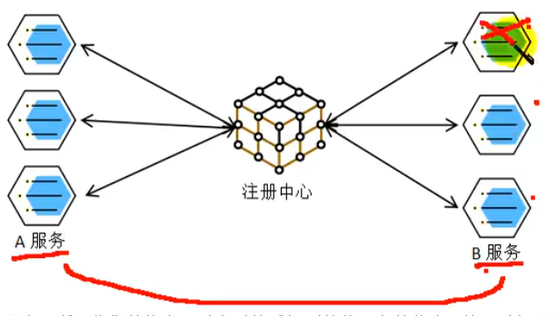


集群中每个服务的配置都从配置中心获取，而不需要单独配置【集中管理微服务的配置】

​	运行时发布，可以动态刷新配置

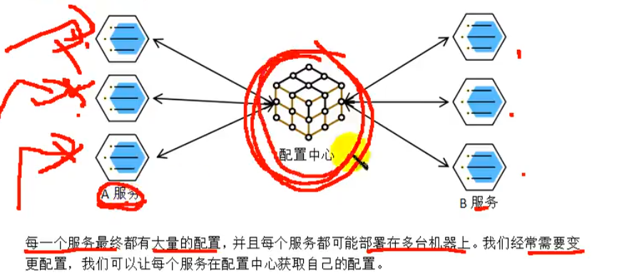


## 10、服务熔断&服务降级

请求积压：底层服务响应慢，造成上层服务响应慢，造成整个服务响应慢

服务熔断：设置服务的超时，当被调用的服务经常失败到达某个阈值，我们可以开启断路保护机制，后来的请求不再去调用这个服务。**本地直接返回默认的数据**

服务降级：在运维期间，当系统处于高峰期，系统资源紧张，我们可以让非核心业务降级运行。降级:某些服务不处理，或者简单处理【抛异常、返回NULL.调用Mock数据、调用Fallback处理逻辑】。

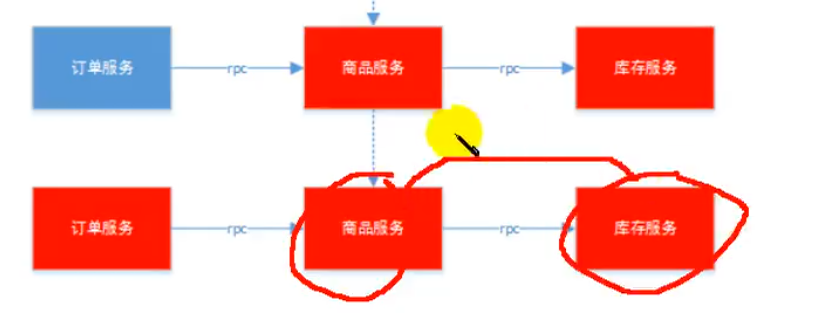


## 11、网关

使用网关的好处：统—认证，限流流控，日志统计

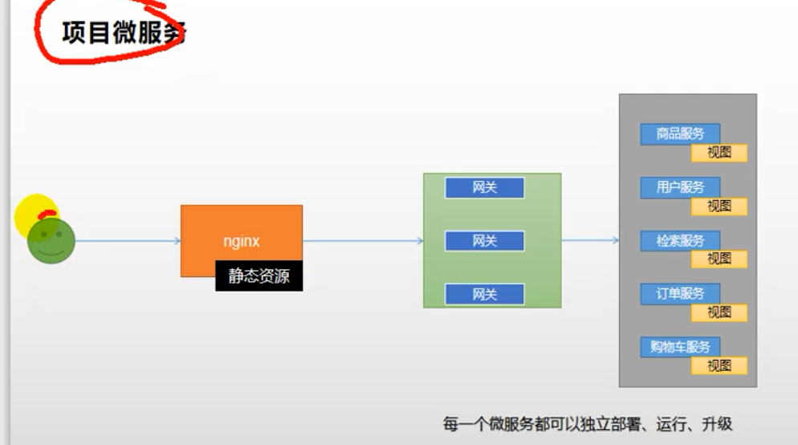

在微服务架构中，APIGateway作为整体架构的重要组件，它抽象了徼服务中都需要的公共功能，同时提供了客户端负载均衡，服务自动熔断，灰度发布，统—认证，限流流控，日志统计等丰富的功能，帮助我们解决很多API管理难题。

1、CORS跨域

2、

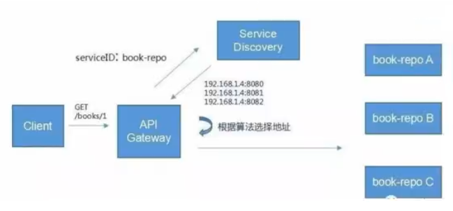


12、项目架构图

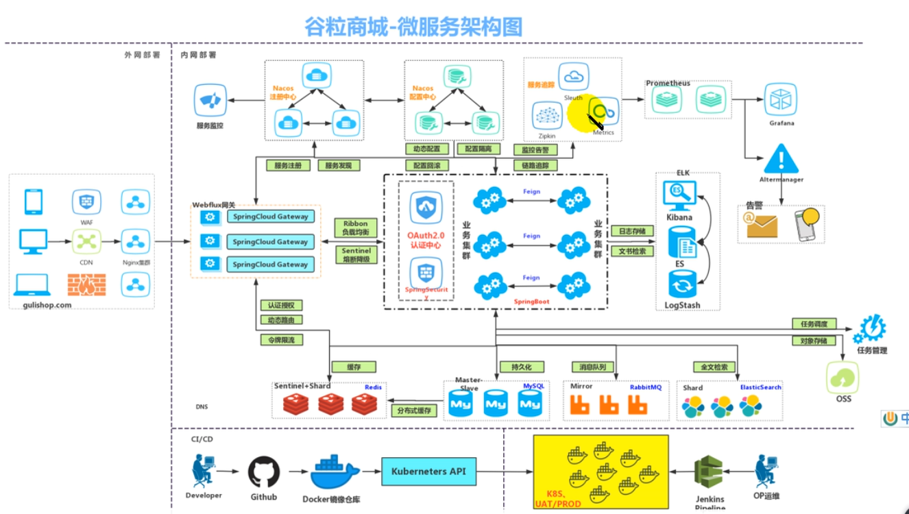


admin-vue：后台管理的前端

shop-vue：web的前端

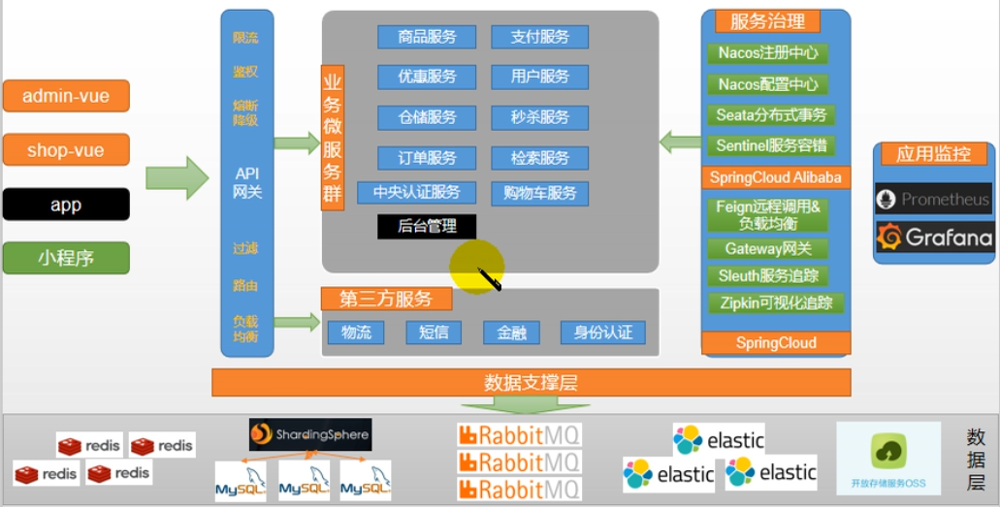

## 12、Nginx

```
1、视图需要用到的静态资源，放到nginx中
	动静分离：如果请求一张图片请求都要发送到微服务，tomcat建立连接处理请求【降低并发能力】
	静：js、图片、css（以实际文件存在的方式）
	动：服务器处理的请求
	
```


# 一、环境搭建

## 1、安装虚拟机

网站汇总：

```properties
https://app.vagrantup.com/boxes/search    Vagrant官方镜像仓库【在这里面查看各系统名字，例如vagrant init centos/7  这个centos/7就是查镜像仓库的】

中国镜像仓库：http://mirrors.ustc.edu.cn/centos-cloud/centos/6/vagrant/x86_64/images/

命令详解:https://www.jianshu.com/p/7e8f61376053【这个是vagrant的一些命令，第三步之后用到】
```

步骤：

```sh
1、下载virtualbox：https://mirror.tuna.tsinghua.edu.cn/help/virtualbox/

2、下载Vagrant【可以在virtualbox中快速创建虚拟机】：https://www.vagrantup.com/downloads.html Vagrant下载，下载windows版本
	在cmd中输入vagrant查看是否安装成功
	
3、下载centos7镜像
	方式1）vagrant init centos/7【初始化一个名为centos/7的镜像，镜像名参照vagrant镜像仓库官网】
	   	  vagrant up【下载镜像，需要在有Vagrantfile文件的目录下启动】【这种方式很慢】
	方式2）直接网页进中科大镜像网下载.box文件，http://mirrors.ustc.edu.cn/centos-cloud/centos

4、打开cmd，cd到上一步骤的下载路径下
	vagrant box add centos7 CentOS-7-x86_64-Vagrant-2004_01.VirtualBox.box
	vagrant init centos7【会在当前文件夹下创建Vagrantfile文件】

5、打开Vagrantfile文件，修改  config.vm.box = "centos7"

6、启动【在有Vagrantfile文件的目录下启动】【方式1就直接到这步了】

7、可以在当前目录下vagrant ssh【直接连入虚拟机，不需要输入密码】
```

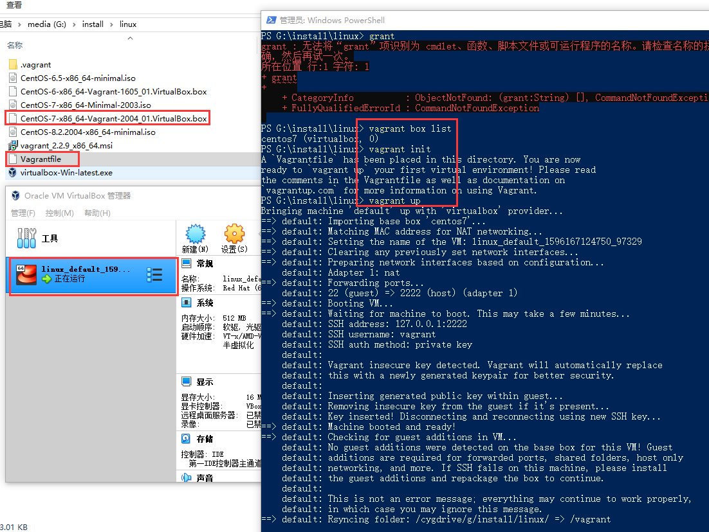


## 2、配置虚拟网络

默认配置：

​	默认是NAT模式下的端口转发，例如访问本机127.0.0.1:3333 会转发到192.168.56.10:3306的mysql，但是我们需要直接访问192.168.56.10:3306的方式访问mysql，所以需要配置网络环境

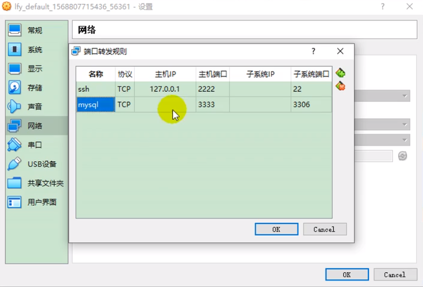


```sh
1、cmd ipconfig 查看ipv4地址-->以太网适配器 
	VirtualBox Host-Only Network: 192.168.56.1
	
2、打开Vagrantfile文件下
	找到ip设置--》config.vm.network "private_network", ip: "192.168.33.10"
	修改为：192.168.56.10

3、重启虚拟机vagrant reload【在Vagrantfile文件目录下使用该命令】

4、vagrant ssh连入虚拟机

5、不知道还要不要新建网卡2，仅主机网络
```

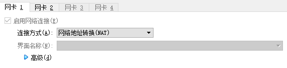

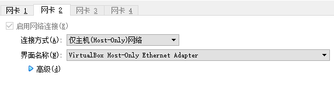

## 3、Xshell连接虚拟机

```sh
1、vagrant ssh连入虚拟机【在Vagrantfile文件目录下使用该命令】
    
2、切换su root，密码vagrant

3、修改允许密码连接
	vi /etc/ssh/sshd_config
	修改PasswordAuthentication yes

4、service sshd restart【不需要了reboot 重启虚拟机】

5、xshell连接，192.168.56.10 -- root + vagrant
```


## 4、安装docker

简介：

​	虚拟容器技术，docker基于镜像。秒级启动各种**容器**。**每一种容器都是一个完整的运行环境**，**容器之间互相隔离**


1、安装docker

2、安装**镜像**

3、启动**容器**【根据镜像启动容器并设置相关参数，例如：端口映射】

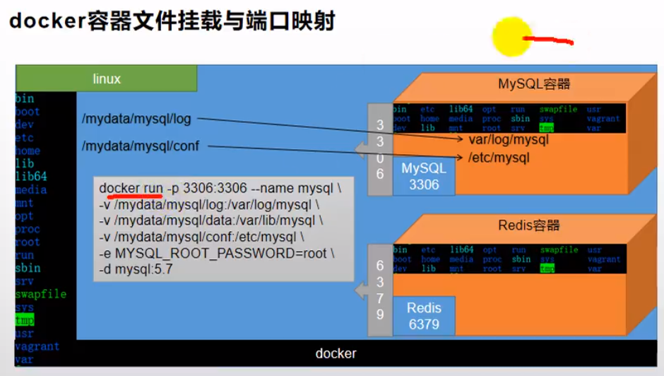

网站汇总：

```properties
docker安装官方文档：https://www.docker.com->Resources->Docs->Get Docker->Docker Engine-Community ->Linux ->centOS 
也可以直接访问：https://docs.docker.com/engine/install/centos/ 

软件镜像：hub.docker.com
```

步骤：

```properties
1、卸载旧版本【uninstall old versions】
	yum remove docker \
                  docker-client \
                  docker-client-latest \
                  docker-common \
                  docker-latest \
                  docker-latest-logrotate \
                  docker-logrotate \
                  docker-engine
                  
2、安装相关依赖
sudo yum install -y yum-utils

3、设置镜像地址
	sudo yum-config-manager --add-repo https://download.docker.com/linux/centos/docker-ce.repo
推荐使用阿里镜像：
	sudo yum-config-manager --add-repo http://mirrors.aliyun.com/docker-ce/linux/centos/docker-ce.repo【这个镜像和后面提到的镜像加速不同，这里指的是下载docker本身的镜像地址】
	
4、安装docker【INSTALL DOCKER ENGINE】
sudo yum install docker-ce docker-ce-cli containerd.io

5、启动docker
sudo systemctl start docker
虚拟机开机启动：sudo systemctl enable docker

6、测试
docker images -a
```

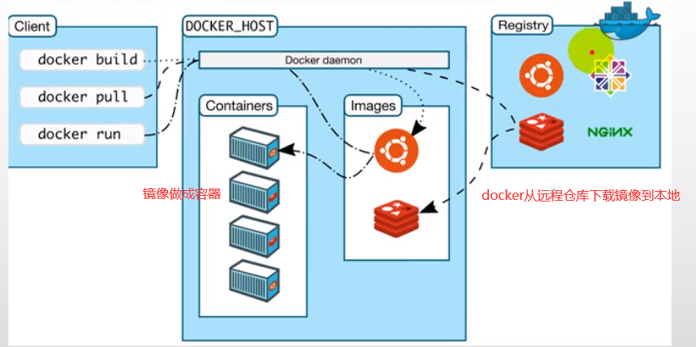

## 5、docker【相关命令&操作】

```sh
1、查看已启动镜像：docker images
2、查看所有镜像：docker images -a
3、启动docker：sudo systemctl start docker
4、虚拟机开机启动：sudo systemctl enable docker
5、docker启动后启动容器：sudo docker update mysql --restart=always
6、重启容器，例如mysql：
	查看容器的id或name：docker ps -a
	重启restart id或name【重启就代表启动了】：
		docker restart 1b4671904bfa
		docker restart mysql
7、终止容器：docker stop redis
8、删除容器：docker rm redis
9、进入容器的运行时环境
进入mysql：docker exec -it mysql /bin/bash
进入redis：docker exec -it redis redis-cli
whereis mysql
10、退出容器运行时环境：exit
11、虚拟机开机自动启动mysql：sudo docker update mysql --restart=always

```


## 6、docker配置镜像下载加速

1、默认从hub.docker下载软件镜像【很慢】

2、修改成aliyun的镜像加速器

```sh
1、先去阿里云设置： https://cr.console.aliyun.com/cn-hangzhou/instances/mirrors 
	参考文档：https://juejin.im/post/6844904181497757704 
	
2、执行：sudo mkdir -p /etc/docker

3、执行【获取第一步配置的镜像加速器网址】
sudo tee /etc/docker/daemon.json <<-'EOF'
{
  "registry-mirrors": ["https://7zi5cb9i.mirror.aliyuncs.com"]
}
EOF
3、重启：sudo systemctl daemon-reload
4、重启：sudo systemctl restart docker
```


## 7、安装mysql镜像

```sh
1、去hub.docker.com查看版本，然后:加上版本，否则会下载最新版本

2、sudo docker pull mysql:5.7

3、启动容器并设置相关参数
docker run -p 3306:3306 --name mysql \
-v /mydata/mysql/log:/var/log/mysql \
-v /mydata/mysql/data:/var/ib/mysql \
-v /mydata/mysql/conf:/etc/mysql \
-e MYSQL_ROOT_PASSWORD=root \
-d mysql:5.7

    参数说明
    -p 3306:3306:将容器的3306端口映射到主机的3306端口
    -v /mydata/mysql/conf:/etc/mysql:将配置文件夹挂载到主机【linux文件与容器内部的文件挂载】
    -v /mydata/mysql/log:/var/log/mysgl:将日志文件夹挂载到主机【不用进入到容器内部就能查看日志】
    -v /mydata/mysql/data:/var/ib/mysql/:将配置文件夹挂载到主机【相当于快捷方式】
    -e MYSQL_ROOT_PASSWORD=root: 初始化root用户的密码
   	-d 后台启动

4、远程无法连接mysql：密码没有修改
【https://blog.csdn.net/scarecrow__/article/details/81556845】
	1）docker exec -it mysql /bin/bash进入mysql
	2）连入mysql：mysql -uroot -proot
	3）查询：select host,user,plugin,authentication_string from mysql.user;
		找到user为root的两列，
			%：表示不限制ip的配置
			localhost：表示本地连接的配置
			plugin数据非mysql_native_password表示要修改密码
		执行以下语句：
		ALTER USER 'root'@'%' IDENTIFIED WITH mysql_native_password BY 'root';

5、远程无法连接mysql：修改root用户远程访问权限
	“password”填写密码 root
grant all privileges on *.* to root@"%" identified by "password" with grant option;

6、在linux的 mydata/mysql/conf/my.cnf配置文件下加入下【这一步的作用不知道是干啥~】
[client]
default-character-set=utf8

[mysql]
default-character-set=utf8
[mysqld]
init_connect='SET collation_connection = utf8_unicode_ci'
init_connect='SET NAMES utf8'
character-set-server=utf8
collation-server=utf8_unicode_ci
skip-character-set-client-handshake
skip-name-resolve

7、重启：docker restart mysql

8、虚拟机开机自动启动mysql容器
	sudo docker update mysql --restart=always
```


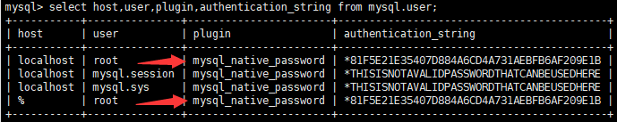


## 8、安装redis

```sh
1、去hub.docker.com查看版本，然后:加上版本，否则会下载最新版本

2、docker pull redis【拉取最新镜像】

3、新建redis配置文件夹：
	mkdir -p /mydata/redis/conf

4、新建redis配置文件：
	touch /mydata/redis/conf/redis.conf
	
5、开启持久化
vim /mydata/redis/conf/redis.conf
添加：appendonly yes

6、驱动容器，并挂载相关配置、端口
docker run -p 6379:6379 --name redis \
-v/mydata/redis/data:/data \
-v/mydata/redis/conf/redis.conf:/etc/redis/redis.conf \
-d redis redis-server /etc/redis/redis.conf

7、终止容器：docker stop redis
8、删除容器：docker rm redis

9、连接：
	方式1：进入容器运行时环境连接
	docker exec -it redis /bin/bash
	redis-cli -p 6379
	方式2：默认连接name是redis的容器，默认找6379端口
	docker exec -it redis redis-cli 
	方式3：windows可视化客户端直接连接6379端口
	
10、自动启动redis：sudo docker update redis --restart=always
```


## 9、开发环境安装jdk、maven

```XML
1、配置环境变量jdk8
JAVA_HOME 	E:\java\jdk-all\jdk1.8.0_171
CLASSPATH   	%JAVA_HOME%\lib;%JAVA_HOME%\lib\tools.jar
PATH				%JAVA_HOME%\bin	%JAVA_HOME%\jre\bin

2、下载配置maven【我用的3.5.4】
​	 下载：https://maven.apache.org/download.cgi 
​	 配置： https://www.runoob.com/maven/maven-setup.html 
MAVEN_HOME	E:\java\apache\apache-maven-3.5.4
Path		;%MAVEN_HOME%\bin

3、配置maven阿里云仓库，以jdk1.8编译
<?xml version="1.0" encoding="UTF-8"?>
<settings xmlns="http://maven.apache.org/SETTINGS/1.0.0"
          xmlns:xsi="http://www.w3.org/2001/XMLSchema-instance"
          xsi:schemaLocation="http://maven.apache.org/SETTINGS/1.0.0 http://maven.apache.org/xsd/settings-1.0.0.xsd">

  <localRepository>E:\java\apache\repository</localRepository>
    <mirrors>
	<mirror>
	    <id>aliyun</id>
	    <name>aliyun Maven</name>
	    <mirrorOf>central</mirrorOf>
	    <url>http://maven.aliyun.com/nexus/content/groups/public</url>
	   <!-- <url>http://maven.oschina.net/content/groups/public</url> -->
        </mirror>
    </mirrors>
	
  <profiles>
    <profile>
      <id>jdk-1.8</id>
      <activation>
		<activeByDefault>true</activeByDefault>
        <jdk>1.8</jdk>
      </activation>
	  <properties>
	    <maven.compiler.source>1.8</maven.compiler.source>
	    <maven.compiler.target>1.8</maven.compiler.target>
	    <maven.compiler.compilerVersion>1.8</maven.compiler.compilerVersion>
      </properties>
    </profile>
  </profiles>
</settings>
```

## 10、配置IDEA

首次启动，配置IDEA全局配置

```properties
1、configure配置maven
2、配置jdk
3、plugins下载lombok、mybatisx
```


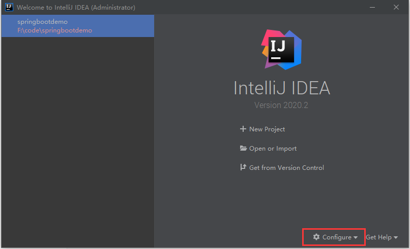

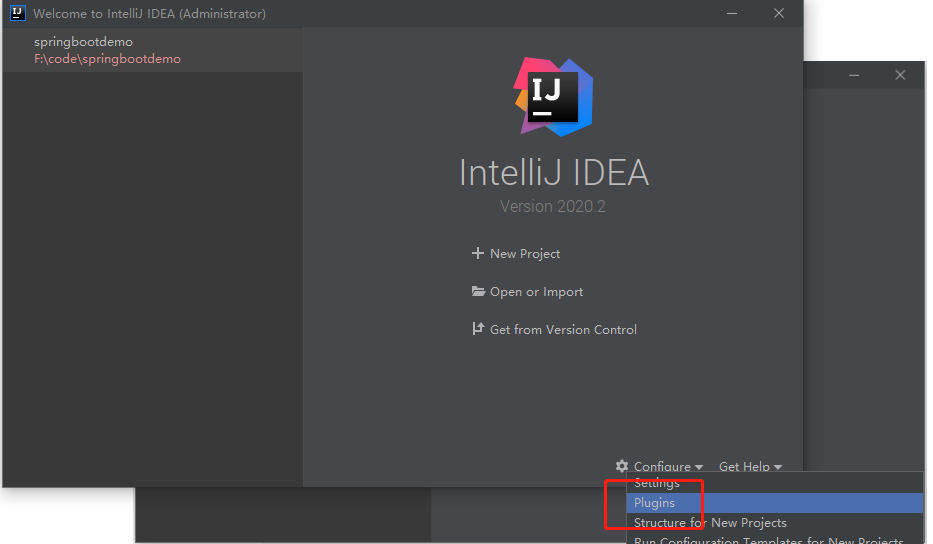

## 11、配置vscode

```
1、下载： https://code.visualstudio.com/ 

2、安装插件
```

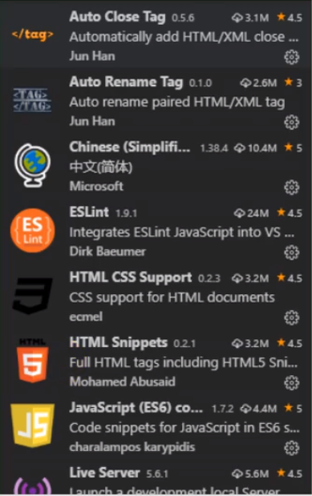


## 12、配置git

```sh
1、用户名
git config --global user.name "lemon"
2、邮箱
git config --global user.email "lemon_wan@aliyun.com"
3、配置ssh登录，不需要账号密码
ssh-keygen -t rsa -C "lemon_wan@aliyun.com"【三次回车】
4、查看
cat ~/.ssh/id_rsa.pub【C:\Users\Administrator\.ssh\id_rsa.pub】

5、复制内容：


6、复制内容，打开github添加ssh-key
settings->SSH and GPK keys
New ssh key

ssh-rsa AAAAB3NzaC1yc2EAAAADAQABAAABAQC4TBUaL8w4yIq+NHAhnes5dctUemWr9i3Q4gbg8JvBA0dKxoZNeXf1Moi8rEU8uoxpISG5x47UCJ2cKop3Y1Zt7jpFk/qYjEp69QUaIXAlwDRtmcevTJ2bPnxofPT/oUDS99S/4ZZ10mBrjT4IttRU0E4gQddYZbRtd/X6vRIOY4fslzUoZhulNfXVeC5f66fPCdTHtMg7lTByrMWDFFr1pJMDQqOqPe9VVweKuP5wnp/JlEcg6zQT0K9bQGTtGrDsS9xKU8jxn9v+1mwysExZ0s9RdOtaqCoM5wjOuIEwqK6gMss46Su7pu7AG+Xmv7u0gL5T5D6hZlnJgR9m28JV lemon_wan@aliyun.com

7、测试
ssh -T git@github.com
```


# 二、项目搭建

## 1、IDEA创建Git项目，父项目


注意IDEA与maven版本的问题： https://blog.csdn.net/weixin_39723544/article/details/101066414 

idea2018用不了maven3.6，换成3.4

```
1、创建git项目
	1）new->Project from Version Controll
	2）输入URL
	
2、pom文件
	主要就是下面两个，modules里面配置各模块
	<packaging>pom</packaging>
    <modules>
        <module>gulimall-coupon</module>
        <module>gulimall-member</module>
        <module>gulimall-order</module>
        <module>gulimall-product</module>
        <module>gulimall-ware</module>
    </modules>
    
3、.gitignore文件：忽视要提交的文件【在gulimall统一配置】
```

创建git项目：

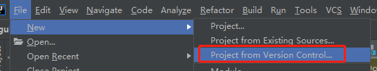

输入

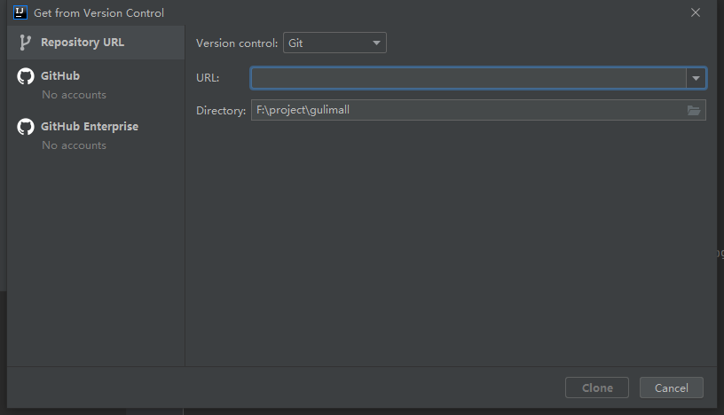

pom文件：

```xml
<?xml version="1.0" encoding="UTF-8"?>
<project xmlns="http://maven.apache.org/POM/4.0.0" xmlns:xsi="http://www.w3.org/2001/XMLSchema-instance"
         xsi:schemaLocation="http://maven.apache.org/POM/4.0.0 https://maven.apache.org/xsd/maven-4.0.0.xsd">
    <modelVersion>4.0.0</modelVersion>
    <groupId>com.atguigu.gulimall</groupId>
    <artifactId>gulimall</artifactId>
    <version>0.0.1-SNAPSHOT</version>
    <name>gulimall</name>
    <description>聚合服务</description>
    <packaging>pom</packaging>

    <modules>
        <module>gulimall-coupon</module>
        <module>gulimall-member</module>
        <module>gulimall-order</module>
        <module>gulimall-product</module>
        <module>gulimall-ware</module>
    </modules>
</project>

```

.gitignore：git忽视的文件，不提交

```properties
target/
pom.xml.tag
pom.xml.releaseBackup
pom.xml.versionsBackup
pom.xml.next
release.properties
dependency-reduced-pom.xml
buildNumber.properties
.mvn/timing.properties
.mvn/wrapper/maven-wrapper.jar

**/mvnw
**/mvnw.cmd
**/.mvn
**/target/
.idea
**/.gitignore
HELP.md
```


## 2、创建各微服务

```
1、创建5个微服务
商品服务(product)：gulimall_pms
仓储服务(ware)：gulimall_wms
订单服务(order)：gulimall_oms
优惠券服务(coupon)：gulimall_sms
会员服务(member)：gulimall_ums

2、选中gulimall创建module
	com.atguigu.gulimall：group
	gulimall-product：Artifact
	Description：商品服务
	package：改一下，去掉gulimall前缀，如下图
	添加两个组件，springweb，openFeign
	

```


填写规范：

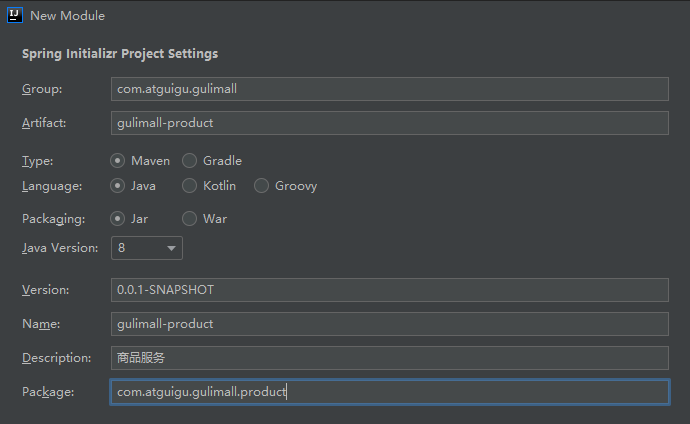

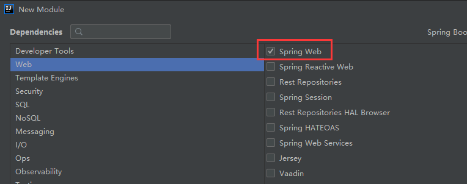


## 3、push到gitee


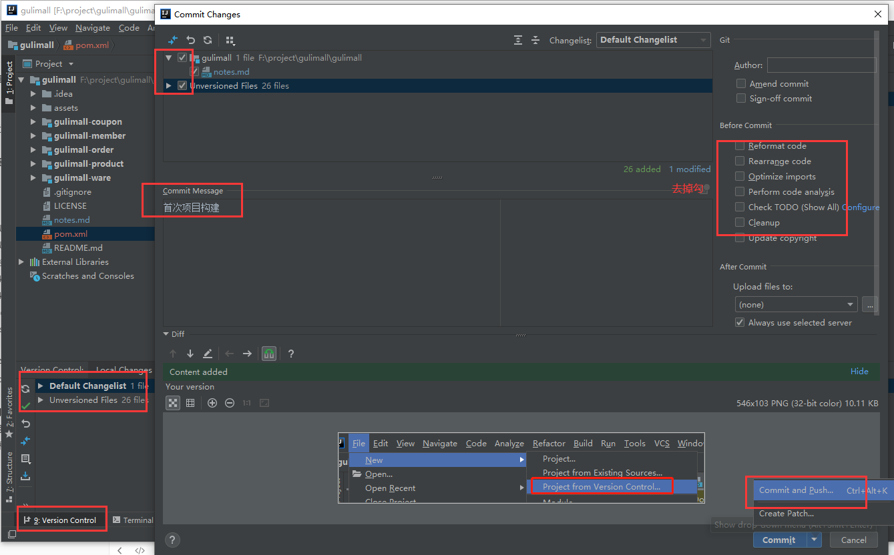


## 4、powerdisigner

维护数据库表间关系，并且可以生成相应的sql语句

```properties
1、创建数据库、表、列
2、选中数据库->database->generate Database->preview
3、这边已经把所有表的创建语句放在了代码->sql下面，每个微服务有自己对应的数据库
```

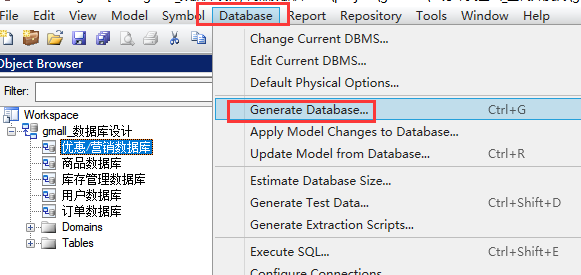

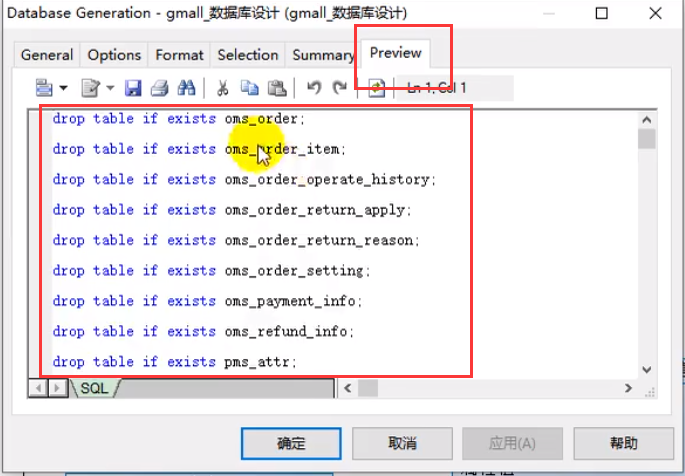


## 5、创建数据库

```properties
1、连接数据库192.168.56.10

2、创建数据库
	utf8mb4	【都选择这个，兼容utf8和解决一些乱码问题】
	utf8mb4_general_ci
	
	gulimall_pms【商品服务】
	gulimall_oms【订单服务】
	gulimall_sms【营销系统】
	gulimall_ums【用户系统】
	gulimall_wms【库存系统】
```


## 6、人人开源项目拉取+配置

后台管理系统：renren-fast

后台管理系统前端：renren-fast-vue

逆向生成项目：renren-generator

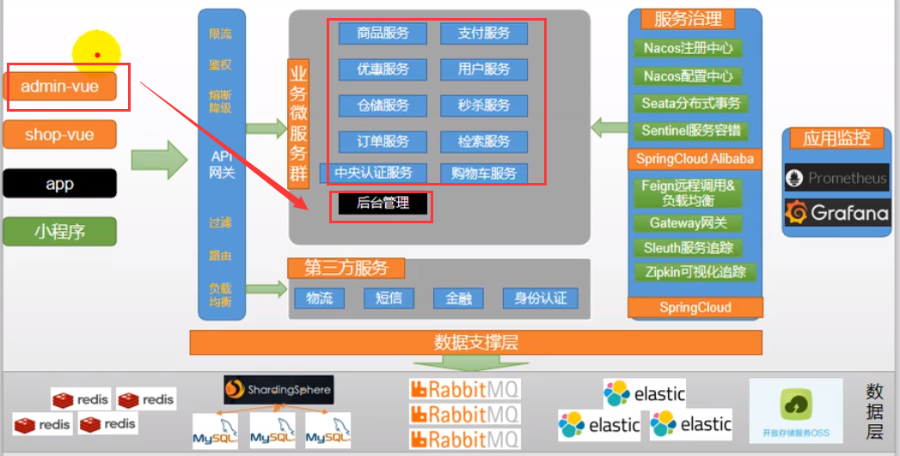

### renren-fast

```yml
1、 在码云上搜索：人人开源

2、克隆后台代码+后台前端代码
git clone https://gitee.com/renrenio/renren-fast-vue.git
git clone https://gitee.com/renrenio/renren-fast.git

3、将renren-fast项目拷贝到gulimall项目文件夹中，在pom加入子模块
	<modules>
		<module>renren-fast</module>
	</modules>

4、创建数据库，建表语句在renren-fast->db->mysql.sql中
	创建数据库gulimall_admin，根据建表语句创建表

5、修改renren-fast的配置文件 
application-dev.yml
	driver-class-name: com.mysql.cj.jdbc.Driver
    url: jdbc:mysql://192.168.56.10:3306/gulimall_admin?useUnicode=true&characterEncoding=UTF-8&serverTimezone=Asia/Shanghai
    username: root
    password: root
    然后就可以访问：http://localhost:8080/renren-fast/
```

### renren-fast-vue

```sh
1、下载安装node.js【新版需要python环境】 
	https://nodejs.org/en/
	https://nodejs.org/dist/【所有版本的镜像】
	检查：cmd-》 node -v
		
2、配置npm使用淘宝镜像【如同java的maven】，直接cmd 输入下面这句话 
	npm config set registry http://registry.npm.taobao.org/
	npm config get registry
	
3、安装cnpm
 	npm install cnpm -g --registry=https://registry.npm.taobao.org
 	cnpm install -g node-gyp【后来是安装了这个解决了】
 	
 	下面三句先暂时不装【后面重新搭环境的时候测试下到底哪些是需要的】
 	--cnpm install --save-dev gulp-sass【我装了，但是不知道需不需要装】
 	--cnpm install node-sass --save【这个要装，但是4里面也有这个，所以暂时不知道是不是重复】
 		--npm rebuild node-sass【报错就输入这句】
 		
4、安装python：
	先不用方法1【后面重新搭环境的时候测试下到底哪些是需要的】
	方法一：【后面我是用的方法二解决的】
	https://www.onlinedown.net/soft/1165640.htm【华军软件站，2.7版本】
	
	方法二：【推荐使用这个，但是不知道需不需要配置python的环境变量，我的python是手动安装的】
	npm uninstall node-sass
	npm i node-sass --sass_binary_site=https://npm.taobao.org/mirrors/node-sass/【后面是安装了这个+node-gyp解决的】
	
	下面一句先暂时不装【后面重新搭环境的时候测试下到底哪些是需要的】
	--npm install --global --production windows-build-tools：安装python环境
	
	配置环境变量：Path E:\Program Files\Python27\
	检查：cmd -》 python

	
6、前端项目第一次运行：打开visual studio code【管理员启动】，在终端上输入
	npm install【会根据package.json中的配置下载所需的依赖】
	
	如果cnpm install用不了，用管理员打开power shell，执行【下面前3条是针对cnpm不能使用的情况】
	1、set-ExecutionPolicy RemoteSigne + 回车
	2、A + 回车
	3、删除node_modules文件夹
	4、cnpm install
	
7、运行：npm run dev
   或者cnpm run dev
```

解决bug博客：

```properties
bug：https://blog.csdn.net/qq_42886417/article/details/103123659
	https://www.cnblogs.com/Wilson6/p/12055389.html
   	http://quanzhan.applemei.com/webStack/TVRnMk13PT0=
最后是看这个解决的：https://www.jianshu.com/p/2823b2f04b82
```


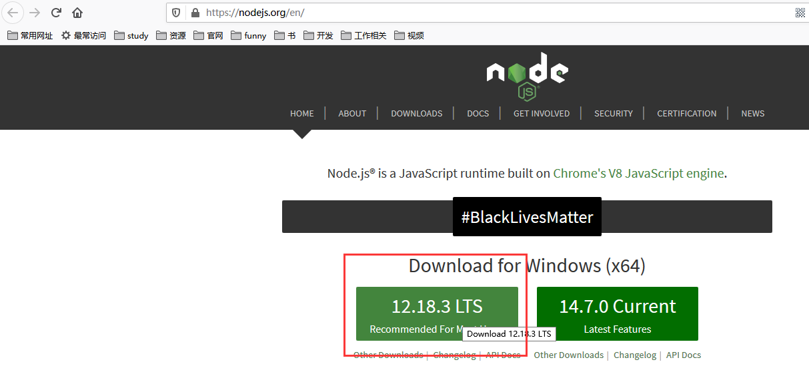

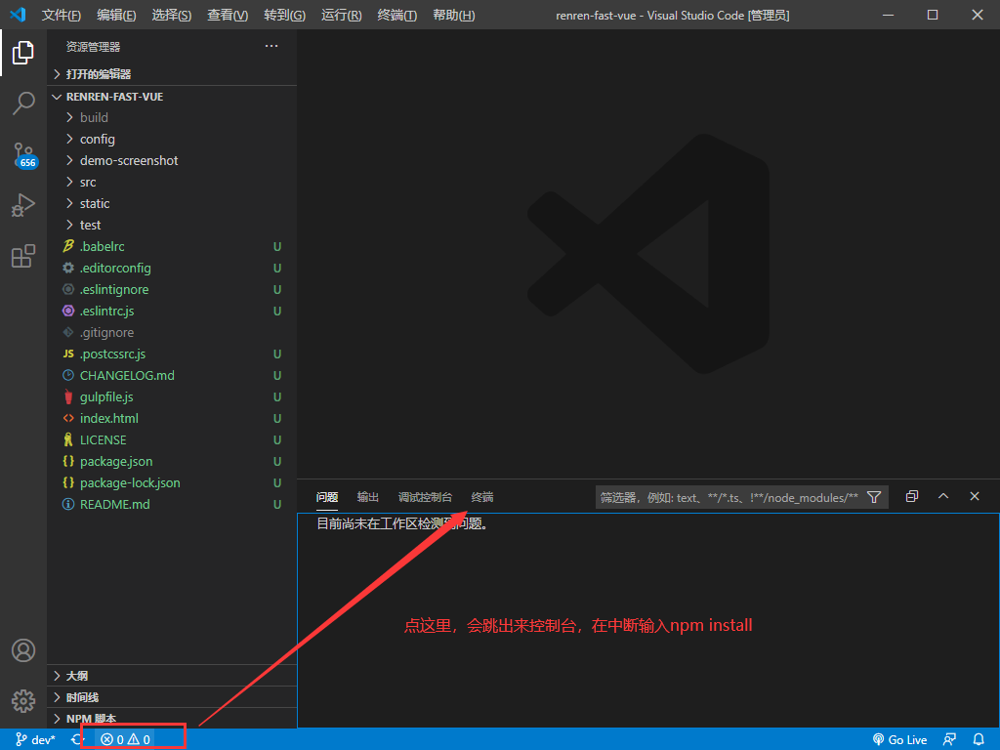

### renren-generator

逆向工程【重复5遍】

​	修改工程shiro依赖为SpringSecurity

​	删除部分暂时不需要的业务

```properties
1、 在码云上搜索：人人开源

2、克隆
git clone https://gitee.com/renrenio/renren-generator.git


3、导入项目逆向工程
	<modules>
		<module>renren-generator</module>
	</modules>

4、修改renren-generator的配置文件【要为哪个模块逆向生成，就修改成哪个库】【重复5遍】
application.yml
# mysql
spring:
  datasource:
    type: com.alibaba.druid.pool.DruidDataSource
    #MySQL配置
    driverClassName: com.mysql.cj.jdbc.Driver
    url: jdbc:mysql://192.168.56.10:3306/gulimall_pms?useUnicode=true&characterEncoding=UTF-8&useSSL=false&serverTimezone=Asia/Shanghai
    username: root
    password: root
	
5、修改generator.properties【重复5遍】
#代码生成器，配置信息
mainPath=com.atguigu
#包名
package=com.atguigu.gulimall
#模块名
moduleName=product
#作者
author=wanzenghui
#Email
email=lemon_wan@aliyun.com
#表前缀(类名不会包含表前缀)
tablePrefix=pms_

6、修改generator生成模板
	注释掉renren-generator -> resources -> template以下语句:【不使用shiro】
	// import org.apache.shiro.authz.annotation.RequiresPermissions;
	// @RequiresPermissions("${moduleName}:${pathName}:list")


7、运行，访问localhost，选中所有表，点击生成代码
	每一个模块都这样修改运行一次
	
8、下载解压，将main文件整个拷贝到各模块中【重复5遍】

9、非必须：删掉各模块中controller中的shiro注解【如果在generator项目的模板中没有删除的话就需要做这一步骤】
ctrl + shift + R批量修改【使用SpringSecurity】
import org.apache.shiro.authz.annotation.RequiresPermissions;
    @RequiresPermissions("product:attrattrgrouprelation:list")
    @RequiresPermissions("product:attrattrgrouprelation:info")
    @RequiresPermissions("product:attrattrgrouprelation:save")
    @RequiresPermissions("product:attrattrgrouprelation:update")
    @RequiresPermissions("product:attrattrgrouprelation:delete")
    @RequiresPermissions("product:attr:list")
    @RequiresPermissions("product:attr:info")
    @RequiresPermissions("product:attr:save")
    @RequiresPermissions("product:attr:update")
    @RequiresPermissions("product:attr:delete") 
	...
```

## 7、创建gulimall-common模块

```xml
1、创建gulimall-common  manven模块
	该模块意图引用公共包、组件解决利用generator生成的controller、service、mapper、Entity各层代码内部的依赖错误问题，例如shiro【改成springscurity】、lombok、mybatisplus【BaseMapper】、common.utils【在renren-fast中有】，把这些依赖的类放到common模块中
	1)导入mybatis-plus依赖
        <dependency>
            <groupId>com.baomidou</groupId>
            <artifactId>mybatis-plus-boot-starter</artifactId>
            <version>3.3.2</version>
        </dependency>
	2）导入lombok
        <dependency>
            <groupId>org.projectlombok</groupId>
            <artifactId>lombok</artifactId>
            <version>1.18.12</version>
            <scope>provided</scope>
        </dependency>
	3）创建com.atguigu.common.utils、exception、xss包
   把PageUtils、Query、Constant、SQLFilter、HTMLFilter、RRException、R从renren-fast中拷贝过来
   引入依赖【就看缺什么依赖，就拷贝什么类】
        <!--mybatisplus-->
        <dependency>
            <groupId>com.baomidou</groupId>
            <artifactId>mybatis-plus-boot-starter</artifactId>
            <version>3.3.2</version>
        </dependency>

        <!--lombok-->
        <dependency>
            <groupId>org.projectlombok</groupId>
            <artifactId>lombok</artifactId>
            <version>1.18.12</version>
        </dependency>

        <!--Query用到StringUtils-->
        <dependency>
            <groupId>commons-lang</groupId>
            <artifactId>commons-lang</artifactId>
            <version>2.6</version>
        </dependency>

        <!--R中用到的-->
        <dependency>
            <groupId>org.apache.httpcomponents</groupId>
            <artifactId>httpcore</artifactId>
            <version>4.4.13</version>
        </dependency>
        
        <!--servlet-->
        <dependency>
            <groupId>javax.servlet</groupId>
            <artifactId>servlet-api</artifactId>
            <version>2.5</version>
            <scope>provided</scope>
        </dependency>

2、在各微服务模块中添加gulimall-common依赖
【coupon、member、order、product、ware】中添加以下依赖
    <dependency>
    	<groupId>com.atguigu.gulimall</groupId>
   	 	<artifactId>gulimall-common</artifactId>
   	 	<version>0.0.1-SNAPSHOT</version>
    </dependency>
    
3、进入各模块每一个报错的类，把依赖解决。设置自动导入依赖
	setting -> Editor -> general -> Auto Import -> Add + Optimize
	
4、使用renren-generator逆向生成->应该在common模块创建完之后再使用逆向生成

```


gulimall-common的pom

```xml
<?xml version="1.0" encoding="UTF-8"?>
<project xmlns="http://maven.apache.org/POM/4.0.0"
         xmlns:xsi="http://www.w3.org/2001/XMLSchema-instance"
         xsi:schemaLocation="http://maven.apache.org/POM/4.0.0 http://maven.apache.org/xsd/maven-4.0.0.xsd">
    <parent>
        <artifactId>gulimall</artifactId>
        <groupId>com.atguigu.gulimall</groupId>
        <version>0.0.1-SNAPSHOT</version>
    </parent>
    <modelVersion>4.0.0</modelVersion>

    <artifactId>gulimall-common</artifactId>
    <description>每一个微服务公共依赖，bean，工具类等</description>

    <dependencies>
        <!--mybatisplus-->
        <dependency>
            <groupId>com.baomidou</groupId>
            <artifactId>mybatis-plus-boot-starter</artifactId>
            <version>3.3.2</version>
        </dependency>

        <!--lombok-->
        <dependency>
            <groupId>org.projectlombok</groupId>
            <artifactId>lombok</artifactId>
            <version>1.18.12</version>
        </dependency>

        <!--Query用到StringUtils-->
        <dependency>
            <groupId>commons-lang</groupId>
            <artifactId>commons-lang</artifactId>
            <version>2.6</version>
        </dependency>

        <!--R中用到的-->
        <dependency>
            <groupId>org.apache.httpcomponents</groupId>
            <artifactId>httpcore</artifactId>
            <version>4.4.13</version>
        </dependency>

        <!--mysql驱动-->
        <dependency>
            <groupId>mysql</groupId>
            <artifactId>mysql-connector-java</artifactId>
            <version>8.0.17</version>
        </dependency>

        <!--服务注册发现-->
        <dependency>
            <groupId>com.alibaba.cloud</groupId>
            <artifactId>spring-cloud-starter-alibaba-nacos-discovery</artifactId>
        </dependency>

        <!--配置管理-->
        <dependency>
            <groupId>com.alibaba.cloud</groupId>
            <artifactId>spring-cloud-starter-alibaba-nacos-config</artifactId>
        </dependency>

        <!--Valid-->
        <dependency>
            <groupId>org.springframework.boot</groupId>
            <artifactId>spring-boot-starter-validation</artifactId>
            <version>2.3.2.RELEASE</version>
        </dependency>

        <!--自定义注解-->
        <dependency>
            <groupId>javax.validation</groupId>
            <artifactId>validation-api</artifactId>
            <version>2.0.1.Final</version>
        </dependency>


    </dependencies>

    <dependencyManagement>
        <dependencies>
            <dependency>
                <groupId>com.alibaba.cloud</groupId>
                <artifactId>spring-cloud-alibaba-dependencies</artifactId>
                <version>2.2.0.RELEASE</version>
                <type>pom</type>
                <scope>import</scope>
            </dependency>
        </dependencies>
    </dependencyManagement>
</project>
```

需要拷贝过到common中的类：

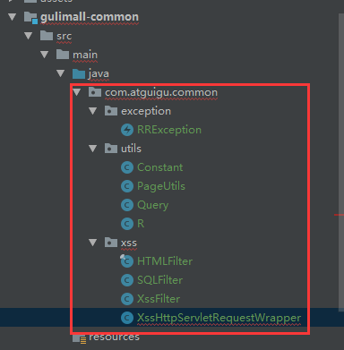


## 8、mybatis-plus配置

```properties
1、依赖 mybatis-plus和mysql
2、spring管理数据源
3、mybatis-plus配置
	1）扫描注解：@MapperScan("com.atguigu.gulimall.product.dao")
		【如果dao配置了@Repository可以不配】
	2）sql.xml文件的映射路径
	3）主键自增

```

版本对应：

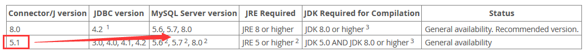

主键：

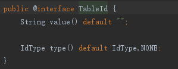

```java
1、整合mybatis-plus
	1)在common模块导入依赖，前面做了
		<!--mybatisplus-->
        <dependency>
            <groupId>com.baomidou</groupId>
            <artifactId>mybatis-plus-boot-starter</artifactId>
            <version>3.3.2</version>
        </dependency>
        
	2)代码层面整合，参照文档：https://mp.baomidou.com/guide/config.html
		1、配置数据源
			1)导入数据库驱动依赖【要跟数据库版本一致，我的是5.7.31】
  				官方文档，版本对应：https://dev.mysql.com/doc/connector-j/8.0/en/connector-j-versions.html
                在common模块导入依赖：
                <dependency>
                    <groupId>mysql</groupId>
                    <artifactId>mysql-connector-java</artifactId>
                    <version>8.0.17</version>
                </dependency>
			2)在product中创建application.yml
                spring:
                  datasource:
                    username: root
                    password: root
                    url: jdbc:mysql://192.168.56.10:3306/gulimall_pms?useUnicode=true&characterEncoding=UTF-8&useSSL=false&serverTimezone=Asia/Shanghai
                    driver-class-name: com.mysql.cj.jdbc.Driver

		2、配置mybatis-plus
			1)在product模块的Application类上@MapperScan("com.atguigu.gulimall.product.dao")
			
			2)告诉mybatis-plus，sql映射文件xml的位置，
				在yml中配置，classpath*表示不止扫描自己的类路径，还扫描依赖的jar包的类路径
				mybatis-plus:
  					mapper-locations: classpath:/mapper/**/*.xml
  					
			3)设置主键的类型是自增的，默认是NONE，不是自增
				mybatis-plus:
                  mapper-locations: classpath:/mapper/**/*.xml
                  global-config:
                    db-config:
                      id-type: auto


```


## 9、修改各模块配置+测试运行【windows端口占用】

```java
1、修改各微服务端口，这样的好处是，集群直接7001、7002、7003
server:
	port: 7000
        
  【coupon：7000
	member：8000
	order：9000
	product：10000
	ware：11000】

2、启动所有服务
启动时10000端口被百度云占用
	netstat -ano：查出端口对应的进程ID=》PID，打开控制台关闭
	netstat -aon|findstr "13048找到对应的进程，在任务管理器里面关闭进程

3、测试接口
    例：localhost:8080/coupon/coupon/list

4、测试持久层
配置好mybatis-plus后可以开始测试
@RunWith(SpringRunner.class)
@SpringBootTest
class GulimallProductApplicationTests {

    @Autowired
    BrandService brandService;
    
    @Test
    void contextLoads() {
        BrandEntity entity = new BrandEntity();
        entity.setName("华为");
        boolean save = brandService.save(entity);
        System.out.println("保存成功：" + save);
    }
    // 查询条件Wrapper，brand_id = 1的，链式编程拼接多个条件
    @Test
    void queryPage() {
        //brandService.queryPage()
        List<BrandEntity> list = brandService.list(new QueryWrapper<BrandEntity>().eq("brand_id", 1L));
        list.forEach((item)->{
            System.out.println(item);
        });
    }
}

```

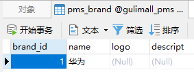

# 三、分布式环境搭建

网关、		gateway：所有前端请求经过gateway，转发到指定模块

注册中心、nacos：服务注册发现

配置中心 	nacos：

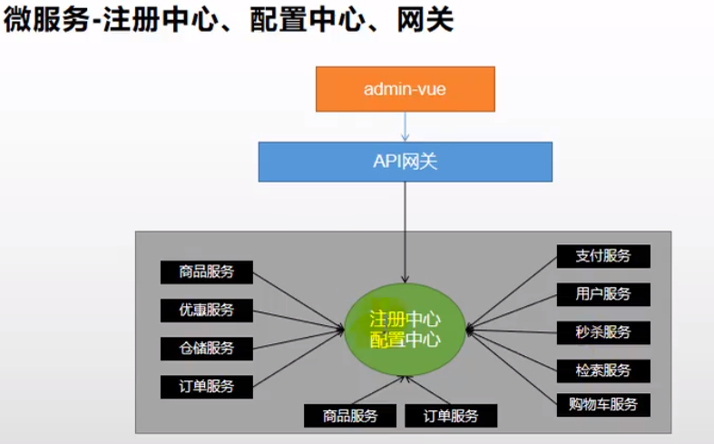

## 1、分布式技术搭配方案

Feign使用OpenFeign【开源】

Nacos代替Eureka、config

Sentinel代替Hystrix【熔断、降级、流量控制】

Gateway代替zuul【更强大】

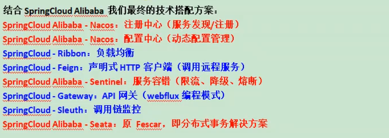

### 为什么使用SpringCloud Alibaba

文档：alibaba的github：https://github.com/alibaba/spring-cloud-alibaba/blob/master/README-zh.md

使用原生springcloud组件的弊端：

```
1、springcloud部分组件停止维护和更新，给开发带来不便
2、springcloud部分环境搭建复杂，没有完善的可视化界面，需要大量的二次开发和定制
3、springcloud配置复杂，部分配置差别难以区分和合理应用
```

SpringCloud Alibaba的优势：

```
1、成套的产品完善的可视化界面给开发运维代理极大便利
2、搭建简单，学习曲线地
3、阿里使用过的组件性能强悍、经历考验、设计合理
```


### common添加spring-cloud-alibaba依赖

```xml
1、在common模块中添加依赖
	<dependency>
        <groupId>com.alibaba.cloud</groupId>
        <artifactId>spring-cloud-alibaba-dependencies</artifactId>
        <version>2.2.0.RELEASE</version>
        <type>pom</type>
        <scope>import</scope>
    </dependency>
```

## 2、Nacos Discovery 注册中心服务端 8848

```
注册中心demo：https://github.com/alibaba/spring-cloud-alibaba/blob/master/spring-cloud-alibaba-examples/nacos-example/nacos-discovery-example/readme-zh.md
```

```
1、在common中添加依赖
 <dependency>
     <groupId>com.alibaba.cloud</groupId>
     <artifactId>spring-cloud-starter-alibaba-nacos-discovery</artifactId>
 </dependency>

2、下载注册中心，中间件
https://github.com/alibaba/nacos/releases：nacos-server-1.3.1.zip
下载完成打开startup.cmd

3、在各微服务模块添加nacos注册中心服务端的ip+port【就是运行startup.cmd的机器】，配置服务的名字【在nacos中的服务名】【不配置名字nacos服务端服务列表不会显示】
spring:
  cloud:
    nacos:
      discovery:
        server-addr: 127.0.0.1:8848
  application:
    name: gulimall-coupon
    
4、在Application类上添加注解@EnableDiscoveryClient
 @SpringBootApplication
 @EnableDiscoveryClient
 public class ProviderApplication {
 	public static void main(String[] args) {
 		SpringApplication.run(ProviderApplication.class, args);
 	}
 	@RestController
 	class EchoController {
 		@GetMapping(value = "/echo/{string}")
 		public String echo(@PathVariable String string) {
 				return string;
 		}
 	}
 }
 
5、登录127.0.0.1:8848/nacos  查看注册是否成功  账号密码：nacos/nacos
```

下载页面：

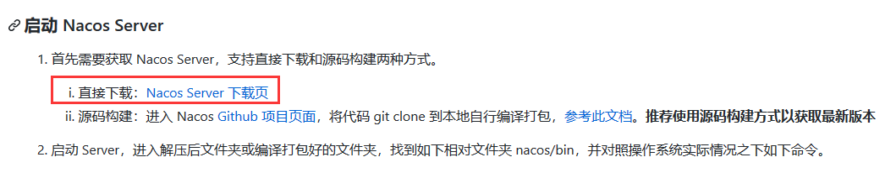

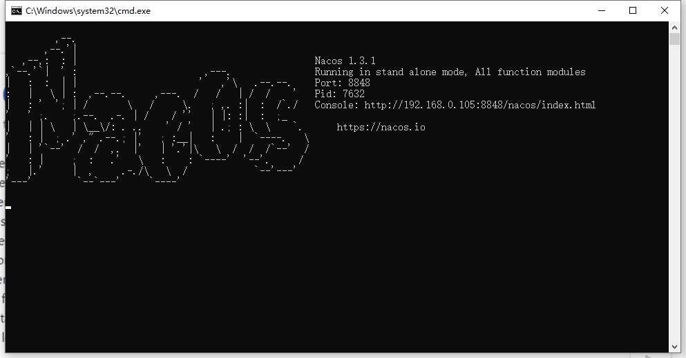

## 3、OpenFeign 声明式远程调用

声明式远程调用：Feign是一个**声明式的HTTP客户端**，目的就是让远程调用更加简单。Feign提供了HTTP请求的模板，通过编写简单的接口和插入注解，就可以定义好HTTP请求的参数、格式、地址等信息。【需要配合Nacos注册中心使用，@FeignClient定义服务名，feign从注册中心拉取服务，负载均衡找到真正的ip+port，再搭配方法上@RequestMapping指定的请求路径访问指定服务器】


**Feign整合了Ribbon (负载均衡)和Hystrix(服务熔断)，可以让我们不再需要显式地使用这两个组件。**

```
使用：
1、创建接口+@FeignClient
2、声明方法完成服务绑定，@RequestMapping
3、Application添加@EnableFeignClients(basePackages="com.atguigu.gulimall.member.feign")
```


```java
1、要调用其他服务，pom中引入OpenFeign的依赖，就可以调用其他服务了。我们开始创建微服务的时候引入了OpenFiegn，所以这里省略了引入依赖步骤

2、使用member远程调用coupon作为demo
	1）在coupon的controller中定义一个请求【正常请求就可以】
    @RestController
    @RequestMapping("coupon/coupon")
    public class CouponController {
        @Autowired
        private CouponService couponService;

        @RequestMapping("/member/list")
        public R membercoupons() {
            CouponEntity entity = new CouponEntity();
            entity.setCouponName("满100减10");
            return R.ok().put("coupons", Arrays.asList(entity));
        }
    }
    
    2）在member编写一个接口，告诉springcloud这个接口需要调用远程服务
    【远程拉取gulimall-coupon服务，发送请求/coupon/coupon/member/list】
    @FeignClient("gulimall-coupon")
    public interface CouponFeignService {

        @RequestMapping("/coupon/coupon/member/list")
        public R membercoupons();
    }
    
3、开启远程调用功能，在调用方的Application添加注解@EnableFeignClients(basePackages="com.atguigu.gulimall.member.feign")
spring一启动就会扫描所有标了@FeignClient注解的接口，而每个接口又说明了调用当前方法就是调用哪个远程服务的那个请求

4、测试，在member的controller注入CouponFeignService对象，然后远程调用就可以了
	http://localhost:8000/member/member/coupons
    @RestController
    @RequestMapping("member/member")
    public class MemberController {
        @Autowired
        private CouponFeignService couponFeignService;

        @RequestMapping("/coupons")
        public R test() {
            MemberEntity entity = new MemberEntity();
            entity.setNickname("张三");

            R membercoupons = couponFeignService.membercoupons();
            Object coupons = membercoupons.get("coupons");
            return R.ok().put("member", entity).put("coupons", coupons);
        }
	}
```


调用成功：

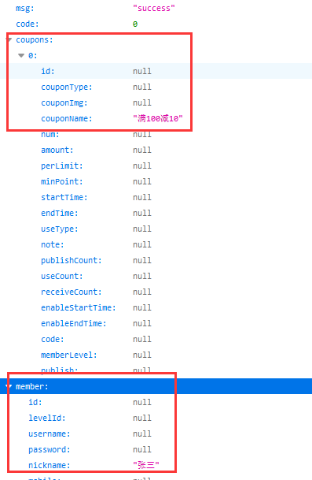


## 4、Nacos Config 配置管理

nacos config demo：https://github.com/alibaba/spring-cloud-alibaba/blob/master/spring-cloud-alibaba-examples/nacos-example/nacos-config-example/readme-zh.md

弊端：如果一个配置修改了【就是application.properties中的值修改了】，就要在代码段修改application.properties的值，然后重新打包，集群环境还要搞n个包重新发布。

预期：不用重新打包+发布，可以动态刷新配置，由nacos服务端来发布


旧版本获取application配置的方式：每次都要重新打包发布

**总结：**

```
1、命名空间：用于服务间隔离
默认：public
	1）、在Nacos页面新建命名空间，然后新增gulimall-coupon.properties属性文件并指定为新创建的命名空间，记录下该命名空间的id：37d3931b-aac3-4254-894b-3f6d8b35f5fa
	2）、在bootstrap.properties中添加属性指定命名空间的id
spring.cloud.nacos.config.namespace=37d3931b-aac3-4254-894b-3f6d8b35f5fa

2、分组：用于服务内部环境隔离
默认：DEFAULT_GROUPS
	例如区分dev，prod，test，618,1111环境
	默认：如果不指定分组会默认加载DEFAULT_GROUPS下所有配置，指定dev后会加载dev分组下所有配置
spring.application.name=gulimall-coupon
spring.cloud.nacos.config.server-addr=127.0.0.1:8848
spring.cloud.nacos.config.namespace=37d3931b-aac3-4254-894b-3f6d8b35f5fa

3、Data Id
指定单个配置文件
默认：应用名.properties

4、配置集：可以读取多个Data ID 的配置
作用：每个微服务的属性文件可以拆分成不同框架间的属性文件
```

命名空间：

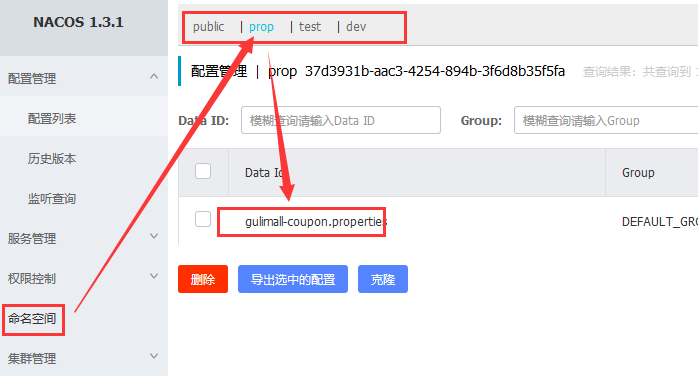

**配置：**

```
1、 使用@Value("${user.name}")获取properties中配置的属性值
如果使用Nacos配置中心，properties中的配置可以放在配置中心，动态发布动态获取
@Value("${user.name}")
private String name;

2、在common中导入依赖
 <dependency>
     <groupId>com.alibaba.cloud</groupId>
     <artifactId>spring-cloud-starter-alibaba-nacos-config</artifactId>
 </dependency>
 
3、在应用的 /src/main/resources/bootstrap.properties 配置文件中配置 Nacos Config 元数据【会比application.properties先被加载】【demo：先在product中创建一个测试demo】
bootstrap.properties配置文件的作用：
	1）指定Nacos配置中心的server-addr
	2）指定当前服务服务名，在注册中心中显示
	3）指定命名空间
	4）指定分组
	5）refresh=true开启热发布热加载
	6）默认情况，如果不指定3、4会加载public命名空间下DEFAULT_GROUP下Data Id=gulimall-coupon的文件
spring.application.name=gulimall-product
spring.cloud.nacos.config.server-addr=127.0.0.1:8848
spring.cloud.nacos.config.namespace=a152f0a8-3f55-4496-bc9a-c26df96bb2f9
spring.cloud.nacos.config.group=dev
#如果这个dev不放开的话，默认的gulimall-coupon不生效【会加载dev分组下的所有配置】

spring.cloud.nacos.config.extension-configs[0].data-id=datasource.yml
spring.cloud.nacos.config.extension-configs[0].group=dev
spring.cloud.nacos.config.extension-configs[0].refresh=true

spring.cloud.nacos.config.extension-configs[1].data-id=mybatis.yml
spring.cloud.nacos.config.extension-configs[1].group=dev
spring.cloud.nacos.config.extension-configs[1].refresh=true

spring.cloud.nacos.config.extension-configs[2].data-id=spring.yml
spring.cloud.nacos.config.extension-configs[2].group=dev
spring.cloud.nacos.config.extension-configs[2].refresh=true

4、在需要热点配置的类上加上@RefreshScope注解

注意：如果 应用名.properties 与application.properties 有同一项配置，会以 应用名.properties的属性值为主
```


Nacos配置列表新建配置截图：

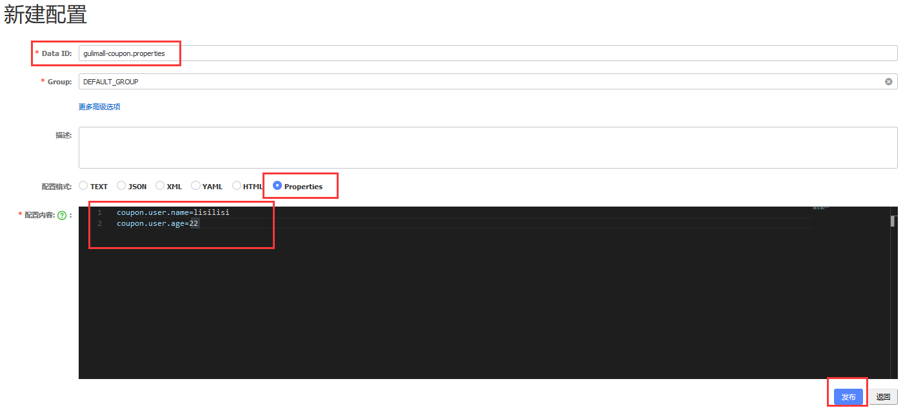

测试截图：

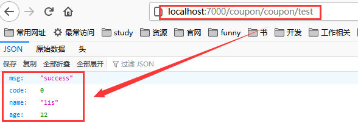


## 5、springcloud GateWay 88

简介：第二代网关，取代了zuul【Netflix开发的zuul2.0还没发布，所以springcloud自己写了网关】

作用：1、路由：将访问网关的url转换为正确的ip+port（集群），并且能感知服务的上线和熔断【否则需要在前端来改端口+ip】

​			2、过滤：鉴权、日志输出【否则需要在每个服务上都写鉴权代码】

​			3、限流

​			4、监控

​			5、跨域

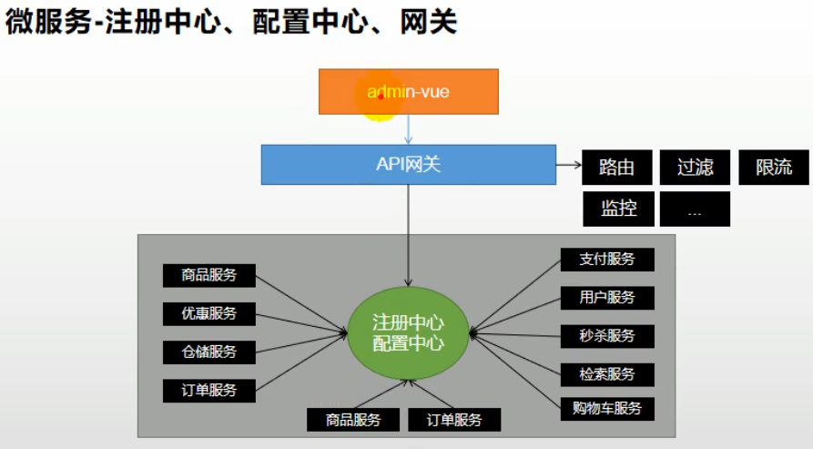

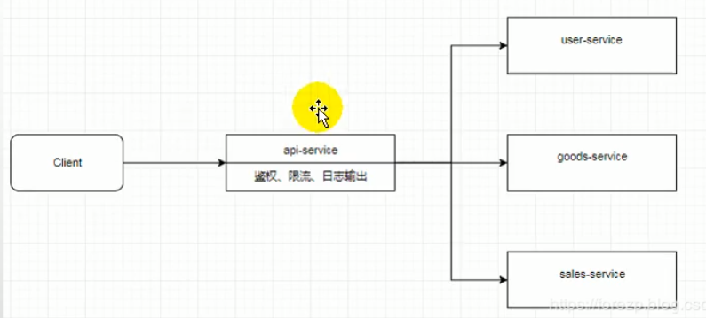

---

各网关对比：

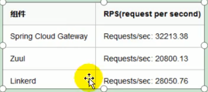

---

查看gateway文档：

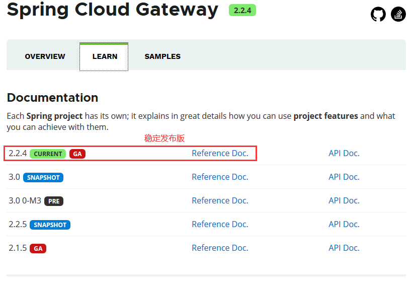

创建网关服务：

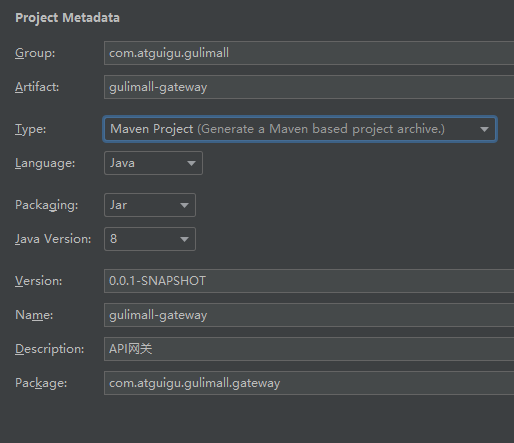

---

```
1、查看doc文档
https://docs.spring.io/spring-cloud-gateway/docs/2.2.4.RELEASE/reference/html/
中文文档：https://www.springcloud.cc/spring-cloud-greenwich.html#gateway-starter

2、三个概念
	路由：断言匹配了，就能路由到指定位置
	断言：根据HTTP请求头来匹配
	过滤：请求来 +返回 都要经过过滤
	
3、创建一个gulimall-gateway微服务，选中网关依赖
	给网关服务添加依赖:1、common【因为网关也需要Nacos注册发现，而注册发现的依赖是在common模块中】
	
4、将gateway的springboot版本改成一致的版本
5、将gateway的springcloud版本改成一致的版本

6、给gulimall的pom加上
	<module>gulimall-gateway</module>
	
7、1、在Application加上注解
	@EnableDiscoveryClient

8、配置注册中心的地址application.yml
server:
  port: 88
spring:
  cloud:
    nacos:
      discovery:
        server-addr: 127.0.0.1:8848
  application:
    name: gulimall-gateway

9、配置 配置中心的地址bootstrap.properties
spring.application.name=gulimall-coupon
spring.cloud.nacos.config.server-addr=127.0.0.1:8848

10、启动异常：Failed to configure a DataSource: 'url' attribute is not specified and no embedded datasource could be configured.
解决：方法1、移除mybatis相关依赖
	 方法2、移除DataSourceAutoConfiguration【加载Application类上】
		@SpringBootApplication(exclude = {DataSourceAutoConfiguration.class})

11、网关是用Netty而不是Tomcat做的，Netty具有非常高的网络性能

12、配置路由规则
server:
  port: 88
spring:
  cloud:
    nacos:
      discovery:
        server-addr: 127.0.0.1:8848
    gateway:
      routes:
      - id: test1_route
        uri: https://www.baidu.com
        predicates:
        - Query=url,baidu

      - id: test2_route
        uri: https://www.qq.com
        predicates:
        - Query=url,qq

      - id: product_route
        uri: lb://gulimall-product
        predicates:
        - Path=/api/product/**
        filters:
        - RewritePath=/api/(?<segment>.*),/$\{segment}

      - id: third_party_route
        uri: lb://gulimall-third-party
        predicates:
        - Path=/api/thirdparty/**
        filters:
        - RewritePath=/api/thirdparty/(?<segment>.*),/$\{segment}

      - id: admin_route
        uri: lb://renren-fast
        predicates:
        - Path=/api/**
        filters:
          - RewritePath=/api/(?<segment>.*),/renren-fast/$\{segment}


# 按照规则，url=baidu则转发到www.baidu.com；并且Query断言可以是正则表达式
# http://localhost:88/hello?url=qq 解析：1、按照规则转发到https://www.qq.com/hello
# filters 设置网关转发规则：带负载均衡的，路径匹配转发规则，重写路径去掉api，加上/renren-fast

##前端项目，/api
##http://LocaLhost:88/api/captcha.jpg                 http://Localhost:8080/renren-fast/captcha.jpg
##http://LocaLhost:88/api/product/category/list/tree  http://Localhost:10000/product/category/list/tree

  application:
    name: gulimall-gateway
```

# 四、前端部分

## 1、安装vue

```
准备工作：
1、安装文档。我们选用npm安装：https://cn.vuejs.org/v2/guide/installation.html#NPM
创建一个vue2文件夹
npm init -y【表示该项目是npm管理】

2、安装最新稳定版
npm install vue

3、创建index.html，引入vue.js
<script src="./node_modules/vue/dist/vue.js"></script>

4、在VS CODE中安装Vue 2 Snippets语法提示 插件

5、在浏览器中安装一个 vue工具包
Vue-Devtools.zip  解压，google浏览器 更多工具-》扩展程序-》开发者模式-》加载已解压的扩展程序
作用：检查vue实例的data数据
```

## 2、安装webpack模板

```
1、全局安装webpack【能把项目打包】
	npm install webpack -g
	细节：cmd右键取消快速编辑模式
	
2、安装vue脚手架【模块化项目】
	npm install -g @vue/cli-init【后面init 失败，选择下面一条语句成功】
	解决方法一：cnpm install -g vue-cli
	解决方法二：https://blog.csdn.net/zhumizhumi/article/details/89875666
		查找vue.cmd，将文件夹添加到环境变量Path中
		
3、vue脚手架初始化一个叫vue-demo以webpack为模板的应用
	vue init webpack vue-demo
```


# 五、安装nginx

```
1、调整虚拟机内存3G
2、调整虚拟机磁盘空间 free -m只剩100M了
3、随便启动一个nginx实例，只是为了复制出配置
	docker run -p 80:80 --name nginx -d nginx:1.10
4、在/mydata/创建nginx文件夹，执行语句拷贝配置文件到当前目录
	docker container cp nginx:/etc/nginx .【别忘了后面的点】
5、终止原容器:docker stop nginx
执行命令删除原容器:docker rm nginx
6、将nginx移入到控nginx文件夹内
	1）修改nginx名字为conf：mv nginx conf
	2）mkdir nginx
	3）mv conf nginx/
	
7、创建新的nginx;执行以下命令
docker run -p 80:80 --name nginx \
-v /mydata/nginx/html:/usr/share/nginx/html \
-v /mydata/nginx/logs:/var/log/nginx \
-v /mydata/nginx/conf:/etc/nginx \
-d nginx:1.10

8、测试：
在html文件夹下创建index.html
然后访问nginx
```

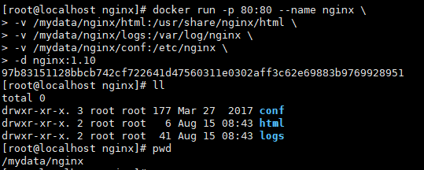

## 1、nginx配置文件

```
1、server块，先查看nginx.conf，会发现导入了include /etc/nginx/conf.d/*.conf;下的所有server块，
找到default.conf，里面就有server块的信息，所以可以创建多个server块，复制default.conf作为模板就可以了

会根据请求头的host值来反向代理，如果host=gulimall.com
则下面这个块会反向代理访问gulimall.com:80的请求，因为host带的是gulimall.com
访问：gulimall.com，默认转发到	/usr/share/nginx/html/index.html
server {
    listen       80;
    server_name  gulimall.com;

    location / {
        root   /usr/share/nginx/html;
        index  index.html index.htm;
    }
}

2、cp default.conf gulimall.conf
直接转发请求到商品服务，不采用
server {
    listen       80;
    server_name  gulimall.com;

    location / {
        proxy_pass http://192.168.56.1:10000;	#转发请求请求
    }
}

3、转发给带负载均衡的网关
采用
查看doc：http://nginx.org/en/docs/=》Using nginx as HTTP load balancer
demo：
http {
    upstream gulimall {			# 上游服务器
        server 192.168.56.1:88;
        server 192.168.56.1:89;
        server 192.168.56.1:90;
    }

    server {
        listen 80;
		server_name gulimall.com;
		
        location / {
            proxy_pass http://gulimall; # 转发到上游服务器
        }
    }
}

4、配置上游服务器：网关
配置nginx.conf
http {
    upstream gulimall {			# 上游服务器
        server 192.168.56.1:88;
    }
}
配置gulimall.conf
	server {
        listen 80;
        server_name gulimall.com; # 监听host = gulimall.com

        location / {
            proxy_pass http://gulimall; # 转发到上游服务器，对应nginx.conf的gulimall
        }
    }
    
```

doc： [Using nginx as HTTP load balancer](assetshttp://nginx.org/en/docs/http/load_balancing.html) 

```
server {
    listen       80;
    server_name  gulimall.com *.gulimall.com iua4i6.natappfree.cc;

    location /static {
        root   /usr/share/nginx/html;
    }

    location /payed/ {
        proxy_set_header Host order.gulimall.com;
        proxy_pass http://gulimall;
    } 

    location / {
	proxy_set_header Host $host;
	proxy_pass http://gulimall;
    }

    error_page   500 502 503 504  /50x.html;
    location = /50x.html {
        root   /usr/share/nginx/html;
    }
}

```

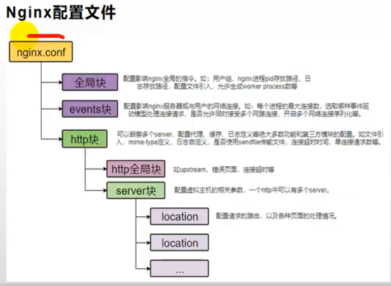


# 六、安装ES全文检索

## 1、安装es

```
1、下载镜像文件
docker pull elasticsearch:7.4.2
docker pull kibana:7.4.2【可视化界面】

2、创建目录，作为挂在目录
mkdir -p /mydata/elasticsearch/config
mkdir -p /mydata/elasticsearch/data

3、配置
将"http.host: 0.0.0.0"写入配置文件elasticsearch.yml：允许任何ip访问es【有一个空格】
echo "http.host: 0.0.0.0">> /mydata/elasticsearch/config/elasticsearch.yml
bug解决：https://www.cnblogs.com/asker009/p/10041689.html

4、启动
	1）容器名字，暴露两个端口。9200：HTTP请求，9300：分布式集群下各节点通信端口
	2）单节点运行
	3）指定内存，默认占用所有，要指定【32G】
	4）挂载 -v，可以直接在容器外部修改配置，装插件
	5）-d使用镜像: elasticsearch:7.4.2
docker run --name elasticsearch -p 9200:9200 -p9300:9300 \
-e "discovery.type=single-node" \
-e ES_JAVA_OPTS="-Xms64m -Xmx128m" \
-v /mydata/elasticsearch/config/elasticsearch.yml:/usr/share/elasticsearch/config/elasticsearch.yml \
-v /mydata/elasticsearch/data:/usr/share/elasticsearch/data \
-v /mydata/elasticsearch/plugins:/usr/share/elasticsearch/plugins \
-d elasticsearch:7.4.2

5、elasticsearch自动关闭
docker logs elasticsearch:查看日志【data文件夹权限不够】
docker logs cb8：查看日志，使用id查看
修改其他用户权限也是 rwx
解决：chmod -R 777 /mydata/elasticsearch/【-R递归修改任何组任何角色都是rwx】

6、自动启动
docker update elasticsearch --restart=always
```

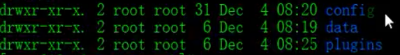

## 2、安装Kibana

```
1、创建容器关联镜像启动
docker run --name kibana -e ELASTICSEARCH_URL=http://192.168.56.10:9200 -p 5601:5601 \
-d kibana:7.4.2
【安装教程可以查看官网https://hub.docker.com/_/kibana?tab=description】
【docker文档：https://www.elastic.co/guide/en/kibana/current/docker.html】

2、不安装也可以，使用postman发送请求

3、访问localhost:5601
Kibana server is not ready yet

4、报错无法连接：
docker exec -it kibana /bin/bash
vi /usr/share/kibana/config/kbiana.yml【修改elasticsearch.host】
错误：坑爹把docker run打错了

5、docker update kibana --restart=always
```

## 3、安装ik分词器

```
1、不能使用默认 elasticsearch-plugin install xxx.zip
选择对应es版本安装：https://github.com/medcl/elasticsearch-analysis-ik/releases?after=v7.6.0
下载7.4.2
2、具体步骤
	1）docker exec -it elasticsearch /bin/bash【可以直接在外部挂载的文件夹下】
		cd /mydata/elasticsearch/plugins
	2）安装wget
		yum install wget
	3）wget https://github.com/medcl/elasticsearch-analysis-ik/releases/download/v7.4.2/elasticsearch-analysis-ik-7.4.2.zip
	4）创建ik文件夹，解压： unzip 
	5）rm -rf *.zip
	6）修改权限 chmod -R 777 ik/
	7）检查ik是否装好：docker exec -it elasticsearch /bin/bash
					cd /bin
	8）重启elasticsearch
```

右键+复制链接地址： [elasticsearch-analysis-ik-7.4.2.zip](assetshttps://github.com/medcl/elasticsearch-analysis-ik/releases/download/v7.4.2/elasticsearch-analysis-ik-7.4.2.zip)

 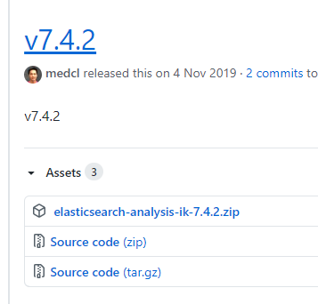

### 1）测试ik分词器

```
ik：两种分词器ik_smart，ik_max_word：最多的词组合

POST _analyze
{
  "analyzer": "ik_smart",
  "text": "我是中国人"
}

POST _analyze
{
  "analyzer": "ik_max_word",
  "text": "我是中国人"
}

```

### 2）自定义词库

修改/usr/share/elasticsearch/plugins/ik/config/中的lKAnalyzer.cfg.xml
/usr/share/elasticsearch/plugins/ik/config

```xml
自定义扩展词库【词库就是一个.txt】
1、指定一个远程词库
	发送请求到远程，返回
	<?xml version="1.0" encoding="UTF-8"?>
    <!DOCTYPE properties SYSTEM "http://java.sun.com/dtd/properties.dtd">
    <properties>
        <comment>IK Analyzer 扩展配置</comment>
        <!--用户可以在这里配置自己的扩展字典 -->
        <entry key="ext_dict"></entry>
         <!--用户可以在这里配置自己的扩展停止词字典-->
        <entry key="ext_stopwords"></entry>
        <!--用户可以在这里配置远程扩展字典 -->
        <!-- <entry key="remote_ext_dict">http://192.168.128.130/fenci/myword.txt</entry> -->
        <!--用户可以在这里配置远程扩展停止词字典-->
        <!-- <entry key="remote_ext_stopwords">words_location</entry> -->
    </properties>


2、使用Nginx，将词库放到Nginx中
	1）配合项目配置环境搭建文档搭建nginx，然后在一下路径创建fenci.txt
		/mydata/nginx/html/es/fenci.txt
		vi  fenci.txt  加入乔碧萝三个字测试
		
	2）vi /mydata/elasticsearch/plugins/ik/config/IKAnalyzer.cfg.xml
	<?xml version="1.0" encoding="UTF-8"?>
<!DOCTYPE properties SYSTEM "http://java.sun.com/dtd/properties.dtd">
<properties>
	<comment>IK Analyzer 扩展配置</comment>
	<!--用户可以在这里配置自己的扩展字典 -->
	<entry key="ext_dict"></entry>
	 <!--用户可以在这里配置自己的扩展停止词字典-->
	<entry key="ext_stopwords"></entry>
	<!--用户可以在这里配置远程扩展字典 -->
	<entry key="remote_ext_dict">http://192.168.56.10/es/fenci.txt</entry>
	<!--用户可以在这里配置远程扩展停止词字典-->
	<!-- <entry key="remote_ext_stopwords">words_location</entry> -->
</properties>
	3）docker restart elasticsearch
POST _analyze
{
  "analyzer": "ik_max_word",
  "text": "乔碧萝"
}

{
  "tokens" : [
    {
      "token" : "乔碧萝",
      "start_offset" : 0,
      "end_offset" : 3,
      "type" : "CN_WORD",
      "position" : 0
    }
  ]
}
```

### 3）给es重新分配内存

```
1、docker stop elasticsearch
2、docker rm elasticsearch
3、执行一个新的容器，分配512M内存
docker run --name elasticsearch -p 9200:9200 -p9300:9300 \
-e "discovery.type=single-node" \
-e ES_JAVA_OPTS="-Xms64m -Xmx512m" \
-v /mydata/elasticsearch/config/elasticsearch.yml:/usr/share/elasticsearch/config/elasticsearch.yml \
-v /mydata/elasticsearch/data:/usr/share/elasticsearch/data \
-v /mydata/elasticsearch/plugins:/usr/share/elasticsearch/plugins \
-d elasticsearch:7.4.2
```


# 七、模板引擎


